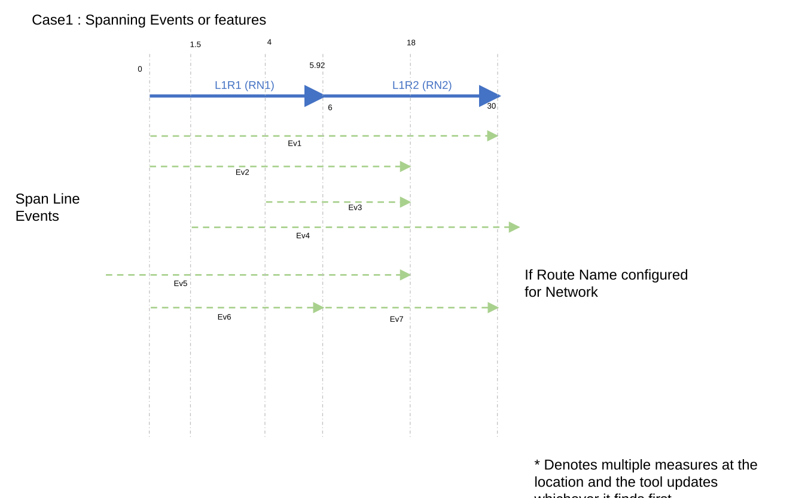
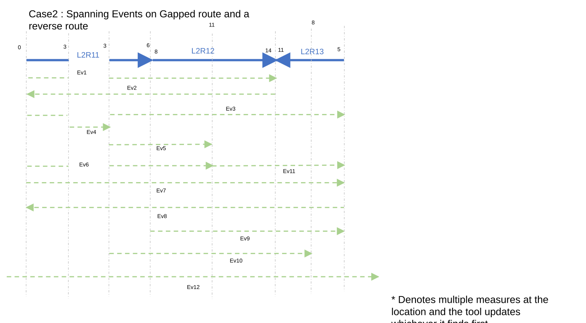
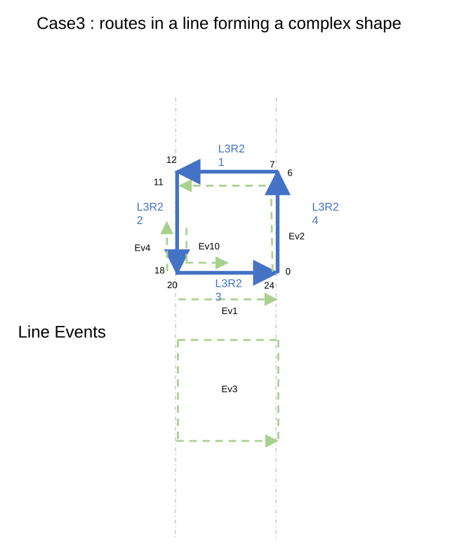
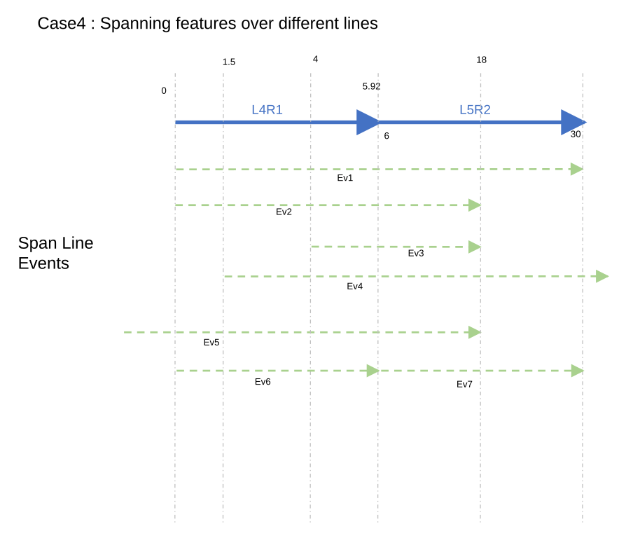
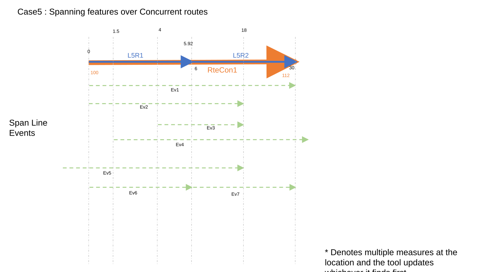
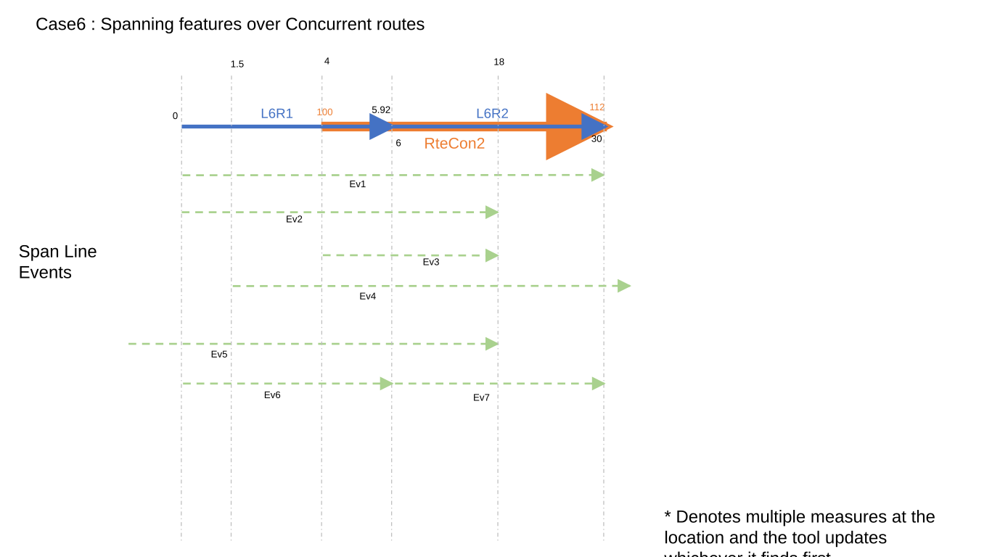
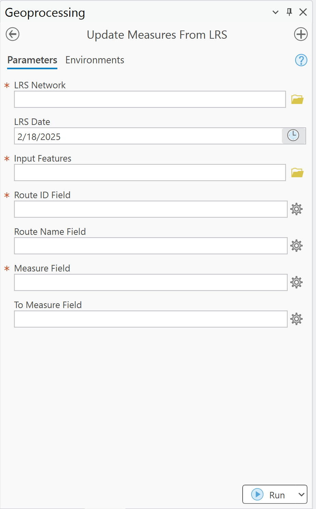

# Update Measures From LRS: Support Spanning Events Test Plan

| Field | Value |
| --- | --- |
| **Doc** | 230 · Test Plan · Pro |
| **Product** | Roads & Highways · Pipeline Referencing · Utility Network |
| **Release** | — |
| **Issues** | [ArcGISPro/ps-location-referencing#3881](https://devtopia.esri.com/ArcGISPro/ps-location-referencing/issues/3881) |
| **Source** | [UpdateMeasureFromLRS_SpanningEvents_TestPlanV1.pptx](<https://esriis.sharepoint.com/sites/LocationReferencing/Shared%20Documents/General/Test%20Plans/UpdateMeasureFromLRS_SpanningEvents_TestPlanV1.pptx>) · rev V1 |
| **People** | author Mac Christmas · PE — · dev — |
| **Edited** | 2025-02-18 19:39 by Praveen Kumar |
| **Extracted** | 2026-09-04 · lane xmlstrip · format 3.0 · prompt v2.0.2 |
| **Keywords** | spanning events · measure update · route · event · geoprocessing · lrs network · concurrent routes |
| **Tools** | Update Measures From LRS |

## Summary

Test plan for updating measures from LRS with support for spanning events. It includes positive and negative test cases covering overlapping events, concurrent routes, different LRS networks, and measure filtering based on LRS date. The document also details UI behavior and parameter validation for the geoprocessing tool.

## Related documents

<!-- related:begin -->
- [Update Measures From LRS: Support Events and Intersections](<https://esriis.sharepoint.com/sites/lrsworkspace/LRS Doc Index/Test Plans/3882-update-measures-from-lrs-support-events-and-intersections.md>) — shared issue ArcGISPro/ps-location-referencing#3881 · similar text 0.42 · 3 title words · 2 filename words · same kind/surface/folder <!-- rel:277 s=1006.779 -->
- [Support Events Spanning Routes in Update Measures from LRS](<https://esriis.sharepoint.com/sites/lrsworkspace/LRS Doc Index/User Stories/support-events-spanning-routes-in-update-measures-from-lrs.md>) — similar text 0.05 · 4 title words · 2 filename words · same surface <!-- rel:266 s=4.234 -->
- [Generate a Route Log Including Spanning Events and Centerline – Test Plan](<https://esriis.sharepoint.com/sites/lrsworkspace/LRS Doc Index/Test Plans/6240-generate-a-route-log-including-spanning-events.md>) — similar text 0.06 · 2 title words · 1 filename word · same kind/surface/folder <!-- rel:255 s=4.165 -->
- [Support Search Tolerance Parameter in Update Measures from LRS Tool – Test Plan](<https://esriis.sharepoint.com/sites/lrsworkspace/LRS Doc Index/Test Plans/4100-support-search-tolerance-parameter-in-update-measures.md>) — similar text 0.09 · 2 title words · same kind/surface/folder <!-- rel:229 s=3.873 -->
- [Append Events Date Optional Test Plan](<https://esriis.sharepoint.com/sites/lrsworkspace/LRS Doc Index/Test Plans/append-events-date-optional.md>) — similar text 0.04 · 1 title word · 1 filename word · same kind/surface/folder <!-- rel:126 s=3.513 -->
<!-- related:end -->

<!-- docs:begin -->
## Esri documentation

[Configure continuous measure networks and events to update with an engineering network](https://doc.esri.com/en/arcgis-pro/latest/help/production/location-referencing-pipelines/configure-continuous-measure-networks-and-events-to-update-with-an-engineering-network.html) · [LRS network](https://doc.esri.com/en/arcgis-pro/latest/help/production/location-referencing-pipelines/what-is-an-lrs-network.html)

_No page matched:_ [Update Measures From LRS](https://www.google.com/search?q=%22Update%20Measures%20From%20LRS%22+site%3Adoc.esri.com)
<!-- docs:end -->

---

## Test Cases

### TC-P01 — Provide LRS spanning Events as inputs to be updated <!-- src: S4 · slide 1 · Positive Tests · 1 -->

### TC-P02 — Test with overlapping Events <!-- src: S4 · slide 1 · Positive Tests · 2 -->

### TC-P03 — Test with events having loc error <!-- src: S4 · slide 1 · Positive Tests · 3 -->

### TC-P04 — Verify that the Events are filtered based on the TVD <!-- src: S4 · slide 1 · Positive Tests · 4 -->

- **Case:** Verify that the Events are filtered based on the TVD – LRS date in the GP tool will filter only the Network not the input features.

### TC-P05 — Test with Concurrent routes <!-- src: S4 · slide 1 · Positive Tests · 5 -->

### TC-P06 — Test with different LRS Networks with different measure units <!-- src: S4 · slide 1 · Positive Tests · 6 -->

### TC-P07 — Test in REST (few cases) <!-- src: S4 · slide 1 · Positive Tests · 7 -->

### TC-P08 — Verify that the To RouedID parameter does not show for point events <!-- src: S4 · slide 1 · Positive Tests · 8 -->

### TC-P09 — Verify that the To RouteID is placed after measure field in the UI <!-- src: S4 · slide 1 · Positive Tests · 9 -->

### TC-P10 — Verify that the To RouteName parameter is also shown when the network <!-- src: S4 · slide 1 · Positive Tests · 10 -->

- **Case:** Verify that the To RouteName parameter is also shown when the network is configured with routename

### TC-P11 — Verify that the correct measures are populated when the search tolerance <!-- src: S4 · slide 1 · Positive Tests · 11 -->

- **Case:** Verify that the correct measures are populated when the search tolerance is provided (only for spanning events)

### TC-N01 — To RouteID or To Route Name columns provided does not exist <!-- src: S4 · slide 2 · Negative Tests · 1 -->

### TC-N02 — Route is uncalibrated <!-- src: S4 · slide 2 · Negative Tests · 2 -->

### TC-N03 — LRS Date is not in range when routes exist <!-- src: S4 · slide 2 · Negative Tests · 3 -->

- **Case:** LRS Date is not in range when routes exist (one of the route in the line does not exist)

### TC-U01 — Spanning Events or features <!-- src: S2 · slide 3 · case 1 -->

| ID | RID | From M | To RID | To M |
| --- | --- | --- | --- | --- |
| Ev1 | L1R1 | 0 | L1R2 | 30 |
| Ev2 | L1R1 | 0 | L1R2 | 18 |
| Ev3 | L1R1 | 4 | L1R2 | 18 |
| Ev4 | L1R1 | 1.5 | L1R2 | 30 |
| Ev5 | L1R1 | 0 | L1R2 | 18 |
| Ev6* | L1R1 | 0 | L1R1 | 5.92 |
| Ev7* | L2R2 | 6 | L2R2 | 30 |

| ID | RID | Rte Name | From M | To RID | To Rte Name | To M |
| --- | --- | --- | --- | --- | --- | --- |
| Ev1 | L1R1 | RN1 | 0 | L2R2 | RN2 | 30 |
| Ev2 | L1R1 | RN1 | 0 | L2R2 | RN2 | 18 |
| Ev3 | L1R1 | RN1 | 4 | L2R2 | RN2 | 18 |
| Ev4 | L1R1 | RN1 | 1.5 | L2R2 | RN2 | 30 |
| Ev5 | L1R1 | RN1 | 0 | L2R2 | RN2 | 18 |
| Ev6* | L1R1 | RN1 | 0 | L1R1 | RN1 | 5.92 |
| Ev7* | L2R2 | RN2 | 6 | L2R2 | RN2 | 30 |

If Route Name configured for Network
- Denotes multiple measures at the location and the tool updates whichever it finds first

[figure: L1R1 (RN1) · L1R2 (RN2) · 0 · 30 · 6 · 5.92 · Ev1 · Ev2 · Ev3 · Ev4 · Ev5 · Span Line Events · Ev6 · 1.5 · 4 · 18 · Ev7]

### TC-U02 — Spanning Events on Gapped route and a reverse route <!-- src: S2 · slide 4 · case 2 -->

| ID | RID | From M | To RID | To M |
| --- | --- | --- | --- | --- |
| Ev1* | L2R11 | 0 | L2R12 | 14 |
| Ev2* | L2R12 | 14 | L2R11 | 0 |
| Ev3 | L2R11 | 0 | L2R13 | 5 |
| Ev4 | Null | Null | Null | Null |
| Ev5 | L2R11 | 3 | L2R12 | 11 |
| Ev6 | L2R11 | 0 | L2R12 | 11 |
| Ev7 | L2R11 | 0 | L2R13 | 5 |
| Ev8 | L2R13 | 5 | L2R11 | 0 |
| EV9* | L2R12 | 8 | L2R13 | 5 |
| Ev10 | L2R11 | 3 | L2R13 | 8 |
| Ev11 | L2R12 | 11 | L2R13 | 8 |
| Ev12 | L2R11 | 0 | L2R13 | 5 |

- Denotes multiple measures at the location and the tool updates whichever it finds first

[figure: L2R11 · 0 · 3 · Ev1 · Ev2 · Ev3 · Ev5 · Ev6 · 6 · 8 · 14 · Ev4 · Ev7 · L2R12 · L2R13 · 11 · 5 · Ev8 · Ev9 · Ev10 · Ev12 · Ev11]

### TC-U03 — routes in a line forming a complex shape <!-- src: S2 · slide 5 · case 3 -->

| ID | RID | From M | To RID | To M |
| --- | --- | --- | --- | --- |
| Ev1* | L3R23 | 20 | L3R23 | 24 |
| Ev2* | L3R24 | 0 | L3R21 | 12 |
| Ev3* | L3R21 | 0 | L3R21 | 24 |
| Ev4 | L3R22 | 18 | L3R22 | 15 |
| Ev10 | L3R22 | 15 | L3R23 | 22 |
|  |  |  |  |  |

[figure: L3R21 · 0 · 18 · Ev1 · Ev2 · Ev3 · Ev4 · Ev10 · 6 · 12 · 24 · Line Events · L3R23 · L3R24 · L3R22 · 7 · 11 · 20]

### TC-U04 — Spanning features over different lines <!-- src: S2 · slide 6 · case 4 -->

| ID | RID | From M | To RID | To M |
| --- | --- | --- | --- | --- |
| Ev1 | null | null | null | null |
| Ev2 | null | null | null | null |
| Ev3 | null | null | null | null |
| Ev4 | null | null | null | null |
| Ev5 | null | null | null | null |
| Ev6* | L4R1 | 0 | L4R1 | 5.92 |
| Ev7* | L5R2 | 6 | L5R2 | 30 |

[figure: L4R1 · L5R2 · 0 · 30 · 6 · 5.92 · Ev1 · Ev2 · Ev3 · Ev4 · Ev5 · Span Line Events · Ev6 · 1.5 · 4 · 18 · Ev7]

### TC-U05 — Spanning features over Concurrent routes (case 5) <!-- src: S2 · slide 7 · case 5 -->

| ID | RID | From M | To RID | To M |
| --- | --- | --- | --- | --- |
| Ev1* | RteCon1 | 100 | RteCon1 | 112 |
| Ev2* | RteCon1 | 100 | RteCon1 | 109 |
| Ev3* | RteCon1 | 104 | RteCon1 | 109 |
| Ev4* | RteCon1 | 101.5 | RteCon1 | 112 |
| Ev5* | RteCon1 | 100 | RteCon1 | 109 |
| Ev6* | RteCon1 | 100 | RteCon1 | 106 |
| Ev7* | RteCon1 | 106 | RteCon1 | 112 |

| ID | RID | From M | To RID | To M |
| --- | --- | --- | --- | --- |
| Ev1* | L5R1 | 0 | L5R2 | 30 |
| Ev2* | L5R1 | 0 | L5R2 | 18 |
| Ev3* | L5R1 | 4 | L5R2 | 18 |
| Ev4* | L5R1 | 1.5 | L5R2 | 30 |
| Ev5* | L5R1 | 0 | L5R2 | 18 |
| Ev6* | L5R1 | 0 | L5R1 | 5.92 |
| Ev7* | L5R2 | 6 | L5R2 | 30 |

- Denotes multiple measures at the location and the tool updates whichever it finds first

[figure: L5R1 · L5R2 · 112 · 30 · 6 · 5.92 · Ev1 · Ev2 · Ev3 · Ev4 · Ev5 · Span Line Events · Ev6 · 1.5 · 4 · 18 · Ev7 · RteCon1 · 100 · 0]

### TC-U06 — Spanning features over Concurrent routes (case 6) <!-- src: S2 · slide 8 · case 6 -->

| ID | RID | From M | To RID | To M |
| --- | --- | --- | --- | --- |
| Ev1 | L6R1 | 0 | L6R2 | 30 |
| Ev2 | L6R1 | 0 | L6R2 | 18 |
| Ev3* | RteCon2 | 100 | RteCon2 | 108 |
| Ev4* | L6R1 | 1.5 | L6R2 | 30 |
| Ev5* | L6R1 | 0 | L6R2 | 18 |
| Ev6* | L6R1 | 0 | L6R1 | 5.92 |
| Ev7* | RteCon2 | 103 | RteCon2 | 112 |

- Denotes multiple measures at the location and the tool updates whichever it finds first

[figure: L6R1 · L6R2 · 112 · 30 · 6 · 5.92 · Ev1 · Ev2 · Ev3 · Ev4 · Ev5 · Span Line Events · Ev6 · 1.5 · 4 · 18 · Ev7 · RteCon2 · 100 · 0]

## Other content

### Slide 1 — Update Measures From LRS: Support Spanning Events <!-- slide 1 -->

**Notes**
- Test with both UN, APR data (GCS) and RH data
- Test In Pro, Python inline, Python Stand alone and Model Builder
- Test with spanning events, non LRS features
- Test in FGDB, EGDB DC, and FS

Devtopia Issue

### Slide 2 — Tool at present <!-- slide 2 -->

GP UI:

1. Initial parameters when the tool is opened

  - LRS Network
  - LRS Date
  - Input Features
  - Route ID
  - Measure
  - Tolerance

2. After LRS Network is selected

  - Show Route Name if configured

3. After Input Features is selected

  - If a point event, no change
  - If a line event, show To Route ID, To Measure, and To Route Name (if configured)

### Slide 9 <!-- slide 9 -->
