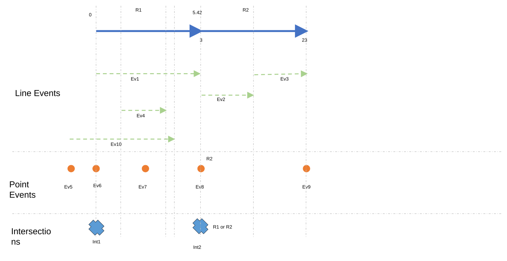
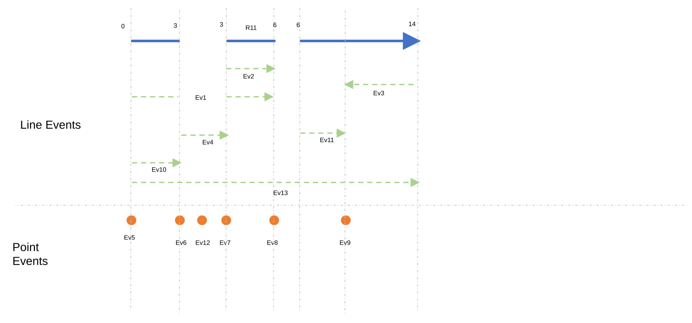
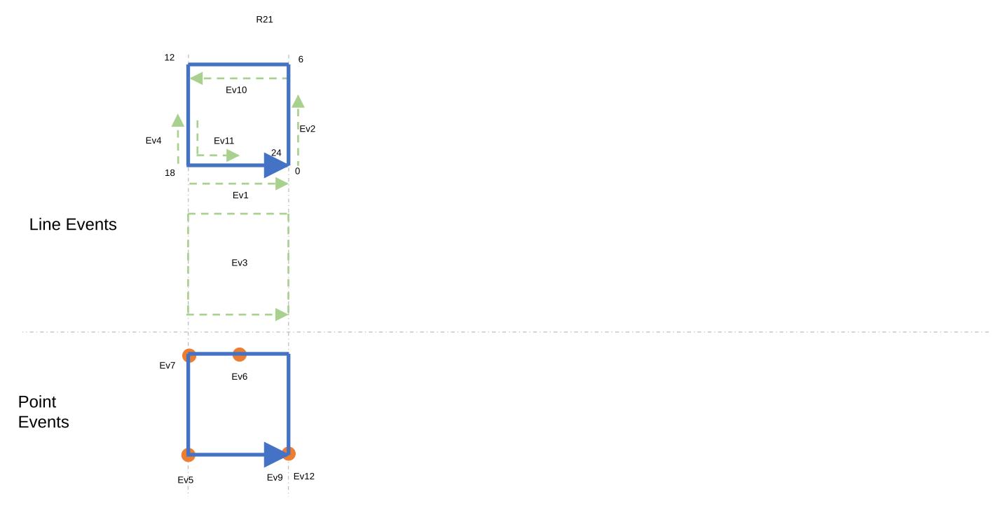
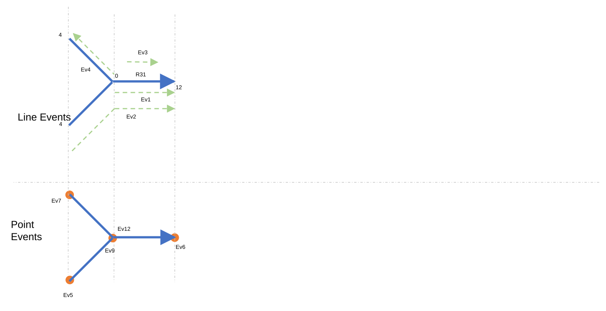

# Update Measures From LRS: Support Events and Intersections

| Field | Value |
| --- | --- |
| **Doc** | 277 · Test Plan · Pro |
| **Product** | Pipeline Referencing · Utility Network |
| **Release** | — |
| **Issues** | [ArcGISPro/ps-location-referencing#3882](https://devtopia.esri.com/ArcGISPro/ps-location-referencing/issues/3882) · [ArcGISPro/ps-location-referencing#3881](https://devtopia.esri.com/ArcGISPro/ps-location-referencing/issues/3881) |
| **Source** | [UpdateMeasureFromLRS_Events-Intersections_TestPlanV1.pptx](<https://esriis.sharepoint.com/sites/LocationReferencing/Shared%20Documents/General/Test%20Plans/UpdateMeasureFromLRS_Events-Intersections_TestPlanV1.pptx>) · rev V1 |
| **People** | author Mac Christmas · PE — · dev — |
| **Edited** | 2024-11-25 21:24 by Praveen Kumar |
| **Extracted** | 2026-09-04 · lane xmlstrip · format 3.0 · prompt v2.0.2 |
| **Keywords** | events · intersections · measure update · route · linear referencing |
| **Tools** | Update Measures from LRS |

## Summary

Test plan for the Update Measures from LRS tool focusing on support for events and intersections. Includes positive and negative test cases covering various scenarios such as overlapping events, concurrent routes, different LRS networks, and measure validation. Tests are conducted in multiple environments including Pro, Python, Model Builder, and various geodatabases.

## Related documents

<!-- related:begin -->
- [Update Measures From LRS: Support Spanning Events Test Plan](<https://esriis.sharepoint.com/sites/lrsworkspace/LRS%20Doc%20Index/Test%20Plans/3881-update-measures-from-lrs-support-spanning-events.md>) — shared issue ArcGISPro/ps-location-referencing#3881 · similar text 0.42 · 3 title words · 2 filename words · same kind/surface/folder <!-- rel:230 s=1006.381 -->
- [Support Search Tolerance Parameter in Update Measures from LRS Tool – Test Plan](<https://esriis.sharepoint.com/sites/lrsworkspace/LRS Doc Index/Test Plans/4100-support-search-tolerance-parameter-in-update-measures.md>) — similar text 0.10 · 2 title words · same kind/surface/folder <!-- rel:229 s=3.833 -->
- [Update Measures From LRS: Populate Route Name Test Plan](<https://esriis.sharepoint.com/sites/lrsworkspace/LRS Doc Index/Test Plans/3439-update-measures-from-lrs-populate-route-name.md>) — similar text 0.05 · 1 title word · 1 filename word · same kind/surface/folder <!-- rel:280 s=3.387 -->
- [Test Plan for REST Referent To Geometry in Linear Referencing](<https://esriis.sharepoint.com/sites/lrsworkspace/LRS%20Doc%20Index/Test%20Plans/for-rest-referent-to-geometry-in-lr.md>) — similar text 0.11 · same kind/surface/folder <!-- rel:588 s=3.027 -->
- [Event Replacement: Location Offset Method Test Plan](<https://esriis.sharepoint.com/sites/lrsworkspace/LRS Doc Index/Test Plans/4768-event-replacement-location-offset-method.md>) — similar text 0.08 · same kind/surface/folder <!-- rel:612 s=3.022 -->
<!-- related:end -->

<!-- docs:begin -->
## Esri documentation

[View LRS intersection properties](https://doc.esri.com/en/arcgis-pro/latest/help/production/location-referencing-pipelines/view-lrs-intersection-properties.html) · [Configure continuous measure networks and events to update with an engineering network](https://doc.esri.com/en/arcgis-pro/latest/help/production/location-referencing-pipelines/configure-continuous-measure-networks-and-events-to-update-with-an-engineering-network.html) · [Multiple linear referencing methods](https://doc.esri.com/en/arcgis-pro/latest/help/production/location-referencing-pipelines/multiple-linear-referencing-methods.html)

_No page matched:_ [Update Measures from LRS](https://www.google.com/search?q=%22Update%20Measures%20from%20LRS%22+site%3Adoc.esri.com)
<!-- docs:end -->

---

## Test Cases

### TC-P01 — Provide LRS Events and LRS Intersections as inputs to be updated <!-- src: S4 · slide 1 · Positive Tests: GP UI · 1 -->

- **Group:** GP UI

### TC-P02 — Test with overlapping Events <!-- src: S4 · slide 1 · Positive Tests: GP UI · 2 -->

- **Group:** GP UI

### TC-P03 — Test with events having loc error <!-- src: S4 · slide 1 · Positive Tests: GP UI · 3 -->

- **Group:** GP UI

### TC-P04 — Verify that the Events and Intersections are filtered based on the TVD <!-- src: S4 · slide 1 · Positive Tests: GP UI · 4 -->

- **Group:** GP UI

### TC-P05 — Test with Concurrent routes <!-- src: S4 · slide 1 · Positive Tests: GP UI · 5 -->

- **Group:** GP UI

### TC-P06 — Test with different LRS Networks with different measure units. <!-- src: S4 · slide 1 · Positive Tests: GP UI · 6 -->

- **Group:** GP UI

### TC-N01 — Measure columns provided do not exist <!-- src: S4 · slide 1 · Negative Tests · 1 -->

### TC-N02 — RouteID columns provided does not exist <!-- src: S4 · slide 1 · Negative Tests · 2 -->

### TC-N03 — Route is uncalibrated <!-- src: S4 · slide 1 · Negative Tests · 3 -->

### TC-N04 — LRS Date is not in range when routes exist <!-- src: S4 · slide 1 · Negative Tests · 4 -->

### TC-N05 — The measure fields are not DOUBLE <!-- src: S4 · slide 1 · Negative Tests · 5 -->

### TC-N06 — Provide routeID , measure(s), derived routeID <!-- src: S4 · slide 1 · Negative Tests · 6 -->

- **Case:** Provide routeID , measure(s), derived routeID , or derived measure(s) as the routeID , From Measure, or To Measure fields in the Update Measures from LRS tool

## Other content

### Slide 1 — Update Measures From LRS: Support Events and Intersections <!-- slide 1 -->

**Notes**
- Test with both UN and APR data
- Test In Pro, Python inline, Python Stand alone and Model Builder
- Test with non spanning events (spanning events are covered in #3881)
- Test in FGDB, EGDB DC, and FS

Devtopia Issue

### Slide 2 <!-- slide 2 -->

| ID | RouteID | From M | To M |
| --- | --- | --- | --- |
| Ev1 | R1 | 0 | 5.42 |
| Ev2 | R2 | 3 | 13 |
| Ev3 | R2 | 13 | 23 |
| Ev4 | R1 | 1.75 | 3.75 |
| Ev10 | Null | Null | Null |

| ID | RouteID | Measure |
| --- | --- | --- |
| Ev5 | Null | Null |
| Ev6 | R1 | 0 |
| Ev7 | R1 | 3 |
| Ev8* | R2 | 3 |
| Ev9 | R2 | 23 |

| ID | RouteID | Measure |
| --- | --- | --- |
| Int2* | R1 | 5.42 |
| Int1 | R1 | 0 |

[figure: R1 · R2 · 0 · 23 · 3 · 5.42 · Ev1 · Ev2 · Ev3 · Ev4 · Ev6 · Ev7 · Ev5 · Ev8 · Ev9 · Ev10 · Int2 · R1 or R2 · Line Events · Point Events · Intersections · Int1]

### Slide 3 <!-- slide 3 -->

| ID | RouteID | From M | To M |
| --- | --- | --- | --- |
| Ev1 | R11 | 0 | 6 |
| Ev2 | R11 | 3 | 6 |
| Ev3 | R11 | 14 | 9 |
| Ev4 | Null | Null | Null |
| Ev10 | R11 | 0 | 3 |
| Ev11 | R11 | 6 | 9 |
| Ev13 | Null | Null | Null |

| ID | RouteID | Measure |
| --- | --- | --- |
| Ev5 | R11 | 0 |
| Ev6 | R11 | 3 |
| Ev7 | R11 | 3 |
| Ev8 | R11 | 6 |
| Ev9 | R11 | 9 |
| Ev12 | Null | Null |

[figure: R11 · 0 · 3 · Ev1 · Ev2 · Ev3 · Ev4 · Ev6 · Ev7 · Ev5 · Ev8 · Ev9 · Ev10 · 6 · 14 · Ev11 · Ev12 · Line Events · Point Events · Ev13]

### Slide 4 <!-- slide 4 -->

| ID | RouteID | From M | To M |
| --- | --- | --- | --- |
| Ev1* | R21 | 18 | 24 |
| Ev2* | R21 | 0 | 4.5 |
| Ev3* | R21 | 0 | 24 |
| Ev4 | R21 | 18 | 15 |
| Ev10 | R21 | 6 | 12 |
| Ev11 | R21 | 15 | 21 |

| ID | RouteID | Measure |
| --- | --- | --- |
| Ev5 | R21 | 18 |
| Ev6 | R21 | 9 |
| Ev7 | R21 | 12 |
| Ev9* | R21 | 0 |
| Ev12* | R21 | 24 |

[figure: R21 · 0 · 18 · Ev1 · Ev2 · Ev3 · Ev4 · Ev6 · Ev7 · Ev5 · Ev9 · Ev10 · 6 · 12 · 24 · Ev12 · Line Events · Point Events · Ev11]

### Slide 5 <!-- slide 5 -->

| ID | RouteID | From M | To M |
| --- | --- | --- | --- |
| Ev1* | R31 | 8 | 12 |
| Ev2 | R31 | 4 | 12 |
| Ev3 | R31 | 9 | 11 |
| Ev4* | R31 | 0 | 4 |

| ID | RouteID | Measure |
| --- | --- | --- |
| Ev5 | R31 | 4 |
| Ev6 | R31 | 12 |
| Ev7 | R31 | 4 |
| Ev9* | R31 | 0 |
| Ev12* | R31 | 0 |

[figure: R31 · 0 · 12 · Ev1 · Ev2 · Ev4 · Ev6 · Ev7 · Ev5 · Ev9 · 4 · Ev12 · Line Events · Point Events · Ev3]

### Slide 6 <!-- slide 6 -->
