# Add Point Events by offsetting from other points – Test Plan

| Field | Value |
| --- | --- |
| **Doc** | 241 · Test Plan · Pro |
| **Product** | — |
| **Release** | — |
| **Issues** | [ArcGISPro/ps-location-referencing#3906](https://devtopia.esri.com/ArcGISPro/ps-location-referencing/issues/3906) |
| **Source** | [3906_AddPointEventsPointOffset_testplan.pptx](<https://esriis.sharepoint.com/sites/LocationReferencing/Shared%20Documents/General/Test%20Plans/3906_AddPointEventsPointOffset_testplan.pptx>) |
| **People** | author Claire Wang · PE Mac · dev Dan |
| **Edited** | 2025-01-21 23:45 by Claire Wang |
| **Extracted** | 2026-09-04 · lane xmlstrip · format 3.0 · prompt v2.0.2 |
| **Keywords** | point event · offset · referent field · route · point layer · intellisense · error condition |
| **Tools** | Add Point Events · Multiple Point Events |

## Summary

Test plan for the Add Point and Multiple Point Events tools enhancements to support offsetting from LRS Point events and other point features. Covers functionality verification of point layer selection, route and point location naming, offset parameters, referent fields, error conditions, positive and negative test cases, and automation updates.

## Related documents

<!-- related:begin -->
- [Add Line Events by offsetting from other points – Test Plan](<https://esriis.sharepoint.com/sites/lrsworkspace/LRS Doc Index/Test Plans/3913-add-line-events-by-offsetting-from-other-points.md>) — shared issue ArcGISPro/ps-location-referencing#3906 · similar text 0.66 · 5 title words · 4 filename words · same kind/surface/pe/dev/folder <!-- rel:231 s=1011.161 -->
- [Location Offset Method in Add Point and Add Line Widgets Test Plan](<https://esriis.sharepoint.com/sites/lrsworkspace/LRS%20Doc%20Index/Test%20Plans/24790-location-offset-method-in-add-point-and-add-line-widgets.md>) — similar text 0.58 · 2 title words · 2 filename words · same kind/folder <!-- rel:48 s=5.684 -->
- [Add Line Events Point Offset Method](<https://esriis.sharepoint.com/sites/lrsworkspace/LRS Doc Index/User Stories/add-line-events-point-offset-method.md>) — similar text 0.41 · 3 title words · 3 filename words · same surface <!-- rel:268 s=5.023 -->
- [Add Point Events by Location Offset](<https://esriis.sharepoint.com/sites/lrsworkspace/LRS Doc Index/Other/add-point-events-by-location-offset-rh.md>) — similar text 0.16 · 3 title words · 4 filename words · same surface <!-- rel:234 s=4.967 -->
- [Add Point Event Point Offset Method](<https://esriis.sharepoint.com/sites/lrsworkspace/LRS Doc Index/User Stories/add-point-event-point-offset-method.md>) — similar text 0.35 · 2 title words · 3 filename words · same surface <!-- rel:272 s=4.63 -->
<!-- related:end -->

<!-- docs:begin -->
## Esri documentation

[Storing referent and offset information for event location](https://doc.esri.com/en/arcgis-pro/latest/help/production/location-referencing-pipelines/storing-referent-and-offset-information-for-event-location.html)

_No page matched:_ [Add Point Events](https://www.google.com/search?q=%22Add%20Point%20Events%22+site%3Adoc.esri.com) · [Multiple Point Events](https://www.google.com/search?q=%22Multiple%20Point%20Events%22+site%3Adoc.esri.com)
<!-- docs:end -->

---

## Overview

### Slide 1 — Add Point Events by offsetting from other points – Test Plan <!-- slide 1 -->

https://devtopia.esri.com/ArcGISPro/ps-location-referencing/issues/3906

PE: Mac
Dev: Dan

Design changes and notes

### Slide 2 <!-- slide 2 -->

Functionality Verification – new parameter “Point Layer”

- In Add Point and Multiple Point Events tools, the existing Location Offset method now supports offsetting from LRS Point events registered to the same network and other point features (excluding calibration points)
- Change “Location” to “Point Layer”
  - The dropdown shows all the LRS Intersections, Point Events that are registered to the selected network, and other Point Feature Layers in the service with the LRS that is in the map
  - Organize the point layer drop down to three sections (Intersections, Point Events, other Point Features).  Make the titles of the sections italicized or different in some other way from the layers in the map to select, but unselectable
  - Point events from other networks cannot be used as offset location
New Error Conditions

- There is no qualified point layers in map, it means there is no point event
  - Show “Add a point event to the map.” in red banner, just like what we do in other method.

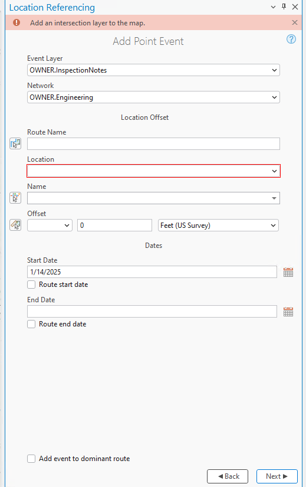
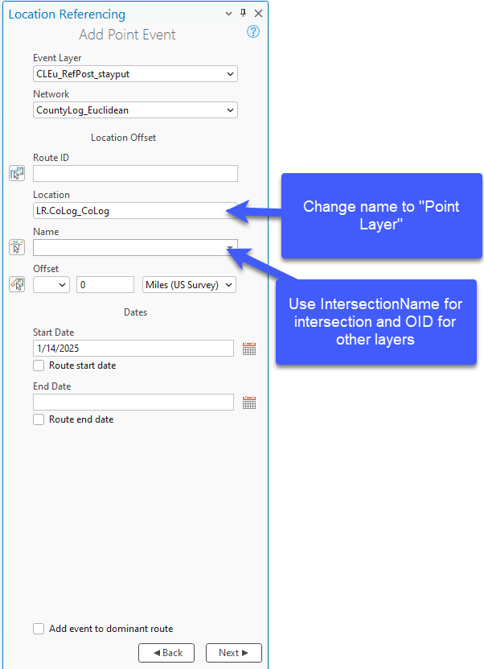

### Slide 3 <!-- slide 3 -->

Functionality Verification – Route, Point Location, and Name

- Name
  - User can type a name (Use Intersection Name if Point Layer is Intersection. Otherwise, use display field)
    - If the user types the feature name (either Intersection Name or display field that is NOT OID), continue to provide an intellisense experience
      - Fix intellisense limitation as a separate issue
      - If display field is OID, disable intellisense – just a text box
  - or use picker to select a point feature from map
    - Picker only selects qualified point features that are on the route. If not a qualified layer, or feature does not intersect the route, don’t select it (not an error)
    - Once the feature is selected, blink 3 times on the map but don’t keep it highlighted/selected on the map in any other way – find a way to make offset picker more usable, maybe by reducing the blink time
    - If there is more than one point feature at the clicked location, provide a select experience so the user chooses one of the features to use.
      - In the selector, still show intersection name for intersections, and show the display field + OID columns for other points if display field is not OID (show only OID column if display field is OID)
New Error Conditions

- Route must be provided before a Name of the point layer is provided
- When typing a Location Name, the feature must be from the specified point layer and intersect with the specific route. If not, show an error
- After a Location is provided, if user changes Route or Point Layer so the Location is no longer from the specified point layer or on the specified route, show an error
- If display field is OID (or anything), and the value length is not 2+ char, we should still support intellisense (e.g. OID is 1. after typing 1, intellisense doesn’t show any dropdown to choose from, but 1 should be accepted. Current limitation is that if value is under 3 char, value is not recognized. We should fix the limitation
- Expected intellisense behavior: continue to show options after putting in 2 characters. But if they put in 1 character, there is no intellisense option, but the feature is still recognized after losing focus

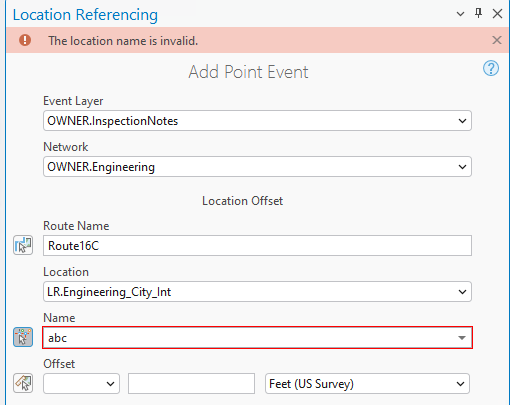

### Slide 4 — No new error conditions for Offset Parameters <!-- slide 4 -->

Functionality Verification – Offset parameters

- Offset parameters work the same as today
- Allow the user to type the distance (with or without direction) or use the picker to select it from the map
- Show the offset location(s) with the same markers for the tools today
- If no direction is selected, assume the measure is a positive offset from the feature location
- If a negative offset value is populated, treat that as a negative offset from the feature location
- If the user changes the unit of measure and there is already a measure populated, update the location of the marker on the map
- The user can type the offset value first even if the feature location hasn’t been selected (but can’t use the picker on the map).  Once the feature location is selected, show the marker on the map for the offset value location.
- If a route goes exactly in two cardinal directions (exactly N-S for example) and a user tries to use one of the other cardinal directions (E-W), then ignore the cardinal direction and default to the offset value to determine where to locate the event
- If a user selects a cardinal direction, don’t allow them to type a negative offset value
- For int at self-intersections, we use vertex M value. If the point location is a point feature, we use the smallest M at the self intersection.
- Continue to maintain existing validations for the Intersection feature class

### Slide 5 <!-- slide 5 -->

Functionality Verification – referent fields

- If the added event(s) layers have referent fields, we should populate the referents with the Method: Feature Class Name Offset, Location: OID of feature as it’s unique, and Offset: Offset value populated in the tool (note that the referent unit could be different and need to be converted from what was in the Add Event tool)
- If there feature class is not an LRS Event, it needs to be added to the dReferentMethod domain. If it’s not present, then we should default back to route/measure for the referents.
No new error conditions for referent fields

### Slide 6 <!-- slide 6 -->

Testing

- Test both Add Point and Multiple Points tools (mix and match test cases)
- FS testing only
- Test with a mix of intersection, LRS point events, and nonLRS point features being the Point Layer
- Test on a variety of network types (Line, NonLine with multifield RouteID, NonLine with singlefield RouteID, NonLine with autogenerated RouteID)
- Test with both Projected and unprojected data
- Test events on normal, gapped (with same and different calibration on the ends), and lollipops
- Test with and without direction
- Test with positive and negative offset values
- Test with different offset units
- Test with and without referent fields configured for the added point event(s)
  - Some events’ referent offset unit is different from the default unit
- Test when the nonLRS point layer is added to dReferentMethod domain vs. not
- 508/i18n testing
- Verify new error conditions/messages

### Slide 7 <!-- slide 7 -->

Automation

- Existing UI automation will break. Fix it.
- Add new UI automation cases for LRS point events and nonLRS point features being the Point Layer
- Add new cases into AddPointEventsLocationOffset_REST with LRS point events and nonLRS point features being the Point Layer
  - NonLRS point feature is added into domain vs. not (use Rt&M as referent)
Documentation

- Update the existing topic
- Make sure to mention that intersections, point events, and other point features are now supported
- PE and Kyle to determine best way to restructure the documentation

## Test Cases

### TC-P01 — Continuous – Single Field RID, 1 Point Event Without Referent Fields <!-- src: S1 · slide 8 · case -->

Continuous – auto-generated RID, point events have referent fields

- Add a point event using a positive offset from an intersection on a simple route
- Add multiple point events using a positive offset with direction from a point event on a gapped route (same measures on the ends)
- Add a point event using a negative offset with a different unit from a point feature that is not added to dReferentMethod domain on a lollipop route

- Add a point event using a negative offset from an intersection on a lollipop route (point event is at self intersection)
Continuous – multi-field RID, point events do not have referent fields

- Add a point event using a positive offset with direction and a different unit from a point event on a simple route
- Add multiple point events using a negative offset from a point feature on a gapped route (different measures on the ends)

### TC-P02 — 4 Networks <!-- src: S1 · slide 9 · case -->

Line – some point events have referent fields, some do not

- Add a point event with no referent fields using a negative offset from a point event on a simple route
- Add multiple point events (with and without referent fields) using a negative offset with a different unit from a point feature that is not added to dReferentMethod domain on a simple route
- Add a point event with referent fields using a positive offset with a direction and a different unit from a point event on a 3D multi-gapped route (different measures on the ends)
- Add multiple point events (with and without referent fields) using positive offset with direction from a point feature that is added to dReferentMethod domain on a multi-gapped route (different measures on the ends)

Cont_autoID: 3 Point Events w/ referent (unit is mi): Sign; Crash; MilePost
Cont_singlefield ID: 1 Point Event w/o referent: Friction
Cont_multifield ID: 2 Point Events w/o referent: Attenuator; Bridge
Line: 2 Point Events; ILINote has referent and unit is m; Anomaly does not

nonLRS Point Features:
Café: not added into dReferentMethod domain
Station: added into dReferentMethod domain

## Other content

### Slide 10 <!-- slide 10 -->

| EventID | RouteName | Measure | Referent Method | ReferentID | Referent Offset | From Date | ToDate | Sign Type |
| --- | --- | --- | --- | --- | --- | --- | --- | --- |
| Sign1 | R1 | 5 | C1_Intersection | {Int333- | 3 | 1/1/2000 |  | Stop Sign |

Continuous – auto-generated RID, point events have referent fields
1 - Add a point event using a positive offset from an intersection on a simple route

| RouteName | Point Layer Name | Offset |
| --- | --- | --- |
| R1 | R1 & Rx | 3 |

[figure: Sign · Input · Expected Result · R1]

### Slide 11 <!-- slide 11 -->

| EventID | RouteName | Measure | Referent Method | ReferentID | Referent Offset | From Date | ToDate | Sign Type |
| --- | --- | --- | --- | --- | --- | --- | --- | --- |
| Sign2 | R2 | 2 | MilePost | 801 | -5 | 1/1/2000 |  | Stop Sign |

Continuous – auto-generated RID, point events have referent fields
2 - Add multiple point events using a positive offset with direction from a point event on a gapped route (same measures on the ends)

| RouteName | Point Layer Name | Offset |
| --- | --- | --- |
| R2 | 801 ( MilePost ) | W 5 |

| EventID | RouteName | Measure | Referent Method | ReferentID | Referent Offset | From Date | ToDate | Severity |
| --- | --- | --- | --- | --- | --- | --- | --- | --- |
| Crash1 | R2 | 2 | MilePost | 801 | -5 | 1/1/2000 |  | Minor |

[figure: MilePost · Input · Expected Result · 0 · 10 · 5 · 2 · 7 · Sign Crash · R2]

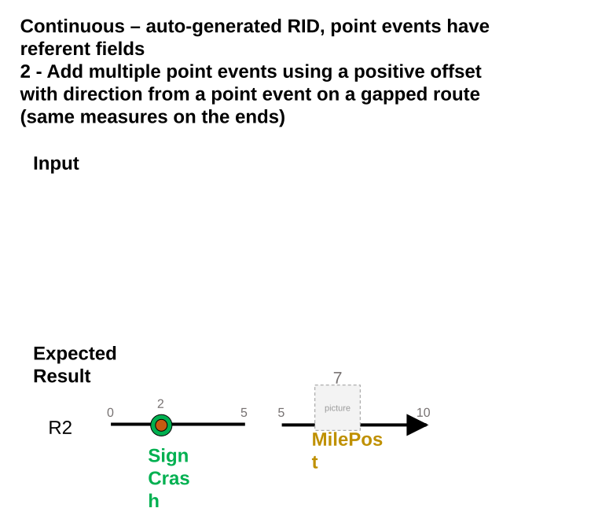

### Slide 12 <!-- slide 12 -->

Continuous – auto-generated RID, point events have referent fields
3 - Add a point event using a negative offset with a different unit from a point feature that is not added to dReferentMethod domain on a lollipop route

| RouteName | Point Layer Name | Offset |
| --- | --- | --- |
| R3 | 2 (Café) | -800 meters |

Point feature does not have M, so we use the smallest M at self intersection. In this test case, M is 2 (2,14).

| EventID | RouteName | Measure | Referent Method | ReferentID | Referent Offset | From Date | ToDate | Sign Type |
| --- | --- | --- | --- | --- | --- | --- | --- | --- |
| Sign3 | R3 | 1.502903 | C1 network | {R0003- | 1.502903 (mi) | 1/1/2000 |  | Stop Sign |

[figure: Input · Expected Result · 10 · 2 · Sign · R3 · 0 · 4 · 6 · 12 · 14 · Cafe]

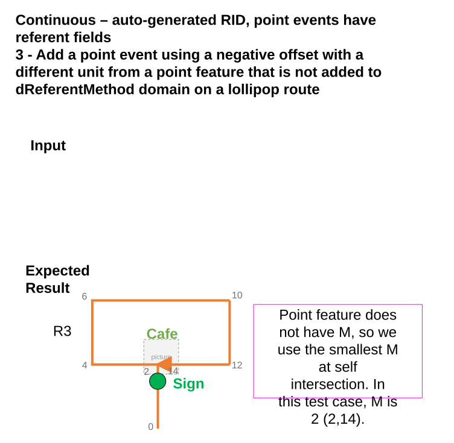

### Slide 13 <!-- slide 13 -->

Continuous - single field RID, 1 point event without referent fields
1 - Add a point event using a negative offset from an intersection on a lollipop route (point event is at self intersection)

| RouteID | Point Layer Name | Offset |
| --- | --- | --- |
| CS2 | CS2 & CS599 | -4 |

| EventID | RouteID | Measure | From Date | ToDate | Friction System |
| --- | --- | --- | --- | --- | --- |
| Friction2 | CS2 | 2 | 1/1/2000 |  | X |

[figure: Input · Expected Result · 10 · 2 · CS2 · 0 · 4 · 6 · 12 · 14 · Friction]

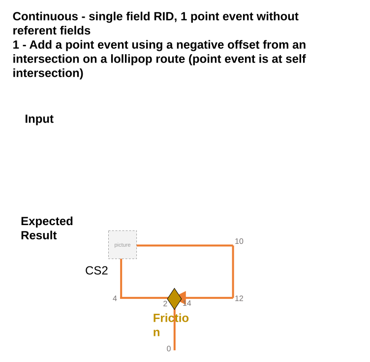

### Slide 14 <!-- slide 14 -->

| EventID | RouteID | Measure | From Date | ToDate | AttenuatorCode |
| --- | --- | --- | --- | --- | --- |
| Attenuator1 | CM00A | 4.485485 | 1/1/2000 |  | S1 |

Continuous – multi-field RID, point events do not have referent fields
1 - Add a point event using a positive offset with direction and a different unit from a point event on a simple route

| RouteID | Point Layer Name | Offset |
| --- | --- | --- |
| CM00A | 1093 (bridge) | N 4 km (there is no N, so it follows calibration direction) |

[figure: Input · Expected Result · CM00A · Bridge · Attenuator]

### Slide 15 <!-- slide 15 -->

Continuous - multi-field RID, point events do not have referent fields
2 - Add multiple point events using a negative offset from a point feature on a gapped route (different measures on the ends)

| EventID | RouteID | Measure | From Date | ToDate | AttenuatorCode |
| --- | --- | --- | --- | --- | --- |
| Attenuator2 | CM00B | 2 | 1/1/2000 |  | S1 |

| RouteID | Point Layer Name | Offset |
| --- | --- | --- |
| CM00B | 88 (Café) | -5 |

Use this case to sanity test a negative case: offset -1.95 but 5.05 is not on route

| EventID | RouteID | Measure | From Date | ToDate | NBI |
| --- | --- | --- | --- | --- | --- |
| Bridge1 | CM00B | 2 | 1/1/2000 |  | 96 |

[figure: Cafe · Input · Expected Result · 0 · 10 · 5 · 5.1 · 7 · CM00B · Bridge · Attenuator · 2]

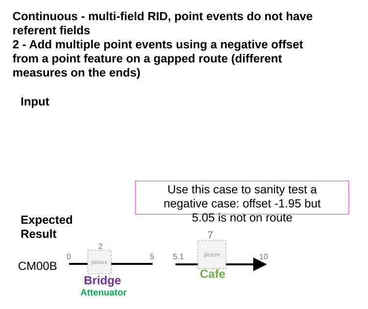

### Slide 16 <!-- slide 16 -->

| EventID | RouteName | Measure | From Date | ToDate | Anomaly |
| --- | --- | --- | --- | --- | --- |
| Anomaly1 | L1R1 | 3000 | 1/1/2000 |  | Crack |

Line – some point events have referent fields, some do not
1 - Add a point event with no referent fields using a negative offset from a point event on a simple route

| RouteName | Point Layer Name | Offset |
| --- | --- | --- |
| L1R1 | 1093 ( ILINote ) | -7000 |

[figure: Input · Expected Result · L1R1 · Anomaly · ILINote · L1R2 · 0 · 10000 · 5000]

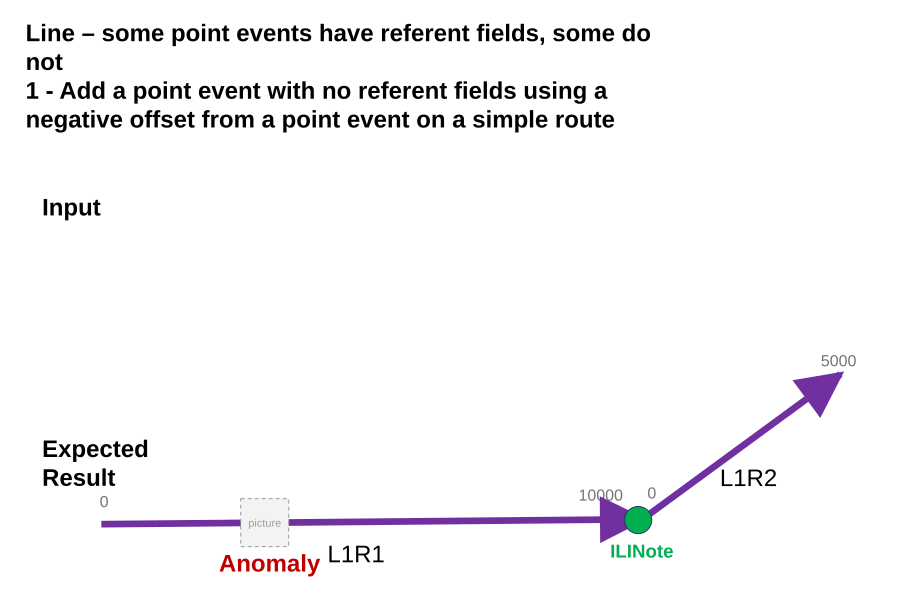

### Slide 17 <!-- slide 17 -->

| EventID | RouteName | Measure | From Date | ToDate | Anomaly |
| --- | --- | --- | --- | --- | --- |
| Anomaly2 | L2R1 | 3438.32 | 1/1/2000 |  | Crack |

Line – some point events have referent fields, some do not
2 - Add multiple point events (with and without referent fields) using a negative offset with a different unit from a point feature that is not added to dReferentMethod domain on a simple route

| RouteName | Point Layer Name | Offset |
| --- | --- | --- |
| L2R1 | 8 (Station) | -2km |

| EventID | RouteName | Measure | Referent Method | ReferentID | Referent Offset | From Date | ToDate | Note |
| --- | --- | --- | --- | --- | --- | --- | --- | --- |
| ILINote1 | L2R1 | 3438.32 | EngineeringNetwork | {L2R1- | 1047.999936 m | 1/1/2000 |  | abc |

[figure: Input · Expected Result · L2R1 · Anomaly · ILINote · L2R2 · 0 · 10000 · 5000 · Cafe]

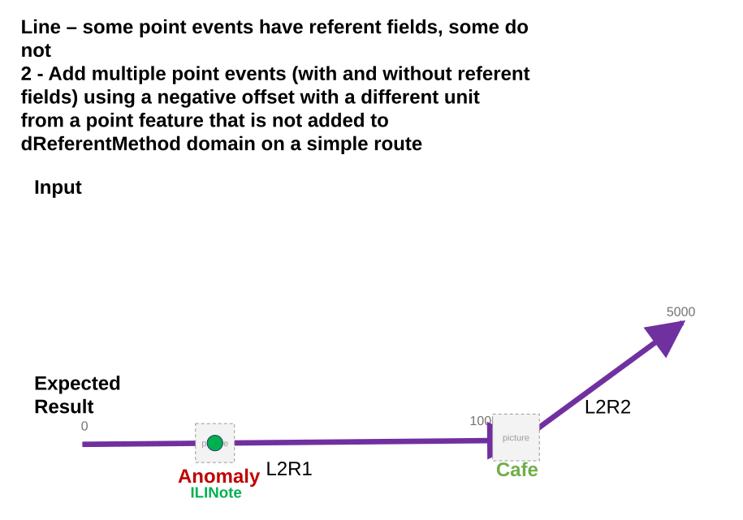

### Slide 18 <!-- slide 18 -->

Line – some point events have referent fields, some do not
3 - Add a point event with referent fields using a positive offset with a direction and a different unit from a point event on a 3D multi-gapped route (different measures on the ends)

| RouteName | Point Layer Name | Offset |
| --- | --- | --- |
| L3R1 | 1093 (anomaly) | E 1828.8m |

| EventID | RouteName | Measure | Referent Method | ReferentID | Referent Offset | From Date | ToDate | Note |
| --- | --- | --- | --- | --- | --- | --- | --- | --- |
| ILINote2 | L3R2 | 16000 | Anomaly | 1093 | 1828.8 m | 1/1/2000 |  | abc |

[figure: Input · Expected Result · Anomaly · L3R1 · L3R2 · 0 · 10000 · 5000 · 6000 · 11000 · 16000 · 12000 · 17000 · 22000 · 40000 · ILINote]

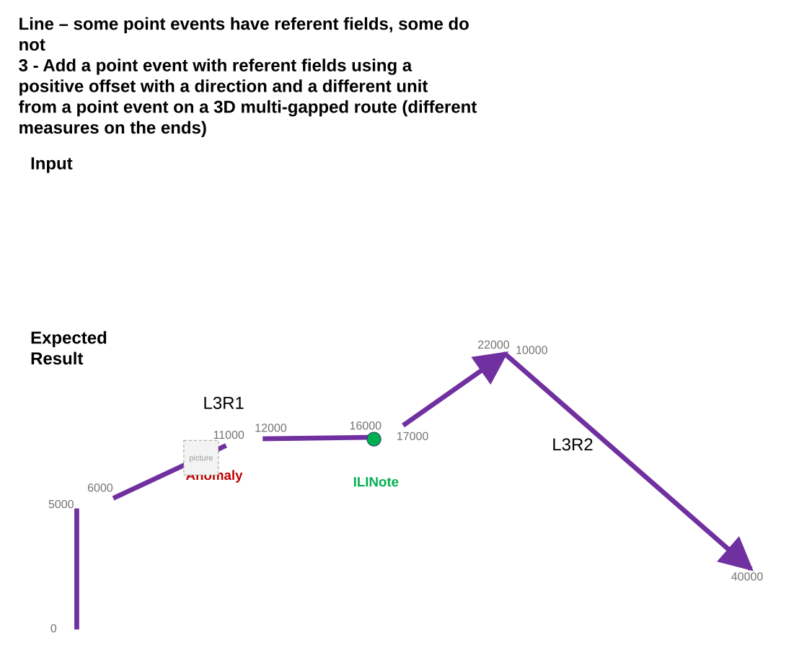

### Slide 19 <!-- slide 19 -->

Line – some point events have referent fields, some do not
4 - Add multiple point events (with and without referent fields) using positive offset with direction from a point feature that is added to dReferentMethod domain on a multi-gapped route (different measures on the ends)

| RouteName | Point Layer Name | Offset |
| --- | --- | --- |
| L4R1 | 3 (Station) | E 4000 |

| EventID | RouteName | Measure | From Date | ToDate | Anomaly |
| --- | --- | --- | --- | --- | --- |
| Anomaly3 | L4R1 | -1000 | 1/1/2000 |  | Crack |

| EventID | RouteName | Measure | Referent Method | ReferentID | Referent Offset | From Date | ToDate | Note |
| --- | --- | --- | --- | --- | --- | --- | --- | --- |
| ILINote3 | L4R1 | -1000 | Station | 3 | 1219.2 (m) | 1/1/2000 |  | abc |

[figure: Input · Expected Result · L4R1 · L4R2 · 10000 · -5000 · -3000 · -2000 · 1000 · 1500 · 2500 · 3000 · 5000 · Anomaly · ILINote · Station]

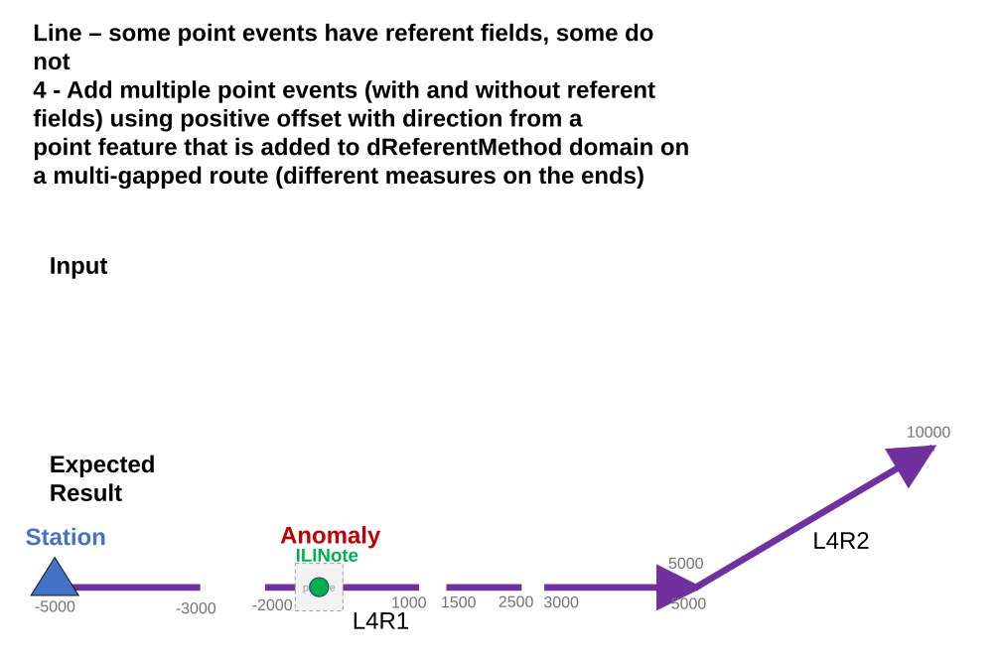

### Slide 20 <!-- slide 20 -->

Negative cases
New cases

- Route is not provided when user enters the point layer Name
  - Same error as now (Enter the Route Name/ID.) + red box
- Location Name does not exist in the specified Point Layer or is not intersecting the route
  - Same error as now (The location name is invalid.) +red box
- User changes Route or Point Layer after the location name is validated
  - Same error as now (The location name is invalid.) +red box
Sanity test existing cases
Route Name not found in the selected Network. Use a negative offset with direction. Offset value out of route measure range. Offset value invalid. Dates out of route date range.
