# Add Line Event Tools – Intersection Location Offset Method Test Plan

| Field | Value |
| --- | --- |
| **Doc** | 618 · Test Plan · Experience Builder |
| **Product** | — |
| **Release** | — |
| **Issues** | [ArcGISPro/ps-location-referencing#3910](https://devtopia.esri.com/ArcGISPro/ps-location-referencing/issues/3910) |
| **Source** | [3910-AddLineEventIntersectionOffsetMethod_TestPlan_V4.pptx](<https://esriis.sharepoint.com/sites/LocationReferencing/Shared%20Documents/General/Test%20Plans/3910-AddLineEventIntersectionOffsetMethod_TestPlan_V4.pptx>) · rev V4 |
| **People** | author Mac Christmas · PE — · dev — |
| **Edited** | 2022-11-17 19:29 by Mac Christmas |
| **Extracted** | 2026-09-04 · lane xmlstrip · format 3.0 · prompt v2.0.2 |
| **Keywords** | line event · intersection offset · location offset · offset method · route types · referents · positive tests · negative tests |
| **Tools** | Add single line event · Add multiple line events |

## Summary

Test plan for the Add Line Event tools focusing on the Intersection Location Offset Method. It includes positive and negative test cases across various route types and configurations, verifying UI behavior, attribute table results, and error handling. Tests cover line and non-line networks, projected and unprojected data, and scenarios with and without referents and cardinal directions.

## Related documents

<!-- related:begin -->
- [Event Replacement Referent Population for Line Events](<https://esriis.sharepoint.com/sites/lrsworkspace/LRS%20Doc%20Index/Test%20Plans/4681-event-replacement-referent-population-for-line-events.md>) — shared issue ArcGISPro/ps-location-referencing#3910 · similar text 0.16 · 2 title words · 1 filename word · same kind/folder <!-- rel:619 s=1003.36 -->
- [Add Event Intersection Offset Method](<https://esriis.sharepoint.com/sites/lrsworkspace/LRS Doc Index/User Stories/add-event-intersection-offset-method.md>) — similar text 0.18 · 5 title words · 5 filename words <!-- rel:679 s=6.959 -->
- [Location Offset Method in Add Point and Add Line Widgets Test Plan](<https://esriis.sharepoint.com/sites/lrsworkspace/LRS%20Doc%20Index/Test%20Plans/24790-location-offset-method-in-add-point-and-add-line-widgets.md>) — similar text 0.20 · 4 title words · 3 filename words · same kind/surface/folder <!-- rel:48 s=6.464 -->
- [Event Replacement: Location Offset Method Test Plan](<https://esriis.sharepoint.com/sites/lrsworkspace/LRS Doc Index/Test Plans/4768-event-replacement-location-offset-method.md>) — similar text 0.15 · 3 title words · 3 filename words · same kind/folder <!-- rel:612 s=6.418 -->
- [Add Line Events Point Offset Method](<https://esriis.sharepoint.com/sites/lrsworkspace/LRS Doc Index/User Stories/add-line-events-point-offset-method.md>) — similar text 0.17 · 4 title words · 5 filename words <!-- rel:268 s=5.76 -->
<!-- related:end -->

<!-- docs:begin -->
## Esri documentation

[Add multiple line events](https://doc.esri.com/en/arcgis-pro/latest/help/production/location-referencing-pipelines/add-multiple-line-events.html) · [Storing referent and offset information for event location](https://doc.esri.com/en/arcgis-pro/latest/help/production/location-referencing-pipelines/storing-referent-and-offset-information-for-event-location.html)

_No page matched:_ [Add single line event](https://www.google.com/search?q=%22Add%20single%20line%20event%22+site%3Adoc.esri.com)
<!-- docs:end -->

---

## Overview

### Slide 1 — Devtopia Issue <!-- slide 1 -->

Add Line Event Tools – Intersection Location Offset Method

**Notes**
- Test with both line event tools (Add single line event and add multiple line events)
- Test on Line and Non-line networks (Auto, Single, and Multiple field Route ID)
- FS only, no EGDB or FGDB
- Test with projected and unprojected data
- Method is only available when LRS intersections and at least one line event feature class are within the map
- Test with normal, gapped, and complex (loops, lollipops, alphas, branches, and vertical) route types
- Test with and without cardinal direction
- Test with and without referents configured
- 508 and i18n testing
- From/ToRefMethod will be “Intersections” for all cases
- For this test plan, most case's expected attribute table with referents configured for the event will have From/ToRefLocation of the labeled intersection within the graphic. Cases where the From/ToRefLocation are different will be noted in the expected attribute table.
- Intersection Offset has been renamed to Location Offset.

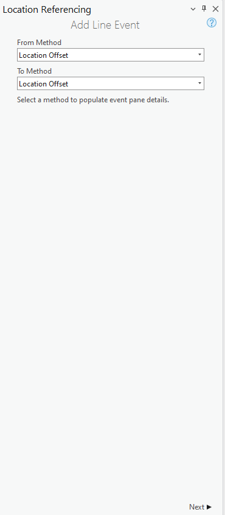
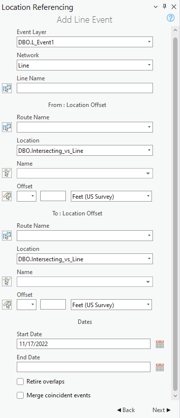

## Test Cases

### TC-P01 — Intersection is selected either through typing the Intersection Name or using <!-- src: S4 · slide 2 · Positive Tests: UI · 1 -->

- **Group:** UI
- **Case:** Intersection is selected either through typing the Intersection Name or using the picker

### TC-P02 — Once the intersection is selected, blink it 3 times on the map <!-- src: S4 · slide 2 · Positive Tests: UI · 2 -->

- **Group:** UI

### TC-P03 — If more than one intersection exists at the same location on the same route <!-- src: S4 · slide 2 · Positive Tests: UI · 3 -->

- **Group:** UI
- **Case:** If more than one intersection exists at the same location on the same route, show modal window with possible intersections to select

### TC-P04 — If no direction is selected, the measure is a positive offset <!-- src: S4 · slide 2 · Positive Tests: UI · 4 -->

- **Group:** UI

### TC-P05 — If no direction is selected, a negative measure will be a negative offset <!-- src: S4 · slide 2 · Positive Tests: UI · 5 -->

- **Group:** UI

### TC-P06 — If a route goes exactly in two cardinal directions (1) <!-- src: S4 · slide 2 · Positive Tests: UI · 6 -->

- **Group:** UI
- **Case:** If a route goes exactly in two cardinal directions (exactly N-S for example) and a user tries to use one of the other cardinal directions (E-W), then the cardinal direction will be ignored

### TC-P07 — If unit of measure is changed after a measure is populated <!-- src: S4 · slide 2 · Positive Tests: UI · 7 -->

- **Group:** UI
- **Case:** If unit of measure is changed after a measure is populated, update the location marker on the map

### TC-P08 — If an event is configured with referent info fields <!-- src: S4 · slide 2 · Positive Tests: UI · 8 -->

- **Group:** UI
- **Case:** If an event is configured with referent info fields, then populate the referent fields with RefMethod: Intersections, RefLocation: IntersectionID , and RefOffset: measure values populated in tool

### TC-P09 — Selecting offset from map will reset direction drop-down. <!-- src: S4 · slide 2 · Positive Tests: UI · 9 -->

- **Group:** UI

### TC-P10 — Reset second pane if user selects a different From or To Method <!-- src: S4 · slide 2 · Positive Tests: UI · 10 -->

- **Group:** UI

### TC-P11 — User moves to 3rd pane, fill out the attributes and hits back <!-- src: S4 · slide 2 · Positive Tests: UI · 11 -->

- **Group:** UI
- **Case:** User moves to 3rd pane, fill out the attributes and hits back , markers on map + any information on (2nd, 3rd ) panes should remain intact

### TC-P12 — Add a drop-down above the location name to include intersection offset layers <!-- src: S4 · slide 2 · Positive Tests: UI · 12 -->

- **Group:** UI
- **Case:** Add a drop-down above the location name to include intersection offset layers and label it "Location"

### TC-P13 — If there exists only one intersection offset layer in the map <!-- src: S4 · slide 2 · Positive Tests: UI · 13 -->

- **Group:** UI
- **Case:** If there exists only one intersection offset layer in the map, select that layer automatically.

### TC-P14 — Show only the intersection offset layers that are present in the TOC. <!-- src: S4 · slide 2 · Positive Tests: UI · 14 -->

- **Group:** UI

### TC-P15 — If the form is filled up and the intersection offset layer is removed from <!-- src: S4 · slide 2 · Positive Tests: UI · 15 -->

- **Group:** UI
- **Case:** If the form is filled up and the intersection offset layer is removed from the TOC, then reset the layer name, ID and offset value.

### TC-P16 — Show intersection layers for the selected network. <!-- src: S4 · slide 2 · Positive Tests: UI · 16 -->

- **Group:** UI

### TC-P17 — The intersection name displayed in the UI should be based on the selected route <!-- src: S4 · slide 2 · Positive Tests: UI · 17 -->

- **Group:** UI
- **Case:** The intersection name displayed in the UI should be based on the selected route and its From date

### TC-P18 — Simple route, single line event with positive offset <!-- src: S4 · slide 2 · Positive Tests · 1 -->

### TC-P19 — Simple route, multiple line events with negative offsets <!-- src: S4 · slide 2 · Positive Tests · 2 -->

### TC-P20 — Simple route, single line event with positive offset to West <!-- src: S4 · slide 2 · Positive Tests · 3 -->

### TC-P21 — Simple singlefield ID route not pointing in an exact cardinal direction <!-- src: S4 · slide 2 · Positive Tests · 4 -->

- **Case:** Simple singlefield ID route not pointing in an exact cardinal direction, single line event with positive offset to East

### TC-P22 — Simple route, single line event with positive offset to North <!-- src: S4 · slide 2 · Positive Tests · 5 -->

### TC-P23 — Simple bending multifield ID route <!-- src: S4 · slide 2 · Positive Tests · 6 -->

- **Case:** Simple bending multifield ID route, single line event with positive offset to North

### TC-P24 — Gapped route with continuous measures <!-- src: S4 · slide 2 · Positive Tests · 7 -->

- **Case:** Gapped route with continuous measures, single line event with positive offset to East

### TC-P25 — Gapped singlefield ID route with continuous measures <!-- src: S4 · slide 2 · Positive Tests · 8 -->

- **Case:** Gapped singlefield ID route with continuous measures, single line event with positive offset located on gap ends.

### TC-P26 — Looped multifield ID route, multiple line events with positive offsets <!-- src: S4 · slide 2 · Positive Tests · 9 -->

### TC-P27 — Looped route, single line event with positive offset to East <!-- src: S4 · slide 2 · Positive Tests · 10 -->

### TC-P28 — Lollipop route, multiple line events with positive offsets <!-- src: S4 · slide 2 · Positive Tests · 11 -->

### TC-P29 — Lollipop route, single line event with positive offset to North <!-- src: S4 · slide 3 · Positive Tests · 1 -->

### TC-P30 — Lollipop singlefield ID route, single line event with positive offset to North <!-- src: S4 · slide 3 · Positive Tests · 2 -->

### TC-P31 — Alpha line route, multiple LE’s with negative offsets <!-- src: S4 · slide 3 · Positive Tests · 3 -->

### TC-P32 — Alpha route, single line event with positive offset to North <!-- src: S4 · slide 3 · Positive Tests · 4 -->

### TC-P33 — Alpha route, multiple line events with positive offsets <!-- src: S4 · slide 3 · Positive Tests · 5 -->

### TC-P34 — 17A. Branch route with different end measures <!-- src: S4 · slide 3 · Positive Tests · 6 -->

- **Case:** 17A. Branch route with different end measures, single line event with positive offset

### TC-P35 — 17B. Branch route with different end measures <!-- src: S4 · slide 3 · Positive Tests · 7 -->

- **Case:** 17B. Branch route with different end measures, single line event with positive offset on lesser measure branch

### TC-P36 — Branch multifield ID route with different end measures <!-- src: S4 · slide 3 · Positive Tests · 8 -->

- **Case:** Branch multifield ID route with different end measures, multiple line events with positive offset to North

### TC-P37 — Vertical route with no cardinal direction (1) <!-- src: S4 · slide 3 · Positive Tests · 9 -->

- **Case:** Vertical route with no cardinal direction, single line event with positive offset

### TC-P38 — Vertical route with no cardinal direction (2) <!-- src: S4 · slide 3 · Positive Tests · 10 -->

- **Case:** Vertical route with no cardinal direction, single line event with positive offset to North

### TC-P39 — Vertical route with 90º bends, multiple line events with negative offsets <!-- src: S4 · slide 3 · Positive Tests · 11 -->

### TC-P40 — Simple route, different intersections used for Form/To Location <!-- src: S4 · slide 3 · Positive Tests · 12 -->

- **Case:** Simple route, different intersections used for Form/To Location, single line event with positive offset

### TC-P41 — Simple route, From Measure is Route and Measure Method <!-- src: S4 · slide 3 · Positive Tests · 13 -->

- **Case:** Simple route, From Measure is Route and Measure Method, To Measure is positive Intersection Offset Method.

### TC-P42 — Simple line route, single spanning line event with different intersections <!-- src: S4 · slide 3 · Positive Tests · 14 -->

### TC-N01 — Simple route, single line event with positive offset that exceeds the route’s <!-- src: S4 · slide 3 · Negative Tests · 1 -->

- **Case:** Simple route, single line event with positive offset that exceeds the route’s end measure

### TC-N02 — Simple route, single line event with negative offset to West <!-- src: S4 · slide 3 · Negative Tests · 2 -->

### TC-N03 — Loop route, multiple line events with positive offset that exceeds the route’s <!-- src: S4 · slide 3 · Negative Tests · 3 -->

- **Case:** Loop route, multiple line events with positive offset that exceeds the route’s end measure

### TC-N04 — Lollipop route, single line event with negative offset that exceeds the route’s <!-- src: S4 · slide 3 · Negative Tests · 4 -->

- **Case:** Lollipop route, single line event with negative offset that exceeds the route’s start measure

### TC-N05 — Alpha route, multiple line events with negative offset that exceeds the route’s <!-- src: S4 · slide 3 · Negative Tests · 5 -->

- **Case:** Alpha route, multiple line events with negative offset that exceeds the route’s start measure

### TC-N06 — Vertical route, single line event with a positive offset to East that exceeds <!-- src: S4 · slide 3 · Negative Tests · 6 -->

- **Case:** Vertical route, single line event with a positive offset to East that exceeds the route’s end measure

### TC-N07 — Gapped route, multiple line events with negative offset that fall within the gap <!-- src: S4 · slide 3 · Negative Tests · 7 -->

### TC-N08 — Gapped route, non-numeric offset measure value provided <!-- src: S4 · slide 3 · Negative Tests · 8 -->

### TC-N09 — Simple line route, single spanning event with invalid measures <!-- src: S4 · slide 3 · Negative Tests · 9 -->

### TC-N10 — If a route goes exactly in two cardinal directions (2) <!-- src: S4 · slide 3 · Negative Tests · 10 -->

- **Case:** If a route goes exactly in two cardinal directions (exactly N-S for example) and a user tries to use one of the other cardinal directions (E-W), display an error message "Direction not located on route"

### TC-P43 — Simple Route single line event with positive offset <!-- src: S2 · slide 4 · case 1 -->

**Input**
- Expected Result
- Expected Attribute Table
- with referent

| RouteID | From Location | To Location | From Offset | To Offset |
| --- | --- | --- | --- | --- |
| R1 | Int1 | Int1 | 3 | 6 |

| LEID | RouteID | From Measure | To Measure | FromRefOffset | ToRefOffset | From Date | To Date | ExtraAttribute |
| --- | --- | --- | --- | --- | --- | --- | --- | --- |
| LE1 | R1 | 5 | 8 | 3 | 6 | 1/1/2000 |  | Paved |

Int1

### TC-N11 — Simple Route - multifield multiple LEs with negative offset <!-- src: S2 · slide 5 · case 2 -->

**Input**
- Expected Result
- Expected Attribute Table
- without referent

| RouteID | From Location | To Location | From Offset | To Offset |
| --- | --- | --- | --- | --- |
| RM1 | Int2 | Int2 | -5 | -3 |

| LEID | RouteID | FromMeasure | ToMeasure | FromDate | ToDate | ExtraAttribute |
| --- | --- | --- | --- | --- | --- | --- |
| LEM1 | RM1 | 3 | 5 | 1/1/2000 |  | Paved |
| LEM2 | RM1 | 3 | 5 | 1/1/2000 |  | Gravel |

Int2
LEM1
LEM2

RM1

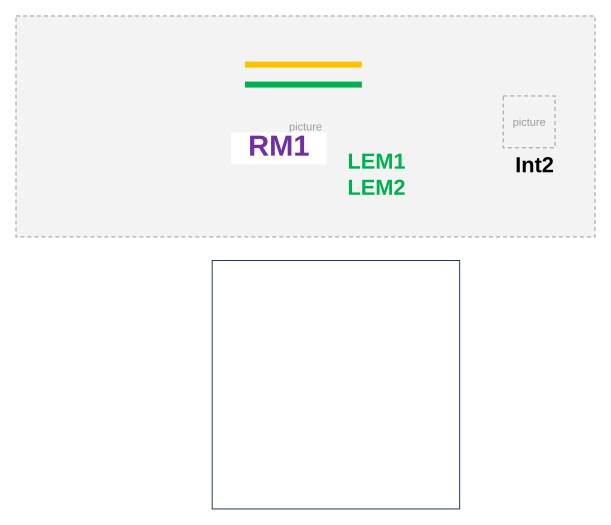

### TC-P44 — Simple Route - line single LE with positive offset to W <!-- src: S2 · slide 6 · case 3 -->

**Input**
- Expected Result
- Expected Attribute Table
- with referent

| LineID | From Location | To Location | From Offset | To Offset |
| --- | --- | --- | --- | --- |
| L1 | Int2 | Int2 | W 3 | W 1 |

| LEID | RouteID | From Measure | To Measure | FromRefOffset | ToRef Offset | From Date | ToDate | ExtraAttribute |
| --- | --- | --- | --- | --- | --- | --- | --- | --- |
| LEM1 | R1L1 | 1 | 3 | 3 | 1 | 1/1/2000 |  | Sign3 |

Int3
LEM1

### TC-P45 — Simple Route - singlefield route not exactly in cardinal direction <!-- src: S2 · slide 7 · case 4 -->

- **Case:** Simple Route - singlefield route not exactly in cardinal direction, single LE with positive offset to E

**Input**
- Expected Result
- Expected Attribute Table
- without referent

| RouteID | From Location | To Location | From Offset | To Offset |
| --- | --- | --- | --- | --- |
| RS1 | Int4 | Int4 | E 3 | E 5 |

| LEID | RouteID | From Measure | To Measure | FromDate | ToDate | ExtraAttribute |
| --- | --- | --- | --- | --- | --- | --- |
| LES1 | RS1 | 7 | 9 | 1/1/2000 |  | Paved |

Int4
LES1
RS1

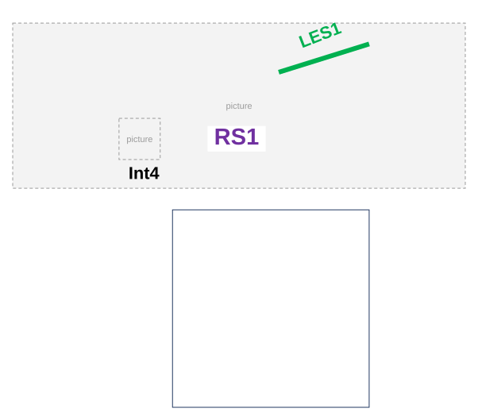

### TC-P46 — Simple Route single LE with positive offset to N <!-- src: S2 · slide 8 · case 5 -->

**Input**
- Expected Result
- Expected Attribute Table
- with referent

| RouteID | From Location | To Location | From Offset | To Offset |
| --- | --- | --- | --- | --- |
| R5 | Int5 | Int5 | N 1 | N 3 |

| LEID | RouteID | From Measure | To Measure | FromRefOffset | ToRefOffset | From Date | ToDate | ExtraAttribute |
| --- | --- | --- | --- | --- | --- | --- | --- | --- |
| LE5 | R5 | 5 | 7 | 1 | 3 | 1/1/2000 |  | Gravel |

Int5
R5
LE5

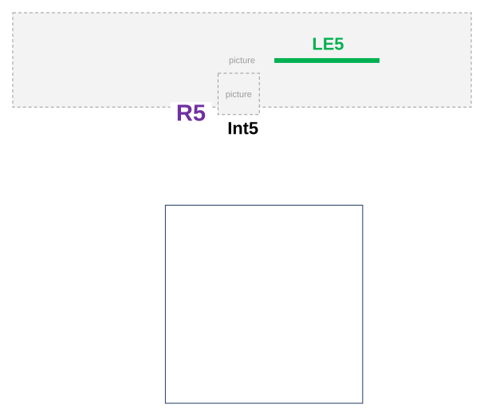

### TC-P47 — Simple Route - multif route bending, single LE with positive offset to N <!-- src: S2 · slide 9 · case 6 -->

**Input**
- Expected Result
- Expected Attribute Table
- without referent

| RouteID | From Location | To Location | From Offset | To Offset |
| --- | --- | --- | --- | --- |
| RM2 | Int6 | Int6 | N 4 | N 1 |

| LEID | RouteID | From Measure | To Measure | FromDate | ToDate | ExtraAttribute |
| --- | --- | --- | --- | --- | --- | --- |
| LEM2 | RM2 | 2 | 5 | 1/1/2000 |  | Dirt |

RM2
Int6
LEM2

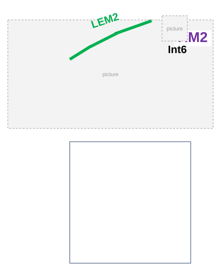

### TC-P48 — Gapped Route continuous measures, single LE with positive offset to E <!-- src: S2 · slide 10 · case 7 -->

**Input**
- Expected Result
- Expected Attribute Table
- with referent

| RouteID | From Location | To Location | From Offset | To Offset |
| --- | --- | --- | --- | --- |
| R7L3 | Int7 | Int7 | E 3 | E 6 |

| LEID | RouteID | From Measure | To Measure | FromRefOffset | ToRefOffset | From Date | To Date | ExtraAttribute |
| --- | --- | --- | --- | --- | --- | --- | --- | --- |
| LE2 | R7L3 | 7 | 10 | 3 | 6 | 1/1/2000 |  | Paved |

Int7
LE2

### TC-P49 — Gapped Route - singlef continuous measures <!-- src: S2 · slide 11 · case 8 -->

- **Case:** Gapped Route - singlef continuous measures, single LE with positive offset located on gap ends

**Input**
- Expected Result
- Expected Attribute Table
- without referent

| RouteID | From Location | To Location | From Offset | To Offset |
| --- | --- | --- | --- | --- |
| RS2 | Int8 | Int8 | 3 | 6 |

| LEID | RouteID | From Measure | To Measure | FromDate | ToDate | ExtraAttribute |
| --- | --- | --- | --- | --- | --- | --- |
| LES2 | RS2 | 6 | 9 | 1/1/2000 |  | Paved |

[figure: RS2 · Int8 · LES2]

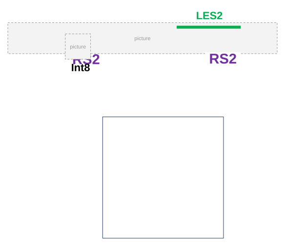

### TC-P50 — Loop - multif multiple LEs with positive offset <!-- src: S2 · slide 12 · case 9 -->

**Input**
- Expected Result
- Expected Attribute Table
- without referent

| RouteID | From Location | To Location | From Offset | To Offset |
| --- | --- | --- | --- | --- |
| RM3 | Int9 | Int9 | 3 | 6 |

| LEID | RouteID | From Measure | To Measure | FromDate | ToDate | ExtraAttribute |
| --- | --- | --- | --- | --- | --- | --- |
| LE1M3 | RM3 | 3 | 6 | 1/1/2000 |  | Paved |
| LE2M3 | RM3 | 3 | 6 | 1/1/2000 |  | Gravel |

[figure: Int9 · LE1M3 LE2M3 · RM3 · Int9 M=0]

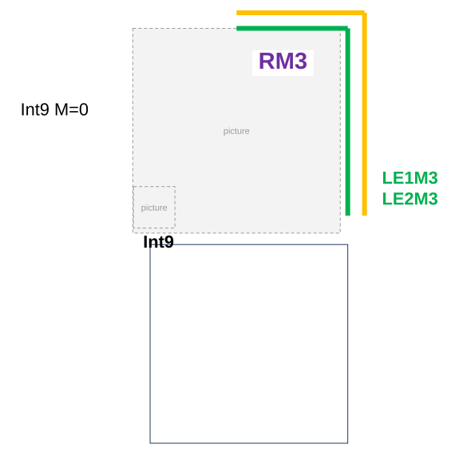

### TC-P51 — Loop single LE with positive offset to E <!-- src: S2 · slide 13 · case 10 -->

**Input**
- Expected Result
- Expected Attribute Table
- with referent

| RouteID | From Location | To Location | From Offset | To Offset |
| --- | --- | --- | --- | --- |
| R10 | Int10 | Int10 | E 3 | E 4 |

Int10

| LEID | RouteID | From Measure | To Measure | FromRefOffset | ToRefOffset | From Date | ToDate | ExtraAttribute |
| --- | --- | --- | --- | --- | --- | --- | --- | --- |
| LE10 | R10 | 5 | 6 | 3 | 4 | 1/1/2000 |  | Paved |

LE10

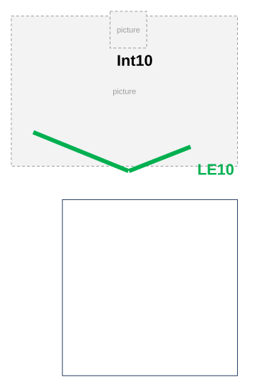

### TC-P52 — Lollipop - line multiple LEs with positive offset <!-- src: S2 · slide 14 · case 11 -->

**Input**
- Expected Result
- Expected Attribute Table
- with referent
- without referent

| RouteID | From Location | To Location | From Offset | To Offset |
| --- | --- | --- | --- | --- |
| R11L5 | Int11 | Int11 | 1 | 2 |

| LEID | RouteID | From Measure | To Measure | FromRefOffset | ToRefOffset | From Date | To Date | ExtraAttribute |
| --- | --- | --- | --- | --- | --- | --- | --- | --- |
| LLE3 | R11L5 | 3 | 4 | 1 | 2 | 1/1/2000 |  | Gravel |

| LEID | From RouteID | From Measure | To Measure | FromDate | ToDate | ExtraAttribute |
| --- | --- | --- | --- | --- | --- | --- |
| SLE3 | R11L5 | 3 | 4 | 1/1/2000 |  | Paved |

[figure: R11L5 · R11L6 · 2 14 · Int11 · Int11 M=2 · 0 · 4 · 6 · 10 · 12 · LE3 SLE3 · 8]

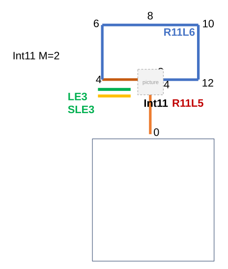

### TC-P53 — Lollipop single LE with positive offset to N <!-- src: S2 · slide 15 · case 12 -->

**Input**
- Expected Result
- Expected Attribute Table
- with referent

| RouteID | From Location | To Location | From Offset | To Offset |
| --- | --- | --- | --- | --- |
| R12 | Int12 | Int12 | N 3 | N 5 |

| LEID | RouteID | From Measure | To Measure | FromRefOffset | ToRefOffset | From Date | To Date | ExtraAttribute |
| --- | --- | --- | --- | --- | --- | --- | --- | --- |
| LE12 | R12 | 5 | 7 | 3 | 5 | 1/1/2000 |  | Dirt |

2
14

Int12
Int12 M=2

EE doesn’t provide M=14 option to put offset = E3
LE12

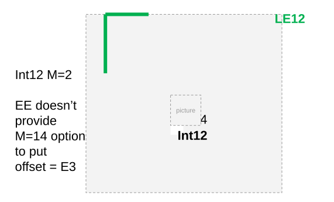

### TC-P54 — Lollipop - singlef single LE with positive offset to N <!-- src: S2 · slide 16 · case 13 -->

**Input**
- Expected Result
- Expected Attribute Table
- without referent

| RouteID | From Location | To Location | From Offset | To Offset |
| --- | --- | --- | --- | --- |
| RS3 | Int13 | Int13 | N 1 | N 2 |

| LEID | RouteID | From Measure | To Measure | FromDate | ToDate | ExtraAttribute |
| --- | --- | --- | --- | --- | --- | --- |
| LES3 | RS3 | 13 | 14 | 1/1/2000 |  | Concrete |

[figure: Int13 · Int13 M=12 · RS3 · LES3]

### TC-N12 — Alpha - line multiple LEs with negative offset <!-- src: S2 · slide 17 · case 14 -->

**Input**
- Expected Result
- Expected Attribute Table
- with referent
- without referent

| RouteID | From Location | To Location | From Offset | To Offset |
| --- | --- | --- | --- | --- |
| R14 | Int14 | Int14 | -3 | -1 |

| LEID | RouteID | From Measure | To Measure | FromRefOffset | ToRefOffset | From Date | ToDate | ExtraAttribute |
| --- | --- | --- | --- | --- | --- | --- | --- | --- |
| LE14 | R14L7 | 1 | 3 | -3 | -1 | 1/1/2000 |  | Paved |

| LEID | RouteID | From Measure | To Measure | FromDate | ToDate | ExtraAttribute |
| --- | --- | --- | --- | --- | --- | --- |
| SLE14 | R14L7 | 1 | 3 | 1/1/2000 |  | Gravel |

[figure: Int14 · LE14 SLE14 · R14L7 · R14L8]

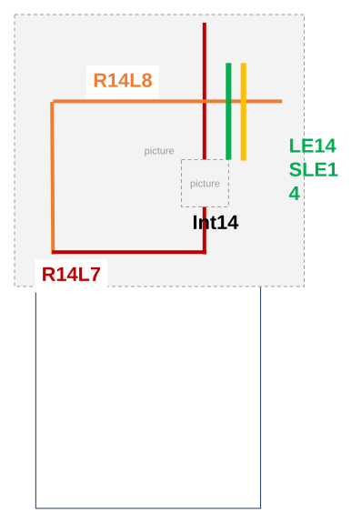

### TC-P55 — Alpha single LE with positive offset to N <!-- src: S2 · slide 18 · case 15 -->

**Input**
- Expected Result
- Expected Attribute Table
- with referent

| RouteID | From Location | To Location | From Offset | To Offset |
| --- | --- | --- | --- | --- |
| R15 | Int15 | Int15 | N 1 | N 2 |

| LEID | RouteID | From Measure | To Measure | FromRefOffset | ToRefOffset | From Date | ToDate | ExtraAttribute |
| --- | --- | --- | --- | --- | --- | --- | --- | --- |
| LE15 | R15 | 15 | 16 | 1 | 2 | 1/1/2000 |  | Dirt |

EE doesn’t provide M options
EE doesn’t identify N to be the M-increasing direction when there is no cardinal direction

[figure: R15 · Int15 M=14 · Int15 · 2 · LE15]

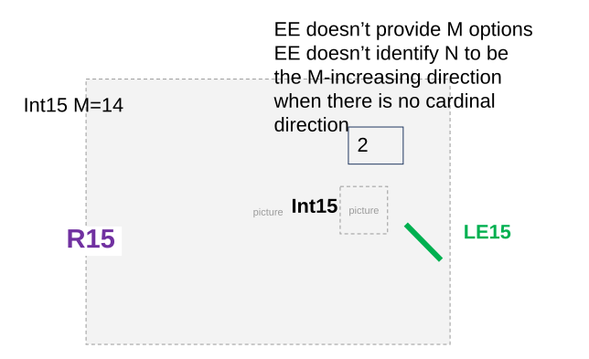

### TC-P56 — Alpha multiple LE with positive offset <!-- src: S2 · slide 19 · case 16 -->

**Input**
- Expected Result
- Expected Attribute Table
- with referent

| RouteID | From Location | To Location | From Offset | To Offset |
| --- | --- | --- | --- | --- |
| R16 | Int16 | Int16 | 13 | 14 |

| LEID | RouteID | From Measure | To Measure | FromRefOffset | ToRefOffset | From Date | ToDate | ExtraAttribute |
| --- | --- | --- | --- | --- | --- | --- | --- | --- |
| LE16 | R15 | 15 | 16 | 13 | 14 | 1/1/2000 |  | Dirt |
| SLE16 | R15 | 15 | 16 | 13 | 14 | 1/1/2000 |  | Paved |

[figure: Int16 M= 2 · Int16 · 2 · LE16 SLE16]

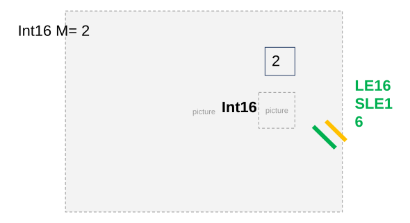

### TC-P57 — Input (1) <!-- src: S5 · slide 20 · label Input -->

**Steps:**
1. Expected Result
2. Expected Attribute Table
3. with referent

### TC-P58 — Input (2) <!-- src: S5 · slide 21 · label Input -->

**Steps:**
1. Expected Result
2. Expected Attribute Table
3. with referent

### TC-P59 — Branch - multif branches end in diff measures <!-- src: S2 · slide 22 · case 18 -->

- **Case:** Branch - multif branches end in diff measures, multiple LEs with positive offset to N

**Input**
- Expected Result
- Expected Attribute Table
- without referent

| RouteID | From Location | To Location | From Offset | To Offset |
| --- | --- | --- | --- | --- |
| RM5 | Int18 | Int18 | N 3 | N 4 |

| PEID | RouteID | From Measure | To Measure | FromDate | ToDate | ExtraAttribute |
| --- | --- | --- | --- | --- | --- | --- |
| LEM5 | RM5 | 5 | 6 | 1/1/2000 |  | Paved |
| SLEM5 | RM5 | 5 | 6 | 1/1/2000 |  | Gravel |

[figure: Int18 · RM5 · 2 · LEM5 SLEM5 · Int18 M=2]

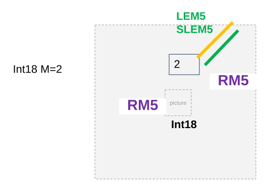

### TC-P60 — Vertical no cardinal direction, single LE with positive offset <!-- src: S2 · slide 23 · case 19 -->

**Input**
- Expected Result
- Expected Attribute Table
- with referent

| RouteID | From Location | To Location | From Offset | To Offset |
| --- | --- | --- | --- | --- |
| V19 | Int19 | Int19 | 2 | 4 |

| LEID | RouteID | From Measure | To Measure | FromRefOffset | ToRefOffset | From Date | ToDate | ExtraAttribute |
| --- | --- | --- | --- | --- | --- | --- | --- | --- |
| LE19 | V19 | 7 | 9 | 2 | 4 | 1/1/2000 |  | Paved |

[figure: Int19 · 8 · 19 · LE19]

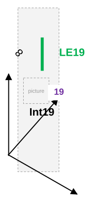

### TC-P61 — Vertical no cardinal direction, single LE with positive offset to N <!-- src: S2 · slide 24 · case 20 -->

**Input**
- Expected Result
- Expected Attribute Table
- with referent

| RouteID | From Location | To Location | From Offset | To Offset |
| --- | --- | --- | --- | --- |
| V20 | Int20 | Int20 | N 2 | N 4 |

| LEID | RouteID | From Measure | To Measure | FromRefOffset | ToRefOffset | From Date | ToDate | ExtraAttribute |
| --- | --- | --- | --- | --- | --- | --- | --- | --- |
| LE20 | V20 | 7 | 9 | 2 | 4 | 1/1/2000 |  | Paved |

[figure: Int20 · 8 · 20 · LE20]

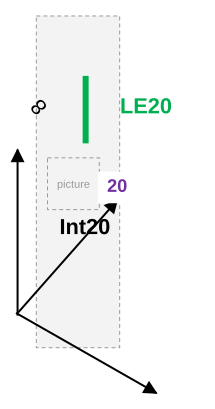

### TC-N13 — Vertical route bending, multiple LE with negative offset <!-- src: S2 · slide 25 · case 21 -->

**Input**
- Expected Result
- Expected Attribute Table
- with referent

| RouteID | From Location | To Location | From Offset | To Offset |
| --- | --- | --- | --- | --- |
| V21 | Int21 | Int21 | -7 | -2 |

Int21

V21

| LEID | RouteID | From Measure | To Measure | FromRefOffset | ToRefOffset | From Date | ToDate | ExtraAttribute |
| --- | --- | --- | --- | --- | --- | --- | --- | --- |
| LE21 | V21 | 3 | 8 | -7 | -2 | 1/1/2000 |  | Paved |
| SLE21 | V21 | 3 | 8 | -7 | -2 | 1/1/2000 |  | Gravel |

LE21
SLE21

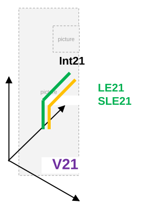

### TC-P62 — Simple Route single line event with positive offset, different intersections <!-- src: S2 · slide 26 · case 22 -->

**Input**
- Expected Result
- Expected Attribute Table
- with referent

| RouteID | From Location | To Location | From Offset | To Offset |
| --- | --- | --- | --- | --- |
| R1 | Int22A | Int22B | 1 | 1 |

| LEID | RouteID | From Measure | To Measure | FromRefOffset | ToRefOffset | From Date | ToDate | Extra Attribute |
| --- | --- | --- | --- | --- | --- | --- | --- | --- |
| LE1 | R1 | 3 | 7 | 1 | 1 | 1/1/2000 |  | Paved |

Int22A
Int22B

| FromRefLocation | ToRefLocation |
| --- | --- |
| Int22A | Int22B |

### TC-P63 — Simple Route single line event with positive offset, different methods <!-- src: S2 · slide 27 · case 23 -->

**Input: From Measure is Route and Measure, To Measure is Int Offset**
- Expected Result
- Expected Attribute Table
- without referent

| RouteID | From Measure | To Location | To Offset |
| --- | --- | --- | --- |
| R1 | 1 | Int23 | 5 |

| LEID | RouteID | From Measure | To Measure | From Date | ToDate | Extra Attribute |
| --- | --- | --- | --- | --- | --- | --- |
| LE1 | R1 | 1 | 7 | 1/1/2000 |  | Paved |

Int23

### TC-P64 — Simple Route, Line Network single spanning line event, different intersections <!-- src: S2 · slide 28 · case 24 -->

**Input**
- Expected Result
- Expected Attribute Table
- with referent

| From RouteID | From Location | To RouteID | To Location | From Offset | To Offset |
| --- | --- | --- | --- | --- | --- |
| R1 | Int24A | R2 | Int24B | -2 | 2 |

| LEID | From RouteID | To RouteID | From Measure | To Measure | FromRefOffset | ToRefOffset | From Date | To Date | ExtraAttribute |
| --- | --- | --- | --- | --- | --- | --- | --- | --- | --- |
| LE1 | R1 | R2 | 1 | 9 | -2 | 2 | 1/1/2000 |  | Dirt |

| FromRefLocation | ToRefLocation |
| --- | --- |
| Int24A | Int24B |

[figure: R1 · R2 · 0 · 5 · Int24B · 10 · Int24A]

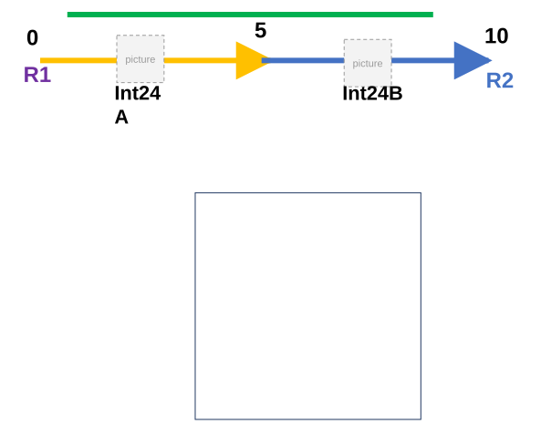

### TC-P65 — Simple Route single LE with positive offset, exceeding the end measure <!-- src: S2 · slide 29 · case 1 -->

**Input**
- Error message: (provided by Dev)

| RouteID | From/To Location | From Offset | To Offset |
| --- | --- | --- | --- |
| R24 | Int24 | 1 | 100 |

2. Simple Route
single LE with a negative offset to a specified direction W

**Input**
- Error message: (provided by Dev)

| RouteID | From/ ToLocation | From Offset | To Offset |
| --- | --- | --- | --- |
| R25 | Int25 | W -1 | E 4 |

[figure: Int24 · R24 · Int25 · R25]

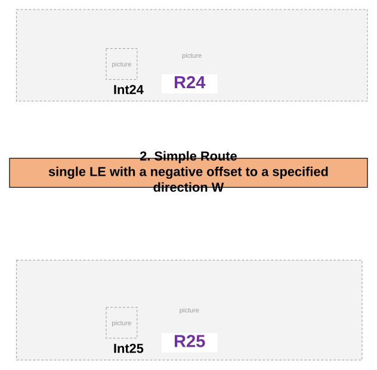

### TC-P66 — Loop multiple LEs with positive offset, exceeding the end measure <!-- src: S2 · slide 30 · case 3 -->

| Input |
| --- |

| Input |
| --- |

| RouteID | From/To Location | From Offset | To Offset |
| --- | --- | --- | --- |
| R26 | Int26 | 1 | 100 |

Error message: (provided by Dev)

4. Lollipop
single LE with a negative offset, exceeding the start measure

| RouteID | From/To Location | From Offset | To Offset |
| --- | --- | --- | --- |
| R27 | Int27 | -100 | 1 |

Error message: (provided by Dev)

[figure: R26 · 2 14 · Int26 · Int26 M=14]

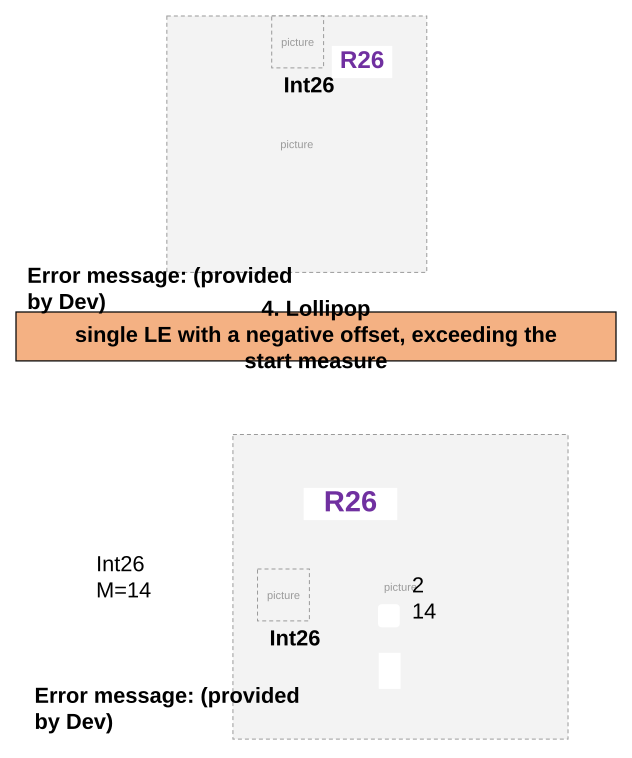

### TC-N14 — Alpha multiple LEs with negative offset, exceeding the start measure <!-- src: S2 · slide 31 · case 5 -->

| Input |
| --- |

| Input |
| --- |

| RouteID | From/To Location | From Offset | To Offset |
| --- | --- | --- | --- |
| R28 | Int28 | -100 | 1 |

Error message: (provided by Dev)

6. Vertical
single LE with a positive offset to E, exceeding the end measure

| RouteID | From/To Location | From Offset | To Offset |
| --- | --- | --- | --- |
| V29 | Int29 | 1 | E 100 |

Error message: (provided by Dev)

[figure: Int29 · 9 · R28 · Int28]

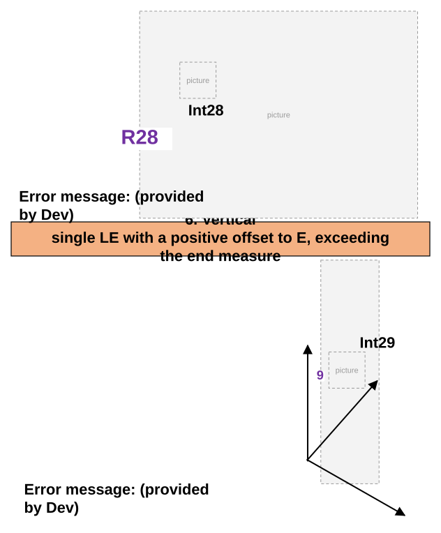

### TC-N15 — Gapped Route gapped measures, multiple LEs with negative offset, falling in gap <!-- src: S2 · slide 32 · case 7 -->

**Input**
- Error message: (provided by Dev)

| RouteID | From/To Location | From Offset | To Offset |
| --- | --- | --- | --- |
| R30 | Int30 | -3 | -1 |

8. Gapped Route
provide non-numeric value in offset

**Input**
- Error message: (provided by Dev)

| RouteID | From/To Location | From Offset | To Offset |
| --- | --- | --- | --- |
| R31 | Int31 | B | C |

[figure: Int30 · R30 · Int31 · R31]

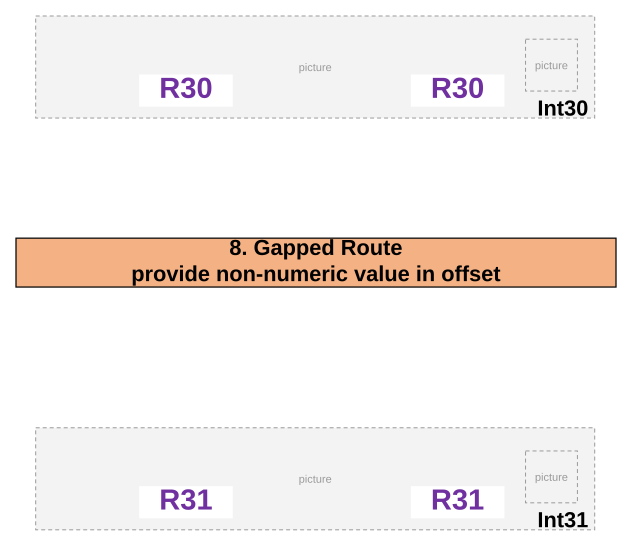

### TC-N16 — Simple Route, Line Network single spanning line event <!-- src: S2 · slide 33 · case 9 -->

- **Case:** Simple Route, Line Network single spanning line event, intersection offset spans onto another route

**Input**
- Expected Result

| From RouteID | From Location | To RouteID | To Location | From Offset | To Offset |
| --- | --- | --- | --- | --- | --- |
| R1 | Int24A | R2 | Int24B | 3 | -3 |

Error message: (provided by Dev)

[figure: R1 · R2 · 0 · 5 · Int24B · 10 · Int24A]

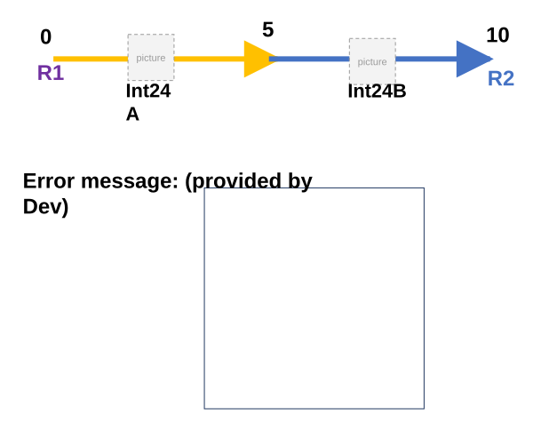

## Other content

### Slide 20 — 17A. Branch branches end in diff measures, single LE with positive offset <!-- slide 20 -->

| RouteID | From Location | To Location | From Offset | To Offset |
| --- | --- | --- | --- | --- |
| R17 | Int17 | Int17 | 2 | 3 |

| LEID | RouteID | From Measure | To Measure | FromRefOffset | ToRefOffset | From Date | ToDate | ExtraAttribute |
| --- | --- | --- | --- | --- | --- | --- | --- | --- |
| LE17 | R17 | 3 | 4 | 2 | 3 | 1/1/2000 |  | Paved |

Int17
LE17

### Slide 21 — 17B. Branch branches end in diff measures, single LE with positive offset on lesser measure branch <!-- slide 21 -->

| RouteID | From Location | To Location | From Offset | To Offset |
| --- | --- | --- | --- | --- |
| R18 | Int18 | Int18 | 2 | 4 |

| LEID | RouteID | From Measure | To Measure | FromRefOffset | ToRefOffset | From Date | ToDate | ExtraAttribute |
| --- | --- | --- | --- | --- | --- | --- | --- | --- |
| LE18 | R18 | 3 | 5 | 2 | 4 | 1/1/2000 |  | Paved |

[figure: Int18 · LE18 · R18]

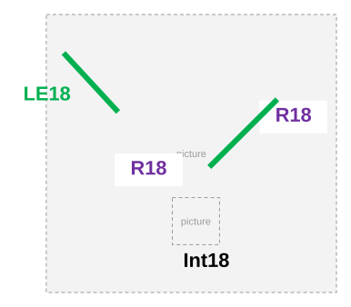
