# Add Line Events by offsetting from other points – Test Plan

| Field | Value |
| --- | --- |
| **Doc** | 231 · Test Plan · Pro |
| **Product** | — |
| **Release** | — |
| **Issues** | [ArcGISPro/ps-location-referencing#3906](https://devtopia.esri.com/ArcGISPro/ps-location-referencing/issues/3906) · [ArcGISPro/ps-location-referencing#3913](https://devtopia.esri.com/ArcGISPro/ps-location-referencing/issues/3913) |
| **Source** | [3913_AddLineEventsPointOffset_TestPlan_V3.pptx](<https://esriis.sharepoint.com/sites/LocationReferencing/Shared%20Documents/General/Test%20Plans/3913_AddLineEventsPointOffset_TestPlan_V3.pptx>) · rev V3 |
| **People** | author Claire Wang · PE Mac · dev Dan |
| **Edited** | 2025-02-19 23:00 by Mac Christmas |
| **Extracted** | 2026-09-04 · lane xmlstrip · format 3.0 · prompt v2.0.2 |
| **Keywords** | line event · point event · offset · referent fields · route · location offset · intellisense · error conditions · gapped route · multi field rid · negative offset · positive offset · line network · branch route · barbell route · lollipop route · loop route |
| **Tools** | Add Line Events · Multiple Line Events |

## Summary

Test plan for the Add Line and Multiple Line Events tools enhancements supporting offsetting from LRS Point events and other point features. Covers functionality verification of new Point Layer parameter, offset parameters, referent fields, UI behavior, and error conditions. Includes detailed positive and negative test cases across various network types and route shapes.

## Related documents

<!-- related:begin -->
- [Add Point Events by offsetting from other points – Test Plan](<https://esriis.sharepoint.com/sites/lrsworkspace/LRS Doc Index/Test Plans/3906-add-point-events-by-offsetting-from-other-points.md>) — shared issue ArcGISPro/ps-location-referencing#3906 · similar text 0.66 · 5 title words · 4 filename words · same kind/surface/pe/dev/folder <!-- rel:241 s=1011.161 -->
- [Location Offset Method in Add Point and Add Line Widgets Test Plan](<https://esriis.sharepoint.com/sites/lrsworkspace/LRS%20Doc%20Index/Test%20Plans/24790-location-offset-method-in-add-point-and-add-line-widgets.md>) — similar text 0.77 · 2 title words · 3 filename words · same kind/folder <!-- rel:48 s=8.168 -->
- [Add Line Events Point Offset Method](<https://esriis.sharepoint.com/sites/lrsworkspace/LRS Doc Index/User Stories/add-line-events-point-offset-method.md>) — similar text 0.34 · 3 title words · 4 filename words · same surface <!-- rel:268 s=5.974 -->
- [Add Line Event Tools – Intersection Location Offset Method Test Plan](<https://esriis.sharepoint.com/sites/lrsworkspace/LRS Doc Index/Test Plans/3910-add-line-event-tools-intersection-location-offset-method.md>) — similar text 0.23 · 2 title words · 3 filename words · same kind/folder <!-- rel:618 s=5.087 -->
- [Add Point Events by Location Offset](<https://esriis.sharepoint.com/sites/lrsworkspace/LRS Doc Index/Other/add-point-events-by-location-offset-rh.md>) — similar text 0.18 · 2 title words · 4 filename words · same surface <!-- rel:234 s=4.742 -->
<!-- related:end -->

<!-- docs:begin -->
## Esri documentation

[Storing referent and offset information for event location](https://doc.esri.com/en/arcgis-pro/latest/help/production/location-referencing-pipelines/storing-referent-and-offset-information-for-event-location.html)

_No page matched:_ [Add Line Events](https://www.google.com/search?q=%22Add%20Line%20Events%22+site%3Adoc.esri.com) · [Multiple Line Events](https://www.google.com/search?q=%22Multiple%20Line%20Events%22+site%3Adoc.esri.com)
<!-- docs:end -->

---

## Overview

### Slide 1 — Add Line Events by offsetting from other points – Test Plan <!-- slide 1 -->

https://devtopia.esri.com/ArcGISPro/ps-location-referencing/issues/3906

PE: Mac
Dev: Dan

Design changes and notes

### Slide 2 <!-- slide 2 -->

Functionality Verification – new parameter “Point Layer”

- In Add Line and Multiple Line Events tools, the existing Location Offset method now supports offsetting from LRS Point events registered to the same network and other point features (excluding calibration points)
- Change “Location” to “Point Layer” for both From and To Method sections when Location Offset method is set for each
  - The dropdown shows all the LRS Intersections, Point Events that are registered to the selected network, and other Point Feature Layers in the service with the LRS that is in the map
  - Organize the point layer drop down to three sections (Intersections, Point Events, other Point Features).  Make the titles of the sections italicized or different in some other way from the layers in the map to select, but unselectable
  - Point events from other networks cannot be used as offset location
New Error Conditions

- There is no qualified point layers in map, it means there is no point event
  - Show “Add a point event to the map.” in red banner, just like what we do in other method.

### Slide 3 <!-- slide 3 -->

Functionality Verification – Route, Point Location, and Name

- Name
  - User can type a name (Use Intersection Name if Point Layer is Intersection. Otherwise, use display field)
    - If the user types the feature name (either Intersection Name or display field that is NOT OID), continue to provide an intellisense experience
      - Fix intellisense limitation as a separate issue
      - If display field is OID, disable intellisense – just a text box
  - or use picker to select a point feature from map
    - Picker only selects qualified point features that are on the route. If not a qualified layer, or feature does not intersect the route, don’t select it (not an error)
    - Once the feature is selected, blink 1 time on the map but don’t keep it highlighted/selected on the map in any other way – find a way to make offset picker more usable, maybe by reducing the blink time
    - If there is more than one point feature at the clicked location, provide a select experience so the user chooses one of the features to use.
      - In the selector, still show intersection name for intersections, and show the display field + OID columns for other points if display field is not OID (show only OID column if display field is OID)
New Error Conditions

- Route must be provided before a Name of the point layer is provided
- When typing a Location Name, the feature must be from the specified point layer and intersect with the specific route. If not, show an error
- After a Location is provided, if user changes Route or Point Layer so the Location is no longer from the specified point layer or on the specified route, show an error
- If display field is OID (or anything), and the value length is not 2+ char, we should still support intellisense (e.g. OID is 1. after typing 1, intellisense doesn’t show any dropdown to choose from, but 1 should be accepted. Current limitation is that if value is under 3 char, value is not recognized. We should fix the limitation
- Expected intellisense behavior: continue to show options after putting in 2 characters. But if they put in 1 character, there is no intellisense option, but the feature is still recognized after losing focus

### Slide 4 — No new error conditions for Offset Parameters <!-- slide 4 -->

Functionality Verification – Offset parameters

- Offset parameters work the same as today for both From and To sections
- Allow the user to type the distance (with or without direction) or use the picker to select it from the map
- Show the offset locations with the same markers for the tools today
- If no direction is selected, assume the measure is a positive offset from the feature location
- If a negative offset value is populated, treat that as a negative offset from the feature location
- If the user changes the unit of measure and there is already a measure populated, update the location of the marker on the map
- The user can type the offset value first even if the feature location hasn’t been selected (but can’t use the picker on the map).  Once the feature location is selected, show the marker on the map for the offset value location.
- If a route goes exactly in two cardinal directions (exactly N-S for example) and a user tries to use one of the other cardinal directions (E-W), then ignore the cardinal direction and default to the offset value to determine where to locate the event
- If a user selects a cardinal direction, don’t allow them to type a negative offset value
- For int at self-intersections, we use vertex M value. If the point location is a point feature, we use the smallest M at the self intersection.  In this case, we will have a measure picker appear
- Continue to maintain existing validations for the Intersection feature class

### Slide 5 <!-- slide 5 -->

Functionality Verification – referent fields

- If the added event(s) layers have referent fields, we should populate the referents for both the From and To referent fields with the Method: Feature Class Name Offset, Location: OID of feature as it’s unique, and Offset: Offset value populated in the tool (note that the referent unit could be different and need to be converted from what was in the Add Event tool)
- If there feature class is not an LRS Event, it needs to be added to the dReferentMethod domain. If it’s not present, then we should default back to route/measure for the referents.

Functionality Verification – General UI Tests

- Populate each pane and transition between each one. Ensure populated values persist when pane is changed
- Populating the Point Layer and selecting a feature in the From: section will also populate the To: section (if To Method is Location Offset). Ensure changing values in the To: section does not change values in the From: section
No new error conditions for referent fields

### Slide 6 <!-- slide 6 -->

Testing

- Test both Add Line and Multiple Line tools (mix and match test cases)
- FS testing only
- Test with a mix of intersection, LRS point events, and nonLRS point features being the Point Layer
- Test on a variety of network types (Line, NonLine with multifield RouteID, NonLine with singlefield RouteID, NonLine with autogenerated RouteID)
- Test with both Projected and unprojected data
- Test events on normal, gapped (with same and different calibration on the ends), and complex route shapes (test with different centerline directions)
- Test with and without direction
- Test with positive and negative offset values
- Test with different offset units
- Test with and without referent fields configured for the added point event(s)
  - Some events’ referent offset unit is different from the default unit
- Test when the nonLRS point layer is added to dReferentMethod domain vs. not
- 508/i18n testing
- Verify new error conditions/messages

## Test Cases

### TC-P01 — Add a Line Event Using Offsets From Different Intersections on a Simple Route <!-- src: S6 · slide 7 · case 1a -->

### TC-P02 — Add a Line Event Using Different Point Features (case 1b) <!-- src: S6 · slide 7 · case 1b -->

- **Case:** Add a line event using different point features (Intersection and Point Event) on a simple route

### TC-P03 — Add a Line Event Using Different Point Features (case 1c) <!-- src: S6 · slide 7 · case 1c -->

- **Case:** Add a line event using different point features (Point Feature and Point Event) on a simple route
1d - Add a line event using negative and positive offsets from an intersection on a simple route

- Add multiple line events using positive offsets with direction from a point event on a gapped route (different measures on the ends)

### TC-P04 — Add Multiple Line Events Using Positive Offsets with Direction From a Point <!-- src: S6 · slide 7 · case 2a -->

- **Case:** Add multiple line events using positive offsets with direction from a point event on a gapped route (same measures on the ends)

- Add a Line event using negative offset with a different unit from a point feature that is not added to dReferentMethod domain on a lollipop route
- Add a line event using From method of Location Offset and To method of Route and Measure

## Other content

### Slide 7 <!-- slide 7 -->

Continuous – auto-generated RID, point events have referent fields

- Add a line event using positive offsets from an intersection on a simple route

### Slide 8 <!-- slide 8 -->

Continuous – single field RID, 1 point event without referent fields

- Add a line event using negative offsets from an intersection on a lollipop route (point event is at self intersection).
- Add line event using offsets on a Loop route
Continuous – multi-field RID, point events do not have referent fields

- Add a line event using a positive offsets with direction and a different unit from a point event on a simple route
- Add multiple line events using negative offsets from a point feature on a gapped route (different measures on the ends)
measures on the ends)

### Slide 9 <!-- slide 9 -->

Line network – some point events have referent fields, some do not

- Add a line event with no referent fields using negative offsets from a point event on a simple route
- Add multiple line events (with and without referent fields) using negative offsets with a different unit from a point feature that is not added to dReferentMethod domain on a simple route
- Add a line event with referent fields using positive offsets with a direction and a different unit from a point event on a 3D multi-gapped route (different measures on the ends)
- Add multiple line events (with and without referent fields) using positive offsets with direction from a point feature that is added to dReferentMethod domain on a multi-gapped route (different
- Add a line event with offsets on a Branch route
- Add a line event with offsets on a Barbell route

### Slide 10 <!-- slide 10 -->

| EventID | Route Name | From Measure | To Measure | From/To Referent Method | From/To ReferentID | From RefOffset | To RefOffset | From Date | To Date | Speed Limit |
| --- | --- | --- | --- | --- | --- | --- | --- | --- | --- | --- |
| Speed1 | R1 | 5 | 7 | C1_Intersection | {Int333} | 3 | 5 | 1/1/2000 |  | 55 |

Continuous – auto-generated RID, line event has referent fields
1 - Add a line event using positive offsets from an intersection on a simple route
Input
Expected Result

| Route Name | From Point Layer Name | From Offset | To Point Layer Name | To Offset |
| --- | --- | --- | --- | --- |
| R1 | R1 & Rx | 3 | R1 &Rx | 5 |

R1

### Slide 11 <!-- slide 11 -->

| EventID | Route Name | From Measure | To Measure | From/To Referent Method | From/To ReferentID | From RefOffset | To RefOffset | From Date | To Date | Speed Limit |
| --- | --- | --- | --- | --- | --- | --- | --- | --- | --- | --- |
| Speed1 | R1 | 5 | 7 | C1_Intersection | {Int333} | 3 | 5 | 1/1/2000 |  | 55 |

Continuous – auto-generated RID, line event has referent fields
1 - Add a line event using positive offsets from an intersection on a simple route
Input
Expected Result

| Route Name | From Point Layer Name | From Offset | To Point Layer Name | To Offset |
| --- | --- | --- | --- | --- |
| R1 | R1 & Rx | 3 | R1 &Rx | 5 |

R1

### Slide 12 <!-- slide 12 -->

| EventID | Route Name | From Measure | To Measure | From/To Referent Method | FromRef ID | From RefOffset | ToRefID | To RefOffset | From Date | ToDate | Speed Limit |
| --- | --- | --- | --- | --- | --- | --- | --- | --- | --- | --- | --- |
| Speed1 | R1 | 5 | 7 | C1_Intersection | {Int333} | 3 | {Int444} | -1 | 1/1/2000 | <Null> | 55 |

Continuous – auto-generated RID, line event has referent fields
1a - Add a line event using offsets from different intersection features on a simple route
Input
Expected Result

| Route Name | From Point Layer Name | From Offset | To Point Layer Name | To Offset |
| --- | --- | --- | --- | --- |
| R1 | R1 & Rx | 3 | R1 &Ry | -1 |

R1

### Slide 13 <!-- slide 13 -->

| EventID | Route Name | From Measure | To Measure | From Referent Method | FromRef ID | From RefOffset | To Referent Method | ToRefID | To RefOffset | From Date | ToDate | Speed Limit |
| --- | --- | --- | --- | --- | --- | --- | --- | --- | --- | --- | --- | --- |
| Speed1 | R1 | 5 | 7 | C1_Intersection | {Int333} | 3 | MilePost | 58 (OID) | -1 | 1/1/2000 | <Null> | 55 |

Continuous – auto-generated RID, line event has referent fields
1b - Add a line event using offsets from different point features on a simple route [Mix and match point features for From and To Point Layer; Int and Point Event, Point Event and Point Feature, etc.]

| Route Name | From Point Layer Name | From Offset | To Point Layer Name | To Offset |
| --- | --- | --- | --- | --- |
| R1 | R1 & Rx | 3 | MilePost | -1 |

[figure: Input · Expected Result · R1 · MilePost]

### Slide 14 <!-- slide 14 -->

| EventID | Route Name | From Measure | To Measure | From Referent Method | FromRef ID | From RefOffset | To Referent Method | ToRefID | To RefOffset | From Date | ToDate | Speed Limit |
| --- | --- | --- | --- | --- | --- | --- | --- | --- | --- | --- | --- | --- |
| Speed1 | R1 | 5 | 7 | Café | OID 3 | 3 | Water Valve | OID 9 | -1 | 1/1/2000 | <Null> | 55 |

Continuous – auto-generated RID, line event has referent fields
1c - Add a line event using offsets from different features on a simple route [Mix and match point features that are/are not entered in the dReferentMethod domain]

| Route Name | From Point Layer Name | From Offset | To Point Layer Name | To Offset |
| --- | --- | --- | --- | --- |
| R1 | Café | 3 | Water Valve | -1 |

[figure: Input · Expected Result · R1 · Cafe · Water Valve]

### Slide 15 <!-- slide 15 -->

| EventID | Route Name | From Measure | To Measure | From/To Referent Method | From/To ReferentID | From RefOffset | To RefOffset | From Date | To Date | Speed Limit |
| --- | --- | --- | --- | --- | --- | --- | --- | --- | --- | --- |
| Speed1 | R1 | 1 | 7 | C1_Intersection | {Int333} | -3 | 3 | 1/1/2000 |  | 55 |

Continuous – auto-generated RID, line event has referent fields
1d - Add a line event using negative and positive offsets from an intersection on a simple route
Input
Expected Result

| Route Name | From/To Point Layer Name | From Offset | To Offset |
| --- | --- | --- | --- |
| R1 | R1 & Rx | -3 | 3 |

R1

### Slide 16 <!-- slide 16 -->

| EventID | Route Name | From Measure | To Measure | From RefMethod | From RefID | From RefOffset | To RefMethod | ToR RefID | To RefOffset | From Date | ToDate | Speed Limit |
| --- | --- | --- | --- | --- | --- | --- | --- | --- | --- | --- | --- | --- |
| Speed1 | R2 | 2 | 5 | MilePost | 801 | -5 | Network | R2 | 5 | 1/1/2000 |  | 45 |
| Speed2 | R2 | 5.1 | 9 | Network | R2 | 5.1 | MilePost | 801 | 2 | 1/1/2000 |  | 45 |

Continuous – auto-generated RID, point events have referent fields
2 - Add multiple line events using a positive offset with direction from a point event on a gapped route (dif. measures on the ends). Input events will split since measure is different on both ends

| RouteName | From/To Point Layer Name | From Offset | To Offset |
| --- | --- | --- | --- |
| R2 | 801 ( MilePost ) | W 5 | E 2 |

| EventID | Route Name | From Measure | To Measure | From RefMethod | From RefID | From RefOffset | To RefMethod | ToR RefID | To RefOffset | From Date | ToDate | Func . Class |
| --- | --- | --- | --- | --- | --- | --- | --- | --- | --- | --- | --- | --- |
| Func Class1 | R2 | 2 | 5 | MilePost | 801 | -5 | Network | R2 | 5 | 1/1/2000 |  | Minor |
| Func Class1 | R2 | 5.1 | 9 | Network | R2 | 5.1 | MilePost | 801 | 2 | 1/1/2000 |  | Minor |

[figure: MilePost · Input · Expected Result · 0 · 10 · 5 · 5.1 · 2 · 7 · R2]

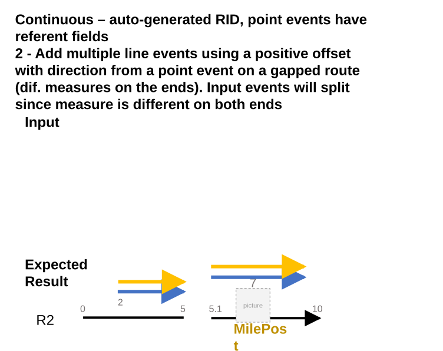

### Slide 17 <!-- slide 17 -->

| EventID | Route Name | From Measure | To Measure | From/To RefMethod | RefID | From RefOffset | To RefOffset | From Date | ToDate | Speed Limit |
| --- | --- | --- | --- | --- | --- | --- | --- | --- | --- | --- |
| Speed1 | R2 | 2 | 9 | MilePost | 801 | -5 | 2 | 1/1/2000 |  | Stop Sign |

Continuous – auto-generated RID, point events have referent fields
2a - Add multiple line events using a positive offset with direction from a point event on a gapped route (same measures on the ends). Input events will not split since measure is same on both ends

| RouteName | From/To Point Layer Name | From Offset | To Offset |
| --- | --- | --- | --- |
| R2 | 801 ( MilePost ) | W 5 | E 2 |

| EventID | Route Name | Measure | To Measure | From/To RefMethod | RefID | From RefOffset | To RefOffset | From Date | ToDate | Func Class |
| --- | --- | --- | --- | --- | --- | --- | --- | --- | --- | --- |
| FuncClass1 | R2 | 2 | 9 | MilePost | 801 | -5 | 2 | 1/1/2000 |  | Minor Collector |

[figure: MilePost · Input · Expected Result · 0 · 10 · 5 · 2 · 7 · R2]

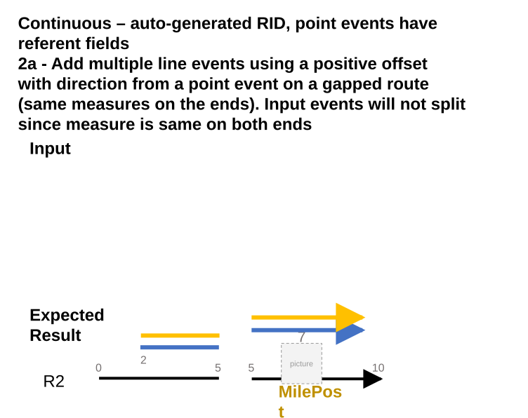

### Slide 18 <!-- slide 18 -->

Continuous – auto-generated RID, point events have referent fields
3 - Add a line event using a negative offset with a different unit from a point feature that is not added to dReferentMethod domain on a lollipop route

| Route Name | From/To Point Layer Name | From Offset | To Offset |
| --- | --- | --- | --- |
| R3 | 2 (Café) | -800 meters | 800 m |

Point feature does not have M, so we use the smallest M at self intersection. In this test case, M is 2 (2,14). We can choose the measure when selecting the pt. feature

| Event ID | Route Name | From Measure | To Measure | From/To Referent Method | From/To Referent ID | From Referent Offset | To Referent Offset | From Date | To Date | Speed Limit |
| --- | --- | --- | --- | --- | --- | --- | --- | --- | --- | --- |
| Speed1 | R3 | 1.502903 | 2.497097 | C1 network | {R0003- | 1.502903 (mi) | 2.497097 (mi) | 1/1/2000 |  | 55 |

[figure: Input · Expected Result · 10 · 2 · R3 · 0 · 4 · 6 · 12 · 14 · Cafe]

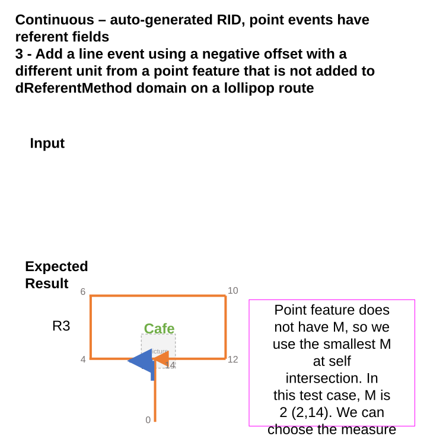

### Slide 19 <!-- slide 19 -->

| EventID | Route Name | From Measure | To Measure | From Referent Method | From ReferentID | From RefOffset | To Referent Method | To ReferentID | To RefOffset | From Date | To Date | Speed Limit |
| --- | --- | --- | --- | --- | --- | --- | --- | --- | --- | --- | --- | --- |
| Speed1 | R1 | 1 | 7 | C1_Intersection | {Int333} | -1 | Network | R1 | 7 | 1/1/2000 |  | 55 |

Continuous – auto-generated RID, line event has referent fields
4 - Add a line event using From method of Location Offset and To method of Route and Measure
Input
Expected Result

| Route Name | From Point Layer Name | From Offset | To RouteID | To Measure |
| --- | --- | --- | --- | --- |
| R1 | R1 & Rx | -1 | R1 | 7 |

R1

### Slide 20 <!-- slide 20 -->

| EventID | Route Name | From Measure | To Measure | From/To Referent Method | From/To ReferentID | From RefOffset | To RefOffset | From Date | To Date | Speed Limit |
| --- | --- | --- | --- | --- | --- | --- | --- | --- | --- | --- |
| SpeedOld | R1 | 0 | 6 | Network | R1 | 0 | 6 | 1/1/2000 | 1/1/2010 | 45 |
| SpeedOld | R1 | 0 | 5 | Network | R1 | 0 | 5 | 1/1/2010 |  | 45 |
| SpeedNew | R1 | 5 | 7 | C1_Intersection | {Int333} | 3 | 5 | 1/1/2010 |  | 55 |

Continuous – auto-generated RID, line event has referent fields
5 - Add a line event using positive offsets from an intersection on a simple route, check the retire overlaps option
Input
Expected Result

| Route Name | From Point Layer Name | From Offset | To Point Layer Name | To Offset |
| --- | --- | --- | --- | --- |
| R1 | R1 & Rx | 3 | R1 &Rx | 5 |

R1
Blue event is new, orange event is existing

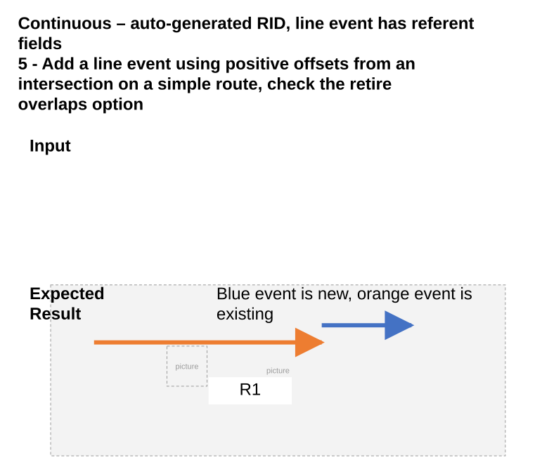

### Slide 21 <!-- slide 21 -->

Continuous - single field RID, 1 point event without referent fields
1 - Add a line event using a negative from offset from an intersection and a positive to offset on a lollipop route

| RouteID | From Point Layer Name | From Offset | To Point Layer Name | To Offset |
| --- | --- | --- | --- | --- |
| CS2 | CS2 & CS599 | -4 | Cafe | 10 |

| EventID | Route ID | From Measure | To Measure | From Date | ToDate | Speed Limit |
| --- | --- | --- | --- | --- | --- | --- |
| Speed1 | CS2 | 2 | 10 | 1/1/2000 |  | 45 |

[figure: Input · Expected Result · 10 · 2 · CS2 · 0 · 4 · 6 · 12 · 14 · Cafe]

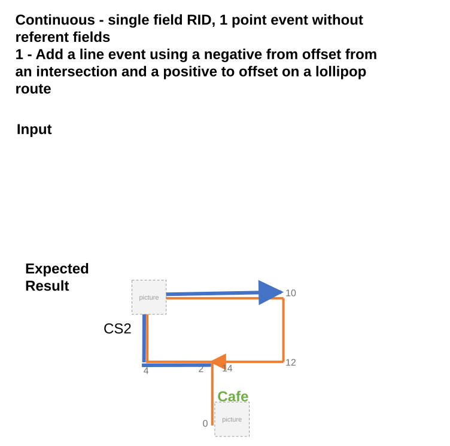

### Slide 22 <!-- slide 22 -->

Continuous - single field RID, 1 point event without referent fields
2 - Add a line event using offsets on a Loop route

| RouteID | From Point Layer Name | From Offset | To Point Layer Name | To Offset |
| --- | --- | --- | --- | --- |
| CS2 | 1 (Café) | -9 | Cafe | -1 |

| EventID | Route ID | From Measure | To Measure | From Date | ToDate | Speed Limit |
| --- | --- | --- | --- | --- | --- | --- |
| Speed1 | CS2 | 1 | 9 | 1/1/2000 |  | 45 |

[figure: Input · Expected Result · 5 · Cafe · 1 · 9]

### Slide 23 <!-- slide 23 -->

Continuous – multi-field RID, point events do not have referent fields
1 - Add a line event using offsets with direction from a point event on a simple route

| RouteID | From/To Point Layer Name | From Offset | To Offset |
| --- | --- | --- | --- |
| CM00A | 1093 (bridge) | S 1 km (there is no S, so it follows calibration direction) | N 5 km (there is no N, so it follows calibration direction) |

| EventID | Route Name | From Measure | To Measure | From Date | ToDate | Speed Limit |
| --- | --- | --- | --- | --- | --- | --- |
| Speed1 | CM00A | 1 | 7 | 1/1/2000 |  | 45 |

[figure: Input · Expected Result · CM00A · Bridge]

### Slide 24 <!-- slide 24 -->

Continuous - multi-field RID, point events do not have referent fields
2 - Add multiple line events using offsets from a point feature on a gapped route (different measures on the ends)

| RouteID | Point Layer Name | From Offset | To Offset |
| --- | --- | --- | --- |
| CM00B | 88 (Café) | -5 | -3 |

Use this case to sanity test a negative case: offset -1.95 but 5.05 is not on route

| EventID | Route Name | From Measure | To Measure | From Date | ToDate | Speed Limit |
| --- | --- | --- | --- | --- | --- | --- |
| Speed1 | CM00B | 2 | 4 | 1/1/2000 |  | 45 |

| EventID | Route Name | Measure | To Measure | From Date | ToDate | Func Class |
| --- | --- | --- | --- | --- | --- | --- |
| FuncClass1 | CM00B | 2 | 9 | 1/1/2000 |  | Minor Collector |

[figure: Cafe · Input · Expected Result · 0 · 10 · 5 · 5.1 · 7 · CM00B · 2 · 4]

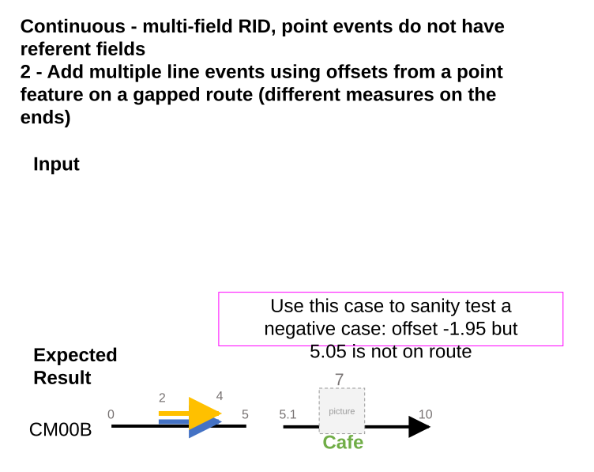

### Slide 25 <!-- slide 25 -->

Continuous – multi-field RID, point events do not have referent fields
3 - Add a line event using offsets with direction from a point event on a alpha route

| RouteID | From/To Point Layer Name | From Offset | To Offset |
| --- | --- | --- | --- |
| CM00A | 1093 (bridge) | -13 | 0.5 |

| EventID | Route Name | From Measure | To Measure | From Date | ToDate | Speed Limit |
| --- | --- | --- | --- | --- | --- | --- |
| Speed1 | CM00A | 1 | 14.5 | 1/1/2000 |  | 45 |

[figure: Input · Expected Result · CM00A · Bridge · 14]

### Slide 26 <!-- slide 26 -->

Continuous – multi-field RID, point events do not have referent fields
4 - Add a line event using offsets with direction from a point event on a simple route, check the Add to dominant route checkbox (CM00A is dom. Route, CM00B is selected)

| RouteID | From/To Point Layer Name | From Offset | To Offset |
| --- | --- | --- | --- |
| CM00B (non dom. Route) | 1093 (bridge) | -1 | 5 |

| EventID | Route Name | From Measure | To Measure | From Date | ToDate | Speed Limit |
| --- | --- | --- | --- | --- | --- | --- |
| Speed1 | CM00A | 1 | 7 | 1/1/2000 |  | 45 |

[figure: Input · Expected Result · Bridge · CM00A · CM00B]

### Slide 27 <!-- slide 27 -->

| EventID | From Route Name | To Route Name | From Measure | To Measure | From Date | ToDate | DOT Class |
| --- | --- | --- | --- | --- | --- | --- | --- |
| DOTClass1 | L1R1 | L1R1 | 3000 | 10000 | 1/1/2000 |  | Class 1 |

Line – Line event does not have referent fields
1 - Add a line event with no referent fields using a negative offset from a point event on a simple route

| From/To Route Name | Point Layer Name | From Offset | To Offset |
| --- | --- | --- | --- |
| L1R1 | 1093 ( ILINote ) | -7000 | 0 |

Use this case to sanity test a negative case: offset a value that would fall on route L1R2

[figure: Input · Expected Result · L1R1 · ILINote · L1R2 · 0 · 5000 · 10000 · 3000]

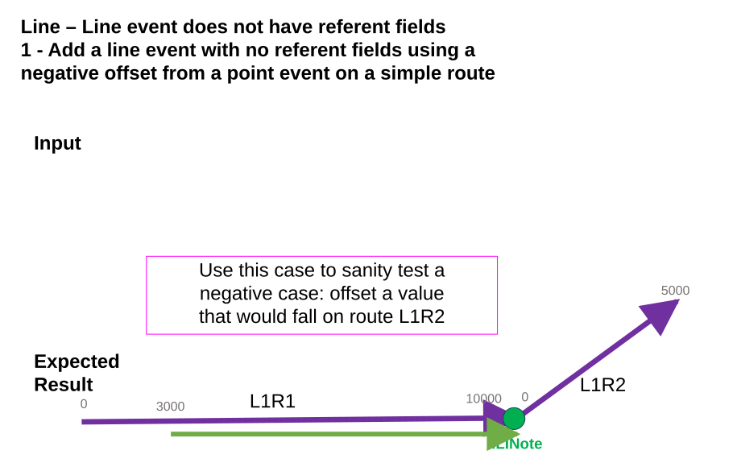

### Slide 28 <!-- slide 28 -->

| EventID | From Route Name | From Measure | To Route Name | To Measure | From Date | ToDate | DOT Class |
| --- | --- | --- | --- | --- | --- | --- | --- |
| DOTClass1 | L2R1 | 3438.32 ft | L2R2 | 2460.63 ft | 1/1/2000 |  | Class 1 |

Line – some line events have referent fields, some do not
2 - Add multiple line events (with and without referent fields) using offsets from a point feature that is not added to dReferentMethod domain on a simple route

| From Route Name | To Route Name | From/To Point Layer Name | From Offset | To Offset |
| --- | --- | --- | --- | --- |
| L2R1 | L2R2 | 8 (Station) | -2 km | 0.75 km |

| EventID | From Route Name | From Measure | To Route Name | To Measure | From Date | ToDate | FromRef Method | From RefID | FromRef Offset | ToRef Method | To RefID | ToRef Offset | Inspect. Type |
| --- | --- | --- | --- | --- | --- | --- | --- | --- | --- | --- | --- | --- | --- |
| Inspection Range1 | L2R1 | 3438.32 ft | L2R2 | 2460.63 ft | 1/1/2000 |  | Line Network | L2R1 | 3438.32 ft | Line Network | L2R2 | 2460.63 ft | Visual Survey |

[figure: Input · Expected Result · L2R1 · L2R2 · 0 · 10000 · 5000 · Station]

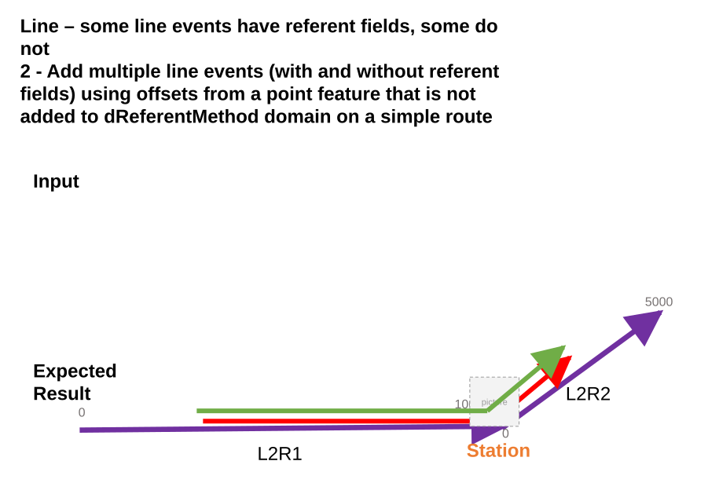

### Slide 29 <!-- slide 29 -->

Line – some line events have referent fields, some do not
3 - Add a line event with referent fields using a positive offset with a direction and a different unit from a point event on a 3D multi-gapped route (different measures on the ends)

| From/To RouteName | Point Layer Name | From Offset | To Offset |
| --- | --- | --- | --- |
| L3R1 | 1093 (anomaly) | W 1828.8m | E 2.286 km |

| EventID | From/To Route Name | From Measure | To Measure | From Referent Method | From ReferentID | From Referent Offset | To Referent Method | To ReferentID | To Referent Offset | From Date | ToDate | DOT Class |
| --- | --- | --- | --- | --- | --- | --- | --- | --- | --- | --- | --- | --- |
| DOT Class1 | L3R2 | 4000 ft. | 5000 ft | Anomaly | 1093 | -1828.8 m | Engineering Network | L3R1 | 5000 m | 1/1/2000 |  | Class 2 |
| DOT Class1 | L3R2 | 6000 ft. | 11000 ft. | Engineering Network | L3R1 | 6000 m | Engineering Network | L3R1 | 11000 m | 1/1/2000 |  | Class 2 |
| DOT Class1 | L3R2 | 12000 ft. | 16000 ft. | Engineering Network | L3R1 | 12000 m | Engineering Network | L3R1 | 16000 m | 1/1/2000 |  | Class 2 |
| DOT Class1 | L3R2 | 17000 ft. | 17500 ft. | Engineering Network | L3R1 | 17000 m | Anomaly | 1093 | 2286 m | 1/1/2000 |  | Class 2 |

Also test this case when measures are the same across gaps. Only one event will be added

[figure: Input · Expected Result · Anomaly · L3R1 · L3R2 · 0 · 10000 · 5000 · 6000 · 11000 · 16000 · 12000 · 17000 · 22000 · 40000]

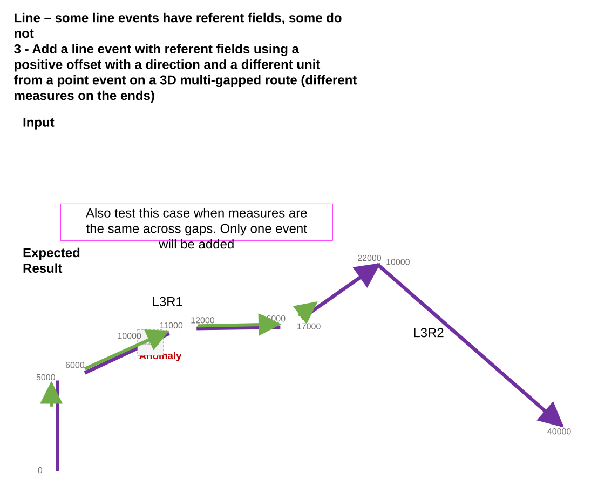

### Slide 30 <!-- slide 30 -->

Line – some line events have referent fields, some do not
4 - Add line point events (with and without referent fields) offset with direction from a point feature that is added to dReferentMethod domain on a multi-gapped route (different measures on the ends)

| From/To Route Name | From Point Layer Name | From Offset | To Point Layer Name | To Offset |
| --- | --- | --- | --- | --- |
| L4R1 | 3 (Station) | 1000 | 4 (Station) | -3000 |

| EventID | From/To Route Name | From Measure | To Measure | From Referent Method | From ReferentID | From Referent Offset | To Referent Method | To ReferentID | To Referent Offset | From Date | ToDate | DOT Class |
| --- | --- | --- | --- | --- | --- | --- | --- | --- | --- | --- | --- | --- |
| Inspection Range1 | L3R2 | -4000 | -3000 | Station | 3 | 1000 | Engineering Network | L4R1 | -3000 | 1/1/2000 |  | Aerial Survey |
| Inspection Range1 | L3R2 | -2000 | 0 | Engineering Network | L4R1 | -2000 | Station | 4 | -3000 | 1/1/2000 |  | Aerial Survey |

| EventID | From Route Name | From Measure | To Route Name | To Measure | From Date | ToDate | DOT Class |
| --- | --- | --- | --- | --- | --- | --- | --- |
| DOTClass1 | L3R2 | -4000 | L3R2 | -3000 | 1/1/2000 |  | Class 1 |
| DOTClass1 | L3R2 | -2000 | L3R2 | 0 | 1/1/2000 |  | Class 1 |

[figure: Input · Expected Result · L4R1 · L4R2 · 10000 · -5000 · -3000 · -2000 · 1000 · 1500 · 2500 · 3000 · 5000 · Station 3 · Station 4]

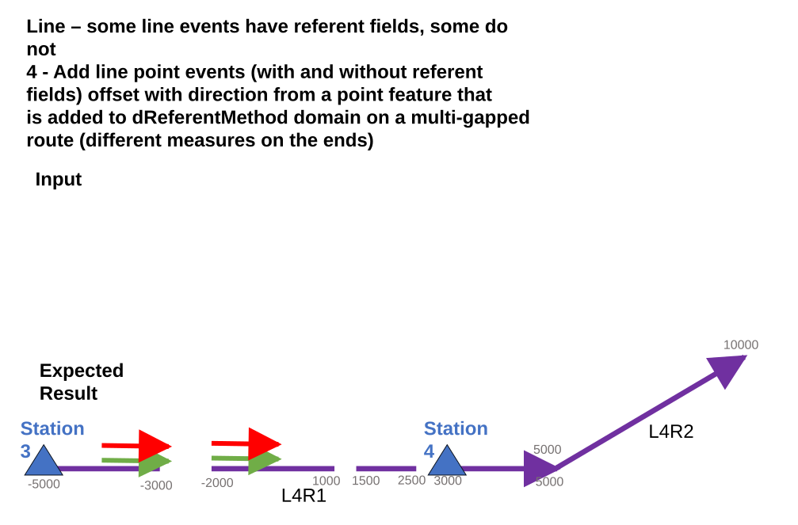

### Slide 31 <!-- slide 31 -->

Line – some line events have referent fields, some do not
5 - Add a line event with offsets on a branch route

| From/To RouteName | Point Layer Name | From Offset | To Offset |
| --- | --- | --- | --- |
| L5R1 | 6 (Station) | -4 | 4 |

| EventID | From Route Name | From Measure | To Route Name | To Measure | From Date | ToDate | DOT Class |
| --- | --- | --- | --- | --- | --- | --- | --- |
| DOTClass1 | L5R1 | 2 | L5R1 | 10 | 1/1/2000 |  | Class 1 |

[figure: Input · Expected Result · Station · 6 · L5R1 · L5R2 · 15 · 30]

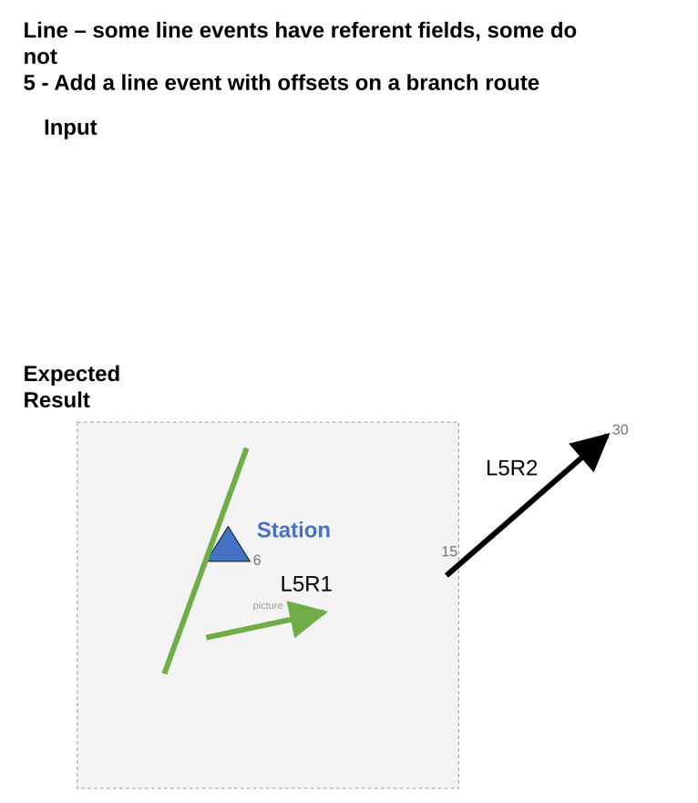

### Slide 32 <!-- slide 32 -->

Line – some line events have referent fields, some do not
6 - Add a line event with offsets on a barbell route

| From/To RouteName | From/To Point Layer Name | From Offset | To Offset |
| --- | --- | --- | --- |
| L6R1 | Intersection | -5.3 | 5.4 |

| EventID | From Route Name | From Measure | To Route Name | To Measure | From Date | ToDate | DOT Class |
| --- | --- | --- | --- | --- | --- | --- | --- |
| DOTClass1 | L6R1 | 4.7 | L6R1 | 15.4 | 1/1/2000 |  | Class 1 |

[figure: Input · Expected Result · 10 · L6R1]

### Slide 33 <!-- slide 33 -->

| EventID | From Route Name | To Route Name | From Measure | To Measure | From Date | ToDate | DOT Class |
| --- | --- | --- | --- | --- | --- | --- | --- |
| DOTClassOld | L1R1 | L1R2 | 0 | 5000 | 1/1/2000 |  | Class 1 |

Line – Line event does not have referent fields
7 - Add a line event with no referent fields using a negative offset from a point event on a simple route, check Merge coincident events

| From/To Route Name | Point Layer Name | From Offset | To Offset |
| --- | --- | --- | --- |
| L1R1 | 1093 ( ILINote ) | -7000 | 0 |

Orange event is old, green event is new
Both events have same attributes

[figure: Input · Expected Result · L1R1 · ILINote · L1R2 · 0 · 5000 · 10000 · 3000]

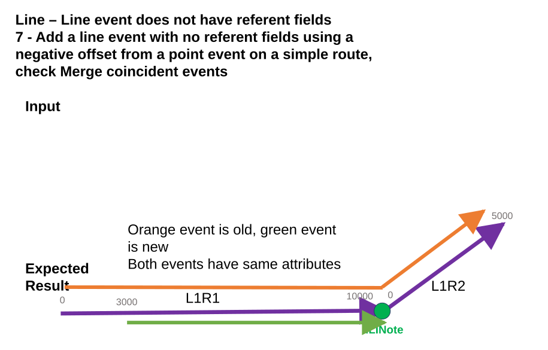

### Slide 34 <!-- slide 34 -->

Negative cases
New cases

- Route is not provided when user enters the point layer Name
  - Same error as now (Enter the Route Name/ID.) + red box
- Location Name does not exist in the specified Point Layer or is not intersecting the route
  - Same error as now (The location name is invalid.) +red box
- User changes Route or Point Layer after the location name is validated
  - Same error as now (The location name is invalid.) +red box
- Use different point features, from and to location are the same
Sanity test existing cases
Route Name not found in the selected Network.
Use a negative offset with direction.
Offset value out of route measure range.
Offset value invalid.
Dates out of route date range.
For line events, input offset does fall on input route
