# Add Line Event Tools: Retire Overlaps Option Test Plan

| Field | Value |
| --- | --- |
| **Doc** | 621 · Test Plan · Pro |
| **Product** | — |
| **Release** | — |
| **Issues** | [ArcGISPro/ps-location-referencing#3917](https://devtopia.esri.com/ArcGISPro/ps-location-referencing/issues/3917) |
| **Source** | [3917-AddLineEventsRetireOverlapsOption_TestPlan_V3.pptx](<https://esriis.sharepoint.com/sites/LocationReferencing/Shared%20Documents/General/Test%20Plans/3917-AddLineEventsRetireOverlapsOption_TestPlan_V3.pptx>) · rev V3 |
| **People** | author Mac Christmas · PE — · dev — |
| **Edited** | 2022-10-24 18:54 by Mac Christmas |
| **Extracted** | 2026-09-04 · lane xmlstrip · format 3.0 · prompt v2.0.2 |
| **Keywords** | line event · retire overlaps · overlapping events · route types · time slices · event editing · measure overlap |
| **Tools** | Add Line Event |

## Summary

Test plan for the Add Line Event tools focusing on the retire overlaps option. It covers positive and negative test cases involving overlapping line events on various route types including gapped, loops, lollipop, alpha, branch, and vertical routes. The plan verifies correct behavior of the retireMeasureOverlap parameter in LRS Apply Edits and UI functionality of the retire overlaps checkbox.

## Related documents

<!-- related:begin -->
- [Retire Overlaps Option in Add Events tools in Pro](<https://esriis.sharepoint.com/sites/lrsworkspace/LRS Doc Index/User Stories/retire-overlaps-option-in-add-events-tools-in-pro.md>) — similar text 0.16 · 5 title words · 3 filename words · same surface <!-- rel:664 s=5.443 -->
- [Experience Builder: Add Multiple Line Events Widget Test Plan](<https://esriis.sharepoint.com/sites/lrsworkspace/LRS Doc Index/Test Plans/16343-exb-add-multiple-line-events-widget.md>) — similar text 0.40 · 2 title words · 3 filename words · same kind/folder <!-- rel:457 s=4.908 -->
- [Add Line Event Tools – Intersection Location Offset Method Test Plan](<https://esriis.sharepoint.com/sites/lrsworkspace/LRS Doc Index/Test Plans/3910-add-line-event-tools-intersection-location-offset-method.md>) — similar text 0.22 · 4 title words · 2 filename words · same kind/folder <!-- rel:618 s=4.868 -->
- [Add Line Events by offsetting from other points – Test Plan](<https://esriis.sharepoint.com/sites/lrsworkspace/LRS Doc Index/Test Plans/3913-add-line-events-by-offsetting-from-other-points.md>) — similar text 0.18 · 2 title words · 3 filename words · same kind/surface/folder <!-- rel:231 s=4.723 -->
- [Reassign - Transfer to Another Line with StayPut and Retire Event Behavior - Test Plan](<https://esriis.sharepoint.com/sites/lrsworkspace/LRS%20Doc%20Index/Test%20Plans/5140-reassign-transfer-to-another-line-with-stayput-and-retire-eb.md>) — similar text 0.18 · 3 title words · 1 filename word · same kind/surface/folder <!-- rel:528 s=4.135 -->
<!-- related:end -->

<!-- docs:begin -->
## Esri documentation

[Event editing using the attribute table](https://doc.esri.com/en/arcgis-pro/latest/help/production/location-referencing-pipelines/event-editing-using-the-attribute-table.html)

_No page matched:_ [Add Line Event](https://www.google.com/search?q=%22Add%20Line%20Event%22+site%3Adoc.esri.com)
<!-- docs:end -->

---

## Overview

### Slide 1 — Add Line Event Tools: Retire Overlaps Option <!-- slide 1 -->

**Notes**
- Test with spanning and non-spanning line events
- Test with overlapping measures with and without time slices
- Test on normal and complex routes (gapped, loops, lollipop, alpha, branch, and vertical)
- Common workflow will be creating new events upon existing events, but overlapping segments will retire without the user having to manually retire potential overlapping events
- Test cases will alternate between single or multiple line events addition
- If the option is selected, for any new event(s) added via the tools, the “ retireMeasureOverlap ” parameter in LRS Apply Edits should be marked as true
- As per the test plan discussion, only simple tests will be tested due to this functionality being an existing and thoroughly-tested functionality of Event Editor. If any simple test cases deviate from the exact result in Event Editor, then all test cases will be tested to ensure everything works as intended. Because of this, test cases will be split into tested and not-tested categories. Rather than remove these cases from the test plan, they will remain to preserve expected outcomes for the tool.
- Test cases that have not been tested will be noted with a strikethrough and their corresponding graphic headers will be gray in color.

### Slide 2 <!-- slide 2 -->

## Test Cases

### TC-P01 — Add line event with overlapping section that spans the entire existing event (1) <!-- src: S4 · slide 3 · Positive Tests · 1 -->

### TC-P02 — Add multiple line events with overlapping sections that spans a portion (1) <!-- src: S4 · slide 3 · Positive Tests · 2 -->

- **Case:** Add multiple line events with overlapping sections that spans a portion of the existing event

### TC-P03 — Add line event with overlapping section that begins at the From Measure (1) <!-- src: S4 · slide 3 · Positive Tests · 3 -->

- **Case:** Add line event with overlapping section that begins at the From Measure of the existing event but does not cover the entire length

### TC-P04 — Add multiple line events with overlapping sections that ends at the To Measure (1) <!-- src: S4 · slide 3 · Positive Tests · 4 -->

- **Case:** Add multiple line events with overlapping sections that ends at the To Measure of the existing event but does not cover the entire length

### TC-P05 — Add spanning line event with overlapping section that spans a portion of another (1) <!-- src: S4 · slide 3 · Positive Tests · 5 -->

- **Case:** Add spanning line event with overlapping section that spans a portion of another spanning line event

### TC-P06 — Add multiple spanning line events that exceeds the From and To Measure (1) <!-- src: S4 · slide 3 · Positive Tests · 6 -->

- **Case:** Add multiple spanning line events that exceeds the From and To Measure of existing event

### TC-P07 — Add line event that spans an existing line event with multiple time slices (1) <!-- src: S4 · slide 3 · Positive Tests · 7 -->

### TC-P08 — 7A. Add line event with same From Date as first event in overlapping section <!-- src: S4 · slide 3 · Positive Tests · 8 -->

- **Case:** 7A. Add line event with same From Date as first event in overlapping section with multiple time slices

### TC-P09 — 7B. Add line event with From Date before the first event in overlapping section <!-- src: S4 · slide 3 · Positive Tests · 9 -->

- **Case:** 7B. Add line event with From Date before the first event in overlapping section with multiple time slices

### TC-P10 — Add line event that covers many existing line events of different measures along (1) <!-- src: S4 · slide 3 · Positive Tests · 10 -->

- **Case:** Add line event that covers many existing line events of different measures along route

### TC-P11 — Add line event on gapped route that overlaps partially with existing event (1) <!-- src: S4 · slide 3 · Positive Tests · 11 -->

### TC-P12 — Add multiple line events on loop route that overlaps partially with existing (1) <!-- src: S4 · slide 3 · Positive Tests · 12 -->

- **Case:** Add multiple line events on loop route that overlaps partially with existing event

### TC-P13 — Add line event on lollipop route that overlaps with portion of route (1) <!-- src: S4 · slide 3 · Positive Tests · 13 -->

- **Case:** Add line event on lollipop route that overlaps with portion of route that intersects itself

### TC-P14 — Add line event on lollipop route that overlaps with portion of route (2) <!-- src: S4 · slide 3 · Positive Tests · 14 -->

- **Case:** Add line event on lollipop route that overlaps with portion of route that intersects itself (with different z-values)

### TC-P15 — Add line event on alpha route that overlaps portion of route that intersects (1) <!-- src: S4 · slide 3 · Positive Tests · 15 -->

- **Case:** Add line event on alpha route that overlaps portion of route that intersects itself

### TC-P16 — Add line event on alpha route that overlaps portion of route that intersects (2) <!-- src: S4 · slide 3 · Positive Tests · 16 -->

- **Case:** Add line event on alpha route that overlaps portion of route that intersects itself (with different z-values)

### TC-P17 — Add line event on branch route that overlaps each branch (1) <!-- src: S4 · slide 3 · Positive Tests · 17 -->

### TC-P18 — Add multiple line events on branch route that spans only the first branch (1) <!-- src: S4 · slide 3 · Positive Tests · 18 -->

- **Case:** Add multiple line events on branch route that spans only the first branch of route

### TC-P19 — Add line event on vertical route that spans the entire overlapping section (1) <!-- src: S4 · slide 3 · Positive Tests · 19 -->

### TC-P20 — Add line event on vertical route with bend that spans only from the From Measure (1) <!-- src: S4 · slide 3 · Positive Tests · 20 -->

- **Case:** Add line event on vertical route with bend that spans only from the From Measure to a portion of the existing event

### TC-P21 — Add line event on vertical route with bend that spans only from a portion (1) <!-- src: S4 · slide 3 · Positive Tests · 21 -->

- **Case:** Add line event on vertical route with bend that spans only from a portion of the existing event to the existing event’s To Measure

### TC-P22 — Ensure “Retire overlaps” checkbox option is formatted correctly with other <!-- src: S4 · slide 3 · Positive Tests: UI · 1 -->

- **Group:** UI
- **Case:** Ensure “Retire overlaps” checkbox option is formatted correctly with other aspects of the Add Line Event(s) tool.

### TC-P23 — Ensure checking and unchecking the checkbox correctly selects and deselects <!-- src: S4 · slide 3 · Positive Tests: UI · 2 -->

- **Group:** UI
- **Case:** Ensure checking and unchecking the checkbox correctly selects and deselects the option.

### TC-P24 — Ensure the retire overlaps checkbox works with pressing the Tab key. <!-- src: S4 · slide 3 · Positive Tests: UI · 3 -->

- **Group:** UI

### TC-N01 — Add line event with no time overlap with the retire overlaps checkbox checked. <!-- src: S4 · slide 3 · Negative Tests: Error · 1 -->

- **Group:** Error
- **Case:** Add line event with no time overlap with the retire overlaps checkbox checked. No change should happen due to each event residing in different time slices

### TC-N02 — Add line event that is temporally before the existing event. No change should <!-- src: S4 · slide 3 · Negative Tests: Error · 2 -->

- **Group:** Error
- **Case:** Add line event that is temporally before the existing event. No change should happen to the existing event due to each event residing in different time slices

### TC-U01 — Add Line Event with Overlapping Section That Spans the Entire Existing Event (case 1) <!-- src: S1 · slide 4 · case 1 -->

| Event Layer | EventID | From RouteID | From Date | To Date | From Measure | To Measure | Extra Attribute |
| --- | --- | --- | --- | --- | --- | --- | --- |
| RoadType | Event A | Route1 | 1/1/2000 | Null | 0 | 4 | Gravel |

Existing:
Input:

| Event Layer | EventID | From RouteID | From Date | To Date | From Measure | To Measure | Extra Attribute |
| --- | --- | --- | --- | --- | --- | --- | --- |
| RoadType | Event B | Route1 | 1/1/2010 | Null | 0 | 4 | Paved |

Expected:

| Event Layer | EventID | From RouteID | From Date | To Date | From Measure | To Measure | Extra Attribute |
| --- | --- | --- | --- | --- | --- | --- | --- |
| RoadType | Event A | Route1 | 1/1/2000 | 1/1/2010 | 0 | 4 | Gravel |
| RoadType | Event B | Route1 | 1/1/2010 | Null | 0 | 4 | Paved |

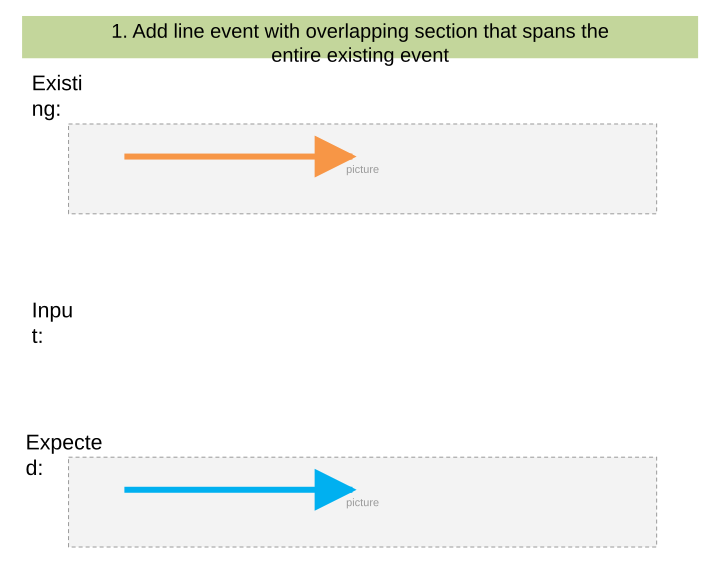

### TC-U02 — Add Multiple Line Events with Overlapping Sections That Spans a Portion (case 2) <!-- src: S1 · slide 5 · case 2 -->

- **Case:** Add multiple line events with overlapping sections that spans a portion of the existing event

| Event Layer | EventID | From RouteID | From Date | To Date | From Measure | To Measure | Extra Attribute |
| --- | --- | --- | --- | --- | --- | --- | --- |
| RoadType | Event A | Route1 | 1/1/2000 | Null | 0 | 4 | Gravel |
| SpeedLimit | Event C | Route1 | 1/1/2005 | Null | 0 | 6 | 25 |

Existing:
Input:

| Event Layer | EventID | From RouteID | From Date | To Date | From Measure | To Measure | Extra Attribute |
| --- | --- | --- | --- | --- | --- | --- | --- |
| RoadType | Event B | Route1 | 1/1/2010 | Null | 1 | 3 | Paved |
| SpeedLimit | Event D | Route1 | 1/1/2010 | Null | 1 | 3 | 45 |

| Event Layer | EventID | From RouteID | From Date | To Date | From Measure | To Measure | Extra Attribute |
| --- | --- | --- | --- | --- | --- | --- | --- |
| RoadType | Event A | Route1 | 1/1/2000 | 1/1/2010 | 0 | 4 | Gravel |
| RoadType | Event A | Route1 | 1/1/2010 | Null | 0 | 1 | Gravel |
| SpeedLimit | Event C | Route1 | 1/1/2010 | Null | 0 | 1 | 25 |
| RoadType | Event B | Route1 | 1/1/2010 | Null | 1 | 3 | Paved |
| SpeedLimit | Event D | Route1 | 1/1/2010 | Null | 1 | 3 | 45 |
| SpeedLimit | Event C | Route1 | 1/1/2005 | 1/1/2010 | 0 | 6 | 25 |
| RoadType | Event A | Route1 | 1/1/2010 | Null | 3 | 4 | Gravel |
| SpeedLimit | Event C | Route1 | 1/1/2010 | Null | 3 | 6 | 25 |

Expected:

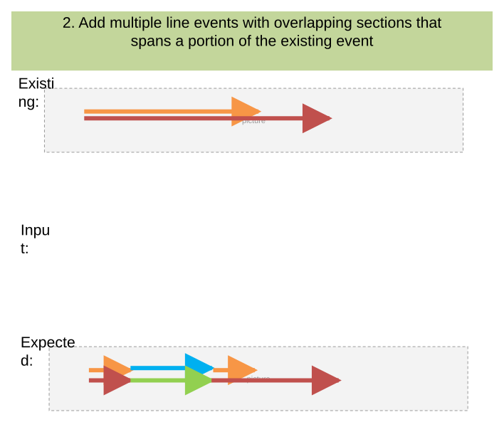

### TC-U03 — Add Line Event with Overlapping Section That Begins at the From Measure (case 3) <!-- src: S1 · slide 6 · case 3 -->

- **Case:** Add line event with overlapping section that begins at the From Measure of the existing event but does not cover the entire length

| Event Layer | EventID | From RouteID | From Date | To Date | From Measure | To Measure | Extra Attribute |
| --- | --- | --- | --- | --- | --- | --- | --- |
| RoadType | Event A | Route1 | 1/1/2000 | Null | 0 | 4 | Gravel |

Existing:
Input:

| Event Layer | EventID | From RouteID | From Date | To Date | From Measure | To Measure | Extra Attribute |
| --- | --- | --- | --- | --- | --- | --- | --- |
| RoadType | Event B | Route1 | 1/1/2010 | Null | 0 | 3 | Paved |

Expected:

| Event Layer | EventID | From RouteID | From Date | To Date | From Measure | To Measure | Extra Attribute |
| --- | --- | --- | --- | --- | --- | --- | --- |
| RoadType | Event A | Route1 | 1/1/2000 | 1/1/2010 | 0 | 4 | Gravel |
| RoadType | Event B | Route1 | 1/1/2010 | Null | 0 | 3 | Paved |
| RoadType | Event A | Route1 | 1/1/2010 | Null | 3 | 4 | Gravel |

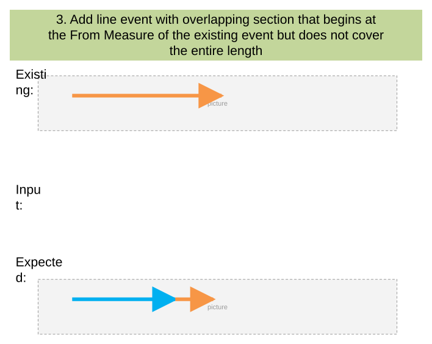

### TC-U04 — Add Multiple Line Events with Overlapping Sections That Ends at the To Measure (case 4) <!-- src: S1 · slide 7 · case 4 -->

- **Case:** Add multiple line events with overlapping sections that ends at the To Measure of the existing event but does not cover the entire length

| Event Layer | EventID | From RouteID | From Date | To Date | From Measure | To Measure | Extra Attribute |
| --- | --- | --- | --- | --- | --- | --- | --- |
| RoadType | Event A | Route1 | 1/1/2000 | Null | 0 | 4 | Gravel |
| SpeedLimit | Event C | Route1 | 1/1/2005 | Null | 0 | 4 | 25 |

Existing:
Input:

| Event Layer | EventID | From RouteID | From Date | To Date | From Measure | To Measure | Extra Attribute |
| --- | --- | --- | --- | --- | --- | --- | --- |
| RoadType | Event B | Route1 | 1/1/2010 | Null | 2 | 4 | Paved |
| SpeedLimit | Event D | Route1 | 1/1/2010 | Null | 2 | 4 | 45 |

| Event Layer | EventID | From RouteID | From Date | To Date | From Measure | To Measure | Extra Attribute |
| --- | --- | --- | --- | --- | --- | --- | --- |
| RoadType | Event A | Route1 | 1/1/2010 | Null | 0 | 2 | Gravel |
| RoadType | Event A | Route1 | 1/1/2000 | 1/1/2010 | 0 | 4 | Gravel |
| SpeedLimit | Event C | Route1 | 1/1/2010 | Null | 0 | 2 | 25 |
| SpeedLimit | Event C | Route1 | 1/1/2005 | 1/1/2010 | 0 | 4 | 25 |
| RoadType | Event B | Route1 | 1/1/2010 | Null | 2 | 4 | Paved |
| SpeedLimit | Event D | Route1 | 1/1/2010 | Null | 2 | 4 | 45 |

Expected:

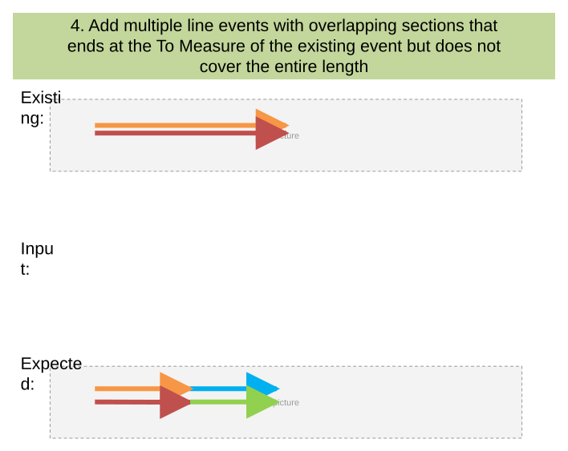

### TC-U05 — Add Spanning Line Event with Overlapping Section That Spans a Portion of Another (case 5) <!-- src: S1 · slide 8 · case 5 -->

- **Case:** Add spanning line event with overlapping section that spans a portion of another spanning line event

| Event Layer | EventID | From RouteID | To RouteID | From Date | To Date | From Measure | To Measure | Extra Attribute |
| --- | --- | --- | --- | --- | --- | --- | --- | --- |
| Road Type | Event A | Route1 | Route2 | 1/1/2000 | Null | 4 | 4 | Gravel |

| Event Layer | EventID | From RouteID | To RouteID | From Date | To Date | From Measure | To Measure | Extra Attribute |
| --- | --- | --- | --- | --- | --- | --- | --- | --- |
| Road Type | Event B | Route1 | Route 2 | 1/1/2010 | Null | 5 | 2 | Paved |

| Event Layer | EventID | From RouteID | To RouteID | From Date | To Date | From Measure | To Measure | Extra Attribute |
| --- | --- | --- | --- | --- | --- | --- | --- | --- |
| Road Type | Event A | Route1 | Route1 | 1/1/2010 | Null | 4 | 5 | Gravel |
| Road Type | Event A | Route1 | Route2 | 1/1/2000 | 1/1/2010 | 4 | 4 | Gravel |
| Road Type | Event B | Route1 | Route2 | 1/1/2010 | Null | 5 | 2 | Paved |
| Road Type | Event A | Route2 | Route2 | 1/1/2010 | Null | 2 | 4 | Gravel |

[figure: R2 · Existing: · Input: · Expected: · L1 R2 · L1]

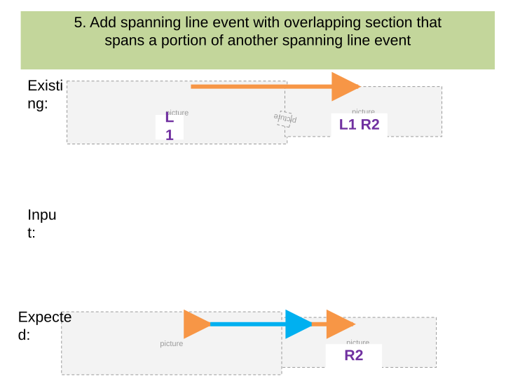

### TC-U06 — Add Multiple Spanning Line Events That Exceeds the From and To Measure (case 6) <!-- src: S1 · slide 9 · case 6 -->

- **Case:** Add multiple spanning line events that exceeds the From and To Measure of existing event

| Event Layer | EventID | From RouteID | To RouteID | From Date | To Date | From Measure | To Measure | Extra Attribute |
| --- | --- | --- | --- | --- | --- | --- | --- | --- |
| Road Type | Event B | Route1 | Route 2 | 1/1/2010 | Null | 1 | 5 | Paved |
| Speed Limit | Event D | Route 1 | Route 2 | 1/1/2010 | Null | 1 | 5 | 45 |

| Event Layer | EventID | From RouteID | To RouteID | From Date | To Date | From Measure | To Measure | Extra Attribute |
| --- | --- | --- | --- | --- | --- | --- | --- | --- |
| Road Type | Event A | Route1 | Route1 | 1/1/2000 | 1/1/2010 | 5 | 3 | Gravel |
| Speed Limit | Ev ent C | Route1 | Route2 | 1/1/2005 | 1/1/2010 | 2 | 1 | 25 |
| Road Type | Event B | Route1 | Route2 | 1/1/2010 | Null | 1 | 5 | Paved |
| Speed Limit | Event D | Route 1 | Route2 | 1/1/2010 | Null | 1 | 5 | 45 |

| Event Layer | Event ID | From RouteID | To RouteID | From Date | To Date | From Measure | To Measure | Extra Attribute |
| --- | --- | --- | --- | --- | --- | --- | --- | --- |
| Road Type | Event A | Route1 | Route2 | 1/1/2000 | Null | 5 | 3 | Gravel |
| Speed Limit | Event C | Route1 | Route2 | 1/1/2005 | Null | 2 | 1 | 25 |

[figure: R2 · Existing: · Input: · Expected:]

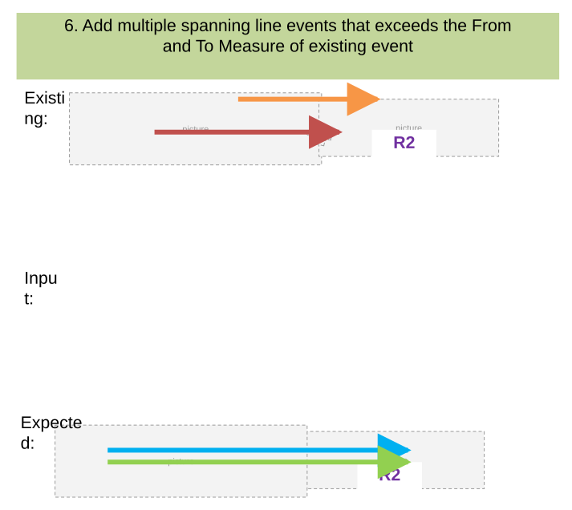

### TC-U07 — Add Line Event That Spans an Existing Line Event with Multiple Time Slices (case 7) <!-- src: S1 · slide 10 · case 7 -->

| Event Layer | EventID | From RouteID | From Date | To Date | From Measure | To Measure | Extra Attribute |
| --- | --- | --- | --- | --- | --- | --- | --- |
| Road Type | Event A | Route1 | 1/1/2000 | 1/1/2005 | 0 | 6 | Gravel |
| Road Type | Event A | Route1 | 1/1/2005 | 1/1/2010 | 2 | 6 | Gravel |
| Road Type | Event B | Route1 | 1/1/2005 | Null | 0 | 2 | Dirt |
| Road Type | Event A | Route1 | 1/1/2010 | 1/1/2015 | 4 | 6 | Gravel |
| Road Type | Event C | Route1 | 1/1/2010 | Null | 2 | 4 | Chip |
| Road Type | Event D | Route1 | 1/1/2015 | Null | 4 | 6 | Paved |

Existing:
Input:

| Event Layer | EventID | From RouteID | From Date | To Date | From Measure | To Measure | Extra Attribute |
| --- | --- | --- | --- | --- | --- | --- | --- |
| Road Type | Event E | Route1 | 1/1/2020 | Null | 0 | 6 | Asphalt |

Expected:

| Event Layer | EventID | From RouteID | From Date | To Date | From Measure | To Measure | Extra Attribute |
| --- | --- | --- | --- | --- | --- | --- | --- |
| Road Type | Event A | Route1 | 1/1/2000 | 1/1/2005 | 0 | 6 | Gravel |
| Road Type | Event A | Route1 | 1/1/2005 | 1/1/2010 | 2 | 6 | Gravel |
| Road Type | Event B | Route1 | 1/1/2005 | 1/1/2020 | 0 | 2 | Dirt |
| Road Type | Event A | Route1 | 1/1/2010 | 1/1/2015 | 4 | 6 | Gravel |
| Road Type | Event C | Route1 | 1/1/2010 | 1/1/2020 | 2 | 4 | Chip |
| Road Type | Event D | Route1 | 1/1/2015 | 1/1/2020 | 4 | 6 | Paved |
| Road Type | Event E | Route1 | 1/1/2020 | Null | 0 | 6 | Asphalt |

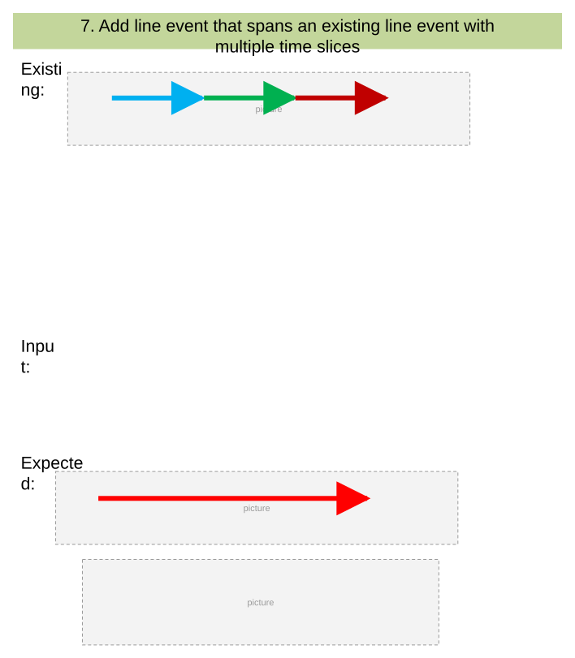

### TC-U08 — Add Line Event That Covers Many Existing Line Events of Different Measures Along (case 8) <!-- src: S1 · slide 13 · case 8 -->

- **Case:** Add line event that covers many existing line events of different measures along route on a line network

| Event Layer | EventID | From RouteID | From Date | To Date | From Measure | To Measure | Extra Attribute |
| --- | --- | --- | --- | --- | --- | --- | --- |
| RoadType | Event A | Route1 | 1/1/2000 | Null | 0 | 4 | Gravel |
| RoadType | Event C | Route1 | 1/1/2005 | Null | 1 | 3 | Paved |
| RoadType | Event D | Route1 | 1/1/2010 | Null | 5 | 7 | Dirt |
| RoadType | Event E | Route1 | 1/1/2015 | Null | 1 | 7 | Concrete |

Existing:
Input:

| Event Layer | EventID | From RouteID | From Date | To Date | From Measure | To Measure | Extra Attribute |
| --- | --- | --- | --- | --- | --- | --- | --- |
| RoadType | Event B | Route1 | 1/1/2020 | Null | 0 | 8 | Paved |

Expected:

| Event Layer | EventID | From RouteID | From Date | To Date | From Measure | To Measure | Extra Attribute |
| --- | --- | --- | --- | --- | --- | --- | --- |
| RoadType | Event A | Route1 | 1/1/2000 | 1/1/2020 | 0 | 4 | Gravel |
| RoadType | Event C | Route1 | 1/1/2005 | 1/1/2020 | 1 | 3 | Paved |
| RoadType | Event D | Route1 | 1/1/2010 | 1/1/2020 | 5 | 7 | Dirt |
| RoadType | Event E | Route1 | 1/1/2015 | 1/1/2020 | 1 | 7 | Concrete |
| RoadType | Event B | Route1 | 1/1/2020 | Null | 0 | 8 | Paved |

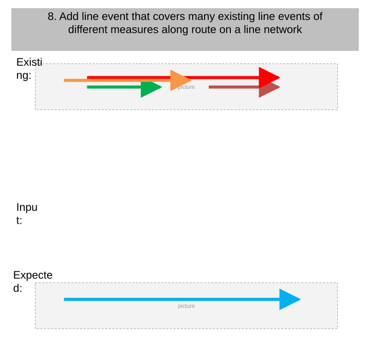

### TC-U09 — Add Line Event on Gapped Route That Overlaps Partially with Existing Event (case 9) <!-- src: S1 · slide 14 · case 9 -->

| Event Layer | EventID | From RouteID | From Date | To Date | From Measure | To Measure | Extra Attribute |
| --- | --- | --- | --- | --- | --- | --- | --- |
| RoadType | Event B | Route2 | 1/1/2010 | Null | 6 | 9 | Paved |

| Event Layer | EventID | From RouteID | From Date | To Date | From Measure | To Measure | Extra Attribute |
| --- | --- | --- | --- | --- | --- | --- | --- |
| RoadType | Event A | Route2 | 1/1/2010 | Null | 4 | 6 | Gravel |
| RoadType | Event A | Route2 | 1/1/2000 | 1/1/2010 | 4 | 8 | Gravel |
| RoadType | Event B | Route2 | 1/1/2010 | Null | 6 | 9 | Paved |

| Event Layer | EventID | From RouteID | From Date | To Date | From Measure | To Measure | Extra Attribute |
| --- | --- | --- | --- | --- | --- | --- | --- |
| RoadType | Event A | Route2 | 1/1/2000 | Null | 4 | 8 | Gravel |

[figure: Existing: · Input: · Expected: · R2]

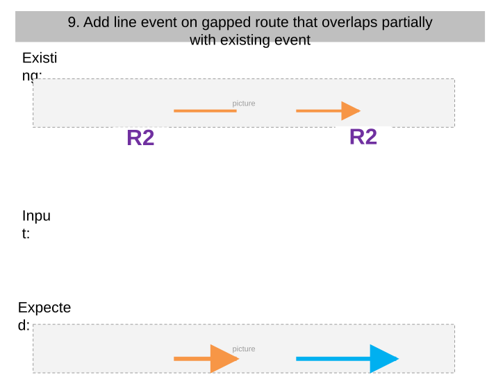

### TC-U10 — Add Multiple Line Events on Loop Route That Overlaps Partially with Existing (case 10) <!-- src: S1 · slide 15 · case 10 -->

- **Case:** Add multiple line events on loop route that overlaps partially with existing event

| Event Layer | EventID | From RouteID | From Date | To Date | From Measure | To Measure | Extra Attribute |
| --- | --- | --- | --- | --- | --- | --- | --- |
| RoadType | Event A | Route11 | 1/1/2000 | Null | 1 | 4 | Gravel |
| Speed Limit | Event C | Route11 | 1/1/2005 | Null | 1 | 5 | 25 |

Existing:
Input:

| Event Layer | EventID | From RouteID | From Date | To Date | From Measure | To Measure | Extra Attribute |
| --- | --- | --- | --- | --- | --- | --- | --- |
| RoadType | Event B | Route11 | 1/1/2010 | Null | 0 | 3 | Paved |
| SpeedLimit | Event D | Route11 | 1/1/2010 | Null | 0 | 3 | 45 |

Expected:

| Event Layer | EventID | From RouteID | From Date | To Date | From Measure | To Measure | Extra Attribute |
| --- | --- | --- | --- | --- | --- | --- | --- |
| RoadType | Event A | Route11 | 1/1/2000 | 1/1/2010 | 1 | 4 | Gravel |
| SpeedLimit | Event C | Route11 | 1/1/2005 | 1/1/2010 | 1 | 5 | 25 |
| RoadType | Event B | Route11 | 1/1/2010 | Null | 0 | 3 | Paved |
| SpeedLimit | Event D | Route11 | 1/1/2010 | Null | 0 | 3 | 45 |
| RoadType | Event A | Route11 | 1/1/2010 | Null | 3 | 4 | Gravel |
| SpeedLimit | Event C | Route11 | 1/1/2010 | Null | 3 | 5 | 25 |

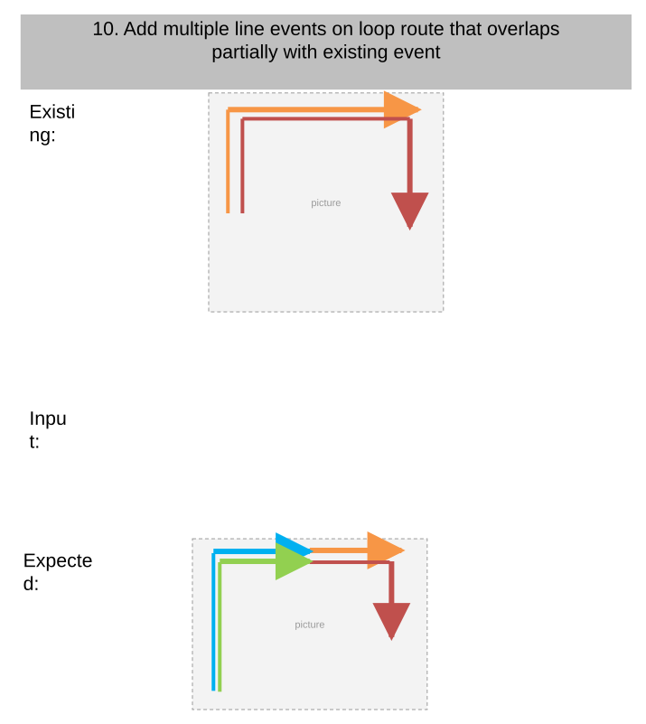

### TC-U11 — Add Line Event on Lollipop Route That Overlaps with Portion of Route (case 11) <!-- src: S1 · slide 16 · case 11 -->

- **Case:** Add line event on lollipop route that overlaps with portion of route that intersects itself

| Event Layer | EventID | From RouteID | From Date | To Date | From Measure | To Measure | Extra Attribute |
| --- | --- | --- | --- | --- | --- | --- | --- |
| RoadType | Event A | Route13 | 1/1/2000 | Null | 10 | 14 | Gravel |

Existing:
Input:

| Event Layer | EventID | From RouteID | From Date | To Date | From Measure | To Measure | Extra Attribute |
| --- | --- | --- | --- | --- | --- | --- | --- |
| RoadType | Event B | Route13 | 1/1/2010 | Null | 11 | 13 | Paved |

Expected:

| Event Layer | EventID | From RouteID | From Date | To Date | From Measure | To Measure | Extra Attribute |
| --- | --- | --- | --- | --- | --- | --- | --- |
| RoadType | Event A | Route13 | 1/1/2000 | Null | 10 | 11 | Gravel |
| RoadType | Event A | Route13 | 1/1/2000 | 1/1/2010 | 10 | 14 | Gravel |
| RoadType | Event B | Route13 | 1/1/2010 | Null | 11 | 13 | Paved |
| RoadType | Event A | Route13 | 1/1/2010 | Null | 13 | 14 | Gravel |

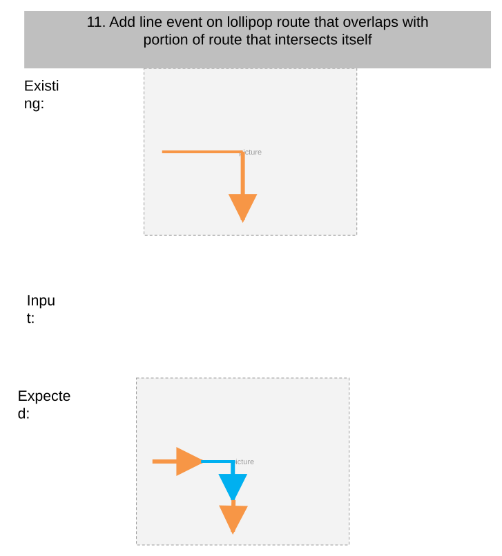

### TC-U12 — Add Line Event on Lollipop Route That Overlaps with Portion of Route (case 12) <!-- src: S1 · slide 17 · case 12 -->

- **Case:** Add line event on lollipop route that overlaps with portion of route that intersects itself (with different z-values)

| Event Layer | EventID | From RouteID | From Date | To Date | From Measure | To Measure | Extra Attribute |
| --- | --- | --- | --- | --- | --- | --- | --- |
| RoadType | Event A | Route13 | 1/1/2000 | Null | 10 | 14 | Gravel |

Existing:
Input:

| Event Layer | EventID | From RouteID | From Date | To Date | From Measure | To Measure | Extra Attribute |
| --- | --- | --- | --- | --- | --- | --- | --- |
| RoadType | Event B | Route13 | 1/1/2010 | Null | 11 | 13 | Paved |

Expected:

| Event Layer | EventID | From RouteID | From Date | To Date | From Measure | To Measure | Extra Attribute |
| --- | --- | --- | --- | --- | --- | --- | --- |
| RoadType | Event A | Route13 | 1/1/2000 | Null | 10 | 11 | Gravel |
| RoadType | Event A | Route13 | 1/1/2000 | 1/1/2010 | 10 | 14 | Gravel |
| RoadType | Event B | Route13 | 1/1/2010 | Null | 11 | 13 | Paved |
| RoadType | Event A | Route13 | 1/1/2010 | Null | 13 | 14 | Gravel |

z-value at 0 measure: 0
z-value at 12 measure: 5
z-value at 0 measure: 0
z-value at 12 measure: 5

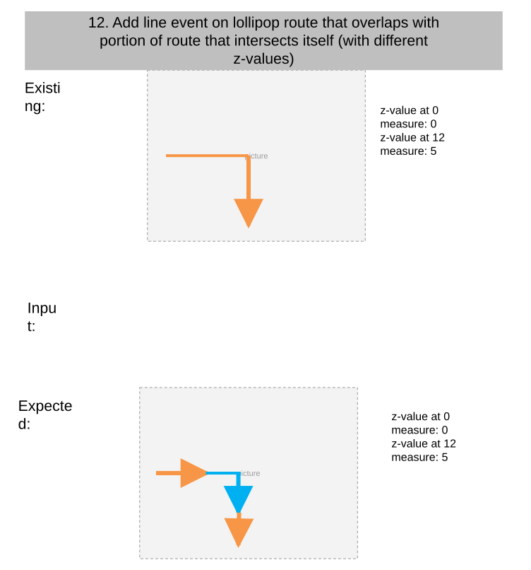

### TC-U13 — Add Line Event on Alpha Route That Overlaps Portion of Route That Intersects (case 13) <!-- src: S1 · slide 18 · case 13 -->

- **Case:** Add line event on alpha route that overlaps portion of route that intersects itself

| Event Layer | EventID | From RouteID | From Date | To Date | From Measure | To Measure | Extra Attribute |
| --- | --- | --- | --- | --- | --- | --- | --- |
| RoadType | Event A | Route16 | 1/1/2000 | Null | 0 | 4 | Gravel |

Existing:
Input:

| Event Layer | EventID | From RouteID | From Date | To Date | From Measure | To Measure | Extra Attribute |
| --- | --- | --- | --- | --- | --- | --- | --- |
| RoadType | Event B | Route16 | 1/1/2010 | Null | 1 | 3 | Paved |

Expected:

| Event Layer | EventID | From RouteID | From Date | To Date | From Measure | To Measure | Extra Attribute |
| --- | --- | --- | --- | --- | --- | --- | --- |
| RoadType | Event A | Route16 | 1/1/2010 | Null | 0 | 1 | Gravel |
| RoadType | Event A | Route16 | 1/1/2000 | 1/1/2010 | 0 | 4 | Gravel |
| RoadType | Event B | Route16 | 1/1/2010 | Null | 1 | 3 | Paved |
| RoadType | Event A | Route16 | 1/1/2010 | Null | 3 | 4 | Gravel |

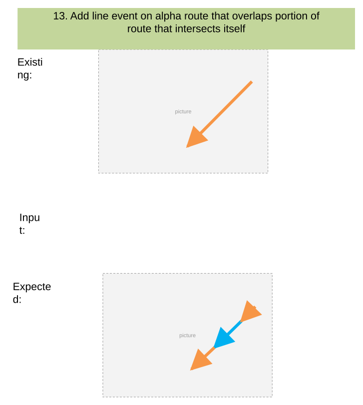

### TC-U14 — Add Line Event on Alpha Route That Overlaps Portion of Route That Intersects (case 14) <!-- src: S1 · slide 19 · case 14 -->

- **Case:** Add line event on alpha route that overlaps portion of route that intersects itself (with different z-values)

| Event Layer | EventID | From RouteID | From Date | To Date | From Measure | To Measure | Extra Attribute |
| --- | --- | --- | --- | --- | --- | --- | --- |
| RoadType | Event A | Route16 | 1/1/2000 | Null | 0 | 4 | Gravel |

Existing:
Input:

| Event Layer | EventID | From RouteID | From Date | To Date | From Measure | To Measure | Extra Attribute |
| --- | --- | --- | --- | --- | --- | --- | --- |
| RoadType | Event B | Route16 | 1/1/2010 | Null | 1 | 3 | Paved |

Expected:

| Event Layer | EventID | From RouteID | From Date | To Date | From Measure | To Measure | Extra Attribute |
| --- | --- | --- | --- | --- | --- | --- | --- |
| RoadType | Event A | Route16 | 1/1/2010 | Null | 0 | 1 | Gravel |
| RoadType | Event A | Route16 | 1/1/2000 | 1/1/2010 | 0 | 4 | Gravel |
| RoadType | Event B | Route16 | 1/1/2010 | Null | 1 | 3 | Paved |
| RoadType | Event A | Route16 | 1/1/2010 | Null | 3 | 4 | Gravel |

z-value at 2 measure: 0
z-value at 14 measure: 5
z-value at 2 measure: 0
z-value at 14 measure: 5

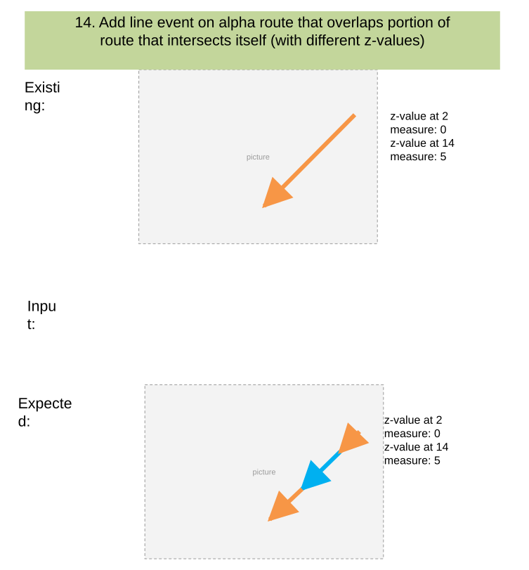

### TC-U15 — Add line event on branch route that overlaps each branch (case 15) <!-- src: S2 · slide 20 · case 15 -->

| Event Layer | EventID | From RouteID | From Date | To Date | From Measure | To Measure | Extra Attribute |
| --- | --- | --- | --- | --- | --- | --- | --- |
| RoadType | Event A | Route17 | 1/1/2000 | Null | 0 | 5 | Gravel |

Existing:
Input:

| Event Layer | EventID | From RouteID | From Date | To Date | From Measure | To Measure | Extra Attribute |
| --- | --- | --- | --- | --- | --- | --- | --- |
| RoadType | Event B | Route17 | 1/1/2010 | Null | 1 | 6 | Paved |

Expected:

| Event Layer | EventID | From RouteID | From Date | To Date | From Measure | To Measure | Extra Attribute |
| --- | --- | --- | --- | --- | --- | --- | --- |
| RoadType | Event A | Route17 | 1/1/2000 | 1/1/2010 | 0 | 5 | Gravel |
| RoadType | Event A | Route17 | 1/1/2010 | Null | 0 | 1 | Gravel |
| RoadType | Event B | Route17 | 1/1/2010 | Null | 1 | 6 | Paved |

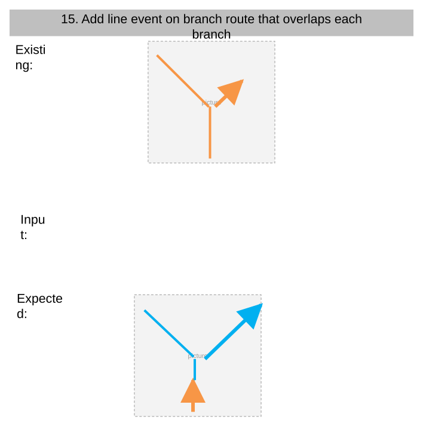

### TC-U16 — Add Multiple Line Events on Branch Route That Spans Only the First Branch (case 16) <!-- src: S1 · slide 21 · case 16 -->

- **Case:** Add multiple line events on branch route that spans only the first branch of route

| Event Layer | EventID | From RouteID | From Date | To Date | From Measure | To Measure | Extra Attribute |
| --- | --- | --- | --- | --- | --- | --- | --- |
| RoadType | Event A | Route17 | 1/1/2000 | Null | 0 | 5 | Gravel |
| SpeedLimit | Event C | Route17 | 1/1/2005 | Null | 0 | 5 | 25 |

Existing:
Input:

| Event Layer | EventID | From RouteID | From Date | To Date | From Measure | To Measure | Extra Attribute |
| --- | --- | --- | --- | --- | --- | --- | --- |
| RoadType | Event B | Route17 | 1/1/2010 | Null | 1 | 4 | Paved |
| SpeedLimit | Event D | Route17 | 1/1/2010 | Null | 1 | 4 | 45 |

Expected:

| Event Layer | EventID | From RouteID | From Date | To Date | From Measure | To Measure | Extra Attribute |
| --- | --- | --- | --- | --- | --- | --- | --- |
| RoadType | Event A | Route17 | 1/1/2010 | Null | 0 | 1 | Gravel |
| SpeedLimit | Event C | Route17 | 1/1/2010 | Null | 0 | 1 | 25 |
| RoadType | Event A | Route17 | 1/1/2000 | 1/1/2010 | 0 | 5 | Gravel |
| SpeedLimit | Event C | Route17 | 1/1/2005 | 1/1/2010 | 0 | 5 | 25 |
| RoadType | Event B | Route17 | 1/1/2010 | Null | 1 | 4 | Paved |
| SpeedLimit | Event D | Route17 | 1/1/2010 | Null | 1 | 4 | 45 |
| RoadType | Event A | Route17 | 1/1/2010 | Null | 4 | 5 | Gravel |
| SpeedLimit | Event C | Route17 | 1/1/2010 | Null | 4 | 5 | 25 |

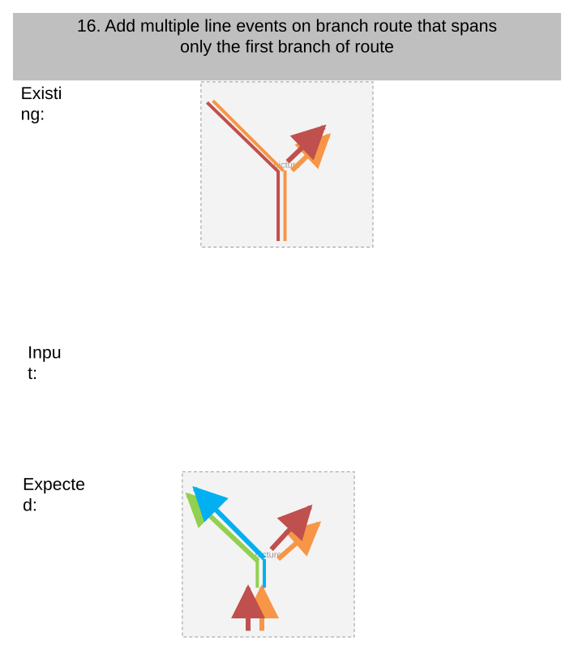

### TC-U17 — Add Line Event on Vertical Route That Spans the Entire Overlapping Section (case 17) <!-- src: S1 · slide 22 · case 17 -->

| Event Layer | EventID | From RouteID | From Date | To Date | From Measure | To Measure | Extra Attribute |
| --- | --- | --- | --- | --- | --- | --- | --- |
| RoadType | Event A | Route23 | 1/1/2000 | Null | 1 | 8 | Gravel |

Existing:
Input:

| Event Layer | EventID | From RouteID | From Date | To Date | From Measure | To Measure | Extra Attribute |
| --- | --- | --- | --- | --- | --- | --- | --- |
| RoadType | Event B | Route23 | 1/1/2010 | Null | 0 | 10 | Paved |

Expected:

| Event Layer | EventID | From RouteID | From Date | To Date | From Measure | To Measure | Extra Attribute |
| --- | --- | --- | --- | --- | --- | --- | --- |
| RoadType | Event A | Route23 | 1/1/2000 | 1/1/2010 | 1 | 8 | Gravel |
| RoadType | Event B | Route23 | 1/1/2010 | Null | 0 | 10 | Paved |

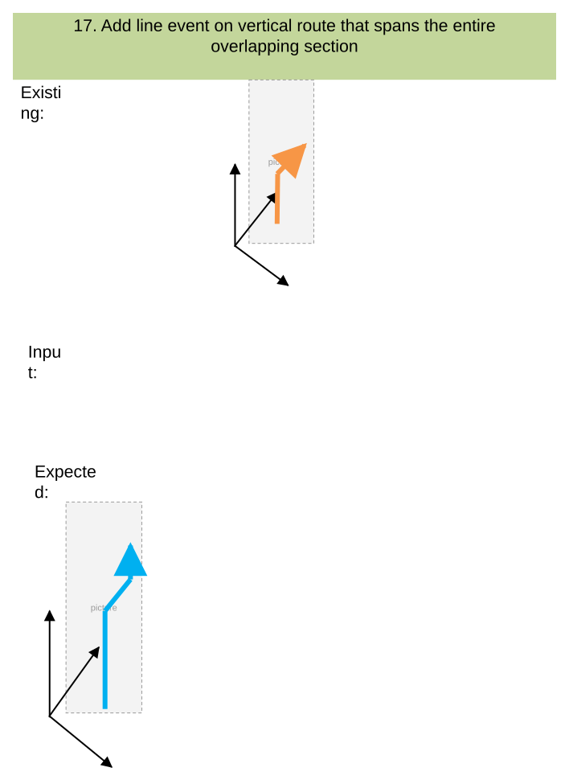

### TC-U18 — Add Line Event on Vertical Route with Bend That Spans Only From the From Measure (case 18) <!-- src: S1 · slide 23 · case 18 -->

- **Case:** Add line event on vertical route with bend that spans only from the From Measure to a portion of the existing event

| Event Layer | EventID | From RouteID | From Date | To Date | From Measure | To Measure | Extra Attribute |
| --- | --- | --- | --- | --- | --- | --- | --- |
| RoadType | Event A | Route23 | 1/1/2000 | Null | 1 | 8 | Gravel |

Existing:
Input:

| Event Layer | EventID | From RouteID | From Date | To Date | From Measure | To Measure | Extra Attribute |
| --- | --- | --- | --- | --- | --- | --- | --- |
| RoadType | Event B | Route23 | 1/1/2010 | Null | 0 | 6 | Paved |

Expected:

| Event Layer | EventID | From RouteID | From Date | To Date | From Measure | To Measure | Extra Attribute |
| --- | --- | --- | --- | --- | --- | --- | --- |
| RoadType | Event A | Route23 | 1/1/2000 | 1/1/2010 | 1 | 8 | Gravel |
| RoadType | Event B | Route23 | 1/1/2010 | Null | 0 | 6 | Paved |
| RoadType | Event A | Route23 | 1/1/2010 | Null | 6 | 8 | Gravel |

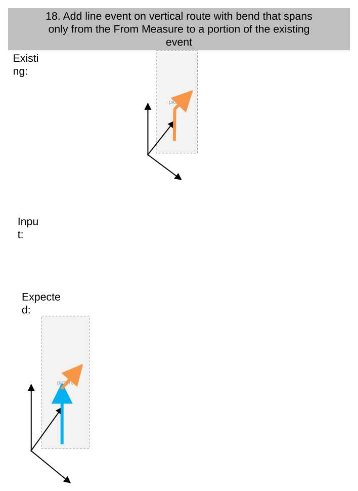

### TC-U19 — Add Line Event on Vertical Route with Bend That Spans Only From a Portion (case 19) <!-- src: S1 · slide 24 · case 19 -->

- **Case:** Add line event on vertical route with bend that spans only from a portion of the existing event to the existing event’s To Measure

| Event Layer | EventID | From RouteID | From Date | To Date | From Measure | To Measure | Extra Attribute |
| --- | --- | --- | --- | --- | --- | --- | --- |
| RoadType | Event A | Route23 | 1/1/2000 | Null | 1 | 8 | Gravel |

Existing:
Input:

| Event Layer | EventID | From RouteID | From Date | To Date | From Measure | To Measure | Extra Attribute |
| --- | --- | --- | --- | --- | --- | --- | --- |
| RoadType | Event B | Route23 | 1/1/2010 | Null | 6 | 10 | Paved |

Expected:

| Event Layer | EventID | From RouteID | From Date | To Date | From Measure | To Measure | Extra Attribute |
| --- | --- | --- | --- | --- | --- | --- | --- |
| RoadType | Event A | Route23 | 1/1/2010 | Null | 1 | 6 | Gravel |
| RoadType | Event B | Route23 | 1/1/2010 | Null | 6 | 10 | Paved |
| RoadType | Event A | Route23 | 1/1/2000 | 1/1/2010 | 1 | 8 | Gravel |

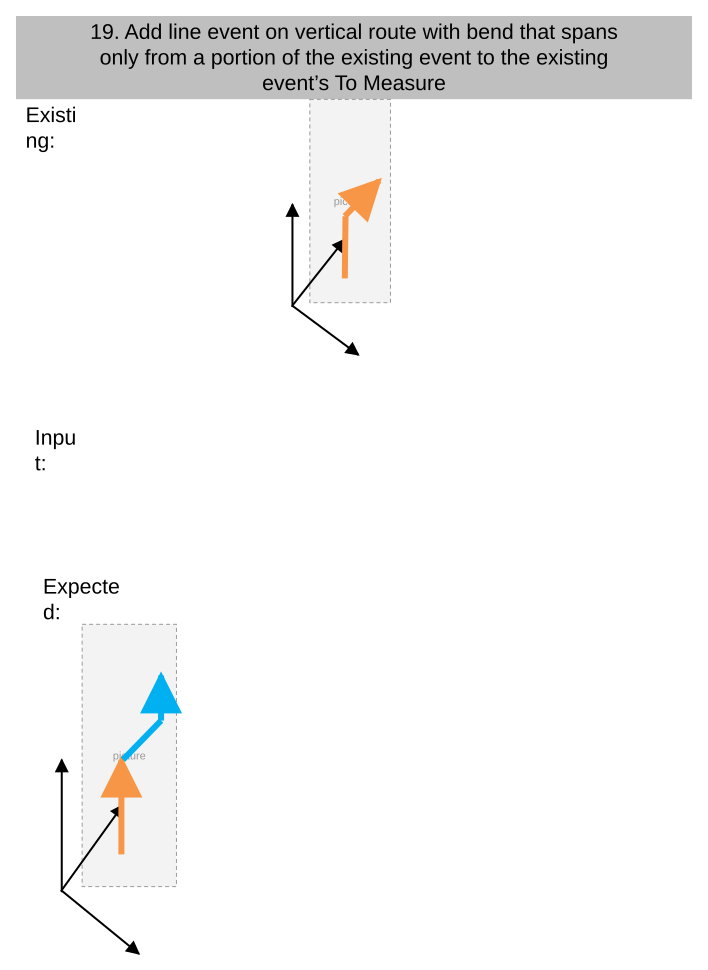

### TC-U20 — Add Line Event with No Time Overlap with the Retire Overlaps Checkbox Checked <!-- src: S1 · slide 25 · case 1 -->

| Event Layer | EventID | From RouteID | From Date | To Date | From Measure | To Measure | Extra Attribute |
| --- | --- | --- | --- | --- | --- | --- | --- |
| RoadType | Event A | Route1 | 1/1/2000 | 1/1/2005 | 0 | 4 | Gravel |

Existing:
Input:

| Event Layer | EventID | From RouteID | From Date | To Date | From Measure | To Measure | Extra Attribute |
| --- | --- | --- | --- | --- | --- | --- | --- |
| RoadType | Event B | Route1 | 1/1/2006 | Null | 0 | 4 | Paved |

Expected:

| Event Layer | EventID | From RouteID | From Date | To Date | From Measure | To Measure | Extra Attribute |
| --- | --- | --- | --- | --- | --- | --- | --- |
| RoadType | Event A | Route1 | 1/1/2000 | 1/1/2005 | 0 | 4 | Gravel |
| RoadType | Event B | Route1 | 1/1/2006 | Null | 0 | 4 | Paved |

No temporal overlap, To Date for existing event is not changed

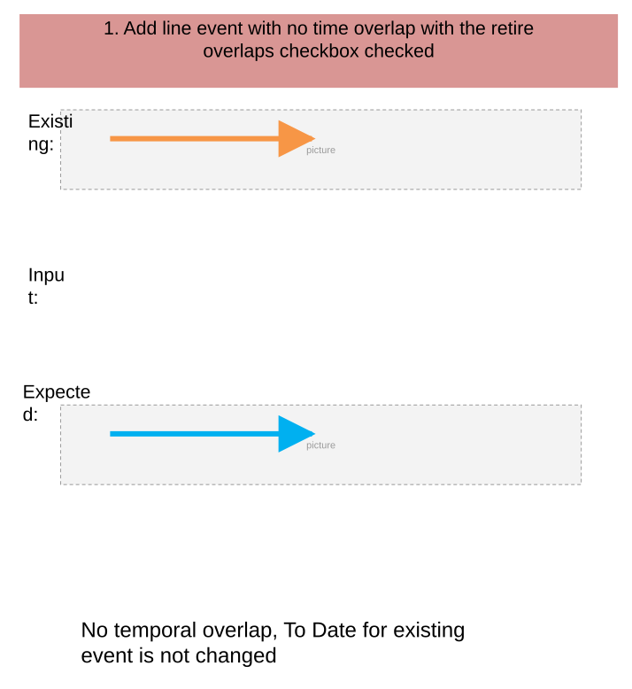

### TC-U21 — Add line event that is temporally before the existing event <!-- src: S2 · slide 26 · case 2 -->

| Event Layer | EventID | From RouteID | From Date | To Date | From Measure | To Measure | Extra Attribute |
| --- | --- | --- | --- | --- | --- | --- | --- |
| RoadType | Event A | Route1 | 1/1/2005 | Null | 0 | 4 | Gravel |

Existing:
Input:

| Event Layer | EventID | From RouteID | From Date | To Date | From Measure | To Measure | Extra Attribute |
| --- | --- | --- | --- | --- | --- | --- | --- |
| RoadType | Event B | Route1 | 1/1/2000 | 1/1/2004 | 0 | 4 | Paved |

Expected:

| Event Layer | EventID | From RouteID | From Date | To Date | From Measure | To Measure | Extra Attribute |
| --- | --- | --- | --- | --- | --- | --- | --- |
| RoadType | Event A | Route1 | 1/1/2005 | Null | 0 | 4 | Gravel |
| RoadType | Event B | Route1 | 1/1/2000 | 1/1/2004 | 0 | 4 | Paved |

No temporal overlap, To Date for existing event is not changed

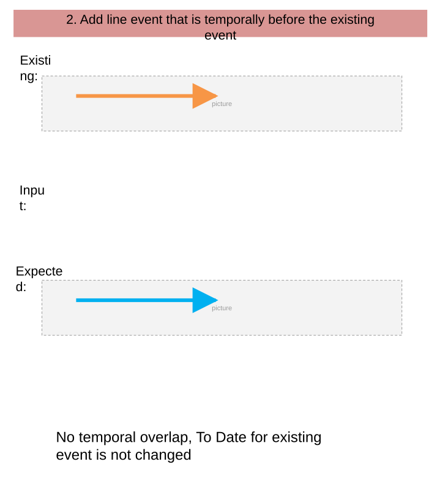

## Other content

### Slide 11 <!-- slide 11 -->

7A. Add line event with From Date before existing events with time slices

| Event Layer | EventID | From RouteID | From Date | To Date | From Measure | To Measure | Extra Attribute |
| --- | --- | --- | --- | --- | --- | --- | --- |
| Road Type | Event A | Route1 | 1/1/2000 | 1/1/2005 | 0 | 6 | Gravel |
| Road Type | Event A | Route1 | 1/1/2005 | 1/1/2010 | 2 | 6 | Gravel |
| Road Type | Event B | Route1 | 1/1/2005 | Null | 0 | 2 | Dirt |
| Road Type | Event A | Route1 | 1/1/2010 | 1/1/2015 | 4 | 6 | Gravel |
| Road Type | Event C | Route1 | 1/1/2010 | Null | 2 | 4 | Chip |
| Road Type | Event D | Route1 | 1/1/2015 | Null | 4 | 6 | Paved |

Existing:
Input:

| Event Layer | EventID | From RouteID | From Date | To Date | From Measure | To Measure | Extra Attribute |
| --- | --- | --- | --- | --- | --- | --- | --- |
| Road Type | Event E | Route1 | 1/1/2000 | Null | 0 | 8 | Asphalt |

Expected:

| Event Layer | EventID | From RouteID | From Date | To Date | From Measure | To Measure | Extra Attribute |
| --- | --- | --- | --- | --- | --- | --- | --- |
| Road Type | Event E | Route1 | 1/1/2000 | Null | 0 | 8 | Asphalt |

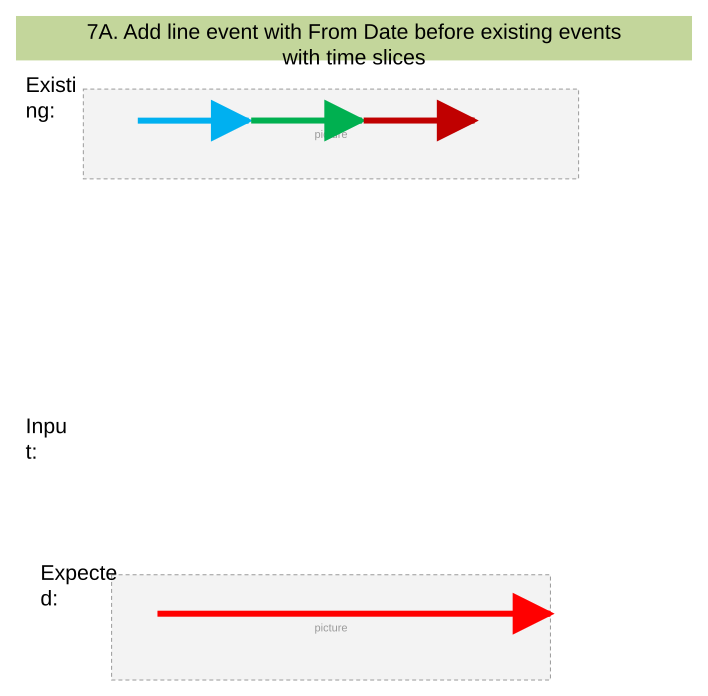

### Slide 12 <!-- slide 12 -->

7B.    Add line event with From Date before the first event in overlapping section with multiple time slices

| Event Layer | EventID | From RouteID | From Date | To Date | From Measure | To Measure | Extra Attribute |
| --- | --- | --- | --- | --- | --- | --- | --- |
| Road Type | Event A | Route1 | 1/1/2000 | 1/1/2005 | 0 | 6 | Gravel |
| Road Type | Event A | Route1 | 1/1/2005 | 1/1/2010 | 2 | 6 | Gravel |
| Road Type | Event B | Route1 | 1/1/2005 | Null | 0 | 2 | Dirt |
| Road Type | Event A | Route1 | 1/1/2010 | 1/1/2015 | 4 | 6 | Gravel |
| Road Type | Event C | Route1 | 1/1/2010 | Null | 2 | 4 | Chip |
| Road Type | Event D | Route1 | 1/1/2015 | Null | 4 | 6 | Paved |

Existing:
Input:

| Event Layer | EventID | From RouteID | From Date | To Date | From Measure | To Measure | Extra Attribute |
| --- | --- | --- | --- | --- | --- | --- | --- |
| Road Type | Event E | Route1 | 1/1/1995 | Null | 0 | 8 | Asphalt |

Expected:

| Event Layer | EventID | From RouteID | From Date | To Date | From Measure | To Measure | Extra Attribute |
| --- | --- | --- | --- | --- | --- | --- | --- |
| Road Type | Event E | Route1 | 1/1/1995 | Null | 0 | 8 | Asphalt |

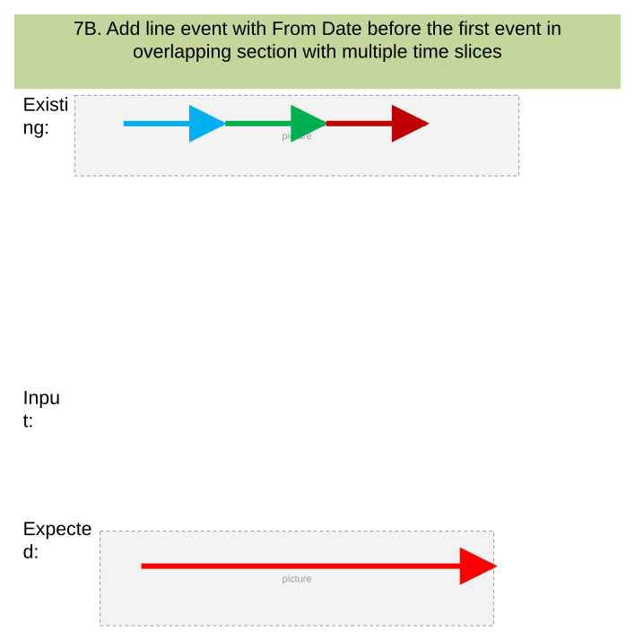
