# Merge Events Pro Test Plan

| Field | Value |
| --- | --- |
| **Doc** | 647 · Test Plan · Pro |
| **Product** | — |
| **Release** | — |
| **Issues** | [ArcGISPro/ps-location-referencing#3921](https://devtopia.esri.com/ArcGISPro/ps-location-referencing/issues/3921) |
| **Source** | [3921-MergeEventsToolProTestPlan_V5.pptx](<https://esriis.sharepoint.com/sites/LocationReferencing/Shared%20Documents/General/Test%20Plans/3921-MergeEventsToolProTestPlan_V5.pptx>) · rev V5 |
| **People** | author Mac Christmas · PE — · dev — |
| **Edited** | 2022-08-10 22:31 by Mac Christmas |
| **Extracted** | 2026-09-04 · lane xmlstrip · format 3.0 · prompt v2.0.2 |
| **Keywords** | merge events · event merging · event attributes · gap calibration · referents · conflict prevention · event retirement · measure validation |
| **Tools** | Merge Events |

## Summary

This test plan covers positive and negative test cases for the Merge Events tool in ArcGIS Pro. It includes scenarios for merging events with various date and measure configurations, gap calibration methods, referent preservation, conflict prevention, and error conditions related to event selection and measure validity.

## Related documents

<!-- related:begin -->
- [Merge Events Widget Test Plan](<https://esriis.sharepoint.com/sites/lrsworkspace/LRS Doc Index/Test Plans/16934-merge-events-widget.md>) — similar text 0.65 · 2 title words · 1 filename word · same kind/folder <!-- rel:437 s=6.051 -->
- [Merge Events User Story](<https://esriis.sharepoint.com/sites/lrsworkspace/LRS Doc Index/User Stories/merge-events.md>) — similar text 0.61 · 2 title words · 2 filename words · same surface <!-- rel:675 s=5.151 -->
- [Splitting Events in ArcGIS Pro - Test Plan](<https://esriis.sharepoint.com/sites/lrsworkspace/LRS Doc Index/Test Plans/3920-splitting-events-in-pro.md>) — similar text 0.19 · 2 title words · 1 filename word · same kind/surface/folder <!-- rel:491 s=3.881 -->
- [Add Point Event tool/ Add Multipoint Events tool Coordinate offset method – Test Plan](<https://esriis.sharepoint.com/sites/lrsworkspace/LRS Doc Index/Test Plans/3905-add-point-event-tool-add-multipoint-events-tool-coordinate.md>) — similar text 0.22 · 1 title word · 2 filename words · same kind/surface/folder <!-- rel:638 s=3.843 -->
- [Merge Events in Experience Builder](<https://esriis.sharepoint.com/sites/lrsworkspace/LRS Doc Index/User Stories/merge-events-in-exb.md>) — similar text 0.48 · 2 title words · 2 filename words <!-- rel:466 s=3.827 -->
<!-- related:end -->

<!-- docs:begin -->
## Esri documentation

[Merge events](https://doc.esri.com/en/arcgis-pro/latest/help/production/roads-highways/merge-events.html) · [Event editing using the attribute table](https://doc.esri.com/en/arcgis-pro/latest/help/production/location-referencing-pipelines/event-editing-using-the-attribute-table.html) · [Storing referent and offset information for event location](https://doc.esri.com/en/arcgis-pro/latest/help/production/location-referencing-pipelines/storing-referent-and-offset-information-for-event-location.html) · [Conflict prevention](https://doc.esri.com/en/arcgis-pro/latest/help/production/location-referencing-pipelines/conflict-prevention.html) · [Event behavior for route retirement](https://doc.esri.com/en/arcgis-pro/latest/help/production/location-referencing-pipelines/event-behavior-for-route-retirement.html)
<!-- docs:end -->

---

## Test Cases

### TC-P01 — Merge events without changing the To Date or the From and To Measures. <!-- src: S4 · slide 1 · Positive Tests · 1 -->

### TC-P02 — Merge events with changed From/To Dates. <!-- src: S4 · slide 1 · Positive Tests · 2 -->

### TC-P03 — Merge events shortening/lengthening the output merged event using the From <!-- src: S4 · slide 1 · Positive Tests · 3 -->

- **Case:** Merge events shortening/lengthening the output merged event using the From Measure value.

### TC-P04 — Merge events shortening/lengthening the output merged event using the To Measure <!-- src: S4 · slide 1 · Positive Tests · 4 -->

- **Case:** Merge events shortening/lengthening the output merged event using the To Measure value.

### TC-P05 — Merge events shortening/lengthening the output merged event using both the From <!-- src: S4 · slide 1 · Positive Tests · 5 -->

- **Case:** Merge events shortening/lengthening the output merged event using both the From and To Measure values.

### TC-P06 — Merge events with different gap calibration configurations (stepping increment <!-- src: S4 · slide 1 · Positive Tests · 6 -->

- **Case:** Merge events with different gap calibration configurations (stepping increment, adding increment, or Euclidean distance).

### TC-P07 — Merge events with referents present for both the location of first event (1) <!-- src: S4 · slide 1 · Positive Tests · 7 -->

- **Case:** Merge events with referents present for both the location of first event and the last event. The referent information will remain intact if the resultant event’s From and/or To Measures are not changed.

### TC-P08 — Merge events with overlaps. <!-- src: S4 · slide 1 · Positive Tests · 8 -->

### TC-P09 — Merge non co-incident events. The gap between the events will be filled <!-- src: S4 · slide 1 · Positive Tests · 9 -->

- **Case:** Merge non co-incident events. The gap between the events will be filled for the resultant event.

### TC-P10 — Upon running the tool, all input events are retired correctly <!-- src: S4 · slide 1 · Positive Tests · 10 -->

- **Case:** Upon running the tool, all input events are retired correctly, populating the To Date of input events with the entered From Date within the Merge Events tool.

### TC-P11 — Conflict Prevention is applied correctly (1) <!-- src: S4 · slide 1 · Positive Tests · 11 -->

- **Case:** Conflict Prevention is applied correctly, with event locks being checked for and acquired (if no existing lock) once the merge button is clicked.

### TC-P12 — Merge events with many input events. <!-- src: S4 · slide 1 · Positive Tests · 12 -->

### TC-P13 — Merge events with different From/To Dates. <!-- src: S4 · slide 1 · Positive Tests · 13 -->

### TC-P14 — Merge events with different route From/To Dates. <!-- src: S4 · slide 1 · Positive Tests · 14 -->

### TC-P15 — Merge events with the output event having the same From Date as the input (1) <!-- src: S4 · slide 1 · Positive Tests · 15 -->

- **Case:** Merge events with the output event having the same From Date as the input events.

### TC-P16 — Merge events with the output event having the same From Date as one of the input (1) <!-- src: S4 · slide 1 · Positive Tests · 16 -->

- **Case:** Merge events with the output event having the same From Date as one of the input events.

### TC-P17 — Only feature service line events are within the Event parameter drop-down menu. <!-- src: S4 · slide 2 · Positive Tests: Tool UI · 1 -->

- **Group:** Tool UI

### TC-P18 — An event is selected by default within the Event parameter drop-down menu <!-- src: S4 · slide 2 · Positive Tests: Tool UI · 2 -->

- **Group:** Tool UI
- **Case:** An event is selected by default within the Event parameter drop-down menu when Merge Events is opened.

### TC-P19 — If there are already event features selected within the map <!-- src: S4 · slide 2 · Positive Tests: Tool UI · 3 -->

- **Group:** Tool UI
- **Case:** If there are already event features selected within the map, an event is not selected by default from the Event parameter drop-down menu.

### TC-P20 — Once a valid event is chosen <!-- src: S4 · slide 2 · Positive Tests: Tool UI · 4 -->

- **Group:** Tool UI
- **Case:** Once a valid event is chosen, the mouse pointer will become a rectangle feature selector by default.

### TC-P21 — Selection type drop-down menu shows the same options as the choose centerline <!-- src: S4 · slide 2 · Positive Tests: Tool UI · 5 -->

- **Group:** Tool UI
- **Case:** Selection type drop-down menu shows the same options as the choose centerline tool (rectangle, polygon, lasso, etc.).

### TC-P22 — Once an event is selected from the specified event feature class (1) <!-- src: S4 · slide 2 · Positive Tests: Tool UI · 6 -->

- **Group:** Tool UI
- **Case:** Once an event is selected from the specified event feature class, the events will become highlighted on the map and within the event’s attribute table.

### TC-P23 — Only events from the chosen event feature class can be selected by the Merge <!-- src: S4 · slide 2 · Positive Tests: Tool UI · 7 -->

- **Group:** Tool UI
- **Case:** Only events from the chosen event feature class can be selected by the Merge Events selection tool.

### TC-P24 — Once an event is selected from the specified event feature class (2) <!-- src: S4 · slide 2 · Positive Tests: Tool UI · 8 -->

- **Group:** Tool UI
- **Case:** Once an event is selected from the specified event feature class, the Events to Merge section appears.

### TC-P25 — Once the tool is executed <!-- src: S4 · slide 2 · Positive Tests: Tool UI · 9 -->

- **Group:** Tool UI
- **Case:** Once the tool is executed, the form collapses to its initial state and provides a successful execution message at the top of the tool pane.

### TC-P26 — Once the tool is executed and the output merged event is created successfully <!-- src: S4 · slide 2 · Positive Tests: Tool UI · 10 -->

- **Group:** Tool UI
- **Case:** Once the tool is executed and the output merged event is created successfully, refresh the layer on the map and flash the output merged event 3 times.

### TC-P27 — Input event feature’s Object IDs are the identifiers within the Events to Merge <!-- src: S4 · slide 2 · Positive Tests: Tool UI · 11 -->

- **Group:** Tool UI
- **Case:** Input event feature’s Object IDs are the identifiers within the Events to Merge section.

### TC-P28 — Input events are sorted by the order of increasing calibration along <!-- src: S4 · slide 2 · Positive Tests: Tool UI · 12 -->

- **Group:** Tool UI
- **Case:** Input events are sorted by the order of increasing calibration along a line/route in the Events to Merge section.

### TC-P29 — The first input event on the list is selected to preserve by default <!-- src: S4 · slide 2 · Positive Tests: Tool UI · 13 -->

- **Group:** Tool UI
- **Case:** The first input event on the list is selected to preserve by default in the Events to Merge section.

### TC-P30 — The delete key removes input events from the list in the Events to Merge <!-- src: S4 · slide 2 · Positive Tests: Tool UI · 14 -->

- **Group:** Tool UI
- **Case:** The delete key removes input events from the list in the Events to Merge section.

### TC-P31 — Clicking the “x” on input events will remove them from the Events to Merge <!-- src: S4 · slide 2 · Positive Tests: Tool UI · 15 -->

- **Group:** Tool UI
- **Case:** Clicking the “x” on input events will remove them from the Events to Merge section.

### TC-P32 — If there are more than 5 input events, a vertical scroll bar appears. <!-- src: S4 · slide 2 · Positive Tests: Tool UI · 16 -->

- **Group:** Tool UI

### TC-P33 — The list of input events selected is dynamically updated as the selection <!-- src: S4 · slide 2 · Positive Tests: Tool UI · 17 -->

- **Group:** Tool UI
- **Case:** The list of input events selected is dynamically updated as the selection changes through the attribute table/map.

### TC-P34 — The selection within the map is updated when input events are added/removed from <!-- src: S4 · slide 2 · Positive Tests: Tool UI · 18 -->

- **Group:** Tool UI
- **Case:** The selection within the map is updated when input events are added/removed from Events to Merge.

### TC-P35 — The event feature selected from the Events to Merge section has “(preserve)” <!-- src: S4 · slide 2 · Positive Tests: Tool UI · 19 -->

- **Group:** Tool UI
- **Case:** The event feature selected from the Events to Merge section has “(preserve)” and its Event ID will be used for the resultant merged event.

### TC-P36 — Only one input event feature at a time can be selected to preserve within <!-- src: S4 · slide 2 · Positive Tests: Tool UI · 20 -->

- **Group:** Tool UI
- **Case:** Only one input event feature at a time can be selected to preserve within the Events to Merge section.

### TC-P37 — When an input event feature is selected to preserve within the Events to Merge <!-- src: S4 · slide 2 · Positive Tests: Tool UI · 21 -->

- **Group:** Tool UI
- **Case:** When an input event feature is selected to preserve within the Events to Merge Section, ensure that it is flashed 3 times within the map.

### TC-P38 — If an input event has already been selected before opening the Merge Events <!-- src: S4 · slide 2 · Positive Tests: Tool UI · 22 -->

- **Group:** Tool UI
- **Case:** If an input event has already been selected before opening the Merge Events tool, selecting the event feature class from the Event parameter drop-down menu will populate the Events to Merge section with the selected input events.

### TC-P39 — Upon opening the attribute table of an event feature class where input events <!-- src: S4 · slide 2 · Positive Tests: Tool UI · 23 -->

- **Group:** Tool UI
- **Case:** Upon opening the attribute table of an event feature class where input events have been selected within the Merge Events tool, the event feature’s attribute table will show the same selection.

### TC-P40 — The From Date is populated with the current date as default and can be edited <!-- src: S4 · slide 3 · Positive Tests: Tool UI (Continued) · 1 -->

- **Group:** Tool UI (Continued)
- **Case:** The From Date is populated with the current date as default and can be edited by the user.

### TC-P41 — For non-line spanning events (1) <!-- src: S4 · slide 3 · Positive Tests: Tool UI (Continued) · 2 -->

- **Group:** Tool UI (Continued)
- **Case:** For non-line spanning events, a checkbox appears to choose the route’s start date for the resultant merged event’s From Date.

### TC-P42 — For non-line spanning events (2) <!-- src: S4 · slide 3 · Positive Tests: Tool UI (Continued) · 3 -->

- **Group:** Tool UI (Continued)
- **Case:** For non-line spanning events, a checkbox appears to use the route’s end date for the resultant merged event’s To Date.

### TC-P43 — Within the Merged Event Attributes section, the fields OID, Shape_Length <!-- src: S4 · slide 3 · Positive Tests: Tool UI (Continued) · 4 -->

- **Group:** Tool UI (Continued)
- **Case:** Within the Merged Event Attributes section, the fields OID, Shape_Length, Loc_Error , Referent, Global ID, and all editor tracking fields are not shown.

### TC-P44 — Fields Event ID and Route ID/Name are not editable. <!-- src: S4 · slide 3 · Positive Tests: Tool UI (Continued) · 5 -->

- **Group:** Tool UI (Continued)

### TC-P45 — Event ID is populated from the selected (preserve) input event. <!-- src: S4 · slide 3 · Positive Tests: Tool UI (Continued) · 6 -->

- **Group:** Tool UI (Continued)

### TC-P46 — From Route and To Route are provided if the event is spanning and if the Route <!-- src: S4 · slide 3 · Positive Tests: Tool UI (Continued) · 7 -->

- **Group:** Tool UI (Continued)
- **Case:** From Route and To Route are provided if the event is spanning and if the Route Name field is configured for the network.

### TC-P47 — Route Name for non-spanning events is provided if Route Name is configured <!-- src: S4 · slide 3 · Positive Tests: Tool UI (Continued) · 8 -->

- **Group:** Tool UI (Continued)
- **Case:** Route Name for non-spanning events is provided if Route Name is configured for the network.

### TC-P48 — Route ID is provided for non-spanning events if no Route Name is configured <!-- src: S4 · slide 3 · Positive Tests: Tool UI (Continued) · 9 -->

- **Group:** Tool UI (Continued)
- **Case:** Route ID is provided for non-spanning events if no Route Name is configured for the network.

### TC-P49 — From Measure of the resultant merged event is equal to the first event <!-- src: S4 · slide 3 · Positive Tests: Tool UI (Continued) · 10 -->

- **Group:** Tool UI (Continued)
- **Case:** From Measure of the resultant merged event is equal to the first event in the increasing order of calibration of the line/route.

### TC-P50 — To Measure of the resultant merged event is equal to the last event <!-- src: S4 · slide 3 · Positive Tests: Tool UI (Continued) · 11 -->

- **Group:** Tool UI (Continued)
- **Case:** To Measure of the resultant merged event is equal to the last event in the increasing order of calibration of the line/route.

### TC-P51 — Domains, subtypes, contingent values, attribute rules <!-- src: S4 · slide 3 · Positive Tests: Tool UI (Continued) · 12 -->

- **Group:** Tool UI (Continued)
- **Case:** Domains, subtypes, contingent values, attribute rules, and non-nullable fields are supported within the editing grid.

### TC-P52 — Required fields are denoted within the Merged Event Attributes section. <!-- src: S4 · slide 3 · Positive Tests: Tool UI (Continued) · 13 -->

- **Group:** Tool UI (Continued)

### TC-P53 — If there are many editable fields, a vertical scroll bar appears. <!-- src: S4 · slide 3 · Positive Tests: Tool UI (Continued) · 14 -->

- **Group:** Tool UI (Continued)

### TC-N01 — Only one line event is selected. (1) <!-- src: S4 · slide 3 · Negative Tests: Error · 1 -->

- **Group:** Error

### TC-N02 — From Date/To Date is changed to dates outside the time extent. <!-- src: S4 · slide 3 · Negative Tests: Error · 2 -->

- **Group:** Error

### TC-N03 — Resultant merged event’s From Date is after the From/To Route’s To Date. <!-- src: S4 · slide 3 · Negative Tests: Error · 3 -->

- **Group:** Error

### TC-N04 — Resultant merged event’s To Date is before the From/To Route’s From Date. <!-- src: S4 · slide 3 · Negative Tests: Error · 4 -->

- **Group:** Error

### TC-N05 — Type no value From/To Measure or a From/To Measure that is invalid <!-- src: S4 · slide 3 · Negative Tests: Error · 5 -->

- **Group:** Error
- **Case:** Type no value From/To Measure or a From/To Measure that is invalid for the route.

### TC-N06 — From Measure is equal to the To Measure when merging on the same route. (1) <!-- src: S4 · slide 3 · Negative Tests: Error · 6 -->

- **Group:** Error

### TC-N07 — From Measure is greater than the To Measure when merging on the same route. (1) <!-- src: S4 · slide 3 · Negative Tests: Error · 7 -->

- **Group:** Error

### TC-N08 — The resultant merged event’s To Date is before the resultant merged event’s From (1) <!-- src: S4 · slide 3 · Negative Tests: Error · 8 -->

- **Group:** Error
- **Case:** The resultant merged event’s To Date is before the resultant merged event’s From Date.

### TC-N09 — The resultant merged event’s To Date is the same date as the resultant merged (1) <!-- src: S4 · slide 3 · Negative Tests: Error · 9 -->

- **Group:** Error
- **Case:** The resultant merged event’s To Date is the same date as the resultant merged event’s From Date.

### TC-N10 — Select input events that belong to multiple lines on a line network. (1) <!-- src: S4 · slide 3 · Negative Tests: Error · 10 -->

- **Group:** Error

### TC-N11 — Select input events that belong to multiple routes for a non-spanning event. (1) <!-- src: S4 · slide 3 · Negative Tests: Error · 11 -->

- **Group:** Error

### TC-N12 — Conflict Prevention locks on a route with input events (1) <!-- src: S4 · slide 3 · Negative Tests: Error · 12 -->

- **Group:** Error
- **Case:** Conflict Prevention locks on a route with input events (from a user in another version) prevents the merge.

### TC-N13 — Conflict Prevention locks on events being edited <!-- src: S4 · slide 4 · Negative Tests: Error · 1 -->

- **Group:** Error
- **Case:** Conflict Prevention locks on events being edited (from a user in another version) prevents the merge.

### TC-N14 — A reconcile with the default version is required before acquiring locks. <!-- src: S4 · slide 4 · Negative Tests: Error · 2 -->

- **Group:** Error

### TC-N15 — For cases 10-14, despite no lock acquired <!-- src: S4 · slide 4 · Negative Tests: Error · 3 -->

- **Group:** Error
- **Case:** For cases 10-14, despite no lock acquired, the input events will remain selected.

### TC-N16 — Number of decimals in the measure fields exceed from that allowed for the event (1) <!-- src: S4 · slide 4 · Negative Tests: Error · 4 -->

- **Group:** Error
- **Case:** Number of decimals in the measure fields exceed from that allowed for the event feature class.

### TC-N17 — Route on a line network with input events is reversed. <!-- src: S4 · slide 4 · Negative Tests: Error · 5 -->

- **Group:** Error

### TC-U01 — Merge events with changed To Date <!-- src: S2 · slide 7 · case 2 -->

| RouteID | From Date | To Date | From Measure | To Measure |
| --- | --- | --- | --- | --- |
| RouteA | 1/1/2000 | Null | 0 | 10 |
| RouteB | 1/1/2000 | Null | 100 | 200 |
| RouteC | 1/1/2000 | Null | 0.23 | 1.65 |
| RouteD | 1/1/2000 | Null | 10 | 12 |

| EventID | From Date | To Date | From Route | From Measure | To Route | To Measure | Attribute |
| --- | --- | --- | --- | --- | --- | --- | --- |
| Event1 | 1/1/2001 | Null | RouteA | 0 | RouteB | 150 | X |
| Event2 | 1/1/2001 | Null | RouteB | 150 | RouteD | 12 | Y |

| EventID | From Date | To Date | From Route | From Measure | To Route | To Measure | Attribute |
| --- | --- | --- | --- | --- | --- | --- | --- |
| Event1 | 1/1/2005 | 1/1/2020 | RouteA | 0 | RouteD | 12 | X |

| EventID | From Date | To Date | From Route | From Measure | To Route | To Measure | Attribute |
| --- | --- | --- | --- | --- | --- | --- | --- |
| Event1 | 1/1/2001 | 1/1/2005 | RouteA | 0 | RouteB | 150 | X |
| Event2 | 1/1/2001 | 1/1/2005 | RouteB | 150 | RouteD | 12 | Y |

[figure: RouteA · RouteB · RouteC · RouteD · 0 · 200/0.23 · 10/100 · 1.65/10 · 12 · Retired input events:]

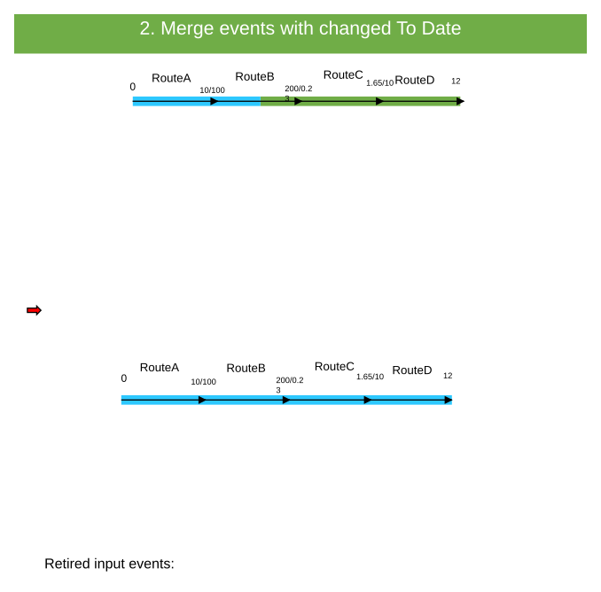

### TC-U02 — Merge Events Altering the Output Merged Event Using Both the From and To Measure <!-- src: S1 · slide 12 · case 5 -->

- **Case:** Merge events altering the output merged event using both the From and To Measure values.

| RouteID | From Date | To Date | From Measure | To Measure |
| --- | --- | --- | --- | --- |
| RouteA | 1/1/2000 | Null | 0 | 10 |
| RouteB | 1/1/2000 | Null | 100 | 200 |
| RouteC | 1/1/2000 | Null | 0.23 | 1.65 |
| RouteD | 1/1/2000 | Null | 10 | 12 |

| EventID | From Date | To Date | From Route | From Measure | To Route | To Measure | Attribute |
| --- | --- | --- | --- | --- | --- | --- | --- |
| Event1 | 1/1/2001 | Null | RouteA | 5 | RouteB | 150 | X |
| Event2 | 1/1/2001 | Null | RouteB | 150 | RouteD | 11 | Y |

| EventID | From Date | To Date | From Route | From Measure | To Route | To Measure | Attribute |
| --- | --- | --- | --- | --- | --- | --- | --- |
| Event1 | 1/1/2005 | Null | RouteA | 0 | RouteD | 12 | X |

| EventID | From Date | To Date | From Route | From Measure | To Route | To Measure | Attribute |
| --- | --- | --- | --- | --- | --- | --- | --- |
| Event1 | 1/1/2001 | 1/1/2005 | RouteA | 5 | RouteB | 150 | X |
| Event2 | 1/1/2001 | 1/1/2005 | RouteB | 150 | RouteD | 11 | Y |

[figure: RouteA · RouteB · RouteC · RouteD · 0 · 200/0.23 · 10/100 · 1.65/10 · 12 · Retired input events:]

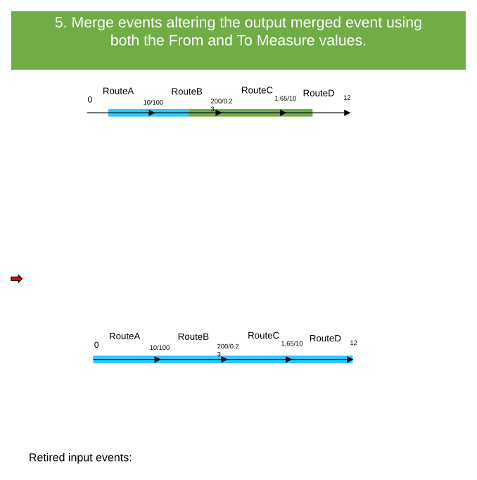

### TC-U03 — Merge Events with Referents Present for Both the Location of First Event (case 7) <!-- src: S1 · slide 16 · case 7 -->

- **Case:** Merge events with referents present for both the location of first event to the last event without changing the From Measure and To Measure. The referent information will remain intact.

| RouteID | From Date | To Date | From Measure | To Measure |
| --- | --- | --- | --- | --- |
| RouteA | 1/1/2000 | Null | 0 | 10 |
| RouteB | 1/1/2000 | Null | 100 | 200 |
| RouteC | 1/1/2000 | Null | 0.23 | 1.65 |
| RouteD | 1/1/2000 | Null | 10 | 12 |

| EventID | From Date | To Date | From Route | From Measure | From Ref Method | From Ref Location | From Ref Offset | To Route | To Measure | To Ref Method | To Ref Location | To Ref Offset |
| --- | --- | --- | --- | --- | --- | --- | --- | --- | --- | --- | --- | --- |
| Event1 | 1/1/2001 | Null | RouteA | 0 | XY | 38.5, 120.5 | 0 | RouteB | 150 | XY | 38.6, 120.5 | 0 |
| Event2 | 1/1/2001 | Null | RouteB | 150 | XY | 38.6, 120.5 | 0 | RouteD | 12 | XY | 38.6, 120.5 | 0 |

| EventID | From Date | To Date | From Route | From Measure | From Ref Method | From Ref Location | From Ref Offset | To Route | To Measure | To Ref Method | To Ref Location | To Ref Offset |
| --- | --- | --- | --- | --- | --- | --- | --- | --- | --- | --- | --- | --- |
| Event1 | 1/1/2005 | Null | RouteA | 0 | XY | 38.5, 120.5 | 0 | RouteD | 12 | XY | 38.6, 120.5 | 0 |

| Attribute |
| --- |
| X |
| Y |

| Attribute |
| --- |
| X |

| EventID | From Date | To Date | From Route | From Measure | From Ref Method | From Ref Location | From Ref Offset | To Route | To Measure | To Ref Method | To Ref Location | To Ref Offset |
| --- | --- | --- | --- | --- | --- | --- | --- | --- | --- | --- | --- | --- |
| Event1 | 1/1/2001 | 1/1/2005 | RouteA | 0 | XY | 38.5, 120.5 | 0 | RouteB | 150 | XY | 38.6, 120.5 | 0 |
| Event2 | 1/1/2001 | 1/1/2005 | RouteB | 150 | XY | 38.6, 120.5 | 0 | RouteD | 12 | XY | 38.6, 120.5 | 0 |

| Attribute |
| --- |
| X |
| Y |

[figure: RouteA · RouteB · RouteC · RouteD · 0 · 200/0.23 · 10/100 · 1.65/10 · 12 · Retired input events:]

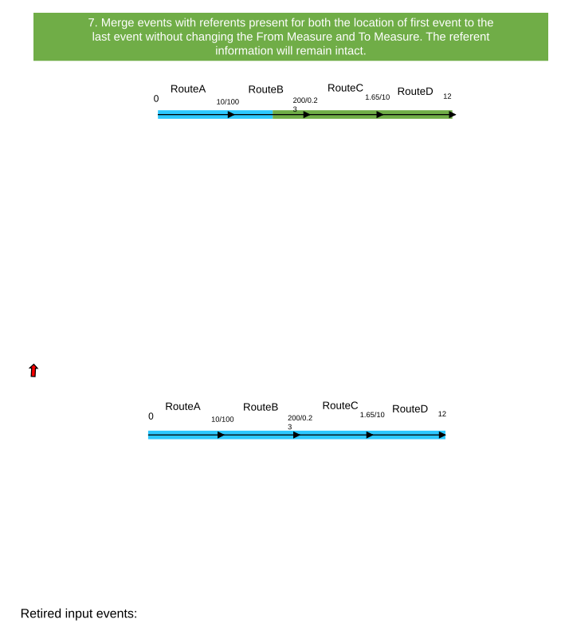

### TC-U04 — Merge events with overlaps <!-- src: S2 · slide 17 · case 8 -->

| RouteID | From Date | To Date | From Measure | To Measure |
| --- | --- | --- | --- | --- |
| RouteA | 1/1/2000 | Null | 0 | 10 |
| RouteB | 1/1/2000 | Null | 100 | 200 |
| RouteC | 1/1/2000 | Null | 0.23 | 1.65 |
| RouteD | 1/1/2000 | Null | 10 | 12 |

| EventID | From Date | To Date | From Route | From Measure | To Route | To Measure | Attribute |
| --- | --- | --- | --- | --- | --- | --- | --- |
| Event1 | 1/1/2001 | Null | RouteA | 0 | RouteB | 150 | X |
| Event2 | 1/1/2001 | Null | RouteB | 100 | RouteD | 12 | Y |

| EventID | From Date | To Date | From Route | From Measure | To Route | To Measure | Attribute |
| --- | --- | --- | --- | --- | --- | --- | --- |
| Event1 | 1/1/2005 | Null | RouteA | 0 | RouteD | 12 | X |

| EventID | From Date | To Date | From Route | From Measure | To Route | To Measure | Attribute |
| --- | --- | --- | --- | --- | --- | --- | --- |
| Event1 | 1/1/2001 | 1/1/2005 | RouteA | 0 | RouteB | 150 | X |
| Event2 | 1/1/2001 | 1/1/2005 | RouteB | 100 | RouteD | 12 | Y |

[figure: RouteA · RouteB · RouteC · RouteD · 0 · 200/0.23 · 10/100 · 1.65/10 · 12 · Retired input events:]

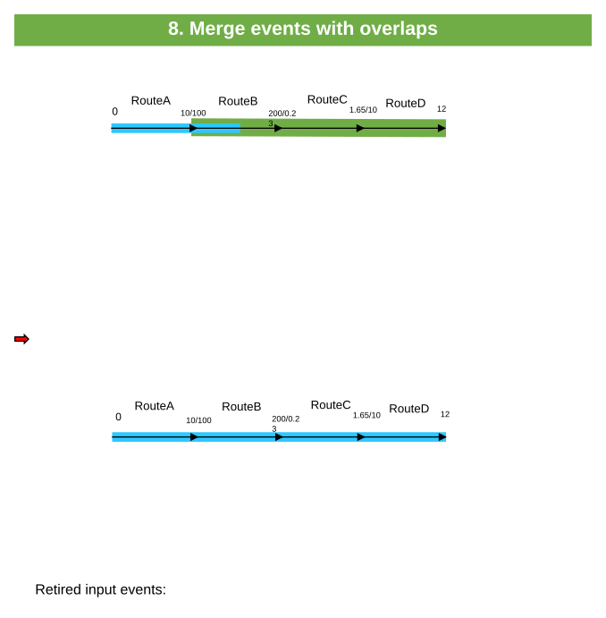

### TC-U05 — Merge non co-incident events <!-- src: S2 · slide 18 · case 9 -->

| RouteID | From Date | To Date | From Measure | To Measure |
| --- | --- | --- | --- | --- |
| RouteA | 1/1/2000 | Null | 0 | 10 |
| RouteB | 1/1/2000 | Null | 100 | 200 |
| RouteC | 1/1/2000 | Null | 10 | 20 |
| RouteD | 1/1/2000 | Null | 10 | 12 |

| EventID | From Date | To Date | From Route | From Measure | To Route | To Measure | Attribute |
| --- | --- | --- | --- | --- | --- | --- | --- |
| Event1 | 1/1/2001 | Null | RouteA | 0 | RouteB | 200 | X |
| Event2 | 1/1/2001 | Null | RouteC | 15 | RouteD | 12 | Y |

| EventID | From Date | To Date | From Route | From Measure | To Route | To Measure | Attribute |
| --- | --- | --- | --- | --- | --- | --- | --- |
| Event2 | 1/1/2005 | Null | RouteA | 0 | RouteD | 12 | Y |

| EventID | From Date | To Date | From Route | From Measure | To Route | To Measure | Attribute |
| --- | --- | --- | --- | --- | --- | --- | --- |
| Event1 | 1/1/2001 | 1/1/2005 | RouteA | 0 | RouteB | 200 | X |
| Event2 | 1/1/2001 | 1/1/2005 | RouteC | 15 | RouteD | 12 | Y |

[figure: RouteA · RouteB · RouteC · RouteD · 0 · 200/0.23 · 10/100 · 1.65/10 · 12 · Retired input events:]

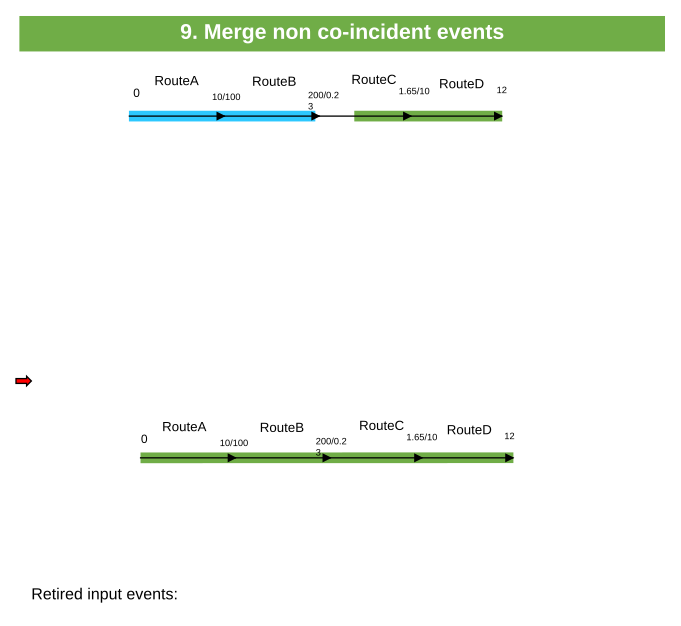

### TC-U06 — Input Events Are Retired Correctly <!-- src: S1 · slide 19 · case 10 -->

- **Case:** Input events are retired correctly, populating the To Date of input events with the entered From Date within the Merge Events tool.

| RouteID | From Date | To Date | From Measure | To Measure |
| --- | --- | --- | --- | --- |
| RouteA | 1/1/2000 | Null | 0 | 10 |
| RouteB | 1/1/2000 | Null | 100 | 200 |
| RouteC | 1/1/2000 | Null | 0.23 | 1.65 |
| RouteD | 1/1/2000 | Null | 10 | 12 |

| EventID | From Date | To Date | From Route | From Measure | To Route | To Measure | Attribute |
| --- | --- | --- | --- | --- | --- | --- | --- |
| Event1 | 1/1/2001 | Null | RouteA | 0 | RouteB | 150 | X |
| Event2 | 1/1/2001 | Null | RouteB | 150 | RouteD | 12 | Y |

| EventID | From Date | To Date | From Route | From Measure | To Route | To Measure | Attribute |
| --- | --- | --- | --- | --- | --- | --- | --- |
| Event1 | 1/1/2005 | Null | RouteA | 0 | RouteD | 12 | X |

| EventID | From Date | To Date | From Route | From Measure | To Route | To Measure | Attribute |
| --- | --- | --- | --- | --- | --- | --- | --- |
| Event1 | 1/1/2001 | 1/1/2005 | RouteA | 0 | RouteB | 150 | X |
| Event2 | 1/1/2001 | 1/1/2005 | RouteB | 150 | RouteD | 12 | Y |

[figure: Retired input events: · RouteA · RouteB · RouteC · RouteD · 0 · 200/0.23 · 10/100 · 1.65/10 · 12]

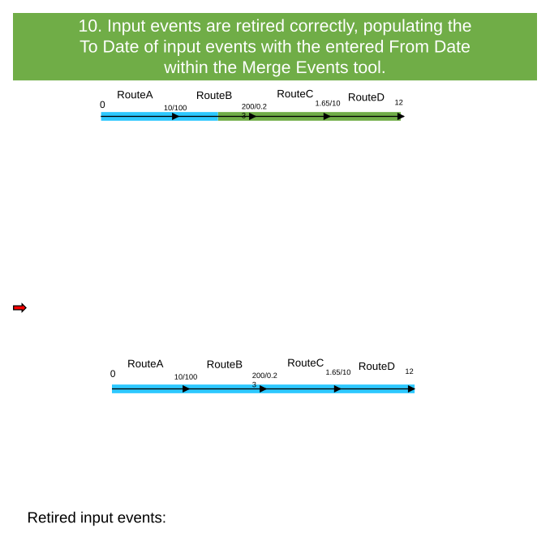

### TC-U07 — Conflict Prevention Is Applied Correctly (case 11) <!-- src: S1 · slide 20 · case 11 -->

- **Case:** Conflict Prevention is applied correctly, with event locks being checked for and acquired (if no existing lock) once the merge button is clicked.

| RouteID | From Date | To Date | From Measure | To Measure |
| --- | --- | --- | --- | --- |
| RouteA | 1/1/2000 | Null | 0 | 10 |
| RouteB | 1/1/2000 | Null | 100 | 200 |
| RouteC | 1/1/2000 | Null | 10 | 20 |
| RouteD | 1/1/2000 | Null | 10 | 12 |

| EventID | From Date | To Date | From Route | From Measure | To Route | To Measure | Attribute |
| --- | --- | --- | --- | --- | --- | --- | --- |
| Event1 | 1/1/2001 | Null | RouteA | 0 | RouteB | 200 | X |
| Event2 | 1/1/2001 | Null | RouteC | 15 | RouteD | 12 | Y |

| EventID | From Date | To Date | From Route | From Measure | To Route | To Measure | Attribute |
| --- | --- | --- | --- | --- | --- | --- | --- |
| Event2 | 1/1/2005 | Null | RouteA | 0 | RouteD | 12 | Y |

| EventID | From Date | To Date | From Route | From Measure | To Route | To Measure | Attribute |
| --- | --- | --- | --- | --- | --- | --- | --- |
| Event1 | 1/1/2001 | 1/1/2005 | RouteA | 0 | RouteB | 200 | X |
| Event2 | 1/1/2001 | 1/1/2005 | RouteC | 15 | RouteD | 12 | Y |

[figure: No locks · RouteA · RouteB · RouteC · RouteD · 0 · 200/0.23 · 10/100 · 1.65/10 · 12 · Retired input events:]

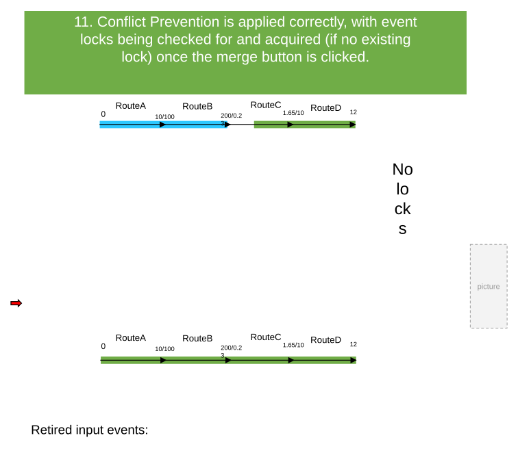

### TC-U08 — Merge events with many input events <!-- src: S2 · slide 21 · case 12 -->

| RouteID | From Date | To Date | From Measure | To Measure |
| --- | --- | --- | --- | --- |
| RouteA | 1/1/2000 | Null | 0 | 10 |

| EventID | From Date | To Date | Route | From Measure | To Measure | Attribute |
| --- | --- | --- | --- | --- | --- | --- |
| Event1 | 1/1/2000 | Null | RouteA | 0 | 5 | X |
| Event2 | 1/1/2010 | Null | RouteA | 5 | 10 | Y |
| Event3 | 1/1/2011 | Null | RouteA | 2 | 4 | Z |
| Event4 | 1/1/2015 | Null | RouteA | 6 | 9 | A |

| EventID | From Date | To Date | Route | From Measure | To Measure | Attribute |
| --- | --- | --- | --- | --- | --- | --- |
| Event1 | 1/1/2016 | Null | RouteA | 0 | 10 | X |

| EventID | From Date | To Date | Route | From Measure | To Measure | Attribute |
| --- | --- | --- | --- | --- | --- | --- |
| Event1 | 1/1/2000 | 1/1/2016 | RouteA | 0 | 5 | X |
| Event2 | 1/1/2010 | 1/1/2016 | RouteA | 5 | 10 | Y |
| Event3 | 1/1/2011 | 1/1/2016 | RouteA | 2 | 4 | Z |
| Event4 | 1/1/2015 | 1/1/2016 | RouteA | 6 | 9 | A |

[figure: RouteA · 0 · 10 · Retired input events:]

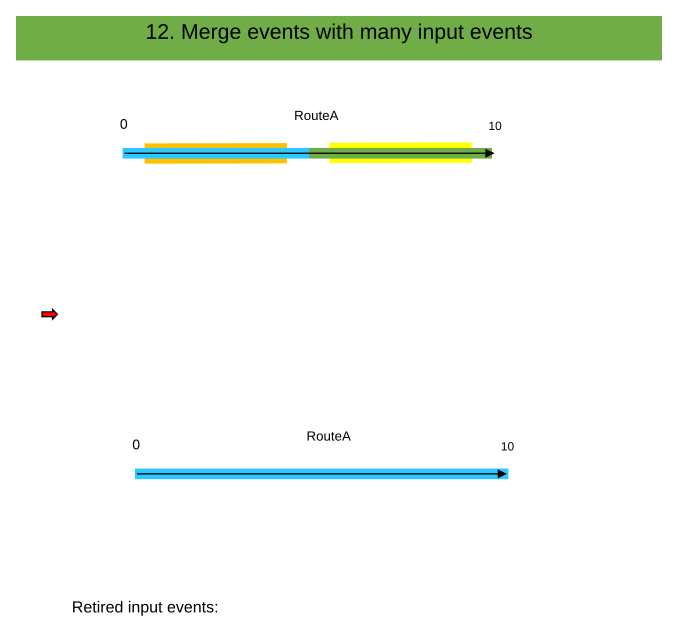

### TC-U09 — Merge Events with Different From / To Dates. <!-- src: S1 · slide 22 · case 13 -->

| RouteID | From Date | To Date | From Measure | To Measure |
| --- | --- | --- | --- | --- |
| RouteA | 1/1/2000 | Null | 0 | 10 |
| RouteB | 1/1/2000 | Null | 100 | 200 |
| RouteC | 1/1/2000 | Null | 10 | 20 |
| RouteD | 1/1/2000 | Null | 10 | 12 |

| EventID | From Date | To Date | From Route | From Measure | To Route | To Measure | Attribute |
| --- | --- | --- | --- | --- | --- | --- | --- |
| Event1 | 1/1/2005 | Null | RouteA | 0 | RouteB | 200 | X |
| Event2 | 1/1/2003 | Null | RouteC | 15 | RouteD | 12 | Y |

| EventID | From Date | To Date | From Route | From Measure | To Route | To Measure | Attribute |
| --- | --- | --- | --- | --- | --- | --- | --- |
| Event2 | 1/1/2010 | Null | RouteA | 0 | RouteD | 12 | Y |

| EventID | From Date | To Date | From Route | From Measure | To Route | To Measure | Attribute |
| --- | --- | --- | --- | --- | --- | --- | --- |
| Event1 | 1/1/2005 | 1/1/2010 | RouteA | 0 | RouteB | 200 | X |
| Event2 | 1/1/2003 | 1/1/2010 | RouteC | 15 | RouteD | 12 | Y |

[figure: RouteA · RouteB · RouteC · RouteD · 0 · 200/0.23 · 10/100 · 1.65/10 · 12 · Retired input events:]

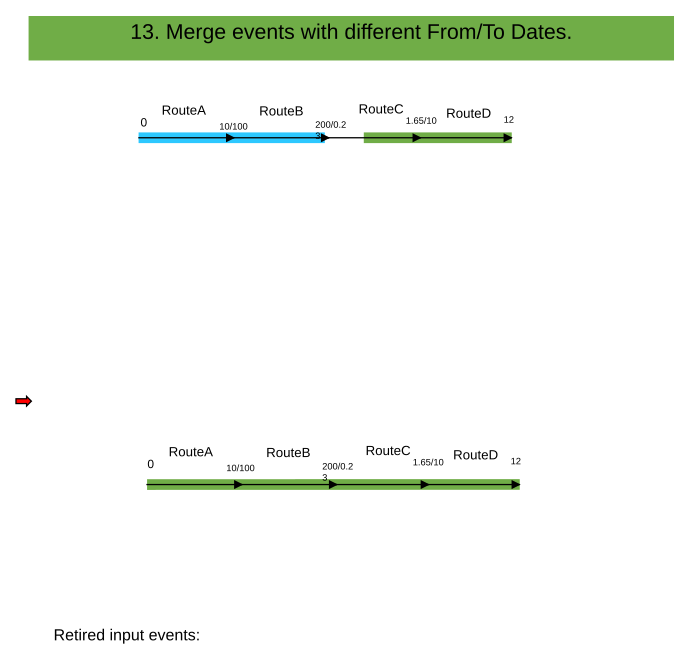

### TC-U10 — Merge Events with Different Route From / To Dates. <!-- src: S1 · slide 23 · case 14 -->

| RouteID | From Date | To Date | From Measure | To Measure |
| --- | --- | --- | --- | --- |
| RouteA | 1/1/2000 | Null | 0 | 10 |
| RouteB | 1/1/2001 | Null | 100 | 200 |
| RouteC | 1/1/2001 | Null | 10 | 20 |
| RouteD | 1/1/2004 | Null | 10 | 12 |

| EventID | From Date | To Date | From Route | From Measure | To Route | To Measure | Attribute |
| --- | --- | --- | --- | --- | --- | --- | --- |
| Event1 | 1/1/2005 | Null | RouteA | 0 | RouteB | 200 | X |
| Event2 | 1/1/2006 | Null | RouteC | 15 | RouteD | 12 | Y |

| EventID | From Date | To Date | From Route | From Measure | To Route | To Measure | Attribute |
| --- | --- | --- | --- | --- | --- | --- | --- |
| Event2 | 1/1/2010 | Null | RouteA | 0 | RouteD | 12 | Y |

| EventID | From Date | To Date | From Route | From Measure | To Route | To Measure | Attribute |
| --- | --- | --- | --- | --- | --- | --- | --- |
| Event1 | 1/1/2005 | 1/1/2010 | RouteA | 0 | RouteB | 200 | X |
| Event2 | 1/1/2003 | 1/1/2010 | RouteC | 15 | RouteD | 12 | Y |

[figure: RouteA · RouteB · RouteC · RouteD · 0 · 200/0.23 · 10/100 · 1.65/10 · 12 · Retired input events:]

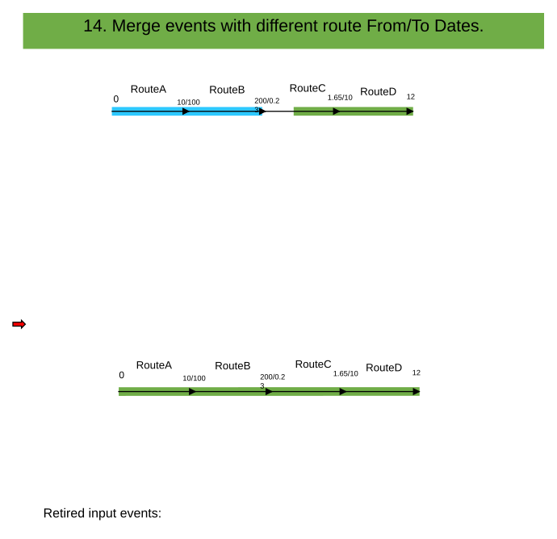

### TC-U11 — Merge Events with the Output Event Having the Same From Date as the Input (case 15) <!-- src: S1 · slide 24 · case 15 -->

- **Case:** Merge events with the output event having the same From Date as the input events.

| RouteID | From Date | To Date | From Measure | To Measure |
| --- | --- | --- | --- | --- |
| RouteA | 1/1/2000 | Null | 0 | 10 |

| EventID | From Date | To Date | From Measure | Route | To Measure | Attribute |
| --- | --- | --- | --- | --- | --- | --- |
| Event1 | 1/1/2001 | Null | 0 | RouteA | 5 | X |
| Event2 | 1/1/2001 | Null | 5 | RouteB | 10 | Y |

| EventID | From Date | To Date | From Measure | Route | To Measure | Attribute |
| --- | --- | --- | --- | --- | --- | --- |
| Event1 | 1/1/2001 | Null | 0 | RouteA | 10 | X |

Input events will be removed with the output event since Event1 and Event2’s From/To Dates are the same date.

[figure: RouteA · RouteB · RouteC · RouteD · 0 · 10]

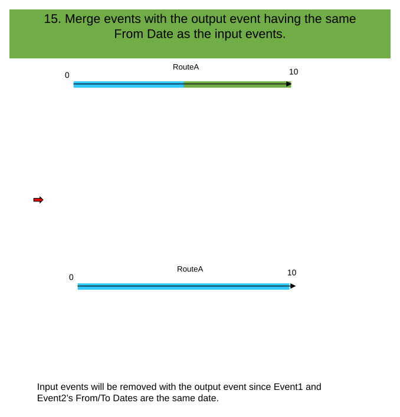

### TC-U12 — Merge Events with the Output Event Having the Same From Date as One of the Input (case 16) <!-- src: S1 · slide 25 · case 16 -->

- **Case:** Merge events with the output event having the same From Date as one of the input events.

| RouteID | From Date | To Date | From Measure | To Measure |
| --- | --- | --- | --- | --- |
| RouteA | 1/1/2000 | Null | 0 | 10 |

| EventID | From Date | To Date | From Measure | Route | To Measure | Attribute |
| --- | --- | --- | --- | --- | --- | --- |
| Event1 | 1/1/2002 | Null | 0 | RouteA | 5 | X |
| Event2 | 1/1/2001 | Null | 5 | RouteB | 10 | Y |

| EventID | From Date | To Date | From Measure | Route | To Measure | Attribute |
| --- | --- | --- | --- | --- | --- | --- |
| Event1 | 1/1/2002 | Null | 0 | RouteA | 10 | X |

Retired input events (Event1 is removed):

| EventID | From Date | To Date | From Measure | Route | To Measure | Attribute |
| --- | --- | --- | --- | --- | --- | --- |
| Event2 | 1/1/2001 | 1/1/2002 | 5 | RouteB | 10 | Y |

[figure: RouteA · RouteB · RouteC · RouteD · 0 · 10]

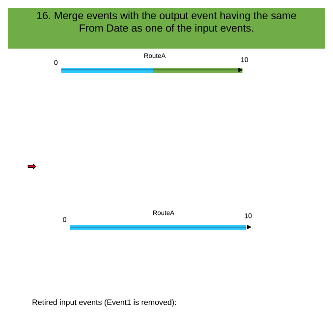

### TC-U13 — Only One Line Event Is Selected. (case 1) <!-- src: S1 · slide 26 · case 1 -->

| RouteID | From Date | To Date | From Measure | To Measure |
| --- | --- | --- | --- | --- |
| RouteA | 1/1/2000 | Null | 0 | 10 |
| RouteB | 1/1/2000 | Null | 100 | 200 |
| RouteC | 1/1/2000 | Null | 0.23 | 1.65 |
| RouteD | 1/1/2000 | Null | 10 | 12 |

| EventID | From Date | To Date | From Route | From Measure | To Route | To Measure | Attribute |
| --- | --- | --- | --- | --- | --- | --- | --- |
| Event1 | 1/1/2001 | Null | RouteA | 0 | RouteB | 150 | X |

Only one event is selected.  The tools requires 2 minimum input events.

[figure: Error · RouteA · RouteB · RouteC · RouteD · 0 · 200/0.23 · 10/100 · 1.65/10 · 12]

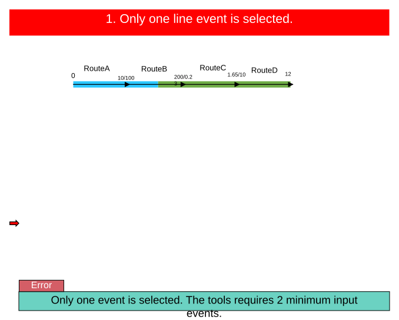

### TC-U14 — From Date / To Date Is Changed To Dates Outside the Time Extent. <!-- src: S1 · slide 27 · case 2 -->

| RouteID | From Date | To Date | From Measure | To Measure |
| --- | --- | --- | --- | --- |
| RouteA | 1/1/2000 | Null | 0 | 10 |
| RouteB | 1/1/2000 | Null | 100 | 200 |
| RouteC | 1/1/2000 | Null | 0.23 | 1.65 |
| RouteD | 1/1/2000 | Null | 10 | 12 |

| EventID | From Date | To Date | From Route | From Measure | To Route | To Measure | Attribute |
| --- | --- | --- | --- | --- | --- | --- | --- |
| Event1 | 1/1/2001 | Null | RouteA | 0 | RouteB | 150 | X |
| Event2 | 1/1/2001 | Null | RouteB | 150 | RouteD | 12 | Y |

| EventID | From Date | To Date | From Route | From Measure | To Route | To Measure | Attribute |
| --- | --- | --- | --- | --- | --- | --- | --- |
| Event1 | 1/1/1600 | 1/1/3500 | RouteA | 0 | RouteD | 12 | X |

The From and To Date values are not within the time extent of the map’s data.

[figure: Error · RouteA · RouteB · RouteC · RouteD · 0 · 200/0.23 · 10/100 · 1.65/10 · 12]

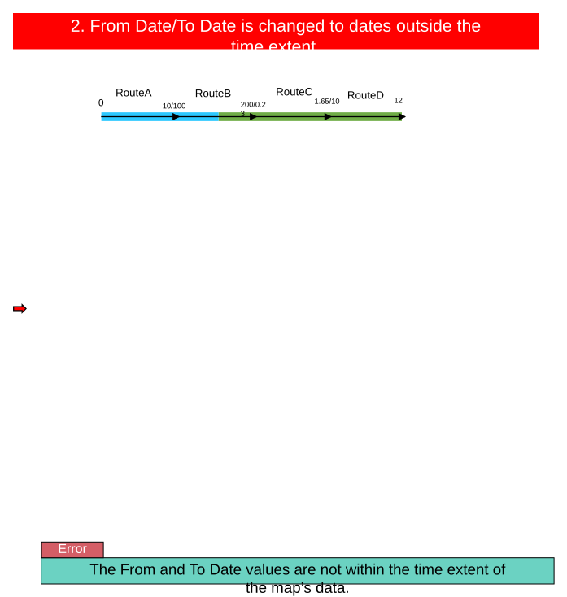

### TC-U15 — From Measure Is Equal To the To Measure When Merging on the Same Route. (case 6) <!-- src: S1 · slide 34 · case 6 -->

| RouteID | From Date | To Date | From Measure | To Measure |
| --- | --- | --- | --- | --- |
| RouteA | 1/1/2000 | Null | 0 | 10 |

| EventID | From Date | To Date | Route | From Measure | To Measure | Attribute |
| --- | --- | --- | --- | --- | --- | --- |
| Event1 | 1/1/2000 | Null | RouteA | 0 | 5 | X |
| Event2 | 1/1/2010 | Null | RouteA | 5 | 10 | Y |

The output event’s From and To Measure Values cannot be the same value.

| EventID | From Date | To Date | Route | From Measure | To Measure | Attribute |
| --- | --- | --- | --- | --- | --- | --- |
| Event1 | 1/1/2010 | Null | RouteA | 5 | 5 | X |

[figure: RouteA · Error · 0 · 10]

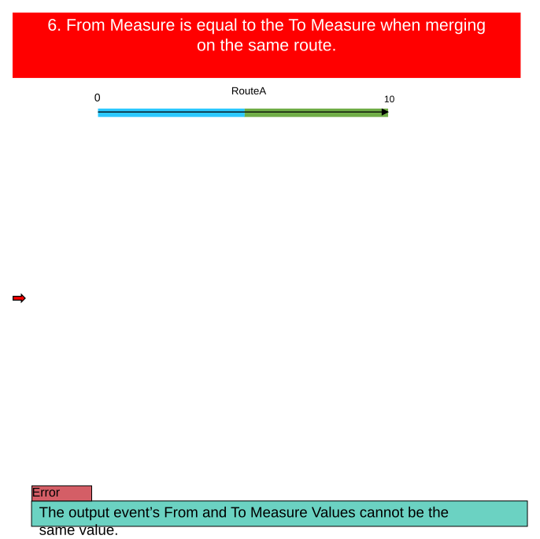

### TC-U16 — From Measure Is Greater Than the To Measure When Merging on the Same Route. (case 7) <!-- src: S1 · slide 35 · case 7 -->

| RouteID | From Date | To Date | From Measure | To Measure |
| --- | --- | --- | --- | --- |
| RouteA | 1/1/2000 | Null | 0 | 10 |

| EventID | From Date | To Date | Route | From Measure | To Measure | Attribute |
| --- | --- | --- | --- | --- | --- | --- |
| Event1 | 1/1/2000 | Null | RouteA | 0 | 5 | X |
| Event2 | 1/1/2010 | Null | RouteA | 5 | 10 | Y |

The output event’s From Measure is greater than the To Measure.

| EventID | From Date | To Date | Route | From Measure | To Measure | Attribute |
| --- | --- | --- | --- | --- | --- | --- |
| Event1 | 1/1/2010 | Null | RouteA | 10 | 5 | X |

[figure: RouteA · Error · 0 · 10]

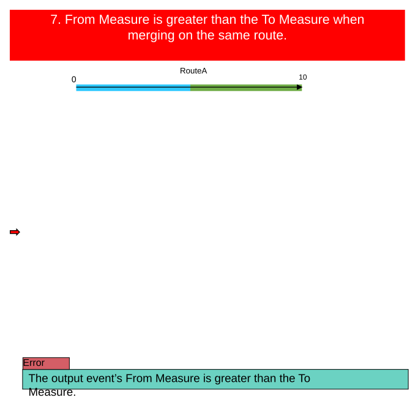

### TC-U17 — The Resultant Merged Event’s To Date Is Before the Resultant Merged Event’s From (case 8) <!-- src: S1 · slide 36 · case 8 -->

- **Case:** The resultant merged event’s To Date is before the resultant merged event’s From Date.

| RouteID | From Date | To Date | From Measure | To Measure |
| --- | --- | --- | --- | --- |
| RouteA | 1/1/2000 | Null | 0 | 10 |

| EventID | From Date | To Date | Route | From Measure | To Measure | Attribute |
| --- | --- | --- | --- | --- | --- | --- |
| Event1 | 1/1/2000 | Null | RouteA | 0 | 5 | X |
| Event2 | 1/1/2010 | Null | RouteA | 5 | 10 | Y |

The output event’s To Date value is before the From Date value.

| EventID | From Date | To Date | From Measure | To Measure | Attribute |
| --- | --- | --- | --- | --- | --- |
| Event1 | 1/1/2020 | 1/1/2005 | 0 | 10 | X |

[figure: RouteA · Error · 0 · 10]

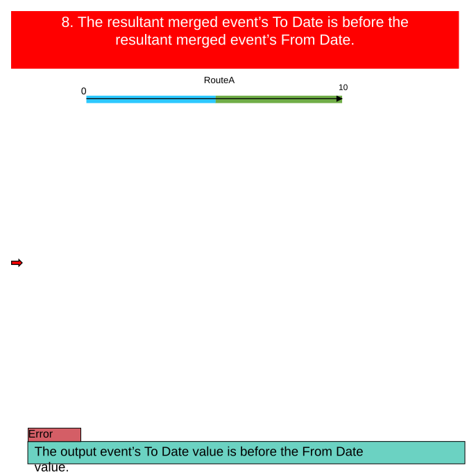

### TC-U18 — The Resultant Merged Event’s To Date Is the Same Date as the Resultant Merged (case 9) <!-- src: S1 · slide 37 · case 9 -->

- **Case:** The resultant merged event’s To Date is the same date as the resultant merged event’s From Date.

| RouteID | From Date | To Date | From Measure | To Measure |
| --- | --- | --- | --- | --- |
| RouteA | 1/1/2000 | Null | 0 | 10 |

| EventID | From Date | To Date | Route | From Measure | To Measure | Attribute |
| --- | --- | --- | --- | --- | --- | --- |
| Event1 | 1/1/2000 | Null | RouteA | 0 | 5 | X |
| Event2 | 1/1/2010 | Null | RouteA | 5 | 10 | Y |

The output event’s From and To Dates are the same value.

| EventID | From Date | To Date | From Measure | To Measure | Attribute |
| --- | --- | --- | --- | --- | --- |
| Event1 | 1/1/2015 | 1/1/2015 | 0 | 10 | X |

[figure: RouteA · Error · 0 · 10]

### TC-U19 — Select Input Events That Belong To Multiple Lines on a Line Network. (case 10) <!-- src: S1 · slide 38 · case 10 -->

| RouteID | From Date | To Date | From Measure | To Measure |
| --- | --- | --- | --- | --- |
| RouteA | 1/1/2000 | Null | 0 | 10 |
| RouteB | 1/1/2000 | Null | 100 | 200 |
| RouteC | 1/1/2010 | Null | 0.23 | 1.65 |
| RouteD | 1/1/2010 | Null | 10 | 12 |

| EventID | From Date | To Date | From Route | From Measure | To Route | To Measure | Attribute |
| --- | --- | --- | --- | --- | --- | --- | --- |
| Event1 | 1/1/2000 | Null | RouteA | 0 | RouteB | 200 | X |
| Event2 | 1/1/2010 | Null | RouteC | 0.23 | RouteD | 12 | Y |

The input events belong to different line.

[figure: Error · Line 1 · Line 2 · RouteA · RouteB · RouteC · RouteD · 0 · 200/0.23 · 10/100 · 1.65/10 · 12]

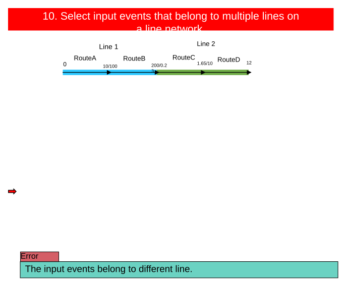

### TC-U20 — Select Input Events That Belong To Multiple Routes for a Non-spanning Event. (case 11) <!-- src: S1 · slide 39 · case 11 -->

| RouteID | From Date | To Date | From Measure | To Measure |
| --- | --- | --- | --- | --- |
| RouteA | 1/1/2000 | Null | 0 | 10 |
| RouteB | 1/1/2000 | Null | 0 | 15 |

| EventID | From Date | To Date | From Measure | Route | To Measure | Attribute |
| --- | --- | --- | --- | --- | --- | --- |
| Event1 | 1/1/2000 | Null | 0 | RouteA | 10 | X |
| Event2 | 1/1/2010 | Null | 0 | RouteB | 15 | Y |

The input events belong to a non-spanning event.  The output event cannot be spanning.

[figure: RouteA · RouteB · RouteC · RouteD · Error · 0 · 10/0 · 15]

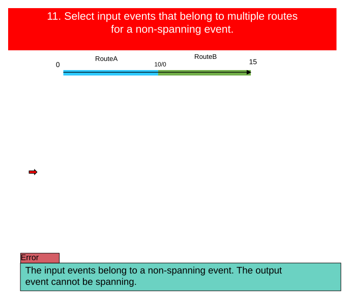

### TC-U21 — Conflict Prevention Locks on a Route with Input Events (case 12) <!-- src: S1 · slide 40 · case 12 -->

- **Case:** Conflict Prevention locks on a route with input events (from a user in another version) prevents the merge.

| RouteID | From Date | To Date | From Measure | To Measure |
| --- | --- | --- | --- | --- |
| RouteA | 1/1/2000 | Null | 0 | 10 |
| RouteB | 1/1/2000 | Null | 100 | 200 |
| RouteC | 1/1/2000 | Null | 0.23 | 1.65 |
| RouteD | 1/1/2000 | Null | 10 | 12 |

| EventID | From Date | To Date | From Route | From Measure | To Route | To Measure | Attribute |
| --- | --- | --- | --- | --- | --- | --- | --- |
| Event1 | 1/1/2000 | Null | RouteA | 0 | RouteB | 150 | X |
| Event2 | 1/1/2000 | Null | RouteB | 150 | RouteD | 12 | Y |

Locked in another version
Unable to acquire lock. RouteA has a lock due to another user editing the route  feature in another version.

[figure: Error · RouteA · RouteB · RouteC · RouteD · 0 · 200/0.23 · 10/100 · 1.65/10 · 12]

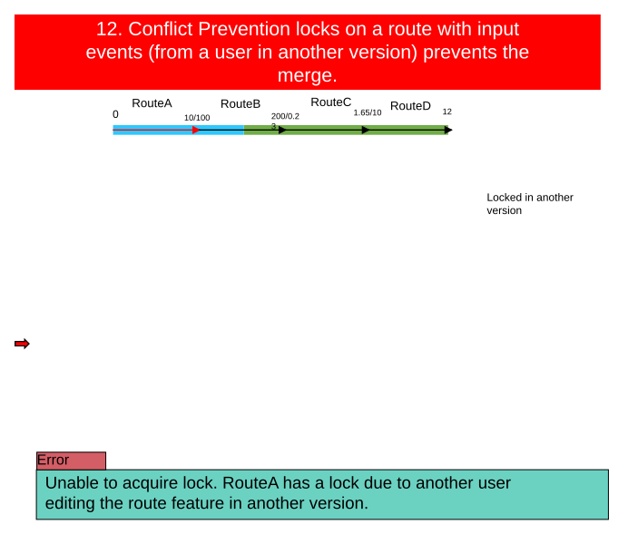

### TC-U22 — Number of Decimals in the Measure Fields Exceed From That Allowed for the Event (case 16) <!-- src: S1 · slide 43 · case 16 -->

- **Case:** Number of decimals in the measure fields exceed from that allowed for the event feature class.

| RouteID | From Date | To Date | From Measure | To Measure |
| --- | --- | --- | --- | --- |
| RouteA | 1/1/2000 | Null | 0 | 10 |
| RouteB | 1/1/2000 | Null | 100 | 200 |
| RouteC | 1/1/2000 | Null | 0.23 | 1.65 |
| RouteD | 1/1/2000 | Null | 10 | 12 |

| EventID | From Date | To Date | From Route | From Measure | To Route | To Measure | Attribute |
| --- | --- | --- | --- | --- | --- | --- | --- |
| Event1 | 1/1/2000 | Null | RouteA | 0 | RouteB | 150 | X |
| Event2 | 1/1/2000 | Null | RouteB | 150 | RouteD | 12 | Y |

The output event’s From Measure exceeds the number of decimals allowed for the feature class.
New From Measure for output event: 1.

[figure: Error · RouteA · RouteB · RouteC · RouteD · 0 · 200/0.23 · 10/100 · 1.65/10 · 12]

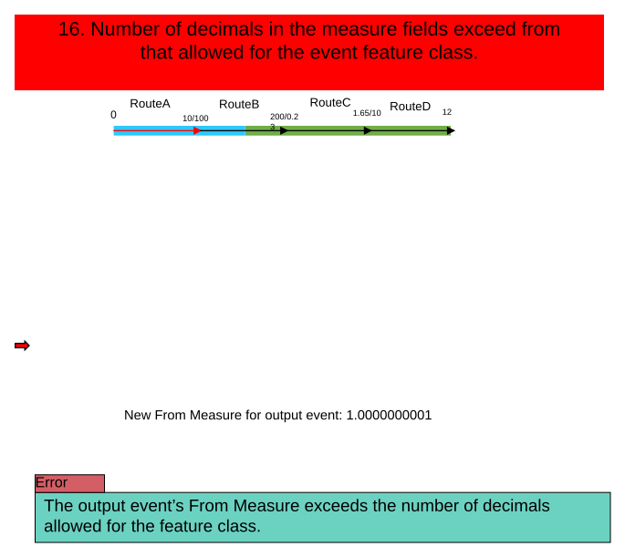

### TC-U23 — Route on Line Network with Input Events Is Reversed. <!-- src: S1 · slide 44 · case 17 -->

| RouteID | From Date | To Date | From Measure | To Measure |
| --- | --- | --- | --- | --- |
| RouteA | 1/1/2000 | Null | 10 | 0 |
| RouteB | 1/1/2000 | Null | 100 | 200 |
| RouteC | 1/1/2000 | Null | 0.23 | 1.65 |
| RouteD | 1/1/2000 | Null | 10 | 12 |

| EventID | From Date | To Date | From Route | From Measure | To Route | To Measure | Attribute |
| --- | --- | --- | --- | --- | --- | --- | --- |
| Event1 | 1/1/2000 | Null | RouteA | 0 | RouteA | 10 | X |
| Event2 | 1/1/2000 | Null | RouteB | 100 | RouteD | 12 | Y |

One route that houses an input event is reversed.  All input routes must be increase in calibration.

[figure: Error · RouteA · RouteB · RouteC · RouteD · 10 · 200/0.23 · 0 /100 · 1.65/10 · 12]

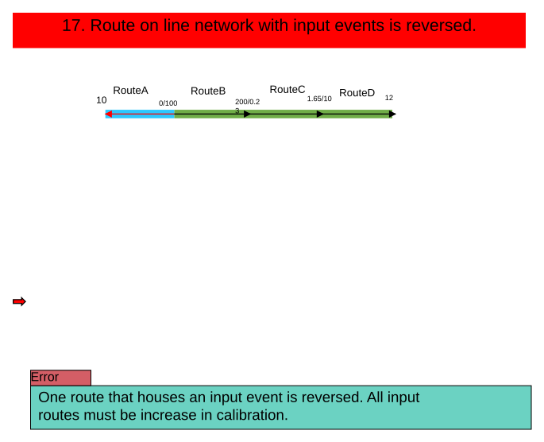

## Other content

### Slide 1 — Merge Events Pro Test Plan <!-- slide 1 -->

**Notes**
- Test with line and non-line networks.
- Test with spanning and non-spanning line events.
- Test with gapped and normal routes.
- Test with projected and unprojected data.
- Only feature service data is supported.
- Same workflow as Event Editor.
- REST call will go through LRS apply edits.
- Verify core tools that result in a merge don’t work with LRS event layers (in both Pro and REST).

### Slide 5 <!-- slide 5 -->

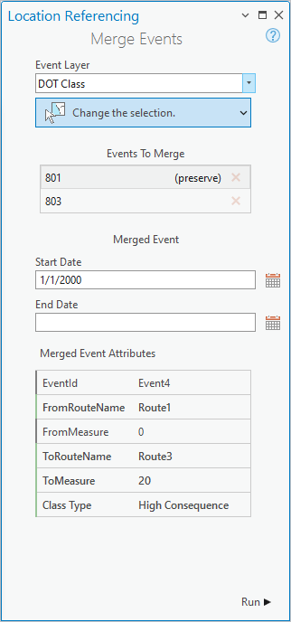

### Slide 6 — Merge events without changing To Date or From/To Measures <!-- slide 6 -->

| RouteID | From Date | To Date | From Measure | To Measure |
| --- | --- | --- | --- | --- |
| RouteA | 1/1/2000 | Null | 0 | 10 |
| RouteB | 1/1/2000 | Null | 100 | 200 |
| RouteC | 1/1/2000 | Null | 0.23 | 1.65 |
| RouteD | 1/1/2000 | Null | 10 | 12 |

| EventID | From Date | To Date | From Route | From Measure | To Route | To Measure | Attribute |
| --- | --- | --- | --- | --- | --- | --- | --- |
| Event1 | 1/1/2001 | Null | RouteA | 0 | RouteB | 150 | X |
| Event2 | 1/1/2001 | Null | RouteB | 150 | RouteD | 12 | Y |

| EventID | From Date | To Date | From Route | From Measure | To Route | To Measure | Attribute |
| --- | --- | --- | --- | --- | --- | --- | --- |
| Event1 | 1/1/2005 | Null | RouteA | 0 | RouteD | 12 | X |

| EventID | From Date | To Date | From Route | From Measure | To Route | To Measure | Attribute |
| --- | --- | --- | --- | --- | --- | --- | --- |
| Event1 | 1/1/2001 | 1/1/2005 | RouteA | 0 | RouteB | 150 | X |
| Event2 | 1/1/2001 | 1/1/2005 | RouteB | 150 | RouteD | 12 | Y |

[figure: RouteA · RouteB · RouteC · RouteD · 0 · 200/0.23 · 10/100 · 1.65/10 · 12 · Retired input events:]

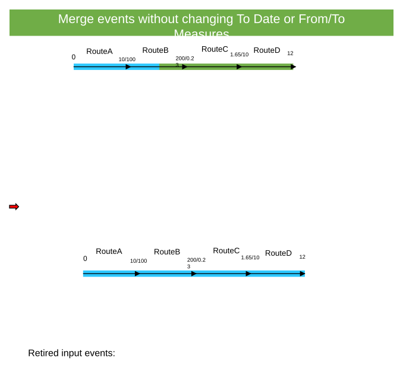

### Slide 8 <!-- slide 8 -->

| RouteID | From Date | To Date | From Measure | To Measure |
| --- | --- | --- | --- | --- |
| RouteA | 1/1/2000 | Null | 0 | 10 |
| RouteB | 1/1/2000 | Null | 100 | 200 |
| RouteC | 1/1/2000 | Null | 0.23 | 1.65 |
| RouteD | 1/1/2000 | Null | 10 | 12 |

| EventID | From Date | To Date | From Route | From Measure | To Route | To Measure | Attribute |
| --- | --- | --- | --- | --- | --- | --- | --- |
| Event1 | 1/1/2001 | Null | RouteA | 0 | RouteB | 150 | X |
| Event2 | 1/1/2001 | Null | RouteB | 150 | RouteD | 12 | Y |

| EventID | From Date | To Date | From Route | From Measure | To Route | To Measure | Attribute |
| --- | --- | --- | --- | --- | --- | --- | --- |
| Event1 | 1/1/2005 | Null | RouteA | 5 | RouteD | 12 | X |

3A. Merge events shortening the output merged event using the From Measure value.

| EventID | From Date | To Date | From Route | From Measure | To Route | To Measure | Attribute |
| --- | --- | --- | --- | --- | --- | --- | --- |
| Event1 | 1/1/2001 | 1/1/2005 | RouteA | 0 | RouteB | 150 | X |
| Event2 | 1/1/2001 | 1/1/2005 | RouteB | 150 | RouteD | 12 | Y |

[figure: RouteA · RouteB · RouteC · RouteD · 0 · 200/0.23 · 10/100 · 1.65/10 · 12 · Retired input events:]

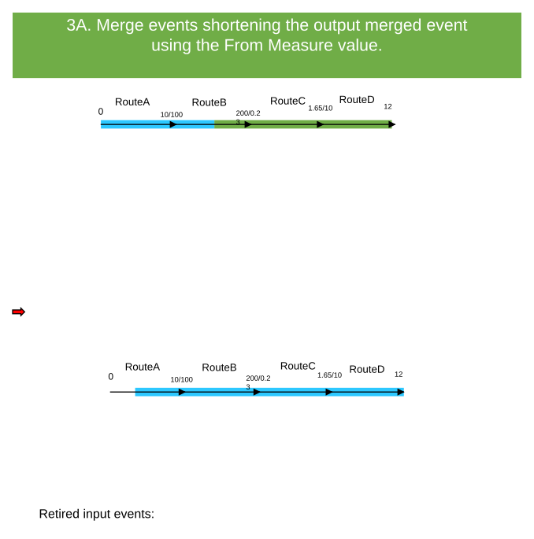

### Slide 9 <!-- slide 9 -->

| RouteID | From Date | To Date | From Measure | To Measure |
| --- | --- | --- | --- | --- |
| RouteA | 1/1/2000 | Null | 0 | 10 |
| RouteB | 1/1/2000 | Null | 100 | 200 |
| RouteC | 1/1/2000 | Null | 0.23 | 1.65 |
| RouteD | 1/1/2000 | Null | 10 | 12 |

| EventID | From Date | To Date | From Route | From Measure | To Route | To Measure | Attribute |
| --- | --- | --- | --- | --- | --- | --- | --- |
| Event1 | 1/1/2001 | Null | RouteA | 5 | RouteB | 150 | X |
| Event2 | 1/1/2001 | Null | RouteB | 150 | RouteD | 12 | Y |

| EventID | From Date | To Date | From Route | From Measure | To Route | To Measure | Attribute |
| --- | --- | --- | --- | --- | --- | --- | --- |
| Event1 | 1/1/2005 | Null | RouteA | 0 | RouteD | 12 | X |

3B. Merge events lengthening the output merged event using the From Measure value.

| EventID | From Date | To Date | From Route | From Measure | To Route | To Measure | Attribute |
| --- | --- | --- | --- | --- | --- | --- | --- |
| Event1 | 1/1/2001 | 1/1/2005 | RouteA | 5 | RouteB | 150 | X |
| Event2 | 1/1/2001 | 1/1/2005 | RouteB | 150 | RouteD | 12 | Y |

[figure: RouteA · RouteB · RouteC · RouteD · 0 · 200/0.23 · 10/100 · 1.65/10 · 12 · Retired input events:]

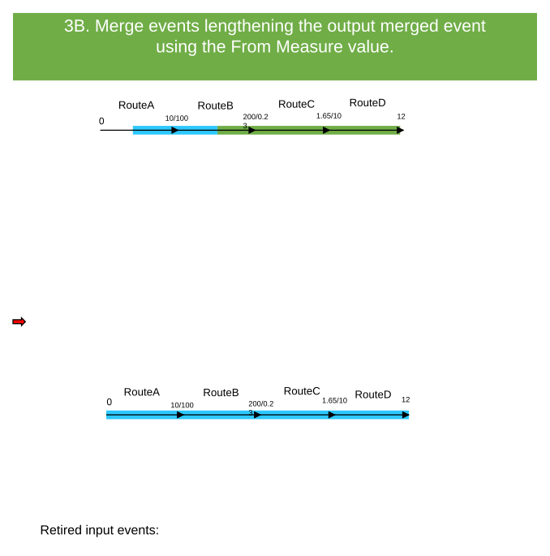

### Slide 10 <!-- slide 10 -->

| RouteID | From Date | To Date | From Measure | To Measure |
| --- | --- | --- | --- | --- |
| RouteA | 1/1/2000 | Null | 0 | 10 |
| RouteB | 1/1/2000 | Null | 100 | 200 |
| RouteC | 1/1/2000 | Null | 0.23 | 1.65 |
| RouteD | 1/1/2000 | Null | 10 | 12 |

| EventID | From Date | To Date | From Route | From Measure | To Route | To Measure | Attribute |
| --- | --- | --- | --- | --- | --- | --- | --- |
| Event1 | 1/1/2001 | Null | RouteA | 0 | RouteB | 150 | X |
| Event2 | 1/1/2001 | Null | RouteB | 150 | RouteD | 12 | Y |

| EventID | From Date | To Date | From Route | From Measure | To Route | To Measure | Attribute |
| --- | --- | --- | --- | --- | --- | --- | --- |
| Event1 | 1/1/2005 | Null | RouteA | 0 | RouteD | 11 | X |

4A. Merge events shortening the output merged event using the To Measure value.

| EventID | From Date | To Date | From Route | From Measure | To Route | To Measure | Attribute |
| --- | --- | --- | --- | --- | --- | --- | --- |
| Event1 | 1/1/2001 | 1/1/2005 | RouteA | 5 | RouteB | 150 | X |
| Event2 | 1/1/2001 | 1/1/2005 | RouteB | 150 | RouteD | 12 | Y |

[figure: RouteA · RouteB · RouteC · RouteD · 0 · 200/0.23 · 10/100 · 1.65/10 · 12 · Retired input events:]

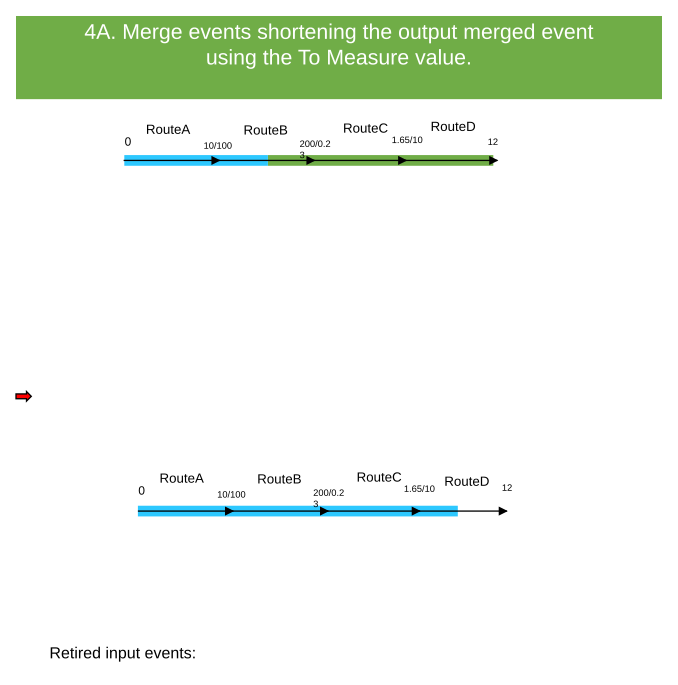

### Slide 11 <!-- slide 11 -->

| RouteID | From Date | To Date | From Measure | To Measure |
| --- | --- | --- | --- | --- |
| RouteA | 1/1/2000 | Null | 0 | 10 |
| RouteB | 1/1/2000 | Null | 100 | 200 |
| RouteC | 1/1/2000 | Null | 0.23 | 1.65 |
| RouteD | 1/1/2000 | Null | 10 | 12 |

| EventID | From Date | To Date | From Route | From Measure | To Route | To Measure | Attribute |
| --- | --- | --- | --- | --- | --- | --- | --- |
| Event1 | 1/1/2001 | Null | RouteA | 0 | RouteB | 150 | X |
| Event2 | 1/1/2001 | Null | RouteB | 150 | RouteD | 11 | Y |

| EventID | From Date | To Date | From Route | From Measure | To Route | To Measure | Attribute |
| --- | --- | --- | --- | --- | --- | --- | --- |
| Event1 | 1/1/2005 | Null | RouteA | 0 | RouteD | 12 | X |

4B. Merge events lengthening the output merged event using the To Measure value.

| EventID | From Date | To Date | From Route | From Measure | To Route | To Measure | Attribute |
| --- | --- | --- | --- | --- | --- | --- | --- |
| Event1 | 1/1/2001 | 1/1/2005 | RouteA | 0 | RouteB | 150 | X |
| Event2 | 1/1/2001 | 1/1/2005 | RouteB | 150 | RouteD | 11 | Y |

[figure: RouteA · RouteB · RouteC · RouteD · 0 · 200/0.23 · 10/100 · 1.65/10 · 12 · Retired input events:]

### Slide 13 <!-- slide 13 -->

| RouteID | From Date | To Date | From Measure | To Measure |
| --- | --- | --- | --- | --- |
| RouteA | 1/1/2000 | Null | 0 | 10 |

| EventID | From Date | To Date | From Measure | To Measure | Attribute |
| --- | --- | --- | --- | --- | --- |
| Event1 | 1/1/2001 | Null | 0 | 5 | X |
| Event2 | 1/1/2001 | Null | 5.1 | 10 | Y |

| EventID | From Date | To Date | From Measure | To Measure | Attribute |
| --- | --- | --- | --- | --- | --- |
| Event1 | 1/1/2005 | Null | 0 | 5 | X |
| Event2 | 1/1/2005 | Null | 5.1 | 10 |  |

6A. Merge events with different gap calibration configurations	 (stepping increment of 0.1)

| EventID | From Date | To Date | From Measure | To Measure | Attribute |
| --- | --- | --- | --- | --- | --- |
| Event1 | 1/1/2001 | 1/1/2005 | 0 | 5 | X |
| Event2 | 1/1/2001 | 1/1/2005 | 5.1 | 10 | Y |

[figure: RouteA · 0 · 5 · 5.1 · 10 · 10.1 · Retired input events:]

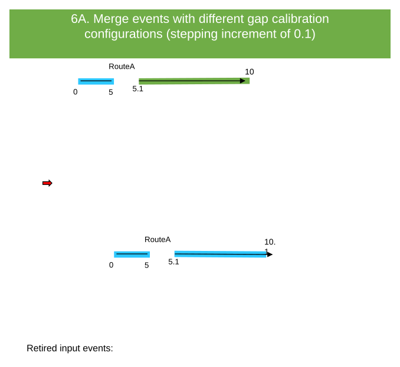

### Slide 14 <!-- slide 14 -->

| RouteID | From Date | To Date | From Measure | To Measure |
| --- | --- | --- | --- | --- |
| RouteA | 1/1/2000 | Null | 0 | 10.1 |

| EventID | From Date | To Date | From Measure | To Measure | Attribute |
| --- | --- | --- | --- | --- | --- |
| Event1 | 1/1/2001 | Null | 0 | 5 | X |
| Event2 | 1/1/2001 | Null | 5.1 | 10.1 | Y |

| EventID | From Date | To Date | From Measure | To Measure | Attribute |
| --- | --- | --- | --- | --- | --- |
| Event1 | 1/1/2005 | Null | 0 | 5 | X |
| Event1 | 1/1/2005 | Null | 5.1 | 10.1 | X |

6B. Merge events with different gap calibration configurations	 (adding increment of 0.1)

| EventID | From Date | To Date | From Measure | To Measure | Attribute |
| --- | --- | --- | --- | --- | --- |
| Event1 | 1/1/2001 | 1/1/2005 | 0 | 5 | X |
| Event2 | 1/1/2001 | 1/1/2005 | 5.1 | 10.1 | Y |

[figure: RouteA · 0 · 5 · 5.1 · 10.1 · Retired input events:]

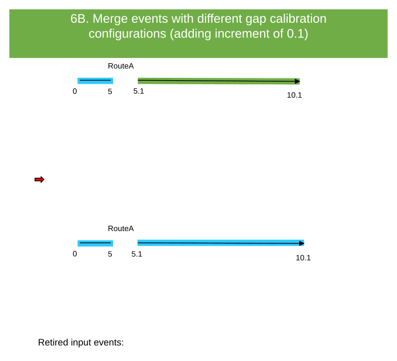

### Slide 15 — Physical gap of 0.5 <!-- slide 15 -->

| RouteID | From Date | To Date | From Measure | To Measure |
| --- | --- | --- | --- | --- |
| RouteA | 1/1/2000 | Null | 0 | 10.1 |

| EventID | From Date | To Date | From Measure | To Measure | Attribute |
| --- | --- | --- | --- | --- | --- |
| Event1 | 1/1/2001 | Null | 0 | 5 | X |
| Event2 | 1/1/2001 | Null | 5.5 | 10.5 | Y |

| EventID | From Date | To Date | From Measure | To Measure | Attribute |
| --- | --- | --- | --- | --- | --- |
| Event1 | 1/1/2005 | Null | 0 | 5 | X |
| Event1 | 1/1/2005 | Null | 5.5 | 10.5 | X |

6C. Merge events with different gap calibration configurations	 (Euclidean distance)

| EventID | From Date | To Date | From Measure | To Measure | Attribute |
| --- | --- | --- | --- | --- | --- |
| Event1 | 1/1/2001 | 1/1/2005 | 0 | 5 | X |
| Event2 | 1/1/2001 | 1/1/2005 | 5.5 | 10.5 | Y |

[figure: RouteA · 0 · 5 · 5.5 · 10.5 · Retired input events:]

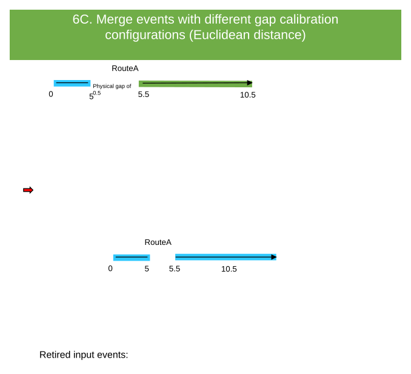

### Slide 28 <!-- slide 28 -->

| RouteID | From Date | To Date | From Measure | To Measure |
| --- | --- | --- | --- | --- |
| RouteA | 1/1/2000 | 1/1/2015 | 0 | 10 |
| RouteB | 1/1/2000 | Null | 100 | 200 |
| RouteC | 1/1/2010 | Null | 0.23 | 1.65 |
| RouteD | 1/1/2010 | Null | 10 | 12 |

| EventID | From Date | To Date | From Route | From Measure | To Route | To Measure | Attribute |
| --- | --- | --- | --- | --- | --- | --- | --- |
| Event1 | 1/1/2001 | Null | RouteA | 0 | RouteB | 200 | X |
| Event2 | 1/1/2001 | Null | RouteC | 0.23 | RouteD | 12 | Y |

3A. Resultant merged event’s From Date is after the From Route’s To Date.
The From Route does not exist in the selected time frame.

| EventID | From Date | To Date | From Route | From Measure | To Route | To Measure | Attribute |
| --- | --- | --- | --- | --- | --- | --- | --- |
| Event1 | 1/1/2020 | Null | RouteA | 0 | RouteD | 12 | X |

[figure: Error · RouteA · RouteB · RouteC · RouteD · 0 · 200/0.23 · 10/100 · 1.65/10 · 12]

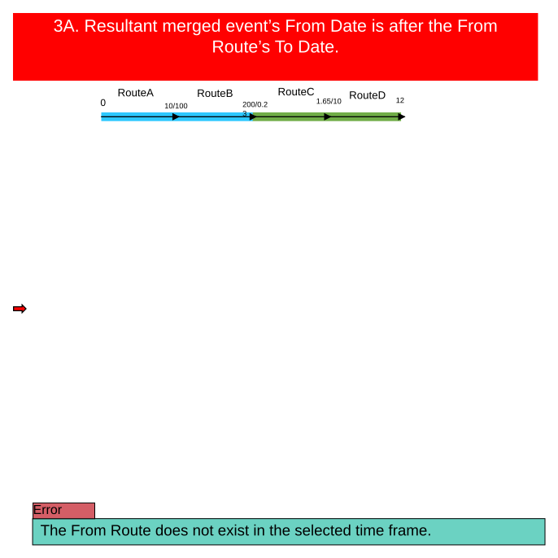

### Slide 29 <!-- slide 29 -->

| RouteID | From Date | To Date | From Measure | To Measure |
| --- | --- | --- | --- | --- |
| RouteA | 1/1/2000 | Null | 0 | 10 |
| RouteB | 1/1/2000 | Null | 100 | 200 |
| RouteC | 1/1/2010 | Null | 0.23 | 1.65 |
| RouteD | 1/1/2010 | 1/1/2015 | 10 | 12 |

| EventID | From Date | To Date | From Route | From Measure | To Route | To Measure | Attribute |
| --- | --- | --- | --- | --- | --- | --- | --- |
| Event1 | 1/1/2001 | Null | RouteA | 0 | RouteB | 200 | X |
| Event2 | 1/1/2010 | Null | RouteC | 0.23 | RouteD | 12 | Y |

3B. Resultant merged event’s From Date is after the To Route’s To Date.
The To Route does not exist in the selected time frame.

| EventID | From Date | To Date | From Route | From Measure | To Route | To Measure | Attribute |
| --- | --- | --- | --- | --- | --- | --- | --- |
| Event1 | 1/1/2020 | Null | RouteA | 0 | RouteD | 12 | X |

[figure: Error · RouteA · RouteB · RouteC · RouteD · 0 · 200/0.23 · 10/100 · 1.65/10 · 12]

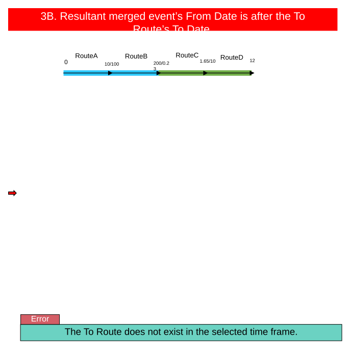

### Slide 30 <!-- slide 30 -->

| RouteID | From Date | To Date | From Measure | To Measure |
| --- | --- | --- | --- | --- |
| RouteA | 1/1/2000 | Null | 0 | 10 |
| RouteB | 1/1/2000 | Null | 100 | 200 |
| RouteC | 1/1/2010 | Null | 0.23 | 1.65 |
| RouteD | 1/1/2010 | Null | 10 | 12 |

| EventID | From Date | To Date | From Route | From Measure | To Route | To Measure | Attribute |
| --- | --- | --- | --- | --- | --- | --- | --- |
| Event1 | 1/1/2001 | Null | RouteA | 0 | RouteB | 200 | X |
| Event2 | 1/1/2010 | Null | RouteC | 0.23 | RouteD | 12 | Y |

4A. Resultant merged event’s To Date is before the From Route’s From Date.
The From Route does not exist in the selected time frame.

| EventID | From Date | To Date | From Route | From Measure | To Route | To Measure | Attribute |
| --- | --- | --- | --- | --- | --- | --- | --- |
| Event1 | 1/1/1995 | Null | RouteA | 0 | RouteD | 12 | X |

[figure: Error · RouteA · RouteB · RouteC · RouteD · 0 · 200/0.23 · 10/100 · 1.65/10 · 12]

### Slide 31 <!-- slide 31 -->

| RouteID | From Date | To Date | From Measure | To Measure |
| --- | --- | --- | --- | --- |
| RouteA | 1/1/2000 | Null | 0 | 10 |
| RouteB | 1/1/2000 | Null | 100 | 200 |
| RouteC | 1/1/2010 | Null | 0.23 | 1.65 |
| RouteD | 1/1/2010 | Null | 10 | 12 |

| EventID | From Date | To Date | From Route | From Measure | To Route | To Measure | Attribute |
| --- | --- | --- | --- | --- | --- | --- | --- |
| Event1 | 1/1/2001 | Null | RouteA | 0 | RouteB | 200 | X |
| Event2 | 1/1/2010 | Null | RouteC | 0.23 | RouteD | 12 | Y |

4B. Resultant merged event’s To Date is before the To Route’s From Date.
The To Route does not exist in the selected time frame.

| EventID | From Date | To Date | From Route | From Measure | To Route | To Measure | Attribute |
| --- | --- | --- | --- | --- | --- | --- | --- |
| Event1 | 1/1/1990 | Null | RouteA | 0 | RouteD | 12 | X |

[figure: Error · RouteA · RouteB · RouteC · RouteD · 0 · 200/0.23 · 10/100 · 1.65/10 · 12]

### Slide 32 <!-- slide 32 -->

| RouteID | From Date | To Date | From Measure | To Measure |
| --- | --- | --- | --- | --- |
| RouteA | 1/1/2000 | Null | 0 | 10 |
| RouteB | 1/1/2000 | Null | 100 | 200 |
| RouteC | 1/1/2010 | Null | 0.23 | 1.65 |
| RouteD | 1/1/2010 | Null | 10 | 12 |

| EventID | From Date | To Date | From Route | From Measure | To Route | To Measure | Attribute |
| --- | --- | --- | --- | --- | --- | --- | --- |
| Event1 | 1/1/2000 | Null | RouteA | 0 | RouteB | 200 | X |
| Event2 | 1/1/2010 | Null | RouteC | 0.23 | RouteD | 12 | Y |

5A. Type a From Measure that is invalid for the route.
The output event’s From Measure is invalid.

| EventID | From Date | To Date | From Route | From Measure | To Route | To Measure | Attribute |
| --- | --- | --- | --- | --- | --- | --- | --- |
| Event1 | 1/1/2010 | Null | RouteA | 11 | RouteD | 12 | X |

[figure: Error · RouteA · RouteB · RouteC · RouteD · 0 · 200/0.23 · 10/100 · 1.65/10 · 12]

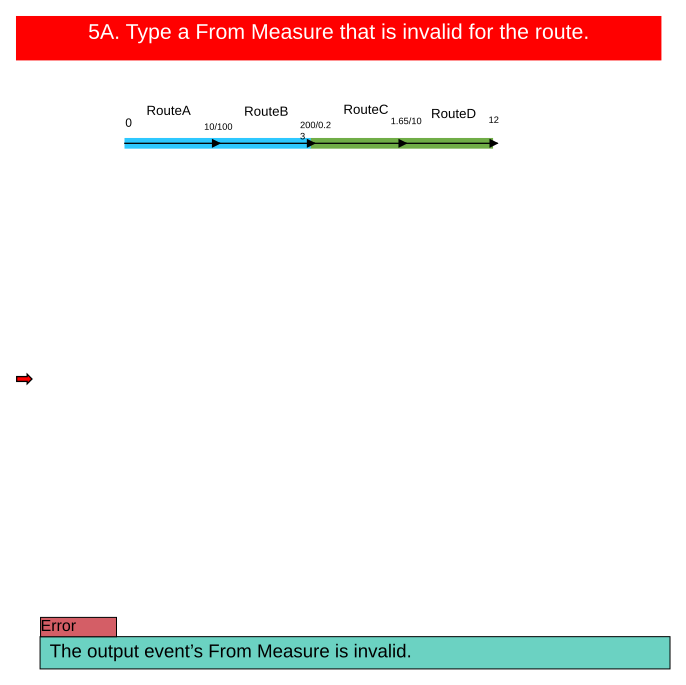

### Slide 33 <!-- slide 33 -->

| RouteID | From Date | To Date | From Measure | To Measure |
| --- | --- | --- | --- | --- |
| RouteA | 1/1/2000 | Null | 0 | 10 |
| RouteB | 1/1/2000 | Null | 100 | 200 |
| RouteC | 1/1/2010 | Null | 0.23 | 1.65 |
| RouteD | 1/1/2010 | Null | 10 | 12 |

| EventID | From Date | To Date | From Route | From Measure | To Route | To Measure | Attribute |
| --- | --- | --- | --- | --- | --- | --- | --- |
| Event1 | 1/1/2000 | Null | RouteA | 0 | RouteB | 200 | X |
| Event2 | 1/1/2010 | Null | RouteC | 0.23 | RouteD | 12 | Y |

5B. Type a To Measure that is invalid for the route.
The output event’s To Measure is invalid.

| EventID | From Date | To Date | From Route | From Measure | To Route | To Measure | Attribute |
| --- | --- | --- | --- | --- | --- | --- | --- |
| Event1 | 1/1/2010 | Null | RouteA | 0 | RouteD | 15 | X |

[figure: Error · RouteA · RouteB · RouteC · RouteD · 0 · 200/0.23 · 10/100 · 1.65/10 · 12]

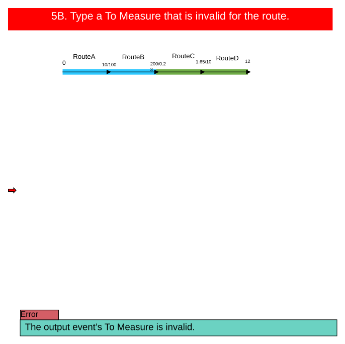

### Slide 41 <!-- slide 41 -->

| RouteID | From Date | To Date | From Measure | To Measure |
| --- | --- | --- | --- | --- |
| RouteA | 1/1/2000 | Null | 0 | 10 |
| RouteB | 1/1/2000 | Null | 100 | 200 |
| RouteC | 1/1/2000 | Null | 0.23 | 1.65 |
| RouteD | 1/1/2000 | Null | 10 | 12 |

| EventID | From Date | To Date | From Route | From Measure | To Route | To Measure | Attribute |
| --- | --- | --- | --- | --- | --- | --- | --- |
| Event1 | 1/1/2000 | Null | RouteA | 0 | RouteB | 150 | X |
| Event2 | 1/1/2000 | Null | RouteB | 150 | RouteD | 12 | Y |

13A. Conflict Prevention locks on events being edited from a user in another version prevents the merge.
Locked in another version
Unable to acquire lock. Event1 has a lock due to another user editing the event feature in another version.

[figure: Error · RouteA · RouteB · RouteC · RouteD · 0 · 200/0.23 · 10/100 · 1.65/10 · 12]

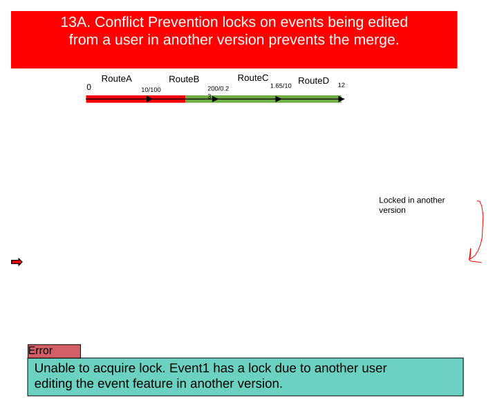

### Slide 42 <!-- slide 42 -->

| RouteID | From Date | To Date | From Measure | To Measure |
| --- | --- | --- | --- | --- |
| RouteA | 1/1/2000 | Null | 0 | 10 |
| RouteB | 1/1/2000 | Null | 100 | 200 |
| RouteC | 1/1/2000 | Null | 0.23 | 1.65 |
| RouteD | 1/1/2000 | Null | 10 | 12 |

| EventID | From Date | To Date | From Route | From Measure | To Route | To Measure | Attribute |
| --- | --- | --- | --- | --- | --- | --- | --- |
| Event1 | 1/1/2000 | Null | RouteA | 0 | RouteB | 150 | X |
| Event2 | 1/1/2000 | Null | RouteB | 150 | RouteD | 12 | Y |

13B. Conflict Prevention locks on events being edited from a user in another version prevents the merge.
Locked in another version
Unable to acquire locks. Event1 and Event2 have locks due to other users editing the event features in other versions.

Locked in another version

[figure: Error · RouteA · RouteB · RouteC · RouteD · 0 · 200/0.23 · 10/100 · 1.65/10 · 12]

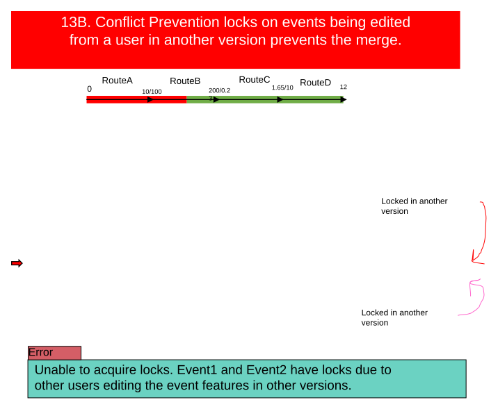
