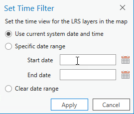

# Set Time Filter Button LR Pro Ribbon: Test Plan

| Field | Value |
| --- | --- |
| **Doc** | 656 · Test Plan · Pro |
| **Product** | — |
| **Release** | — |
| **Issues** | [ArcGISPro/ps-location-referencing#4138](https://devtopia.esri.com/ArcGISPro/ps-location-referencing/issues/4138) |
| **Source** | [4138-SetTimeFilter_TestPlan.pptx](<https://esriis.sharepoint.com/sites/LocationReferencing/Shared%20Documents/General/Test%20Plans/4138-SetTimeFilter_TestPlan.pptx>) |
| **People** | author Mac Christmas · PE — · dev — |
| **Edited** | 2022-07-05 20:52 by Mac Christmas |
| **Extracted** | 2026-09-04 · lane xmlstrip · format 3.0 · prompt v2.0.2 |
| **Keywords** | time filter · set time filter · linear referencing ribbon · feature service · time enabled layers · date range · map time settings |
| **Tools** | — |

## Summary

Test plan for the Set Time Filter button on the Linear Referencing ribbon in ArcGIS Pro. Covers positive and negative test cases related to enabling, disabling, and updating time filters on maps with various time-enabled layers and feature services. Includes behavior verification for date range settings, interaction with Location Referencing Options, and multi-map scenarios.

## Related documents

<!-- related:begin -->
- [Create combined APR-UN Pro ribbon add-in – Test Plan](<https://esriis.sharepoint.com/sites/lrsworkspace/LRS Doc Index/Test Plans/4958-create-combined-apr-un-pro-ribbon-add.md>) — similar text 0.08 · 2 title words · same kind/surface/folder <!-- rel:596 s=2.893 -->
- [Unified Ribbon Test Plan](<https://esriis.sharepoint.com/sites/lrsworkspace/LRS Doc Index/Test Plans/unified-ribbon.md>) — similar text 0.10 · 1 title word · same kind/surface/folder <!-- rel:20 s=2.565 -->
- [Spike: Combined APR-UN Pro Ribbon](<https://esriis.sharepoint.com/sites/lrsworkspace/LRS Doc Index/Design Spikes/combined-apr-un-pro-ribbon.md>) — similar text 0.07 · 2 title words · same surface <!-- rel:633 s=2.506 -->
- [Support Translation Between RouteID and RouteName (and Between LRS Networks) Test Plan](<https://esriis.sharepoint.com/sites/lrsworkspace/LRS Doc Index/Test Plans/4483-support-translation-between-routeid-and-routename-v3.md>) — similar text 0.23 · same kind/surface/folder <!-- rel:620 s=2.187 -->
- [Linear Referencing Ribbon – Unified Experience](<https://esriis.sharepoint.com/sites/lrsworkspace/LRS Doc Index/User Stories/lr-ribbon-unified-experience.md>) — similar text 0.08 · 1 title word · same surface <!-- rel:42 s=2.152 -->
<!-- related:end -->

<!-- docs:begin -->
## Esri documentation

[Set a time filter](https://doc.esri.com/en/arcgis-pro/latest/help/production/location-referencing-pipelines/set-a-time-filter.html) · [Edit feature services](https://doc.esri.com/en/arcgis-pro/latest/help/production/location-referencing-pipelines/edit-feature-services.html)
<!-- docs:end -->

---

## Test Cases

### TC-P01 — Time is disabled. <!-- src: S4 · slide 1 · Positive tests: Button is disabled · 1 -->

- **Group:** Button Is Disabled

### TC-P02 — No LRS Data within map. <!-- src: S4 · slide 1 · Positive tests: Button is disabled · 2 -->

- **Group:** Button Is Disabled

### TC-P03 — FS without time enabled. Button should not be available if time is not enabled <!-- src: S4 · slide 1 · Positive tests: Button is disabled · 3 -->

- **Group:** Button Is Disabled
- **Case:** FS without time enabled. Button should not be available if time is not enabled on the feature service.

### TC-P04 — Only one layer has time enabled <!-- src: S4 · slide 1 · Positive tests: Button is disabled · 4 -->

- **Group:** Button Is Disabled
- **Case:** Only one layer has time enabled, time is then disabled for this layer. Button should become disabled.

### TC-P05 — Same start and end date. <!-- src: S4 · slide 1 · Positive Tests · 1 -->

### TC-P06 — Different start and end dates. <!-- src: S4 · slide 1 · Positive Tests · 2 -->

### TC-P07 — Dates are cleared when the clear date range option is selected and apply <!-- src: S4 · slide 1 · Positive Tests · 3 -->

- **Case:** Dates are cleared when the clear date range option is selected and apply is clicked.

### TC-P08 — If “Set LRS layers in maps to the current date and time when project is opened” <!-- src: S4 · slide 1 · Positive Tests · 4 -->

- **Case:** If “Set LRS layers in maps to the current date and time when project is opened” is selected within the Location Referencing Options, ensure that closing Pro Project and reopening on a different date updates the time filter to the current date.

### TC-P09 — Verify updating the Set Time Filter within the LR Ribbon updates values within <!-- src: S4 · slide 1 · Positive Tests · 5 -->

- **Case:** Verify updating the Set Time Filter within the LR Ribbon updates values within the Time Ribbon.

### TC-P10 — By default, the “Use current system date and time” radio button is selected. <!-- src: S4 · slide 1 · Positive Tests · 6 -->

### TC-N01 — Empty start date, end date is populated. <!-- src: S4 · slide 1 · Negative tests: Error · 1 -->

- **Group:** Error

### TC-N02 — Empty end date, start date is populated. <!-- src: S4 · slide 1 · Negative tests: Error · 2 -->

- **Group:** Error

### TC-N03 — Start and/or end date are outside the extent of the Time Slider. <!-- src: S4 · slide 1 · Negative tests: Error · 3 -->

- **Group:** Error

### TC-P11 — If time is disabled for one layer within Layer Properties on a map with all <!-- src: S4 · slide 2 · Positive Tests · 1 -->

- **Case:** If time is disabled for one layer within Layer Properties on a map with all other layer's time enabled, the time filter should not be altered.

### TC-P12 — Set Time Filter only affects current Map even with multiple Maps open within <!-- src: S4 · slide 2 · Positive Tests · 2 -->

- **Case:** Set Time Filter only affects current Map even with multiple Maps open within a Pro project.

### TC-P13 — Set start date, end date should be auto-populated to the same date. <!-- src: S4 · slide 2 · Positive Tests · 3 -->

### TC-P14 — Set end date, start date should be auto-populated to the same date. <!-- src: S4 · slide 2 · Positive Tests · 4 -->

### TC-P15 — Once the start/end date is auto-populated <!-- src: S4 · slide 2 · Positive Tests · 5 -->

- **Case:** Once the start/end date is auto-populated, changing either the start or end date should not change the other date value.

### TC-P16 — Set Time Filter button is enabled/disabled correctly when switching through <!-- src: S4 · slide 2 · Positive Tests · 6 -->

- **Case:** Set Time Filter button is enabled/disabled correctly when switching through multiple maps with and without time enabled.

### TC-P17 — For FGDB and SDE, all layers have time disabled <!-- src: S4 · slide 2 · Positive Tests · 7 -->

- **Case:** For FGDB and SDE, all layers have time disabled, then one layer solely becomes time enabled. Button should become available once this single layer has become time enabled.

### TC-P18 — When reopening a map that was closed with a time filter set <!-- src: S4 · slide 2 · Positive Tests · 8 -->

- **Case:** When reopening a map that was closed with a time filter set, if “Set LRS layers in maps to the current date and time when project is opened” is selected within the Location Referencing Options, ensure that the time filter is reset to the current date and time. This option within Location Referencing Options supersedes the Set Time Filter button.

## Other content

### Slide 1 — Set Time Filter Button LR Pro Ribbon: Test Plan <!-- slide 1 -->

**Notes**
- Test on FGDB, SDE, and FS.
- Button sets time for map; however, the Time Ribbon and Time Slider can also be used to adjust time settings.
- User wants similar experience to time filtration within ArcMap.

### Slide 2 <!-- slide 2 -->

