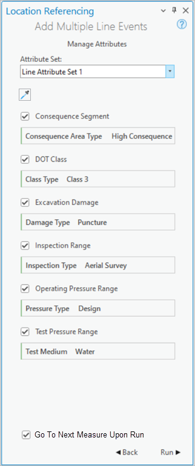

# Add Line Event Tools: Continue from Previous Measure Option Test Plan

| Field | Value |
| --- | --- |
| **Doc** | 225 · Test Plan · Pro |
| **Product** | — |
| **Release** | — |
| **Issues** | [ArcGISPro/ps-location-referencing#4414](https://devtopia.esri.com/ArcGISPro/ps-location-referencing/issues/4414) |
| **Source** | [4414-ContinueFromPreviuousMeasure_TestPlanV1.pptx](<https://esriis.sharepoint.com/sites/LocationReferencing/Shared%20Documents/LR%20Product%20Engineers/4414-ContinueFromPreviuousMeasure_TestPlanV1.pptx>) · rev V1 |
| **People** | author Mac Christmas · PE — · dev — |
| **Edited** | 2025-02-27 15:37 by Mac Christmas |
| **Extracted** | 2026-09-04 · lane xmlstrip · format 3.0 · prompt v2.0.2 |
| **Keywords** | line event · add line event tools · measure · from method · to method · event editing · checkbox option · ui testing |
| **Tools** | Add Line Event · Add Multiple Line Event |

## Summary

Test plan for the Add Line Event Tools feature that introduces a checkbox option to continue edits from the previous measure. Covers positive UI tests before and after edits, including persistence of checkbox state, method population logic, and data validation options across edits.

## Related documents

<!-- related:begin -->
- [Add Line Event Tools: Continue from Previous Measure Option Test Plan](<https://esriis.sharepoint.com/sites/lrsworkspace/LRS Doc Index/Test Plans/4414-add-line-event-tools-continue-from-previous-measure-option-v1-2025-02.md>) — shared issue ArcGISPro/ps-location-referencing#4414 · similar text 0.94 · 6 title words · 3 filename words · same kind/surface <!-- rel:214 s=1010.705 -->
- [Add Line Event Go To Next Measure on Save option](<https://esriis.sharepoint.com/sites/lrsworkspace/LRS Doc Index/User Stories/add-line-event-go-to-next-measure-on-save-option.md>) — similar text 0.28 · 5 title words · 2 filename words · same surface <!-- rel:270 s=5.219 -->
- [Go to Next Measure Upon Run Option in LRS Editing](<https://esriis.sharepoint.com/sites/lrsworkspace/LRS%20Doc%20Index/Other/go-to-next-measure-upon-run-option-in-lrs-editing.md>) — similar text 0.31 · 2 title words · same surface <!-- rel:200 s=3.826 -->
- [Add Line Event Length Method](<https://esriis.sharepoint.com/sites/lrsworkspace/LRS Doc Index/User Stories/add-line-event-length-method.md>) — similar text 0.22 · 3 title words · same surface <!-- rel:269 s=3.602 -->
- [Add Line Event Tools: Coordinate Offset Method](<https://esriis.sharepoint.com/sites/lrsworkspace/LRS Doc Index/User Stories/add-line-event-tools-coordinate-offset-method.md>) — similar text 0.20 · 4 title words · same surface <!-- rel:648 s=3.331 -->
<!-- related:end -->

<!-- docs:begin -->
## Esri documentation

[Split a centerline by measure](https://doc.esri.com/en/arcgis-pro/latest/help/production/location-referencing-pipelines/split-a-centerline-by-measure.html) · [Event editing using the attribute table](https://doc.esri.com/en/arcgis-pro/latest/help/production/location-referencing-pipelines/event-editing-using-the-attribute-table.html)

_No page matched:_ [Add Line Event](https://www.google.com/search?q=%22Add%20Line%20Event%22+site%3Adoc.esri.com) · [Add Multiple Line Event](https://www.google.com/search?q=%22Add%20Multiple%20Line%20Event%22+site%3Adoc.esri.com)
<!-- docs:end -->

---

## Overview

### Slide 1 — Devtopia Issue <!-- slide 1 -->

Add Line Event Tools: Continue from Previous Measure Option

**Notes**
- Add checkbox to Add Line Event Tools (single and multiple) to allow the user to continue their next edit from the previous measure
- Test in FS only with mix and match of spanning vs. non-spanning line events
- Mix and Match different From and To Methods
- Sanity test Add to Dominant Route option
- 508 and i18n testing

## Test Cases

### TC-P01 — Ensure new checkbox is only within the attributes pane of Add Line Event and Add <!-- src: S4 · slide 2 · Positive Tests: UI (Pre-Edit) · 1 -->

- **Group:** UI (Pre-Edit)
- **Case:** Ensure new checkbox is only within the attributes pane of Add Line Event and Add Multiple Line Event tools

### TC-P02 — Ensure checkbox can be checked and unchecked <!-- src: S4 · slide 2 · Positive Tests: UI (Pre-Edit) · 2 -->

- **Group:** UI (Pre-Edit)

### TC-P03 — Ensure default checkbox state is unchecked <!-- src: S4 · slide 2 · Positive Tests: UI (Pre-Edit) · 3 -->

- **Group:** UI (Pre-Edit)

### TC-P04 — Ensure checkbox state persists when navigating between panes <!-- src: S4 · slide 2 · Positive Tests: UI (Pre-Edit) · 4 -->

- **Group:** UI (Pre-Edit)

### TC-P05 — In Pro project options, ensure new checkbox is within the Event Editing group <!-- src: S4 · slide 2 · Positive Tests: UI (Pre-Edit) · 5 -->

- **Group:** UI (Pre-Edit)

### TC-P06 — Ensure checkbox in Pro project settings can be checked and unchecked <!-- src: S4 · slide 2 · Positive Tests: UI (Pre-Edit) · 6 -->

- **Group:** UI (Pre-Edit)

### TC-P07 — Ensure default checkbox state is unchecked in Pro project options <!-- src: S4 · slide 2 · Positive Tests: UI (Pre-Edit) · 7 -->

- **Group:** UI (Pre-Edit)

### TC-P08 — Ensure Pro option checkbox setting reflects in the Attributes pane <!-- src: S4 · slide 2 · Positive Tests: UI (Pre-Edit) · 8 -->

- **Group:** UI (Pre-Edit)

### TC-P09 — If previous edit is at end of route on a line <!-- src: S4 · slide 2 · Positive Tests: UI (Pre-Edit) · 9 -->

- **Group:** UI (Pre-Edit)
- **Case:** If previous edit is at end of route on a line, ensure that the next edit does not go on to the next route

### TC-P10 — If value is entered with max number of decimals <!-- src: S4 · slide 2 · Positive Tests: UI (Pre-Edit) · 10 -->

- **Group:** UI (Pre-Edit)
- **Case:** If value is entered with max number of decimals, ensure that this carries to the next edit

### TC-P11 — If previous edit is at a negative measure <!-- src: S4 · slide 2 · Positive Tests: UI (Pre-Edit) · 11 -->

- **Group:** UI (Pre-Edit)
- **Case:** If previous edit is at a negative measure, ensure that next edit is still at a negative measure

### TC-P12 — When unchecked, tool UI performs as it does today <!-- src: S4 · slide 2 · Positive Tests: UI (Post-Edit) · 1 -->

- **Group:** UI (Post-Edit)
- **Case:** When unchecked, tool UI performs as it does today (Route and Measure will be default method in first pane when starting a new edit after performing an edit)

### TC-P13 — If user does not change the From Method upon the new edit and clicks Next <!-- src: S4 · slide 2 · Positive Tests: UI (Post-Edit) · 2 -->

- **Group:** UI (Post-Edit)
- **Case:** If user does not change the From Method upon the new edit and clicks Next, the To Method and its populated info from the previous edit will populate in the From Method section for the new edit

### TC-P14 — If user changes From Method and clicks Next <!-- src: S4 · slide 2 · Positive Tests: UI (Post-Edit) · 3 -->

- **Group:** UI (Post-Edit)
- **Case:** If user changes From Method and clicks Next, do not populate any information from the previous edit since the method has been changed

### TC-P15 — Ensure whichever method was used for the To Method in the previous edits <!-- src: S4 · slide 2 · Positive Tests: UI (Post-Edit) · 4 -->

- **Group:** UI (Post-Edit)
- **Case:** Ensure whichever method was used for the To Method in the previous edits persists as the To Method for the new edit

### TC-P16 — If user changes the To Method and clicks Next <!-- src: S4 · slide 2 · Positive Tests: UI (Post-Edit) · 5 -->

- **Group:** UI (Post-Edit)
- **Case:** If user changes the To Method and clicks Next, continue to populate the From Section as expected

### TC-P17 — If user enables any data validation options and checkbox is checked <!-- src: S4 · slide 2 · Positive Tests: UI (Post-Edit) · 6 -->

- **Group:** UI (Post-Edit)
- **Case:** If user enables any data validation options and checkbox is checked, these options will persist into the next edit

### TC-P18 — If user enables any data validation options and checkbox is unchecked <!-- src: S4 · slide 2 · Positive Tests: UI (Post-Edit) · 7 -->

- **Group:** UI (Post-Edit)
- **Case:** If user enables any data validation options and checkbox is unchecked, these options will not persist into the next edit

### TC-P19 — If user enters in specific dates for the From and To Date (1) <!-- src: S4 · slide 2 · Positive Tests: UI (Post-Edit) · 8 -->

- **Group:** UI (Post-Edit)
- **Case:** If user enters in specific dates for the From and To Date (including the date checkboxes) and the checkbox is checked, this info will persist into the next edit

### TC-P20 — If user enters in specific dates for the From and To Date (2) <!-- src: S4 · slide 2 · Positive Tests: UI (Post-Edit) · 9 -->

- **Group:** UI (Post-Edit)
- **Case:** If user enters in specific dates for the From and To Date (including the date checkboxes) and the checkbox is unchecked, this info will not persist into the next edit

### TC-P21 — If user enters in specific attributes for the line event(s) to add <!-- src: S4 · slide 2 · Positive Tests: UI (Post-Edit) · 10 -->

- **Group:** UI (Post-Edit)
- **Case:** If user enters in specific attributes for the line event(s) to add, ensure this attribute info persists into the next edit

### TC-P22 — Event added using To Method of Route and Measure with same units as default <!-- src: S4 · slide 3 · Positive Tests · 1 -->

- **Case:** Event added using To Method of Route and Measure with same units as default units, new edit will have Route and Measure and its populated info as the From Method

### TC-P23 — Event added using To Method of Route and Measure with different units selected <!-- src: S4 · slide 3 · Positive Tests · 2 -->

- **Case:** Event added using To Method of Route and Measure with different units selected, new edit will have Route and Measure and its populated info as the From Method including the different unit selection

### TC-P24 — Event added using To Method of Location Offset (Intersection) <!-- src: S4 · slide 3 · Positive Tests · 3 -->

- **Case:** Event added using To Method of Location Offset (Intersection), new edit will have Location Offset and its populated intersection info as the From Method

### TC-P25 — Event added using To Method of Location Offset (Point Event) <!-- src: S4 · slide 3 · Positive Tests · 4 -->

- **Case:** Event added using To Method of Location Offset (Point Event), new edit will have Location Offset and its populated point event info as the From Method

### TC-P26 — Event added using To Method of Location Offset (Non-LRS Point Feature) <!-- src: S4 · slide 3 · Positive Tests · 5 -->

- **Case:** Event added using To Method of Location Offset (Non-LRS Point Feature), new edit will have Location Offset and its populated non-LRS point feature info as the From Method

### TC-P27 — Event added using To Method of Coordinates (LRS Spatial Reference) <!-- src: S4 · slide 3 · Positive Tests · 6 -->

- **Case:** Event added using To Method of Coordinates (LRS Spatial Reference), new edit will have Coordinates and its populated LRS spatial reference coordinates as the From Method

### TC-P28 — Event added using To Method of Coordinates (Web Map Spatial Reference) <!-- src: S4 · slide 3 · Positive Tests · 7 -->

- **Case:** Event added using To Method of Coordinates (Web Map Spatial Reference), new edit will have Coordinates and its populated web map spatial reference coordinates as the From Method

### TC-P29 — Event added using To Method of Coordinates (WGS 1984 Spatial Reference) <!-- src: S4 · slide 3 · Positive Tests · 8 -->

- **Case:** Event added using To Method of Coordinates (WGS 1984 Spatial Reference), new edit will have Coordinates and its populated WGS 1984 spatial reference coordinates as the From Method

## Other content

### Slide 2 <!-- slide 2 -->

