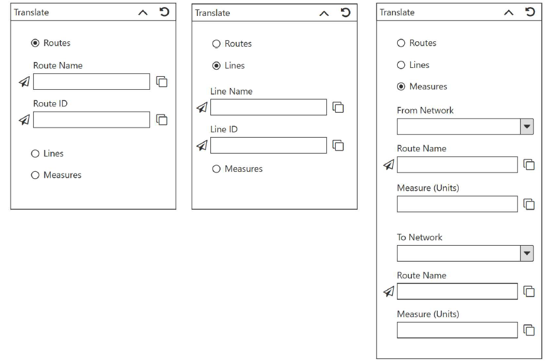

# Support Translation Between RouteID and RouteName (and Between LRS Networks) Test Plan

| Field | Value |
| --- | --- |
| **Doc** | 640 · Test Plan · Pro |
| **Product** | — |
| **Release** | — |
| **Issues** | [ArcGISPro/ps-location-referencing#4483](https://devtopia.esri.com/ArcGISPro/ps-location-referencing/issues/4483) |
| **Source** | [4483-SupportTranslationBetweekRouteIdandRouteName_TestPlan_V1.pptx](<https://esriis.sharepoint.com/sites/LocationReferencing/Shared%20Documents/LR%20Product%20Engineers/4483-SupportTranslationBetweekRouteIdandRouteName_TestPlan_V1.pptx>) · rev V1 |
| **People** | author Mac Christmas · PE — · dev — |
| **Edited** | 2022-08-24 16:01 by Mac Christmas |
| **Extracted** | 2026-09-04 · lane xmlstrip · format 3.0 · prompt v2.0.2 |
| **Keywords** | route identification · route name · route id · line name · line id · measure translation · network · translation · test plan |
| **Tools** | — |

## Summary

Test plan for the translation between RouteID and RouteName and between LRS networks, including line, non-line, and PoM networks. Covers positive and negative tests for route and measure translation components with various network types and ensures compliance with accessibility and internationalization standards. Includes UI behavior tests such as copying, resetting, selecting routes from map, and handling multiple time slices.

## Related documents

<!-- related:begin -->
- [Support Translation Between RouteID and RouteName (and Between LRS Networks) Test Plan](<https://esriis.sharepoint.com/sites/lrsworkspace/LRS Doc Index/Test Plans/4483-support-translation-between-routeid-and-routename-v3.md>) — shared issue ArcGISPro/ps-location-referencing#4483 · similar text 0.95 · 6 title words · 5 filename words · same kind/surface <!-- rel:620 s=1010.193 -->
- [Translate tool for ArcGIS Pro](<https://esriis.sharepoint.com/sites/lrsworkspace/LRS Doc Index/User Stories/translate-tool-for-pro.md>) — similar text 0.49 · same surface <!-- rel:644 s=3.435 -->
- [Change Route/Line Name Test Plan](<https://esriis.sharepoint.com/sites/lrsworkspace/LRS Doc Index/Test Plans/837-change-route-line-name.md>) — similar text 0.16 · 2 filename words · same kind/surface <!-- rel:637 s=3.055 -->
- [Route Log data product template – Test Plan](<https://esriis.sharepoint.com/sites/lrsworkspace/LRS Doc Index/Test Plans/6203-route-log-data-product-template.md>) — similar text 0.15 · 1 filename word · same kind/surface <!-- rel:256 s=2.573 -->
- [Generate a route Log including spanning events and centerline – Test Plan](<https://esriis.sharepoint.com/sites/lrsworkspace/LRS Doc Index/Test Plans/6240-generate-a-route-log-including-spanning-events.md>) — similar text 0.05 · 1 filename word · same kind/surface <!-- rel:255 s=2.221 -->
<!-- related:end -->

<!-- docs:begin -->
## Esri documentation

[Lines](https://doc.esri.com/en/arcgis-pro/latest/help/production/location-referencing-pipelines/what-is-a-line.html) · [LRS network](https://doc.esri.com/en/arcgis-pro/latest/help/production/location-referencing-pipelines/what-is-an-lrs-network.html)

_No page matched:_ [translate](https://www.google.com/search?q=%22translate%22+site%3Adoc.esri.com)
<!-- docs:end -->

---

## Test Cases

### TC-P01 — Clicking the reset button will reset the tool to its initial form. <!-- src: S4 · slide 1 · Positive Tests: All Components · 1 -->

- **Group:** All Components

### TC-P02 — Clicking the copy button will copy the corresponding information (RouteName <!-- src: S4 · slide 1 · Positive Tests: All Components · 2 -->

- **Group:** All Components
- **Case:** Clicking the copy button will copy the corresponding information (RouteName, RouteID, LineName, LineID, or measure value) to the user’s clipboard.

### TC-P03 — Clicking the minimize button will minimize the form. <!-- src: S4 · slide 1 · Positive Tests: All Components · 3 -->

- **Group:** All Components

### TC-P04 — Upon closing and reopening the tool <!-- src: S4 · slide 1 · Positive Tests: All Components · 4 -->

- **Group:** All Components
- **Case:** Upon closing and reopening the tool, information within the form will remain intact until the Pro session is closed.

### TC-P05 — Using the Select Route from Map tool selects the corresponding route/line within <!-- src: S4 · slide 1 · Positive Tests: All Components · 5 -->

- **Group:** All Components
- **Case:** Using the Select Route from Map tool selects the corresponding route/line within the map.

### TC-P06 — If multiple lines/routes are present when using Select Route from Map tool <!-- src: S4 · slide 1 · Positive Tests: All Components · 6 -->

- **Group:** All Components
- **Case:** If multiple lines/routes are present when using Select Route from Map tool is used, a modal window will appear with a table showing these fields: Network, LineID or RouteID, Line Name or Route Name, From Date, and To Date.

### TC-P07 — Ensure long LineName/RouteName and LineID/RouteID appear correctly. <!-- src: S4 · slide 1 · Positive Tests: All Components · 7 -->

- **Group:** All Components

### TC-P08 — Component works only with networks from FS and EGDB DC. (1) <!-- src: S4 · slide 2 · Positive Tests: Translate RouteID and Route Name · 1 -->

- **Group:** Translate RouteID and Route Name

### TC-P09 — Routes radio button is disabled when network’s Route Name is not configured. <!-- src: S4 · slide 2 · Positive Tests: Translate RouteID and Route Name · 2 -->

- **Group:** Translate RouteID and Route Name

### TC-P10 — If the network layer is turned off (1) <!-- src: S4 · slide 2 · Positive Tests: Translate RouteID and Route Name · 3 -->

- **Group:** Translate RouteID and Route Name
- **Case:** If the network layer is turned off, then the Routes radio button will be disabled. If the network layer is turned back on, then the Routes radio button will become enabled.

### TC-P11 — Typing the LineID/LineName or RouteID/RouteName and hitting the ENTER key/losing <!-- src: S4 · slide 2 · Positive Tests: All Components (Continued) · 1 -->

- **Group:** All Components (Continued)
- **Case:** Typing the LineID/LineName or RouteID/RouteName and hitting the ENTER key/losing focus will select the route/line within the map.

### TC-P12 — If there are multiple time slices of a route when a RouteName/RouteID <!-- src: S4 · slide 2 · Positive Tests: All Components (Continued) · 2 -->

- **Group:** All Components (Continued)
- **Case:** If there are multiple time slices of a route when a RouteName/RouteID or LineName/LineID is typed, then a modal window will appear with a table showing these fields: Network, RouteID or LineID, Route Name or LineName, From Date, and To Date.

### TC-P13 — Upon successful selection of a line/route <!-- src: S4 · slide 2 · Positive Tests: All Components (Continued) · 3 -->

- **Group:** All Components (Continued)
- **Case:** Upon successful selection of a line/route, flash the line/route 3 times on the map.

### TC-P14 — The RouteName/RouteID and LineName/LineID will always be in sync. Entering <!-- src: S4 · slide 2 · Positive Tests: All Components (Continued) · 4 -->

- **Group:** All Components (Continued)
- **Case:** The RouteName/RouteID and LineName/LineID will always be in sync. Entering the name will always update the ID and vice versa.

### TC-P15 — When using Select Route from Map tool <!-- src: S4 · slide 2 · Positive Tests: All Components (Continued) · 5 -->

- **Group:** All Components (Continued)
- **Case:** When using Select Route from Map tool, the RouteName/RouteID and measure are shown when hovering.

### TC-P16 — Tool is readable and usable both in light and dark mode. <!-- src: S4 · slide 2 · Positive Tests: All Components (Continued) · 6 -->

- **Group:** All Components (Continued)

### TC-P17 — Tool will open correctly along the ribbon. <!-- src: S4 · slide 2 · Positive Tests: All Components (Continued) · 7 -->

- **Group:** All Components (Continued)

### TC-P18 — Component works only with networks from FS and EGDB DC. (2) <!-- src: S4 · slide 2 · Positive Tests: Translate LineID and Line Name · 1 -->

- **Group:** Translate LineID and Line Name

### TC-P19 — Lines radio button is disabled when network’s Line Name is not configured. <!-- src: S4 · slide 2 · Positive Tests: Translate LineID and Line Name · 2 -->

- **Group:** Translate LineID and Line Name

### TC-P20 — If the network layer is turned off (2) <!-- src: S4 · slide 2 · Positive Tests: Translate LineID and Line Name · 3 -->

- **Group:** Translate LineID and Line Name
- **Case:** If the network layer is turned off, then the Lines radio button will be disabled. If the network layer is turned back on, then the Lines radio button will become enabled.

### TC-P21 — Component works with FS, EGDB DC, and FGDB. <!-- src: S4 · slide 2 · Positive Tests: Translate Measures · 1 -->

- **Group:** Translate Measures

### TC-P22 — Select From and To Networks <!-- src: S4 · slide 2 · Positive Tests: Translate Measures · 2 -->

- **Group:** Translate Measures
- **Case:** Select From and To Networks, then enter a RouteName/RouteID in either the From or To Network section and the translated RouteName/RouteID will populate.

### TC-P23 — Type the RouteName/RouteID in the From Network section and upon losing focus <!-- src: S4 · slide 2 · Positive Tests: Translate Measures · 3 -->

- **Group:** Translate Measures
- **Case:** Type the RouteName/RouteID in the From Network section and upon losing focus or hitting ENTER the RouteName/RouteID of the To Network section will populate and vice versa.

### TC-P24 — The RouteName/RouteID of the From/To Network sections will always be in sync. <!-- src: S4 · slide 2 · Positive Tests: Translate Measures · 4 -->

- **Group:** Translate Measures

### TC-P25 — From and To Network are same network <!-- src: S4 · slide 2 · Positive Tests: Translate Measures · 5 -->

- **Group:** Translate Measures
- **Case:** From and To Network are same network, allowing for measure translation between overlapping routes.

### TC-P26 — From and To Network are different networks with different measurement units. <!-- src: S4 · slide 2 · Positive Tests: Translate Measures · 6 -->

- **Group:** Translate Measures

### TC-N01 — Route Name is invalid. <!-- src: S4 · slide 3 · Negative Tests · 1 -->

### TC-N02 — RouteID is invalid <!-- src: S4 · slide 3 · Negative Tests · 2 -->

### TC-N03 — LineName is invalid. <!-- src: S4 · slide 3 · Negative Tests · 3 -->

### TC-N04 — LineID is invalid. <!-- src: S4 · slide 3 · Negative Tests · 4 -->

## Other content

### Slide 1 — Devtopia Issue Link <!-- slide 1 -->

Support Translation Between RouteID and RouteName (and Between LRS Networks) Test Plan

**Notes**
- Test with line, non-line, and PoM networks.
- Test with EGDB DC and FS (default and other versions) for RouteID/Name and Line translation components. Translate Measures component will be tested with DC, FC, and FGDB.
- Ensure 508 and i18n compliance.
- Common workflow will be copy/paste of RouteID and RouteName into other tools and translating Route and Measure between networks.

