# Event Replacement Referent Population for Line Events

| Field | Value |
| --- | --- |
| **Doc** | 619 · Test Plan · Pro |
| **Product** | — |
| **Release** | 3.1 |
| **Issues** | [ArcGISPro/ps-location-referencing#3910](https://devtopia.esri.com/ArcGISPro/ps-location-referencing/issues/3910) · [ArcGISPro/ps-location-referencing#3925](https://devtopia.esri.com/ArcGISPro/ps-location-referencing/issues/3925) · [arcgispro/ps-location-referencing#4681](https://devtopia.esri.com/arcgispro/ps-location-referencing/issues/4681) · [ArcGISPro/ps-location-referencing#3911](https://devtopia.esri.com/ArcGISPro/ps-location-referencing/issues/3911) |
| **Source** | [4681-EventReplacementReferentPopulation_V2.pptx](<https://esriis.sharepoint.com/sites/LocationReferencing/Shared%20Documents/General/Test%20Plans/4681-EventReplacementReferentPopulation_V2.pptx>) · rev V2 |
| **People** | author Mac Christmas · PE Praveen · dev — |
| **Edited** | 2022-11-17 18:39 by Mac Christmas |
| **Extracted** | 2026-09-04 · lane xmlstrip · format 3.0 · prompt v2.0.2 |
| **Keywords** | event replacement · referent population · line event · spanning line event · route and measure · coordinate offset · location offset · event retirement |
| **Tools** | — |

## Summary

Test plan for event replacement referent population involving line and spanning line events with referents configured on line and non-line networks. Covers positive test cases for Route and Measure, Coordinate Offset, and Location Offset methods, including different From and To method combinations. Testing focuses on event retirement and replacement workflows with data captured from the field.

## Related documents

<!-- related:begin -->
- [Add Line Event Tool Coordinate Offset Method Test Plan](<https://esriis.sharepoint.com/sites/lrsworkspace/LRS Doc Index/Test Plans/3911-add-line-event-tool-coordinate-offset-method.md>) — shared issue ArcGISPro/ps-location-referencing#3911 · similar text 0.21 · 2 title words · same kind/surface/folder <!-- rel:636 s=1003.595 -->
- [Add Line Event Tools – Intersection Location Offset Method Test Plan](<https://esriis.sharepoint.com/sites/lrsworkspace/LRS Doc Index/Test Plans/3910-add-line-event-tools-intersection-location-offset-method.md>) — shared issue ArcGISPro/ps-location-referencing#3910 · similar text 0.16 · 2 title words · 1 filename word · same kind/folder <!-- rel:618 s=1003.38 -->
- [Add Point Event tool/ Add Multipoint Events tool Coordinate offset method – Test Plan](<https://esriis.sharepoint.com/sites/lrsworkspace/LRS%20Doc%20Index/Test%20Plans/3905-add-point-event-tool-add-multipoint-events-tool-coordinate.md>) — similar text 0.25 · 2 title words · same kind/surface/folder <!-- rel:638 s=3.422 -->
- [Point Events Dynamic Segmentation Test Plan](<https://esriis.sharepoint.com/sites/lrsworkspace/LRS Doc Index/Test Plans/point-events-dynseg.md>) — similar text 0.28 · 1 title word · same kind/surface/folder <!-- rel:365 s=3.082 -->
- [ExB: Auto-Populate Referents for Add Point and Add Line widgets Test Plan](<https://esriis.sharepoint.com/sites/lrsworkspace/LRS Doc Index/Test Plans/26358-exb-auto-populate-referents-for-add-point-and-add-line.md>) — similar text 0.09 · 1 title word · 1 filename word · same kind/folder <!-- rel:906 s=3.057 -->
<!-- related:end -->

<!-- docs:begin -->
## Esri documentation

[Storing referent and offset information for event location](https://doc.esri.com/en/arcgis-pro/latest/help/production/location-referencing-pipelines/storing-referent-and-offset-information-for-event-location.html) · [Event behavior for route retirement](https://doc.esri.com/en/arcgis-pro/latest/help/production/location-referencing-pipelines/event-behavior-for-route-retirement.html)
<!-- docs:end -->

---

## Overview

### Slide 1 — Devtopia Link <!-- slide 1 -->

4681-Event Replacement Referent Population for Line Events

**Notes**
- Test with combination of line and spanning line events with referents configured on line and non-line networks
- Event replacement will still work the same even with events without referents configured
- Test with Route and Measure, Coordinate Offset, and Location Offset Methods
- Test with different From and To Methods on the same replacement
- Common workflow for users will be bulk replacing existing events with new data that has come from the field that was captured using either coordinates or an offset from a point location (intersections)
- Referent population will only occur upon event retirement and replacement. Events that are only retired will not have any referent population as no new event records will be created
- Test plan has been created using Praveen’s Event Replacement Test Plan as a template for Route and Measure method ( Devtopia Link ), Mac’s Add Line Event(s): Location Offset Method ( Devtopia Link ) for Location Offset Method and Claire’s Add Line Event(s): Coordinate Offset Method for Coordinate Offset Method ( Devtopia Link ) per Rahul’s suggestion
- Testing will be executed upon Praveen’s Event Replacement testing data
- Location Offset method for Event Replacement will not be a part of the 3.1 release, so all Location Offset Method test cases will not be tested as part of this test plan. They will remain in the test plan for testing in a later release.

## Test Cases

### TC-P01 — Single route – events covering route entirely (1) <!-- src: S4 · slide 2 · Positive Tests: Route and Measure Method · 1 -->

- **Group:** Route and Measure Method
- **Case:** Single route – events covering route entirely, referent fields populated with relevant Route and Measure info

### TC-P02 — Single route - events covering route partially (1) <!-- src: S4 · slide 2 · Positive Tests: Route and Measure Method · 2 -->

- **Group:** Route and Measure Method
- **Case:** Single route - events covering route partially, referent fields populated with relevant Route and Measure info

### TC-P03 — Multiple routes – spanning events cover route partially (1) <!-- src: S4 · slide 2 · Positive Tests: Route and Measure Method · 3 -->

- **Group:** Route and Measure Method
- **Case:** Multiple routes – spanning events cover route partially, referent fields populated with relevant Route and Measure info

### TC-P04 — Single route – events covering route entirely (2) <!-- src: S4 · slide 2 · Positive Tests: Coordinate Offset Method · 1 -->

- **Group:** Coordinate Offset Method
- **Case:** Single route – events covering route entirely, referent fields populated with relevant Coordinate Offset info

### TC-P05 — Single route - events covering route partially (2) <!-- src: S4 · slide 2 · Positive Tests: Coordinate Offset Method · 2 -->

- **Group:** Coordinate Offset Method
- **Case:** Single route - events covering route partially, referent fields populated with relevant Coordinate Offset info

### TC-P06 — Multiple routes – spanning events cover route partially (2) <!-- src: S4 · slide 2 · Positive Tests: Coordinate Offset Method · 3 -->

- **Group:** Coordinate Offset Method
- **Case:** Multiple routes – spanning events cover route partially, referent fields populated with relevant Coordinate Offset info

### TC-P07 — Single route - events cover route entirely, From Method is Route and Measure (1) <!-- src: S4 · slide 2 · Positive Tests: Different From and To Methods · 1 -->

- **Group:** Different From and To Methods
- **Case:** Single route - events cover route entirely, From Method is Route and Measure, To Method is Location Offset

### TC-P08 — Single route - events cover route entirely, From Method is Coordinate Offset (1) <!-- src: S4 · slide 2 · Positive Tests: Different From and To Methods · 2 -->

- **Group:** Different From and To Methods
- **Case:** Single route - events cover route entirely, From Method is Coordinate Offset, To Method is Route and Measure

### TC-P09 — Single route – events cover route entirely, From Method is Location Offset (1) <!-- src: S4 · slide 2 · Positive Tests: Different From and To Methods · 3 -->

- **Group:** Different From and To Methods
- **Case:** Single route – events cover route entirely, From Method is Location Offset, To Method is Coordinate Offset

### TC-P10 — Single route – events covering route entirely (3) <!-- src: S4 · slide 2 · Positive Tests: Location Offset Method · 1 -->

- **Group:** Location Offset Method
- **Case:** Single route – events covering route entirely, referent fields populated with relevant Location Offset info

### TC-P11 — Single route - events covering route partially (3) <!-- src: S4 · slide 2 · Positive Tests: Location Offset Method · 2 -->

- **Group:** Location Offset Method
- **Case:** Single route - events covering route partially, referent fields populated with relevant Location Offset info

### TC-P12 — Multiple routes – spanning events cover route partially (3) <!-- src: S4 · slide 2 · Positive Tests: Location Offset Method · 3 -->

- **Group:** Location Offset Method
- **Case:** Multiple routes – spanning events cover route partially, referent fields populated with relevant Location Offset info

### TC-U01 — Single route – events covering route entirely (case 1) <!-- src: S2 · slide 3 · case 1 -->

Output:
Existing events are retired as of 1/1/2010
0
25000

| Event | Route ID | From Measure | To Measure | Fro Date | To Date | From Ref Method | From Ref Location | From Ref Offset | To Ref Method | To Ref Location | To Ref Offset |
| --- | --- | --- | --- | --- | --- | --- | --- | --- | --- | --- | --- |
| Cont_Event3 | Route L45 | 0 | 25000 | 1/1/2010 | Null | Continuous Network | Route L45 | 0 | Continuous Network | Route L45 | 25000 |
| Cont_Event4 | Route L45 | 0 | 25000 | 1/1/2010 | Null | Continuous Network | Route L45 | 0 | Continuous Network | Route L45 | 25000 |

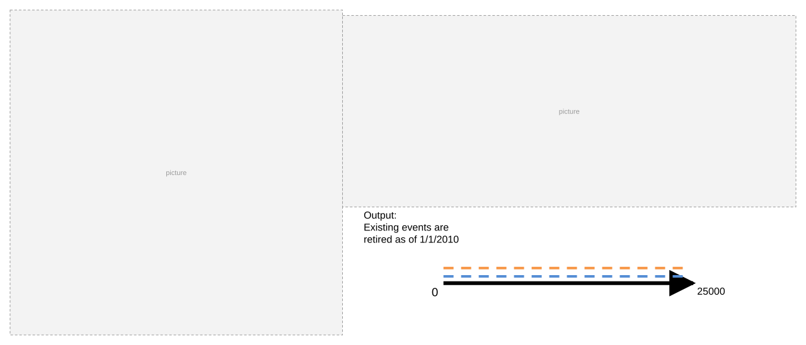

### TC-U02 — Single route – events covering route partially <!-- src: S2 · slide 4 · case 2 -->

Output:
Existing  events are retired as of 1/1/2010
0
25000

| Event | Route ID | From Measure | To Measure | From Date | To Date | From Ref Method | From Ref Location | From Ref Offset | To Ref Method | To Ref Location | To Ref Offset |
| --- | --- | --- | --- | --- | --- | --- | --- | --- | --- | --- | --- |
| Cont_Event3 | Route L45 | 0 | 25000 | 1/1/2010 | Null | Continuous Network | Route L45 | 0 | Continuous Network | Route L45 | 25000 |
| Cont_Event4 | Route L45 | 0 | 25000 | 1/1/2010 | Null | Continuous Network | Route L45 | 0 | Continuous Network | Route L45 | 25000 |

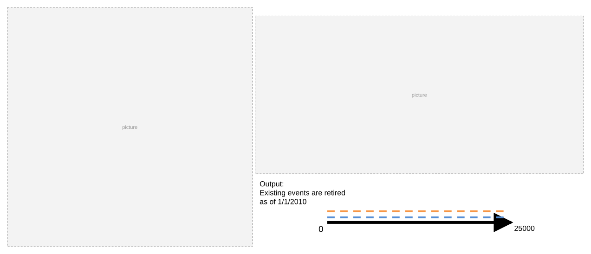

### TC-U03 — Multiple routes – spanning events cover route partially (case 3) <!-- src: S2 · slide 5 · case 3 -->

| Event | From Route ID | To Route ID | From Measure | To Measure | From Date | To Date | From Ref Method | From Ref Location | From Ref Offset | To Ref Method | To Ref Location | To Ref Offset |
| --- | --- | --- | --- | --- | --- | --- | --- | --- | --- | --- | --- | --- |
| Engg_Event3 | Route 1 | Route 3 | 0 | 1 | 1/1/2010 | Null | Continuous Network | Route 1 | 0 | Continuous Network | Route 3 | 1 |
| Engg_Event4 | Route 1 | Route 3 | 0 | 1 | 1/1/2010 | Null | Continuous Network | Route 1 | 0 | Continuous Network | Route 3 | 1 |

Output:
Existing events are retired as of 1/1/2010

[figure: 0 · 1]

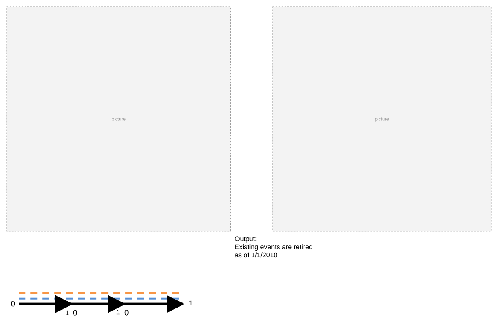

### TC-U04 — Single route – events covering route entirely (case 4) <!-- src: S2 · slide 6 · case 4 -->

- **Case:** Single route – events covering route entirely, referent fields populated with relevant Location Offset info

Output:
Existing events are retired as of 1/1/2010

| Event | Route ID | From Measure | To Measure | Fro Date | To Date | From Ref Method | From Ref Location | From Ref Offset | To Ref Method | To Ref Location | To Ref Offset |
| --- | --- | --- | --- | --- | --- | --- | --- | --- | --- | --- | --- |
| Cont_Event3 | Route L45 | 0 | 25000 | 1/1/2010 | Null | Intersections | Intersection X | -10000 | Intersections | Intersection X | 15000 |
| Cont_Event4 | Route L45 | 0 | 25000 | 1/1/2010 | Null | Intersections | Intersection X | -10000 | Intersections | Intersection X | 15000 |

[figure: 10000 · 25000 · 0 · Intersection X]

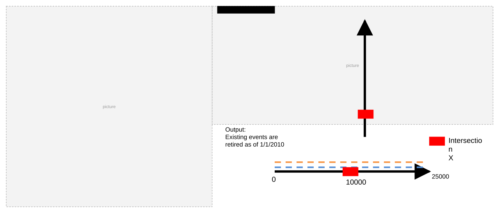

### TC-U05 — Single route - events covering route partially (case 5) <!-- src: S2 · slide 7 · case 5 -->

- **Case:** Single route - events covering route partially, referent fields populated with relevant Location Offset info

Output:
Existing  events are retired as of 1/1/2010

| Event | Route ID | From Measure | To Measure | From Date | To Date | From Ref Method | From Ref Location | From Ref Offset | To Ref Method | To Ref Location | To Ref Offset |
| --- | --- | --- | --- | --- | --- | --- | --- | --- | --- | --- | --- |
| Cont_Event3 | Route L45 | 0 | 25000 | 1/1/2010 | Null | Intersections | Intersection X | -10000 | Intersections | Intersection X | 15000 |
| Cont_Event4 | Route L45 | 0 | 25000 | 1/1/2010 | Null | Intersections | Intersection X | -10000 | Intersections | Intersection X | 15000 |

[figure: 0 · 25000 · Intersection X · 10000]

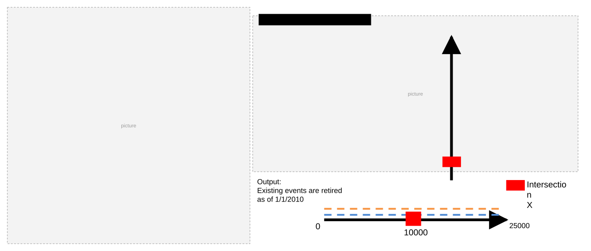

### TC-U06 — Multiple routes – spanning events cover route partially (case 6) <!-- src: S2 · slide 8 · case 6 -->

- **Case:** Multiple routes – spanning events cover route partially, referent fields populated with relevant Location Offset info

| Event | From Route ID | To Route ID | From Measure | To Measure | From Date | To Date | From Ref Method | From Ref Location | From Ref Offset | To Ref Method | To Ref Location | To Ref Offset |
| --- | --- | --- | --- | --- | --- | --- | --- | --- | --- | --- | --- | --- |
| Engg_Event3 | Route 1 | Route 3 | 0 | 1 | 1/1/2010 | Null | Intersections | Intersection X | -1.5 | Intersections | Intersection X | 1.5 |
| Engg_Event4 | Route 1 | Route 3 | 0 | 1 | 1/1/2010 | Null | Intersections | Intersection X | -1.5 | Intersections | Intersection X | 1.5 |

Output:
Existing events are retired as of 1/1/2010

[figure: 0 · 1 · Intersection X · 0.5]

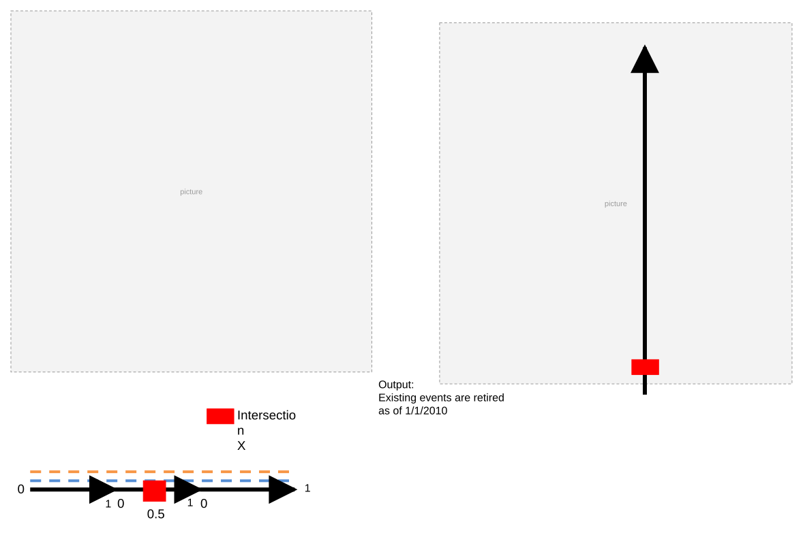

### TC-U07 — Single route – events covering route entirely (case 7) <!-- src: S2 · slide 9 · case 7 -->

- **Case:** Single route – events covering route entirely, referent fields populated with relevant Coordinate Offset info

Output:
Existing events are retired as of 1/1/2010

| Event | Route ID | From Measure | To Measure | Fro Date | To Date | From Ref Method | From Ref Location | From Ref Offset | To Ref Method | To Ref Location | To Ref Offset |
| --- | --- | --- | --- | --- | --- | --- | --- | --- | --- | --- | --- |
| Cont_Event3 | Route L45 | 0 | 25000 | 1/1/2010 | Null | X/Y | 000,000, 0 | 0 | X/Y | 800,800, 0 | 0 |
| Cont_Event4 | Route L45 | 0 | 25000 | 1/1/2010 | Null | X/Y | 000,000, 0 | 0 | X/Y | 800,800, 0 | 0 |

[figure: 0 · 25000 · From Coordinate Location · To Coordinate Location]

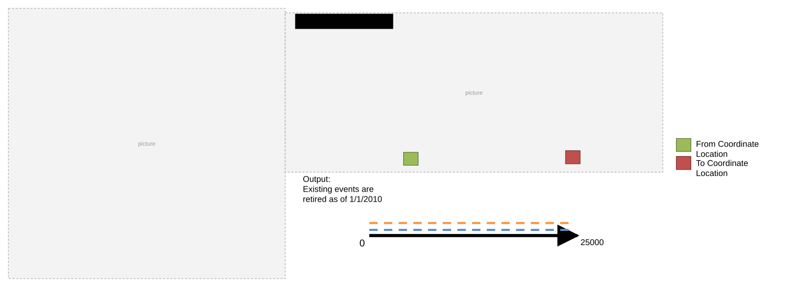

### TC-U08 — Single route - events covering route partially (case 8) <!-- src: S2 · slide 10 · case 8 -->

- **Case:** Single route - events covering route partially, referent fields populated with relevant Coordinate Offset info

Output:
Existing  events are retired as of 1/1/2010

| Event | Route ID | From Measure | To Measure | From Date | To Date | From Ref Method | From Ref Location | From Ref Offset | To Ref Method | To Ref Location | To Ref Offset |
| --- | --- | --- | --- | --- | --- | --- | --- | --- | --- | --- | --- |
| Cont_Event3 | Route L46 | 0 | 25000 | 1/1/2010 | Null | X/Y | 000,000, 0 | 0 | X/Y | 800,800, 0 | 0 |
| Cont_Event4 | Route L46 | 0 | 25000 | 1/1/2010 | Null | X/Y | 000,000, 0 | 0 | X/Y | 800,800, 0 | 0 |

[figure: 0 · 25000 · From Coordinate Location · To Coordinate Location]

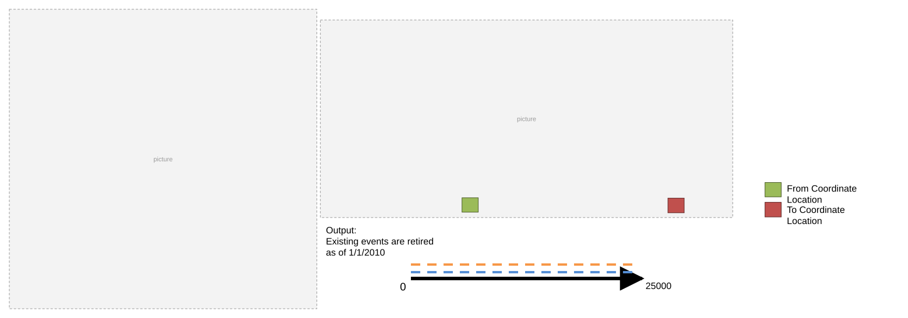

### TC-U09 — Multiple routes – spanning events cover route partially (case 9) <!-- src: S2 · slide 11 · case 9 -->

- **Case:** Multiple routes – spanning events cover route partially, referent fields populated with relevant Coordinate Offset

| Event | From Route ID | To Route ID | From Measure | To Measure | From Date | To Date | From Ref Method | From Ref Location | From Ref Offset | To Ref Method | To Ref Location | To Ref Offset |
| --- | --- | --- | --- | --- | --- | --- | --- | --- | --- | --- | --- | --- |
| Engg_Event3 | Route 1 | Route 3 | 0 | 1 | 1/1/2010 | Null | X/Y | 000,000, 0 | 0 | X/Y | 800,800, 0 | 0 |
| Engg_Event4 | Route 1 | Route 3 | 0 | 1 | 1/1/2010 | Null | X/Y | 000,000, 0 | 0 | X/Y | 800,800, 0 | 0 |

Output:
Existing events are retired as of 1/1/2010

[figure: 0 · 1 · From Coordinate Location · To Coordinate Location]

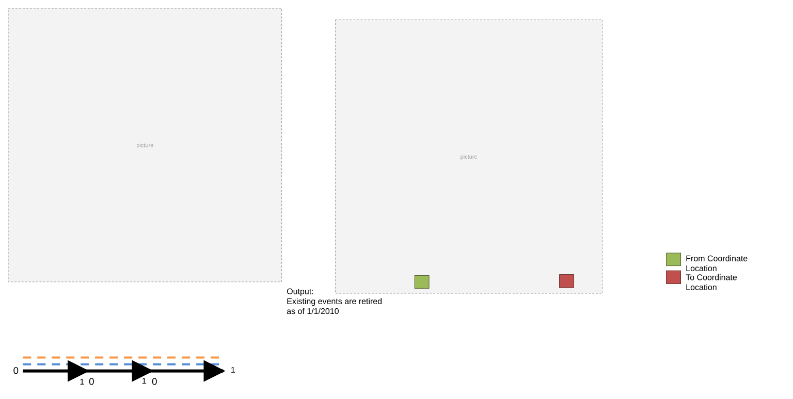

### TC-U10 — Single route - events cover route entirely, From Method is Route and Measure (case 10) <!-- src: S2 · slide 12 · case 10 -->

- **Case:** Single route - events cover route entirely, From Method is Route and Measure, To Method is Location Offset

Output:
Existing events are retired as of 1/1/2010

| Event | Route ID | From Measure | To Measure | Fro Date | To Date | From Ref Method | From Ref Location | From Ref Offset | To Ref Method | To Ref Location | To Ref Offset |
| --- | --- | --- | --- | --- | --- | --- | --- | --- | --- | --- | --- |
| Cont_Event3 | Route L45 | 0 | 25000 | 1/1/2010 | Null | Continuous Network | Route L45 | 0 | Intersections | Intersection X | 15000 |
| Cont_Event4 | Route L45 | 0 | 25000 | 1/1/2010 | Null | Continuous Network | Route L45 | 0 | Intersections | Intersection X | 15000 |

[figure: 0 · 25000 · Intersection X · 10000]

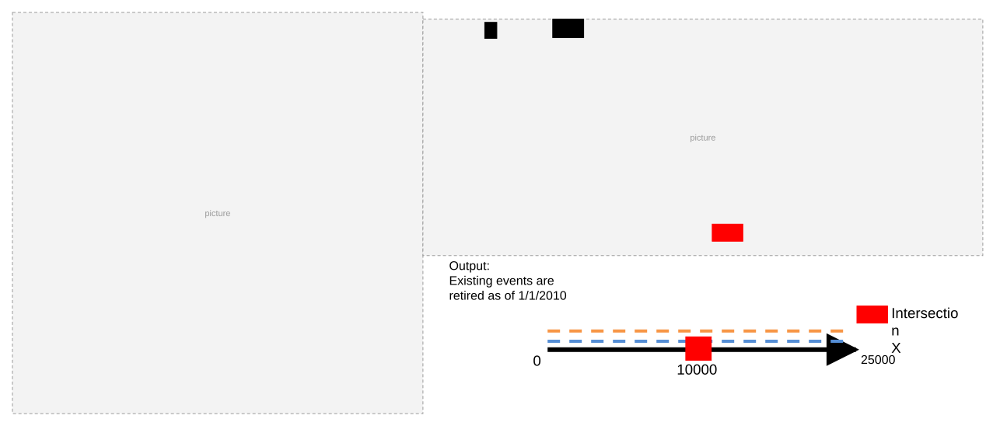

### TC-U11 — Single route - events cover route entirely, From Method is Coordinate Offset (case 11) <!-- src: S2 · slide 13 · case 11 -->

- **Case:** Single route - events cover route entirely, From Method is Coordinate Offset, To Method is Route and Measure

Output:
Existing events are retired as of 1/1/2010
0
25000

| Event | Route ID | From Measure | To Measure | Fro Date | To Date | From Ref Method | From Ref Location | From Ref Offset | To Ref Method | To Ref Location | To Ref Offset |
| --- | --- | --- | --- | --- | --- | --- | --- | --- | --- | --- | --- |
| Cont_Event3 | Route L45 | 0 | 25000 | 1/1/2010 | Null | X/Y | 000,000, 0 | 0 | Continuous Network | Route L45 | 25000 |
| Cont_Event4 | Route L45 | 0 | 25000 | 1/1/2010 | Null | X/Y | 000,000, 0 | 0 | Continuous Network | Route L45 | 25000 |

From Coordinate Location

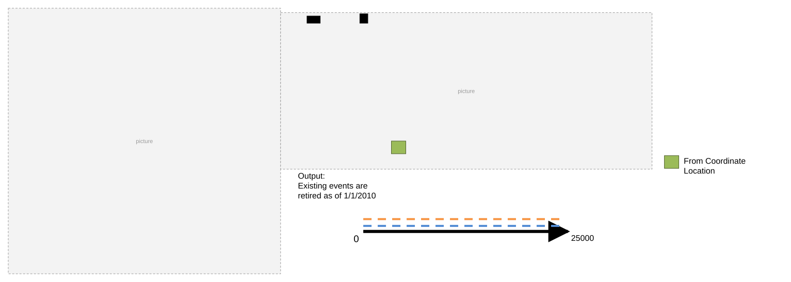

### TC-U12 — Single route – events cover route entirely, From Method is Location Offset (case 12) <!-- src: S2 · slide 14 · case 12 -->

- **Case:** Single route – events cover route entirely, From Method is Location Offset, To Method is Coordinate Offset

Output:
Existing  events are retired as of 1/1/2010

| Event | Route ID | From Measure | To Measure | From Date | To Date | From Ref Method | From Ref Location | From Ref Offset | To Ref Method | To Ref Location | To Ref Offset |
| --- | --- | --- | --- | --- | --- | --- | --- | --- | --- | --- | --- |
| Cont_Event3 | Route L45 | 0 | 25000 | 1/1/2010 | Null | Intersections | Intersection X | W 10000 | X/Y | 800,800, 0 | 0 |
| Cont_Event4 | Route L45 | 0 | 25000 | 1/1/2010 | Null | Intersections | Intersection X | W 10000 | X/Y | 800,800, 0 | 0 |

[figure: 0 · 25000 · Intersection X · To Coordinate Location]

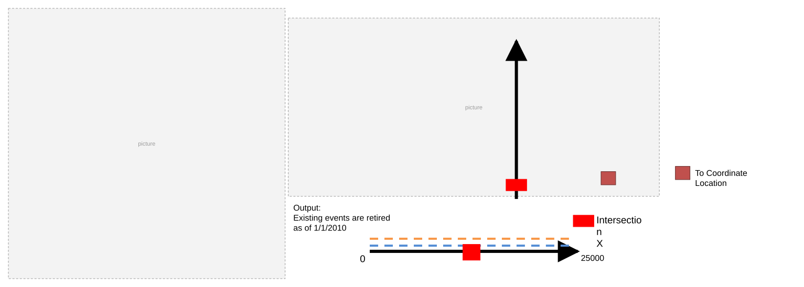
