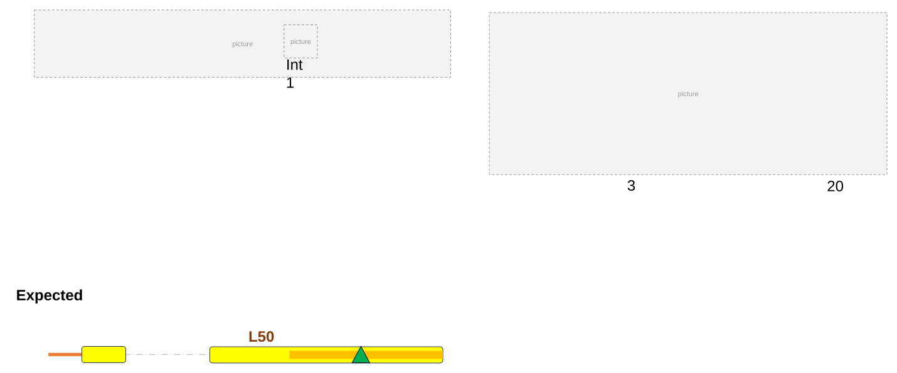
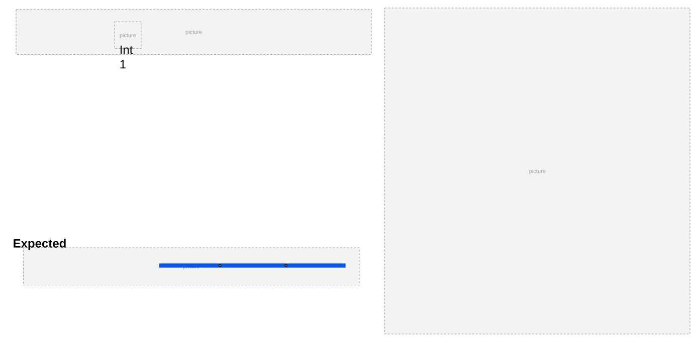
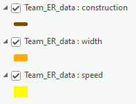

# Event Replacement: Location Offset Method Test Plan

| Field | Value |
| --- | --- |
| **Doc** | 612 · Test Plan · Pro |
| **Product** | — |
| **Release** | — |
| **Issues** | [ArcGISPro/ps-location-referencing#4768](https://devtopia.esri.com/ArcGISPro/ps-location-referencing/issues/4768) |
| **Source** | [4768-EventReplacementLocationOffsetMethod_TestPlanV1.pptx](<https://esriis.sharepoint.com/sites/LocationReferencing/Shared%20Documents/General/Test%20Plans/4768-EventReplacementLocationOffsetMethod_TestPlanV1.pptx>) · rev V1 |
| **People** | author Mac Christmas · PE — · dev — |
| **Edited** | 2023-02-15 22:19 by Mac Christmas |
| **Extracted** | 2026-09-04 · lane xmlstrip · format 3.0 · prompt v2.0.2 |
| **Keywords** | event replacement · location offset · route · intersection · attribute set · cardinal offsets · linear referencing |
| **Tools** | Event Replacement |

## Summary

Test plan for the Event Replacement tool using the Location Offset method in linear referencing systems. Covers positive and negative UI tests, various route configurations including simple, gap, vertical, and line routes, and attribute set scenarios with cardinal offsets and intersection selections. Includes expected results for event replacement with location offsets on routes and intersections.

## Related documents

<!-- related:begin -->
- [Add Line Event Tools – Intersection Location Offset Method Test Plan](<https://esriis.sharepoint.com/sites/lrsworkspace/LRS Doc Index/Test Plans/3910-add-line-event-tools-intersection-location-offset-method.md>) — similar text 0.15 · 3 title words · 3 filename words · same kind/folder <!-- rel:618 s=6.418 -->
- [Event Replacement Referent Population for Line Events](<https://esriis.sharepoint.com/sites/lrsworkspace/LRS%20Doc%20Index/Test%20Plans/4681-event-replacement-referent-population-for-line-events.md>) — similar text 0.22 · 2 title words · 2 filename words · same kind/surface/folder <!-- rel:619 s=4.456 -->
- [Add Event Intersection Offset Method](<https://esriis.sharepoint.com/sites/lrsworkspace/LRS Doc Index/User Stories/add-event-intersection-offset-method.md>) — similar text 0.17 · 3 title words · 3 filename words · same surface <!-- rel:679 s=4.332 -->
- [Add Line Events Point Offset Method](<https://esriis.sharepoint.com/sites/lrsworkspace/LRS Doc Index/User Stories/add-line-events-point-offset-method.md>) — similar text 0.12 · 2 title words · 3 filename words · same surface <!-- rel:268 s=3.957 -->
- [Location Offset Method in Add Point and Add Line Widgets Test Plan](<https://esriis.sharepoint.com/sites/lrsworkspace/LRS%20Doc%20Index/Test%20Plans/24790-location-offset-method-in-add-point-and-add-line-widgets.md>) — similar text 0.19 · 2 title words · 1 filename word · same kind/folder <!-- rel:48 s=3.78 -->
<!-- related:end -->

<!-- docs:begin -->
## Esri documentation

[Storing referent and offset information for event location](https://doc.esri.com/en/arcgis-pro/latest/help/production/location-referencing-pipelines/storing-referent-and-offset-information-for-event-location.html) · [View LRS intersection properties](https://doc.esri.com/en/arcgis-pro/latest/help/production/location-referencing-pipelines/view-lrs-intersection-properties.html) · [Multiple linear referencing methods](https://doc.esri.com/en/arcgis-pro/latest/help/production/location-referencing-pipelines/multiple-linear-referencing-methods.html)

_No page matched:_ [Event Replacement](https://www.google.com/search?q=%22Event%20Replacement%22+site%3Adoc.esri.com)
<!-- docs:end -->

---

## Overview

### Slide 1 — Devtopia Issue <!-- slide 1 -->

Event Replacement: Location Offset Method

**Notes**
- Test with Line and Nonline networks
- Test Auto, Single, and Multifield RouteID configurations
- FS only, no EGDB or FGDB.
- Test with and without referents configured
- Method is only usable when an LRS intersection feature class is found within the map
- Test with normal and complex routes
- Test with and without cardinal direction
- Test referent population (see Event Replacement Referent Population Location Offset test cases)

## Test Cases

### TC-P01 — Verify Event Replacement tool shows Location Offset in method dropdown <!-- src: S4 · slide 2 · Positive Tests: UI · 1 -->

- **Group:** UI

### TC-P02 — Moving in-between panes preserves input values <!-- src: S4 · slide 2 · Positive Tests: UI · 2 -->

- **Group:** UI

### TC-P03 — Clear form if input LRS Network is changed <!-- src: S4 · slide 2 · Positive Tests: UI · 3 -->

- **Group:** UI

### TC-P04 — If user changes the From/To Method to a different method <!-- src: S4 · slide 2 · Positive Tests: UI · 4 -->

- **Group:** UI
- **Case:** If user changes the From/To Method to a different method, reset the corresponding From or To section of 2 nd pane

### TC-P05 — If unit of measure is changed, update location on map <!-- src: S4 · slide 2 · Positive Tests: UI · 5 -->

- **Group:** UI

### TC-P06 — If more than one intersection exists at the same location on the same route <!-- src: S4 · slide 2 · Positive Tests: UI · 6 -->

- **Group:** UI
- **Case:** If more than one intersection exists at the same location on the same route, show modal window with possible intersections to select

### TC-P07 — Selecting offset from map will reset cardinal direction drop-down. <!-- src: S4 · slide 2 · Positive Tests: UI · 7 -->

- **Group:** UI

### TC-P08 — Add a drop-down above the location name to include intersection offset layers <!-- src: S4 · slide 2 · Positive Tests: UI · 8 -->

- **Group:** UI
- **Case:** Add a drop-down above the location name to include intersection offset layers and label it "Location"

### TC-P09 — If there exists only one intersection layer in the map <!-- src: S4 · slide 2 · Positive Tests: UI · 9 -->

- **Group:** UI
- **Case:** If there exists only one intersection layer in the map, select that layer automatically

### TC-P10 — Show only the intersection offset layers that are present in the TOC <!-- src: S4 · slide 2 · Positive Tests: UI · 10 -->

- **Group:** UI

### TC-P11 — If the form is filled up and the intersection offset layer is removed from <!-- src: S4 · slide 2 · Positive Tests: UI · 11 -->

- **Group:** UI
- **Case:** If the form is filled up and the intersection offset layer is removed from the TOC, then reset the layer name, ID and offset value

### TC-P12 — Show intersection layers for the selected network when more than one <!-- src: S4 · slide 2 · Positive Tests: UI · 12 -->

- **Group:** UI
- **Case:** Show intersection layers for the selected network when more than one intersection layer

### TC-P13 — The intersection name displayed in the UI should be based on the selected route <!-- src: S4 · slide 2 · Positive Tests: UI · 13 -->

- **Group:** UI
- **Case:** The intersection name displayed in the UI should be based on the selected route and its From date

### TC-P14 — Simple route, all events are present, use attribute set 1 with cardinal offsets (1) <!-- src: S4 · slide 2 · Positive Tests · 1 -->

### TC-P15 — Simple route, all events are present (1) <!-- src: S4 · slide 2 · Positive Tests · 2 -->

- **Case:** Simple route, all events are present, use attribute set 1 with different intersections and positive offsets

### TC-P16 — Simple route, all events are present (2) <!-- src: S4 · slide 2 · Positive Tests · 3 -->

- **Case:** Simple route, all events are present, use attribute set 1 with positive and negative offsets

### TC-P17 — Gap route, all events are present (1) <!-- src: S4 · slide 2 · Positive Tests · 4 -->

- **Case:** Gap route, all events are present, use attribute set 2 with positive and negative offsets

### TC-P18 — Simple line, all events are present, use attribute set 1 with positive offsets (1) <!-- src: S4 · slide 2 · Positive Tests · 5 -->

### TC-P19 — Vertical route, all events are present, use attribute set 2 (1) <!-- src: S4 · slide 2 · Positive Tests · 6 -->

### TC-P20 — Simple route, all events are present (3) <!-- src: S4 · slide 2 · Positive Tests · 7 -->

- **Case:** Simple route, all events are present, use attribute set 1 with different From and To Methods (one will be Location Offset, other will be Route and Measure or Coordinates)

### TC-N01 — Simple route, all events are present (4) <!-- src: S4 · slide 2 · Negative Tests · 1 -->

- **Case:** Simple route, all events are present, use attribute set 1 with offsets that exceed the From and To Measures of Route

### TC-N02 — Invalid input values for offset <!-- src: S4 · slide 2 · Negative Tests · 2 -->

### TC-U01 — 2 networks <!-- src: S5 · slide 3 · label 2 networks -->

**Steps:**
1. Continuous: 2 LEs (speed, width), 2 PEs (accident, traffic light)
2. Line: 3LEs (2 spanning (length, pave), 1 non-spanning (functional class)), 2 PEs (friction, station)

### TC-U02 — Simple route, all events are present, use attribute set 1 with cardinal offsets (case 1) <!-- src: S2 · slide 4 · case 1 -->

|  |
| --- |

| Event Layer | EventId | (From) RtName | (From)M | ToM | LocError | Attribute |
| --- | --- | --- | --- | --- | --- | --- |
| TrafficLight | Light1 | L45 | 12.2 |  | NO ERROR | Light1 |
| Accident | Accident1 | L45 | 12.2 |  | NO ERROR | minor |
| Speed | Speed1 | L45 | 0 | 25 | NO ERROR | 50 |
| Width | Width1 | L45 | 0 | 25 | NO ERROR | 10 |

| Event Layer | EventId | FromDate | ToDate | (From) RtName | (From)M | ToM | LocError | Attribute |
| --- | --- | --- | --- | --- | --- | --- | --- | --- |
| TrafficLight | Light1 | 1/1/2000 | 1/1/2020 | L45 | 12.2 |  | NO ERROR | Light1 |
| Accident | Accident1 | 1/1/2000 | 1/1/2020 | L45 | 12.2 |  | NO ERROR | minor |
| Speed | Speed1 | 1/1/2000 | 1/1/2020 | L45 | 0 | 25 | NO ERROR | 50 |
| Speed | Speed1new | 1/1/2020 | null | L45 | 0 | 25 | NO ERROR | 40 |
| Width | Width1 | 1/1/2000 | 1/1/2020 | L45 | 0 | 4 | NO ERROR | 10 |
| Width | Width1new | 1/1/2020 | null | L45 | 0 | 25 | NO ERROR | 20 |

        0                                                                                           25
Expected

| RouteID | From Location | To Location | From Offset | To Offset | From Date | To Date | Speed | Width |
| --- | --- | --- | --- | --- | --- | --- | --- | --- |
| L45 | Int1 (10) | Int1 (10) | W 10 | E 15 | 1/1/2020 | Null | 40 | 20 |

Int1

### TC-U03 — Simple route, all events are present, use attribute set 1, dif intersections <!-- src: S2 · slide 5 · case 2 -->

|  |
| --- |

| Event Layer | EventId | (From) RtName | (From)M | ToM | LocError | Attribute |
| --- | --- | --- | --- | --- | --- | --- |
| TrafficLight | Light1 | L45 | 12.2 |  | NO ERROR | Light1 |
| Accident | Accident1 | L45 | 12.2 |  | NO ERROR | minor |
| Speed | Speed1 | L45 | 0 | 25 | NO ERROR | 50 |
| Width | Width1 | L45 | 0 | 25 | NO ERROR | 10 |

| Event Layer | EventId | FromDate | ToDate | (From) RtName | (From)M | ToM | LocError | Attribute |
| --- | --- | --- | --- | --- | --- | --- | --- | --- |
| TrafficLight | Light1 | 1/1/2000 | 1/1/2020 | L45 | 12.2 |  | NO ERROR | Light1 |
| Accident | Accident1 | 1/1/2000 | 1/1/2020 | L45 | 12.2 |  | NO ERROR | minor |
| Speed | Speed1 | 1/1/2000 | 1/1/2020 | L45 | 0 | 25 | NO ERROR | 50 |
| Speed | Speed1new | 1/1/2020 | null | L45 | 0 | 25 | NO ERROR | 40 |
| Width | Width1 | 1/1/2000 | 1/1/2020 | L45 | 0 | 4 | NO ERROR | 10 |
| Width | Width1new | 1/1/2020 | null | L45 | 0 | 25 | NO ERROR | 20 |

| RouteID | From Location | To Location | From Offset | To Offset | From Date | To Date | Speed | Width |
| --- | --- | --- | --- | --- | --- | --- | --- | --- |
| L45 | Int1 (10) | Int2 (20) | -10 | 5 | 1/1/2020 | Null | 40 | 20 |

[figure: 0 25 · Expected · Int1 · Int2]

### TC-N03 — Simple route, all events are present (case 3) <!-- src: S2 · slide 6 · case 3 -->

- **Case:** Simple route, all events are present, use attribute set 1 with positive and negative offsets

|  |
| --- |

| Event Layer | EventId | (From) RtName | (From)M | ToM | LocError | Attribute |
| --- | --- | --- | --- | --- | --- | --- |
| TrafficLight | Light1 | L45 | 12.2 |  | NO ERROR | Light1 |
| Accident | Accident1 | L45 | 12.2 |  | NO ERROR | minor |
| Speed | Speed1 | L45 | 0 | 25 | NO ERROR | 50 |
| Width | Width1 | L45 | 0 | 25 | NO ERROR | 10 |

| Event Layer | EventId | FromDate | ToDate | (From) RtName | (From)M | ToM | LocError | Attribute |
| --- | --- | --- | --- | --- | --- | --- | --- | --- |
| TrafficLight | Light1 | 1/1/2000 | 1/1/2020 | L45 | 12.2 |  | NO ERROR | Light1 |
| Accident | Accident1 | 1/1/2000 | 1/1/2020 | L45 | 12.2 |  | NO ERROR | minor |
| Speed | Speed1 | 1/1/2000 | 1/1/2020 | L45 | 0 | 25 | NO ERROR | 50 |
| Speed | Speed1new | 1/1/2020 | null | L45 | 0 | 25 | NO ERROR | 40 |
| Width | Width1 | 1/1/2000 | 1/1/2020 | L45 | 0 | 4 | NO ERROR | 10 |
| Width | Width1new | 1/1/2020 | null | L45 | 0 | 25 | NO ERROR | 20 |

        0                                                                                           25
Expected
Int1

| RouteID | From Location | To Location | From Offset | To Offset | From Date | To Date | Speed | Width |
| --- | --- | --- | --- | --- | --- | --- | --- | --- |
| L45 | Int1 (10) | Int1 (10) | -10 | 15 | 1/1/2020 | Null | 40 | 20 |

### TC-N04 — Gap route, all events are present (case 4) <!-- src: S2 · slide 7 · case 4 -->

- **Case:** Gap route, all events are present, use attribute set 2 with positive and negative offsets

|  |
| --- |

| Event Layer | EventId | (From) RtName | (From)M | ToM | LocError | Attribute |
| --- | --- | --- | --- | --- | --- | --- |
| TrafficLight | Light1 | L50 | 20 |  | NO ERROR | Light1 |
| Accident | Accident1 | L50 | 20 |  | NO ERROR | minor |
| Speed | Speed1 | L50 | 10 | 15 | NO ERROR | 50 |
| Width | Width1 | L50 | 15 | 25 | NO ERROR | 10 |

| Event Layer | EventId | FromDate | ToDate | (From) RtName | (From)M | ToM | LocError | Attribute |
| --- | --- | --- | --- | --- | --- | --- | --- | --- |
| TrafficLight | Light1 | 1/1/2000 | null | L50 | 20 |  | NO ERROR | Light1 |
| Accident | Accident1 | 1/1/2000 | 1/1/2020 | L50 | 20 |  | NO ERROR | minor |
| Speed | Speed1 | 1/1/2000 | 1/1/2020 | L50 | 10 | 15 | NO ERROR | 50 |
| Speed | Speed1new | 1/1/2020 | null | L50 | 2 | 5 | NO ERROR | 40 |
| Speed | Speed1new | 1/1/2020 | null | L50 | 10 | 25 | NO ERROR | 40 |
| Width | Width1 | 1/1/2000 | null | L50 | 15 | 25 | NO ERROR | 10 |

| Route ID | From Location | To Location | From Offset | To Offset | From Date | To Date | Speed |
| --- | --- | --- | --- | --- | --- | --- | --- |
| L50 | Int1 (16) | Int1 (16) | -11 | 9 | 1/1/2020 | Null | 40 |

[figure: 3 · 20 · Expected · L50 · Int1]

### TC-P21 — Simple line, all events are present, use attribute set 1 with positive offsets (case 5) <!-- src: S2 · slide 8 · case 5 -->

|  |
| --- |

| Event Layer | EventId | (From) RtName | (From)M | ToRtName | ToM | LocError | Attribute |
| --- | --- | --- | --- | --- | --- | --- | --- |
| Friction | friction1 | R299 | 2500 |  |  | NO ERROR | light |
| Station | station1 | R299 | 2500 |  |  | NO ERROR | St1 |
| Functional Class | func1 | R296 | 0 |  | 5000 | NO ERROR | local |
| Functional Class | Func2 | R297 | 0 |  | 5000 | NO ERROR | local |
| Functional Class | Func3 | R298 | 0 |  | 5000 | NO ERROR | local |
| Functional Class | Func4 | R299 | 0 |  | 5000 | NO ERROR | local |
| Functional Class | func5 | R300 | 0 |  | 5000 | NO ERROR | local |
| Pave | pave1 | R296 | 0 | R300 | 5000 | NO ERROR | good |
| Length | length1 | R296 | 0 | R300 | 5000 | NO ERROR | 200 |

| Event Layer | EventId | FromDate | ToDate | (From) RtName | (From)M | ToRtName | ToM | LocError | Attribute |
| --- | --- | --- | --- | --- | --- | --- | --- | --- | --- |
| Friction | friction1 | 1/1/2000 | 1/1/2020 | R299 | 2500 |  |  | NO ERROR | light |
| Station | station1 | 1/1/2000 | 1/1/2020 | R299 | 2500 |  |  | NO ERROR | St1 |
| Functional Class | func1 | 1/1/2000 | null | L1R1 | 0 |  | 6 | NO ERROR | local |
| Functional Class | Func2 | 1/1/2000 | null | L1R2 | 0 |  | 2 | NO ERROR | local |
| Pave | pave1 | 1/1/2000 | 1/1/2020 | R296 | 0 | R300 | 5000 | NO ERROR | good |
| Pave | pave1 | 1/1/2020 | null | R296 | 0 | R297 | 5000 | NO ERROR | good |
| Pave | pave1new | 1/1/2020 | null | R298 | 0 | R300 | 5000 | NO ERROR | poor |
| Length | length1 | 1/1/2000 | 1/1/2020 | R296 | 0 | R300 | 5000 | NO ERROR | 200 |
| Length | length1 | 1/1/2020 | null | R296 | 0 | R297 | 5000 | NO ERROR | 200 |
| Pave | pave1new | 1/1/2020 | null | R298 | 0 | R300 | 5000 | NO ERROR | 300 |

Expected

| Line ID | From Route Name | To Route Name | From Location | To Location | From Offset | To Offset | From Date | To Date | Pave | Length |
| --- | --- | --- | --- | --- | --- | --- | --- | --- | --- | --- |
| L60 | R298 | R300 | Int1 (2500) | Int1 (2500) | 2500 | 17500 | 1/1/2020 | Null | Poor | 300 |

Int1

### TC-P22 — Vertical route, all events are present, use attribute set 2 (case 6) <!-- src: S2 · slide 9 · case 6 -->

|  |
| --- |

|  |
| --- |

| Event Layer | EventId | (From) RtName | (From)M | ToM | LocError | Attribute |
| --- | --- | --- | --- | --- | --- | --- |
| TrafficLight | Light8 | V1 | 2.38 |  | NO ERROR | Light8_coor |
| Accident | Accident8 | V1 | 2.38 |  | NO ERROR | Major_coor |
| Speed | Speed8 | V1 | 0 | 8 | NO ERROR | 50 |
| Width | Width9 | V1 | 0 | 8 | NO ERROR | 15 |

Expected

| Event Layer | EventId | FromDate | ToDate | (From) RtName | (From)M | ToM | LocError | Attribute |
| --- | --- | --- | --- | --- | --- | --- | --- | --- |
| TrafficLight | Light8 | 1/1/2000 | null | V1 | 2.38 |  | NO ERROR | Light8_coor |
| Accident | Accident8 | 1/1/2000 | 1/1/2020 | V1 | 2.38 |  | NO ERROR | Major_coor |
| Speed | Speed8 | 1/1/2000 | 1/1/2020 | V1 | 0 | 8 | NO ERROR | 50 |
| Speed | Speed8new_a | 1/1/2020 | null | V1 | 0 | 10 | NO ERROR | 40 |
| Width | Width9 | 1/1/2000 | null | V1 | 0 | 8 | NO ERROR | 15 |

| Route ID | From Location | To Location | From Offset | To Offset | From Date | To Date | Speed |
| --- | --- | --- | --- | --- | --- | --- | --- |
| V1 | Int1 (5) | Int1 (5) | -5 | 5 | 1/1/2020 | Null | 40 |

Int1

### TC-P23 — Simple Route, Attribute Set 1, different methods <!-- src: S2 · slide 10 · case 7 -->

|  |
| --- |

| Event Layer | EventId | (From) RtName | (From)M | ToM | LocError | Attribute |
| --- | --- | --- | --- | --- | --- | --- |
| TrafficLight | Light1 | L45 | 12.2 |  | NO ERROR | Light1 |
| Accident | Accident1 | L45 | 12.2 |  | NO ERROR | minor |
| Speed | Speed1 | L45 | 0 | 25 | NO ERROR | 50 |
| Width | Width1 | L45 | 0 | 25 | NO ERROR | 10 |

| Event Layer | EventId | FromDate | ToDate | (From) RtName | (From)M | ToM | LocError | Attribute |
| --- | --- | --- | --- | --- | --- | --- | --- | --- |
| TrafficLight | Light1 | 1/1/2000 | 1/1/2020 | L45 | 12.2 |  | NO ERROR | Light1 |
| Accident | Accident1 | 1/1/2000 | 1/1/2020 | L45 | 12.2 |  | NO ERROR | minor |
| Speed | Speed1 | 1/1/2000 | 1/1/2020 | L45 | 0 | 25 | NO ERROR | 50 |
| Speed | Speed1new | 1/1/2020 | null | L45 | 0 | 25 | NO ERROR | 40 |
| Width | Width1 | 1/1/2000 | 1/1/2020 | L45 | 0 | 4 | NO ERROR | 10 |
| Width | Width1new | 1/1/2020 | null | L45 | 0 | 25 | NO ERROR | 20 |

        0                                                                                           25
Expected
Int2

| RouteID | From Route ID | From Measure | To Location | To Offset | From Date | To Date | Speed | Width |
| --- | --- | --- | --- | --- | --- | --- | --- | --- |
| L45 | Int1 (10) | 0 | Int1 (10) | E 15 | 1/1/2020 | Null | 40 | 20 |

## Other content

### Slide 2 <!-- slide 2 -->

| Negative Tests: UI Error |
| --- |
| Intersection FC must be in map for 2 nd pane to allow input for intersection name. Should display error message if no intersection FC |
|  |

### Slide 3 <!-- slide 3 -->

Attribute set 1 (default):

  - retire all PEs (accident, traffic light, friction, station) and non-spanning LE on line (functional class), replace speed, width, length, and pave.
Attribute set 2:

  - retire 2 PEs (accident, station). Leave traffic light, friction, width & length as is. Replace speed, pave, and func.
Legend

