# Dynamic Segmentation Merge Option Test Plan

| Field | Value |
| --- | --- |
| **Doc** | 592 · Test Plan · Experience Builder |
| **Product** | Roads & Highways · Pipeline Referencing |
| **Release** | — |
| **Issues** | [ArcGISPro/ps-location-referencing#4902](https://devtopia.esri.com/ArcGISPro/ps-location-referencing/issues/4902) |
| **Source** | [4902-DynamicSegmentationMergeOption_TestPlan_V2.pptx](<https://esriis.sharepoint.com/sites/LocationReferencing/Shared%20Documents/General/Test%20Plans/4902-DynamicSegmentationMergeOption_TestPlan_V2.pptx>) · rev V2 |
| **People** | author Mac Christmas · PE — · dev — |
| **Edited** | 2023-03-16 21:54 by Mac Christmas |
| **Extracted** | 2026-09-04 · lane xmlstrip · format 3.0 · prompt v2.0.2 |
| **Keywords** | dynamic segmentation · merge · coincident events · attribute set · event layers · time slices · route · measures · experience builder |
| **Tools** | Dynamic Segmentation |

## Summary

Test plan for the Dynamic Segmentation Merge Option feature in the Location Referencing system. It covers positive and negative test cases for merging coincident events with exact attributes across different routes, time slices, and event layers, including scenarios with spanning and non-spanning events. The document includes detailed test cases with route and event attribute tables illustrating expected merge behaviors and exceptions.

## Related documents

<!-- related:begin -->
- [Dynamic Segmentation Table Experience Builder Test Plan](<https://esriis.sharepoint.com/sites/lrsworkspace/LRS Doc Index/Test Plans/dynseg-table-exb-2024-07.md>) — similar text 0.11 · 2 title words · same kind/surface/folder <!-- rel:351 s=3.635 -->
- [Merge coincident option in DynSeg tool in Pro](<https://esriis.sharepoint.com/sites/lrsworkspace/LRS Doc Index/User Stories/merge-coincident-option-in-dynseg-tool-in-pro.md>) — similar text 0.17 · 2 title words · 2 filename words <!-- rel:604 s=3.549 -->
- [Merge Events Widget Test Plan](<https://esriis.sharepoint.com/sites/lrsworkspace/LRS Doc Index/Test Plans/16934-merge-events-widget.md>) — similar text 0.17 · 1 title word · same kind/surface/folder <!-- rel:437 s=3.509 -->
- [Merge Coincident Option in Add Events tools in Pro](<https://esriis.sharepoint.com/sites/lrsworkspace/LRS Doc Index/User Stories/merge-coincident-option-in-add-events-tools-in-pro.md>) — similar text 0.15 · 2 title words · 2 filename words <!-- rel:663 s=3.443 -->
- [Merge Events Pro Test Plan](<https://esriis.sharepoint.com/sites/lrsworkspace/LRS Doc Index/Test Plans/3921-merge-events-pro.md>) — similar text 0.15 · 1 title word · 1 filename word · same kind/folder <!-- rel:647 s=3.307 -->
<!-- related:end -->

<!-- docs:begin -->
## Esri documentation

[Apply dynamic segmentation](https://doc.esri.com/en/arcgis-pro/latest/help/production/roads-highways/apply-dynamic-segmentation.html) · [Merge centerlines](https://doc.esri.com/en/arcgis-pro/latest/help/production/roads-highways/merge-centerlines.html) · [Split a centerline by measure](https://doc.esri.com/en/arcgis-pro/latest/help/production/roads-highways/split-a-centerline-by-measure.html)
<!-- docs:end -->

---

## Test Cases

### TC-P01 — Ensure Merge Option checkbox in Advanced LRS Options default state is unchecked <!-- src: S4 · slide 1 · Positive Tests: UI · 1 -->

- **Group:** UI

### TC-P02 — Ensure checkbox works both in light and dark themes <!-- src: S4 · slide 1 · Positive Tests: UI · 2 -->

- **Group:** UI

### TC-P03 — 2 coincident events with exact attributes from measures 0-4 and 4-8 (1) <!-- src: S4 · slide 1 · Positive Tests: Merge Nonline Network · 1 -->

- **Group:** Merge Nonline Network

### TC-P04 — 3 coincident events with exact attributes from measures 0-2, 2-6, and 6-8 (1) <!-- src: S4 · slide 1 · Positive Tests: Merge Nonline Network · 2 -->

- **Group:** Merge Nonline Network

### TC-P05 — 2 coincident events with a third event not coincident from measures 0-4, 4-6 (1) <!-- src: S4 · slide 1 · Positive Tests: Merge Nonline Network · 3 -->

- **Group:** Merge Nonline Network
- **Case:** 2 coincident events with a third event not coincident from measures 0-4, 4-6, and 6.5-8. Coincident events will merge

### TC-P06 — Multiple event layers in attribute set with numerous coincident exact attribute (1) <!-- src: S4 · slide 1 · Positive Tests: Merge Nonline Network · 4 -->

- **Group:** Merge Nonline Network
- **Case:** Multiple event layers in attribute set with numerous coincident exact attribute events

### TC-P07 — 2 coincident events with exact attributes from measures 0-4 and 4.1-8. Events <!-- src: S4 · slide 1 · Positive Tests: No Merge · 1 -->

- **Group:** No Merge
- **Case:** 2 coincident events with exact attributes from measures 0-4 and 4.1-8. Events should not merge

### TC-P08 — Merge Option disabled (1) <!-- src: S4 · slide 1 · Positive Tests: No Merge · 2 -->

- **Group:** No Merge
- **Case:** Merge Option disabled, coincident events that do not have exact attributes from measures 1-2 and 2-3. Events should not merge

### TC-P09 — Gapped route, 2 coincident events that are updated to have the same exact (1) <!-- src: S4 · slide 1 · Positive Tests: No Merge · 3 -->

- **Group:** No Merge
- **Case:** Gapped route, 2 coincident events that are updated to have the same exact attributes, but a gap exists between them. They should not merge

### TC-P10 — Route with events in different time slices. Events are updated to same (1) <!-- src: S4 · slide 1 · Positive Tests: No Merge · 4 -->

- **Group:** No Merge
- **Case:** Route with events in different time slices. Events are updated to same attributes but will not merge

### TC-P11 — 2 coincident events with exact attributes from measures 0-4 and 4-8 (2) <!-- src: S4 · slide 1 · Positive Tests: Merge Line Network · 1 -->

- **Group:** Merge Line Network

### TC-P12 — 3 coincident events with exact attributes from measures 0-2, 2-6, and 6-8 (2) <!-- src: S4 · slide 1 · Positive Tests: Merge Line Network · 2 -->

- **Group:** Merge Line Network

### TC-P13 — 3 events on 3 different routes. R1 and R3 have the same event info <!-- src: S4 · slide 1 · Positive Tests: Merge Line Network · 3 -->

- **Group:** Merge Line Network
- **Case:** 3 events on 3 different routes. R1 and R3 have the same event info, R2 event is updated to be the same. Events should merge across the routes

### TC-U01 — 2 coincident events with exact attributes from measures 0-4 and 4-8 (case 1) <!-- src: S2 · slide 2 · case 1 -->

| Route Name | From Date | To Date | From Measure | To Measure | Speed. SpeedLimit | Speed. Units | Speed. Status | FuncClass . Type | FuncClass . Status |
| --- | --- | --- | --- | --- | --- | --- | --- | --- | --- |
| R1 | 1/1/2000 | Null | 0 | 4 | 45 | MPH | Active | Highway | Active |
| R1 | 1/1/2000 | Null | 4 | 8 | 55 | MPH | Active | Interstate | Proposed |

Existing (DynSeg Table):
Edit (DynSeg Table):
Post-Edit (Event Attribute Table):

| Event Layer | Route Name | EventID | From Date | To Date | From Measure | To Measure | Speed Limit | Units | Status |
| --- | --- | --- | --- | --- | --- | --- | --- | --- | --- |
| Speed | R1 | 001 | 1/1/2000 | Null | 0 | 8 | 45 | MPH | Active |

| Route Name | From Date | To Date | From Measure | To Measure | Speed. SpeedLimit | Speed. Units | Speed. Status | FuncClass . Type | FuncClass . Status |
| --- | --- | --- | --- | --- | --- | --- | --- | --- | --- |
| R1 | 1/1/2000 | Null | 0 | 4 | 45 | MPH | Active | Highway | Active |
| R1 | 1/1/2000 | Null | 4 | 8 | 45 | MPH | Active | Highway | Active |

| Event Layer | Route Name | EventID | From Date | To Date | From Measure | To Measure | Type | Status |
| --- | --- | --- | --- | --- | --- | --- | --- | --- |
| FuncClass | R1 | 001 | 1/1/2000 | Null | 0 | 8 | Highway | Active |

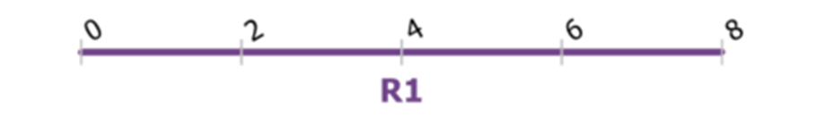

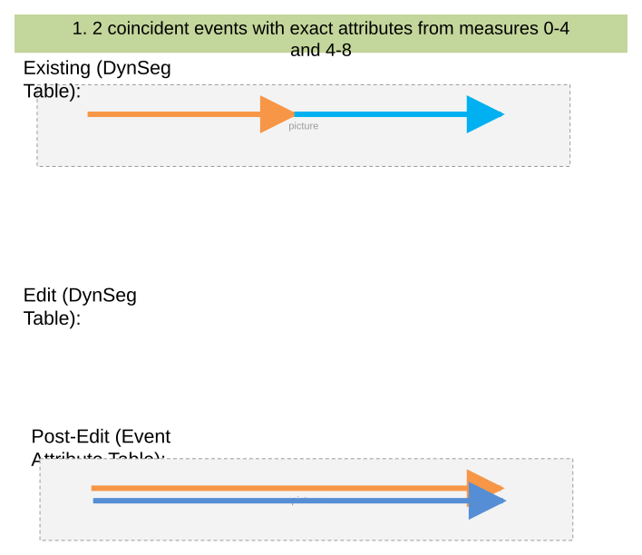

### TC-U02 — 3 Coincident Events with Exact Attributes From Measures 0-2, 2-4, and 6-8 <!-- src: S1 · slide 3 · case 2 -->

| Route Name | From Date | To Date | From Measure | To Measure | Speed. SpeedLimit | Speed. Units | Speed. Status | FuncClass . Type | FuncClass . Status |
| --- | --- | --- | --- | --- | --- | --- | --- | --- | --- |
| R1 | 1/1/2000 | Null | 0 | 2 | 45 | MPH | Active | Highway | Active |
| R1 | 1/1/2000 | Null | 2 | 6 | 55 | MPH | Active | Interstate | Proposed |
| R1 | 1/1/2000 | Null | 6 | 8 | 65 | MPH | Active | Highway | Active |

Edit (DynSeg Table):

| Route Name | From Date | To Date | From Measure | To Measure | Speed. SpeedLimit | Speed. Units | Speed. Status | FuncClass . Type | FuncClass . Status |
| --- | --- | --- | --- | --- | --- | --- | --- | --- | --- |
| R1 | 1/1/2000 | Null | 0 | 2 | 45 | MPH | Active | Highway | Active |
| R1 | 1/1/2000 | Null | 2 | 6 | 45 | MPH | Active | Highway | Active |
| R1 | 1/1/2000 | Null | 6 | 8 | 45 | MPH | Active | Highway | Active |

Post-Edit (Event Attribute Table):

| Event Layer | Route Name | EventID | From Date | To Date | From Measure | To Measure | Speed Limit | Units | Status |
| --- | --- | --- | --- | --- | --- | --- | --- | --- | --- |
| Speed | R1 | 001 | 1/1/2000 | Null | 0 | 8 | 45 | MPH | Active |

| Event Layer | Route Name | EventID | From Date | To Date | From Measure | To Measure | Type | Status |
| --- | --- | --- | --- | --- | --- | --- | --- | --- |
| FuncClass | R1 | 001 | 1/1/2000 | Null | 0 | 8 | Highway | Active |

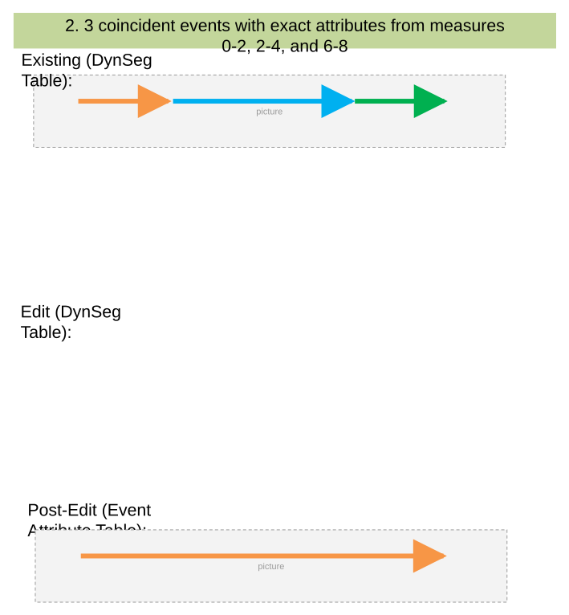

### TC-U03 — 2 Coincident Events with a Third Event Not Coincident From Measures 0-4, 4-6 (case 3) <!-- src: S1 · slide 4 · case 3 -->

- **Case:** 2 coincident events with a third event not coincident from measures 0-4, 4-6, and 6.5-8. Coincident events will merge

| Route Name | From Date | To Date | From Measure | To Measure | Speed. SpeedLimit | Speed. Units | Speed. Status | FuncClass . Type | FuncClass . Status |
| --- | --- | --- | --- | --- | --- | --- | --- | --- | --- |
| R1 | 1/1/2000 | Null | 0 | 2 | 45 | MPH | Active | Highway | Active |
| R1 | 1/1/2000 | Null | 2 | 6 | 55 | MPH | Active | Interstate | Proposed |
| R1 | 1/1/2000 | Null | 6.5 | 8 | 65 | MPH | Active | Interstate | Retired |

Edit (DynSeg Table):
Post-Edit (Event Attribute Table):

| Event Layer | Route Name | EventID | From Date | To Date | From Measure | To Measure | Speed Limit | Units | Status |
| --- | --- | --- | --- | --- | --- | --- | --- | --- | --- |
| Speed | R1 | 001 | 1/1/2000 | Null | 0 | 6 | 45 | MPH | Active |
| Speed | R1 | 003 | 1/1/2000 | Null | 6.5 | 8 | 45 | MPH | Active |

| Route Name | From Date | To Date | From Measure | To Measure | Speed. SpeedLimit | Speed. Units | Speed. Status | FuncClass . Type | FuncClass . Status |
| --- | --- | --- | --- | --- | --- | --- | --- | --- | --- |
| R1 | 1/1/2000 | Null | 0 | 2 | 45 | MPH | Active | Highway | Active |
| R1 | 1/1/2000 | Null | 2 | 6 | 45 | MPH | Active | Highway | Active |
| R1 | 1/1/2000 | Null | 6.5 | 8 | 45 | MPH | Active | Highway | Active |

| Event Layer | Route Name | EventID | From Date | To Date | From Measure | To Measure | Type | Status |
| --- | --- | --- | --- | --- | --- | --- | --- | --- |
| FuncClass | R1 | 001 | 1/1/2000 | Null | 0 | 6 | Highway | Active |
| FuncClass | R1 | 003 | 1/1/2000 | Null | 6.5 | 8 | Highway | Active |

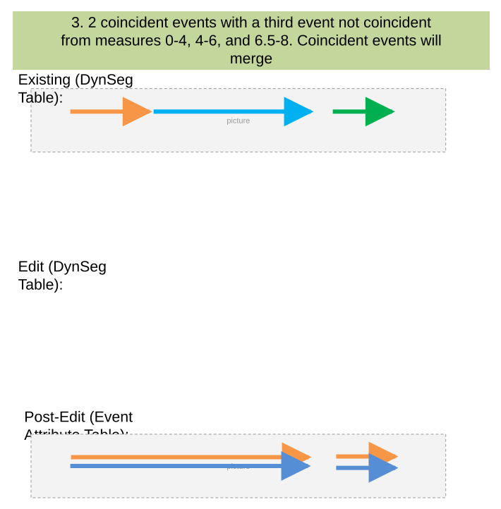

### TC-U04 — Multiple Event Layers in Attribute Set with Numerous Coincident Exact Attribute (case 4) <!-- src: S1 · slide 5 · case 4 -->

- **Case:** Multiple event layers in attribute set with numerous coincident exact attribute events

| Route Name | From Date | To Date | From Measure | To Measure | Speed. SpeedLimit | Speed. Units | Speed. Status | FuncClass . Type | FuncClass . Status |
| --- | --- | --- | --- | --- | --- | --- | --- | --- | --- |
| R1 | 1/1/2000 | Null | 0 | 2 | 45 | MPH | Active | Highway | Active |
| R1 | 1/1/2000 | Null | 2 | 6 | 55 | MPH | Active | Interstate | Active |
| R1 | 1/1/2000 | Null | 6 | 8 | 65 | MPH | Active | Major | Active |

Edit (DynSeg Table):

| Route Name | From Date | To Date | From Measure | To Measure | Speed. SpeedLimit | Speed. Units | Speed. Status | FuncClass . Type | FuncClass . Status |
| --- | --- | --- | --- | --- | --- | --- | --- | --- | --- |
| R1 | 1/1/2000 | Null | 0 | 2 | 45 | MPH | Active | Highway | Active |
| R1 | 1/1/2000 | Null | 2 | 6 | 45 | MPH | Active | Highway | Active |
| R1 | 1/1/2000 | Null | 6 | 8 | 45 | MPH | Active | Highway | Active |

Post-Edit (Event Attribute Table):

| Route Name | EventID | From Date | To Date | From Measure | To Measure | Speed Limit | Units | Status |
| --- | --- | --- | --- | --- | --- | --- | --- | --- |
| R1 | 001 | 1/1/2000 | Null | 0 | 8 | 45 | MPH | Active |

| Route Name | EventID | From Date | To Date | From Measure | To Measure | Type | Status |
| --- | --- | --- | --- | --- | --- | --- | --- |
| R1 | 100 | 1/1/2000 | Null | 0 | 8 | Highway | MPH |

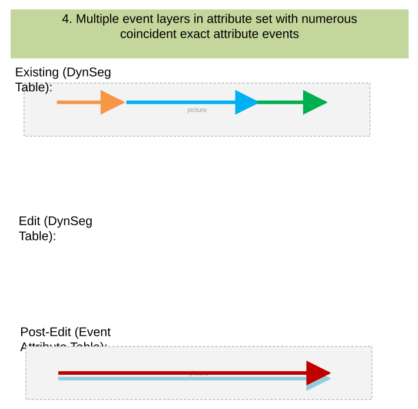

### TC-U05 — 2 Coincident Non-spanning Events with Exact Attributes From Measures 0-4 and 4-8 <!-- src: S1 · slide 6 · case 5 -->

| Route Name | From Date | To Date | From Measure | To Measure | Speed. SpeedLimit | Speed. Units | Speed. Status | FuncClass . Type | FuncClass . Status |
| --- | --- | --- | --- | --- | --- | --- | --- | --- | --- |
| R1 | 1/1/2000 | Null | 0 | 4 | 45 | MPH | Active | Highway | Active |
| R1 | 1/1/2000 | Null | 4 | 8 | 55 | MPH | Active | Interstate | Proposed |

Edit (DynSeg Table):
Post-Edit (Event Attribute Table):

| Event Layer | Route Name | EventID | From Date | To Date | From Measure | To Measure | Speed Limit | Units | Status |
| --- | --- | --- | --- | --- | --- | --- | --- | --- | --- |
| Speed | R1 | 001 | 1/1/2000 | Null | 0 | 8 | 45 | MPH | Active |

| Route Name | From Date | To Date | From Measure | To Measure | Speed. SpeedLimit | Speed. Units | Speed. Status | FuncClass . Type | FuncClass . Status |
| --- | --- | --- | --- | --- | --- | --- | --- | --- | --- |
| R1 | 1/1/2000 | Null | 0 | 4 | 45 | MPH | Active | Highway | Active |
| R1 | 1/1/2000 | Null | 4 | 8 | 45 | MPH | Active | Highway | Active |

| Event Layer | Route Name | EventID | From Date | To Date | From Measure | To Measure | Type | Status |
| --- | --- | --- | --- | --- | --- | --- | --- | --- |
| FuncClass | R1 | 001 | 1/1/2000 | Null | 0 | 8 | Highway | Active |

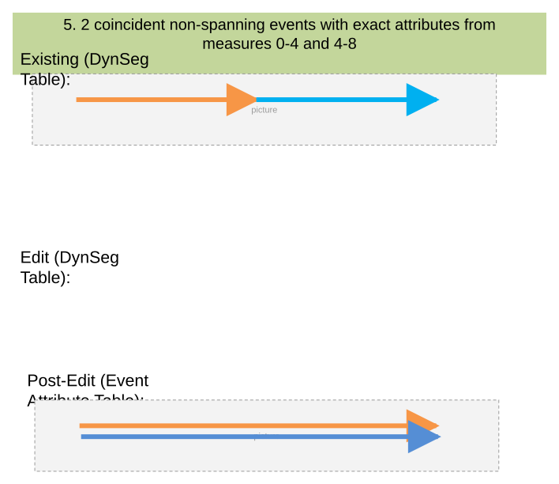

### TC-U06 — 3 Coincident Non-spanning Events with Exact Attributes From Measures 0-2, 2-4 <!-- src: S1 · slide 7 · case 6 -->

- **Case:** 3 coincident non-spanning events with exact attributes from measures 0-2, 2-4, and 6-8

| Route Name | From Date | To Date | From Measure | To Measure | Speed. SpeedLimit | Speed. Units | Speed. Status | FuncClass . Type | FuncClass . Status |
| --- | --- | --- | --- | --- | --- | --- | --- | --- | --- |
| R1 | 1/1/2000 | Null | 0 | 2 | 45 | MPH | Active | Highway | Active |
| R1 | 1/1/2000 | Null | 2 | 6 | 55 | MPH | Active | Interstate | Proposed |
| R1 | 1/1/2000 | Null | 6 | 8 | 65 | MPH | Active | Highway | Active |

Edit (DynSeg Table):

| Route Name | From Date | To Date | From Measure | To Measure | Speed. SpeedLimit | Speed. Units | Speed. Status | FuncClass . Type | FuncClass . Status |
| --- | --- | --- | --- | --- | --- | --- | --- | --- | --- |
| R1 | 1/1/2000 | Null | 0 | 2 | 45 | MPH | Active | Highway | Active |
| R1 | 1/1/2000 | Null | 2 | 6 | 45 | MPH | Active | Highway | Active |
| R1 | 1/1/2000 | Null | 6 | 8 | 45 | MPH | Active | Highway | Active |

Post-Edit (Event Attribute Table):

| Event Layer | From Route Name | To Route Name | EventID | From Date | To Date | From Measure | To Measure | Speed Limit | Units | Status |
| --- | --- | --- | --- | --- | --- | --- | --- | --- | --- | --- |
| Speed | R1 | R1 | 001 | 1/1/2000 | Null | 0 | 8 | 45 | MPH | Active |

| Event Layer | From Route Name | To Route Name | EventID | From Date | To Date | From Measure | To Measure | Type | Status |
| --- | --- | --- | --- | --- | --- | --- | --- | --- | --- |
| FuncClass | R1 | R1 | 001 | 1/1/2000 | Null | 0 | 8 | Highway | Active |

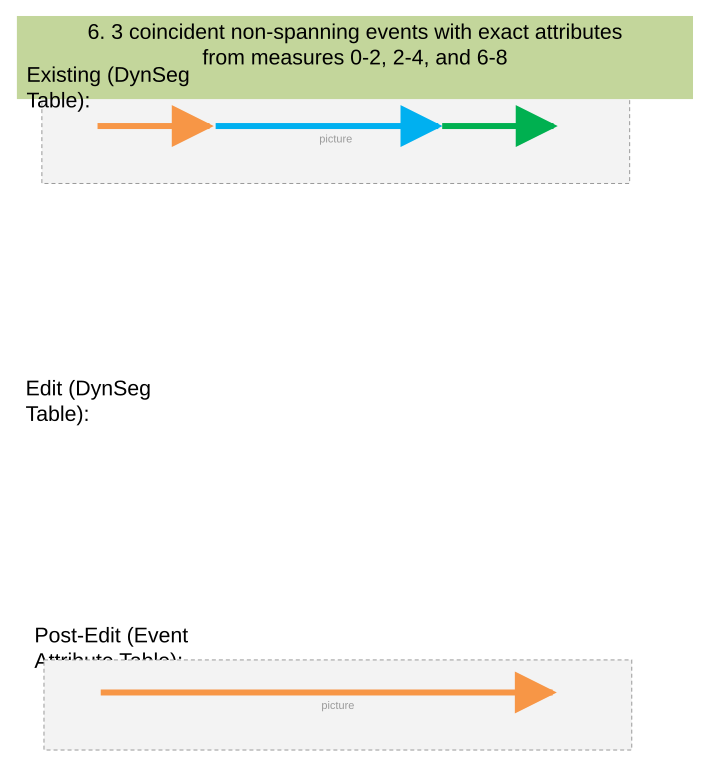

### TC-U07 — 3 Spanning Events on 3 Different Routes. Events Merge Across the Routes <!-- src: S1 · slide 8 · case 7 -->

| From Route Name | From Date | To Date | From Measure | To Measure | Speed. SpeedLimit | Speed. Units | Speed. Status | FuncClass . Type | FuncClass . Status |
| --- | --- | --- | --- | --- | --- | --- | --- | --- | --- |
| R1 | 1/1/2000 | Null | 0 | 3 | 45 | MPH | Active | Highway | Active |
| R1 | 1/1/2000 | Null | 3 | 5 | 55 | MPH | Active | Interstate | Proposed |
| R2 | 1/1/2000 | Null | 5 | 10 | 55 | MPH | Active | Interstate | Proposed |
| R3 | 1/1/2000 | Null | 10 | 12 | 55 | MPH | Active | Interstate | Proposed |
| R3 | 1/1/2000 | Null | 12 | 15 | 45 | MPH | Active | Highway | Active |

Post-Edit (Event Attribute Table):

| Event Layer | From Route Name | To Route Name | Event ID | From Date | To Date | From Measure | To Measure | Speed Limit | Units | Status |
| --- | --- | --- | --- | --- | --- | --- | --- | --- | --- | --- |
| Speed | R1 | R3 | 001 | 1/1/2000 | Null | 0 | 15 | 45 | MPH | Active |

| From Route Name | From Date | To Date | From Measure | To Measure | Speed. SpeedLimit | Speed. Units | Speed. Status | FuncClass . Type | FuncClass . Status |
| --- | --- | --- | --- | --- | --- | --- | --- | --- | --- |
| R1 | 1/1/2000 | Null | 0 | 3 | 45 | MPH | Active | Highway | Active |
| R1 | 1/1/2000 | Null | 3 | 5 | 45 | MPH | Active | Highway | Active |
| R2 | 1/1/2000 | Null | 5 | 10 | 45 | MPH | Active | Highway | Active |
| R3 | 1/1/2000 | Null | 10 | 12 | 45 | MPH | Active | Highway | Active |
| R3 | 1/1/2000 | Null | 12 | 15 | 45 | MPH | Active | Highway | Active |

| Event Layer | From Route Name | To Route Name | EventID | From Date | To Date | From Measure | To Measure | Type | Status |
| --- | --- | --- | --- | --- | --- | --- | --- | --- | --- |
| FuncClass | R1 | R1 | 001 | 1/1/2000 | Null | 0 | 8 | Highway | Active |

[figure: Existing (DynSeg Table): · Edit (DynSeg Table): · R1 · R2 · 0 · 5 · 10 · 15 · R3]

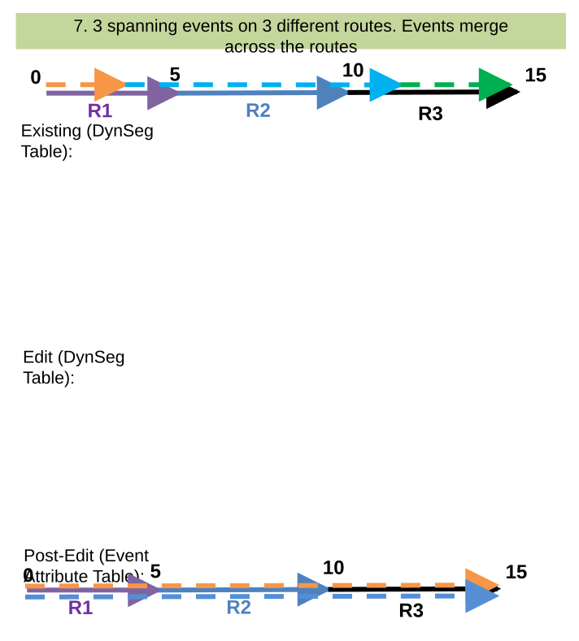

### TC-U08 — Merge Option Disabled (case 9) <!-- src: S1 · slide 10 · case 9 -->

- **Case:** Merge Option disabled, coincident events that have exact attributes from measures 0-4 and 4-8. Events should not merge

Edit (DynSeg Table):
Post-Edit (Event Attribute Table):

| Route Name | From Date | To Date | From Measure | To Measure | Speed. SpeedLimit | Speed. Units | Speed. Status | FuncClass . Type | FuncClass . Status |
| --- | --- | --- | --- | --- | --- | --- | --- | --- | --- |
| R1 | 1/1/2000 | Null | 0 | 4 | 45 | MPH | Active | Highway | Active |
| R1 | 1/1/2000 | Null | 4 | 8 | 55 | MPH | Active | Interstate | Proposed |

| Event Layer | Route Name | EventID | From Date | To Date | From Measure | To Measure | Speed Limit | Units | Status |
| --- | --- | --- | --- | --- | --- | --- | --- | --- | --- |
| Speed | R1 | 001 | 1/1/2000 | Null | 0 | 4 | 45 | MPH | Active |
| Speed | R1 | 002 | 1/1/2000 | Null | 4 | 8 | 45 | MPH | Active |

| Route Name | From Date | To Date | From Measure | To Measure | Speed. SpeedLimit | Speed. Units | Speed. Status | FuncClass . Type | FuncClass . Status |
| --- | --- | --- | --- | --- | --- | --- | --- | --- | --- |
| R1 | 1/1/2000 | Null | 0 | 4 | 45 | MPH | Active | Highway | Active |
| R1 | 1/1/2000 | Null | 4 | 8 | 45 | MPH | Active | Highway | Active |

| Event Layer | From Route Name | To Route Name | EventID | From Date | To Date | From Measure | To Measure | Type | Status |
| --- | --- | --- | --- | --- | --- | --- | --- | --- | --- |
| FuncClass | R1 | R1 | 001 | 1/1/2000 | Null | 0 | 4 | Highway | Active |
| FuncClass | R1 | R1 | 001 | 1/1/2000 | Null | 4 | 8 | Highway | Active |

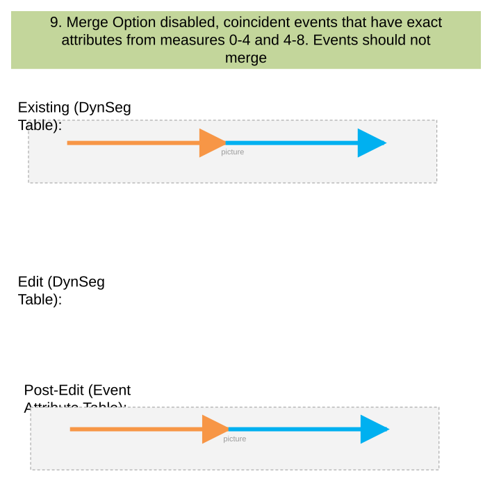

### TC-U09 — Gapped Route, 2 Coincident Events That Are Updated To Have the Same Exact (case 10) <!-- src: S1 · slide 11 · case 10 -->

- **Case:** Gapped route, 2 coincident events that are updated to have the same exact attributes, but a gap exists between them. They should not merge

Post-Edit (Event Attribute Table):

| Route Name | From Date | To Date | From Measure | To Measure | Speed. SpeedLimit | Speed. Units | Speed. Status | FuncClass . Type | FuncClass . Status |
| --- | --- | --- | --- | --- | --- | --- | --- | --- | --- |
| R1 | 1/1/2000 | Null | 0 | 6 | 45 | MPH | Active | Highway | Active |
| R1 | 1/1/2000 | Null | 6 | 10 | 55 | MPH | Active | Interstate | Proposed |

| Event Layer | Route Name | EventID | From Date | To Date | From Measure | To Measure | Speed Limit | Units | Status |
| --- | --- | --- | --- | --- | --- | --- | --- | --- | --- |
| Speed | R1 | 001 | 1/1/2000 | Null | 0 | 6 | 45 | MPH | Active |
| Speed | R1 | 002 | 1/1/2000 | Null | 6 | 10 | 45 | MPH | Active |

| Route Name | From Date | To Date | From Measure | To Measure | Speed. SpeedLimit | Speed. Units | Speed. Status | FuncClass . Type | FuncClass . Status |
| --- | --- | --- | --- | --- | --- | --- | --- | --- | --- |
| R1 | 1/1/2000 | Null | 0 | 6 | 45 | MPH | Active | Highway | Active |
| R1 | 1/1/2000 | Null | 6 | 10 | 45 | MPH | Active | Highway | Active |

| Event Layer | From Route Name | To Route Name | EventID | From Date | To Date | From Measure | To Measure | Type | Status |
| --- | --- | --- | --- | --- | --- | --- | --- | --- | --- |
| FuncClass | R1 | R1 | 001 | 1/1/2000 | Null | 0 | 6 | Highway | Active |
| FuncClass | R1 | R1 | 001 | 1/1/2000 | Null | 6 | 10 | Highway | Active |

[figure: Existing (DynSeg Table): · Edit (DynSeg Table): · 6]

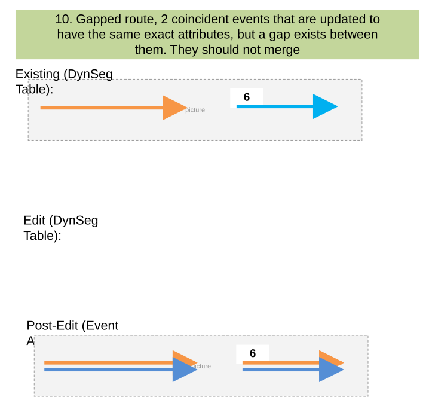

### TC-U10 — Route with Events in Different Time Slices. Events Are Updated To Same (case 11) <!-- src: S1 · slide 12 · case 11 -->

- **Case:** Route with events in different time slices. Events are updated to same attributes but will not merge

Edit (DynSeg Table):
Post-Edit (Event Attribute Table):

| Route Name | From Date | To Date | From Measure | To Measure | Speed. SpeedLimit | Speed. Units | Speed. Status | FuncClass . Type | FuncClass . Status |
| --- | --- | --- | --- | --- | --- | --- | --- | --- | --- |
| R1 | 1/1/2000 | 1/1/2005 | 0 | 6 | 45 | MPH | Active | Highway | Active |
| R1 | 1/1/2006 | Null | 6 | 10 | 55 | MPH | Active | Interstate | Proposed |

| Event Layer | Route Name | EventID | From Date | To Date | From Measure | To Measure | Speed Limit | Units | Status |
| --- | --- | --- | --- | --- | --- | --- | --- | --- | --- |
| Speed | R1 | 001 | 1/1/2000 | Null | 0 | 6 | 45 | MPH | Active |
| Speed | R1 | 002 | 1/1/2000 | Null | 6 | 10 | 45 | MPH | Active |

| Route Name | From Date | To Date | From Measure | To Measure | Speed. SpeedLimit | Speed. Units | Speed. Status | FuncClass . Type | FuncClass . Status |
| --- | --- | --- | --- | --- | --- | --- | --- | --- | --- |
| R1 | 1/1/2000 | Null | 0 | 6 | 45 | MPH | Active | Highway | Active |
| R1 | 1/1/2000 | Null | 6 | 10 | 45 | MPH | Active | Highway | Active |

| Event Layer | From Route Name | To Route Name | EventID | From Date | To Date | From Measure | To Measure | Type | Status |
| --- | --- | --- | --- | --- | --- | --- | --- | --- | --- |
| FuncClass | R1 | R1 | 001 | 1/1/2000 | Null | 0 | 6 | Highway | Active |
| FuncClass | R1 | R1 | 001 | 1/1/2000 | Null | 6 | 10 | Highway | Active |

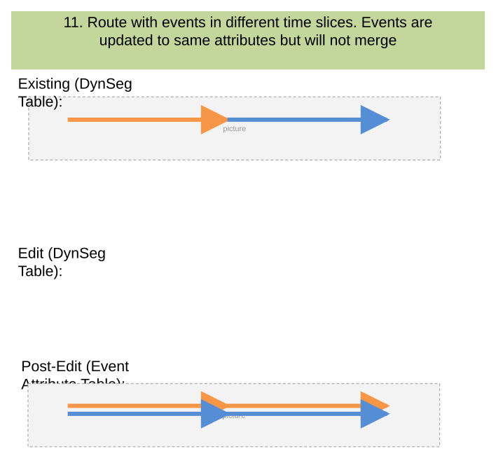

## Other content

### Slide 1 — Devtopia Issue <!-- slide 1 -->

Dynamic Segmentation Merge Option

**Notes:**
- Test with mix of APR and RH data
- Test with and without spanning line events
- Test with all field types in multiple events in an Attribute Set
- Test a case or two in REST
- Confirm Conflict Prevention still works as intended
- Test in light and dark themes
- Common workflow will be merging coincident measured events with the exact same attributes
- Events with different derived event measures should not merge as they are not attribute exact

| Positive Tests: Other |
| --- |
| 2 coincident events in overlapping time slices from measures 0-4 and 4-8. Event 1 time slice of 1/1/2005-1/1/2010 and Event 2 time slice of 1/1/2009-Null. Events will merge and create new event records for the time slices |

### Slide 9 — Existing (DynSeg Table): <!-- slide 9 -->

- 2 noncoincident events with exact attributes from measures 0-4 and 4.1-8, events should not merge

| Route Name | From Date | To Date | From Measure | To Measure | Speed. SpeedLimit | Speed. Units | Speed. Status | FuncClass . Type | FuncClass . Status |
| --- | --- | --- | --- | --- | --- | --- | --- | --- | --- |
| R1 | 1/1/2000 | Null | 0 | 4 | 45 | MPH | Active | Highway | Active |
| R1 | 1/1/2000 | Null | 4.1 | 8 | 55 | MPH | Active | Interstate | Proposed |

Edit (DynSeg Table):
Post-Edit (Event Attribute Table):

| Event Layer | Route Name | EventID | From Date | To Date | From Measure | To Measure | Speed Limit | Units | Status |
| --- | --- | --- | --- | --- | --- | --- | --- | --- | --- |
| Speed | R1 | 001 | 1/1/2000 | Null | 0 | 4 | 45 | MPH | Active |
| Speed | R1 | 002 | 1/1/2000 | Null | 4.1 | 8 | 45 | MPH | Active |

| Route Name | From Date | To Date | From Measure | To Measure | Speed. SpeedLimit | Speed. Units | Speed. Status | FuncClass . Type | FuncClass . Status |
| --- | --- | --- | --- | --- | --- | --- | --- | --- | --- |
| R1 | 1/1/2000 | Null | 0 | 4 | 45 | MPH | Active | Highway | Active |
| R1 | 1/1/2000 | Null | 4.1 | 8 | 45 | MPH | Active | Highway | Active |

| Event Layer | From Route Name | To Route Name | EventID | From Date | To Date | From Measure | To Measure | Type | Status |
| --- | --- | --- | --- | --- | --- | --- | --- | --- | --- |
| FuncClass | R1 | R1 | 001 | 1/1/2000 | Null | 0 | 4 | Highway | Active |
| FuncClass | R1 | R1 | 001 | 1/1/2000 | Null | 4.1 | 8 | Highway | Active |

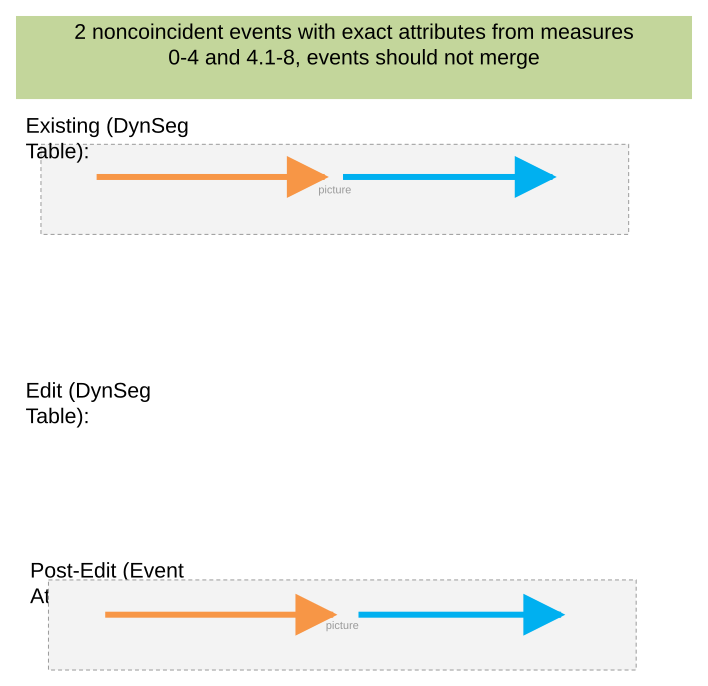

### Slide 13 — Existing (DynSeg Table): <!-- slide 13 -->

- 2 coincident events in overlapping time slices from measures 0-4 and 4-8. Event 1 time slice of 1/1/2005-1/1/2010 and Event 2 time slice of 1/1/2009-Null.  Events will merge and create new event records for the time slices

| Route Name | From Date | To Date | From Measure | To Measure | Speed. SpeedLimit | Speed. Units | Speed. Status | FuncClass . Type | FuncClass . Status |
| --- | --- | --- | --- | --- | --- | --- | --- | --- | --- |
| R1 | 1/1/2005 | 1/1/2009 | 0 | 4 | 45 | MPH | Active | Highway | Active |
| R1 | 1/1/2009 | 1/1/2010 | 0 | 4 | 45 | MPH | Active | Highway | Active |
| R1 | 1/1/2010 | Null | 0 | 4 | Null | Null | Null | Null | Null |
| R1 | 1/1/2005 | 1/1/2009 | 4 | 8 | Null | Null | Null | Null | Null |
| R1 | 1/1/2009 | 1/1/2010 | 4 | 8 | 55 | MPH | Active | Interstate | Proposed |
| R1 | 1/1/2010 | Null | 4 | 8 | 55 | MPH | Active | Interstate | Proposed |

Edit (DynSeg Table):
Post-Edit (Event Attribute Table):

| Event Layer | Route Name | EventID | From Date | To Date | From Measure | To Measure | Speed Limit | Units | Status |
| --- | --- | --- | --- | --- | --- | --- | --- | --- | --- |
| Speed | R1 | 001 | 1/1/2005 | 1/1/2009 | 0 | 4 | 45 | MPH | Active |
| Speed | R1 | 001 | 1/1/2009 | 1/1/2010 | 0 | 8 | 45 | MPH | Active |
| Speed | R1 | 001 | 1/1/2010 | Null | 4 | 8 | 55 | MPH | Active |

| Route Name | From Date | To Date | From Measure | To Measure | Speed. SpeedLimit | Speed. Units | Speed. Status | FuncClass . Type | FuncClass . Status |
| --- | --- | --- | --- | --- | --- | --- | --- | --- | --- |
| R1 | 1/1/2005 | 1/1/2009 | 0 | 4 | 45 | MPH | Active | Highway | Active |
| R1 | 1/1/2009 | 1/1/2010 | 0 | 4 | 45 | MPH | Active | Highway | Active |
| R1 | 1/1/2010 | Null | 0 | 4 | Null | Null | Null | Null | Null |
| R1 | 1/1/2005 | 1/1/2009 | 4 | 8 | Null | Null | Null | Null | Null |
| R1 | 1/1/2009 | 1/1/2010 | 4 | 8 | 45 | MPH | Active | Highway | Active |
| R1 | 1/1/2010 | Null | 4 | 8 | 55 | MPH | Active | Interstate | Proposed |

| Event Layer | Route Name | EventID | From Date | To Date | From Measure | To Measure | Type | Status |
| --- | --- | --- | --- | --- | --- | --- | --- | --- |
| FuncClass | R1 | 001 | 1/1/2005 | 1/1/2009 | 0 | 4 | 45 | Active |
| FuncClass | R1 | 001 | 1/1/2009 | 1/1/2010 | 0 | 8 | 45 | Active |
| FuncClass | R1 | 001 | 1/1/2010 | Null | 4 | 8 | 55 | MPH |

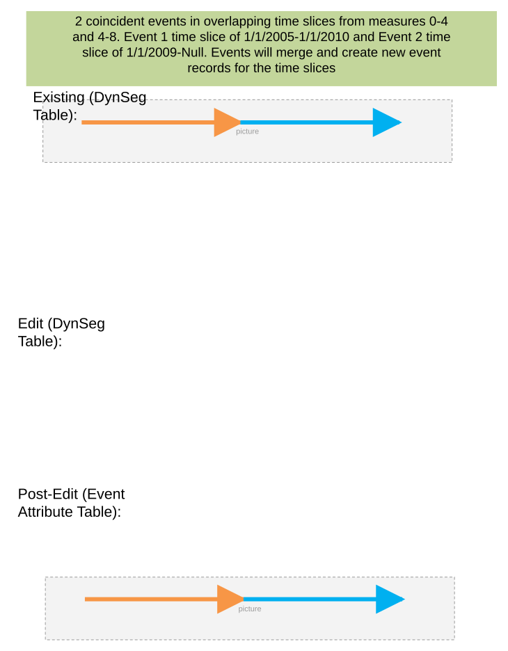
