# Flip Centerline Tool: In Memory Flip (UI) Test Plan

| Field | Value |
| --- | --- |
| **Doc** | 577 · Test Plan · Pro |
| **Product** | Roads & Highways · Pipeline Referencing · Utility Network |
| **Release** | — |
| **Issues** | [ArcGISPro/ps-location-referencing#5042](https://devtopia.esri.com/ArcGISPro/ps-location-referencing/issues/5042) |
| **Source** | [5042-FlipCenterlineToolinMemoryFlipUI_TestPlan_V3.pptx](<https://esriis.sharepoint.com/sites/LocationReferencing/Shared%20Documents/General/Test%20Plans/5042-FlipCenterlineToolinMemoryFlipUI_TestPlan_V3.pptx>) · rev V3 |
| **People** | author Mac Christmas · PE — · dev — |
| **Edited** | 2023-04-17 16:10 by Mac Christmas |
| **Extracted** | 2026-09-04 · lane xmlstrip · format 3.0 · prompt v2.0.2 |
| **Keywords** | centerline · flip · in memory flip · route creation · route extension · route realignment · non monotonic |
| **Tools** | Create Route · Extend Route · Realign Route |

## Summary

Test plan for the Flip Centerline Tool focusing on in memory flipping of centerline geometry during route creation, extension, and realignment in continuous and engineering networks with Utility Network (UN). Covers positive and negative test cases including complex route scenarios, measure handling, and centerline order recalculation after flips.

## Related documents

<!-- related:begin -->
- [Flip Centerline Tool In-Memory Flip User Story](<https://esriis.sharepoint.com/sites/lrsworkspace/LRS Doc Index/User Stories/4613-flip-centerline-tool-in-memory-flip-rh-apr-un-2023-03.md>) — similar text 0.46 · 4 title words · 3 filename words · same surface <!-- rel:601 s=6.974 -->
- [Flip Centerline Tool In-Memory Flip User Story](<https://esriis.sharepoint.com/sites/lrsworkspace/LRS%20Doc%20Index/User%20Stories/4613-flip-centerline-tool-in-memory-flip-rh-apr-un-2023-03-2.md>) — similar text 0.41 · 4 title words · 3 filename words · same surface <!-- rel:602 s=6.83 -->
- [Flip Centerline Tool In-Memory Flip User Story](<https://esriis.sharepoint.com/sites/lrsworkspace/LRS Doc Index/User Stories/4613-flip-centerline-tool-in-memory-flip-rh-apr-un-2023-02.md>) — similar text 0.46 · 4 title words · 3 filename words · same surface <!-- rel:609 s=6.364 -->
- [Extend Route AI Assistant Test Plan](<https://esriis.sharepoint.com/sites/lrsworkspace/LRS Doc Index/Test Plans/7065-extend-route-ai-assistant.md>) — similar text 0.17 · same kind/surface/folder <!-- rel:18 s=2.663 -->
- [64-bit OID Support for Route Editing Tools](<https://esriis.sharepoint.com/sites/lrsworkspace/LRS Doc Index/Test Plans/5013-64-bit-oid-support-for-route-editing-tools.md>) — similar text 0.15 · same kind/surface/folder <!-- rel:483 s=2.632 -->
<!-- related:end -->

<!-- docs:begin -->
## Esri documentation

[Create a route](https://doc.esri.com/en/arcgis-pro/latest/help/production/roads-highways/create-a-new-route.html) · [Extend a route](https://doc.esri.com/en/arcgis-pro/latest/help/production/roads-highways/extend-a-route.html) · [Realign routes](https://doc.esri.com/en/arcgis-pro/latest/help/production/roads-highways/realign-routes.html) · [Event behavior for route extension](https://doc.esri.com/en/arcgis-pro/latest/help/production/roads-highways/event-behavior-for-route-extension.html)
<!-- docs:end -->

---

## Overview

### Slide 1 — Devtopia Issue <!-- slide 1 -->

Flip Centerline Tool: In Memory Flip (UI)

**Notes**
- Test with RH and APR data. Test more with APR in an APR-UN environment
- Test in FS, but do a couple tests in a DC environment
- Test in Create, Extend, and Realign Route tools
- Centerline geometry is only flipped in memory, permanent geometry of centerline will persist
- In memory flips should not create dirty area in UN and connectivity should maintain in UN
- Only test some of the complex route scenarios as per feedback from test plan review meeting

## Test Cases

### TC-P01 — 1 centerline selected, centerline flipped in memory, route created (1) <!-- src: S4 · slide 2 · Positive Tests: Create Route (Continuous Network) · 1 -->

- **Group:** Create Route (Continuous Network)

### TC-P02 — 2 centerlines selected, first centerline flipped in memory, route created <!-- src: S4 · slide 2 · Positive Tests: Create Route (Continuous Network) · 2 -->

- **Group:** Create Route (Continuous Network)

### TC-P03 — 3 centerlines selected, middle centerline flipped in memory, route created <!-- src: S4 · slide 2 · Positive Tests: Create Route (Continuous Network) · 3 -->

- **Group:** Create Route (Continuous Network)

### TC-P04 — 3 centerlines selected, first centerline flipped in memory, route created <!-- src: S4 · slide 2 · Positive Tests: Create Route (Continuous Network) · 4 -->

- **Group:** Create Route (Continuous Network)

### TC-P05 — 3 centerlines selected, last centerline flipped in memory, route created <!-- src: S4 · slide 2 · Positive Tests: Create Route (Continuous Network) · 5 -->

- **Group:** Create Route (Continuous Network)

### TC-P06 — 5 centerlines selected, centerlines 2 and 4 flipped in memory, route created <!-- src: S4 · slide 2 · Positive Tests: Create Route (Continuous Network) · 6 -->

- **Group:** Create Route (Continuous Network)

### TC-P07 — 1 centerline selected at end of existing route, flipped in memory (1) <!-- src: S4 · slide 2 · Positive Tests: Extend Route (Continuous Network) · 1 -->

- **Group:** Extend Route (Continuous Network)
- **Case:** 1 centerline selected at end of existing route, flipped in memory, route extended

### TC-P08 — 1 centerline selected at beginning of existing route, flipped in memory (1) <!-- src: S4 · slide 2 · Positive Tests: Extend Route (Continuous Network) · 2 -->

- **Group:** Extend Route (Continuous Network)
- **Case:** 1 centerline selected at beginning of existing route, flipped in memory, route extended

### TC-P09 — 2 centerlines selected at end of existing route (1) <!-- src: S4 · slide 2 · Positive Tests: Extend Route (Continuous Network) · 3 -->

- **Group:** Extend Route (Continuous Network)
- **Case:** 2 centerlines selected at end of existing route, first centerline flipped in memory, route extended

### TC-P10 — 2 centerlines selected at beginning of existing route (1) <!-- src: S4 · slide 2 · Positive Tests: Extend Route (Continuous Network) · 4 -->

- **Group:** Extend Route (Continuous Network)
- **Case:** 2 centerlines selected at beginning of existing route, first centerline flipped in memory, route extended

### TC-P11 — 1 centerline selected with measures 0-10, centerline flipped in memory <!-- src: S4 · slide 2 · Positive Tests: Create Route (Engineering Network + UN) · 1 -->

- **Group:** Create Route (Engineering Network + UN)
- **Case:** 1 centerline selected with measures 0-10, centerline flipped in memory, route created with no dirty areas

### TC-P12 — 2 centerlines selected with measures 0-10 and 10-20 (1) <!-- src: S4 · slide 2 · Positive Tests: Create Route (Engineering Network + UN) · 2 -->

- **Group:** Create Route (Engineering Network + UN)
- **Case:** 2 centerlines selected with measures 0-10 and 10-20, second centerline flipped in memory, route created with no dirty areas

### TC-P13 — 3 centerlines selected with measures 0-10, 10-20, and 20-30 (1) <!-- src: S4 · slide 2 · Positive Tests: Create Route (Engineering Network + UN) · 3 -->

- **Group:** Create Route (Engineering Network + UN)
- **Case:** 3 centerlines selected with measures 0-10, 10-20, and 20-30, middle centerline flipped in memory, route created with no dirty areas

### TC-P14 — 3 centerlines selected with measures 0-10, 10-20, and 20-30 (2) <!-- src: S4 · slide 2 · Positive Tests: Create Route (Engineering Network + UN) · 4 -->

- **Group:** Create Route (Engineering Network + UN)
- **Case:** 3 centerlines selected with measures 0-10, 10-20, and 20-30, first centerline flipped in memory, route created with no dirty areas

### TC-P15 — 3 centerlines selected with measures 0-10, 10-20, and 20-30 (3) <!-- src: S4 · slide 2 · Positive Tests: Create Route (Engineering Network + UN) · 5 -->

- **Group:** Create Route (Engineering Network + UN)
- **Case:** 3 centerlines selected with measures 0-10, 10-20, and 20-30, last centerline flipped in memory, route created with no dirty areas

### TC-P16 — 1 centerline selected at end of existing route, flipped in memory (2) <!-- src: S4 · slide 2 · Positive Tests: Extend Route (Engineering Network+ UN) · 1 -->

- **Group:** Extend Route (Engineering Network+ UN)
- **Case:** 1 centerline selected at end of existing route, flipped in memory, route extended with no dirty areas

### TC-P17 — 1 centerline selected at beginning of existing route, flipped in memory (2) <!-- src: S4 · slide 2 · Positive Tests: Extend Route (Engineering Network+ UN) · 2 -->

- **Group:** Extend Route (Engineering Network+ UN)
- **Case:** 1 centerline selected at beginning of existing route, flipped in memory, route extended with no dirty areas

### TC-P18 — 2 centerlines selected at end of existing route (2) <!-- src: S4 · slide 2 · Positive Tests: Extend Route (Engineering Network+ UN) · 3 -->

- **Group:** Extend Route (Engineering Network+ UN)
- **Case:** 2 centerlines selected at end of existing route, first centerline flipped in memory, route extended with no dirty areas

### TC-P19 — 2 centerlines selected at beginning of existing route (2) <!-- src: S4 · slide 2 · Positive Tests: Extend Route (Engineering Network+ UN) · 4 -->

- **Group:** Extend Route (Engineering Network+ UN)
- **Case:** 2 centerlines selected at beginning of existing route, first centerline flipped in memory, route extended with no dirty areas

### TC-P20 — 1 centerline selected at the end of the next route on the line (1) <!-- src: S4 · slide 2 · Positive Tests: Extend Route (Engineering Network+ UN) · 5 -->

- **Group:** Extend Route (Engineering Network+ UN)
- **Case:** 1 centerline selected at the end of the next route on the line, flipped in memory, route extended with no dirty areas

### TC-P21 — 1 centerline selected at the beginning of the previous route on the line <!-- src: S4 · slide 2 · Positive Tests: Extend Route (Engineering Network+ UN) · 6 -->

- **Group:** Extend Route (Engineering Network+ UN)
- **Case:** 1 centerline selected at the beginning of the previous route on the line, flipped in memory, route extended with no dirty areas

### TC-P22 — 1 centerline selected at the end of the next reverse stationed route (1) <!-- src: S4 · slide 2 · Positive Tests: Extend Route (Engineering Network+ UN) · 7 -->

- **Group:** Extend Route (Engineering Network+ UN)
- **Case:** 1 centerline selected at the end of the next reverse stationed route on the line, flipped in memory, route extended with no dirty areas

### TC-P23 — 1 centerline selected, realign middle of a normal route with an in memory flip (1) <!-- src: S4 · slide 3 · Positive Tests: Realign Route (Continuous Network) · 1 -->

- **Group:** Realign Route (Continuous Network)
- **Case:** 1 centerline selected, realign middle of a normal route with an in memory flip, route realigned

### TC-P24 — 2 centerlines selected, realign middle of a normal route (1) <!-- src: S4 · slide 3 · Positive Tests: Realign Route (Continuous Network) · 2 -->

- **Group:** Realign Route (Continuous Network)
- **Case:** 2 centerlines selected, realign middle of a normal route, first centerline flipped in memory, route realigned

### TC-P25 — 1 centerline selected, realign middle of a loop route with an in memory flip (1) <!-- src: S4 · slide 3 · Positive Tests: Realign Route (Continuous Network) · 3 -->

- **Group:** Realign Route (Continuous Network)
- **Case:** 1 centerline selected, realign middle of a loop route with an in memory flip, route realigned

### TC-P26 — 1 centerline selected (1) <!-- src: S4 · slide 3 · Positive Tests: Realign Route (Continuous Network) · 4 -->

- **Group:** Realign Route (Continuous Network)
- **Case:** 1 centerline selected, realign middle of a lollipop route with an in memory flip, route realigned

### TC-P27 — 1 centerline selected, realign middle of a gapped route with an in memory flip (1) <!-- src: S4 · slide 3 · Positive Tests: Realign Route (Continuous Network) · 5 -->

- **Group:** Realign Route (Continuous Network)
- **Case:** 1 centerline selected, realign middle of a gapped route with an in memory flip, route realigned

### TC-P28 — 1 centerline selected (2) <!-- src: S4 · slide 3 · Positive Tests: Realign Route (Continuous Network) · 6 -->

- **Group:** Realign Route (Continuous Network)
- **Case:** 1 centerline selected, realign middle of an infinity route with an in memory flip, route realigned

### TC-P29 — 1 center line selected, realign middle of a branch route with an in memory flip (1) <!-- src: S4 · slide 3 · Positive Tests: Realign Route (Continuous Network) · 7 -->

- **Group:** Realign Route (Continuous Network)
- **Case:** 1 center line selected, realign middle of a branch route with an in memory flip, route realigned

### TC-P30 — 1 centerline selected, realign middle of a normal route with an in memory flip (2) <!-- src: S4 · slide 3 · Positive Tests: Realign Route (Engineering Network + UN) · 1 -->

- **Group:** Realign Route (Engineering Network + UN)
- **Case:** 1 centerline selected, realign middle of a normal route with an in memory flip, route realigned with no dirty areas

### TC-P31 — 2 centerlines selected, realign middle of a normal route (2) <!-- src: S4 · slide 3 · Positive Tests: Realign Route (Engineering Network + UN) · 2 -->

- **Group:** Realign Route (Engineering Network + UN)
- **Case:** 2 centerlines selected, realign middle of a normal route, first centerline flipped in memory, route realigned with no dirty areas

### TC-P32 — 1 centerline selected, realign middle of a loop route with an in memory flip (2) <!-- src: S4 · slide 3 · Positive Tests: Realign Route (Engineering Network + UN) · 3 -->

- **Group:** Realign Route (Engineering Network + UN)
- **Case:** 1 centerline selected, realign middle of a loop route with an in memory flip, route realigned with no dirty areas

### TC-P33 — 1 centerline selected (3) <!-- src: S4 · slide 3 · Positive Tests: Realign Route (Engineering Network + UN) · 4 -->

- **Group:** Realign Route (Engineering Network + UN)
- **Case:** 1 centerline selected, realign middle of a lollipop route with an in memory flip, route realigned with no dirty areas

### TC-P34 — 1 centerline selected, realign middle of a gapped route with an in memory flip (2) <!-- src: S4 · slide 3 · Positive Tests: Realign Route (Engineering Network + UN) · 5 -->

- **Group:** Realign Route (Engineering Network + UN)
- **Case:** 1 centerline selected, realign middle of a gapped route with an in memory flip, route realigned with no dirty areas

### TC-P35 — 1 centerline selected (4) <!-- src: S4 · slide 3 · Positive Tests: Realign Route (Engineering Network + UN) · 6 -->

- **Group:** Realign Route (Engineering Network + UN)
- **Case:** 1 centerline selected, realign middle of an infinity route with an in memory flip, route realigned with no dirty areas

### TC-P36 — 1 center line selected, realign middle of a branch route with an in memory flip (2) <!-- src: S4 · slide 3 · Positive Tests: Realign Route (Engineering Network + UN) · 7 -->

- **Group:** Realign Route (Engineering Network + UN)
- **Case:** 1 center line selected, realign middle of a branch route with an in memory flip, route realigned with no dirty areas

### TC-P37 — 1 centerline selected (5) <!-- src: S4 · slide 3 · Positive Tests: Realign Route (Engineering Network + UN) · 8 -->

- **Group:** Realign Route (Engineering Network + UN)
- **Case:** 1 centerline selected, realign middle of a series of reverse stationed routes with an in memory flip, route realigned with no dirty areas

### TC-P38 — 1 centerline used to create a route with an in memory flip. Another centerline <!-- src: S4 · slide 3 · Positive Tests: Realign Route (Engineering Network + UN) · 9 -->

- **Group:** Realign Route (Engineering Network + UN)
- **Case:** 1 centerline used to create a route with an in memory flip. Another centerline used to realign the route without an in memory flip, abandoned route will have correct measures.

### TC-P39 — 3 centerlines selected (1) <!-- src: S4 · slide 3 · Positive Tests: Centerline Reorder After Flip · 1 -->

- **Group:** Centerline Reorder After Flip
- **Case:** 3 centerlines selected, all centerlines flipped in memory. Centerline order recalculated after in memory flip

### TC-P40 — Multiple centerlines selected (1) <!-- src: S4 · slide 3 · Positive Tests: Centerline Reorder After Flip · 2 -->

- **Group:** Centerline Reorder After Flip
- **Case:** Multiple centerlines selected, realign multiple routes along a route with an in memory flip, route realigned with no dirty areas

### TC-P41 — Multiple centerlines selected (2) <!-- src: S4 · slide 3 · Positive Tests: Centerline Reorder After Flip · 3 -->

- **Group:** Centerline Reorder After Flip
- **Case:** Multiple centerlines selected, one flipped in memory. Centerline order recalculated after in memory flip

### TC-N01 — 3 centerlines selected (2) <!-- src: S4 · slide 5 · Negative Tests: Create Route Error · 1 -->

- **Group:** Create Route Error
- **Case:** 3 centerlines selected, first centerline is in same direction of calibration as other centerlines in selection. Result is non-monotonic

### TC-N02 — Attempt route creation with LRS measures opposite UN measures <!-- src: S4 · slide 5 · Negative Tests: Create Route Error · 2 -->

- **Group:** Create Route Error

### TC-N03 — 1 Centerline selected at the end of a route <!-- src: S4 · slide 5 · Negative Tests: Extend Route Error · 1 -->

- **Group:** Extend Route Error
- **Case:** 1 Centerline selected at the end of a route, centerline is flipped to be against the direction of calibration of the route. Result is non-monotonic

### TC-N04 — 1 centerline selected at the beginning of a route <!-- src: S4 · slide 5 · Negative Tests: Extend Route Error · 2 -->

- **Group:** Extend Route Error
- **Case:** 1 centerline selected at the beginning of a route, centerline is flipped to be against the direction of calibration of the route. Result is non-monotonic.

### TC-N05 — 1 Centerline selected with each endpoint being in the middle of a route <!-- src: S4 · slide 5 · Negative Tests: Realign Route Error · 1 -->

- **Group:** Realign Route Error
- **Case:** 1 Centerline selected with each endpoint being in the middle of a route, centerline is flipped to be against the direction of calibration of the route. Result is non-monotonic

### TC-N06 — Multiple centerlines selected (3) <!-- src: S4 · slide 5 · Negative Tests: Realign Route Error · 2 -->

- **Group:** Realign Route Error
- **Case:** Multiple centerlines selected, flipped to be against direction of calibration of routes along a line. Result is non-monotonic.

### TC-U01 — 1 centerline selected, centerline flipped in memory, route created (case 1) <!-- src: S2 · slide 7 · case 1 -->

2. 2 centerlines selected, first centerline flipped in memory, route created

[figure: Input: · Output: · 0 · 10 · R1 · 1 · 2]

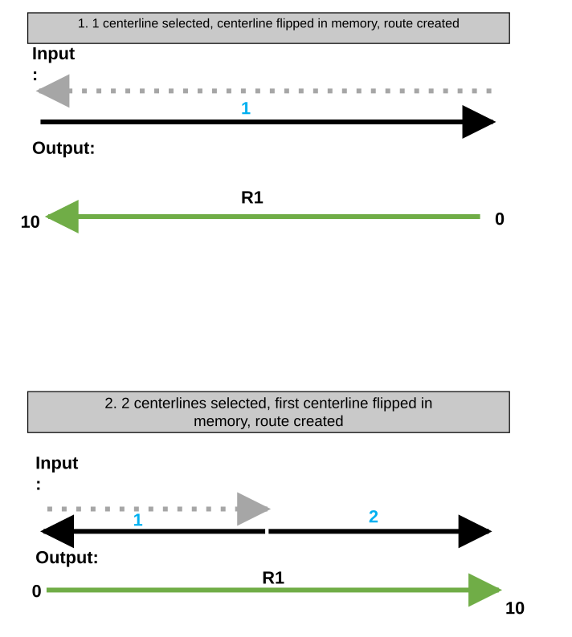

### TC-U02 — 2 Centerlines Selected with Measures 0-10 and 10-20 (case 2) <!-- src: S1 · slide 10 · case 2 -->

- **Case:** 2 centerlines selected with measures 0-10 and 10-20, second centerline flipped in memory, route created with no dirty areas

- 1 centerline selected with measures 0-10, centerline flipped in memory, route created with no dirty areas

[figure: 0 · 10 · Input: · Output: · L1 R1 · 20 · 1 · 2]

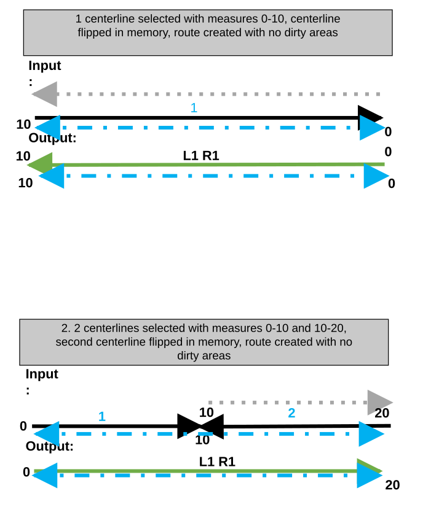

### TC-U03 — 3 Centerlines Selected with Measures 0-10, 10-20, and 20-30 (case 5) <!-- src: S1 · slide 12 · case 5 -->

- **Case:** 3 centerlines selected with measures 0-10, 10-20, and 20-30, last centerline flipped in memory, route created with no dirty areas

[figure: 0 · Input: · Output: · L1 R1 · 30 · 20 · 1–3 · 10]

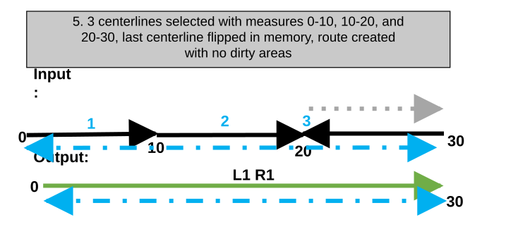

### TC-U04 — 1 Centerline Selected at the End of the Next Reverse Stationed Route (case 7) <!-- src: S1 · slide 18 · case 7 -->

- **Case:** 1 centerline selected at the end of the next reverse stationed route on the line, flipped in memory, route extended with no dirty areas

[figure: 0 · Input: · 15 · L1 R1 (200) · L1 R2 (100) · 1 · 20 · 10 · Output:]

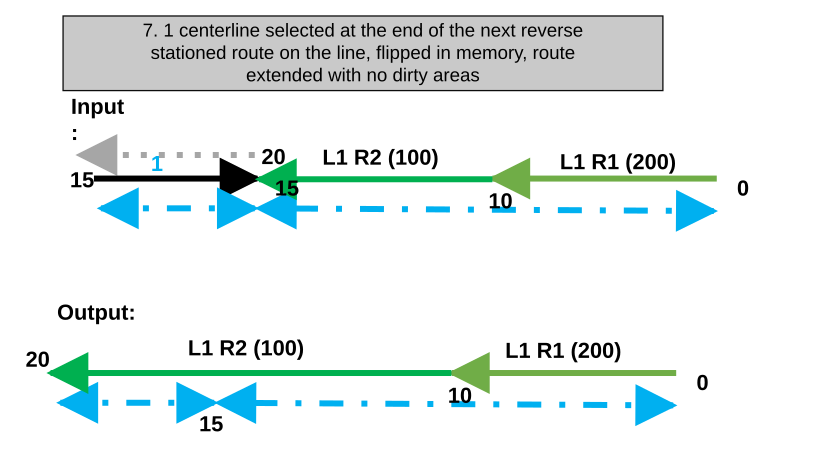

### TC-U05 — 1 centerline selected, centerline flipped in memory, route created (case 1) <!-- src: S2 · slide 19 · case 1 -->

2. 2 centerlines selected, realign middle of a normal route, in memory flip first centerline, route realigned

[figure: 0 · 10 · Input: · Output: · 15 · R1 · 20 · 1 · 2]

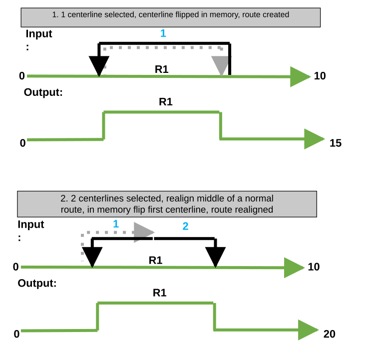

### TC-U06 — 1 Center Line Selected, Realign Middle of a Branch Route with an in Memory Flip (case 7) <!-- src: S1 · slide 22 · case 7 -->

- **Case:** 1 center line selected, realign middle of a branch route with an in memory flip, route realigned

[figure: Input: · Output: · R1 · 0 · 6 · 10 · 1]

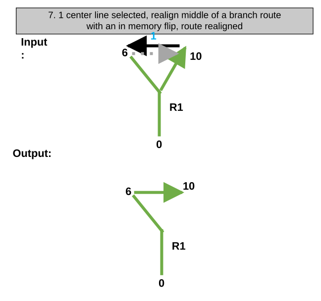

### TC-U07 — 2 Centerlines Selected, Realign Middle of a Normal Route (case 2) <!-- src: S1 · slide 23 · case 2 -->

- **Case:** 2 centerlines selected, realign middle of a normal route, first centerline flipped in memory, route realigned with no dirty areas

- 1 centerline selected, realign middle of a normal route with an in memory flip, route realigned with no dirty areas

[figure: 0 · 10 · Input: · Output: · 15 · L1 R1 · 2 · 1 · 7 · 3 · 5]

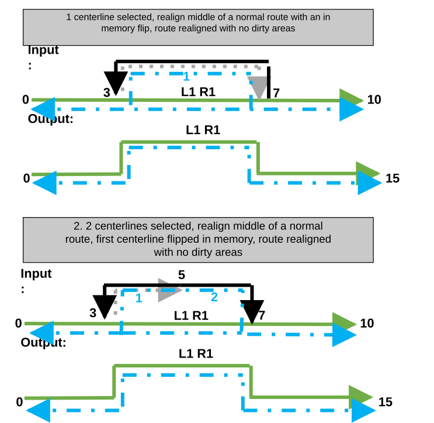

### TC-U08 — 1 Center Line Selected, Realign Middle of a Branch Route with an in Memory Flip (case 7) <!-- src: S1 · slide 26 · case 7 -->

- **Case:** 1 center line selected, realign middle of a branch route with an in memory flip, route realigned with no dirty areas

[figure: Input: · Output: · L1 R1 · 0 · 6 · 10 · 1]

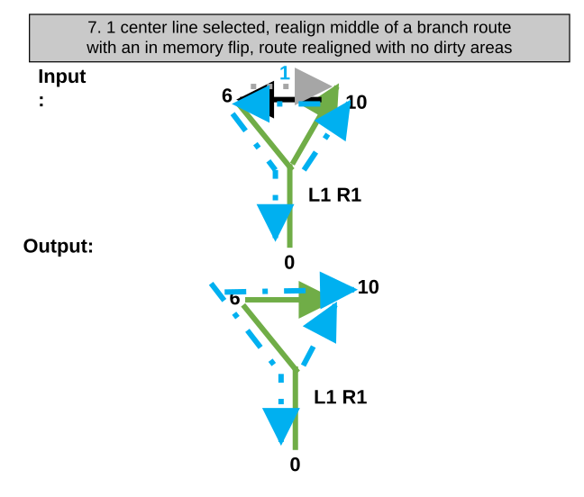

### TC-U09 — 1 Centerline Selected (case 8) <!-- src: S1 · slide 27 · case 8 -->

- **Case:** 1 centerline selected, realign middle of a series of reverse stationed routes with an in memory flip, route realigned with no dirty areas

[figure: 0 · 10 · Input: · Output: · L1 R2 (100) · 3 · 6 · L1 R1 · L1 R1 (200) · 1]

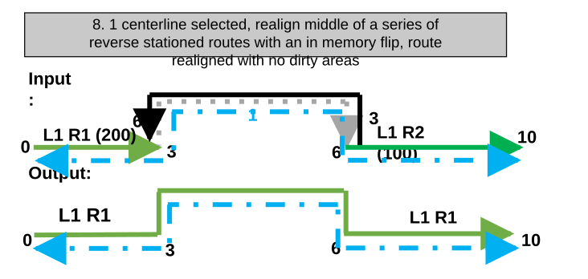

### TC-U10 — 1 Centerline Used To Create a Route with an in Memory Flip. 3 Centerlines Used <!-- src: S1 · slide 28 · case 9 -->

- **Case:** 1 centerline used to create a route with an in memory flip. 3 centerlines used to realign the route without an in memory flip, abandoned route will have correct measures.

Route Realigned with assignment to abandoned routes:

[figure: 10 · 0 · L1 R1 · Route Created: · 7 · 15 · L1 R1_Abandon · 3]

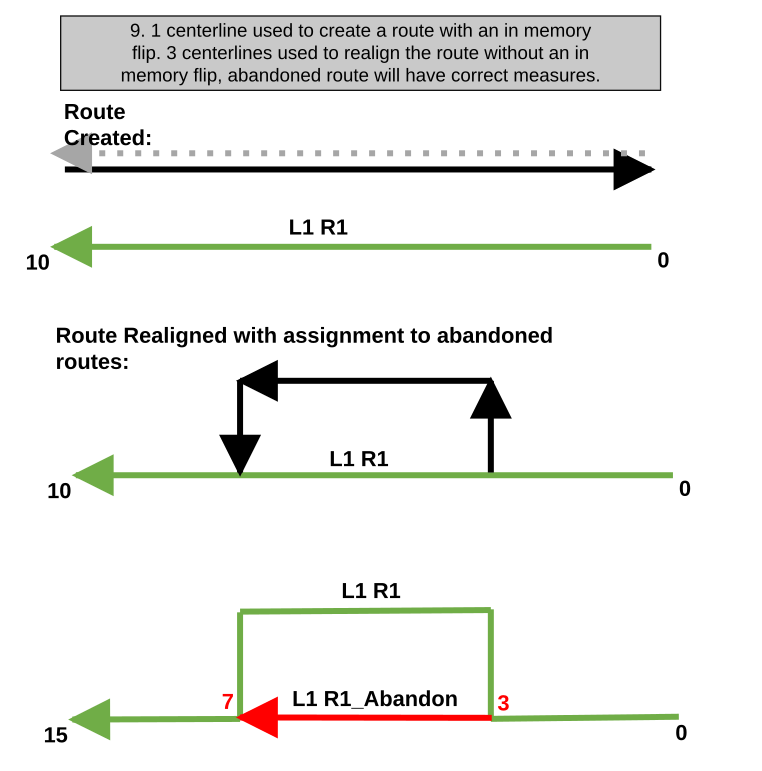

### TC-U11 — 3 Centerlines Selected (case 1) <!-- src: S1 · slide 29 · case 1 -->

- **Case:** 3 centerlines selected, all centerlines flipped in memory. Centerline order recalculated after flip

Centerline Order Recalculation After Flip:

[figure: Input: · 3 · 1–3 · 1 · 2]

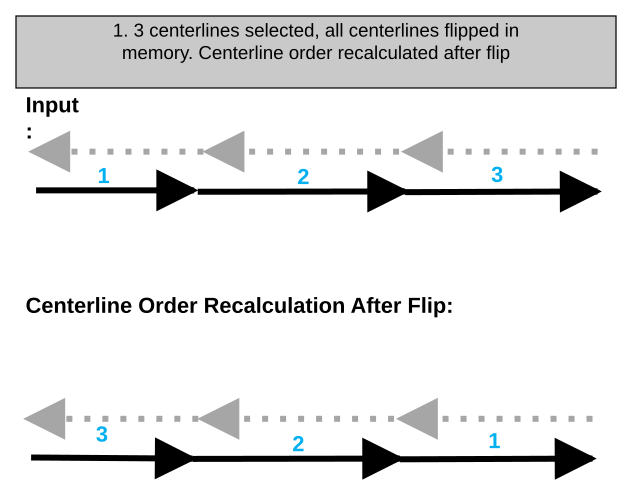

### TC-U12 — Multiple Centerlines Selected (case 2) <!-- src: S1 · slide 30 · case 2 -->

- **Case:** Multiple centerlines selected, realign multiple routes along a route with an in memory flip, centerline order recalculated after flip

Centerline Order Recalculation After Flip:

[figure: Input: · L1 R1 · L1 R2 · L1 R3 · 0 · 50 · 100 · 150 · 3 · 2 · 1]

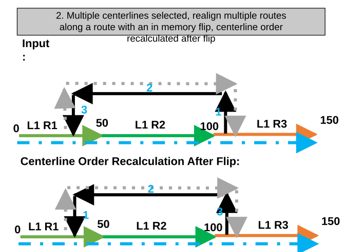

### TC-U13 — Multiple Centerlines Selected with a User-chosen Order <!-- src: S1 · slide 31 · case 3 -->

- **Case:** Multiple centerlines selected with a user-chosen order, one flipped in memory. Centerline order recalculated after in memory flip

Centerline Order Recalculation After Flip:

[figure: 0 · Input: · 3 · 1 · 2 · 0–3]

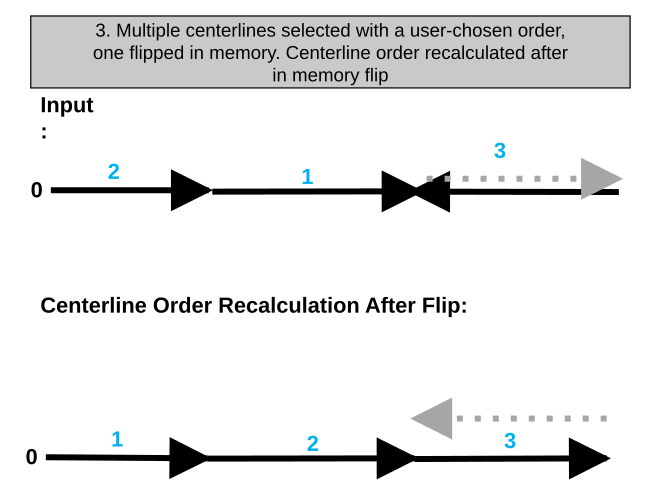

### TC-U14 — 1 Centerline Selected at the End of the Next Route on the Line (case 1) <!-- src: S1 · slide 32 · case 1 -->

- **Case:** 1 centerline selected at the end of the next route on the line, flipped in memory, PoM route extended

[figure: Input: · Output: · L1 R1 · 15 · L1 R2 · 1]

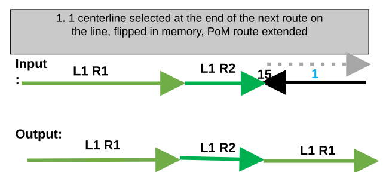

### TC-U15 — 1 Centerline Selected Without Measures Populated, in Memory Centerline Flip <!-- src: S1 · slide 34 · case 3 -->

- **Case:** 1 centerline selected without measures populated, in memory centerline flip, route realigned successfully with no dirty areas

[figure: 0 · 10 · Input: · Output: · L1 R2 (100) · 3 · 6 · L1 R1 · L1 R1 (200) · 1]

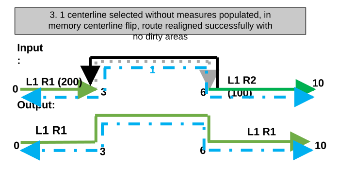

## Other content

### Slide 3 <!-- slide 3 -->

**Positive Tests: UN Measures not populated, measures will populate event with a flip**
- 1 centerline selected without measures populated, in memory centerline flip, route created successfully with no dirty areas
- 1 centerline selected without measures populated, in memory centerline flip, route extended successfully with no dirty areas
- 1 centerline selected without measures populated, in memory centerline flip, route realigned successfully with no dirty areas

### Slide 4 <!-- slide 4 -->

| Positive Tests: PoM Case |
| --- |
| 1 . 1 centerline selected at the end of the next route on the line, flipped in memory, PoM route extended |

### Slide 6 — In Memory Flipped Centerline: <!-- slide 6 -->

[figure: Centerline: · Routes: · UN: · 1–3 · R1 · R2]

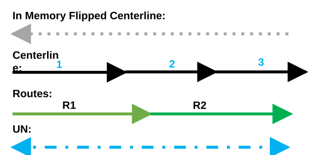

### Slide 8 <!-- slide 8 -->

4. 3 centerlines selected, first centerline flipped in memory, route created

3. 3 centerlines selected, middle centerline flipped in memory, route created (Prompt will appear around digitization direction, user must click yes)

[figure: Input: · Output: · 0 · R1 · 10 · 1 · 1–3 · 2 · 3]

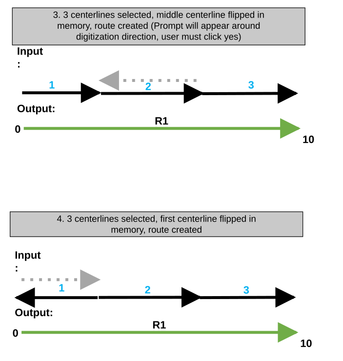

### Slide 9 <!-- slide 9 -->

5. 3 centerlines selected, last centerline flipped in memory, route created
(Prompt appears about digitization direction)

6. 5 centerlines selected, centerlines 2 and 4 flipped in memory, route created

[figure: 9 · Input: · Output: · 0 · R1 · 10 · 3 · 1 · 2 · 3–5]

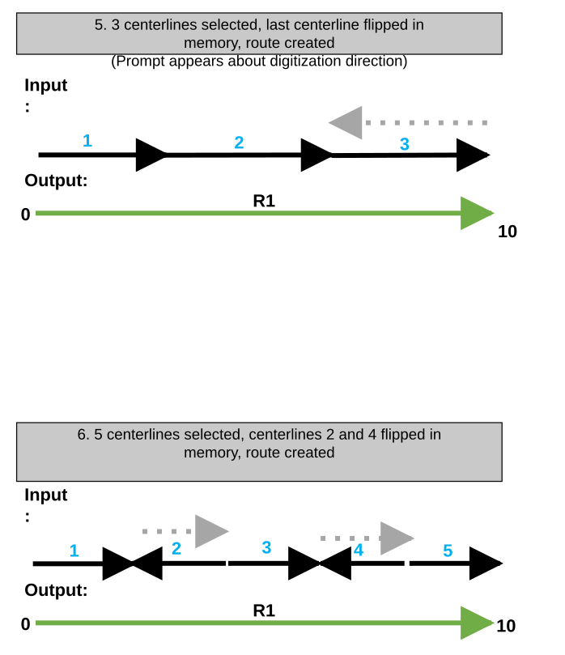

### Slide 11 <!-- slide 11 -->

3. 3 centerlines selected with measures 0-10, 10-20, and 20-30, middle centerline flipped in memory, route created with no dirty areas

4. 3 centerlines selected with measures 0-10, 10-20, and 20-30, first centerline flipped in memory, route created with no dirty areas

[figure: 11 · 0 · Input: · Output: · L1 R1 · 30 · 10 · 20 · 1 · 1–3 · 2 · 3]

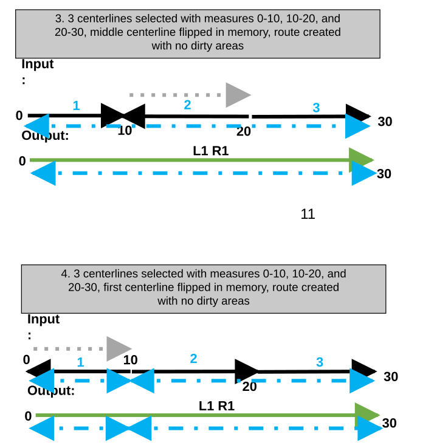

### Slide 13 <!-- slide 13 -->

1. 1 centerline selected at end of existing route, flipped in memory, route extended
2. 1 centerline selected at beginning of existing route, flipped in memory, route extended

[figure: Input: · Output: · 0 · 20 · R1 · 1]

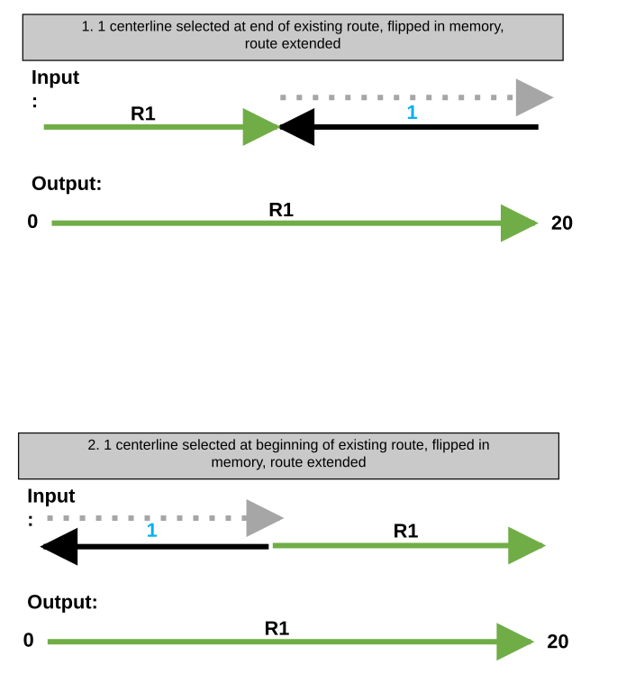

### Slide 14 <!-- slide 14 -->

3. 2 centerlines selected at end of existing route, first centerline flipped in memory, route extended

4. 2 centerlines selected at beginning of existing route, first centerline flipped in memory, route extended

[figure: Input: · Output: · 0 · 20 · R1 · 10 · 2 · 1]

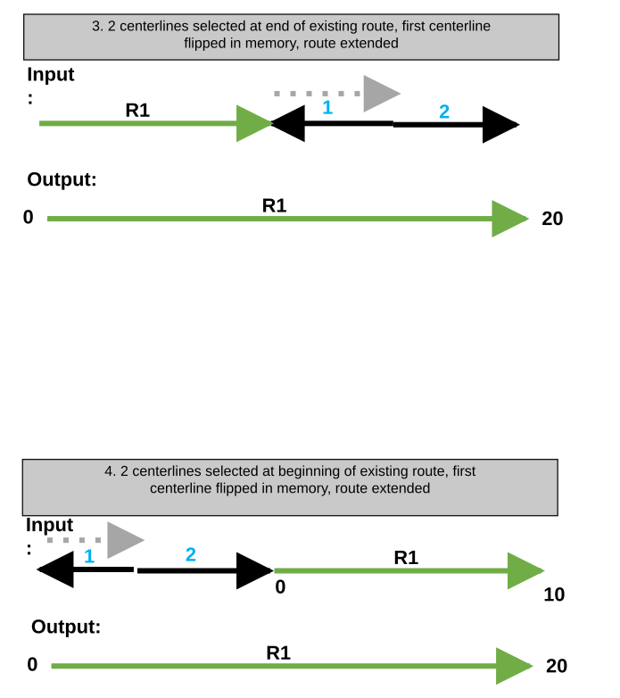

### Slide 15 <!-- slide 15 -->

1. 1 centerline selected at end of existing route, flipped in memory, route extended with no dirty areas
2. 1 centerline selected at beginning of existing route, flipped in memory, route extended with no dirty areas

[figure: 0 · 10 · Input: · Output: · 20 · L1 R1 · -10 · 1]

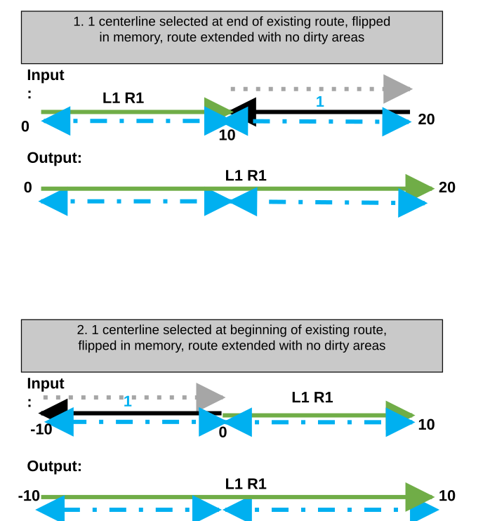

### Slide 16 <!-- slide 16 -->

3. 2 centerlines selected at end of existing route, first centerline flipped in memory, route extended with no dirty areas
4. 2 centerlines selected at beginning of existing route, first centerline flipped in memory, route extended with no dirty areas

[figure: 10 · Input: · Output: · 0 · 20 · L1 R1 · -20 · 2 · 1 · 15 · -10]

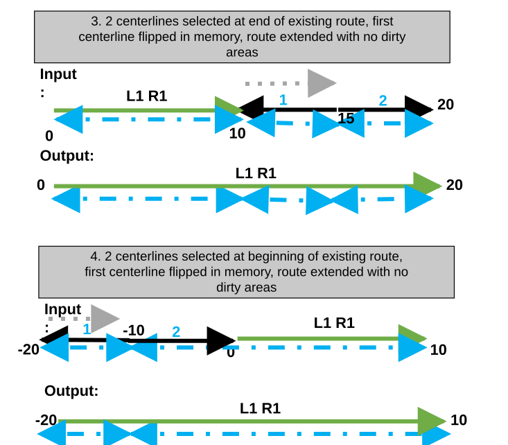

### Slide 17 <!-- slide 17 -->

5. 1 centerline selected at the end of the next route on the line, flipped in memory, route extended with no dirty areas
6. 1 centerline selected at the beginning of the previous route on the line, flipped in memory, route extended with no dirty areas

[figure: 0 · 10 · Input: · Output: · 20 · L1 R1 · 15 · L1 R2 · 30 · -5 · 1]

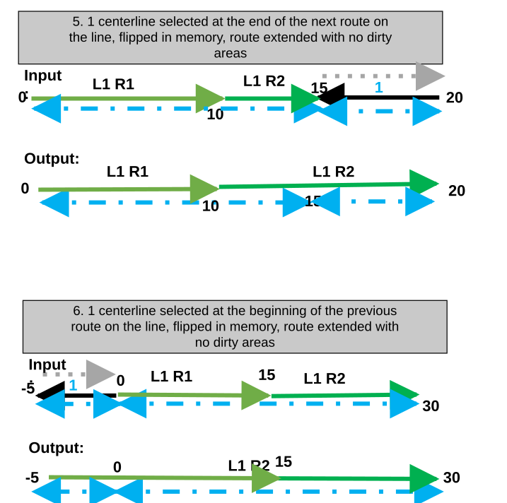

### Slide 20 <!-- slide 20 -->

3. 1 centerline selected, realign middle of a loop route with an in memory flip, route realigned

4. 1 centerline selected, realign middle of a lollipop route with an in memory flip, route realigned

[figure: Input: · Output: · 0 · 10 · 15 · R1 · 1]

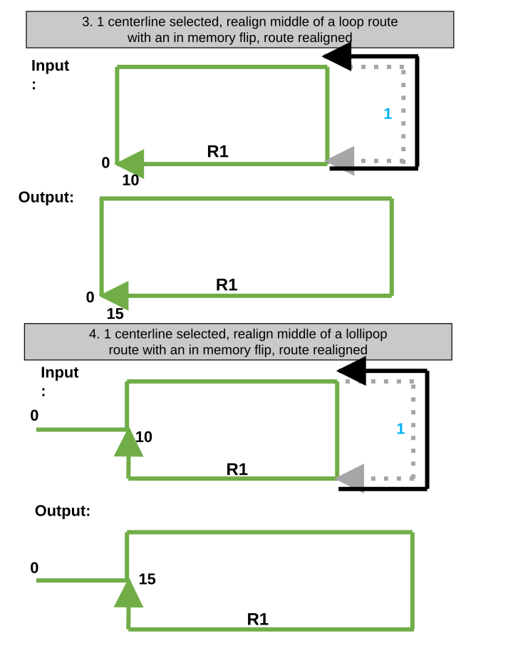

### Slide 21 <!-- slide 21 -->

5. 1 centerline selected, realign middle of a gapped route with an in memory flip, route realigned

6. 1 centerline selected, realign middle of an infinity route with an in memory flip, route realigned

[figure: 0 · 10 · Input: · Output: · R1 · 3 · 6 · 15 · 2 · 5 · 4 · 7 · 9 · 1]

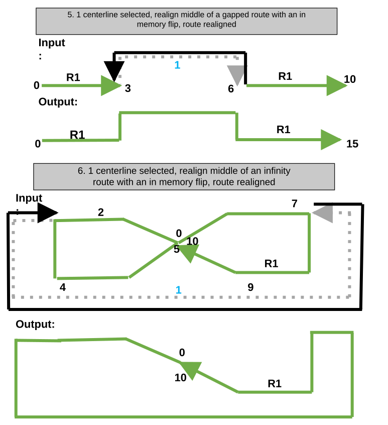

### Slide 24 <!-- slide 24 -->

3. 1 centerline selected, realign middle of a lollipop route with an in memory flip, route realigned with no dirty areas

4. 1 centerline selected, realign middle of a gapped route with an in memory flip, route realigned with no dirty areas

[figure: Input: · Output: · 0 · 10 · L1 R1 · 1 · 5 · 8]

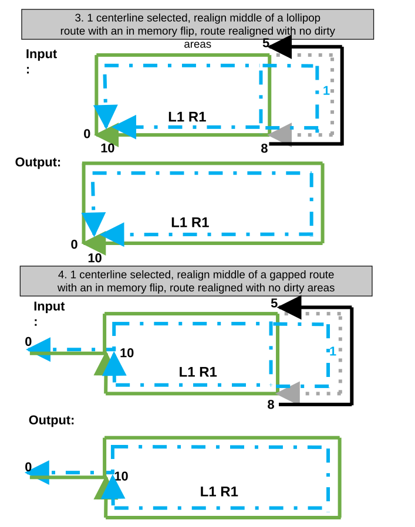

### Slide 25 <!-- slide 25 -->

5. 1 centerline selected, realign middle of a gapped route with an in memory flip, route realigned with no dirty areas

6. 1 centerline selected, realign middle of an infinity route with an in memory flip, route realigned with no dirty areas

[figure: 0 · 10 · Input: · Output: · L1 R1 · 3 · 6 · 5 · 4 · 7 · 9 · 1]

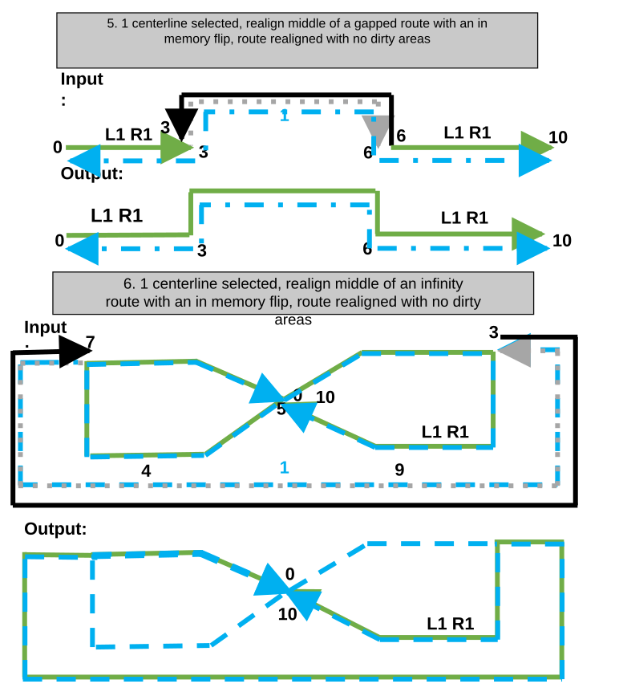

### Slide 33 <!-- slide 33 -->

1. 1 centerline selected without measures populated, in memory centerline flip, route created successfully with no dirty areas

2. 1 centerline selected without measures populated, in memory centerline flip, route created successfully with no dirty areas

[figure: Input: · 1 · Output: · L1 R1 · 0 · 10 · 5]

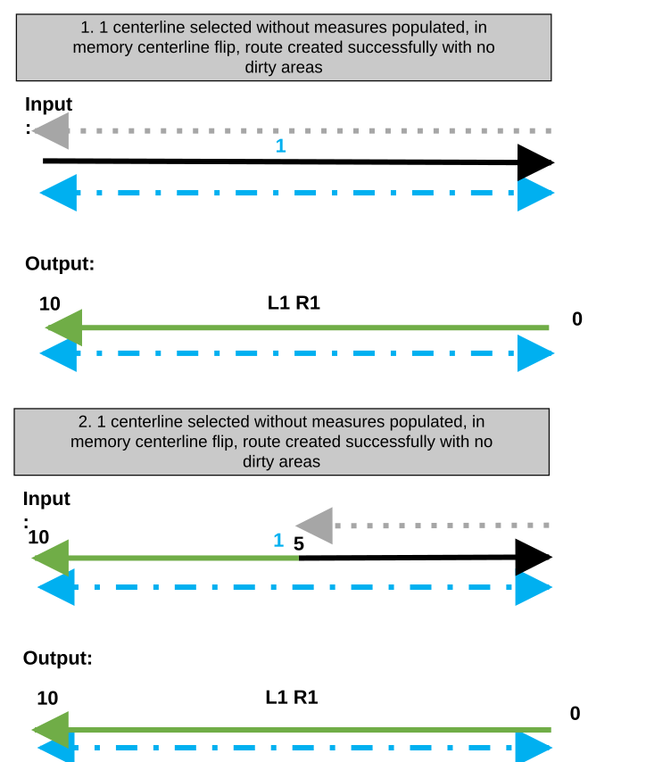

### Slide 35 <!-- slide 35 -->

1. 3 centerlines selected, first centerline is in same direction of calibration as other centerlines in selection.  Result is non-monotonic

2. Attempt route creation with LRS measures opposite UN measures (enhancement)

[figure: Input: · 1–3 · 0 · 10 · 1]

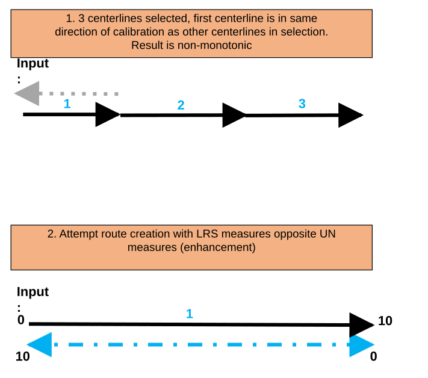

### Slide 36 <!-- slide 36 -->

1. 1 Centerline selected at the end of a route, centerline is flipped to be against the direction of calibration of the route.  Result is non-monotonic
2. 1 centerline selected at the beginning of a route, centerline is flipped to be against the direction of calibration of the route.  Result is non-monotonic.

[figure: 0 · 10 · Input: · L1 R1 · 1 · 20 · -10]

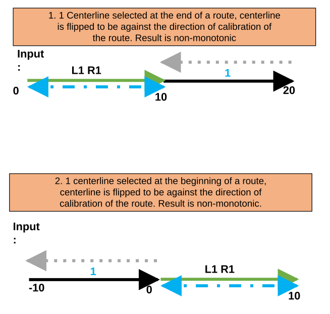

### Slide 37 <!-- slide 37 -->

2. Multiple centerlines selected, realign multiple routes along a route with  centerlines in opposite direction, result is non monotonic
1. 1 Centerline selected with each endpoint being in the middle of a route, centerline is flipped to be against the direction of calibration of the route.  Result is non-monotonic

[figure: Input: · L1 R1 · L1 R2 · L1 R3 · 0 · 50 · 100 · 150 · 3 · 2 · 1 · 10 · Output: · R1]

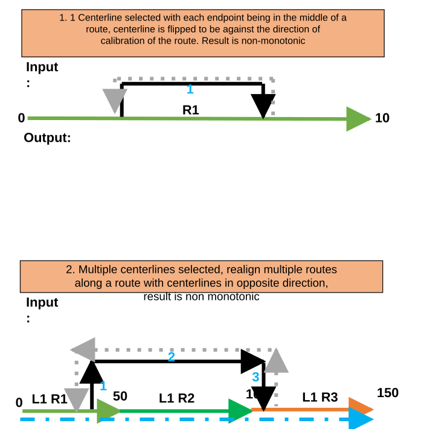
