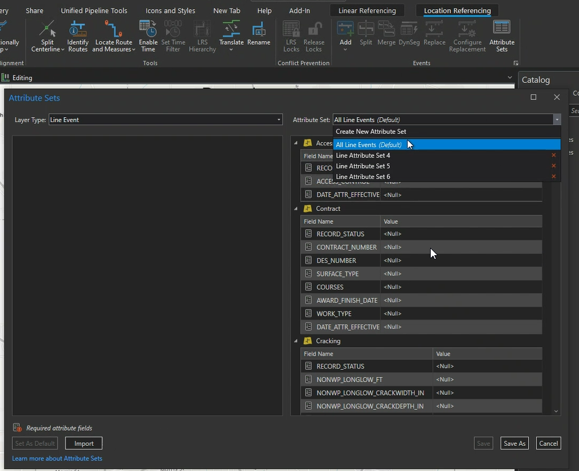

# Migrate Attribute Sets to Map CIM/Service – Test Plan

| Field | Value |
| --- | --- |
| **Doc** | 562 · Test Plan · Pro |
| **Product** | Roads & Highways · Pipeline Referencing |
| **Release** | — |
| **Issues** | [ArcGISPro/ps-location-referencing#5102](https://devtopia.esri.com/ArcGISPro/ps-location-referencing/issues/5102) |
| **Source** | [AttributeSetsCIM_testplan2.pptx](<https://esriis.sharepoint.com/sites/LocationReferencing/Shared%20Documents/General/Test%20Plans/AttributeSetsCIM_testplan2.pptx>) |
| **People** | author Lakshmi Ananthanarayanan · PE Claire Wang · dev Eric |
| **Edited** | 2023-05-22 22:40 by Claire Wang |
| **Extracted** | 2026-09-04 · lane xmlstrip · format 3.0 · prompt v2.0.2 |
| **Keywords** | attribute set · map cim · rhas · direct connect · file share · enterprise edition · line event · point event · rest endpoint · import · export · dynamic segmentation · event editor · service · testing |
| **Tools** | — |

## Summary

Test plan for migrating attribute sets to Map CIM and service environments including Direct Connect (DC), File Share (FS), and Enterprise Edition (EE). Covers testing of create, import, save, delete operations on attribute sets, verification of REST usage, UI behavior, and handling of line and point events with RH and APR data. Includes positive and negative test cases and documentation updates.

## Related documents

<!-- related:begin -->
- [Import Existing Attribute Sets from Event Editor](<https://esriis.sharepoint.com/sites/lrsworkspace/LRS Doc Index/User Stories/import-existing-attribute-sets-from-event-editor.md>) — similar text 0.28 · 2 title words · 2 filename words · same surface <!-- rel:680 s=3.875 -->
- [64 bit OID Other Pro LR Tools – Test Plan](<https://esriis.sharepoint.com/sites/lrsworkspace/LRS Doc Index/Test Plans/5510-64-bit-oid-other-pro-lr-tools.md>) — similar text 0.18 · 1 filename word · same kind/surface/pe/folder <!-- rel:482 s=3.548 -->
- [Relocate Events Support for External Event with No Connection File - Test Plan](<https://esriis.sharepoint.com/sites/lrsworkspace/LRS Doc Index/Test Plans/5987-relocate-events-support-for-external-event-with-no.md>) — similar text 0.06 · 1 filename word · same kind/dev/folder <!-- rel:264 s=3.383 -->
- [Managing Attribute Sets User Story](<https://esriis.sharepoint.com/sites/lrsworkspace/LRS%20Doc%20Index/User%20Stories/managing-attribute-sets.md>) — similar text 0.16 · 2 title words · 2 filename words · same surface <!-- rel:689 s=3.017 -->
- [Configure Attribute Sets](<https://esriis.sharepoint.com/sites/lrsworkspace/LRS Doc Index/Other/configure-attribute-sets-rh.md>) — similar text 0.38 · 2 title words · same surface <!-- rel:555 s=2.927 -->
<!-- related:end -->

<!-- docs:begin -->
## Esri documentation

[Event editing using the attribute table](https://doc.esri.com/en/arcgis-pro/latest/help/production/roads-highways/event-editing-using-the-attribute-table.html) · [Apply dynamic segmentation](https://doc.esri.com/en/arcgis-pro/latest/help/production/roads-highways/apply-dynamic-segmentation.html) · [Edit feature services](https://doc.esri.com/en/arcgis-pro/latest/help/production/roads-highways/edit-feature-services.html)

_No page matched:_ [map](https://www.google.com/search?q=%22map%22+site%3Adoc.esri.com)
<!-- docs:end -->

---

## Overview

### Slide 1 — Migrate Attribute Sets to Map CIM/Service – Test Plan <!-- slide 1 -->

https://devtopia.esri.com/ArcGISPro/ps-location-referencing/issues/5102

PE: Claire Wang
Dev: Eric

### Slide 2 <!-- slide 2 -->

Data:

- Test in DC, FS, and EE
  - DC: open/create/edit/import/save/delete attribute sets to Map CIM
  - FS: create/import/save/delete .rhas attribute; attribute sets read from server can be opened to use but cannot be edited/deleted
  - EE: create/import/save/delete .rhas attribute; attribute sets read from server can be opened to use but cannot be edited/deleted
- Test with line and point events
- Test with a mix of RH and APR data
- Sample test a few cases for additional workflows like add events and dynseg
Documentation

- Update Pro documentation (and screenshots) to reflect:
  - The new import option
  - The enhancement of storing attribute sets in Map CIM if working in direct connect before publishing. This is what users have to for attribute sets to publish along with map
  - The new paradigm for how attribute sets follow the map/service (providing example workflows like outlined in the first acceptance criteria slide would be good)
- Update Event Editor documentation to reflect:
  - The new paradigm for how attribute sets follow the map/service (providing example workflows like outlined in the first acceptance criteria slide would be good)
  - How to get existing RHAS files into this new attribute set storage paradigm
Automation
N/A

### Slide 3 <!-- slide 3 -->

Verification

- Verify REST is being utilized when in a service and not in DC
- Verify attribute sets are stored in Map CIM
- Verify the ability to see attribute sets in both the application and in REST when configured with the CIM/service, and they match
- Verify a REST endpoint is created to read attribute sets to the service
- Verify attribute sets and their settings in service are exposed via LRServer
- Verify an import button is created in Pro attribute set UI to support importing RHAS files (mimic the button in EE) and this button imports existing attribute sets
- Verify users accessing FS cannot edit or delete attribute sets that are read from service
- Verify all except all line/point events attribute sets can be deleted from CIM in DC
- Make sure service honors the default attribute set that is set in dc. This isthe first attribute set users see in UI.
- Verify only RHAS attribute sets can be deleted in service

### Slide 4 <!-- slide 4 -->

Verification
UI:
In dc, all attribute sets (except all point/line events) have a X button and can be deleted.
In fs, all .rhas attribute sets will have a X button and can be deleted. Attribute sets from server do not have X at all and cannot be deleted

## Test Cases

### TC-P01 — Open default (all line/point events) attribute set <!-- src: S4 · slide 5 · Positive cases - DC · 1 -->

- **Group:** DC

### TC-P02 — Create an attribute set with multiple line events and all the events’ attributes (1) <!-- src: S4 · slide 5 · Positive cases - DC · 2 -->

- **Group:** DC
- **Case:** Create an attribute set with multiple line events and all the events’ attributes with default values and save to Map CIM

### TC-P03 — Create an attribute set with multiple line events and some of the events’ (1) <!-- src: S4 · slide 5 · Positive cases - DC · 3 -->

- **Group:** DC
- **Case:** Create an attribute set with multiple line events and some of the events’ attributes with customized values and save to Map CIM

### TC-P04 — Create an attribute set with multiple point events and all the events’ (1) <!-- src: S4 · slide 5 · Positive cases - DC · 4 -->

- **Group:** DC
- **Case:** Create an attribute set with multiple point events and all the events’ attributes with default values and save to Map CIM

### TC-P05 — Create an attribute set with multiple point events and some of the events’ (1) <!-- src: S4 · slide 5 · Positive cases - DC · 5 -->

- **Group:** DC
- **Case:** Create an attribute set with multiple point events and some of the events’ attributes with customized values and save to Map CIM

### TC-P06 — Open an attribute set from Map CIM that is created just now <!-- src: S4 · slide 5 · Positive cases - DC · 6 -->

- **Group:** DC

### TC-P07 — Edit a non-default line event attribute set from Map CIM, save to Map CIM <!-- src: S4 · slide 5 · Positive cases - DC · 7 -->

- **Group:** DC
- **Case:** Edit a non-default line event attribute set from Map CIM, save to Map CIM, and set as default

### TC-P08 — Edit a non-default point event attribute set from Map CIM, save to Map CIM <!-- src: S4 · slide 5 · Positive cases - DC · 8 -->

- **Group:** DC
- **Case:** Edit a non-default point event attribute set from Map CIM, save to Map CIM, and set as default

### TC-P09 — Import a .rhas attribute set that contains the events in map using import button <!-- src: S4 · slide 5 · Positive cases - DC · 9 -->

- **Group:** DC
- **Case:** Import a .rhas attribute set that contains the events in map using import button and save as an attribute set to Map CIM

### TC-P10 — Import a .rhas that does not contain the events in map using import button (1) <!-- src: S4 · slide 5 · Positive cases - DC · 10 -->

- **Group:** DC
- **Case:** Import a .rhas that does not contain the events in map using import button and save as an attribute set to Map CIM

### TC-P11 — Search for an attribute set when there are multiple in Map CIM and .rhas (1) <!-- src: S4 · slide 5 · Positive cases - DC · 11 -->

- **Group:** DC

### TC-P12 — Remove an attribute set from Map CIM before publishing data <!-- src: S4 · slide 5 · Positive cases - DC · 12 -->

- **Group:** DC

### TC-P13 — Remove an attribute set from Map CIM after publishing data <!-- src: S4 · slide 5 · Positive cases - DC · 13 -->

- **Group:** DC
- **Case:** Remove an attribute set from Map CIM after publishing data (service and attribute sets in service are not impacted at all)

### TC-P14 — Publish data and verify all attribute sets in MAP CIM are published to service <!-- src: S4 · slide 5 · Positive cases - DC · 14 -->

- **Group:** DC
- **Case:** Publish data and verify all attribute sets in MAP CIM are published to service, too

### TC-P15 — Change project name and/or map name <!-- src: S4 · slide 5 · Positive cases - DC · 15 -->

- **Group:** DC
- **Case:** Change project name and/or map name, and see if attribute sets still exist in Map CIM (they should)

### TC-P16 — Have multiple different maps with different attribute sets saved to CIM. After <!-- src: S4 · slide 5 · Positive cases - DC · 16 -->

- **Group:** DC
- **Case:** Have multiple different maps with different attribute sets saved to CIM. After publishing one of the maps, only attribute sets saved to this Map CIM should publish.

### TC-P17 — Have multiple different maps in a project before publishing <!-- src: S4 · slide 5 · Positive cases - DC · 17 -->

- **Group:** DC
- **Case:** Have multiple different maps in a project before publishing, and make all maps have different attribute sets with the same name. Publishing all maps to different services should carry over all these different attribute sets with the same name (confirm with Eric)

### TC-P18 — Open default (all line/point events) attribute set that is read from service <!-- src: S4 · slide 6 · Positive cases - FS · 1 -->

- **Group:** FS

### TC-P19 — Open non-default attribute set that is read from service (1) <!-- src: S4 · slide 6 · Positive cases - FS · 2 -->

- **Group:** FS

### TC-P20 — Create an attribute set with multiple line events and all the events’ attributes (2) <!-- src: S4 · slide 6 · Positive cases - FS · 3 -->

- **Group:** FS
- **Case:** Create an attribute set with multiple line events and all the events’ attributes with default values and save the .rhas

### TC-P21 — Create an attribute set with multiple line events and some of the events’ (2) <!-- src: S4 · slide 6 · Positive cases - FS · 4 -->

- **Group:** FS
- **Case:** Create an attribute set with multiple line events and some of the events’ attributes with customized values and save the .rhas

### TC-P22 — Create an attribute set with multiple point events and all the events’ (2) <!-- src: S4 · slide 6 · Positive cases - FS · 5 -->

- **Group:** FS
- **Case:** Create an attribute set with multiple point events and all the events’ attributes with default values and save the .rhas

### TC-P23 — Create an attribute set with multiple point events and some of the events’ (2) <!-- src: S4 · slide 6 · Positive cases - FS · 6 -->

- **Group:** FS
- **Case:** Create an attribute set with multiple point events and some of the events’ attributes with customized values and save the .rhas

### TC-P24 — Edit a .rhas line event attribute set, save as a new .rhas <!-- src: S4 · slide 6 · Positive cases - FS · 7 -->

- **Group:** FS
- **Case:** Edit a .rhas line event attribute set, save as a new .rhas, and set as default. This will be the first attribute set shown in UI the next time Pro opens.

### TC-P25 — Edit a .rhas point event attribute set, save <!-- src: S4 · slide 6 · Positive cases - FS · 8 -->

- **Group:** FS
- **Case:** Edit a .rhas point event attribute set, save, and set as default. This will be the first attribute set shown in UI the next time Pro opens.

### TC-P26 — Import a .rhas that does not contain the events in map using import button (2) <!-- src: S4 · slide 6 · Positive cases - FS · 9 -->

- **Group:** FS
- **Case:** Import a .rhas that does not contain the events in map using import button – a yellow warning button is shown

### TC-P27 — Import a .rhas that contains the events that are not in map using import button <!-- src: S4 · slide 6 · Positive cases - FS · 10 -->

- **Group:** FS
- **Case:** Import a .rhas that contains the events that are not in map using import button – a yellow warning button is shown

### TC-P28 — Save an attribute set from server as a .rhas file <!-- src: S4 · slide 6 · Positive cases - FS · 11 -->

- **Group:** FS

### TC-P29 — Search for an attribute set when there are multiple in Map CIM and .rhas (2) <!-- src: S4 · slide 6 · Positive cases - FS · 12 -->

- **Group:** FS

### TC-P30 — Remove a .rhas attribute set (1) <!-- src: S4 · slide 6 · Positive cases - FS · 13 -->

- **Group:** FS

### TC-P31 — Add multiple line events using an attribute set read from service (1) <!-- src: S4 · slide 6 · Positive cases - FS · 14 -->

- **Group:** FS

### TC-P32 — Add multiple line events using a .rhas (1) <!-- src: S4 · slide 6 · Positive cases - FS · 15 -->

- **Group:** FS

### TC-P33 — Add multiple point events using an attribute set read from service <!-- src: S4 · slide 6 · Positive cases - FS · 16 -->

- **Group:** FS

### TC-P34 — Open default attribute set (all line/point events) that is read from service <!-- src: S4 · slide 7 · Positive cases - EE · 1 -->

- **Group:** EE

### TC-P35 — Open non-default attribute set that is read from service (2) <!-- src: S4 · slide 7 · Positive cases - EE · 2 -->

- **Group:** EE

### TC-P36 — Create an attribute set with multiple line events and all the events’ attributes (3) <!-- src: S4 · slide 7 · Positive cases - EE · 3 -->

- **Group:** EE
- **Case:** Create an attribute set with multiple line events and all the events’ attributes with default values and save the .rhas

### TC-P37 — Create an attribute set with multiple line events and some of the events’ (3) <!-- src: S4 · slide 7 · Positive cases - EE · 4 -->

- **Group:** EE
- **Case:** Create an attribute set with multiple line events and some of the events’ attributes with customized values and save the .rhas

### TC-P38 — Edit a .rhas line event attribute set, save as a new .rhas, and set as default <!-- src: S4 · slide 7 · Positive cases - EE · 5 -->

- **Group:** EE

### TC-P39 — Edit a .rhas point event attribute set, save, and set as default <!-- src: S4 · slide 7 · Positive cases - EE · 6 -->

- **Group:** EE

### TC-P40 — Import a .rhas that does not contain the events in map using import button (3) <!-- src: S4 · slide 7 · Positive cases - EE · 7 -->

- **Group:** EE

### TC-P41 — Search for an attribute set when there are multiple in Map CIM and .rhas (3) <!-- src: S4 · slide 7 · Positive cases - EE · 8 -->

- **Group:** EE

### TC-P42 — Remove a .rhas attribute set (2) <!-- src: S4 · slide 7 · Positive cases - EE · 9 -->

- **Group:** EE

### TC-P43 — Add multiple line events using an attribute set read from service (2) <!-- src: S4 · slide 7 · Positive cases - EE · 10 -->

- **Group:** EE

### TC-P44 — Add multiple line events using a .rhas (2) <!-- src: S4 · slide 7 · Positive cases - EE · 11 -->

- **Group:** EE

### TC-P45 — DynSeg using an attribute set read from service <!-- src: S4 · slide 7 · Positive cases - EE · 12 -->

- **Group:** EE

### TC-P46 — DynSeg using a .rhas <!-- src: S4 · slide 7 · Positive cases - EE · 13 -->

- **Group:** EE

## Other content

### Slide 5 — Positive cases - DC <!-- slide 5 -->

Cases that will not work - DC

- Remove all line events attribute set (if a user-created attribute set is set to default, it can be removed, and default will bounce back to be all line/point events. So it’s not “default” attribute set cannot be removed, it’s all line/point events cannot be removed)

### Slide 6 — Positive cases - FS <!-- slide 6 -->

Cases that will not work/work properly- FS

- Remove/edit (add/remove/edit layers/change values in attribute sets) attribute sets from service and verify the behavior that prevents the operations
- Import a .rhas attribute set that has the same name as an attribute set from service, and verify a message pops up about the duplicate name, but nothing else is created and that service attribute set is not affected Remove an attribute set that is read from service
- Use a .rhas that does not contain the events in service to add events
- Use a .rhas that contains events that are not in map to add events
Verify the behavior when users remove/edit (add/remove/edit layers/change values in attribute sets) attribute sets from service. We are expecting an error message saying something like “not editable” + suggest “save as and edit there”

Inspiration from editing all line/point events

What we don’t want is to show the error message upon clicking save. Show it as soon as users do the operations above.

### Slide 7 — Positive cases - EE <!-- slide 7 -->

Cases that will not work/work properly - EE

- Remove/edit (add/remove/edit layers/change values in attribute sets) attribute sets from service and verify the behavior that prevents the operations
- Remove an attribute set that is read from service
- Use a .rhas that does not contain the events in service to add events
