# Reassign - Transfer to Another Line with StayPut and Retire Event Behavior - Test Plan

| Field | Value |
| --- | --- |
| **Doc** | 528 · Test Plan · Pro |
| **Product** | Roads & Highways · Pipeline Referencing |
| **Release** | — |
| **Issues** | [ArcGISPro/ps-location-referencing#5140](https://devtopia.esri.com/ArcGISPro/ps-location-referencing/issues/5140) |
| **Source** | [ReassignStayput.RetireEB_Testplan.pptx](<https://esriis.sharepoint.com/sites/LocationReferencing/Shared%20Documents/General/Test%20Plans/ReassignStayput.RetireEB_Testplan.pptx>) |
| **People** | author Lakshmi Ananthanarayanan · PE Lakshmi · dev Eric |
| **Edited** | 2023-08-02 23:08 by Lakshmi Ananthanarayanan |
| **Extracted** | 2026-09-04 · lane xmlstrip · format 3.0 · prompt v2.0.2 |
| **Keywords** | reassign · transfer to another line · stayput · retire event behavior · route reassignment · event behavior · spanning event · non spanning event · measure change · route name change · recalibration · time slicing · linear referencing · line network · route transfer |
| **Tools** | — |

## Summary

Test plan for reassigning routes and events to another line in a linear referencing system, supporting StayPut and Retire event behaviors. Covers various scenarios including spanning and non-spanning events, route and measure changes, recalibration options, and effective dates. Includes verification steps and automation notes for REST and ReadyAPI.

## Related documents

<!-- related:begin -->
- [Reassign Route Transfer to Another Line Method: Support Move Event Behavior Test Plan](<https://esriis.sharepoint.com/sites/lrsworkspace/LRS Doc Index/Test Plans/5141-reassign-route-transfer-to-another-line-method-support-move.md>) — similar text 0.38 · 6 title words · 1 filename word · same kind/surface/folder <!-- rel:533 s=7.719 -->
- [Transfer to Another Line – Support Snap Event Behavior Test Plan](<https://esriis.sharepoint.com/sites/lrsworkspace/LRS Doc Index/Test Plans/transfer-to-another-line-support-snap-eb-rh-apr-2023-08-2.md>) — similar text 0.23 · 5 title words · 1 filename word · same kind/dev/folder <!-- rel:527 s=6.911 -->
- [Transfer to Another Line – Support Snap Event Behavior Test Plan](<https://esriis.sharepoint.com/sites/lrsworkspace/LRS Doc Index/Test Plans/transfer-to-another-line-support-snap-eb-rh-apr-2023-08.md>) — similar text 0.24 · 5 title words · 1 filename word · same kind/dev/folder <!-- rel:526 s=6.446 -->
- [Support Event Behaviors for New Reassign Method: Transfer to another line](<https://esriis.sharepoint.com/sites/lrsworkspace/LRS Doc Index/User Stories/support-eb-for-new-reassign-method-transfer-to-another-line.md>) — similar text 0.22 · 5 title words · 1 filename word <!-- rel:572 s=6.037 -->
- [Export Network Reassign Transfer Test Plan V1](<https://esriis.sharepoint.com/sites/lrsworkspace/LRS Doc Index/Test Plans/export-network-reassign-transfer-v1.md>) — similar text 0.07 · 2 title words · 1 filename word · same kind/surface/folder <!-- rel:513 s=5.668 -->
<!-- related:end -->

<!-- docs:begin -->
## Esri documentation

[Event editing using the attribute table](https://doc.esri.com/en/arcgis-pro/latest/help/production/roads-highways/event-editing-using-the-attribute-table.html) · [Route reassignment](https://doc.esri.com/en/arcgis-pro/latest/help/production/roads-highways/reassign-routes.html) · [Event behavior for route retirement](https://doc.esri.com/en/arcgis-pro/latest/help/production/roads-highways/event-behavior-for-route-retirement.html) · [Event behavior](https://doc.esri.com/en/arcgis-pro/latest/help/production/roads-highways/what-is-event-behavior.html) · [Multiple linear referencing methods](https://doc.esri.com/en/arcgis-pro/latest/help/production/location-referencing-pipelines/multiple-linear-referencing-methods.html)
<!-- docs:end -->

---

## Overview

### Slide 1 — Reassign - Transfer to another line – Support StayPut and Retire Event Behavior – Test Plan <!-- slide 1 -->

devtopia Issue

PE: Lakshmi
Dev: Eric

### Slide 2 <!-- slide 2 -->

Data

- Test with FS in Pro
- Test on a mix of RH and APR data, line network only.
- Test with projected & unprojected data
- Test line events (spanning and non-spanning) and point events
- Test for retire and stayput event behavior with “Transfer to another line” method

Test with the following data conditions

- Test time slicing
- Test transferring entire route, multiple entire routes, partial route, and combinations
- Test with recalibrating and not recalibrating source downstream option.
- Test by changing the name of the target route
- Test by changing the measures of the target route
- Test events that cover entire reassigned portion, more than reassigned portion, and shorter than reassigned portion
- Test events on begin-end, begin-middle, middle-middle, and middle-end of routes.
- Test by transferring to an existing line and transferring to a new line.

### Slide 3 <!-- slide 3 -->

Automation

Add test cases through REST , ready API automation
Doc

Adding an example for transfer to line for stayput and retire event behavior in the Reassign route event behavior
Verification

- Verify edit log.
- Ensure shape, measure, and LRS attributes for all time slices on events are correct after running AEB
- For retire , if the event touches the edit activity than the event retires
- For stayput, point event and , the portion of the  line event falling under the reassigned portion will be retired and the rest of the event will be created in the same location.
5 .     Verify source routes are recalibrated downstream and calibrate event behavior applied  to the downstream events if recalibrate source routes downstream checked

## Test Cases

### TC-U01 — Transfer To an Existing Line – Spanning Events – Stayput and Retire Behavior. (case 1) <!-- src: S1 · slide 4 · case 1 -->

Reassign all the routes in a line to another line transferring routes and measures. ; keep original measures; keep original route name.

| Route Name | Line Name | Line Order | From Date | To Date | From M | To M |
| --- | --- | --- | --- | --- | --- | --- |
| 1A | L1 | 100 | 1/1/2000 | <Null> | 2 | 4 |
| 1B | L1 | 200 | 1/1/2000 | <Null> | 0 | 2 |
| 1C | L1 | 300 | 1/1/2000 | <Null> | 0 | 4 |
| 2A | L2 | 100 | 1/1/2000 | <Null> | 3 | 5 |
| 2B | L2 | 200 | 1/1/2000 | <Null> | 4 | 8 |
| 2C | L2 | 300 | 1/1/2000 | <Null> | 0 | 2 |

| Event ID | From Date | To Date | From Route ID | From M | To Route ID | To M | Location Error |
| --- | --- | --- | --- | --- | --- | --- | --- |
| S1 | 1/1/2000 | <Null> | 1A | 2 | 1C | 4 | No Error |
| S2 | 1/1/2000 | <Null> | 1A | 2 | 1B | 1 | No Error |
| S3 | 1/1/2000 | <Null> | 1B | 1.5 | 1C | 4 | No Error |
| S4 | 1/1/2000 | <Null> | 1A | 3 | 1C | 1 | No Error |
| S5 | 1/1/2000 | <Null> | 1B | 0 | 1B | 2 | No Error |

| Route Name | Line Name | Line Order | From Date | To Date | From M | To M |
| --- | --- | --- | --- | --- | --- | --- |
| 1A | L1 | 100 | 1/1/2000 | 1/1/2023 | 2 | 4 |
| 1B | L1 | 200 | 1/1/2000 | 1/1/2023 | 0 | 2 |
| 1C | L1 | 300 | 1/1/2000 | 1/1/2023 | 0 | 4 |
| 2A | L2 | 100 | 1/1/2000 | 1/1/2023 | 3 | 5 |
| 2B | L2 | 200 | 1/1/2000 | 1/1/2023 | 4 | 8 |
| 2C | L2 | 300 | 1/1/2000 | 1/1/2023 | 0 | 2 |
| 1A | L2 | 100 | 1/1/2023 | <Null> | 2 | 4 |
| 1B | L2 | 200 | 1/1/2023 | <Null> | 0 | 2 |
| 1C | L2 | 300 | 1/1/2023 | <Null> | 0 | 4 |
| 2A | L2 | 400 | 1/1/2023 | <Null> | 3 | 5 |
| 2B | L2 | 500 | 1/1/2023 | <Null> | 4 | 8 |
| 2C | L2 | 600 | 1/1/2023 | <Null> | 0 | 2 |

| Event ID | From Date | To Date | From Route ID | From M | To Route ID | To M | Location Error |
| --- | --- | --- | --- | --- | --- | --- | --- |
| S1 | 1/1/2000 | 1/1/2023 | 1A | 2 | 1C | 4 | No Error |
| S2 | 1/1/2000 | 1/1/2023 | 1A | 2 | 1B | 1 | No Error |
| S3 | 1/1/2000 | 1/1/2023 | 1B | 1.5 | 1C | 4 | No Error |
| S4 | 1/1/2000 | 1/1/2023 | 1A | 3 | 1C | 1 | No Error |
| S5 | 1/1/2000 | 1/1/2023 | 1B | 0 | 1B | 2 | No Error |

| Effective Date | 1/1/2023 |
| --- | --- |

[figure: 1A; 100 · 1B; 200 · 1C; 300 · 2A, 100 · 2B, 200 · 2C, 300 · 4 · 3 · 5 · 8 · 0 · 2 · Input · Output · 2A; 400 · 2B; 500 · 2C; 600]

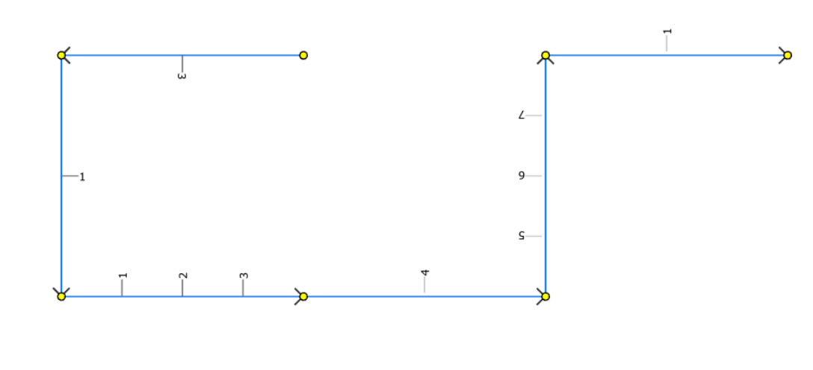

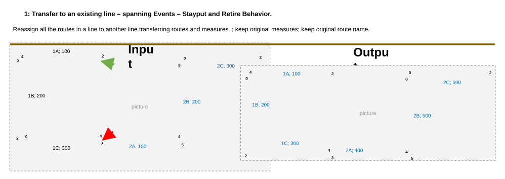

### TC-U02 — Transfer To an Existing Line – Spanning Events – Stayput and Retire Behavior. (case 2) <!-- src: S1 · slide 5 · case 2 -->

Reassign all the routes in a line to another line on right, transferring routes. Measures changed. Route Name changed.

| Route Name | Line Name | Line Order | From Date | To Date | From M | To M |
| --- | --- | --- | --- | --- | --- | --- |
| 1A | L1 | 100 | 1/1/2000 | <Null> | 2 | 4 |
| 1B | L1 | 200 | 1/1/2000 | <Null> | 0 | 2 |
| 1C | L1 | 300 | 1/1/2000 | <Null> | 0 | 4 |
| 2A | L2 | 100 | 1/1/2000 | <Null> | 3 | 5 |
| 2B | L2 | 200 | 1/1/2000 | <Null> | 4 | 8 |
| 2C | L2 | 300 | 1/1/2000 | <Null> | 0 | 2 |

| Event ID | From Date | To Date | From Route ID | From M | To Route ID | To M | Location Error |
| --- | --- | --- | --- | --- | --- | --- | --- |
| S1 | 1/1/2000 | <Null> | 1A | 2 | 1C | 4 | No Error |
| S2 | 1/1/2000 | <Null> | 1A | 2 | 1B | 1 | No Error |
| S3 | 1/1/2000 | <Null> | 1B | 1.5 | 1C | 4 | No Error |
| S4 | 1/1/2000 | <Null> | 1A | 3 | 1C | 1 | No Error |
| S5 | 1/1/2000 | <Null> | 1B | 0 | 1B | 2 | No Error |

| Event ID | From Date | To Date | From Route ID | From M | To Route ID | To M | Location Error |
| --- | --- | --- | --- | --- | --- | --- | --- |
| S1 | 1/1/2000 | 1/1/2023 | 1A | 2 | 1C | 4 | No Error |
| S2 | 1/1/2000 | 1/1/2023 | 1A | 2 | 1B | 1 | No Error |
| S3 | 1/1/2000 | 1/1/2023 | 1B | 1.5 | 1C | 4 | No Error |
| S4 | 1/1/2000 | 1/1/2023 | 1A | 3 | 1C | 1 | No Error |
| S5 | 1/1/2000 | 1/1/2023 | 1B | 0 | 1B | 2 | No Error |

| Route Name | Line Name | Line Order | From Date | To Date | From M | To M |
| --- | --- | --- | --- | --- | --- | --- |
| 1A | L1 | 100 | 1/1/2000 | 1/1/2023 | 2 | 4 |
| 1B | L1 | 200 | 1/1/2000 | 1/1/2023 | 0 | 2 |
| 1C | L1 | 300 | 1/1/2000 | 1/1/2023 | 0 | 4 |
| 2A | L2 | 100 | 1/1/2000 | 1/1/2023 | 3 | 5 |
| 2B | L2 | 200 | 1/1/2000 | 1/1/2023 | 4 | 8 |
| 2C | L2 | 300 | 1/1/2000 | 1/1/2023 | 0 | 2 |
| 1A_New | L2 | 100 | 1/1/2023 | <Null> | 5 | 8 |
| 1B_New | L2 | 200 | 1/1/2023 | <Null> | 2 | 4 |
| 1C_New | L2 | 300 | 1/1/2023 | <Null> | 5 | 9 |
| 2A | L2 | 400 | 1/1/2023 | <Null> | 3 | 5 |
| 2B | L2 | 500 | 1/1/2023 | <Null> | 4 | 8 |
| 2C | L2 | 600 | 1/1/2023 | <Null> | 0 | 2 |

| Effective Date | 1/1/2023 |
| --- | --- |

[figure: 1A; 100 · 1B; 200 · 1C; 300 · 2A, 100 · 2B, 200 · 2C, 300 · 4 · 3 · 5 · 8 · 0 · 2 · Input · Output · 1A_New; 100 · 1B_New 200 · 1C_New; 300 · 2A; 400 · 2B; 500 · 2C; 600 · 9]

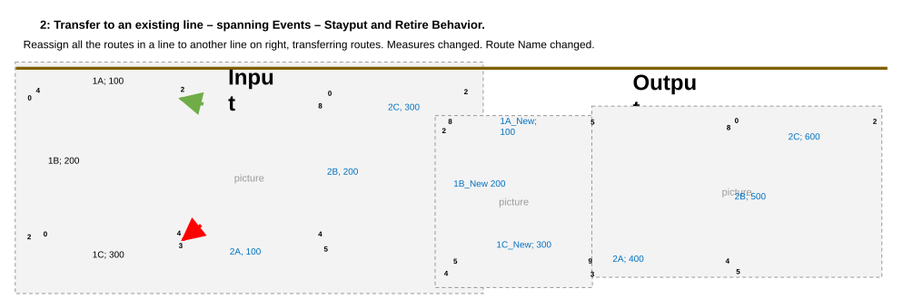

### TC-U03 — Transfer To an Existing Line – Spanning Events – Stayput and Retire Behavior. (case 3-1) <!-- src: S1 · slide 6 · case 3-1 -->

- **Case:** Transfer to an existing line – spanning Events – Stayput and Retire Behavior. – irrespective of behavior

Reassign all the routes in a line to another line on right, transferring routes and measures. The effective date is same as source route’s From Date. keep original measures; keep original route name

| Route Name | Line Name | Line Order | From Date | To Date | From M | To M |
| --- | --- | --- | --- | --- | --- | --- |
| 1A | L1 | 100 | 1/1/2000 | <Null> | 2 | 4 |
| 1B | L1 | 200 | 1/1/2000 | <Null> | 0 | 2 |
| 1C | L1 | 300 | 1/1/2000 | <Null> | 0 | 4 |
| 2A | L2 | 100 | 1/1/2000 | <Null> | 3 | 5 |
| 2B | L2 | 200 | 1/1/2000 | <Null> | 4 | 8 |
| 2C | L2 | 300 | 1/1/2000 | <Null> | 0 | 2 |

| Event ID | From Date | To Date | From Route ID | From M | To Route ID | To M | Location Error |
| --- | --- | --- | --- | --- | --- | --- | --- |
| S1 | 1/1/2000 | <Null> | 1A | 2 | 1C | 4 | No Error |
| S2 | 1/1/2000 | <Null> | 1A | 2 | 1B | 1 | No Error |
| S3 | 1/1/2000 | <Null> | 1B | 1.5 | 1C | 4 | No Error |
| S4 | 1/1/2000 | <Null> | 1A | 3 | 1C | 1 | No Error |
| S5 | 1/1/2000 | <Null> | 1B | 0 | 1B | 2 | No Error |

| Event ID | From Date | To Date | From Route ID | From M | To Route ID | To M | Location Error |
| --- | --- | --- | --- | --- | --- | --- | --- |
| S1 | 1/1/2000 | <Null> | 1A | 2 | 1C | 4 | No Error |
| S2 | 1/1/2000 | <Null | 1A | 2 | 1B | 1 | No Error |
| S3 | 1/1/2000 | <Null | 1B | 1.5 | 1C | 4 | No Error |
| S4 | 1/1/2000 | <Null | 1A | 3 | 1C | 1 | No Error |
| S5 | 1/1/2000 | <Null | 1B | 0 | 1B | 2 | No Error |

| Route Name | Line Name | Line Order | From Date | To Date | From M | To M |
| --- | --- | --- | --- | --- | --- | --- |
| 1A | L2 | 100 | 1/1/2000 | <Null> | 2 | 4 |
| 1B | L2 | 200 | 1/1/2000 | <Null> | 0 | 2 |
| 1C | L2 | 300 | 1/1/2000 | <Null> | 0 | 4 |
| 2A | L2 | 400 | 1/1/2000 | <Null> | 3 | 5 |
| 2B | L2 | 500 | 1/1/2000 | <Null> | 4 | 8 |
| 2C | L2 | 600 | 1/1/2000 | <Null> | 0 | 2 |

| Effective Date | 1/1/2000 |
| --- | --- |

[figure: 1A; 100 · 1B; 200 · 1C; 300 · 2A, 100 · 2B, 200 · 2C, 300 · 4 · 3 · 5 · 8 · 0 · 2 · Input · Output · 2A; 400 · 2B; 500 · 2C; 600]

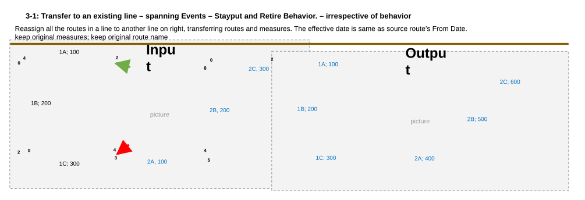

### TC-U04 — Transfer To an Existing Line – Spanning Events – Stayput & Retire (case 3-2) <!-- src: S1 · slide 7 · case 3-2 -->

- **Case:** Transfer to an existing line – spanning Events – Stayput & Retire – irrespective of behavior

Reassign all the routes in a line to another line on right, transferring routes and measures. The effective date is same as source route’s From Date. Change Measures; keep original route name

| Route Name | Line Name | Line Order | From Date | To Date | From M | To M |
| --- | --- | --- | --- | --- | --- | --- |
| 1A | L1 | 100 | 1/1/2000 | <Null> | 2 | 4 |
| 1B | L1 | 200 | 1/1/2000 | <Null> | 0 | 2 |
| 1C | L1 | 300 | 1/1/2000 | <Null> | 0 | 4 |
| 2A | L2 | 100 | 1/1/2000 | <Null> | 3 | 5 |
| 2B | L2 | 200 | 1/1/2000 | <Null> | 4 | 8 |
| 2C | L2 | 300 | 1/1/2000 | <Null> | 0 | 2 |

| Event ID | From Date | To Date | From Route ID | From M | To Route ID | To M | Location Error |
| --- | --- | --- | --- | --- | --- | --- | --- |
| S1 | 1/1/2000 | <Null> | 1A | 2 | 1C | 4 | No Error |
| S2 | 1/1/2000 | <Null> | 1A | 2 | 1B | 1 | No Error |
| S3 | 1/1/2000 | <Null> | 1B | 1.5 | 1C | 4 | No Error |
| S4 | 1/1/2000 | <Null> | 1A | 3 | 1C | 1 | No Error |
| S5 | 1/1/2000 | <Null> | 1B | 0 | 1B | 2 | No Error |

| Event ID | From Date | To Date | From Route ID | From M | To Route ID | To M | Location Error |
| --- | --- | --- | --- | --- | --- | --- | --- |
| S1 | 1/1/2000 | <Null> | 1A | 2 | 1C | 4 | Invalid Measure |
| S2 | 1/1/2000 | <Null | 1A | 2 | 1B | 1 | Invalid Measure |
| S3 | 1/1/2000 | <Null | 1B | 1.5 | 1C | 4 | Invalid Measure |
| S4 | 1/1/2000 | <Null | 1A | 3 | 1C | 1 | Invalid Measure |
| S5 | 1/1/2000 | <Null | 1B | 0 | 1B | 2 | Invalid Measure |

| Effective Date | 1/1/2000 |
| --- | --- |

| Route Name | Line Name | Line Order | From Date | To Date | From M | To M |
| --- | --- | --- | --- | --- | --- | --- |
| 1A | L2 | 100 | 1/1/2000 | <Null> | 5 | 8 |
| 1B | L2 | 200 | 1/1/2000 | <Null> | 2 | 4 |
| 1C | L2 | 300 | 1/1/2000 | <Null> | 5 | 9 |
| 2A | L2 | 400 | 1/1/2000 | <Null> | 3 | 5 |
| 2B | L2 | 500 | 1/1/2000 | <Null> | 4 | 8 |
| 2C | L2 | 600 | 1/1/2000 | <Null> | 0 | 2 |

[figure: 1A; 100 · 1B; 200 · 1C; 300 · 2A, 100 · 2B, 200 · 2C, 300 · 4 · 3 · 5 · 8 · 0 · 2 · Input · Output · 2A; 400 · 2B; 500 · 2C; 600]

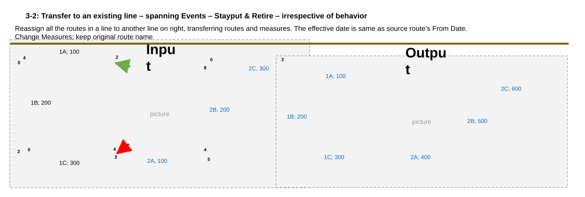

### TC-U05 — Transfer To an Existing Line – Spanning Events – Stayput & Retire (case 3-3) <!-- src: S1 · slide 8 · case 3-3 -->

- **Case:** Transfer to an existing line – spanning Events – Stayput & Retire – irrespective of behavior

Reassign all the routes in a line to another line on right, transferring routes and measures. The effective date is same as source route’s From Date. Change Measures; Change route name

| Route Name | Line Name | Line Order | From Date | To Date | From M | To M |
| --- | --- | --- | --- | --- | --- | --- |
| 1A | L1 | 100 | 1/1/2000 | <Null> | 2 | 4 |
| 1B | L1 | 200 | 1/1/2000 | <Null> | 0 | 2 |
| 1C | L1 | 300 | 1/1/2000 | <Null> | 0 | 4 |
| 2A | L2 | 100 | 1/1/2000 | <Null> | 3 | 5 |
| 2B | L2 | 200 | 1/1/2000 | <Null> | 4 | 8 |
| 2C | L2 | 300 | 1/1/2000 | <Null> | 0 | 2 |

| Event ID | From Date | To Date | From Route ID | From M | To Route ID | To M | Location Error |
| --- | --- | --- | --- | --- | --- | --- | --- |
| S1 | 1/1/2000 | <Null> | 1A | 2 | 1C | 4 | No Error |
| S2 | 1/1/2000 | <Null> | 1A | 2 | 1B | 1 | No Error |
| S3 | 1/1/2000 | <Null> | 1B | 1.5 | 1C | 4 | No Error |
| S4 | 1/1/2000 | <Null> | 1A | 3 | 1C | 1 | No Error |
| S5 | 1/1/2000 | <Null> | 1B | 0 | 1B | 2 | No Error |

| Event ID | From Date | To Date | From Route ID | From M | To Route ID | To M | Location Error |
| --- | --- | --- | --- | --- | --- | --- | --- |
| S1 | 1/1/2000 | <Null> | 1A | 2 | 1C | 4 | Route Not Found |
| S2 | 1/1/2000 | <Null | 1A | 2 | 1B | 1 | Route Not Found |
| S3 | 1/1/2000 | <Null | 1B | 1.5 | 1C | 4 | Route Not Found |
| S4 | 1/1/2000 | <Null | 1A | 3 | 1C | 1 | Route Not Found |
| S5 | 1/1/2000 | <Null | 1B | 0 | 1B | 2 | Route Not Found |

| Effective Date | 1/1/2000 |
| --- | --- |

| Route Name | Line Name | Line Order | From Date | To Date | From M | To M |
| --- | --- | --- | --- | --- | --- | --- |
| 1A_new | L2 | 100 | 1/1/2000 | <Null> | 5 | 8 |
| 1B_new | L2 | 200 | 1/1/2000 | <Null> | 2 | 4 |
| 1C_new | L2 | 300 | 1/1/2000 | <Null> | 5 | 9 |
| 2A | L2 | 400 | 1/1/2000 | <Null> | 3 | 5 |
| 2B | L2 | 500 | 1/1/2000 | <Null> | 4 | 8 |
| 2C | L2 | 600 | 1/1/2000 | <Null> | 0 | 2 |

[figure: 1A; 100 · 1B; 200 · 1C; 300 · 2A, 100 · 2B, 200 · 2C, 300 · 4 · 3 · 5 · 8 · 0 · 2 · Input · Output · 1A_New; 100 · 1C_New; 300 · 2A; 400 · 2B; 500 · 2C; 600 · 1B_New; 200]

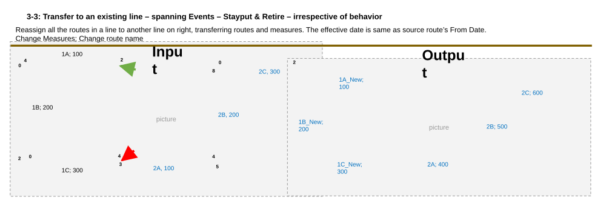

### TC-U06 — Transfer To an Existing Line – Spanning Events – StayPut and Retire Behavior. (case 3-4) <!-- src: S1 · slide 9 · case 3-4 -->

- **Case:** Transfer to an existing line – spanning Events – StayPut and Retire Behavior. (?)

Reassign all the routes in a line to another line on right, transferring routes and measures. The effective date is same as source route’s From Date. Keep original route name , changing only the  from measure on the first route

| Route Name | Line Name | Line Order | From Date | To Date | From M | To M |
| --- | --- | --- | --- | --- | --- | --- |
| 1A | L1 | 100 | 1/1/2000 | <Null> | 2 | 4 |
| 1B | L1 | 200 | 1/1/2000 | <Null> | 0 | 2 |
| 1C | L1 | 300 | 1/1/2000 | <Null> | 0 | 4 |
| 2A | L2 | 100 | 1/1/2000 | <Null> | 3 | 5 |
| 2B | L2 | 200 | 1/1/2000 | <Null> | 4 | 8 |
| 2C | L2 | 300 | 1/1/2000 | <Null> | 0 | 2 |

| Event ID | From Date | To Date | From Route ID | From M | To Route ID | To M | Location Error |
| --- | --- | --- | --- | --- | --- | --- | --- |
| S1 | 1/1/2000 | <Null> | 1A | 2 | 1C | 4 | No Error |

| Event ID | From Date | To Date | From Route ID | From M | To Route ID | To M | Location Error |
| --- | --- | --- | --- | --- | --- | --- | --- |
| S1 | 1/1/2000 | <Null> | 1A | 2 | 1C | 4 | No Error |

| Effective Date | 1/1/2000 |
| --- | --- |

| Route Name | Line Name | Line Order | From Date | To Date | From M | To M |
| --- | --- | --- | --- | --- | --- | --- |
| 1A | L2 | 100 | 1/1/2000 | <Null> | 1 | 4 |
| 1B | L2 | 200 | 1/1/2000 | <Null> | 0 | 2 |
| 1C | L2 | 300 | 1/1/2000 | <Null> | 0 | 4 |
| 2A | L2 | 400 | 1/1/2000 | <Null> | 3 | 5 |
| 2B | L2 | 500 | 1/1/2000 | <Null> | 4 | 8 |
| 2C | L2 | 600 | 1/1/2000 | <Null> | 0 | 2 |

[figure: 1A; 100 · 1B; 200 · 1C; 300 · 2A, 100 · 2B, 200 · 2C, 300 · Input · Output · 2A; 400 · 2B; 500 · 2C; 600]

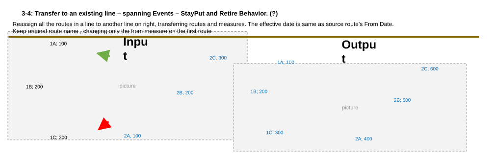

### TC-U07 — Transfer To an Existing Line – Spanning Events – Stayput & Retire Behavior. (case 3-5) <!-- src: S1 · slide 10 · case 3-5 -->

Reassign all the routes in a line to another line on right, transferring routes and measures. The effective date is same as source route’s From Date. Same route name , changing only the  To Measure of the last route

| Route Name | Line Name | Line Order | From Date | To Date | From M | To M |
| --- | --- | --- | --- | --- | --- | --- |
| 1A | L1 | 100 | 1/1/2000 | <Null> | 2 | 4 |
| 1B | L1 | 200 | 1/1/2000 | <Null> | 0 | 2 |
| 1C | L1 | 300 | 1/1/2000 | <Null> | 0 | 4 |
| 2A | L2 | 100 | 1/1/2000 | <Null> | 3 | 5 |
| 2B | L2 | 200 | 1/1/2000 | <Null> | 4 | 8 |
| 2C | L2 | 300 | 1/1/2000 | <Null> | 0 | 2 |

| Event ID | From Date | To Date | From Route ID | From M | To Route ID | To M | Location Error |
| --- | --- | --- | --- | --- | --- | --- | --- |
| S1 | 1/1/2000 | <Null> | 1A | 2 | 1C | 4 | No Error |

| Event ID | From Date | To Date | From Route ID | From M | To Route ID | To M | Location Error |
| --- | --- | --- | --- | --- | --- | --- | --- |
| S1 | 1/1/2000 | <Null> | 1A | 2 | 1C | 4 | No Error |

| Effective Date | 1/1/2000 |
| --- | --- |

| Route Name | Line Name | Line Order | From Date | To Date | From M | To M |
| --- | --- | --- | --- | --- | --- | --- |
| 1A | L2 | 100 | 1/1/2000 | <Null> | 2 | 4 |
| 1B | L2 | 200 | 1/1/2000 | <Null> | 0 | 2 |
| 1C | L2 | 300 | 1/1/2000 | <Null> | 0 | 6 |
| 2A | L2 | 400 | 1/1/2000 | <Null> | 3 | 5 |
| 2B | L2 | 500 | 1/1/2000 | <Null> | 4 | 8 |
| 2C | L2 | 600 | 1/1/2000 | <Null> | 0 | 2 |

[figure: 1A; 100 · 1B; 200 · 1C; 300 · 2A, 100 · 2B, 200 · 2C, 300 · Input · Output · 2A; 400 · 2B; 500 · 2C; 600]

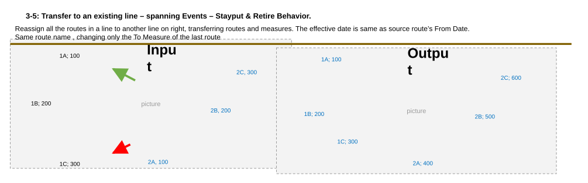

### TC-U08 — Transfer To an Existing Line – Spanning Events – Stayput & Retire Behavior. (case 3-6) <!-- src: S1 · slide 11 · case 3-6 -->

Reassign all the routes in a line to another line on right, transferring routes and measures. The effective date is same as source route’s From Date. Same route name , changing the  To Measure of the last route, changing the from measure of the first route

| Route Name | Line Name | Line Order | From Date | To Date | From M | To M |
| --- | --- | --- | --- | --- | --- | --- |
| 1A | L1 | 100 | 1/1/2000 | <Null> | 2 | 4 |
| 1B | L1 | 200 | 1/1/2000 | <Null> | 0 | 2 |
| 1C | L1 | 300 | 1/1/2000 | <Null> | 0 | 4 |
| 2A | L2 | 100 | 1/1/2000 | <Null> | 3 | 5 |
| 2B | L2 | 200 | 1/1/2000 | <Null> | 4 | 8 |
| 2C | L2 | 300 | 1/1/2000 | <Null> | 0 | 2 |

| Event ID | From Date | To Date | From Route ID | From M | To Route ID | To M | Location Error |
| --- | --- | --- | --- | --- | --- | --- | --- |
| S1 | 1/1/2000 | <Null> | 1A | 2 | 1C | 4 | No Error |

| Event ID | From Date | To Date | From Route ID | From M | To Route ID | To M | Location Error |
| --- | --- | --- | --- | --- | --- | --- | --- |
| S1 | 1/1/2000 | <Null> | 1A | 2 | 1C | 4 | Partial Match Fr M & To M |

| Effective Date | 1/1/2000 |
| --- | --- |

| Route Name | Line Name | Line Order | From Date | To Date | From M | To M |
| --- | --- | --- | --- | --- | --- | --- |
| 1A | L2 | 100 | 1/1/2000 | <Null> | 3 | 4 |
| 1B | L2 | 200 | 1/1/2000 | <Null> | 0 | 2 |
| 1C | L2 | 300 | 1/1/2000 | <Null> | 0 | 3 |
| 2A | L2 | 400 | 1/1/2000 | <Null> | 3 | 5 |
| 2B | L2 | 500 | 1/1/2000 | <Null> | 4 | 8 |
| 2C | L2 | 600 | 1/1/2000 | <Null> | 0 | 2 |

[figure: 1A; 100 · 1B; 200 · 1C; 300 · 2A, 100 · 2B, 200 · 2C, 300 · Input · Output · 2A; 400 · 2B; 500 · 2C; 600]

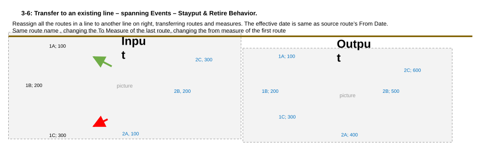

### TC-U09 — Transfer To an Existing Line – Spanning Events – Stayput and Retire Behavior. (case 4) <!-- src: S1 · slide 12 · case 4 -->

 Reassign all the routes in a line to another line on right, 2/3 route names and measures maintained. The first route in the line has changed name and measure changed.

| Route Name | Line Name | Line Order | From Date | To Date | From M | To M |
| --- | --- | --- | --- | --- | --- | --- |
| 1A | L1 | 100 | 1/1/2000 | <Null> | 2 | 4 |
| 1B | L1 | 200 | 1/1/2000 | <Null> | 0 | 2 |
| 1C | L1 | 300 | 1/1/2000 | <Null> | 0 | 4 |
| 2A | L2 | 100 | 1/1/2000 | <Null> | 3 | 5 |
| 2B | L2 | 200 | 1/1/2000 | <Null> | 4 | 8 |
| 2C | L2 | 300 | 1/1/2000 | <Null> | 0 | 2 |

| Event ID | From Date | To Date | From Route ID | From M | To Route ID | To M | Location Error |
| --- | --- | --- | --- | --- | --- | --- | --- |
| S1 | 1/1/2000 | <Null> | 1A | 2 | 1C | 4 | No Error |
| S2 | 1/1/2000 | <Null> | 1A | 2 | 1B | 1 | No Error |
| S3 | 1/1/2000 | <Null> | 1B | 1.5 | 1C | 4 | No Error |
| S4 | 1/1/2000 | <Null> | 1A | 3 | 1C | 1 | No Error |
| S5 | 1/1/2000 | <Null> | 1B | 0 | 1B | 2 | No Error |

| Event ID | From Date | To Date | From Route ID | From M | To Route ID | To M | Location Error |
| --- | --- | --- | --- | --- | --- | --- | --- |
| S1 | 1/1/2000 | 1/1/2023 | 1A | 2 | 1C | 4 | No Error |
| S2 | 1/1/2000 | 1/1/2023 | 1A | 2 | 1B | 1 | No Error |
| S3 | 1/1/2000 | 1/1/2023 | 1B | 1.5 | 1C | 4 | No Error |
| S4 | 1/1/2000 | 1/1/2023 | 1A | 3 | 1C | 1 | No Error |
| S5 | 1/1/2000 | 1/1/2023 | 1B | 0 | 1B | 2 | No Error |

| Route Name | Line Name | Line Order | From Date | To Date | From M | To M |
| --- | --- | --- | --- | --- | --- | --- |
| 1A | L1 | 100 | 1/1/2000 | 1/1/2023 | 2 | 4 |
| 1B | L1 | 200 | 1/1/2000 | 1/1/2023 | 0 | 2 |
| 1C | L1 | 300 | 1/1/2000 | 1/1/2023 | 0 | 4 |
| 2A | L2 | 100 | 1/1/2000 | 1/1/2023 | 3 | 5 |
| 2B | L2 | 200 | 1/1/2000 | 1/1/2023 | 4 | 8 |
| 2C | L2 | 300 | 1/1/2000 | 1/1/2023 | 0 | 2 |
| 1A_New | L2 | 100 | 1/1/2023 | <Null> | 5 | 8 |
| 1B | L2 | 200 | 1/1/2023 | <Null> | 0 | 2 |
| 1C | L2 | 300 | 1/1/2023 | <Null> | 0 | 4 |
| 2A | L2 | 400 | 1/1/2023 | <Null> | 3 | 5 |
| 2B | L2 | 500 | 1/1/2023 | <Null> | 4 | 8 |
| 2C | L2 | 600 | 1/1/2023 | <Null> | 0 | 2 |

| Effective Date | 1/1/2023 |
| --- | --- |

[figure: 1A; 100 · 1B; 200 · 1C; 300 · 2A, 100 · 2B, 200 · 2C, 300 · 4 · 3 · 5 · 8 · 0 · 2 · Input · Output · 1A_New; 100 · 1B_New 200 · 1C_New; 300 · 2A; 400 · 2B; 500 · 2C; 600 · 9]

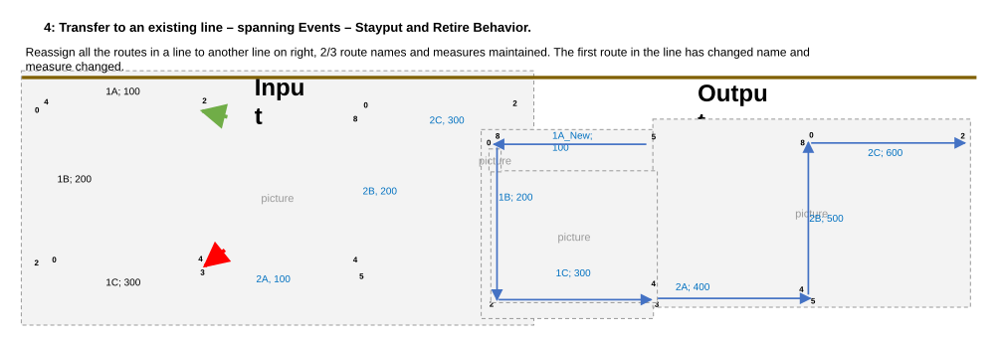

### TC-U10 — Transfer To an Existing Line – Spanning Events – Stayput Behavior (case 5-1) <!-- src: S1 · slide 13 · case 5-1 -->

Reassign 1 entire route  and a partial route  in a line to another line transferring routes and measures. ; Keep the same name for the
entire route and partial route (name of a retired route from the line to which route is reassigned), Change measures

| Route Name | Line Name | Line Order | From Date | To Date | From M | To M |
| --- | --- | --- | --- | --- | --- | --- |
| 1A | L1 | 100 | 1/1/2000 | <Null> | 2 | 4 |
| 1B | L1 | 200 | 1/1/2000 | <Null> | 0 | 2 |
| 1C | L1 | 300 | 1/1/2000 | <Null> | 0 | 4 |
| 2A | L2 | 100 | 1/1/2000 | <Null> | 3 | 5 |
| 2B | L2 | 200 | 1/1/2000 | <Null> | 4 | 8 |
| 2C | L2 | 300 | 1/1/2000 | <Null> | 0 | 2 |

| Event ID | From Date | To Date | From Route ID | From M | To Route ID | To M | Location Error |
| --- | --- | --- | --- | --- | --- | --- | --- |
| S1 | 1/1/2000 | <Null> | 1A | 2 | 1C | 4 | No Error |
| S2 | 1/1/2000 | <Null> | 1A | 2 | 1B | 1 | No Error |
| S3 | 1/1/2000 | <Null> | 1B | 1 | 1C | 4 | No Error |
| S4 | 1/1/2000 | <Null> | 1A | 3 | 1C | 2 | No Error |
| S5 | 1/1/2000 | <Null> | 1C | 0 | 1C | 4 | No Error |

| Route Name | Line Name | Line Order | From Date | To Date | From M | To M |
| --- | --- | --- | --- | --- | --- | --- |
| 1A | L1 | 100 | 1/1/2000 | <Null> | 2 | 4 |
| 1B | L1 | 200 | 1/1/2000 | 1/1/2023 | 0 | 2 |
| 1C | L1 | 300 | 1/1/2000 | 1/1/2023 | 0 | 4 |
| 2A | L2 | 100 | 1/1/2000 | 1/1/2023 | 3 | 5 |
| 2B | L2 | 200 | 1/1/2000 | 1/1/2023 | 4 | 8 |
| 2C | L2 | 300 | 1/1/2000 | 1/1/2023 | 0 | 2 |
| 1B | L1 | 200 | 1/1/2023 | <Null> | 0 | 1 |
| 1R1 | L2 | 100 | 1/1/2023 | <Null> | 0 | 1 |
| 1C | L2 | 200 | 1/1/2023 | <Null> | 4 | 6 |
| 2A | L2 | 300 | 1/1/2023 | <Null> | 3 | 5 |
| 2B | L2 | 400 | 1/1/2023 | <Null> | 4 | 8 |
| 2C | L2 | 500 | 1/1/2023 | <Null> | 0 | 2 |

| Event ID | From Date | To Date | From Route ID | From M | To Route ID | To M | Location Error |
| --- | --- | --- | --- | --- | --- | --- | --- |
| S1 | 1/1/2000 | 1/1/2023 | 1A | 2 | 1C | 4 | No Error |
| S1 | 1/1/2023 | <Null> | 1A | 2 | 1B | 1 | No Error |
| S2 | 1/1/2000 | <Null> | 1A | 2 | 1B | 1 | No Error |
| S3 | 1/1/2000 | 1/1/2023 | 1B | 1 | 1C | 4 | No Error |
| S4 | 1/1/2000 | 1/1/2023 | 1A | 3 | 1C | 2 | No Error |
| S4 | 1/1/2023 | <Null> | 1A | 3 | 1B | 1 | No Error |
| S5 | 1/1/2000 | 1/1/2023 | 1B | 0 | 1B | 2 | No Error |

| Effective Date | 1/1/2023 |
| --- | --- |

[figure: 4 · 0 · 1 · 6 · 3 · 5 · 8 · 2 · 1A; 100 · 1B; 200 · 1C; 300 · 2A, 100 · 2B, 200 · 2C, 300 · Input · Output · 1C; 200 · 2A; 300 · 2B; 400 · 2C; 500 · 1R1; 100]

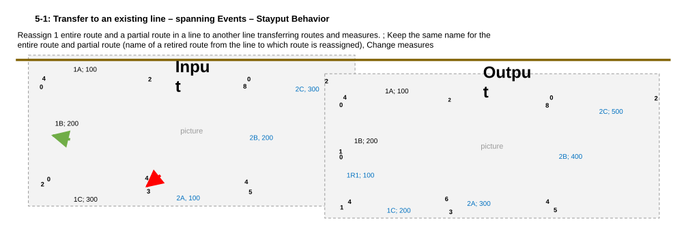

### TC-U11 — Transfer To an Existing Line – Spanning Events – Retire Behavior (case 5-2) <!-- src: S1 · slide 14 · case 5-2 -->

Reassign 1 entire route  and a partial route  in a line to another line transferring routes and measures. ; Keep the same name for the
Entire route and partial route (name of a retired route from the line to which route is reassigned). Change measures

| Route Name | Line Name | Line Order | From Date | To Date | From M | To M |
| --- | --- | --- | --- | --- | --- | --- |
| 1A | L1 | 100 | 1/1/2000 | <Null> | 2 | 4 |
| 1B | L1 | 200 | 1/1/2000 | <Null> | 0 | 2 |
| 1C | L1 | 300 | 1/1/2000 | <Null> | 0 | 4 |
| 2A | L2 | 100 | 1/1/2000 | <Null> | 3 | 5 |
| 2B | L2 | 200 | 1/1/2000 | <Null> | 4 | 8 |
| 2C | L2 | 300 | 1/1/2000 | <Null> | 0 | 2 |

| Event ID | From Date | To Date | From Route ID | From M | To Route ID | To M | Location Error |
| --- | --- | --- | --- | --- | --- | --- | --- |
| S1 | 1/1/2000 | <Null> | 1A | 2 | 1C | 4 | No Error |
| S2 | 1/1/2000 | <Null> | 1A | 2 | 1B | 1 | No Error |
| S3 | 1/1/2000 | <Null> | 1B | 1 | 1C | 4 | No Error |
| S4 | 1/1/2000 | <Null> | 1A | 3 | 1C | 2 | No Error |
| S5 | 1/1/2000 | <Null> | 1C | 0 | 1C | 4 | No Error |

| Route Name | Line Name | Line Order | From Date | To Date | From M | To M |
| --- | --- | --- | --- | --- | --- | --- |
| 1A | L1 | 100 | 1/1/2000 | <Null> | 2 | 4 |
| 1B | L1 | 200 | 1/1/2000 | 1/1/2023 | 0 | 2 |
| 1C | L1 | 300 | 1/1/2000 | 1/1/2023 | 0 | 4 |
| 2A | L2 | 100 | 1/1/2000 | 1/1/2023 | 3 | 5 |
| 2B | L2 | 200 | 1/1/2000 | 1/1/2023 | 4 | 8 |
| 2C | L2 | 300 | 1/1/2000 | 1/1/2023 | 0 | 2 |
| 1B | L1 | 200 | 1/1/2023 | <Null> | 0 | 1 |
| 1R1 | L2 | 100 | 1/1/2023 | <Null> | 0 | 1 |
| 1C | L2 | 200 | 1/1/2023 | <Null> | 4 | 6 |
| 2A | L2 | 300 | 1/1/2023 | <Null> | 3 | 5 |
| 2B | L2 | 400 | 1/1/2023 | <Null> | 4 | 8 |
| 2C | L2 | 500 | 1/1/2023 | <Null> | 0 | 2 |

| Event ID | From Date | To Date | From Route ID | From M | To Route ID | To M | Location Error |
| --- | --- | --- | --- | --- | --- | --- | --- |
| S1 | 1/1/2000 | 1/1/2023 | 1A | 2 | 1C | 4 | No Error |
| S2 | 1/1/2000 | <Null> | 1A | 2 | 1B | 1 | No Error |
| S3 | 1/1/2000 | 1/1/2023 | 1B | 1 | 1C | 4 | No Error |
| S4 | 1/1/2000 | 1/1/2023 | 1A | 3 | 1C | 2 | No Error |
| S5 | 1/1/2000 | 1/1/2023 | 1B | 0 | 1B | 2 | No Error |

| Effective Date | 1/1/2023 |
| --- | --- |

[figure: 4 · 0 · 1 · 6 · 3 · 5 · 8 · 2 · 1A; 100 · 1B; 200 · 1C; 300 · 2A, 100 · 2B, 200 · 2C, 300 · Input · Output · 1C; 200 · 2A; 300 · 2B; 400 · 2C; 500 · 1R1; 100]

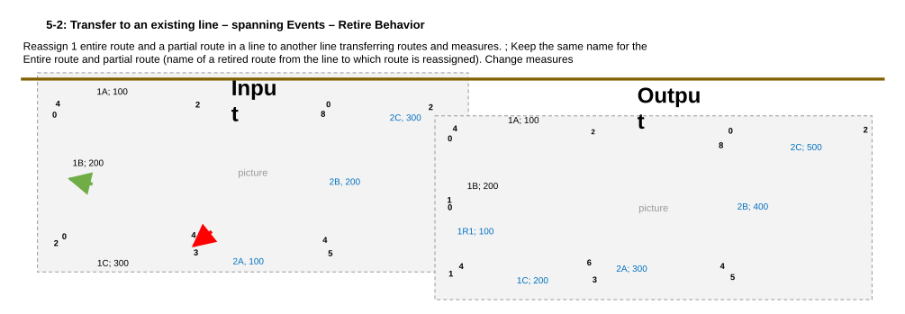

### TC-U12 — Transfer To an Existing Line – Spanning Events – Stayput Behavior (case 6-1) <!-- src: S1 · slide 15 · case 6-1 -->

 Transfer partial route (1/2 of a route) in a line to adjacent upstream existing line , recalibrate source route downstream ,calibrate set to stayput, change Route Name, no measure change for the reassigned route portion

| Route Name | Line Name | Line Order | From Date | To Date | From M | To M |
| --- | --- | --- | --- | --- | --- | --- |
| 0A | L0 | 100 | 1/1/2000 | <Null> | 3 | 5 |
| 1A | L1 | 100 | 1/1/2000 | <Null> | 2 | 4 |
| 1B | L1 | 200 | 1/1/2000 | <Null> | 0 | 2 |
| 1C | L1 | 300 | 1/1/2000 | <Null> | 0 | 4 |

| Event ID | From Date | To Date | From Route ID | From M | To Route ID | To M | Location Error |
| --- | --- | --- | --- | --- | --- | --- | --- |
| S1 | 1/1/2000 | <Null> | 1A | 2 | 1C | 4 | No Error |
| S2 | 1/1/2000 | <Null> | 1A | 2 | 1B | 1 | No Error |
| S3 | 1/1/2000 | <Null> | 1B | 1.5 | 1C | 4 | No Error |
| S4 | 1/1/2000 | <Null> | 1A | 3 | 1C | 1 | No Error |
| S5 | 1/1/2000 | <Null> | 1A | 2 | 1A | 3 | No Error |

| Event ID | From Date | To Date | From Route ID | From M | To Route ID | To M | Location Error |
| --- | --- | --- | --- | --- | --- | --- | --- |
| S1 | 1/1/2000 | 1/1/2023 | 1A | 2 | 1C | 4 | No Error |
| S1 | 1/1/2023 | <Null> | 1A | 0 | 1C | 4 | No Error |
| S2 | 1/1/2000 | 1/1/2023 | 1A | 2 | 1B | 1 | No Error |
| S2 | 1/1/2023 | <Null> | 1A | 0 | 1B | 1 | No Error |
| S3 | 1/1/2000 | <Null> | 1B | 1.5 | 1C | 4 | No Error |
| S4 | 1/1/2000 | 1/1/2023 | 1A | 3 | 1C | 1 | No Error |
| S4 | 1/1/2000 | <Null> | 1A | 0 | 1C | 1 | No Error |
| S5 | 1/1/2000 | 1/1/2023 | 1A | 2 | 1A | 3 | No Error |

| Route Name | Line Name | Line Order | From Date | To Date | From M | To M |
| --- | --- | --- | --- | --- | --- | --- |
| 0A | L0 | 100 | 1/1/2000 | <Null> | 3 | 5 |
| 1A_New | L0 | 200 | 1/1/2023 | <Null> | 2 | 3 |
| 1A | L1 | 100 | 1/1/2023 | <Null> | 0 | 1 |
| 1A | L1 | 100 | 1/1/2000 | 1/1/2023 | 2 | 4 |
| 1B | L1 | 200 | 1/1/2000 | <Null> | 0 | 2 |
| 1C | L1 | 300 | 1/1/2000 | <Null> | 0 | 4 |

| Effective Date | 1/1/2023 |
| --- | --- |
| Source RD | Yes |

[figure: 0A, 100 · 1A_New; 200 · 4 · 0 · 2 · 1A; 100 · 1B; 200 · 1C; 300 · 3 · Input · Output · 1]

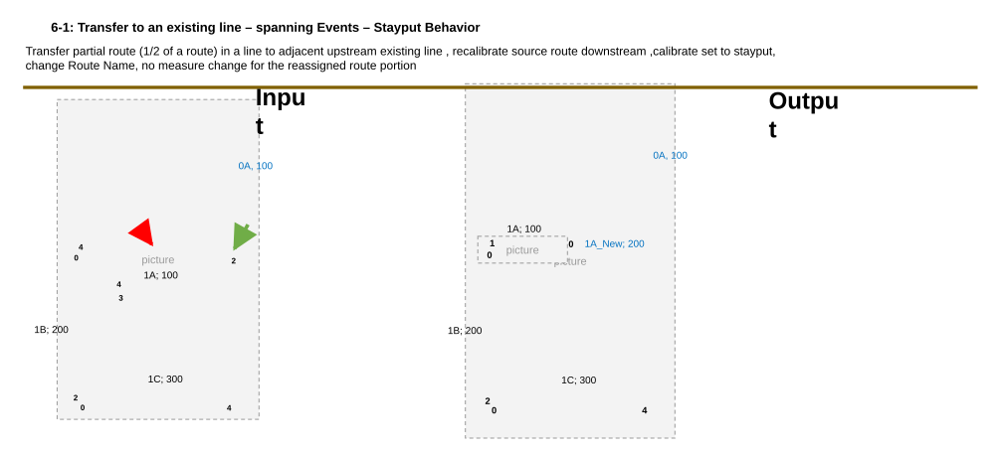

### TC-U13 — Transfer To an Existing Line – Spanning Events – Retire Behavior (case 6-2) <!-- src: S1 · slide 16 · case 6-2 -->

 Transfer partial route (1/2 of a route) in a line to adjacent upstream existing line , recalibrate source route downstream, calibrate set to retire, route name changed , no measure change for the reassigned route portion

| Route Name | Line Name | Line Order | From Date | To Date | From M | To M |
| --- | --- | --- | --- | --- | --- | --- |
| 0A | L0 | 100 | 1/1/2000 | <Null> | 3 | 5 |
| 1A | L1 | 100 | 1/1/2000 | <Null> | 2 | 4 |
| 1B | L1 | 200 | 1/1/2000 | <Null> | 0 | 2 |
| 1C | L1 | 300 | 1/1/2000 | <Null> | 0 | 4 |

| Event ID | From Date | To Date | From Route ID | From M | To Route ID | To M | Location Error |
| --- | --- | --- | --- | --- | --- | --- | --- |
| S1 | 1/1/2000 | <Null> | 1A | 2 | 1C | 4 | No Error |
| S2 | 1/1/2000 | <Null> | 1A | 2 | 1B | 1 | No Error |
| S3 | 1/1/2000 | <Null> | 1B | 1.5 | 1C | 4 | No Error |
| S4 | 1/1/2000 | <Null> | 1A | 3 | 1C | 1 | No Error |
| S5 | 1/1/2000 | <Null> | 1A | 2 | 1A | 3 | No Error |

| Event ID | From Date | To Date | From Route ID | From M | To Route ID | To M | Location Error |
| --- | --- | --- | --- | --- | --- | --- | --- |
| S1 | 1/1/2000 | 1/1/2023 | 1A | 2 | 1C | 4 | No Error |
| S2 | 1/1/2000 | 1/1/2023 | 1A | 2 | 1B | 1 | No Error |
| S3 | 1/1/2000 | <Null> | 1B | 1.5 | 1C | 4 | No Error |
| S4 | 1/1/2000 | 1/1/2023 | 1A | 3 | 1C | 1 | No Error |
| S5 | 1/1/2000 | 1/1/2023 | 1A | 2 | 1A | 3 | No Error |

| Route Name | Line Name | Line Order | From Date | To Date | From M | To M |
| --- | --- | --- | --- | --- | --- | --- |
| 0A | L0 | 100 | 1/1/2000 | <Null> | 3 | 5 |
| 1A_New | L0 | 200 | 1/1/2023 | <Null> | 2 | 3 |
| 1A | L1 | 100 | 1/1/2023 | <Null> | 0 | 1 |
| 1A | L1 | 100 | 1/1/2000 | 1/1/2023 | 2 | 4 |
| 1B | L1 | 200 | 1/1/2000 | <Null> | 0 | 2 |
| 1C | L1 | 300 | 1/1/2000 | <Null> | 0 | 4 |

| Effective Date | 1/1/2023 |
| --- | --- |
| Source RD | Yes |

[figure: 2 · 0A, 100 · 1A_New; 200 · 1 · 0 · 4 · 1A; 100 · 1B; 200 · 1C; 300 · 3 · Input · Output]

### TC-U14 — Transfer To an Existing Line – Spanning Events – Stayput Behavior (case 7-1) <!-- src: S1 · slide 17 · case 7-1 -->

 Transfer partial route (1/2 of a route) in a line to adjacent upstream existing line ,  do not recalibrate source route downstream, route name changed , no measure change for the reassigned route portion

| Route Name | Line Name | Line Order | From Date | To Date | From M | To M |
| --- | --- | --- | --- | --- | --- | --- |
| 0A | L0 | 100 | 1/1/2000 | <Null> | 3 | 5 |
| 1A | L1 | 100 | 1/1/2000 | <Null> | 2 | 4 |
| 1B | L1 | 200 | 1/1/2000 | <Null> | 0 | 2 |
| 1C | L1 | 300 | 1/1/2000 | <Null> | 0 | 4 |

| Event ID | From Date | To Date | From Route ID | From M | To Route ID | To M | Location Error |
| --- | --- | --- | --- | --- | --- | --- | --- |
| S1 | 1/1/2000 | <Null> | 1A | 2 | 1C | 4 | No Error |
| S2 | 1/1/2000 | <Null> | 1A | 2 | 1B | 1 | No Error |
| S3 | 1/1/2000 | <Null> | 1B | 1.5 | 1C | 4 | No Error |
| S4 | 1/1/2000 | <Null> | 1A | 3 | 1C | 1 | No Error |
| S5 | 1/1/2000 | <Null> | 1A | 2 | 1A | 3 | No Error |

| Event ID | From Date | To Date | From Route ID | From M | To Route ID | To M | Location Error |
| --- | --- | --- | --- | --- | --- | --- | --- |
| S1 | 1/1/2000 | 1/1/2023 | 1A | 2 | 1C | 4 | No Error |
| S1 | 1/1/2023 | <Null> | 1A | 3 | 1C | 4 | No Error |
| S2 | 1/1/2000 | 1/1/2023 | 1A | 2 | 1B | 1 | No Error |
| S2 | 1/1/2023 | <Null> | 1A | 3 | 1B | 1 | No Error |
| S3 | 1/1/2000 | <Null> | 1B | 1.5 | 1C | 4 | No Error |
| S4 | 1/1/2000 | <Null> | 1A | 3 | 1C | 1 | No Error |
| S5 | 1/1/2000 | 1/1/2023 | 1A | 2 | 1A | 3 | No Error |

| Route Name | Line Name | Line Order | From Date | To Date | From M | To M |
| --- | --- | --- | --- | --- | --- | --- |
| 0A | L0 | 100 | 1/1/2000 | <Null> | 3 | 5 |
| 1A_New | L0 | 200 | 1/1/2023 | <Null> | 2 | 3 |
| 1A | L1 | 100 | 1/1/2023 | <Null> | 3 | 4 |
| 1A | L1 | 100 | 1/1/2000 | 1/1/2023 | 2 | 4 |
| 1B | L1 | 200 | 1/1/2000 | <Null> | 0 | 2 |
| 1C | L1 | 300 | 1/1/2000 | <Null> | 0 | 4 |

| Effective Date | 1/1/2023 |
| --- | --- |
| Source RD | No |

[figure: 0A, 100 · 1A_New; 200 · 4 · 3 · 0 · 2 · 1A; 100 · 1B; 200 · 1C; 300 · Input · Output]

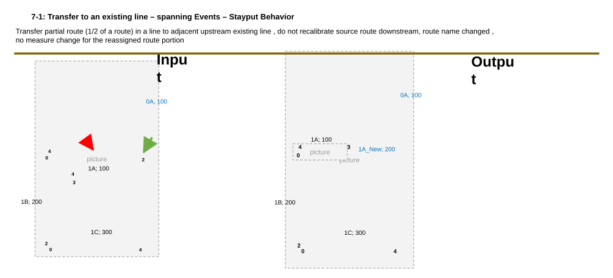

### TC-U15 — Transfer To an Existing Line – Spanning Events – Retire Behavior (case 7-2) <!-- src: S1 · slide 18 · case 7-2 -->

 Transfer partial route (1/2 of a route) in a line to adjacent upstream existing line ,  do not recalibrate source route downstream, route name changed , no measure change for the reassigned route portion

| Route Name | Line Name | Line Order | From Date | To Date | From M | To M |
| --- | --- | --- | --- | --- | --- | --- |
| 0A | L0 | 100 | 1/1/2000 | <Null> | 3 | 5 |
| 1A | L1 | 100 | 1/1/2000 | <Null> | 2 | 4 |
| 1B | L1 | 200 | 1/1/2000 | <Null> | 0 | 2 |
| 1C | L1 | 300 | 1/1/2000 | <Null> | 0 | 4 |

| Event ID | From Date | To Date | From Route ID | From M | To Route ID | To M | Location Error |
| --- | --- | --- | --- | --- | --- | --- | --- |
| S1 | 1/1/2000 | <Null> | 1A | 2 | 1C | 4 | No Error |
| S2 | 1/1/2000 | <Null> | 1A | 2 | 1B | 1 | No Error |
| S3 | 1/1/2000 | <Null> | 1B | 1.5 | 1C | 4 | No Error |
| S4 | 1/1/2000 | <Null> | 1A | 3 | 1C | 1 | No Error |
| S5 | 1/1/2000 | <Null> | 1A | 2 | 1A | 3 | No Error |

| Event ID | From Date | To Date | From Route ID | From M | To Route ID | To M | Location Error |
| --- | --- | --- | --- | --- | --- | --- | --- |
| S1 | 1/1/2000 | 1/1/2023 | 1A | 2 | 1C | 4 | No Error |
| S2 | 1/1/2000 | 1/1/2023 | 1A | 2 | 1B | 1 | No Error |
| S3 | 1/1/2000 | <Null> | 1B | 1.5 | 1C | 4 | No Error |
| S4 | 1/1/2000 | <Null> | 1A | 3 | 1C | 1 | No Error |
| S5 | 1/1/2000 | 1/1/2023 | 1A | 2 | 1A | 3 | No Error |

| Route Name | Line Name | Line Order | From Date | To Date | From M | To M |
| --- | --- | --- | --- | --- | --- | --- |
| 0A | L0 | 100 | 1/1/2000 | <Null> | 3 | 5 |
| 1A_New | L0 | 200 | 1/1/2023 | <Null> | 2 | 3 |
| 1A | L1 | 100 | 1/1/2023 | <Null> | 3 | 4 |
| 1A | L1 | 100 | 1/1/2000 | 1/1/2023 | 2 | 4 |
| 1B | L1 | 200 | 1/1/2000 | <Null> | 0 | 2 |
| 1C | L1 | 300 | 1/1/2000 | <Null> | 0 | 4 |

| Effective Date | 1/1/2023 |
| --- | --- |
| Source RD | No |

[figure: 2 · 0A, 100 · 1A_New; 200 · 4 · 0 · 1A; 100 · 1B; 200 · 1C; 300 · 3 · Input · Output · 1]

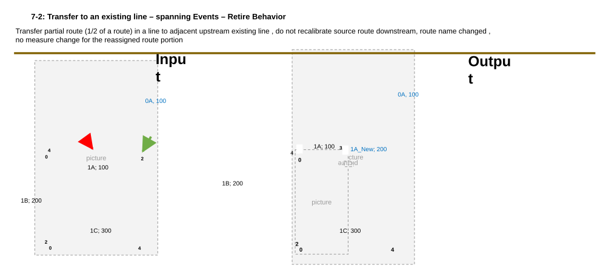

### TC-U16 — Transfer To an Existing Line (case 8) <!-- src: S1 · slide 19 · case 8 -->

- **Case:** Transfer to an existing line – spanning Events only Routes and Route Table shown here - StayPut

Reassign 0.5+1+0.5 routes in a line to new line ,1/3 route name and measure maintained. Rest all name and measure are changed. Recalibrate source downstream. Calibrate set to Stayput

| Route Name | Line Name | Line Order | From Date | To Date | From M | To M |
| --- | --- | --- | --- | --- | --- | --- |
| 1A | L1 | 100 | 1/1/2000 | <Null> | 2 | 4 |
| 1B | L1 | 200 | 1/1/2000 | <Null> | 0 | 2 |
| 1C | L1 | 300 | 1/1/2000 | <Null> | 0 | 4 |
| 2A | L2 | 100 | 1/1/2000 | <Null> | 4 | 5 |
| 2B | L2 | 200 | 1/1/2000 | <Null> | 5 | 8 |
| 2C | L2 | 300 | 1/1/2000 | <Null> | 0 | 1 |

| Route Name | Line Name | Line Order | From Date | To Date | From M | To M |
| --- | --- | --- | --- | --- | --- | --- |
| 1A | L1 | 100 | 1/1/2000 | 1/1/2023 | 2 | 4 |
| 1B | L1 | 200 | 1/1/2000 | 1/1/2023 | 0 | 2 |
| 1C | L1 | 300 | 1/1/2000 | 1/1/2023 | 0 | 4 |
| 2A | L2 | 100 | 1/1/2000 | 1/1/2023 | 3 | 5 |
| 2B | L2 | 200 | 1/1/2000 | 1/1/2023 | 4 | 8 |
| 2C | L2 | 300 | 1/1/2000 | 1/1/2023 | 0 | 2 |
| 1A | L1 | 100 | 1/1/2023 | <Null> | 2 | 3 |
| 1C | L1 | 200 | 1/1/2023 | <Null> | 0 | 2 |
| 1A_New | L2 | 100 | 1/1/2023 | <Null> | 1 | 2 |
| 1B | L2 | 200 | 1/1/2023 | <Null> | 0 | 2 |
| 1C_New | L2 | 300 | 1/1/2023 | <Null> | 5 | 6 |
| 2A | L2 | 400 | 1/1/2023 | <Null> | 4 | 5 |
| 2B | L2 | 500 | 1/1/2023 | <Null> | 5 | 8 |
| 2C | L2 | 600 | 1/1/2023 | <Null> | 0 | 1 |

| Effective Date | 1/1/2023 |
| --- | --- |
| Source RD | Yes |

[figure: 1A; 100 · 1B; 200 · 1C; 200 · 2A; 400 · 2B; 500 · 2C; 600 · 1A_New; 100 · 1C_New; 300 · 1C; 300 · 2A, 100 · 2B, 200 · 2C, 300 · Input · Output]

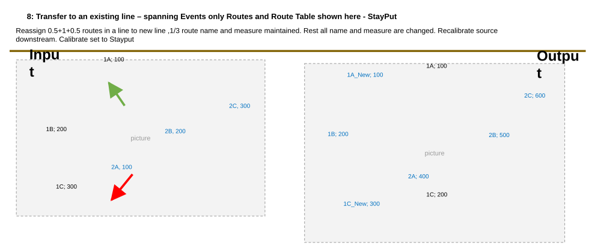

### TC-U17 — Transfer To an Existing Line – Spanning Events – Stayput Behavior (case 8-1) <!-- src: S1 · slide 20 · case 8-1 -->

Reassign 0.5+1+0.5 routes in a line to new line ,1/3 route names and measures maintained. Rest all name and measure are changed. Recalibrate source downstream. Calibrate set to stayput

| Event ID | From Date | To Date | From Route ID | From M | To Route ID | To M | Location Error |
| --- | --- | --- | --- | --- | --- | --- | --- |
| S1 | 1/1/2000 | <Null> | 1A | 2 | 1C | 4 | No Error |
| S2 | 1/1/2000 | <Null> | 1A | 2 | 1B | 1 | No Error |
| S3 | 1/1/2000 | <Null> | 1B | 1 | 1C | 4 | No Error |
| S4 | 1/1/2000 | <Null> | 1A | 3 | 1C | 2 | No Error |
| S5 | 1/1/2000 | <Null> | 1C | 0 | 1C | 4 | No Error |
| S6 | 1/1/2000 | <Null> | 1C | 3 | 1C | 4 | No Error |
| S7 | 1/1/2000 | <Null> | 1C | 1 | 1C | 3 | No Error |
| S8 | 1/1/2000 | <Null> | 1C | 0 | 1C | 1 | No Error |
| S9 | 1/1/2000 | <Null> | 1B | 0 | 1B | 2 | No Error |
| S10 | 1/1/2000 | <Null> | 1A | 2 | 1A | 2.5 | No Error |
| S11 | 1/1/2000 | <Null> | 1A | 2.5 | 1A | 3.5 | No Error |
| S12 | 1/1/2000 | <Null> | 1A | 3.5 | 1A | 4 | No Error |
|  |  |  |  |  |  |  |  |
| E1 | 1/1/2000 | <Null> | 2A | 4 | 2C | 1 | No Error |

| Event ID | From Date | To Date | From Route ID | From M | To Route ID | To M | Location Error |
| --- | --- | --- | --- | --- | --- | --- | --- |
| S1 | 1/1/2000 | 1/1/2023 | 1A | 2 | 1C | 4 | No Error |
| S1 | 1/1/2023 | <Null> | 1A | 2 | 1A | 3 | No Error |
| S1 | 1/1/2023 | <Null> | 1C | 0 | 1C | 2 | No Error |
| S2 | 1/1/2000 | 1/1/2023 | 1A | 2 | 1B | 1 | No Error |
| S2 | 1/1/2023 | <Null> | 1A | 2 | 1A | 3 | No Error |
| S3 | 1/1/2000 | 1/1/2023 | 1B | 1 | 1C | 4 | No Error |
| S3 | 1/1/2023 | <Null> | 1C | 0 | 1C | 2 | No Error |
| S4 | 1/1/2000 | 1/1/2023 | 1A | 3 | 1C | 2 | No Error |
| S5 | 1/1/2000 | 1/1/2023 | 1C | 0 | 1C | 4 | No Error |
| S5 | 1/1/2023 | <Null> | 1C | 0 | 1C | 2 | No Error |
| S6 | 1/1/2000 | 1/1/2023 | 1C | 3 | 1C | 4 | No Error |
| S6 | 1/1/2023 | <Null> | 1C | 1 | 1C | 2 | No Error |
| S7 | 1/1/2000 | 1/1/2023 | 1C | 1 | 1C | 3 | No Error |
| S7 | 1/1/2023 | <Null> | 1C | 0 | 1C | 1 | No Error |
| S8 | 1/1/2000 | 1/1/2023 | 1C | 0 | 1C | 1 | No Error |
| S9 | 1/1/2000 | 1/1/2023 | 1B | 0 | 1B | 2 | No Error |
| S10 | 1/1/2000 | <Null> | 1A | 2 | 1A | 2.5 | No Error |
| S11 | 1/1/2000 | 1/1/2023 | 1A | 2.5 | 1A | 3.5 | No Error |
| S11 | 1/1/2023 | <Null> | 1A | 2.5 | 1A | 3 | No Error |
| S12 | 1/1/2000 | 1/1/2023 | 1A | 3.5 | 1A | 4 | No Error |

| Effective Date | 1/1/2023 |
| --- | --- |
| Source RD | Yes |

[figure: 1A; 100 · 1B; 200 · 1C; 200 · 2A; 400 · 2B; 500 · 2C; 600 · 1A_New; 100 · 1C_New; 300 · 1C; 300 · 2A, 100 · 2B, 200 · 2C, 300 · Input · Output · Not affected]

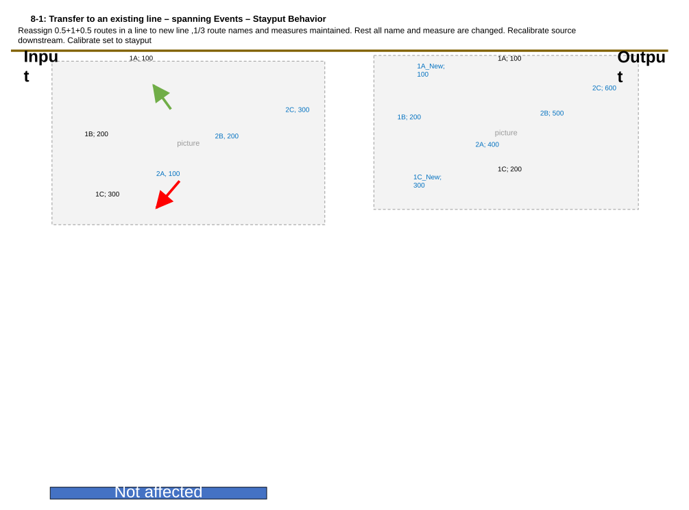

### TC-U18 — Transfer To an Existing Line – Spanning Events – Retire Behavior (case 8-2) <!-- src: S1 · slide 21 · case 8-2 -->

Reassign 0.5+1+0.5 routes in a line to new line ,1/3 route names and measures maintained. Rest all name and measure are changed. Recalibrate source downstream. Calibrate set to retire

| Event ID | From Date | To Date | From Route ID | From M | To Route ID | To M | Location Error |
| --- | --- | --- | --- | --- | --- | --- | --- |
| S1 | 1/1/2000 | <Null> | 1A | 2 | 1C | 4 | No Error |
| S2 | 1/1/2000 | <Null> | 1A | 2 | 1B | 1 | No Error |
| S3 | 1/1/2000 | <Null> | 1B | 1 | 1C | 4 | No Error |
| S4 | 1/1/2000 | <Null> | 1A | 3 | 1C | 2 | No Error |
| S5 | 1/1/2000 | <Null> | 1C | 0 | 1C | 4 | No Error |
| S6 | 1/1/2000 | <Null> | 1C | 3 | 1C | 4 | No Error |
| S7 | 1/1/2000 | <Null> | 1C | 1 | 1C | 3 | No Error |
| S8 | 1/1/2000 | <Null> | 1C | 0 | 1C | 1 | No Error |
| S9 | 1/1/2000 | <Null> | 1B | 0 | 1B | 2 | No Error |
| S10 | 1/1/2000 | <Null> | 1A | 2 | 1A | 2.5 | No Error |
| S11 | 1/1/2000 | <Null> | 1A | 2.5 | 1A | 3.5 | No Error |
| S12 | 1/1/2000 | <Null> | 1A | 3.5 | 1A | 4 | No Error |
|  |  |  |  |  |  |  |  |
| E1 | 1/1/2000 | <Null> | 2A | 4 | 2C | 1 | No Error |

| Event ID | From Date | To Date | From Route ID | From M | To Route ID | To M | Location Error |
| --- | --- | --- | --- | --- | --- | --- | --- |
| S1 | 1/1/2000 | 1/1/2023 | 1A | 2 | 1C | 4 | No Error |
| S2 | 1/1/2000 | 1/1/2023 | 1A | 2 | 1B | 1 | No Error |
| S3 | 1/1/2000 | 1/1/2023 | 1B | 1 | 1C | 4 | No Error |
| S4 | 1/1/2000 | 1/1/2023 | 1A | 3 | 1C | 2 | No Error |
| S5 | 1/1/2000 | 1/1/2023 | 1C | 0 | 1C | 4 | No Error |
| S6 | 1/1/2000 | 1/1/2023 | 1C | 3 | 1C | 4 | No Error |
| S7 | 1/1/2000 | 1/1/2023 | 1C | 1 | 1C | 3 | No Error |
| S8 | 1/1/2000 | 1/1/2023 | 1C | 0 | 1C | 1 | No Error |
| S9 | 1/1/2000 | 1/1/2023 | 1B | 0 | 1B | 2 | No Error |
| S10 | 1/1/2000 | <Null> | 1A | 2 | 1C | 2.5 | No Error |
| S11 | 1/1/2000 | 1/1/2023 | 1A | 2.5 | 1C | 3.5 | No Error |
| S12 | 1/1/2000 | 1/1/2023 | 1A | 3.5 | 1C | 4 | No Error |

| Effective Date | 1/1/2023 |
| --- | --- |
| Source RD | Yes |

[figure: 1A_New; 100 · 1B; 200 · 1C_New; 300 · 2A; 400 · 2B;500 · 2C; 600 · 2 · 1A; 100 · 1C; 200 · 1C; 300 · 2A, 100 · 2B, 200 · 2C, 300 · Input · Output · Not affected]

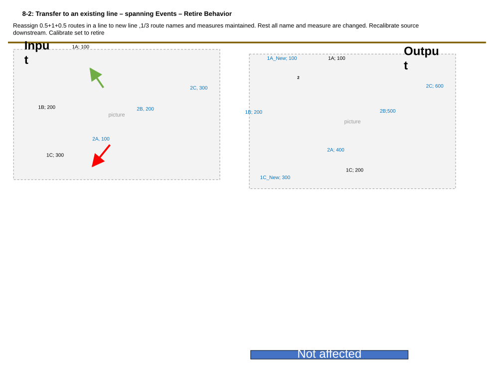

### TC-U19 — Transfer To an Existing Line – Spanning Events (case 9) <!-- src: S1 · slide 22 · case 9 -->

- **Case:** Transfer to an existing line – spanning Events – only Routes & Route tables shown - StayPut

Reassign 0.5+1+0.5 routes in a line to new line ,1/3 route name and measure maintained. Rest all name and measure are changed. Do not recalibrate source downstream.

| Route Name | Line Name | Line Order | From Date | To Date | From M | To M |
| --- | --- | --- | --- | --- | --- | --- |
| 1A | L1 | 100 | 1/1/2000 | <Null> | 2 | 4 |
| 1B | L1 | 200 | 1/1/2000 | <Null> | 0 | 2 |
| 1C | L1 | 300 | 1/1/2000 | <Null> | 0 | 4 |
| 2A | L2 | 100 | 1/1/2000 | <Null> | 4 | 5 |
| 2B | L2 | 200 | 1/1/2000 | <Null> | 5 | 8 |
| 2C | L2 | 300 | 1/1/2000 | <Null> | 0 | 1 |

| Route Name | Line Name | Line Order | From Date | To Date | From M | To M |
| --- | --- | --- | --- | --- | --- | --- |
| 1A | L1 | 100 | 1/1/2000 | <Null> | 2 | 4 |
| 1B | L1 | 200 | 1/1/2000 | 1/1/2023 | 0 | 2 |
| 1C | L1 | 300 | 1/1/2000 | 1/1/2023 | 0 | 4 |
| 2A | L2 | 100 | 1/1/2000 | 1/1/2023 | 3 | 5 |
| 2B | L2 | 200 | 1/1/2000 | 1/1/2023 | 4 | 8 |
| 2C | L2 | 300 | 1/1/2000 | 1/1/2023 | 0 | 2 |
| 1A | L1 | 100 | 1/1/2023 | <Null> | 2 | 3 |
| 1C | L1 | 200 | 1/1/2023 | <Null> | 2 | 4 |
| 1A_New | L2 | 100 | 1/1/2023 | <Null> | 1 | 2 |
| 1B | L2 | 200 | 1/1/2023 | <Null> | 0 | 2 |
| 1C_New | L2 | 300 | 1/1/2023 | <Null> | 5 | 6 |
| 2A | L2 | 400 | 1/1/2023 | <Null> | 4 | 5 |
| 2B | L2 | 500 | 1/1/2023 | <Null> | 5 | 8 |
| 2C | L2 | 600 | 1/1/2023 | <Null> | 0 | 1 |

| Effective Date | 1/1/2023 |
| --- | --- |
| Source RD | No |

[figure: 1A; 100 · 1B; 200 · 1C; 200 · 2A; 400 · 2B; 500 · 2C; 600 · 1A_New; 100 · 1C_New; 300 · 1C; 300 · 2A, 100 · 2B, 200 · 2C, 300 · Input · Output · 2 · 4]

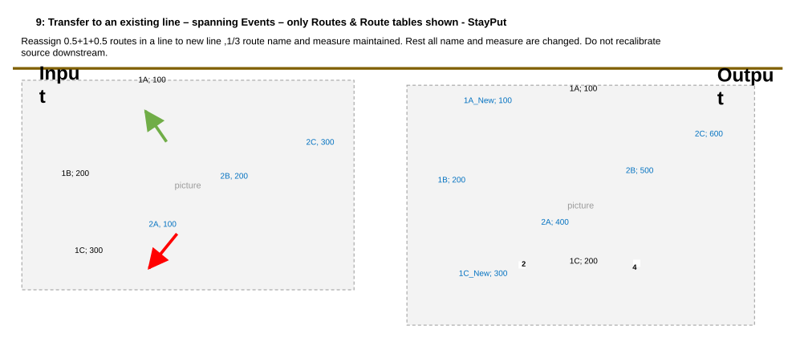

### TC-U20 — Transfer To an Existing Line – Spanning Events – Stayput Behavior – Cntd…. (case 9-1) <!-- src: S1 · slide 23 · case 9-1 -->

Reassign 0.5+1+0.5 routes in a line to new line ,1/3 route names and measures maintained. Rest all name and measure are changed. Do not recalibrate source downstream.

| Event ID | From Date | To Date | From Route ID | From M | To Route ID | To M | Location Error |
| --- | --- | --- | --- | --- | --- | --- | --- |
| S1 | 1/1/2000 | <Null> | 1A | 2 | 1C | 4 | No Error |
| S2 | 1/1/2000 | <Null> | 1A | 2 | 1B | 1 | No Error |
| S3 | 1/1/2000 | <Null> | 1B | 1 | 1C | 4 | No Error |
| S4 | 1/1/2000 | <Null> | 1A | 3 | 1C | 2 | No Error |
| S5 | 1/1/2000 | <Null> | 1C | 0 | 1C | 4 | No Error |
| S6 | 1/1/2000 | <Null> | 1C | 3 | 1C | 4 | No Error |
| S7 | 1/1/2000 | <Null> | 1C | 1 | 1C | 3 | No Error |
| S8 | 1/1/2000 | <Null> | 1C | 0 | 1C | 1 | No Error |
| S9 | 1/1/2000 | <Null> | 1B | 0 | 1B | 2 | No Error |
| S10 | 1/1/2000 | <Null> | 1A | 2 | 1A | 2.5 | No Error |
| S11 | 1/1/2000 | <Null> | 1A | 2.5 | 1A | 3.5 | No Error |
| S12 | 1/1/2000 | <Null> | 1A | 3.5 | 1A | 4 | No Error |
|  |  |  |  |  |  |  |  |
| E1 | 1/1/2000 | <Null> | 2A | 4 | 2C | 1 | No Error |

| Event ID | From Date | To Date | From Route ID | From M | To Route ID | To M | Location Error |
| --- | --- | --- | --- | --- | --- | --- | --- |
| S1 | 1/1/2000 | 1/1/2023 | 1A | 2 | 1C | 4 | No Error |
| S1 | 1/1/2023 | <Null> | 1A | 2 | 1A | 3 | No Error |
| S1 | 1/1/2023 | <Null> | 1C | 2 | 1C | 4 | No Error |
| S2 | 1/1/2000 | 1/1/2023 | 1A | 2 | 1B | 1 | No Error |
| S2 | 1/1/2023 | <Null> | 1A | 2 | 1A | 3 | No Error |
| S3 | 1/1/2000 | 1/1/2023 | 1B | 1 | 1C | 4 | No Error |
| S3 | 1/1/2023 | <Null> | 1C | 2 | 1C | 4 | No Error |
| S4 | 1/1/2000 | 1/1/2023 | 1A | 3 | 1C | 2 | No Error |
| S5 | 1/1/2000 | 1/1/2023 | 1C | 0 | 1C | 4 | No Error |
| S5 | 1/1/2023 | <Null> | 1C | 2 | 1C | 4 | No Error |
| S6 | 1/1/2000 | <Null> | 1C | 3 | 1C | 4 | No Error |
| S7 | 1/1/2000 | 1/1/2023 | 1C | 1 | 1C | 3 | No Error |
| S7 | 1/1/2023 | <Null> | 1C | 2 | 1C | 3 | No Error |
| S8 | 1/1/2000 | 1/1/2023 | 1C | 0 | 1C | 1 | No Error |
| S9 | 1/1/2000 | 1/1/2023 | 1B | 0 | 1B | 2 | No Error |
| S10 | 1/1/2000 | <Null> | 1A | 2 | 1A | 2.5 | No Error |
| S11 | 1/1/2000 | 1/1/2023 | 1A | 2.5 | 1A | 3.5 | No Error |
| S11 | 1/1/2023 | <Null> | 1A | 2.5 | 1A | 3 | No Error |
| S12 | 1/1/2000 | 1/1/2023 | 1A | 3.5 | 1A | 4 | No Error |

| Effective Date | 1/1/2023 |
| --- | --- |
| Source RD | No |

[figure: 1A; 100 · 1B; 200 · 1C; 200 · 2A; 400 · 2B; 500 · 2C; 600 · 1A_New; 100 · 1C_New; 300 · 1C; 300 · 2A, 100 · 2B, 200 · 2C, 300 · Input · Output · 4 · 2 · Not affected]

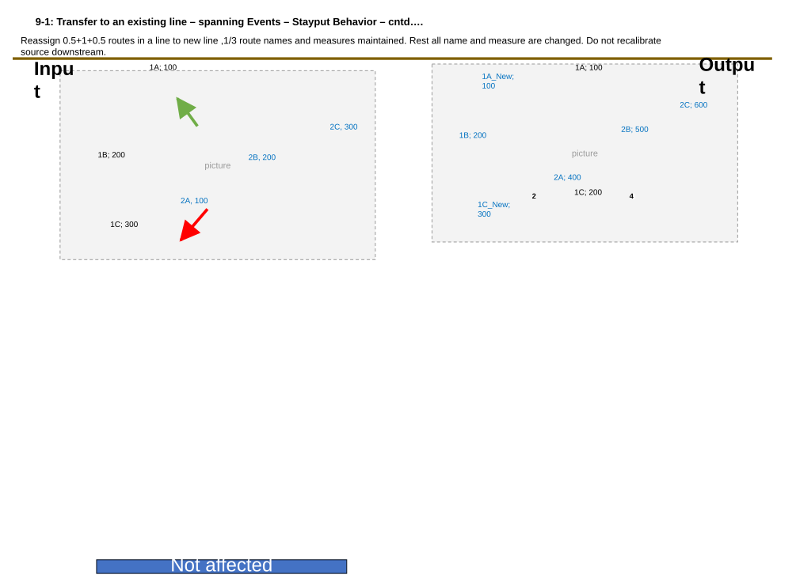

### TC-U21 — Transfer To an Existing Line – Spanning Events – Retire Behavior (case 9-2) <!-- src: S1 · slide 24 · case 9-2 -->

Reassign 0.5+1+0.5 routes in a line to new line ,1/3 route names and measures maintained. Rest all name and measure are changed. Do not recalibrate source downstream.

| Event ID | From Date | To Date | From Route ID | From M | To Route ID | To M | Location Error |
| --- | --- | --- | --- | --- | --- | --- | --- |
| S1 | 1/1/2000 | <Null> | 1A | 2 | 1C | 4 | No Error |
| S2 | 1/1/2000 | <Null> | 1A | 2 | 1B | 1 | No Error |
| S3 | 1/1/2000 | <Null> | 1B | 1 | 1C | 4 | No Error |
| S4 | 1/1/2000 | <Null> | 1A | 3 | 1C | 2 | No Error |
| S5 | 1/1/2000 | <Null> | 1C | 0 | 1C | 4 | No Error |
| S6 | 1/1/2000 | <Null> | 1C | 3 | 1C | 4 | No Error |
| S7 | 1/1/2000 | <Null> | 1C | 1 | 1C | 3 | No Error |
| S8 | 1/1/2000 | <Null> | 1C | 0 | 1C | 1 | No Error |
| S9 | 1/1/2000 | <Null> | 1B | 0 | 1B | 2 | No Error |
| S10 | 1/1/2000 | <Null> | 1A | 2 | 1A | 2.5 | No Error |
| S11 | 1/1/2000 | <Null> | 1A | 2.5 | 1A | 3.5 | No Error |
| S12 | 1/1/2000 | <Null> | 1A | 3.5 | 1A | 4 | No Error |
|  |  |  |  |  |  |  |  |
| E1 | 1/1/2000 | <Null> | 2A | 4 | 2C | 1 | No Error |

| Event ID | From Date | To Date | From Route ID | From M | To Route ID | To M | Location Error |
| --- | --- | --- | --- | --- | --- | --- | --- |
| S1 | 1/1/2000 | 1/1/2023 | 1A | 2 | 1C | 4 | No Error |
| S2 | 1/1/2000 | 1/1/2023 | 1A | 2 | 1B | 1 | No Error |
| S3 | 1/1/2000 | 1/1/2023 | 1B | 1 | 1C | 4 | No Error |
| S4 | 1/1/2000 | 1/1/2023 | 1A | 3 | 1C | 2 | No Error |
| S5 | 1/1/2000 | 1/1/2023 | 1C | 0 | 1C | 4 | No Error |
| S6 | 1/1/2000 | <Null> | 1C | 3 | 1C | 4 | No Error |
| S7 | 1/1/2000 | 1/1/2023 | 1C | 1 | 1C | 3 | No Error |
| S8 | 1/1/2000 | 1/1/2023 | 1C | 0 | 1C | 1 | No Error |
| S9 | 1/1/2000 | 1/1/2023 | 1B | 0 | 1B | 2 | No Error |
| S10 | 1/1/2000 | <Null> | 1A | 2 | 1A | 2.5 | No Error |
| S11 | 1/1/2000 | 1/1/2023 | 1A | 2.5 | 1A | 3.5 | No Error |
| S12 | 1/1/2000 | 1/1/2023 | 1A | 3.5 | 1A | 4 | No Error |

| Effective Date | 1/1/2023 |
| --- | --- |
| Source RD | No |

[figure: 1A_New; 100 · 1B; 200 · 1C_New; 300 · 2A; 400 · 2B;500 · 2C; 600 · 1A; 100 · 1C; 200 · 1C; 300 · 2A, 100 · 2B, 200 · 2C, 300 · Input · Output · Not affected]

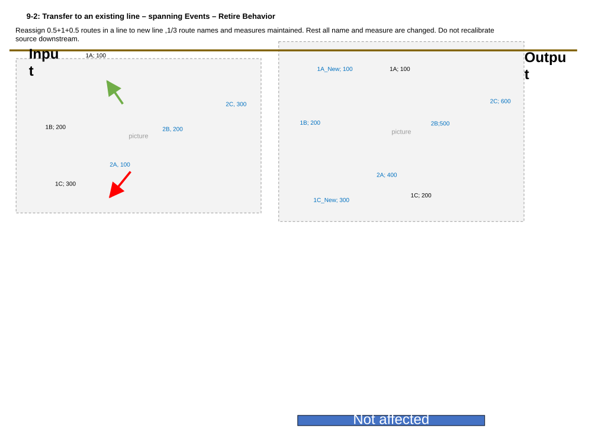

### TC-U22 — Transfer To an Existing Line – Spanning Events (case 10) <!-- src: S1 · slide 25 · case 10 -->

- **Case:** Transfer to an existing line – spanning Events – only Routes & Route tables shown - StayPut

Reassign 0.5+1+0.5 routes in a line to new line ,1/3 route name and measure maintained. Rest all name and measure are changed. Do not recalibrate source downstream. Routes have time slices. Effective date : 1/1/2015

| Route Name | Line Name | Line Order | From Date | To Date | From M | To M |
| --- | --- | --- | --- | --- | --- | --- |
| 1A | L1 | 100 | 1/1/2000 | 1/1/2020 | 2 | 4 |
| 1B | L1 | 200 | 1/1/2005 | 1/1/2020 | 0 | 2 |
| 1C | L1 | 300 | 1/1/2010 | 1/1/2020 | 0 | 4 |
| 2A | L2 | 100 | 1/1/2000 | <Null> | 4 | 5 |
| 2B | L2 | 200 | 1/1/2000 | <Null> | 5 | 8 |
| 2C | L2 | 300 | 1/1/2000 | <Null> | 0 | 1 |

| Route Name | Line Name | Line Order | From Date | To Date | From M | To M |
| --- | --- | --- | --- | --- | --- | --- |
| 1A | L1 | 100 | 1/1/2000 | 1/1/2015 | 2 | 4 |
| 1B | L1 | 200 | 1/1/2005 | 1/1/2015 | 0 | 2 |
| 1C | L1 | 300 | 1/1/2010 | 1/1/2015 | 0 | 4 |
| 2A | L2 | 100 | 1/1/2000 | 1/1/2015 | 4 | 5 |
| 2B | L2 | 200 | 1/1/2000 | 1/1/2015 | 5 | 8 |
| 2C | L2 | 300 | 1/1/2000 | 1/1/2015 | 0 | 1 |
| 1A | L1 | 100 | 1/1/2015 | 1/1/2020 | 2 | 3 |
| 1C | L1 | 200 | 1/1/2015 | 1/1/2020 | 2 | 4 |
| 1A_New | L2 | 100 | 1/1/2015 | 1/1/2020 | 1 | 2 |
| 1B | L2 | 200 | 1/1/2015 | 1/1/2020 | 0 | 2 |
| 1C_New | L2 | 300 | 1/1/2015 | 1/1/2020 | 5 | 6 |
| 2A | L2 | 400 | 1/1/2015 | <Null> | 4 | 5 |
| 2B | L2 | 500 | 1/1/2015 | <Null> | 5 | 8 |
| 2C | L2 | 600 | 1/1/2015 | <Null> | 0 | 1 |

| Effective Date | 1/1/2015 |
| --- | --- |
| Source RD | No |

[figure: 1A; 100 · 1B; 200 · 1C; 200 · 2A; 400 · 2B; 500 · 2C; 600 · 1A_New; 100 · 1C_New; 300 · 1C; 300 · 2A, 100 · 2B, 200 · 2C, 300 · Input · Output]

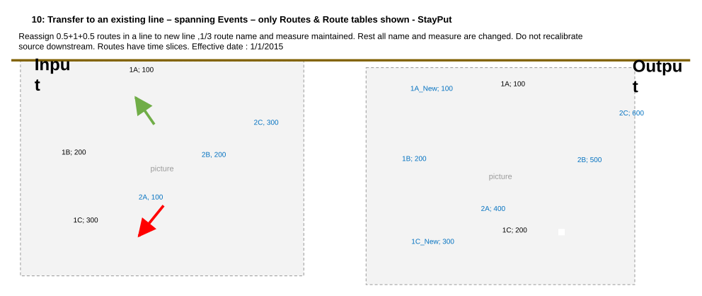

### TC-U23 — Transfer To an Existing Line – Spanning Events – Stayput Behavior – Cntd…. (case 10-1) <!-- src: S1 · slide 26 · case 10-1 -->

Reassign 0.5+1+0.5 routes in a line to new line ,1/3 route name and measure maintained. Rest all name and measure are changed. Do not recalibrate source downstream. Routes have time slices. Effective date : 1/1/2015

| Event ID | From Date | To Date | From Route ID | From M | To Route ID | To M | Location Error |
| --- | --- | --- | --- | --- | --- | --- | --- |
| S1 | 1/1/2010 | 1/1/2020 | 1A | 2 | 1C | 4 | No Error |
| S2 | 1/1/2005 | 1/1/2020 | 1A | 2 | 1B | 1 | No Error |
| S3 | 1/1/2010 | 1/1/2020 | 1B | 1 | 1C | 4 | No Error |
| S4 | 1/1/2010 | 1/1/2020 | 1A | 2 | 1C | 2 | No Error |
| S5 | 1/1/2010 | 1/1/2020 | 1C | 0 | 1C | 4 | No Error |
| S6 | 1/1/2010 | 1/1/2020 | 1C | 3 | 1C | 4 | No Error |
| S7 | 1/1/2010 | 1/1/2020 | 1C | 1 | 1C | 3 | No Error |
| S8 | 1/1/2010 | 1/1/2020 | 1C | 0 | 1C | 1 | No Error |
| S9 | 1/1/2005 | 1/1/2020 | 1B | 0 | 1B | 2 | No Error |
|  |  |  |  |  |  |  |  |
| E1 | 1/1/2000 | <Null> | 2A | 4 | 2C | 1 | No Error |

| Event ID | From Date | To Date | From Route ID | From M | To Route ID | To M | Location Error |
| --- | --- | --- | --- | --- | --- | --- | --- |
| S1 | 1/1/2010 | 1/1/2015 | 1A | 2 | 1C | 4 | No Error |
| S1 | 1/1/2015 | 1/1/2020 | 1A | 2 | 1A | 3 | No Error |
| S1 | 1/1/2015 | 1/1/2020 | 1C | 2 | 1C | 4 | No Error |
| S2 | 1/1/2005 | 1/1/2015 | 1A | 2 | 1B | 1 | No Error |
| S2 | 1/1/2015 | 1/1/2020 | 1A | 2 | 1A | 3 | No Error |
| S3 | 1/1/2010 | 1/1/2015 | 1B | 1 | 1C | 4 | No Error |
| S3 | 1/1/2015 | 1/1/2020 | 1C | 2 | 1C | 4 | No Error |
| S4 | 1/1/2010 | 1/1/2015 | 1A | 2 | 1C | 2 | No Error |
| S5 | 1/1/2010 | 1/1/2015 | 1C | 0 | 1C | 4 | No Error |
| S5 | 1/1/2015 | 1/1/2020 | 1C | 2 | 1C | 4 | No Error |
| S6 | 1/1/2010 | 1/1/2020 | 1C | 3 | 1C | 4 | No Error |
| S7 | 1/1/2010 | 1/1/2015 | 1C | 1 | 1C | 3 | No Error |
| S7 | 1/1/2015 | 1/1/2020 | 1C | 2 | 1C | 3 | No Error |
| S8 | 1/1/2010 | 1/1/2015 | 1C | 0 | 1C | 1 | No Error |
| S9 | 1/1/2005 | 1/1/2015 | 1B | 0 | 1B | 2 | No Error |

| Effective Date | 1/1/2015 |
| --- | --- |
| Source RD | No |

[figure: 1A; 100 · 1B; 200 · 1C; 200 · 2A; 300 · 2B; 400 · 2C; 500 · 1A_New; 100 · 1C_New; 100 · 1C; 300 · 2A, 100 · 2B, 200 · 2C, 300 · Input · Output · Not affected]

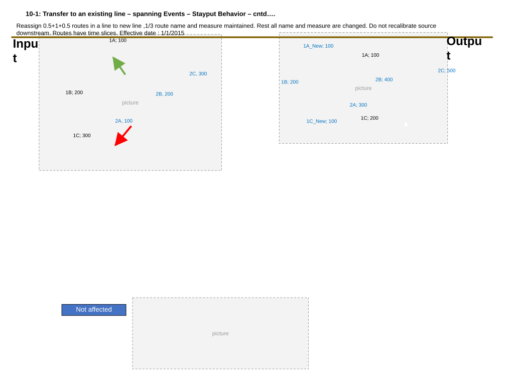

### TC-U24 — Transfer To an Existing Line – Spanning Events – Retire Behavior (case 10-2) <!-- src: S1 · slide 27 · case 10-2 -->

Reassign 0.5+1+0.5 routes in a line to new line ,1/3 route name and measure maintained. Rest all name and measure are changed. Do not recalibrate source downstream. Routes have time slices. Effective date : 1/1/2015

| Event ID | From Date | To Date | From Route ID | From M | To Route ID | To M | Location Error |
| --- | --- | --- | --- | --- | --- | --- | --- |
| S1 | 1/1/2010 | 1/1/2020 | 1A | 2 | 1C | 4 | No Error |
| S2 | 1/1/2005 | 1/1/2020 | 1A | 2 | 1B | 1 | No Error |
| S3 | 1/1/2010 | 1/1/2020 | 1B | 1 | 1C | 2 | No Error |
| S4 | 1/1/2010 | 1/1/2020 | 1A | 2 | 1C | 2 | No Error |
| S5 | 1/1/2010 | 1/1/2020 | 1C | 0 | 1C | 4 | No Error |
| S6 | 1/1/2010 | 1/1/2020 | 1C | 3 | 1C | 4 | No Error |
| S7 | 1/1/2010 | 1/1/2020 | 1C | 1 | 1C | 3 | No Error |
| S8 | 1/1/2010 | 1/1/2020 | 1C | 0 | 1C | 1 | No Error |
| S9 | 1/1/2005 | 1/1/2020 | 1B | 0 | 1B | 2 | No Error |
|  |  |  |  |  |  |  |  |
| E1 | 1/1/2000 | <Null> | 2A | 4 | 2C | 1 | No Error |

| Event ID | From Date | To Date | From Route ID | From M | To Route ID | To M | Location Error |
| --- | --- | --- | --- | --- | --- | --- | --- |
| S1 | 1/1/2010 | 1/1/2015 | 1A | 2 | 1C | 4 | No Error |
| S2 | 1/1/2005 | 1/1/2015 | 1A | 2 | 1B | 1 | No Error |
| S3 | 1/1/2010 | 1/1/2015 | 1B | 1 | 1C | 2 | No Error |
| S4 | 1/1/2010 | 1/1/2015 | 1A | 2 | 1C | 2 | No Error |
| S5 | 1/1/2010 | 1/1/2015 | 1C | 0 | 1C | 4 | No Error |
| S6 | 1/1/2010 | <Null> | 1C | 3 | 1C | 4 | No Error |
| S7 | 1/1/2010 | 1/1/2015 | 1C | 1 | 1C | 3 | No Error |
| S8 | 1/1/2010 | 1/1/2015 | 1C | 0 | 1C | 1 | No Error |
| S9 | 1/1/2005 | 1/1/2015 | 1B | 0 | 1B | 2 | No Error |

| Effective Date | 1/1/2015 |
| --- | --- |
| Source RD | No |

[figure: 1A; 100 · 1B; 200 · 1C; 200 · 2A; 300 · 2B; 400 · 2C; 500 · 1A_New; 100 · 1C_New; 100 · 1C; 300 · 2A, 100 · 2B, 200 · 2C, 300 · Input · Output · Not affected]

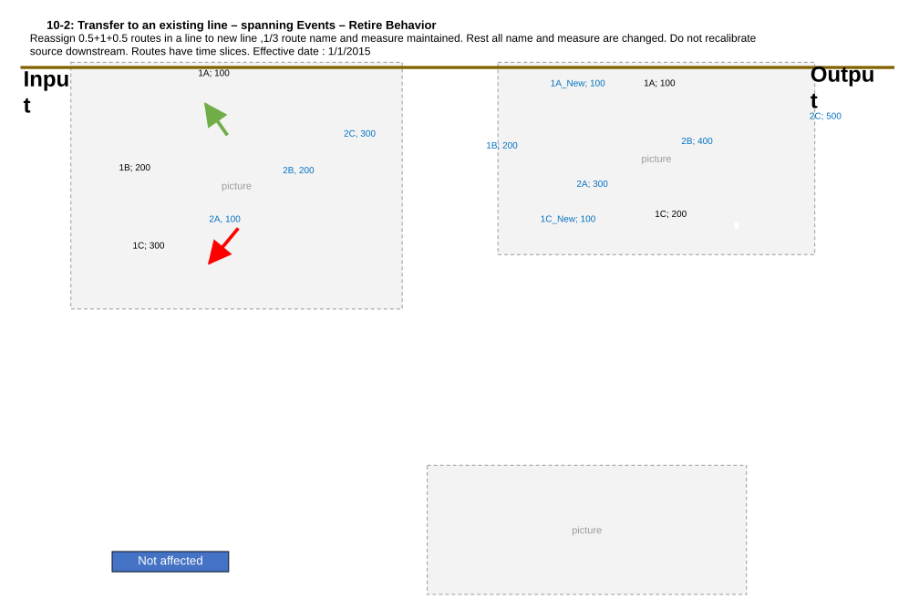

### TC-U25 — Transfer To an Existing Line – Spanning Events (case 11) <!-- src: S1 · slide 28 · case 11 -->

- **Case:** Transfer to an existing line – spanning Events – only Routes & Route tables shown – No EB shown in output diagram

Reassign 0.5+1+0.5 routes in a line to new line ,1/3 route name and measure maintained. Rest all name and measure are changed. Do not recalibrate source downstream. Route 1B & Route IC  is in opposite direction to Route 1A.

| Route Name | Line Name | Line Order | From Date | To Date | From M | To M |
| --- | --- | --- | --- | --- | --- | --- |
| 1A | L1 | 100 | 1/1/2000 | <Null> | 2 | 4 |
| 1B | L1 | 200 | 1/1/2000 | <Null> | 0 | 2 |
| 1C | L1 | 300 | 1/1/2000 | <Null> | 0 | 4 |
| 2A | L2 | 100 | 1/1/2000 | <Null> | 4 | 5 |
| 2B | L2 | 200 | 1/1/2000 | <Null> | 5 | 8 |
| 2C | L2 | 300 | 1/1/2000 | <Null> | 0 | 1 |

| Route Name | Line Name | Line Order | From Date | To Date | From M | To M |
| --- | --- | --- | --- | --- | --- | --- |
| 1A | L1 | 100 | 1/1/2000 | 1/1/2023 | 2 | 4 |
| 1B | L1 | 200 | 1/1/2000 | 1/1/2023 | 0 | 2 |
| 1C | L1 | 300 | 1/1/2000 | 1/1/2023 | 0 | 4 |
| 2A | L2 | 100 | 1/1/2000 | 1/1/2023 | 3 | 5 |
| 2B | L2 | 200 | 1/1/2000 | 1/1/2023 | 4 | 8 |
| 2C | L2 | 300 | 1/1/2000 | 1/1/2023 | 0 | 2 |
| 1A | L1 | 100 | 1/1/2023 | <Null> | 2 | 3 |
| 1C | L1 | 200 | 1/1/2023 | <Null> | 0 | 2 |
| 1A_New | L2 | 100 | 1/1/2023 | <Null> | 1 | 2 |
| 1B | L2 | 200 | 1/1/2023 | <Null> | 0 | 2 |
| 1C_New | L2 | 300 | 1/1/2023 | <Null> | 5 | 6 |
| 2A | L2 | 400 | 1/1/2023 | <Null> | 4 | 5 |
| 2B | L2 | 500 | 1/1/2023 | <Null> | 5 | 8 |
| 2C | L2 | 600 | 1/1/2023 | <Null> | 0 | 1 |

| Effective Date | 1/1/2023 |
| --- | --- |
| Source RD | No |

[figure: 1A; 100 · 1B; 200 · 1C; 300 · 2A, 100 · 2B, 200 · 2C, 300 · 1C; 200 · 2A; 400 · 2B; 500 · 2C; 600 · 1A_New; 100 · 1C_New; 300 · Input · Output]

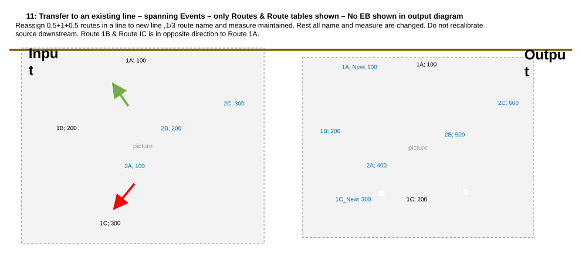

### TC-U26 — Transfer To an Existing Line – Spanning Events – Stayput Behavior (case 11-1) <!-- src: S1 · slide 29 · case 11-1 -->

Reassign 0.5+1+0.5 routes in a line to new line ,1/3 route name and measure maintained. Rest all name and measure are changed. Do not recalibrate source downstream. Route 1B & Route IC  is in opposite direction to Route 1A.

| Event ID | From Date | To Date | From Route ID | From M | To Route ID | To M | Location Error |
| --- | --- | --- | --- | --- | --- | --- | --- |
| S1 | 1/1/2000 | <Null> | 1A | 2 | 1C | 4 | No Error |
| S2 | 1/1/2000 | <Null> | 1A | 2 | 1B | 1 | No Error |
| S3 | 1/1/2000 | <Null> | 1B | 1 | 1C | 4 | No Error |
| S4 | 1/1/2000 | <Null> | 1A | 3 | 1C | 2 | No Error |
| S5 | 1/1/2000 | <Null> | 1C | 0 | 1C | 4 | No Error |
| S6 | 1/1/2000 | <Null> | 1C | 0 | 1C | 1 | No Error |
| S7 | 1/1/2000 | <Null> | 1C | 1 | 1C | 3 | No Error |
| S8 | 1/1/2000 | <Null> | 1C | 3 | 1C | 4 | No Error |
| S9 | 1/1/2000 | <Null> | 1B | 0 | 1B | 2 | No Error |
| S10 | 1/1/2000 | <Null> | 1A | 2 | 1A | 2.5 | No Error |
| S11 | 1/1/2000 | <Null> | 1A | 2.5 | 1A | 3.5 | No Error |
| S12 | 1/1/2000 | <Null> | 1A | 3.5 | 1A | 4 | No Error |

| Event ID | From Date | To Date | From Route ID | From M | To Route ID | To M | Location Error |
| --- | --- | --- | --- | --- | --- | --- | --- |
| S1 | 1/1/2000 | 1/1/2023 | 1A | 2 | 1C | 4 | No Error |
| S1 | 1/1/2023 | <Null> | 1A | 2 | 1A | 3 | No Error |
| S1 | 1/1/2023 | <Null> | 1C | 0 | 1C | 2 | No Error |
| S2 | 1/1/2000 | 1/1/2023 | 1A | 2 | 1B | 1 | No Error |
| S2 | 1/1/2023 | <Null> | 1A | 2 | 1A | 3 | No Error |
| S3 | 1/1/2000 | 1/1/2023 | 1B | 1 | 1C | 4 | No Error |
| S3 | 1/1/2023 | <Null> | 1C | 0 | 1C | 2 | No Error |
| S4 | 1/1/2000 | 1/1/2023 | 1A | 3 | 1C | 2 | No Error |
| S5 | 1/1/2000 | 1/1/2023 | 1C | 0 | 1C | 4 | No Error |
| S5 | 1/1/2023 | <Null> | 1C | 0 | 1C | 2 | No Error |
| S6 | 1/1/2000 | <Null> | 1C | 0 | 1C | 1 | No Error |
| S7 | 1/1/2000 | 1/1/2023 | 1C | 1 | 1C | 3 | No Error |
| S7 | 1/1/2023 | <Null> | 1C | 1 | 1C | 2 | No Error |
| S8 | 1/1/2000 | 1/1/2023 | 1C | 3 | 1C | 4 | No Error |
| S9 | 1/1/2000 | 1/1/2023 | 1B | 0 | 1B | 2 | No Error |
| S10 | 1/1/2000 | <Null> | 1A | 2 | 1A | 2.5 | No Error |
| S11 | 1/1/2000 | 1/1/2023 | 1A | 2.5 | 1A | 3.5 | No Error |
| S11 | 1/1/2023 | <Null> | 1A | 2.5 | 1A | 3 | No Error |
| S12 | 1/1/2000 | 1/1/2023 | 1A | 3.5 | 1A | 4 | No Error |

| Effective Date | 1/1/2023 |
| --- | --- |
| Source RD | No |

| Route Name | Line Name | Line Order | From Date | To Date | From M | To M |
| --- | --- | --- | --- | --- | --- | --- |
| 1A | L1 | 100 | 1/1/2000 | <Null> | 2 | 4 |
| 1B | L1 | 200 | 1/1/2000 | <Null> | 0 | 2 |
| 1C | L1 | 300 | 1/1/2000 | <Null> | 0 | 4 |
| 2A | L2 | 100 | 1/1/2000 | <Null> | 4 | 5 |
| 2B | L2 | 200 | 1/1/2000 | <Null> | 5 | 8 |
| 2C | L2 | 300 | 1/1/2000 | <Null> | 0 | 1 |

[figure: 1A; 100 · 1B; 200 · 1C; 300 · 2A, 100 · 2B, 200 · 2C, 300 · Input · Output · 1C; 200 · 2A; 400 · 2B; 500 · 2C; 600 · 1C_New; 300 · 1A_New; 100]

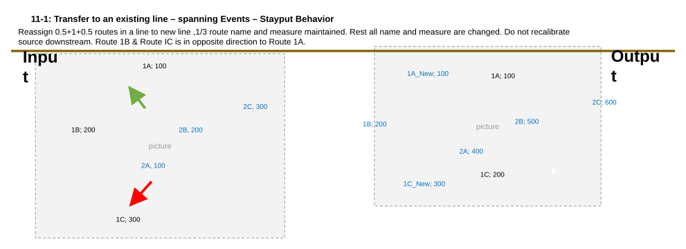

### TC-U27 — Transfer to an existing line – spanning Events – Retire (case 11-2) <!-- src: S2 · slide 30 · case 11-2 -->

Reassign 0.5+1+0.5 routes in a line to new line ,1/3 route name and measure maintained. Rest all name and measure are changed. Do not recalibrate source downstream. Route 1B & Route IC  is in opposite direction to Route 1A.

| Event ID | From Date | To Date | From Route ID | From M | To Route ID | To M | Location Error |
| --- | --- | --- | --- | --- | --- | --- | --- |
| S1 | 1/1/2000 | <Null> | 1A | 2 | 1C | 4 | No Error |
| S2 | 1/1/2000 | <Null> | 1A | 2 | 1B | 1 | No Error |
| S3 | 1/1/2000 | <Null> | 1B | 1 | 1C | 4 | No Error |
| S4 | 1/1/2000 | <Null> | 1A | 3 | 1C | 2 | No Error |
| S5 | 1/1/2000 | <Null> | 1C | 0 | 1C | 4 | No Error |
| S6 | 1/1/2000 | <Null> | 1C | 0 | 1C | 1 | No Error |
| S7 | 1/1/2000 | <Null> | 1C | 1 | 1C | 3 | No Error |
| S8 | 1/1/2000 | <Null> | 1C | 3 | 1C | 4 | No Error |
| S9 | 1/1/2000 | <Null> | 1B | 0 | 1B | 2 | No Error |
| S10 | 1/1/2000 | <Null> | 1A | 2 | 1A | 2.5 | No Error |
| S11 | 1/1/2000 | <Null> | 1A | 2.5 | 1A | 3.5 | No Error |
| S12 | 1/1/2000 | <Null> | 1A | 3.5 | 1A | 4 | No Error |

| Event ID | From Date | To Date | From Route ID | From M | To Route ID | To M | Location Error |
| --- | --- | --- | --- | --- | --- | --- | --- |
| S1 | 1/1/2000 | 1/1/2023 | 1A | 2 | 1C | 4 | No Error |
| S2 | 1/1/2000 | 1/1/2023 | 1A | 2 | 1B | 1 | No Error |
| S3 | 1/1/2000 | 1/1/2023 | 1B | 1 | 1C | 4 | No Error |
| S4 | 1/1/2000 | 1/1/2023 | 1A | 3 | 1C | 2 | No Error |
| S5 | 1/1/2000 | 1/1/2023 | 1C | 0 | 1C | 4 | No Error |
| S6 | 1/1/2000 | <Null> | 1C | 0 | 1C | 1 | No Error |
| S7 | 1/1/2000 | 1/1/2023 | 1C | 1 | 1C | 3 | No Error |
| S8 | 1/1/2000 | 1/1/2023 | 1C | 0 | 1C | 1 | No Error |
| S9 | 1/1/2000 | 1/1/2023 | 1B | 0 | 1B | 2 | No Error |
| S10 | 1/1/2000 | <Null> | 1A | 2 | 1A | 2.5 | No Error |
| S11 | 1/1/2000 | 1/1/2023 | 1A | 2.5 | 1A | 3.5 | No Error |
| S12 | 1/1/2000 | 1/1/2023 | 1A | 3.5 | 1A | 4 | No Error |

| Effective Date | 1/1/2023 |
| --- | --- |
| Source RD | No |

| Route Name | Line Name | Line Order | From Date | To Date | From M | To M |
| --- | --- | --- | --- | --- | --- | --- |
| 1A | L1 | 100 | 1/1/2000 | <Null> | 2 | 4 |
| 1B | L1 | 200 | 1/1/2000 | <Null> | 0 | 2 |
| 1C | L1 | 300 | 1/1/2000 | <Null> | 0 | 4 |
| 2A | L2 | 100 | 1/1/2000 | <Null> | 4 | 5 |
| 2B | L2 | 200 | 1/1/2000 | <Null> | 5 | 8 |
| 2C | L2 | 300 | 1/1/2000 | <Null> | 0 | 1 |

[figure: 1A; 100 · 1B; 200 · 1C; 300 · 2A, 100 · 2B, 200 · 2C, 300 · Input · Output · 2A; 400 · 2B; 500 · 2C; 600 · 1A_New; 100 · 1C_New; 300]

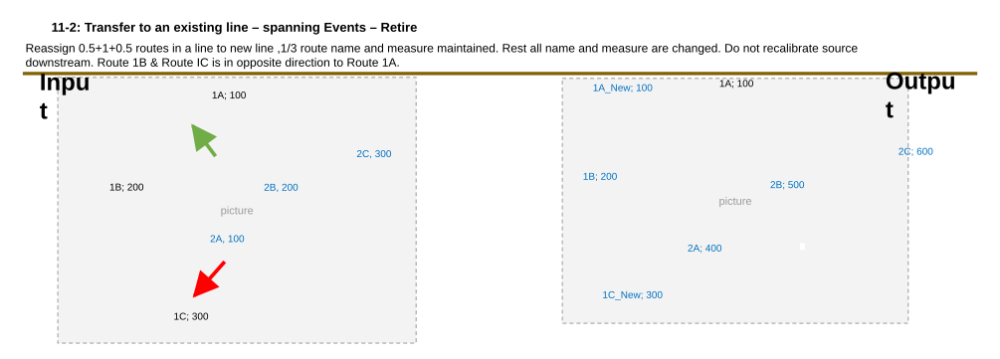

### TC-U28 — Transfer to an existing line – spanning Events – Stayput (case 12-1) <!-- src: S2 · slide 31 · case 12-1 -->

Reassign a part of  complex route to adjacent line , transfer CP , change measures. Recalibrate downstream , calibrate to stayput

| Route Name | Line Name | Line Order | From Date | To Date | From M | To M |
| --- | --- | --- | --- | --- | --- | --- |
| 1A | L1 | 100 | 1/1/2000 | <Null> | 0 | 4 |
| 2A | L2 | 200 | 1/1/2000 | <Null> | 0 | 1 |

| Route Name | Line Name | Line Order | From Date | To Date | From M | To M |
| --- | --- | --- | --- | --- | --- | --- |
| 1A | L1 | 100 | 1/1/2000 | 1/1/2023 | 0 | 4 |
| 2A | L2 | 200 | 1/1/2000 | 1/1/2023 | 0 | 1 |
| 1A | L1 | 100 | 1/1/2023 | <Null> | 0 | 2 |
| 1A_New | L2 | 100 | 1/1/2023 | <Null> | 0 | 4 |
| 2A | L2 | 200 | 1/1/2023 | <Null> | 0 | 1 |

| Effective Date | 1/1/2023 |
| --- | --- |
| Source RD | Yes |
| Transfer CP | Yes |

| Event ID | From Date | To Date | From Route ID | From M | To Route ID | To M | Location Error |
| --- | --- | --- | --- | --- | --- | --- | --- |
| S1 | 1/1/2000 | <Null> | 1A | 0 | 1A | 4 | No Error |
| S2 | 1/1/2000 | <Null> | 1A | 0 | 1A | 1.33 | No Error |
| S3 | 1/1/2000 | <Null> | 1A | 1.33 | 1A | 1.67 | No Error |
| S4 | 1/1/2000 | <Null> | 1A | 0 | 1A | 2 | No Error |
| S5 | 1/1/2000 | <Null> | 1A | 3 | 1A | 4 | No Error |
| S6 | 1/1/2000 | <Null> | 1A | 2.67 | 1A | 3 | No Error |

| Event ID | From Date | To Date | From Route ID | From M | To Route ID | To M | Location Error |
| --- | --- | --- | --- | --- | --- | --- | --- |
| S1 | 1/1/2000 | 1/1/2023 | 1A | 0 | 1A | 4 | No Error |
| S1 | 1/1/2023 | <Null> | 1A | 0 | 1A | 2 | No Error |
| S2 | 1/1/2000 | 1/1/2023 | 1A | 0 | 1A | 1.33 | No Error |
| S3 | 1/1/2000 | 1/1/2023 | 1A | 1.33 | 1A | 1.67 | No Error |
| S3 | 1/1/2023 | <Null> | 1A | 0 | 1A | 0.67 | No Error |
| S4 | 1/1/2000 | 1/1/2023 | 1A | 0 | 1A | 2 | No Error |
| S5 | 1/1/2000 | 1/1/2023 | 1A | 3 | 1A | 4 | No Error |
| S5 | 1/1/2023 | <Null> | 1A | 1 | 1A | 2 | No Error |
| S6 | 1/1/2000 | 1/1/2023 | 1A | 2.67 | 1A | 3 | No Error |
| S6 | 1/1/2023 | <Null | 1A | 0.67 | 1A | 1 | No Error |

[figure: 1A; 100 · 2A; 200 · 1A_New; 100 · Input · Output · 2A; 100 · 0 · 0.67 · 1 · 1.5 · 2]

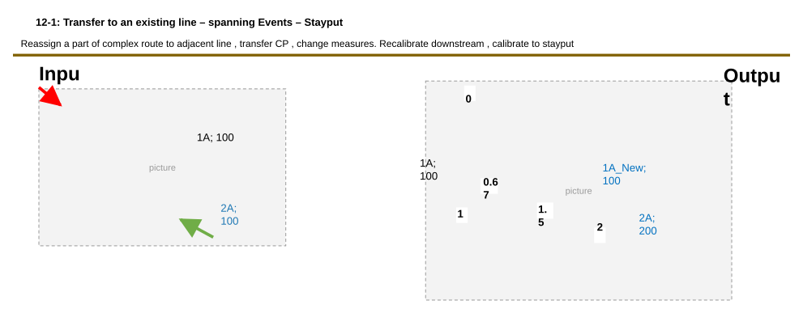

### TC-U29 — Transfer to an existing line – spanning Events – Retire (case 12-2) <!-- src: S2 · slide 32 · case 12-2 -->

Reassign a part of  complex route to adjacent line , transfer CP , change measures.  Do not Recalibrate downstream, Recalibrate set to retire

| Route Name | Line Name | Line Order | From Date | To Date | From M | To M |
| --- | --- | --- | --- | --- | --- | --- |
| 1A | L1 | 100 | 1/1/2000 | <Null> | 0 | 4 |
| 2A | L2 | 200 | 1/1/2000 | <Null> | 0 | 1 |

| Route Name | Line Name | Line Order | From Date | To Date | From M | To M |
| --- | --- | --- | --- | --- | --- | --- |
| 1A | L1 | 100 | 1/1/2000 | 1/1/2023 | 0 | 4 |
| 2A | L2 | 200 | 1/1/2000 | 1/1/2023 | 0 | 1 |
| 1A | L1 | 100 | 1/1/2023 | <Null> | 2 | 4 |
| 1A_New | L2 | 100 | 1/1/2023 | <Null> | 0 | 4 |
| 2A | L2 | 200 | 1/1/2023 | <Null> | 0 | 1 |

| Effective Date | 1/1/2023 |
| --- | --- |
| Source RD | No |
| Transfer CP | Yes |

| Event ID | From Date | To Date | From Route ID | From M | To Route ID | To M | Location Error |
| --- | --- | --- | --- | --- | --- | --- | --- |
| S1 | 1/1/2000 | <Null> | 1A | 0 | 1A | 4 | No Error |
| S2 | 1/1/2000 | <Null> | 1A | 0 | 1A | 1.33 | No Error |
| S3 | 1/1/2000 | <Null> | 1A | 1.33 | 1A | 1.67 | No Error |
| S4 | 1/1/2000 | <Null> | 1A | 0 | 1A | 2 | No Error |
| S5 | 1/1/2000 | <Null> | 1A | 3 | 1A | 4 | No Error |
| S6 | 1/1/2000 | <Null> | 1A | 2.67 | 1A | 3 | No Error |

| Event ID | From Date | To Date | From Route ID | From M | To Route ID | To M | Location Error |
| --- | --- | --- | --- | --- | --- | --- | --- |
| S1 | 1/1/2000 | 1/1/2023 | 1A | 0 | 1A | 4 | No Error |
| S2 | 1/1/2000 | 1/1/2023 | 1A | 0 | 1A | 1.33 | No Error |
| S3 | 1/1/2000 | 1/1/2023 | 1A | 1.33 | 1A | 1.67 | No Error |
| S4 | 1/1/2000 | 1/1/2023 | 1A | 0 | 1A | 2 | No Error |
| S5 | 1/1/2000 | <Null> | 1A | 3 | 1A | 4 | No Error |
| S6 | 1/1/2000 | <Null> | 1A | 2.67 | 1A | 3 | No Error |

[figure: 1A; 100 · 2A; 200 · 1A_New; 100 · Input · Output · 2A; 100]

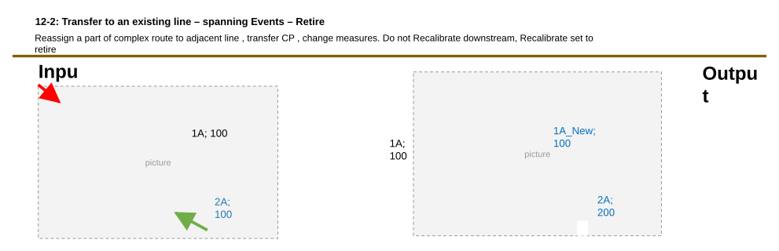

### TC-U30 — Transfer to an existing line – spanning Events – Stayput (case 13-1) <!-- src: S2 · slide 33 · case 13-1 -->

Reassign to fill the gap in a line by transferring route. No change in Measure, RouteName
.

| Route Name | Line Name | Line Order | From Date | To Date | From M | To M |
| --- | --- | --- | --- | --- | --- | --- |
| 2A | L2 | 100 | 1/1/2000 | <Null> | 3 | 5 |
| 2B | L2 | 200 | 1/1/2000 | <Null> | 5 | 8 |
| 2C | L2 | 300 | 1/1/2000 | <Null> | 0 | 2 |
| X1 | L3 | 100 | 1/1/2000 | <Null> | 2 | 6 |
| X2 | L3 | 200 | 1/1/2000 | <Null> | 24 | 28 |

| Route Name | Line Name | Line Order | From Date | To Date | From M | To M |
| --- | --- | --- | --- | --- | --- | --- |
| 2A | L2 | 100 | 1/1/2000 | 1/1/2023 | 3 | 5 |
| 2B | L2 | 200 | 1/1/2000 | 1/1/2023 | 5 | 8 |
| 2C | L2 | 300 | 1/1/2000 | 1/1/2023 | 0 | 2 |
| X1 | L3 | 100 | 1/1/2000 | 1/1/2023 | 2 | 6 |
| X2 | L3 | 200 | 1/1/2000 | 1/1/2023 | 24 | 28 |
| 2B | L2 | 100 | 1/1/2023 | <Null> | 5 | 8 |
| 2C | L2 | 200 | 1/1/2023 | <Null> | 0 | 2 |
| X1 | L3 | 100 | 1/1/2023 | <Null> | 2 | 6 |
| 2A | L3 | 200 | 1/1/2023 | <Null> | 3 | 5 |
| X2 | L3 | 300 | 1/1/2023 | <Null> | 24 | 28 |

| Effective Date | 1/1/2023 |
| --- | --- |
| Source RD | No |

| Event ID | From Date | To Date | From Route ID | From M | To Route ID | To M | Location Error |
| --- | --- | --- | --- | --- | --- | --- | --- |
| S1 | 1/1/2000 | <Null> | 2A | 3 | 2C | 2 | No Error |
| S2 | 1/1/2000 | <Null> | 2A | 4 | 2B | 6 | No Error |
| S3 | 1/1/2000 | <Null> | 2B | 7 | 2C | 2 | No Error |
| S4 | 1/1/2000 | <Null> | 1A | 3 | 1A | 4 | No Error |
| S5 | 1/1/2000 | <Null> | 1A | 3 | 1A | 5 | No Error |
|  |  |  |  |  |  |  |  |
| E1 | 1/1/2000 | <Null> | X1 | 2 | X2 | 28 | No Error |

| Event ID | From Date | To Date | From Route ID | From M | To Route ID | To M | Location Error |
| --- | --- | --- | --- | --- | --- | --- | --- |
| S1 | 1/1/2000 | 1/1/2023 | 2A | 3 | 2C | 2 | No Error |
| S1 | 1/1/2023 | <Null> | 2B | 5 | 2C | 2 | No Error |
| S2 | 1/1/2000 | 1/1/2023 | 2A | 4 | 2B | 6 | No Error |
| S2 | 1/1/2000 | <Null> | 2B | 5 | 2B | 6 | NO Error |
| S3 | 1/1/2000 | <Null> | 2B | 7 | 2C | 2 | No Error |
| S4 | 1/1/2000 | 1/1/2023 | 1A | 3 | 1A | 4 | No Error |
| S5 | 1/1/2000 | 1/1/2023 | 1A | 3 | 1A | 5 | No Error |
|  |  |  |  |  |  |  |  |
| E1 | 1/1/2000 | <Null> | X1 | 2 | X2 | 28 | No Error (?) |

[figure: Input · Output · 2A; 100 · 1A; 100 · 1B; 200 · 1C; 300 · 2B; 200 · 2C; 300 · X1; 100 · X2; 200 · X2; 300 · 2A; 200 · 2B;100 · 2C; 200]

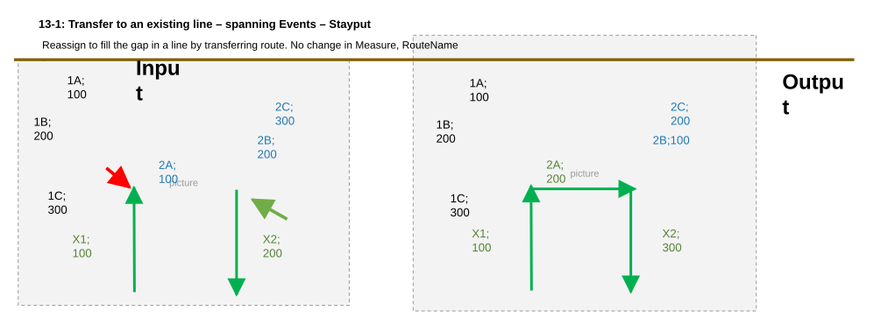

### TC-U31 — Transfer to an existing line – spanning Events – Retire (case 13-2) <!-- src: S2 · slide 34 · case 13-2 -->

Reassign to fill the gap in a line by transferring route. No change in Measure.
.

| Route Name | Line Name | Line Order | From Date | To Date | From M | To M |
| --- | --- | --- | --- | --- | --- | --- |
| 2A | L2 | 100 | 1/1/2000 | <Null> | 3 | 5 |
| 2B | L2 | 200 | 1/1/2000 | <Null> | 5 | 8 |
| 2C | L2 | 300 | 1/1/2000 | <Null> | 0 | 2 |
| X1 | L3 | 100 | 1/1/2000 | <Null> | 2 | 6 |
| X2 | L3 | 200 | 1/1/2000 | <Null> | 24 | 28 |

| Route Name | Line Name | Line Order | From Date | To Date | From M | To M |
| --- | --- | --- | --- | --- | --- | --- |
| 2A | L2 | 100 | 1/1/2000 | 1/1/2023 | 3 | 5 |
| 2B | L2 | 200 | 1/1/2000 | 1/1/2023 | 5 | 8 |
| 2C | L2 | 300 | 1/1/2000 | 1/1/2023 | 0 | 2 |
| X1 | L3 | 100 | 1/1/2000 | 1/1/2023 | 2 | 6 |
| X2 | L3 | 200 | 1/1/2000 | 1/1/2023 | 24 | 28 |
| 2B | L2 | 100 | 1/1/2023 | <Null> | 5 | 8 |
| 2C | L2 | 200 | 1/1/2023 | <Null> | 0 | 2 |
| X1 | L3 | 100 | 1/1/2023 | <Null> | 2 | 6 |
| 2A | L3 | 200 | 1/1/2023 | <Null> | 3 | 5 |
| X2 | L3 | 300 | 1/1/2023 | <Null> | 24 | 28 |

| Effective Date | 1/1/2023 |
| --- | --- |
| Source RD | No |

| Event ID | From Date | To Date | From Route ID | From M | To Route ID | To M | Location Error |
| --- | --- | --- | --- | --- | --- | --- | --- |
| S1 | 1/1/2000 | <Null> | 2A | 3 | 2C | 2 | No Error |
| S2 | 1/1/2000 | <Null> | 2A | 4 | 2B | 6 | No Error |
| S3 | 1/1/2000 | <Null> | 2B | 7 | 2C | 2 | No Error |
| S4 | 1/1/2000 | <Null> | 1A | 3 | 1A | 4 | No Error |
| S5 | 1/1/2000 | <Null> | 1A | 3 | 1A | 5 | No Error |
|  |  |  |  |  |  |  |  |
| E1 | 1/1/2000 | <Null> | X1 | 2 | X2 | 28 | No Error |

| Event ID | From Date | To Date | From Route ID | From M | To Route ID | To M | Location Error |
| --- | --- | --- | --- | --- | --- | --- | --- |
| S1 | 1/1/2000 | 1/1/2023 | 2A | 3 | 2C | 2 | No Error |
| S2 | 1/1/2000 | 1/1/2023 | 2A | 4 | 2B | 6 | No Error |
| S3 | 1/1/2000 | <Null> | 2B | 7 | 2C | 2 | No Error |
| S4 | 1/1/2000 | 1/1/2023 | 1A | 3 | 1A | 4 | No Error |
| S5 | 1/1/2000 | 1/1/2023 | 1A | 3 | 1A | 5 | No Error |
|  |  |  |  |  |  |  |  |
| E1 | 1/1/2000 | <Null> | X1 | 2 | X2 | 28 | No Error (?) |

[figure: Input · Output · 2A; 100 · 1A; 100 · 1B; 200 · 1C; 300 · 2B; 200 · 2C; 300 · X1; 100 · X2; 200 · X2; 300 · 2A; 200 · 2B;100 · 2C; 200]

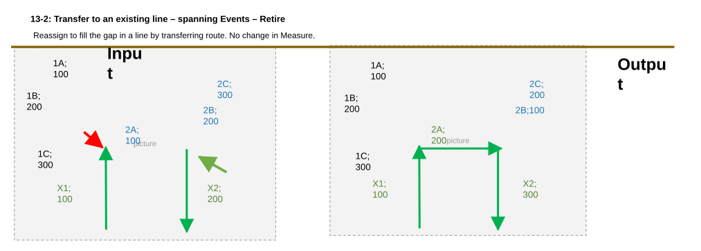

### TC-U32 — Transfer To an Existing Line – Non-Spanning Events – Stayput and Retire Behavior (case 14) <!-- src: S1 · slide 36 · case 14 -->

Reassign all the routes in a line to another line transferring routes and measures. ; keep original measures; keep original route name

| Route Name | Line Name | Line Order | From Date | To Date | From M | To M |
| --- | --- | --- | --- | --- | --- | --- |
| 1A | L1 | 100 | 1/1/2000 | <Null> | 2 | 4 |
| 1B | L1 | 200 | 1/1/2000 | <Null> | 0 | 2 |
| 1C | L1 | 300 | 1/1/2000 | <Null> | 0 | 4 |
| 2A | L2 | 100 | 1/1/2000 | <Null> | 3 | 5 |
| 2B | L2 | 200 | 1/1/2000 | <Null> | 4 | 8 |
| 2C | L2 | 300 | 1/1/2000 | <Null> | 0 | 2 |

| Event ID | From Date | To Date | From Route ID | From M | To Route ID | To M | Location Error |
| --- | --- | --- | --- | --- | --- | --- | --- |
| N1 | 1/1/2000 | <Null> | 1A | 2 | 1A | 4 | No Error |
| N2 | 1/1/2000 | <Null> | 1A | 2 | 1A | 3 | No Error |
| N3 | 1/1/2000 | <Null> | 1B | 0 | 1B | 2 | No Error |
| N4 | 1/1/2000 | <Null> | 1B | 0.5 | 1B | 1.5 | No Error |
| N5 | 1/1/2000 | <Null> | 1C | 0 | 1C | 4 | No Error |
| N6 | 1/1/2000 | <Null> | 1C | 0 | 1C | 2 | No Error |

| Route Name | Line Name | Line Order | From Date | To Date | From M | To M |
| --- | --- | --- | --- | --- | --- | --- |
| 1A | L1 | 100 | 1/1/2000 | 1/1/2023 | 2 | 4 |
| 1B | L1 | 200 | 1/1/2000 | 1/1/2023 | 0 | 2 |
| 1C | L1 | 300 | 1/1/2000 | 1/1/2023 | 0 | 4 |
| 2A | L2 | 100 | 1/1/2000 | 1/1/2023 | 3 | 5 |
| 2B | L2 | 200 | 1/1/2000 | 1/1/2023 | 4 | 8 |
| 2C | L2 | 300 | 1/1/2000 | 1/1/2023 | 0 | 2 |
| 1A | L2 | 100 | 1/1/2023 | <Null> | 2 | 4 |
| 1B | L2 | 200 | 1/1/2023 | <Null> | 0 | 2 |
| 1C | L2 | 300 | 1/1/2023 | <Null> | 0 | 4 |
| 2A | L2 | 400 | 1/1/2023 | <Null> | 3 | 5 |
| 2B | L2 | 500 | 1/1/2023 | <Null> | 4 | 8 |
| 2C | L2 | 600 | 1/1/2023 | <Null> | 0 | 2 |

| Event ID | From Date | To Date | From Route ID | From M | To Route ID | To M | Location Error |
| --- | --- | --- | --- | --- | --- | --- | --- |
| N1 | 1/1/2000 | 1/1/2023 | 1A | 2 | 1A | 4 | No Error |
| N2 | 1/1/2000 | 1/1/2023 | 1A | 2 | 1A | 3 | No Error |
| N3 | 1/1/2000 | 1/1/2023 | 1B | 0 | 1B | 2 | No Error |
| N4 | 1/1/2000 | 1/1/2023 | 1B | 0.5 | 1B | 1.5 | No Error |
| N5 | 1/1/2000 | 1/1/2023 | 1C | 0 | 1C | 4 | No Error |
| N6 | 1/1/2000 | 1/1/2023 | 1C | 0 | 1C | 2 | No Error |

| Effective Date | 1/1/2023 |
| --- | --- |

[figure: 1A; 100 · 1B; 200 · 1C; 300 · 2A, 100 · 2B, 200 · 2C, 300 · 4 · 3 · 5 · 8 · 0 · 2 · Input · Output · 2A; 400 · 2B; 500 · 2C; 600]

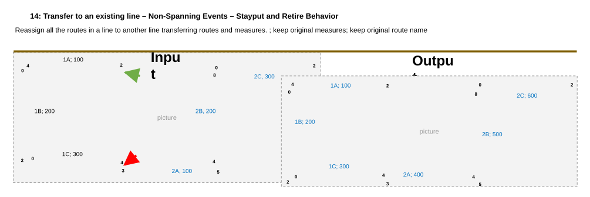

### TC-U33 — Transfer To an Existing Line – NonSpanning Events – Stayput and Retire Behavior <!-- src: S1 · slide 37 · case 15 -->

Reassign all the routes in a line to another line on right, transferring routes. Measures changed. Route Name changed.

| Route Name | Line Name | Line Order | From Date | To Date | From M | To M |
| --- | --- | --- | --- | --- | --- | --- |
| 1A | L1 | 100 | 1/1/2000 | <Null> | 2 | 4 |
| 1B | L1 | 200 | 1/1/2000 | <Null> | 0 | 2 |
| 1C | L1 | 300 | 1/1/2000 | <Null> | 0 | 4 |
| 2A | L2 | 100 | 1/1/2000 | <Null> | 3 | 5 |
| 2B | L2 | 200 | 1/1/2000 | <Null> | 4 | 8 |
| 2C | L2 | 300 | 1/1/2000 | <Null> | 0 | 2 |

| Event ID | From Date | To Date | From Route ID | From M | To Route ID | To M | Location Error |
| --- | --- | --- | --- | --- | --- | --- | --- |
| N1 | 1/1/2000 | <Null> | 1A | 2 | 1A | 4 | No Error |
| N2 | 1/1/2000 | <Null> | 1A | 2 | 1A | 3 | No Error |
| N3 | 1/1/2000 | <Null> | 1B | 0 | 1B | 2 | No Error |
| N4 | 1/1/2000 | <Null> | 1B | 0.5 | 1B | 1.5 | No Error |
| N5 | 1/1/2000 | <Null> | 1C | 0 | 1C | 4 | No Error |
| N6 | 1/1/2000 | <Null> | 1C | 0 | 1C | 2 | No Error |

| Route Name | Line Name | Line Order | From Date | To Date | From M | To M |
| --- | --- | --- | --- | --- | --- | --- |
| 1A | L1 | 100 | 1/1/2000 | 1/1/2023 | 2 | 4 |
| 1B | L1 | 200 | 1/1/2000 | 1/1/2023 | 0 | 2 |
| 1C | L1 | 300 | 1/1/2000 | 1/1/2023 | 0 | 4 |
| 2A | L2 | 100 | 1/1/2000 | 1/1/2023 | 3 | 5 |
| 2B | L2 | 200 | 1/1/2000 | 1/1/2023 | 4 | 8 |
| 2C | L2 | 300 | 1/1/2000 | 1/1/2023 | 0 | 2 |
| 1A_New | L2 | 100 | 1/1/2023 | <Null> | 5 | 8 |
| 1B_New | L2 | 200 | 1/1/2023 | <Null> | 2 | 4 |
| 1C_New | L2 | 300 | 1/1/2023 | <Null> | 4 | 9 |
| 2A | L2 | 400 | 1/1/2023 | <Null> | 3 | 5 |
| 2B | L2 | 500 | 1/1/2023 | <Null> | 4 | 8 |
| 2C | L2 | 600 | 1/1/2023 | <Null> | 0 | 2 |

| Event ID | From Date | To Date | From Route ID | From M | To Route ID | To M | Location Error |
| --- | --- | --- | --- | --- | --- | --- | --- |
| N1 | 1/1/2000 | 1/1/2023 | 1A | 2 | 1A | 4 | No Error |
| N2 | 1/1/2000 | 1/1/2023 | 1A | 2 | 1A | 3 | No Error |
| N3 | 1/1/2000 | 1/1/2023 | 1B | 0 | 1B | 2 | No Error |
| N4 | 1/1/2000 | 1/1/2023 | 1B | 0.5 | 1B | 1.5 | No Error |
| N5 | 1/1/2000 | 1/1/2023 | 1C | 0 | 1C | 4 | No Error |
| N6 | 1/1/2000 | 1/1/2023 | 1C | 0 | 1C | 2 | No Error |

| Effective Date | 1/1/2023 |
| --- | --- |

[figure: 1A; 100 · 1B; 200 · 1C; 300 · 2A, 100 · 2B, 200 · 2C, 300 · 4 · 3 · 5 · 8 · 0 · 2 · Input · Output · 1A_new; 100 · 1B_New 200 · 1C_New; 300 · 2A; 400 · 2B; 500 · 2C; 600 · 9]

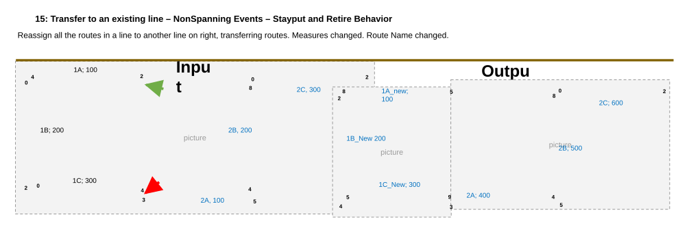

### TC-U34 — Transfer To an Existing Line – Non-spanning Events <!-- src: S1 · slide 38 · case 16-1 -->

- **Case:** Transfer to an existing line – Non-spanning Events – Stayput and Retire Behavior.

Reassign all the routes in a line to another line on right, transferring routes and measures. The effective date is same as source route’s From Date. keep original measures; keep original route name

| Route Name | Line Name | Line Order | From Date | To Date | From M | To M |
| --- | --- | --- | --- | --- | --- | --- |
| 1A | L1 | 100 | 1/1/2000 | <Null> | 2 | 4 |
| 1B | L1 | 200 | 1/1/2000 | <Null> | 0 | 2 |
| 1C | L1 | 300 | 1/1/2000 | <Null> | 0 | 4 |
| 2A | L2 | 100 | 1/1/2000 | <Null> | 3 | 5 |
| 2B | L2 | 200 | 1/1/2000 | <Null> | 4 | 8 |
| 2C | L2 | 300 | 1/1/2000 | <Null> | 0 | 2 |

| Route Name | Line Name | Line Order | From Date | To Date | From M | To M |
| --- | --- | --- | --- | --- | --- | --- |
| 1A | L2 | 100 | 1/1/2000 | <Null> | 2 | 4 |
| 1B | L2 | 200 | 1/1/2000 | <Null> | 0 | 2 |
| 1C | L2 | 300 | 1/1/2000 | <Null> | 0 | 4 |
| 2A | L2 | 400 | 1/1/2000 | <Null> | 3 | 5 |
| 2B | L2 | 500 | 1/1/2000 | <Null> | 4 | 8 |
| 2C | L2 | 600 | 1/1/2000 | <Null> | 0 | 2 |

| Effective Date | 1/1/2000 |
| --- | --- |

| Event ID | From Date | To Date | From Route ID | From M | To Route ID | To M | Location Error |
| --- | --- | --- | --- | --- | --- | --- | --- |
| N1 | 1/1/2000 | <Null> | 1A | 2 | 1A | 4 | No Error |
| N2 | 1/1/2000 | <Null> | 1A | 2 | 1A | 3 | No Error |
| N3 | 1/1/2000 | <Null> | 1B | 0 | 1B | 2 | No Error |
| N4 | 1/1/2000 | <Null> | 1B | 0.5 | 1B | 1.5 | No Error |
| N5 | 1/1/2000 | <Null> | 1C | 0 | 1C | 4 | No Error |
| N6 | 1/1/2000 | <Null> | 1C | 0 | 1C | 2 | No Error |

| Event ID | From Date | To Date | From Route ID | From M | To Route ID | To M | Location Error |
| --- | --- | --- | --- | --- | --- | --- | --- |
| N1 | 1/1/2000 | <Null> | 1A | 2 | 1A | 4 | No Error |
| N2 | 1/1/2000 | <Null> | 1A | 2 | 1A | 3 | No Error |
| N3 | 1/1/2000 | <Null> | 1B | 0 | 1B | 2 | No Error |
| N4 | 1/1/2000 | <Null> | 1B | 0.5 | 1B | 1.5 | No Error |
| N5 | 1/1/2000 | <Null> | 1C | 0 | 1C | 4 | No Error |
| N6 | 1/1/2000 | <Null> | 1C | 0 | 1C | 2 | No Error |

[figure: 2A, 100 · 4 · 3 · 5 · 8 · 0 · 2 · Output · 1B; 200 · 1C; 300 · 2A; 400 · 2B; 500 · 2C; 600 · Input · 1A; 100 · 2B, 200 · 2C, 300]

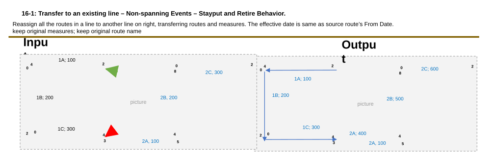

### TC-U35 — Transfer To an Existing Line – Nonspanning Events – Stayput & Retire (case 16-2) <!-- src: S1 · slide 39 · case 16-2 -->

Reassign all the routes in a line to another line on right, transferring routes and measures. The effective date is same as source route’s From Date. Change Measures; keep original route name

| Route Name | Line Name | Line Order | From Date | To Date | From M | To M |
| --- | --- | --- | --- | --- | --- | --- |
| 1A | L1 | 100 | 1/1/2000 | <Null> | 2 | 4 |
| 1B | L1 | 200 | 1/1/2000 | <Null> | 0 | 2 |
| 1C | L1 | 300 | 1/1/2000 | <Null> | 0 | 4 |
| 2A | L2 | 100 | 1/1/2000 | <Null> | 3 | 5 |
| 2B | L2 | 200 | 1/1/2000 | <Null> | 4 | 8 |
| 2C | L2 | 300 | 1/1/2000 | <Null> | 0 | 2 |

| Effective Date | 1/1/2000 |
| --- | --- |

| Route Name | Line Name | Line Order | From Date | To Date | From M | To M |
| --- | --- | --- | --- | --- | --- | --- |
| 1A | L2 | 100 | 1/1/2000 | <Null> | 5 | 8 |
| 1B | L2 | 200 | 1/1/2000 | <Null> | 2 | 4 |
| 1C | L2 | 300 | 1/1/2000 | <Null> | 5 | 9 |
| 2A | L2 | 400 | 1/1/2000 | <Null> | 3 | 5 |
| 2B | L2 | 500 | 1/1/2000 | <Null> | 4 | 8 |
| 2C | L2 | 600 | 1/1/2000 | <Null> | 0 | 2 |

| Event ID | From Date | To Date | From Route ID | From M | To Route ID | To M | Location Error |
| --- | --- | --- | --- | --- | --- | --- | --- |
| N1 | 1/1/2000 | <Null> | 1A | 2 | 1A | 4 | No Error |
| N2 | 1/1/2000 | <Null> | 1A | 2 | 1A | 3 | No Error |
| N3 | 1/1/2000 | <Null> | 1B | 0 | 1B | 2 | No Error |
| N4 | 1/1/2000 | <Null> | 1B | 0.5 | 1B | 1.5 | No Error |
| N5 | 1/1/2000 | <Null> | 1C | 0 | 1C | 4 | No Error |
| N6 | 1/1/2000 | <Null> | 1C | 0 | 1C | 2 | No Error |

| Event ID | From Date | To Date | From Route ID | From M | To Route ID | To M | Location Error |
| --- | --- | --- | --- | --- | --- | --- | --- |
| N1 | 1/1/2000 | <Null> | 1A | 2 | 1A | 4 | Invalid Measure |
| N2 | 1/1/2000 | <Null> | 1A | 2 | 1A | 3 | Invalid Measure |
| N3 | 1/1/2000 | <Null> | 1B | 0 | 1B | 2 | Invalid Measure |
| N4 | 1/1/2000 | <Null> | 1B | 0.5 | 1B | 1.5 | Invalid Measure |
| N5 | 1/1/2000 | <Null> | 1C | 0 | 1C | 4 | Invalid Measure |
| N6 | 1/1/2000 | <Null> | 1C | 0 | 1C | 2 | Invalid Measure |

[figure: 1A; 100 · 1B; 200 · 1C; 300 · 2A, 100 · 2B, 200 · 2C, 300 · 4 · 3 · 5 · 8 · 0 · 2 · Input · Output · 1A 100 · 2A; 400 · 2B; 500 · 2C; 600]

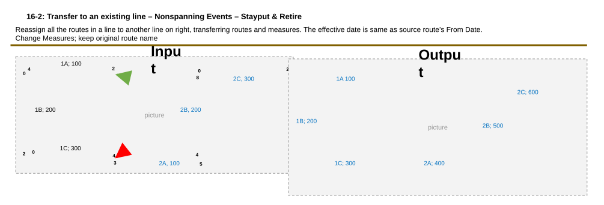

### TC-U36 — Transfer To an Existing Line – Nonspanning Events – Stayput & Retire (case 16-3) <!-- src: S1 · slide 40 · case 16-3 -->

Reassign all the routes in a line to another line on right, transferring routes and measures. The effective date is same as source route’s From Date. Change Measures; Change route name

| Route Name | Line Name | Line Order | From Date | To Date | From M | To M |
| --- | --- | --- | --- | --- | --- | --- |
| 1A | L1 | 100 | 1/1/2000 | <Null> | 2 | 4 |
| 1B | L1 | 200 | 1/1/2000 | <Null> | 0 | 2 |
| 1C | L1 | 300 | 1/1/2000 | <Null> | 0 | 4 |
| 2A | L2 | 100 | 1/1/2000 | <Null> | 3 | 5 |
| 2B | L2 | 200 | 1/1/2000 | <Null> | 4 | 8 |
| 2C | L2 | 300 | 1/1/2000 | <Null> | 0 | 2 |

| Effective Date | 1/1/2000 |
| --- | --- |

| Route Name | Line Name | Line Order | From Date | To Date | From M | To M |
| --- | --- | --- | --- | --- | --- | --- |
| 1A_New | L2 | 100 | 1/1/2000 | <Null> | 5 | 8 |
| 1B_New | L2 | 200 | 1/1/2000 | <Null> | 2 | 4 |
| 1C_New | L2 | 300 | 1/1/2000 | <Null> | 5 | 9 |
| 2A | L2 | 400 | 1/1/2000 | <Null> | 3 | 5 |
| 2B | L2 | 500 | 1/1/2000 | <Null> | 4 | 8 |
| 2C | L2 | 600 | 1/1/2000 | <Null> | 0 | 2 |

| Event ID | From Date | To Date | From Route ID | From M | To Route ID | To M | Location Error |
| --- | --- | --- | --- | --- | --- | --- | --- |
| N1 | 1/1/2000 | <Null> | 1A | 2 | 1A | 4 | No Error |
| N2 | 1/1/2000 | <Null> | 1A | 2 | 1A | 3 | No Error |
| N3 | 1/1/2000 | <Null> | 1B | 0 | 1B | 2 | No Error |
| N4 | 1/1/2000 | <Null> | 1B | 0.5 | 1B | 1.5 | No Error |
| N5 | 1/1/2000 | <Null> | 1C | 0 | 1C | 4 | No Error |
| N6 | 1/1/2000 | <Null> | 1C | 0 | 1C | 2 | No Error |

| Event ID | From Date | To Date | From Route ID | From M | To Route ID | To M | Location Error |
| --- | --- | --- | --- | --- | --- | --- | --- |
| N1 | 1/1/2000 | <Null> | 1A | 2 | 1A | 4 | Route Not found |
| N2 | 1/1/2000 | <Null> | 1A | 2 | 1A | 3 | Route Not found |
| N3 | 1/1/2000 | <Null> | 1B | 0 | 1B | 2 | Route Not found |
| N4 | 1/1/2000 | <Null> | 1B | 0.5 | 1B | 1.5 | Route Not found |
| N5 | 1/1/2000 | <Null> | 1C | 0 | 1C | 4 | Route Not found |
| N6 | 1/1/2000 | <Null> | 1C | 0 | 1C | 2 | Route Not found |

[figure: 1A; 100 · 1B; 200 · 1C; 300 · 2A, 100 · 2B, 200 · 2C, 300 · 4 · 3 · 5 · 8 · 0 · 2 · Input · Output · 1A_New; 100 · 1C_New; 300 · 2A; 400 · 2B; 500 · 2C; 600 · 1B_New; 200]

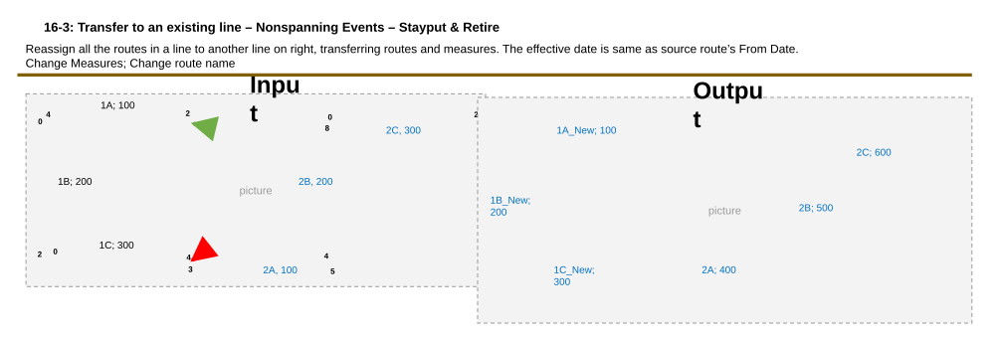

### TC-U37 — Transfer To an Existing Line – Non Spanning Events (case 16-4) <!-- src: S1 · slide 41 · case 16-4 -->

- **Case:** Transfer to an existing line – Non spanning Events – StayPut and Retire Behavior.

Reassign all the routes in a line to another line on right, transferring routes and measures. The effective date is same as source route’s From Date. Keep original route name , changing only the from measure on the first route , only the To Measure of the last route

| Route Name | Line Name | Line Order | From Date | To Date | From M | To M |
| --- | --- | --- | --- | --- | --- | --- |
| 1A | L1 | 100 | 1/1/2000 | <Null> | 2 | 4 |
| 1B | L1 | 200 | 1/1/2000 | <Null> | 0 | 2 |
| 1C | L1 | 300 | 1/1/2000 | <Null> | 0 | 4 |
| 2A | L2 | 100 | 1/1/2000 | <Null> | 3 | 5 |
| 2B | L2 | 200 | 1/1/2000 | <Null> | 4 | 8 |
| 2C | L2 | 300 | 1/1/2000 | <Null> | 0 | 2 |

| Effective Date | 1/1/2000 |
| --- | --- |

| Route Name | Line Name | Line Order | From Date | To Date | From M | To M |
| --- | --- | --- | --- | --- | --- | --- |
| 1A | L2 | 100 | 1/1/2000 | <Null> | 1 | 4 |
| 1B | L2 | 200 | 1/1/2000 | <Null> | 0 | 2 |
| 1C | L2 | 300 | 1/1/2000 | <Null> | 0 | 4 |
| 2A | L2 | 400 | 1/1/2000 | <Null> | 3 | 5 |
| 2B | L2 | 500 | 1/1/2000 | <Null> | 4 | 8 |
| 2C | L2 | 600 | 1/1/2000 | <Null> | 0 | 2 |

| Event ID | From Date | To Date | From Route ID | From M | To Route ID | To M | Location Error |
| --- | --- | --- | --- | --- | --- | --- | --- |
| N1 | 1/1/2000 | <Null> | 1A | 2 | 1A | 4 | No Error |
| N3 | 1/1/2000 | <Null> | 1B | 0 | 1B | 2 | No Error |
| N5 | 1/1/2000 | <Null> | 1C | 0 | 1C | 4 | No Error |

| Event ID | From Date | To Date | From Route ID | From M | To Route ID | To M | Location Error |
| --- | --- | --- | --- | --- | --- | --- | --- |
| N1 | 1/1/2000 | <Null> | 1A | 2 | 1A | 4 | No Error |
| N3 | 1/1/2000 | <Null> | 1B | 0 | 1B | 2 | No Error |
| N5 | 1/1/2000 | <Null> | 1C | 0 | 1C | 4 | No Error |

[figure: 1A; 100 · 1B; 200 · 1C; 300 · 2A, 100 · 2B, 200 · 2C, 300 · Input · Output · 2A; 400 · 2B; 500 · 2C; 600]

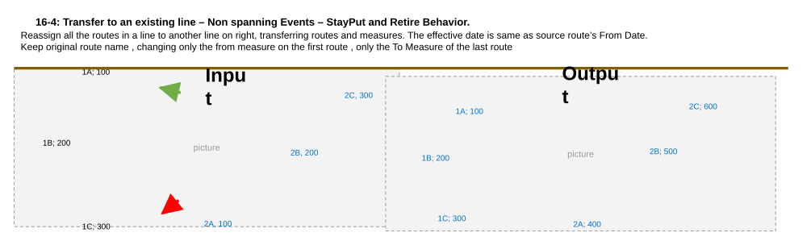

### TC-U38 — Transfer To an Existing Line – Non Spanning Events (case 16-5) <!-- src: S1 · slide 42 · case 16-5 -->

- **Case:** Transfer to an existing line – Non spanning Events – StayPut and Retire Behavior.

Reassign all the routes in a line to another line on right, transferring routes and measures. The effective date is same as source route’s From Date. Keep original route name , changing only the from measure on the first route , only the To Measure of the last route

| Route Name | Line Name | Line Order | From Date | To Date | From M | To M |
| --- | --- | --- | --- | --- | --- | --- |
| 1A | L1 | 100 | 1/1/2000 | <Null> | 2 | 4 |
| 1B | L1 | 200 | 1/1/2000 | <Null> | 0 | 2 |
| 1C | L1 | 300 | 1/1/2000 | <Null> | 0 | 4 |
| 2A | L2 | 100 | 1/1/2000 | <Null> | 3 | 5 |
| 2B | L2 | 200 | 1/1/2000 | <Null> | 4 | 8 |
| 2C | L2 | 300 | 1/1/2000 | <Null> | 0 | 2 |

| Effective Date | 1/1/2000 |
| --- | --- |

| Route Name | Line Name | Line Order | From Date | To Date | From M | To M |
| --- | --- | --- | --- | --- | --- | --- |
| 1A | L2 | 100 | 1/1/2000 | <Null> | 1 | 4 |
| 1B | L2 | 200 | 1/1/2000 | <Null> | 0 | 2 |
| 1C | L2 | 300 | 1/1/2000 | <Null> | 0 | 4 |
| 2A | L2 | 400 | 1/1/2000 | <Null> | 3 | 5 |
| 2B | L2 | 500 | 1/1/2000 | <Null> | 4 | 8 |
| 2C | L2 | 600 | 1/1/2000 | <Null> | 0 | 2 |

| Event ID | From Date | To Date | From Route ID | From M | To Route ID | To M | Location Error |
| --- | --- | --- | --- | --- | --- | --- | --- |
| N1 | 1/1/2000 | <Null> | 1A | 2 | 1A | 4 | No Error |
| N3 | 1/1/2000 | <Null> | 1B | 0 | 1B | 2 | No Error |
| N5 | 1/1/2000 | <Null> | 1C | 0 | 1C | 4 | No Error |

| Event ID | From Date | To Date | From Route ID | From M | To Route ID | To M | Location Error |
| --- | --- | --- | --- | --- | --- | --- | --- |
| N1 | 1/1/2000 | <Null> | 1A | 2 | 1A | 4 | Partial Match Fr M |
| N3 | 1/1/2000 | <Null> | 1B | 0 | 1B | 2 | No Error |
| N5 | 1/1/2000 | <Null> | 1C | 0 | 1C | 4 | Partial Match To M |

[figure: 1A; 100 · 1B; 200 · 1C; 300 · 2A, 100 · 2B, 200 · 2C, 300 · Input · Output · 2A; 400 · 2B; 500 · 2C; 600]

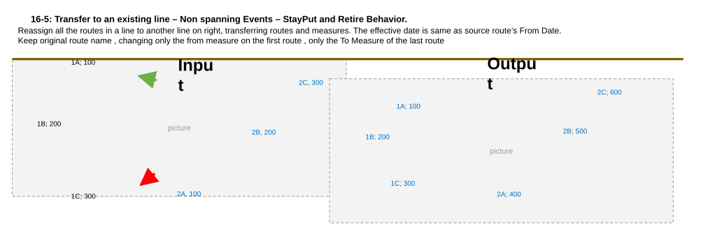

### TC-U39 — Transfer To an Existing Line – Non-Spanning Events – Stayput and Retire Behavior (case 17) <!-- src: S1 · slide 43 · case 17 -->

 Reassign all the routes in a line to another line on right, 2/3 route names and measures maintained. The first route in the line has changed name and measure changed.
.

| Route Name | Line Name | Line Order | From Date | To Date | From M | To M |
| --- | --- | --- | --- | --- | --- | --- |
| 1A | L1 | 100 | 1/1/2000 | <Null> | 2 | 4 |
| 1B | L1 | 200 | 1/1/2000 | <Null> | 0 | 2 |
| 1C | L1 | 300 | 1/1/2000 | <Null> | 0 | 4 |
| 2A | L2 | 100 | 1/1/2000 | <Null> | 3 | 5 |
| 2B | L2 | 200 | 1/1/2000 | <Null> | 4 | 8 |
| 2C | L2 | 300 | 1/1/2000 | <Null> | 0 | 2 |

| Event ID | From Date | To Date | From Route ID | From M | To Route ID | To M | Location Error |
| --- | --- | --- | --- | --- | --- | --- | --- |
| N1 | 1/1/2000 | <Null> | 1A | 2 | 1A | 4 | No Error |
| N2 | 1/1/2000 | <Null> | 1A | 2 | 1A | 3 | No Error |
| N3 | 1/1/2000 | <Null> | 1B | 0 | 1B | 2 | No Error |
| N4 | 1/1/2000 | <Null> | 1B | 0.5 | 1B | 1.5 | No Error |
| N5 | 1/1/2000 | <Null> | 1C | 0 | 1C | 4 | No Error |
| N6 | 1/1/2000 | <Null> | 1C | 0 | 1C | 2 | No Error |

| Route Name | Line Name | Line Order | From Date | To Date | From M | To M |
| --- | --- | --- | --- | --- | --- | --- |
| 1A | L1 | 100 | 1/1/2000 | 1/1/2023 | 2 | 4 |
| 1B | L1 | 200 | 1/1/2000 | 1/1/2023 | 0 | 2 |
| 1C | L1 | 300 | 1/1/2000 | 1/1/2023 | 0 | 4 |
| 2A | L2 | 100 | 1/1/2000 | 1/1/2023 | 3 | 5 |
| 2B | L2 | 200 | 1/1/2000 | 1/1/2023 | 4 | 8 |
| 2C | L2 | 300 | 1/1/2000 | 1/1/2023 | 0 | 2 |
| 1A_New | L2 | 100 | 1/1/2023 | <Null> | 5 | 8 |
| 1B | L2 | 200 | 1/1/2023 | <Null> | 0 | 2 |
| 1C | L2 | 300 | 1/1/2023 | <Null> | 0 | 4 |
| 2A | L2 | 400 | 1/1/2023 | <Null> | 3 | 5 |
| 2B | L2 | 500 | 1/1/2023 | <Null> | 4 | 8 |
| 2C | L2 | 600 | 1/1/2023 | <Null> | 0 | 2 |

| Event ID | From Date | To Date | From Route ID | From M | To Route ID | To M | Location Error |
| --- | --- | --- | --- | --- | --- | --- | --- |
| N1 | 1/1/2000 | 1/1/2023 | 1A | 2 | 1A | 4 | No Error |
| N2 | 1/1/2000 | 1/1/2023 | 1A | 2 | 1A | 3 | No Error |
| N3 | 1/1/2000 | 1/1/2023 | 1B | 0 | 1B | 2 | No Error |
| N4 | 1/1/2000 | 1/1/2023 | 1B | 0.5 | 1B | 1.5 | No Error |
| N5 | 1/1/2000 | 1/1/2023 | 1C | 0 | 1C | 4 | No Error |
| N6 | 1/1/2000 | 1/1/2023 | 1C | 0 | 1C | 2 | No Error |

| Effective Date | 1/1/2000 |
| --- | --- |

[figure: 1A; 100 · 1B; 200 · 1C; 300 · 2A, 100 · 2B, 200 · 2C, 300 · 4 · 3 · 5 · 8 · 0 · 2 · Input · Output · 1A_New; 100 · 1B_New 200 · 1C_New; 300 · 2A; 400 · 2B; 500 · 2C; 600 · 9]

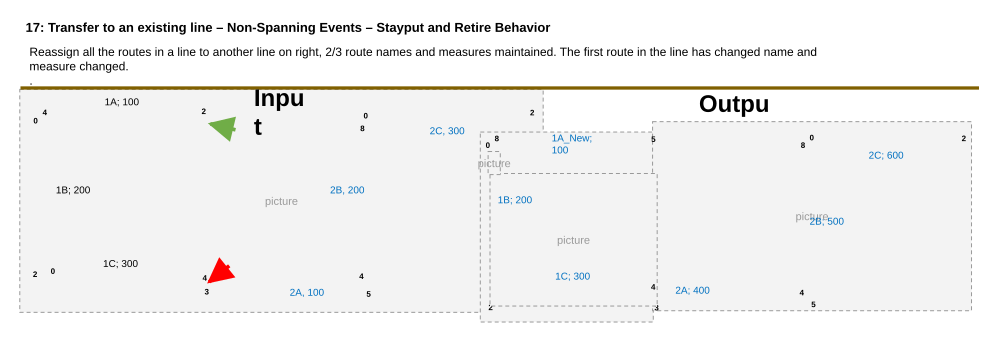

### TC-U40 — Transfer To an Existing Line – Non-spanning Events – Stayput Behavior (case 18-1) <!-- src: S1 · slide 44 · case 18-1 -->

Reassign 1 entire route  and a partial route  in a line to another line transferring routes and measures. ; Keep the same name for the
entire route and partial route (name of a retired route from the line to which route is reassigned), Change measures

| Route Name | Line Name | Line Order | From Date | To Date | From M | To M |
| --- | --- | --- | --- | --- | --- | --- |
| 1A | L1 | 100 | 1/1/2000 | <Null> | 2 | 4 |
| 1B | L1 | 200 | 1/1/2000 | <Null> | 0 | 2 |
| 1C | L1 | 300 | 1/1/2000 | <Null> | 0 | 4 |
| 2A | L2 | 100 | 1/1/2000 | <Null> | 3 | 5 |
| 2B | L2 | 200 | 1/1/2000 | <Null> | 4 | 8 |
| 2C | L2 | 300 | 1/1/2000 | <Null> | 0 | 2 |

| Route Name | Line Name | Line Order | From Date | To Date | From M | To M |
| --- | --- | --- | --- | --- | --- | --- |
| 1A | L1 | 100 | 1/1/2000 | <Null> | 2 | 4 |
| 1B | L1 | 200 | 1/1/2000 | 1/1/2023 | 0 | 2 |
| 1C | L1 | 300 | 1/1/2000 | 1/1/2023 | 0 | 4 |
| 2A | L2 | 100 | 1/1/2000 | 1/1/2023 | 3 | 5 |
| 2B | L2 | 200 | 1/1/2000 | 1/1/2023 | 4 | 8 |
| 2C | L2 | 300 | 1/1/2000 | 1/1/2023 | 0 | 2 |
| 1B | L1 | 200 | 1/1/2023 | <Null> | 0 | 1 |
| 1R1 | L2 | 100 | 1/1/2023 | <Null> | 0 | 1 |
| 1C | L2 | 200 | 1/1/2023 | <Null> | 4 | 6 |
| 2A | L2 | 300 | 1/1/2023 | <Null> | 3 | 5 |
| 2B | L2 | 400 | 1/1/2023 | <Null> | 4 | 8 |
| 2C | L2 | 500 | 1/1/2023 | <Null> | 0 | 2 |

| Effective Date | 1/1/2023 |
| --- | --- |

| Event ID | From Date | To Date | From Route ID | From M | To M | Location Error |
| --- | --- | --- | --- | --- | --- | --- |
| N1 | 1/1/2000 | <Null> | 1A | 2 | 4 | No Error |
| N2 | 1/1/2000 | <Null> | 1B | 0 | 2 | No Error |
| N3 | 1/1/2000 | <Null>. | 1C | 2 | 4 | No Error |
| N4 | 1/1/2000 | <Null> | 1B | 0.5 | 1.5 | No Error |
| N5 | 1/1/2000 | <Null> | 1B | 1.5 | 2 | No Error |
| N6 | 1/1/2000 | <Null> | 1B | 0 | 0.5 | No Error |
| N7 | 1/1/2000 | <Null> | 1C | 2 | 4 | No Error |
| N8 | 1/1/2000 | <Null> | 1C | 0 | 4 | No Error |
| N9 | 1/1/2000 | <Null> | 1C | 0 | 2 | No Error |

| Event ID | From Date | To Date | From Route ID | From M | To M | Location Error |
| --- | --- | --- | --- | --- | --- | --- |
| N1 | 1/1/2000 | <Null> | 1A | 2 | 4 | No Error |
| N2 | 1/1/2000 | 1/1/2023 | 1B | 0 | 2 | No Error |
| N2 | 1/1/2023 | <Null> | 1B | 0 |  | No Error |
| N3 | 1/1/2000 | 1/1/2023 | 1C | 2 | 4 | No Error |
| N4 | 1/1/2000 | 1/1/2023 | 1B | 0.5 | 1.5 | No Error |
| N4 | 1/1/2023 | <Null> | 1B | 0.5 | 1 | NO Error |
| N5 | 1/1/2000 | 1/1/2023 | 1B | 1.5 | 2 | No Error |
| N6 | 1/1/2000 | <Null> | 1B | 0 | 0.5 | No Error |
| N7 | 1/1/2000 | 1/1/2023 | 1C | 2 | 4 | No Error |
| N8 | 1/1/2000 | 1/1/2023 | 1C | 0 | 4 | No Error |
| N9 | 1/1/2000 | 1/1/2023 | 1C | 0 | 2 | No Error |

[figure: 1A; 100 · 1B; 200 · 1C; 300 · 2A, 100 · 2B, 200 · 2C, 300 · 4 · 3 · 5 · 8 · 0 · 2 · Input · Output · 1C; 200 · 2A; 300 · 2B; 400 · 2C; 500 · 1R1; 100]

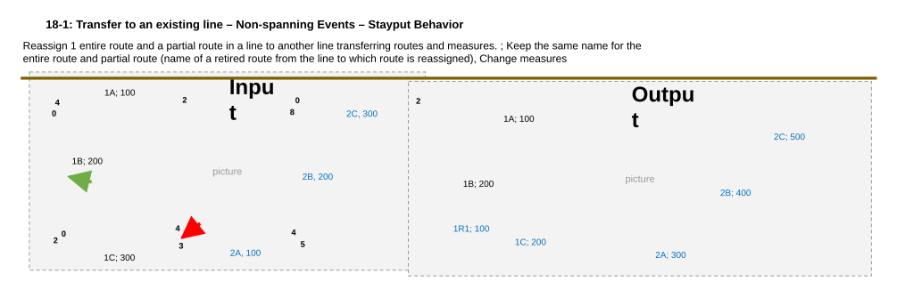

### TC-U41 — Transfer To an Existing Line – Non-spanning Events – Retire Behavior (case 18-2) <!-- src: S1 · slide 45 · case 18-2 -->

Reassign 1 entire route  and a partial route  in a line to another line transferring routes and measures. ; Keep the same name for the
entire route and partial route (name of a retired route from the line to which route is reassigned), Change measures

| Route Name | Line Name | Line Order | From Date | To Date | From M | To M |
| --- | --- | --- | --- | --- | --- | --- |
| 1A | L1 | 100 | 1/1/2000 | <Null> | 2 | 4 |
| 1B | L1 | 200 | 1/1/2000 | <Null> | 0 | 2 |
| 1C | L1 | 300 | 1/1/2000 | <Null> | 0 | 4 |
| 2A | L2 | 100 | 1/1/2000 | <Null> | 3 | 5 |
| 2B | L2 | 200 | 1/1/2000 | <Null> | 4 | 8 |
| 2C | L2 | 300 | 1/1/2000 | <Null> | 0 | 2 |

| Route Name | Line Name | Line Order | From Date | To Date | From M | To M |
| --- | --- | --- | --- | --- | --- | --- |
| 1A | L1 | 100 | 1/1/2000 | <Null> | 2 | 4 |
| 1B | L1 | 200 | 1/1/2000 | 1/1/2023 | 0 | 2 |
| 1C | L1 | 300 | 1/1/2000 | 1/1/2023 | 0 | 4 |
| 2A | L2 | 100 | 1/1/2000 | 1/1/2023 | 3 | 5 |
| 2B | L2 | 200 | 1/1/2000 | 1/1/2023 | 4 | 8 |
| 2C | L2 | 300 | 1/1/2000 | 1/1/2023 | 0 | 2 |
| 1B | L1 | 200 | 1/1/2023 | <Null> | 0 | 1 |
| 1R1 | L2 | 100 | 1/1/2023 | <Null> | 0 | 1 |
| 1C | L2 | 200 | 1/1/2023 | <Null> | 4 | 6 |
| 2A | L2 | 300 | 1/1/2023 | <Null> | 3 | 5 |
| 2B | L2 | 400 | 1/1/2023 | <Null> | 4 | 8 |
| 2C | L2 | 500 | 1/1/2023 | <Null> | 0 | 2 |

| Effective Date | 1/1/2023 |
| --- | --- |

| Event ID | From Date | To Date | From Route ID | From M | To M | Location Error |
| --- | --- | --- | --- | --- | --- | --- |
| N1 | 1/1/2000 | <Null> | 1A | 2 | 4 | No Error |
| N2 | 1/1/2000 | <Null> | 1B | 0 | 2 | No Error |
| N3 | 1/1/2000 | <Null>. | 1C | 2 | 4 | No Error |
| N4 | 1/1/2000 | <Null> | 1B | 0.5 | 1.5 | No Error |
| N5 | 1/1/2000 | <Null> | 1B | 1.5 | 2 | No Error |
| N6 | 1/1/2000 | <Null> | 1B | 0 | 0.5 | No Error |
| N7 | 1/1/2000 | <Null> | 1C | 2 | 4 | No Error |
| N8 | 1/1/2000 | <Null> | 1C | 0 | 4 | No Error |
| N9 | 1/1/2000 | <Null> | 1C | 0 | 2 | No Error |

| Event ID | From Date | To Date | From Route ID | From M | To M | Location Error |
| --- | --- | --- | --- | --- | --- | --- |
| N1 | 1/1/2000 | <Null> | 1A | 2 | 4 | No Error |
| N2 | 1/1/2000 | 1/1/2023 | 1B | 0 | 2 | No Error |
| N3 | 1/1/2000 | 1/1/2023 | 1C | 2 | 4 | No Error |
| N4 | 1/1/2000 | 1/1/2023 | 1B | 0.5 | 1.5 | No Error |
| N5 | 1/1/2000 | 1/1/2023 | 1B | 1.5 | 2 | No Error |
| N6 | 1/1/2000 | <Null> | 1B | 0 | 0.5 | No Error |
| N7 | 1/1/2000 | 1/1/2023 | 1C | 2 | 4 | No Error |
| N8 | 1/1/2000 | 1/1/2023 | 1C | 0 | 4 | No Error |
| N9 | 1/1/2000 | 1/1/2023 | 1C | 0 | 2 | No Error |

[figure: 1A; 100 · 1B; 200 · 1C; 300 · 2A, 100 · 2B, 200 · 2C, 300 · 4 · 3 · 5 · 8 · 0 · 2 · Input · Output · 1C; 200 · 2A; 300 · 2B; 400 · 2C; 500 · 1R1; 100]

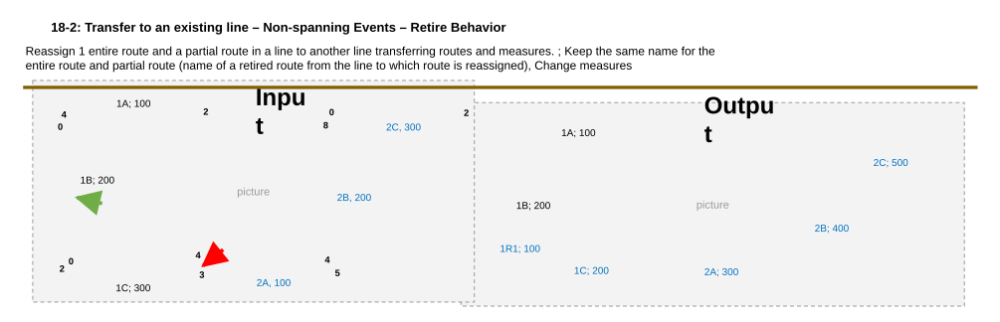

### TC-U42 — Transfer To an Existing Line – Non-Spanning Events – Stayput Behavior (case 19-1) <!-- src: S1 · slide 46 · case 19-1 -->

| Event ID | From Date | To Date | From Route ID | From M | To M | Location Error |
| --- | --- | --- | --- | --- | --- | --- |
| N1 | 1/1/2000 | <Null> | 1A | 2 | 4 | No Error |
| N2 | 1/1/2000 | <Null> | 1A | 2 | 3 | No Error |
| N3 | 1/1/2000 | <Null> | 1B | 0 | 2 | No Error |
| N4 | 1/1/2000 | <Null> | 1A | 3 | 4 | No Error |
| N5 | 1/1/2000 | <Null> | 1C | 0 | 4 | No Error |
| N6 | 1/1/2000 | <Null> | 1C | 0 | 2 | No Error |

| Event ID | From Date | To Date | From Route ID | From M | To M | Location Error |
| --- | --- | --- | --- | --- | --- | --- |
| N1 | 1/1/2000 | 1/1/2023 | 1A | 2 | 4 | No Error |
| N1 | 1/1/2023 | <Null> | 1A | 0 | 1 | No Error |
| N2 | 1/1/2000 | 1/1/2023 | 1A | 2 | 3 | No Error |
| N4 | 1/1/2000 | 1/1/2023 | 1A | 3 | 4 | No Error |
| N4 | 1/1/2023 | <Null> | 1A | 0 | 1 | No Error |
| N3 | 1/1/2000 | <Null> | 1B | 0 | 2 | No Error |
| N5 | 1/1/2000 | <Null> | 1C | 0 | 4 | No Error |
| N6 | 1/1/2000 | <Null> | 1C | 0 | 2 | No Error |

| Route Name | Line Name | Line Order | From Date | To Date | From M | To M |
| --- | --- | --- | --- | --- | --- | --- |
| 0A | L0 | 100 | 1/1/2000 | <Null> | 3 | 5 |
| 1A_New | L0 | 200 | 1/1/2023 | <Null> | 2 | 3 |
| 1A | L1 | 100 | 1/1/2023 | <Null> | 0 | 1 |
| 1A | L1 | 100 | 1/1/2000 | 1/1/2023 | 2 | 4 |
| 1B | L1 | 200 | 1/1/2000 | <Null> | 0 | 2 |
| 1C | L1 | 300 | 1/1/2000 | <Null> | 0 | 4 |

| Route Name | Line Name | Line Order | From Date | To Date | From M | To M |
| --- | --- | --- | --- | --- | --- | --- |
| 0A | L0 | 100 | 1/1/2000 | <Null> | 3 | 5 |
| 1A | L1 | 100 | 1/1/2000 | <Null> | 2 | 4 |
| 1B | L1 | 200 | 1/1/2000 | <Null> | 0 | 2 |
| 1C | L1 | 300 | 1/1/2000 | <Null> | 0 | 4 |

 Transfer partial route (1/2 of a route) in a line to adjacent upstream existing line , recalibrate source route downstream, calibrate set to stayput, route name changed , no measure change for the reassigned route portion

| Effective Date | 1/1/2023 |
| --- | --- |
| Source RD | Yes |

[figure: 0A, 100 · 1A_New; 200 · 1A; 100 · 1B; 200 · 1C; 300 · 1 · 0 · 4 · 2 · Input · Output]

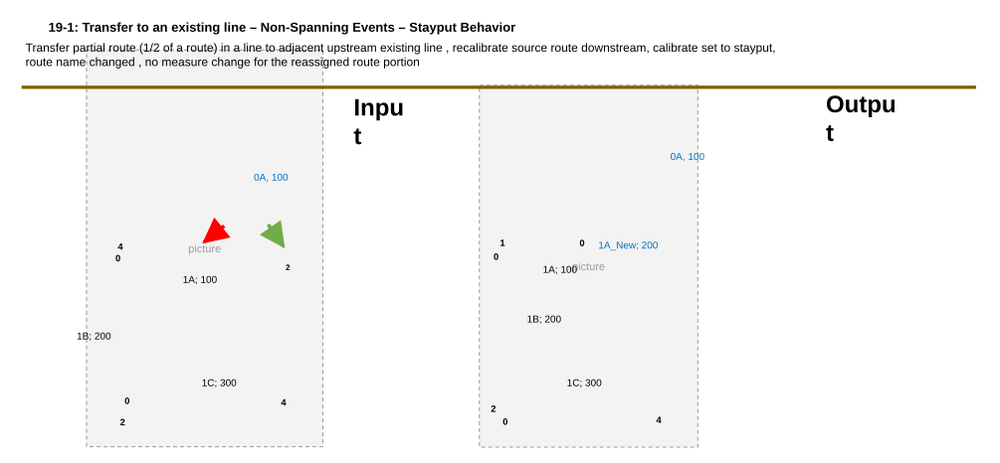

### TC-U43 — Transfer To an Existing Line – Non-Spanning Events – Retire Behavior (case 19-2) <!-- src: S1 · slide 47 · case 19-2 -->

| Event ID | From Date | To Date | From Route ID | From M | To M | Location Error |
| --- | --- | --- | --- | --- | --- | --- |
| N1 | 1/1/2000 | <Null> | 1A | 2 | 4 | No Error |
| N2 | 1/1/2000 | <Null> | 1A | 2 | 3 | No Error |
| N3 | 1/1/2000 | <Null> | 1B | 0 | 2 | No Error |
| N4 | 1/1/2000 | <Null> | 1A | 3 | 4 | No Error |
| N5 | 1/1/2000 | <Null> | 1C | 0 | 4 | No Error |
| N6 | 1/1/2000 | <Null> | 1C | 0 | 2 | No Error |

| Event ID | From Date | To Date | From Route ID | From M | To M | Location Error |
| --- | --- | --- | --- | --- | --- | --- |
| N1 | 1/1/2000 | 1/1/2023 | 1A | 2 | 4 | No Error |
| N2 | 1/1/2000 | 1/1/2023 | 1A | 2 | 3 | No Error |
| N4 | 1/1/2000 | 1/1/2023 | 1A | 3 | 4 | No Error |
| N3 | 1/1/2000 | <Null> | 1B | 0 | 2 | No Error |
| N5 | 1/1/2000 | <Null> | 1C | 0 | 4 | No Error |
| N6 | 1/1/2000 | <Null> | 1C | 0 | 2 | No Error |

| Route Name | Line Name | Line Order | From Date | To Date | From M | To M |
| --- | --- | --- | --- | --- | --- | --- |
| 0A | L0 | 100 | 1/1/2000 | <Null> | 3 | 5 |
| 1A_New | L0 | 200 | 1/1/2023 | <Null> | 2 | 3 |
| 1A | L1 | 100 | 1/1/2023 | <Null> | 0 | 1 |
| 1A | L1 | 100 | 1/1/2000 | 1/1/2023 | 2 | 4 |
| 1B | L1 | 200 | 1/1/2000 | <Null> | 0 | 2 |
| 1C | L1 | 300 | 1/1/2000 | <Null> | 0 | 4 |

| Route Name | Line Name | Line Order | From Date | To Date | From M | To M |
| --- | --- | --- | --- | --- | --- | --- |
| 0A | L0 | 100 | 1/1/2000 | <Null> | 3 | 5 |
| 1A | L1 | 100 | 1/1/2000 | <Null> | 2 | 4 |
| 1B | L1 | 200 | 1/1/2000 | <Null> | 0 | 2 |
| 1C | L1 | 300 | 1/1/2000 | <Null> | 0 | 4 |

 Transfer partial route (1/2 of a route) in a line to adjacent upstream existing line , recalibrate source route downstream, calibrate set to retire, route name changed , no measure change for the reassigned route portion

| Effective Date | 1/1/2023 |
| --- | --- |
| Source RD | Yes |

[figure: 0A, 100 · 1A_New; 200 · 1A; 100 · 1B; 200 · 1C; 300 · 1 · 0 · 4 · 2 · Input · Output]

### TC-U44 — Transfer To an Existing Line – Non-Spanning Events – Stayput Behavior (case 20-1) <!-- src: S1 · slide 48 · case 20-1 -->

| Event ID | From Date | To Date | From Route ID | From M | To M | Location Error |
| --- | --- | --- | --- | --- | --- | --- |
| N1 | 1/1/2000 | <Null> | 1A | 2 | 4 | No Error |
| N2 | 1/1/2000 | <Null> | 1A | 2 | 3 | No Error |
| N3 | 1/1/2000 | <Null> | 1B | 0 | 2 | No Error |
| N4 | 1/1/2000 | <Null> | 1A | 3 | 4 | No Error |
| N5 | 1/1/2000 | <Null> | 1C | 0 | 4 | No Error |
| N6 | 1/1/2000 | <Null> | 1C | 0 | 2 | No Error |

| Event ID | From Date | To Date | From Route ID | From M | To M | Location Error |
| --- | --- | --- | --- | --- | --- | --- |
| N1 | 1/1/2000 | 1/1/2023 | 1A | 2 | 4 | No Error |
| N1 | 1/1/2023 | <Null> | 1A | 3 | 4 | No Error |
| N2 | 1/1/2000 | 1/1/2023 | 1A | 2 | 3 | No Error |
| N4 | 1/1/2000 | <Null> | 1A | 3 | 4 | No Error |
| N3 | 1/1/2000 | <Null> | 1B | 0 | 2 | No Error |
| N5 | 1/1/2000 | <Null> | 1C | 0 | 4 | No Error |
| N6 | 1/1/2000 | <Null> | 1C | 0 | 2 | No Error |

| Route Name | Line Name | Line Order | From Date | To Date | From M | To M |
| --- | --- | --- | --- | --- | --- | --- |
| 0A | L0 | 100 | 1/1/2000 | <Null> | 3 | 5 |
| 1A_New | L0 | 200 | 1/1/2023 | <Null> | 2 | 3 |
| 1A | L1 | 100 | 1/1/2023 | <Null> | 3 | 4 |
| 1A | L1 | 100 | 1/1/2000 | 1/1/2023 | 2 | 4 |
| 1B | L1 | 200 | 1/1/2000 | <Null> | 0 | 2 |
| 1C | L1 | 300 | 1/1/2000 | <Null> | 0 | 4 |

| Route Name | Line Name | Line Order | From Date | To Date | From M | To M |
| --- | --- | --- | --- | --- | --- | --- |
| 0A | L0 | 100 | 1/1/2000 | <Null> | 3 | 5 |
| 1A | L1 | 100 | 1/1/2000 | <Null> | 2 | 4 |
| 1B | L1 | 200 | 1/1/2000 | <Null> | 0 | 2 |
| 1C | L1 | 300 | 1/1/2000 | <Null> | 0 | 4 |

 Transfer partial route (1/2 of a route) in a line to adjacent upstream existing line ,  do not recalibrate source route downstream, calibrate set to stayput, route name changed , no measure change for the reassigned route portion

| Effective Date | 1/1/2023 |
| --- | --- |
| Source RD | No |

[figure: 0A, 100 · 1A_New; 200 · 1A; 100 · 1B; 200 · 1C; 300 · 4 · 0 · 3 · 2 · Input · Output]

### TC-U45 — Transfer To an Existing Line – Non-Spanning Events – Retire Behavior (case 20-2) <!-- src: S1 · slide 49 · case 20-2 -->

| Event ID | From Date | To Date | From Route ID | From M | To M | Location Error |
| --- | --- | --- | --- | --- | --- | --- |
| N1 | 1/1/2000 | <Null> | 1A | 2 | 4 | No Error |
| N2 | 1/1/2000 | <Null> | 1A | 2 | 3 | No Error |
| N3 | 1/1/2000 | <Null> | 1B | 0 | 2 | No Error |
| N4 | 1/1/2000 | <Null> | 1A | 3 | 4 | No Error |
| N5 | 1/1/2000 | <Null> | 1C | 0 | 4 | No Error |
| N6 | 1/1/2000 | <Null> | 1C | 0 | 2 | No Error |

| Event ID | From Date | To Date | From Route ID | From M | To M | Location Error |
| --- | --- | --- | --- | --- | --- | --- |
| N1 | 1/1/2000 | 1/1/2023 | 1A | 2 | 4 | No Error |
| N2 | 1/1/2000 | 1/1/2023 | 1A | 2 | 3 | No Error |
| N4 | 1/1/2000 | <Null> | 1A | 3 | 4 | No Error |
| N3 | 1/1/2000 | <Null> | 1B | 0 | 2 | No Error |
| N5 | 1/1/2000 | <Null> | 1C | 0 | 4 | No Error |
| N6 | 1/1/2000 | <Null> | 1C | 0 | 2 | No Error |

{5940675A-B579-460E-94D1-54222C63F5DA}Route Name
Line Name
Line Order
From Date
To Date
From M
To M
0A
L0
100
1/1/2000
<Null>
3
5
1A_New
L0
200
1/1/2023
<Null>
2
3
1A
L1
100
1/1/2023
<Null>
0
1
1A
L1
100
1/1/2000
1/1/2023
2
4
1B
L1
200
1/1/2000
<Null>
0
2
1C
L1
300
1/1/2000
<Null>
0
4
{5940675A-B579-460E-94D1-54222C63F5DA}Route Name
Line Name
Line Order
From Date
To Date
From M
To M
0A
L0
100
1/1/2000
<Null>
3
5
1A
L1
100
1/1/2000
<Null>
2
4
1B
L1
200
1/1/2000
<Null>
0
2
1C
L1
300
1/1/2000
<Null>
0
4
 Transfer partial route (1/2 of a route) in a line to adjacent upstream existing line ,  do not recalibrate source route downstream, calibrate set to retire, route name changed , no measure change for the reassigned route portion

[figure: 0A, 100 · 1A_New; 200 · 1A; 100 · 1B; 200 · 1C; 300 · 4 · 0 · 2 · Input · Output · 3]

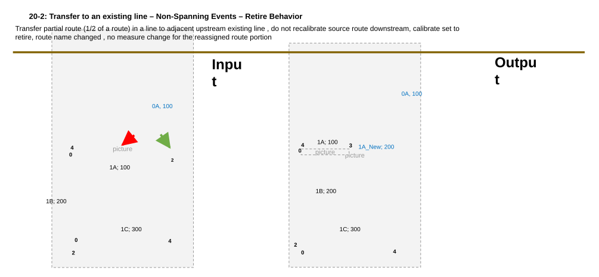

### TC-U46 — Transfer To an Existing Line – Non Spanning Events - StayPut (case 21) <!-- src: S1 · slide 50 · case 21 -->

- **Case:** Transfer to an existing line – Non spanning Events - StayPut (only Routes and Route Table shown here)

Reassign 0.5+1+0.5 routes in a line to new line ,1/3 route name and measure maintained. Rest all name and measure are changed. Recalibrate source downstream.
{5940675A-B579-460E-94D1-54222C63F5DA}Route Name
Line Name
Line Order
From Date
To Date
From M
To M
1A
L1
100
1/1/2000
<Null>
2
4
1B
L1
200
1/1/2000
<Null>
0
2
1C
L1
300
1/1/2000
<Null>
0
4
2A
L2
100
1/1/2000
<Null>
4
5
2B
L2
200
1/1/2000
<Null>
5
8
2C
L2
300
1/1/2000
<Null>
0
1
{5940675A-B579-460E-94D1-54222C63F5DA}Route Name
Line Name
Line Order
From Date
To Date
From M
To M
1A
L1
100
1/1/2000
1/1/2023
2
4
1B
L1
200
1/1/2000
1/1/2023
0
2
1C
L1
300
1/1/2000
1/1/2023
0
4
2A
L2
100
1/1/2000
1/1/2023
3
5
2B
L2
200
1/1/2000
1/1/2023
4
8
2C
L2
300
1/1/2000
1/1/2023
0
2
1A
L1
100
1/1/2023
<Null>
2
3
1C
L1
200
1/1/2023
<Null>
0
2
1A_New
L2
100
1/1/2023
<Null>
1
2
1B
L2
200
1/1/2023
<Null>
0
2
1C_New
L2
300
1/1/2023
<Null>
5
6
2A
L2
400
1/1/2023
<Null>
4
5
2B
L2
500
1/1/2023
<Null>
5
8
2C
L2
600
1/1/2023
<Null>
0
1
{5C22544A-7EE6-4342-B048-85BDC9FD1C3A}Effective Date
1/1/2023
Source RD
Yes

[figure: 1B; 200 · 2A; 400 · 2B; 500 · 2C; 600 · 1A_New; 100 · 1C_New; 300 · 1A; 100 · 1C; 300 · 2A, 100 · 2B, 200 · 2C, 300 · Input · Output]

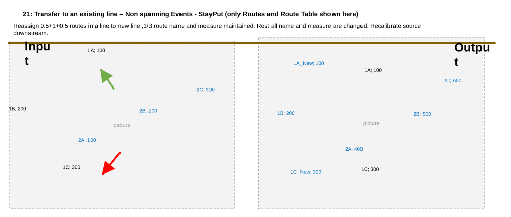

### TC-U47 — Transfer To an Existing Line – Nonspanning Events – Stayput Behavior (case 21-1) <!-- src: S1 · slide 51 · case 21-1 -->

Reassign 0.5+1+0.5 routes in a line to new line ,1/3 route names and measures maintained. Rest all name and measure are changed. Recalibrate source downstream. Calibrate set to stayput
{5C22544A-7EE6-4342-B048-85BDC9FD1C3A}Effective Date
1/1/2023
Source RD
Yes
{912C8C85-51F0-491E-9774-3900AFEF0FD7}Event ID
From Date
To Date
From Route ID
From M
To M
Location Error
N1
1/1/2000
<Null>
1A
2
4
No Error
N2
1/1/2000
<Null>
1A
2
3
No Error
N3
1/1/2000
<Null>
1A
3
4
No Error
N4
1/1/2000
<Null>
1A
2.5
3.5
No Error
N5
1/1/2000
<Null>
1B
0
2
No Error
N6
1/1/2000
<Null>
1C
0
4
No Error
N7
1/1/2000
<Null>
1C
1
3
No Error
N8
1/1/2000
<Null>
1C
0
2
No Error
N9
1/1/2000
<Null>
1C
2
4
No Error

E1
1/1/2000
<Null>
2A
4
5
No Error
E2
1/1/2000
<Null>
2B
5
8
No Error
E3
1/1/2000
<Null>
2C
0
1
No Error
{912C8C85-51F0-491E-9774-3900AFEF0FD7}Event ID
From Date
To Date
From Route ID
From M
To M
Location Error
N1
1/1/2000
1/1/2023
1A
2
4
No Error
N1
1/1/2023
<Null>
1A
2
3
No Error
N2
1/1/2000
<Null>
1A
2
3
No Error
N3
1/1/2000
1/1/2023
1A
3
4
No Error
N4
1/1/2000
1/1/2023
1A
2.5
3.5
No Error
N4
1/1/2023
<Null>
1A
2.5
3
No Error
N5
1/1/2000
1/1/2023
1B
0
2
No Error
N6
1/1/2000
1/1/2023
1C
0
4
No Error
N6
1/1/2023
<Null>
1C
0
2
No Error
N7
1/1/2000
1/1/2023
1C
1
3
No Error
N7
1/1/2023
<Null>
1C
0
1
No Error
N8
1/1/2000
1/1/2023
1C
0
2
No Error
N9
1/1/2000
1/1/2023
1C
2
4
No Error
N9
1/1/2023
<Null
1C
0
2
No Error

E1
1/1/2000
<Null>
2A
4
5
No Error
E2
1/1/2000
<Null>
2B
5
8
No Error
E3
1/1/2000
<Null>
2C
0
1
No Error
{5940675A-B579-460E-94D1-54222C63F5DA}Route Name
Line Name
Line Order
From Date
To Date
From M
To M
1A
L1
100
1/1/2000
<Null>
2
4
1B
L1
200
1/1/2000
<Null>
0
2
1C
L1
300
1/1/2000
<Null>
0
4
2A
L2
100
1/1/2000
<Null>
4
5
2B
L2
200
1/1/2000
<Null>
5
8
2C
L2
300
1/1/2000
<Null>
0
1

[figure: 1B; 200 · 2A; 400 · 2B; 500 · 2C; 600 · 1A_New; 100 · 1C_New; 300 · 1A; 100 · 1C; 300 · 2A, 100 · 2B, 200 · 2C, 300 · Input · Output · Not affected]

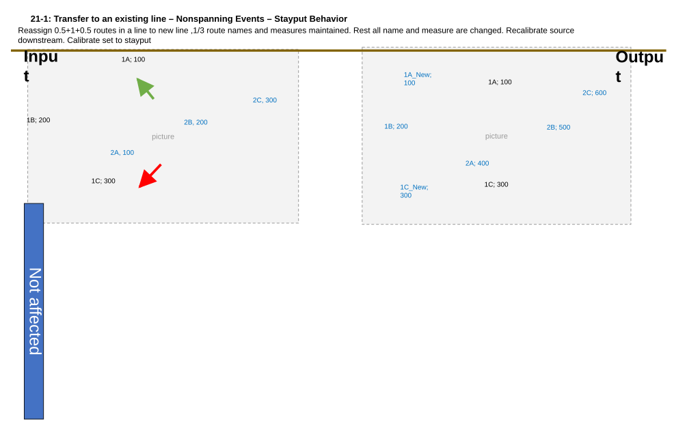

### TC-U48 — Transfer To an Existing Line – Non Spanning Events – Retire Behavior (case 21-2) <!-- src: S1 · slide 52 · case 21-2 -->

Reassign 0.5+1+0.5 routes in a line to new line ,1/3 route names and measures maintained. Rest all name and measure are changed. Recalibrate source downstream. Calibrate set to retire
{5C22544A-7EE6-4342-B048-85BDC9FD1C3A}Effective Date
1/1/2023
Source RD
Yes
{912C8C85-51F0-491E-9774-3900AFEF0FD7}Event ID
From Date
To Date
From Route ID
From M
To M
Location Error
N1
1/1/2000
<Null>
1A
2
4
No Error
N2
1/1/2000
<Null>
1A
2
3
No Error
N3
1/1/2000
<Null>
1A
3
4
No Error
N4
1/1/2000
<Null>
1A
2.5
3.5
No Error
N5
1/1/2000
<Null>
1B
0
2
No Error
N6
1/1/2000
<Null>
1C
0
4
No Error
N7
1/1/2000
<Null>
1C
1
3
No Error
N8
1/1/2000
<Null>
1C
0
2
No Error
N9
1/1/2000
<Null>
1C
2
4
No Error

E1
1/1/2000
<Null>
2A
4
5
No Error
E2
1/1/2000
<Null>
2B
5
8
No Error
E3
1/1/2000
<Null>
2C
0
1
No Error
{912C8C85-51F0-491E-9774-3900AFEF0FD7}Event ID
From Date
To Date
From Route ID
From M
To M
Location Error
N1
1/1/2000
1/1/2023
1A
2
4
No Error
N2
1/1/2000
<Null>
1A
2
3
No Error
N3
1/1/2000
1/1/2023
1A
3
4
No Error
N4
1/1/2000
1/1/2023
1A
2.5
3.5
No Error
N5
1/1/2000
1/1/2023
1B
0
2
No Error
N6
1/1/2000
1/1/2023
1C
0
4
No Error
N7
1/1/2000
1/1/2023
1C
1
3
No Error
N8
1/1/2000
1/1/2023
1C
0
2
No Error
N9
1/1/2000
1/1/2023
1C
2
4
No Error

E1
1/1/2000
<Null>
2A
4
5
No Error
E2
1/1/2000
<Null>
2B
5
8
No Error
E3
1/1/2000
<Null>
2C
0
1
No Error
{5940675A-B579-460E-94D1-54222C63F5DA}Route Name
Line Name
Line Order
From Date
To Date
From M
To M
1A
L1
100
1/1/2000
<Null>
2
4
1B
L1
200
1/1/2000
<Null>
0
2
1C
L1
300
1/1/2000
<Null>
0
4
2A
L2
100
1/1/2000
<Null>
4
5
2B
L2
200
1/1/2000
<Null>
5
8
2C
L2
300
1/1/2000
<Null>
0
1

[figure: 1B; 200 · 2A; 400 · 2B; 500 · 2C; 600 · 1A_New; 100 · 1C_New; 300 · 1A; 100 · 1C; 300 · 2A, 100 · 2B, 200 · 2C, 300 · Input · Output · Not affected]

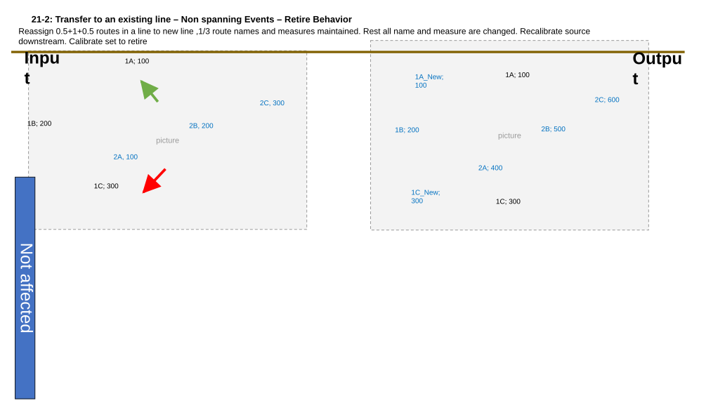

### TC-U49 — Transfer To an Existing Line – Non Spanning Events - StayPut (case 22) <!-- src: S1 · slide 53 · case 22 -->

- **Case:** Transfer to an existing line – Non spanning Events - StayPut (only Routes and Route Table shown here)

Reassign 0.5+1+0.5 routes in a line to new line ,1/3 route name and measure maintained. Rest all name and measure are changed. Do not Recalibrate source downstream.
{5940675A-B579-460E-94D1-54222C63F5DA}Route Name
Line Name
Line Order
From Date
To Date
From M
To M
1A
L1
100
1/1/2000
<Null>
2
4
1B
L1
200
1/1/2000
<Null>
0
2
1C
L1
300
1/1/2000
<Null>
0
4
2A
L2
100
1/1/2000
<Null>
4
5
2B
L2
200
1/1/2000
<Null>
5
8
2C
L2
300
1/1/2000
<Null>
0
1
{5940675A-B579-460E-94D1-54222C63F5DA}Route Name
Line Name
Line Order
From Date
To Date
From M
To M
1A
L1
100
1/1/2000
1/1/2023
2
4
1B
L1
200
1/1/2000
1/1/2023
0
2
1C
L1
300
1/1/2000
1/1/2023
0
4
2A
L2
100
1/1/2000
1/1/2023
3
5
2B
L2
200
1/1/2000
1/1/2023
4
8
2C
L2
300
1/1/2000
1/1/2023
0
2
1A
L1
100
1/1/2023
<Null>
2
3
1C
L1
200
1/1/2023
<Null>
2
4
1A_New
L2
100
1/1/2023
<Null>
1
2
1B
L2
200
1/1/2023
<Null>
0
2
1C_New
L2
300
1/1/2023
<Null>
5
6
2A
L2
400
1/1/2023
<Null>
4
5
2B
L2
500
1/1/2023
<Null>
5
8
2C
L2
600
1/1/2023
<Null>
0
1
{5C22544A-7EE6-4342-B048-85BDC9FD1C3A}Effective Date
1/1/2023
Source RD
No

[figure: 1B; 200 · 2A; 400 · 2B; 500 · 2C; 600 · 1A_New; 100 · 1C_New; 300 · 1A; 100 · 1C; 300 · 2A, 100 · 2B, 200 · 2C, 300 · Input · Output]

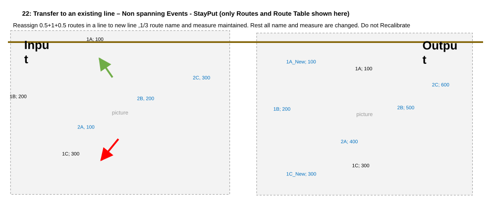

### TC-U50 — Transfer To an Existing Line – Nonspanning Events – Stayput Behavior (case 22-1) <!-- src: S1 · slide 54 · case 22-1 -->

Reassign 0.5+1+0.5 routes in a line to new line ,1/3 route names and measures maintained. Rest all name and measure are changed. Do not Recalibrate source downstream. Calibrate set to stayput
{5C22544A-7EE6-4342-B048-85BDC9FD1C3A}Effective Date
1/1/2023
Source RD
No
{912C8C85-51F0-491E-9774-3900AFEF0FD7}Event ID
From Date
To Date
From Route ID
From M
To M
Location Error
N1
1/1/2000
<Null>
1A
2
4
No Error
N2
1/1/2000
<Null>
1A
2
3
No Error
N3
1/1/2000
<Null>
1A
3
4
No Error
N4
1/1/2000
<Null>
1A
2.5
3.5
No Error
N5
1/1/2000
<Null>
1B
0
2
No Error
N6
1/1/2000
<Null>
1C
0
4
No Error
N7
1/1/2000
<Null>
1C
1
3
No Error
N8
1/1/2000
<Null>
1C
0
2
No Error
N9
1/1/2000
<Null>
1C
2
4
No Error

E1
1/1/2000
<Null>
2A
4
5
No Error
E2
1/1/2000
<Null>
2B
5
8
No Error
E3
1/1/2000
<Null>
2C
0
1
No Error
{912C8C85-51F0-491E-9774-3900AFEF0FD7}Event ID
From Date
To Date
From Route ID
From M
To M
Location Error
N1
1/1/2000
1/1/2023
1A
2
4
No Error
N1
1/1/2023
<Null>
1A
2
3
No Error
N2
1/1/2000
<Null>
1A
2
3
No Error
N3
1/1/2000
1/1/2023
1A
3
4
No Error
N4
1/1/2000
1/1/2023
1A
2.5
3.5
No Error
N4
1/1/2023
<Null>
1A
2.5
3
No Error
N5
1/1/2000
1/1/2023
1B
0
2
No Error
N6
1/1/2000
1/1/2023
1C
0
4
No Error
N6
1/1/2023
<Null>
1C
2
4
No Error
N7
1/1/2000
1/1/2023
1C
1
3
No Error
N7
1/1/2023
<Null>
1C
2
3
No Error
N8
1/1/2000
1/1/2023
1C
0
2
No Error
N9
1/1/2000
<Null>
1C
2
4
No Error

E1
1/1/2000
<Null>
2A
4
5
No Error
E2
1/1/2000
<Null>
2B
5
8
No Error
E3
1/1/2000
<Null>
2C
0
1
No Error
{5940675A-B579-460E-94D1-54222C63F5DA}Route Name
Line Name
Line Order
From Date
To Date
From M
To M
1A
L1
100
1/1/2000
<Null>
2
4
1B
L1
200
1/1/2000
<Null>
0
2
1C
L1
300
1/1/2000
<Null>
0
4
2A
L2
100
1/1/2000
<Null>
4
5
2B
L2
200
1/1/2000
<Null>
5
8
2C
L2
300
1/1/2000
<Null>
0
1

[figure: 1B; 200 · 2A; 400 · 2B; 500 · 2C; 600 · 1A_New; 100 · 1C_New; 300 · 1A; 100 · 1C; 300 · 2A, 100 · 2B, 200 · 2C, 300 · Input · Output · Not affected]

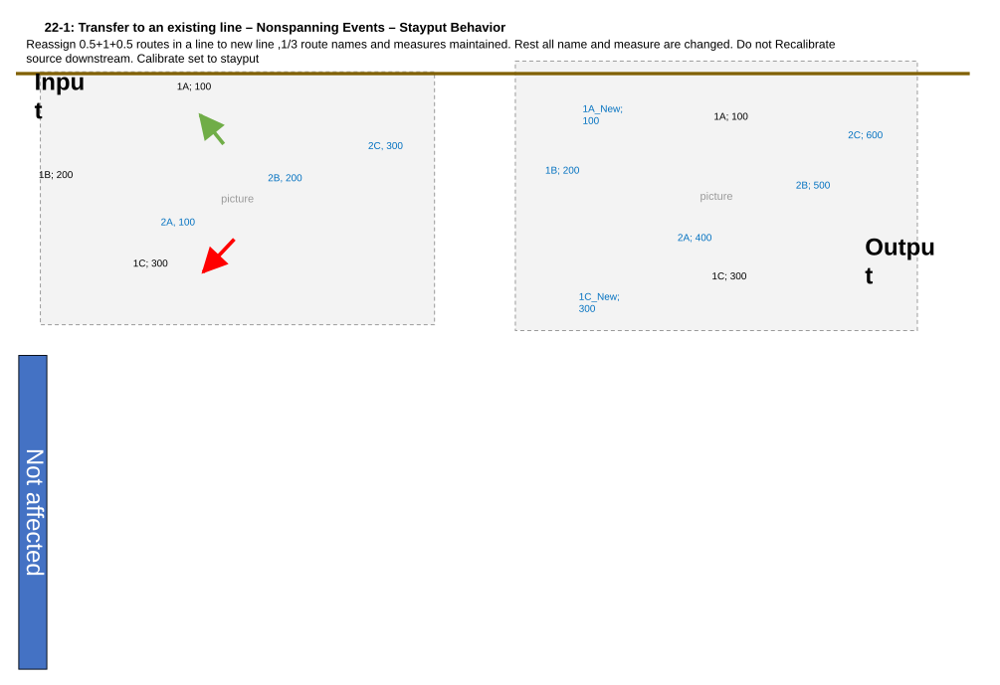

### TC-U51 — Transfer To an Existing Line – Non Spanning Events – Retire Behavior (case 22-2) <!-- src: S1 · slide 55 · case 22-2 -->

Reassign 0.5+1+0.5 routes in a line to new line ,1/3 route names and measures maintained. Rest all name and measure are changed. Do not Recalibrate source downstream. Calibrate set to retire
{5C22544A-7EE6-4342-B048-85BDC9FD1C3A}Effective Date
1/1/2023
Source RD
No
{912C8C85-51F0-491E-9774-3900AFEF0FD7}Event ID
From Date
To Date
From Route ID
From M
To M
Location Error
N1
1/1/2000
<Null>
1A
2
4
No Error
N2
1/1/2000
<Null>
1A
2
3
No Error
N3
1/1/2000
<Null>
1A
3
4
No Error
N4
1/1/2000
<Null>
1A
2.5
3.5
No Error
N5
1/1/2000
<Null>
1B
0
2
No Error
N6
1/1/2000
<Null>
1C
0
4
No Error
N7
1/1/2000
<Null>
1C
1
3
No Error
N8
1/1/2000
<Null>
1C
0
2
No Error
N9
1/1/2000
<Null>
1C
2
4
No Error

E1
1/1/2000
<Null>
2A
4
5
No Error
E2
1/1/2000
<Null>
2B
5
8
No Error
E3
1/1/2000
<Null>
2C
0
1
No Error
{912C8C85-51F0-491E-9774-3900AFEF0FD7}Event ID
From Date
To Date
From Route ID
From M
To M
Location Error
N1
1/1/2000
1/1/2023
1A
2
4
No Error
N2
1/1/2000
<Null>
1A
2
3
No Error
N3
1/1/2000
1/1/2023
1A
3
4
No Error
N4
1/1/2000
1/1/2023
1A
2.5
3.5
No Error
N5
1/1/2000
1/1/2023
1B
0
2
No Error
N6
1/1/2000
1/1/2023
1C
0
4
No Error
N7
1/1/2000
1/1/2023
1C
1
3
No Error
N8
1/1/2000
1/1/2023
1C
0
2
No Error
N9
1/1/2000
<Null>
1C
2
4
No Error

E1
1/1/2000
<Null>
2A
4
5
No Error
E2
1/1/2000
<Null>
2B
5
8
No Error
E3
1/1/2000
<Null>
2C
0
1
No Error
{5940675A-B579-460E-94D1-54222C63F5DA}Route Name
Line Name
Line Order
From Date
To Date
From M
To M
1A
L1
100
1/1/2000
<Null>
2
4
1B
L1
200
1/1/2000
<Null>
0
2
1C
L1
300
1/1/2000
<Null>
0
4
2A
L2
100
1/1/2000
<Null>
4
5
2B
L2
200
1/1/2000
<Null>
5
8
2C
L2
300
1/1/2000
<Null>
0
1

[figure: 1B; 200 · 2A; 400 · 2B; 500 · 2C; 600 · 1A_New; 100 · 1C_New; 300 · 1A; 100 · 1C; 300 · 2A, 100 · 2B, 200 · 2C, 300 · Input · Output · Not affected]

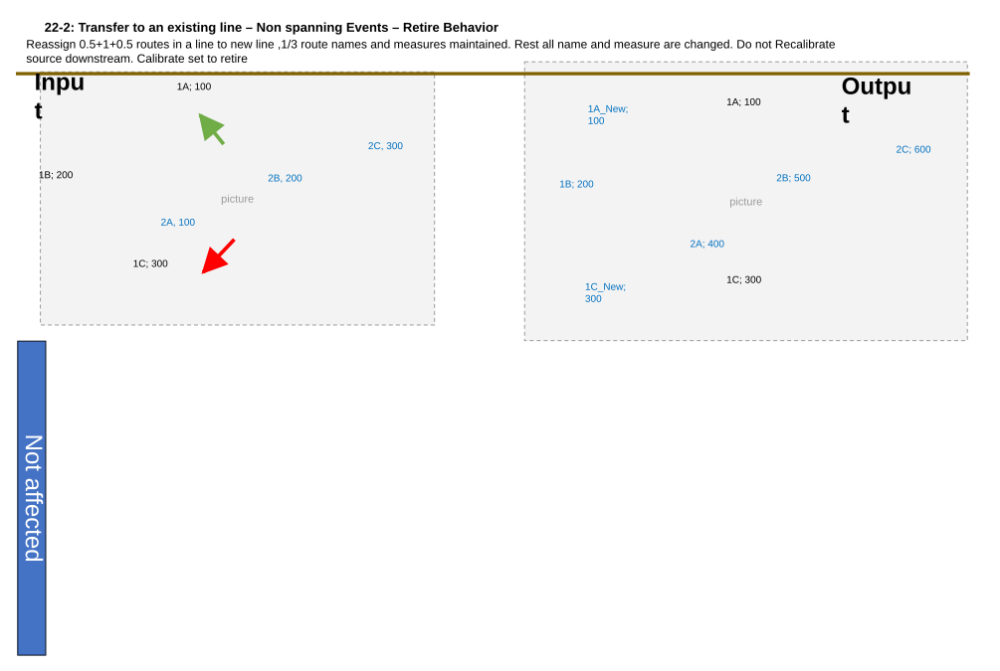

### TC-U52 — Transfer To an Existing Line – Nonspanning Events (case 23) <!-- src: S1 · slide 56 · case 23 -->

- **Case:** Transfer to an existing line – Nonspanning Events – only Routes & Route tables shown - StayPut

Reassign 0.5+1+0.5 routes in a line to new line ,1/3 route name and measure maintained. Rest all name and measure are changed. Do not recalibrate source downstream. Routes have time slices. Effective date : 1/1/2015
{5940675A-B579-460E-94D1-54222C63F5DA}Route Name
Line Name
Line Order
From Date
To Date
From M
To M
1A
L1
100
1/1/2000
1/1/2020
2
4
1B
L1
200
1/1/2005
1/1/2020
0
2
1C
L1
300
1/1/2010
1/1/2020
0
4
2A
L2
100
1/1/2000
<Null>
4
5
2B
L2
200
1/1/2000
<Null>
5
8
2C
L2
300
1/1/2000
<Null>
0
1
{5940675A-B579-460E-94D1-54222C63F5DA}Route Name
Line Name
Line Order
From Date
To Date
From M
To M
1A
L1
100
1/1/2000
1/1/2015
2
4
1B
L1
200
1/1/2005
1/1/2015
0
2
1C
L1
300
1/1/2010
1/1/2015
0
4
2A
L2
100
1/1/2000
1/1/2015
4
5
2B
L2
200
1/1/2000
1/1/2015
5
8
2C
L2
300
1/1/2000
1/1/2015
0
1
1A
L1
100
1/1/2015
1/1/2020
2
3
1C
L1
200
1/1/2015
1/1/2020
2
4
1A_New
L2
100
1/1/2015
1/1/2020
1
2
1B
L2
200
1/1/2015
1/1/2020
0
2
1C_New
L2
300
1/1/2015
1/1/2020
5
6
2A
L2
400
1/1/2015
<Null>
4
5
2B
L2
500
1/1/2015
<Null>
5
8
2C
L2
600
1/1/2015
<Null>
0
1

{5C22544A-7EE6-4342-B048-85BDC9FD1C3A}Effective Date
1/1/2015
Source RD
No

[figure: 1A; 100 · 1B; 200 · 1C; 200 · 2A; 400 · 2B; 500 · 2C; 600 · 1A_New; 100 · 1C_New; 300 · Input · Output]

### TC-U53 — Transfer To an Existing Line – Nonspanning Events – Stayput Behavior – Cntd…. <!-- src: S1 · slide 57 · case 23-1 -->

Reassign 0.5+1+0.5 routes in a line to new line ,1/3 route name and measure maintained. Rest all name and measure are changed. Do not recalibrate source downstream. Routes have time slices. Effective date : 1/1/2015
{5C22544A-7EE6-4342-B048-85BDC9FD1C3A}Effective Date
1/1/2015
Source RD
No
{912C8C85-51F0-491E-9774-3900AFEF0FD7}Event ID
From Date
To Date
From Route ID
From M
To M
Location Error
N1
1/1/2000
1/1/2020
1A
2
4
No Error
N2
1/1/2000
1/1/2020
1A
2
3
No Error
N3
1/1/2000
1/1/2020
1A
3
4
No Error
N4
1/1/2000
1/1/2020
1A
2.5
3.5
No Error
N5
1/1/2005
1/1/2020
1B
0
2
No Error
N6
1/1/2010
1/1/2020
1C
0
4
No Error
N7
1/1/2010
1/1/2020
1C
1
3
No Error
N8
1/1/2010
1/1/2020
1C
0
2
No Error
N9
1/1/2010
1/1/2020
1C
2
4
No Error

E1
1/1/2000
<Null>
2A
4
5
No Error
E2
1/1/2000
<Null>
2B
5
8
No Error
E3
1/1/2000
<Null>
2C
0
1
No Error
{912C8C85-51F0-491E-9774-3900AFEF0FD7}Event ID
From Date
To Date
From Route ID
From M
To M
Location Error
N1
1/1/2000
1/1/2015
1A
2
4
No Error
N1
1/1/2015
1/1/2020
1A
2
3
No Error
N2
1/1/2000
1/1/2020
1A
2
3
No Error
N3
1/1/2000
1/1/2015
1A
3
4
No Error
N4
1/1/2000
1/1/2015
1A
2.5
3.5
No Error
N4
1/1/2015
1/1/2020
1A
2.5
3
No Error
N5
1/1/2005
1/1/2015
1B
0
2
No Error
N6
1/1/2010
1/1/2015
1C
0
4
No Error
N6
1/1/2015
1/1/2020
1C
2
4
No Error
N7
1/1/2010
1/1/2015
1C
1
3
No Error
N7
1/1/2015
1/1/2020
1C
2
3
No Error
N8
1/1/2010
1/1/2015
1C
0
2
No Error
N9
1/1/2010
1/1/2020
1C
2
4
No Error

{5940675A-B579-460E-94D1-54222C63F5DA}Route Name
Line Name
Line Order
From Date
To Date
From M
To M
1A
L1
100
1/1/2000
1/1/2020
2
4
1B
L1
200
1/1/2005
1/1/2020
0
2
1C
L1
300
1/1/2010
1/1/2020
0
4
2A
L2
100
1/1/2000
<Null>
4
5
2B
L2
200
1/1/2000
<Null>
5
8
2C
L2
300
1/1/2000
<Null>
0
1

[figure: 1A; 100 · 1B; 200 · 1C; 200 · 2A; 300 · 2B; 400 · 2C; 500 · 1A_New; 100 · 1C_New; 100 · 1C; 300 · 2A, 100 · 2B, 200 · 2C, 300 · Input · Output · Not affected]

### TC-U54 — Transfer To an Existing Line – Nonspanning Events – Retire Behavior <!-- src: S1 · slide 58 · case 23-2 -->

Reassign 0.5+1+0.5 routes in a line to new line ,1/3 route name and measure maintained. Rest all name and measure are changed. Do not recalibrate source downstream. Routes have time slices. Effective date : 1/1/2015
{5C22544A-7EE6-4342-B048-85BDC9FD1C3A}Effective Date
1/1/2015
Source RD
No
{912C8C85-51F0-491E-9774-3900AFEF0FD7}Event ID
From Date
To Date
From Route ID
From M
To M
Location Error
N1
1/1/2000
1/1/2020
1A
2
4
No Error
N2
1/1/2000
1/1/2020
1A
2
3
No Error
N3
1/1/2000
1/1/2020
1A
3
4
No Error
N4
1/1/2000
1/1/2020
1A
2.5
3.5
No Error
N5
1/1/2005
1/1/2020
1B
0
2
No Error
N6
1/1/2010
1/1/2020
1C
0
4
No Error
N7
1/1/2010
1/1/2020
1C
1
3
No Error
N8
1/1/2010
1/1/2020
1C
0
2
No Error
N9
1/1/2010
1/1/2020
1C
2
4
No Error

E1
1/1/2000
<Null>
2A
4
5
No Error
E2
1/1/2000
<Null>
2B
5
8
No Error
E3
1/1/2000
<Null>
2C
0
1
No Error
{912C8C85-51F0-491E-9774-3900AFEF0FD7}Event ID
From Date
To Date
From Route ID
From M
To M
Location Error
N1
1/1/2000
1/1/2015
1A
2
4
No Error
N2
1/1/2000
1/1/2020
1A
2
3
No Error
N3
1/1/2000
1/1/2015
1A
3
4
No Error
N4
1/1/2000
1/1/2015
1A
2.5
3.5
No Error
N5
1/1/2005
1/1/2015
1B
0
2
No Error
N6
1/1/2010
1/1/2015
1C
0
4
No Error
N7
1/1/2010
1/1/2015
1C
1
3
No Error
N8
1/1/2010
1/1/2015
1C
0
2
No Error
N9
1/1/2010
1/1/2020
1C
2
4
No Error

{5940675A-B579-460E-94D1-54222C63F5DA}Route Name
Line Name
Line Order
From Date
To Date
From M
To M
1A
L1
100
1/1/2000
1/1/2020
2
4
1B
L1
200
1/1/2005
1/1/2020
0
2
1C
L1
300
1/1/2010
1/1/2020
0
4
2A
L2
100
1/1/2000
<Null>
4
5
2B
L2
200
1/1/2000
<Null>
5
8
2C
L2
300
1/1/2000
<Null>
0
1

[figure: 1A; 100 · 1B; 200 · 1C; 200 · 2A; 300 · 2B; 400 · 2C; 500 · 1A_New; 100 · 1C_New; 100 · 1C; 300 · 2A, 100 · 2B, 200 · 2C, 300 · Input · Output · Not affected]

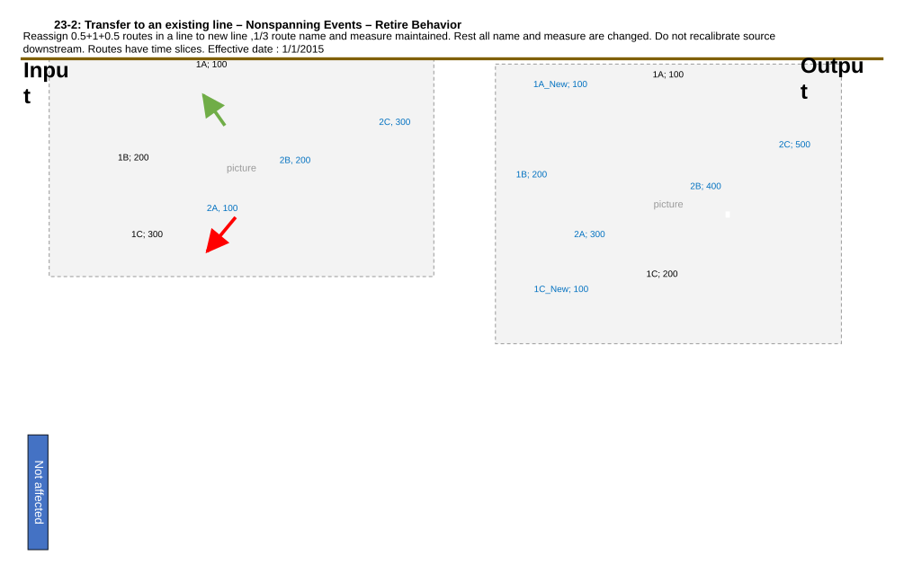

### TC-U55 — Transfer To an Existing Line – Nonspanning Events (case 24) <!-- src: S1 · slide 59 · case 24 -->

- **Case:** Transfer to an existing line – Nonspanning Events – only Routes & Route tables shown

Reassign 0.5+1+0.5 routes in a line to new line ,1/3 route name and measure maintained. Rest all name and measure are changed. Do not recalibrate source downstream. Route 1B & Route IC  is in opposite direction to Route 1A.
{5940675A-B579-460E-94D1-54222C63F5DA}Route Name
Line Name
Line Order
From Date
To Date
From M
To M
1A
L1
100
1/1/2000
<Null>
2
4
1B
L1
200
1/1/2000
<Null>
0
2
1C
L1
300
1/1/2000
<Null>
0
4
2A
L2
100
1/1/2000
<Null>
4
5
2B
L2
200
1/1/2000
<Null>
5
8
2C
L2
300
1/1/2000
<Null>
0
1
{5940675A-B579-460E-94D1-54222C63F5DA}Route Name
Line Name
Line Order
From Date
To Date
From M
To M
1A
L1
100
1/1/2000
1/1/2023
2
4
1B
L1
200
1/1/2000
1/1/2023
0
2
1C
L1
300
1/1/2000
1/1/2023
0
4
2A
L2
100
1/1/2000
1/1/2023
3
5
2B
L2
200
1/1/2000
1/1/2023
4
8
2C
L2
300
1/1/2000
1/1/2023
0
2
1A
L1
100
1/1/2023
<Null>
2
3
1C
L1
200
1/1/2023
<Null>
0
2
1A_New
L2
100
1/1/2023
<Null>
1
2
1B
L2
200
1/1/2023
<Null>
0
2
1C_New
L2
300
1/1/2023
<Null>
5
6
2A
L2
400
1/1/2023
<Null>
4
5
2B
L2
500
1/1/2023
<Null>
5
8
2C
L2
600
1/1/2023
<Null>
0
1

{5C22544A-7EE6-4342-B048-85BDC9FD1C3A}Effective Date
1/1/2023
Source RD
No

[figure: 1A; 100 · 1B; 200 · 1C; 300 · 2A, 100 · 2B, 200 · 2C, 300 · 1C; 200 · 2A; 400 · 2B; 500 · 2C; 600 · 1A_New; 100 · 1C_New; 300 · Input · Output]

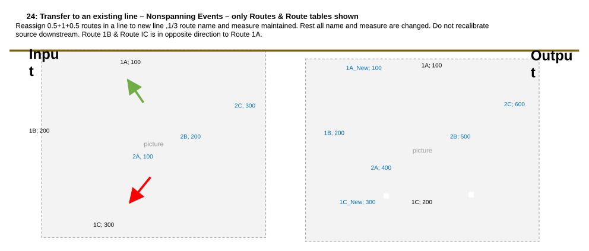

### TC-U56 — Transfer To an Existing Line – Spanning Events – Stayput Behavior (case 24-1) <!-- src: S1 · slide 60 · case 24-1 -->

Reassign 0.5+1+0.5 routes in a line to new line ,1/3 route name and measure maintained. Rest all name and measure are changed. Do not recalibrate source downstream. Route 1B & Route IC  is in opposite direction to Route 1A.

{5C22544A-7EE6-4342-B048-85BDC9FD1C3A}Effective Date
1/1/2023
Source RD
No
{912C8C85-51F0-491E-9774-3900AFEF0FD7}Event ID
From Date
To Date
From Route ID
From M
To M
Location Error
N1
1/1/2000
<Null>
1A
2
4
No Error
N2
1/1/2000
<Null>
1A
2
3
No Error
N3
1/1/2000
<Null>
1A
3
4
No Error
N4
1/1/2000
<Null>
1A
2.5
3.5
No Error
N5
1/1/2000
<Null>
1B
0
2
No Error
N6
1/1/2000
<Null>
1C
0
4
No Error
N7
1/1/2000
<Null>
1C
1
3
No Error
N8
1/1/2000
<Null>
1C
0
2
No Error
N9
1/1/2000
<Null>
1C
2
4
No Error

E1
1/1/2000
<Null>
2A
4
5
No Error
{912C8C85-51F0-491E-9774-3900AFEF0FD7}Event ID
From Date
To Date
From Route ID
From M
To M
Location Error
N1
1/1/2000
1/1/2023
1A
2
4
No Error
N1
1/1/2023
<Null>
1A
2
3
No Error
N2
1/1/2000
<Null>
1A
2
3
No Error
N3
1/1/2000
1/1/2023
1A
3
4
No Error
N4
1/1/2000
1/1/2023
1A
2.5
3.5
No Error
N4
1/1/2023
<Null>
1A
2.5
3
No Error
N5
1/1/2000
1/1/2023
1B
0
2
No Error
N6
1/1/2000
1/1/2023
1C
0
4
No Error
N6
1/1/2023
<Null>
1C
2
4
No Error
N7
1/1/2000
1/1/2023
1C
1
3
No Error
N7
1/1/2023
<Null>
1C
2
3
No Error
N8
1/1/2000
1/1/2023
1C
0
2
No Error
N9
1/1/2000
<Null>
1C
2
4
No Error

E1
1/1/2000
<Null>
2A
4
5
No Error
{5940675A-B579-460E-94D1-54222C63F5DA}Route Name
Line Name
Line Order
From Date
To Date
From M
To M
1A
L1
100
1/1/2000
<Null>
2
4
1B
L1
200
1/1/2000
<Null>
0
2
1C
L1
300
1/1/2000
<Null>
0
4
2A
L2
100
1/1/2000
<Null>
4
5
2B
L2
200
1/1/2000
<Null>
5
8
2C
L2
300
1/1/2000
<Null>
0
1

[figure: Input · Output · 1C; 200 · 1A; 100 · 1B; 200 · 2A; 400 · 2B; 500 · 2C; 600 · 1C_New; 300 · 1A_New; 100 · 1C; 300 · 2A, 100 · 2B, 200 · 2C, 300]

### TC-U57 — Transfer To an Existing Line – Spanning Events – Retire Behavior (case 24-2) <!-- src: S1 · slide 61 · case 24-2 -->

Reassign 0.5+1+0.5 routes in a line to new line ,1/3 route name and measure maintained. Rest all name and measure are changed. Do not recalibrate source downstream. Route 1B & Route IC  is in opposite direction to Route 1A.

{5C22544A-7EE6-4342-B048-85BDC9FD1C3A}Effective Date
1/1/2023
Source RD
No
{912C8C85-51F0-491E-9774-3900AFEF0FD7}Event ID
From Date
To Date
From Route ID
From M
To M
Location Error
N1
1/1/2000
<Null>
1A
2
4
No Error
N2
1/1/2000
<Null>
1A
2
3
No Error
N3
1/1/2000
<Null>
1A
3
4
No Error
N4
1/1/2000
<Null>
1A
2.5
3.5
No Error
N5
1/1/2000
<Null>
1B
0
2
No Error
N6
1/1/2000
<Null>
1C
0
4
No Error
N7
1/1/2000
<Null>
1C
1
3
No Error
N8
1/1/2000
<Null>
1C
0
2
No Error
N9
1/1/2000
<Null>
1C
2
4
No Error

E1
1/1/2000
<Null>
2A
4
5
No Error
{912C8C85-51F0-491E-9774-3900AFEF0FD7}Event ID
From Date
To Date
From Route ID
From M
To M
Location Error
N1
1/1/2000
1/1/2023
1A
2
4
No Error
N2
1/1/2000
<Null>
1A
2
3
No Error
N3
1/1/2000
1/1/2023
1A
3
4
No Error
N4
1/1/2000
1/1/2023
1A
2.5
3.5
No Error
N5
1/1/2000
1/1/2023
1B
0
2
No Error
N6
1/1/2000
1/1/2023
1C
0
4
No Error
N7
1/1/2000
1/1/2023
1C
1
3
No Error
N8
1/1/2000
1/1/2023
1C
0
2
No Error
N9
1/1/2000
<Null>
1C
2
4
No Error

E1
1/1/2000
<Null>
2A
4
5
No Error
{5940675A-B579-460E-94D1-54222C63F5DA}Route Name
Line Name
Line Order
From Date
To Date
From M
To M
1A
L1
100
1/1/2000
<Null>
2
4
1B
L1
200
1/1/2000
<Null>
0
2
1C
L1
300
1/1/2000
<Null>
0
4
2A
L2
100
1/1/2000
<Null>
4
5
2B
L2
200
1/1/2000
<Null>
5
8
2C
L2
300
1/1/2000
<Null>
0
1

[figure: Input · Output · 1C; 200 · 1A; 100 · 1B; 200 · 2A; 400 · 2B; 500 · 2C; 600 · 1C_New; 300 · 1A_New; 100 · 1C; 300 · 2A, 100 · 2B, 200 · 2C, 300]

### TC-U58 — Transfer to an existing line – Nonspanning Events – Stayput <!-- src: S2 · slide 62 · case 25-1 -->

Reassign a part of  complex route to adjacent line , transfer CP , change measures. Recalibrate source downstream. Calibrate set to stayput
{5940675A-B579-460E-94D1-54222C63F5DA}Route Name
Line Name
Line Order
From Date
To Date
From M
To M
1A
L1
100
1/1/2000
<Null>
0
4
2A
L2
200
1/1/2000
<Null>
0
1
{5940675A-B579-460E-94D1-54222C63F5DA}Route Name
Line Name
Line Order
From Date
To Date
From M
To M
1A
L1
100
1/1/2000
1/1/2023
0
4
2A
L2
200
1/1/2000
1/1/2023
0
1
1A
L1
100
1/1/2023
<Null>
0
2
1A_New
L2
100
1/1/2023
<Null>
0
4
2A
L2
200
1/1/2023
<Null>
0
1
{5C22544A-7EE6-4342-B048-85BDC9FD1C3A}Effective Date
1/1/2023
Source RD
Yes
Transfer CP
Yes
{912C8C85-51F0-491E-9774-3900AFEF0FD7}Event ID
From Date
To Date
From Route ID
From M
To M
Location Error
N1
1/1/2000
<Null>
1A
0
4
No Error
N2
1/1/2000
<Null>
1A
3.5
4
No Error
N3
1/1/2000
<Null>
1A
0
0.5
No Error
N4
1/1/2000
<Null>
1A
2.67
3.5
No Error
N5
1/1/2000
<Null>
1A
2
2.67
No Error
N8
1/1/2000
<Null>
1A
1
2
No Error
N9
1/1/2000
<Null>
1A
2
2.67
No Error
{912C8C85-51F0-491E-9774-3900AFEF0FD7}Event ID
From Date
To Date
From Route ID
From M
To M
Location Error
N1
1/1/2000
1/1/2023
1A
0
4
No Error
N1
1/1/2023
<Null>
1A
0
2
No Error
N2
1/1/2000
1/1/2023
1A
3.5
4
No Error
N2
1/1/2023
<Null>
1A
1.5
2
No Error
N3
1/1/2000
1/1/2023
1A
0
0.5
No Error
N4
1/1/2000
1/1/2023
1A
2.67
3.5
No Error
N4
1/1/2023
<Null>
1A
0.67
1.5
No Error
N5
1/1/2000
1/1/2023
1A
2
2.67
No Error
N5
1/1/2023
<Null>
1A
0
0.67
No Error
N8
1/1/2000
1/1/2023
1A
1
2
No Error
N9
1/1/2000
1/1/2023
1A
2
2.67
No Error
N9
1/1/2023
<Null>
1A
0
0.67
No Error

[figure: 1A; 100 · 2A; 200 · 1A_New; 100 · Input · Output · 2A; 100]

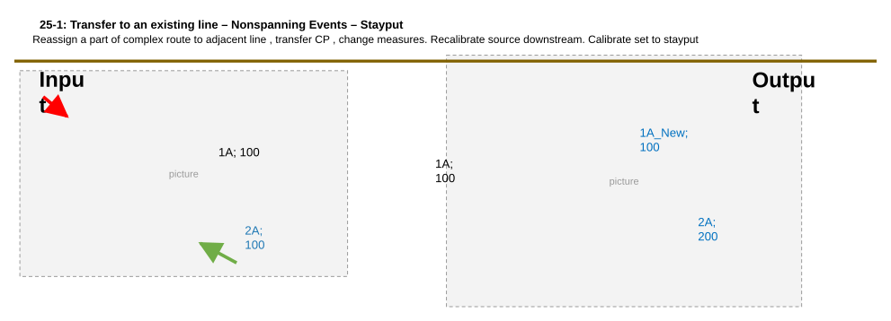

### TC-U59 — Transfer to an existing line – Nonspanning Events – Retire <!-- src: S2 · slide 63 · case 25-2 -->

Reassign a part of  complex route to adjacent line , transfer CP , change measures. Recalibrate source downstream. Calibrate set to retire
{5940675A-B579-460E-94D1-54222C63F5DA}Route Name
Line Name
Line Order
From Date
To Date
From M
To M
1A
L1
100
1/1/2000
<Null>
0
4
2A
L2
200
1/1/2000
<Null>
0
1
{5940675A-B579-460E-94D1-54222C63F5DA}Route Name
Line Name
Line Order
From Date
To Date
From M
To M
1A
L1
100
1/1/2000
1/1/2023
0
4
2A
L2
200
1/1/2000
1/1/2023
0
1
1A
L1
100
1/1/2023
<Null>
0
2
1A_New
L2
100
1/1/2023
<Null>
0
4
2A
L2
200
1/1/2023
<Null>
0
1
{5C22544A-7EE6-4342-B048-85BDC9FD1C3A}Effective Date
1/1/2023
Source RD
Yes
Transfer CP
Yes
{912C8C85-51F0-491E-9774-3900AFEF0FD7}Event ID
From Date
To Date
From Route ID
From M
To M
Location Error
N1
1/1/2000
<Null>
1A
0
4
No Error
N2
1/1/2000
<Null>
1A
3.5
4
No Error
N3
1/1/2000
<Null>
1A
0
0.5
No Error
N4
1/1/2000
<Null>
1A
2.67
3.5
No Error
N5
1/1/2000
<Null>
1A
2
2.67
No Error
N8
1/1/2000
<Null>
1A
1
2
No Error
N9
1/1/2000
<Null>
1A
2
2.67
No Error
{912C8C85-51F0-491E-9774-3900AFEF0FD7}Event ID
From Date
To Date
From Route ID
From M
To M
Location Error
N1
1/1/2000
1/1/2023
1A
0
4
No Error
N2
1/1/2000
1/1/2023
1A
3.5
4
No Error
N3
1/1/2000
1/1/2023
1A
0
0.5
No Error
N4
1/1/2000
1/1/2023
1A
2.67
3.5
No Error
N5
1/1/2000
1/1/2023
1A
2
2.67
No Error
N8
1/1/2000
1/1/2023
1A
1
2
No Error
N9
1/1/2000
1/1/2023
1A
2
2.67
No Error

[figure: 1A; 100 · 2A; 200 · 1A_New; 100 · Input · Output · 2A; 100]

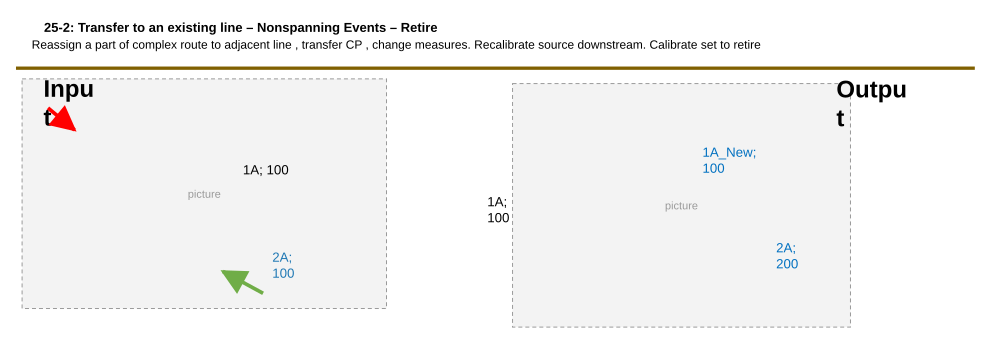

### TC-U60 — Transfer To an Existing Line – Point Events – Stayput and Retire Behavior (case 27) <!-- src: S1 · slide 66 · case 27 -->

Reassign all the routes in a line to another line transferring routes and measures ; keep original measures; keep original route name
{5940675A-B579-460E-94D1-54222C63F5DA}Route Name
Line Name
Line Order
From Date
To Date
From M
To M
1A
L1
100
1/1/2000
<Null>
2
4
1B
L1
200
1/1/2000
<Null>
0
2
1C
L1
300
1/1/2000
<Null>
0
4
2A
L2
100
1/1/2000
<Null>
3
5
2B
L2
200
1/1/2000
<Null>
4
8
2C
L2
300
1/1/2000
<Null>
0
2
{912C8C85-51F0-491E-9774-3900AFEF0FD7}Event ID
From Date
To Date
From Route ID
From M
Location Error
1
1/1/2000
<Null>
1A
2
No Error
2
1/1/2000
<Null>
1B
1
No Error
3
1/1/2000
<Null>
1C
1
No Error
4
1/1/2000
<Null>
1C
4
No Error
5
1/1/2000
<Null>
1A
4
No Error
6
1/1/2000
<Null>
1B
0
No Error
{5940675A-B579-460E-94D1-54222C63F5DA}Route Name
Line Name
Line Order
From Date
To Date
From M
To M
1A
L1
100
1/1/2000
1/1/2023
2
4
1B
L1
200
1/1/2000
1/1/2023
0
2
1C
L1
300
1/1/2000
1/1/2023
0
4
2A
L2
100
1/1/2000
1/1/2023
3
5
2B
L2
200
1/1/2000
1/1/2023
4
8
2C
L2
300
1/1/2000
1/1/2023
0
2
1A
L2
100
1/1/2023
<Null>
2
4
1B
L2
200
1/1/2023
<Null>
0
2
1C
L2
300
1/1/2023
<Null>
0
4
2A
L2
400
1/1/2023
<Null>
3
5
2B
L2
500
1/1/2023
<Null>
4
8
2C
L2
600
1/1/2023
<Null>
0
2
{912C8C85-51F0-491E-9774-3900AFEF0FD7}Event ID
From Date
To Date
From Route ID
From M
Location Error
1
1/1/2000
1/1/2023
1A
2
No Error
2
1/1/2000
1/1/2023
1B
1
No Error
3
1/1/2000
1/1/2023
1C
1
No Error
4
1/1/2000
1/1/2023
1C
4
No Error
4
1/1/2000
1/1/2023
1A
4
No Error
5
1/1/2000
1/1/2023
1B
0
No Error
{5C22544A-7EE6-4342-B048-85BDC9FD1C3A}Effective Date
1/1/2023

[figure: 1A; 100 · 1B; 200 · 1C; 300 · 2A, 100 · 2B, 200 · 2C, 300 · 4 · 3 · 5 · 8 · 0 · 2 · Input · Output · 1 · 2A; 400 · 2B; 500 · 2C; 600]

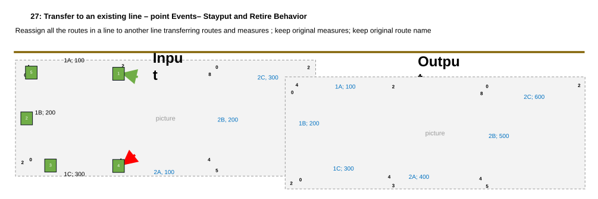

### TC-U61 — Transfer To an Existing Line – Point Events – Stayput and Retire Behavior (case 28) <!-- src: S1 · slide 67 · case 28 -->

Reassign all the routes in a line to another line on right, transferring routes. Measures changed. Route Name changed.
{5940675A-B579-460E-94D1-54222C63F5DA}Route Name
Line Name
Line Order
From Date
To Date
From M
To M
1A
L1
100
1/1/2000
<Null>
2
4
1B
L1
200
1/1/2000
<Null>
0
2
1C
L1
300
1/1/2000
<Null>
0
4
2A
L2
100
1/1/2000
<Null>
3
5
2B
L2
200
1/1/2000
<Null>
4
8
2C
L2
300
1/1/2000
<Null>
0
2
{912C8C85-51F0-491E-9774-3900AFEF0FD7}Event ID
From Date
To Date
From Route ID
From M
Location Error
1
1/1/2000
<Null>
1A
2
No Error
2
1/1/2000
<Null>
1B
1
No Error
3
1/1/2000
<Null>
1C
1
No Error
4
1/1/2000
<Null>
1C
4
No Error
{5940675A-B579-460E-94D1-54222C63F5DA}Route Name
Line Name
Line Order
From Date
To Date
From M
To M
1A
L1
100
1/1/2000
1/1/2023
2
4
1B
L1
200
1/1/2000
1/1/2023
0
2
1C
L1
300
1/1/2000
1/1/2023
0
4
2A
L2
100
1/1/2000
1/1/2023
3
5
2B
L2
200
1/1/2000
1/1/2023
4
8
2C
L2
300
1/1/2000
1/1/2023
0
2
1A_New
L2
100
1/1/2023
<Null>
5
8
1B_New
L2
200
1/1/2023
<Null>
2
4
1C_New
L2
300
1/1/2023
<Null>
4
9
2A
L2
400
1/1/2023
<Null>
3
5
2B
L2
500
1/1/2023
<Null>
4
8
2C
L2
600
1/1/2023
<Null>
0
2
{912C8C85-51F0-491E-9774-3900AFEF0FD7}Event ID
From Date
To Date
From Route ID
From M
Location Error
1
1/1/2000
1/1/2023
1A
2
No Error
2
1/1/2000
1/1/2023
1B
1
No Error
3
1/1/2000
1/1/2023
1C
1
No Error
4
1/1/2000
1/1/2023
1C
4
No Error
{5C22544A-7EE6-4342-B048-85BDC9FD1C3A}Effective Date
1/1/2023

[figure: 1A; 100 · 1B; 200 · 1C; 300 · 2A, 100 · 2B, 200 · 2C, 300 · 4 · 3 · 5 · 8 · 0 · 2 · Input · Output · 1 · 1A_new; 100 · 1B_New 200 · 1C_New; 300 · 2A; 400 · 2B; 500 · 2C; 600 · 9]

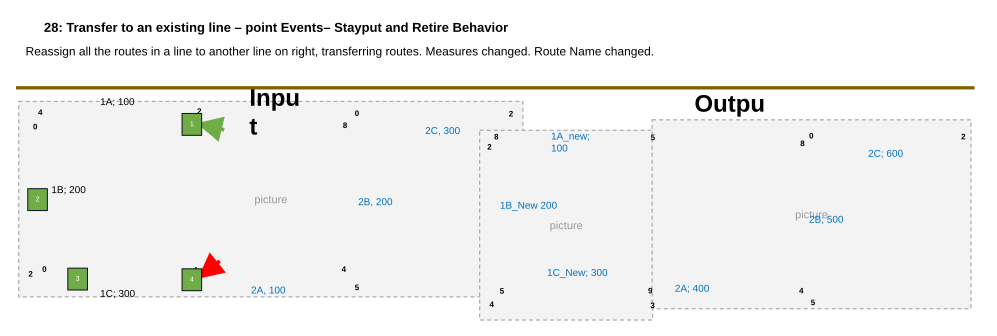

### TC-U62 — Transfer To an Existing Line – Point Events – Stayput and Retire Behavior (case 29) <!-- src: S1 · slide 68 · case 29 -->

Reassign all the routes in a line to another line on right, transferring routes and measures. The effective date is same as source route’s From Date. keep original measures; keep original route name
{5940675A-B579-460E-94D1-54222C63F5DA}Route Name
Line Name
Line Order
From Date
To Date
From M
To M
1A
L1
100
1/1/2000
<Null>
2
4
1B
L1
200
1/1/2000
<Null>
0
2
1C
L1
300
1/1/2000
<Null>
0
4
2A
L2
100
1/1/2000
<Null>
3
5
2B
L2
200
1/1/2000
<Null>
4
8
2C
L2
300
1/1/2000
<Null>
0
2
{912C8C85-51F0-491E-9774-3900AFEF0FD7}Event ID
From Date
To Date
From Route ID
From M
Location Error
1
1/1/2000
<Null>
1A
2
No Error
2
1/1/2000
<Null>
1B
1
No Error
3
1/1/2000
<Null>
1C
1
No Error
4
1/1/2000
<Null>
1C
4
No Error
{5940675A-B579-460E-94D1-54222C63F5DA}Route Name
Line Name
Line Order
From Date
To Date
From M
To M
1A
L2
100
1/1/2000
<Null>
5
8
1B
L2
200
1/1/2000
<Null>
2
4
1C
L2
300
1/1/2000
<Null>
4
9
2A
L2
400
1/1/2000
<Null>
3
5
2B
L2
500
1/1/2000
<Null>
4
8
2C
L2
600
1/1/2000
<Null>
0
2
{912C8C85-51F0-491E-9774-3900AFEF0FD7}Event ID
From Date
To Date
From Route ID
From M
Location Error
1
1/1/2000
1/1/2023
1A
2
No Error
2
1/1/2000
1/1/2023
1B
1
No Error
3
1/1/2000
1/1/2023
1C
1
No Error
4
1/1/2000
1/1/2023
1C
4
No Error
{5C22544A-7EE6-4342-B048-85BDC9FD1C3A}Effective Date
1/1/2000

[figure: 1A; 100 · 1B; 200 · 1C; 300 · 2A, 100 · 2B, 200 · 2C, 300 · 4 · 3 · 5 · 8 · 0 · 2 · Input · Output · 1 · 2A; 400 · 2B; 500 · 2C; 600 · 9]

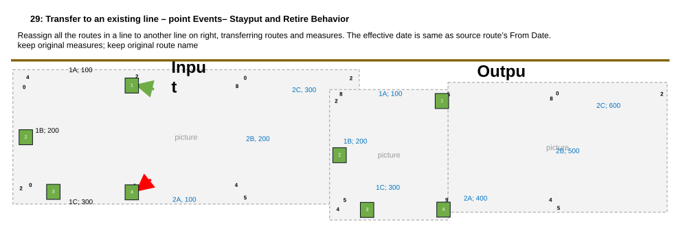

### TC-U63 — Transfer To an Existing Line – Point Events – Stayput and Retire Behavior (case 30) <!-- src: S1 · slide 69 · case 30 -->

Reassign all the routes in a line to another line on right, transferring routes and measures. The effective date is same as source route’s From Date. Change measures; keep original route name
{5940675A-B579-460E-94D1-54222C63F5DA}Route Name
Line Name
Line Order
From Date
To Date
From M
To M
1A
L1
100
1/1/2000
<Null>
2
4
1B
L1
200
1/1/2000
<Null>
0
2
1C
L1
300
1/1/2000
<Null>
0
4
2A
L2
100
1/1/2000
<Null>
3
5
2B
L2
200
1/1/2000
<Null>
4
8
2C
L2
300
1/1/2000
<Null>
0
2
{912C8C85-51F0-491E-9774-3900AFEF0FD7}Event ID
From Date
To Date
From Route ID
From M
Location Error
1
1/1/2000
<Null>
1A
2
No Error
2
1/1/2000
<Null>
1B
1
No Error
3
1/1/2000
<Null>
1C
1
No Error
4
1/1/2000
<Null>
1C
4
No Error
{5940675A-B579-460E-94D1-54222C63F5DA}Route Name
Line Name
Line Order
From Date
To Date
From M
To M
1A
L2
100
1/1/2000
<Null>
5
8
1B
L2
200
1/1/2000
<Null>
2
4
1C
L2
300
1/1/2000
<Null>
4
9
2A
L2
400
1/1/2000
<Null>
3
5
2B
L2
500
1/1/2000
<Null>
4
8
2C
L2
600
1/1/2000
<Null>
0
2
{912C8C85-51F0-491E-9774-3900AFEF0FD7}Event ID
From Date
To Date
From Route ID
From M
Location Error
1
1/1/2000
<Null>
1A
2
Measure not found
2
1/1/2000
<Null>
1B
1
Measure not found
3
1/1/2000
<Null>
1C
1
Measure not found
4
1/1/2000
<Null>
1C
4
Measure not found
{5C22544A-7EE6-4342-B048-85BDC9FD1C3A}Effective Date
1/1/2000

[figure: 1A; 100 · 1B; 200 · 1C; 300 · 2A, 100 · 2B, 200 · 2C, 300 · 4 · 3 · 5 · 8 · 0 · 2 · Input · Output · 1 · 2A; 400 · 2B; 500 · 2C; 600 · 9]

### TC-U64 — Transfer To an Existing Line – Point Events – Stayput and Retire Behavior (case 31) <!-- src: S1 · slide 70 · case 31 -->

Reassign all the routes in a line to another line on right, transferring routes and measures. The effective date is same as source route’s From Date. Change Measures; Change route name
{5940675A-B579-460E-94D1-54222C63F5DA}Route Name
Line Name
Line Order
From Date
To Date
From M
To M
1A
L1
100
1/1/2000
<Null>
2
4
1B
L1
200
1/1/2000
<Null>
0
2
1C
L1
300
1/1/2000
<Null>
0
4
2A
L2
100
1/1/2000
<Null>
3
5
2B
L2
200
1/1/2000
<Null>
4
8
2C
L2
300
1/1/2000
<Null>
0
2
{912C8C85-51F0-491E-9774-3900AFEF0FD7}Event ID
From Date
To Date
From Route ID
From M
Location Error
1
1/1/2000
<Null>
1A
2
No Error
2
1/1/2000
<Null>
1B
1
No Error
3
1/1/2000
<Null>
1C
1
No Error
4
1/1/2000
<Null>
1C
4
No Error
{5940675A-B579-460E-94D1-54222C63F5DA}Route Name
Line Name
Line Order
From Date
To Date
From M
To M
1A_New
L2
100
1/1/2000
<Null>
5
8
1B_New
L2
200
1/1/2000
<Null>
2
4
1C_New
L2
300
1/1/2000
<Null>
4
9
2A
L2
400
1/1/2000
<Null>
3
5
2B
L2
500
1/1/2000
<Null>
4
8
2C
L2
600
1/1/2000
<Null>
0
2
{912C8C85-51F0-491E-9774-3900AFEF0FD7}Event ID
From Date
To Date
From Route ID
From M
Location Error
1
1/1/2000
<Null>
1A
2
Route not found
2
1/1/2000
<Null>
1B
1
Route not found
3
1/1/2000
<Null>
1C
1
Route not found
4
1/1/2000
<Null>
1C
4
Route not found
{5C22544A-7EE6-4342-B048-85BDC9FD1C3A}Effective Date
1/1/2000

[figure: 1A; 100 · 1B; 200 · 1C; 300 · 2A, 100 · 2B, 200 · 2C, 300 · 4 · 3 · 5 · 8 · 0 · 2 · Input · Output · 1 · 1A_New; 100 · 1B_New; 200 · 1C_New; 300 · 2A; 400 · 2B; 500 · 2C; 600 · 9]

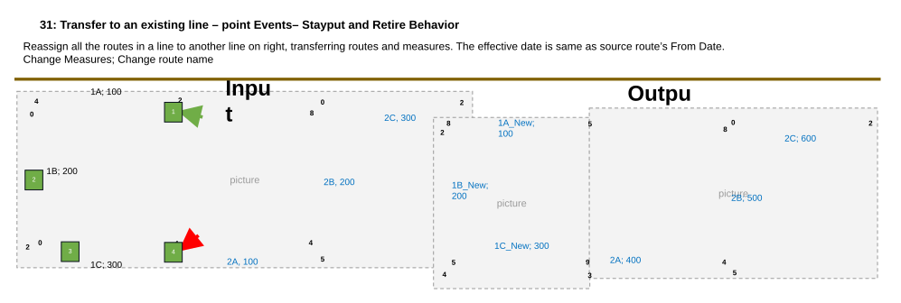

### TC-U65 — Transfer To an Existing Line – Point Events – Stayput and Retire Behavior (case 32) <!-- src: S1 · slide 71 · case 32 -->

Reassign all the routes in a line to another line on right, transferring routes and measures. The effective date is same as source route’s From Date. Same route name , changing only the From Measure of the first route and  To Measure of the last route.
{5940675A-B579-460E-94D1-54222C63F5DA}Route Name
Line Name
Line Order
From Date
To Date
From M
To M
1A
L1
100
1/1/2000
<Null>
2
4
1B
L1
200
1/1/2000
<Null>
0
2
1C
L1
300
1/1/2000
<Null>
0
4
2A
L2
100
1/1/2000
<Null>
3
5
2B
L2
200
1/1/2000
<Null>
4
8
2C
L2
300
1/1/2000
<Null>
0
2
{912C8C85-51F0-491E-9774-3900AFEF0FD7}Event ID
From Date
To Date
From Route ID
From M
Location Error
1
1/1/2000
<Null>
1A
2
No Error
2
1/1/2000
<Null>
1B
1
No Error
3
1/1/2000
<Null>
1C
1
No Error
4
1/1/2000
<Null>
1C
4
No Error
{5940675A-B579-460E-94D1-54222C63F5DA}Route Name
Line Name
Line Order
From Date
To Date
From M
To M
1A
L2
100
1/1/2000
<Null>
5
8
1B
L2
200
1/1/2000
<Null>
2
4
1C
L2
300
1/1/2000
<Null>
4
9
2A
L2
400
1/1/2000
<Null>
3
5
2B
L2
500
1/1/2000
<Null>
4
8
2C
L2
600
1/1/2000
<Null>
0
2
{912C8C85-51F0-491E-9774-3900AFEF0FD7}Event ID
From Date
To Date
From Route ID
From M
Location Error
1
1/1/2000
<Null>
1A
2
Measure not found
2
1/1/2000
<Null>
1B
1
Route not found
3
1/1/2000
<Null>
1C
1
Route not found
4
1/1/2000
<Null>
1C
4
Route not found
{5C22544A-7EE6-4342-B048-85BDC9FD1C3A}Effective Date
1/1/2000

[figure: 1A; 100 · 1B; 200 · 1C; 300 · 2A, 100 · 2B, 200 · 2C, 300 · 4 · 3 · 5 · 8 · 0 · 2 · Input · Output · 1 · 2A; 400 · 2B; 500 · 2C; 600 · 2–4]

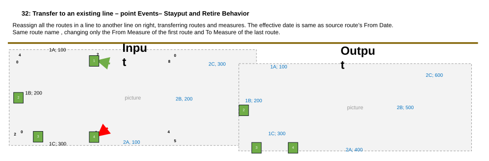

### TC-U66 — Transfer To an Existing Line – Point Events – Stayput and Retire Behavior (case 33) <!-- src: S1 · slide 72 · case 33 -->

Reassign all the routes in a line to another line on right, 2/3 route names and measures maintained. The first route in the line has changed name and measure changed.
{5940675A-B579-460E-94D1-54222C63F5DA}Route Name
Line Name
Line Order
From Date
To Date
From M
To M
1A
L1
100
1/1/2000
<Null>
2
4
1B
L1
200
1/1/2000
<Null>
0
2
1C
L1
300
1/1/2000
<Null>
0
4
2A
L2
100
1/1/2000
<Null>
3
5
2B
L2
200
1/1/2000
<Null>
4
8
2C
L2
300
1/1/2000
<Null>
0
2
{912C8C85-51F0-491E-9774-3900AFEF0FD7}Event ID
From Date
To Date
From Route ID
From M
Location Error
1
1/1/2000
<Null>
1A
2
No Error
2
1/1/2000
<Null>
1B
1
No Error
3
1/1/2000
<Null>
1C
1
No Error
4
1/1/2000
<Null>
1C
4
No Error
{5940675A-B579-460E-94D1-54222C63F5DA}Route Name
Line Name
Line Order
From Date
To Date
From M
To M
1A
L1
100
1/1/2000
1/1/2023
2
4
1B
L1
200
1/1/2000
1/1/2023
0
2
1C
L1
300
1/1/2000
1/1/2023
0
4
2A
L2
100
1/1/2000
1/1/2023
3
5
2B
L2
200
1/1/2000
1/1/2023
4
8
2C
L2
300
1/1/2000
1/1/2023
0
2
1A_New
L2
100
1/1/2023
<Null>
5
8
1B
L2
200
1/1/2023
<Null>
0
2
1C
L2
300
1/1/2023
<Null>
0
4
2A
L2
400
1/1/2023
<Null>
3
5
2B
L2
500
1/1/2023
<Null>
4
8
2C
L2
600
1/1/2023
<Null>
0
2
{912C8C85-51F0-491E-9774-3900AFEF0FD7}Event ID
From Date
To Date
From Route ID
From M
Location Error
1
1/1/2000
1/1/2023
1A
2
No Error
2
1/1/2000
1/1/2023
1B
1
No Error
3
1/1/2000
1/1/2023
1C
1
No Error
4
1/1/2000
1/1/2023
1C
4
No Error
{5C22544A-7EE6-4342-B048-85BDC9FD1C3A}Effective Date
1/1/2023

[figure: 1A; 100 · 1B; 200 · 1C; 300 · 2A, 100 · 2B, 200 · 2C, 300 · 4 · 3 · 5 · 8 · 0 · 2 · Input · Output · 1 · 1A_New; 100 · 1B_New 200 · 1C_New; 300 · 2A; 400 · 2B; 500 · 2C; 600 · 9]

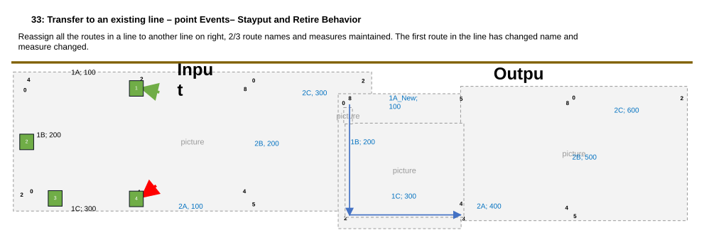

### TC-U67 — Transfer To an Existing Line – Point Events – Stayput & Retire Behavior <!-- src: S1 · slide 73 · case 34-1 -->

Reassign 1 entire route  and a partial route  in a line to another line transferring routes and measures. ; Keep the same name for the entire route and partial route (name of a retired route from the line to which route is reassigned), Change measures.
{5940675A-B579-460E-94D1-54222C63F5DA}Route Name
Line Name
Line Order
From Date
To Date
From M
To M
1A
L1
100
1/1/2000
<Null>
2
4
1B
L1
200
1/1/2000
<Null>
0
2
1C
L1
300
1/1/2000
<Null>
0
4
2A
L2
100
1/1/2000
<Null>
3
5
2B
L2
200
1/1/2000
<Null>
4
8
2C
L2
300
1/1/2000
<Null>
0
2
{912C8C85-51F0-491E-9774-3900AFEF0FD7}Event ID
From Date
To Date
From Route ID
From M
Location Error
1
1/1/2000
<Null>
1A
2
No Error
2
1/1/2000
<Null>
1B
0.5
No Error
3
1/1/2000
<Null>
1B
1
No Error
4
1/1/2000
<Null>
1B
1.5
No Error
5
1/1/2000
<Null>
1C
1
No Error
6
1/1/2000
<Null>
1C
2.5
No Error
7
1/1/2000
<Null>
1C
4
No Error
{5C22544A-7EE6-4342-B048-85BDC9FD1C3A}Effective Date
1/1/2023
{5940675A-B579-460E-94D1-54222C63F5DA}Route Name
Line Name
Line Order
From Date
To Date
From M
To M
1A
L1
100
1/1/2000
1/1/2023
2
4
1B
L1
200
1/1/2000
1/1/2023
0
2
1C
L1
300
1/1/2000
1/1/2023
0
4
2A
L2
100
1/1/2000
1/1/2023
3
5
2B
L2
200
1/1/2000
1/1/2023
4
8
2C
L2
300
1/1/2000
1/1/2023
0
2
1B
L1
200
1/1/2023
<Null>
0
1
1R1
L2
100
1/1/2023
<Null>
0
1
1C
L2
200
1/1/2023
<Null>
4
6
2A
L2
300
1/1/2023
<Null>
3
5
2B
L2
400
1/1/2023
<Null>
4
8
2C
L2
500
1/1/2023
<Null>
0
2
{912C8C85-51F0-491E-9774-3900AFEF0FD7}Event ID
From Date
To Date
From Route ID
From M
Location Error
1
1/1/2000
<Null>
1A
2
No Error
2
1/1/2000
<Null>
1B
0.5
No Error
3
1/1/2000
<Null>
1B
1
No Error
4
1/1/2000
1/1/2023
1B
1.5
No Error
5
1/1/2000
1/1/2023
1C
1
No Error
6
1/1/2000
1/1/2023
1C
2.5
No Error
7
1/1/2000
1/1/2023
1C
4
No Error

[figure: 1A; 100 · 1B; 200 · 1C; 300 · 2A, 100 · 2B, 200 · 2C, 300 · 4 · 3 · 5 · 8 · 0 · 2 · Input · Output · 1 · 7 · 6 · 1C; 200 · 2A; 300 · 2B; 400 · 2C; 500 · 1R1; 100]

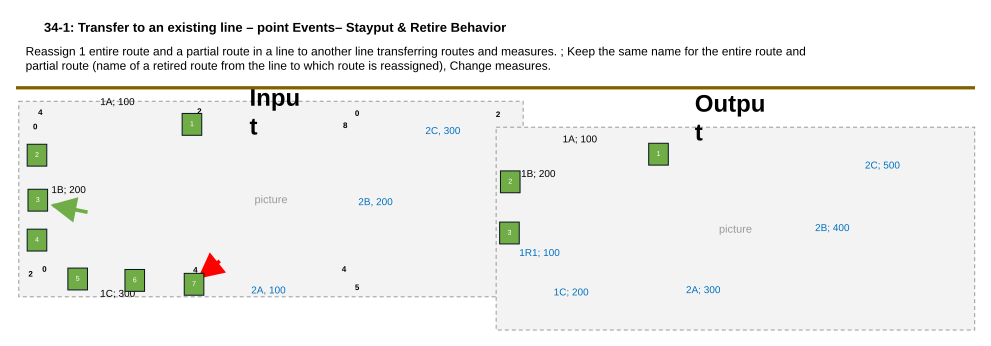

### TC-U68 — Transfer to an existing line – point Events– Stayput Behavior <!-- src: S2 · slide 74 · case 35-1 -->

Transfer partial route (1/2 of a route) in a line to adjacent upstream existing line , recalibrate source route downstream ,calibrate set to stayput, route name changed , no measure change for the reassigned route portion
{912C8C85-51F0-491E-9774-3900AFEF0FD7}Event ID
From Date
To Date
From Route ID
From M
Location Error
1
1/1/2000
<Null>
1A
2
No Error
2
1/1/2000
<Null>
1A
2.5
No Error
3
1/1/2000
<Null>
1A
3
No Error
4
1/1/2000
<Null>
1A
3.5
No Error
5
1/1/2000
<Null>
1B
1
No Error
6
1/1/2000
<Null>
1C
2
No Error
{5940675A-B579-460E-94D1-54222C63F5DA}Route Name
Line Name
Line Order
From Date
To Date
From M
To M
0A
L0
100
1/1/2000
<Null>
3
5
1A
L1
100
1/1/2000
<Null>
2
4
1B
L1
200
1/1/2000
<Null>
0
2
1C
L1
300
1/1/2000
<Null>
0
4
{5940675A-B579-460E-94D1-54222C63F5DA}Route Name
Line Name
Line Order
From Date
To Date
From M
To M
0A
L0
100
1/1/2000
<Null>
3
5
1A_New
L0
200
1/1/2023
<Null>
2
3
1A
L1
100
1/1/2023
<Null>
0
1
1A
L1
100
1/1/2000
1/1/2023
2
4
1B
L1
200
1/1/2000
1/1/2023
0
2
1C
L1
300
1/1/2000
1/1/2023
0
4
{912C8C85-51F0-491E-9774-3900AFEF0FD7}Event ID
From Date
To Date
From Route ID
From M
Location Error
1
1/1/2000
1/1/2023
1A
2
No Error
2
1/1/2000
1/1/2023
1A
2.5
No Error
3
1/1/2000
1/1/2023
1A
3
No Error
3
1/1/2023
<Null>
1A
0
No Error
4
1/1/2000
1/1/2023
1A
3.5
No Error
4
1/1/2023
<Null>
1A
1.5
No Error
5
1/1/2000
<Null>
1B
1
No Error
6
1/1/2000
<Null>
1C
2
No Error
{5C22544A-7EE6-4342-B048-85BDC9FD1C3A}Effective Date
1/1/2023
Source RD
Yes

[figure: 1A; 100 · 1B; 200 · 1C; 300 · 0A, 100 · 4 · 0 · 2 · 0–2 · 3 · 5 · 6 · Input · Output · 1 · 1A_New; 200]

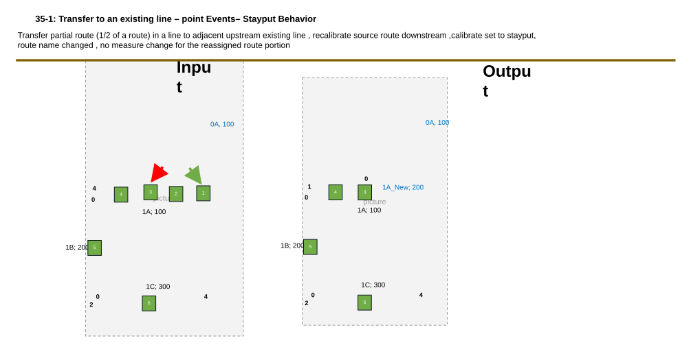

### TC-U69 — Transfer to an existing line – point Events– Retire Behavior <!-- src: S2 · slide 75 · case 35-2 -->

Transfer partial route (1/2 of a route) in a line to adjacent upstream existing line , recalibrate source route downstream, calibrate set to retire, route name changed , no measure change for the reassigned route portion
{912C8C85-51F0-491E-9774-3900AFEF0FD7}Event ID
From Date
To Date
From Route ID
From M
Location Error
1
1/1/2000
<Null>
1A
2
No Error
2
1/1/2000
<Null>
1A
2.5
No Error
3
1/1/2000
<Null>
1A
3
No Error
4
1/1/2000
<Null>
1A
3.5
No Error
5
1/1/2000
<Null>
1B
1
No Error
6
1/1/2000
<Null>
1C
2
No Error
{5940675A-B579-460E-94D1-54222C63F5DA}Route Name
Line Name
Line Order
From Date
To Date
From M
To M
0A
L0
100
1/1/2000
<Null>
3
5
1A
L1
100
1/1/2000
<Null>
2
4
1B
L1
200
1/1/2000
<Null>
0
2
1C
L1
300
1/1/2000
<Null>
0
4
{5940675A-B579-460E-94D1-54222C63F5DA}Route Name
Line Name
Line Order
From Date
To Date
From M
To M
0A
L0
100
1/1/2000
<Null>
3
5
1A_New
L0
200
1/1/2023
<Null>
2
3
1A
L1
100
1/1/2023
<Null>
0
1
1A
L1
100
1/1/2000
1/1/2023
2
4
1B
L1
200
1/1/2000
1/1/2023
0
2
1C
L1
300
1/1/2000
1/1/2023
0
4
{912C8C85-51F0-491E-9774-3900AFEF0FD7}Event ID
From Date
To Date
From Route ID
From M
Location Error
1
1/1/2000
1/1/2023
1A
2
No Error
2
1/1/2000
1/1/2023
1A
2.5
No Error
3
1/1/2000
1/1/2023
1A
3
No Error
4
1/1/2000
1/1/2023
1A
3.5
No Error
5
1/1/2000
<Null>
1B
1
No Error
6
1/1/2000
<Null>
1C
2
No Error
{5C22544A-7EE6-4342-B048-85BDC9FD1C3A}Effective Date
1/1/2023
Source RD
Yes

[figure: 1A; 100 · 1B; 200 · 1C; 300 · 0A, 100 · 4 · 0 · 2 · 0–2 · 3 · 5 · 6 · Input · Output · 1]

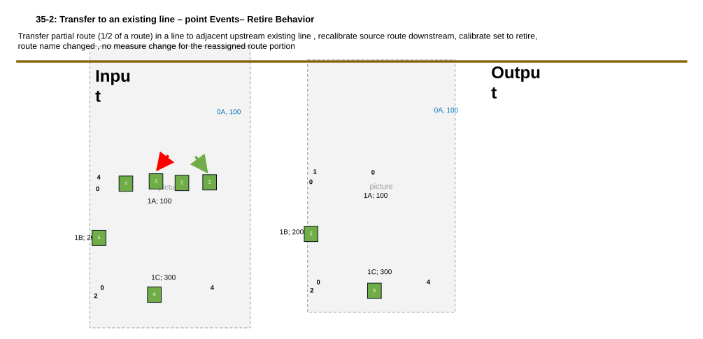

### TC-U70 — Transfer To an Existing Line (case 37) <!-- src: S1 · slide 77 · case 37 -->

- **Case:** Transfer to an existing line – Point Events only Routes and Route Table shown -Stayput

Reassign 0.5+1+0.5 routes in a line to new line ,1/3 route name and measure maintained. Rest all name and measure are changed. Recalibrate source downstream. Calibrate set to stayput
{5940675A-B579-460E-94D1-54222C63F5DA}Route Name
Line Name
Line Order
From Date
To Date
From M
To M
1A
L1
100
1/1/2000
<Null>
2
4
1B
L1
200
1/1/2000
<Null>
0
2
1C
L1
300
1/1/2000
<Null>
0
4
2A
L2
100
1/1/2000
<Null>
4
5
2B
L2
200
1/1/2000
<Null>
5
8
2C
L2
300
1/1/2000
<Null>
0
1
{5940675A-B579-460E-94D1-54222C63F5DA}Route Name
Line Name
Line Order
From Date
To Date
From M
To M
1A
L1
100
1/1/2000
1/1/2023
2
4
1B
L1
200
1/1/2000
1/1/2023
0
2
1C
L1
300
1/1/2000
1/1/2023
0
4
2A
L2
100
1/1/2000
1/1/2023
3
5
2B
L2
200
1/1/2000
1/1/2023
4
8
2C
L2
300
1/1/2000
1/1/2023
0
2
1A
L1
100
1/1/2023
<Null>
2
3
1C
L1
200
1/1/2023
<Null>
0
2
1A_New
L2
100
1/1/2023
<Null>
1
2
1B
L2
200
1/1/2023
<Null>
0
2
1C_New
L2
300
1/1/2023
<Null>
5
6
2A
L2
400
1/1/2023
<Null>
4
5
2B
L2
500
1/1/2023
<Null>
5
8
2C
L2
600
1/1/2023
<Null>
0
1
{5C22544A-7EE6-4342-B048-85BDC9FD1C3A}Effective Date
1/1/2023
Source RD
Yes

[figure: Output · 1B; 200 · 2 · 3 · 7 · 5 · 8 · 9 · 2A, 100 · 1A; 100 · 1C; 300 · 2B, 200 · 2C, 300 · 4 · 6 · 10 · 1 · Input · 2A; 400 · 2B; 500 · 2C; 600 · 1A_New; 100 · 1C_New; 300 · 1C; 200 · …]

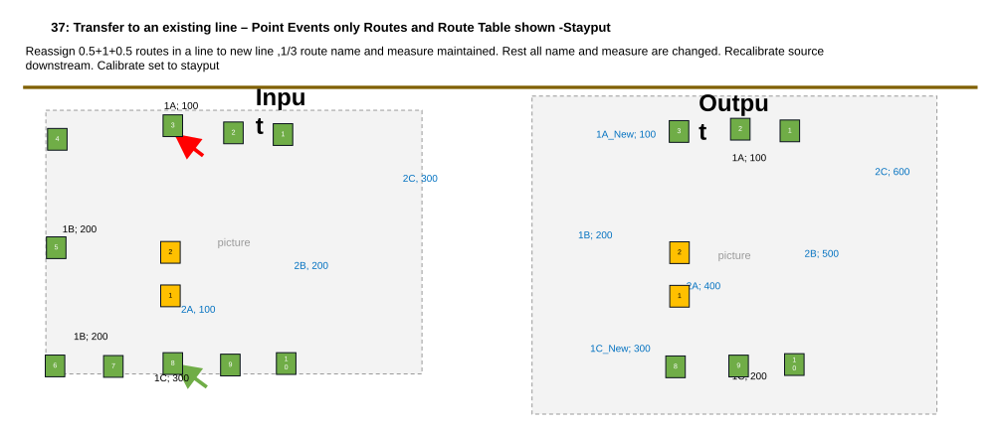

### TC-U71 — Transfer to an existing line – Point Events -Stayput (case 37-1) <!-- src: S2 · slide 78 · case 37-1 -->

Reassign 0.5+1+0.5 routes in a line to new line ,1/3 route name and measure maintained. Rest all name and measure are changed. Recalibrate source downstream. Calibrate set to stayput
{912C8C85-51F0-491E-9774-3900AFEF0FD7}Event ID
From Date
To Date
From Route ID
From M
Location Error
1
1/1/2000
<Null>
1A
2
No Error
2
1/1/2000
<Null>
1A
2.5
No Error
3
1/1/2000
<Null>
1A
3
No Error
4
1/1/2000
<Null>
1A
4
No Error
5
1/1/2000
<Null>
1B
1
No Error
6
1/1/2000
<Null>
1B
2
No Error
7
1/1/2000
<Null>
1C
1
No Error
8
1/1/2000
<Null>
1C
2
No Error
9
1/1/2000
<Null>
1C
3
No Error
10
1/1/2000
<Null>
1C
4
No Error

1
1/1/2000
<Null>
2A
4.5
No Error
2
1/1/2000
<Null>
2A
5
No Error
{5C22544A-7EE6-4342-B048-85BDC9FD1C3A}Effective Date
1/1/2023
Source RD
Yes
{912C8C85-51F0-491E-9774-3900AFEF0FD7}Event ID
From Date
To Date
From Route ID
From M
Location Error
1
1/1/2000
<Null>
1A
2
No Error
2
1/1/2000
<Null>
1A
2.5
No Error
3
1/1/2000
<Null>
1A
3
No Error
4
1/1/2000
1/1/2023
1A
4
No Error
5
1/1/2000
1/1/2023
1B
1
No Error
6
1/1/2000
1/1/2023
1B
2
No Error
7
1/1/2000
1/1/2023
1C
1
No Error
8
1/1/2000
1/1/2023
1C
2
No Error
8
1/1/2023
<Null>
1C
0
No Error
9
1/1/2000
1/1/2023
1C
3
No Error
9
1/1/2023
<Null>
1C
1
No Error
10
1/1/2000
1/1/2023
1C
4
No Error
10
1/1/2000
<Null>
1C
2
No Error

1
1/1/2000
<Null>
2A
4.5
No Error
2
1/1/2000
<Null>
2A
5
No Error

[figure: Output · 1B; 200 · 2 · 3 · 7 · 5 · 8 · 9 · 2A, 100 · 1A; 100 · 1C; 300 · 2B, 200 · 2C, 300 · 4 · 6 · 10 · 1 · Input · 2A; 400 · 2B; 500 · 2C; 600 · 1A_New; 100 · 1C_New; 300 · 1C; 200 · …]

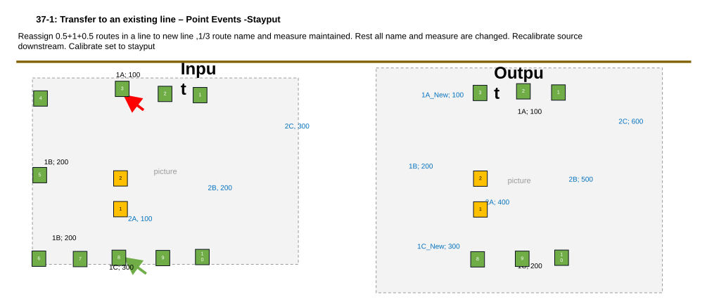

### TC-U72 — Transfer To an Existing Line (case 37-2) <!-- src: S1 · slide 79 · case 37-2 -->

- **Case:** Transfer to an existing line – Point Events only Routes and Route Table shown -Retire

Reassign 0.5+1+0.5 routes in a line to new line ,1/3 route name and measure maintained. Rest all name and measure are changed. Recalibrate source downstream. Calibrate set to retire
{912C8C85-51F0-491E-9774-3900AFEF0FD7}Event ID
From Date
To Date
From Route ID
From M
Location Error
1
1/1/2000
<Null>
1A
2
No Error
2
1/1/2000
<Null>
1A
2.5
No Error
3
1/1/2000
<Null>
1A
3
No Error
4
1/1/2000
<Null>
1A
4
No Error
5
1/1/2000
<Null>
1B
1
No Error
6
1/1/2000
<Null>
1B
2
No Error
7
1/1/2000
<Null>
1C
1
No Error
8
1/1/2000
<Null>
1C
2
No Error
9
1/1/2000
<Null>
1C
3
No Error
10
1/1/2000
<Null>
1C
4
No Error

1
1/1/2000
<Null>
2A
4.5
No Error
2
1/1/2000
<Null>
2A
5
No Error
{5C22544A-7EE6-4342-B048-85BDC9FD1C3A}Effective Date
1/1/2023
Source RD
Yes
{912C8C85-51F0-491E-9774-3900AFEF0FD7}Event ID
From Date
To Date
From Route ID
From M
Location Error
1
1/1/2000
<Null>
1A
2
No Error
2
1/1/2000
<Null>
1A
2.5
No Error
3
1/1/2000
<Null>
1A
3
No Error
4
1/1/2000
1/1/2023
1A
4
No Error
5
1/1/2000
1/1/2023
1B
1
No Error
6
1/1/2000
1/1/2023
1B
2
No Error
7
1/1/2000
1/1/2023
1C
1
No Error
8
1/1/2000
1/1/2023
1C
2
No Error
9
1/1/2000
1/1/2023
1C
3
No Error
10
1/1/2000
1/1/2023
1C
4
No Error

1
1/1/2000
<Null>
2A
4.5
No Error
2
1/1/2000
<Null>
2A
5
No Error

[figure: Output · 1B; 200 · 2 · 3 · 7 · 5 · 8 · 9 · 2A, 100 · 1A; 100 · 1C; 300 · 2B, 200 · 2C, 300 · 4 · 6 · 10 · 1 · Input · 2A; 400 · 2B; 500 · 2C; 600 · 1A_New; 100 · 1C_New; 300 · 1C; 200]

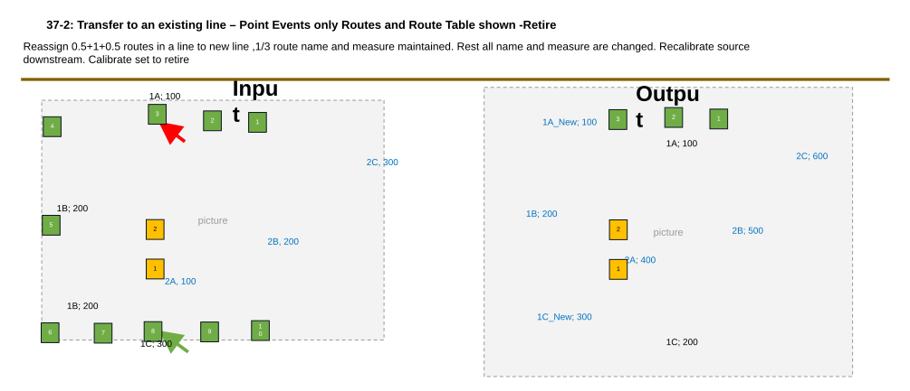

### TC-U73 — Transfer To an Existing Line (case 38) <!-- src: S1 · slide 80 · case 38 -->

- **Case:** Transfer to an existing line – Point Events only Routes and Route Table shown -Stayput

Reassign 0.5+1+0.5 routes in a line to new line ,1/3 route name and measure maintained. Rest all name and measure are changed. Do not Recalibrate source downstream.
{5940675A-B579-460E-94D1-54222C63F5DA}Route Name
Line Name
Line Order
From Date
To Date
From M
To M
1A
L1
100
1/1/2000
<Null>
2
4
1B
L1
200
1/1/2000
<Null>
0
2
1C
L1
300
1/1/2000
<Null>
0
4
2A
L2
100
1/1/2000
<Null>
4
5
2B
L2
200
1/1/2000
<Null>
5
8
2C
L2
300
1/1/2000
<Null>
0
1
{5940675A-B579-460E-94D1-54222C63F5DA}Route Name
Line Name
Line Order
From Date
To Date
From M
To M
1A
L1
100
1/1/2000
1/1/2023
2
4
1B
L1
200
1/1/2000
1/1/2023
0
2
1C
L1
300
1/1/2000
1/1/2023
0
4
2A
L2
100
1/1/2000
1/1/2023
3
5
2B
L2
200
1/1/2000
1/1/2023
4
8
2C
L2
300
1/1/2000
1/1/2023
0
2
1A
L1
100
1/1/2023
<Null>
2
3
1C
L1
200
1/1/2023
<Null>
2
4
1A_New
L2
100
1/1/2023
<Null>
1
2
1B
L2
200
1/1/2023
<Null>
0
2
1C_New
L2
300
1/1/2023
<Null>
5
6
2A
L2
400
1/1/2023
<Null>
4
5
2B
L2
500
1/1/2023
<Null>
5
8
2C
L2
600
1/1/2023
<Null>
0
1
{5C22544A-7EE6-4342-B048-85BDC9FD1C3A}Effective Date
1/1/2023
Source RD
No

[figure: Output · 1B; 200 · 2 · 3 · 7 · 5 · 8 · 9 · 2A, 100 · 1A; 100 · 1C; 300 · 2B, 200 · 2C, 300 · 4 · 6 · 10 · 1 · Input · 2A; 400 · 2B; 500 · 2C; 600 · 1A_New; 100 · 1C_New; 300 · 1C; 200 · …]

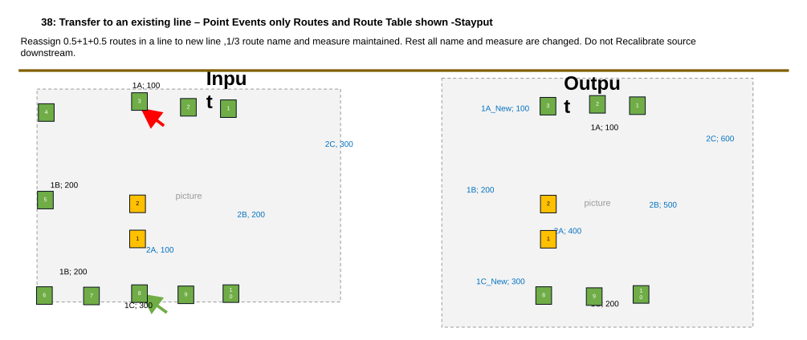

### TC-U74 — Transfer to an existing line – Point Events -Stayput (case 38-1) <!-- src: S2 · slide 81 · case 38-1 -->

Reassign 0.5+1+0.5 routes in a line to new line ,1/3 route name and measure maintained. Rest all name and measure are changed. Do not Recalibrate source downstream.
{912C8C85-51F0-491E-9774-3900AFEF0FD7}Event ID
From Date
To Date
From Route ID
From M
Location Error
1
1/1/2000
<Null>
1A
2
No Error
2
1/1/2000
<Null>
1A
2.5
No Error
3
1/1/2000
<Null>
1A
3
No Error
4
1/1/2000
<Null>
1A
4
No Error
5
1/1/2000
<Null>
1B
1
No Error
6
1/1/2000
<Null>
1B
2
No Error
7
1/1/2000
<Null>
1C
1
No Error
8
1/1/2000
<Null>
1C
2
No Error
9
1/1/2000
<Null>
1C
3
No Error
10
1/1/2000
<Null>
1C
4
No Error

1
1/1/2000
<Null>
2A
4.5
No Error
2
1/1/2000
<Null>
2A
5
No Error
{5C22544A-7EE6-4342-B048-85BDC9FD1C3A}Effective Date
1/1/2023
Source RD
No
{912C8C85-51F0-491E-9774-3900AFEF0FD7}Event ID
From Date
To Date
From Route ID
From M
Location Error
1
1/1/2000
<Null>
1A
2
No Error
2
1/1/2000
<Null>
1A
2.5
No Error
3
1/1/2000
<Null>
1A
3
No Error
4
1/1/2000
1/1/2023
1A
4
No Error
5
1/1/2000
1/1/2023
1B
1
No Error
6
1/1/2000
1/1/2023
1B
2
No Error
7
1/1/2000
1/1/2023
1C
1
No Error
8
1/1/2023
<Null>
1C
0
No Error
9
1/1/2023
<Null>
1C
1
No Error
10
1/1/2000
<Null>
1C
2
No Error

1
1/1/2000
<Null>
2A
4.5
No Error
2
1/1/2000
<Null>
2A
5
No Error
{5940675A-B579-460E-94D1-54222C63F5DA}Route Name
Line Name
Line Order
From Date
To Date
From M
To M
1A
L1
100
1/1/2000
<Null>
2
4
1B
L1
200
1/1/2000
<Null>
0
2
1C
L1
300
1/1/2000
<Null>
0
4
2A
L2
100
1/1/2000
<Null>
4
5
2B
L2
200
1/1/2000
<Null>
5
8
2C
L2
300
1/1/2000
<Null>
0
1

[figure: Output · 1B; 200 · 2 · 3 · 7 · 5 · 8 · 9 · 2A, 100 · 1A; 100 · 1C; 300 · 2B, 200 · 2C, 300 · 4 · 6 · 10 · 1 · Input · 2A; 400 · 2B; 500 · 2C; 600 · 1A_New; 100 · 1C_New; 300 · 1C; 200 · …]

### TC-U75 — Transfer to an existing line – Point Events -Retire <!-- src: S2 · slide 82 · case 38-2 -->

Reassign 0.5+1+0.5 routes in a line to new line ,1/3 route name and measure maintained. Rest all name and measure are changed. Do not Recalibrate source downstream.
{912C8C85-51F0-491E-9774-3900AFEF0FD7}Event ID
From Date
To Date
From Route ID
From M
Location Error
1
1/1/2000
<Null>
1A
2
No Error
2
1/1/2000
<Null>
1A
2.5
No Error
3
1/1/2000
<Null>
1A
3
No Error
4
1/1/2000
<Null>
1A
4
No Error
5
1/1/2000
<Null>
1B
1
No Error
6
1/1/2000
<Null>
1B
2
No Error
7
1/1/2000
<Null>
1C
1
No Error
8
1/1/2000
<Null>
1C
2
No Error
9
1/1/2000
<Null>
1C
3
No Error
10
1/1/2000
<Null>
1C
4
No Error

1
1/1/2000
<Null>
2A
4.5
No Error
2
1/1/2000
<Null>
2A
5
No Error
{5C22544A-7EE6-4342-B048-85BDC9FD1C3A}Effective Date
1/1/2023
Source RD
No
{912C8C85-51F0-491E-9774-3900AFEF0FD7}Event ID
From Date
To Date
From Route ID
From M
Location Error
1
1/1/2000
<Null>
1A
2
No Error
2
1/1/2000
<Null>
1A
2.5
No Error
3
1/1/2000
<Null>
1A
3
No Error
4
1/1/2000
1/1/2023
1A
4
No Error
5
1/1/2000
1/1/2023
1B
1
No Error
6
1/1/2000
1/1/2023
1B
2
No Error
7
1/1/2000
1/1/2023
1C
1
No Error
8
1/1/2000
<Null>
1C
0
No Error
9
1/1/2000
<Null>
1C
1
No Error
10
1/1/2000
<Null>
1C
2
No Error

1
1/1/2000
<Null>
2A
4.5
No Error
2
1/1/2000
<Null>
2A
5
No Error
{5940675A-B579-460E-94D1-54222C63F5DA}Route Name
Line Name
Line Order
From Date
To Date
From M
To M
1A
L1
100
1/1/2000
<Null>
2
4
1B
L1
200
1/1/2000
<Null>
0
2
1C
L1
300
1/1/2000
<Null>
0
4
2A
L2
100
1/1/2000
<Null>
4
5
2B
L2
200
1/1/2000
<Null>
5
8
2C
L2
300
1/1/2000
<Null>
0
1

[figure: Output · 1B; 200 · 2 · 3 · 7 · 5 · 8 · 9 · 2A, 100 · 1A; 100 · 1C; 300 · 2B, 200 · 2C, 300 · 4 · 6 · 10 · 1 · Input · 2A; 400 · 2B; 500 · 2C; 600 · 1A_New; 100 · 1C_New; 300 · 1C; 200 · …]

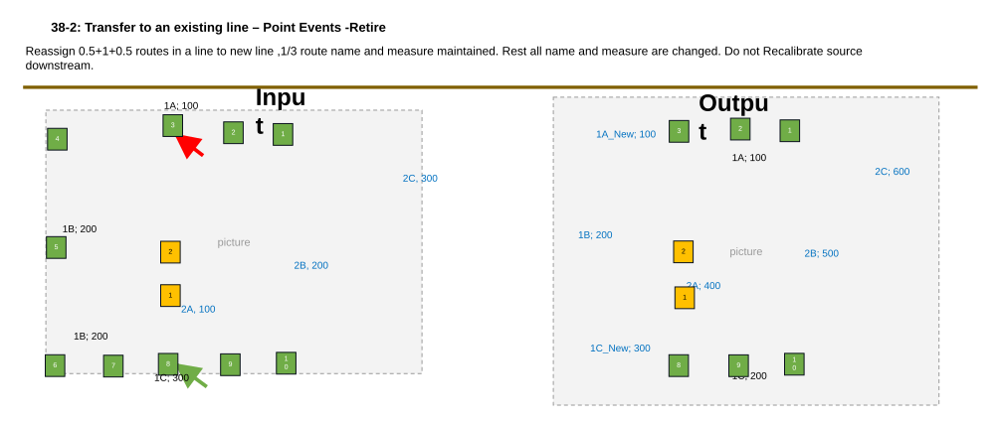

### TC-U76 — Transfer To an Existing Line – Point Events – Route and Route Tables Shown <!-- src: S1 · slide 83 · case 39 -->

- **Case:** Transfer to an existing line – Point Events –Route and route tables shown - Stayput

Reassign 0.5+1+0.5 routes in a line to new line ,1/3 route name and measure maintained. Rest all name and measure are changed. Do not Recalibrate source downstream. Routes have time slices. Effective date : 1/1/2015
{5C22544A-7EE6-4342-B048-85BDC9FD1C3A}Effective Date
1/1/2015
Source RD
No
{5940675A-B579-460E-94D1-54222C63F5DA}Route Name
Line Name
Line Order
From Date
To Date
From M
To M
1A
L1
100
1/1/2000
1/1/2020
2
4
1B
L1
200
1/1/2005
1/1/2020
0
2
1C
L1
300
1/1/2010
1/1/2020
0
4
2A
L2
100
1/1/2000
<Null>
4
5
2B
L2
200
1/1/2000
<Null>
5
8
2C
L2
300
1/1/2000
<Null>
0
1
{5940675A-B579-460E-94D1-54222C63F5DA}Route Name
Line Name
Line Order
From Date
To Date
From M
To M
1A
L1
100
1/1/2000
1/1/2015
2
4
1B
L1
200
1/1/2005
1/1/2015
0
2
1C
L1
300
1/1/2010
1/1/2015
0
4
2A
L2
100
1/1/2000
1/1/2015
4
5
2B
L2
200
1/1/2000
1/1/2015
5
8
2C
L2
300
1/1/2000
1/1/2015
0
1
1A
L1
100
1/1/2015
1/1/2020
2
3
1C
L1
200
1/1/2015
1/1/2020
2
4
1A_New
L2
100
1/1/2015
1/1/2020
1
2
1B
L2
200
1/1/2015
1/1/2020
0
2
1C_New
L2
300
1/1/2015
1/1/2020
5
6
2A
L2
400
1/1/2015
<Null>
4
5
2B
L2
500
1/1/2015
<Null>
5
8
2C
L2
600
1/1/2015
<Null>
0
1

[figure: Output · 1B; 200 · 2 · 3 · 7 · 5 · 8 · 9 · 2A, 100 · 1A; 100 · 1C; 300 · 2B, 200 · 2C, 300 · 4 · 6 · 10 · 1 · Input · 2A; 400 · 2B; 500 · 2C; 600 · 1A_New; 100 · 1C_New; 300 · 1C; 200 · …]

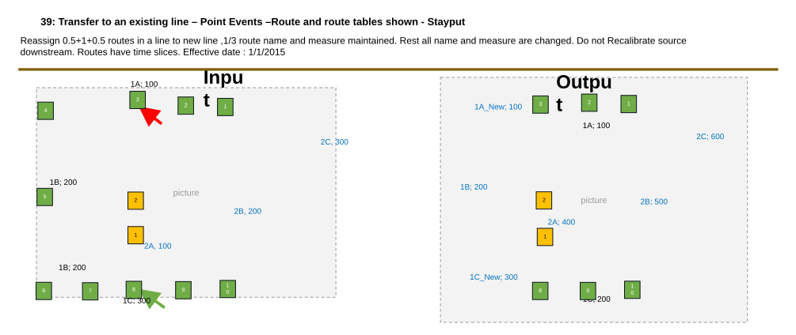

### TC-U77 — Transfer to an existing line – Point Events – Stayput <!-- src: S2 · slide 85 · case 40-1 -->

Reassign a part of  complex route to adjacent line , transfer CP , change measures. Recalibrate source downstream. Calibrate
set to stayput
{5C22544A-7EE6-4342-B048-85BDC9FD1C3A}Effective Date
1/1/2023
Source RD
Yes
Transfer CP
Yes
{5940675A-B579-460E-94D1-54222C63F5DA}Route Name
Line Name
Line Order
From Date
To Date
From M
To M
1A
L1
100
1/1/2000
<Null>
0
4
2A
L2
200
1/1/2000
<Null>
0
1
{5940675A-B579-460E-94D1-54222C63F5DA}Route Name
Line Name
Line Order
From Date
To Date
From M
To M
1A
L1
100
1/1/2000
1/1/2023
0
4
2A
L2
200
1/1/2000
1/1/2023
0
1
1A
L1
100
1/1/2023
<Null>
0
2
1A_New
L2
100
1/1/2023
<Null>
0
4
2A
L2
200
1/1/2023
<Null>
0
1
{912C8C85-51F0-491E-9774-3900AFEF0FD7}Event ID
From Date
To Date
From Route ID
From M
Location Error
1
1/1/2000
<Null>
1A
0
No Error
2
1/1/2000
<Null>
1A
0.5
No Error
3
1/1/2000
<Null>
1A
1.33
No Error
4
1/1/2000
<Null>
1A
2
No Error
5
1/1/2000
<Null>
1A
2.67
No Error
6
1/1/2000
<Null>
1A
3
No Error
7
1/1/2000
<Null>
1A
3.5
No Error
8
1/1/2000
<Null>
1A
4
No Error
{912C8C85-51F0-491E-9774-3900AFEF0FD7}Event ID
From Date
To Date
From Route ID
From M
Location Error
1
1/1/2000
1/1/2023
1A
0
No Error
2
1/1/2000
1/1/2023
1A
0.5
No Error
3
1/1/2000
1/1/2023
1A
1.33
No Error
4
1/1/2000
1/1/2023
1A
2
No Error
4
1/1/2023
<Null>
1A
0
No Error
5
1/1/2000
1/1/2023
1A
2.67
No Error
5
1/1/2023
<Null>
1A
0.67
No Error
6
1/1/2000
1/1/2023
1A
3
No Error
6
1/1/2023
<Null>
1A
1
No Error
7
1/1/2000
1/1/2023
1A
3.5
No Error
7
1/1/2023
<Null>
1A
1.5
No Error
8
1/1/2000
1/1/2023
1A
4
No Error
8
1/1/2023
<Null>
1A
2
No Error

[figure: 40-1 : · Output · Input · 1A_New; 100 · 1A; 100 · 2 · 1 · 3 · 8 · 2A; 100 · 4–8 · 2A; 200 · 4–7]

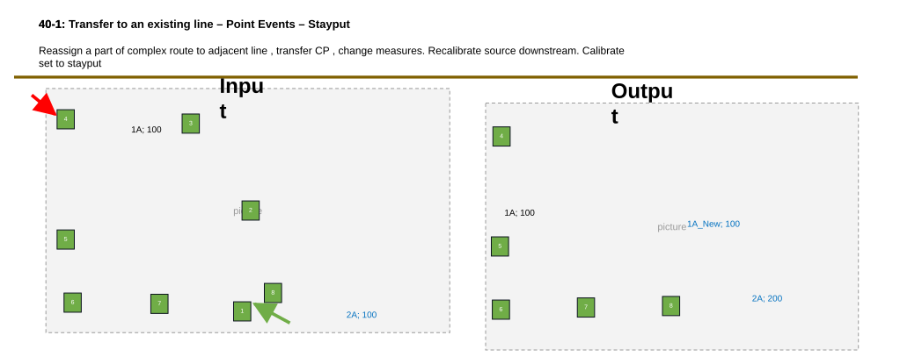

### TC-U78 — Transfer to an existing line – Point Events – Retire <!-- src: S2 · slide 86 · case 40-2 -->

Reassign a part of  complex route to adjacent line , transfer CP , change measures. Recalibrate source downstream. Calibrate
set to retire
{5C22544A-7EE6-4342-B048-85BDC9FD1C3A}Effective Date
1/1/2023
Source RD
Yes
Transfer CP
Yes
{5940675A-B579-460E-94D1-54222C63F5DA}Route Name
Line Name
Line Order
From Date
To Date
From M
To M
1A
L1
100
1/1/2000
<Null>
0
4
2A
L2
200
1/1/2000
<Null>
0
1
{5940675A-B579-460E-94D1-54222C63F5DA}Route Name
Line Name
Line Order
From Date
To Date
From M
To M
1A
L1
100
1/1/2000
1/1/2023
0
4
2A
L2
200
1/1/2000
1/1/2023
0
1
1A
L1
100
1/1/2023
<Null>
0
2
1A_New
L2
100
1/1/2023
<Null>
0
4
2A
L2
200
1/1/2023
<Null>
0
1
{912C8C85-51F0-491E-9774-3900AFEF0FD7}Event ID
From Date
To Date
From Route ID
From M
Location Error
1
1/1/2000
<Null>
1A
0
No Error
2
1/1/2000
<Null>
1A
0.5
No Error
3
1/1/2000
<Null>
1A
1.33
No Error
4
1/1/2000
<Null>
1A
2
No Error
5
1/1/2000
<Null>
1A
2.67
No Error
6
1/1/2000
<Null>
1A
3
No Error
7
1/1/2000
<Null>
1A
3.5
No Error
8
1/1/2000
<Null>
1A
4
No Error
{912C8C85-51F0-491E-9774-3900AFEF0FD7}Event ID
From Date
To Date
From Route ID
From M
Location Error
1
1/1/2000
1/1/2023
1A
0
No Error
2
1/1/2000
1/1/2023
1A
0.5
No Error
3
1/1/2000
1/1/2023
1A
1.33
No Error
4
1/1/2000
1/1/2023
1A
2
No Error
5
1/1/2000
1/1/2023
1A
2.67
No Error
6
1/1/2000
1/1/2023
1A
3
No Error
7
1/1/2000
1/1/2023
1A
3.5
No Error
8
1/1/2000
1/1/2023
1A
4
No Error

[figure: Output · Input · 1A_New; 100 · 1A; 100 · 2 · 1 · 3 · 2A; 100 · 4–8 · 2A; 200]

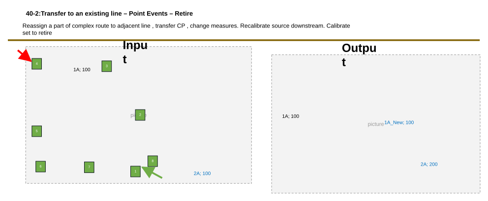

## Other content

### Slide 35 — Non-Spanning Events <!-- slide 35 -->

### Slide 64 <!-- slide 64 -->

Reassign to fill the gap in a line by transferring route. No change in Measure, RouteName
.
26-1&2: Transfer to an existing line – Nonspanning Events – Stayput & Retire
{5940675A-B579-460E-94D1-54222C63F5DA}Route Name
Line Name
Line Order
From Date
To Date
From M
To M
2A
L2
100
1/1/2000
<Null>
3
5
2B
L2
200
1/1/2000
<Null>
5
8
2C
L2
300
1/1/2000
<Null>
0
2
X1
L3
100
1/1/2000
<Null>
2
6
X2
L3
200
1/1/2000
<Null>
24
28
{5940675A-B579-460E-94D1-54222C63F5DA}Route Name
Line Name
Line Order
From Date
To Date
From M
To M
2A
L2
100
1/1/2000
1/1/2023
3
5
2B
L2
200
1/1/2000
1/1/2023
5
8
2C
L2
300
1/1/2000
1/1/2023
0
2
X1
L3
100
1/1/2000
1/1/2023
2
6
X2
L3
200
1/1/2000
1/1/2023
24
28
2B
L2
100
1/1/2023
<Null>
5
8
2C
L2
200
1/1/2023
<Null>
0
2
X1
L3
100
1/1/2023
<Null>
2
6
2A
L3
200
1/1/2023
<Null>
3
5
X2
L3
300
1/1/2023
<Null>
24
28
{5C22544A-7EE6-4342-B048-85BDC9FD1C3A}Effective Date
1/1/2023
Source RD
No
{912C8C85-51F0-491E-9774-3900AFEF0FD7}Event ID
From Date
To Date
From Route ID
From M
To M
Location Error
N1
1/1/2000
<Null>
2A
4
5
No Error
N2
1/1/2000
<Null>
2A
4
5
No Error
N3
1/1/2000
<Null>
2B
5
6.5
No Error
N4
1/1/2000
<Null>
2A
3
4
No Error
N5
1/1/2000
<Null>
2B
5
8
No Error

E1
1/1/2000
<Null>
X1
2
3
No Error
E2
1/1/2000
<Null>
X2
24
28
No Error
{912C8C85-51F0-491E-9774-3900AFEF0FD7}Event ID
From Date
To Date
From Route ID
From M
To M
Location Error
N1
1/1/2000
1/1/2023
2A
4
5
No Error
N2
1/1/2000
1/1/2023
2A
4
5
No Error
N3
1/1/2000
<Null>
2B
5
6.5
No Error
N4
1/1/2000
1/1/2023
2A
3
4
No Error
N5
1/1/2000
<Null>
2B
5
8
No Error

E1
1/1/2000
<Null>
X1
2
3
No Error
E2
1/1/2000
<Null>
X2
24
28
No Error

[figure: Input · Output · 2A; 100 · 1A; 100 · 1B; 200 · 1C; 300 · 2B; 200 · 2C; 300 · X1; 100 · X2; 200 · X2; 300 · 2A; 200 · 2B;100 · 2C; 200]

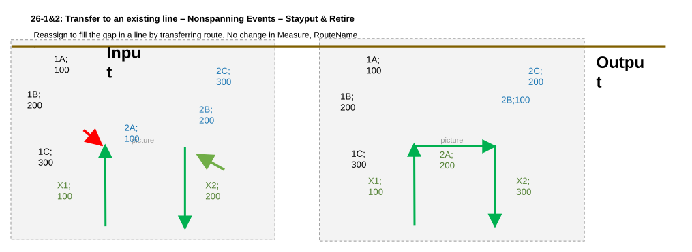

### Slide 65 — Point Events <!-- slide 65 -->

### Slide 76 <!-- slide 76 -->

Transfer partial route (1/2 of a route) in a line to adjacent upstream existing line ,  do not recalibrate source route downstream ,route name changed , no measure change for the reassigned route portion
36-1 & 2: Transfer to an existing line – point Events– Stayput & Retire Behavior
{912C8C85-51F0-491E-9774-3900AFEF0FD7}Event ID
From Date
To Date
From Route ID
From M
Location Error
1
1/1/2000
<Null>
1A
2
No Error
2
1/1/2000
<Null>
1A
2.5
No Error
3
1/1/2000
<Null>
1A
3
No Error
4
1/1/2000
<Null>
1A
3.5
No Error
5
1/1/2000
<Null>
1B
1
No Error
6
1/1/2000
<Null>
1C
2
No Error
{5940675A-B579-460E-94D1-54222C63F5DA}Route Name
Line Name
Line Order
From Date
To Date
From M
To M
0A
L0
100
1/1/2000
<Null>
3
5
1A
L1
100
1/1/2000
<Null>
2
4
1B
L1
200
1/1/2000
<Null>
0
2
1C
L1
300
1/1/2000
<Null>
0
4
{5940675A-B579-460E-94D1-54222C63F5DA}Route Name
Line Name
Line Order
From Date
To Date
From M
To M
0A
L0
100
1/1/2000
<Null>
3
5
1A_New
L0
200
1/1/2023
<Null>
2
3
1A
L1
100
1/1/2023
<Null>
0
1
1A
L1
100
1/1/2000
1/1/2023
2
4
1B
L1
200
1/1/2000
1/1/2023
0
2
1C
L1
300
1/1/2000
1/1/2023
0
4
{912C8C85-51F0-491E-9774-3900AFEF0FD7}Event ID
From Date
To Date
From Route ID
From M
Location Error
1
1/1/2000
1/1/2023
1A
2
No Error
2
1/1/2000
1/1/2023
1A
2.5
No Error
3
1/1/2000
<Null>
1A
3
No Error
4
1/1/2000
<Null>
1A
3.5
No Error
5
1/1/2000
<Null>
1B
1
No Error
6
1/1/2000
<Null>
1C
2
No Error
{5C22544A-7EE6-4342-B048-85BDC9FD1C3A}Effective Date
1/1/2023
Source RD
No

[figure: 1A; 100 · 1B; 200 · 1C; 300 · 0A, 100 · 4 · 0 · 2 · 0–2 · 3 · 5 · 6 · Input · Output]

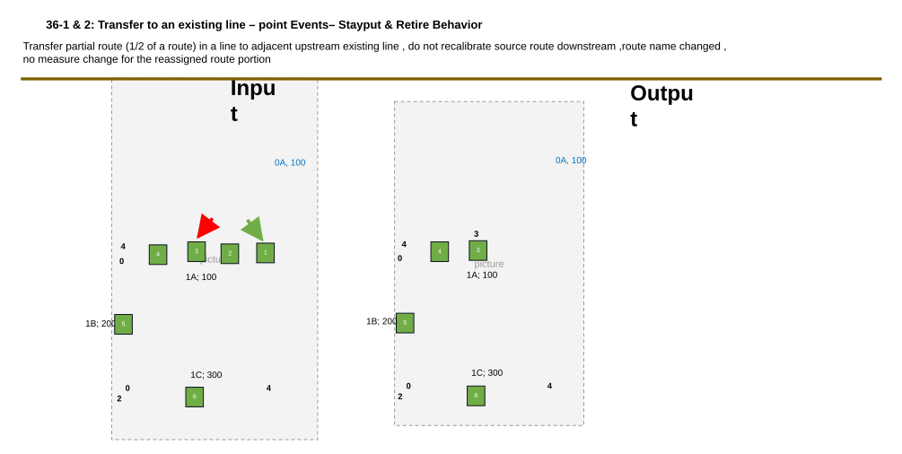

### Slide 84 <!-- slide 84 -->

Reassign 0.5+1+0.5 routes in a line to new line ,1/3 route name and measure maintained. Rest all name and measure are changed. Do not Recalibrate source downstream. Routes have time slices. Effective date : 1/1/2015
39-1&2: Transfer to an existing line – Point Events –– Stayput & Retire
{5C22544A-7EE6-4342-B048-85BDC9FD1C3A}Effective Date
1/1/2015
Source RD
No
{912C8C85-51F0-491E-9774-3900AFEF0FD7}Event ID
From Date
To Date
From Route ID
From M
Location Error
1
1/1/2000
1/1/2020
1A
2
No Error
2
1/1/2000
1/1/2020
1A
2.5
No Error
3
1/1/2000
1/1/2020
1A
3
No Error
4
1/1/2000
1/1/2020
1A
4
No Error
5
1/1/2005
1/1/2020
1B
1
No Error
6
1/1/2005
1/1/2020
1B
2
No Error
7
1/1/2010
1/1/2020
1C
1
No Error
8
1/1/2010
1/1/2020
1C
2
No Error
9
1/1/2010
1/1/2020
1C
3
No Error
10
1/1/2010
1/1/2020
1C
4
No Error

1
1/1/2000
<Null>
2A
4.5
No Error
2
1/1/2000
<Null>
2A
5
No Error
{912C8C85-51F0-491E-9774-3900AFEF0FD7}Event ID
From Date
To Date
From Route ID
From M
Location Error
1
1/1/2000
1/1/2020
1A
2
No Error
2
1/1/2000
1/1/2020
1A
2.5
No Error
3
1/1/2000
1/1/2020
1A
3
No Error
4
1/1/2000
1/1/2015
1A
4
No Error
5
1/1/2005
1/1/2015
1B
1
No Error
6
1/1/2005
1/1/2015
1B
2
No Error
7
1/1/2010
1/1/2015
1C
1
No Error
8
1/1/2010
<Null>
1C
0
No Error
9
1/1/2010
<Null>
1C
1
No Error
10
1/1/2010
<Null>
1C
2
No Error

1
1/1/2000
<Null>
2A
4.5
No Error
2
1/1/2000
<Null>
2A
5
No Error
{5940675A-B579-460E-94D1-54222C63F5DA}Route Name
Line Name
Line Order
From Date
To Date
From M
To M
1A
L1
100
1/1/2000
1/1/2020
2
4
1B
L1
200
1/1/2005
1/1/2020
0
2
1C
L1
300
1/1/2010
1/1/2020
0
4
2A
L2
100
1/1/2000
<Null>
4
5
2B
L2
200
1/1/2000
<Null>
5
8
2C
L2
300
1/1/2000
<Null>
0
1

[figure: Output · 1B; 200 · 2 · 3 · 7 · 5 · 8 · 9 · 2A, 100 · 1A; 100 · 1C; 300 · 2B, 200 · 2C, 300 · 4 · 6 · 10 · 1 · Input · 2A; 400 · 2B; 500 · 2C; 600 · 1A_New; 100 · 1C_New; 300 · 1C; 200 · …]

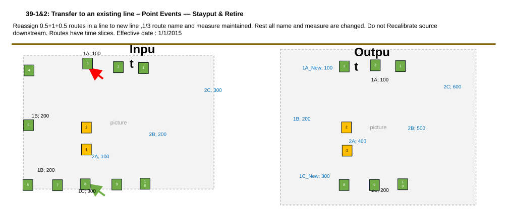

### Slide 87 <!-- slide 87 -->

Reassign to fill the gap in a line by transferring route. No change in Measure, RouteName
.
41-1&2: Transfer to an existing line – Point Events – Stayput & Retire
{5940675A-B579-460E-94D1-54222C63F5DA}Route Name
Line Name
Line Order
From Date
To Date
From M
To M
2A
L2
100
1/1/2000
<Null>
3
5
2B
L2
200
1/1/2000
<Null>
5
8
2C
L2
300
1/1/2000
<Null>
0
2
X1
L3
100
1/1/2000
<Null>
2
6
X2
L3
200
1/1/2000
<Null>
24
28
{5940675A-B579-460E-94D1-54222C63F5DA}Route Name
Line Name
Line Order
From Date
To Date
From M
To M
2A
L2
100
1/1/2000
1/1/2023
3
5
2B
L2
200
1/1/2000
1/1/2023
5
8
2C
L2
300
1/1/2000
1/1/2023
0
2
X1
L3
100
1/1/2000
1/1/2023
2
6
X2
L3
200
1/1/2000
1/1/2023
24
28
2B
L2
100
1/1/2023
<Null>
5
8
2C
L2
200
1/1/2023
<Null>
0
2
X1
L3
100
1/1/2023
<Null>
2
6
2A
L3
200
1/1/2023
<Null>
3
5
X2
L3
300
1/1/2023
<Null>
24
28
{5C22544A-7EE6-4342-B048-85BDC9FD1C3A}Effective Date
1/1/2023
Source RD
No
{912C8C85-51F0-491E-9774-3900AFEF0FD7}Event ID
From Date
To Date
From Route ID
From M
Location Error
1
1/1/2000
<Null>
2A
3
No Error
2
1/1/2000
<Null>
2A
4
No Error
3
1/1/2000
<Null>
2A
5
No Error

1
1/1/2000
<Null>
X1
6
No Error
1
1/1/2000
<Null>
2B
5
No Error
{912C8C85-51F0-491E-9774-3900AFEF0FD7}Event ID
From Date
To Date
From Route ID
From M
Location Error
1
1/1/2000
1/1/2023
2A
3
No Error
2
1/1/2000
1/1/2023
2A
4
No Error
3
1/1/2000
1/1/2023
2A
5
No Error

1
1/1/2000
<Null>
X1
6
No Error
1
1/1/2000
<Null>
2B
5
No Error

[figure: Input · Output · 2A; 100 · 1A; 100 · 1B; 200 · 1C; 300 · 2B; 200 · 2C; 300 · X1; 100 · X2; 200 · X2; 300 · 2A; 200 · 2B;100 · 2C; 200 · 1–3 · 1]

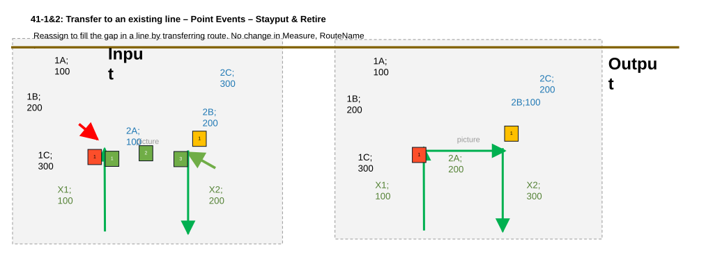

### Notes

*(tables truncated at 200 — remaining tables render as plain text)*
