# Reassign Route Transfer to Another Line Method: Support Move Event Behavior Test Plan

| Field | Value |
| --- | --- |
| **Doc** | 533 · Test Plan · Pro |
| **Product** | — |
| **Release** | — |
| **Issues** | [ArcGISPro/ps-location-referencing#5141](https://devtopia.esri.com/ArcGISPro/ps-location-referencing/issues/5141) |
| **Source** | [5141-ReassignRoutetoAnotherLineSupportMoveEventBehavior_TestPlan_V6.pptx](<https://esriis.sharepoint.com/sites/LocationReferencing/Shared%20Documents/General/Test%20Plans/5141-ReassignRoutetoAnotherLineSupportMoveEventBehavior_TestPlan_V6.pptx>) · rev V6 |
| **People** | author Rahul Rakshit · PE — · dev — |
| **Edited** | 2023-07-26 21:42 by Mac Christmas |
| **Extracted** | 2026-09-04 · lane xmlstrip · format 3.0 · prompt v2.0.2 |
| **Keywords** | reassign route · move event behavior · transfer to another line · route reassignment · spanning line events · event location error · measure recalibration · route renaming · partial route reassignment · route transfer · engineering network · test plan |
| **Tools** | — |

## Summary

This test plan covers the reassignment of routes to another line using the transfer to another line method with move event behavior. It includes tests for point, line, and spanning line events on simple and complex route shapes, with scenarios involving whole routes, partial routes, multiple routes, and recalibration of source and target routes. The plan verifies event location errors and measure recalibration across various test cases and network types.

## Related documents

<!-- related:begin -->
- [Reassign - Transfer to Another Line with StayPut and Retire Event Behavior - Test Plan](<https://esriis.sharepoint.com/sites/lrsworkspace/LRS%20Doc%20Index/Test%20Plans/5140-reassign-transfer-to-another-line-with-stayput-and-retire-eb.md>) — similar text 0.38 · 6 title words · 1 filename word · same kind/surface/folder <!-- rel:528 s=6.879 -->
- [Transfer to Another Line – Support Snap Event Behavior Test Plan](<https://esriis.sharepoint.com/sites/lrsworkspace/LRS Doc Index/Test Plans/transfer-to-another-line-support-snap-eb-rh-apr-2023-08-2.md>) — similar text 0.18 · 6 title words · 1 filename word · same kind/folder <!-- rel:527 s=6.223 -->
- [Transfer to Another Line – Support Snap Event Behavior Test Plan](<https://esriis.sharepoint.com/sites/lrsworkspace/LRS Doc Index/Test Plans/transfer-to-another-line-support-snap-eb-rh-apr-2023-08.md>) — similar text 0.19 · 6 title words · 1 filename word · same kind/folder <!-- rel:526 s=5.899 -->
- [Support Reassign: Transfer as New Route(s) to Adjacent Line Method in ArcGIS Pro](<https://esriis.sharepoint.com/sites/lrsworkspace/LRS Doc Index/User Stories/support-reassign-transfer-as-new-route-s-to-adjacent-line.md>) — similar text 0.23 · 6 title words · 2 filename words · same surface <!-- rel:583 s=5.487 -->
- [Reassign Route Supporting Transferring to Another Line - Test Plan](<https://esriis.sharepoint.com/sites/lrsworkspace/LRS Doc Index/Test Plans/reassign-route-supporting-transferring-to-another-line.md>) — similar text 0.29 · 4 title words · 2 filename words · same kind/surface/folder <!-- rel:538 s=5.382 -->
<!-- related:end -->

<!-- docs:begin -->
## Esri documentation

[Event editing using the attribute table](https://doc.esri.com/en/arcgis-pro/latest/help/production/location-referencing-pipelines/event-editing-using-the-attribute-table.html) · [Route reassignment](https://doc.esri.com/en/arcgis-pro/latest/help/production/location-referencing-pipelines/reassign-routes.html) · [Configure continuous measure networks and events to update with an engineering network](https://doc.esri.com/en/arcgis-pro/latest/help/production/location-referencing-pipelines/configure-continuous-measure-networks-and-events-to-update-with-an-engineering-network.html)
<!-- docs:end -->

---

## Overview

### Slide 1 — Reassign Route Transfer to Another Line Method: Support Move Event Behavior <!-- slide 1 -->

**Notes**
- Test with Line Network only, do not test PoM since PoM routes do not store events
- Test with Transfer to another line method only
- Test with Move event behavior only
- Test point, line, and spanning line events
- Test with both simple and complex route shapes
- Test with events that cover whole routes, partial routes, span routes, etc.
- Test with reassignment of whole routes, partial routes, multiple routes, etc.
- Check Edit Log following Reassign Routes and Apply Event Behaviors

[figure: Devtopia Issue · 1A, 100 · 2A, 200 · 3A, 300 · 1B, 100 · 2B, 200 · 3B, 300 · 2C, 200 · 1C, 100 · 3C, 300 · 4 · 2 · 0 · 3 · 1 · 5 · 8 · 6]

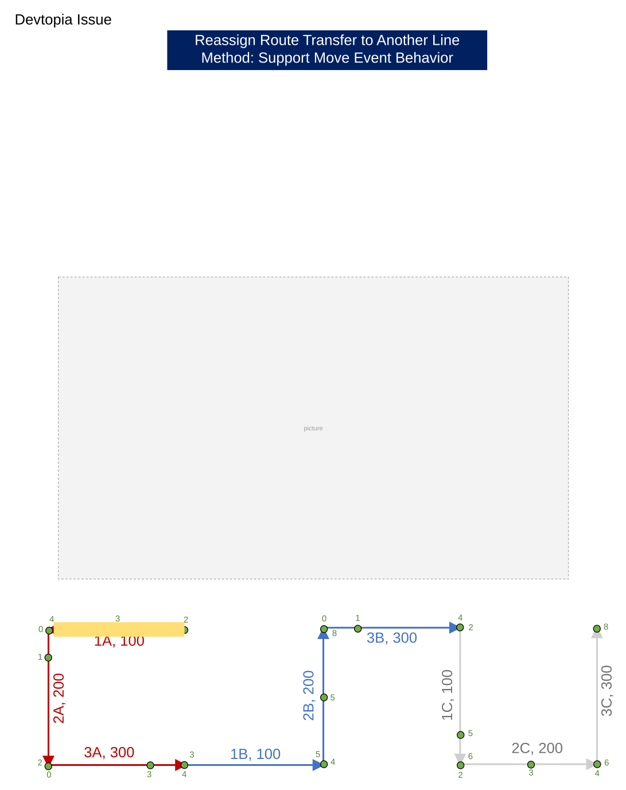

### Slide 2 <!-- slide 2 -->

| R Name | L NAME | From Date | To Date | Line Order | From Measure | To Measure |
| --- | --- | --- | --- | --- | --- | --- |
| 1A | L0 | 1/1/2000 | Null | 100 | 2 | 4 |
| 2A | L0 | 1/1/2000 | Null | 200 | 0 | 2 |
| 3A | L0 | 1/1/2000 | Null | 300 | 0 | 4 |
| 1B | L1 | 1/1/2000 | Null | 100 | 3 | 5 |
| 2B | L1 | 1/1/2000 | Null | 200 | 4 | 8 |
| 3B | L1 | 1/1/2000 | Null | 300 | 0 | 2 |
| 1C | L2 | 1/1/2000 | Null | 100 | 4 | 6 |
| 2C | L2 | 1/1/2000 | Null | 200 | 2 | 6 |
| 3C | L2 | 1/1/2000 | Null | 300 | 4 | 8 |

| Test ID | 1 | Network Type | Engineering (Spanning Line Events) |
| --- | --- | --- | --- |
| Test | Reassign all the routes in a line to another line on right, transferring routes and measures. |  |  |

| EventID | From Date | To Date | From RouteID | To RouteID | From Measure | To Measure | Loc Error |
| --- | --- | --- | --- | --- | --- | --- | --- |
| 001 | 1/1/2000 | Null | 1A | 2A | 2 | 1 | No Error |
| 002 | 1/1/2000 | Null | 1A | 3A | 2 | 4 | No Error |
| 003 | 1/1/2000 | Null | 1A | 2A | 3 | 1 | No Error |
| 004 | 1/1/2000 | Null | 2A | 3A | 1 | 2 | No Error |
| 005 | 1/1/2000 | Null | 1A | 3A | 3 | 2 | No Error |
| 006 | 1/1/2000 | Null | 2A | 3A | 1 | 4 | No Error |
| 007 | 1/1/2000 | Null | 1A | 2A | 2 | 2 | No Error |
| 008 | 1/1/2000 | Null | 2A | 3A | 0 | 4 | No Error |
| 009 | 1/1/2000 | Null | 2A | 3A | 0 | 2 | No Error |
| 010 | 1/1/2000 | Null | 1A | 2A | 3 | 2 | No Error |
| 011 | 1/1/2000 | Null | 3A | 3A | 0 | 4 | No Error |

| Recalibrate Source | Yes |
| --- | --- |
| Recalibrate Target | Yes |
| Date | 12/31/2020 |
|  |  |

### Slide 3 <!-- slide 3 -->

| R Name | L NAME | From Date | To Date | Line Order | From Measure | To Measure |
| --- | --- | --- | --- | --- | --- | --- |
| 1A | L0 | 1/1/2000 | 12/31/2010 | 100 | 2 | 4 |
| 2A | L0 | 1/1/2000 | 12/31/2010 | 200 | 0 | 2 |
| 3A | L0 | 1/1/2000 | 12/31/2010 | 300 | 0 | 4 |
| 1B | L1 | 1/1/2000 | 12/31/2010 | 100 | 3 | 5 |
| 2B | L1 | 1/1/2000 | 12/31/2010 | 200 | 4 | 8 |
| 3B | L1 | 1/1/2000 | 12/31/2010 | 300 | 0 | 2 |
| 1A | L1 | 12/31/2010 | Null | 100 | 2 | 4 |
| 2A | L1 | 12/31/2010 | Null | 200 | 0 | 2 |
| 3A | L1 | 12/31/2010 | Null | 300 | 0 | 4 |
| 1B | L1 | 12/31/2010 | Null | 400 | 3 | 5 |
| 2B | L1 | 12/31/2010 | Null | 500 | 4 | 8 |
| 3B | L1 | 12/31/2010 | Null | 600 | 0 | 2 |
| 1C | L2 | 1/1/2000 | Null | 100 | 4 | 6 |
| 2C | L2 | 1/1/2000 | Null | 200 | 2 | 6 |
| 3C | L2 | 1/1/2000 | Null | 300 | 4 | 8 |

| Test ID | 1 | Network Type | Engineering (Spanning Line Events) |
| --- | --- | --- | --- |
| Test | Reassign all the routes in a line to another line on right, transferring routes and measures. |  |  |

| EventID | From Date | To Date | From RouteID | To RouteID | From Measure | To Measure | Loc Error |
| --- | --- | --- | --- | --- | --- | --- | --- |
| 001 | 1/1/2000 | 12/31/2010 | 1A | 2A | 2 | 1 | No Error |
| 002 | 1/1/2000 | 12/31/2010 | 1A | 3A | 2 | 4 | No Error |
| 003 | 1/1/2000 | 12/31/2010 | 1A | 2A | 3 | 1 | No Error |
| 004 | 1/1/2000 | 12/31/2010 | 2A | 3A | 1 | 2 | No Error |
| 005 | 1/1/2000 | 12/31/2010 | 1A | 3A | 3 | 2 | No Error |
| 006 | 1/1/2000 | 12/31/2010 | 2A | 3A | 1 | 4 | No Error |
| 007 | 1/1/2000 | 12/31/2010 | 1A | 2A | 2 | 2 | No Error |
| 008 | 1/1/2000 | 12/31/2010 | 2A | 3A | 0 | 4 | No Error |
| 009 | 1/1/2000 | 12/31/2010 | 2A | 3A | 0 | 2 | No Error |
| 010 | 1/1/2000 | 12/31/2010 | 1A | 2A | 3 | 2 | No Error |
| 011 | 1/1/2000 | 12/31/2010 | 3A | 3A | 0 | 4 | No Error |
| 001 | 12/31/2010 | Null | 1A | 2A | 2 | 1 | No Error |
| 002 | 12/31/2010 | Null | 1A | 3A | 2 | 4 | No Error |
| 003 | 12/31/2010 | Null | 1A | 2A | 3 | 1 | No Error |
| 004 | 12/31/2010 | Null | 2A | 3A | 1 | 2 | No Error |
| 005 | 12/31/2010 | Null | 1A | 3A | 3 | 2 | No Error |
| 006 | 12/31/2010 | Null | 2A | 3A | 1 | 4 | No Error |
| 007 | 12/31/2010 | Null | 1A | 2A | 2 | 2 | No Error |
| 008 | 12/31/2010 | Null | 2A | 3A | 0 | 4 | No Error |
| 009 | 12/31/2010 | Null | 2A | 3A | 0 | 2 | No Error |
| 010 | 12/31/2010 | Null | 1A | 2A | 3 | 2 | No Error |
| 011 | 12/31/2010 | Null | 3A | 3A | 0 | 4 | No Error |

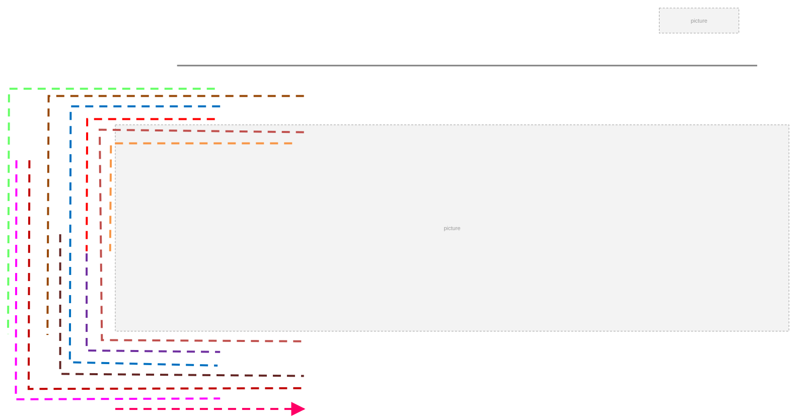

### Slide 4 <!-- slide 4 -->

| Recalibrate Source | Yes |
| --- | --- |
| Recalibrate Target | Yes |
| Date | 12/31/2010 |
|  |  |

| Test ID | 2 | Network Type | Engineering (Spanning Line Events) |
| --- | --- | --- | --- |
| Test | Reassign all the routes in a line to another line on right, 2/3 route names and measures maintained. The first route in the line has changed. |  |  |

| EventID | From Date | To Date | From RouteID | To RouteID | From Measure | To Measure | Loc Error |
| --- | --- | --- | --- | --- | --- | --- | --- |
| 001 | 1/1/2000 | Null | 1A | 2A | 2 | 1 | No Error |
| 002 | 1/1/2000 | Null | 1A | 3A | 2 | 4 | No Error |
| 003 | 1/1/2000 | Null | 1A | 2A | 3 | 1 | No Error |
| 004 | 1/1/2000 | Null | 2A | 3A | 1 | 2 | No Error |
| 005 | 1/1/2000 | Null | 1A | 3A | 3 | 2 | No Error |
| 006 | 1/1/2000 | Null | 2A | 3A | 1 | 4 | No Error |
| 007 | 1/1/2000 | Null | 1A | 2A | 2 | 2 | No Error |
| 008 | 1/1/2000 | Null | 2A | 3A | 0 | 4 | No Error |
| 009 | 1/1/2000 | Null | 2A | 3A | 0 | 2 | No Error |
| 010 | 1/1/2000 | Null | 1A | 2A | 3 | 2 | No Error |
| 011 | 1/1/2000 | Null | 3A | 3A | 0 | 4 | No Error |

| R Name | L NAME | From Date | To Date | Line Order | From Measure | To Measure |
| --- | --- | --- | --- | --- | --- | --- |
| 1A | L0 | 1/1/2000 | Null | 100 | 2 | 4 |
| 2A | L0 | 1/1/2000 | Null | 200 | 0 | 2 |
| 3A | L0 | 1/1/2000 | Null | 300 | 0 | 4 |
| 1B | L1 | 1/1/2000 | Null | 100 | 3 | 5 |
| 2B | L1 | 1/1/2000 | Null | 200 | 4 | 8 |
| 3B | L1 | 1/1/2000 | Null | 300 | 0 | 2 |
| 1C | L2 | 1/1/2000 | Null | 100 | 4 | 6 |
| 2C | L2 | 1/1/2000 | Null | 200 | 2 | 6 |
| 3C | L2 | 1/1/2000 | Null | 300 | 4 | 8 |

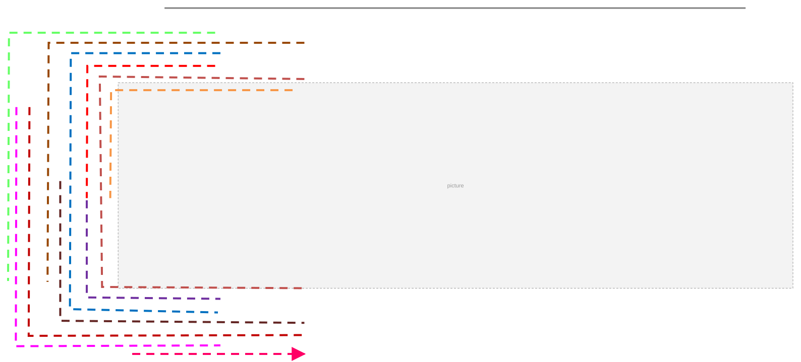

### Slide 5 <!-- slide 5 -->

| Test ID | 2 | Network Type | Engineering (Spanning Line Events) |
| --- | --- | --- | --- |
| Test | Reassign all the routes in a line to another line on right, 2/3 route names and measures maintained. The first route in the line has changed. |  |  |

| R Name | L NAME | From Date | To Date | Line Order | From Measure | To Measure |
| --- | --- | --- | --- | --- | --- | --- |
| 1A | L0 | 1/1/2000 | 12/31/2010 | 100 | 2 | 4 |
| 2A | L0 | 1/1/2000 | 12/31/2010 | 200 | 0 | 2 |
| 3A | L0 | 1/1/2000 | 12/31/2010 | 300 | 0 | 4 |
| 1B | L1 | 1/1/2000 | 12/31/2010 | 100 | 3 | 5 |
| 2B | L1 | 1/1/2000 | 12/31/2010 | 200 | 4 | 8 |
| 3B | L1 | 1/1/2000 | 12/31/2010 | 300 | 0 | 2 |
| 1A-Change | L1 | 12/31/2010 | Null | 100 | 5 | 8 |
| 2A | L1 | 12/31/2010 | Null | 200 | 0 | 2 |
| 3A | L1 | 12/31/2010 | Null | 300 | 0 | 4 |
| 1B | L1 | 12/31/2010 | Null | 400 | 3 | 5 |
| 2B | L1 | 12/31/2010 | Null | 500 | 4 | 8 |
| 3B | L1 | 12/31/2010 | Null | 600 | 0 | 2 |
| 1C | L2 | 1/1/2000 | Null | 100 | 4 | 6 |
| 2C | L2 | 1/1/2000 | Null | 200 | 2 | 6 |
| 3C | L2 | 1/1/2000 | Null | 300 | 4 | 8 |

| EventID | From Date | To Date | From RouteID | To RouteID | From Measure | To Measure | Loc Error |
| --- | --- | --- | --- | --- | --- | --- | --- |
| 001 | 1/1/2000 | 12/31/2010 | 1A | 2A | 2 | 1 | No Error |
| 002 | 1/1/2000 | 12/31/2010 | 1A | 3A | 2 | 4 | No Error |
| 003 | 1/1/2000 | 12/31/2010 | 1A | 2A | 3 | 1 | No Error |
| 004 | 1/1/2000 | 12/31/2010 | 2A | 3A | 1 | 2 | No Error |
| 005 | 1/1/2000 | 12/31/2010 | 1A | 3A | 3 | 2 | No Error |
| 006 | 1/1/2000 | 12/31/2010 | 2A | 3A | 1 | 4 | No Error |
| 007 | 1/1/2000 | 12/31/2010 | 1A | 2A | 2 | 2 | No Error |
| 008 | 1/1/2000 | 12/31/2010 | 2A | 3A | 0 | 4 | No Error |
| 009 | 1/1/2000 | 12/31/2010 | 2A | 3A | 0 | 2 | No Error |
| 010 | 1/1/2000 | 12/31/2010 | 1A | 2A | 3 | 2 | No Error |
| 011 | 1/1/2000 | 12/31/2010 | 3A | 3A | 0 | 4 | No Error |
| 001 | 12/31/2010 | Null | 1A | 2A | 2 | 1 | Route not Found |
| 002 | 12/31/2010 | Null | 1A | 3A | 2 | 4 | Route not Found |
| 003 | 12/31/2010 | Null | 1A | 2A | 3 | 1 | Route not Found |
| 004 | 12/31/2010 | Null | 2A | 3A | 1 | 2 | No Error |
| 005 | 12/31/2010 | Null | 1A | 3A | 3 | 2 | Route not Found |
| 006 | 12/31/2010 | Null | 2A | 3A | 1 | 4 | No Error |
| 007 | 12/31/2010 | Null | 1A | 2A | 2 | 2 | Route not Found |
| 008 | 12/31/2010 | Null | 2A | 3A | 0 | 4 | No Error |
| 009 | 12/31/2010 | Null | 2A | 3A | 0 | 2 | No Error |
| 010 | 12/31/2010 | Null | 1A | 2A | 3 | 2 | Route not Found |
| 011 | 12/31/2010 | Null | 3A | 3A | 0 | 4 | No Error |

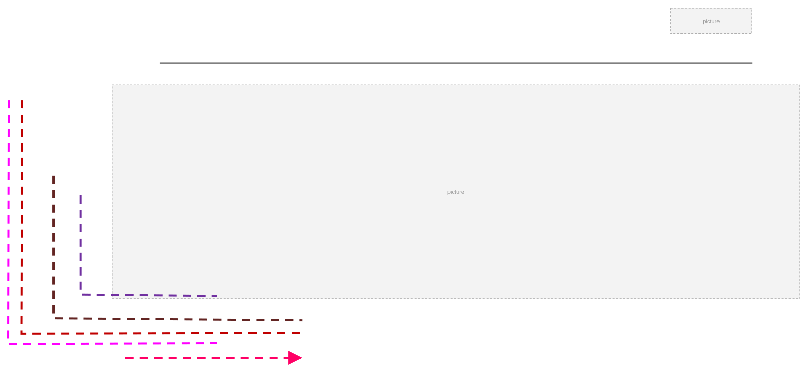

### Slide 6 <!-- slide 6 -->

| Recalibrate Source | Yes |
| --- | --- |
| Recalibrate Target | Yes |
| Date | 12/31/2010 |
|  |  |

| Test ID | 3 | Network Type | Engineering (Spanning Line Events) |
| --- | --- | --- | --- |
| Test | Reassign in the middle spanning routes to the line on the right. Rename one route |  |  |

| EventID | From Date | To Date | From RouteID | To RouteID | From Measure | To Measure | Loc Error |
| --- | --- | --- | --- | --- | --- | --- | --- |
| 001 | 1/1/2000 | Null | 1A | 2A | 2 | 1 | No Error |
| 002 | 1/1/2000 | Null | 1A | 3A | 2 | 4 | No Error |
| 003 | 1/1/2000 | Null | 1A | 2A | 3 | 1 | No Error |
| 004 | 1/1/2000 | Null | 2A | 3A | 1 | 2 | No Error |
| 005 | 1/1/2000 | Null | 1A | 3A | 3 | 2 | No Error |
| 006 | 1/1/2000 | Null | 2A | 3A | 1 | 4 | No Error |
| 007 | 1/1/2000 | Null | 1A | 2A | 2 | 2 | No Error |
| 008 | 1/1/2000 | Null | 2A | 3A | 0 | 4 | No Error |
| 009 | 1/1/2000 | Null | 2A | 3A | 0 | 2 | No Error |
| 010 | 1/1/2000 | Null | 1A | 2A | 3 | 2 | No Error |
| 011 | 1/1/2000 | Null | 3A | 3A | 0 | 4 | No Error |

| R Name | L NAME | From Date | To Date | Line Order | From Measure | To Measure |
| --- | --- | --- | --- | --- | --- | --- |
| 1A | L0 | 1/1/2000 | Null | 100 | 2 | 4 |
| 2A | L0 | 1/1/2000 | Null | 200 | 0 | 2 |
| 3A | L0 | 1/1/2000 | Null | 300 | 0 | 4 |
| 1B | L1 | 1/1/2000 | Null | 100 | 3 | 5 |
| 2B | L1 | 1/1/2000 | Null | 200 | 4 | 8 |
| 3B | L1 | 1/1/2000 | Null | 300 | 0 | 2 |
| 1C | L2 | 1/1/2000 | Null | 100 | 4 | 6 |
| 2C | L2 | 1/1/2000 | Null | 200 | 2 | 6 |
| 3C | L2 | 1/1/2000 | Null | 300 | 4 | 8 |

[figure: 1A, 100 · 2A, 200 · 3A, 300 · 1B, 100 · 2B, 200 · 3B, 300 · 2C, 200 · 1C, 100 · 3C, 300 · 4 · 2 · 0 · 3 · 1 · 5 · 8 · 6]

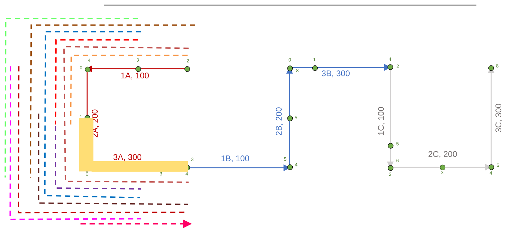

### Slide 7 <!-- slide 7 -->

| R Name | L NAME | From Date | To Date | Line Order | From Measure | To Measure |
| --- | --- | --- | --- | --- | --- | --- |
| 1A | L0 | 1/1/2000 | Null | 100 | 2 | 4 |
| 2A | L0 | 1/1/2000 | 12/31/2010 | 200 | 0 | 2 |
| 3A | L0 | 1/1/2000 | 12/31/2010 | 300 | 0 | 4 |
| 2A | L0 | 12/31/2010 | Null | 200 | 0 | 1 |
| 2A Line1 | L1 | 12/31/2010 | Null | 100 | 1 | 2 |
| 3A | L1 | 12/31/2010 | Null | 200 | 0 | 4 |
| 1B | L1 | 1/1/2000 | 12/31/2010 | 100 | 3 | 5 |
| 1B | L1 | 12/31/2010 | Null | 300 | 3 | 5 |
| 2B | L1 | 1/1/2000 | 12/31/2010 | 200 | 4 | 8 |
| 2B | L1 | 12/31/2010 | Null | 400 | 4 | 8 |
| 3B | L1 | 1/1/2000 | 12/31/2010 | 300 | 0 | 2 |
| 3B | L1 | 12/31/2010 | Null | 500 | 0 | 2 |
| 1C | L2 | 1/1/2000 | Null | 100 | 4 | 6 |
| 2C | L2 | 1/1/2000 | Null | 200 | 2 | 6 |
| 3C | L2 | 1/1/2000 | Null | 300 | 4 | 8 |

| EventID | From Date | To Date | From RouteID | To RouteID | From Measure | To Measure | Loc Error |
| --- | --- | --- | --- | --- | --- | --- | --- |
| 001 | 1/1/2000 | 12/31/2010 | 1A | 2A | 2 | 1 | No Error |
| 002 | 1/1/2000 | 12/31/2010 | 1A | 3A | 2 | 4 | No Error |
| 003 | 1/1/2000 | 12/31/2010 | 1A | 2A | 3 | 1 | No Error |
| 004 | 1/1/2000 | 12/31/2010 | 2A | 3A | 1 | 2 | No Error |
| 005 | 1/1/2000 | 12/31/2010 | 1A | 3A | 3 | 2 | No Error |
| 006 | 1/1/2000 | 12/31/2010 | 2A | 3A | 1 | 4 | No Error |
| 007 | 1/1/2000 | 12/31/2010 | 1A | 2A | 2 | 2 | No Error |
| 008 | 1/1/2000 | 12/31/2010 | 2A | 3A | 0 | 4 | No Error |
| 009 | 1/1/2000 | 12/31/2010 | 2A | 3A | 0 | 2 | No Error |
| 010 | 1/1/2000 | 12/31/2010 | 1A | 2A | 3 | 2 | No Error |
| 011 | 1/1/2000 | 12/31/2010 | 3A | 3A | 0 | 4 | No Error |
| 001 | 12/31/2010 | Null | 1A | 2A | 2 | 1 | No Error |
| 002 | 12/31/2010 | Null | 1A | 3A | 2 | 4 | Different From Route And To Route Line IDs |
| 003 | 12/31/2010 | Null | 1A | 2A | 3 | 1 | No Error |
| 004 | 12/31/2010 | Null | 2A | 3A | 1 | 2 | Different From Route And To Route Line IDs |
| 005 | 12/31/2010 | Null | 1A | 3A | 3 | 2 | Different From Route And To Route Line IDs |
| 006 | 12/31/2010 | Null | 2A | 3A | 1 | 4 | Different From Route And To Route Line IDs |
| 007 | 12/31/2010 | Null | 1A | 2A | 2 | 2 | Partial Match for the To Measure |
| 008 | 12/31/2010 | Null | 2A | 3A | 0 | 4 | Different From Route And To Route Line IDs |
| 009 | 12/31/2010 | Null | 2A | 3A | 0 | 2 | Different From Route And To Route Line IDs |
| 010 | 12/31/2010 | Null | 1A | 2A | 3 | 2 | Partial Match for the To Measure |
| 011 | 12/31/2010 | Null | 3A | 3A | 0 | 4 | No Error |

| Test ID | 3 | Network Type | Engineering (Spanning Line Events) |
| --- | --- | --- | --- |
| Test | Reassign in the middle spanning routes to the line on the right. Rename one route |  |  |

[figure: 1A, 100 · 2A, 200 · 3A, 200 · 1B, 300 · 2B, 400 · 3B, 500 · 2C, 200 · 1C, 100 · 3C, 300 · 4 · 2 · 0 · 3 · 5 · 8 · 1 · 6 · 2A Line1, 100]

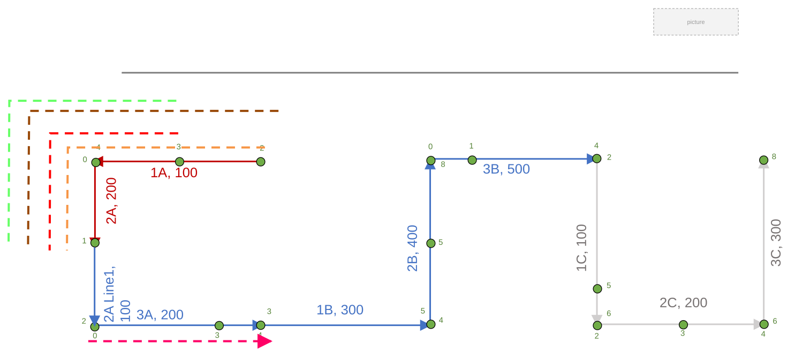

### Slide 8 — New Line <!-- slide 8 -->

| Recalibrate Source | Yes |
| --- | --- |
| Recalibrate Target | Yes |
| Date | 12/31/2020 |
|  |  |

| Test ID | 4 | Network Type | Engineering (Spanning Line Events) |
| --- | --- | --- | --- |
| Test | Reassign to a new line. No Change. |  |  |

| EventID | From Date | To Date | From RouteID | To RouteID | From Measure | To Measure | Loc Error |
| --- | --- | --- | --- | --- | --- | --- | --- |
| 001 | 1/1/2000 | Null | 1A | 2A | 2 | 1 | No Error |
| 002 | 1/1/2000 | Null | 1A | 3A | 2 | 4 | No Error |
| 003 | 1/1/2000 | Null | 1A | 2A | 3 | 1 | No Error |
| 004 | 1/1/2000 | Null | 2A | 3A | 1 | 2 | No Error |
| 005 | 1/1/2000 | Null | 1A | 3A | 3 | 2 | No Error |
| 006 | 1/1/2000 | Null | 2A | 3A | 1 | 4 | No Error |
| 007 | 1/1/2000 | Null | 1A | 2A | 2 | 2 | No Error |
| 008 | 1/1/2000 | Null | 2A | 3A | 0 | 4 | No Error |
| 009 | 1/1/2000 | Null | 2A | 3A | 0 | 2 | No Error |
| 010 | 1/1/2000 | Null | 1A | 2A | 3 | 2 | No Error |
| 011 | 1/1/2000 | Null | 3A | 3A | 0 | 4 | No Error |

| R Name | L NAME | From Date | To Date | Line Order | From Measure | To Measure |
| --- | --- | --- | --- | --- | --- | --- |
| 1A | L0 | 1/1/2000 | Null | 100 | 2 | 4 |
| 2A | L0 | 1/1/2000 | Null | 200 | 0 | 2 |
| 3A | L0 | 1/1/2000 | Null | 300 | 0 | 4 |
| 1B | L1 | 1/1/2000 | Null | 100 | 3 | 5 |
| 2B | L1 | 1/1/2000 | Null | 200 | 4 | 8 |
| 3B | L1 | 1/1/2000 | Null | 300 | 0 | 2 |
| 1C | L2 | 1/1/2000 | Null | 100 | 4 | 6 |
| 2C | L2 | 1/1/2000 | Null | 200 | 2 | 6 |
| 3C | L2 | 1/1/2000 | Null | 300 | 4 | 8 |

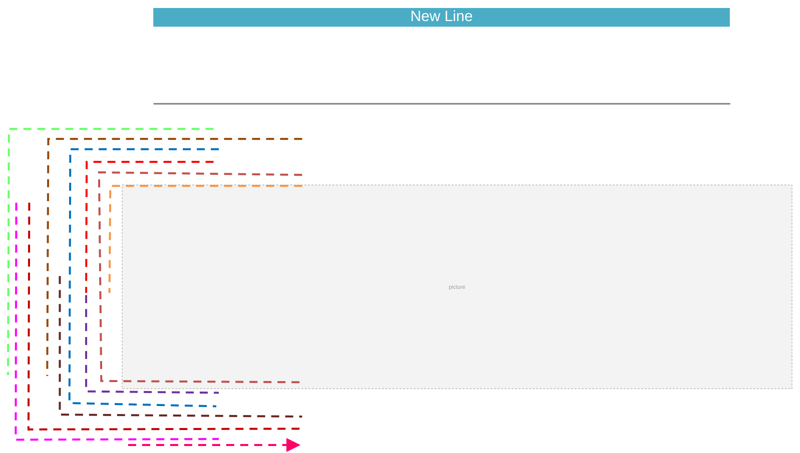

### Slide 9 <!-- slide 9 -->

| R Name | L NAME | From Date | To Date | Line Order | From Measure | To Measure |
| --- | --- | --- | --- | --- | --- | --- |
| 1A | L0 | 1/1/2000 | 12/31/2020 | 100 | 2 | 4 |
| 2A | L0 | 1/1/2010 | 12/31/2020 | 200 | 0 | 2 |
| 3A | L0 | 1/1/2020 | 12/31/2020 | 300 | 0 | 4 |
| 1A | LX | 12/31/2020 | Null | 100 | 2 | 4 |
| 2A | LX | 12/31/2020 | Null | 200 | 0 | 2 |
| 3A | LX | 12/31/2020 | Null | 300 | 0 | 4 |
| 1B | L1 | 1/1/2002 | Null | 100 | 3 | 5 |
| 2B | L1 | 1/1/2005 | Null | 200 | 4 | 8 |
| 3B | L1 | 1/1/2010 | Null | 300 | 0 | 2 |
| 1C | L2 | 1/1/2020 | Null | 100 | 4 | 6 |
| 2C | L2 | 1/1/2020 | Null | 200 | 2 | 6 |
| 3C | L2 | 1/1/2020 | Null | 300 | 4 | 8 |

| EventID | From Date | To Date | From RouteID | To RouteID | From Measure | To Measure | Loc Error |
| --- | --- | --- | --- | --- | --- | --- | --- |
| 001 | 1/1/2000 | 12/31/2010 | 1A | 2A | 2 | 1 | No Error |
| 002 | 1/1/2000 | 12/31/2010 | 1A | 3A | 2 | 4 | No Error |
| 003 | 1/1/2000 | 12/31/2010 | 1A | 2A | 3 | 1 | No Error |
| 004 | 1/1/2000 | 12/31/2010 | 2A | 3A | 1 | 2 | No Error |
| 005 | 1/1/2000 | 12/31/2010 | 1A | 3A | 3 | 2 | No Error |
| 006 | 1/1/2000 | 12/31/2010 | 2A | 3A | 1 | 4 | No Error |
| 007 | 1/1/2000 | 12/31/2010 | 1A | 2A | 2 | 2 | No Error |
| 008 | 1/1/2000 | 12/31/2010 | 2A | 3A | 0 | 4 | No Error |
| 009 | 1/1/2000 | 12/31/2010 | 2A | 3A | 0 | 2 | No Error |
| 010 | 1/1/2000 | 12/31/2010 | 1A | 2A | 3 | 2 | No Error |
| 011 | 1/1/2000 | 12/31/2010 | 3A | 3A | 0 | 4 | No Error |
| 001 | 12/31/2010 | Null | 1A | 2A | 2 | 1 | No Error |
| 002 | 12/31/2010 | Null | 1A | 3A | 2 | 4 | No Error |
| 003 | 12/31/2010 | Null | 1A | 2A | 3 | 1 | No Error |
| 004 | 12/31/2010 | Null | 2A | 3A | 1 | 2 | No Error |
| 005 | 12/31/2010 | Null | 1A | 3A | 3 | 2 | No Error |
| 006 | 12/31/2010 | Null | 2A | 3A | 1 | 4 | No Error |
| 007 | 12/31/2010 | Null | 1A | 2A | 2 | 2 | No Error |
| 008 | 12/31/2010 | Null | 2A | 3A | 0 | 4 | No Error |
| 009 | 12/31/2010 | Null | 2A | 3A | 0 | 2 | No Error |
| 010 | 12/31/2010 | Null | 1A | 2A | 3 | 2 | No Error |
| 011 | 12/31/2010 | Null | 3A | 3A | 0 | 4 | No Error |

| Test ID | 4 | Network Type | Engineering (Spanning Line Events) |
| --- | --- | --- | --- |
| Test | Reassign to a new line. No Change. |  |  |

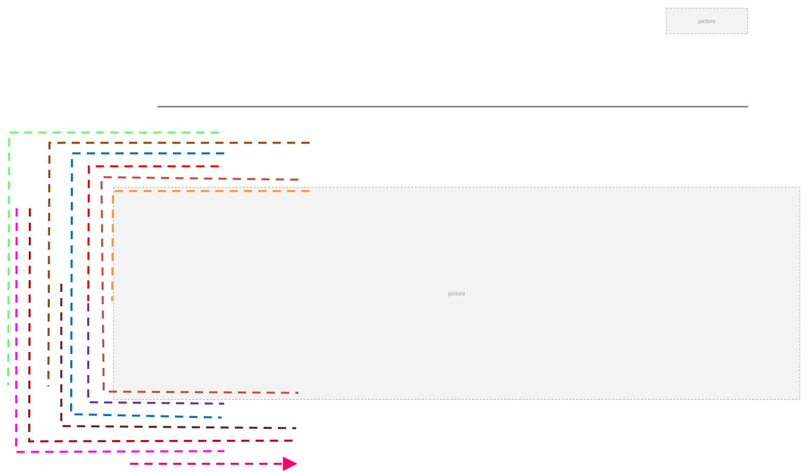

### Slide 10 — New Line <!-- slide 10 -->

| Recalibrate Source | Yes |
| --- | --- |
| Recalibrate Target | Yes |
| Date | 12/31/2020 |
|  |  |

| Test ID | 5 | Network Type | Engineering (Spanning Line Events) |
| --- | --- | --- | --- |
| Test | Reassign the middle route in a line to a new line. Change measures. |  |  |

| EventID | From Date | To Date | From RouteID | To RouteID | From Measure | To Measure | Loc Error |
| --- | --- | --- | --- | --- | --- | --- | --- |
| 001 | 1/1/2000 | Null | 1A | 2A | 2 | 1 | No Error |
| 002 | 1/1/2000 | Null | 1A | 3A | 2 | 4 | No Error |
| 003 | 1/1/2000 | Null | 1A | 2A | 3 | 1 | No Error |
| 004 | 1/1/2000 | Null | 2A | 3A | 1 | 2 | No Error |
| 005 | 1/1/2000 | Null | 1A | 3A | 3 | 2 | No Error |
| 006 | 1/1/2000 | Null | 2A | 3A | 1 | 4 | No Error |
| 007 | 1/1/2000 | Null | 1A | 2A | 2 | 2 | No Error |
| 008 | 1/1/2000 | Null | 2A | 3A | 0 | 4 | No Error |
| 009 | 1/1/2000 | Null | 2A | 3A | 0 | 2 | No Error |
| 010 | 1/1/2000 | Null | 1A | 2A | 3 | 2 | No Error |
| 011 | 1/1/2000 | Null | 3A | 3A | 0 | 4 | No Error |

| R Name | L NAME | From Date | To Date | Line Order | From Measure | To Measure |
| --- | --- | --- | --- | --- | --- | --- |
| 1A | L0 | 1/1/2000 | Null | 100 | 2 | 4 |
| 2A | L0 | 1/1/2010 | Null | 200 | 0 | 2 |
| 3A | L0 | 1/1/2020 | Null | 300 | 0 | 4 |
| 1B | L1 | 1/1/2002 | Null | 100 | 3 | 5 |
| 2B | L1 | 1/1/2005 | Null | 200 | 4 | 8 |
| 3B | L1 | 1/1/2010 | Null | 300 | 0 | 2 |
| 1C | L2 | 1/1/2020 | Null | 100 | 4 | 6 |
| 2C | L2 | 1/1/2020 | Null | 200 | 2 | 6 |
| 3C | L2 | 1/1/2020 | Null | 300 | 4 | 8 |

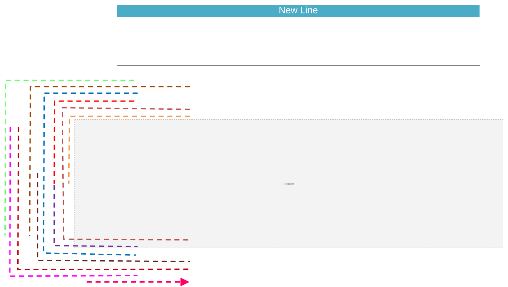

### Slide 11 <!-- slide 11 -->

| Test ID | 5 | Network Type | Engineering (Spanning Line Events) |
| --- | --- | --- | --- |
| Test | Reassign the middle route in a line to a new line. Change measures. |  |  |

| R Name | L NAME | From Date | To Date | Line Order | From Measure | To Measure |
| --- | --- | --- | --- | --- | --- | --- |
| 1A | L0 | 1/1/2000 | Null | 100 | 2 | 4 |
| 2A | L0 | 1/1/2010 | 12/31/2020 | 200 | 0 | 2 |
| 3A | L0 | 1/1/2020 | 12/31/2010 | 300 | 0 | 4 |
| 3A | L0 | 12/31/2020 | Null | 200 | 0 | 4 |
| 2A | LX | 12/31/2020 | Null | 100 | 10 | 20 |
| 1B | L1 | 1/1/2002 | Null | 100 | 3 | 5 |
| 2B | L1 | 1/1/2005 | Null | 200 | 4 | 8 |
| 3B | L1 | 1/1/2010 | Null | 300 | 0 | 2 |
| 1C | L2 | 1/1/2020 | Null | 100 | 4 | 6 |
| 2C | L2 | 1/1/2020 | Null | 200 | 2 | 6 |
| 3C | L2 | 1/1/2020 | Null | 300 | 4 | 8 |

100
100

| EventID | From Date | To Date | From RouteID | To RouteID | From Measure | To Measure | Loc Error |
| --- | --- | --- | --- | --- | --- | --- | --- |
| 001 | 1/1/2000 | 12/31/2010 | 1A | 2A | 2 | 1 | No Error |
| 002 | 1/1/2000 | 12/31/2010 | 1A | 3A | 2 | 4 | No Error |
| 003 | 1/1/2000 | 12/31/2010 | 1A | 2A | 3 | 1 | No Error |
| 004 | 1/1/2000 | 12/31/2010 | 2A | 3A | 1 | 2 | No Error |
| 005 | 1/1/2000 | 12/31/2010 | 1A | 3A | 3 | 2 | No Error |
| 006 | 1/1/2000 | 12/31/2010 | 2A | 3A | 1 | 4 | No Error |
| 007 | 1/1/2000 | 12/31/2010 | 1A | 2A | 2 | 2 | No Error |
| 008 | 1/1/2000 | 12/31/2010 | 2A | 3A | 0 | 4 | No Error |
| 009 | 1/1/2000 | 12/31/2010 | 2A | 3A | 0 | 2 | No Error |
| 010 | 1/1/2000 | 12/31/2010 | 1A | 2A | 3 | 2 | No Error |
| 011 | 1/1/2000 | 12/31/2010 | 3A | 3A | 0 | 4 | No Error |
| 001 | 12/31/2010 | Null | 1A | 2A | 2 | 1 | Different From Route And To Route Line IDs |
| 002 | 12/31/2010 | Null | 1A | 3A | 2 | 4 | No Error |
| 003 | 12/31/2010 | Null | 1A | 2A | 3 | 1 | Different From Route And To Route Line IDs |
| 004 | 12/31/2010 | Null | 2A | 3A | 1 | 2 | Different From Route And To Route Line IDs |
| 005 | 12/31/2010 | Null | 1A | 3A | 3 | 2 | No Error |
| 006 | 12/31/2010 | Null | 2A | 3A | 1 | 4 | Different From Route And To Route Line IDs |
| 007 | 12/31/2010 | Null | 1A | 2A | 2 | 2 | Different From Route And To Route Line IDs |
| 008 | 12/31/2010 | Null | 2A | 3A | 0 | 4 | Different From Route And To Route Line IDs |
| 009 | 12/31/2010 | Null | 2A | 3A | 0 | 2 | Different From Route And To Route Line IDs |
| 010 | 12/31/2010 | Null | 1A | 2A | 3 | 2 | Different From Route And To Route Line IDs |
| 011 | 12/31/2010 | Null | 3A | 3A | 0 | 4 | No Error |

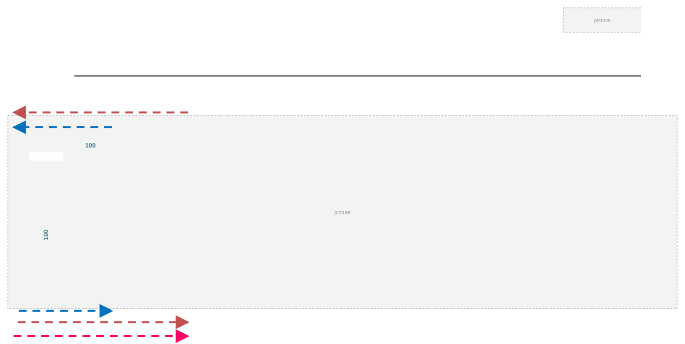

### Slide 12 <!-- slide 12 -->

| Recalibrate Source | Yes |
| --- | --- |
| Recalibrate Target | Yes |
| Date | 12/31/2030 |
|  |  |

| Test ID | 6 | Network Type | Engineering (Spanning Line Events) |
| --- | --- | --- | --- |
| Test | Reassign partial routes in a line to a new line. Change names of partial routes. |  |  |

| EventID | From Date | To Date | From RouteID | To RouteID | From Measure | To Measure | Loc Error |
| --- | --- | --- | --- | --- | --- | --- | --- |
| 001 | 1/1/2000 | Null | 1A | 2A | 2 | 1 | No Error |
| 002 | 1/1/2000 | Null | 1A | 3A | 2 | 4 | No Error |
| 003 | 1/1/2000 | Null | 1A | 2A | 3 | 1 | No Error |
| 004 | 1/1/2000 | Null | 2A | 3A | 1 | 2 | No Error |
| 005 | 1/1/2000 | Null | 1A | 3A | 3 | 2 | No Error |
| 006 | 1/1/2000 | Null | 2A | 3A | 1 | 4 | No Error |
| 007 | 1/1/2000 | Null | 1A | 2A | 2 | 2 | No Error |
| 008 | 1/1/2000 | Null | 2A | 3A | 0 | 4 | No Error |
| 009 | 1/1/2000 | Null | 2A | 3A | 0 | 2 | No Error |
| 010 | 1/1/2000 | Null | 1A | 2A | 3 | 2 | No Error |
| 011 | 1/1/2000 | Null | 3A | 3A | 0 | 4 | No Error |

| R Name | L NAME | From Date | To Date | Line Order | From Measure | To Measure |
| --- | --- | --- | --- | --- | --- | --- |
| 1A | L0 | 1/1/2000 | Null | 100 | 2 | 4 |
| 2A | L0 | 1/1/2000 | Null | 200 | 0 | 2 |
| 3A | L0 | 1/1/2000 | Null | 300 | 0 | 4 |
| 1B | L1 | 1/1/2000 | Null | 100 | 3 | 5 |
| 2B | L1 | 1/1/2000 | Null | 200 | 4 | 8 |
| 3B | L1 | 1/1/2000 | Null | 300 | 0 | 2 |
| 1C | L2 | 1/1/2000 | Null | 100 | 4 | 6 |
| 2C | L2 | 1/1/2000 | Null | 200 | 2 | 6 |
| 3C | L2 | 1/1/2000 | Null | 300 | 4 | 8 |

[figure: New Line · 1A, 100 · 2A, 200 · 3A, 300 · 1B, 100 · 2B, 200 · 3B, 300 · 2C, 200 · 1C, 100 · 3C, 300 · 4 · 2 · 0 · 3 · 1 · 5 · 8 · 6]

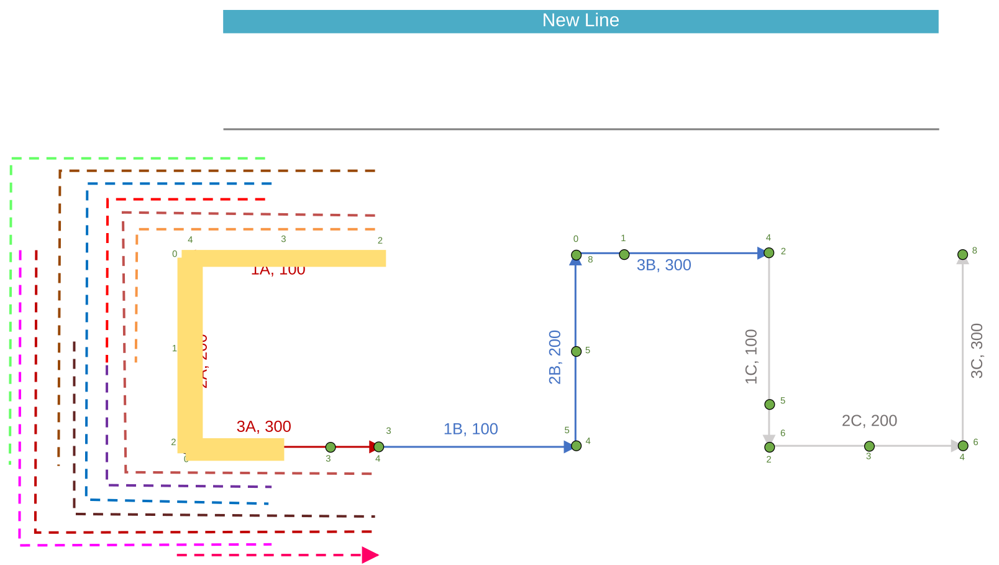

### Slide 13 <!-- slide 13 -->

| Test ID | 6 | Network Type | Engineering (Spanning Line Events) |
| --- | --- | --- | --- |
| Test | Reassign partial routes in a line to a new line. Change names of partial routes. |  |  |

| R Name | L NAME | From Date | To Date | Line Order | From Measure | To Measure |
| --- | --- | --- | --- | --- | --- | --- |
| 1A | L0 | 1/1/2000 | 12/31/2030 | 100 | 2 | 4 |
| 2A | L0 | 1/1/2010 | 12/31/2030 | 200 | 0 | 2 |
| 3A | L0 | 1/1/2020 | 12/31/2030 | 300 | 0 | 4 |
| 1A | LX | 12/31/2030 | Null | 100 | 2 | 4 |
| 2A | LX | 12/31/2030 | Null | 200 | 0 | 2 |
| 3A LineX | LX | 12/31/2030 | Null | 300 | 0 | 2 |
| 3A | L0 | 12/31/2030 | Null | 100 | 2 | 4 |
| 1B | L1 | 1/1/2002 | Null | 100 | 3 | 5 |
| 2B | L1 | 1/1/2005 | Null | 200 | 4 | 8 |
| 3B | L1 | 1/1/2010 | Null | 300 | 0 | 2 |
| 1C | L2 | 1/1/2020 | 12/31/2030 | 100 | 4 | 6 |
| 2C | L2 | 1/1/2020 | 12/31/2030 | 200 | 2 | 6 |
| 3C | L2 | 1/1/2020 | 12/31/2030 | 300 | 4 | 8 |

3A LineX, 300

| EventID | From Date | To Date | From RouteID | To RouteID | From Measure | To Measure | Loc Error |
| --- | --- | --- | --- | --- | --- | --- | --- |
| 001 | 1/1/2000 | 12/31/2010 | 1A | 2A | 2 | 1 | No Error |
| 002 | 1/1/2000 | 12/31/2010 | 1A | 3A | 2 | 4 | No Error |
| 003 | 1/1/2000 | 12/31/2010 | 1A | 2A | 3 | 1 | No Error |
| 004 | 1/1/2000 | 12/31/2010 | 2A | 3A | 1 | 2 | No Error |
| 005 | 1/1/2000 | 12/31/2010 | 1A | 3A | 3 | 2 | No Error |
| 006 | 1/1/2000 | 12/31/2010 | 2A | 3A | 1 | 4 | No Error |
| 007 | 1/1/2000 | 12/31/2010 | 1A | 2A | 2 | 2 | No Error |
| 008 | 1/1/2000 | 12/31/2010 | 2A | 3A | 0 | 4 | No Error |
| 009 | 1/1/2000 | 12/31/2010 | 2A | 3A | 0 | 2 | No Error |
| 010 | 1/1/2000 | 12/31/2010 | 1A | 2A | 3 | 2 | No Error |
| 011 | 1/1/2000 | 12/31/2010 | 3A | 3A | 0 | 4 | No Error |
| 001 | 12/31/2030 | Null | 1A | 2A | 2 | 1 | No Error |
| 002 | 12/31/2030 | Null | 1A | 3A | 2 | 4 | Different From Route And To Route Line IDs |
| 003 | 12/31/2030 | Null | 1A | 2A | 3 | 1 | No Error |
| 004 | 12/31/2030 | Null | 2A | 3A | 1 | 2 | Different From Route And To Route Line IDs |
| 005 | 12/31/2030 | Null | 1A | 3A | 3 | 2 | Different From Route And To Route Line IDs |
| 006 | 12/31/2030 | Null | 2A | 3A | 1 | 4 | Different From Route And To Route Line IDs |
| 007 | 12/31/2030 | Null | 1A | 2A | 2 | 2 | No Error |
| 008 | 12/31/2030 | Null | 2A | 3A | 0 | 4 | Different From Route And To Route Line IDs |
| 009 | 12/31/2030 | Null | 2A | 3A | 0 | 2 | Different From Route And To Route Line IDs |
| 010 | 12/31/2030 | Null | 1A | 2A | 3 | 2 | No Error |
| 011 | 12/31/2030 | Null | 3A | 3A | 0 | 4 | Partial Match for the From Measure |

[figure: 1A, 100 · 2A, 200 · 1B, 100 · 2B, 200 · 3B, 300 · 2C, 200 · 1C, 100 · 3C, 300 · 4 · 2 · 0 · 3 · 1 · 5 · 8 · 6 · 3A, 100]

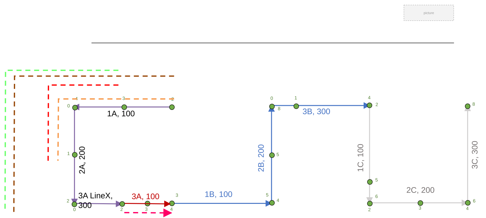

### Slide 14 <!-- slide 14 -->

| Test ID | 7 | Network Type | Engineering (Spanning Line Events) |
| --- | --- | --- | --- |
| Test | Reassign all the routes in a line to another line on right, transferring routes and measures. The effective date is same as one the source route’s From Date |  |  |

| Recalibrate Source | Yes |
| --- | --- |
| Recalibrate Target | Yes |
| Date | 1/1/2000 |
|  |  |

| EventID | From Date | To Date | From RouteID | To RouteID | From Measure | To Measure | Loc Error |
| --- | --- | --- | --- | --- | --- | --- | --- |
| 001 | 1/1/2000 | Null | 1A | 2A | 2 | 1 | No Error |
| 002 | 1/1/2000 | Null | 1A | 3A | 2 | 4 | No Error |
| 003 | 1/1/2000 | Null | 1A | 2A | 3 | 1 | No Error |
| 004 | 1/1/2000 | Null | 2A | 3A | 1 | 2 | No Error |
| 005 | 1/1/2000 | Null | 1A | 3A | 3 | 2 | No Error |
| 006 | 1/1/2000 | Null | 2A | 3A | 1 | 4 | No Error |
| 007 | 1/1/2000 | Null | 1A | 2A | 2 | 2 | No Error |
| 008 | 1/1/2000 | Null | 2A | 3A | 0 | 4 | No Error |
| 009 | 1/1/2000 | Null | 2A | 3A | 0 | 2 | No Error |
| 010 | 1/1/2000 | Null | 1A | 2A | 3 | 2 | No Error |
| 011 | 1/1/2000 | Null | 3A | 3A | 0 | 4 | No Error |

| R Name | L NAME | From Date | To Date | Line Order | From Measure | To Measure |
| --- | --- | --- | --- | --- | --- | --- |
| 1A | L0 | 1/1/2000 | Null | 100 | 2 | 4 |
| 2A | L0 | 1/1/2000 | Null | 200 | 0 | 2 |
| 3A | L0 | 1/1/2000 | Null | 300 | 0 | 4 |
| 1B | L1 | 1/1/2000 | Null | 100 | 3 | 5 |
| 2B | L1 | 1/1/2000 | Null | 200 | 4 | 8 |
| 3B | L1 | 1/1/2000 | Null | 300 | 0 | 2 |
| 1C | L2 | 1/1/2000 | Null | 100 | 4 | 6 |
| 2C | L2 | 1/1/2000 | Null | 200 | 2 | 6 |
| 3C | L2 | 1/1/2000 | Null | 300 | 4 | 8 |

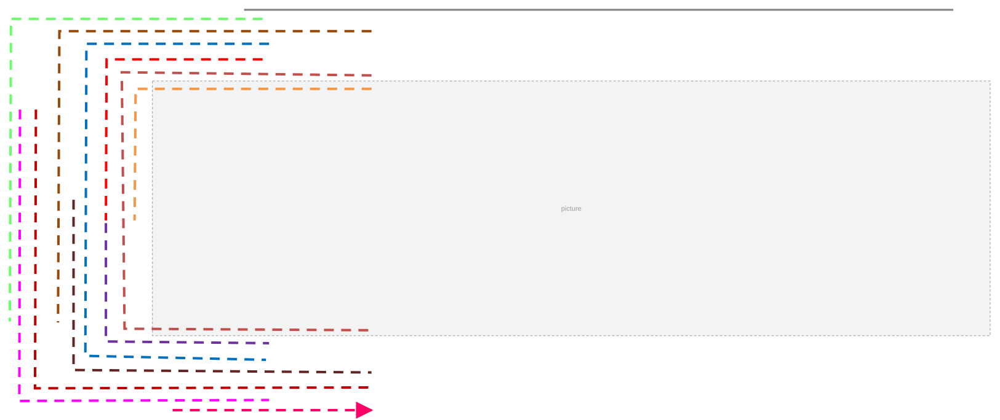

### Slide 15 <!-- slide 15 -->

| R Name | L NAME | From Date | To Date | Line Order | From Measure | To Measure |
| --- | --- | --- | --- | --- | --- | --- |
| 1A | L1 | 1/1/2000 | Null | 100 | 2 | 4 |
| 2A | L1 | 1/1/2000 | Null | 200 | 0 | 2 |
| 3A | L1 | 1/1/2000 | Null | 300 | 0 | 4 |
| 1B | L1 | 1/1/2000 | Null | 400 | 3 | 5 |
| 2B | L1 | 1/1/2000 | Null | 500 | 4 | 8 |
| 3B | L1 | 1/1/2000 | Null | 600 | 0 | 2 |
| 1C | L2 | 1/1/2000 | Null | 100 | 4 | 6 |
| 2C | L2 | 1/1/2000 | Null | 200 | 2 | 6 |
| 3C | L2 | 1/1/2000 | Null | 300 | 4 | 8 |

| Test ID | 7 | Network Type | Engineering (Spanning Line Events) |
| --- | --- | --- | --- |
| Test | Reassign all the routes in a line to another line on right, transferring routes and measures. The effective date is same as one the source route’s From Date |  |  |

| EventID | From Date | To Date | From RouteID | To RouteID | From Measure | To Measure | Loc Error |
| --- | --- | --- | --- | --- | --- | --- | --- |
| 001 | 1/1/2000 | Null | 1A | 2A | 2 | 1 | No Error |
| 002 | 1/1/2000 | Null | 1A | 3A | 2 | 4 | No Error |
| 003 | 1/1/2000 | Null | 1A | 2A | 3 | 1 | No Error |
| 004 | 1/1/2000 | Null | 2A | 3A | 1 | 2 | No Error |
| 005 | 1/1/2000 | Null | 1A | 3A | 3 | 2 | No Error |
| 006 | 1/1/2000 | Null | 2A | 3A | 1 | 4 | No Error |
| 007 | 1/1/2000 | Null | 1A | 2A | 2 | 2 | No Error |
| 008 | 1/1/2000 | Null | 2A | 3A | 0 | 4 | No Error |
| 009 | 1/1/2000 | Null | 2A | 3A | 0 | 2 | No Error |
| 010 | 1/1/2000 | Null | 1A | 2A | 3 | 2 | No Error |
| 011 | 1/1/2000 | Null | 3A | 3A | 0 | 4 | No Error |

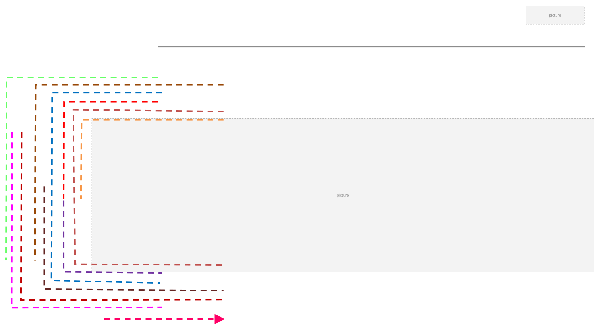

### Slide 16 <!-- slide 16 -->

| R Name | L NAME | From Date | To Date | Line Order | From Measure | To Measure |
| --- | --- | --- | --- | --- | --- | --- |
| X1 | L3 | 1/1/2000 | Null | 100 | 2 | 6 |
| X2 | L3 | 1/1/2000 | Null | 200 | 24 | 28 |
| 1B | L1 | 1/1/2000 | Null | 100 | 3 | 5 |
| 2B | L1 | 1/1/2000 | Null | 200 | 4 | 8 |
| 3B | L1 | 1/1/2000 | Null | 300 | 0 | 2 |

| Test ID | 8 | Network Type | Engineering (Spanning Line Events) |
| --- | --- | --- | --- |
| Test | Reassign to fill the gap in a line by transferring route. |  |  |

| Recalibrate Source | Yes |
| --- | --- |
| Recalibrate Target | Yes |
| Date | 12/31/2023 |

| EventID | From Date | To Date | From RouteID | To RouteID | From Measure | To Measure | Loc Error |
| --- | --- | --- | --- | --- | --- | --- | --- |
| 001 | 1/1/2000 | Null | X1 | X2 | 2 | 28 | No Error |
| 002 | 1/1/2000 | Null | X1 | X2 | 2 | 26 | No Error |
| 003 | 1/1/2000 | Null | X1 | X2 | 4 | 26 | No Error |
| 004 | 1/1/2000 | Null | X1 | X2 | 4 | 28 | No Error |
| 005 | 1/1/2000 | Null | 1B | 3B | 3 | 2 | No Error |
| 006 | 1/1/2000 | Null | 1B | 3B | 4 | 2 | No Error |
| 007 | 1/1/2000 | Null | 1B | 3B | 4 | 1 | No Error |

[figure: 100 · 200 · X1 · X2]

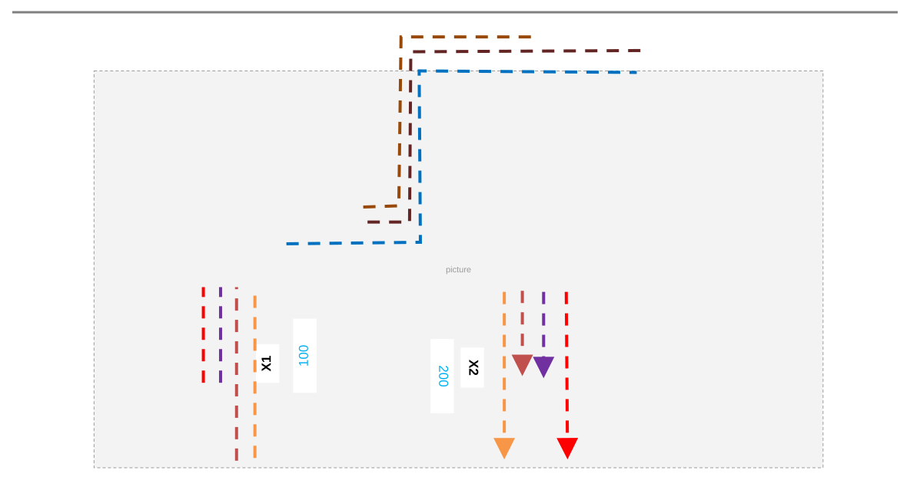

### Slide 17 <!-- slide 17 -->

| R Name | L NAME | From Date | To Date | Line Order | From Measure | To Measure |
| --- | --- | --- | --- | --- | --- | --- |
| X1 | L3 | 1/1/2000 | Null | 100 | 2 | 6 |
| X2 | L3 | 1/1/2000 | 12/31/2023 | 100 | 24 | 28 |
| 1B | L1 | 1/1/2000 | 12/31/2023 | 100 | 3 | 5 |
| 2B | L1 | 1/1/2000 | 12/31/2023 | 200 | 4 | 8 |
| 3B | L1 | 1/1/2000 | 12/31/2023 | 300 | 0 | 2 |
| X2 | L3 | 12/31/2023 | Null | 300 | 24 | 28 |
| 1B | L3 | 12/31/2023 | Null | 200 | 4 | 5 |
| 3B | L1 | 12/31/2023 | Null | 200 | 0 | 2 |
| 2B | L1 | 12/31/2023 | Null | 100 | 4 | 8 |

| Test ID | 8 | Network Type | Engineering (Spanning Line Events) |
| --- | --- | --- | --- |
| Test | Reassign to fill the gap in a line by transferring route. |  |  |

| EventID | From Date | To Date | From RouteID | To RouteID | From Measure | To Measure | Loc Error |
| --- | --- | --- | --- | --- | --- | --- | --- |
| 001 | 1/1/2000 | 12/31/2023 | X1 | X2 | 2 | 28 | No Error |
| 002 | 1/1/2000 | 12/31/2023 | X1 | X2 | 2 | 26 | No Error |
| 003 | 1/1/2000 | 12/31/2023 | X1 | X2 | 4 | 26 | No Error |
| 004 | 1/1/2000 | 12/31/2023 | X1 | X2 | 4 | 28 | No Error |
| 005 | 1/1/2000 | 12/31/2023 | 1B | 3B | 3 | 2 | No Error |
| 006 | 1/1/2000 | 12/31/2023 | 1B | 3B | 4 | 2 | No Error |
| 007 | 1/1/2000 | 12/31/2023 | 1B | 3B | 4 | 1 | No Error |
| 001 | 12/31/2023 | Null | X1 | X2 | 2 | 28 | No Error |
| 002 | 12/31/2023 | Null | X1 | X2 | 2 | 26 | No Error |
| 003 | 12/31/2023 | Null | X1 | X2 | 4 | 26 | No Error |
| 004 | 12/31/2023 | Null | X1 | X2 | 4 | 28 | No Error |
| 005 | 12/31/2023 | Null | 1B | 3B | 3 | 2 | Different From Route and To Route LineIDs |
| 006 | 12/31/2023 | Null | 1B | 3B | 4 | 2 | Different From Route and To Route LineIDs |
| 007 | 12/31/2023 | Null | 1B | 3B | 4 | 1 | Different From Route and To Route LineIDs |

[figure: 100 · 300 · X1 · X2]

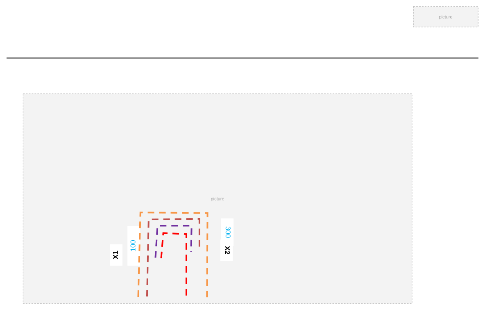

## Test Cases

### TC-U01 — Recalibrate Target (Yes) <!-- src: S3 · slide 18 · table · Yes -->

- **ID:** Yes

### TC-U02 — Recalibrate Target (Yes) <!-- src: S3 · slide 20 · table · Yes -->

- **ID:** Yes

### TC-U03 — Recalibrate Target (Yes) <!-- src: S3 · slide 30 · table · Yes -->

- **ID:** Yes

### TC-U04 — Recalibrate Target (Yes) <!-- src: S3 · slide 52 · table · Yes -->

- **ID:** Yes

### TC-U05 — Recalibrate Target (Yes) <!-- src: S3 · slide 54 · table · Yes -->

- **ID:** Yes

## Other content

### Slide 18 <!-- slide 18 -->

| Test ID | 9 | Network Type | Engineering (Spanning Line Events) |
| --- | --- | --- | --- |
| Test | Reassign to fill the gap in a line by transferring route. |  |  |

|  |  |

| EventID | From Date | To Date | From RouteID | To RouteID | From Measure | To Measure | Loc Error |
| --- | --- | --- | --- | --- | --- | --- | --- |
| 001 | 1/1/2000 | Null | X1 | X2 | 2 | 28 | No Error |
| 002 | 1/1/2000 | Null | X1 | X2 | 2 | 26 | No Error |
| 003 | 1/1/2000 | Null | X1 | X2 | 4 | 26 | No Error |
| 004 | 1/1/2000 | Null | X1 | X2 | 4 | 28 | No Error |
| 005 | 1/1/2000 | Null | 1B | 3B | 3 | 2 | No Error |
| 006 | 1/1/2000 | Null | 1B | 3B | 4 | 2 | No Error |
| 007 | 1/1/2000 | Null | 1B | 3B | 4 | 1 | No Error |

| R Name | L NAME | From Date | To Date | Line Order | From Measure | To Measure |
| --- | --- | --- | --- | --- | --- | --- |
| X1 | L3 | 1/1/2000 | Null | 100 | 2 | 6 |
| X2 | L3 | 1/1/2000 | Null | 200 | 24 | 28 |
| 1B | L1 | 1/1/2000 | Null | 100 | 3 | 5 |
| 2B | L1 | 1/1/2000 | Null | 200 | 4 | 8 |
| 3B | L1 | 1/1/2000 | Null | 300 | 0 | 2 |

[figure: 100 · 200 · X1 · X2]

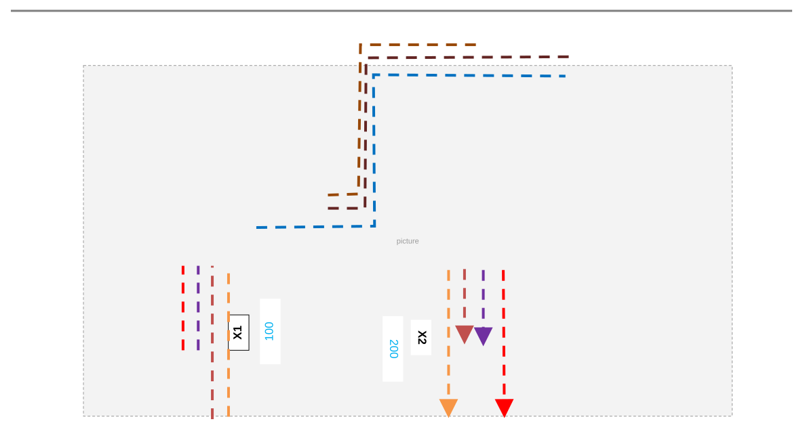

### Slide 19 <!-- slide 19 -->

| R Name | L NAME | From Date | To Date | Line Order | From Measure | To Measure |
| --- | --- | --- | --- | --- | --- | --- |
| X1 | L3 | 1/1/2000 | Null | 100 | 2 | 6 |
| X2 | L3 | 1/1/2000 | 12/31/2023 | 200 | 24 | 28 |
| 1B | L1 | 1/1/2000 | 12/31/2023 | 100 | 3 | 5 |
| 2B | L1 | 1/1/2000 | Null | 200 | 4 | 8 |
| 3B | L1 | 1/1/2000 | 12/31/2023 | 300 | 0 | 2 |
| X2 | L3 | 12/31/2023 | Null | 300 | 24 | 28 |
| 1B-New | L3 | 12/31/2023 | Null | 200 | 3 | 4 |
| 1B | L1 | 12/31/2023 | Null | 100 | 4 | 5 |

| Test ID | 9 | Network Type | Engineering (Spanning Line Events) |
| --- | --- | --- | --- |
| Test | Reassign part of a route to another line. |  |  |

| EventID | From Date | To Date | From RouteID | To RouteID | From Measure | To Measure | Loc Error |
| --- | --- | --- | --- | --- | --- | --- | --- |
| 001 | 1/1/2000 | 12/31/2023 | X1 | X2 | 2 | 28 | No Error |
| 002 | 1/1/2000 | 12/31/2023 | X1 | X2 | 2 | 26 | No Error |
| 003 | 1/1/2000 | 12/31/2023 | X1 | X2 | 4 | 26 | No Error |
| 004 | 1/1/2000 | 12/31/2023 | X1 | X2 | 4 | 28 | No Error |
| 005 | 1/1/2000 | 12/31/2023 | 1B | 3B | 3 | 2 | No Error |
| 006 | 1/1/2000 | 12/31/2023 | 1B | 3B | 4 | 2 | No Error |
| 007 | 1/1/2000 | 12/31/2023 | 1B | 3B | 4 | 1 | No Error |
| 001 | 12/31/2023 | Null | X1 | X2 | 2 | 28 | No Error |
| 002 | 12/31/2023 | Null | X1 | X2 | 2 | 26 | No Error |
| 003 | 12/31/2023 | Null | X1 | X2 | 4 | 26 | No Error |
| 004 | 12/31/2023 | Null | X1 | X2 | 4 | 28 | No Error |
| 005 | 12/31/2023 | Null | 1B | 3B | 3 | 2 | Partial Match for the From Measure |
| 006 | 12/31/2023 | Null | 1B | 3B | 4 | 2 | No Error |
| 007 | 12/31/2023 | Null | 1B | 3B | 4 | 1 | No Error |

[figure: 100 · 300 · X1 · X2]

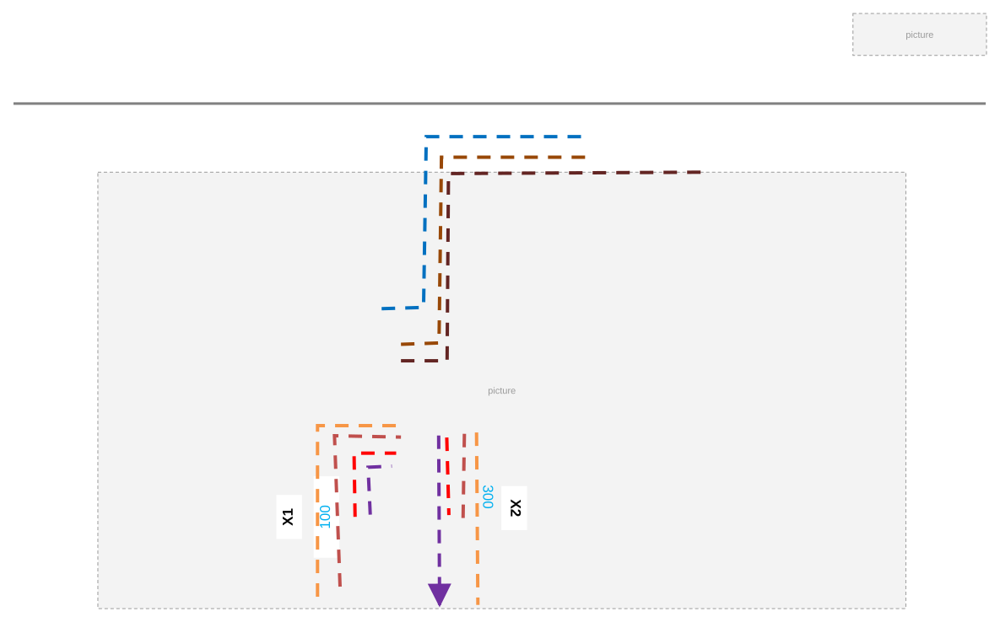

### Slide 20 <!-- slide 20 -->

| Test ID | 10 | Network Type | Engineering (Spanning Line Events) |
| --- | --- | --- | --- |
| Test | Reassign part of a route to another line - 2. Update measures on route 1B_New |  |  |

| EventID | From Date | To Date | From RouteID | To RouteID | From Measure | To Measure | Loc Error |
| --- | --- | --- | --- | --- | --- | --- | --- |
| 001 | 1/1/2000 | Null | X1 | X2 | 2 | 28 | No Error |
| 002 | 1/1/2000 | Null | X1 | X2 | 2 | 26 | No Error |
| 003 | 1/1/2000 | Null | X1 | X2 | 4 | 26 | No Error |
| 004 | 1/1/2000 | Null | X1 | X2 | 4 | 28 | No Error |
| 005 | 1/1/2000 | Null | 1B | 3B | 3 | 2 | No Error |
| 006 | 1/1/2000 | Null | 1B | 3B | 4 | 2 | No Error |
| 007 | 1/1/2000 | Null | 1B | 3B | 4 | 1 | No Error |

| R Name | L NAME | From Date | To Date | Line Order | From Measure | To Measure |
| --- | --- | --- | --- | --- | --- | --- |
| X1 | L3 | 1/1/2000 | Null | 100 | 2 | 6 |
| X2 | L3 | 1/1/2000 | Null | 200 | 24 | 28 |
| 1B | L1 | 1/1/2000 | Null | 100 | 3 | 5 |
| 2B | L1 | 1/1/2000 | Null | 200 | 4 | 8 |
| 3B | L1 | 1/1/2000 | Null | 300 | 0 | 2 |

[figure: 100 · 200 · X1 · X2]

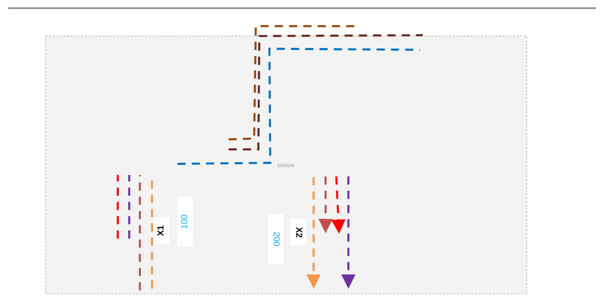

### Slide 21 <!-- slide 21 -->

| R Name | L NAME | From Date | To Date | Line Order | From Measure | To Measure |
| --- | --- | --- | --- | --- | --- | --- |
| X1 | L3 | 1/1/2000 | Null | 100 | 2 | 6 |
| X2 | L3 | 1/1/2000 | 12/31/2023 | 200 | 24 | 28 |
| 1B | L1 | 1/1/2000 | 12/31/2023 | 100 | 3 | 5 |
| 2B | L1 | 1/1/2000 | Null | 200 | 4 | 8 |
| 3B | L1 | 1/1/2000 | Null | 300 | 0 | 2 |
| X2 | L3 | 12/31/2023 | Null | 300 | 24 | 28 |
| X1 | L3 | 12/31/2023 | Null | 100 | 2 | 6 |
| 1B-New | L3 | 12/31/2023 | Null | 200 | 5 | 14 |
| 1B | L1 | 12/31/2023 | Null | 100 | 3 | 4 |

| Test ID | 10 | Network Type | Engineering (Spanning Line Events) |
| --- | --- | --- | --- |
| Test | Reassign part of a route to another line - 2. Update measures on route 1B_New |  |  |

| EventID | From Date | To Date | From RouteID | To RouteID | From Measure | To Measure | Loc Error |
| --- | --- | --- | --- | --- | --- | --- | --- |
| 001 | 1/1/2000 | 12/31/2023 | X1 | X2 | 2 | 28 | No Error |
| 002 | 1/1/2000 | 12/31/2023 | X1 | X2 | 2 | 26 | No Error |
| 003 | 1/1/2000 | 12/31/2023 | X1 | X2 | 4 | 26 | No Error |
| 004 | 1/1/2000 | 12/31/2023 | X1 | X2 | 4 | 28 | No Error |
| 005 | 1/1/2000 | 12/31/2023 | 1B | 3B | 3 | 2 | No Error |
| 006 | 1/1/2000 | 12/31/2023 | 1B | 3B | 4 | 2 | No Error |
| 007 | 1/1/2000 | 12/31/2023 | 1B | 3B | 4 | 1 | No Error |
| 001 | 12/31/2023 | Null | X1 | X2 | 2 | 28 | No Error |
| 002 | 12/31/2023 | Null | X1 | X2 | 2 | 26 | No Error |
| 003 | 12/31/2023 | Null | X1 | X2 | 4 | 26 | No Error |
| 004 | 12/31/2023 | Null | X1 | X2 | 4 | 28 | No Error |
| 005 | 12/31/2023 | Null | 1B | 3B | 3 | 2 | No Error |
| 006 | 12/31/2023 | Null | 1B | 3B | 4 | 2 | No Error |
| 007 | 12/31/2023 | Null | 1B | 3B | 4 | 1 | No Error |

X1
X2

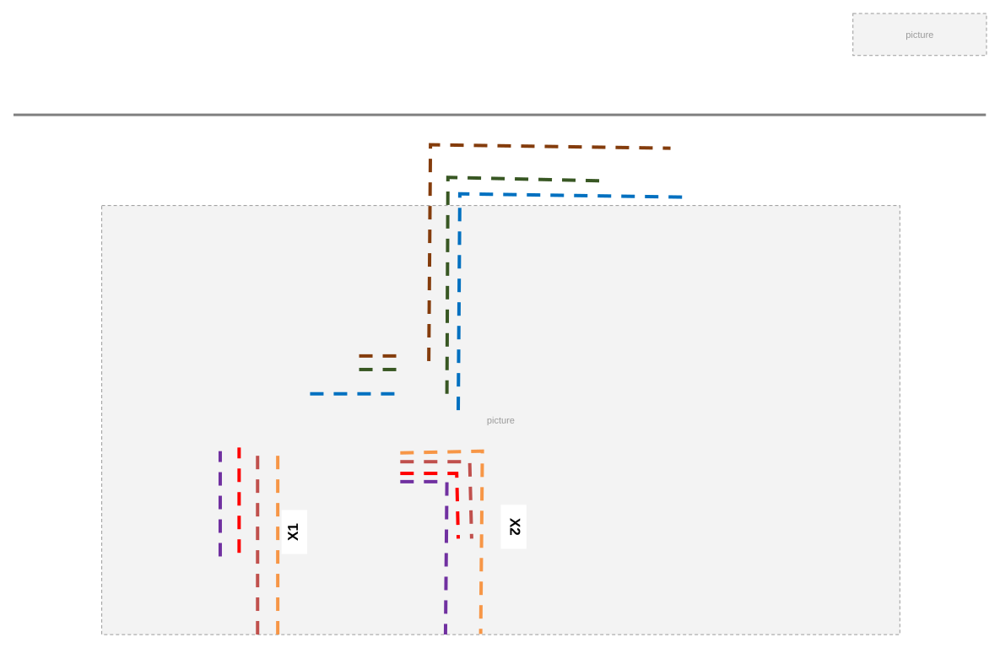

### Slide 22 <!-- slide 22 -->

| Recalibrate Source | Yes |
| --- | --- |
| Recalibrate Target | Yes |
| Date | 12/31/2010 |
|  |  |

| Test ID | 11 | Network Type | Engineering (Spanning Line Events) |
| --- | --- | --- | --- |
| Test | Reassign last route to adjacent line |  |  |

| EventID | From Date | To Date | From RouteID | To RouteID | From Measure | To Measure | Loc Error |
| --- | --- | --- | --- | --- | --- | --- | --- |
| 001 | 1/1/2000 | Null | 1A | 2A | 2 | 1 | No Error |
| 002 | 1/1/2000 | Null | 1A | 3A | 2 | 4 | No Error |
| 003 | 1/1/2000 | Null | 1A | 2A | 3 | 1 | No Error |
| 004 | 1/1/2000 | Null | 2A | 3A | 1 | 2 | No Error |
| 005 | 1/1/2000 | Null | 1A | 3A | 3 | 2 | No Error |
| 006 | 1/1/2000 | Null | 2A | 3A | 1 | 4 | No Error |
| 007 | 1/1/2000 | Null | 1A | 2A | 2 | 2 | No Error |
| 008 | 1/1/2000 | Null | 2A | 3A | 0 | 4 | No Error |
| 009 | 1/1/2000 | Null | 2A | 3A | 0 | 2 | No Error |
| 010 | 1/1/2000 | Null | 1A | 2A | 3 | 2 | No Error |
| 011 | 1/1/2000 | Null | 3A | 3A | 0 | 4 | No Error |
| 012 | 1/1/2000 | Null | 3A | 3A | 0 | 2 | No Error |
| 013 | 1/1/2000 | Null | 3A | 3A | 2 | 4 | No Error |
| 014 | 1/1/2000 | Null | 3A | 3A | 1 | 3 | No Error |

| R Name | L NAME | From Date | To Date | Line Order | From Measure | To Measure |
| --- | --- | --- | --- | --- | --- | --- |
| 1A | L0 | 1/1/2000 | Null | 100 | 2 | 4 |
| 2A | L0 | 1/1/2000 | Null | 200 | 0 | 2 |
| 3A | L0 | 1/1/2000 | Null | 300 | 0 | 4 |
| 1B | L1 | 1/1/2000 | Null | 100 | 3 | 5 |
| 2B | L1 | 1/1/2000 | Null | 200 | 4 | 8 |
| 3B | L1 | 1/1/2000 | Null | 300 | 0 | 2 |
| 1C | L2 | 1/1/2000 | Null | 100 | 4 | 6 |
| 2C | L2 | 1/1/2000 | Null | 200 | 2 | 6 |
| 3C | L2 | 1/1/2000 | Null | 300 | 4 | 8 |

[figure: 1A, 100 · 2A, 200 · 3A, 300 · 1B, 100 · 2B, 200 · 3B, 300 · 2C, 200 · 1C, 100 · 3C, 300 · 4 · 2 · 0 · 3 · 1 · 5 · 8 · 6]

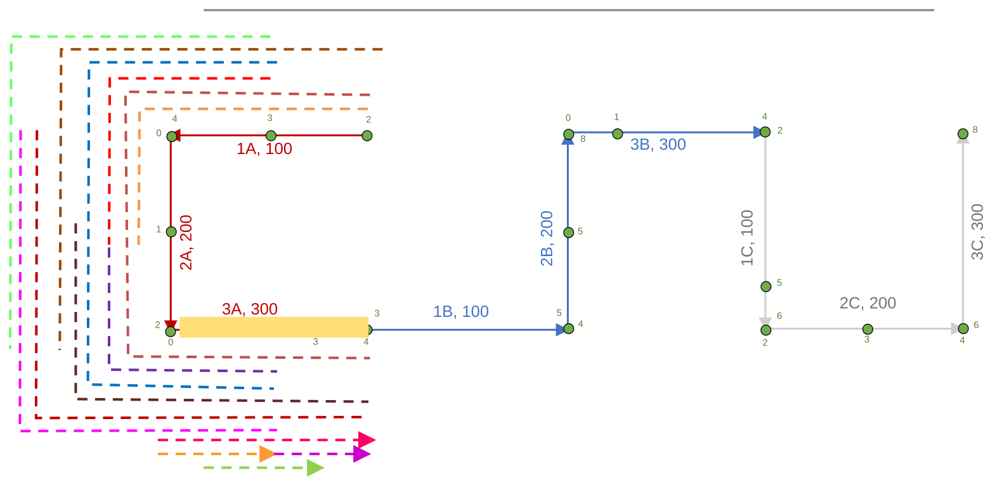

### Slide 23 <!-- slide 23 -->

| R Name | L NAME | From Date | To Date | Line Order | F0rom Measure | To Measure |
| --- | --- | --- | --- | --- | --- | --- |
| 1A | L0 | 1/1/2000 | Null | 100 | 2 | 4 |
| 2A | L0 | 1/1/2000 | Null | 200 | 0 | 2 |
| 3A | L0 | 1/1/2000 | 12/31/2010 | 300 | 0 | 4 |
| 3A | L1 | 12/31/2010 | Null | 100 | 0 | 4 |
| 1B | L1 | 1/1/2000 | 12/31/2010 | 100 | 3 | 5 |
| 1B | L1 | 12/31/2010 | Null | 200 | 3 | 5 |
| 2B | L1 | 1/1/2000 | 12/31/2010 | 200 | 4 | 8 |
| 2B | L1 | 12/31/2010 | Null | 300 | 4 | 8 |
| 3B | L1 | 1/1/2000 | 12/31/2010 | 300 | 0 | 2 |
| 3B | L1 | 12/31/2010 | Null | 400 | 0 | 2 |
| 1C | L2 | 1/1/2000 | Null | 100 | 4 | 6 |
| 2C | L2 | 1/1/2000 | Null | 200 | 2 | 6 |
| 3C | L2 | 1/1/2000 | Null | 300 | 4 | 8 |

| EventID | From Date | To Date | From RouteID | To RouteID | From Measure | To Measure | Loc Error |
| --- | --- | --- | --- | --- | --- | --- | --- |
| 001 | 1/1/2000 | 12/31/2010 | 1A | 2A | 2 | 1 | No Error |
| 002 | 1/1/2000 | 12/31/2010 | 1A | 3A | 2 | 4 | No Error |
| 003 | 1/1/2000 | 12/31/2010 | 1A | 2A | 3 | 1 | No Error |
| 004 | 1/1/2000 | 12/31/2010 | 2A | 3A | 1 | 2 | No Error |
| 005 | 1/1/2000 | 12/31/2010 | 1A | 3A | 3 | 2 | No Error |
| 006 | 1/1/2000 | 12/31/2010 | 2A | 3A | 1 | 4 | No Error |
| 007 | 1/1/2000 | 12/31/2010 | 1A | 2A | 2 | 2 | No Error |
| 008 | 1/1/2000 | 12/31/2010 | 2A | 3A | 0 | 4 | No Error |
| 009 | 1/1/2000 | 12/31/2010 | 2A | 3A | 0 | 2 | No Error |
| 010 | 1/1/2000 | 12/31/2010 | 1A | 2A | 3 | 2 | No Error |
| 011 | 1/1/2000 | 12/31/2010 | 3A | 3A | 0 | 4 | No Error |
| 012 | 1/1/2000 | 12/31/2010 | 3A | 3A | 0 | 2 | No Error |
| 013 | 1/1/2000 | 12/31/2010 | 3A | 3A | 2 | 4 | No Error |
| 014 | 1/1/2000 | 12/31/2010 | 3A | 3A | 1 | 3 | No Error |
| 001 | 12/31/2010 | Null | 1A | 2A | 2 | 1 | No Error |
| 002 | 12/31/2010 | Null | 1A | 3A | 2 | 4 | Different From and To Route Line IDs |
| 003 | 12/31/2010 | Null | 1A | 2A | 3 | 1 | No Error |
| 004 | 12/31/2010 | Null | 2A | 3A | 1 | 2 | Different From and To Route Line IDs |
| 005 | 12/31/2010 | Null | 1A | 3A | 3 | 2 | Different From and To Route Line IDs |
| 006 | 12/31/2010 | Null | 2A | 3A | 1 | 4 | Different From and To Route Line IDs |
| 007 | 12/31/2010 | Null | 1A | 2A | 2 | 2 | No Error |
| 008 | 12/31/2010 | Null | 2A | 3A | 0 | 4 | Different From and To Route Line IDs |
| 009 | 12/31/2010 | Null | 2A | 3A | 0 | 2 | Different From and To Route Line IDs |
| 010 | 12/31/2010 | Null | 1A | 2A | 3 | 2 | No Error |
| 011 | 12/31/2010 | Null | 3A | 3A | 0 | 4 | No Error |
| 012 | 12/31/2010 | Null | 3A | 3A | 0 | 2 | No Error |
| 013 | 12/31/2010 | Null | 3A | 3A | 2 | 4 | No Error |
| 014 | 12/31/2010 | Null | 3A | 3A | 1 | 3 | No Error |

| Test ID | 11 | Network Type | Engineering (Spanning Line Events) |
| --- | --- | --- | --- |
| Test | Reassign last route to adjacent line |  |  |

[figure: 1A, 100 · 2A, 200 · 3A, 100 · 1B, 200 · 2B, 300 · 3B, 400 · 2C, 200 · 1C, 100 · 3C, 300 · 4 · 2 · 0 · 3 · 5 · 8 · 1 · 6]

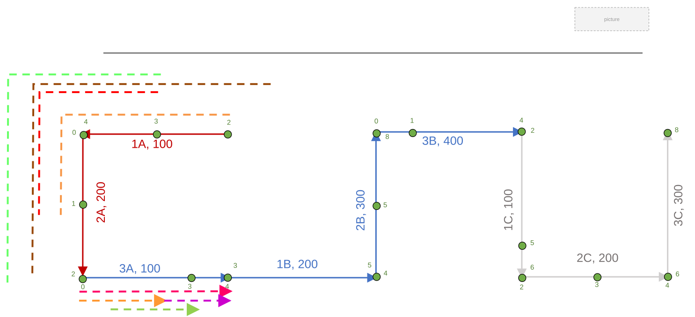

### Slide 24 <!-- slide 24 -->

| Recalibrate Source | Yes |
| --- | --- |
| Recalibrate Target | Yes |
| Date | 12/31/2010 |
|  |  |

| Test ID | 12 | Network Type | Engineering (Spanning Line Events) |
| --- | --- | --- | --- |
| Test | Reassign last route to adjacent line. Change measures |  |  |

| EventID | From Date | To Date | From RouteID | To RouteID | From Measure | To Measure | Loc Error |
| --- | --- | --- | --- | --- | --- | --- | --- |
| 001 | 1/1/2000 | Null | 1A | 2A | 2 | 1 | No Error |
| 002 | 1/1/2000 | Null | 1A | 3A | 2 | 4 | No Error |
| 003 | 1/1/2000 | Null | 1A | 2A | 3 | 1 | No Error |
| 004 | 1/1/2000 | Null | 2A | 3A | 1 | 2 | No Error |
| 005 | 1/1/2000 | Null | 1A | 3A | 3 | 2 | No Error |
| 006 | 1/1/2000 | Null | 2A | 3A | 1 | 4 | No Error |
| 007 | 1/1/2000 | Null | 1A | 2A | 2 | 2 | No Error |
| 008 | 1/1/2000 | Null | 2A | 3A | 0 | 4 | No Error |
| 009 | 1/1/2000 | Null | 2A | 3A | 0 | 2 | No Error |
| 010 | 1/1/2000 | Null | 1A | 2A | 3 | 2 | No Error |
| 011 | 1/1/2000 | Null | 3A | 3A | 0 | 4 | No Error |
| 012 | 1/1/2000 | Null | 3A | 3A | 0 | 2 | No Error |
| 013 | 1/1/2000 | Null | 3A | 3A | 2 | 4 | No Error |
| 014 | 1/1/2000 | Null | 3A | 3A | 1 | 3 | No Error |

| R Name | L NAME | From Date | To Date | Line Order | From Measure | To Measure |
| --- | --- | --- | --- | --- | --- | --- |
| 1A | L0 | 1/1/2000 | Null | 100 | 2 | 4 |
| 2A | L0 | 1/1/2000 | Null | 200 | 0 | 2 |
| 3A | L0 | 1/1/2000 | Null | 300 | 0 | 4 |
| 1B | L1 | 1/1/2000 | Null | 100 | 3 | 5 |
| 2B | L1 | 1/1/2000 | Null | 200 | 4 | 8 |
| 3B | L1 | 1/1/2000 | Null | 300 | 0 | 2 |
| 1C | L2 | 1/1/2000 | Null | 100 | 4 | 6 |
| 2C | L2 | 1/1/2000 | Null | 200 | 2 | 6 |
| 3C | L2 | 1/1/2000 | Null | 300 | 4 | 8 |

[figure: 1A, 100 · 2A, 200 · 3A, 300 · 1B, 100 · 2B, 200 · 3B, 300 · 2C, 200 · 1C, 100 · 3C, 300 · 4 · 2 · 0 · 3 · 1 · 5 · 8 · 6]

### Slide 25 <!-- slide 25 -->

| R Name | L NAME | From Date | To Date | Line Order | From Measure | To Measure |
| --- | --- | --- | --- | --- | --- | --- |
| 1A | L0 | 1/1/2000 | 12/31/2010 | 100 | 2 | 4 |
| 2A | L0 | 1/1/2000 | 12/31/2010 | 200 | 0 | 2 |
| 1A | L0 | 12/31/2010 | Null | 100 | 2 | 3 |
| 2A | L0 | 12/31/2010 | Null | 200 | 10 | 20 |
| 3A | L0 | 1/1/2000 | 12/31/2010 | 300 | 0 | 4 |
| 3A | L1 | 12/31/2010 | Null | 100 | 1 | 4 |
| 1B | L1 | 1/1/2000 | 12/31/2010 | 100 | 3 | 5 |
| 1B | L1 | 12/31/2010 | Null | 200 | 3 | 5 |
| 2B | L1 | 1/1/2000 | 12/31/2010 | 200 | 4 | 8 |
| 2B | L1 | 12/31/2010 | Null | 300 | 4 | 8 |
| 3B | L1 | 1/1/2000 | 12/31/2010 | 300 | 0 | 2 |
| 3B | L1 | 12/31/2010 | Null | 400 | 0 | 2 |
| 1C | L2 | 1/1/2000 | Null | 100 | 4 | 6 |
| 2C | L2 | 1/1/2000 | Null | 200 | 2 | 6 |
| 3C | L2 | 1/1/2000 | Null | 300 | 4 | 8 |

| EventID | From Date | To Date | From RouteID | To RouteID | From Measure | To Measure | Loc Error |
| --- | --- | --- | --- | --- | --- | --- | --- |
| 001 | 1/1/2000 | 12/31/2010 | 1A | 2A | 2 | 1 | No Error |
| 002 | 1/1/2000 | 12/31/2010 | 1A | 3A | 2 | 4 | No Error |
| 003 | 1/1/2000 | 12/31/2010 | 1A | 2A | 3 | 1 | No Error |
| 004 | 1/1/2000 | 12/31/2010 | 2A | 3A | 1 | 2 | No Error |
| 005 | 1/1/2000 | 12/31/2010 | 1A | 3A | 3 | 2 | No Error |
| 006 | 1/1/2000 | 12/31/2010 | 2A | 3A | 1 | 4 | No Error |
| 007 | 1/1/2000 | 12/31/2010 | 1A | 2A | 2 | 2 | No Error |
| 008 | 1/1/2000 | 12/31/2010 | 2A | 3A | 0 | 4 | No Error |
| 009 | 1/1/2000 | 12/31/2010 | 2A | 3A | 0 | 2 | No Error |
| 010 | 1/1/2000 | 12/31/2010 | 1A | 2A | 3 | 2 | No Error |
| 011 | 1/1/2000 | 12/31/2010 | 3A | 3A | 0 | 4 | No Error |
| 012 | 1/1/2000 | 12/31/2010 | 3A | 3A | 0 | 2 | No Error |
| 013 | 1/1/2000 | 12/31/2010 | 3A | 3A | 2 | 4 | No Error |
| 014 | 1/1/2000 | 12/31/2010 | 3A | 3A | 1 | 3 | No Error |
| 001 | 12/31/2010 | Null | 1A | 2A | 2 | 1 | Partial Match for the To Measure |
| 002 | 12/31/2010 | Null | 1A | 3A | 2 | 4 | Different From and To Route Line IDs |
| 003 | 12/31/2010 | Null | 1A | 2A | 3 | 1 | Partial Match for the To Measure |
| 004 | 12/31/2010 | Null | 2A | 3A | 1 | 2 | Different From and To Route Line IDs |
| 005 | 12/31/2010 | Null | 1A | 3A | 3 | 2 | Different From and To Route Line IDs |
| 006 | 12/31/2010 | Null | 2A | 3A | 1 | 4 | Different From and To Route Line IDs |
| 007 | 12/31/2010 | Null | 1A | 2A | 2 | 2 | Partial Match for the To Measure |
| 008 | 12/31/2010 | Null | 2A | 3A | 0 | 4 | Different From and To Route Line IDs |
| 009 | 12/31/2010 | Null | 2A | 3A | 0 | 2 | Different From and To Route Line IDs |
| 010 | 12/31/2010 | Null | 1A | 2A | 3 | 2 | Partial Match for the To Measure |
| 011 | 12/31/2010 | Null | 3A | 3A | 0 | 4 | Partial Match for the From Measure |
| 012 | 12/31/2010 | Null | 3A | 3A | 0 | 2 | Partial Match for the From Measure |
| 013 | 12/31/2010 | Null | 3A | 3A | 2 | 4 | No Error |
| 014 | 12/31/2010 | Null | 3A | 3A | 1 | 3 | No Error |

| Test ID | 12 | Network Type | Engineering (Spanning Line Events) |
| --- | --- | --- | --- |
| Test | Reassign last route to adjacent line. Change measures |  |  |

[figure: 1A, 100 · 2A, 200 · 3A, 100 · 1B, 200 · 2B, 300 · 3B, 400 · 2C, 200 · 1C, 100 · 3C, 300 · 3 · 2 · 20 · 10 · 1 · 4 · 5 · 8 · 0 · 6]

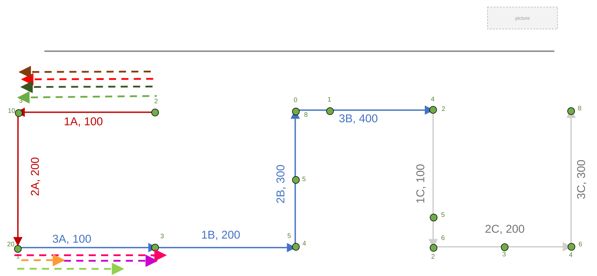

### Slide 26 <!-- slide 26 -->

| Recalibrate Source | Yes |
| --- | --- |
| Recalibrate Target | Yes |
| Date | 12/31/2023 |
|  |  |

| Test ID | 13 | Network Type | Engineering (Spanning Line Events) |
| --- | --- | --- | --- |
| Test | Reassign all routes to adjacent line with complex time slices |  |  |

| EventID | From Date | To Date | From RouteID | To RouteID | From Measure | To Measure | Loc Error |
| --- | --- | --- | --- | --- | --- | --- | --- |
| 001 | 1/1/2010 | Null | 1A | 2A | 2 | 1 | No Error |
| 002 | 1/1/2020 | Null | 1A | 3A | 2 | 4 | No Error |
| 003 | 1/1/2010 | Null | 1A | 2A | 3 | 1 | No Error |
| 004 | 1/1/2020 | Null | 2A | 3A | 1 | 2 | No Error |
| 005 | 1/1/2020 | Null | 1A | 3A | 3 | 2 | No Error |
| 006 | 1/1/2020 | Null | 2A | 3A | 1 | 4 | No Error |
| 007 | 1/1/2010 | Null | 1A | 2A | 2 | 2 | No Error |
| 008 | 1/1/2020 | Null | 2A | 3A | 0 | 4 | No Error |
| 009 | 1/1/2020 | Null | 2A | 3A | 0 | 2 | No Error |
| 010 | 1/1/2010 | Null | 1A | 2A | 3 | 2 | No Error |
| 011 | 1/1/2000 | Null | 1A | 1A | 2 | 4 | No Error |
| 012 | 1/1/2000 | Null | 1A | 1A | 2 | 3 | No Error |
| 013 | 1/1/2000 | Null | 1A | 1A | 3 | 4 | No Error |
| 014 | 1/1/2000 | Null | 1A | 1A | 2.5 | 3.5 | No Error |
| 015 | 1/1/2010 | Null | 2A | 2A | 0 | 2 | No Error |
| 016 | 1/1/2010 | Null | 2A | 2A | 0 | 1 | No Error |
| 017 | 1/1/2010 | Null | 2A | 2A | 1 | 2 | No Error |
| 018 | 1/1/2010 | Null | 2A | 2A | 0.5 | 1.5 | No Error |
| 019 | 1/1/2020 | Null | 3A | 3A | 0 | 4 | No Error |
| 020 | 1/1/2020 | Null | 3A | 3A | 0 | 2 | No Error |
| 021 | 1/1/2020 | Null | 3A | 3A | 2 | 4 | No Error |
| 022 | 1/1/2020 | Null | 3A | 3A | 1 | 3 | No Error |

| R Name | L NAME | From Date | To Date | Line Order | From Measure | To Measure |
| --- | --- | --- | --- | --- | --- | --- |
| 1A | L0 | 1/1/2000 | Null | 100 | 2 | 4 |
| 2A | L0 | 1/1/2010 | Null | 200 | 0 | 2 |
| 3A | L0 | 1/1/2020 | Null | 300 | 0 | 4 |
| 1B | L1 | 1/1/2000 | Null | 100 | 3 | 5 |
| 2B | L1 | 1/1/2000 | Null | 200 | 4 | 8 |
| 3B | L1 | 1/1/2000 | Null | 300 | 0 | 2 |
| 1C | L2 | 1/1/2000 | Null | 100 | 4 | 6 |
| 2C | L2 | 1/1/2000 | Null | 200 | 2 | 6 |
| 3C | L2 | 1/1/2000 | Null | 300 | 4 | 8 |

[figure: 1A, 100 · 2A, 200 · 3A, 300 · 1B, 100 · 2B, 200 · 3B, 300 · 2C, 200 · 1C, 100 · 3C, 300 · 4 · 2 · 0 · 3 · 1 · 5 · 8 · 6]

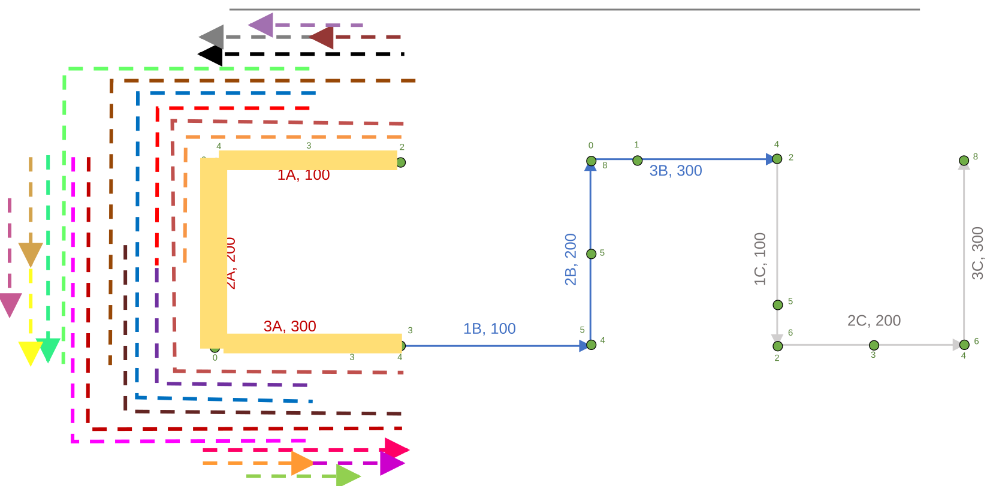

### Slide 27 <!-- slide 27 -->

| Recalibrate Source | Yes |
| --- | --- |
| Recalibrate Target | Yes |
| Date | 12/31/2023 |
|  |  |

| Test ID | 13 | Network Type | Engineering (Spanning Line Events) |
| --- | --- | --- | --- |
| Test | Reassign all routes to adjacent line with complex time slices |  |  |

| R Name | L NAME | From Date | To Date | Line Order | From Measure | To Measure |
| --- | --- | --- | --- | --- | --- | --- |
| 1A | L0 | 1/1/2000 | 12/31/2023 | 100 | 2 | 4 |
| 2A | L0 | 1/1/2010 | 12/31/2023 | 200 | 0 | 2 |
| 3A | L0 | 1/1/2020 | 12/31/2023 | 300 | 0 | 4 |
| 1B | L1 | 1/1/2000 | 12/31/2023 | 100 | 3 | 5 |
| 2B | L1 | 1/1/2000 | 12/31/2023 | 200 | 4 | 8 |
| 3B | L1 | 1/1/2000 | 12/31/2023 | 300 | 0 | 2 |
| 1A | L1 | 12/31/2023 | Null | 100 | 2 | 4 |
| 2A | L1 | 12/31/2023 | Null | 200 | 0 | 2 |
| 3A | L1 | 12/31/2023 | Null | 300 | 0 | 4 |
| 1B | L1 | 12/31/2023 | Null | 400 | 3 | 5 |
| 2B | L1 | 12/31/2023 | Null | 500 | 4 | 8 |
| 3B | L1 | 12/31/2023 | Null | 600 | 0 | 2 |
| 1C | L2 | 1/1/2000 | Null | 100 | 4 | 6 |
| 2C | L2 | 1/1/2000 | Null | 200 | 2 | 6 |
| 3C | L2 | 1/1/2000 | Null | 300 | 4 | 8 |

| EventID | From Date | To Date | From RouteID | To RouteID | From Measure | To Measure | Loc Error |
| --- | --- | --- | --- | --- | --- | --- | --- |
| 001 | 12/31/2023 | Null | 1A | 2A | 2 | 1 | No Error |
| 002 | 12/31/2023 | Null | 1A | 3A | 2 | 4 | No Error |
| 003 | 12/31/2023 | Null | 1A | 2A | 3 | 1 | No Error |
| 004 | 12/31/2023 | Null | 2A | 3A | 1 | 2 | No Error |
| 005 | 12/31/2023 | Null | 1A | 3A | 3 | 2 | No Error |
| 006 | 12/31/2023 | Null | 2A | 3A | 1 | 4 | No Error |
| 007 | 12/31/2023 | Null | 1A | 2A | 2 | 2 | No Error |
| 008 | 12/31/2023 | Null | 2A | 3A | 0 | 4 | No Error |
| 009 | 12/31/2023 | Null | 2A | 3A | 0 | 2 | No Error |
| 010 | 12/31/2023 | Null | 1A | 2A | 3 | 2 | No Error |
| 011 | 12/31/2023 | Null | 1A | 1A | 2 | 4 | No Error |
| 012 | 12/31/2023 | Null | 1A | 1A | 2 | 3 | No Error |
| 013 | 12/31/2023 | Null | 1A | 1A | 3 | 4 | No Error |
| 014 | 12/31/2023 | Null | 1A | 1A | 2.5 | 3.5 | No Error |
| 015 | 12/31/2023 | Null | 2A | 2A | 0 | 2 | No Error |
| 016 | 12/31/2023 | Null | 2A | 2A | 0 | 1 | No Error |
| 017 | 12/31/2023 | Null | 2A | 2A | 1 | 2 | No Error |
| 018 | 12/31/2023 | Null | 2A | 2A | 0.5 | 1.5 | No Error |
| 019 | 12/31/2023 | Null | 3A | 3A | 0 | 4 | No Error |
| 020 | 12/31/2023 | Null | 3A | 3A | 0 | 2 | No Error |
| 021 | 12/31/2023 | Null | 3A | 3A | 2 | 4 | No Error |
| 022 | 12/31/2023 | Null | 3A | 3A | 1 | 3 | No Error |

| EventID | From Date | To Date | From RouteID | To RouteID | From Measure | To Measure | Loc Error |
| --- | --- | --- | --- | --- | --- | --- | --- |
| 001 | 1/1/2010 | 12/31/2023 | 1A | 2A | 2 | 1 | No Error |
| 002 | 1/1/2020 | 12/31/2023 | 1A | 3A | 2 | 4 | No Error |
| 003 | 1/1/2010 | 12/31/2023 | 1A | 2A | 3 | 1 | No Error |
| 004 | 1/1/2020 | 12/31/2023 | 2A | 3A | 1 | 2 | No Error |
| 005 | 1/1/2020 | 12/31/2023 | 1A | 3A | 3 | 2 | No Error |
| 006 | 1/1/2020 | 12/31/2023 | 2A | 3A | 1 | 4 | No Error |
| 007 | 1/1/2010 | 12/31/2023 | 1A | 2A | 2 | 2 | No Error |
| 008 | 1/1/2020 | 12/31/2023 | 2A | 3A | 0 | 4 | No Error |
| 009 | 1/1/2020 | 12/31/2023 | 2A | 3A | 0 | 2 | No Error |
| 010 | 1/1/2010 | 12/31/2023 | 1A | 2A | 3 | 2 | No Error |
| 011 | 1/1/2000 | 12/31/2023 | 1A | 1A | 2 | 4 | No Error |
| 012 | 1/1/2000 | 12/31/2023 | 1A | 1A | 2 | 3 | No Error |
| 013 | 1/1/2000 | 12/31/2023 | 1A | 1A | 3 | 4 | No Error |
| 014 | 1/1/2000 | 12/31/2023 | 1A | 1A | 2.5 | 3.5 | No Error |
| 015 | 1/1/2010 | 12/31/2023 | 2A | 2A | 0 | 2 | No Error |
| 016 | 1/1/2010 | 12/31/2023 | 2A | 2A | 0 | 1 | No Error |
| 017 | 1/1/2010 | 12/31/2023 | 2A | 2A | 1 | 2 | No Error |
| 018 | 1/1/2010 | 12/31/2023 | 2A | 2A | 0.5 | 1.5 | No Error |
| 019 | 1/1/2020 | 12/31/2023 | 3A | 3A | 0 | 4 | No Error |
| 020 | 1/1/2020 | 12/31/2023 | 3A | 3A | 0 | 2 | No Error |
| 021 | 1/1/2020 | 12/31/2023 | 3A | 3A | 2 | 4 | No Error |
| 022 | 1/1/2020 | 12/31/2023 | 3A | 3A | 1 | 3 | No Error |

[figure: 1A, 100 · 2A, 200 · 3A, 300 · 1B, 400 · 2B, 500 · 3B, 600 · 2C, 200 · 1C, 100 · 3C, 300 · 4 · 2 · 0 · 3 · 1 · 5 · 8 · 6]

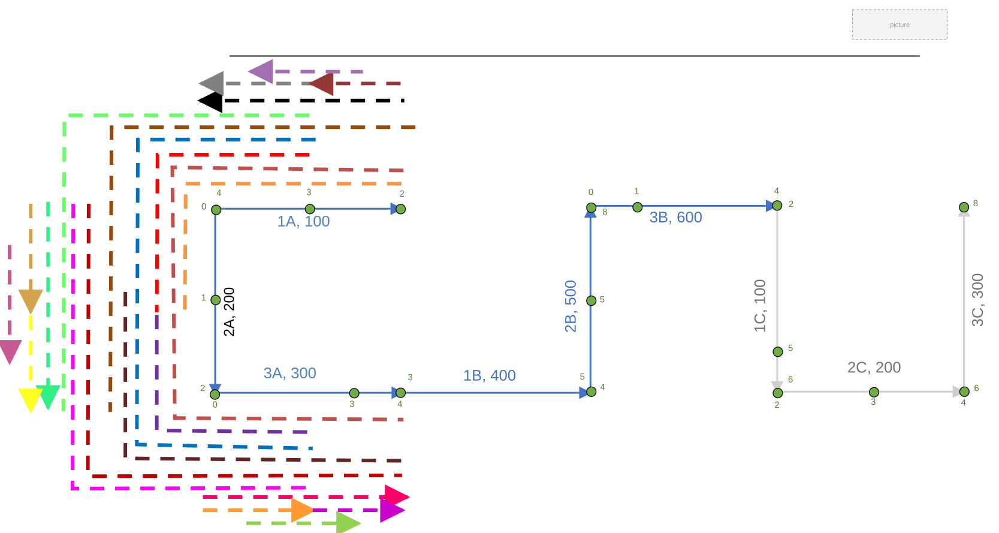

### Slide 28 <!-- slide 28 -->

| Recalibrate Source | Yes |
| --- | --- |
| Recalibrate Target | Yes |
| Date | 12/31/2030 |
|  |  |

| Test ID | 14 | Network Type | Engineering (Spanning Line Events) |
| --- | --- | --- | --- |
| Test | Reassign partial routes in a line to a new line. Change names of partial routes. Recalibrate source route downstream. |  |  |

| EventID | From Date | To Date | From RouteID | To RouteID | From Measure | To Measure | Loc Error |
| --- | --- | --- | --- | --- | --- | --- | --- |
| 001 | 1/1/2000 | Null | 1A | 2A | 2 | 1 | No Error |
| 002 | 1/1/2000 | Null | 1A | 3A | 2 | 4 | No Error |
| 003 | 1/1/2000 | Null | 1A | 2A | 3 | 1 | No Error |
| 004 | 1/1/2000 | Null | 2A | 3A | 1 | 2 | No Error |
| 005 | 1/1/2000 | Null | 1A | 3A | 3 | 2 | No Error |
| 006 | 1/1/2000 | Null | 2A | 3A | 1 | 4 | No Error |
| 007 | 1/1/2000 | Null | 1A | 2A | 2 | 2 | No Error |
| 008 | 1/1/2000 | Null | 2A | 3A | 0 | 4 | No Error |
| 009 | 1/1/2000 | Null | 2A | 3A | 0 | 2 | No Error |
| 010 | 1/1/2000 | Null | 1A | 2A | 3 | 2 | No Error |
| 011 | 1/1/2000 | Null | 3A | 3A | 0 | 4 | No Error |

| R Name | L NAME | From Date | To Date | Line Order | From Measure | To Measure |
| --- | --- | --- | --- | --- | --- | --- |
| 1A | L0 | 1/1/2000 | Null | 100 | 2 | 4 |
| 2A | L0 | 1/1/2000 | Null | 200 | 0 | 2 |
| 3A | L0 | 1/1/2000 | Null | 300 | 0 | 4 |
| 1B | L1 | 1/1/2000 | Null | 100 | 3 | 5 |
| 2B | L1 | 1/1/2000 | Null | 200 | 4 | 8 |
| 3B | L1 | 1/1/2000 | Null | 300 | 0 | 2 |
| 1C | L2 | 1/1/2000 | Null | 100 | 4 | 6 |
| 2C | L2 | 1/1/2000 | Null | 200 | 2 | 6 |
| 3C | L2 | 1/1/2000 | Null | 300 | 4 | 8 |

[figure: New Line · 1A, 100 · 2A, 200 · 3A, 300 · 1B, 100 · 2B, 200 · 3B, 300 · 2C, 200 · 1C, 100 · 3C, 300 · 4 · 2 · 0 · 3 · 1 · 5 · 8 · 6]

### Slide 29 <!-- slide 29 -->

| R Name | L NAME | From Date | To Date | Line Order | From Measure | To Measure |
| --- | --- | --- | --- | --- | --- | --- |
| 1A | L0 | 1/1/2000 | 12/31/2030 | 100 | 2 | 4 |
| 2A | L0 | 1/1/2010 | 12/31/2030 | 200 | 0 | 2 |
| 3A | L0 | 1/1/2020 | 12/31/2030 | 300 | 0 | 4 |
| 1A | LX | 12/31/2030 | Null | 100 | 2 | 4 |
| 2A | LX | 12/31/2030 | Null | 200 | 0 | 2 |
| 3A LineX | LX | 12/31/2030 | Null | 300 | 0 | 2 |
| 3A | L0 | 12/31/2030 | Null | 100 | 0 | 2 |
| 1B | L1 | 1/1/2002 | Null | 100 | 3 | 5 |
| 2B | L1 | 1/1/2005 | Null | 200 | 4 | 8 |
| 3B | L1 | 1/1/2010 | Null | 300 | 0 | 2 |
| 1C | L2 | 1/1/2020 | 12/31/2030 | 100 | 4 | 6 |
| 2C | L2 | 1/1/2020 | 12/31/2030 | 200 | 2 | 6 |
| 3C | L2 | 1/1/2020 | 12/31/2030 | 300 | 4 | 8 |

3A LineX, 300

| EventID | From Date | To Date | From RouteID | To RouteID | From Measure | To Measure | Loc Error |
| --- | --- | --- | --- | --- | --- | --- | --- |
| 001 | 1/1/2000 | 12/31/2010 | 1A | 2A | 2 | 1 | No Error |
| 002 | 1/1/2000 | 12/31/2010 | 1A | 3A | 2 | 4 | No Error |
| 003 | 1/1/2000 | 12/31/2010 | 1A | 2A | 3 | 1 | No Error |
| 004 | 1/1/2000 | 12/31/2010 | 2A | 3A | 1 | 2 | No Error |
| 005 | 1/1/2000 | 12/31/2010 | 1A | 3A | 3 | 2 | No Error |
| 006 | 1/1/2000 | 12/31/2010 | 2A | 3A | 1 | 4 | No Error |
| 007 | 1/1/2000 | 12/31/2010 | 1A | 2A | 2 | 2 | No Error |
| 008 | 1/1/2000 | 12/31/2010 | 2A | 3A | 0 | 4 | No Error |
| 009 | 1/1/2000 | 12/31/2010 | 2A | 3A | 0 | 2 | No Error |
| 010 | 1/1/2000 | 12/31/2010 | 1A | 2A | 3 | 2 | No Error |
| 011 | 1/1/2000 | 12/31/2010 | 3A | 3A | 0 | 4 | No Error |
| 001 | 12/31/2030 | Null | 1A | 2A | 2 | 1 | No Error |
| 002 | 12/31/2030 | Null | 1A | 3A | 2 | 4 | Different From Route And To Route Line IDs |
| 003 | 12/31/2030 | Null | 1A | 2A | 3 | 1 | No Error |
| 004 | 12/31/2030 | Null | 2A | 3A | 1 | 2 | Different From Route And To Route Line IDs |
| 005 | 12/31/2030 | Null | 1A | 3A | 3 | 2 | Different From Route And To Route Line IDs |
| 006 | 12/31/2030 | Null | 2A | 3A | 1 | 4 | Different From Route And To Route Line IDs |
| 007 | 12/31/2030 | Null | 1A | 2A | 2 | 2 | No Error |
| 008 | 12/31/2030 | Null | 2A | 3A | 0 | 4 | Different From Route And To Route Line IDs |
| 009 | 12/31/2030 | Null | 2A | 3A | 0 | 2 | Different From Route And To Route Line IDs |
| 010 | 12/31/2030 | Null | 1A | 2A | 3 | 2 | No Error |
| 011 | 12/31/2030 | Null | 3A | 3A | 0 | 4 | Partial Match for the To Measure |

| Test ID | 14 | Network Type | Engineering (Spanning Line Events) |
| --- | --- | --- | --- |
| Test | Reassign partial routes in a line to a new line. Change names of partial routes. Recalibrate source route downstream. |  |  |

[figure: 1A, 100 · 2A, 200 · 1B, 100 · 2B, 200 · 3B, 300 · 2C, 200 · 1C, 100 · 3C, 300 · 4 · 2 · 0 · 1 · 3 · 5 · 8 · 6 · 3A, 100]

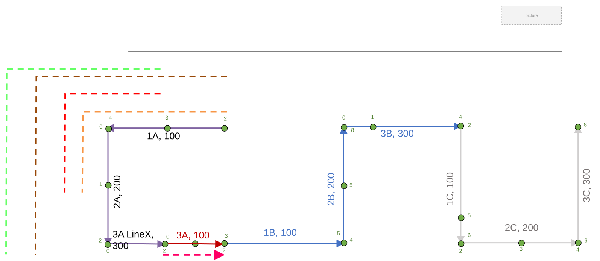

### Slide 30 <!-- slide 30 -->

| Test ID | 15 | Network Type | Engineering (Spanning Line Events) |
| --- | --- | --- | --- |
| Test | Reassign to fill the gap in a line by transferring route. Recalibrate source route downstream |  |  |

|  |  |

| EventID | From Date | To Date | From RouteID | To RouteID | From Measure | To Measure | Loc Error |
| --- | --- | --- | --- | --- | --- | --- | --- |
| 001 | 1/1/2000 | Null | X1 | X2 | 2 | 28 | No Error |
| 002 | 1/1/2000 | Null | X1 | X2 | 2 | 26 | No Error |
| 003 | 1/1/2000 | Null | X1 | X2 | 4 | 26 | No Error |
| 004 | 1/1/2000 | Null | X1 | X2 | 4 | 28 | No Error |
| 005 | 1/1/2000 | Null | 1B | 3B | 3 | 2 | No Error |
| 006 | 1/1/2000 | Null | 1B | 3B | 4 | 2 | No Error |
| 007 | 1/1/2000 | Null | 1B | 3B | 4 | 1 | No Error |

| R Name | L NAME | From Date | To Date | Line Order | From Measure | To Measure |
| --- | --- | --- | --- | --- | --- | --- |
| X1 | L3 | 1/1/2000 | Null | 100 | 2 | 6 |
| X2 | L3 | 1/1/2000 | Null | 200 | 24 | 28 |
| 1B | L1 | 1/1/2000 | Null | 100 | 4 | 5 |
| 2B | L1 | 1/1/2000 | Null | 200 | 4 | 8 |
| 3B | L1 | 1/1/2000 | Null | 300 | 0 | 2 |

[figure: 100 · 200 · X1 · X2]

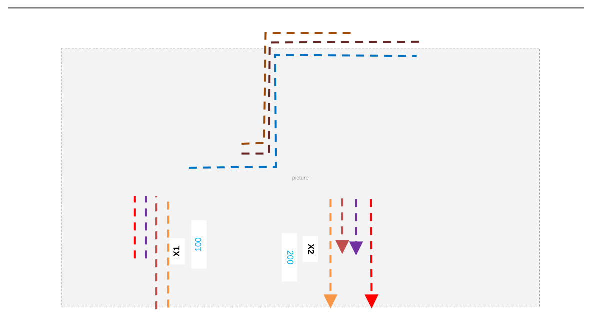

### Slide 31 <!-- slide 31 -->

| R Name | L NAME | From Date | To Date | Line Order |  |  |
| --- | --- | --- | --- | --- | --- | --- |
| X1 | L3 | 1/1/2000 | Null | 100 | 2 | 6 |
| X2 | L3 | 1/1/2000 | 12/31/2023 | 200 | 24 | 28 |
| 1B | L1 | 1/1/2000 | 12/31/2023 | 100 | 3 | 5 |
| 2B | L1 | 1/1/2000 | Null | 200 | 4 | 8 |
| 3B | L1 | 1/1/2000 | 12/31/2023 | 300 | 0 | 2 |
| X2 | L3 | 12/31/2023 | Null | 300 | 24 | 28 |
| 1B-New | L3 | 12/31/2023 | Null | 200 | 3 | 4 |
| 1B | L1 | 12/31/2023 | Null | 100 | 0 | 2 |

| EventID | From Date | To Date | From RouteID | To RouteID | From Measure | To Measure | Loc Error |
| --- | --- | --- | --- | --- | --- | --- | --- |
| 001 | 1/1/2000 | 12/31/2023 | X1 | X2 | 2 | 28 | No Error |
| 002 | 1/1/2000 | 12/31/2023 | X1 | X2 | 2 | 26 | No Error |
| 003 | 1/1/2000 | 12/31/2023 | X1 | X2 | 4 | 26 | No Error |
| 004 | 1/1/2000 | 12/31/2023 | X1 | X2 | 4 | 28 | No Error |
| 005 | 1/1/2000 | 12/31/2023 | 1B | 3B | 3 | 2 | No Error |
| 006 | 1/1/2000 | 12/31/2023 | 1B | 3B | 4 | 2 | No Error |
| 007 | 1/1/2000 | 12/31/2023 | 1B | 3B | 4 | 1 | No Error |
| 001 | 12/31/2023 | Null | X1 | X2 | 2 | 28 | No Error |
| 002 | 12/31/2023 | Null | X1 | X2 | 2 | 26 | No Error |
| 003 | 12/31/2023 | Null | X1 | X2 | 4 | 26 | No Error |
| 004 | 12/31/2023 | Null | X1 | X2 | 4 | 28 | No Error |
| 005 | 12/31/2023 | Null | 1B | 3B | 3 | 2 | Partial Match for the From Measure |
| 006 | 12/31/2023 | Null | 1B | 3B | 4 | 2 | Partial Match for the From measure |
| 007 | 12/31/2023 | Null | 1B | 3B | 4 | 1 | Partial Match for the From Measure |

| Test ID | 15 | Network Type | Engineering (Spanning Line Events) |
| --- | --- | --- | --- |
| Test | Reassign to fill the gap in a line by transferring route. Recalibrate source route downstream |  |  |

[figure: 100 · 200 · X1 · X2 · 0 · 2]

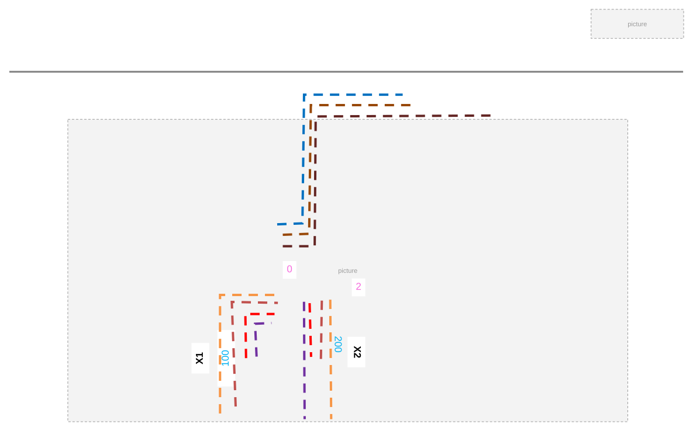

### Slide 32 <!-- slide 32 -->

| Recalibrate Source | Yes |
| --- | --- |
| Recalibrate Target | Yes |
| Date | 12/31/2030 |
|  |  |

| Test ID | 16 | Network Type | Engineering (Spanning Line Events) |
| --- | --- | --- | --- |
| Test | Reassign all routes to a new line. Adjust measures of each route to overlap with previous measures |  |  |

| EventID | From Date | To Date | From RouteID | To RouteID | From Measure | To Measure | Loc Error |
| --- | --- | --- | --- | --- | --- | --- | --- |
| 001 | 1/1/2000 | Null | 1A | 2A | 2 | 1 | No Error |
| 002 | 1/1/2000 | Null | 1A | 3A | 2 | 4 | No Error |
| 003 | 1/1/2000 | Null | 1A | 2A | 3 | 1 | No Error |
| 004 | 1/1/2000 | Null | 2A | 3A | 1 | 2 | No Error |
| 005 | 1/1/2000 | Null | 1A | 3A | 3 | 2 | No Error |
| 006 | 1/1/2000 | Null | 2A | 3A | 1 | 4 | No Error |
| 007 | 1/1/2000 | Null | 1A | 2A | 2 | 2 | No Error |
| 008 | 1/1/2000 | Null | 2A | 3A | 0 | 4 | No Error |
| 009 | 1/1/2000 | Null | 2A | 3A | 0 | 2 | No Error |
| 010 | 1/1/2000 | Null | 1A | 2A | 3 | 2 | No Error |
| 011 | 1/1/2000 | Null | 3A | 3A | 0 | 4 | No Error |

| R Name | L NAME | From Date | To Date | Line Order | From Measure | To Measure |
| --- | --- | --- | --- | --- | --- | --- |
| 1A | L0 | 1/1/2000 | Null | 100 | 2 | 4 |
| 2A | L0 | 1/1/2000 | Null | 200 | 0 | 2 |
| 3A | L0 | 1/1/2000 | Null | 300 | 0 | 4 |
| 1B | L1 | 1/1/2000 | Null | 100 | 3 | 5 |
| 2B | L1 | 1/1/2000 | Null | 200 | 4 | 8 |
| 3B | L1 | 1/1/2000 | Null | 300 | 0 | 2 |
| 1C | L2 | 1/1/2000 | Null | 100 | 4 | 6 |
| 2C | L2 | 1/1/2000 | Null | 200 | 2 | 6 |
| 3C | L2 | 1/1/2000 | Null | 300 | 4 | 8 |

[figure: New Line · 1A, 100 · 2A, 200 · 3A, 300 · 1B, 100 · 2B, 200 · 3B, 300 · 2C, 200 · 1C, 100 · 3C, 300 · 4 · 2 · 0 · 3 · 1 · 5 · 8 · 6]

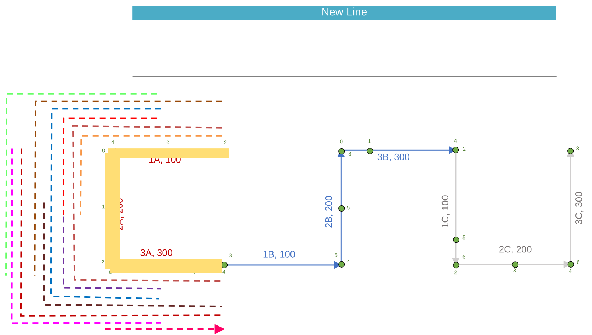

### Slide 33 <!-- slide 33 -->

| Test ID | 16 | Network Type | Engineering (Spanning Line Events) |
| --- | --- | --- | --- |
| Test | Reassign all routes to a new line. Adjust measures of each route to overlap with previous measures |  |  |

| EventID | From Date | To Date | From RouteID | To RouteID | From Measure | To Measure | Loc Error |
| --- | --- | --- | --- | --- | --- | --- | --- |
| 001 | 1/1/2000 | 12/31/2030 | 1A | 2A | 2 | 1 | No Error |
| 002 | 1/1/2000 | 12/31/2030 | 1A | 3A | 2 | 4 | No Error |
| 003 | 1/1/2000 | 12/31/2030 | 1A | 2A | 3 | 1 | No Error |
| 004 | 1/1/2000 | 12/31/2030 | 2A | 3A | 1 | 2 | No Error |
| 005 | 1/1/2000 | 12/31/2030 | 1A | 3A | 3 | 2 | No Error |
| 006 | 1/1/2000 | 12/31/2030 | 2A | 3A | 1 | 4 | No Error |
| 007 | 1/1/2000 | 12/31/2030 | 1A | 2A | 2 | 2 | No Error |
| 008 | 1/1/2000 | 12/31/2030 | 2A | 3A | 0 | 4 | No Error |
| 009 | 1/1/2000 | 12/31/2030 | 2A | 3A | 0 | 2 | No Error |
| 010 | 1/1/2000 | 12/31/2030 | 1A | 2A | 3 | 2 | No Error |
| 011 | 1/1/2000 | 12/31/2030 | 3A | 3A | 0 | 4 | No Error |
| 001 | 12/31/2030 | Null | 1A | 2A | 2 | 1 | No Error |
| 002 | 12/31/2030 | Null | 1A | 3A | 2 | 4 | No Error |
| 003 | 12/31/2030 | Null | 1A | 2A | 3 | 1 | No Error |
| 004 | 12/31/2030 | Null | 2A | 3A | 1 | 2 | No Error |
| 005 | 12/31/2030 | Null | 1A | 3A | 3 | 2 | No Error |
| 006 | 12/31/2030 | Null | 2A | 3A | 1 | 4 | No Error |
| 007 | 12/31/2030 | Null | 1A | 2A | 2 | 2 | No Error |
| 008 | 12/31/2030 | Null | 2A | 3A | 0 | 4 | No Error |
| 009 | 12/31/2030 | Null | 2A | 3A | 0 | 2 | No Error |
| 010 | 12/31/2030 | Null | 1A | 2A | 3 | 2 | No Error |
| 011 | 12/31/2030 | Null | 3A | 3A | 0 | 4 | No Error |

| R Name | L NAME | From Date | To Date | Line Order | From Measure | To Measure |
| --- | --- | --- | --- | --- | --- | --- |
| 1A | L0 | 1/1/2000 | 12/31/2030 | 100 | 2 | 4 |
| 2A | L0 | 1/1/2000 | 12/31/2030 | 200 | 0 | 2 |
| 3A | L0 | 1/1/2000 | 12/31/2030 | 300 | 0 | 4 |
| 1A | L_New | 12/31/2030 | Null | 100 | 1 | 5 |
| 2A | L_New | 12/31/2030 | Null | 200 | 0 | 3 |
| 3A | L_New | 12/31/2030 | Null | 300 | 0 | 5 |
| 1B | L1 | 1/1/2000 | Null | 100 | 3 | 5 |
| 2B | L1 | 1/1/2000 | Null | 200 | 4 | 8 |
| 3B | L1 | 1/1/2000 | Null | 300 | 0 | 2 |
| 1C | L2 | 1/1/2000 | Null | 100 | 4 | 6 |
| 2C | L2 | 1/1/2000 | Null | 200 | 2 | 6 |
| 3C | L2 | 1/1/2000 | Null | 300 | 4 | 8 |

[figure: New Line · 1A, 100 · 2A, 200 · 3A, 300 · 1B, 100 · 2B, 200 · 3B, 300 · 2C, 200 · 1C, 100 · 3C, 300 · 5 · 1 · 3 · 0 · 4 · 2 · 8 · 6]

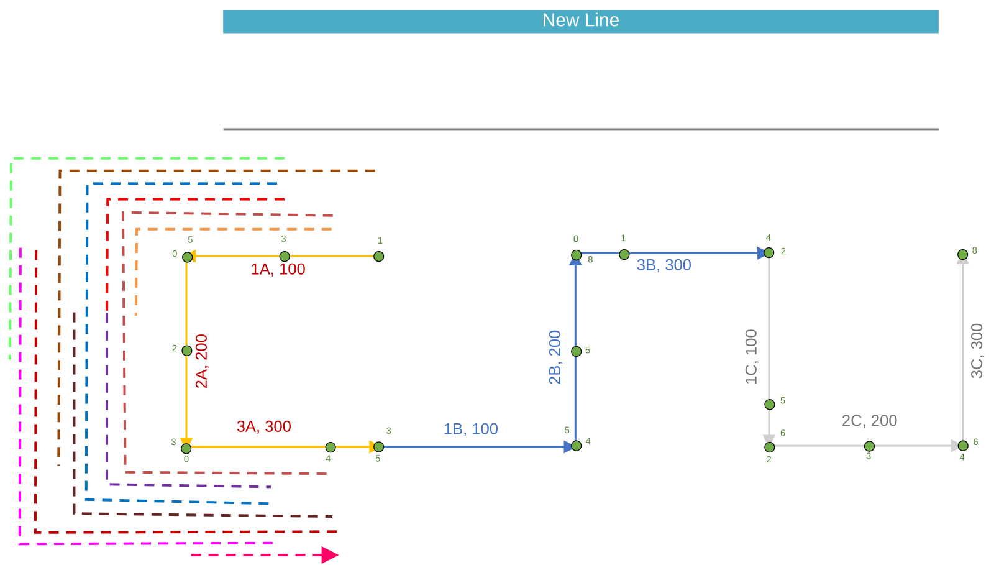

### Slide 34 <!-- slide 34 -->

| Recalibrate Source | Yes |
| --- | --- |
| Recalibrate Target | Yes |
| Date | 12/31/2010 |
|  |  |

| Test ID | 17 | Network Type | Engineering (Spanning Line Events) |
| --- | --- | --- | --- |
| Test | Reassign all routes to a new line. Routes are irregularly portioned. Do not transfer calibration points |  |  |

| EventID | From Date | To Date | From RouteID | To RouteID | From Measure | To Measure | Loc Error |
| --- | --- | --- | --- | --- | --- | --- | --- |
| 001 | 1/1/2000 | Null | 1A | 2A | 2 | 1 | No Error |
| 002 | 1/1/2000 | Null | 1A | 3A | 2 | 4 | No Error |
| 003 | 1/1/2000 | Null | 1A | 2A | 3 | 1 | No Error |
| 004 | 1/1/2000 | Null | 2A | 3A | 1 | 2 | No Error |
| 005 | 1/1/2000 | Null | 1A | 3A | 3 | 2 | No Error |
| 006 | 1/1/2000 | Null | 2A | 3A | 1 | 4 | No Error |
| 007 | 1/1/2000 | Null | 1A | 2A | 2 | 2 | No Error |
| 008 | 1/1/2000 | Null | 2A | 3A | 0 | 4 | No Error |
| 009 | 1/1/2000 | Null | 2A | 3A | 0 | 2 | No Error |
| 010 | 1/1/2000 | Null | 1A | 2A | 3 | 2 | No Error |
| 011 | 1/1/2000 | Null | 3A | 3A | 0 | 4 | No Error |

| R Name | L NAME | From Date | To Date | Line Order | From Measure | To Measure |
| --- | --- | --- | --- | --- | --- | --- |
| 1A | L0 | 1/1/2000 | Null | 100 | 2 | 4 |
| 2A | L0 | 1/1/2000 | Null | 200 | 0 | 2 |
| 3A | L0 | 1/1/2000 | Null | 300 | 0 | 4 |
| 1B | L1 | 1/1/2000 | Null | 100 | 3 | 5 |
| 2B | L1 | 1/1/2000 | Null | 200 | 4 | 8 |
| 3B | L1 | 1/1/2000 | Null | 300 | 0 | 2 |
| 1C | L2 | 1/1/2000 | Null | 100 | 4 | 6 |
| 2C | L2 | 1/1/2000 | Null | 200 | 2 | 6 |
| 3C | L2 | 1/1/2000 | Null | 300 | 4 | 8 |

[figure: 1A, 100 · 2A, 200 · 3A, 300 · 1B, 100 · 2B, 200 · 3B, 300 · 2C, 200 · 1C, 100 · 3C, 300 · 4 · 2 · 0 · 3 · 1 · 5 · 8 · 6]

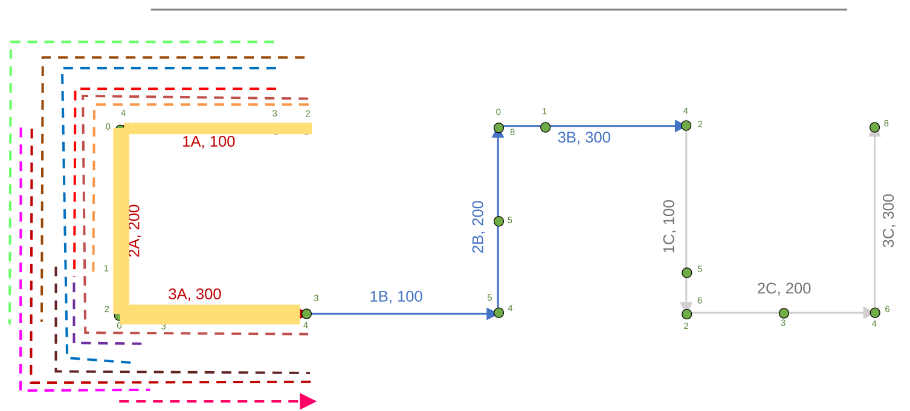

### Slide 35 <!-- slide 35 -->

| Recalibrate Source | Yes |
| --- | --- |
| Recalibrate Target | Yes |
| Date | 12/31/2010 |
|  |  |

| Test ID | 17 | Network Type | Engineering (Spanning Line Events) |
| --- | --- | --- | --- |
| Test | Reassign all routes to a new line. Routes are irregularly portioned. Do not transfer calibration points |  |  |

| R Name | L NAME | From Date | To Date | Line Order | From Measure | To Measure |
| --- | --- | --- | --- | --- | --- | --- |
| 1A | L0 | 1/1/2000 | 12/31/2010 | 100 | 2 | 4 |
| 2A | L0 | 1/1/2000 | 12/31/2010 | 200 | 0 | 2 |
| 3A | L0 | 1/1/2000 | 12/31/2010 | 300 | 0 | 4 |
| 1A | L_New | 12/31/2010 | Null | 100 | 2 | 4 |
| 2A | L_New | 12/31/2010 | Null | 200 | 0 | 2 |
| 3A | L_New | 12/31/2010 | Null | 300 | 0 | 4 |
| 1B | L1 | 1/1/2000 | Null | 100 | 3 | 5 |
| 2B | L1 | 1/1/2000 | Null | 200 | 4 | 8 |
| 3B | L1 | 1/1/2000 | Null | 300 | 0 | 2 |
| 1C | L2 | 1/1/2000 | Null | 100 | 4 | 6 |
| 2C | L2 | 1/1/2000 | Null | 200 | 2 | 6 |
| 3C | L2 | 1/1/2000 | Null | 300 | 4 | 8 |

| EventID | From Date | To Date | From RouteID | To RouteID | From Measure | To Measure | Loc Error |
| --- | --- | --- | --- | --- | --- | --- | --- |
| 001 | 1/1/2000 | 12/31/2030 | 1A | 2A | 2 | 1 | No Error |
| 002 | 1/1/2000 | 12/31/2030 | 1A | 3A | 2 | 4 | No Error |
| 003 | 1/1/2000 | 12/31/2030 | 1A | 2A | 3 | 1 | No Error |
| 004 | 1/1/2000 | 12/31/2030 | 2A | 3A | 1 | 2 | No Error |
| 005 | 1/1/2000 | 12/31/2030 | 1A | 3A | 3 | 2 | No Error |
| 006 | 1/1/2000 | 12/31/2030 | 2A | 3A | 1 | 4 | No Error |
| 007 | 1/1/2000 | 12/31/2030 | 1A | 2A | 2 | 2 | No Error |
| 008 | 1/1/2000 | 12/31/2030 | 2A | 3A | 0 | 4 | No Error |
| 009 | 1/1/2000 | 12/31/2030 | 2A | 3A | 0 | 2 | No Error |
| 010 | 1/1/2000 | 12/31/2030 | 1A | 2A | 3 | 2 | No Error |
| 011 | 1/1/2000 | 12/31/2030 | 3A | 3A | 0 | 4 | No Error |
| 001 | 12/31/2030 | Null | 1A | 2A | 2 | 1 | No Error |
| 002 | 12/31/2030 | Null | 1A | 3A | 2 | 4 | No Error |
| 003 | 12/31/2030 | Null | 1A | 2A | 3 | 1 | No Error |
| 004 | 12/31/2030 | Null | 2A | 3A | 1 | 2 | No Error |
| 005 | 12/31/2030 | Null | 1A | 3A | 3 | 2 | No Error |
| 006 | 12/31/2030 | Null | 2A | 3A | 1 | 4 | No Error |
| 007 | 12/31/2030 | Null | 1A | 2A | 2 | 2 | No Error |
| 008 | 12/31/2030 | Null | 2A | 3A | 0 | 4 | No Error |
| 009 | 12/31/2030 | Null | 2A | 3A | 0 | 2 | No Error |
| 010 | 12/31/2030 | Null | 1A | 2A | 3 | 2 | No Error |
| 011 | 12/31/2030 | Null | 3A | 3A | 0 | 4 | No Error |

[figure: 1A, 100 · 2A, 200 · 3A, 300 · 1B, 100 · 2B, 200 · 3B, 300 · 2C, 200 · 1C, 100 · 3C, 300 · 4 · 2 · 0 · 3 · 5 · 8 · 1 · 6]

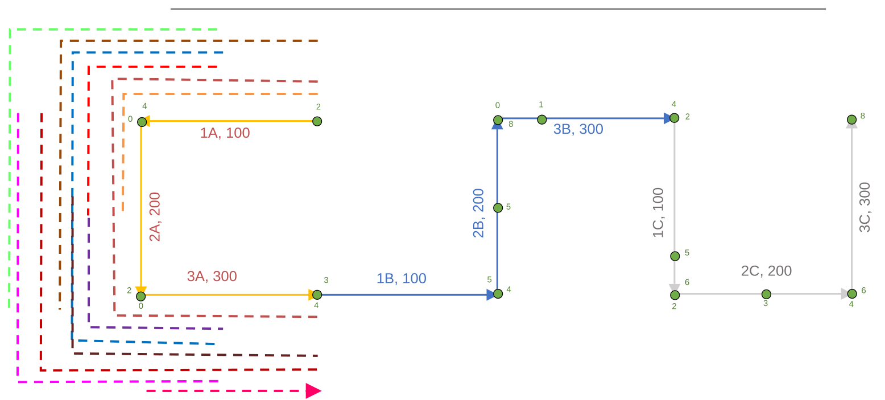

### Slide 36 <!-- slide 36 -->

| Test ID | 1 | Network Type | Engineering (Non-spanning Line Events) |
| --- | --- | --- | --- |
| Test | Reassign all the routes in a line to another line on right, transferring routes and measures. |  |  |

| EventID | From Date | To Date | RouteID | From Measure | To Measure | Loc Error |
| --- | --- | --- | --- | --- | --- | --- |
| 001 | 1/1/2000 | Null | 1A | 2 | 4 | No Error |
| 002 | 1/1/2000 | Null | 1A | 2 | 3 | No Error |
| 003 | 1/1/2000 | Null | 1A | 3 | 4 | No Error |
| 004 | 1/1/2000 | Null | 2A | 0 | 2 | No Error |
| 005 | 1/1/2000 | Null | 2A | 0 | 1 | No Error |
| 006 | 1/1/2000 | Null | 2A | 1 | 2 | No Error |
| 007 | 1/1/2000 | Null | 3A | 0 | 4 | No Error |
| 008 | 1/1/2000 | Null | 3A | 0 | 2 | No Error |
| 009 | 1/1/2000 | Null | 3A | 2 | 4 | No Error |

| R Name | L NAME | From Date | To Date | Line Order | From Measure | To Measure |
| --- | --- | --- | --- | --- | --- | --- |
| 1A | L0 | 1/1/2000 | Null | 100 | 2 | 4 |
| 2A | L0 | 1/1/2000 | Null | 200 | 0 | 2 |
| 3A | L0 | 1/1/2000 | Null | 300 | 0 | 4 |
| 1B | L1 | 1/1/2000 | Null | 100 | 3 | 5 |
| 2B | L1 | 1/1/2000 | Null | 200 | 4 | 8 |
| 3B | L1 | 1/1/2000 | Null | 300 | 0 | 2 |
| 1C | L2 | 1/1/2000 | Null | 100 | 4 | 6 |
| 2C | L2 | 1/1/2000 | Null | 200 | 2 | 6 |
| 3C | L2 | 1/1/2000 | Null | 300 | 4 | 8 |

| Recalibrate Source | Yes |
| --- | --- |
| Recalibrate Target | Yes |
| Date | 12/31/2010 |
|  |  |

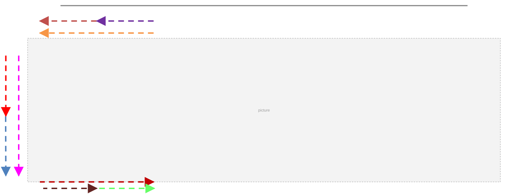

### Slide 37 <!-- slide 37 -->

| Test ID | 1 | Network Type | Engineering (Non-spanning Line Events) |
| --- | --- | --- | --- |
| Test | Reassign all the routes in a line to another line on right, transferring routes and measures. |  |  |

| EventID | From Date | To Date | RouteID | From Measure | To Measure | Loc Error |
| --- | --- | --- | --- | --- | --- | --- |
| 001 | 1/1/2000 | 12/31/2010 | 1A | 2 | 4 | No Error |
| 002 | 1/1/2000 | 12/31/2010 | 1A | 2 | 3 | No Error |
| 003 | 1/1/2000 | 12/31/2010 | 1A | 3 | 4 | No Error |
| 004 | 1/1/2000 | 12/31/2010 | 2A | 0 | 2 | No Error |
| 005 | 1/1/2000 | 12/31/2010 | 2A | 0 | 1 | No Error |
| 006 | 1/1/2000 | 12/31/2010 | 2A | 1 | 2 | No Error |
| 007 | 1/1/2000 | 12/31/2010 | 3A | 0 | 4 | No Error |
| 008 | 1/1/2000 | 12/31/2010 | 3A | 0 | 2 | No Error |
| 009 | 1/1/2000 | 12/31/2010 | 3A | 2 | 4 | No Error |
| 001 | 12/31/2010 | Null | 1A | 2 | 4 | No Error |
| 002 | 12/31/2010 | Null | 1A | 2 | 3 | No Error |
| 003 | 12/31/2010 | Null | 1A | 3 | 4 | No Error |
| 004 | 12/31/2010 | Null | 2A | 0 | 2 | No Error |
| 005 | 12/31/2010 | Null | 2A | 0 | 1 | No Error |
| 006 | 12/31/2010 | Null | 2A | 1 | 2 | No Error |
| 007 | 12/31/2010 | Null | 3A | 0 | 4 | No Error |
| 008 | 12/31/2010 | Null | 3A | 0 | 2 | No Error |
| 009 | 12/31/2010 | Null | 3A | 2 | 4 | No Error |

| R Name | L NAME | From Date | To Date | Line Order | From Measure | To Measure |
| --- | --- | --- | --- | --- | --- | --- |
| 1A | L0 | 1/1/2000 | 12/31/2010 | 100 | 2 | 4 |
| 2A | L0 | 1/1/2000 | 12/31/2010 | 200 | 0 | 2 |
| 3A | L0 | 1/1/2000 | 12/31/2010 | 300 | 0 | 4 |
| 1B | L1 | 1/1/2000 | 12/31/2010 | 100 | 3 | 5 |
| 2B | L1 | 1/1/2000 | 12/31/2010 | 200 | 4 | 8 |
| 3B | L1 | 1/1/2000 | 12/31/2010 | 300 | 0 | 2 |
| 1A | L1 | 12/31/2010 | Null | 100 | 2 | 4 |
| 2A | L1 | 12/31/2010 | Null | 200 | 0 | 2 |
| 3A | L1 | 12/31/2010 | Null | 300 | 0 | 4 |
| 1B | L1 | 12/31/2010 | Null | 400 | 3 | 5 |
| 2B | L1 | 12/31/2010 | Null | 500 | 4 | 8 |
| 3B | L1 | 12/31/2010 | Null | 600 | 0 | 2 |
| 1C | L2 | 1/1/2000 | Null | 100 | 4 | 6 |
| 2C | L2 | 1/1/2000 | Null | 200 | 2 | 6 |
| 3C | L2 | 1/1/2000 | Null | 300 | 4 | 8 |

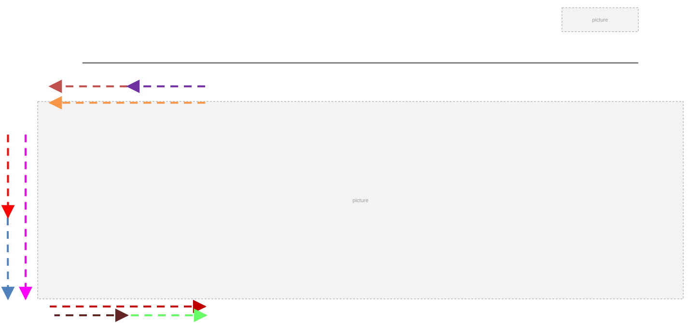

### Slide 38 <!-- slide 38 -->

| Recalibrate Source | Yes |
| --- | --- |
| Recalibrate Target | Yes |
| Date | 12/31/2010 |
|  |  |

| Test ID | 2 | Network Type | Engineering (Non-spanning Line Events) |
| --- | --- | --- | --- |
| Test | Reassign all the routes in a line to another line on right, 2/3 route names and measures maintained. The first route in the line has changed. |  |  |

| EventID | From Date | To Date | RouteID | From Measure | To Measure | Loc Error |
| --- | --- | --- | --- | --- | --- | --- |
| 001 | 1/1/2000 | Null | 1A | 2 | 4 | No Error |
| 002 | 1/1/2000 | Null | 1A | 2 | 3 | No Error |
| 003 | 1/1/2000 | Null | 1A | 3 | 4 | No Error |
| 004 | 1/1/2000 | Null | 2A | 0 | 2 | No Error |
| 005 | 1/1/2000 | Null | 2A | 0 | 1 | No Error |
| 006 | 1/1/2000 | Null | 2A | 1 | 2 | No Error |
| 007 | 1/1/2000 | Null | 3A | 0 | 4 | No Error |
| 008 | 1/1/2000 | Null | 3A | 0 | 2 | No Error |
| 009 | 1/1/2000 | Null | 3A | 2 | 4 | No Error |

| R Name | L NAME | From Date | To Date | Line Order | From Measure | To Measure |
| --- | --- | --- | --- | --- | --- | --- |
| 1A | L0 | 1/1/2000 | Null | 100 | 2 | 4 |
| 2A | L0 | 1/1/2000 | Null | 200 | 0 | 2 |
| 3A | L0 | 1/1/2000 | Null | 300 | 0 | 4 |
| 1B | L1 | 1/1/2000 | Null | 100 | 3 | 5 |
| 2B | L1 | 1/1/2000 | Null | 200 | 4 | 8 |
| 3B | L1 | 1/1/2000 | Null | 300 | 0 | 2 |
| 1C | L2 | 1/1/2000 | Null | 100 | 4 | 6 |
| 2C | L2 | 1/1/2000 | Null | 200 | 2 | 6 |
| 3C | L2 | 1/1/2000 | Null | 300 | 4 | 8 |

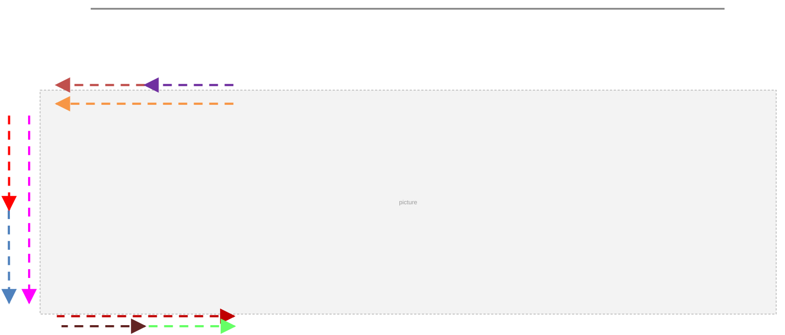

### Slide 39 <!-- slide 39 -->

| Test ID | 2 | Network Type | Engineering (Non-spanning Line Events) |
| --- | --- | --- | --- |
| Test | Reassign all the routes in a line to another line on right, 2/3 route names and measures maintained. The first route in the line has changed. |  |  |

| EventID | From Date | To Date | RouteID | From Measure | To Measure | Loc Error |
| --- | --- | --- | --- | --- | --- | --- |
| 001 | 1/1/2000 | 12/31/2010 | 1A | 2 | 4 | No Error |
| 002 | 1/1/2000 | 12/31/2010 | 1A | 2 | 3 | No Error |
| 003 | 1/1/2000 | 12/31/2010 | 1A | 3 | 4 | No Error |
| 004 | 1/1/2000 | 12/31/2010 | 2A | 0 | 2 | No Error |
| 005 | 1/1/2000 | 12/31/2010 | 2A | 0 | 1 | No Error |
| 006 | 1/1/2000 | 12/31/2010 | 2A | 1 | 2 | No Error |
| 007 | 1/1/2000 | 12/31/2010 | 3A | 0 | 4 | No Error |
| 008 | 1/1/2000 | 12/31/2010 | 3A | 0 | 2 | No Error |
| 009 | 1/1/2000 | 12/31/2010 | 3A | 2 | 4 | No Error |
| 001 | 12/31/2010 | Null | 1A | 2 | 4 | Route not Found |
| 002 | 12/31/2010 | Null | 1A | 2 | 3 | Route not Found |
| 003 | 12/31/2010 | Null | 1A | 3 | 4 | Route not Found |
| 004 | 12/31/2010 | Null | 2A | 0 | 2 | No Error |
| 005 | 12/31/2010 | Null | 2A | 0 | 1 | No Error |
| 006 | 12/31/2010 | Null | 2A | 1 | 2 | No Error |
| 007 | 12/31/2010 | Null | 3A | 0 | 4 | No Error |
| 008 | 12/31/2010 | Null | 3A | 0 | 2 | No Error |
| 009 | 12/31/2010 | Null | 3A | 2 | 4 | No Error |

| R Name | L NAME | From Date | To Date | Line Order | From Measure | To Measure |
| --- | --- | --- | --- | --- | --- | --- |
| 1A | L0 | 1/1/2000 | 12/31/2010 | 100 | 2 | 4 |
| 2A | L0 | 1/1/2000 | 12/31/2010 | 200 | 0 | 2 |
| 3A | L0 | 1/1/2000 | 12/31/2010 | 300 | 0 | 4 |
| 1B | L1 | 1/1/2000 | 12/31/2010 | 100 | 3 | 5 |
| 2B | L1 | 1/1/2000 | 12/31/2010 | 200 | 4 | 8 |
| 3B | L1 | 1/1/2000 | 12/31/2010 | 300 | 0 | 2 |
| 1A-Change | L1 | 12/31/2010 | Null | 100 | 5 | 8 |
| 2A | L1 | 12/31/2010 | Null | 200 | 0 | 2 |
| 3A | L1 | 12/31/2010 | Null | 300 | 0 | 4 |
| 1B | L1 | 12/31/2010 | Null | 400 | 3 | 5 |
| 2B | L1 | 12/31/2010 | Null | 500 | 4 | 8 |
| 3B | L1 | 12/31/2010 | Null | 600 | 0 | 2 |
| 1C | L2 | 1/1/2000 | Null | 100 | 4 | 6 |
| 2C | L2 | 1/1/2000 | Null | 200 | 2 | 6 |
| 3C | L2 | 1/1/2000 | Null | 300 | 4 | 8 |

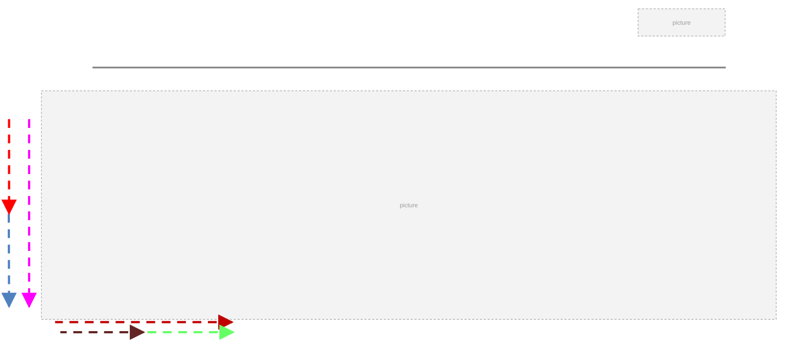

### Slide 40 <!-- slide 40 -->

| Recalibrate Source | Yes |
| --- | --- |
| Recalibrate Target | Yes |
| Date | 12/31/2010 |
|  |  |

| Test ID | 3 | Network Type | Engineering (Non-spanning Line Events) |
| --- | --- | --- | --- |
| Test | Reassign in the middle spanning routes to the line on the right. Rename one route |  |  |

| EventID | From Date | To Date | RouteID | From Measure | To Measure | Loc Error |
| --- | --- | --- | --- | --- | --- | --- |
| 001 | 1/1/2000 | Null | 1A | 2 | 4 | No Error |
| 002 | 1/1/2000 | Null | 1A | 2 | 3 | No Error |
| 003 | 1/1/2000 | Null | 1A | 3 | 4 | No Error |
| 004 | 1/1/2000 | Null | 2A | 0 | 2 | No Error |
| 005 | 1/1/2000 | Null | 2A | 0 | 1 | No Error |
| 006 | 1/1/2000 | Null | 2A | 1 | 2 | No Error |
| 007 | 1/1/2000 | Null | 3A | 0 | 4 | No Error |
| 008 | 1/1/2000 | Null | 3A | 0 | 2 | No Error |
| 009 | 1/1/2000 | Null | 3A | 2 | 4 | No Error |

| R Name | L NAME | From Date | To Date | Line Order | From Measure | To Measure |
| --- | --- | --- | --- | --- | --- | --- |
| 1A | L0 | 1/1/2000 | Null | 100 | 2 | 4 |
| 2A | L0 | 1/1/2000 | Null | 200 | 0 | 2 |
| 3A | L0 | 1/1/2000 | Null | 300 | 0 | 4 |
| 1B | L1 | 1/1/2000 | Null | 100 | 3 | 5 |
| 2B | L1 | 1/1/2000 | Null | 200 | 4 | 8 |
| 3B | L1 | 1/1/2000 | Null | 300 | 0 | 2 |
| 1C | L2 | 1/1/2000 | Null | 100 | 4 | 6 |
| 2C | L2 | 1/1/2000 | Null | 200 | 2 | 6 |
| 3C | L2 | 1/1/2000 | Null | 300 | 4 | 8 |

[figure: 1A, 100 · 2A, 200 · 3A, 300 · 1B, 100 · 2B, 200 · 3B, 300 · 2C, 200 · 1C, 100 · 3C, 300 · 4 · 2 · 0 · 3 · 1 · 5 · 8 · 6]

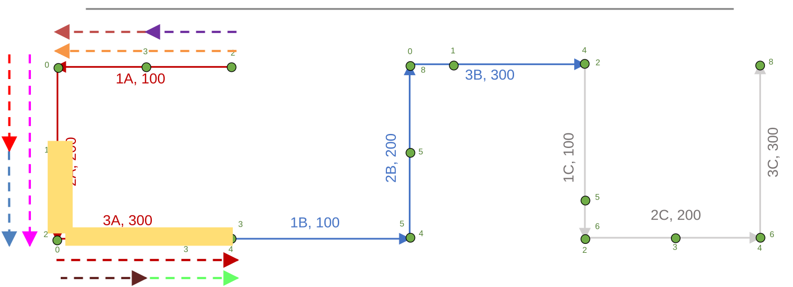

### Slide 41 <!-- slide 41 -->

| Test ID | 3 | Network Type | Engineering (Non-spanning Line Events) |
| --- | --- | --- | --- |
| Test | Reassign in the middle spanning routes to the line on the right |  |  |

| EventID | From Date | To Date | RouteID | From Measure | To Measure | Loc Error |
| --- | --- | --- | --- | --- | --- | --- |
| 001 | 1/1/2000 | Null | 1A | 2 | 4 | No Error |
| 002 | 1/1/2000 | Null | 1A | 2 | 3 | No Error |
| 003 | 1/1/2000 | Null | 1A | 3 | 4 | No Error |
| 004 | 1/1/2000 | 12/31/2010 | 2A | 0 | 2 | No Error |
| 005 | 1/1/2000 | Null | 2A | 0 | 1 | No Error |
| 006 | 1/1/2000 | 12/31/2010 | 2A | 1 | 2 | No Error |
| 007 | 1/1/2000 | 12/31/2010 | 3A | 0 | 4 | No Error |
| 008 | 1/1/2000 | 12/31/2010 | 3A | 0 | 2 | No Error |
| 009 | 1/1/2000 | 12/31/2010 | 3A | 2 | 4 | No Error |
| 004 | 12/31/2010 | Null | 2A | 0 | 2 | Partial Match for the To Measure |
| 006 | 12/31/2010 | Null | 2A | 1 | 2 | Partial Match for the To Measure |
| 007 | 12/31/2010 | Null | 3A | 0 | 4 | No Error |
| 008 | 12/31/2010 | Null | 3A | 0 | 2 | No Error |
| 009 | 12/31/2010 | Null | 3A | 2 | 4 | No Error |

| R Name | L NAME | From Date | To Date | Line Order | From Measure | To Measure |
| --- | --- | --- | --- | --- | --- | --- |
| 1A | L0 | 1/1/2000 | Null | 100 | 2 | 4 |
| 2A | L0 | 1/1/2000 | 12/31/2010 | 200 | 0 | 2 |
| 3A | L0 | 1/1/2000 | 12/31/2010 | 300 | 0 | 4 |
| 2A | L0 | 12/31/2010 | Null | 200 | 0 | 1 |
| 2A Line1 | L1 | 12/31/2010 | Null | 100 | 1 | 2 |
| 3A | L1 | 12/31/2010 | Null | 200 | 0 | 4 |
| 1B | L1 | 1/1/2000 | 12/31/2010 | 100 | 3 | 5 |
| 1B | L1 | 12/31/2010 | Null | 300 | 3 | 5 |
| 2B | L1 | 1/1/2000 | 12/31/2010 | 200 | 4 | 8 |
| 2B | L1 | 12/31/2010 | Null | 400 | 4 | 8 |
| 3B | L1 | 1/1/2000 | 12/31/2010 | 300 | 0 | 2 |
| 3B | L1 | 12/31/2010 | Null | 500 | 0 | 2 |
| 1C | L2 | 1/1/2000 | Null | 100 | 4 | 6 |
| 2C | L2 | 1/1/2000 | Null | 200 | 2 | 6 |
| 3C | L2 | 1/1/2000 | Null | 300 | 4 | 8 |

[figure: 1A, 100 · 2A, 200 · 3A, 200 · 1B, 300 · 2B, 400 · 3B, 500 · 2C, 200 · 1C, 100 · 3C, 300 · 4 · 2 · 0 · 3 · 5 · 8 · 1 · 6 · 2A Line1, 100]

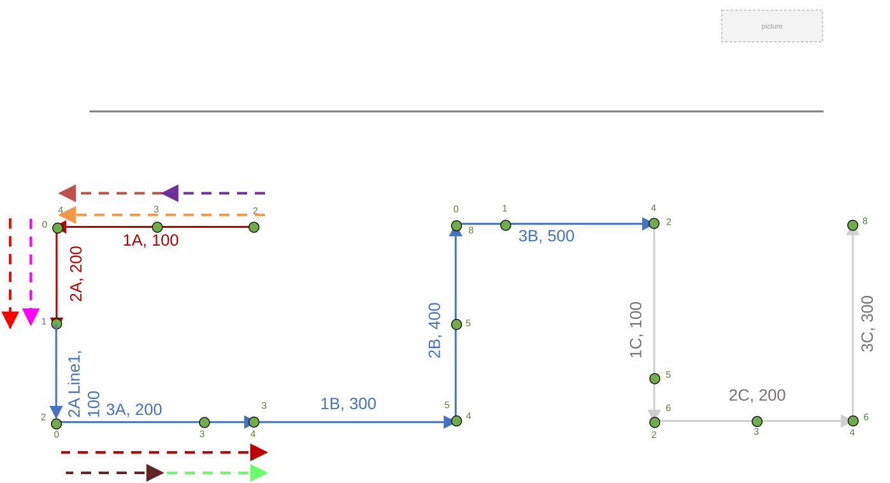

### Slide 42 — New Line <!-- slide 42 -->

| Recalibrate Source | Yes |
| --- | --- |
| Recalibrate Target | Yes |
| Date | 12/31/2020 |
|  |  |

| Test ID | 4 | Network Type | Engineering (Non-spanning Line Events) |
| --- | --- | --- | --- |
| Test | Reassign to a new line. No Change. |  |  |

| EventID | From Date | To Date | RouteID | From Measure | To Measure | Loc Error |
| --- | --- | --- | --- | --- | --- | --- |
| 001 | 1/1/2000 | Null | 1A | 2 | 4 | No Error |
| 002 | 1/1/2000 | Null | 1A | 2 | 3 | No Error |
| 003 | 1/1/2000 | Null | 1A | 3 | 4 | No Error |
| 004 | 1/1/2000 | Null | 2A | 0 | 2 | No Error |
| 005 | 1/1/2000 | Null | 2A | 0 | 1 | No Error |
| 006 | 1/1/2000 | Null | 2A | 1 | 2 | No Error |
| 007 | 1/1/2000 | Null | 3A | 0 | 4 | No Error |
| 008 | 1/1/2000 | Null | 3A | 0 | 2 | No Error |
| 009 | 1/1/2000 | Null | 3A | 2 | 4 | No Error |

| R Name | L NAME | From Date | To Date | Line Order | From Measure | To Measure |
| --- | --- | --- | --- | --- | --- | --- |
| 1A | L0 | 1/1/2000 | Null | 100 | 2 | 4 |
| 2A | L0 | 1/1/2000 | Null | 200 | 0 | 2 |
| 3A | L0 | 1/1/2000 | Null | 300 | 0 | 4 |
| 1B | L1 | 1/1/2000 | Null | 100 | 3 | 5 |
| 2B | L1 | 1/1/2000 | Null | 200 | 4 | 8 |
| 3B | L1 | 1/1/2000 | Null | 300 | 0 | 2 |
| 1C | L2 | 1/1/2000 | Null | 100 | 4 | 6 |
| 2C | L2 | 1/1/2000 | Null | 200 | 2 | 6 |
| 3C | L2 | 1/1/2000 | Null | 300 | 4 | 8 |

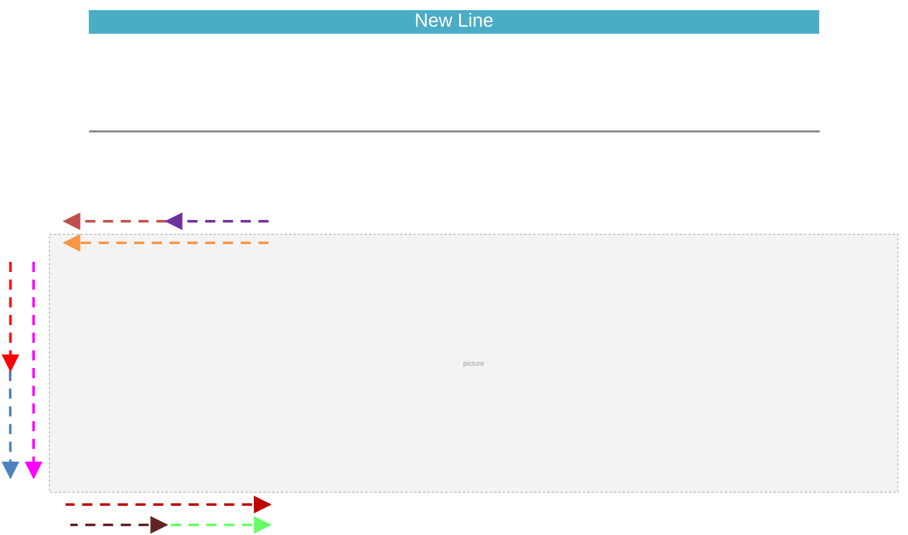

### Slide 43 <!-- slide 43 -->

| Test ID | 4 | Network Type | Engineering (Non-spanning Line Events) |
| --- | --- | --- | --- |
| Test | Reassign to a new line. No Change. |  |  |

| EventID | From Date | To Date | RouteID | From Measure | To Measure | Loc Error |
| --- | --- | --- | --- | --- | --- | --- |
| 001 | 1/1/2000 | 12/31/2010 | 1A | 2 | 4 | No Error |
| 002 | 1/1/2000 | 12/31/2010 | 1A | 2 | 3 | No Error |
| 003 | 1/1/2000 | 12/31/2010 | 1A | 3 | 4 | No Error |
| 004 | 1/1/2000 | 12/31/2010 | 2A | 0 | 2 | No Error |
| 005 | 1/1/2000 | 12/31/2010 | 2A | 0 | 1 | No Error |
| 006 | 1/1/2000 | 12/31/2010 | 2A | 1 | 2 | No Error |
| 007 | 1/1/2000 | 12/31/2010 | 3A | 0 | 4 | No Error |
| 008 | 1/1/2000 | 12/31/2010 | 3A | 0 | 2 | No Error |
| 009 | 1/1/2000 | 12/31/2010 | 3A | 2 | 4 | No Error |
| 001 | 12/31/2020 | Null | 1A | 2 | 4 | No Error |
| 002 | 12/31/2020 | Null | 1A | 2 | 3 | No Error |
| 003 | 12/31/2020 | Null | 1A | 3 | 4 | No Error |
| 004 | 12/31/2020 | Null | 2A | 0 | 2 | No Error |
| 005 | 12/31/2020 | Null | 2A | 0 | 1 | No Error |
| 006 | 12/31/2020 | Null | 2A | 1 | 2 | No Error |
| 007 | 12/31/2020 | Null | 3A | 0 | 4 | No Error |
| 008 | 12/31/2020 | Null | 3A | 0 | 2 | No Error |
| 009 | 12/31/2020 | Null | 3A | 2 | 4 | No Error |

| R Name | L NAME | From Date | To Date | Line Order | From Measure | To Measure |
| --- | --- | --- | --- | --- | --- | --- |
| 1A | L0 | 1/1/2000 | 12/31/2020 | 100 | 2 | 4 |
| 2A | L0 | 1/1/2010 | 12/31/2020 | 200 | 0 | 2 |
| 3A | L0 | 1/1/2020 | 12/31/2020 | 300 | 0 | 4 |
| 1A | LX | 12/31/2020 | Null | 100 | 2 | 4 |
| 2A | LX | 12/31/2020 | Null | 200 | 0 | 2 |
| 3A | LX | 12/31/2020 | Null | 300 | 0 | 4 |
| 1B | L1 | 1/1/2002 | Null | 100 | 3 | 5 |
| 2B | L1 | 1/1/2005 | Null | 200 | 4 | 8 |
| 3B | L1 | 1/1/2010 | Null | 300 | 0 | 2 |
| 1C | L2 | 1/1/2020 | Null | 100 | 4 | 6 |
| 2C | L2 | 1/1/2020 | Null | 200 | 2 | 6 |
| 3C | L2 | 1/1/2020 | Null | 300 | 4 | 8 |

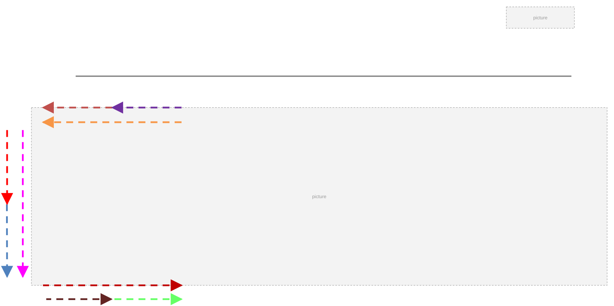

### Slide 44 — New Line <!-- slide 44 -->

| Recalibrate Source | Yes |
| --- | --- |
| Recalibrate Target | Yes |
| Date | 12/31/2020 |
|  |  |

| Test ID | 5 | Network Type | Engineering (Non-spanning Line Events) |
| --- | --- | --- | --- |
| Test | Reassign the middle route in a line to a new line. Change measures. |  |  |

| R Name | L NAME | From Date | To Date | Line Order | From Measure | To Measure |
| --- | --- | --- | --- | --- | --- | --- |
| 1A | L0 | 1/1/2000 | Null | 100 | 2 | 4 |
| 2A | L0 | 1/1/2010 | Null | 200 | 0 | 2 |
| 3A | L0 | 1/1/2020 | Null | 300 | 0 | 4 |
| 1B | L1 | 1/1/2002 | Null | 100 | 3 | 5 |
| 2B | L1 | 1/1/2005 | Null | 200 | 4 | 8 |
| 3B | L1 | 1/1/2010 | Null | 300 | 0 | 2 |
| 1C | L2 | 1/1/2020 | Null | 100 | 4 | 6 |
| 2C | L2 | 1/1/2020 | Null | 200 | 2 | 6 |
| 3C | L2 | 1/1/2020 | Null | 300 | 4 | 8 |

| EventID | From Date | To Date | RouteID | From Measure | To Measure | Loc Error |
| --- | --- | --- | --- | --- | --- | --- |
| 001 | 1/1/2000 | Null | 1A | 2 | 4 | No Error |
| 002 | 1/1/2000 | Null | 1A | 2 | 3 | No Error |
| 003 | 1/1/2000 | Null | 1A | 3 | 4 | No Error |
| 004 | 1/1/2000 | Null | 2A | 0 | 2 | No Error |
| 005 | 1/1/2000 | Null | 2A | 0 | 1 | No Error |
| 006 | 1/1/2000 | Null | 2A | 1 | 2 | No Error |
| 007 | 1/1/2000 | Null | 3A | 0 | 4 | No Error |
| 008 | 1/1/2000 | Null | 3A | 0 | 2 | No Error |
| 009 | 1/1/2000 | Null | 3A | 2 | 4 | No Error |

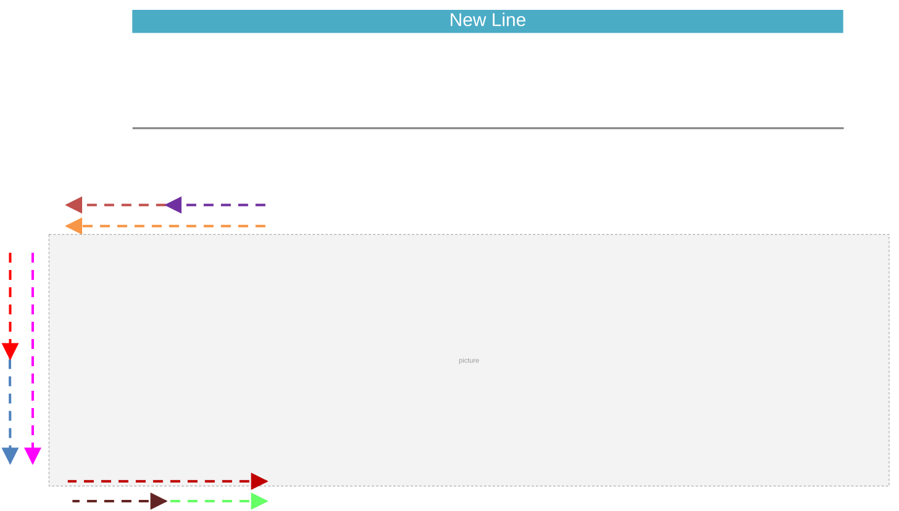

### Slide 45 <!-- slide 45 -->

| Test ID | 5 | Network Type | Engineering (Non-spanning Line Events) |
| --- | --- | --- | --- |
| Test | Reassign the middle route in a line to a new line. Change measures. |  |  |

100
100

| EventID | From Date | To Date | RouteID | From Measure | To Measure | Loc Error |
| --- | --- | --- | --- | --- | --- | --- |
| 001 | 1/1/2000 | Null | 1A | 2 | 4 | No Error |
| 002 | 1/1/2000 | Null | 1A | 2 | 3 | No Error |
| 003 | 1/1/2000 | Null | 1A | 3 | 4 | No Error |
| 004 | 1/1/2000 | 12/31/2010 | 2A | 0 | 2 | No Error |
| 005 | 1/1/2000 | 12/31/2010 | 2A | 0 | 1 | No Error |
| 006 | 1/1/2000 | 12/31/2010 | 2A | 1 | 2 | No Error |
| 007 | 1/1/2000 | Null | 3A | 0 | 4 | No Error |
| 008 | 1/1/2000 | Null | 3A | 0 | 2 | No Error |
| 009 | 1/1/2000 | Null | 3A | 2 | 4 | No Error |
| 004 | 12/31/2020 | Null | 2A | 0 | 2 | Route Location not Found |
| 005 | 12/31/2020 | Null | 2A | 0 | 1 | Route Location not Found |
| 006 | 12/31/2020 | Null | 2A | 1 | 2 | Route Location not Found |

| R Name | L NAME | From Date | To Date | Line Order | From Measure | To Measure |
| --- | --- | --- | --- | --- | --- | --- |
| 1A | L0 | 1/1/2000 | Null | 100 | 2 | 4 |
| 2A | L0 | 1/1/2010 | 12/31/2020 | 200 | 0 | 2 |
| 3A | L0 | 1/1/2020 | 12/31/2020 | 300 | 0 | 4 |
| 2A | L_New | 12/31/2020 | Null | 100 | 10 | 20 |
| 3A | L0 | 12/31/2020 | Null | 200 | 0 | 4 |
| 1B | L1 | 1/1/2002 | Null | 100 | 3 | 5 |
| 2B | L1 | 1/1/2005 | Null | 200 | 4 | 8 |
| 3B | L1 | 1/1/2010 | Null | 300 | 0 | 2 |
| 1C | L2 | 1/1/2020 | Null | 100 | 4 | 6 |
| 2C | L2 | 1/1/2020 | Null | 200 | 2 | 6 |
| 3C | L2 | 1/1/2020 | Null | 300 | 4 | 8 |

10

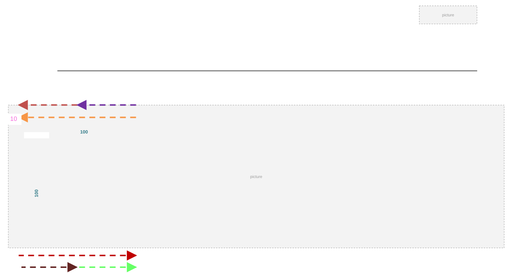

### Slide 46 <!-- slide 46 -->

| Recalibrate Source | Yes |
| --- | --- |
| Recalibrate Target | Yes |
| Date | 12/31/2030 |
|  |  |

| Test ID | 6 | Network Type | Engineering (Non-spanning Line Events) |
| --- | --- | --- | --- |
| Test | Reassign partial routes in a line to a new line. Change names of partial routes. |  |  |

| EventID | From Date | To Date | RouteID | From Measure | To Measure | Loc Error |
| --- | --- | --- | --- | --- | --- | --- |
| 001 | 1/1/2000 | Null | 1A | 2 | 4 | No Error |
| 002 | 1/1/2000 | Null | 1A | 2 | 3 | No Error |
| 003 | 1/1/2000 | Null | 1A | 3 | 4 | No Error |
| 004 | 1/1/2000 | Null | 2A | 0 | 2 | No Error |
| 005 | 1/1/2000 | Null | 2A | 0 | 1 | No Error |
| 006 | 1/1/2000 | Null | 2A | 1 | 2 | No Error |
| 007 | 1/1/2000 | Null | 3A | 0 | 4 | No Error |
| 008 | 1/1/2000 | Null | 3A | 0 | 2 | No Error |
| 009 | 1/1/2000 | Null | 3A | 2 | 4 | No Error |

| R Name | L NAME | From Date | To Date | Line Order | From Measure | To Measure |
| --- | --- | --- | --- | --- | --- | --- |
| 1A | L0 | 1/1/2000 | Null | 100 | 2 | 4 |
| 2A | L0 | 1/1/2000 | Null | 200 | 0 | 2 |
| 3A | L0 | 1/1/2000 | Null | 300 | 0 | 4 |
| 1B | L1 | 1/1/2000 | Null | 100 | 3 | 5 |
| 2B | L1 | 1/1/2000 | Null | 200 | 4 | 8 |
| 3B | L1 | 1/1/2000 | Null | 300 | 0 | 2 |
| 1C | L2 | 1/1/2000 | Null | 100 | 4 | 6 |
| 2C | L2 | 1/1/2000 | Null | 200 | 2 | 6 |
| 3C | L2 | 1/1/2000 | Null | 300 | 4 | 8 |

[figure: New Line · 1A, 100 · 2A, 200 · 3A, 300 · 1B, 100 · 2B, 200 · 3B, 300 · 2C, 200 · 1C, 100 · 3C, 300 · 4 · 2 · 0 · 3 · 1 · 5 · 8 · 6]

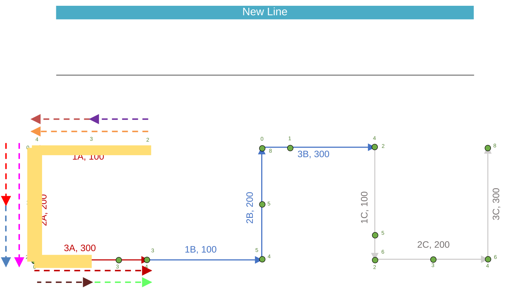

### Slide 47 <!-- slide 47 -->

| Test ID | 6 | Network Type | Engineering (Non-spanning Line Events) |
| --- | --- | --- | --- |
| Test | Reassign partial routes in a line to a new line. Change names of partial routes. |  |  |

3A LineX, 300

| EventID | From Date | To Date | RouteID | From Measure | To Measure | Loc Error |
| --- | --- | --- | --- | --- | --- | --- |
| 001 | 1/1/2000 | 12/31/2010 | 1A | 2 | 4 | No Error |
| 002 | 1/1/2000 | 12/31/2010 | 1A | 2 | 3 | No Error |
| 003 | 1/1/2000 | 12/31/2010 | 1A | 3 | 4 | No Error |
| 004 | 1/1/2000 | 12/31/2010 | 2A | 0 | 2 | No Error |
| 005 | 1/1/2000 | 12/31/2010 | 2A | 0 | 1 | No Error |
| 006 | 1/1/2000 | 12/31/2010 | 2A | 1 | 2 | No Error |
| 007 | 1/1/2000 | 12/31/2010 | 3A | 0 | 4 | No Error |
| 008 | 1/1/2000 | 12/31/2010 | 3A | 0 | 2 | No Error |
| 009 | 1/1/2000 | Null | 3A | 2 | 4 | No Error |
| 001 | 12/31/2030 | Null | 1A | 2 | 4 | No Error |
| 002 | 12/31/2030 | Null | 1A | 2 | 3 | No Error |
| 003 | 12/31/2030 | Null | 1A | 3 | 4 | No Error |
| 004 | 12/31/2030 | Null | 2A | 0 | 2 | No Error |
| 005 | 12/31/2030 | Null | 2A | 0 | 1 | No Error |
| 006 | 12/31/2030 | Null | 2A | 1 | 2 | No Error |
| 007 | 12/31/2030 | Null | 3A | 0 | 4 | Partial Match for the From Measure |
| 008 | 12/31/2030 | Null | 3A | 0 | 2 | Partial Match for the From Measure |

| R Name | L NAME | From Date | To Date | Line Order | From Measure | To Measure |
| --- | --- | --- | --- | --- | --- | --- |
| 1A | L0 | 1/1/2000 | 12/31/2030 | 100 | 2 | 4 |
| 2A | L0 | 1/1/2010 | 12/31/2030 | 200 | 0 | 2 |
| 3A | L0 | 1/1/2020 | 12/31/2030 | 300 | 0 | 4 |
| 1A | LX | 12/31/2030 | Null | 100 | 2 | 4 |
| 2A | LX | 12/31/2030 | Null | 200 | 0 | 2 |
| 3A LineX | LX | 12/31/2030 | Null | 300 | 0 | 2 |
| 3A | L0 | 12/31/2030 | Null | 100 | 2 | 4 |
| 1B | L1 | 1/1/2002 | Null | 100 | 3 | 5 |
| 2B | L1 | 1/1/2005 | Null | 200 | 4 | 8 |
| 3B | L1 | 1/1/2010 | Null | 300 | 0 | 2 |
| 1C | L2 | 1/1/2020 | 12/31/2030 | 100 | 4 | 6 |
| 2C | L2 | 1/1/2020 | 12/31/2030 | 200 | 2 | 6 |
| 3C | L2 | 1/1/2020 | 12/31/2030 | 300 | 4 | 8 |

[figure: 1A, 100 · 2A, 200 · 1B, 100 · 2B, 200 · 3B, 300 · 2C, 200 · 1C, 100 · 3C, 300 · 4 · 2 · 0 · 3 · 1 · 5 · 8 · 6 · 3A, 100]

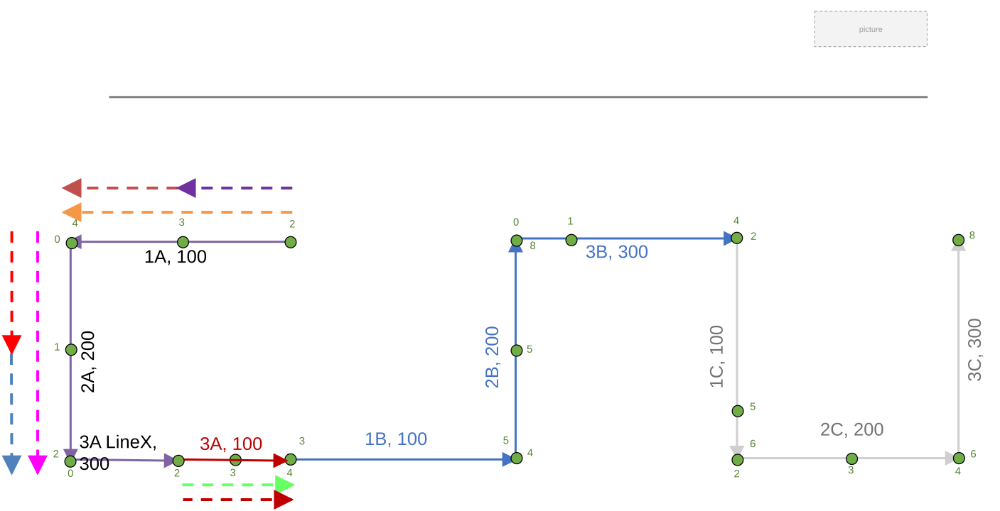

### Slide 48 <!-- slide 48 -->

| Test ID | 7 | Network Type | Engineering (Non-spanning Line Events) |
| --- | --- | --- | --- |
| Test | Reassign all the routes in a line to another line on right, transferring routes and measures. The effective date is same as one the source route’s From Date |  |  |

| Recalibrate Source | Yes |
| --- | --- |
| Recalibrate Target | Yes |
| Date | 1/1/2000 |
|  |  |

| EventID | From Date | To Date | RouteID | From Measure | To Measure | Loc Error |
| --- | --- | --- | --- | --- | --- | --- |
| 001 | 1/1/2000 | Null | 1A | 2 | 4 | No Error |
| 002 | 1/1/2000 | Null | 1A | 2 | 3 | No Error |
| 003 | 1/1/2000 | Null | 1A | 3 | 4 | No Error |
| 004 | 1/1/2000 | Null | 2A | 0 | 2 | No Error |
| 005 | 1/1/2000 | Null | 2A | 0 | 1 | No Error |
| 006 | 1/1/2000 | Null | 2A | 1 | 2 | No Error |
| 007 | 1/1/2000 | Null | 3A | 0 | 4 | No Error |
| 008 | 1/1/2000 | Null | 3A | 0 | 2 | No Error |
| 009 | 1/1/2000 | Null | 3A | 2 | 4 | No Error |

| R Name | L NAME | From Date | To Date | Line Order | From Measure | To Measure |
| --- | --- | --- | --- | --- | --- | --- |
| 1A | L0 | 1/1/2000 | Null | 100 | 2 | 4 |
| 2A | L0 | 1/1/2000 | Null | 200 | 0 | 2 |
| 3A | L0 | 1/1/2000 | Null | 300 | 0 | 4 |
| 1B | L1 | 1/1/2000 | Null | 100 | 3 | 5 |
| 2B | L1 | 1/1/2000 | Null | 200 | 4 | 8 |
| 3B | L1 | 1/1/2000 | Null | 300 | 0 | 2 |
| 1C | L2 | 1/1/2000 | Null | 100 | 4 | 6 |
| 2C | L2 | 1/1/2000 | Null | 200 | 2 | 6 |
| 3C | L2 | 1/1/2000 | Null | 300 | 4 | 8 |

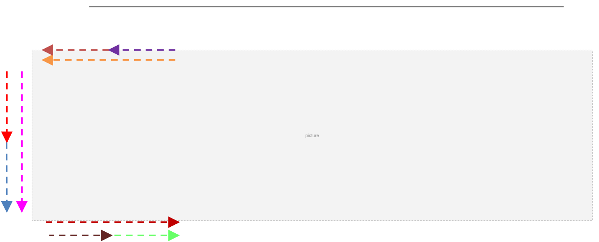

### Slide 49 <!-- slide 49 -->

| Test ID | 7 | Network Type | Engineering (Non-spanning Line Events) |
| --- | --- | --- | --- |
| Test | Reassign all the routes in a line to another line on right, transferring routes and measures. The effective date is same as one the source route’s From Date |  |  |

| EventID | From Date | To Date | RouteID | From Measure | To Measure | Loc Error |
| --- | --- | --- | --- | --- | --- | --- |
| 001 | 1/1/2000 | Null | 1A | 2 | 4 | No Error |
| 002 | 1/1/2000 | Null | 1A | 2 | 3 | No Error |
| 003 | 1/1/2000 | Null | 1A | 3 | 4 | No Error |
| 004 | 1/1/2000 | Null | 2A | 0 | 2 | No Error |
| 005 | 1/1/2000 | Null | 2A | 0 | 1 | No Error |
| 006 | 1/1/2000 | Null | 2A | 1 | 2 | No Error |
| 007 | 1/1/2000 | Null | 3A | 0 | 4 | No Error |
| 008 | 1/1/2000 | Null | 3A | 0 | 2 | No Error |
| 009 | 1/1/2000 | Null | 3A | 2 | 4 | No Error |

| R Name | L NAME | From Date | To Date | Line Order | From Measure | To Measure |
| --- | --- | --- | --- | --- | --- | --- |
| 1A | L1 | 1/1/2000 | Null | 100 | 2 | 4 |
| 2A | L1 | 1/1/2000 | Null | 200 | 0 | 2 |
| 3A | L1 | 1/1/2000 | Null | 300 | 0 | 4 |
| 1B | L1 | 1/1/2000 | Null | 400 | 3 | 5 |
| 2B | L1 | 1/1/2000 | Null | 500 | 4 | 8 |
| 3B | L1 | 1/1/2000 | Null | 600 | 0 | 2 |
| 1C | L2 | 1/1/2000 | Null | 100 | 4 | 6 |
| 2C | L2 | 1/1/2000 | Null | 200 | 2 | 6 |
| 3C | L2 | 1/1/2000 | Null | 300 | 4 | 8 |

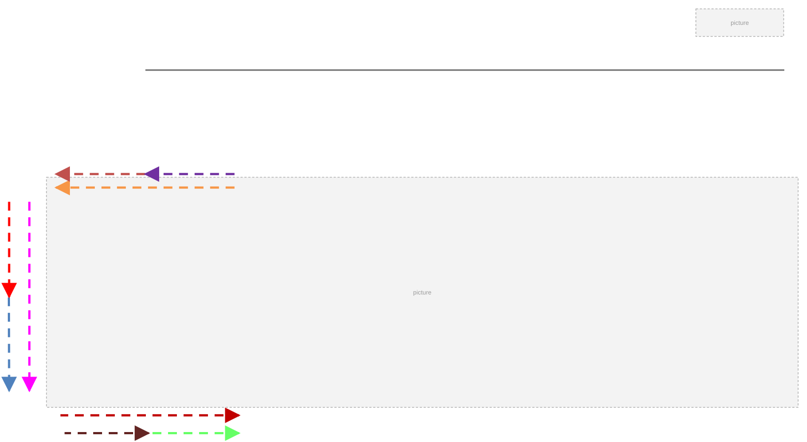

### Slide 50 <!-- slide 50 -->

| Test ID | 8 | Network Type | Engineering (Non-spanning Line Events) |
| --- | --- | --- | --- |
| Test | Reassign to fill the gap in a line by transferring route. |  |  |

| Recalibrate Source | Yes |
| --- | --- |
| Recalibrate Target | Yes |
| Date | 12/31/2023 |

| EventID | From Date | To Date | RouteID | From Measure | To Measure | Loc Error |
| --- | --- | --- | --- | --- | --- | --- |
| 001 | 1/1/2000 | Null | X1 | 2 | 6 | No Error |
| 002 | 1/1/2000 | Null | X1 | 2 | 4 | No Error |
| 003 | 1/1/2000 | Null | X1 | 4 | 6 | No Error |
| 004 | 1/1/2000 | Null | 1B | 3 | 5 | No Error |
| 005 | 1/1/2000 | Null | 1B | 3 | 4 | No Error |
| 006 | 1/1/2000 | Null | 1B | 4 | 5 | No Error |
| 007 | 1/1/2000 | Null | X2 | 24 | 28 | No Error |
| 008 | 1/1/2000 | Null | X2 | 24 | 26 | No Error |
| 009 | 1/1/2000 | Null | X2 | 26 | 28 | No Error |

| R Name | L NAME | From Date | To Date | Line Order | From Measure | To Measure |
| --- | --- | --- | --- | --- | --- | --- |
| X1 | L3 | 1/1/2000 | Null | 100 | 2 | 6 |
| X2 | L3 | 1/1/2000 | Null | 200 | 24 | 28 |
| 1B | L1 | 1/1/2000 | Null | 100 | 3 | 5 |
| 2B | L1 | 1/1/2000 | Null | 200 | 4 | 8 |
| 3B | L1 | 1/1/2000 | Null | 300 | 0 | 2 |

[figure: 100 · 200 · X1 · X2]

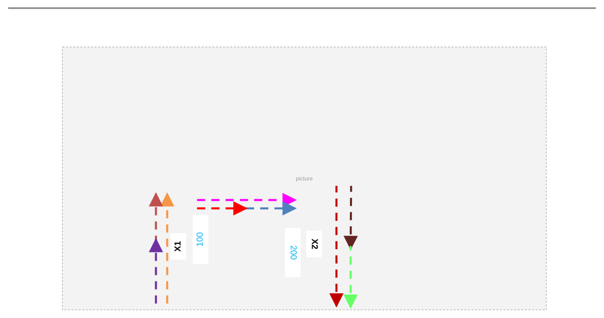

### Slide 51 <!-- slide 51 -->

| Test ID | 8 | Network Type | Engineering (Non-spanning Line Events) |
| --- | --- | --- | --- |
| Test | Reassign to fill the gap in a line by transferring route. |  |  |

| EventID | From Date | To Date | RouteID | From Measure | To Measure | Loc Error |
| --- | --- | --- | --- | --- | --- | --- |
| 001 | 1/1/2000 | Null | X1 | 2 | 6 | No Error |
| 002 | 1/1/2000 | Null | X1 | 2 | 4 | No Error |
| 003 | 1/1/2000 | Null | X1 | 4 | 6 | No Error |
| 004 | 1/1/2000 | 12/31/2023 | 1B | 3 | 5 | No Error |
| 005 | 1/1/2000 | 12/31/2023 | 1B | 3 | 4 | No Error |
| 006 | 1/1/2000 | 12/31/2023 | 1B | 4 | 5 | No Error |
| 007 | 1/1/2000 | Null | X2 | 24 | 28 | No Error |
| 008 | 1/1/2000 | Null | X2 | 24 | 26 | No Error |
| 009 | 1/1/2000 | Null | X2 | 26 | 28 | No Error |
| 004 | 12/31/2023 | Null | 1B | 3 | 5 | No Error |
| 005 | 12/31/2023 | Null | 1B | 3 | 4 | No Error |
| 006 | 12/31/2023 | Null | 1B | 4 | 5 | No Error |

| R Name | L NAME | From Date | To Date | Line Order | From Measure | To Measure |
| --- | --- | --- | --- | --- | --- | --- |
| X1 | L3 | 1/1/2000 | Null | 100 | 2 | 6 |
| X2 | L3 | 1/1/2000 | 12/31/2023 | 100 | 24 | 28 |
| 1B | L1 | 1/1/2000 | 12/31/2023 | 100 | 3 | 5 |
| 2B | L1 | 1/1/2000 | 12/31/2023 | 200 | 4 | 8 |
| 3B | L1 | 1/1/2000 | 12/31/2023 | 300 | 0 | 2 |
| X2 | L3 | 12/31/2023 | Null | 300 | 24 | 28 |
| 1B | L3 | 12/31/2023 | Null | 200 | 3 | 5 |
| 3B | L1 | 12/31/2023 | Null | 200 | 0 | 2 |
| 2B | L1 | 12/31/2023 | Null | 100 | 4 | 8 |

[figure: 100 · 300 · X1 · X2]

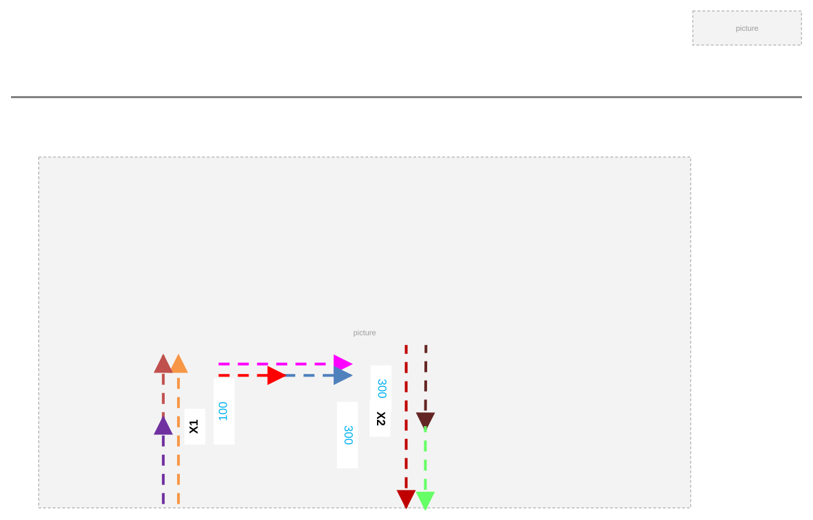

### Slide 52 <!-- slide 52 -->

| Test ID | 9 | Network Type | Engineering (Non-spanning Line Events) |
| --- | --- | --- | --- |
| Test | Reassign part of a route to another line. |  |  |

|  |  |

| EventID | From Date | To Date | RouteID | From Measure | To Measure | Loc Error |
| --- | --- | --- | --- | --- | --- | --- |
| 001 | 1/1/2000 | Null | X1 | 2 | 6 | No Error |
| 002 | 1/1/2000 | Null | X1 | 2 | 4 | No Error |
| 003 | 1/1/2000 | Null | X1 | 4 | 6 | No Error |
| 004 | 1/1/2000 | Null | 1B | 3 | 5 | No Error |
| 005 | 1/1/2000 | Null | 1B | 3 | 4 | No Error |
| 006 | 1/1/2000 | Null | 1B | 4 | 5 | No Error |
| 007 | 1/1/2000 | Null | X2 | 24 | 28 | No Error |
| 008 | 1/1/2000 | Null | X2 | 24 | 26 | No Error |
| 009 | 1/1/2000 | Null | X2 | 26 | 28 | No Error |

| R Name | L NAME | From Date | To Date | Line Order | From Measure | To Measure |
| --- | --- | --- | --- | --- | --- | --- |
| X1 | L3 | 1/1/2000 | Null | 100 | 2 | 6 |
| X2 | L3 | 1/1/2000 | Null | 200 | 24 | 28 |
| 1B | L1 | 1/1/2000 | Null | 100 | 4 | 5 |
| 2B | L1 | 1/1/2000 | Null | 200 | 4 | 8 |
| 3B | L1 | 1/1/2000 | Null | 300 | 0 | 2 |

[figure: 100 · X1 · X2 · 200]

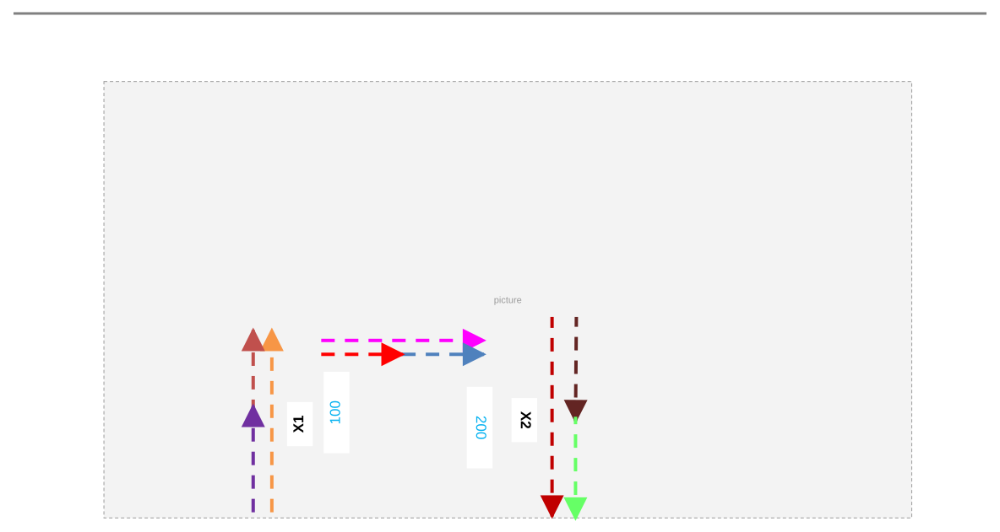

### Slide 53 <!-- slide 53 -->

| Test ID | 9 | Network Type | Engineering (Non-spanning Line Events) |
| --- | --- | --- | --- |
| Test | Reassign part of a route to another line. |  |  |

| EventID | From Date | To Date | RouteID | From Measure | To Measure | Loc Error |
| --- | --- | --- | --- | --- | --- | --- |
| 001 | 1/1/2000 | Null | X1 | 2 | 6 | No Error |
| 002 | 1/1/2000 | Null | X1 | 2 | 4 | No Error |
| 003 | 1/1/2000 | Null | X1 | 4 | 6 | No Error |
| 004 | 1/1/2000 | 12/31/2023 | 1B | 3 | 5 | No Error |
| 005 | 1/1/2000 | 12/31/2023 | 1B | 3 | 4 | No Error |
| 006 | 1/1/2000 | 12/31/2023 | 1B | 4 | 5 | No Error |
| 007 | 1/1/2000 | Null | X2 | 24 | 28 | No Error |
| 008 | 1/1/2000 | Null | X2 | 24 | 26 | No Error |
| 009 | 1/1/2000 | Null | X2 | 26 | 28 | No Error |
| 004 | 12/31/2023 | Null | 1B | 3 | 5 | Partial Match for the From Measure |
| 005 | 12/31/2023 | Null | 1B | 3 | 4 | Route Location not Found |
| 006 | 12/31/2023 | Null | 1B | 4 | 5 | No Error |

| R Name | L NAME | From Date | To Date | Line Order | From Measure | To Measure |
| --- | --- | --- | --- | --- | --- | --- |
| X1 | L3 | 1/1/2000 | Null | 100 | 2 | 6 |
| X2 | L3 | 1/1/2000 | 12/31/2023 | 200 | 24 | 28 |
| 1B | L1 | 1/1/2000 | 12/31/2023 | 100 | 3 | 5 |
| 2B | L1 | 1/1/2000 | Null | 200 | 4 | 8 |
| 3B | L1 | 1/1/2000 | 12/31/2023 | 300 | 0 | 2 |
| X2 | L3 | 12/31/2023 | Null | 300 | 24 | 28 |
| 1B-New | L3 | 12/31/2023 | Null | 200 | 3 | 4 |
| 1B | L1 | 12/31/2023 | Null | 100 | 4 | 5 |

[figure: 100 · 200 · X1 · X2]

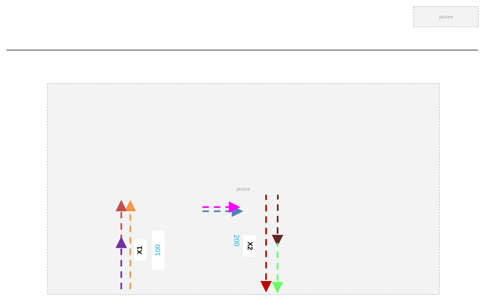

### Slide 54 <!-- slide 54 -->

| Test ID | 10 | Network Type | Engineering (Non-spanning Line Events) |
| --- | --- | --- | --- |
| Test | Reassign part of a route to another line - 2. |  |  |

| EventID | From Date | To Date | RouteID | From Measure | To Measure | Loc Error |
| --- | --- | --- | --- | --- | --- | --- |
| 001 | 1/1/2000 | Null | X1 | 2 | 6 | No Error |
| 002 | 1/1/2000 | Null | X1 | 2 | 4 | No Error |
| 003 | 1/1/2000 | Null | X1 | 4 | 6 | No Error |
| 004 | 1/1/2000 | Null | 1B | 3 | 5 | No Error |
| 005 | 1/1/2000 | Null | 1B | 3 | 4 | No Error |
| 006 | 1/1/2000 | Null | 1B | 4 | 5 | No Error |
| 007 | 1/1/2000 | Null | X2 | 24 | 28 | No Error |
| 008 | 1/1/2000 | Null | X2 | 24 | 26 | No Error |
| 009 | 1/1/2000 | Null | X2 | 26 | 28 | No Error |

| R Name | L NAME | From Date | To Date | Line Order | From Measure | To Measure |
| --- | --- | --- | --- | --- | --- | --- |
| X1 | L3 | 1/1/2000 | Null | 100 | 2 | 6 |
| X2 | L3 | 1/1/2000 | Null | 200 | 24 | 28 |
| 1B | L1 | 1/1/2000 | Null | 100 | 3 | 5 |
| 2B | L1 | 1/1/2000 | Null | 200 | 4 | 8 |
| 3B | L1 | 1/1/2000 | Null | 300 | 0 | 2 |

[figure: 100 · 200 · X1 · X2]

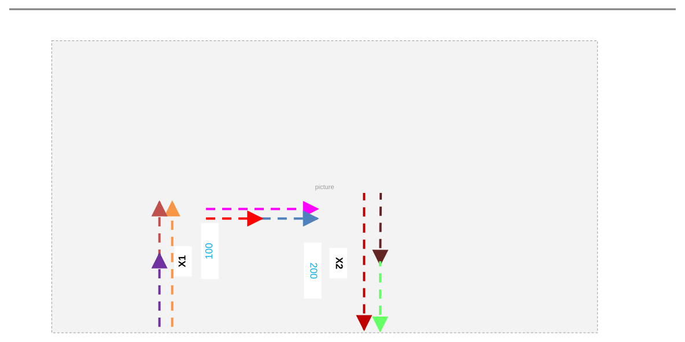

### Slide 55 <!-- slide 55 -->

| Test ID | 10 | Network Type | Engineering (Non-spanning Line Events) |
| --- | --- | --- | --- |
| Test | Reassign part of a route to another line - 2. |  |  |

| EventID | From Date | To Date | RouteID | From Measure | To Measure | Loc Error |
| --- | --- | --- | --- | --- | --- | --- |
| 001 | 1/1/2000 | Null | X1 | 2 | 6 | No Error |
| 002 | 1/1/2000 | Null | X1 | 2 | 4 | No Error |
| 003 | 1/1/2000 | Null | X1 | 4 | 6 | No Error |
| 004 | 1/1/2000 | 12/31/2023 | 1B | 3 | 5 | No Error |
| 005 | 1/1/2000 | 12/31/2023 | 1B | 3 | 4 | No Error |
| 006 | 1/1/2000 | 12/31/2023 | 1B | 4 | 5 | No Error |
| 007 | 1/1/2000 | Null | X2 | 24 | 28 | No Error |
| 008 | 1/1/2000 | Null | X2 | 24 | 26 | No Error |
| 009 | 1/1/2000 | Null | X2 | 26 | 28 | No Error |
| 004 | 12/31/2023 | Null | 1B | 3 | 5 | No Error |
| 005 | 12/31/2023 | Null | 1B | 3 | 4 | No Error |
| 006 | 12/31/2023 | Null | 1B | 4 | 5 | No Error |

| R Name | L NAME | From Date | To Date | Line Order | From Measure | To Measure |
| --- | --- | --- | --- | --- | --- | --- |
| X1 | L3 | 1/1/2000 | Null | 100 | 2 | 6 |
| X2 | L3 | 1/1/2000 | 12/31/2023 | 200 | 24 | 28 |
| 1B | L1 | 1/1/2000 | 12/31/2023 | 100 | 4 | 5 |
| 2B | L1 | 1/1/2000 | Null | 200 | 4 | 8 |
| 3B | L1 | 1/1/2000 | Null | 300 | 0 | 2 |
| X2 | L3 | 12/31/2023 | Null | 300 | 24 | 28 |
| X1 | L3 | 12/31/2023 | Null | 100 | 2 | 6 |
| 1B-New | L3 | 12/31/2023 | Null | 200 | 5 | 14 |
| 1B | L1 | 12/31/2023 | Null | 100 | 3 | 5 |

[figure: 100 · 200 · X1 · X2]

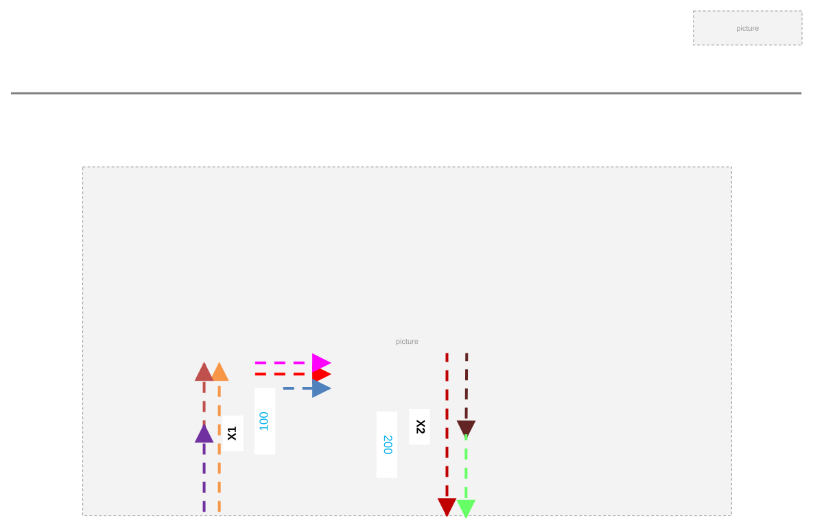

### Slide 56 <!-- slide 56 -->

| Test ID | 11 | Network Type | Engineering (Non-spanning Line Events) |
| --- | --- | --- | --- |
| Test | Reassign all the routes in a line to another line on right, adjusting measures. |  |  |

| EventID | From Date | To Date | RouteID | From Measure | To Measure | Loc Error |
| --- | --- | --- | --- | --- | --- | --- |
| 001 | 1/1/2000 | Null | 1A | 2 | 4 | No Error |
| 002 | 1/1/2000 | Null | 1A | 2 | 3 | No Error |
| 003 | 1/1/2000 | Null | 1A | 3 | 4 | No Error |
| 004 | 1/1/2000 | Null | 2A | 0 | 2 | No Error |
| 005 | 1/1/2000 | Null | 2A | 0 | 1 | No Error |
| 006 | 1/1/2000 | Null | 2A | 1 | 2 | No Error |
| 007 | 1/1/2000 | Null | 3A | 0 | 4 | No Error |
| 008 | 1/1/2000 | Null | 3A | 0 | 2 | No Error |
| 009 | 1/1/2000 | Null | 3A | 2 | 4 | No Error |

| R Name | L NAME | From Date | To Date | Line Order | From Measure | To Measure |
| --- | --- | --- | --- | --- | --- | --- |
| 1A | L0 | 1/1/2000 | Null | 100 | 2 | 4 |
| 2A | L0 | 1/1/2000 | Null | 200 | 0 | 2 |
| 3A | L0 | 1/1/2000 | Null | 300 | 0 | 4 |
| 1B | L1 | 1/1/2000 | Null | 100 | 3 | 5 |
| 2B | L1 | 1/1/2000 | Null | 200 | 4 | 8 |
| 3B | L1 | 1/1/2000 | Null | 300 | 0 | 2 |
| 1C | L2 | 1/1/2000 | Null | 100 | 4 | 6 |
| 2C | L2 | 1/1/2000 | Null | 200 | 2 | 6 |
| 3C | L2 | 1/1/2000 | Null | 300 | 4 | 8 |

[figure: 1A, 100 · 2A, 200 · 3A, 300 · 1B, 100 · 2B, 200 · 3B, 300 · 2C, 200 · 1C, 100 · 3C, 300 · 4 · 2 · 0 · 3 · 1 · 5 · 8 · 6]

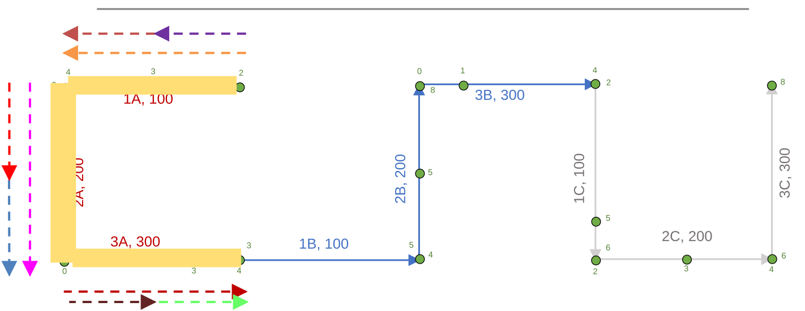

### Slide 57 <!-- slide 57 -->

| Test ID | 11 | Network Type | Engineering (Non-spanning Line Events) |
| --- | --- | --- | --- |
| Test | Reassign all the routes in a line to another line on right, adjusting measures. |  |  |

| EventID | From Date | To Date | RouteID | From Measure | To Measure | Loc Error |
| --- | --- | --- | --- | --- | --- | --- |
| 001 | 1/1/2000 | 12/31/2010 | 1A | 2 | 4 | No Error |
| 002 | 1/1/2000 | 12/31/2010 | 1A | 2 | 3 | No Error |
| 003 | 1/1/2000 | 12/31/2010 | 1A | 3 | 4 | No Error |
| 004 | 1/1/2000 | 12/31/2010 | 2A | 0 | 2 | No Error |
| 005 | 1/1/2000 | 12/31/2010 | 2A | 0 | 1 | No Error |
| 006 | 1/1/2000 | 12/31/2010 | 2A | 1 | 2 | No Error |
| 007 | 1/1/2000 | 12/31/2010 | 3A | 0 | 4 | No Error |
| 008 | 1/1/2000 | 12/31/2010 | 3A | 0 | 2 | No Error |
| 009 | 1/1/2000 | 12/31/2010 | 3A | 2 | 4 | No Error |
| 001 | 12/31/2010 | Null | 1A | 2 | 4 | Partial Match for the To Measure |
| 002 | 12/31/2010 | Null | 1A | 2 | 3 | No Error |
| 003 | 12/31/2010 | Null | 1A | 3 | 4 | Partial Match for the To Measure |
| 004 | 12/31/2010 | Null | 2A | 0 | 2 | Route Location not Found |
| 005 | 12/31/2010 | Null | 2A | 0 | 1 | Route Location not Found |
| 006 | 12/31/2010 | Null | 2A | 1 | 2 | Route Location not Found |
| 007 | 12/31/2010 | Null | 3A | 0 | 4 | Partial Match for the From Measure |
| 008 | 12/31/2010 | Null | 3A | 0 | 2 | Partial Match for the From Measure |
| 009 | 12/31/2010 | Null | 3A | 2 | 4 | No Error |

| R Name | L NAME | From Date | To Date | Line Order | F0rom Measure | To Measure |
| --- | --- | --- | --- | --- | --- | --- |
| 1A | L0 | 1/1/2000 | 12/31/2010 | 100 | 2 | 4 |
| 2A | L0 | 1/1/2000 | 12/31/2010 | 200 | 0 | 2 |
| 3A | L0 | 1/1/2000 | 12/31/2010 | 300 | 0 | 4 |
| 1A | L1 | 12/31/2010 | Null | 100 | 2 | 3 |
| 2A | L1 | 12/31/2010 | Null | 200 | 10 | 20 |
| 3A | L1 | 12/31/2010 | Null | 300 | 1 | 4 |
| 1B | L1 | 1/1/2000 | 12/31/2010 | 100 | 3 | 5 |
| 1B | L1 | 12/31/2010 | Null | 400 | 3 | 5 |
| 2B | L1 | 1/1/2000 | 12/31/2010 | 200 | 4 | 8 |
| 2B | L1 | 12/31/2010 | Null | 500 | 4 | 8 |
| 3B | L1 | 1/1/2000 | 12/31/2010 | 300 | 0 | 2 |
| 3B | L1 | 12/31/2010 | Null | 600 | 0 | 2 |
| 1C | L2 | 1/1/2000 | Null | 100 | 4 | 6 |
| 2C | L2 | 1/1/2000 | Null | 200 | 2 | 6 |
| 3C | L2 | 1/1/2000 | Null | 300 | 4 | 8 |

[figure: 1A, 100 · 2A, 200 · 3A, 300 · 1B, 400 · 2B, 500 · 3B, 600 · 2C, 200 · 1C, 100 · 3C, 300 · 3 · 2 · 20 · 10 · 1 · 4 · 5 · 8 · 0 · 6]

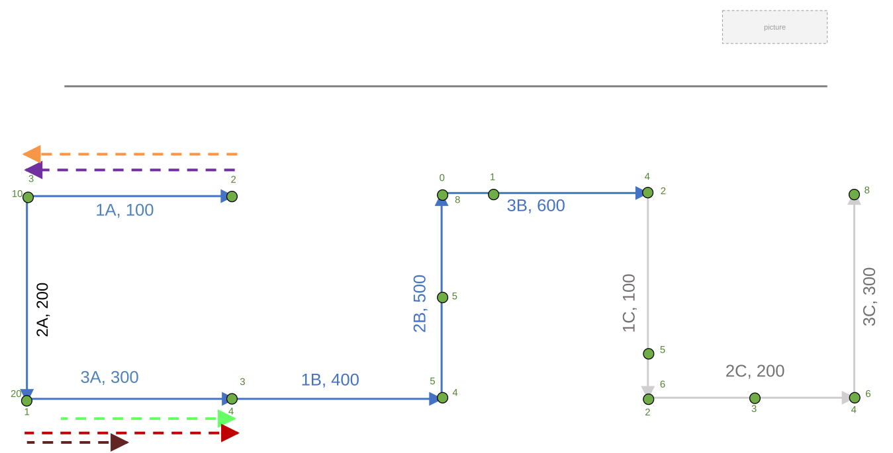

### Slide 58 <!-- slide 58 -->

| Recalibrate Source | Yes |
| --- | --- |
| Recalibrate Target | Yes |
| Date | 12/31/2030 |
|  |  |

{5940675A-B579-460E-94D1-54222C63F5DA}Test ID
12
Network Type
Engineering (Non-spanning Line Events)
Test
Reassign partial routes in a line to a new line. Change names of partial routes. Recalibrate source route downstream

{5940675A-B579-460E-94D1-54222C63F5DA}EventID
From
Date
To
Date
RouteID
From
Measure
To
Measure
Loc
Error
001
1/1/2000
Null
1A
2
4
No Error
002
1/1/2000
Null
1A
2
3
No Error
003
1/1/2000
Null
1A
3
4
No Error
004
1/1/2000
Null
2A
0
2
No Error
005
1/1/2000
Null
2A
0
1
No Error
006
1/1/2000
Null
2A
1
2
No Error
007
1/1/2000
Null
3A
0
4
No Error
008
1/1/2000
Null
3A
0
2
No Error
009
1/1/2000
Null
3A
2
4
No Error
{5940675A-B579-460E-94D1-54222C63F5DA}R Name
L NAME
From  Date
To Date
Line Order
From
Measure
To
Measure
1A
L0
1/1/2000
Null
100
2
4
2A
L0
1/1/2000
Null
200
0
2
3A
L0
1/1/2000
Null
300
0
4
1B
L1
1/1/2000
Null
100
3
5
2B
L1
1/1/2000
Null
200
4
8
3B
L1
1/1/2000
Null
300
0
2
1C
L2
1/1/2000
Null
100
4
6
2C
L2
1/1/2000
Null
200
2
6
3C
L2
1/1/2000
Null
300
4
8

[figure: New Line · 1A, 100 · 2A, 200 · 3A, 300 · 1B, 100 · 2B, 200 · 3B, 300 · 2C, 200 · 1C, 100 · 3C, 300 · 4 · 2 · 0 · 3 · 1 · 5 · 8 · 6]

### Slide 59 <!-- slide 59 -->

{5940675A-B579-460E-94D1-54222C63F5DA}Test ID
12
Network Type
Engineering (Non-spanning Line Events)
Test
Reassign partial routes in a line to a new line. Change names of partial routes. Recalibrate source routes downstream.

3A LineX, 300

{5940675A-B579-460E-94D1-54222C63F5DA}EventID
From
Date
To
Date
RouteID
From
Measure
To
Measure
Loc
Error
001
1/1/2000
12/31/2010
1A
2
4
No Error
002
1/1/2000
12/31/2010
1A
2
3
No Error
003
1/1/2000
12/31/2010
1A
3
4
No Error
004
1/1/2000
12/31/2010
2A
0
2
No Error
005
1/1/2000
12/31/2010
2A
0
1
No Error
006
1/1/2000
12/31/2010
2A
1
2
No Error
007
1/1/2000
12/31/2010
3A
0
4
No Error
008
1/1/2000
12/31/2010
3A
0
2
No Error
009
1/1/2000
12/31/2010
3A
2
4
No Error
001
12/31/2030
Null
1A
2
4
No Error
002
12/31/2030
Null
1A
2
3
No Error
003
12/31/2030
Null
1A
3
4
No Error
004
12/31/2030
Null
2A
0
2
No Error
005
12/31/2030
Null
2A
0
1
No Error
006
12/31/2030
Null
2A
1
2
No Error
007
12/31/2030
Null
3A
0
4
Partial Match for the To Measure
008
12/31/2030
Null
3A
0
2
No Error
009
12/31/2030
Null
3A
2
4
Partial Match for the To Measure
{5940675A-B579-460E-94D1-54222C63F5DA}R Name
L NAME
From  Date
To Date
Line Order
From
Measure
To
Measure
1A
L0
1/1/2000
12/31/2030
100
2
4
2A
L0
1/1/2010
12/31/2030
200
0
2
3A
L0
1/1/2020
12/31/2030
300
0
4
1A
LX
12/31/2030
Null
100
2
4
2A
LX
12/31/2030
Null
200
0
2
3A LineX
LX
12/31/2030
Null
300
0
2
3A
L0
12/31/2030
Null
100
0
2
1B
L1
1/1/2002
Null
100
3
5
2B
L1
1/1/2005
Null
200
4
8
3B
L1
1/1/2010
Null
300
0
2
1C
L2
1/1/2020
12/31/2030
100
4
6
2C
L2
1/1/2020
12/31/2030
200
2
6
3C
L2
1/1/2020
12/31/2030
300
4
8

[figure: 1A, 100 · 2A, 200 · 1B, 100 · 2B, 200 · 3B, 300 · 2C, 200 · 1C, 100 · 3C, 300 · 4 · 2 · 0 · 1 · 3 · 5 · 8 · 6 · 3A, 100]

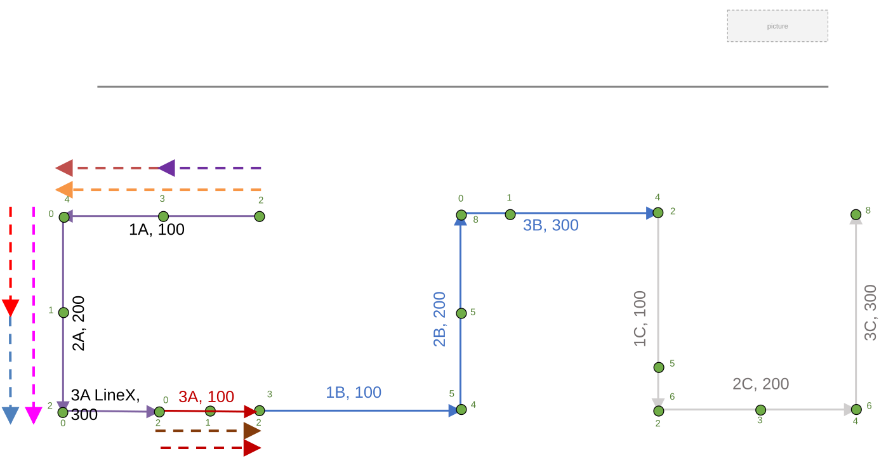

### Slide 60 <!-- slide 60 -->

{5940675A-B579-460E-94D1-54222C63F5DA}Test ID
13
Network Type
Engineering (Non-spanning Line Events)
Test
Reassign to fill the gap in a line by transferring route. Recalibrate source routes downstream

{5940675A-B579-460E-94D1-54222C63F5DA}Recalibrate Source
No
Recalibrate Target
Yes
Date
12/31/2023

{5940675A-B579-460E-94D1-54222C63F5DA}EventID
From
Date
To
Date
RouteID
From
Measure
To
Measure
Loc
Error
001
1/1/2000
Null
X1
2
6
No Error
002
1/1/2000
Null
X1
2
4
No Error
003
1/1/2000
Null
X1
4
6
No Error
004
1/1/2000
Null
1B
3
5
No Error
005
1/1/2000
Null
1B
3
4
No Error
006
1/1/2000
Null
1B
4
5
No Error
007
1/1/2000
Null
X2
24
28
No Error
008
1/1/2000
Null
X2
24
26
No Error
009
1/1/2000
Null
X2
26
28
No Error
{5940675A-B579-460E-94D1-54222C63F5DA}R Name
L NAME
From  Date
To Date
Line Order
From
Measure
To
Measure
X1
L3
1/1/2000
Null
100
2
6
X2
L3
1/1/2000
Null
200
24
28
1B
L1
1/1/2000
Null
100
3
5
2B
L1
1/1/2000
Null
200
4
8
3B
L1
1/1/2000
Null
300
0
2

[figure: 100 · X1 · X2 · 200]

### Slide 61 <!-- slide 61 -->

{5940675A-B579-460E-94D1-54222C63F5DA}EventID
From
Date
To
Date
RouteID
From
Measure
To
Measure
Loc
Error
001
1/1/2000
Null
X1
2
6
No Error
002
1/1/2000
Null
X1
2
4
No Error
003
1/1/2000
Null
X1
4
6
No Error
004
1/1/2000
12/31/2023
1B
3
5
No Error
005
1/1/2000
12/31/2023
1B
3
4
No Error
006
1/1/2000
12/31/2023
1B
4
5
No Error
007
1/1/2000
Null
X2
24
28
No Error
008
1/1/2000
Null
X2
24
26
No Error
009
1/1/2000
Null
X2
26
28
No Error
004
12/31/2023
Null
1B
3
5
Route Location not Found
005
12/31/2023
Null
1B
3
4
Route Location not Found
006
12/31/2023
Null
1B
4
5
Route Location Not Found
{5940675A-B579-460E-94D1-54222C63F5DA}Test ID
13
Network Type
Engineering (Non-spanning Line Events)
Test
Reassign to fill the gap in a line by transferring route. Recalibrate source routes downstream

{5940675A-B579-460E-94D1-54222C63F5DA}R Name
L NAME
From  Date
To Date
Line Order
From
Measure
To
Measure
X1
L3
1/1/2000
Null
100
2
6
X2
L3
1/1/2000
12/31/2023
200
24
28
1B
L1
1/1/2000
12/31/2023
100
4
5
2B
L1
1/1/2000
Null
200
4
8
3B
L1
1/1/2000
12/31/2023
300
0
2
X2
L3
12/31/2023
Null
300
24
28
1B-New
L3
12/31/2023
Null
200
3
4
1B
L1
12/31/2023
Null
100
0
2

[figure: 100 · 200 · X1 · X2 · 0 · 1]

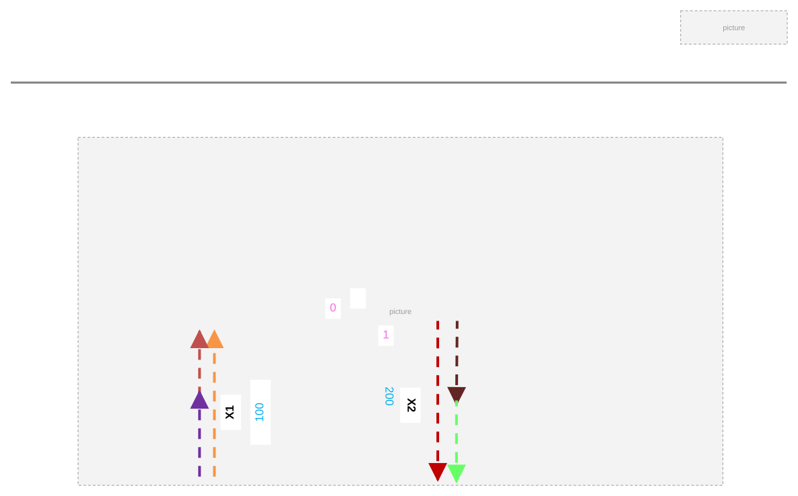

### Slide 62 <!-- slide 62 -->

{5940675A-B579-460E-94D1-54222C63F5DA}Recalibrate Source
Yes
Recalibrate Target
Yes
Date
12/31/2010

{5940675A-B579-460E-94D1-54222C63F5DA}Test ID
14
Network Type
Engineering (Non-spanning Line Events)
Test
Reassign all routes to a new line.  Adjust all measures to overlap previous measures

{5940675A-B579-460E-94D1-54222C63F5DA}EventID
From
Date
To
Date
RouteID
From
Measure
To
Measure
Loc
Error
001
1/1/2000
Null
1A
2
4
No Error
002
1/1/2000
Null
1A
2
3
No Error
003
1/1/2000
Null
1A
3
4
No Error
004
1/1/2000
Null
2A
0
2
No Error
005
1/1/2000
Null
2A
0
1
No Error
006
1/1/2000
Null
2A
1
2
No Error
007
1/1/2000
Null
3A
0
4
No Error
008
1/1/2000
Null
3A
0
2
No Error
009
1/1/2000
Null
3A
2
4
No Error
{5940675A-B579-460E-94D1-54222C63F5DA}R Name
L NAME
From  Date
To Date
Line Order
From
Measure
To
Measure
1A
L0
1/1/2000
Null
100
2
4
2A
L0
1/1/2000
Null
200
0
2
3A
L0
1/1/2000
Null
300
0
4
1B
L1
1/1/2000
Null
100
3
5
2B
L1
1/1/2000
Null
200
4
8
3B
L1
1/1/2000
Null
300
0
2
1C
L2
1/1/2000
Null
100
4
6
2C
L2
1/1/2000
Null
200
2
6
3C
L2
1/1/2000
Null
300
4
8

[figure: 1A, 100 · 2A, 200 · 3A, 300 · 1B, 100 · 2B, 200 · 3B, 300 · 2C, 200 · 1C, 100 · 3C, 300 · 4 · 2 · 0 · 3 · 1 · 5 · 8 · 6]

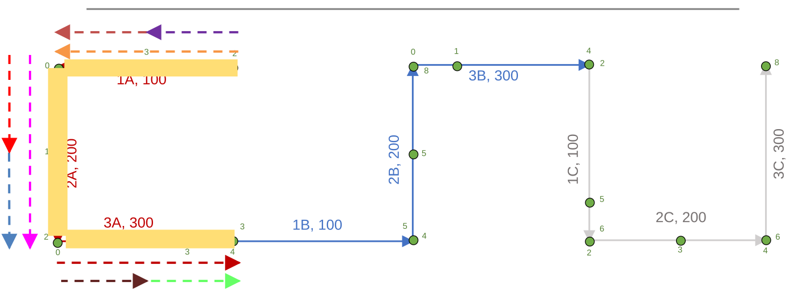

### Slide 63 <!-- slide 63 -->

{5940675A-B579-460E-94D1-54222C63F5DA}Recalibrate Source
Yes
Recalibrate Target
Yes
Date
12/31/2010

{5940675A-B579-460E-94D1-54222C63F5DA}Test ID
14
Network Type
Engineering (Non-spanning Line Events)
Test
Reassign all routes to a new line.  Adjust all measures to overlap previous measures

{5940675A-B579-460E-94D1-54222C63F5DA}R Name
L NAME
From  Date
To Date
Line Order
From
Measure
To
Measure
1A
L0
1/1/2000
12/31/2030
100
2
4
2A
L0
1/1/2000
12/31/2030
200
0
2
3A
L0
1/1/2000
12/31/2030
300
0
4
1A
L_New
12/31/2030
Null
100
1
5
2A
L_New
12/31/2030
Null
200
0
3
3A
L_New
12/31/2030
Null
300
0
5
1B
L1
1/1/2000
Null
100
3
5
2B
L1
1/1/2000
Null
200
4
8
3B
L1
1/1/2000
Null
300
0
2
1C
L2
1/1/2000
Null
100
4
6
2C
L2
1/1/2000
Null
200
2
6
3C
L2
1/1/2000
Null
300
4
8
{5940675A-B579-460E-94D1-54222C63F5DA}EventID
From
Date
To
Date
RouteID
From
Measure
To
Measure
Loc
Error
001
1/1/2000
12/31/2030
1A
2
4
No Error
002
1/1/2000
12/31/2030
1A
2
3
No Error
003
1/1/2000
12/31/2030
1A
3
4
No Error
004
1/1/2000
12/31/2030
2A
0
2
No Error
005
1/1/2000
12/31/2030
2A
0
1
No Error
006
1/1/2000
12/31/2030
2A
1
2
No Error
007
1/1/2000
12/31/2030
3A
0
4
No Error
008
1/1/2000
12/31/2030
3A
0
2
No Error
009
1/1/2000
12/31/2030
3A
2
4
No Error
001
12/31/2030
Null
1A
2
4
No Error
002
12/31/2030
Null
1A
2
3
No Error
003
12/31/2030
Null
1A
3
4
No Error
004
12/31/2030
Null
2A
0
2
No Error
005
12/31/2030
Null
2A
0
1
No Error
006
12/31/2030
Null
2A
1
2
No Error
007
12/31/2030
Null
3A
0
4
No Error
008
12/31/2030
Null
3A
0
2
No Error
009
12/31/2030
Null
3A
2
4
No Error

[figure: 1A, 100 · 2A, 200 · 3A, 300 · 1B, 100 · 2B, 200 · 3B, 300 · 2C, 200 · 1C, 100 · 3C, 300 · 5 · 1 · 3 · 0 · 4 · 2 · 8 · 6]

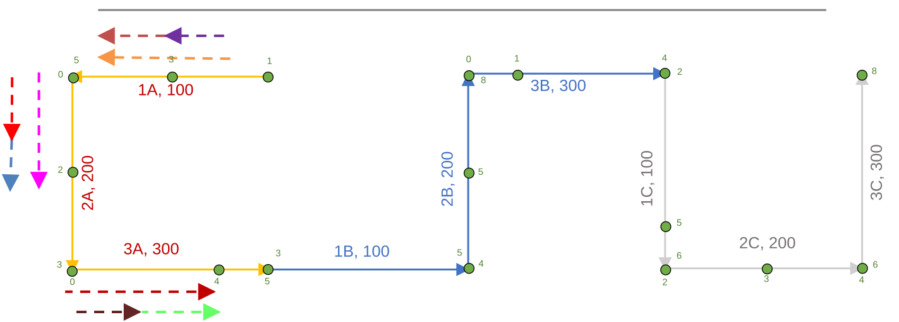

### Slide 64 <!-- slide 64 -->

{5940675A-B579-460E-94D1-54222C63F5DA}Recalibrate Source
Yes
Recalibrate Target
Yes
Date
12/31/2010

{5940675A-B579-460E-94D1-54222C63F5DA}Test ID
15
Network Type
Engineering (Non-spanning Line Events)
Test
Reassign Routes to a new line.  Routes are irregularly portioned.  Do not transfer calibration points.

{5940675A-B579-460E-94D1-54222C63F5DA}EventID
From
Date
To
Date
RouteID
From
Measure
To
Measure
Loc
Error
001
1/1/2000
Null
1A
2
4
No Error
002
1/1/2000
Null
1A
2
3
No Error
003
1/1/2000
Null
1A
3
4
No Error
004
1/1/2000
Null
2A
0
2
No Error
005
1/1/2000
Null
2A
0
1
No Error
006
1/1/2000
Null
2A
1
2
No Error
007
1/1/2000
Null
3A
0
4
No Error
008
1/1/2000
Null
3A
0
2
No Error
009
1/1/2000
Null
3A
2
4
No Error
{5940675A-B579-460E-94D1-54222C63F5DA}R Name
L NAME
From  Date
To Date
Line Order
From
Measure
To
Measure
1A
L0
1/1/2000
Null
100
2
4
2A
L0
1/1/2000
Null
200
0
2
3A
L0
1/1/2000
Null
300
0
4
1B
L1
1/1/2000
Null
100
3
5
2B
L1
1/1/2000
Null
200
4
8
3B
L1
1/1/2000
Null
300
0
2
1C
L2
1/1/2000
Null
100
4
6
2C
L2
1/1/2000
Null
200
2
6
3C
L2
1/1/2000
Null
300
4
8

[figure: 1A, 100 · 2A, 200 · 3A, 300 · 1B, 100 · 2B, 200 · 3B, 300 · 2C, 200 · 1C, 100 · 3C, 300 · 4 · 2 · 0 · 3 · 1 · 5 · 8 · 6]

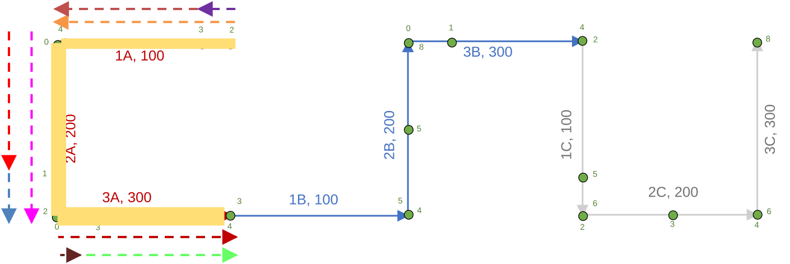

### Slide 65 <!-- slide 65 -->

{5940675A-B579-460E-94D1-54222C63F5DA}Recalibrate Source
Yes
Recalibrate Target
Yes
Date
12/31/2010

{5940675A-B579-460E-94D1-54222C63F5DA}Test ID
15
Network Type
Engineering (Non-spanning Line Events)
Test
Reassign Routes to a new line.  Routes are irregularly portioned.  Do not transfer calibration points.

{5940675A-B579-460E-94D1-54222C63F5DA}EventID
From
Date
To
Date
RouteID
From
Measure
To
Measure
Loc
Error
001
1/1/2000
12/31/2010
1A
2
4
No Error
002
1/1/2000
12/31/2010
1A
2
3
No Error
003
1/1/2000
12/31/2010
1A
3
4
No Error
004
1/1/2000
12/31/2010
2A
0
2
No Error
005
1/1/2000
12/31/2010
2A
0
1
No Error
006
1/1/2000
12/31/2010
2A
1
2
No Error
007
1/1/2000
12/31/2010
3A
0
4
No Error
008
1/1/2000
12/31/2010
3A
0
2
No Error
009
1/1/2000
12/31/2010
3A
2
4
No Error
001
12/31/2030
Null
1A
2
4
No Error
002
12/31/2030
Null
1A
2
3
No Error
003
12/31/2030
Null
1A
3
4
No Error
004
12/31/2030
Null
2A
0
2
No Error
005
12/31/2030
Null
2A
0
1
No Error
006
12/31/2030
Null
2A
1
2
No Error
007
12/31/2030
Null
3A
0
4
No Error
008
12/31/2030
Null
3A
0
2
No Error
009
12/31/2030
Null
3A
2
4
No Error
{5940675A-B579-460E-94D1-54222C63F5DA}R Name
L NAME
From  Date
To Date
Line Order
From
Measure
To
Measure
1A
L0
1/1/2000
12/31/2010
100
2
4
2A
L0
1/1/2000
12/31/2010
200
0
2
3A
L0
1/1/2000
12/31/2010
300
0
4
1A
L_New
12/31/2010
Null
100
2
4
2A
L_New
12/31/2010
Null
200
0
2
3A
L_New
12/31/2010
Null
300
0
4
1B
L1
1/1/2000
Null
100
3
5
2B
L1
1/1/2000
Null
200
4
8
3B
L1
1/1/2000
Null
300
0
2
1C
L2
1/1/2000
Null
100
4
6
2C
L2
1/1/2000
Null
200
2
6
3C
L2
1/1/2000
Null
300
4
8

[figure: 1A, 100 · 2A, 200 · 3A, 300 · 1B, 100 · 2B, 200 · 3B, 300 · 2C, 200 · 1C, 100 · 3C, 300 · 4 · 2 · 0 · 3 · 5 · 8 · 1 · 6]

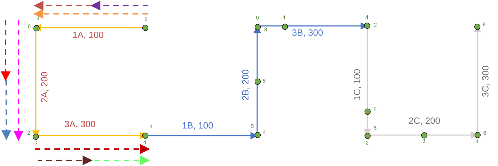

### Slide 66 <!-- slide 66 -->

{5940675A-B579-460E-94D1-54222C63F5DA}Test ID
1
Network Type
Engineering (Point Events)
Test
Reassign all the routes in a line to another line on right, transferring routes and measures.

{5940675A-B579-460E-94D1-54222C63F5DA}EventID
From
Date
To
Date
RouteID
Measure
Loc
Error
001
1/1/2000
Null
1A
2
No Error
002
1/1/2000
Null
1A
3
No Error
003
1/1/2000
Null
1A
4
No Error
004
1/1/2000
Null
2A
0
No Error
005
1/1/2000
Null
2A
1
No Error
006
1/1/2000
Null
2A
2
No Error
007
1/1/2000
Null
3A
0
No Error
008
1/1/2000
Null
3A
2
No Error
009
1/1/2000
Null
3A
4
No Error

{5940675A-B579-460E-94D1-54222C63F5DA}R Name
L NAME
From  Date
To Date
Line Order
From
Measure
To
Measure
1A
L0
1/1/2000
Null
100
2
4
2A
L0
1/1/2000
Null
200
0
2
3A
L0
1/1/2000
Null
300
0
4
1B
L1
1/1/2000
Null
100
3
5
2B
L1
1/1/2000
Null
200
4
8
3B
L1
1/1/2000
Null
300
0
2
1C
L2
1/1/2000
Null
100
4
6
2C
L2
1/1/2000
Null
200
2
6
3C
L2
1/1/2000
Null
300
4
8
{5940675A-B579-460E-94D1-54222C63F5DA}Recalibrate Source
Yes
Recalibrate Target
Yes
Date
12/31/2010

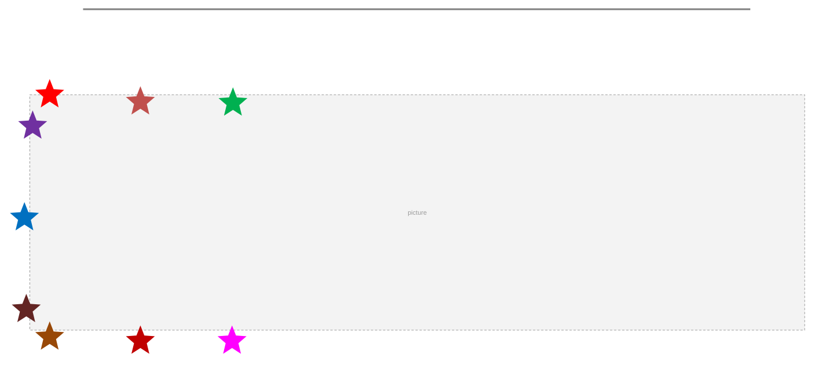

### Slide 67 <!-- slide 67 -->

{5940675A-B579-460E-94D1-54222C63F5DA}Test ID
1
Network Type
Engineering (Point Events)
Test
Reassign all the routes in a line to another line on right, transferring routes and measures.

{5940675A-B579-460E-94D1-54222C63F5DA}EventID
From
Date
To
Date
RouteID
Measure
Loc
Error
001
1/1/2000
12/31/2010
1A
2
No Error
002
1/1/2000
12/31/2010
1A
3
No Error
003
1/1/2000
12/31/2010
1A
4
No Error
004
1/1/2000
12/31/2010
2A
0
No Error
005
1/1/2000
12/31/2010
2A
1
No Error
006
1/1/2000
12/31/2010
2A
2
No Error
007
1/1/2000
12/31/2010
3A
0
No Error
008
1/1/2000
12/31/2010
3A
2
No Error
009
1/1/2000
12/31/2010
3A
4
No Error
001
12/31/2010
Null
1A
2
No Error
002
12/31/2010
Null
1A
3
No Error
003
12/31/2010
Null
1A
4
No Error
004
12/31/2010
Null
2A
0
No Error
005
12/31/2010
Null
2A
1
No Error
006
12/31/2010
Null
2A
2
No Error
007
12/31/2010
Null
3A
0
No Error
008
12/31/2010
Null
3A
2
No Error
009
12/31/2010
Null
3A
4
No Error

{5940675A-B579-460E-94D1-54222C63F5DA}R Name
L NAME
From  Date
To Date
Line Order
From
Measure
To
Measure
1A
L0
1/1/2000
12/31/2010
100
2
4
2A
L0
1/1/2000
12/31/2010
200
0
2
3A
L0
1/1/2000
12/31/2010
300
0
4
1B
L1
1/1/2000
12/31/2010
100
3
5
2B
L1
1/1/2000
12/31/2010
200
4
8
3B
L1
1/1/2000
12/31/2010
300
0
2
1A
L1
12/31/2010
Null
100
2
4
2A
L1
12/31/2010
Null
200
0
2
3A
L1
12/31/2010
Null
300
0
4
1B
L1
12/31/2010
Null
400
3
5
2B
L1
12/31/2010
Null
500
4
8
3B
L1
12/31/2010
Null
600
0
2
1C
L2
1/1/2000
Null
100
4
6
2C
L2
1/1/2000
Null
200
2
6
3C
L2
1/1/2000
Null
300
4
8

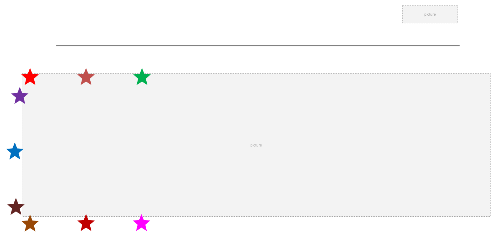

### Slide 68 <!-- slide 68 -->

{5940675A-B579-460E-94D1-54222C63F5DA}Recalibrate Source
Yes
Recalibrate Target
Yes
Date
12/31/2010

{5940675A-B579-460E-94D1-54222C63F5DA}Test ID
2
Network Type
Engineering (Point Events)
Test
Reassign all the routes in a line to another line on right, 2/3 route names and measures maintained. The first route in the line has changed.

{5940675A-B579-460E-94D1-54222C63F5DA}EventID
From
Date
To
Date
RouteID
Measure
Loc
Error
001
1/1/2000
Null
1A
2
No Error
002
1/1/2000
Null
1A
3
No Error
003
1/1/2000
Null
1A
4
No Error
004
1/1/2000
Null
2A
0
No Error
005
1/1/2000
Null
2A
1
No Error
006
1/1/2000
Null
2A
2
No Error
007
1/1/2000
Null
3A
0
No Error
008
1/1/2000
Null
3A
2
No Error
009
1/1/2000
Null
3A
4
No Error

{5940675A-B579-460E-94D1-54222C63F5DA}R Name
L NAME
From  Date
To Date
Line Order
From
Measure
To
Measure
1A
L0
1/1/2000
12/31/2010
100
2
4
2A
L0
1/1/2000
12/31/2010
200
0
2
3A
L0
1/1/2000
12/31/2010
300
0
4
1B
L1
1/1/2000
12/31/2010
100
3
5
2B
L1
1/1/2000
12/31/2010
200
4
8
3B
L1
1/1/2000
12/31/2010
300
0
2
1A
L1
12/31/2010
Null
100
2
4
2A
L1
12/31/2010
Null
200
0
2
3A
L1
12/31/2010
Null
300
0
4
1B
L1
12/31/2010
Null
400
3
5
2B
L1
12/31/2010
Null
500
4
8
3B
L1
12/31/2010
Null
600
0
2
1C
L2
1/1/2000
Null
100
4
6
2C
L2
1/1/2000
Null
200
2
6
3C
L2
1/1/2000
Null
300
4
8

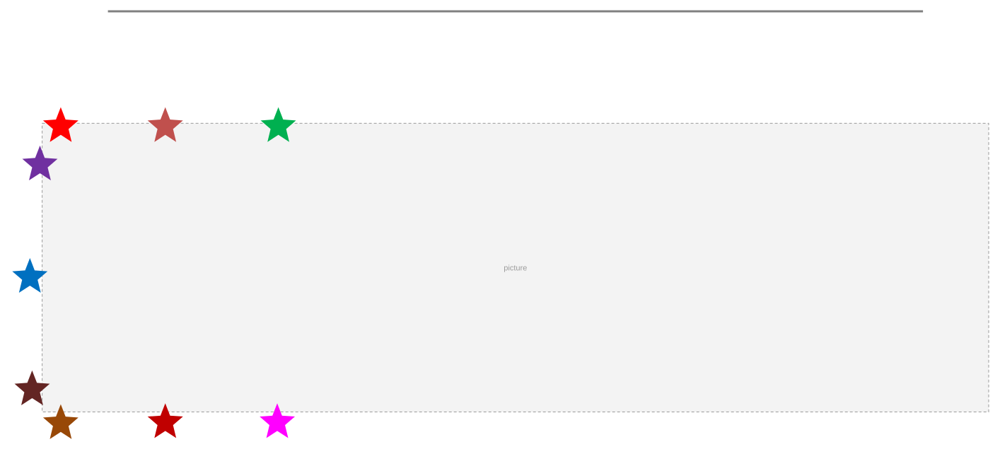

### Slide 69 <!-- slide 69 -->

{5940675A-B579-460E-94D1-54222C63F5DA}Test ID
2
Network Type
Engineering (Point Events)
Test
Reassign all the routes in a line to another line on right, 2/3 route names and measures maintained. The first route in the line has changed.

{5940675A-B579-460E-94D1-54222C63F5DA}EventID
From
Date
To
Date
RouteID
Measure
Loc
Error
001
1/1/2000
12/31/2010
1A
2
No Error
002
1/1/2000
12/31/2010
1A
3
No Error
003
1/1/2000
12/31/2010
1A
4
No Error
004
1/1/2000
12/31/2010
2A
0
No Error
005
1/1/2000
12/31/2010
2A
1
No Error
006
1/1/2000
12/31/2010
2A
2
No Error
007
1/1/2000
12/31/2010
3A
0
No Error
008
1/1/2000
12/31/2010
3A
2
No Error
009
1/1/2000
12/31/2010
3A
4
No Error
001
12/31/2010
Null
1A
2
Route not Found
002
12/31/2010
Null
1A
3
Route not Found
003
12/31/2010
Null
1A
4
Route not Found
004
12/31/2010
Null
2A
0
No Error
005
12/31/2010
Null
2A
1
No Error
006
12/31/2010
Null
2A
2
No Error
007
12/31/2010
Null
3A
0
No Error
008
12/31/2010
Null
3A
2
No Error
009
12/31/2010
Null
3A
4
No Error
{5940675A-B579-460E-94D1-54222C63F5DA}R Name
L NAME
From  Date
To Date
Line Order
From
Measure
To
Measure
1A
L0
1/1/2000
12/31/2010
100
2
4
2A
L0
1/1/2000
12/31/2010
200
0
2
3A
L0
1/1/2000
12/31/2010
300
0
4
1B
L1
1/1/2000
12/31/2010
100
3
5
2B
L1
1/1/2000
12/31/2010
200
4
8
3B
L1
1/1/2000
12/31/2010
300
0
2
1A-Change
L1
12/31/2010
Null
100
5
8
2A
L1
12/31/2010
Null
200
0
2
3A
L1
12/31/2010
Null
300
0
4
1B
L1
12/31/2010
Null
400
3
5
2B
L1
12/31/2010
Null
500
4
8
3B
L1
12/31/2010
Null
600
0
2
1C
L2
1/1/2000
Null
100
4
6
2C
L2
1/1/2000
Null
200
2
6
3C
L2
1/1/2000
Null
300
4
8

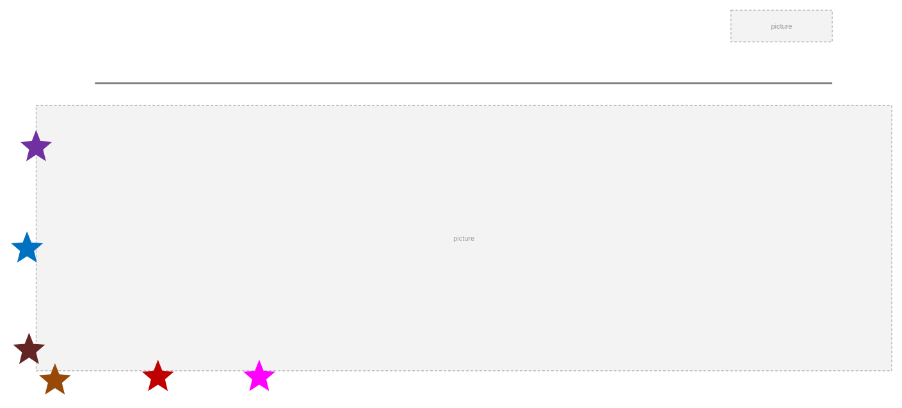

### Slide 70 <!-- slide 70 -->

{5940675A-B579-460E-94D1-54222C63F5DA}Recalibrate Source
Yes
Recalibrate Target
Yes
Date
12/31/2010

{5940675A-B579-460E-94D1-54222C63F5DA}Test ID
3
Network Type
Engineering (Point Events)
Test
Reassign in the middle spanning routes to the line on the right.  Rename one route

{5940675A-B579-460E-94D1-54222C63F5DA}EventID
From
Date
To
Date
RouteID
Measure
Loc
Error
001
1/1/2000
Null
1A
2
No Error
002
1/1/2000
Null
1A
3
No Error
003
1/1/2000
Null
1A
4
No Error
004
1/1/2000
Null
2A
0
No Error
005
1/1/2000
Null
2A
1
No Error
006
1/1/2000
Null
2A
2
No Error
007
1/1/2000
Null
3A
0
No Error
008
1/1/2000
Null
3A
2
No Error
009
1/1/2000
Null
3A
4
No Error
{5940675A-B579-460E-94D1-54222C63F5DA}R Name
L NAME
From  Date
To Date
Line Order
From
Measure
To
Measure
1A
L0
1/1/2000
Null
100
2
4
2A
L0
1/1/2000
Null
200
0
2
3A
L0
1/1/2000
Null
300
0
4
1B
L1
1/1/2000
Null
100
3
5
2B
L1
1/1/2000
Null
200
4
8
3B
L1
1/1/2000
Null
300
0
2
1C
L2
1/1/2000
Null
100
4
6
2C
L2
1/1/2000
Null
200
2
6
3C
L2
1/1/2000
Null
300
4
8

[figure: 1A, 100 · 2A, 200 · 3A, 300 · 1B, 100 · 2B, 200 · 3B, 300 · 2C, 200 · 1C, 100 · 3C, 300 · 4 · 2 · 0 · 3 · 1 · 5 · 8 · 6]

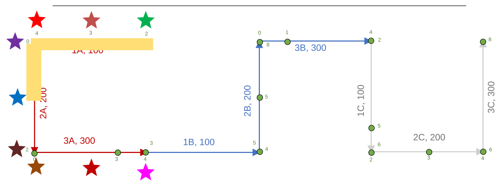

### Slide 71 <!-- slide 71 -->

{5940675A-B579-460E-94D1-54222C63F5DA}Test ID
3
Network Type
Engineering (Point Events)
Test
Reassign in the middle spanning routes to the line on the right

{5940675A-B579-460E-94D1-54222C63F5DA}EventID
From
Date
To
Date
RouteID
Measure
Loc
Error
001
1/1/2000
Null
1A
2
No Error
002
1/1/2000
Null
1A
3
No Error
003
1/1/2000
Null
1A
4
No Error
004
1/1/2000
Null
2A
0
No Error
005
1/1/2000
Null
2A
1
No Error
006
1/1/2000
12/31/2010
2A
2
No Error
007
1/1/2000
12/31/2010
3A
0
No Error
008
1/1/2000
12/31/2010
3A
2
No Error
009
1/1/2000
12/31/2010
3A
4
No Error
006
12/31/2010
Null
2A
2
Route Location not Found
007
12/31/2010
Null
3A
0
No Error
008
12/31/2010
Null
3A
2
No Error
009
12/31/2010
Null
3A
4
No Error
{5940675A-B579-460E-94D1-54222C63F5DA}R Name
L NAME
From  Date
To Date
Line
Order
From
Measure
To
Measure
1A
L0
1/1/2000
Null
100
2
4
2A
L0
1/1/2000
12/31/2010
200
0
2
3A
L0
1/1/2000
12/31/2010
300
0
4
2A
L0
12/31/2010
Null
200
0
1
2A Line1
L1
12/31/2010
Null
100
1
2
3A
L1
12/31/2010
Null
200
0
4
1B
L1
1/1/2000
12/31/2010
100
3
5
1B
L1
12/31/2010
Null
300
3
5
2B
L1
1/1/2000
12/31/2010
200
4
8
2B
L1
12/31/2010
Null
400
4
8
3B
L1
1/1/2000
12/31/2010
300
0
2
3B
L1
12/31/2010
Null
500
0
2
1C
L2
1/1/2000
Null
100
4
6
2C
L2
1/1/2000
Null
200
2
6
3C
L2
1/1/2000
Null
300
4
8

[figure: 1A, 100 · 2A, 200 · 3A, 200 · 1B, 300 · 2B, 400 · 3B, 500 · 2C, 200 · 1C, 100 · 3C, 300 · 4 · 2 · 0 · 3 · 5 · 8 · 1 · 6 · 2A Line1, 100]

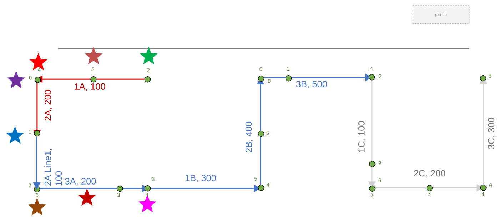

### Slide 72 — New Line <!-- slide 72 -->

{5940675A-B579-460E-94D1-54222C63F5DA}Recalibrate Source
Yes
Recalibrate Target
Yes
Date
12/31/2020

{5940675A-B579-460E-94D1-54222C63F5DA}Test ID
4
Network Type
Engineering (Point Events)
Test
Reassign to a new line. No Change.

{5940675A-B579-460E-94D1-54222C63F5DA}EventID
From
Date
To
Date
RouteID
Measure
Loc
Error
001
1/1/2000
Null
1A
2
No Error
002
1/1/2000
Null
1A
3
No Error
003
1/1/2000
Null
1A
4
No Error
004
1/1/2000
Null
2A
0
No Error
005
1/1/2000
Null
2A
1
No Error
006
1/1/2000
Null
2A
2
No Error
007
1/1/2000
Null
3A
0
No Error
008
1/1/2000
Null
3A
2
No Error
009
1/1/2000
Null
3A
4
No Error

{5940675A-B579-460E-94D1-54222C63F5DA}R Name
L NAME
From  Date
To Date
Line Order
From
Measure
To
Measure
1A
L0
1/1/2000
Null
100
2
4
2A
L0
1/1/2000
Null
200
0
2
3A
L0
1/1/2000
Null
300
0
4
1B
L1
1/1/2000
Null
100
3
5
2B
L1
1/1/2000
Null
200
4
8
3B
L1
1/1/2000
Null
300
0
2
1C
L2
1/1/2000
Null
100
4
6
2C
L2
1/1/2000
Null
200
2
6
3C
L2
1/1/2000
Null
300
4
8

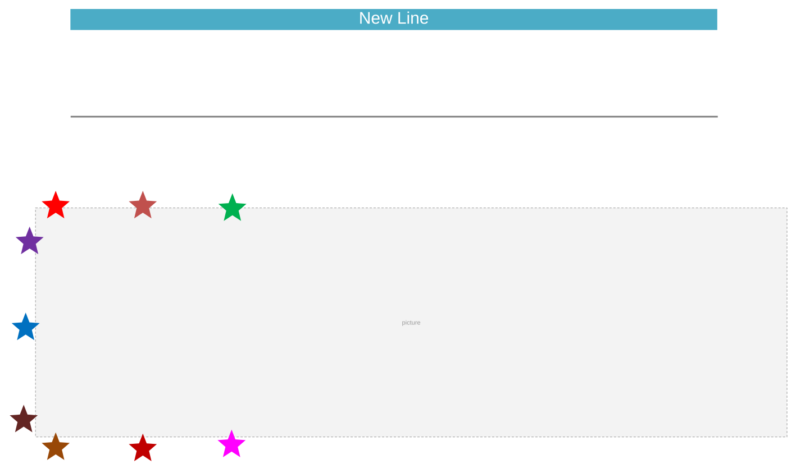

### Slide 73 <!-- slide 73 -->

{5940675A-B579-460E-94D1-54222C63F5DA}Test ID
4
Network Type
Engineering (Point Events)
Test
Reassign to a new line. No Change.

{5940675A-B579-460E-94D1-54222C63F5DA}EventID
From
Date
To
Date
RouteID
Measure
Loc
Error
001
1/1/2000
12/31/2010
1A
2
No Error
002
1/1/2000
12/31/2010
1A
3
No Error
003
1/1/2000
12/31/2010
1A
4
No Error
004
1/1/2000
12/31/2010
2A
0
No Error
005
1/1/2000
12/31/2010
2A
1
No Error
006
1/1/2000
12/31/2010
2A
2
No Error
007
1/1/2000
12/31/2010
3A
0
No Error
008
1/1/2000
12/31/2010
3A
2
No Error
009
1/1/2000
12/31/2010
3A
4
No Error
001
12/31/2020
Null
1A
2
No Error
002
12/31/2020
Null
1A
3
No Error
003
12/31/2020
Null
1A
4
No Error
004
12/31/2020
Null
2A
0
No Error
005
12/31/2020
Null
2A
1
No Error
006
12/31/2020
Null
2A
2
No Error
007
12/31/2020
Null
3A
0
No Error
008
12/31/2020
Null
3A
2
No Error
009
12/31/2020
Null
3A
4
No Error

{5940675A-B579-460E-94D1-54222C63F5DA}R Name
L NAME
From  Date
To Date
Line Order
From
Measure
To
Measure
1A
L0
1/1/2000
12/31/2020
100
2
4
2A
L0
1/1/2010
12/31/2020
200
0
2
3A
L0
1/1/2020
12/31/2020
300
0
4
1A
LX
12/31/2020
Null
100
2
4
2A
LX
12/31/2020
Null
200
0
2
3A
LX
12/31/2020
Null
300
0
4
1B
L1
1/1/2002
Null
100
3
5
2B
L1
1/1/2005
Null
200
4
8
3B
L1
1/1/2010
Null
300
0
2
1C
L2
1/1/2020
Null
100
4
6
2C
L2
1/1/2020
Null
200
2
6
3C
L2
1/1/2020
Null
300
4
8

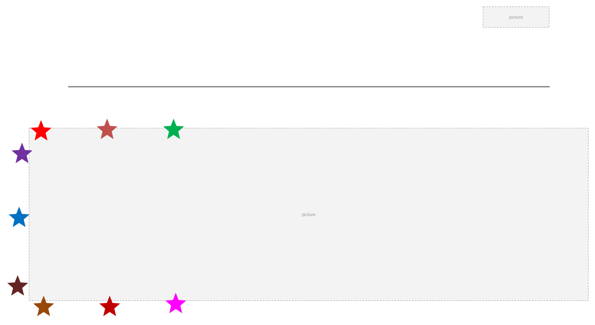

### Slide 74 — New Line <!-- slide 74 -->

{5940675A-B579-460E-94D1-54222C63F5DA}Recalibrate Source
Yes
Recalibrate Target
Yes
Date
12/31/2020

{5940675A-B579-460E-94D1-54222C63F5DA}Test ID
5
Network Type
Engineering (Point Events)
Test
Reassign the middle route in a line to a new line. Change measures.

{5940675A-B579-460E-94D1-54222C63F5DA}EventID
From
Date
To
Date
RouteID
Measure
Loc
Error
001
1/1/2000
Null
1A
2
No Error
002
1/1/2000
Null
1A
3
No Error
003
1/1/2000
Null
1A
4
No Error
004
1/1/2000
Null
2A
0
No Error
005
1/1/2000
Null
2A
1
No Error
006
1/1/2000
Null
2A
2
No Error
007
1/1/2000
Null
3A
0
No Error
008
1/1/2000
Null
3A
2
No Error
009
1/1/2000
Null
3A
4
No Error

{5940675A-B579-460E-94D1-54222C63F5DA}R Name
L NAME
From  Date
To Date
Line Order
From
Measure
To
Measure
1A
L0
1/1/2000
Null
100
2
4
2A
L0
1/1/2000
Null
200
0
2
3A
L0
1/1/2000
Null
300
0
4
1B
L1
1/1/2002
Null
100
3
5
2B
L1
1/1/2005
Null
200
4
8
3B
L1
1/1/2010
Null
300
0
2
1C
L2
1/1/2020
Null
100
4
6
2C
L2
1/1/2020
Null
200
2
6
3C
L2
1/1/2020
Null
300
4
8

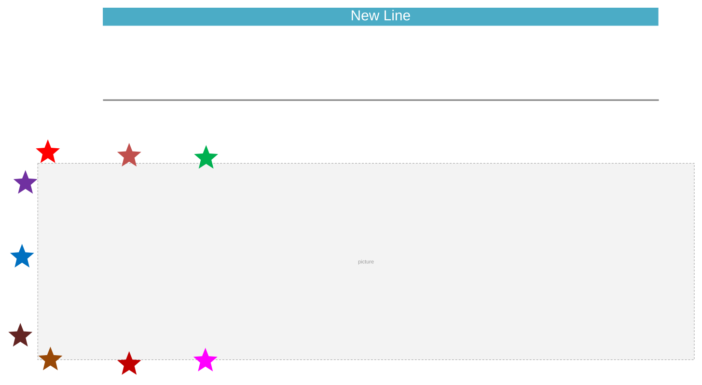

### Slide 75 <!-- slide 75 -->

{5940675A-B579-460E-94D1-54222C63F5DA}Test ID
5
Network Type
Engineering (Point Events)
Test
Reassign the middle route in a line to a new line. Change measures.

100
100

{5940675A-B579-460E-94D1-54222C63F5DA}EventID
From
Date
To
Date
RouteID
Measure
Loc
Error
001
1/1/2000
Null
1A
2
No Error
002
1/1/2000
Null
1A
3
No Error
003
1/1/2000
Null
1A
4
No Error
004
1/1/2000
12/31/2010
2A
0
No Error
005
1/1/2000
12/31/2010
2A
1
No Error
006
1/1/2000
12/31/2010
2A
2
No Error
007
1/1/2000
Null
3A
0
No Error
008
1/1/2000
Null
3A
2
No Error
009
1/1/2000
Null
3A
4
No Error
004
12/31/2020
Null
2A
0
No Error
005
12/31/2020
Null
2A
1
Route Location not Found
006
12/31/2020
Null
2A
2
Route Location not Found
{5940675A-B579-460E-94D1-54222C63F5DA}R Name
L NAME
From  Date
To Date
Line Order
From
Measure
To
Measure
1A
L0
1/1/2000
1/1/2020
100
2
4
2A
L0
1/1/2000
1/1/2020
200
0
2
3A
L0
1/1/2000
1/1/2020
300
0
4
1A
L0
1/1/2020
Null
100
2
4
2A
L_New
1/1/2020
Null
100
10
20
3A
L0
1/1/2020
Null
200
0
4
1B
L1
1/1/2002
Null
100
3
5
2B
L1
1/1/2005
Null
200
4
8
3B
L1
1/1/2010
Null
300
0
2
1C
L2
1/1/2020
Null
100
4
6
2C
L2
1/1/2020
Null
200
2
6
3C
L2
1/1/2020
Null
300
4
8

10

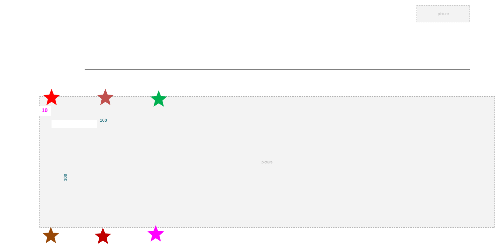

### Slide 76 <!-- slide 76 -->

{5940675A-B579-460E-94D1-54222C63F5DA}Recalibrate Source
Yes
Recalibrate Target
Yes
Date
12/31/2030

{5940675A-B579-460E-94D1-54222C63F5DA}Test ID
6
Network Type
Engineering (Point Events)
Test
Reassign partial routes in a line to a new line. Change names of partial routes.

{5940675A-B579-460E-94D1-54222C63F5DA}EventID
From
Date
To
Date
RouteID
Measure
Loc
Error
001
1/1/2000
Null
1A
2
No Error
002
1/1/2000
Null
1A
3
No Error
003
1/1/2000
Null
1A
4
No Error
004
1/1/2000
Null
2A
0
No Error
005
1/1/2000
Null
2A
1
No Error
006
1/1/2000
Null
2A
2
No Error
007
1/1/2000
Null
3A
0
No Error
008
1/1/2000
Null
3A
2
No Error
009
1/1/2000
Null
3A
4
No Error
{5940675A-B579-460E-94D1-54222C63F5DA}R Name
L NAME
From  Date
To Date
Line Order
From
Measure
To
Measure
1A
L0
1/1/2000
Null
100
2
4
2A
L0
1/1/2000
Null
200
0
2
3A
L0
1/1/2000
Null
300
0
4
1B
L1
1/1/2000
Null
100
3
5
2B
L1
1/1/2000
Null
200
4
8
3B
L1
1/1/2000
Null
300
0
2
1C
L2
1/1/2000
Null
100
4
6
2C
L2
1/1/2000
Null
200
2
6
3C
L2
1/1/2000
Null
300
4
8

[figure: New Line · 1A, 100 · 2A, 200 · 3A, 300 · 1B, 100 · 2B, 200 · 3B, 300 · 2C, 200 · 1C, 100 · 3C, 300 · 4 · 2 · 0 · 3 · 1 · 5 · 8 · 6]

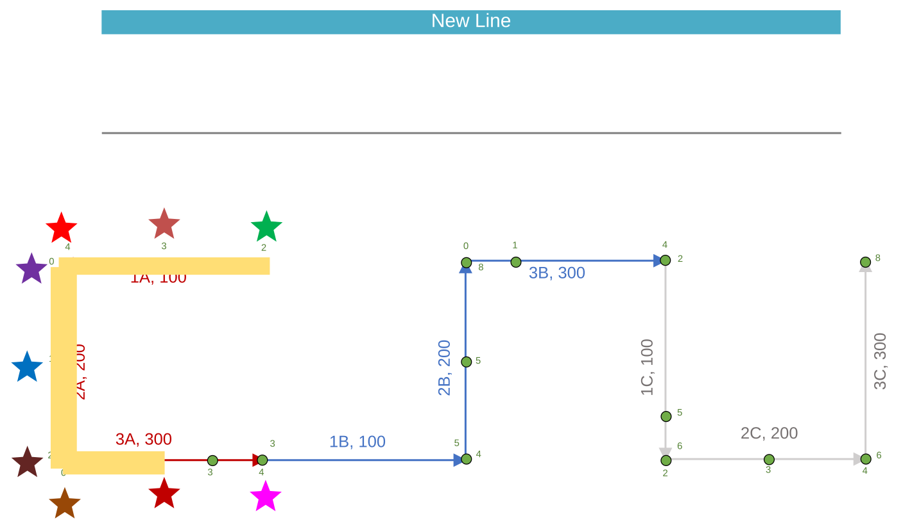

### Slide 77 <!-- slide 77 -->

{5940675A-B579-460E-94D1-54222C63F5DA}Test ID
6
Network Type
Engineering (Point Events)
Test
Reassign partial routes in a line to a new line. Change names of partial routes.

3A LineX, 300

{5940675A-B579-460E-94D1-54222C63F5DA}EventID
From
Date
To
Date
RouteID
Measure
Loc
Error
001
1/1/2000
12/31/2030
1A
2
No Error
002
1/1/2000
12/31/2030
1A
3
No Error
003
1/1/2000
12/31/2030
1A
4
No Error
004
1/1/2000
12/31/2030
2A
0
No Error
005
1/1/2000
12/31/2030
2A
1
No Error
006
1/1/2000
12/31/2030
2A
2
No Error
007
1/1/2000
12/31/2030
3A
0
No Error
008
1/1/2000
Null
3A
2
No Error
009
1/1/2000
Null
3A
4
No Error
001
12/31/2030
Null
1A
2
No Error
002
12/31/2030
Null
1A
3
No Error
003
12/31/2030
Null
1A
4
No Error
004
12/31/2030
Null
2A
0
No Error
005
12/31/2030
Null
2A
1
No Error
006
12/31/2030
Null
2A
2
No Error
007
12/31/2030
Null
3A
0
Route Location not Found

{5940675A-B579-460E-94D1-54222C63F5DA}R Name
L NAME
From  Date
To Date
Line Order
From
Measure
To
Measure
1A
L0
1/1/2000
12/31/2030
100
2
4
2A
L0
1/1/2010
12/31/2030
200
0
2
3A
L0
1/1/2020
12/31/2030
300
0
4
1A
LX
12/31/2030
Null
100
2
4
2A
LX
12/31/2030
Null
200
0
2
3A LineX
LX
12/31/2030
Null
300
0
2
3A
L0
12/31/2030
Null
100
2
4
1B
L1
1/1/2002
Null
100
3
5
2B
L1
1/1/2005
Null
200
4
8
3B
L1
1/1/2010
Null
300
0
2
1C
L2
1/1/2020
12/31/2030
100
4
6
2C
L2
1/1/2020
12/31/2030
200
2
6
3C
L2
1/1/2020
12/31/2030
300
4
8

[figure: 1A, 100 · 2A, 200 · 1B, 100 · 2B, 200 · 3B, 300 · 2C, 200 · 1C, 100 · 3C, 300 · 4 · 2 · 0 · 3 · 1 · 5 · 8 · 6 · 3A, 100]

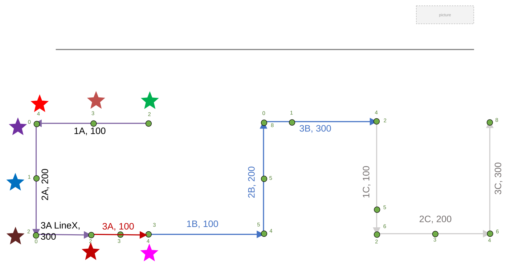

### Slide 78 <!-- slide 78 -->

{5940675A-B579-460E-94D1-54222C63F5DA}Test ID
7
Network Type
Engineering (Point Events)
Test
Reassign all the routes in a line to another line on right, transferring routes and measures. The effective date is same as one the source route’s From Date

{5940675A-B579-460E-94D1-54222C63F5DA}Recalibrate Source
Yes
Recalibrate Target
Yes
Date
1/1/2000

{5940675A-B579-460E-94D1-54222C63F5DA}EventID
From
Date
To
Date
RouteID
Measure
Loc
Error
001
1/1/2000
Null
1A
2
No Error
002
1/1/2000
Null
1A
3
No Error
003
1/1/2000
Null
1A
4
No Error
004
1/1/2000
Null
2A
0
No Error
005
1/1/2000
Null
2A
1
No Error
006
1/1/2000
Null
2A
2
No Error
007
1/1/2000
Null
3A
0
No Error
008
1/1/2000
Null
3A
2
No Error
009
1/1/2000
Null
3A
4
No Error

{5940675A-B579-460E-94D1-54222C63F5DA}R Name
L NAME
From  Date
To Date
Line Order
From
Measure
To
Measure
1A
L0
1/1/2000
Null
100
2
4
2A
L0
1/1/2000
Null
200
0
2
3A
L0
1/1/2000
Null
300
0
4
1B
L1
1/1/2000
Null
100
3
5
2B
L1
1/1/2000
Null
200
4
8
3B
L1
1/1/2000
Null
300
0
2
1C
L2
1/1/2000
Null
100
4
6
2C
L2
1/1/2000
Null
200
2
6
3C
L2
1/1/2000
Null
300
4
8

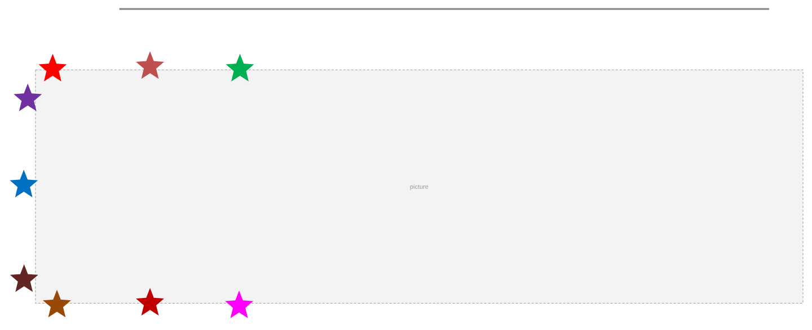

### Slide 79 <!-- slide 79 -->

{5940675A-B579-460E-94D1-54222C63F5DA}Test ID
7
Network Type
Engineering (Point Events)
Test
Reassign all the routes in a line to another line on right, transferring routes and measures. The effective date is same as one the source route’s From Date

{5940675A-B579-460E-94D1-54222C63F5DA}EventID
From
Date
To
Date
RouteID
Measure
Loc
Error
001
1/1/2000
Null
1A
2
No Error
002
1/1/2000
Null
1A
3
No Error
003
1/1/2000
Null
1A
4
No Error
004
1/1/2000
Null
2A
0
No Error
005
1/1/2000
Null
2A
1
No Error
006
1/1/2000
Null
2A
2
No Error
007
1/1/2000
Null
3A
0
No Error
008
1/1/2000
Null
3A
2
No Error
009
1/1/2000
Null
3A
4
No Error
{5940675A-B579-460E-94D1-54222C63F5DA}R Name
L NAME
From  Date
To Date
Line Order
From
Measure
To
Measure
1A
L1
1/1/2000
Null
100
2
4
2A
L1
1/1/2000
Null
200
0
2
3A
L1
1/1/2000
Null
300
0
4
1B
L1
1/1/2000
Null
400
3
5
2B
L1
1/1/2000
Null
500
4
8
3B
L1
1/1/2000
Null
600
0
2
1C
L2
1/1/2000
Null
100
4
6
2C
L2
1/1/2000
Null
200
2
6
3C
L2
1/1/2000
Null
300
4
8

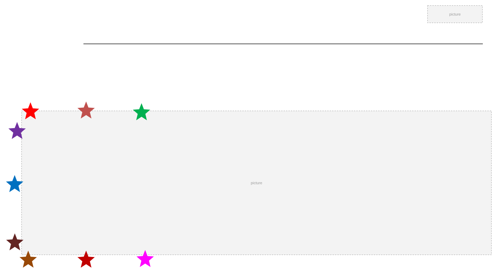

### Slide 80 <!-- slide 80 -->

{5940675A-B579-460E-94D1-54222C63F5DA}Test ID
8
Network Type
Engineering (Point Events)
Test
Reassign to fill the gap in a line by transferring route.

{5940675A-B579-460E-94D1-54222C63F5DA}Recalibrate Source
Yes
Recalibrate Target
Yes
Date
12/31/2023
{5940675A-B579-460E-94D1-54222C63F5DA}EventID
From
Date
To
Date
RouteID
Measure
Loc
Error
001
1/1/2000
Null
X1
2
No Error
002
1/1/2000
Null
X1
4
No Error
003
1/1/2000
Null
X1
6
No Error
004
1/1/2000
Null
1B
3
No Error
005
1/1/2000
Null
1B
4
No Error
006
1/1/2000
Null
1B
5
No Error
007
1/1/2000
Null
X2
24
No Error
008
1/1/2000
Null
X2
26
No Error
009
1/1/2000
Null
X2
28
No Error

{5940675A-B579-460E-94D1-54222C63F5DA}R Name
L NAME
From  Date
To Date
Line Order
From
Measure
To
Measure
X1
L3
1/1/2000
Null
100
2
6
X2
L3
1/1/2000
Null
200
24
28
1B
L1
1/1/2000
Null
100
3
5
2B
L1
1/1/2000
Null
200
4
8
3B
L1
1/1/2000
Null
300
0
2

[figure: 100 · 200 · X1 · X2]

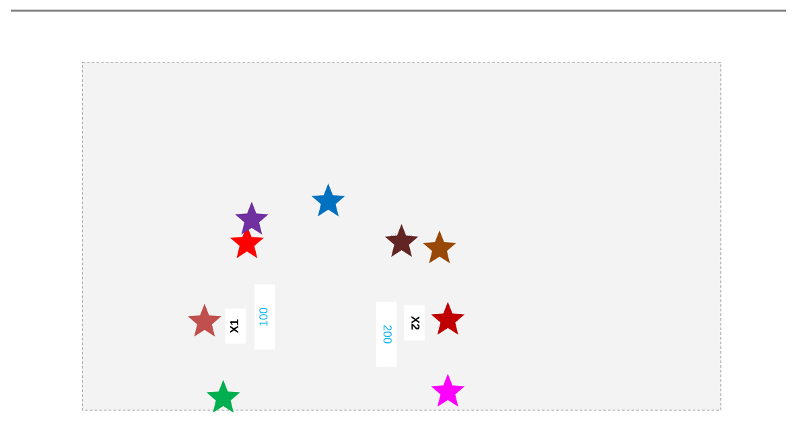

### Slide 81 <!-- slide 81 -->

{5940675A-B579-460E-94D1-54222C63F5DA}Test ID
8
Network Type
Engineering (Point Events)
Test
Reassign to fill the gap in a line by transferring route.

{5940675A-B579-460E-94D1-54222C63F5DA}EventID
From
Date
To
Date
RouteID
Measure
Loc
Error
001
1/1/2000
Null
X1
2
No Error
002
1/1/2000
Null
X1
4
No Error
003
1/1/2000
Null
X1
6
No Error
004
1/1/2000
12/31/2023
1B
3
No Error
005
1/1/2000
12/31/2023
1B
4
No Error
006
1/1/2000
12/31/2023
1B
5
No Error
007
1/1/2000
Null
X2
24
No Error
008
1/1/2000
Null
X2
26
No Error
009
1/1/2000
Null
X2
28
No Error
004
12/31/2023
Null
1B
3
No Error
005
12/31/2023
Null
1B
4
No Error
006
12/31/2023
Null
1B
5
No Error

{5940675A-B579-460E-94D1-54222C63F5DA}R Name
L NAME
From  Date
To Date
Line
Order
From
Measure
To
Measure
X1
L3
1/1/2000
Null
100
2
6
X2
L3
1/1/2000
12/31/2023
100
24
28
1B
L1
1/1/2000
12/31/2023
100
3
5
2B
L1
1/1/2000
12/31/2023
200
4
8
3B
L1
1/1/2000
12/31/2023
300
0
2
X2
L3
12/31/2023
Null
300
24
28
1B
L3
12/31/2023
Null
200
3
5
3B
L1
12/31/2023
Null
200
0
2
2B
L1
12/31/2023
Null
100
4
8

[figure: 100 · 300 · X1 · X2]

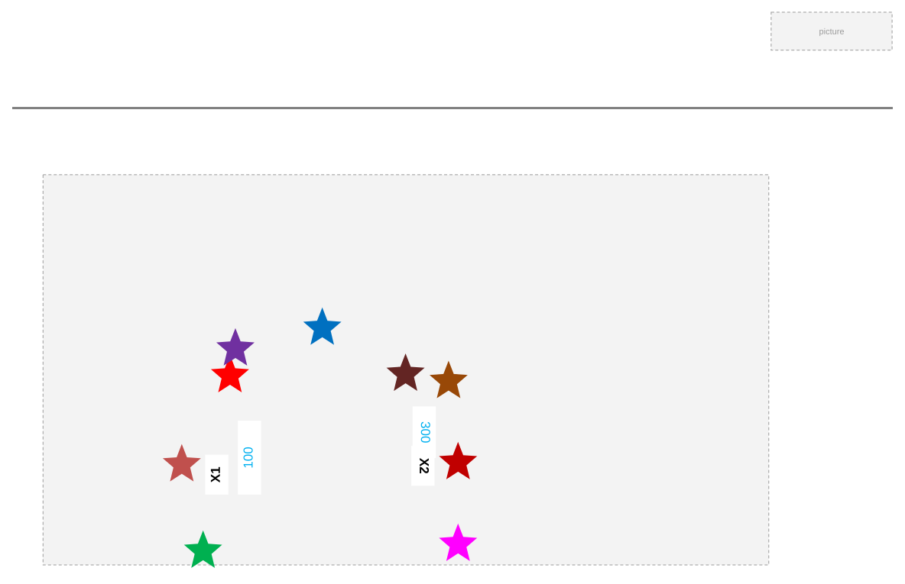

### Slide 82 <!-- slide 82 -->

{5940675A-B579-460E-94D1-54222C63F5DA}Test ID
9
Network Type
Engineering (Point Events)
Test
Reassign to fill the gap in a line by transferring route.

{5940675A-B579-460E-94D1-54222C63F5DA}Recalibrate Source
No
Recalibrate Target
Yes
Date
12/31/2023

{5940675A-B579-460E-94D1-54222C63F5DA}EventID
From
Date
To
Date
RouteID
Measure
Loc
Error
001
1/1/2000
Null
X1
2
No Error
002
1/1/2000
Null
X1
4
No Error
003
1/1/2000
Null
X1
6
No Error
004
1/1/2000
Null
1B
3
No Error
005
1/1/2000
Null
1B
4
No Error
006
1/1/2000
Null
1B
5
No Error
007
1/1/2000
Null
X2
24
No Error
008
1/1/2000
Null
X2
26
No Error
009
1/1/2000
Null
X2
28
No Error

{5940675A-B579-460E-94D1-54222C63F5DA}R Name
L NAME
From  Date
To Date
Line Order
From
Measure
To
Measure
X1
L3
1/1/2000
Null
100
2
6
X2
L3
1/1/2000
Null
200
24
28
1B
L1
1/1/2000
Null
100
4
5
2B
L1
1/1/2000
Null
200
4
8
3B
L1
1/1/2000
Null
300
0
2

[figure: 100 · 200 · X1 · X2]

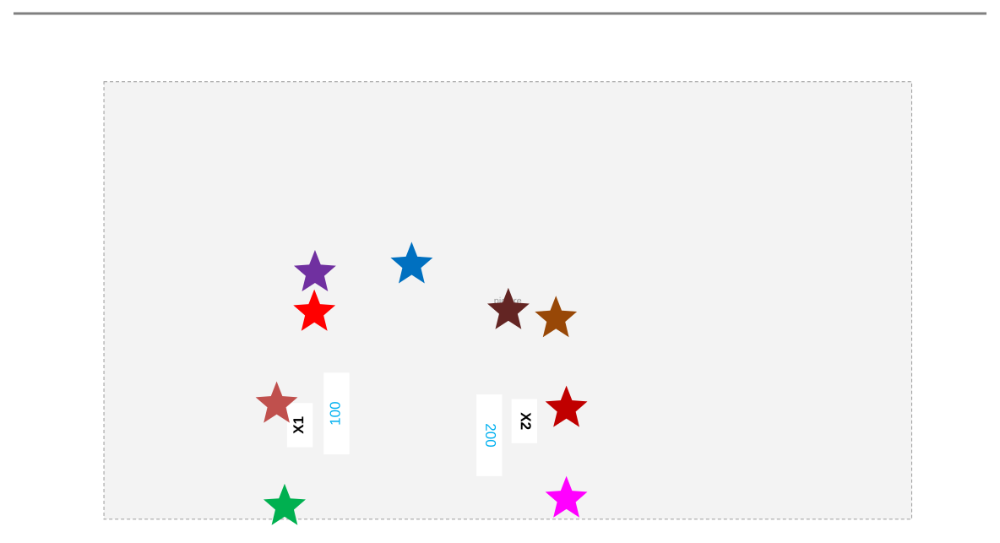

### Slide 83 <!-- slide 83 -->

{5940675A-B579-460E-94D1-54222C63F5DA}Test ID
9
Network Type
Engineering (Point Events)
Test
Reassign part of a route to another line.

200
X1
X2

{5940675A-B579-460E-94D1-54222C63F5DA}EventID
From
Date
To
Date
RouteID
Measure
Loc
Error
001
1/1/2000
Null
X1
2
No Error
002
1/1/2000
Null
X1
4
No Error
003
1/1/2000
Null
X1
6
No Error
004
1/1/2000
12/31/2023
1B
3
No Error
005
1/1/2000
12/31/2023
1B
4
No Error
006
1/1/2000
12/31/2023
1B
5
No Error
007
1/1/2000
Null
X2
24
No Error
008
1/1/2000
Null
X2
26
No Error
009
1/1/2000
Null
X2
28
No Error
004
12/31/2023
Null
1B
3
Route Location not Found
005
12/31/2023
Null
1B
4
No Error
006
12/31/2023
Null
1B
5
No Error
{5940675A-B579-460E-94D1-54222C63F5DA}R Name
L NAME
From  Date
To Date
Line Order
From
Measure
To
Measure
X1
L3
1/1/2000
Null
100
2
6
X2
L3
1/1/2000
12/31/2023
200
24
28
1B
L1
1/1/2000
12/31/2023
100
4
5
2B
L1
1/1/2000
Null
200
4
8
3B
L1
1/1/2000
12/31/2023
300
0
2
X2
L3
12/31/2023
Null
300
24
28
1B-New
L3
12/31/2023
Null
200
3
4
1B
L1
12/31/2023
Null
100
4
5

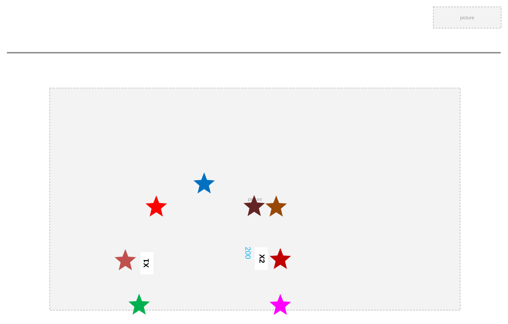

### Slide 84 <!-- slide 84 -->

{5940675A-B579-460E-94D1-54222C63F5DA}Test ID
10
Network Type
Engineering (Point Events)
Test
Reassign part of a route to another line - 2.

{5940675A-B579-460E-94D1-54222C63F5DA}Recalibrate Source
No
Recalibrate Target
Yes
Date
12/31/2023

{5940675A-B579-460E-94D1-54222C63F5DA}EventID
From
Date
To
Date
RouteID
Measure
Loc
Error
001
1/1/2000
Null
X1
2
No Error
002
1/1/2000
Null
X1
4
No Error
003
1/1/2000
Null
X1
6
No Error
004
1/1/2000
Null
1B
3
No Error
005
1/1/2000
Null
1B
4
No Error
006
1/1/2000
Null
1B
5
No Error
007
1/1/2000
Null
X2
24
No Error
008
1/1/2000
Null
X2
26
No Error
009
1/1/2000
Null
X2
28
No Error

{5940675A-B579-460E-94D1-54222C63F5DA}R Name
L NAME
From  Date
To Date
Line Order
From
Measure
To
Measure
X1
L3
1/1/2000
Null
100
2
6
X2
L3
1/1/2000
Null
200
24
28
1B
L1
1/1/2000
Null
100
43
5
2B
L1
1/1/2000
Null
200
4
8
3B
L1
1/1/2000
Null
300
0
2

[figure: 100 · 200 · X1 · X2]

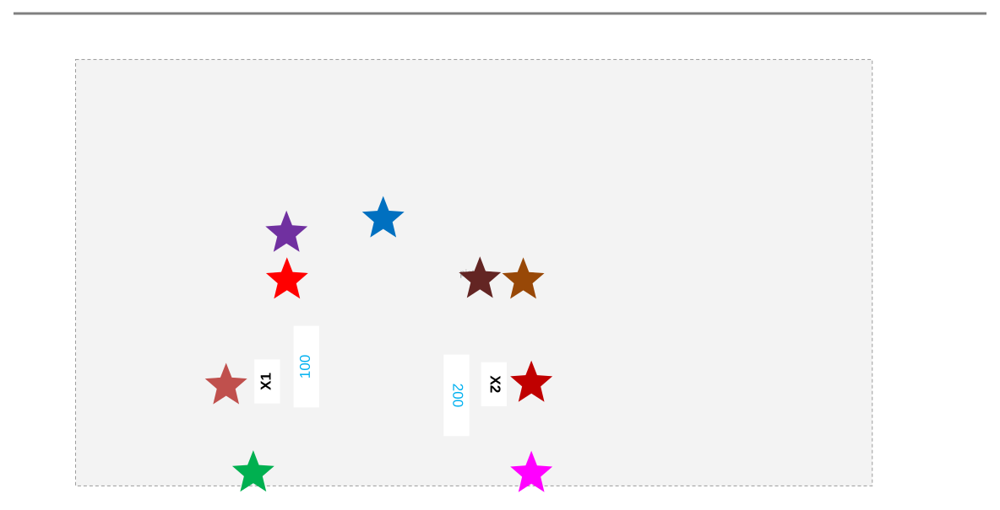

### Slide 85 <!-- slide 85 -->

{5940675A-B579-460E-94D1-54222C63F5DA}Test ID
10
Network Type
Engineering (Point Events)
Test
Reassign part of a route to another line - 2.

{5940675A-B579-460E-94D1-54222C63F5DA}EventID
From
Date
To
Date
RouteID
Measure
Loc
Error
001
1/1/2000
Null
X1
2
No Error
002
1/1/2000
Null
X1
4
No Error
003
1/1/2000
Null
X1
6
No Error
004
1/1/2000
12/31/2023
1B
3
No Error
005
1/1/2000
12/31/2023
1B
4
No Error
006
1/1/2000
12/31/2023
1B
5
No Error
007
1/1/2000
Null
X2
24
No Error
008
1/1/2000
Null
X2
26
No Error
009
1/1/2000
Null
X2
28
No Error
004
12/31/2023
Null
1B
3
No Error
005
12/31/2023
Null
1B
4
No Error
006
12/31/2023
Null
1B
5
Route Location not Found

{5940675A-B579-460E-94D1-54222C63F5DA}R Name
L NAME
From  Date
To Date
Line Order
From
Measure
To
Measure
X1
L3
1/1/2000
Null
100
2
6
X2
L3
1/1/2000
12/31/2023
200
24
28
1B
L1
1/1/2000
12/31/2023
100
3
5
2B
L1
1/1/2000
Null
200
4
8
3B
L1
1/1/2000
Null
300
0
2
X2
L3
12/31/2023
Null
300
24
28
X1
L3
12/31/2023
Null
100
2
6
1B-New
L3
12/31/2023
Null
200
5
14
1B
L1
12/31/2023
Null
100
3
4

[figure: 100 · 200 · X1 · X2]

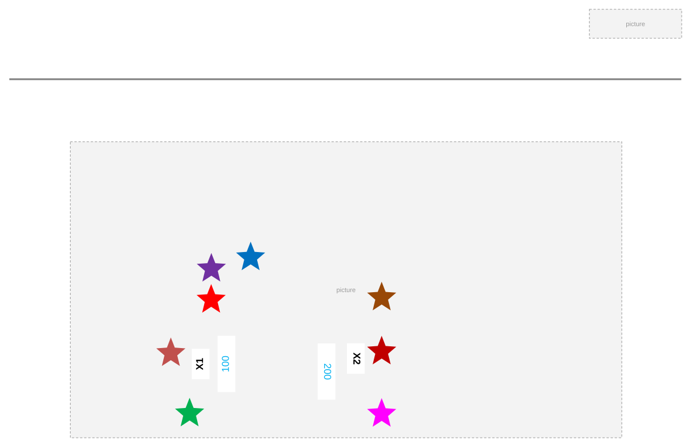

### Slide 86 <!-- slide 86 -->

{5940675A-B579-460E-94D1-54222C63F5DA}Test ID
11
Network Type
Engineering (Point Events)
Test
Reassign all the routes in a line to another line on right, adjusting measures

{5940675A-B579-460E-94D1-54222C63F5DA}EventID
From
Date
To
Date
RouteID
Measure
Loc
Error
001
1/1/2000
Null
1A
2
No Error
002
1/1/2000
Null
1A
3
No Error
003
1/1/2000
Null
1A
4
No Error
004
1/1/2000
Null
2A
0
No Error
005
1/1/2000
Null
2A
1
No Error
006
1/1/2000
Null
2A
2
No Error
007
1/1/2000
Null
3A
0
No Error
008
1/1/2000
Null
3A
2
No Error
009
1/1/2000
Null
3A
4
No Error

{5940675A-B579-460E-94D1-54222C63F5DA}R Name
L NAME
From  Date
To Date
Line Order
From
Measure
To
Measure
1A
L0
1/1/2000
Null
100
2
4
2A
L0
1/1/2000
Null
200
0
2
3A
L0
1/1/2000
Null
300
0
4
1B
L1
1/1/2000
Null
100
3
5
2B
L1
1/1/2000
Null
200
4
8
3B
L1
1/1/2000
Null
300
0
2
1C
L2
1/1/2000
Null
100
4
6
2C
L2
1/1/2000
Null
200
2
6
3C
L2
1/1/2000
Null
300
4
8

[figure: 1A, 100 · 2A, 200 · 3A, 300 · 1B, 100 · 2B, 200 · 3B, 300 · 2C, 200 · 1C, 100 · 3C, 300 · 4 · 2 · 0 · 3 · 1 · 5 · 8 · 6]

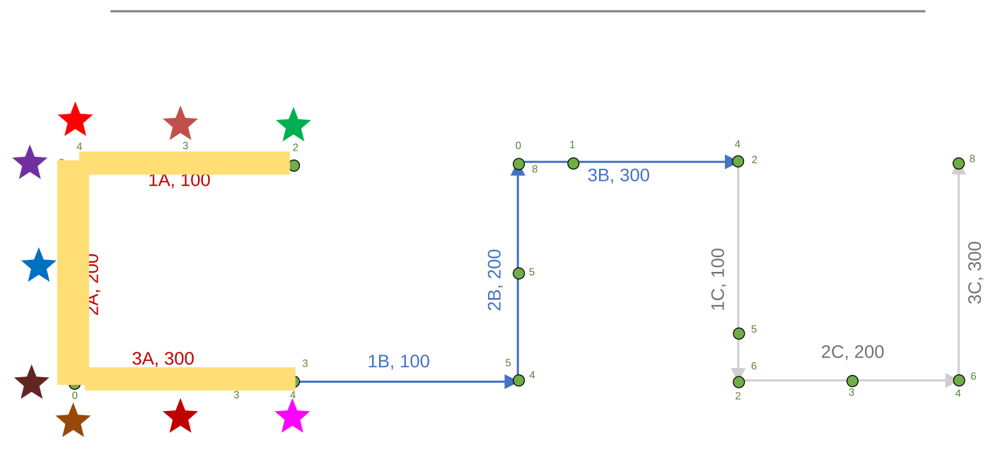

### Slide 87 <!-- slide 87 -->

{5940675A-B579-460E-94D1-54222C63F5DA}Test ID
11
Network Type
Engineering (Point Events)
Test
Reassign all the routes in a line to another line on right, adjusting measures

{5940675A-B579-460E-94D1-54222C63F5DA}EventID
From
Date
To
Date
RouteID
Measure
Loc
Error
001
1/1/2000
12/31/2010
1A
2
No Error
002
1/1/2000
12/31/2010
1A
3
No Error
003
1/1/2000
12/31/2010
1A
4
No Error
004
1/1/2000
12/31/2010
2A
0
No Error
005
1/1/2000
12/31/2010
2A
1
No Error
006
1/1/2000
12/31/2010
2A
2
No Error
007
1/1/2000
12/31/2010
3A
0
No Error
008
1/1/2000
12/31/2010
3A
2
No Error
009
1/1/2000
12/31/2010
3A
4
No Error
001
12/31/2010
Null
1A
2
No Error
002
12/31/2010
Null
1A
3
No Error
003
12/31/2010
Null
1A
4
Route Location not Found
004
12/31/2010
Null
2A
0
Route Location not Found
005
12/31/2010
Null
2A
1
Route Location not Found
006
12/31/2010
Null
2A
2
Route Location not Found
007
12/31/2010
Null
3A
0
Route Location not Found
008
12/31/2010
Null
3A
2
No Error
009
12/31/2010
Null
3A
4
No Error

{5940675A-B579-460E-94D1-54222C63F5DA}R Name
L NAME
From  Date
To Date
Line Order
F0rom
Measure
To
Measure
1A
L0
1/1/2000
12/31/2010
100
2
4
2A
L0
1/1/2000
12/31/2010
200
0
2
3A
L0
1/1/2000
12/31/2010
300
0
4
1A
L1
12/31/2010
Null
100
2
3
2A
L1
12/31/2010
Null
200
10
20
3A
L1
12/31/2010
Null
300
1
4
1B
L1
1/1/2000
12/31/2010
100
3
5
1B
L1
12/31/2010
Null
400
3
5
2B
L1
1/1/2000
12/31/2010
200
4
8
2B
L1
12/31/2010
Null
500
4
8
3B
L1
1/1/2000
12/31/2010
300
0
2
3B
L1
12/31/2010
Null
600
0
2
1C
L2
1/1/2000
Null
100
4
6
2C
L2
1/1/2000
Null
200
2
6
3C
L2
1/1/2000
Null
300
4
8

[figure: 1A, 100 · 2A, 200 · 3A, 300 · 1B, 400 · 2B, 500 · 3B, 600 · 2C, 200 · 1C, 100 · 3C, 300 · 3 · 2 · 20 · 10 · 1 · 4 · 5 · 8 · 0 · 6]

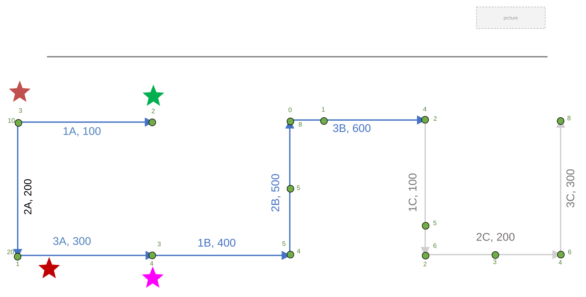

### Slide 88 <!-- slide 88 -->

{5940675A-B579-460E-94D1-54222C63F5DA}Recalibrate Source
Yes
Recalibrate Target
Yes
Date
12/31/2030

{5940675A-B579-460E-94D1-54222C63F5DA}Test ID
12
Network Type
Engineering (Point Events)
Test
Reassign partial routes in a line to a new line. Change names of partial routes. Recalibrate source routes downstream

{5940675A-B579-460E-94D1-54222C63F5DA}EventID
From
Date
To
Date
RouteID
Measure
Loc
Error
001
1/1/2000
Null
1A
2
No Error
002
1/1/2000
Null
1A
3
No Error
003
1/1/2000
Null
1A
4
No Error
004
1/1/2000
Null
2A
0
No Error
005
1/1/2000
Null
2A
1
No Error
006
1/1/2000
Null
2A
2
No Error
007
1/1/2000
Null
3A
0
No Error
008
1/1/2000
Null
3A
2
No Error
009
1/1/2000
Null
3A
4
No Error
{5940675A-B579-460E-94D1-54222C63F5DA}R Name
L NAME
From  Date
To Date
Line Order
From
Measure
To
Measure
1A
L0
1/1/2000
Null
100
2
4
2A
L0
1/1/2000
Null
200
0
2
3A
L0
1/1/2000
Null
300
0
4
1B
L1
1/1/2000
Null
100
3
5
2B
L1
1/1/2000
Null
200
4
8
3B
L1
1/1/2000
Null
300
0
2
1C
L2
1/1/2000
Null
100
4
6
2C
L2
1/1/2000
Null
200
2
6
3C
L2
1/1/2000
Null
300
4
8

[figure: New Line · 1A, 100 · 2A, 200 · 3A, 300 · 1B, 100 · 2B, 200 · 3B, 300 · 2C, 200 · 1C, 100 · 3C, 300 · 4 · 2 · 0 · 3 · 1 · 5 · 8 · 6]

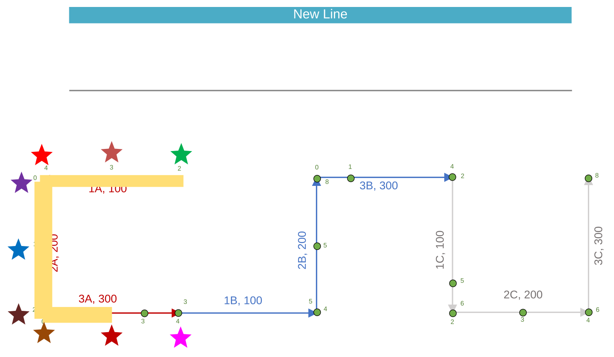

### Slide 89 <!-- slide 89 -->

3A LineX, 300

{5940675A-B579-460E-94D1-54222C63F5DA}EventID
From
Date
To
Date
RouteID
Measure
Loc
Error
001
1/1/2000
12/31/2010
1A
2
No Error
002
1/1/2000
12/31/2010
1A
3
No Error
003
1/1/2000
12/31/2010
1A
4
No Error
004
1/1/2000
12/31/2010
2A
0
No Error
005
1/1/2000
12/31/2010
2A
1
No Error
006
1/1/2000
12/31/2010
2A
2
No Error
007
1/1/2000
12/31/2010
3A
0
No Error
008
1/1/2000
12/31/2010
3A
2
No Error
009
1/1/2000
12/31/2010
3A
4
No Error
001
12/31/2030
Null
1A
2
No Error
002
12/31/2030
Null
1A
3
No Error
003
12/31/2030
Null
1A
4
No Error
004
12/31/2030
Null
2A
0
No Error
005
12/31/2030
Null
2A
1
No Error
006
12/31/2030
Null
2A
2
No Error
007
12/31/2030
Null
3A
0
No Error
008
12/31/2030
Null
3A
2
No Error
009
12/31/2030
Null
3A
4
Route Location not Found

{5940675A-B579-460E-94D1-54222C63F5DA}Test ID
12
Network Type
Engineering (Point Events)
Test
Reassign partial routes in a line to a new line. Change names of partial routes. Recalibrate source routes downstream

{5940675A-B579-460E-94D1-54222C63F5DA}R Name
L NAME
From  Date
To Date
Line Order
From
Measure
To
Measure
1A
L0
1/1/2000
12/31/2030
100
2
4
2A
L0
1/1/2010
12/31/2030
200
0
2
3A
L0
1/1/2020
12/31/2030
300
0
4
1A
LX
12/31/2030
Null
100
2
4
2A
LX
12/31/2030
Null
200
0
2
3A LineX
LX
12/31/2030
Null
300
0
2
3A
L0
12/31/2030
Null
100
0
2
1B
L1
1/1/2002
Null
100
3
5
2B
L1
1/1/2005
Null
200
4
8
3B
L1
1/1/2010
Null
300
0
2
1C
L2
1/1/2020
12/31/2030
100
4
6
2C
L2
1/1/2020
12/31/2030
200
2
6
3C
L2
1/1/2020
12/31/2030
300
4
8

[figure: 1A, 100 · 2A, 200 · 1B, 100 · 2B, 200 · 3B, 300 · 2C, 200 · 1C, 100 · 3C, 300 · 4 · 2 · 0 · 1 · 3 · 5 · 8 · 6 · 3A, 100]

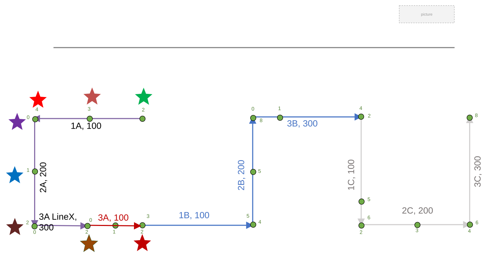

### Slide 90 <!-- slide 90 -->

{5940675A-B579-460E-94D1-54222C63F5DA}Test ID
9
Network Type
Engineering (Point Events)
Test
Reassign part of a route to another line. Recalibrating downstream.

{5940675A-B579-460E-94D1-54222C63F5DA}Recalibrate Source
No
Recalibrate Target
Yes
Date
12/31/2023

{5940675A-B579-460E-94D1-54222C63F5DA}EventID
From
Date
To
Date
RouteID
Measure
Loc
Error
001
1/1/2000
Null
X1
2
No Error
002
1/1/2000
Null
X1
4
No Error
003
1/1/2000
Null
X1
6
No Error
004
1/1/2000
Null
1B
3
No Error
005
1/1/2000
Null
1B
4
No Error
006
1/1/2000
Null
1B
5
No Error
007
1/1/2000
Null
X2
24
No Error
008
1/1/2000
Null
X2
26
No Error
009
1/1/2000
Null
X2
28
No Error

{5940675A-B579-460E-94D1-54222C63F5DA}R Name
L NAME
From  Date
To Date
Line Order
From
Measure
To
Measure
X1
L3
1/1/2000
Null
100
2
6
X2
L3
1/1/2000
Null
200
24
28
1B
L1
1/1/2000
Null
100
3
5
2B
L1
1/1/2000
Null
200
4
8
3B
L1
1/1/2000
Null
300
0
2

[figure: 100 · 200 · X1 · X2]

### Slide 91 <!-- slide 91 -->

{5940675A-B579-460E-94D1-54222C63F5DA}Test ID
9
Network Type
Engineering (Point Events)
Test
Reassign part of a route to another line. Recalibrating downstream.

{5940675A-B579-460E-94D1-54222C63F5DA}EventID
From
Date
To
Date
RouteID
Measure
Loc
Error
001
1/1/2000
Null
X1
2
No Error
002
1/1/2000
Null
X1
4
No Error
003
1/1/2000
Null
X1
6
No Error
004
1/1/2000
12/31/2023
1B
3
No Error
005
1/1/2000
12/31/2023
1B
4
No Error
006
1/1/2000
12/31/2023
1B
5
No Error
007
1/1/2000
Null
X2
24
No Error
008
1/1/2000
Null
X2
26
No Error
009
1/1/2000
Null
X2
28
No Error
004
12/31/2023
Null
1B
3
Route Location not Found
005
12/31/2023
Null
1B
4
Route Location not Found
006
12/31/2023
Null
1B
5
Route Location not Found
{5940675A-B579-460E-94D1-54222C63F5DA}R Name
L NAME
From  Date
To Date
Line Order
From
Measure
To
Measure
X1
L3
1/1/2000
Null
100
2
6
X2
L3
1/1/2000
12/31/2023
200
24
28
1B
L1
1/1/2000
12/31/2023
100
3
5
2B
L1
1/1/2000
Null
200
4
8
3B
L1
1/1/2000
12/31/2023
300
0
2
X2
L3
12/31/2023
Null
300
24
28
1B-New
L3
12/31/2023
Null
200
3
4
1B
L1
12/31/2023
Null
100
0
2

[figure: 200 · X1 · X2 · 0 · 2]

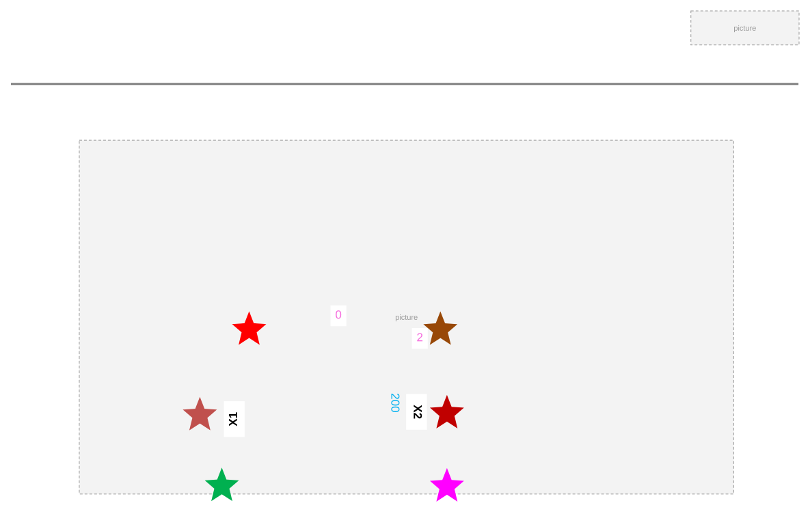

### Slide 92 <!-- slide 92 -->

{5940675A-B579-460E-94D1-54222C63F5DA}Recalibrate Source
Yes
Recalibrate Target
Yes
Date
12/31/2030

{5940675A-B579-460E-94D1-54222C63F5DA}Test ID
10
Network Type
Engineering (Point Events)
Test
Reassign all routes to a new line.  Adjust measures to overlap previous measures

{5940675A-B579-460E-94D1-54222C63F5DA}EventID
From
Date
To
Date
RouteID
Measure
Loc
Error
001
1/1/2000
Null
1A
2
No Error
002
1/1/2000
Null
1A
3
No Error
003
1/1/2000
Null
1A
4
No Error
004
1/1/2000
Null
2A
0
No Error
005
1/1/2000
Null
2A
1
No Error
006
1/1/2000
Null
2A
2
No Error
007
1/1/2000
Null
3A
0
No Error
008
1/1/2000
Null
3A
2
No Error
009
1/1/2000
Null
3A
4
No Error
{5940675A-B579-460E-94D1-54222C63F5DA}R Name
L NAME
From  Date
To Date
Line Order
From
Measure
To
Measure
1A
L0
1/1/2000
Null
100
2
4
2A
L0
1/1/2000
Null
200
0
2
3A
L0
1/1/2000
Null
300
0
4
1B
L1
1/1/2000
Null
100
3
5
2B
L1
1/1/2000
Null
200
4
8
3B
L1
1/1/2000
Null
300
0
2
1C
L2
1/1/2000
Null
100
4
6
2C
L2
1/1/2000
Null
200
2
6
3C
L2
1/1/2000
Null
300
4
8

[figure: New Line · 1A, 100 · 2A, 200 · 3A, 300 · 1B, 100 · 2B, 200 · 3B, 300 · 2C, 200 · 1C, 100 · 3C, 300 · 4 · 2 · 0 · 3 · 1 · 5 · 8 · 6]

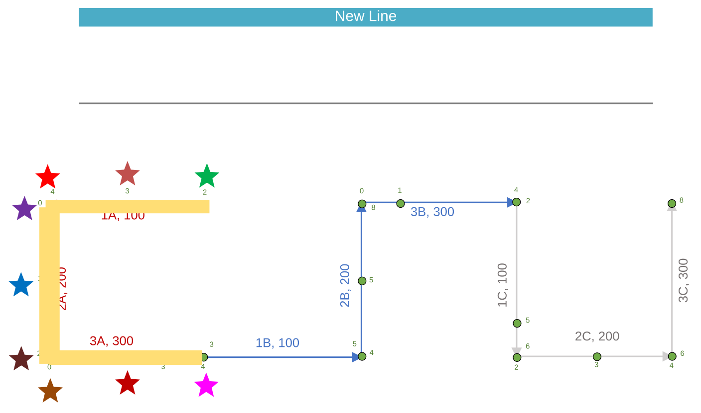

### Slide 93 <!-- slide 93 -->

{5940675A-B579-460E-94D1-54222C63F5DA}Recalibrate Source
Yes
Recalibrate Target
Yes
Date
12/31/2030

{5940675A-B579-460E-94D1-54222C63F5DA}Test ID
10
Network Type
Engineering (Point Events)
Test
Reassign partial routes in a line to a new line. Change names of partial routes.

{5940675A-B579-460E-94D1-54222C63F5DA}R Name
L NAME
From  Date
To Date
Line Order
From
Measure
To
Measure
1A
L0
1/1/2000
12/31/2030
100
2
4
2A
L0
1/1/2000
12/31/2030
200
0
2
3A
L0
1/1/2000
12/31/2030
300
0
4
1A
L_New
12/31/2030
Null
100
1
5
2A
L_New
12/31/2030
Null
200
0
3
3A
L_New
12/31/2030
Null
300
0
5
1B
L1
1/1/2000
Null
100
3
5
2B
L1
1/1/2000
Null
200
4
8
3B
L1
1/1/2000
Null
300
0
2
1C
L2
1/1/2000
Null
100
4
6
2C
L2
1/1/2000
Null
200
2
6
3C
L2
1/1/2000
Null
300
4
8

{5940675A-B579-460E-94D1-54222C63F5DA}EventID
From
Date
To
Date
RouteID
Measure
Loc
Error
001
1/1/2000
12/31/2030
1A
2
No Error
002
1/1/2000
12/31/2030
1A
3
No Error
003
1/1/2000
12/31/2030
1A
4
No Error
004
1/1/2000
12/31/2030
2A
0
No Error
005
1/1/2000
12/31/2030
2A
1
No Error
006
1/1/2000
12/31/2030
2A
2
No Error
007
1/1/2000
12/31/2030
3A
0
No Error
008
1/1/2000
12/31/2030
3A
2
No Error
009
1/1/2000
12/31/2030
3A
4
No Error
001
12/31/2030
Null
1A
2
No Error
002
12/31/2030
Null
1A
3
No Error
003
12/31/2030
Null
1A
4
No Error
004
12/31/2030
Null
2A
0
No Error
005
12/31/2030
Null
2A
1
No Error
006
12/31/2030
Null
2A
2
No Error
007
12/31/2030
Null
3A
0
No Error
008
12/31/2030
Null
3A
2
No Error
009
12/31/2030
Null
3A
4
No Error

[figure: New Line · 1A, 100 · 2A, 200 · 3A, 300 · 1B, 100 · 2B, 200 · 3B, 300 · 2C, 200 · 1C, 100 · 3C, 300 · 5 · 1 · 3 · 0 · 4 · 2 · 8 · 6]

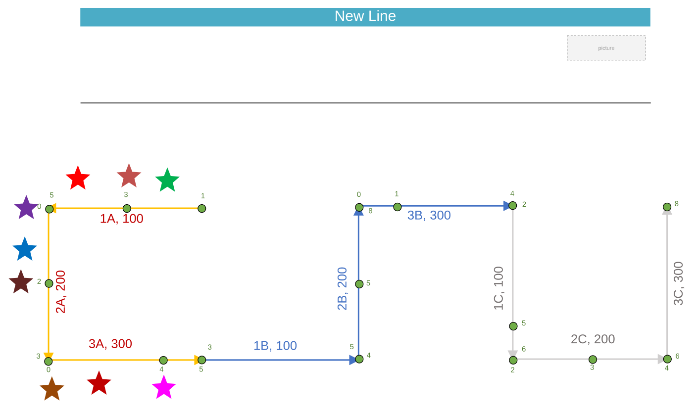

### Slide 94 <!-- slide 94 -->

{5940675A-B579-460E-94D1-54222C63F5DA}Recalibrate Source
Yes
Recalibrate Target
Yes
Date
12/31/2010

{5940675A-B579-460E-94D1-54222C63F5DA}Test ID
11
Network Type
Engineering (Point Events)
Test
Reassign all routes to a new line.  Routes are irregularly portioned.  Do not transfer calibration points.

{5940675A-B579-460E-94D1-54222C63F5DA}EventID
From
Date
To
Date
RouteID
Measure
Loc
Error
001
1/1/2000
Null
1A
2
No Error
002
1/1/2000
Null
1A
3
No Error
003
1/1/2000
Null
1A
4
No Error
004
1/1/2000
Null
2A
0
No Error
005
1/1/2000
Null
2A
1
No Error
006
1/1/2000
Null
2A
2
No Error
007
1/1/2000
Null
3A
0
No Error
008
1/1/2000
Null
3A
2
No Error
009
1/1/2000
Null
3A
4
No Error
{5940675A-B579-460E-94D1-54222C63F5DA}R Name
L NAME
From  Date
To Date
Line Order
From
Measure
To
Measure
1A
L0
1/1/2000
Null
100
2
4
2A
L0
1/1/2000
Null
200
0
2
3A
L0
1/1/2000
Null
300
0
4
1B
L1
1/1/2000
Null
100
3
5
2B
L1
1/1/2000
Null
200
4
8
3B
L1
1/1/2000
Null
300
0
2
1C
L2
1/1/2000
Null
100
4
6
2C
L2
1/1/2000
Null
200
2
6
3C
L2
1/1/2000
Null
300
4
8

[figure: 1A, 100 · 2A, 200 · 3A, 300 · 1B, 100 · 2B, 200 · 3B, 300 · 2C, 200 · 1C, 100 · 3C, 300 · 4 · 2 · 0 · 3 · 1 · 5 · 8 · 6]

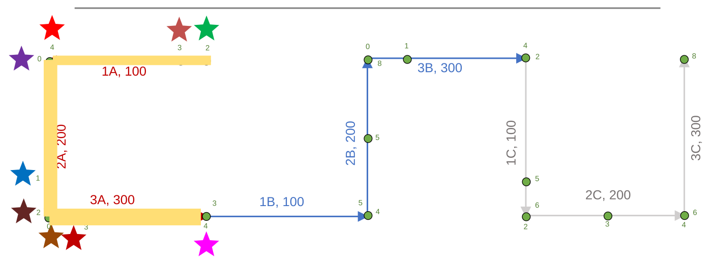

### Slide 95 <!-- slide 95 -->

{5940675A-B579-460E-94D1-54222C63F5DA}Test ID
11
Network Type
Engineering (Point Events)
Test
Reassign all routes to a new line.  Routes are irregularly portioned.  Do not transfer calibration points.

{5940675A-B579-460E-94D1-54222C63F5DA}EventID
From
Date
To
Date
RouteID
Measure
Loc
Error
001
1/1/2000
12/31/2010
1A
2
No Error
002
1/1/2000
12/31/2010
1A
3
No Error
003
1/1/2000
12/31/2010
1A
4
No Error
004
1/1/2000
12/31/2010
2A
0
No Error
005
1/1/2000
12/31/2010
2A
1
No Error
006
1/1/2000
12/31/2010
2A
2
No Error
007
1/1/2000
12/31/2010
3A
0
No Error
008
1/1/2000
12/31/2010
3A
2
No Error
009
1/1/2000
12/31/2010
3A
4
No Error
001
12/31/2030
Null
1A
2
No Error
002
12/31/2030
Null
1A
3
No Error
003
12/31/2030
Null
1A
4
No Error
004
12/31/2030
Null
2A
0
No Error
005
12/31/2030
Null
2A
1
No Error
006
12/31/2030
Null
2A
2
No Error
007
12/31/2030
Null
3A
0
No Error
008
12/31/2030
Null
3A
2
No Error
009
12/31/2030
Null
3A
4
No Error
{5940675A-B579-460E-94D1-54222C63F5DA}R Name
L NAME
From  Date
To Date
Line Order
From
Measure
To
Measure
1A
L0
1/1/2000
12/31/2010
100
2
4
2A
L0
1/1/2000
12/31/2010
200
0
2
3A
L0
1/1/2000
12/31/2010
300
0
4
1A
L_New
12/31/2010
Null
100
2
4
2A
L_New
12/31/2010
Null
200
0
2
3A
L_New
12/31/2010
Null
300
0
4
1B
L1
1/1/2000
Null
100
3
5
2B
L1
1/1/2000
Null
200
4
8
3B
L1
1/1/2000
Null
300
0
2
1C
L2
1/1/2000
Null
100
4
6
2C
L2
1/1/2000
Null
200
2
6
3C
L2
1/1/2000
Null
300
4
8

[figure: 1A, 100 · 2A, 200 · 3A, 300 · 1B, 100 · 2B, 200 · 3B, 300 · 2C, 200 · 1C, 100 · 3C, 300 · 4 · 2 · 0 · 3 · 5 · 8 · 1 · 6]

*(tables truncated at 200 — remaining tables render as plain text)*

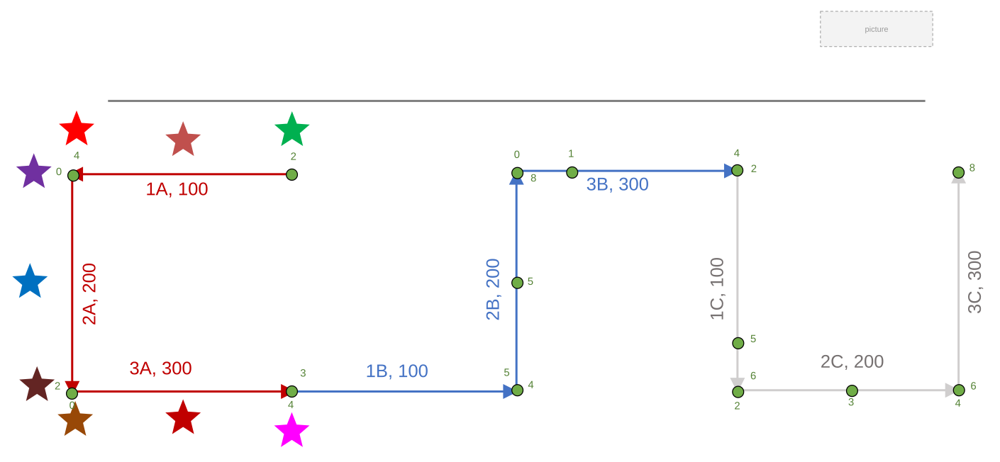
