# Reassign Route UI: Dynamic Support of Existing Methods Test Plan

| Field | Value |
| --- | --- |
| **Doc** | 550 · Test Plan · Experience Builder |
| **Product** | Roads & Highways · Pipeline Referencing |
| **Release** | — |
| **Issues** | [ArcGISPro/ps-location-referencing#5152](https://devtopia.esri.com/ArcGISPro/ps-location-referencing/issues/5152) |
| **Source** | [5152-ReassignRouteUIDynamicSupportofExistingMethods_TestPlan_V5.pptx](<https://esriis.sharepoint.com/sites/LocationReferencing/Shared%20Documents/General/Test%20Plans/5152-ReassignRouteUIDynamicSupportofExistingMethods_TestPlan_V5.pptx>) · rev V5 |
| **People** | author Mac Christmas · PE — · dev — |
| **Edited** | 2023-06-07 19:49 by Mac Christmas |
| **Extracted** | 2026-09-04 · lane xmlstrip · format 3.0 · prompt v2.0.2 |
| **Keywords** | reassign route · merge to adjacent route · form a new route · dynamic segmentation · calibration points · recalibration · line network · nonline network · route attributes · user interface · test plan |
| **Tools** | — |

## Summary

Test plan for the Reassign Route user interface focusing on dynamic support of existing methods including Merge to adjacent route and Form a new route. Covers positive and negative test cases for APR, RH, and PoM data across file geodatabase, enterprise geodatabase, and feature service environments. Tests include UI behavior, parameter validation, recalibration, transfer of calibration points, and handling of line and non-line networks.

## Related documents

<!-- related:begin -->
- [Reassign UI Change to Dynamically Support Existing Reassign Methods - Pro](<https://esriis.sharepoint.com/sites/lrsworkspace/LRS%20Doc%20Index/User%20Stories/reassign-ui-change-to-dynamically-support-existing-reassign.md>) — similar text 0.49 · 4 title words · 1 filename word <!-- rel:586 s=4.981 -->
- [Reassign Route AI Assistant Test Plan](<https://esriis.sharepoint.com/sites/lrsworkspace/LRS Doc Index/Test Plans/7039-reassign-route-ai-assistant.md>) — similar text 0.17 · 2 title words · 2 filename words · same kind/folder <!-- rel:34 s=4.963 -->
- [Reassign Route Subsequent Pane AI Assistant Test Plan](<https://esriis.sharepoint.com/sites/lrsworkspace/LRS%20Doc%20Index/Test%20Plans/7167-reassign-route-subsequent-pane-ai-assistant.md>) — similar text 0.14 · 2 title words · 2 filename words · same kind/folder <!-- rel:11 s=4.703 -->
- [Reassign Route Transfer to Another Line Method: Support Move Event Behavior Test Plan](<https://esriis.sharepoint.com/sites/lrsworkspace/LRS Doc Index/Test Plans/5141-reassign-route-transfer-to-another-line-method-support-move.md>) — similar text 0.30 · 3 title words · 1 filename word · same kind/folder <!-- rel:533 s=4.358 -->
- [Reassign UI Existing Line Test Plan](<https://esriis.sharepoint.com/sites/lrsworkspace/LRS Doc Index/Test Plans/reassign-ui-existing-line.md>) — similar text 0.29 · 2 title words · 2 filename words · same kind/folder <!-- rel:535 s=4.155 -->
<!-- related:end -->

<!-- docs:begin -->
## Esri documentation

[Route reassignment](https://doc.esri.com/en/arcgis-pro/latest/help/production/roads-highways/reassign-routes.html) · [Merge to adjacent route method](https://doc.esri.com/en/arcgis-pro/latest/help/production/roads-highways/merge-to-adjacent-route-method.html) · [Apply dynamic segmentation](https://doc.esri.com/en/arcgis-pro/latest/help/production/roads-highways/apply-dynamic-segmentation.html)
<!-- docs:end -->

---

## Overview

### Slide 1 — Reassign Route UI: Dynamic Support of Existing Methods <!-- slide 1 -->

**Notes**
- Test only with existing reassign methods. These methods are Merge to adjacent route and Form a new route
- Test with APR, RH, and PoM data
- Test mostly in FS, test a couple cases in FGDB and EGDB DC
- Sample test with normal and complex routes with partial, whole, and entire route(s) selected to reassign. Also test combinations of multiple routes, partial, whole route(s), partial of one route and whole of another route, etc.
- Test in Light and Dark mode
- Sample test each existing method’s UI changes and check reassignment results are correct with associated parameters (transfer calibration points, recalibrate downstream, etc.) used
- Test on projected/unprojected data
- Hover text for methods will be part of a different user story
- 508 and i18n
- Doc needs update to reflect UI changes
- Automation covered in separate user story

Devtopia Issue

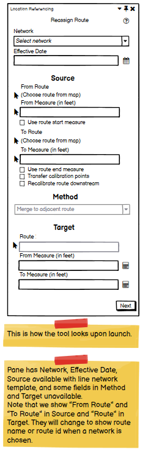

## Test Cases

### TC-P01 — Ensure that when no network is chosen <!-- src: S4 · slide 2 · Positive Tests: General · 1 -->

- **Group:** General
- **Case:** Ensure that when no network is chosen, the Method section defaults to Merge to adjacent route (grayed out) and the Target section Route Name is grayed out

### TC-P02 — Ensure that when no network is chosen the source section defaults to the line <!-- src: S4 · slide 2 · Positive Tests: General · 2 -->

- **Group:** General
- **Case:** Ensure that when no network is chosen the source section defaults to the line network layout

### TC-P03 — Ensure that once a network is chosen <!-- src: S4 · slide 2 · Positive Tests: General · 3 -->

- **Group:** General
- **Case:** Ensure that once a network is chosen, target section becomes available based on the network type chosen as the input network

### TC-P04 — Ensure that if the input network is changed <!-- src: S4 · slide 2 · Positive Tests: General · 4 -->

- **Group:** General
- **Case:** Ensure that if the input network is changed, clear all input info and reset the method dropdown to the default value based on whether an input nonline or line network is chosen. Also ensure the target section updates to reflect the chosen network

### TC-P05 — Ensure that if the method is changed <!-- src: S4 · slide 2 · Positive Tests: General · 5 -->

- **Group:** General
- **Case:** Ensure that if the method is changed, clear all input info in the Target section and replace with the relevant target section info for the newly chosen method

### TC-P06 — Ensure “Source Route” and “Target Route” sections have been renamed to “Source” <!-- src: S4 · slide 2 · Positive Tests: General · 6 -->

- **Group:** General
- **Case:** Ensure “Source Route” and “Target Route” sections have been renamed to “Source” and “Target,” respectively

### TC-P07 — Ensure all measure/route/line pickers work as intended <!-- src: S4 · slide 2 · Positive Tests: General · 7 -->

- **Group:** General

### TC-P08 — Ensure calendar date picker works as intended <!-- src: S4 · slide 2 · Positive Tests: General · 8 -->

- **Group:** General

### TC-P09 — Ensure all calculation buttons work as intended <!-- src: S4 · slide 2 · Positive Tests: General · 9 -->

- **Group:** General

### TC-P10 — Ensure all check boxes work as intended <!-- src: S4 · slide 2 · Positive Tests: General · 10 -->

- **Group:** General

### TC-P11 — Ensure that when a network is configured with RouteName vs. RouteID the tool <!-- src: S4 · slide 2 · Positive Tests: General · 11 -->

- **Group:** General
- **Case:** Ensure that when a network is configured with RouteName vs. RouteID the tool reflects this

### TC-P12 — Ensure a scroll bar appears if the contents are too long to fit within the pane. <!-- src: S4 · slide 2 · Positive Tests: General · 12 -->

- **Group:** General

### TC-P13 — Ensure switching between panes maintains inputs <!-- src: S4 · slide 2 · Positive Tests: General · 13 -->

- **Group:** General

### TC-P14 — Ensure that scrolling works correctly when a dropdown is active <!-- src: S4 · slide 2 · Positive Tests: General · 14 -->

- **Group:** General

### TC-P15 — If method is set to Form a new route <!-- src: S4 · slide 2 · Positive Tests: General · 15 -->

- **Group:** General
- **Case:** If method is set to Form a new route, ensure that recalibrate target route checkbox does not show

### TC-P16 — Ensure the methods dropdown only has “Merge to adjacent route” and “Form a new (1) <!-- src: S4 · slide 2 · Positive Tests: Non-Line Network First Pane (Input Parameters) · 1 -->

- **Group:** Non-Line Network First Pane (Input Parameters)
- **Case:** Ensure the methods dropdown only has “Merge to adjacent route” and “Form a new route” methods

### TC-P17 — Ensure method “Merge to adjacent route” is chosen by default (1) <!-- src: S4 · slide 2 · Positive Tests: Non-Line Network First Pane (Input Parameters) · 2 -->

- **Group:** Non-Line Network First Pane (Input Parameters)

### TC-P18 — Ensure the tool runs without a second pane only if the input LRS network has no <!-- src: S4 · slide 2 · Positive Tests: Non-Line Network First Pane (Input Parameters) · 3 -->

- **Group:** Non-Line Network First Pane (Input Parameters)
- **Case:** Ensure the tool runs without a second pane only if the input LRS network has no nonLRS attributes

### TC-P19 — Ensure once a nonline network is the input, change the source, method <!-- src: S4 · slide 2 · Positive Tests: Non-Line Network First Pane (Input Parameters) · 4 -->

- **Group:** Non-Line Network First Pane (Input Parameters)
- **Case:** Ensure once a nonline network is the input, change the source, method, and target sections are the nonline network template

### TC-P20 — Ensure the second pane appears only when the input LRS Network has nonLRS <!-- src: S4 · slide 2 · Positive Tests: Non-Line Network Second Pane (New Route Attributes) · 1 -->

- **Group:** Non-Line Network Second Pane (New Route Attributes)
- **Case:** Ensure the second pane appears only when the input LRS Network has nonLRS attributes

### TC-P21 — Test domains, attribute rules, contingent values (1) <!-- src: S4 · slide 2 · Positive Tests: Non-Line Network Second Pane (New Route Attributes) · 2 -->

- **Group:** Non-Line Network Second Pane (New Route Attributes)
- **Case:** Test domains, attribute rules, contingent values, and subtypes work correctly in the attribute grid

### TC-P22 — Ensure the field aliases show and not the actual field name (1) <!-- src: S4 · slide 2 · Positive Tests: Non-Line Network Second Pane (New Route Attributes) · 3 -->

- **Group:** Non-Line Network Second Pane (New Route Attributes)

### TC-P23 — Ensure a scroll bar appears if there are too many attribute fields to fit within (1) <!-- src: S4 · slide 2 · Positive Tests: Non-Line Network Second Pane (New Route Attributes) · 4 -->

- **Group:** Non-Line Network Second Pane (New Route Attributes)
- **Case:** Ensure a scroll bar appears if there are too many attribute fields to fit within the pane

### TC-P24 — Ensure a scroll bar appears if a field has too many values to fit within (1) <!-- src: S4 · slide 2 · Positive Tests: Non-Line Network Second Pane (New Route Attributes) · 5 -->

- **Group:** Non-Line Network Second Pane (New Route Attributes)
- **Case:** Ensure a scroll bar appears if a field has too many values to fit within the pane

### TC-P25 — Ensure the eyedropper tool works as intended, sanity test (1) <!-- src: S4 · slide 2 · Positive Tests: Non-Line Network Second Pane (New Route Attributes) · 6 -->

- **Group:** Non-Line Network Second Pane (New Route Attributes)

### TC-P26 — Ensure the routes that will be retired as a result of the reassignment are shown <!-- src: S4 · slide 3 · Positive Tests: Line Network Second Pane (Routes to Retire) · 1 -->

- **Group:** Line Network Second Pane (Routes To Retire)
- **Case:** Ensure the routes that will be retired as a result of the reassignment are shown with the measures where the routes will be retired

### TC-P27 — For Merge to adjacent route method <!-- src: S4 · slide 3 · Positive Tests: Line Network Second Pane (Routes to Retire) · 2 -->

- **Group:** Line Network Second Pane (Routes To Retire)
- **Case:** For Merge to adjacent route method, ensure that a note is added detailing how the routes on the source line will be retired and merged into the target route

### TC-P28 — For Form a new route method <!-- src: S4 · slide 3 · Positive Tests: Line Network Second Pane (Routes to Retire) · 3 -->

- **Group:** Line Network Second Pane (Routes To Retire)
- **Case:** For Form a new route method, ensure that a note is added detailing how the routes on the source line will be retired and form a single target route

### TC-P29 — Ensure the third pane appears only when the input LRS Network has nonLRS <!-- src: S4 · slide 3 · Positive Tests: Line Network Third Pane (New Route Attributes) · 1 -->

- **Group:** Line Network Third Pane (New Route Attributes)
- **Case:** Ensure the third pane appears only when the input LRS Network has nonLRS attributes

### TC-P30 — Test domains, attribute rules, contingent values (2) <!-- src: S4 · slide 3 · Positive Tests: Line Network Third Pane (New Route Attributes) · 2 -->

- **Group:** Line Network Third Pane (New Route Attributes)
- **Case:** Test domains, attribute rules, contingent values, and subtypes work correctly in the attribute grid

### TC-P31 — Ensure the field aliases show and not the actual field name (2) <!-- src: S4 · slide 3 · Positive Tests: Line Network Third Pane (New Route Attributes) · 3 -->

- **Group:** Line Network Third Pane (New Route Attributes)

### TC-P32 — Ensure a scroll bar appears if there are too many attribute fields to fit within (2) <!-- src: S4 · slide 3 · Positive Tests: Line Network Third Pane (New Route Attributes) · 4 -->

- **Group:** Line Network Third Pane (New Route Attributes)
- **Case:** Ensure a scroll bar appears if there are too many attribute fields to fit within the pane

### TC-P33 — Ensure a scroll bar appears if a field has too many values to fit within (2) <!-- src: S4 · slide 3 · Positive Tests: Line Network Third Pane (New Route Attributes) · 5 -->

- **Group:** Line Network Third Pane (New Route Attributes)
- **Case:** Ensure a scroll bar appears if a field has too many values to fit within the pane

### TC-P34 — Ensure the eyedropper tool works as intended, sanity test (2) <!-- src: S4 · slide 3 · Positive Tests: Line Network Third Pane (New Route Attributes) · 6 -->

- **Group:** Line Network Third Pane (New Route Attributes)

### TC-N01 — Ensure that when Merge to adjacent route method is chosen (1) <!-- src: S4 · slide 3 · Negative Tests: Line Network · 1 -->

- **Group:** Line Network
- **Case:** Ensure that when Merge to adjacent route method is chosen, the route name cannot be a non-adjacent route or a new route

### TC-N02 — Ensure that when Form a new route method is chosen (1) <!-- src: S4 · slide 3 · Negative Tests: Line Network · 2 -->

- **Group:** Line Network
- **Case:** Ensure that when Form a new route method is chosen, the new Route Name or RouteID cannot be the same as an existing route

### TC-N03 — Ensure that validation for incorrect input parameters occurs when Next (1) <!-- src: S4 · slide 3 · Negative Tests: Line Network · 3 -->

- **Group:** Line Network
- **Case:** Ensure that validation for incorrect input parameters occurs when Next is clicked. Sample test invalid route creation scenarios

### TC-N04 — Ensure that when Merge to adjacent route method is chosen (2) <!-- src: S4 · slide 3 · Negative Tests: Non-Line Network · 1 -->

- **Group:** Non-Line Network
- **Case:** Ensure that when Merge to adjacent route method is chosen, the route name cannot be a non-adjacent route or a new route

### TC-N05 — Ensure that when Form a new route method is chosen (2) <!-- src: S4 · slide 3 · Negative Tests: Non-Line Network · 2 -->

- **Group:** Non-Line Network
- **Case:** Ensure that when Form a new route method is chosen, the route name cannot be the same as an existing route

### TC-N06 — Ensure that validation for incorrect input parameters occurs when Next (2) <!-- src: S4 · slide 3 · Negative Tests: Non-Line Network · 3 -->

- **Group:** Non-Line Network
- **Case:** Ensure that validation for incorrect input parameters occurs when Next is clicked. Sample test invalid route creation scenarios

### TC-P35 — Ensure the methods dropdown only has “Merge to adjacent route” and “Form a new (2) <!-- src: S4 · slide 3 · Positive Tests: Line Network First Pane (Input Parameters) · 1 -->

- **Group:** Line Network First Pane (Input Parameters)
- **Case:** Ensure the methods dropdown only has “Merge to adjacent route” and “Form a new route” methods

### TC-P36 — Ensure method “Merge to adjacent route” is chosen by default (2) <!-- src: S4 · slide 3 · Positive Tests: Line Network First Pane (Input Parameters) · 2 -->

- **Group:** Line Network First Pane (Input Parameters)

### TC-P37 — Ensure the tool runs without the third pane only if the input LRS network has no <!-- src: S4 · slide 3 · Positive Tests: Line Network First Pane (Input Parameters) · 3 -->

- **Group:** Line Network First Pane (Input Parameters)
- **Case:** Ensure the tool runs without the third pane only if the input LRS network has no nonLRS attributes

### TC-P38 — Ensure that once a line network is chosen, the source, method <!-- src: S4 · slide 3 · Positive Tests: Line Network First Pane (Input Parameters) · 4 -->

- **Group:** Line Network First Pane (Input Parameters)
- **Case:** Ensure that once a line network is chosen, the source, method, and target sections change to the line network template

## Other content

### Slide 2 <!-- slide 2 -->

### Slide 4 — Nonline, Merge to Adjacent Route, Recalibrate Target and Transfer CPs <!-- slide 4 -->

| From Date | To Date | RouteID | Route Name | Measures |
| --- | --- | --- | --- | --- |
| 1/1/2000 | Null | R1 | R1 | 0-10 |
| 1/1/2000 | Null | R2 | R2 | 11-15 |
| 1/1/2000 | Null | R3 | R3 | 15.5-20 |

| From Date | To Date | RouteID | Route Name | Measures |
| --- | --- | --- | --- | --- |
| 1/1/2000 | Null | R1 | R1 | 0-10 |
| 1/1/2000 | 1/1/2005 | R2 | R2 | 11-15 |
| 1/1/2000 | 1/1/2005 | R3 | R3 | 15.5-20 |
| 1/1/2005 | Null | R2 | R2 | 11-12 |
| 1/1/2005 | Null | R3 | R3 | 12-20 |

| Network | Effective Date | Source From RouteID | Source From Measure | Source To Measure | Method | Target RouteID | Target From Measure | Target To Measure | Recalibrate route downstream | Transfer CPs |
| --- | --- | --- | --- | --- | --- | --- | --- | --- | --- | --- |
| Continuous | 1/1/2005 | R2 | 12 | 15 | Merge to adjacent route | R3 | 12 | 15 | Yes | Yes |

[figure: R1 · R2 · R3 · 0 · 6 · 10–13 · 15 · 16 · 20 · Before: · Input: · After: · 12]

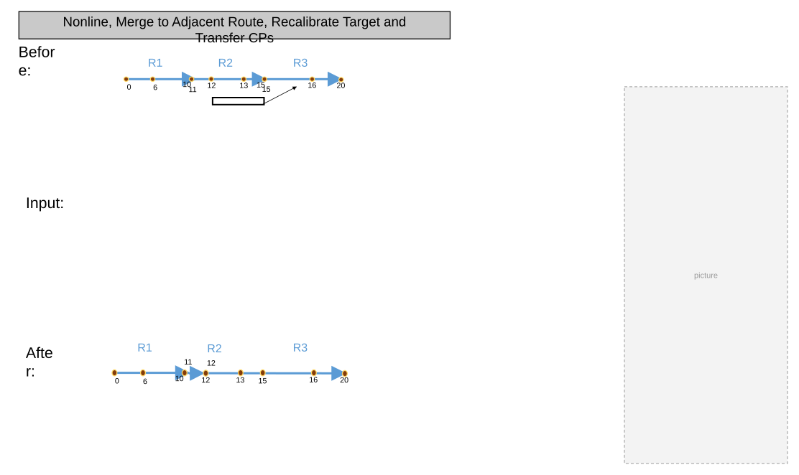

### Slide 5 — Nonline, Merge to Adjacent Route, Recalibrate Target and do not Transfer CPs <!-- slide 5 -->

| From Date | To Date | RouteID | Route Name | Measures |
| --- | --- | --- | --- | --- |
| 1/1/2000 | Null | R1 | R1 | 0-10 |
| 1/1/2000 | Null | R2 | R2 | 11-15 |
| 1/1/2000 | Null | R3 | R3 | 15.5-20 |

| From Date | To Date | RouteID | Route Name | Measures |
| --- | --- | --- | --- | --- |
| 1/1/2000 | Null | R1 | R1 | 0-10 |
| 1/1/2000 | 1/1/2005 | R2 | R2 | 11-15 |
| 1/1/2000 | 1/1/2005 | R3 | R3 | 15.5-20 |
| 1/1/2005 | Null | R2 | R2 | 11-12 |
| 1/1/2005 | Null | R3 | R3 | 12-20 |

| Network | Effective Date | Source From RouteID | Source From Measure | Source To Measure | Method | Target RouteID | Target From Measure | Target To Measure | Recalibrate route downstream | Transfer CPs |
| --- | --- | --- | --- | --- | --- | --- | --- | --- | --- | --- |
| Continuous | 1/1/2005 | R2 | 12 | 15 | Merge to adjacent route | R3 | 12 | 15 | Yes | No |

[figure: R1 · R2 · R3 · 0 · 6 · 10–13 · 15 · 15.5 · 16 · 20 · Before: · Input: · After: · 10–12 · 12]

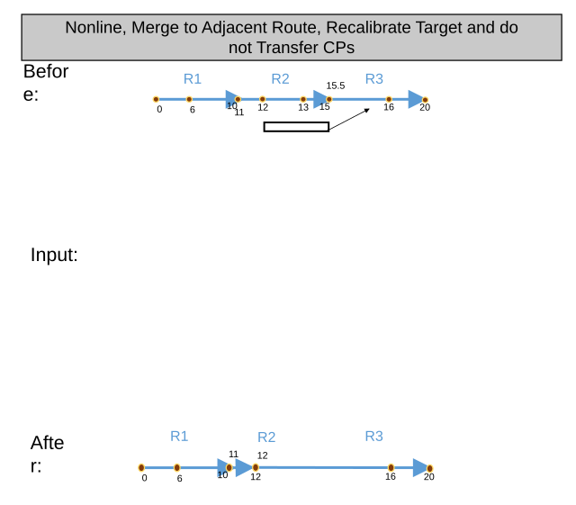

### Slide 6 <!-- slide 6 -->

Nonline, Merge to Adjacent Route, do not Recalibrate Target and do not Transfer CPs

| From Date | To Date | RouteID | Route Name | Measures |
| --- | --- | --- | --- | --- |
| 1/1/2000 | Null | R1 | R1 | 0-10 |
| 1/1/2000 | Null | R2 | R2 | 11-15 |
| 1/1/2000 | Null | R3 | R3 | 15.5-20 |

| Network | Effective Date | Source From RouteID | Source From Measure | Source To Measure | Method | Target RouteID | Target From Measure | Target To Measure | Recalibrate route downstream | Transfer CPs |
| --- | --- | --- | --- | --- | --- | --- | --- | --- | --- | --- |
| Continuous | 1/1/2005 | R2 | 12 | 15 | Merge to adjacent route | R3 | 15 | 18 | No | No |

Error, result is non-monotonic

[figure: Before: · Input: · After: · R1 · R2 · R3 · 0 · 6 · 10–13 · 15 · 15.5 · 16 · 20]

### Slide 7 — Nonline, Merge to Adjacent Route, do not Recalibrate Target and Transfer CPs <!-- slide 7 -->

| From Date | To Date | RouteID | Route Name | Measures |
| --- | --- | --- | --- | --- |
| 1/1/2000 | Null | R1 | R1 | 0-10 |
| 1/1/2000 | Null | R2 | R2 | 11-15 |
| 1/1/2000 | Null | R3 | R3 | 15.5-20 |

| Network | Effective Date | Source From RouteID | Source From Measure | Source To Measure | Method | Target RouteID | Target From Measure | Target To Measure | Recalibrate route downstream | Transfer CPs |
| --- | --- | --- | --- | --- | --- | --- | --- | --- | --- | --- |
| Continuous | 1/1/2005 | R2 | 12 | 15 | Merge to adjacent route | R3 | 15 | 18 | No | Yes |

Error, result is non-monotonic

[figure: Before: · Input: · After: · R1 · R2 · R3 · 0 · 6 · 10–13 · 15 · 15.5 · 16 · 20]

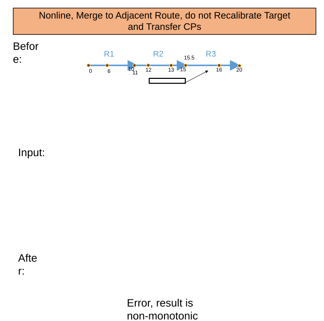

### Slide 8 — Nonline, Form a new route, Transfer CPs <!-- slide 8 -->

| From Date | To Date | RouteID | Route Name | Measures |
| --- | --- | --- | --- | --- |
| 1/1/2000 | Null | R1 | R1 | 0-10 |
| 1/1/2000 | Null | R2 | R2 | 11-15 |
| 1/1/2000 | Null | R3 | R3 | 15.5-20 |

| From Date | To Date | RouteID | Route Name | Measures |
| --- | --- | --- | --- | --- |
| 1/1/2000 | Null | R1 | R1 | 0-10 |
| 1/1/2000 | 1/1/2005 | R2 | R2 | 11-15 |
| 1/1/2000 | 1/1/2005 | R3 | R3 | 15.5-20 |
| 1/1/2005 | Null | R2 | R2 | 10-12 |
| 1/1/2005 | Null | Rnew | Rnew | 0-5 |
| 1/1/2005 | Null | R3 | R3 | 15.5-20 |

| Network | Effective Date | Source From RouteID | Source From Measure | Source To Measure | Method | Target RouteID | Target From Measure | Target To Measure | Recalibrate route downstream | Transfer CPs |
| --- | --- | --- | --- | --- | --- | --- | --- | --- | --- | --- |
| Continuous | 1/1/2005 | R2 | 12 | 15 | Form a new route | Rnew | 0 | 5 | N/A | Yes |

[figure: Before: · Input: · After: · R1 · R2 · R3 · 0 · 6 · 10 · 12 · 5 · 15.5 · 16 · 20 · Rnew · 10–13 · 15 · 2 · 4]

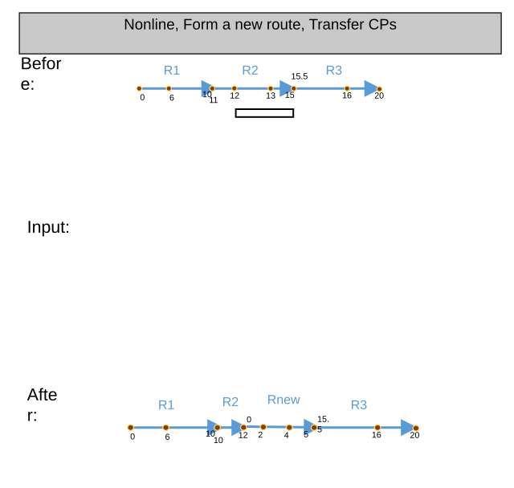

### Slide 9 — Nonline, Form a new route, do not Transfer CPs <!-- slide 9 -->

| From Date | To Date | RouteID | Route Name | Measures |
| --- | --- | --- | --- | --- |
| 1/1/2000 | Null | R1 | R1 | 0-10 |
| 1/1/2000 | Null | R2 | R2 | 11-15 |
| 1/1/2000 | Null | R3 | R3 | 15.5-20 |

| From Date | To Date | RouteID | Route Name | Measures |
| --- | --- | --- | --- | --- |
| 1/1/2000 | Null | R1 | R1 | 0-10 |
| 1/1/2000 | 1/1/2005 | R2 | R2 | 11-15 |
| 1/1/2000 | 1/1/2005 | R3 | R3 | 15.5-20 |
| 1/1/2005 | Null | R2 | R2 | 11-12 |
| 1/1/2005 | Null | Rnew | Rnew | 0-5 |
| 1/1/2005 | Null | R3 | R3 | 15.5-20 |

| Network | Effective Date | Source From RouteID | Source From Measure | Source To Measure | Method | Target RouteID | Target From Measure | Target To Measure | Recalibrate route downstream | Transfer CPs |
| --- | --- | --- | --- | --- | --- | --- | --- | --- | --- | --- |
| Continuous | 1/1/2005 | R2 | 12 | 15 | Form a new route | Rnew | 0 | 5 | N/A | No |

[figure: R1 · R2 · R3 · 0 · 6 · 10–13 · 15 · 15.5 · 16 · 20 · Before: · Input: · After: · 10–12 · 5 · Rnew]

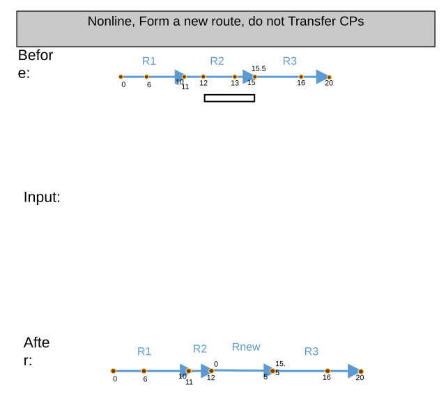

### Slide 10 <!-- slide 10 -->

Line, Merge to adjacent route (on the same line), Recalibrate Target and Transfer CPs

| From Date | To Date | RouteID | Route Name | LineID | Line Name | LineOrder | Measures |
| --- | --- | --- | --- | --- | --- | --- | --- |
| 1/1/2000 | Null | R1 | R1 | Line1 | Line1 | 100 | 0-10 |
| 1/1/2000 | Null | R2 | R2 | Line1 | Line1 | 200 | 11-15 |
| 1/1/2000 | Null | R3 | R3 | Line1 | Line1 | 300 | 15.5-20 |

| From Date | To Date | RouteID | Route Name | LineID | Line Name | LineOrder | Measures |
| --- | --- | --- | --- | --- | --- | --- | --- |
| 1/1/2000 | 1/1/2005 | R1 | R1 | Line1 | Line1 | 100 | 0-10 |
| 1/1/2000 | 1/1/2005 | R2 | R2 | Line1 | Line1 | 200 | 11-15 |
| 1/1/2000 | 1/1/2005 | R3 | R3 | Line1 | Line1 | 300 | 15.5-20 |
| 1/1/2005 | Null | R1 | R1 | Line1 | Line1 | 100 | 0-6 |
| 1/1/2005 | Null | R3 | R3 | Line1 | Line1 | 200 | 7-20 |

| Network | Effective Date | Source From Route Name | Source From Measure | Source To Route Name | Source To Measure | Method | Target Route Name | Target From Measure | Target To Measure | Recalibrate route downstream | Transfer CPs |
| --- | --- | --- | --- | --- | --- | --- | --- | --- | --- | --- | --- |
| Engineering | 1/1/2005 | R1 | 6 | R2 | 15 | Merge to adjacent route | R3 | 7 | 15 | Yes | Yes |

[figure: Before: · Input: · After: · Line1 · R1 · R3 · 0 · 6 · 10 · 12 · 13 · 15 · 16 · 20 · R2 · 10–13 · 15.5]

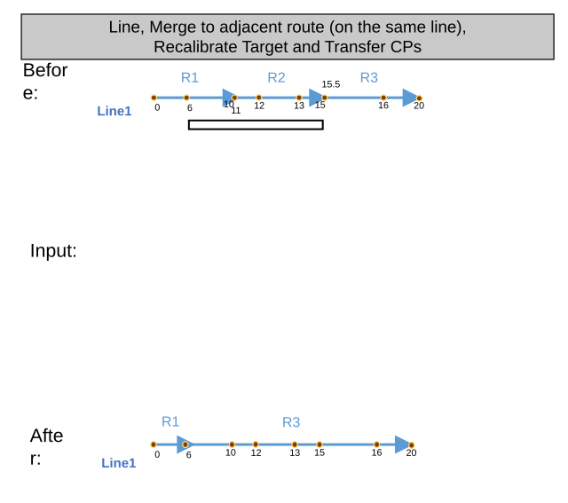

### Slide 11 <!-- slide 11 -->

Line, Merge to adjacent route (on the same line), Recalibrate Target and do not Transfer CPs

| From Date | To Date | RouteID | Route Name | LineID | Line Name | LineOrder | Measures |
| --- | --- | --- | --- | --- | --- | --- | --- |
| 1/1/2000 | Null | R1 | R1 | Line1 | Line1 | 100 | 0-10 |
| 1/1/2000 | Null | R2 | R2 | Line1 | Line1 | 200 | 10-15 |
| 1/1/2000 | Null | R3 | R3 | Line1 | Line1 | 300 | 15-20 |

| From Date | To Date | RouteID | Route Name | LineID | Line Name | LineOrder | Measures |
| --- | --- | --- | --- | --- | --- | --- | --- |
| 1/1/2000 | 1/1/2005 | R1 | R1 | Line1 | Line1 | 100 | 0-10 |
| 1/1/2000 | 1/1/2005 | R2 | R2 | Line1 | Line1 | 200 | 10-15 |
| 1/1/2000 | 1/1/2005 | R3 | R3 | Line1 | Line1 | 300 | 15-20 |
| 1/1/2005 | Null | R1 | R1 | Line1 | Line1 | 100 | 0-6 |
| 1/1/2005 | Null | R3 | R3 | Line1 | Line1 | 200 | 7-20 |

| Network | Effective Date | Source From Route Name | Source From Measure | Source To Route Name | Source To Measure | Method | Target Route Name | Target From Measure | Target To Measure | Recalibrate route downstream | Transfer CPs |
| --- | --- | --- | --- | --- | --- | --- | --- | --- | --- | --- | --- |
| Engineering | 1/1/2005 | R1 | 6 | R2 | 15 | Merge to adjacent route | R3 | 7 | 15 | Yes | No |

[figure: R1 · R2 · R3 · 0 · 6 · 10 · 12 · 13 · 15 · 16 · 20 · Before: · Input: · After: · Line1 · 7]

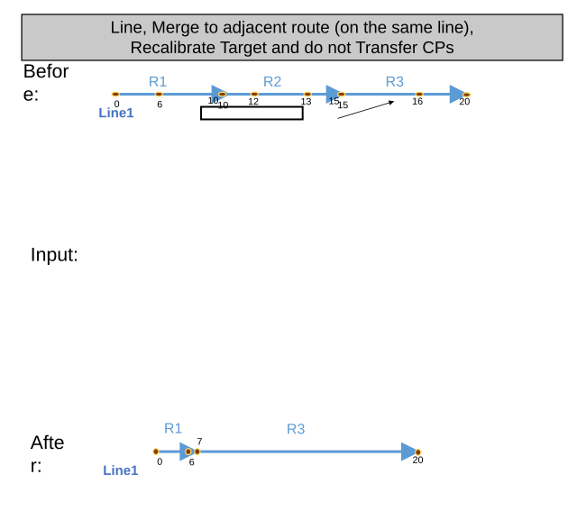

### Slide 12 <!-- slide 12 -->

Line, Merge to adjacent route (on the same line), do not Recalibrate Target and do not Transfer CPs

| From Date | To Date | RouteID | Route Name | LineID | Line Name | LineOrder | Measures |
| --- | --- | --- | --- | --- | --- | --- | --- |
| 1/1/2000 | Null | R1 | R1 | Line1 | Line1 | 100 | 0-10 |
| 1/1/2000 | Null | R2 | R2 | Line1 | Line1 | 200 | 10-15 |
| 1/1/2000 | Null | R3 | R3 | Line1 | Line1 | 300 | 15-20 |

| Network | Effective Date | Source From Route Name | Source From Measure | Source To Route Name | Source To Measure | Method | Target Route Name | Target From Measure | Target To Measure | Recalibrate route downstream | Transfer CPs |
| --- | --- | --- | --- | --- | --- | --- | --- | --- | --- | --- | --- |
| Engineering | 1/1/2005 | R1 | 6 | R2 | 15 | Merge to adjacent route | R3 | 15 | 24 | No | No |

Error, result is non-monotonic

[figure: Before: · Input: · After: · R1 · R2 · R3 · 0 · 6 · 10 · 12 · 13 · 15 · 16 · 20 · Line1]

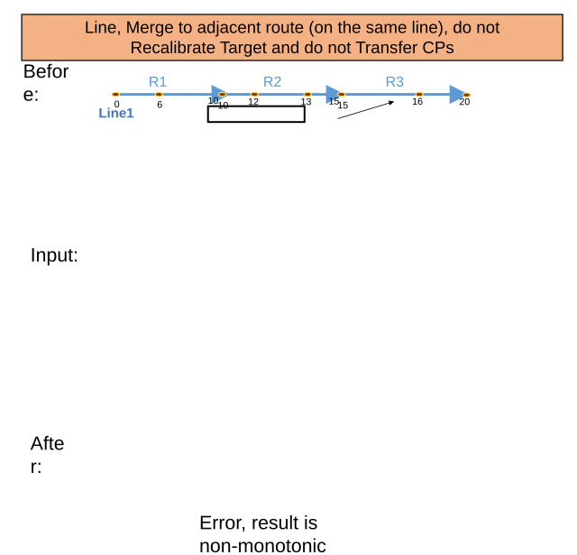

### Slide 13 <!-- slide 13 -->

Line, Merge to adjacent route (on the same line), do not Recalibrate Target and Transfer CPs

| From Date | To Date | RouteID | Route Name | LineID | Line Name | LineOrder | Measures |
| --- | --- | --- | --- | --- | --- | --- | --- |
| 1/1/2000 | Null | R1 | R1 | Line1 | Line1 | 100 | 0-10 |
| 1/1/2000 | Null | R2 | R2 | Line1 | Line1 | 200 | 10-15 |
| 1/1/2000 | Null | R3 | R3 | Line1 | Line1 | 300 | 15-20 |

| Network | Effective Date | Source From Route Name | Source From Measure | Source To Route Name | Source To Measure | Method | Target Route Name | Target From Measure | Target To Measure | Recalibrate route downstream | Transfer CPs |
| --- | --- | --- | --- | --- | --- | --- | --- | --- | --- | --- | --- |
| Engineering | 1/1/2005 | R1 | 6 | R2 | 15 | Merge to adjacent route | R3 | 15 | 24 | No | Yes |

Error, result is non-monotonic

[figure: Before: · Input: · After: · R1 · R2 · R3 · 0 · 6 · 10 · 12 · 13 · 15 · 16 · 20 · Line1]

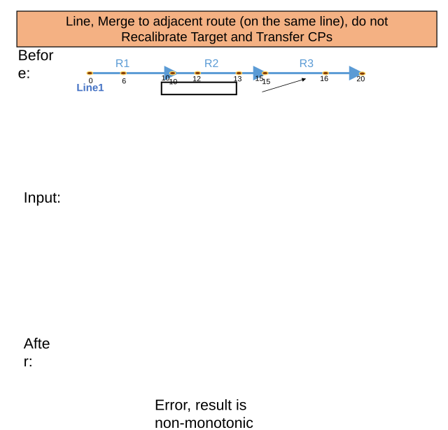

### Slide 14 <!-- slide 14 -->

Line, Form a new route (on the same line), do not Transfer CPs

| From Date | To Date | RouteID | Route Name | LineID | Line Name | LineOrder | Measures |
| --- | --- | --- | --- | --- | --- | --- | --- |
| 1/1/2000 | Null | R1 | R1 | Line1 | Line1 | 100 | 0-10 |
| 1/1/2000 | Null | R2 | R2 | Line1 | Line1 | 200 | 10-15 |
| 1/1/2000 | Null | R3 | R3 | Line1 | Line1 | 300 | 15-20 |

| From Date | To Date | RouteID | Route Name | LineID | Line Name | LineOrder | Measures |
| --- | --- | --- | --- | --- | --- | --- | --- |
| 1/1/2000 | 1/1/2005 | R1 | R1 | Line1 | Line1 | 100 | 0-10 |
| 1/1/2000 | 1/1/2005 | R2 | R2 | Line1 | Line1 | 200 | 10-15 |
| 1/1/2000 | 1/1/2005 | R3 | R3 | Line1 | Line1 | 300 | 15-20 |
| 1/1/2005 | Null | R1 | R1 | Line1 | Line1 | 100 | 0-6 |
| 1/1/2005 | Null | Rnew | Rnew | Line1 | Line1 | 200 | 7-15 |
| 1/1/2005 | Null | R3 | R3 | Line1 | Line1 | 300 | 7-20 |

| Network | Effective Date | Source From Route Name | Source From Measure | Source To Route Name | Source To Measure | Method | Target Route Name | Target From Measure | Target To Measure | Recalibrate route downstream | Transfer CPs |
| --- | --- | --- | --- | --- | --- | --- | --- | --- | --- | --- | --- |
| Engineering | 1/1/2005 | R1 | 6 | R2 | 15 | Form a new route | R3 | 7 | 15 | N/A | Yes |

[figure: Before: · Input: · After: · R1 · R2 · R3 · 0 · 6 · 10 · 12 · 13 · 15 · 16 · 20 · Line1 · Rnew · 7]

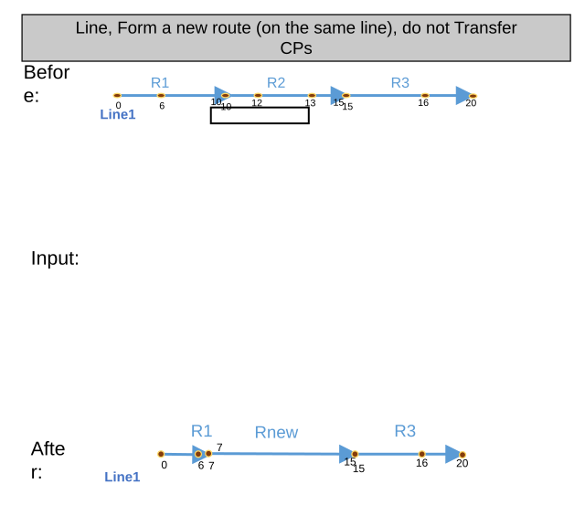

### Slide 15 — Line, Form a new route (on the same line), Transfer CPs <!-- slide 15 -->

| From Date | To Date | RouteID | Route Name | LineID | Line Name | LineOrder | Measures |
| --- | --- | --- | --- | --- | --- | --- | --- |
| 1/1/2000 | Null | R1 | R1 | Line1 | Line1 | 100 | 0-10 |
| 1/1/2000 | Null | R2 | R2 | Line1 | Line1 | 200 | 10-15 |
| 1/1/2000 | Null | R3 | R3 | Line1 | Line1 | 300 | 15-20 |

| From Date | To Date | RouteID | Route Name | LineID | Line Name | LineOrder | Measures |
| --- | --- | --- | --- | --- | --- | --- | --- |
| 1/1/2000 | 1/1/2005 | R1 | R1 | Line1 | Line1 | 100 | 0-10 |
| 1/1/2000 | 1/1/2005 | R2 | R2 | Line1 | Line1 | 200 | 10-15 |
| 1/1/2000 | 1/1/2005 | R3 | R3 | Line1 | Line1 | 300 | 15-20 |
| 1/1/2005 | Null | R1 | R1 | Line1 | Line1 | 100 | 0-6 |
| 1/1/2005 | Null | Rnew | Rnew | Line1 | Line1 | 200 | 7-15 |
| 1/1/2005 | Null | R3 | R3 | Line1 | Line1 | 300 | 7-20 |

| Network | Effective Date | Source From Route Name | Source From Measure | Source To Route Name | Source To Measure | Method | Target Route Name | Target From Measure | Target To Measure | Recalibrate route downstream | Transfer CPs |
| --- | --- | --- | --- | --- | --- | --- | --- | --- | --- | --- | --- |
| Engineering | 1/1/2005 | R1 | 6 | R2 | 15 | Form a new route | R3 | 7 | 15 | N/A | Yes |

[figure: Before: · Input: · After: · R1 · R2 · R3 · 0 · 6 · 10 · 12 · 13 · 15 · 16 · 20 · Line1 · Rnew · 7 · L1]

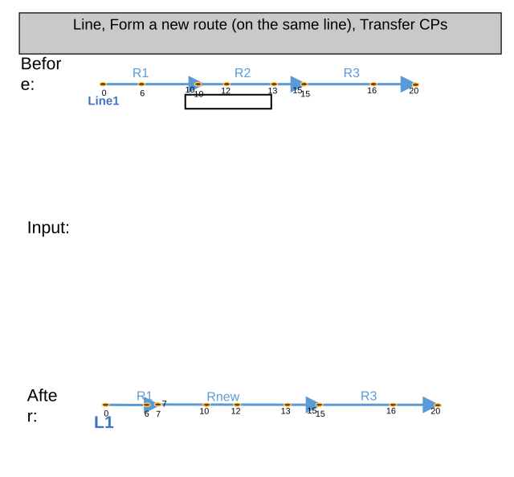

### Slide 16 — Line, Merge to adjacent route (on adjacent line), Transfer CPs <!-- slide 16 -->

| From Date | To Date | RouteID | Route Name | LineID | Line Name | LineOrder | Measures |
| --- | --- | --- | --- | --- | --- | --- | --- |
| 1/1/2000 | Null | R1 | R1 | Line1 | Line1 | 100 | 7-10 |
| 1/1/2000 | Null | R2 | R2 | Line1 | Line1 | 200 | 0-70 |
| 1/1/2000 | Null | RA | RA | Line2 | Line2 | 100 | 0-15 |

| From Date | To Date | RouteID | Route Name | LineID | Line Name | LineOrder | Measures |
| --- | --- | --- | --- | --- | --- | --- | --- |
| 1/1/2000 | 1/1/2005 | R1 | R1 | Line1 | Line1 | 100 | 7-10 |
| 1/1/2000 | 1/1/2005 | R2 | R2 | Line1 | Line1 | 200 | 0-70 |
| 1/1/2000 | 1/1/2005 | RA | RA | Line2 | Line2 | 100 | 0-15 |
| 1/1/2005 | Null | R1 | R1 | Line1 | Line1 | 100 | 7-9 |
| 1/1/2005 | Null | RA | RA | Line2 | Line2 | 200 | 9.1-80 |

| Network | Effective Date | Source From Route Name | Source From Measure | Source To Route Name | Source To Measure | Method | Target Route Name | Target From Measure | Target To Measure | Recalibrate route downstream | Transfer CPs |
| --- | --- | --- | --- | --- | --- | --- | --- | --- | --- | --- | --- |
| Engineering | 1/1/2005 | R1 | 9.1 | R2 | 70 | Merge to adjacent route | R3 | 9.1 | 80 | N/A | Yes |

[figure: Before: · Input: · After: · Line1 · R1 · R2 · A · 7 · 9 · 10 · 0 · 44 · 66 · 70 · 15 · 54 · 76 · 80 · 90 · 9.1 · 95]

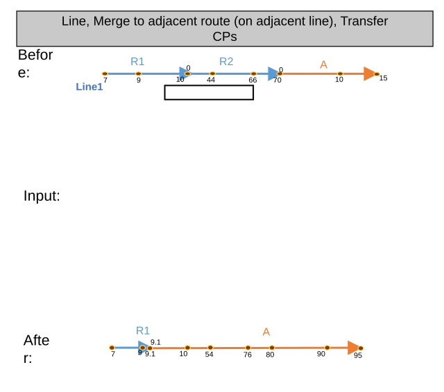

### Slide 17 — Line, Merge to adjacent route (on adjacent line), do not Transfer CPs <!-- slide 17 -->

| From Date | To Date | RouteID | Route Name | LineID | Line Name | LineOrder | Measures |
| --- | --- | --- | --- | --- | --- | --- | --- |
| 1/1/2000 | Null | R1 | R1 | Line1 | Line1 | 100 | 7-10 |
| 1/1/2000 | Null | R2 | R2 | Line1 | Line1 | 200 | 0-70 |
| 1/1/2000 | Null | RA | RA | Line2 | Line2 | 100 | 0-15 |

| From Date | To Date | RouteID | Route Name | LineID | Line Name | LineOrder | Measures |
| --- | --- | --- | --- | --- | --- | --- | --- |
| 1/1/2000 | 1/1/2005 | R1 | R1 | Line1 | Line1 | 100 | 7-10 |
| 1/1/2000 | 1/1/2005 | R2 | R2 | Line1 | Line1 | 200 | 0-70 |
| 1/1/2000 | 1/1/2005 | RA | RA | Line2 | Line2 | 100 | 0-15 |
| 1/1/2005 | Null | R1 | R1 | Line1 | Line1 | 100 | 7-9 |
| 1/1/2005 | Null | RA | RA | Line2 | Line2 | 200 | 9.1-80 |

| Network | Effective Date | Source From Route Name | Source From Measure | Source To Route Name | Source To Measure | Method | Target Route Name | Target From Measure | Target To Measure | Recalibrate route downstream | Transfer CPs |
| --- | --- | --- | --- | --- | --- | --- | --- | --- | --- | --- | --- |
| Engineering | 1/1/2005 | R1 | 9.1 | R2 | 70 | Merge to adjacent route | R3 | 9.1 | 80 | N/A | No |

[figure: Before: · Input: · After: · Line1 · R1 · R2 · A · 7 · 9 · 10 · 0 · 44 · 66 · 70 · 15 · 9.1 · 95]

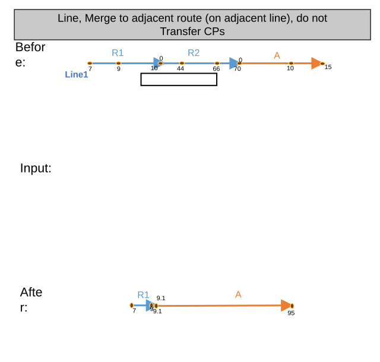

### Slide 18 — Sample Test Cases from User Story <!-- slide 18 -->

| Non-line inputs | Recal Target | Trans CP | Input Target From/To Measures | Result | Before | After |
| --- | --- | --- | --- | --- | --- | --- |
| Merge to adjacent route | Yes | Yes | 12/15 | Merge source and target –proportion kept |  |  |
|  | No | Yes | 15/18 (default calc measures) | Error, result is non-monotonic |  |  |
|  | No | No | 15/18 (default calc measures) | Error, result is non-monotonic |  |  |
|  | Yes | No | 12/15 | Merge source and target –proportion not kept |  |  |
| Form a new route | N/A (no such option) | Yes | 0/5 | Merge – proportion kept |  |  |
|  | N/A (no such option) | No | 0/5 | Merge – proportion not kept |  |  |

[figure: R1 · R2 · R3 · 0 · 6 · 10 · 12 · 13 · 15 · 16 · 20 · 3 · 5 · Rnew]

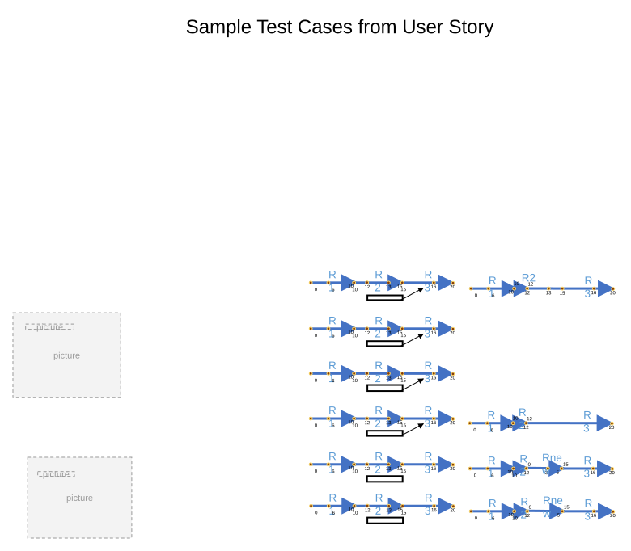

### Slide 19 <!-- slide 19 -->

| Line inputs | Recalibrate Target | Trans CP | Input From/To Measures for Target | Result | Before | After |
| --- | --- | --- | --- | --- | --- | --- |
| Merge to adjacent route (on the same line) | Yes | Yes | 7/15 | Merge source and target –proportion kept |  |  |
|  | No | Yes | 15/24 (default calc measures) | Error, result is non-monotonic |  |  |
|  | No | No | 15/24 (default calc measures) | Error, result is non-monotonic |  |  |
|  | Yes | No | 7/15 | Merge source and target –proportion not kept |  |  |
| Form a new route | N/A (no such option) | Yes | 7/15 | Merge – proportion kept |  |  |
|  | N/A (no such option) | No | 7/15 | Merge – proportion not kept |  |  |

[figure: R1 · R2 · R3 · 0 · 6 · 10 · 12 · 13 · 15 · 16 · 20 · 7 · Rnew · L1]

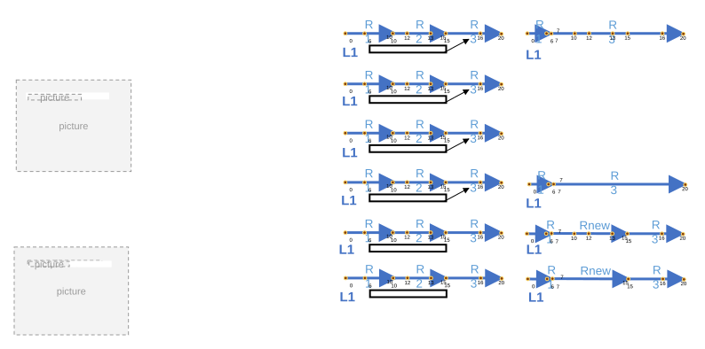

### Slide 20 <!-- slide 20 -->

| Line inputs | Recal Target | Trans CP | Input From/ To Measures | Result | Before | After |
| --- | --- | --- | --- | --- | --- | --- |
| Merge to adjacent route (on adjacent line) it is the same method “merge to adjacent route” | Yes | Yes | 9.1/80 | Merge source and target –proportion kept |  |  |
|  | No | Yes | 0/70 (default calc values) | Non-monotonic error |  |  |
|  | No | No | 0/70 (default calc values) | Non-monotonic error |  |  |
|  | Yes | No | 9.1/80 | Merge source and target –proportion not kept |  |  |

[figure: R1 · R2 · A · 7 · 9 · 10 · 0 · 44 · 66 · 70 · 15 · 54 · 76 · 80 · 90 · 9.1 · 95 · L2 · L1]

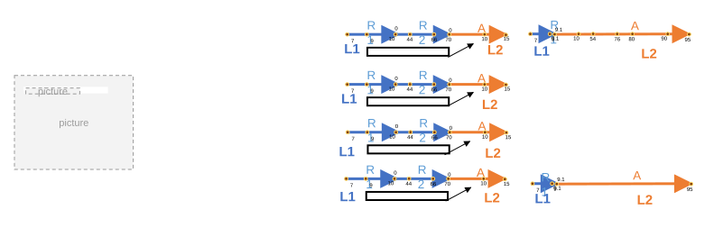
