# Support Centerline as Input in queryAttributeSet and Overlay Events Test Plan

| Field | Value |
| --- | --- |
| **Doc** | 461 · Test Plan · Pro |
| **Product** | Roads & Highways · Pipeline Referencing · Utility Network |
| **Release** | — |
| **Issues** | [ArcGISPro/ps-location-referencing#5196](https://devtopia.esri.com/ArcGISPro/ps-location-referencing/issues/5196) |
| **Source** | [5196-SupportCenterlineinqueryAttributeSetandOverlayEvents_TestPlanV4.pptx](<https://esriis.sharepoint.com/sites/LocationReferencing/Shared%20Documents/General/Test%20Plans/5196-SupportCenterlineinqueryAttributeSetandOverlayEvents_TestPlanV4.pptx>) · rev V4 |
| **People** | author Mac Christmas · PE — · dev — |
| **Edited** | 2023-11-15 23:06 by Mac Christmas |
| **Extracted** | 2026-09-04 · lane xmlstrip · format 3.0 · prompt v2.0.2 |
| **Keywords** | centerline · overlay events · query attribute set · dynamic segmentation · route · measure · event · temporal view date · in-memory measures |
| **Tools** | Overlay Events · queryAttributeSet |

## Summary

Test plan for supporting the centerline feature class as input in the queryAttributeSet REST endpoint and the Overlay Events geoprocessing tool. It includes positive and negative test cases across multiple datasets (UNAPR, RH, APR) covering simple, complex, vertical, gapped routes, and scenarios with multiple centerlines and time slices. The plan verifies behavior with and without temporal view dates and with centerlines lacking measure fields, ensuring dynamic segmentation and correct event overlay.

## Related documents

<!-- related:begin -->
- [Overlay Events and queryAttributeSet Point Event Support Test Cases](<https://esriis.sharepoint.com/sites/lrsworkspace/LRS Doc Index/Test Plans/5301-overlay-events-and-queryattributeset-point-event-support.md>) — similar text 0.65 · 4 title words · 3 filename words · same kind/surface/folder <!-- rel:364 s=6.931 -->
- [Overlay Events and queryAttributeSet Support for UN Pipeline Devices and Junctions](<https://esriis.sharepoint.com/sites/lrsworkspace/LRS Doc Index/Test Plans/overlay-events-and-queryattributeset-support-for-un-pipeline.md>) — similar text 0.52 · 4 title words · 2 filename words · same kind/surface/folder <!-- rel:79 s=6.044 -->
- [Location Referencing Window Overlay Events](<https://esriis.sharepoint.com/sites/lrsworkspace/LRS%20Doc%20Index/Other/lr-window-overlay-events.md>) — similar text 0.03 · 2 title words · 1 filename word · same surface <!-- rel:659 s=2.454 -->
- [Merge Centerlines Test Plan](<https://esriis.sharepoint.com/sites/lrsworkspace/LRS Doc Index/Test Plans/363-merge-centerlines.md>) — similar text 0.21 · same kind/surface/folder <!-- rel:103 s=2.418 -->
- [Dynamic Segmentation Merge Option Test Plan](<https://esriis.sharepoint.com/sites/lrsworkspace/LRS Doc Index/Test Plans/4902-dynseg-merge-option.md>) — similar text 0.14 · same kind/folder <!-- rel:592 s=2.207 -->
<!-- related:end -->

<!-- docs:begin -->
## Esri documentation

[Apply dynamic segmentation](https://doc.esri.com/en/arcgis-pro/latest/help/production/roads-highways/apply-dynamic-segmentation.html) · [Split a centerline by measure](https://doc.esri.com/en/arcgis-pro/latest/help/production/roads-highways/split-a-centerline-by-measure.html)

_No page matched:_ [Overlay Events](https://www.google.com/search?q=%22Overlay%20Events%22+site%3Adoc.esri.com) · [queryAttributeSet](https://www.google.com/search?q=%22queryAttributeSet%22+site%3Adoc.esri.com)
<!-- docs:end -->

---

## Test Cases

### TC-P01 — Overlay Events/queryAttributeSet on simple routes with no input tVD and multiple <!-- src: S4 · slide 1 · Positive Tests: UNAPR Dataset (Sanity Testing) · 1 -->

- **Group:** UNAPR Dataset (Sanity Testing)
- **Case:** Overlay Events/queryAttributeSet on simple routes with no input tVD and multiple input events

### TC-P02 — Overlay Events/queryAttributeSet on simple routes and multiple input events <!-- src: S4 · slide 1 · Positive Tests: UNAPR Dataset (Sanity Testing) · 2 -->

- **Group:** UNAPR Dataset (Sanity Testing)
- **Case:** Overlay Events/queryAttributeSet on simple routes and multiple input events with input tVD after input routes no longer exist

### TC-P03 — Overlay Events/queryAttributeSet on complex routes with no input tVD <!-- src: S4 · slide 1 · Positive Tests: UNAPR Dataset (Sanity Testing) · 3 -->

- **Group:** UNAPR Dataset (Sanity Testing)
- **Case:** Overlay Events/queryAttributeSet on complex routes with no input tVD and multiple input events

### TC-P04 — Overlay Events/queryAttributeSet on complex routes and multiple input events <!-- src: S4 · slide 1 · Positive Tests: UNAPR Dataset (Sanity Testing) · 4 -->

- **Group:** UNAPR Dataset (Sanity Testing)
- **Case:** Overlay Events/queryAttributeSet on complex routes and multiple input events with input tVD after input routes no longer exist

### TC-U01 — Overlay Events / QueryAttributeSet on Routes with Multiple Centerlines (case 18) <!-- src: S1 · slide 2 · case 18 -->

- **Case:** Overlay Events/queryAttributeSet on routes with multiple centerlines, some flipped) and multiple events

**Positive Tests: APR Dataset (Centerline has no route/measure info fields, route and measure found in-memory)**
- Overlay Events/queryAttributeSet on simple routes with no input tVD and spanning and non-spanning multiple input events
- Overlay Events/queryAttributeSet on simple routes with input tVD after input routes no longer exist and multiple spanning and non-spanning input events
- Overlay Events/queryAttributeSet on complex routes with no input tVD and multiple spanning and non-spanning input events
- Overlay Events/queryAttributeSet on complex routes and multiple spanning and non-spanning input events with input tVD after input routes no longer exist
- Overlay Events/queryAttributeSet on vertical routes with no input tVD and multiple spanning and non-spanning input events
- Overlay Events/queryAttributeSet on vertical routes and multiple spanning and non-spanning input events with input tVD after input routes no longer exist
- Overlay Events/queryAttributeSet on routes with multiple centerlines with different attribution and multiple spanning and non-spanning input events
- Overlay Events/queryAttributeSet on routes with one centerline and multiple spanning and non-spanning input events
- Overlay Events/queryAttributeSet on routes with multiple centerlines and retired input events. tVD is after event retirement, but centerline will still be dynamically segmented based on attribution
- Overlay Events/queryAttributeSet on routes with multiple centerlines and time sliced input events. tVD is in overlapping time slice of events
- Overlay Events/queryAttributeSet on routes with multiple centerlines and events that do not fully cover routes
- Overlay Events/queryAttributeSet on gapped routes with multiple centerlines and events
- Overlay Events/queryAttributeSet on routes with multiple centerlines and multiple time slices of events
- Overlay Events/queryAttributeSet on routes with multiple centerlines, some flipped) and multiple events

**Positive Tests: RH Dataset (Centerline has no route/measure info fields, route and measure found in-memory) (Continued)**
- Overlay Events/queryAttributeSet on routes with multiple centerlines and time sliced input events. tVD is in overlapping time slice of events
- Overlay Events/queryAttributeSet on routes with multiple centerlines and events that do not fully cover routes
- Overlay Events/queryAttributeSet on gapped routes with multiple centerlines and events
- Overlay Events/queryAttributeSet on routes with multiple centerlines and multiple time slices of events
- 17A. Overlay Events/queryAttributeSet on routes with multiple centerlines and multiple time slices of events, but events are associated with a different network
- 17 B. Overlay Events/queryAttributeSet on simple routes with no input tVD and multiple input events, but input events are associated with a different network (RH Dataset)

| Negative Tests: Error |
| --- |
| Centerlines overlap |

### TC-U02 — Overlay Events / QueryAttributeSet on Simple Routes with No Input TVD and Multiple (case 1) <!-- src: S1 · slide 3 · case 1 -->

- **Case:** Overlay Events/queryAttributeSet on simple routes with no input tVD and multiple input events (UNAPR Dataset)

| Network Name | RouteID | From Date | To Date | Type |
| --- | --- | --- | --- | --- |
| Network1 | Route1 | 1/1/2000 | <Null> | Upstream |
| Network1 | Route2 | 1/1/2000 | <Null> | Midstream |

| Input Layer | Event ID | From Date | To Date | From Measure | To Measure | From RouteID | To RouteID | Attribute [Color1] | Attribute [Color2] |
| --- | --- | --- | --- | --- | --- | --- | --- | --- | --- |
| Pipeline Line | N/A | N/A | N/A | 0 | 5 | N/A | N/A | Steel | Active |
| Pipeline Line | N/A | N/A | N/A | 5 | 7.5 | N/A | N/A | Plastic | Active |
| Pipeline Line | N/A | N/A | N/A | 7.5 | 10 | N/A | N/A | Steel | Active |
| Red Event | Red1 | 1/1/2000 | <Null> | 0 | 2.5 | Route1 | Route1 | 450 psi | Active |
| Red Event | Red2 | 1/1/2000 | <Null> | 2.5 | 10 | Route1 | Route2 | 500 psi | Proposed |
| Blue Event | Blue1 | 1/1/2000 | <Null> | 0 | 10 | Route1 | Route2 | Low | Active |
| Green Event | Green1 | 1/1/2000 | <Null> | 0 | 10 | Route1 | Route2 | Complete | Active |

| RouteID | From Date | To Date | From Measure | To Measure | Network1. Type | PipelineLine. Attribute1 | PipelineLine. Attribute2 | RedEvent . Red1 | RedEvent . Red2 | BlueEvent . Blue1 | BlueEvent . Blue2 | GreenEvent . Green1 | GreenEvent . Green2 |
| --- | --- | --- | --- | --- | --- | --- | --- | --- | --- | --- | --- | --- | --- |
| Route1 | 1/1/2000 | <Null> | 0 | 2.5 | Upstream | Steel | Active | 450 psi | Active | Low | Active | Complete | Active |
| Route1 | 1/1/2000 | <Null> | 2.5 | 5 | Upstream | Steel | Active | 500 psi | Proposed | Low | Active | Complete | Active |
| Route2 | 1/1/2000 | <Null> | 5 | 7.5 | Midstream | Plastic | Active | 500 psi | Proposed | Low | Active | Complete | Active |
| Route2 | 1/1/2000 | <Null> | 7.5 | 10 | Midstream | Steel | Active | 500 psi | Proposed | Low | Active | Complete | Active |

[figure: 0 · 10 · Input: · 5 · Output: · Route1 · Route2]

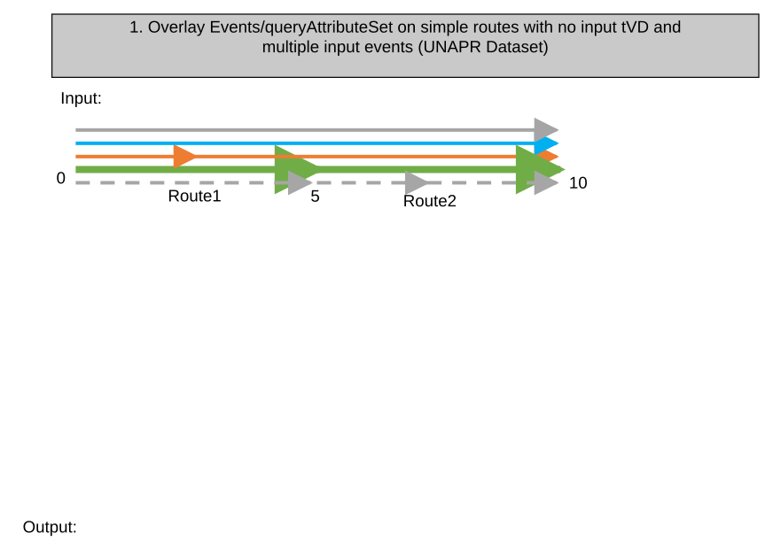

### TC-U03 — Overlay Events / QueryAttributeSet on Simple Routes and Multiple Input Events (case 2) <!-- src: S1 · slide 4 · case 2 -->

- **Case:** Overlay Events/queryAttributeSet on simple routes and multiple input events with input tVD after input routes no longer exist (UNAPR Dataset)

| Network Name | RouteID | From Date | To Date | Type |
| --- | --- | --- | --- | --- |
| Network1 | Route1 | 1/1/2000 | 1/1/2010 | Upstream |
| Network1 | Route2 | 1/1/2000 | 1/1/2010 | Midstream |

| Input Layer | Event ID | From Date | To Date | From Measure | To Measure | From RouteID | To RouteID | Attribute [Color1] | Attribute [Color2] |
| --- | --- | --- | --- | --- | --- | --- | --- | --- | --- |
| Pipeline Line | N/A | N/A | N/A | 0 | 5 | N/A | N/A | Steel | Active |
| Pipeline Line | N/A | N/A | N/A | 5 | 7.5 | N/A | N/A | Plastic | Active |
| Pipeline Line | N/A | N/A | N/A | 7.5 | 10 | N/A | N/A | Steel | Active |
| Red Event | Red1 | 1/1/2000 | 1/1/2010 | 0 | 2.5 | Route1 | Route1 | 450 psi | Active |
| Red Event | Red2 | 1/1/2000 | 1/1/2010 | 2.5 | 10 | Route1 | Route2 | 500 psi | Proposed |
| Blue Event | Blue1 | 1/1/2000 | 1/1/2010 | 0 | 10 | Route1 | Route2 | Low | Active |
| Green Event | Green1 | 1/1/2000 | 1/1/2010 | 0 | 10 | Route1 | Route2 | Complete | Active |

Output (input tVD of 1/1/2015):

[figure: 0 · 10 · Input: · 5 · Route1 · Route2 · No features found]

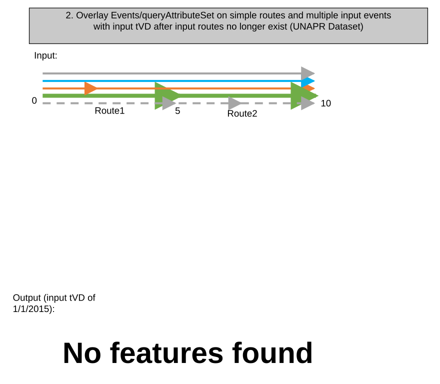

### TC-U04 — Overlay Events / QueryAttributeSet on Complex Routes with No Input TVD (case 3) <!-- src: S1 · slide 5 · case 3 -->

- **Case:** Overlay Events/queryAttributeSet on complex routes with no input tVD and multiple input events (UNAPR Dataset)

| Network Name | RouteID | From Date | To Date | Type |
| --- | --- | --- | --- | --- |
| Network1 | Route1 | 1/1/2000 | <Null> | Upstream |
| Network1 | Route2 | 1/1/2000 | <Null> | Midstream |

| Input Layer | Event ID | From Date | To Date | From Measure | To Measure | From RouteID | To RouteID | Attribute [Color1] | Attribute [Color2] |
| --- | --- | --- | --- | --- | --- | --- | --- | --- | --- |
| Pipeline Line | N/A | N/A | N/A | 0 | 10 | N/A | N/A | Steel | Active |
| Pipeline Line | N/A | N/A | N/A | 10 | 12.5 | N/A | N/A | Plastic | Active |
| Pipeline Line | N/A | N/A | N/A | 12.5 | 15 | N/A | N/A | Steel | Active |
| Red Event | Red1 | 1/1/2000 | <Null> | 0 | 5 | Route1 | Route1 | 450 psi | Active |
| Red Event | Red2 | 1/1/2000 | <Null> | 5 | 10 | Route1 | Route2 | 500 psi | Proposed |
| Blue Event | Blue1 | 1/1/2000 | <Null> | 0 | 15 | Route1 | Route2 | Low | Active |
| Green Event | Green1 | 1/1/2000 | <Null> | 0 | 15 | Route1 | Route2 | Complete | Active |

| RouteID | From Date | To Date | From Measure | To Measure | Network1. Type | PipelineLine. Attribute1 | PipelineLine. Attribute2 | RedEvent . Red1 | RedEvent . Red2 | BlueEvent . Blue1 | BlueEvent . Blue2 | GreenEvent . Green1 | GreenEvent . Green2 |
| --- | --- | --- | --- | --- | --- | --- | --- | --- | --- | --- | --- | --- | --- |
| Route1 | 1/1/2000 | <Null> | 0 | 5 | Upstream | Steel | Active | 450 psi | Active | Low | Active | Complete | Active |
| Route1 | 1/1/2000 | <Null> | 5 | 10 | Upstream | Steel | Active | 500 psi | Proposed | Low | Active | Complete | Active |
| Route2 | 1/1/2000 | <Null> | 10 | 12.5 | Midstream | Plastic | Active | 500 psi | Proposed | Low | Active | Complete | Active |
| Route2 | 1/1/2000 | <Null> | 12.5 | 15 | Midstream | Steel | Active | 500 psi | Proposed | Low | Active | Complete | Active |

[figure: 0 · 10 · 5 · 15 · Route1 · Route2 · Output: · Input:]

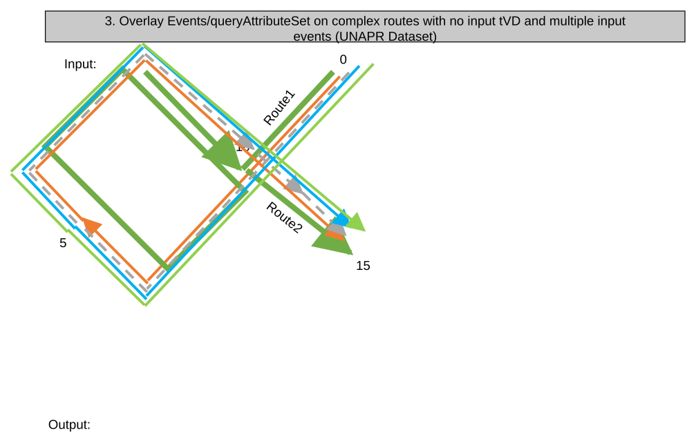

### TC-U05 — Overlay Events / QueryAttributeSet on Complex Routes and Multiple Input Events (case 4) <!-- src: S1 · slide 6 · case 4 -->

- **Case:** Overlay Events/queryAttributeSet on complex routes and multiple input events with input tVD after input routes no longer exist (UNAPR Dataset)

| Network Name | RouteID | From Date | To Date | Type |
| --- | --- | --- | --- | --- |
| Network1 | Route1 | 1/1/2000 | 1/1/2010 | Upstream |
| Network1 | Route2 | 1/1/2000 | 1/1/2010 | Midstream |

| Input Layer | Event ID | From Date | To Date | From Measure | To Measure | From RouteID | To RouteID | Attribute [Color1] | Attribute [Color2] |
| --- | --- | --- | --- | --- | --- | --- | --- | --- | --- |
| Pipeline Line | N/A | N/A | N/A | 0 | 10 | N/A | N/A | Steel | Active |
| Pipeline Line | N/A | N/A | N/A | 10 | 12.5 | N/A | N/A | Plastic | Active |
| Pipeline Line | N/A | N/A | N/A | 12.5 | 15 | N/A | N/A | Steel | Active |
| Red Event | Red1 | 1/1/2000 | 1/1/2010 | 0 | 5 | Route1 | Route1 | 450 psi | Active |
| Red Event | Red2 | 1/1/2000 | 1/1/2010 | 5 | 10 | Route1 | Route2 | 500 psi | Proposed |
| Blue Event | Blue1 | 1/1/2000 | 1/1/2010 | 0 | 15 | Route1 | Route2 | Low | Active |
| Green Event | Green1 | 1/1/2000 | 1/1/2010 | 0 | 15 | Route1 | Route2 | Complete | Active |

Output (input tVD of 1/1/2015):

[figure: No features found · 0 · 10 · 5 · 15 · Route1 · Route2 · Input:]

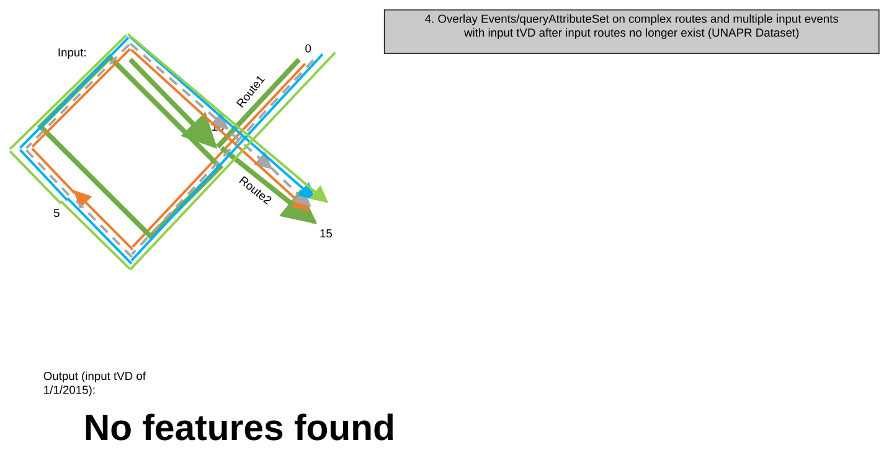

### TC-U06 — Overlay Events / QueryAttributeSet on Simple Routes with No Input TVD and Multiple (case 5) <!-- src: S1 · slide 7 · case 5 -->

- **Case:** Overlay Events/queryAttributeSet on simple routes with no input tVD and multiple input events

(RH Dataset)

| Network Name | RouteID | From Date | To Date | Type |
| --- | --- | --- | --- | --- |
| Network1 | Route1 | 1/1/2000 | <Null> | Interstate |

| Input Layer | Event ID | From Date | To Date | From Measure | To Measure | Attribute [Color1] | Attribute [Color2] |
| --- | --- | --- | --- | --- | --- | --- | --- |
| Centerline | N/A | N/A | N/A | N/A | N/A | Asphalt | Active |
| Centerline | N/A | N/A | N/A | N/A | N/A | Chipseal | Active |
| Centerline | N/A | N/A | N/A | N/A | N/A | Asphalt | Active |
| Red Event | Red1 | 1/1/2000 | <Null> | 0 | 2.5 | Adams | Active |
| Red Event | Red2 | 1/1/2000 | <Null> | 2.5 | 10 | Laporte | Proposed |
| Blue Event | Blue1 | 1/1/2000 | <Null> | 0 | 10 | Full Access | Active |
| Green Event | Green1 | 1/1/2000 | <Null> | 0 | 10 | 45 MPH | Active |

Output (Centerline measures are found in-memory):

| RouteID | From Date | To Date | From Measure | To Measure | Network1. Type | Centerline.Attribute1 | Centerline. Attribute2 | RedEvent . Red1 | RedEvent . Red2 | BlueEvent . Blue1 | BlueEvent . Blue2 | GreenEvent . Green1 | GreenEvent . Green2 |
| --- | --- | --- | --- | --- | --- | --- | --- | --- | --- | --- | --- | --- | --- |
| Route1 | 1/1/2000 | <Null> | 0 | 2.5 | Interstate | Asphalt | Active | Adams | Active | Full Access | Active | 45 MPH | Active |
| Route1 | 1/1/2000 | <Null> | 2.5 | 5 | Interstate | Asphalt | Active | Laporte | Proposed | Full Access | Active | 45 MPH | Active |
| Route1 | 1/1/2000 | <Null> | 5 | 7.5 | Interstate | Chipseal | Active | Laporte | Proposed | Full Access | Active | 45 MPH | Active |
| Route1 | 1/1/2000 | <Null> | 7.5 | 10 | Interstate | Asphalt | Active | Laporte | Proposed | Full Access | Active | 45 MPH | Active |

[figure: 0 · 10 · Input: · Route1]

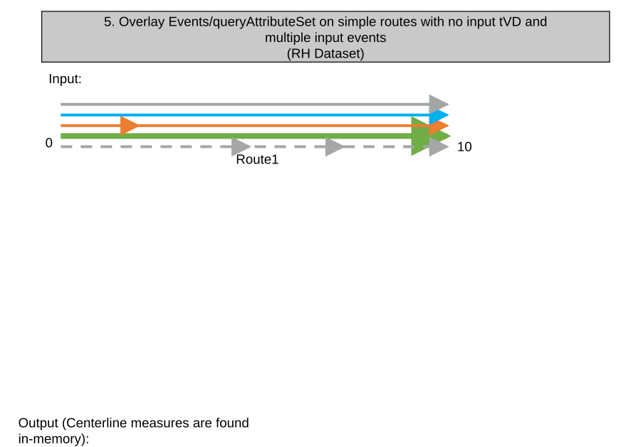

### TC-U07 — Overlay Events / QueryAttributeSet on Simple Routes with Input TVD After Input <!-- src: S1 · slide 8 · case 6 -->

- **Case:** Overlay Events/queryAttributeSet on simple routes with input tVD after input routes no longer exist and multiple input events (RH Dataset)

| Network Name | RouteID | From Date | To Date | Type |
| --- | --- | --- | --- | --- |
| Network1 | Route1 | 1/1/2000 | 1/1/2010 | Interstate |

| Input Layer | Event ID | From Date | To Date | From Measure | To Measure | Attribute [Color1] | Attribute [Color2] |
| --- | --- | --- | --- | --- | --- | --- | --- |
| Centerline | N/A | N/A | N/A | N/A | N/A | Asphalt | Active |
| Centerline | N/A | N/A | N/A | N/A | N/A | Chipseal | Active |
| Centerline | N/A | N/A | N/A | N/A | N/A | Asphalt | Active |
| Red Event | Red1 | 1/1/2000 | 1/1/2010 | 0 | 2.5 | Adams | Active |
| Red Event | Red2 | 1/1/2000 | 1/1/2010 | 2.5 | 10 | Laporte | Proposed |
| Blue Event | Blue1 | 1/1/2000 | 1/1/2010 | 0 | 10 | Full Access | Active |
| Green Event | Green1 | 1/1/2000 | 1/1/2010 | 0 | 10 | 45 MPH | Active |

Output (input tVD of 1/1/2015):

[figure: 0 · 10 · Input: · Route1 · No features found]

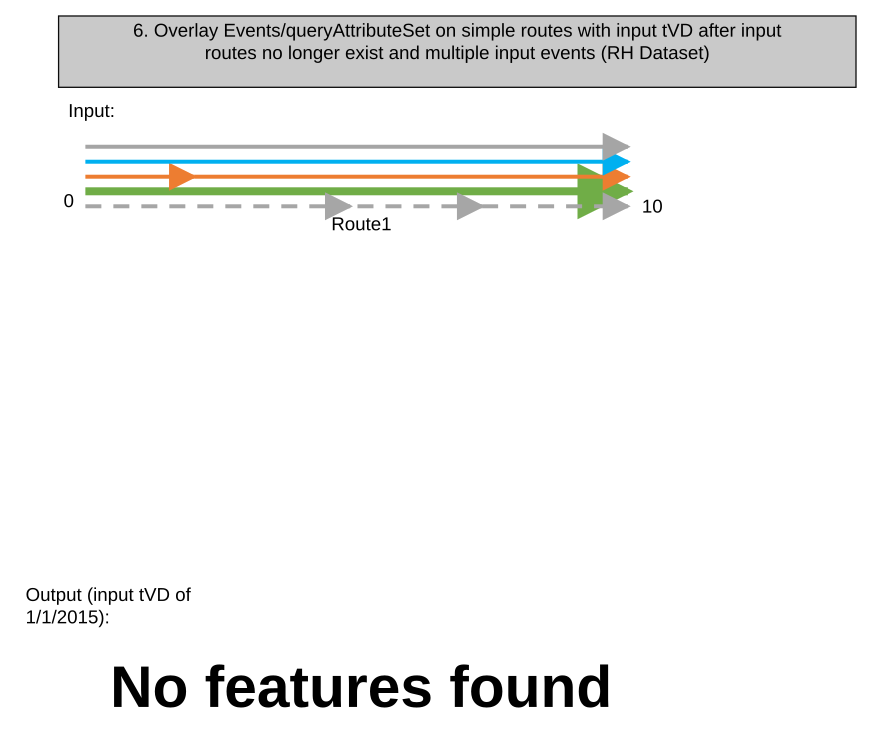

### TC-U08 — Overlay Events / QueryAttributeSet on Simple Routes with No Input TVD and Multiple (case 7) <!-- src: S1 · slide 9 · case 7 -->

- **Case:** Overlay Events/queryAttributeSet on simple routes with no input tVD and multiple input events

(RH Dataset)

| Network Name | RouteID | From Date | To Date | Type |
| --- | --- | --- | --- | --- |
| Network1 | Route1 | 1/1/2000 | <Null> | Interstate |

| Input Layer | Event ID | From Date | To Date | From Measure | To Measure | Attribute [Color1] | Attribute [Color2] |
| --- | --- | --- | --- | --- | --- | --- | --- |
| Centerline | N/A | N/A | N/A | N/A | N/A | Asphalt | Active |
| Centerline | N/A | N/A | N/A | N/A | N/A | Chipseal | Active |
| Red Event | Red1 | 1/1/2000 | <Null> | 0 | 5 | Adams | Active |
| Red Event | Red2 | 1/1/2000 | <Null> | 5 | 10 | Laporte | Proposed |
| Blue Event | Blue1 | 1/1/2000 | <Null> | 0 | 10 | Full Access | Active |
| Green Event | Green1 | 1/1/2000 | <Null> | 0 | 10 | 45 MPH | Active |

| RouteID | From Date | To Date | From Measure | To Measure | Network1. Type | Centerline. Attribute1 | Centerline. Attribute2 | RedEvent . Red1 | RedEvent . Red2 | BlueEvent . Blue1 | BlueEvent . Blue2 | GreenEvent . Green1 | GreenEvent . Green2 |
| --- | --- | --- | --- | --- | --- | --- | --- | --- | --- | --- | --- | --- | --- |
| Route1 | 1/1/2000 | <Null> | 0 | 5 | Interstate | Asphalt | Active | Adams | Active | Full Access | Active | 45 MPH | Active |
| Route1 | 1/1/2000 | <Null> | 5 | 7.5 | Interstate | Asphalt | Active | Laporte | Proposed | Full Access | Active | 45 MPH | Active |
| Route1 | 1/1/2000 | <Null> | 7.5 | 10 | Interstate | Chipseal | Active | Laporte | Proposed | Full Access | Active | 45 MPH | Active |

Output (Centerline measures are found in-memory):

[figure: Input: · 0 · 10 · 5 · Route1]

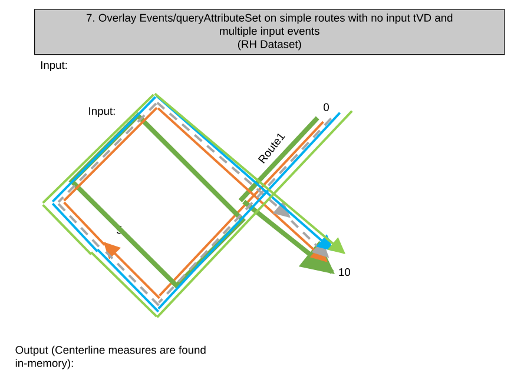

### TC-U09 — Overlay Events / QueryAttributeSet on Complex Routes and Multiple Input Events (case 8) <!-- src: S1 · slide 10 · case 8 -->

- **Case:** Overlay Events/queryAttributeSet on complex routes and multiple input events with input tVD after input routes no longer exist (RH Dataset)

| Network Name | RouteID | From Date | To Date | Type |
| --- | --- | --- | --- | --- |
| Network1 | Route1 | 1/1/2000 | 1/1/2010 | Interstate |

| Input Layer | Event ID | From Date | To Date | From Measure | To Measure | Attribute [Color1] | Attribute [Color2] |
| --- | --- | --- | --- | --- | --- | --- | --- |
| Centerline | N/A | N/A | N/A | N/A | N/A | Asphalt | Active |
| Centerline | N/A | N/A | N/A | N/A | N/A | Chipseal | Active |
| Red Event | Red1 | 1/1/2000 | 1/1/2010 | 0 | 5 | Adams | Active |
| Red Event | Red2 | 1/1/2000 | 1/1/2010 | 5 | 10 | Laporte | Proposed |
| Blue Event | Blue1 | 1/1/2000 | 1/1/2010 | 0 | 10 | Full Access | Active |
| Green Event | Green1 | 1/1/2000 | 1/1/2010 | 0 | 10 | 45 MPH | Active |

Output (input tVD of 1/1/2015):

[figure: Input: · 0 · 10 · 5 · Route1 · No features found]

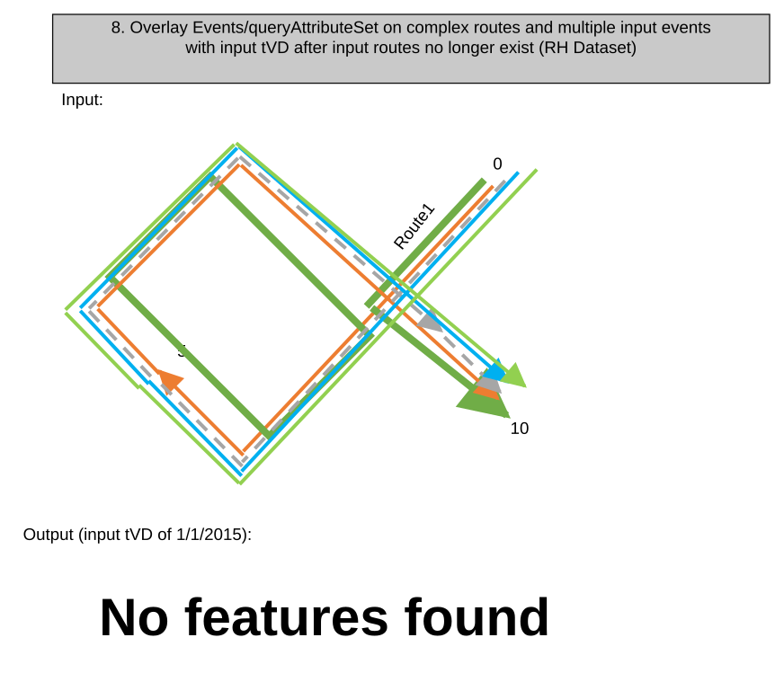

### TC-U10 — Overlay Events / QueryAttributeSet on Vertical Routes with No Input TVD (case 9) <!-- src: S1 · slide 11 · case 9 -->

- **Case:** Overlay Events/queryAttributeSet on vertical routes with no input tVD and multiple input events

(RH Dataset)

| Network Name | RouteID | From Date | To Date | Type |
| --- | --- | --- | --- | --- |
| Network1 | Route1 | 1/1/2000 | <Null> | Interstate |

| Input Layer | Event ID | From Date | To Date | From Measure | To Measure | Attribute [Color1] | Attribute [Color2] |
| --- | --- | --- | --- | --- | --- | --- | --- |
| Centerline | N/A | N/A | N/A | N/A | N/A | Asphalt | Active |
| Centerline | N/A | N/A | N/A | N/A | N/A | Chipseal | Active |
| Red Event | Red1 | 1/1/2000 | <Null> | 0 | 2.5 | Adams | Active |
| Red Event | Red2 | 1/1/2000 | <Null> | 2.5 | 10 | Laporte | Proposed |
| Blue Event | Blue1 | 1/1/2000 | <Null> | 0 | 10 | Full Access | Active |
| Green Event | Green1 | 1/1/2000 | <Null> | 0 | 10 | 45 MPH | Active |

| RouteID | From Date | To Date | From Measure | To Measure | Network1. Type | Centerline. Attribute1 | Centerline. Attribute2 | RedEvent . Red1 | RedEvent . Red2 | BlueEvent . Blue1 | BlueEvent . Blue2 | GreenEvent . Green1 | GreenEvent . Green2 |
| --- | --- | --- | --- | --- | --- | --- | --- | --- | --- | --- | --- | --- | --- |
| Route1 | 1/1/2000 | <Null> | 0 | 2.5 | Interstate | Asphalt | Active | Adams | Active | Full Access | Active | 45 MPH | Active |
| Route1 | 1/1/2000 | <Null> | 2.5 | 5 | Interstate | Asphalt | Active | Laporte | Proposed | Full Access | Active | 45 MPH | Active |
| Route1 | 1/1/2000 | <Null> | 5 | 10 | Interstate | Chipseal | Active | Laporte | Proposed | Full Access | Active | 45 MPH | Active |

Output (Centerline measures are found in-memory):

[figure: 0 · 10 · Input: · 5]

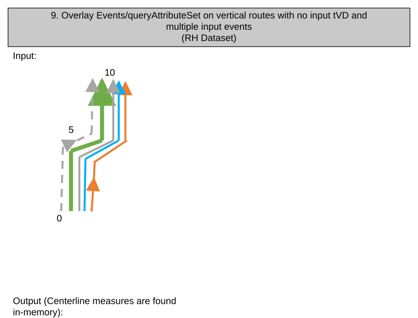

### TC-U11 — Overlay Events / QueryAttributeSet on Vertical Routes and Multiple Input Events <!-- src: S1 · slide 12 · case 10 -->

- **Case:** Overlay Events/queryAttributeSet on vertical routes and multiple input events with input tVD after input routes no longer exist (RH Dataset)

| Network Name | RouteID | From Date | To Date | Type |
| --- | --- | --- | --- | --- |
| Network1 | Route1 | 1/1/2000 | 1/1/2010 | Interstate |

| Input Layer | Event ID | From Date | To Date | From Measure | To Measure | Attribute [Color1] | Attribute [Color2] |
| --- | --- | --- | --- | --- | --- | --- | --- |
| Centerline | N/A | N/A | N/A | N/A | N/A | Asphalt | Active |
| Centerline | N/A | N/A | N/A | N/A | N/A | Chipseal | Active |
| Red Event | Red1 | 1/1/2000 | 1/1/2010 | 0 | 2.5 | Adams | Active |
| Red Event | Red2 | 1/1/2000 | 1/1/2010 | 2.5 | 10 | Laporte | Proposed |
| Blue Event | Blue1 | 1/1/2000 | 1/1/2010 | 0 | 10 | Full Access | Active |
| Green Event | Green1 | 1/1/2000 | 1/1/2010 | 0 | 10 | 45 MPH | Active |

Output (input tVD of 1/1/2015):

[figure: Input: · No features found · 0 · 10 · 5]

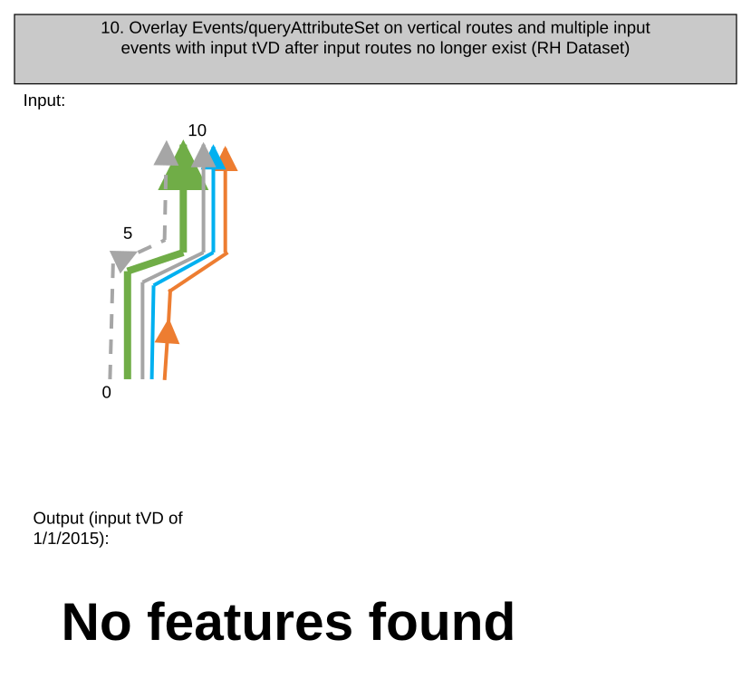

### TC-U12 — Overlay Events / QueryAttributeSet on Routes with Multiple Centerlines (case 11) <!-- src: S1 · slide 13 · case 11 -->

- **Case:** Overlay Events/queryAttributeSet on routes with multiple centerlines with different attribution and multiple input events with no input tVD (RH Dataset)

| Network Name | RouteID | From Date | To Date | Type |
| --- | --- | --- | --- | --- |
| Network1 | Route1 | 1/1/2000 | <Null> | Interstate |

| Input Layer | Event ID | From Date | To Date | From Measure | To Measure | Attribute [Color1] | Attribute [Color2] |
| --- | --- | --- | --- | --- | --- | --- | --- |
| Centerline | N/A | N/A | N/A | N/A | N/A | Asphalt | Active |
| Centerline | N/A | N/A | N/A | N/A | N/A | Chipseal | Active |
| Centerline | N/A | N/A | N/A | N/A | N/A | Asphalt | Active |
| Centerline | N/A | N/A | N/A | N/A | N/A | Chipseal | Active |
| Red Event | Red2 | 1/1/2000 | <Null> | 0 | 10 | Adams | Active |
| Blue Event | Blue1 | 1/1/2000 | <Null> | 0 | 10 | Full Access | Active |
| Green Event | Green1 | 1/1/2000 | <Null> | 0 | 10 | 45 MPH | Active |

| RouteID | From Date | To Date | From Measure | To Measure | Network1. Type | Centerline. Attribute1 | Centerline. Attribute2 | RedEvent . Red1 | RedEvent . Red2 | BlueEvent . Blue1 | BlueEvent . Blue2 | GreenEvent . Green1 | GreenEvent . Green2 |
| --- | --- | --- | --- | --- | --- | --- | --- | --- | --- | --- | --- | --- | --- |
| Route1 | 1/1/2000 | <Null> | 0 | 2.5 | Interstate | Asphalt | Active | Adams | Active | Full Access | Active | 45 MPH | Active |
| Route1 | 1/1/2000 | <Null> | 2.5 | 5 | Interstate | Chipseal | Active | Adams | Active | Full Access | Active | 45 MPH | Active |
| Route1 | 1/1/2000 | <Null> | 5 | 7.5 | Interstate | Asphalt | Active | Adams | Active | Full Access | Active | 45 MPH | Active |
| Route1 | 1/1/2000 | <Null> | 7.5 | 10 | Interstate | Chipseal | Active | Adams | Active | Full Access | Active | 45 MPH | Active |

Output (Centerline measures are found in-memory):

[figure: Input: · 0 · 10 · Route1]

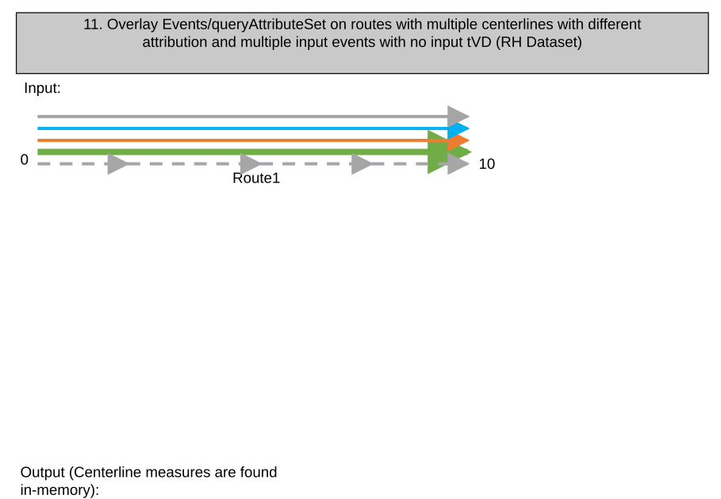

### TC-U13 — Overlay Events / QueryAttributeSet on Routes with One Centerline and Multiple <!-- src: S1 · slide 14 · case 12 -->

- **Case:** Overlay Events/queryAttributeSet on routes with one centerline and multiple input events. Centerline will be dynamically segmented based on attribution (RH Dataset)

| Network Name | RouteID | From Date | To Date | Type |
| --- | --- | --- | --- | --- |
| Network1 | Route1 | 1/1/2000 | <Null> | Interstate |

| Input Layer | Event ID | From Date | To Date | From Measure | To Measure | Attribute [Color1] | Attribute [Color2] |
| --- | --- | --- | --- | --- | --- | --- | --- |
| Centerline | N/A | N/A | N/A | N/A | N/A | Asphalt | Active |
| Red Event | Red1 | 1/1/2000 | <Null> | 0 | 7 | Adams | Active |
| Red Event | Red2 | 1/1/2000 | <Null> | 7 | 10 | Laporte | Active |
| Blue Event | Blue1 | 1/1/2000 | <Null> | 0 | 5 | Full Access | Active |
| Blue Event | Blue1 | 1/1/2000 | <Null> | 5 | 10 | No Access | Active |
| Green Event | Green1 | 1/1/2000 | <Null> | 0 | 4 | 45 MPH | Active |
| Green Event | Green1 | 1/1/2000 | <Null> | 4 | 10 | 50 MPH | Active |

| RouteID | From Date | To Date | From Measure | To Measure | Network1. Type | Centerline. Attribute1 | Centerline. Attribute2 | RedEvent . Red1 | RedEvent . Red2 | BlueEvent . Blue1 | BlueEvent . Blue2 | GreenEvent . Green1 | GreenEvent . Green2 |
| --- | --- | --- | --- | --- | --- | --- | --- | --- | --- | --- | --- | --- | --- |
| Route1 | 1/1/2000 | <Null> | 0 | 4 | Interstate | Asphalt | Active | Adams | Active | Full Access | Active | 45 MPH | Active |
| Route1 | 1/1/2000 | <Null> | 4 | 5 | Interstate | Asphalt | Active | Adams | Active | Full Access | Active | 50 MPH | Active |
| Route1 | 1/1/2000 | <Null> | 5 | 7 | Interstate | Asphalt | Active | Adams | Active | No Access | Active | 50 MPH | Active |
| Route1 | 1/1/2000 | <Null> | 7 | 10 | Interstate | Asphalt | Active | Laporte | Active | No Access | Active | 50 MPH | Active |

Output (Centerline measures are found in-memory):

[figure: Input: · 0 · 10 · Route1]

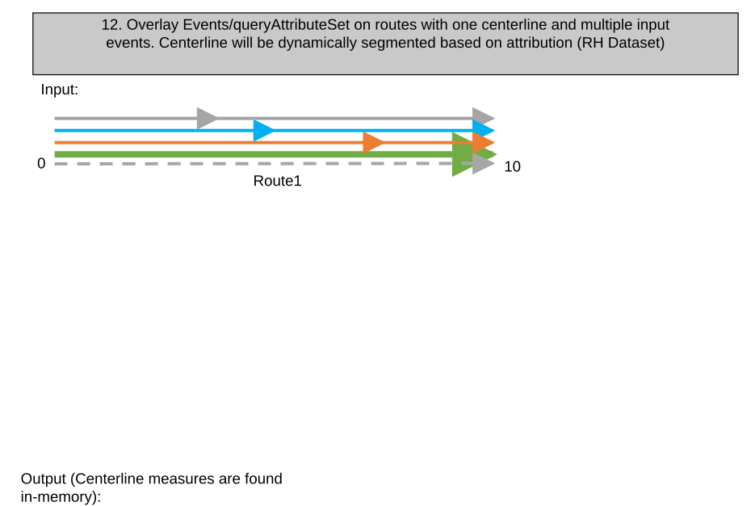

### TC-U14 — Overlay Events / QueryAttributeSet on Routes with Multiple Centerline and Retired (case 13) <!-- src: S1 · slide 15 · case 13 -->

- **Case:** Overlay Events/queryAttributeSet on routes with multiple centerline and retired input events. tVD is after event retirement, but centerline will still be dynamically segmented based on attribution (RH Dataset)

| Network Name | RouteID | From Date | To Date | Type |
| --- | --- | --- | --- | --- |
| Network1 | Route1 | 1/1/2000 | <Null> | Interstate |

| Input Layer | Event ID | From Date | To Date | From Measure | To Measure | Attribute [Color1] | Attribute [Color2] |
| --- | --- | --- | --- | --- | --- | --- | --- |
| Centerline | N/A | N/A | N/A | N/A | N/A | Asphalt | Active |
| Centerline | N/A | N/A | N/A | N/A | N/A | Chipseal | Active |
| Centerline | N/A | N/A | N/A | N/A | N/A | Asphalt | Active |
| Centerline | N/A | N/A | N/A | N/A | N/A | Chipseal | Active |
| Red Event | Red2 | 1/1/2000 | 1/1/2010 | 0 | 10 | Adams | Active |
| Blue Event | Blue1 | 1/1/2000 | 1/1/2010 | 0 | 10 | Full Access | Active |
| Green Event | Green1 | 1/1/2000 | 1/1/2010 | 0 | 10 | 45 MPH | Active |

| RouteID | From Date | To Date | From Measure | To Measure | Network1. Type | Centerline. Attribute1 | Centerline. Attribute2 | RedEvent . Red1 | RedEvent . Red2 | BlueEvent . Blue1 | BlueEvent . Blue2 | GreenEvent . Green1 | GreenEvent . Green2 |
| --- | --- | --- | --- | --- | --- | --- | --- | --- | --- | --- | --- | --- | --- |
| Route1 | 1/1/2000 | <Null> | 0 | 2.5 | Interstate | Asphalt | Active | <Null> | <Null> | <Null> | <Null> | <Null> | <Null> |
| Route1 | 1/1/2000 | <Null> | 2.5 | 5 | Interstate | Chipseal | Active | <Null> | <Null> | <Null> | <Null> | <Null> | <Null> |
| Route1 | 1/1/2000 | <Null> | 5 | 7.5 | Interstate | Asphalt | Active | <Null> | <Null> | <Null> | <Null> | <Null> | <Null> |
| Route1 | 1/1/2000 | <Null> | 7.5 | 10 | Interstate | Chipseal | Active | <Null> | <Null> | <Null> | <Null> | <Null> | <Null> |

Output (Input tVD of 1/1/2015, Centerline measures are found in-memory):

[figure: Input: · 0 · 10 · Route1]

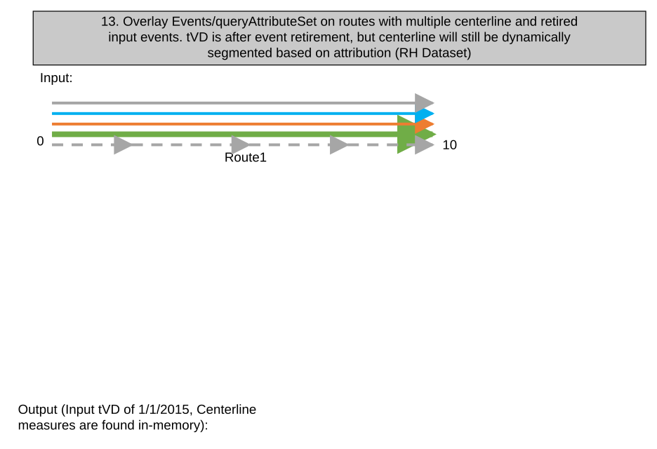

### TC-U15 — Overlay Events / QueryAttributeSet on Routes with Multiple Centerlines and Time <!-- src: S1 · slide 16 · case 14 -->

- **Case:** Overlay Events/queryAttributeSet on routes with multiple centerlines and time sliced input events. tVD is in overlapping time slice of events (RH Dataset)

| Network Name | RouteID | From Date | To Date | Type |
| --- | --- | --- | --- | --- |
| Network1 | Route1 | 1/1/2000 | <Null> | Interstate |

| Input Layer | Event ID | From Date | To Date | From Measure | To Measure | Attribute [Color1] | Attribute [Color2] |
| --- | --- | --- | --- | --- | --- | --- | --- |
| Centerline | N/A | N/A | N/A | N/A | N/A | Asphalt | Active |
| Centerline | N/A | N/A | N/A | N/A | N/A | Chipseal | Active |
| Centerline | N/A | N/A | N/A | N/A | N/A | Asphalt | Active |
| Centerline | N/A | N/A | N/A | N/A | N/A | Chipseal | Active |
| Red Event | Red1 | 1/1/2000 | 1/1/2010 | 0 | 5 | Adams | Active |
| Red Event | Red2 | 1/1/2000 | 1/1/2010 | 5 | 10 | Laporte | Active |
| Blue Event | Blue1 | 1/1/2000 | <Null> | 0 | 10 | Full Access | Active |
| Green Event | Green1 | 1/1/2000 | <Null> | 0 | 10 | 45 MPH | Active |

| RouteID | From Date | To Date | From Measure | To Measure | Network1. Type | Centerline. Attribute1 | Centerline. Attribute2 | RedEvent . Red1 | RedEvent . Red2 | BlueEvent . Blue1 | BlueEvent . Blue2 | GreenEvent . Green1 | GreenEvent . Green2 |
| --- | --- | --- | --- | --- | --- | --- | --- | --- | --- | --- | --- | --- | --- |
| Route1 | 1/1/2000 | <Null> | 0 | 2.5 | Interstate | Asphalt | Active | Adams | Active | Full Access | Active | 45 MPH | Active |
| Route1 | 1/1/2000 | <Null> | 2.5 | 5 | Interstate | Chipseal | Active | Adams | Active | Full Access | Active | 45 MPH | Active |
| Route1 | 1/1/2000 | <Null> | 5 | 7.5 | Interstate | Asphalt | Active | Laporte | Active | Full Access | Active | 45 MPH | Active |
| Route1 | 1/1/2000 | <Null> | 7.5 | 10 | Interstate | Chipseal | Active | Laporte | Active | Full Access | Active | 45 MPH | Active |

Output (Input tVD of 1/1/2008, Centerline measures are found in-memory):

[figure: Input: · 0 · 10 · Route1]

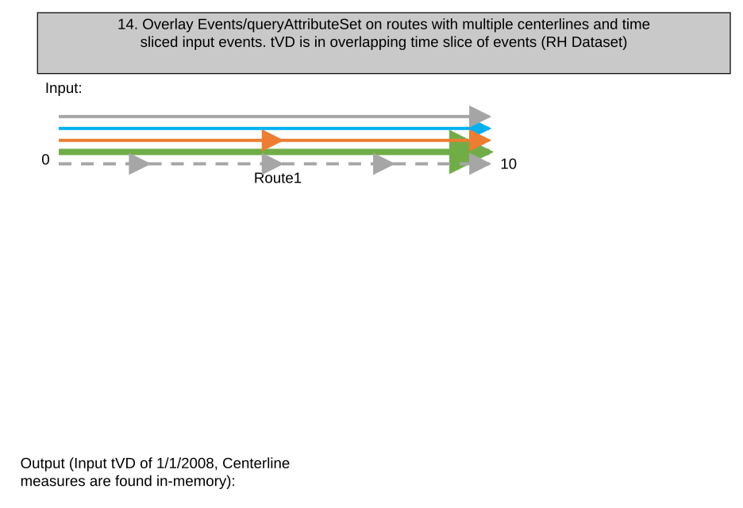

### TC-U16 — Overlay Events / QueryAttributeSet on Routes with Multiple Centerlines and Events (case 15) <!-- src: S1 · slide 17 · case 15 -->

- **Case:** Overlay Events/queryAttributeSet on routes with multiple centerlines and events that do not fully cover routes (RH Dataset)

| Network Name | RouteID | From Date | To Date | Type |
| --- | --- | --- | --- | --- |
| Network1 | Route1 | 1/1/2000 | <Null> | Interstate |

| Input Layer | Event ID | From Date | To Date | From Measure | To Measure | Attribute [Color1] | Attribute [Color2] |
| --- | --- | --- | --- | --- | --- | --- | --- |
| Centerline | N/A | N/A | N/A | N/A | N/A | Asphalt | Active |
| Centerline | N/A | N/A | N/A | N/A | N/A | Chipseal | Active |
| Centerline | N/A | N/A | N/A | N/A | N/A | Asphalt | Active |
| Centerline | N/A | N/A | N/A | N/A | N/A | Chipseal | Active |
| Red Event | Red1 | 1/1/2000 | <Null> | 2.5 | 5 | Adams | Active |
| Red Event | Red2 | 1/1/2000 | <Null> | 5 | 7.5 | Laporte | Active |
| Blue Event | Blue1 | 1/1/2000 | <Null> | 2.5 | 7.5 | Full Access | Active |
| Green Event | Green1 | 1/1/2000 | <Null> | 2.5 | 7.5 | 45 MPH | Active |

| RouteID | From Date | To Date | From Measure | To Measure | Network1. Type | Centerline. Attribute1 | Centerline. Attribute2 | RedEvent . Red1 | RedEvent . Red2 | BlueEvent . Blue1 | BlueEvent . Blue2 | GreenEvent . Green1 | GreenEvent . Green2 |
| --- | --- | --- | --- | --- | --- | --- | --- | --- | --- | --- | --- | --- | --- |
| Route1 | 1/1/2000 | <Null> | 0 | 2.5 | Interstate | Asphalt | Active | <Null> | <Null> | <Null> | <Null> | <Null> | <Null> |
| Route1 | 1/1/2000 | <Null> | 2.5 | 5 | Interstate | Chipseal | Active | Adams | Active | Full Access | Active | 45 MPH | Active |
| Route1 | 1/1/2000 | <Null> | 5 | 7.5 | Interstate | Asphalt | Active | Laporte | Active | Full Access | Active | 45 MPH | Active |
| Route1 | 1/1/2000 | <Null> | 7.5 | 10 | Interstate | Chipseal | Active | <Null> | <Null> | <Null> | <Null> | <Null> | <Null> |

Output (Centerline measures are found in-memory):

[figure: Input: · 0 · 10 · Route1]

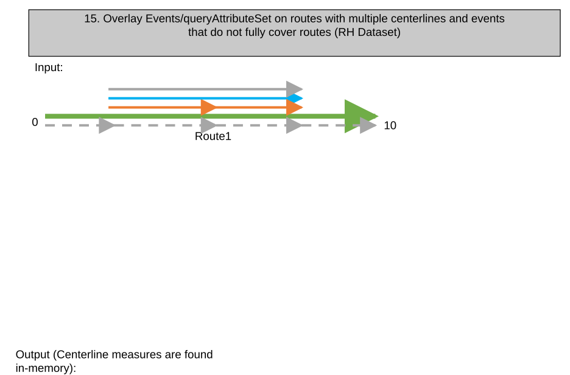

### TC-U17 — Overlay Events / QueryAttributeSet on Gapped Routes with Multiple Centerlines (case 16) <!-- src: S1 · slide 18 · case 16 -->

- **Case:** Overlay Events/queryAttributeSet on gapped routes with multiple centerlines and events (RH Dataset)

| Network Name | RouteID | From Date | To Date | Type |
| --- | --- | --- | --- | --- |
| Network1 | Route1 | 1/1/2000 | <Null> | Interstate |

| Input Layer | Event ID | From Date | To Date | From Measure | To Measure | Attribute [Color1] | Attribute [Color2] |
| --- | --- | --- | --- | --- | --- | --- | --- |
| Centerline | N/A | N/A | N/A | N/A | N/A | Asphalt | Active |
| Centerline | N/A | N/A | N/A | N/A | N/A | Chipseal | Active |
| Centerline | N/A | N/A | N/A | N/A | N/A | Asphalt | Active |
| Centerline | N/A | N/A | N/A | N/A | N/A | Chipseal | Active |
| Red Event | Red1 | 1/1/2000 | <Null> | 0 | 4 | Adams | Active |
| Red Event | Red2 | 1/1/2000 | <Null> | 6 | 10 | Laporte | Active |
| Blue Event | Blue1 | 1/1/2000 | <Null> | 6 | 10 | Full Access | Active |
| Green Event | Green1 | 1/1/2000 | <Null> | 0 | 4 | 45 MPH | Active |

| RouteID | From Date | To Date | From Measure | To Measure | Network1. Type | Centerline. Attribute1 | Centerline. Attribute2 | RedEvent . Red1 | RedEvent . Red2 | BlueEvent . Blue1 | BlueEvent . Blue2 | GreenEvent . Green1 | GreenEvent . Green2 |
| --- | --- | --- | --- | --- | --- | --- | --- | --- | --- | --- | --- | --- | --- |
| Route1 | 1/1/2000 | <Null> | 0 | 2 | Interstate | Asphalt | Active | Adams | Active | <Null> | <Null> | 45 MPH | Active |
| Route1 | 1/1/2000 | <Null> | 2 | 4 | Interstate | Chipseal | Active | Adams | Active | <Null> | <Null> | 45 MPH | Active |
| Route1 | 1/1/2000 | <Null> | 6 | 8 | Interstate | Asphalt | Active | Laporte | Active | Full Access | Active | <Null> | <Null> |
| Route1 | 1/1/2000 | <Null> | 8 | 10 | Interstate | Chipseal | Active | Laporte | Active | <Null> | <Null> | <Null> | <Null> |

Output (Centerline measures are found in-memory):

[figure: Input: · 0 · 10 · Route1 · 4 · 6]

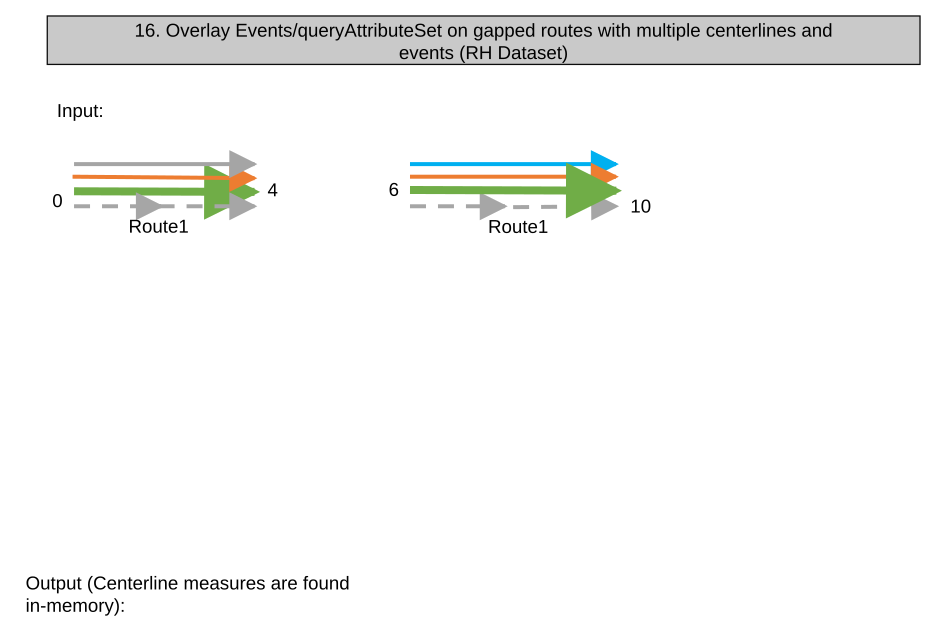

### TC-U18 — Overlay Events / QueryAttributeSet on Routes with Multiple Centerlines (case 17) <!-- src: S1 · slide 19 · case 17 -->

- **Case:** Overlay Events/queryAttributeSet on routes with multiple centerlines and multiple time slices of events (RH Dataset)

| Network Name | Route ID | From Date | To Date | Type |
| --- | --- | --- | --- | --- |
| Network1 | Route1 | 1/1/2000 | <Null> | Interstate |

| Input Layer | Event ID | From Date | To Date | From Measure | To Measure | Attribute [Color1] | Attribute [Color2] |
| --- | --- | --- | --- | --- | --- | --- | --- |
| Centerline | N/A | N/A | N/A | N/A | N/A | Asphalt | Active |
| Centerline | N/A | N/A | N/A | N/A | N/A | Chipseal | Active |
| Centerline | N/A | N/A | N/A | N/A | N/A | Asphalt | Active |
| Centerline | N/A | N/A | N/A | N/A | N/A | Chipseal | Active |
| Red Event | Red1 | 1/1/2000 | 1/1/2005 | 0 | 10 | Adams | Retired |
| Red Event | Red1 | 1/1/2005 | 1/1/2010 | 0 | 5 | Adams | Retired |
| Red Event | Red2 | 1/1/2005 | 1/1/2010 | 5 | 10 | Laporte | Retired |
| Red Event | Red1 | 1/1/2010 | <Null> | 0 | 10 | Adams | Active |
| Blue Event | Blue1 | 1/1/2000 | 1/1/2005 | 0 | 8 | Full Access | Retired |
| Blue Event | Blue2 | 1/1/2005 | <Null> | 0 | 10 | No Access | Active |

| Route ID | From Date | To Date | From Measure | To Measure | Network1. Type | Centerline. Attribute1 | Centerline. Attribute2 | RedEvent . Red1 | RedEvent . Red2 | BlueEvent . Blue1 | BlueEvent . Blue2 |
| --- | --- | --- | --- | --- | --- | --- | --- | --- | --- | --- | --- |
| Route1 | 1/1/2000 | 1/1/2005 | 0 | 2.5 | Interstate | Asphalt | Active | Adams | Retired | Full Access | Retired |
| Route1 | 1/1/2000 | 1/1/2005 | 2.5 | 5 | Interstate | Chipseal | Active | Adams | Retired | Full Access | Retired |
| Route1 | 1/1/2000 | 1/1/2005 | 5 | 7.5 | Interstate | Asphalt | Active | Adams | Retired | Full Access | Retired |
| Route1 | 1/1/2000 | 1/1/2005 | 7.5 | 8 | Interstate | Asphalt | Active | Adams | Retired | Full Access | Retired |
| Route1 | 1/1/2000 | 1/1/2005 | 8 | 10 | Interstate | Chipseal | Active | Adams | Retired | <Null> | <Null> |
| Route1 | 1/1/2005 | 1/1/2010 | 0 | 2.5 | Interstate | Asphalt | Active | Adams | Retired | Partial Access | Active |
| Route1 | 1/1/2005 | 1/1/2010 | 2.5 | 5 | Interstate | Chipseal | Active | Adams | Retired | Partial Access | Active |
| Route1 | 1/1/2005 | 1/1/2010 | 5 | 7.5 | Interstate | Asphalt | Active | Laporte | Retired | Partial Access | Active |
| Route1 | 1/1/2005 | 1/1/2010 | 7.5 | 10 | Interstate | Chipseal | Active | Laporte | Retired | Partial Access | Active |
| Route1 | 1/1/2010 | <Null> | 0 | 2.5 | Interstate | Asphalt | Active | Adams | Active | Partial Access | Active |
| Route1 | 1/1/2010 | <Null> | 2.5 | 5 | Interstate | Chipseal | Active | Adams | Active | Partial Access | Active |
| Route1 | 1/1/2010 | <Null> | 5 | 7.5 | Interstate | Asphalt | Active | Adams | Active | Partial Access | Active |
| Route1 | 1/1/2010 | <Null> | 7.5 | 10 | Interstate | Chipseal | Active | Adams | Active | Partial Access | Active |

Output (Centerline measures are found in-memory):

[figure: Input: · 0 · 10 · Route1]

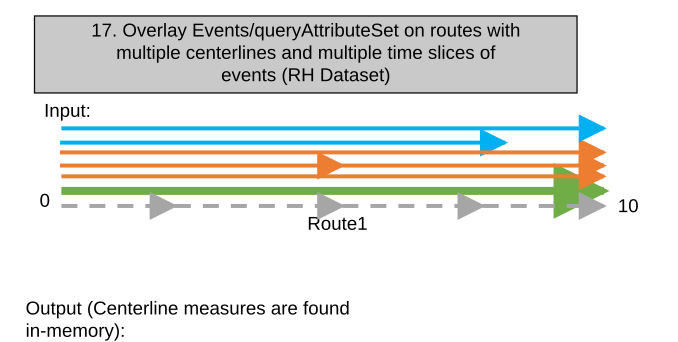

### TC-U19 — Overlay Events / QueryAttributeSet on Routes with Multiple Centerlines (case 18) <!-- src: S1 · slide 22 · case 18 -->

- **Case:** Overlay Events/queryAttributeSet on routes with multiple centerlines, some flipped) and multiple events (RH Dataset)

| Network Name | RouteID | From Date | To Date | Type |
| --- | --- | --- | --- | --- |
| Network1 | Route1 | 1/1/2000 | <Null> | Interstate |

| Input Layer | Event ID | From Date | To Date | From Measure | To Measure | Attribute [Color1] | Attribute [Color2] |
| --- | --- | --- | --- | --- | --- | --- | --- |
| Centerline | N/A | N/A | N/A | N/A | N/A | Asphalt | Active |
| Centerline | N/A | N/A | N/A | N/A | N/A | Chipseal | Active |
| Centerline | N/A | N/A | N/A | N/A | N/A | Asphalt | Active |
| Centerline | N/A | N/A | N/A | N/A | N/A | Chipseal | Active |
| Red Event | Red2 | 1/1/2000 | <Null> | 0 | 10 | Adams | Active |
| Blue Event | Blue1 | 1/1/2000 | <Null> | 0 | 10 | Full Access | Active |
| Green Event | Green1 | 1/1/2000 | <Null> | 0 | 10 | 45 MPH | Active |

| RouteID | From Date | To Date | From Measure | To Measure | Network1. Type | Centerline. Attribute1 | Centerline. Attribute2 | RedEvent . Red1 | RedEvent . Red2 | BlueEvent . Blue1 | BlueEvent . Blue2 | GreenEvent . Green1 | GreenEvent . Green2 |
| --- | --- | --- | --- | --- | --- | --- | --- | --- | --- | --- | --- | --- | --- |
| Route1 | 1/1/2000 | <Null> | 0 | 2.5 | Interstate | Asphalt | Active | Adams | Active | Full Access | Active | 45 MPH | Active |
| Route1 | 1/1/2000 | <Null> | 2.5 | 5 | Interstate | Chipseal | Active | Adams | Active | Full Access | Active | 45 MPH | Active |
| Route1 | 1/1/2000 | <Null> | 5 | 7.5 | Interstate | Asphalt | Active | Adams | Active | Full Access | Active | 45 MPH | Active |
| Route1 | 1/1/2000 | <Null> | 7.5 | 10 | Interstate | Chipseal | Active | Adams | Active | Full Access | Active | 45 MPH | Active |

Output (Centerline measures are found in-memory):

[figure: Input: · 0 · 10 · Route1]

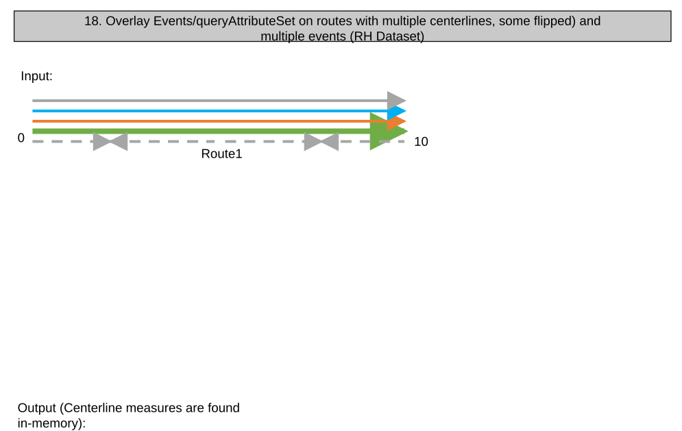

### TC-U20 — Overlay Events / QueryAttributeSet on Simple Routes with No Input TVD and Multiple (case 19) <!-- src: S1 · slide 23 · case 19 -->

- **Case:** Overlay Events/queryAttributeSet on simple routes with no input tVD and multiple input events (APR Dataset)

| Network Name | RouteID | From Date | To Date | Type |
| --- | --- | --- | --- | --- |
| Network1 | Route1 | 1/1/2000 | <Null> | Upstream |
| Network1 | Route2 | 1/1/2000 | <Null> | Midstream |

| Input Layer | Event ID | From Date | To Date | From Measure | To Measure | From RouteID | To RouteID | Attribute [Color1] | Attribute [Color2] |
| --- | --- | --- | --- | --- | --- | --- | --- | --- | --- |
| Centerline | N/A | N/A | N/A | N/A | N/A | N/A | N/A | Steel | Active |
| Centerline | N/A | N/A | N/A | N/A | N/A | N/A | N/A | Plastic | Active |
| Centerline | N/A | N/A | N/A | N/A | N/A | N/A | N/A | Steel | Active |
| Red Event | Red1 | 1/1/2000 | <Null> | 0 | 2.5 | Route1 | Route1 | 450 psi | Active |
| Red Event | Red2 | 1/1/2000 | <Null> | 2.5 | 15 | Route1 | Route2 | 500 psi | Proposed |
| Blue Event | Blue1 | 1/1/2000 | <Null> | 0 | 15 | Route1 | Route2 | Low | Active |
| Green Event | Green1 | 1/1/2000 | <Null> | 0 | 15 | Route1 | Route2 | Complete | Active |

Output (centerline measures found in-memory):

| RouteID | From Date | To Date | From Measure | To Measure | Network1. Type | Centerline. Attribute1 | Centerline. Attribute2 | RedEvent . Red1 | RedEvent . Red2 | BlueEvent . Blue1 | BlueEvent . Blue2 | GreenEvent . Green1 | GreenEvent . Green2 |
| --- | --- | --- | --- | --- | --- | --- | --- | --- | --- | --- | --- | --- | --- |
| Route1 | 1/1/2000 | <Null> | 0 | 2.5 | Upstream | Steel | Active | 450 psi | Active | Low | Active | Complete | Active |
| Route1 | 1/1/2000 | <Null> | 2.5 | 5 | Upstream | Steel | Active | 500 psi | Proposed | Low | Active | Complete | Active |
| Route2 | 1/1/2000 | <Null> | 10 | 12.5 | Midstream | Plastic | Active | 500 psi | Proposed | Low | Active | Complete | Active |
| Route2 | 1/1/2000 | <Null> | 12.5 | 15 | Midstream | Steel | Active | 500 psi | Proposed | Low | Active | Complete | Active |

[figure: 0 · 15 · Input: · 5 · Route1 · Route2 · 10]

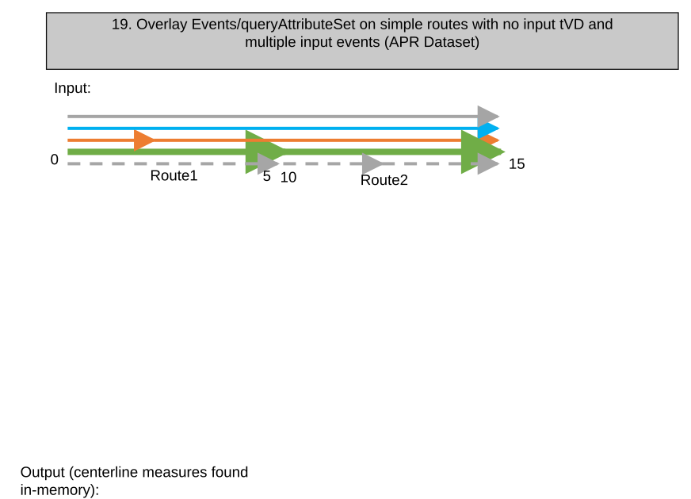

### TC-U21 — Overlay Events / QueryAttributeSet on Simple Routes and Multiple Input Events (case 20) <!-- src: S1 · slide 24 · case 20 -->

- **Case:** Overlay Events/queryAttributeSet on simple routes and multiple input events with input tVD after input routes no longer exist (APR Dataset)

| Network Name | RouteID | From Date | To Date | Type |
| --- | --- | --- | --- | --- |
| Network1 | Route1 | 1/1/2000 | 1/1/2010 | Upstream |
| Network1 | Route2 | 1/1/2000 | 1/1/2010 | Midstream |

| Input Layer | Event ID | From Date | To Date | From Measure | To Measure | From RouteID | To RouteID | Attribute [Color1] | Attribute [Color2] |
| --- | --- | --- | --- | --- | --- | --- | --- | --- | --- |
| Centerline | N/A | N/A | N/A | N/A | N/A | N/A | N/A | Steel | Active |
| Centerline | N/A | N/A | N/A | N/A | N/A | N/A | N/A | Plastic | Active |
| Centerline | N/A | N/A | N/A | N/A | N/A | N/A | N/A | Steel | Active |
| Red Event | Red1 | 1/1/2000 | 1/1/2010 | 0 | 2.5 | Route1 | Route1 | 450 psi | Active |
| Red Event | Red2 | 1/1/2000 | 1/1/2010 | 2.5 | 15 | Route1 | Route2 | 500 psi | Proposed |
| Blue Event | Blue1 | 1/1/2000 | 1/1/2010 | 0 | 15 | Route1 | Route2 | Low | Active |
| Green Event | Green1 | 1/1/2000 | 1/1/2010 | 0 | 15 | Route1 | Route2 | Complete | Active |

Output (input tVD of 1/1/2015):

[figure: 0 · Input: · 5 · Route1 · Route2 · No features found · 15 · 10]

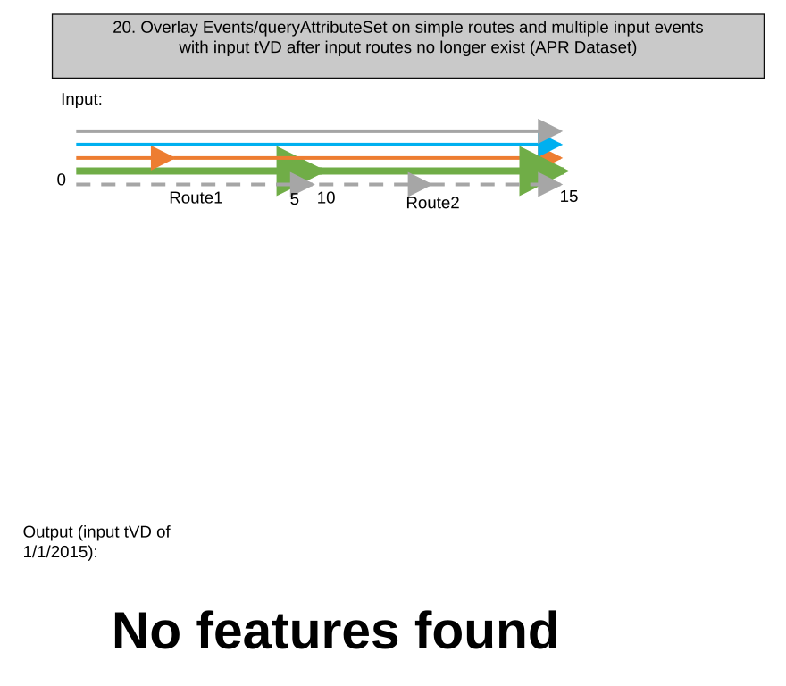

### TC-U22 — Overlay Events / QueryAttributeSet on Complex Routes with No Input TVD (case 21) <!-- src: S1 · slide 25 · case 21 -->

- **Case:** Overlay Events/queryAttributeSet on complex routes with no input tVD and multiple input events (APR Dataset)

| Network Name | RouteID | From Date | To Date | Type |
| --- | --- | --- | --- | --- |
| Network1 | Route1 | 1/1/2000 | <Null> | Upstream |
| Network1 | Route2 | 1/1/2000 | <Null> | Midstream |

| Input Layer | Event ID | From Date | To Date | From Measure | To Measure | From RouteID | To RouteID | Attribute [Color1] | Attribute [Color2] |
| --- | --- | --- | --- | --- | --- | --- | --- | --- | --- |
| Centerline | N/A | N/A | N/A | N/A | N/A | N/A | N/A | Steel | Active |
| Centerline | N/A | N/A | N/A | N/A | N/A | N/A | N/A | Plastic | Active |
| Centerline | N/A | N/A | N/A | N/A | N/A | N/A | N/A | Steel | Active |
| Red Event | Red1 | 1/1/2000 | <Null> | 0 | 5 | Route1 | Route1 | 450 psi | Active |
| Red Event | Red2 | 1/1/2000 | <Null> | 5 | 20 | Route1 | Route2 | 500 psi | Proposed |
| Blue Event | Blue1 | 1/1/2000 | <Null> | 0 | 20 | Route1 | Route2 | Low | Active |
| Green Event | Green1 | 1/1/2000 | <Null> | 0 | 20 | Route1 | Route2 | Complete | Active |

| RouteID | From Date | To Date | From Measure | To Measure | Network1. Type | Centerline. Attribute1 | Centerline. Attribute2 | RedEvent . Red1 | RedEvent . Red2 | BlueEvent . Blue1 | BlueEvent . Blue2 | GreenEvent . Green1 | GreenEvent . Green2 |
| --- | --- | --- | --- | --- | --- | --- | --- | --- | --- | --- | --- | --- | --- |
| Route1 | 1/1/2000 | <Null> | 0 | 5 | Upstream | Steel | Active | 450 psi | Active | Low | Active | Complete | Active |
| Route1 | 1/1/2000 | <Null> | 5 | 10 | Upstream | Steel | Active | 500 psi | Proposed | Low | Active | Complete | Active |
| Route2 | 1/1/2000 | <Null> | 15 | 17.5 | Midstream | Plastic | Active | 500 psi | Proposed | Low | Active | Complete | Active |
| Route2 | 1/1/2000 | <Null> | 17.5 | 20 | Midstream | Steel | Active | 500 psi | Proposed | Low | Active | Complete | Active |

[figure: 0 · 10 · 5 · 15 · Route1 · Route2 · Output: · Input: · 20]

### TC-U23 — Overlay Events / QueryAttributeSet on Complex Routes and Multiple Input Events (case 22) <!-- src: S1 · slide 26 · case 22 -->

- **Case:** Overlay Events/queryAttributeSet on complex routes and multiple input events with input tVD after input routes no longer exist (APR Dataset)

| Network Name | RouteID | From Date | To Date | Type |
| --- | --- | --- | --- | --- |
| Network1 | Route1 | 1/1/2000 | 1/1/2010 | Upstream |
| Network1 | Route2 | 1/1/2000 | 1/1/2010 | Midstream |

| Input Layer | Event ID | From Date | To Date | From Measure | To Measure | From RouteID | To RouteID | Attribute [Color1] | Attribute [Color2] |
| --- | --- | --- | --- | --- | --- | --- | --- | --- | --- |
| Centerline | N/A | N/A | N/A | N/A | N/A | N/A | N/A | Steel | Active |
| Centerline | N/A | N/A | N/A | N/A | N/A | N/A | N/A | Plastic | Active |
| Centerline | N/A | N/A | N/A | N/A | N/A | N/A | N/A | Steel | Active |
| Red Event | Red1 | 1/1/2000 | 1/1/2010 | 0 | 5 | Route1 | Route1 | 450 psi | Active |
| Red Event | Red2 | 1/1/2000 | 1/1/2010 | 5 | 20 | Route1 | Route2 | 500 psi | Proposed |
| Blue Event | Blue1 | 1/1/2000 | 1/1/2010 | 0 | 20 | Route1 | Route2 | Low | Active |
| Green Event | Green1 | 1/1/2000 | 1/1/2010 | 0 | 20 | Route1 | Route2 | Complete | Active |

Output (input tVD of 1/1/2015):

[figure: No features found · 0 · 10 · 5 · Route1 · Route2 · Input: · 15 · 20]

### TC-U24 — Overlay Events / QueryAttributeSet on Vertical Routes with No Input TVD (case 23) <!-- src: S1 · slide 27 · case 23 -->

- **Case:** Overlay Events/queryAttributeSet on vertical routes with no input tVD and multiple spanning and non-spanning input events (APR Dataset)

| Network Name | RouteID | From Date | To Date | Type |
| --- | --- | --- | --- | --- |
| Network1 | Route1 | 1/1/2000 | <Null> | Upstream |
| Network1 | Route2 | 1/1/2000 | <Null> | Midstream |

| Input Layer | Event ID | From Date | To Date | From Measure | To Measure | From RouteID | To RouteID | Attribute [Color1] | Attribute [Color2] |
| --- | --- | --- | --- | --- | --- | --- | --- | --- | --- |
| Centerline | N/A | N/A | N/A | N/A | N/A | N/A | N/A | Steel | Active |
| Centerline | N/A | N/A | N/A | N/A | N/A | N/A | N/A | Plastic | Active |
| Red Event | Red1 | 1/1/2000 | <Null> | 0 | 2.5 | Route1 | Route1 | 450 psi | Active |
| Red Event | Red2 | 1/1/2000 | <Null> | 2.5 | 20 | Route1 | Route2 | 500 psi | Proposed |
| Blue Event | Blue1 | 1/1/2000 | <Null> | 0 | 20 | Route1 | Route2 | Low | Active |
| Green Event | Green1 | 1/1/2000 | <Null> | 0 | 20 | Route1 | Route2 | Complete | Active |

| RouteID | From Date | To Date | From Measure | To Measure | Network1. Type | Centerline. Attribute1 | Centerline. Attribute2 | RedEvent . Red1 | RedEvent . Red2 | BlueEvent . Blue1 | BlueEvent . Blue2 | GreenEvent . Green1 | GreenEvent . Green2 |
| --- | --- | --- | --- | --- | --- | --- | --- | --- | --- | --- | --- | --- | --- |
| Route1 | 1/1/2000 | <Null> | 0 | 2.5 | Upstream | Steel | Active | 450 psi | Active | Low | Active | Complete | Active |
| Route1 | 1/1/2000 | <Null> | 2.5 | 5 | Upstream | Steel | Active | 500 psi | Active | Low | Active | Complete | Active |
| Route2 | 1/1/2000 | <Null> | 15 | 20 | Midstream | Plastic | Active | 500 psi | Active | Low | Active | Complete | Active |

Output (Centerline measures are found in-memory):

[figure: Input: · 0 · 20 · 5 · 15 · Route1 · Route2]

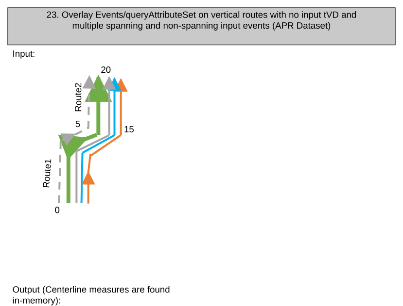

### TC-U25 — Overlay Events / QueryAttributeSet on Vertical Routes and Multiple Spanning <!-- src: S1 · slide 28 · case 24 -->

- **Case:** Overlay Events/queryAttributeSet on vertical routes and multiple spanning and non-spanning input events with input tVD after input routes no longer exist (APR Dataset)

Output (input tVD of 1/1/2015):

| Network Name | RouteID | From Date | To Date | Type |
| --- | --- | --- | --- | --- |
| Network1 | Route1 | 1/1/2000 | 1/1/2010 | Upstream |
| Network1 | Route2 | 1/1/2000 | 1/1/2010 | Midstream |

| Input Layer | Event ID | From Date | To Date | From Measure | To Measure | From RouteID | To RouteID | Attribute [Color1] | Attribute [Color2] |
| --- | --- | --- | --- | --- | --- | --- | --- | --- | --- |
| Centerline | N/A | N/A | N/A | N/A | N/A | N/A | N/A | Steel | Active |
| Centerline | N/A | N/A | N/A | N/A | N/A | N/A | N/A | Plastic | Active |
| Red Event | Red1 | 1/1/2000 | 1/1/2010 | 0 | 2.5 | Route1 | Route1 | 450 psi | Active |
| Red Event | Red2 | 1/1/2000 | 1/1/2010 | 2.5 | 20 | Route1 | Route2 | 500 psi | Proposed |
| Blue Event | Blue1 | 1/1/2000 | 1/1/2010 | 0 | 20 | Route1 | Route2 | Low | Active |
| Green Event | Green1 | 1/1/2000 | 1/1/2010 | 0 | 20 | Route1 | Route2 | Complete | Active |

[figure: 0 · 20 · Input: · No features found · 5 · 15 · Route1 · Route2]

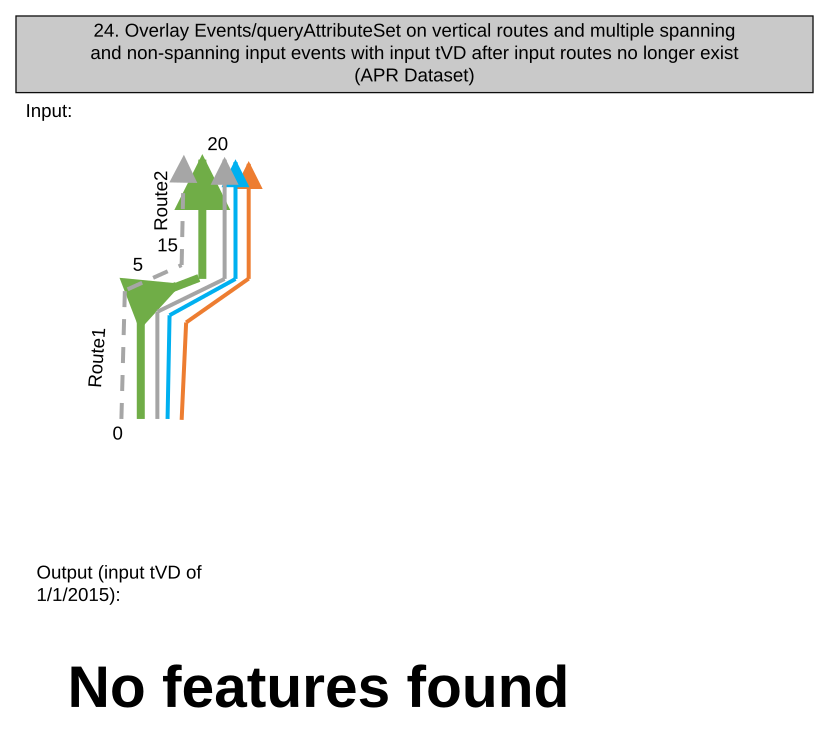

### TC-U26 — Overlay Events / QueryAttributeSet on Routes with Multiple Centerlines (case 25) <!-- src: S1 · slide 29 · case 25 -->

- **Case:** Overlay Events/queryAttributeSet on routes with multiple centerlines with different attribution and multiple spanning and non-spanning input events (APR Dataset)

| Network Name | RouteID | From Date | To Date | Type |
| --- | --- | --- | --- | --- |
| Network1 | Route1 | 1/1/2000 | <Null> | Upstream |
| Network1 | Route2 | 1/1/2000 | <Null> | Midstream |

| Input Layer | Event ID | From Date | To Date | From Measure | To Measure | From RouteID | To RouteID | Attribute [Color1] | Attribute [Color2] |
| --- | --- | --- | --- | --- | --- | --- | --- | --- | --- |
| Centerline | N/A | N/A | N/A | N/A | N/A | N/A | N/A | Steel | Active |
| Centerline | N/A | N/A | N/A | N/A | N/A | N/A | N/A | Plastic | Active |
| Centerline | N/A | N/A | N/A | N/A | N/A | N/A | N/A | Steel | Active |
| Centerline | N/A | N/A | N/A | N/A | N/A | N/A | N/A | Plastic | Active |
| Red Event | Red1 | 1/1/2000 | <Null> | 0 | 2.5 | Route1 | Route1 | 450 psi | Active |
| Red Event | Red2 | 1/1/2000 | <Null> | 2.5 | 15 | Route1 | Route2 | 500 psi | Proposed |
| Blue Event | Blue1 | 1/1/2000 | <Null> | 0 | 15 | Route1 | Route2 | Low | Active |
| Green Event | Green1 | 1/1/2000 | <Null> | 0 | 5 | Route1 | Route1 | Complete | Active |
| Green Event | Green1 | 1/1/2000 | <Null> | 10 | 15 | Route2 | Route2 | Incomplete | Active |

Output (Centerline measures are found in-memory):

| RouteID | From Date | To Date | From Measure | To Measure | Network1. Type | Centerline. Attribute1 | Centerline. Attribute2 | RedEvent . Red1 | RedEvent . Red2 | BlueEvent . Blue1 | BlueEvent . Blue2 | GreenEvent . Green1 | GreenEvent . Green2 |
| --- | --- | --- | --- | --- | --- | --- | --- | --- | --- | --- | --- | --- | --- |
| Route1 | 1/1/2000 | <Null> | 0 | 2.5 | Upstream | Steel | Active | 450 psi | Active | Low | Active | Complete | Active |
| Route1 | 1/1/2000 | <Null> | 2.5 | 5 | Upstream | Plastic | Active | 500 psi | Proposed | Low | Active | Complete | Active |
| Route2 | 1/1/2000 | <Null> | 10 | 12.5 | Midstream | Steel | Active | 500 psi | Proposed | Low | Active | Incomplete | Active |
| Route2 | 1/1/2000 | <Null> | 12.5 | 15 | Midstream | Plastic | Active | 500 psi | Proposed | Low | Active | Incomplete | Active |

[figure: 0 · 15 · Input: · 5 · Route1 · Route2 · 10]

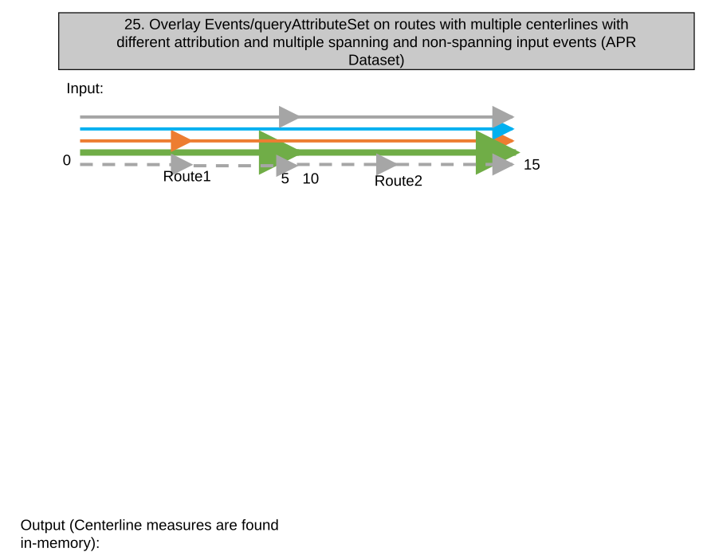

### TC-U27 — Overlay Events / QueryAttributeSet on Routes with One Centerline <!-- src: S1 · slide 30 · case 26 -->

- **Case:** Overlay Events/queryAttributeSet on routes with one centerline (per route) and multiple spanning and non-spanning input events (APR Dataset)

| Network Name | RouteID | From Date | To Date | Type |
| --- | --- | --- | --- | --- |
| Network1 | Route1 | 1/1/2000 | <Null> | Upstream |
| Network1 | Route2 | 1/1/2000 | <Null> | Midstream |

| Input Layer | Event ID | From Date | To Date | From Measure | To Measure | From RouteID | To RouteID | Attribute [Color1] | Attribute [Color2] |
| --- | --- | --- | --- | --- | --- | --- | --- | --- | --- |
| Centerline | N/A | N/A | N/A | N/A | N/A | N/A | N/A | Steel | Active |
| Centerline | N/A | N/A | N/A | N/A | N/A | N/A | N/A | Plastic | Active |
| Red Event | Red1 | 1/1/2000 | <Null> | 0 | 2.5 | Route1 | Route1 | 450 psi | Active |
| Red Event | Red2 | 1/1/2000 | <Null> | 2.5 | 15 | Route1 | Route2 | 500 psi | Proposed |
| Blue Event | Blue1 | 1/1/2000 | <Null> | 0 | 15 | Route1 | Route2 | Low | Active |
| Green Event | Green1 | 1/1/2000 | <Null> | 0 | 5 | Route1 | Route1 | Complete | Active |
| Green Event | Green1 | 1/1/2000 | <Null> | 10 | 15 | Route2 | Route2 | Incomplete | Active |

Output (Centerline measures are found in-memory):

| RouteID | From Date | To Date | From Measure | To Measure | Network1. Type | Centerline. Attribute1 | Centerline. Attribute2 | RedEvent . Red1 | RedEvent . Red2 | BlueEvent . Blue1 | BlueEvent . Blue2 | GreenEvent . Green1 | GreenEvent . Green2 |
| --- | --- | --- | --- | --- | --- | --- | --- | --- | --- | --- | --- | --- | --- |
| Route1 | 1/1/2000 | <Null> | 0 | 2.5 | Upstream | Steel | Active | 450 psi | Active | Low | Active | Complete | Active |
| Route1 | 1/1/2000 | <Null> | 2.5 | 5 | Upstream | Steel | Active | 500 psi | Proposed | Low | Active | Complete | Active |
| Route2 | 1/1/2000 | <Null> | 10 | 15 | Midstream | Plastic | Active | 500 psi | Proposed | Low | Active | Incomplete | Active |

[figure: 0 · 15 · Input: · 5 · Route1 · Route2 · 10]

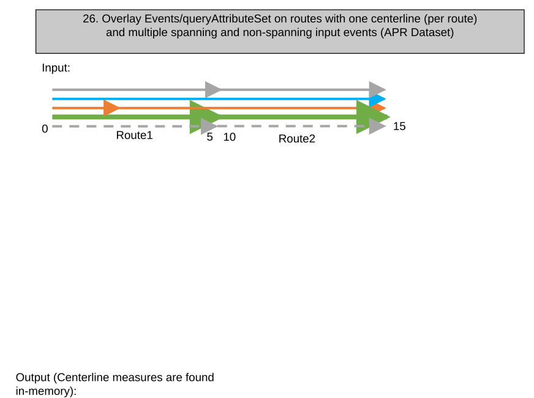

### TC-U28 — Overlay Events / QueryAttributeSet on Routes with Multiple Centerline and Retired (case 27) <!-- src: S1 · slide 31 · case 27 -->

- **Case:** Overlay Events/queryAttributeSet on routes with multiple centerline and retired input events. tVD is after event retirement, but centerline will still be dynamically segmented based on attribution (APR Dataset)

| Network Name | RouteID | From Date | To Date | Type |
| --- | --- | --- | --- | --- |
| Network1 | Route1 | 1/1/2000 | <Null> | Upstream |
| Network1 | Route2 | 1/1/2000 | <Null> | Midstream |

| Input Layer | Event ID | From Date | To Date | From Measure | To Measure | From RouteID | To RouteID | Attribute [Color1] | Attribute [Color2] |
| --- | --- | --- | --- | --- | --- | --- | --- | --- | --- |
| Centerline | N/A | N/A | N/A | N/A | N/A | N/A | N/A | Steel | Active |
| Centerline | N/A | N/A | N/A | N/A | N/A | N/A | N/A | Plastic | Active |
| Centerline | N/A | N/A | N/A | N/A | N/A | N/A | N/A | Steel | Active |
| Centerline | N/A | N/A | N/A | N/A | N/A | N/A | N/A | Plastic | Active |
| Red Event | Red1 | 1/1/2000 | 1/1/2010 | 0 | 2.5 | Route1 | Route1 | 450 psi | Active |
| Red Event | Red2 | 1/1/2000 | 1/1/2010 | 2.5 | 15 | Route1 | Route2 | 500 psi | Proposed |
| Blue Event | Blue1 | 1/1/2000 | 1/1/2010 | 0 | 15 | Route1 | Route2 | Low | Active |
| Green Event | Green1 | 1/1/2000 | 1/1/2010 | 0 | 5 | Route1 | Route1 | Complete | Active |
| Green Event | Green1 | 1/1/2000 | 1/1/2010 | 10 | 15 | Route2 | Route2 | Incomplete | Active |

Output (tVD input of 1/1/2015, Centerline measures are found in-memory):

| RouteID | From Date | To Date | From Measure | To Measure | Network1. Type | Centerline. Attribute1 | Centerline. Attribute2 | RedEvent . Red1 | RedEvent . Red2 | BlueEvent . Blue1 | BlueEvent . Blue2 | GreenEvent . Green1 | GreenEvent . Green2 |
| --- | --- | --- | --- | --- | --- | --- | --- | --- | --- | --- | --- | --- | --- |
| Route1 | 1/1/2000 | <Null> | 0 | 2.5 | Upstream | Steel | Active | <Null> | <Null> | <Null> | <Null> | <Null> | <Null> |
| Route1 | 1/1/2000 | <Null> | 2.5 | 5 | Upstream | Plastic | Active | <Null> | <Null> | <Null> | <Null> | <Null> | <Null> |
| Route2 | 1/1/2000 | <Null> | 10 | 12.5 | Midstream | Steel | Active | <Null> | <Null> | <Null> | <Null> | <Null> | <Null> |
| Route2 | 1/1/2000 | <Null> | 12.5 | 15 | Midstream | Plastic | Active | <Null> | <Null> | <Null> | <Null> | <Null> | <Null> |

[figure: 0 · 15 · Input: · 5 · Route1 · Route2 · 10]

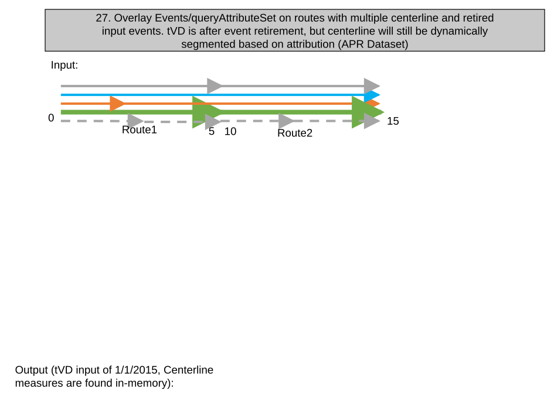

### TC-U29 — Overlay Events / QueryAttributeSet on Routes with Multiple Centerlines (case 28) <!-- src: S1 · slide 32 · case 28 -->

- **Case:** Overlay Events/queryAttributeSet on routes with multiple centerlines with different attribution and multiple spanning and non-spanning input events (APR Dataset)

| Network Name | RouteID | From Date | To Date | Type |
| --- | --- | --- | --- | --- |
| Network1 | Route1 | 1/1/2000 | <Null> | Upstream |
| Network1 | Route2 | 1/1/2000 | <Null> | Midstream |

| Input Layer | Event ID | From Date | To Date | From Measure | To Measure | From RouteID | To RouteID | Attribute [Color1] | Attribute [Color2] |
| --- | --- | --- | --- | --- | --- | --- | --- | --- | --- |
| Centerline | N/A | N/A | N/A | N/A | N/A | N/A | N/A | Steel | Active |
| Centerline | N/A | N/A | N/A | N/A | N/A | N/A | N/A | Plastic | Active |
| Centerline | N/A | N/A | N/A | N/A | N/A | N/A | N/A | Steel | Active |
| Centerline | N/A | N/A | N/A | N/A | N/A | N/A | N/A | Plastic | Active |
| Red Event | Red1 | 1/1/2000 | 1/1/2010 | 0 | 2.5 | Route1 | Route1 | 450 psi | Active |
| Red Event | Red2 | 1/1/2000 | 1/1/2010 | 2.5 | 15 | Route1 | Route2 | 500 psi | Proposed |
| Blue Event | Blue1 | 1/1/2000 | <Null> | 0 | 15 | Route1 | Route2 | Low | Active |
| Green Event | Green1 | 1/1/2000 | <Null> | 0 | 5 | Route1 | Route1 | Complete | Active |
| Green Event | Green1 | 1/1/2000 | <Null> | 10 | 15 | Route2 | Route2 | Incomplete | Active |

Output (tVD is 1/1/2008, Centerline measures are found in-memory):

| RouteID | From Date | To Date | From Measure | To Measure | Network1. Type | Centerline. Attribute1 | Centerline. Attribute2 | RedEvent . Red1 | RedEvent . Red2 | BlueEvent . Blue1 | BlueEvent . Blue2 | GreenEvent . Green1 | GreenEvent . Green2 |
| --- | --- | --- | --- | --- | --- | --- | --- | --- | --- | --- | --- | --- | --- |
| Route1 | 1/1/2000 | <Null> | 0 | 2.5 | Upstream | Steel | Active | 450 psi | Active | Low | Active | Complete | Active |
| Route1 | 1/1/2000 | <Null> | 2.5 | 5 | Upstream | Plastic | Active | 500 psi | Proposed | Low | Active | Complete | Active |
| Route2 | 1/1/2000 | <Null> | 10 | 12.5 | Midstream | Steel | Active | 500 psi | Proposed | Low | Active | Incomplete | Active |
| Route2 | 1/1/2000 | <Null> | 12.5 | 15 | Midstream | Plastic | Active | 500 psi | Proposed | Low | Active | Incomplete | Active |

[figure: 0 · 15 · Input: · 5 · Route1 · Route2 · 10]

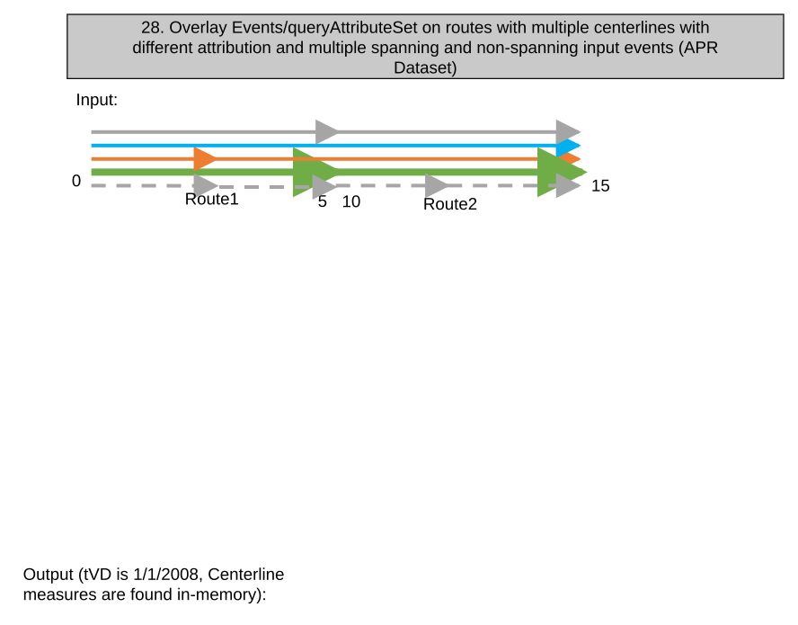

### TC-U30 — Overlay Events / QueryAttributeSet on Routes with Multiple Centerlines and Events (case 29) <!-- src: S1 · slide 33 · case 29 -->

- **Case:** Overlay Events/queryAttributeSet on routes with multiple centerlines and events that do not fully cover routes (APR Dataset)

| Network Name | RouteID | From Date | To Date | Type |
| --- | --- | --- | --- | --- |
| Network1 | Route1 | 1/1/2000 | <Null> | Upstream |
| Network1 | Route2 | 1/1/2000 | <Null> | Midstream |

| Input Layer | Event ID | From Date | To Date | From Measure | To Measure | From RouteID | To RouteID | Attribute [Color1] | Attribute [Color2] |
| --- | --- | --- | --- | --- | --- | --- | --- | --- | --- |
| Centerline | N/A | N/A | N/A | N/A | N/A | N/A | N/A | Steel | Active |
| Centerline | N/A | N/A | N/A | N/A | N/A | N/A | N/A | Plastic | Active |
| Centerline | N/A | N/A | N/A | N/A | N/A | N/A | N/A | Steel | Active |
| Centerline | N/A | N/A | N/A | N/A | N/A | N/A | N/A | Plastic | Active |
| Red Event | Red1 | 1/1/2000 | <Null> | 2.5 | 12.5 | Route1 | Route2 | 450 psi | Active |
| Blue Event | Blue1 | 1/1/2000 | <Null> | 2.5 | 5 | Route1 | Route1 | Low | Active |
| Green Event | Green1 | 1/1/2000 | <Null> | 2.5 | 12.5 | Route1 | Route2 | Complete | Active |

Output (Centerline measures are found in-memory):

| RouteID | From Date | To Date | From Measure | To Measure | Network1. Type | Centerline. Attribute1 | Centerline. Attribute2 | RedEvent . Red1 | RedEvent . Red2 | BlueEvent . Blue1 | BlueEvent . Blue2 | GreenEvent . Green1 | GreenEvent . Green2 |
| --- | --- | --- | --- | --- | --- | --- | --- | --- | --- | --- | --- | --- | --- |
| Route1 | 1/1/2000 | <Null> | 0 | 2.5 | Upstream | Steel | Active | <Null> | <Null> | <Null> | <Null> | <Null> | <Null> |
| Route1 | 1/1/2000 | <Null> | 2.5 | 5 | Upstream | Plastic | Active | 450 psi | Active | Low | Active | Complete | Active |
| Route2 | 1/1/2000 | <Null> | 10 | 12.5 | Midstream | Steel | Active | 450 psi | Active | <Null> | <Null> | Complete | Active |
| Route2 | 1/1/2000 | <Null> | 12.5 | 15 | Midstream | Plastic | Active | <Null> | <Null> | <Null> | <Null> | <Null> | <Null> |

[figure: 0 · 15 · Input: · 5 · Route1 · Route2 · 10]

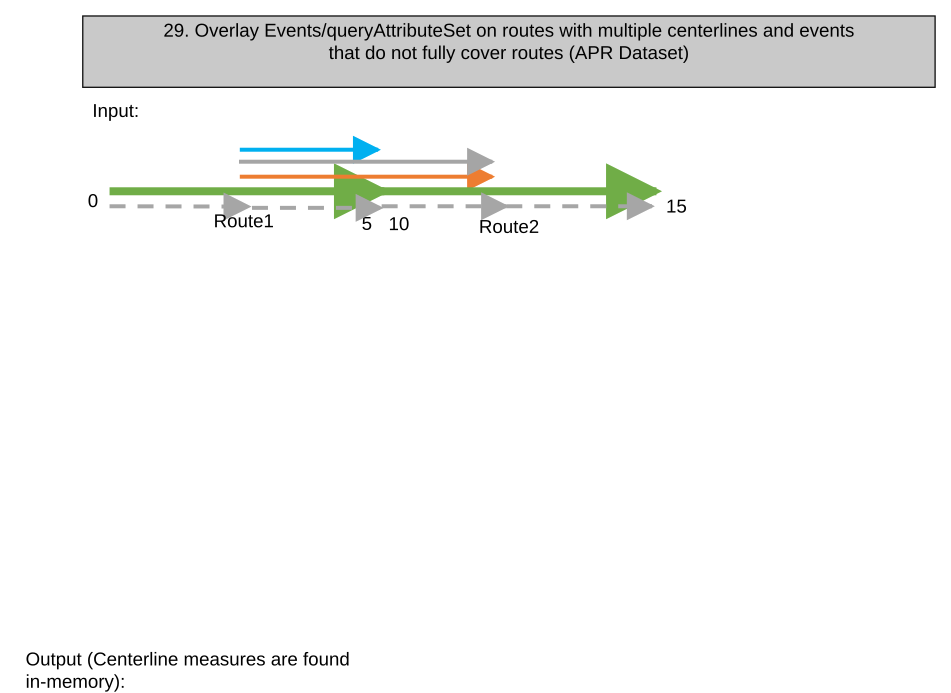

### TC-U31 — Overlay Events / QueryAttributeSet on Gapped Routes with Multiple Centerlines (case 30) <!-- src: S1 · slide 34 · case 30 -->

- **Case:** Overlay Events/queryAttributeSet on gapped routes with multiple centerlines and events (APR Dataset)

| Network Name | RouteID | From Date | To Date | Type |
| --- | --- | --- | --- | --- |
| Network1 | Route1 | 1/1/2000 | <Null> | Upstream |
| Network1 | Route2 | 1/1/2000 | <Null> | Midstream |

| Input Layer | Event ID | From Date | To Date | From Measure | To Measure | From RouteID | To RouteID | Attribute [Color1] | Attribute [Color2] |
| --- | --- | --- | --- | --- | --- | --- | --- | --- | --- |
| Centerline | N/A | N/A | N/A | N/A | N/A | N/A | N/A | Steel | Active |
| Centerline | N/A | N/A | N/A | N/A | N/A | N/A | N/A | Plastic | Active |
| Centerline | N/A | N/A | N/A | N/A | N/A | N/A | N/A | Steel | Active |
| Centerline | N/A | N/A | N/A | N/A | N/A | N/A | N/A | Plastic | Active |
| Red Event | Red1 | 1/1/2000 | <Null> | 4 | 15 | Route1 | Route2 | 450 psi | Active |
| Blue Event | Blue1 | 1/1/2000 | <Null> | 0 | 1 | Route1 | Route1 | Low | Active |
| Green Event | Green1 | 1/1/2000 | <Null> | 0 | 1 | Route1 | Route1 | Complete | Active |
| Green Event | Green2 | 1/1/2000 | <Null> | 4 | 12.5 | Route1 | Route2 | Incomplete | Active |

Output (Centerline measures are found in-memory):

| RouteID | From Date | To Date | From Measure | To Measure | Network1. Type | Centerline. Attribute1 | Centerline. Attribute2 | RedEvent . Red1 | RedEvent . Red2 | BlueEvent . Blue1 | BlueEvent . Blue2 | GreenEvent . Green1 | GreenEvent . Green2 |
| --- | --- | --- | --- | --- | --- | --- | --- | --- | --- | --- | --- | --- | --- |
| Route1 | 1/1/2000 | <Null> | 0 | 1 | Upstream | Steel | Active | <Null> | <Null> | Low | Active | Complete | Active |
| Route1 | 1/1/2000 | <Null> | 4 | 5 | Upstream | Plastic | Active | 450 psi | Active | <Null> | <Null> | Incomplete | Active |
| Route2 | 1/1/2000 | <Null> | 10 | 12.5 | Midstream | Steel | Active | 450 psi | Active | <Null> | <Null> | Incomplete | Active |
| Route2 | 1/1/2000 | <Null> | 12.5 | 15 | Midstream | Plastic | Active | <Null> | <Null> | <Null> | <Null> | <Null> | <Null> |

[figure: 0 · 15 · Input: · 5 · Route1 · Route2 · 10 · 1 · 4]

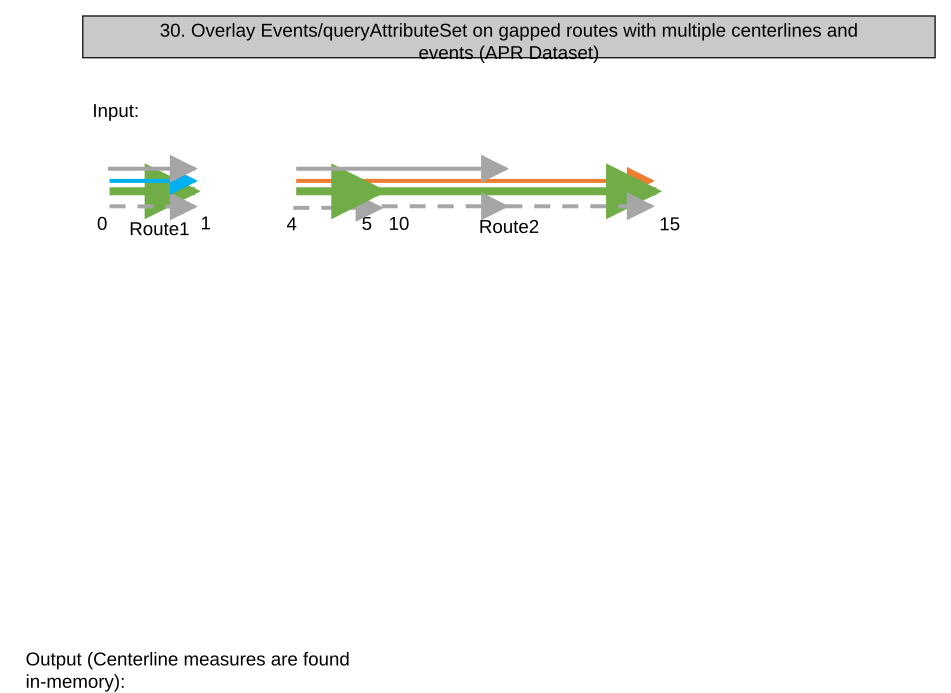

### TC-U32 — Overlay Events / QueryAttributeSet on Routes with Multiple Centerlines (case 31) <!-- src: S1 · slide 35 · case 31 -->

- **Case:** Overlay Events/queryAttributeSet on routes with multiple centerlines and multiple time slices of events (APR Dataset)

| Network Name | Route ID | From Date | To Date | Type |
| --- | --- | --- | --- | --- |
| Network1 | Route1 | 1/1/2000 | <Null> | Upstream |
| Network1 | Route2 | 1/1/2000 | <Null> | Midstream |

| Route ID | From Date | To Date | From Measure | To Measure | Network1. Type | Centerline. Attribute1 | Centerline. Attribute2 | RedEvent . Red1 | RedEvent . Red2 | BlueEvent . Blue1 | BlueEvent . Blue2 |
| --- | --- | --- | --- | --- | --- | --- | --- | --- | --- | --- | --- |
| Route1 | 1/1/2000 | 1/1/2005 | 0 | 2.5 | Upstream | Steel | Active | 450 psi | Retired | Low | Retired |
| Route1 | 1/1/2000 | 1/1/2005 | 2.5 | 5 | Upstream | Plastic | Active | 450 psi | Retired | Low | Retired |
| Route2 | 1/1/2000 | 1/1/2005 | 10 | 12.5 | Upstream | Steel | Active | 450 psi | Retired | Low | Retired |
| Route2 | 1/1/2000 | 1/1/2005 | 12.5 | 13 | Upstream | Steel | Active | 450 psi | Retired | Low | Retired |
| Route2 | 1/1/2000 | 1/1/2005 | 13 | 15 | Upstream | Plastic | Active | 450 psi | Retired | <Null> | <Null> |
| Route1 | 1/1/2005 | 1/1/2005 | 0 | 2.5 | Upstream | Steel | Active | 450 psi | Retired | Medium | Active |
| Route1 | 1/1/2005 | 1/1/2005 | 2.5 | 5 | Upstream | Plastic | Active | 450 psi | Retired | Medium | Active |
| Route2 | 1/1/2005 | 1/1/2005 | 10 | 12.5 | Upstream | Steel | Active | 500 psi | Retired | Medium | Active |
| Route2 | 1/1/2005 | 1/1/2005 | 12.5 | 15 | Upstream | Plastic | Active | 500 psi | Retired | Medium | Active |
| Route1 | 1/1/2010 | <Null> | 0 | 2.5 | Upstream | Steel | Active | 450 psi | Active | Medium | Active |
| Route1 | 1/1/2010 | <Null> | 2.5 | 5 | Upstream | Plastic | Active | 450 psi | Active | Medium | Active |
| Route2 | 1/1/2010 | <Null> | 10 | 12.5 | Upstream | Steel | Active | 450 psi | Active | Medium | Active |
| Route2 | 1/1/2010 | <Null> | 12.5 | 15 | Upstream | Plastic | Active | 450 psi | Active | Medium | Active |

Output (Centerline measures are found in-memory):

| Input Layer | Event ID | From Date | To Date | From Measure | To Measure | From RouteID | To RouteID | Attribute [Color1] | Attribute [Color2] |
| --- | --- | --- | --- | --- | --- | --- | --- | --- | --- |
| Centerline | N/A | N/A | N/A | N/A | N/A | N/A | N/A | Steel | Active |
| Centerline | N/A | N/A | N/A | N/A | N/A | N/A | N/A | Plastic | Active |
| Centerline | N/A | N/A | N/A | N/A | N/A | N/A | N/A | Steel | Active |
| Centerline | N/A | N/A | N/A | N/A | N/A | N/A | N/A | Plastic | Active |
| Red Event | Red1 | 1/1/2000 | 1/1/2005 | 0 | 15 | Route1 | Route2 | 450 psi | Retired |
| Red Event | Red1 | 1/1/2005 | 1/1/2010 | 0 | 5 | Route1 | Route1 | 450 psi | Retired |
| Red Event | Red2 | 1/1/2005 | 1/1/2010 | 10 | 15 | Route2 | Route2 | 500 psi | Retired |
| Red Event | Red1 | 1/1/2010 | <Null> | 0 | 15 | Route1 | Route2 | 450 psi | Active |
| Blue Event | Blue1 | 1/1/2000 | 1/1/2005 | 0 | 13 | Route1 | Route2 | Low | Retired |
| Blue Event | Blue2 | 1/1/2005 | <Null> | 0 | 15 | Route1 | Route2 | Medium | Active |

[figure: Input: · 0 · 15 · Route1 · Route2 · 5 · 10]

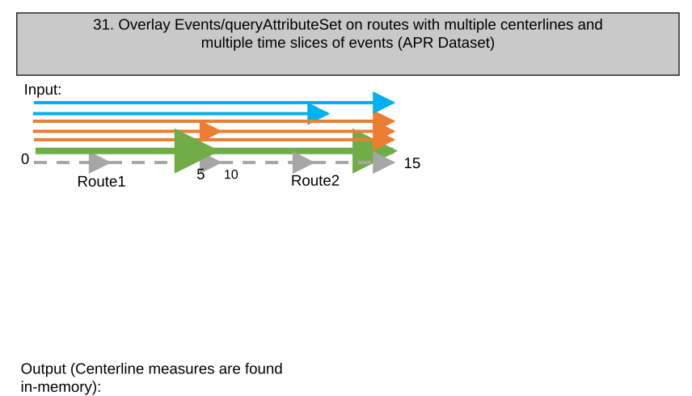

### TC-U33 — Overlay Events / QueryAttributeSet on Routes with Multiple Centerlines (case 32) <!-- src: S1 · slide 36 · case 32 -->

- **Case:** Overlay Events/queryAttributeSet on routes with multiple centerlines, some flipped, and multiple events (APR Dataset)

| Network Name | RouteID | From Date | To Date | Type |
| --- | --- | --- | --- | --- |
| Network1 | Route1 | 1/1/2000 | <Null> | Upstream |
| Network1 | Route2 | 1/1/2000 | <Null> | Midstream |

| Input Layer | Event ID | From Date | To Date | From Measure | To Measure | From RouteID | To RouteID | Attribute [Color1] | Attribute [Color2] |
| --- | --- | --- | --- | --- | --- | --- | --- | --- | --- |
| Centerline | N/A | N/A | N/A | N/A | N/A | N/A | N/A | Steel | Active |
| Centerline | N/A | N/A | N/A | N/A | N/A | N/A | N/A | Plastic | Active |
| Centerline | N/A | N/A | N/A | N/A | N/A | N/A | N/A | Steel | Active |
| Centerline | N/A | N/A | N/A | N/A | N/A | N/A | N/A | Plastic | Active |
| Red Event | Red1 | 1/1/2000 | <Null> | 0 | 2.5 | Route1 | Route1 | 450 psi | Active |
| Red Event | Red2 | 1/1/2000 | <Null> | 2.5 | 15 | Route1 | Route2 | 500 psi | Proposed |
| Blue Event | Blue1 | 1/1/2000 | <Null> | 0 | 15 | Route1 | Route2 | Low | Active |
| Green Event | Green1 | 1/1/2000 | <Null> | 0 | 5 | Route1 | Route1 | Complete | Active |
| Green Event | Green1 | 1/1/2000 | <Null> | 10 | 15 | Route2 | Route2 | Incomplete | Active |

Output (Centerline measures are found in-memory):

| RouteID | From Date | To Date | From Measure | To Measure | Network1. Type | Centerline. Attribute1 | Centerline. Attribute2 | RedEvent . Red1 | RedEvent . Red2 | BlueEvent . Blue1 | BlueEvent . Blue2 | GreenEvent . Green1 | GreenEvent . Green2 |
| --- | --- | --- | --- | --- | --- | --- | --- | --- | --- | --- | --- | --- | --- |
| Route1 | 1/1/2000 | <Null> | 0 | 2.5 | Upstream | Steel | Active | 450 psi | Active | Low | Active | Complete | Active |
| Route1 | 1/1/2000 | <Null> | 2.5 | 5 | Upstream | Plastic | Active | 500 psi | Proposed | Low | Active | Complete | Active |
| Route2 | 1/1/2000 | <Null> | 10 | 12.5 | Midstream | Steel | Active | 500 psi | Proposed | Low | Active | Incomplete | Active |
| Route2 | 1/1/2000 | <Null> | 12.5 | 15 | Midstream | Plastic | Active | 500 psi | Proposed | Low | Active | Incomplete | Active |

[figure: 0 · 15 · Input: · 5 · Route1 · Route2 · 10]

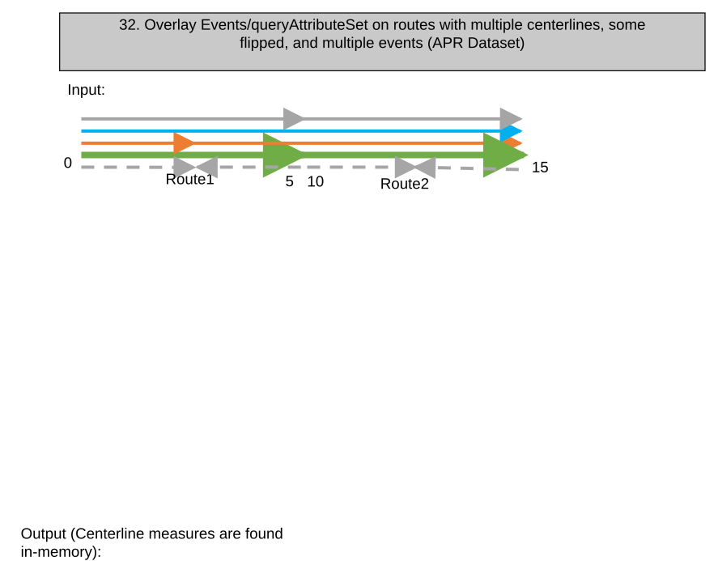

## Other content

### Slide 1 — Devtopia Issue <!-- slide 1 -->

Support Centerline as input in queryAttributeSet and Overlay Events

**Notes**
- Allow for the centerline feature class to be accepted as in input in the queryAttributeSet REST endpoint and in the Overlay Events GP Tool. Centerline will be treated as an input “event” along with other input events
- Test with FGDB, EGDB DC, and FS
- Test on nonline and line network
- Sanity test with UNAPR dataset, but test more on non-UNAPR datasets where centerline does not have measure fields
- When a temporal view date is passed in the request (only for queryAttributeSet), assume all centerlines exist during that time, but remove any time slices of centerline that would get a ROUTE NOT FOUND LocError (route is retired, reassigned, etc. before the input tVD)
- When centerline doesn’t have measure fields, get route and measure info onto the centerline in memory

**Positive Tests: RH Dataset (Centerline has no route/measure info fields, route and measure found in-memory)**
- Overlay Events/queryAttributeSet on simple routes with no input tVD and multiple input events
- Overlay Events/queryAttributeSet on simple routes with input tVD after input routes no longer exist and multiple input events
- Overlay Events/queryAttributeSet on complex routes with no input tVD and multiple input events
- Overlay Events/queryAttributeSet on complex routes and multiple input events with input tVD after input routes no longer exist
- Overlay Events/queryAttributeSet on vertical routes with no input tVD and multiple input events
- Overlay Events/queryAttributeSet on vertical routes and multiple input events with input tVD after input routes no longer exist
- Overlay Events/queryAttributeSet on routes with multiple centerlines with different attribution and multiple input events with no input tVD. Centerline will be dynamically segmented based on attribution
- Overlay Events/queryAttributeSet on routes with one centerline and multiple input events. Centerline will be dynamically segmented based on attribution
- Overlay Events/queryAttributeSet on routes with multiple centerline and retired input events. tVD is after event retirement, but centerline will still be dynamically segmented based on attribution

### Slide 20 <!-- slide 20 -->

17A. Overlay Events/queryAttributeSet on routes with multiple centerlines and multiple time slices of events, but events are associated with a different network

| Network Name | Route ID | From Date | To Date | Type |
| --- | --- | --- | --- | --- |
| Network1 | Route1 | 1/1/2000 | <Null> | Interstate |

| Input Layer | Event ID | From Date | To Date | From Measure | To Measure | Attribute [Color1] | Attribute [Color2] |
| --- | --- | --- | --- | --- | --- | --- | --- |
| Centerline | N/A | N/A | N/A | N/A | N/A | Asphalt | Active |
| Centerline | N/A | N/A | N/A | N/A | N/A | Chipseal | Active |
| Centerline | N/A | N/A | N/A | N/A | N/A | Asphalt | Active |
| Centerline | N/A | N/A | N/A | N/A | N/A | Chipseal | Active |
| Red Event | Red1 | 1/1/2000 | 1/1/2005 | 0 km | 16.1 km | Adams | Retired |
| Red Event | Red1 | 1/1/2005 | 1/1/2010 | 0 km | 8.05 km | Adams | Retired |
| Red Event | Red2 | 1/1/2005 | 1/1/2010 | 8.05 km | 16.1 km | Laporte | Retired |
| Red Event | Red1 | 1/1/2010 | <Null> | 0 km | 16.1 km | Adams | Active |
| Blue Event | Blue1 | 1/1/2000 | 1/1/2005 | 0 km | 12.87 km | Full Access | Retired |
| Blue Event | Blue2 | 1/1/2005 | <Null> | 0 km | 16.1 km | No Access | Active |

| Route ID | From Date | To Date | From Measure | To Measure | Network1. Type | Centerline. Attribute1 | Centerline. Attribute2 | RedEvent . Red1 | RedEvent . Red2 | BlueEvent . Blue1 | BlueEvent . Blue2 |
| --- | --- | --- | --- | --- | --- | --- | --- | --- | --- | --- | --- |
| Route1 | 1/1/2000 | 1/1/2005 | 0 mi | 2.5 mi | Interstate | Asphalt | Active | Adams | Retired | Full Access | Retired |
| Route1 | 1/1/2000 | 1/1/2005 | 2.5 mi | 5 mi | Interstate | Chipseal | Active | Adams | Retired | Full Access | Retired |
| Route1 | 1/1/2000 | 1/1/2005 | 5 mi | 7.5 mi | Interstate | Asphalt | Active | Adams | Retired | Full Access | Retired |
| Route1 | 1/1/2000 | 1/1/2005 | 7.5 mi | 8 mi | Interstate | Asphalt | Active | Adams | Retired | Full Access | Retired |
| Route1 | 1/1/2000 | 1/1/2005 | 8 mi | 10 mi | Interstate | Chipseal | Active | Adams | Retired | <Null> | <Null> |
| Route1 | 1/1/2005 | 1/1/2010 | 0 mi | 2.5 mi | Interstate | Asphalt | Active | Adams | Retired | Partial Access | Active |
| Route1 | 1/1/2005 | 1/1/2010 | 2.5 mi | 5 mi | Interstate | Chipseal | Active | Adams | Retired | Partial Access | Active |
| Route1 | 1/1/2005 | 1/1/2010 | 5 mi | 7.5 mi | Interstate | Asphalt | Active | Laporte | Retired | Partial Access | Active |
| Route1 | 1/1/2005 | 1/1/2010 | 7.5 mi | 10 mi | Interstate | Chipseal | Active | Laporte | Retired | Partial Access | Active |
| Route1 | 1/1/2010 | <Null> | 0 mi | 2.5 mi | Interstate | Asphalt | Active | Adams | Active | Partial Access | Active |
| Route1 | 1/1/2010 | <Null> | 2.5 mi | 5 mi | Interstate | Chipseal | Active | Adams | Active | Partial Access | Active |
| Route1 | 1/1/2010 | <Null> | 5 mi | 7.5 mi | Interstate | Asphalt | Active | Adams | Active | Partial Access | Active |
| Route1 | 1/1/2010 | <Null> | 7.5 mi | 10 mi | Interstate | Chipseal | Active | Adams | Active | Partial Access | Active |

Output (Centerline measures are found in-memory):

[figure: Input: · 0 mi · 10 mi · Route1 · 0 km · 16.1 km]

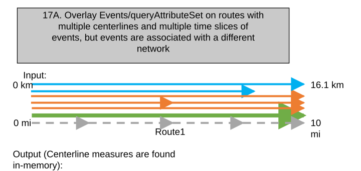

### Slide 21 <!-- slide 21 -->

17B. Overlay Events/queryAttributeSet on simple routes with no input tVD and multiple input events, but input events are associated with a different network (RH Dataset)

| Network Name | RouteID | From Date | To Date | Type |
| --- | --- | --- | --- | --- |
| Network1 | Route1 | 1/1/2000 | <Null> | Interstate |

| Input Layer | Event ID | From Date | To Date | From Measure | To Measure | Attribute [Color1] | Attribute [Color2] |
| --- | --- | --- | --- | --- | --- | --- | --- |
| Centerline | N/A | N/A | N/A | N/A | N/A | Asphalt | Active |
| Centerline | N/A | N/A | N/A | N/A | N/A | Chipseal | Active |
| Red Event | Red1 | 1/1/2000 | <Null> | 0 km | 8.05 km | Adams | Active |
| Red Event | Red2 | 1/1/2000 | <Null> | 8.05 km | 16.1 km | Laporte | Proposed |
| Blue Event | Blue1 | 1/1/2000 | <Null> | 0 km | 16.1 km | Full Access | Active |
| Green Event | Green1 | 1/1/2000 | <Null> | 0 km | 16.1 km | 45 MPH | Active |

| RouteID | From Date | To Date | From Measure | To Measure | Network1. Type | Centerline. Attribute1 | Centerline. Attribute2 | RedEvent . Red1 | RedEvent . Red2 | BlueEvent . Blue1 | BlueEvent . Blue2 | GreenEvent . Green1 | GreenEvent . Green2 |
| --- | --- | --- | --- | --- | --- | --- | --- | --- | --- | --- | --- | --- | --- |
| Route1 | 1/1/2000 | <Null> | 0 mi | 5 mi | Interstate | Asphalt | Active | Adams | Active | Full Access | Active | 45 MPH | Active |
| Route1 | 1/1/2000 | <Null> | 5 mi | 7.5 mi | Interstate | Asphalt | Active | Laporte | Proposed | Full Access | Active | 45 MPH | Active |
| Route1 | 1/1/2000 | <Null> | 7.5 mi | 10 mi | Interstate | Chipseal | Active | Laporte | Proposed | Full Access | Active | 45 MPH | Active |

Output (Centerline measures are found in-memory):

[figure: Input: · 0 mi · 10 mi · 5 mi · Route1 · 0 km · 16.1 km · 8.05 km]

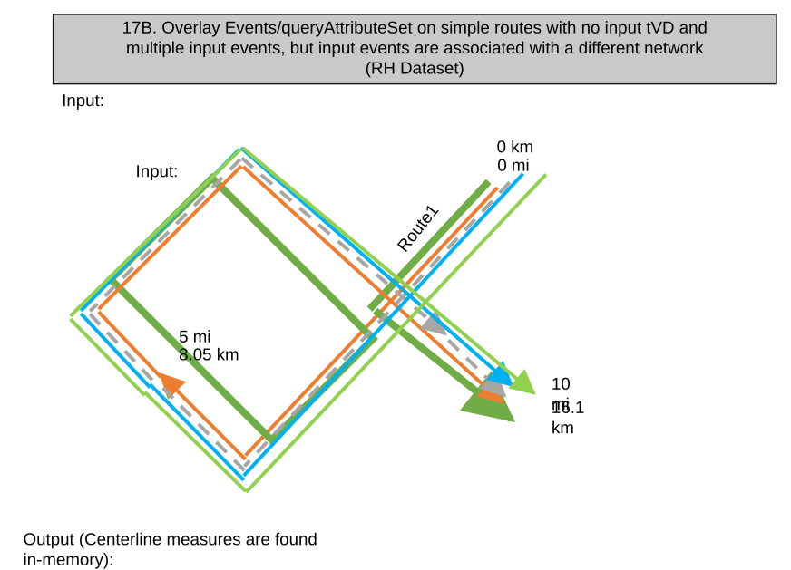
