# Overlay Events and queryAttributeSet Point Event Support Test Cases

| Field | Value |
| --- | --- |
| **Doc** | 364 · Test Plan · Pro |
| **Product** | Roads & Highways · Pipeline Referencing · Utility Network |
| **Release** | — |
| **Issues** | [ArcGISPro/ps-location-referencing#5301](https://devtopia.esri.com/ArcGISPro/ps-location-referencing/issues/5301) |
| **Source** | [5301-OverlayEventsqueryAttributeSetPointSupport_V3.pptx](<https://esriis.sharepoint.com/sites/LocationReferencing/Shared%20Documents/General/Test%20Plans/5301-OverlayEventsqueryAttributeSetPointSupport_V3.pptx>) · rev V3 |
| **People** | author Mac Christmas · PE — · dev — |
| **Edited** | 2024-05-23 21:33 by Mac Christmas |
| **Extracted** | 2026-09-04 · lane xmlstrip · format 3.0 · prompt v2.0.2 |
| **Keywords** | point event · overlay events · query attribute set · route · line event · measure translation · gapped route · time slices · event overlap |
| **Tools** | Overlay Events · queryAttributeSet |

## Summary

This document provides detailed test cases for the Overlay Events and queryAttributeSet functionality supporting point events as input. It covers various scenarios including simple, complex, vertical, gapped routes, multiple time slices, overlapping events, and events across different LRS networks with measure translation. The tests validate correct output generation for line and point events in different datasets and network configurations.

## Related documents

<!-- related:begin -->
- [Overlay Events and queryAttributeSet Support for UN Pipeline Devices and Junctions](<https://esriis.sharepoint.com/sites/lrsworkspace/LRS Doc Index/Test Plans/overlay-events-and-queryattributeset-support-for-un-pipeline.md>) — similar text 0.56 · 4 title words · 4 filename words · same kind/surface/folder <!-- rel:79 s=7.479 -->
- [Support Centerline as Input in queryAttributeSet and Overlay Events Test Plan](<https://esriis.sharepoint.com/sites/lrsworkspace/LRS Doc Index/Test Plans/5196-support-centerline-as-input-in-queryattributeset-and-overlay.md>) — similar text 0.65 · 4 title words · 3 filename words · same kind/surface/folder <!-- rel:461 s=6.931 -->
- [Overlay Events/queryAttributeSet: Update Address Range info via Address Points](<https://esriis.sharepoint.com/sites/lrsworkspace/LRS Doc Index/Test Plans/6178-overlay-events-queryattributeset-update-address-range-info.md>) — similar text 0.08 · 3 title words · 1 filename word · same kind/surface/folder <!-- rel:257 s=4.303 -->
- [Point Events Dynamic Segmentation Test Plan](<https://esriis.sharepoint.com/sites/lrsworkspace/LRS Doc Index/Test Plans/point-events-dynseg.md>) — similar text 0.12 · 2 title words · 1 filename word · same kind/surface/folder <!-- rel:365 s=4.004 -->
- [Add Line Events by offsetting from other points – Test Plan](<https://esriis.sharepoint.com/sites/lrsworkspace/LRS Doc Index/Test Plans/3913-add-line-events-by-offsetting-from-other-points.md>) — similar text 0.10 · 1 title word · 1 filename word · same kind/surface/folder <!-- rel:231 s=3.379 -->
<!-- related:end -->

<!-- docs:begin -->
## Esri documentation

_No page matched:_ [Overlay Events](https://www.google.com/search?q=%22Overlay%20Events%22+site%3Adoc.esri.com) · [queryAttributeSet](https://www.google.com/search?q=%22queryAttributeSet%22+site%3Adoc.esri.com)
<!-- docs:end -->

---

## Overview

### Slide 1 — Devtopia Issue <!-- slide 1 -->

Overlay Events/queryAttributeSet Point Event Support

**Notes**
- Allow point events as input in Overlay Events and queryAttributeSet
- Where a point event exists, a new record will be created with the same From/To Measure and From/To RouteID.
- Test with Non-line and Line networks, including one test on an Addressing dataset (with addressing info on the LRS Centerline layer)
- Test at least one case where events are associated with a different LRS Network and translation occurs
- Test with normal, complex, vertical, and gapped routes
- For Overlay Events, test in FGDB, EGDB, and FS
- For queryAttributeSet, test in FS only
- Sanity test existing functionality by running without point event input
- Test Overlay Events in ModelBuilder and Python with point input
- A line event layer input is required for point event layer input

| Positive Tests: Overlay Events UI |
| --- |
| Point events can be input in Event Layers parameter |

| Negative Tests: Overlay Events |
| --- |
| Only one point event is input into the Event Layers, with no input line event layers |

| Negative Tests: queryAttributeSet |
| --- |
| Only one point event is input into the attributeSet, with no input line event layers |

## Test Cases

### TC-U01 — Overlay Events / QueryAttributeSet on Simple Routes with No Input TVD and Multiple (case 1) <!-- src: S1 · slide 2 · case 1 -->

- **Case:** Overlay Events/queryAttributeSet on simple routes with no input tVD and multiple input point and line events, including the PipelineLine layer (UNAPR Dataset)

Route1
Route2

| Network Name | RouteID | From Date | To Date | PipeType |
| --- | --- | --- | --- | --- |
| Network1 | Route1 | 1/1/2000 | <Null> | Upstream |
| Network1 | Route2 | 1/1/2000 | <Null> | Midstream |

| Input Layer | Event ID | From Date | To Date | From Measure | To Measure | From RouteID | To RouteID | Attribute [Color1] | Attribute [Color2] |
| --- | --- | --- | --- | --- | --- | --- | --- | --- | --- |
| Pipeline Line | N/A | N/A | N/A | 0 | 5 | N/A | N/A | Steel | Active |
| Pipeline Line | N/A | N/A | N/A | 10 | 12.5 | N/A | N/A | Plastic | Active |
| Pipeline Line | N/A | N/A | N/A | 12.5 | 15 | N/A | N/A | Steel | Active |
| Red Event | Red1 | 1/1/2000 | <Null> | 0 | 2.5 | Route1 | Route1 | 450 psi | Active |
| Red Event | Red2 | 1/1/2000 | <Null> | 2.5 | 15 | Route1 | Route2 | 500 psi | Proposed |
| Purple Event | Purple1 | 1/1/2000 | <Null> | 2 | N/A | Route1 | N/A | Dent | Active |
| Yellow Event | Yellow1 | 1/1/2000 | <Null> | 14 | N/A | Route2 | N/A | 1500 | Active |

Output:

| Type | RouteID | From Date | To Date | From Measure | To Measure | Network1. PipeType | PipelineLine. Attribute1 | PipelineLine. Attribute2 | RedEvent . Red1 | RedEvent . Red2 | PurpleEvent . Purple1 | PurpleEvent . Purple2 | YellowEvent . Yellow1 | YellowEvent . Yellow2 |
| --- | --- | --- | --- | --- | --- | --- | --- | --- | --- | --- | --- | --- | --- | --- |
| Line | Route1 | 1/1/2000 | <Null> | 0 | 2 | Upstream | Steel | Active | 450 psi | Active | <Null> | <Null> | <Null> | <Null> |
| Point | Route1 | 1/1/2000 | <Null> | 2 | 2 | Upstream | Steel | Active | 450psi | Active | Dent | Active | <Null> | <Null> |
| Line | Route1 | 1/1/2000 | <Null> | 2 | 2.5 | Upstream | Steel | Active | 450psi | Active | <Null> | <Null> | <Null> | <Null> |
| Line | Route1 | 1/1/2000 | <Null> | 2.5 | 5 | Upstream | Steel | Active | 500 psi | Proposed | <Null> | <Null> | <Null> | <Null> |
| Line | Route2 | 1/1/2000 | <Null> | 10 | 12.5 | Midstream | Plastic | Active | 500 psi | Proposed | <Null> | <Null> | <Null> | <Null> |
| Line | Route2 | 1/1/2000 | <Null> | 12.5 | 14 | Midstream | Steel | Active | 500 psi | Proposed | <Null> | <Null> | <Null> | <Null> |
| Point | Route2 | 1/1/2000 | <Null> | 14 | 14 | Midstream | Steel | Active | 500 psi | Proposed | <Null> | <Null> | 1500 | Active |
| Line | Route2 | 1/1/2000 | <Null> | 14 | 15 | Midstream | Steel | Active | 500 psi | Proposed | <Null> | <Null> | <Null> | <Null> |

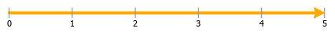

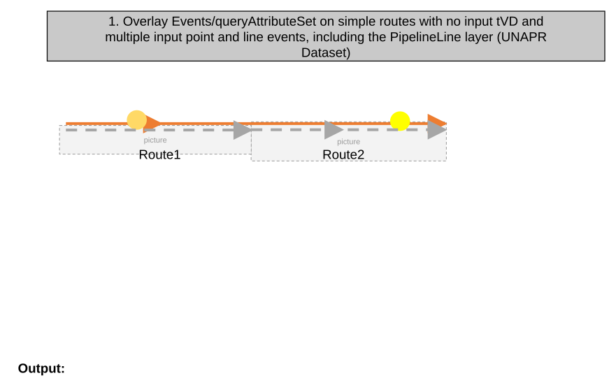

### TC-U02 — Overlay Events / QueryAttributeSet on Complex Routes with No Input TVD (case 2) <!-- src: S1 · slide 3 · case 2 -->

- **Case:** Overlay Events/queryAttributeSet on complex routes with no input tVD and multiple input line and point events (UNAPR Dataset)

| Network Name | RouteID | From Date | To Date | Type |
| --- | --- | --- | --- | --- |
| Network1 | Route1 | 1/1/2000 | <Null> | Upstream |
| Network1 | Route2 | 1/1/2000 | <Null> | Midstream |

| Input Layer | Event ID | From Date | To Date | From Measure | To Measure | From RouteID | To RouteID | Attribute [Color1] | Attribute [Color2] |
| --- | --- | --- | --- | --- | --- | --- | --- | --- | --- |
| Red Event | Red1 | 1/1/2000 | <Null> | 0 | 5 | Route1 | Route1 | 450 psi | Active |
| Red Event | Red2 | 1/1/2000 | <Null> | 5 | 20 | Route1 | Route2 | 500 psi | Proposed |
| Purple Event | Purple1 | 1/1/2000 | <Null> | 6 | N/A | Route1 | N/A | Dent | Active |
| Purple Event | Purple2 | 1/1/2000 | <Null> | 1.5 | N/A | Route1 | N/A | Dent | Active |
| Yellow Event | Yellow1 | 1/1/2000 | <Null> | 10 | N/A | Route1 | N/A | 1400 | Active |
| Yellow Event | Yellow2 | 1/1/2000 | <Null> | 17.5 | N/A | Route2 | N/A | 1500 | Active |

Output:

| Type | RouteID | From Date | To Date | From Measure | To Measure | Network1. Type | RedEvent . Red1 | RedEvent . Red2 | PurpleEvent . Purple1 | PurpleEvent . Purple2 | YellowEvent . Yellow1 | YellowEvent . Yellow2 |
| --- | --- | --- | --- | --- | --- | --- | --- | --- | --- | --- | --- | --- |
| Line | Route1 | 1/1/2000 | <Null> | 0 | 1.5 | Upstream | 450 psi | Active | <Null> | <Null> | <Null> | <Null> |
| Line | Route1 | 1/1/2000 | <Null> | 1.5 | 1.5 | Upstream | 450 psi | Active | Dent | Active | <Null> | <Null> |
| Line | Route1 | 1/1/2000 | <Null> | 1.5 | 5 | Upstream | 450 psi | Active | <Null> | <Null> | <Null> | <Null> |
| Line | Route1 | 1/1/2000 | <Null> | 5 | 6 | Upstream | 500 psi | Proposed | <Null> | <Null> | <Null> | <Null> |
| Point | Route1 | 1/1/2000 | <Null> | 6 | 6 | Upstream | 500 psi | Proposed | Dent | Active | <Null> | <Null> |
| Line | Route1 | 1/1/2000 | <Null> | 6 | 10 | Upstream | 500 psi | Proposed | <Null> | <Null> | <Null> | <Null> |
| Line | Route1 | 1/1/2000 | <Null> | 10 | 10 | Upstream | 500 psi | Proposed | <Null> | <Null> | 1400 | Active |
| Line | Route2 | 1/1/2000 | <Null> | 15 | 17.5 | Midstream | 500 psi | Proposed | <Null> | <Null> | <Null> | <Null> |
| Point | Route2 | 1/1/2000 | <Null> | 17.5 | 17.5 | Midstream | 500 psi | Proposed | <Null> | <Null> | 1500 | Active |
| Line | Route2 | 1/1/2000 | <Null> | 17.5 | 20 | Midstream | 500 psi | Proposed | <Null> | <Null> | <Null> | <Null> |

Route1
Route2

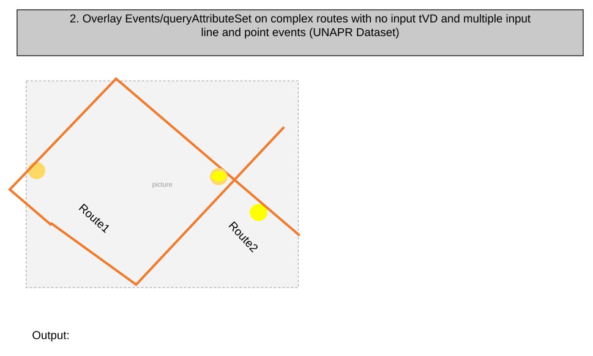

### TC-U03 — Overlay Events / QueryAttributeSet on Simple Routes with No Input TVD and Multiple (case 3) <!-- src: S1 · slide 4 · case 3 -->

- **Case:** Overlay Events/queryAttributeSet on simple routes with no input tVD and multiple input line and point events, including point events that overlap (UNAPR Dataset)

| Network Name | RouteID | From Date | To Date | PipeType |
| --- | --- | --- | --- | --- |
| Network1 | Route1 | 1/1/2000 | <Null> | Upstream |
| Network1 | Route2 | 1/1/2000 | <Null> | Midstream |

| Input Layer | Event ID | From Date | To Date | From Measure | To Measure | From RouteID | To RouteID | Attribute [Color1] | Attribute [Color2] |
| --- | --- | --- | --- | --- | --- | --- | --- | --- | --- |
| Red Event | Red1 | 1/1/2000 | <Null> | 0 | 2.5 | Route1 | Route1 | 450 psi | Active |
| Red Event | Red2 | 1/1/2000 | <Null> | 2.5 | 15 | Route1 | Route2 | 500 psi | Proposed |
| Purple Event | Purple1 | 1/1/2000 | <Null> | 2 | N/A | Route1 | N/A | Dent | Active |
| Yellow Event | Yellow1 | 1/1/2000 | <Null> | 2 | N/A | Route1 | N/A | 1500 | Active |

| Type | RouteID | From Date | To Date | From Measure | To Measure | Network1. PipeType | RedEvent . Red1 | RedEvent . Red2 | PurpleEvent . Purple1 | PurpleEvent . Purple2 | YellowEvent . Yellow1 | YellowEvent . Yellow2 |
| --- | --- | --- | --- | --- | --- | --- | --- | --- | --- | --- | --- | --- |
| Line | Route1 | 1/1/2000 | <Null> | 0 | 2 | Upstream | 450 psi | Active | <Null> | <Null> | <Null> | <Null> |
| Point | Route | 1/1/2000 | <Null> | 2 | 2 | Upstream | 450psi | Active | Dent | Active | 1500 | Active |
| Line | Route1 | 1/1/2000 | <Null> | 2 | 2.5 | Upstream | 500 psi | Proposed | <Null> | <Null> | <Null> | <Null> |
| Line | Route1 | 1/1/2000 | <Null> | 2.5 | 5 | Upstream | 500 psi | Proposed | <Null> | <Null> | <Null> | <Null> |
| Line | Route2 | 1/1/2000 | <Null> | 10 | 15 | Midstream | 500 psi | Proposed | <Null> | <Null> | <Null> | <Null> |

[figure: Input: · Output: · Route1 · Route2]

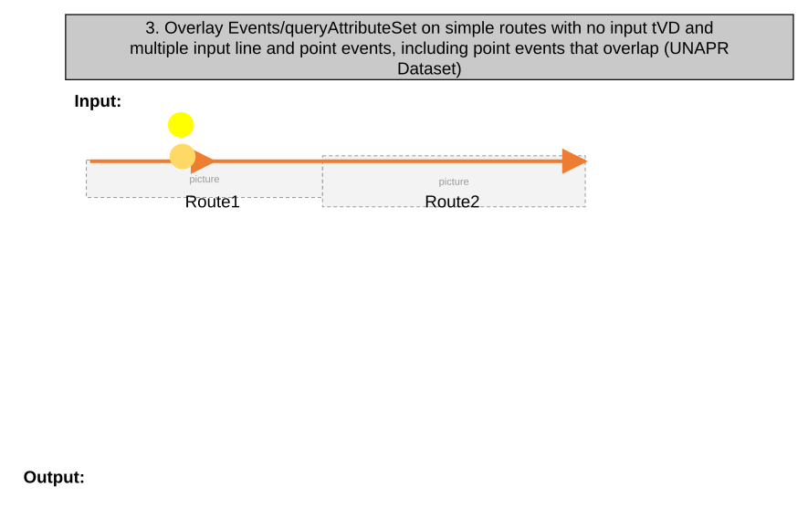

### TC-U04 — Overlay Events / QueryAttributeSet on Simple Routes with No Input TVD and Multiple (case 1) <!-- src: S1 · slide 5 · case 1 -->

- **Case:** Overlay Events/queryAttributeSet on simple routes with no input tVD and multiple line and point input events, including the Road Centerline layer (ADM-RH Dataset)

| Network Name | RouteID | From Date | To Date | Type |
| --- | --- | --- | --- | --- |
| Network1 | Route1 | 1/1/2000 | <Null> | Interstate |

Input:

| Input Layer | Event ID | From Date | To Date | From Measure | To Measure | Attribute [Color1] | Attribute [Color2] |
| --- | --- | --- | --- | --- | --- | --- | --- |
| Centerline | N/A | N/A | N/A | N/A | N/A | 100 | 120 |
| Centerline | N/A | N/A | N/A | N/A | N/A | 122 | 140 |
| Centerline | N/A | N/A | N/A | N/A | N/A | 142 | 160 |
| Red Event | Red1 | 1/1/2000 | <Null> | 0 | 2.5 | Adams | Active |
| Red Event | Red2 | 1/1/2000 | <Null> | 2.5 | 10 | Laporte | Proposed |
| Purple Event | Purple1 | 1/1/2000 | <Null> | 2 | N/A | Yield | Active |
| Yellow Event | Yellow1 | 1/1/2000 | <Null> | 9 | N/A | Private | Proposed |

Output (Centerline measures are found in-memory):

| Type | RouteID | From Date | To Date | From Measure | To Measure | Network1. Type | Centerline. Attribute1 | Centerline. Attribute2 | RedEvent . Red1 | RedEvent . Red2 | PurpleEvent . Purple1 | PurpleEvent . Purple2 | YellowEvent . Yellow1 | YellowEvent . Yellow2 |
| --- | --- | --- | --- | --- | --- | --- | --- | --- | --- | --- | --- | --- | --- | --- |
| Line | Route1 | 1/1/2000 | <Null> | 0 | 2 | Interstate | 100 | 120 | Adams | Active | <Null> | <Null> | <Null> | <Null> |
| Point | Route1 | 1/1/2000 | <Null> | 2 | 2 | Interstate | 100 | 120 | Adams | Active | Yield | Active | <Null> | <Null> |
| Line | Route1 | 1/1/2000 | <Null> | 2 | 2.5 | Interstate | 100 | 120 | Adams | Active | <Null> | <Null> | <Null> | <Null> |
| Line | Route1 | 1/1/2000 | <Null> | 2.5 | 5 | Interstate | 100 | 120 | Laporte | Proposed | <Null> | <Null> | <Null> | <Null> |
| Line | Route1 | 1/1/2000 | <Null> | 5 | 7.5 | Interstate | 122 | 140 | Laporte | Proposed | <Null> | <Null> | <Null> | <Null> |
| Line | Route1 | 1/1/2000 | <Null> | 7.5 | 9 | Interstate | 142 | 160 | Laporte | Proposed | <Null> | <Null> | <Null> | <Null> |
| Point | Route1 | 1/1/2000 | <Null> | 9 | 9 | Interstate | 142 | 160 | Laporte | Proposed | <Null> | <Null> | Private | Proposed |
| Line | Route1 | 1/1/2000 | <Null> | 9 | 10 | Interstate | 142 | 160 | Laporte | Proposed | <Null> | <Null> | <Null> | <Null> |

Route1

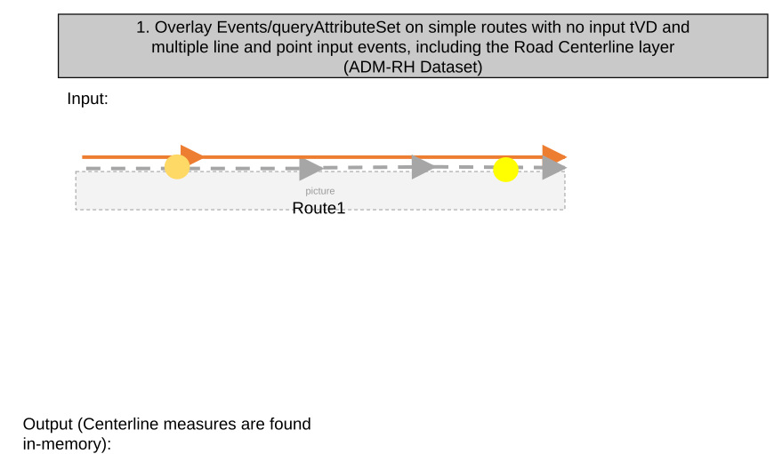

### TC-U05 — Overlay Events / QueryAttributeSet on Simple Routes with No Input TVD and Multiple (case 2) <!-- src: S1 · slide 6 · case 2 -->

- **Case:** Overlay Events/queryAttributeSet on simple routes with no input tVD and multiple line and point input events, including a flipped Road Centerline layer (ADM-RH Dataset)

| Network Name | RouteID | From Date | To Date | Type |
| --- | --- | --- | --- | --- |
| Network1 | Route1 | 1/1/2000 | <Null> | Interstate |

Input:

| Input Layer | Event ID | From Date | To Date | From Measure | To Measure | Attribute [Color1] | Attribute [Color2] |
| --- | --- | --- | --- | --- | --- | --- | --- |
| Centerline | N/A | N/A | N/A | N/A | N/A | 100 | 120 |
| Centerline | N/A | N/A | N/A | N/A | N/A | 122 | 140 |
| Centerline | N/A | N/A | N/A | N/A | N/A | 142 | 160 |
| Red Event | Red1 | 1/1/2000 | <Null> | 0 | 2.5 | Adams | Active |
| Red Event | Red2 | 1/1/2000 | <Null> | 2.5 | 10 | Laporte | Proposed |
| Purple Event | Purple1 | 1/1/2000 | <Null> | 2 | N/A | Yield | Active |
| Purple Event | Purple2 | 1/1/2000 | <Null> | 6 | N/A | Stop | Active |
| Yellow Event | Yellow1 | 1/1/2000 | <Null> | 9 | N/A | Private | Proposed |

Output (Centerline measures are found in-memory):

| Type | RouteID | From Date | To Date | From Measure | To Measure | Network1. Type | Centerline. Attribute1 | Centerline. Attribute2 | RedEvent . Red1 | RedEvent . Red2 | PurpleEvent . Purple1 | PurpleEvent . Purple2 | YellowEvent . Yellow1 | YellowEvent . Yellow2 |
| --- | --- | --- | --- | --- | --- | --- | --- | --- | --- | --- | --- | --- | --- | --- |
| Line | Route1 | 1/1/2000 | <Null> | 0 | 2 | Interstate | 100 | 120 | Adams | Active | <Null> | <Null> | <Null> | <Null> |
| Point | Route1 | 1/1/2000 | <Null> | 2 | 2 | Interstate | 100 | 120 | Adams | Active | Yield | Active | <Null> | <Null> |
| Line | Route1 | 1/1/2000 | <Null> | 2 | 2.5 | Interstate | 100 | 120 | Adams | Active | <Null> | <Null> | <Null> | <Null> |
| Line | Route1 | 1/1/2000 | <Null> | 2.5 | 5 | Interstate | 100 | 120 | Laporte | Proposed | <Null> | <Null> | <Null> | <Null> |
| Line | Route1 | 1/1/2000 | <Null> | 7.5 | 6 | Interstate | 122 | 140 | Laporte | Proposed | <Null> | <Null> | <Null> | <Null> |
| Point | Route1 | 1/1/2000 | <Null> | 6 | 6 | Interstate | 122 | 140 | Laporte | Proposed | Stop | Active | <Null> | <Null> |
| Line | Route1 | 1/1/2000 | <Null> | 6 | 5 | Interstate | 122 | 140 | Laporte | Proposed | <Null> | <Null> | <Null> | <Null> |
| Line | Route1 | 1/1/2000 | <Null> | 7.5 | 9 | Interstate | 142 | 160 | Laporte | Proposed | <Null> | <Null> | <Null> | <Null> |
| Point | Route1 | 1/1/2000 | <Null> | 9 | 9 | Interstate | 142 | 160 | Laporte | Proposed | <Null> | <Null> | Private | Proposed |
| Line | Route1 | 1/1/2000 | <Null> | 9 | 10 | Interstate | 142 | 160 | Laporte | Proposed | <Null> | <Null> | <Null> | <Null> |

Route1

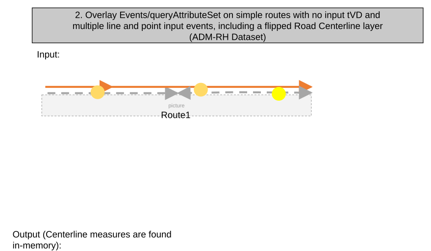

### TC-U06 — Overlay Events / QueryAttributeSet on Simple Routes with No Input TVD and Multiple (case 1) <!-- src: S1 · slide 7 · case 1 -->

- **Case:** Overlay Events/queryAttributeSet on simple routes with no input tVD and multiple input line and point events (RH Dataset)

| Network Name | RouteID | From Date | To Date | Type |
| --- | --- | --- | --- | --- |
| Network1 | Route1 | 1/1/2000 | <Null> | Interstate |

Input:

| Input Layer | Event ID | From Date | To Date | From Measure | To Measure | Attribute [Color1] | Attribute [Color2] |
| --- | --- | --- | --- | --- | --- | --- | --- |
| Red Event | Red1 | 1/1/2000 | <Null> | 0 | 2.5 | Adams | Active |
| Red Event | Red2 | 1/1/2000 | <Null> | 2.5 | 10 | Laporte | Proposed |
| Purple Event | Purple1 | 1/1/2000 | <Null> | 2 | N/A | Yield | Active |
| Yellow Event | Yellow1 | 1/1/2000 | <Null> | 9 | N/A | Private | Proposed |

Output:

| Type | RouteID | From Date | To Date | From Measure | To Measure | Network1. Type | RedEvent . Red1 | RedEvent . Red2 | PurpleEvent . Purple1 | PurpleEvent . Purple2 | YellowEvent . Yellow1 | YellowEvent . Yellow2 |
| --- | --- | --- | --- | --- | --- | --- | --- | --- | --- | --- | --- | --- |
| Line | Route1 | 1/1/2000 | <Null> | 0 | 2 | Interstate | Adams | Active | <Null> | <Null> | <Null> | <Null> |
| Point | Route1 | 1/1/2000 | <Null> | 2 | 2 | Interstate | Adams | Active | Yield | Active | <Null> | <Null> |
| Line | Route1 | 1/1/2000 | <Null> | 2 | 2.5 | Interstate | Adams | Active | <Null> | <Null> | <Null> | <Null> |
| Line | Route1 | 1/1/2000 | <Null> | 2.5 | 9 | Interstate | Laporte | Proposed | <Null> | <Null> | <Null> | <Null> |
| Point | Route1 | 1/1/2000 | <Null> | 9 | 9 | Interstate | Laporte | Proposed | <Null> | <Null> | Private | Proposed |
| Line | Route1 | 1/1/2000 | <Null> | 9 | 10 | Interstate | Laporte | Proposed | <Null> | <Null> | <Null> | <Null> |

Route1

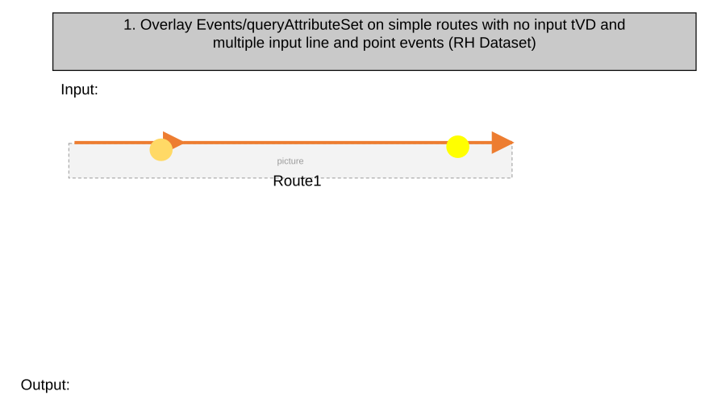

### TC-U07 — Overlay Events / QueryAttributeSet on Simple Routes with No Input TVD and Multiple (case 2) <!-- src: S1 · slide 8 · case 2 -->

- **Case:** Overlay Events/queryAttributeSet on simple routes with no input tVD and multiple input line and point events (RH Dataset)

| Network Name | RouteID | From Date | To Date | Type |
| --- | --- | --- | --- | --- |
| Network1 | Route1 | 1/1/2000 | <Null> | Interstate |

Input:

| Input Layer | Event ID | From Date | To Date | From Measure | To Measure | Attribute [Color1] | Attribute [Color2] |
| --- | --- | --- | --- | --- | --- | --- | --- |
| Red Event | Red1 | 1/1/2000 | <Null> | 0 | 5 | Adams | Active |
| Red Event | Red2 | 1/1/2000 | <Null> | 5 | 10 | Laporte | Proposed |
| Purple Event | Purple1 | 1/1/2000 | <Null> | 2 | N/A | Yield | Active |
| Yellow Event | Yellow1 | 1/1/2000 | <Null> | 8 | N/A | Private | Proposed |

| Type | RouteID | From Date | To Date | From Measure | To Measure | Network1. Type | RedEvent . Red1 | RedEvent . Red2 | PurpleEvent . Purple1 | PurpleEvent . Purple2 | YellowEvent . Yellow1 | YellowEvent . Yellow2 |
| --- | --- | --- | --- | --- | --- | --- | --- | --- | --- | --- | --- | --- |
| Line | Route1 | 1/1/2000 | <Null> | 0 | 2 | Interstate | Adams | Active | <Null> | <Null> | <Null> | <Null> |
| Point | Route1 | 1/1/2000 | <Null> | 2 | 2 | Interstate | Adams | Active | Yield | Active | <Null> | <Null> |
| Line | Route1 | 1/1/2000 | <Null> | 2 | 5 | Interstate | Adams | Active | <Null> | <Null> | <Null> | <Null> |
| Line | Route1 | 1/1/2000 | <Null> | 5 | 8 | Interstate | Laporte | Proposed | <Null> | <Null> | <Null> | <Null> |
| Point | Route1 | 1/1/2000 | <Null> | 8 | 8 | Interstate | Laporte | Proposed | <Null> | <Null> | Private | Proposed |
| Line | Route1 | 1/1/2000 | <Null> | 8 | 10 | Interstate | Laporte | Proposed | <Null> | <Null> | <Null> | <Null> |

Output:

Route1

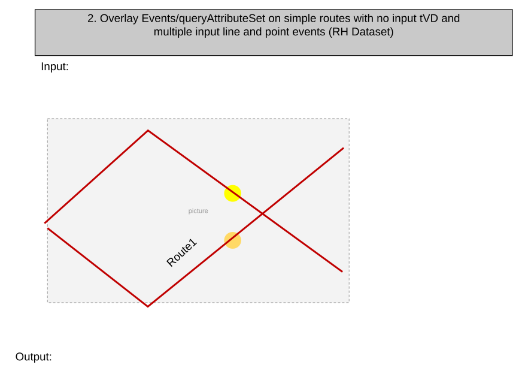

### TC-U08 — Overlay Events / QueryAttributeSet on Vertical Routes with No Input TVD (case 3) <!-- src: S1 · slide 9 · case 3 -->

- **Case:** Overlay Events/queryAttributeSet on vertical routes with no input tVD and multiple input events

(RH Dataset)

| Network Name | RouteID | From Date | To Date | Type |
| --- | --- | --- | --- | --- |
| Network1 | Route1 | 1/1/2000 | <Null> | Interstate |

| Input Layer | Event ID | From Date | To Date | From Measure | To Measure | Attribute [Color1] | Attribute [Color2] |
| --- | --- | --- | --- | --- | --- | --- | --- |
| Red Event | Red1 | 1/1/2000 | <Null> | 0 | 2.5 | Adams | Active |
| Red Event | Red2 | 1/1/2000 | <Null> | 2.5 | 10 | Laporte | Proposed |
| Purple Event | Purple1 | 1/1/2000 | <Null> | 2 | N/A | Yield | Active |
| Yellow Event | Yellow1 | 1/1/2000 | <Null> | 8 | N/A | Private | Proposed |

| Type | RouteID | From Date | To Date | From Measure | To Measure | Network1. Type | RedEvent . Red1 | RedEvent . Red2 | PurpleEvent . Purple1 | PurpleEvent . Purple2 | YellowEvent . Yellow1 | YellowEvent . Yellow2 |
| --- | --- | --- | --- | --- | --- | --- | --- | --- | --- | --- | --- | --- |
| Line | Route1 | 1/1/2000 | <Null> | 0 | 2 | Interstate | Adams | Active | <Null> | <Null> | <Null> | <Null> |
| Point | Route1 | 1/1/2000 | <Null> | 2 | 2 | Interstate | Adams | Active | Yield | Active | <Null> | <Null> |
| Line | Route1 | 1/1/2000 | <Null> | 2 | 2.5 | Interstate | Adams | Active | <Null> | <Null> | <Null> | <Null> |
| Line | Route1 | 1/1/2000 | <Null> | 2.5 | 8 | Interstate | Laporte | Proposed | <Null> | <Null> | <Null> | <Null> |
| Point | Route1 | 1/1/2000 | <Null> | 8 | 8 | Interstate | Laporte | Proposed | <Null> | <Null> | Private | Proposed |
| Line | Route1 | 1/1/2000 | <Null> | 8 | 10 | Interstate | Laporte | Proposed | <Null> | <Null> | <Null> | <Null> |

[figure: 0 · 10 · Input: · Output: · 5]

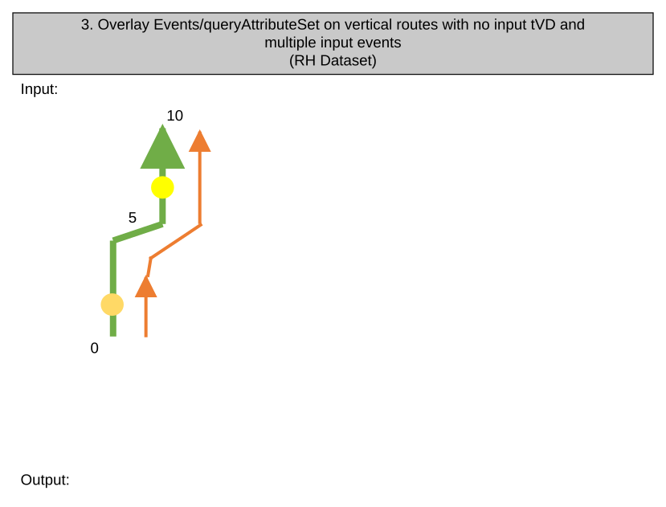

### TC-U09 — Overlay Events / QueryAttributeSet on Routes with Multiple Input Line and Point (case 4) <!-- src: S1 · slide 10 · case 4 -->

- **Case:** Overlay Events/queryAttributeSet on routes with multiple input line and point events, with line attribution remaining the same along the route (RH Dataset)

Input:

| Network Name | RouteID | From Date | To Date | Type |
| --- | --- | --- | --- | --- |
| Network1 | Route1 | 1/1/2000 | <Null> | Interstate |

| Input Layer | Event ID | From Date | To Date | From Measure | To Measure | Attribute [Color1] | Attribute [Color2] |
| --- | --- | --- | --- | --- | --- | --- | --- |
| Green Event | Green1 | 1/1/2000 | <Null> | 0 | 10 | 45 MPH | Active |
| Purple Event | Purple1 | 1/1/2000 | <Null> | 2 | N/A | Yield | Active |
| Yellow Event | Yellow1 | 1/1/2000 | <Null> | 8 | N/A | Private | Proposed |

| Type | RouteID | From Date | To Date | From Measure | To Measure | Network1. Type | GreenEvent . Green1 | GreenEvent . Green2 | PurpleEvent . Purple1 | PurpleEvent . Purple2 | YellowEvent . Yellow1 | YellowEvent . Yellow2 |
| --- | --- | --- | --- | --- | --- | --- | --- | --- | --- | --- | --- | --- |
| Line | Route1 | 1/1/2000 | <Null> | 0 | 2 | Interstate | 45 MPH | Active | <Null> | <Null> | <Null> | <Null> |
| Point | Route1 | 1/1/2000 | <Null> | 2 | 2 | Interstate | 45 MPH | Active | Yield | Active | <Null> | <Null> |
| Line | Route1 | 1/1/2000 | <Null> | 2 | 8 | Interstate | 45 MPH | Active | <Null> | <Null> | <Null> | <Null> |
| Point | Route1 | 1/1/2000 | <Null> | 8 | 8 | Interstate | 45 MPH | Active | <Null> | <Null> | Private | Proposed |
| Line | Route1 | 1/1/2000 | <Null> | 8 | 10 | Interstate | 45 MPH | Active | <Null> | <Null> | <Null> | <Null> |

Output:

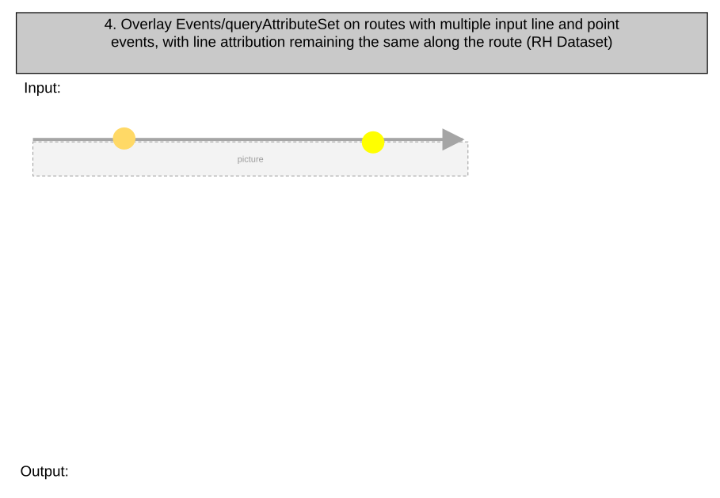

### TC-U10 — Overlay Events / QueryAttributeSet on Routes with Multiple Input Line and Point (case 5) <!-- src: S1 · slide 11 · case 5 -->

- **Case:** Overlay Events/queryAttributeSet on routes with multiple input line and point events, with line events that don’t fully cover a route (RH Dataset)

Input:
Route1

| Network Name | RouteID | From Date | To Date | Type |
| --- | --- | --- | --- | --- |
| Network1 | Route1 | 1/1/2000 | <Null> | Interstate |

| Input Layer | Event ID | From Date | To Date | From Measure | To Measure | Attribute [Color1] | Attribute [Color2] |
| --- | --- | --- | --- | --- | --- | --- | --- |
| Red Event | Red1 | 1/1/2000 | <Null> | 2.5 | 5 | Adams | Active |
| Red Event | Red2 | 1/1/2000 | <Null> | 5 | 7.5 | Laporte | Active |
| Purple Event | Purple1 | 1/1/2000 | <Null> | 1 | N/A | Yield | Active |
| Purple Event | Purple2 | 1/1/2000 | <Null> | 5 | N/A | Stop | Active |
| Yellow Event | Yellow1 | 1/1/2000 | <Null> | 9 | N/A | Private | Proposed |

| Type | RouteID | From Date | To Date | From Measure | To Measure | Network1. Type | RedEvent . Red1 | RedEvent . Red2 | PurpleEvent . Purple1 | PurpleEvent . Purple2 | YellowEvent . Yellow1 | YellowEvent . Yellow2 |
| --- | --- | --- | --- | --- | --- | --- | --- | --- | --- | --- | --- | --- |
| Line | Route1 | 1/1/2000 | <Null> | 0 | 1 | Interstate | <Null> | <Null> | <Null> | <Null> | <Null> | <Null> |
| Point | Route1 | 1/1/2000 | <Null> | 1 | 1 | Interstate | <Null> | <Null> | Yield | Active | <Null> | <Null> |
| Line | Route1 | 1/1/2000 | <Null> | 1 | 2.5 | Interstate | <Null> | <Null> | <Null> | <Null> | <Null> | <Null> |
| Line | Route1 | 1/1/2000 | <Null> | 2.5 | 5 | Interstate | Adams | Active | <Null> | <Null> | <Null> | <Null> |
| Point | Route1 | 1/1/2000 | <Null> | 5 | 5 | Interstate | Laporte | Active | Stop | Active | <Null> | <Null> |
| Line | Route1 | 1/1/2000 | <Null> | 5 | 7.5 | Interstate | Laporte | Active | <Null> | <Null> | <Null> | <Null> |
| Line | Route1 | 1/1/2000 | <Null> | 7.5 | 9 | Interstate | <Null> | <Null> | <Null> | <Null> | <Null> | <Null> |
| Point | Route1 | 1/1/2000 | <Null> | 9 | 9 | Interstate | <Null> | <Null> | <Null> | <Null> | Private | Proposed |
| Line | Route1 | 1/1/2000 | <Null> | 9 | 10 | Interstate | <Null> | <Null> | <Null> | <Null> | <Null> | <Null> |

Output:

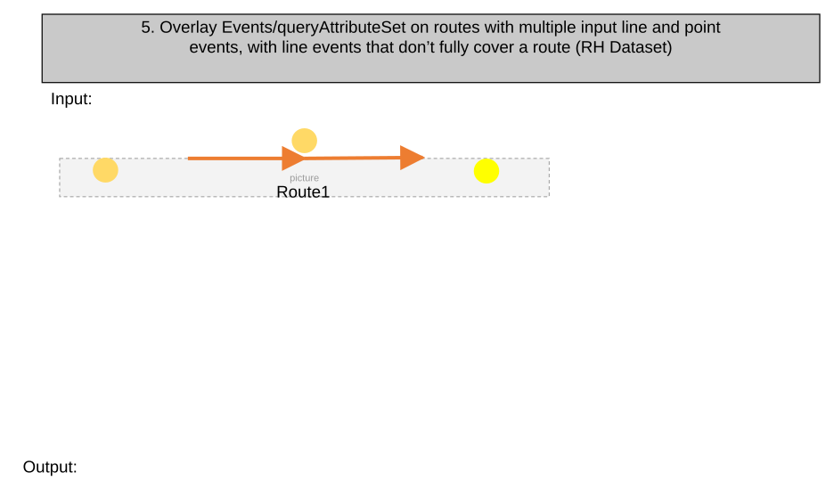

### TC-U11 — Overlay Events / QueryAttributeSet on Gapped Routes with Input Line and Point <!-- src: S1 · slide 12 · case 6 -->

- **Case:** Overlay Events/queryAttributeSet on gapped routes with input line and point events (RH Dataset)

| Network Name | RouteID | From Date | To Date | Type |
| --- | --- | --- | --- | --- |
| Network1 | Route1 | 1/1/2000 | <Null> | Interstate |

| Input Layer | Event ID | From Date | To Date | From Measure | To Measure | Attribute [Color1] | Attribute [Color2] |
| --- | --- | --- | --- | --- | --- | --- | --- |
| Red Event | Red1 | 1/1/2000 | <Null> | 0 | 4 | Adams | Active |
| Red Event | Red2 | 1/1/2000 | <Null> | 6 | 10 | Laporte | Active |
| Purple Event | Purple1 | 1/1/2000 | <Null> | 2 | N/A | Yield | Active |
| Yellow Event | Yellow1 | 1/1/2000 | <Null> | 8 | N/A | Private | Proposed |

| Type | RouteID | From Date | To Date | From Measure | To Measure | Network1. Type | RedEvent . Red1 | RedEvent . Red2 | PurpleEvent . Purple1 | PurpleEvent . Purple2 | YellowEvent . Yellow1 | YellowEvent . Yellow2 |
| --- | --- | --- | --- | --- | --- | --- | --- | --- | --- | --- | --- | --- |
| Line | Route1 | 1/1/2000 | <Null> | 0 | 2 | Interstate | Adams | Active | <Null> | <Null> | <Null> | <Null> |
| Point | Route1 | 1/1/2000 | <Null> | 2 | 2 | Interstate | Adams | Active | Yield | Active | <Null> | <Null> |
| Line | Route1 | 1/1/2000 | <Null> | 2 | 4 | Interstate | Adams | Active | <Null> | <Null> | <Null> | <Null> |
| Line | Route1 | 1/1/2000 | <Null> | 6 | 8 | Interstate | Laporte | Active | <Null> | <Null> | <Null> | <Null> |
| Point | Route1 | 1/1/2000 | <Null> | 8 | 8 | Interstate | Laporte | Active | <Null> | <Null> | Private | Proposed |
| Line | Route1 | 1/1/2000 | <Null> | 8 | 10 | Interstate | Laporte | Active | <Null> | <Null> | <Null> | <Null> |

[figure: Input: · Route1 · Output:]

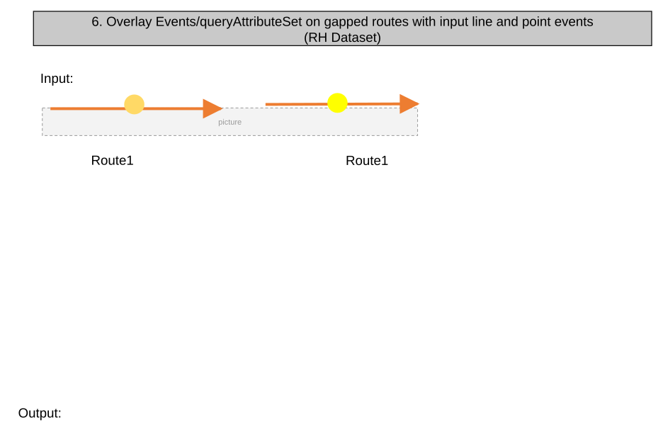

### TC-U12 — Overlay Events / QueryAttributeSet on Routes with Multiple Input Line and Point (case 7) <!-- src: S1 · slide 14 · case 7 -->

- **Case:** Overlay Events/queryAttributeSet on routes with multiple input line and point events that belong to a different LRS Network, with measure translation occurring between the networks (RH Dataset)

| Network Name | RouteID | From Date | To Date | Attribute |
| --- | --- | --- | --- | --- |
| Network1 | Route1 | 1/1/2000 | <Null> | Interstate |
| Network2 | RouteA | 1/1/2000 | <Null> | County |

| Input Layer | Event ID | From Date | To Date | From Measure | To Measure | Attribute [Color1] | Attribute [Color2] |
| --- | --- | --- | --- | --- | --- | --- | --- |
| Red Event | Red2 | 1/1/2000 | <Null> | 0 mi | 10 mi | Adams | Active |
| Purple Event | Purple1 | 1/1/2000 | <Null> | 2 mi | N/A | Yield | Active |
| Yellow Event | Yellow1 | 1/1/2000 | <Null> | 8 mi | N/A | Private | Proposed |

| Type | RouteID | From Date | To Date | From Measure | To Measure | Network1. Type | RedEvent . Red1 | RedEvent . Red2 | PurpleEvent. Purple1 | PurpleEvent . Purple2 | YellowEvent . Yellow1 | YellowEvent . Yellow2 |
| --- | --- | --- | --- | --- | --- | --- | --- | --- | --- | --- | --- | --- |
| Line | RouteA | 1/1/2000 | <Null> | 0 ft | 10560 ft | County | Adams | Active | <Null> | <Null> | <Null> | <Null> |
| Point | RouteA | 1/1/2000 | <Null> | 10560 ft | 10560 ft | County | Adams | Active | Yield | Active | <Null> | <Null> |
| Line | RouteA | 1/1/2000 | <Null> | 10560 ft | 42240 ft | County | Adams | Active | <Null> | <Null> | <Null> | <Null> |
| Point | RouteA | 1/1/2000 | <Null> | 42240 ft | 42240 ft | County | Adams | Active | <Null> | <Null> | Private | Proposed |
| Line | RouteA | 1/1/2000 | <Null> | 42240 ft | 52800 ft | County | Adams | Active | <Null> | <Null> | <Null> | <Null> |

[figure: Input: · Output: · Route1 · RouteA]

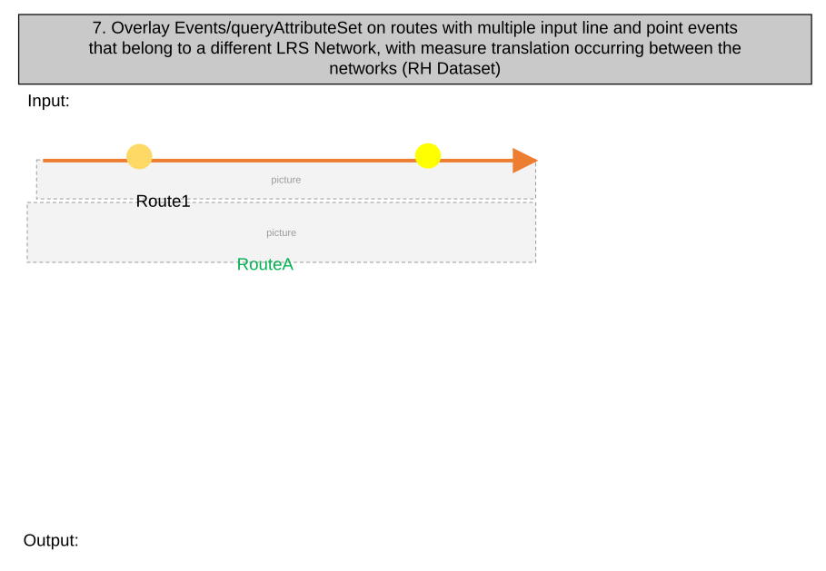

### TC-U13 — Overlay Events / QueryAttributeSet on Routes with Multiple Line and Point Events <!-- src: S1 · slide 18 · case 8 -->

- **Case:** Overlay Events/queryAttributeSet on routes with multiple line and point events with multiple time slices (RH Dataset)

Input:
Route1

| Network Name | Route ID | From Date | To Date | Type |
| --- | --- | --- | --- | --- |
| Network1 | Route1 | 1/1/2000 | <Null> | Interstate |

| Input Layer | Event ID | From Date | To Date | From Measure | To Measure | Attribute [Color1] | Attribute [Color2] |
| --- | --- | --- | --- | --- | --- | --- | --- |
| Red Event | Red1 | 1/1/2000 | 1/1/2005 | 0 | 10 | Adams | Retired |
| Red Event | Red1 | 1/1/2005 | 1/1/2010 | 0 | 5 | Adams | Retired |
| Red Event | Red2 | 1/1/2005 | 1/1/2010 | 5 | 10 | Laporte | Retired |
| Red Event | Red1 | 1/1/2010 | <Null> | 0 | 10 | Adams | Active |
| Blue Event | Blue1 | 1/1/2000 | 1/1/2005 | 0 | 8 | Full Access | Retired |
| Blue Event | Blue2 | 1/1/2005 | <Null> | 0 | 10 | No Access | Active |
| Purple Event | Purple1 | 1/1/2000 | 1/1/2005 | 2 | N/A | Yield | Retired |
| Purple Event | Purple1 | 1/1/2005 | <Null> | 2 | N/A | Stop | Active |

| Type | Route ID | FromDate | ToDate | FromMeasure | ToMeasure | Network1.Type | RedEvent.Red1 | RedEvent.Red2 | BlueEvent.Blue1 | BlueEvent.Blue2 | PurpleEvent.Purple1 | PurpleEvent.Purple2 |
| --- | --- | --- | --- | --- | --- | --- | --- | --- | --- | --- | --- | --- |
| Line | Route1 | 1/1/2000 | 1/1/2005 | 0 | 2 | Interstate | Adams | Retired | Full Access | Retired | <Null> | <Null> |
| Point | Route1 | 1/1/2000 | 1/1/2005 | 2 | 2 | Interstate | Adams | Retired | Full Access | Retired | Yield | Retired |
| Line | Route1 | 1/1/2000 | 1/1/2005 | 2 | 8 | Interstate | Adams | Retired | Full Access | Retired | <Null> | <Null> |
| Line | Route1 | 1/1/2000 | 1/1/2005 | 8 | 10 | Interstate | Adams | Retired | <Null> | <Null> | <Null> | <Null> |
| Line | Route1 | 1/1/2005 | 1/1/2010 | 0 | 2 | Interstate | Adams | Retired | No Access | Active | <Null> | <Null> |
| Point | Route1 | 1/1/2005 | 1/1/2010 | 2 | 2 | Interstate | Adams | Retired | No Access | Active | Stop | Active |
| Line | Route1 | 1/1/2005 | 1/1/2010 | 2 | 5 | Interstate | Adams | Retired | No Access | Active | <Null> | <Null> |
| Line | Route1 | 1/1/2005 | 1/1/2010 | 5 | 10 | Interstate | Laporte | Retired | No Access | Active | <Null> | <Null> |
| Line | Route1 | 1/1/2010 | <Null> | 0 | 2 | Interstate | Adams | Active | No Access | Active | <Null> | <Null> |
| Point | Route1 | 1/1/2010 | <Null> | 2 | 2 | Interstate | Adams | Active | No Access | Active | Stop | Active |
| Line | Route1 | 1/1/2010 | <Null> | 2 | 10 | Interstate | Adams | Active | No Access | Active | <Null> | <Null> |

Output:

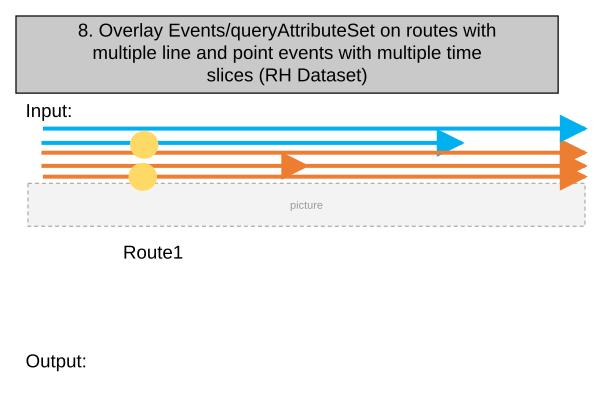

### TC-U14 — Overlay Events / QueryAttributeSet on Simple Routes with No Input TVD and Multiple (case 9) <!-- src: S1 · slide 20 · case 9 -->

- **Case:** Overlay Events/queryAttributeSet on simple routes with no input tVD and multiple input line and point events, with point events at the end/begin of two line events (RH Dataset)

| Network Name | RouteID | From Date | To Date | Type |
| --- | --- | --- | --- | --- |
| Network1 | Route1 | 1/1/2000 | <Null> | Interstate |

Input:

| Input Layer | Event ID | From Date | To Date | From Measure | To Measure | Attribute [Color1] | Attribute [Color2] |
| --- | --- | --- | --- | --- | --- | --- | --- |
| Red Event | Red1 | 1/1/2000 | <Null> | 0 | 2.5 | Adams | Active |
| Red Event | Red2 | 1/1/2000 | <Null> | 2.5 | 10 | Laporte | Proposed |
| Blue Event | Blue1 | 1/1/2000 | <Null> | 0 | 10 | Full Access | Active |
| Green Event | Green1 | 1/1/2000 | <Null> | 0 | 10 | 45 MPH | Active |
| Purple Event | Purple1 | 1/1/2000 | <Null> | 2.5 | N/A | Yield | Active |

Output (attributes are taken from the line event that has a higher measure value):

| Type | RouteID | From Date | To Date | From Measure | To Measure | Network1. Type | RedEvent . Red1 | RedEvent . Red2 | BlueEvent . Blue1 | BlueEvent . Blue2 | GreenEvent . Green1 | GreenEvent . Green2 | PurpleEvent . Purple1 | PurpleEvent . Purple2 |
| --- | --- | --- | --- | --- | --- | --- | --- | --- | --- | --- | --- | --- | --- | --- |
| Line | Route1 | 1/1/2000 | <Null> | 0 | 2.5 | Interstate | Adams | Active | Full Access | Active | 45 MPH | Active | <Null> | <Null> |
| Point | Route1 | 1/1/2000 | <Null> | 2.5 | 2.5 | Interstate | Laporte | Proposed | Full Access | Active | 45 MPH | Active | Yield | Active |
| Line | Route1 | 1/1/2000 | <Null> | 2.5 | 10 | Interstate | Laporte | Proposed | Full Access | Active | 45 MPH | Active | <Null> | <Null> |

Route1

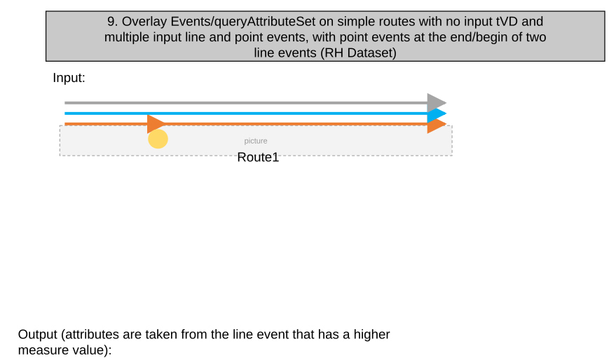

### TC-U15 — Overlay Events / QueryAttributeSet on Simple Routes with No Input TVD and Point <!-- src: S1 · slide 21 · case 10 -->

- **Case:** Overlay Events/queryAttributeSet on simple routes with no input tVD and point events, with no line events on input route with line events still included in input (RH Dataset)

| Network Name | RouteID | From Date | To Date | Type |
| --- | --- | --- | --- | --- |
| Network1 | Route1 | 1/1/2000 | <Null> | Interstate |
| Network1 | RouteX | 1/1/2000 | <Null> | County |

Input:

| Input Layer | RouteID | Event ID | From Date | To Date | From Measure | To Measure | Attribute [Color1] | Attribute [Color2] |
| --- | --- | --- | --- | --- | --- | --- | --- | --- |
| Purple Event | Route1 | Purple1 | 1/1/2000 | <Null> | 2 | N/A | Yield | Active |
| Yellow Event | Route1 | Yellow1 | 1/1/2000 | <Null> | 8 | N/A | Private | Proposed |

Output (Input line events are not on route, but are still included in the input):

| Type | RouteID | From Date | To Date | From Measure | To Measure | Network1. Type | RedEvent . Red1 | RedEvent . Red2 | BlueEvent . Blue1 | BlueEvent . Blue2 | GreenEvent . Green1 | GreenEvent . Green2 | PurpleEvent . Purple1 | PurpleEvent . Purple2 | YellowEvent . Yellow1 | YellowEvent . Yellow2 |
| --- | --- | --- | --- | --- | --- | --- | --- | --- | --- | --- | --- | --- | --- | --- | --- | --- |
| Line | Route1 | 1/1/2000 | <Null> | 0 | 2 | Interstate | <Null> | <Null> | <Null> | <Null> | <Null> | <Null> | <Null> | <Null> | <Null> | <Null> |
| Point | Route1 | 1/1/2000 | <Null> | 2 | 2 | Interstate | <Null> | <Null> | <Null> | <Null> | <Null> | <Null> | Yield | Active | <Null> | <Null> |
| Line | Route1 | 1/1/2000 | <Null> | 2 | 8 | Interstate | <Null> | <Null> | <Null> | <Null> | <Null> | <Null> | <Null> | <Null> | <Null> | <Null> |
| Point | Route1 | 1/1/2000 | <Null> | 8 | 8 | Interstate | <Null> | <Null> | <Null> | <Null> | <Null> | <Null> | <Null> | <Null> | Private | Proposed |
| Line | Route1 | 1/1/2000 | <Null> | 8 | 10 | Interstate | <Null> | <Null> | <Null> | <Null> | <Null> | <Null> | <Null> | <Null> | <Null> | <Null> |

Route1

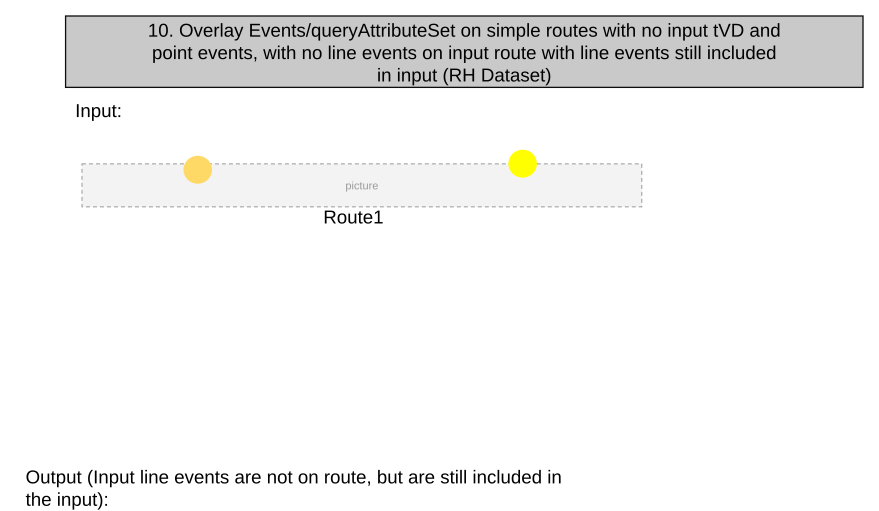

### TC-U16 — Overlay Events / QueryAttributeSet on Simple Routes with No Input TVD and Multiple (case 11) <!-- src: S1 · slide 22 · case 11 -->

- **Case:** Overlay Events/queryAttributeSet on simple routes with no input tVD and multiple input line and point events, with multiple point events of the same layer at a location (RH Dataset)

| Network Name | RouteID | From Date | To Date | Type |
| --- | --- | --- | --- | --- |
| Network1 | Route1 | 1/1/2000 | <Null> | Interstate |

Input:

| Input Layer | Event ID | From Date | To Date | From Measure | To Measure | Attribute [Color1] | Attribute [Color2] |
| --- | --- | --- | --- | --- | --- | --- | --- |
| Red Event | Red1 | 1/1/2000 | <Null> | 0 | 2.5 | Adams | Active |
| Red Event | Red2 | 1/1/2000 | <Null> | 2.5 | 10 | Laporte | Proposed |
| Purple Event | Purple1 | 1/1/2000 | <Null> | 2 | N/A | Yield | Active |
| Yellow Event | Yellow1 | 1/1/2000 | <Null> | 9 | N/A | Private | Proposed |
| Yellow Event | Yellow2 | 1/1/2000 | <Null> | 9 | N/A | Limited | Proposed |

Output (When more than one point event, an event is randomly selected):

| Type | RouteID | From Date | To Date | From Measure | To Measure | Network1. Type | RedEvent . Red1 | RedEvent . Red2 | PurpleEvent . Purple1 | PurpleEvent . Purple2 | YellowEvent . Yellow1 | YellowEvent . Yellow2 |
| --- | --- | --- | --- | --- | --- | --- | --- | --- | --- | --- | --- | --- |
| Line | Route1 | 1/1/2000 | <Null> | 0 | 2 | Interstate | Adams | Active | <Null> | <Null> | <Null> | <Null> |
| Point | Route1 | 1/1/2000 | <Null> | 2 | 2 | Interstate | Adams | Active | Yield | Active | <Null> | <Null> |
| Line | Route1 | 1/1/2000 | <Null> | 2 | 2.5 | Interstate | Adams | Active | <Null> | <Null> | <Null> | <Null> |
| Line | Route1 | 1/1/2000 | <Null> | 2.5 | 9 | Interstate | Laporte | Proposed | <Null> | <Null> | <Null> | <Null> |
| Point | Route1 | 1/1/2000 | <Null> | 9 | 9 | Interstate | Laporte | Proposed | <Null> | <Null> | Private | Proposed |
| Line | Route1 | 1/1/2000 | <Null> | 9 | 10 | Interstate | Laporte | Proposed | <Null> | <Null> | <Null> | <Null> |

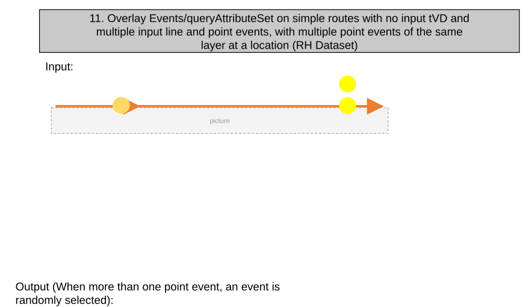

### TC-U17 — Overlay Events / QueryAttributeSet on Routes with Multiple Input Line and Point (case 12) <!-- src: S1 · slide 23 · case 12 -->

- **Case:** Overlay Events/queryAttributeSet on routes with multiple input line and point events, with point events at the start and end of a route (RH Dataset)

Input:

| Network Name | RouteID | From Date | To Date | Type |
| --- | --- | --- | --- | --- |
| Network1 | Route1 | 1/1/2000 | <Null> | Interstate |

| Input Layer | Event ID | From Date | To Date | From Measure | To Measure | Attribute [Color1] | Attribute [Color2] |
| --- | --- | --- | --- | --- | --- | --- | --- |
| Red Event | Red2 | 1/1/2000 | <Null> | 0 | 10 | Adams | Active |
| Purple Event | Purple1 | 1/1/2000 | <Null> | 0 | N/A | Yield | Active |
| Yellow Event | Yellow1 | 1/1/2000 | <Null> | 10 | N/A | Private | Proposed |

| Type | RouteID | From Date | To Date | From Measure | To Measure | Network1. Type | RedEvent . Red1 | RedEvent . Red2 | PurpleEvent . Purple1 | PurpleEvent . Purple2 | YellowEvent . Yellow1 | YellowEvent . Yellow2 |
| --- | --- | --- | --- | --- | --- | --- | --- | --- | --- | --- | --- | --- |
| Point | Route1 | 1/1/2000 | <Null> | 0 | 0 | Interstate | Adams | Active | Yield | Active | <Null> | <Null> |
| Line | Route1 | 1/1/2000 | <Null> | 0 | 10 | Interstate | Adams | Active | <Null> | <Null> | <Null> | <Null> |
| Point | Route1 | 1/1/2000 | <Null> | 10 | 10 | Interstate | Adams | Active | <Null> | <Null> | Private | Proposed |

Output:

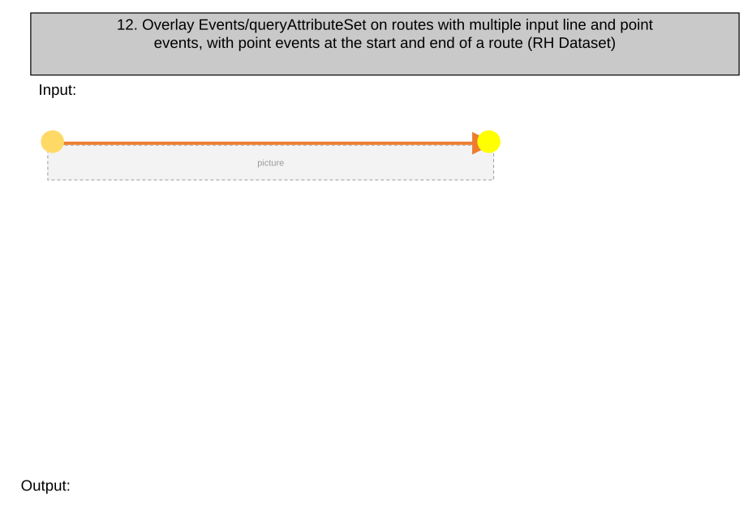

### TC-U18 — Overlay Events / QueryAttributeSet on Simple Routes with No Input TVD and Multiple (case 13) <!-- src: S1 · slide 24 · case 13 -->

- **Case:** Overlay Events/queryAttributeSet on simple routes with no input tVD and multiple input line and point events, with point events existing at the intersecting point of complex route (RH Dataset)

| Network Name | RouteID | From Date | To Date | Type |
| --- | --- | --- | --- | --- |
| Network1 | Route1 | 1/1/2000 | <Null> | Interstate |

Input:

| Input Layer | Event ID | From Date | To Date | From Measure | To Measure | Attribute [Color1] | Attribute [Color2] |
| --- | --- | --- | --- | --- | --- | --- | --- |
| Red Event | Red1 | 1/1/2000 | <Null> | 0 | 5 | Adams | Active |
| Red Event | Red2 | 1/1/2000 | <Null> | 5 | 10 | Laporte | Proposed |
| Purple Event | Purple1 | 1/1/2000 | <Null> | 1.5 | N/A | Yield | Active |
| Yellow Event | Yellow1 | 1/1/2000 | <Null> | 8.5 | N/A | Private | Proposed |

| Type | RouteID | From Date | To Date | From Measure | To Measure | Network1. Type | RedEvent . Red1 | RedEvent . Red2 | PurpleEvent . Purple1 | PurpleEvent . Purple2 | YellowEvent . Yellow1 | YellowEvent . Yellow2 |
| --- | --- | --- | --- | --- | --- | --- | --- | --- | --- | --- | --- | --- |
| Line | Route1 | 1/1/2000 | <Null> | 0 | 1.5 | Interstate | Adams | Active | <Null> | <Null> | <Null> | <Null> |
| Point | Route1 | 1/1/2000 | <Null> | 1.5 | 1.5 | Interstate | Adams | Active | Yield | Active | <Null> | <Null> |
| Line | Route1 | 1/1/2000 | <Null> | 1.5 | 5 | Interstate | Adams | Active | <Null> | <Null> | <Null> | <Null> |
| Line | Route1 | 1/1/2000 | <Null> | 5 | 8.5 | Interstate | Laporte | Proposed | <Null> | <Null> | <Null> | <Null> |
| Point | Route1 | 1/1/2000 | <Null> | 8.5 | 8.5 | Interstate | Laporte | Proposed | <Null> | <Null> | Private | Proposed |
| Line | Route1 | 1/1/2000 | <Null> | 8.5 | 10 | Interstate | Laporte | Proposed | <Null> | <Null> | <Null> | <Null> |

Output:

Route1

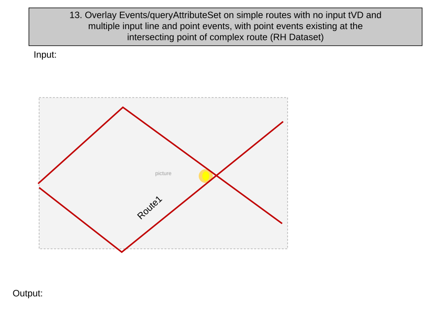

### TC-U19 — Overlay Events / QueryAttributeSet on Routes with Multiple Input Line and Point (case 14) <!-- src: S1 · slide 25 · case 14 -->

- **Case:** Overlay Events/queryAttributeSet on routes with multiple input line and point events, with overlapping point events from different event layers (RH Dataset)

Input:

| Network Name | RouteID | From Date | To Date | Type |
| --- | --- | --- | --- | --- |
| Network1 | Route1 | 1/1/2000 | <Null> | Interstate |

| Input Layer | Event ID | From Date | To Date | From Measure | To Measure | Attribute [Color1] | Attribute [Color2] |
| --- | --- | --- | --- | --- | --- | --- | --- |
| Red Event | Red2 | 1/1/2000 | <Null> | 0 | 10 | Adams | Active |
| Purple Event | Purple1 | 1/1/2000 | <Null> | 5 | N/A | Yield | Active |
| Yellow Event | Yellow1 | 1/1/2000 | <Null> | 5 | N/A | Private | Proposed |

| Type | RouteID | From Date | To Date | From Measure | To Measure | Network1. Type | RedEvent . Red1 | RedEvent . Red2 | PurpleEvent . Purple1 | PurpleEvent . Purple2 | YellowEvent . Yellow1 | YellowEvent . Yellow2 |
| --- | --- | --- | --- | --- | --- | --- | --- | --- | --- | --- | --- | --- |
| Line | Route1 | 1/1/2000 | <Null> | 0 | 5 | Interstate | Adams | Active | <Null> | <Null> | <Null> | <Null> |
| Point | Route1 | 1/1/2000 | <Null> | 5 | 5 | Interstate | Adams | Active | Yield | Active | Private | Proposed |
| Line | Route1 | 1/1/2000 | <Null> | 5 | 10 | Interstate | Adams | Active | <Null> | <Null> | <Null> | <Null> |

Output:

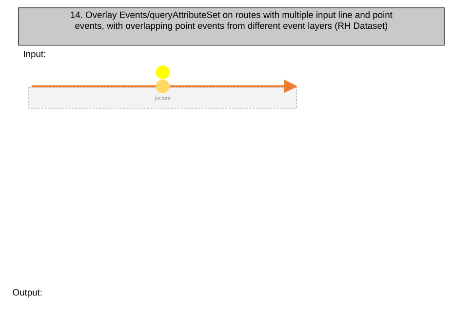

### TC-U20 — Overlay Events / QueryAttributeSet on Routes with Multiple Input Line and Point (case 15) <!-- src: S1 · slide 26 · case 15 -->

- **Case:** Overlay Events/queryAttributeSet on routes with multiple input line and point events, with line events that don’t fully cover a route (RH Dataset)

Input:
Route1

| Network Name | RouteID | From Date | To Date | Type |
| --- | --- | --- | --- | --- |
| Network1 | Route1 | 1/1/2000 | <Null> | Interstate |

| Input Layer | Event ID | From Date | To Date | From Measure | To Measure | Attribute [Color1] | Attribute [Color2] |
| --- | --- | --- | --- | --- | --- | --- | --- |
| Red Event | Red1 | 1/1/2000 | <Null> | 2.5 | 5 | Adams | Active |
| Red Event | Red2 | 1/1/2000 | <Null> | 5 | 7.5 | Laporte | Active |
| Purple Event | Purple1 | 1/1/2000 | <Null> | 2.5 | N/A | Yield | Active |
| Yellow Event | Yellow1 | 1/1/2000 | <Null> | 7.5 | N/A | Private | Proposed |

| Type | RouteID | From Date | To Date | From Measure | To Measure | Network1. Type | RedEvent . Red1 | RedEvent . Red2 | PurpleEvent . Purple1 | PurpleEvent . Purple2 | YellowEvent . Yellow1 | YellowEvent . Yellow2 |
| --- | --- | --- | --- | --- | --- | --- | --- | --- | --- | --- | --- | --- |
| Line | Route1 | 1/1/2000 | <Null> | 0 | 2.5 | Interstate | <Null> | <Null> | <Null> | <Null> | <Null> | <Null> |
| Point | Route1 | 1/1/2000 | <Null> | 2.5 | 2.5 | Interstate | Adams | Active | Yield | Active | <Null> | <Null> |
| Line | Route1 | 1/1/2000 | <Null> | 2.5 | 5 | Interstate | Adams | Active | <Null> | <Null> | <Null> | <Null> |
| Line | Route1 | 1/1/2000 | <Null> | 5 | 7.5 | Interstate | Laporte | Active | <Null> | <Null> | <Null> | <Null> |
| Point | Route1 | 1/1/2000 | <Null> | 7.5 | 7.5 | Interstate | Laporte | Active | <Null> | <Null> | Private | Proposed |
| Line | Route1 | 1/1/2000 | <Null> | 7.5 | 10 | Interstate | <Null> | <Null> | <Null> | <Null> | <Null> | <Null> |

Output:

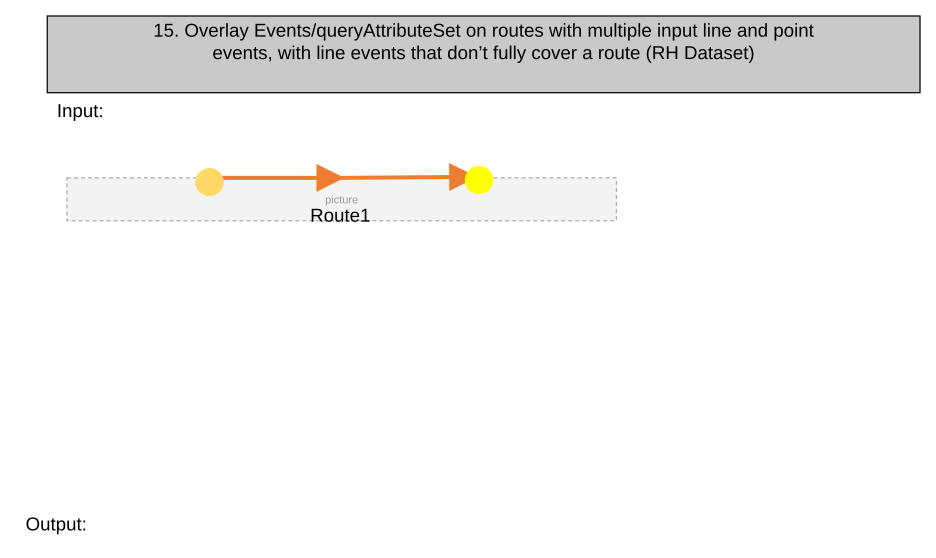

### TC-U21 — Overlay Events / QueryAttributeSet on Simple Routes with No Input TVD and Multiple (case 16) <!-- src: S1 · slide 27 · case 16 -->

- **Case:** Overlay Events/queryAttributeSet on simple routes with no input tVD and multiple input line and point events, but there is a selection set (Yellow1) on the point event layer (RH Dataset)

| Network Name | RouteID | From Date | To Date | Type |
| --- | --- | --- | --- | --- |
| Network1 | Route1 | 1/1/2000 | <Null> | Interstate |

Input:

| Input Layer | Event ID | From Date | To Date | From Measure | To Measure | Attribute [Color1] | Attribute [Color2] |
| --- | --- | --- | --- | --- | --- | --- | --- |
| Red Event | Red1 | 1/1/2000 | <Null> | 0 | 2.5 | Adams | Active |
| Red Event | Red2 | 1/1/2000 | <Null> | 2.5 | 10 | Laporte | Proposed |
| Purple Event | Purple1 | 1/1/2000 | <Null> | 2 | N/A | Yield | Active |
| Yellow Event | Yellow1 | 1/1/2000 | <Null> | 9 | N/A | Private | Proposed |
| Yellow Event | Yellow2 | 1/1/2000 | <Null> | 1 | N/A | Private | Proposed |
| Yellow Event | Yellow3 | 1/1/2000 | <Null> | 4 | N/A | Private | Proposed |
| Yellow Event | Yellow4 | 1/1/2000 | <Null> | 7 | N/A | Private | Proposed |

Output:

| Type | RouteID | From Date | To Date | From Measure | To Measure | Network1. Type | RedEvent . Red1 | RedEvent . Red2 | PurpleEvent . Purple1 | PurpleEvent . Purple2 | YellowEvent . Yellow1 | YellowEvent . Yellow2 |
| --- | --- | --- | --- | --- | --- | --- | --- | --- | --- | --- | --- | --- |
| Line | Route1 | 1/1/2000 | <Null> | 0 | 2 | Interstate | Adams | Active | <Null> | <Null> | <Null> | <Null> |
| Point | Route1 | 1/1/2000 | <Null> | 2 | 2 | Interstate | Adams | Active | Yield | Active | <Null> | <Null> |
| Line | Route1 | 1/1/2000 | <Null> | 2 | 2.5 | Interstate | Adams | Active | <Null> | <Null> | <Null> | <Null> |
| Line | Route1 | 1/1/2000 | <Null> | 2.5 | 9 | Interstate | Laporte | Proposed | <Null> | <Null> | <Null> | <Null> |
| Point | Route1 | 1/1/2000 | <Null> | 9 | 9 | Interstate | Laporte | Proposed | <Null> | <Null> | Private | Proposed |
| Line | Route1 | 1/1/2000 | <Null> | 9 | 10 | Interstate | Laporte | Proposed | <Null> | <Null> | <Null> | <Null> |

Route1

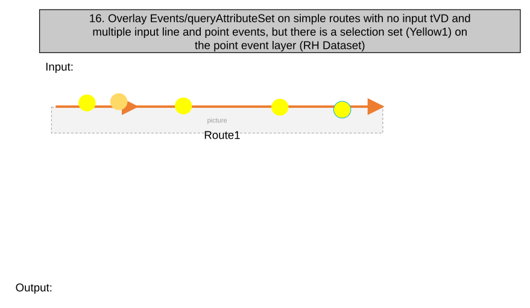

### TC-U22 — Overlay Events / QueryAttributeSet on Simple Routes with No Input TVD and Multiple (case 1) <!-- src: S1 · slide 28 · case 1 -->

- **Case:** Overlay Events/queryAttributeSet on simple routes with no input tVD and multiple input line and point events (APR Dataset)

| Network Name | RouteID | From Date | To Date | PipeType |
| --- | --- | --- | --- | --- |
| Network1 | Route1 | 1/1/2000 | <Null> | Upstream |
| Network1 | Route2 | 1/1/2000 | <Null> | Midstream |

| Input Layer | Event ID | From Date | To Date | From Measure | To Measure | From RouteID | To RouteID | Attribute [Color1] | Attribute [Color2] |
| --- | --- | --- | --- | --- | --- | --- | --- | --- | --- |
| Red Event | Red1 | 1/1/2000 | <Null> | 0 | 2.5 | Route1 | Route1 | 450 psi | Active |
| Red Event | Red2 | 1/1/2000 | <Null> | 2.5 | 15 | Route1 | Route2 | 500 psi | Proposed |
| Purple Event | Purple1 | 1/1/2000 | <Null> | 2 | N/A | Route1 | N/A | Dent | Active |
| Yellow Event | Yellow1 | 1/1/2000 | <Null> | 14 | N/A | Route2 | N/A | 1500 | Active |

| Type | RouteID | From Date | To Date | From Measure | To Measure | Network1. PipeType | RedEvent . Red1 | RedEvent . Red2 | PurpleEvent . Purple1 | PurpleEvent . Purple2 | YellowEvent . Yellow1 | YellowEvent . Yellow2 |
| --- | --- | --- | --- | --- | --- | --- | --- | --- | --- | --- | --- | --- |
| Line | Route1 | 1/1/2000 | <Null> | 0 | 2 | Upstream | 450 psi | Active | <Null> | <Null> | <Null> | <Null> |
| Point | Route | 1/1/2000 | <Null> | 2 | 2 | Upstream | 450psi | Active | Dent | Active | <Null> | <Null> |
| Line | Route1 | 1/1/2000 | <Null> | 2 | 2.5 | Upstream | 450psi | Active | <Null> | <Null> | <Null> | <Null> |
| Line | Route1 | 1/1/2000 | <Null> | 2.5 | 5 | Upstream | 500 psi | Proposed | <Null> | <Null> | <Null> | <Null> |
| Line | Route2 | 1/1/2000 | <Null> | 10 | 14 | Midstream | 500 psi | Proposed | <Null> | <Null> | <Null> | <Null> |
| Point | Route2 | 1/1/2000 | <Null> | 14 | 14 | Midstream | 500 psi | Proposed | <Null> | <Null> | 1500 | Active |
| Line | Route2 | 1/1/2000 | <Null> | 14 | 15 | Midstream | 500 psi | Proposed | <Null> | <Null> | <Null> | <Null> |

[figure: Input: · Output: · Route1 · Route2]

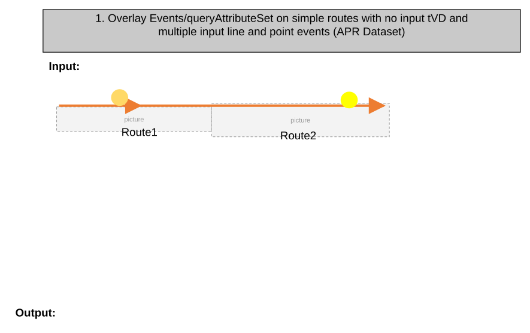

### TC-U23 — Overlay Events / QueryAttributeSet on Complex Routes with No Input TVD (case 2) <!-- src: S1 · slide 29 · case 2 -->

- **Case:** Overlay Events/queryAttributeSet on complex routes with no input tVD and multiple input line and point events

(APR Dataset)

| Network Name | RouteID | From Date | To Date | Type |
| --- | --- | --- | --- | --- |
| Network1 | Route1 | 1/1/2000 | <Null> | Upstream |
| Network1 | Route2 | 1/1/2000 | <Null> | Midstream |

| Input Layer | Event ID | From Date | To Date | From Measure | To Measure | From RouteID | To RouteID | Attribute [Color1] | Attribute [Color2] |
| --- | --- | --- | --- | --- | --- | --- | --- | --- | --- |
| Red Event | Red1 | 1/1/2000 | <Null> | 0 | 5 | Route1 | Route1 | 450 psi | Active |
| Red Event | Red2 | 1/1/2000 | <Null> | 5 | 10 | Route1 | Route2 | 500 psi | Proposed |
| Purple Event | Purple1 | 1/1/2000 | <Null> | 6 | N/A | Route1 | N/A | Dent | Active |
| Yellow Event | Yellow1 | 1/1/2000 | <Null> | 17.5 | N/A | Route2 | N/A | 1500 | Active |

| Type | RouteID | From Date | To Date | From Measure | To Measure | Network1. Type | RedEvent . Red1 | RedEvent . Red2 | PurpleEvent . Purple1 | PurpleEvent . Purple2 | YellowEvent . Yellow1 | YellowEvent . Yellow2 |
| --- | --- | --- | --- | --- | --- | --- | --- | --- | --- | --- | --- | --- |
| Line | Route1 | 1/1/2000 | <Null> | 0 | 5 | Upstream | 450 psi | Active | <Null> | <Null> | <Null> | <Null> |
| Line | Route1 | 1/1/2000 | <Null> | 5 | 6 | Upstream | 500 psi | Proposed | <Null> | <Null> | <Null> | <Null> |
| Point | Route1 | 1/1/2000 | <Null> | 6 | 6 | Upstream | 500 psi | Proposed | Dent | Active | <Null> | <Null> |
| Line | Route1 | 1/1/2000 | <Null> | 6 | 10 | Upstream | 500 psi | Proposed | <Null> | <Null> | <Null> | <Null> |
| Line | Route2 | 1/1/2000 | <Null> | 15 | 17.5 | Midstream | 500 psi | Proposed | <Null> | <Null> | <Null> | <Null> |
| Point | Route2 | 1/1/2000 | <Null> | 17.5 | 17.5 | Midstream | 500 psi | Proposed | <Null> | <Null> | 1500 | Active |
| Line | Route2 | 1/1/2000 | <Null> | 17.5 | 20 | Midstream | 500 psi | Proposed | <Null> | <Null> | <Null> | <Null> |

[figure: Output: · Input: · Route1 · Route2]

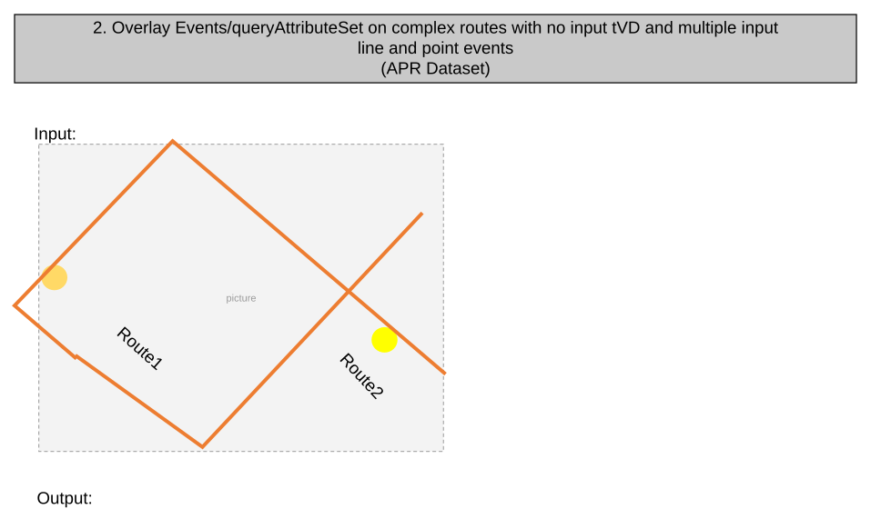

### TC-U24 — Overlay Events / QueryAttributeSet on Vertical Routes with No Input TVD (case 3) <!-- src: S1 · slide 30 · case 3 -->

- **Case:** Overlay Events/queryAttributeSet on vertical routes with no input tVD and multiple spanning and non-spanning input events (APR Dataset)

| Network Name | RouteID | From Date | To Date | Type |
| --- | --- | --- | --- | --- |
| Network1 | Route1 | 1/1/2000 | <Null> | Upstream |
| Network1 | Route2 | 1/1/2000 | <Null> | Midstream |

| Input Layer | Event ID | From Date | To Date | From Measure | To Measure | From RouteID | To RouteID | Attribute [Color1] | Attribute [Color2] |
| --- | --- | --- | --- | --- | --- | --- | --- | --- | --- |
| Red Event | Red1 | 1/1/2000 | <Null> | 0 | 2.5 | Route1 | Route1 | 450 psi | Active |
| Red Event | Red2 | 1/1/2000 | <Null> | 2.5 | 20 | Route1 | Route2 | 500 psi | Proposed |
| Purple Event | Purple1 | 1/1/2000 | <Null> | 2 | N/A | Route1 | N/A | Dent | Active |
| Yellow Event | Yellow1 | 1/1/2000 | <Null> | 17.5 | N/A | Route2 | N/A | 1500 | Active |

| Type | RouteID | From Date | To Date | From Measure | To Measure | Network1. Type | RedEvent . Red1 | RedEvent . Red2 | PurpleEvent . Purple1 | PurpleEvent . Purple2 | YellowEvent . Yellow1 | YellowEvent . Yellow2 |
| --- | --- | --- | --- | --- | --- | --- | --- | --- | --- | --- | --- | --- |
| Line | Route1 | 1/1/2000 | <Null> | 0 | 2 | Upstream | 450 psi | Active | <Null> | <Null> | <Null> | <Null> |
| Line | Route1 | 1/1/2000 | <Null> | 2 | 2 | Upstream | 450 psi | Active | Dent | Active | <Null> | <Null> |
| Point | Route1 | 1/1/2000 | <Null> | 2 | 2.5 | Upstream | 500 psi | Active | <Null> | <Null> | <Null> | <Null> |
| Line | Route1 | 1/1/2000 | <Null> | 2.5 | 5 | Upstream | 500 psi | Active | <Null> | <Null> | <Null> | <Null> |
| Line | Route2 | 1/1/2000 | <Null> | 15 | 17.5 | Midstream | 500 psi | Active | <Null> | <Null> | <Null> | <Null> |
| Point | Route2 | 1/1/2000 | <Null> | 17.5 | 17.5 | Midstream | 500 psi | Active | <Null> | <Null> | 1500 | Active |
| Line | Route2 | 1/1/2000 | <Null> | 17.5 | 20 | Midstream | 500 psi | Active | <Null> | <Null> | <Null> | <Null> |

[figure: Input: · Output: · 0 · 20 · 5 · 15 · Route1 · Route2]

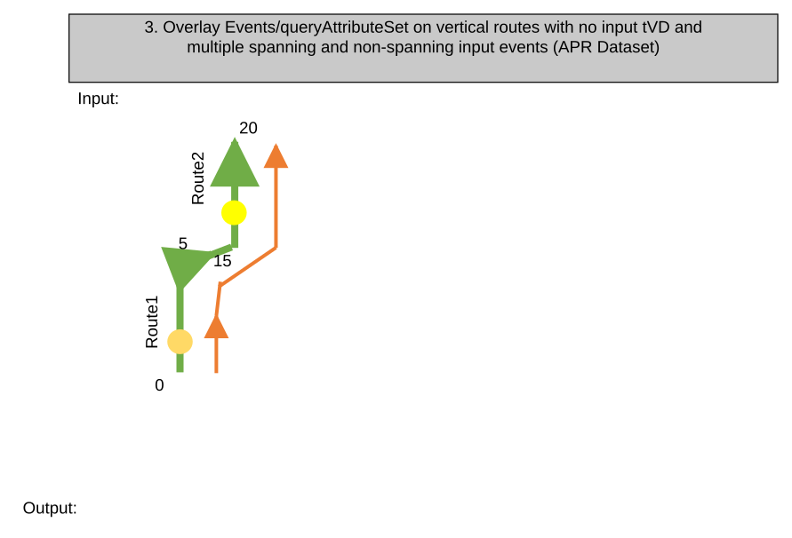

### TC-U25 — Overlay Events / QueryAttributeSet on Simple Routes with No Input TVD and Multiple (case 4) <!-- src: S1 · slide 31 · case 4 -->

- **Case:** Overlay Events/queryAttributeSet on simple routes with no input tVD and multiple input line and point events (APR Dataset)

| Network Name | RouteID | From Date | To Date | PipeType |
| --- | --- | --- | --- | --- |
| Network1 | Route1 | 1/1/2000 | <Null> | Upstream |
| Network1 | Route2 | 1/1/2000 | <Null> | Midstream |

| Input Layer | Event ID | From Date | To Date | From Measure | To Measure | From RouteID | To RouteID | Attribute [Color1] | Attribute [Color2] |
| --- | --- | --- | --- | --- | --- | --- | --- | --- | --- |
| Red Event | Red1 | 1/1/2000 | <Null> | 0 | 15 | Route1 | Route1 | 450 psi | Active |
| Purple Event | Purple1 | 1/1/2000 | <Null> | 2 | N/A | Route1 | N/A | Dent | Active |
| Yellow Event | Yellow1 | 1/1/2000 | <Null> | 14 | N/A | Route2 | N/A | 1500 | Active |

| Type | RouteID | From Date | To Date | From Measure | To Measure | Network1. PipeType | RedEvent . Red1 | RedEvent . Red2 | PurpleEvent . Purple1 | PurpleEvent . Purple2 | YellowEvent . Yellow1 | YellowEvent . Yellow2 |
| --- | --- | --- | --- | --- | --- | --- | --- | --- | --- | --- | --- | --- |
| Line | Route1 | 1/1/2000 | <Null> | 0 | 2 | Upstream | 450 psi | Active | <Null> | <Null> | <Null> | <Null> |
| Point | Route | 1/1/2000 | <Null> | 2 | 2 | Upstream | 450 psi | Active | Dent | Active | <Null> | <Null> |
| Line | Route1 | 1/1/2000 | <Null> | 2 | 5 | Upstream | 450 psi | Proposed | <Null> | <Null> | <Null> | <Null> |
| Line | Route2 | 1/1/2000 | <Null> | 10 | 14 | Midstream | 450 psi | Proposed | <Null> | <Null> | <Null> | <Null> |
| Point | Route2 | 1/1/2000 | <Null> | 14 | 14 | Midstream | 450 psi | Proposed | <Null> | <Null> | 1500 | Active |
| Line | Route2 | 1/1/2000 | <Null> | 14 | 15 | Midstream | 450 psi | Proposed | <Null> | <Null> | <Null> | <Null> |

[figure: Input: · Output: · Route1 · Route2]

### TC-U26 — Overlay Events / QueryAttributeSet on Simple Routes with No Input TVD and Multiple (case 5) <!-- src: S1 · slide 32 · case 5 -->

- **Case:** Overlay Events/queryAttributeSet on simple routes with no input tVD and multiple input line and point events, including point events that overlap (APR Dataset)

| Network Name | RouteID | From Date | To Date | PipeType |
| --- | --- | --- | --- | --- |
| Network1 | Route1 | 1/1/2000 | <Null> | Upstream |
| Network1 | Route2 | 1/1/2000 | <Null> | Midstream |

| Input Layer | Event ID | From Date | To Date | From Measure | To Measure | From RouteID | To RouteID | Attribute [Color1] | Attribute [Color2] |
| --- | --- | --- | --- | --- | --- | --- | --- | --- | --- |
| Red Event | Red1 | 1/1/2000 | <Null> | 2.5 | 12.5 | Route1 | Route2 | 450 psi | Active |
| Purple Event | Purple1 | 1/1/2000 | <Null> | 2 | N/A | Route1 | N/A | Dent | Active |
| Yellow Event | Yellow1 | 1/1/2000 | <Null> | 14 | N/A | Route2 | N/A | 1500 | Active |

| Type | RouteID | From Date | To Date | From Measure | To Measure | Network1. PipeType | RedEvent . Red1 | RedEvent . Red2 | PurpleEvent . Purple1 | PurpleEvent . Purple2 | YellowEvent . Yellow1 | YellowEvent . Yellow2 |
| --- | --- | --- | --- | --- | --- | --- | --- | --- | --- | --- | --- | --- |
| Line | Route1 | 1/1/2000 | <Null> | 0 | 2 | Upstream | <Null> | <Null> | <Null> | <Null> | <Null> | <Null> |
| Point | Route | 1/1/2000 | <Null> | 2 | 2 | Upstream | <Null> | <Null> | Dent | Active | <Null> | <Null> |
| Line | Route1 | 1/1/2000 | <Null> | 2 | 2.5 | Upstream | <Null> | <Null> | <Null> | <Null> | <Null> | <Null> |
| Line | Route1 | 1/1/2000 | <Null> | 2.5 | 5 | Upstream | 450 psi | Active | <Null> | <Null> | <Null> | <Null> |
| Line | Route2 | 1/1/2000 | <Null> | 10 | 12.5 | Midstream | 450 psi | Active | <Null> | <Null> | <Null> | <Null> |
| Line | Route2 | 1/1/2000 | <Null> | 12.5 | 14 | Midstream | <Null> | <Null> | <Null> | <Null> | <Null> | <Null> |
| Point | Route2 | 1/1/2000 | <Null> | 14 | 14 | Midstream | <Null> | <Null> | <Null> | <Null> | 1500 | Active |
| Line | Route2 | 1/1/2000 | <Null> | 14 | 15 | Midstream | <Null> | <Null> | <Null> | <Null> | <Null> | <Null> |

[figure: Input: · Output: · Route1 · Route2]

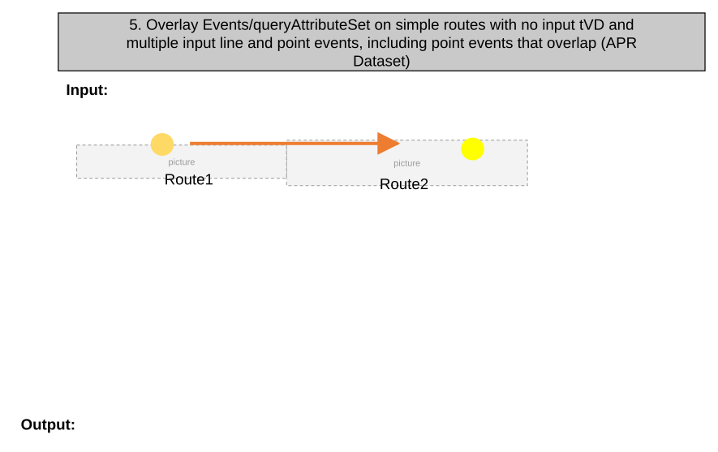

### TC-U27 — Overlay Events / QueryAttributeSet on Gapped Routes with Multiple Input Line <!-- src: S1 · slide 33 · case 6 -->

- **Case:** Overlay Events/queryAttributeSet on gapped routes with multiple input line and point events (APR Dataset)

| Network Name | RouteID | From Date | To Date | Type |
| --- | --- | --- | --- | --- |
| Network1 | Route1 | 1/1/2000 | <Null> | Upstream |
| Network1 | Route2 | 1/1/2000 | <Null> | Midstream |

| Input Layer | Event ID | From Date | To Date | From Measure | To Measure | From RouteID | To RouteID | Attribute [Color1] | Attribute [Color2] |
| --- | --- | --- | --- | --- | --- | --- | --- | --- | --- |
| Red Event | Red1 | 1/1/2000 | <Null> | 4 | 15 | Route1 | Route2 | 450 psi | Active |
| Blue Event | Blue1 | 1/1/2000 | <Null> | 0 | 1 | Route1 | Route1 | Low | Active |
| Green Event | Green1 | 1/1/2000 | <Null> | 0 | 1 | Route1 | Route1 | Complete | Active |
| Green Event | Green2 | 1/1/2000 | <Null> | 4 | 12.5 | Route1 | Route2 | Incomplete | Active |
| Purple Event | Purple1 | 1/1/2000 | <Null> | 0.5 | N/A | Route1 | N/A | Dent | Active |
| Yellow Event | Yellow1 | 1/1/2000 | <Null> | 14 | N/A | Route2 | N/A | 1500 | Active |

| Type | RouteID | From Date | To Date | From Measure | To Measure | Network1. Type | RedEvent . Red1 | RedEvent . Red2 | BlueEvent . Blue1 | BlueEvent . Blue2 | GreenEvent . Green1 | GreenEvent . Green2 | PurpleEvent . Purple1 | PurpleEvent . Purple2 | YellowEvent . Yellow1 | YellowEvent . Yellow2 |
| --- | --- | --- | --- | --- | --- | --- | --- | --- | --- | --- | --- | --- | --- | --- | --- | --- |
| Line | Route1 | 1/1/2000 | <Null> | 0 | 0.5 | Upstream | <Null> | <Null> | Low | Active | Complete | Active | <Null> | <Null> | <Null> | <Null> |
| Point | Route1 | 1/1/2000 | <Null> | 0.5 | 0.5 | Upstream | <Null> | <Null> | Low | Active | Complete | Active | Dent | Active | <Null> | <Null> |
| Line | Route1 | 1/1/2000 | <Null> | 0.5 | 1 | Upstream | <Null> | <Null> | Low | Active | Complete | Active | <Null> | <Null> | <Null> | <Null> |
| Line | Route1 | 1/1/2000 | <Null> | 4 | 5 | Upstream | 450 psi | Active | <Null> | <Null> | Incomplete | Active | <Null> | <Null> | <Null> | <Null> |
| Line | Route2 | 1/1/2000 | <Null> | 10 | 12.5 | Midstream | 450 psi | Active | <Null> | <Null> | Incomplete | Active | <Null> | <Null> | <Null> | <Null> |
| Line | Route2 | 1/1/2000 | <Null> | 12.5 | 14 | Midstream | 450 psi | Active | <Null> | <Null> | <Null> | <Null> | <Null> | <Null> | <Null> | <Null> |
| Point | Route2 | 1/1/2000 | <Null> | 14 | 14 | Midstream | 450 psi | Active | <Null> | <Null> | <Null> | <Null> | <Null> | <Null> | 1500 | Active |
| Line | Route2 | 1/1/2000 | <Null> | 14 | 15 | Midstream | 450 psi | Active | <Null> | <Null> | <Null> | <Null> | <Null> | <Null> | <Null> | <Null> |

[figure: Input: · Output: · Route1 · Route2]

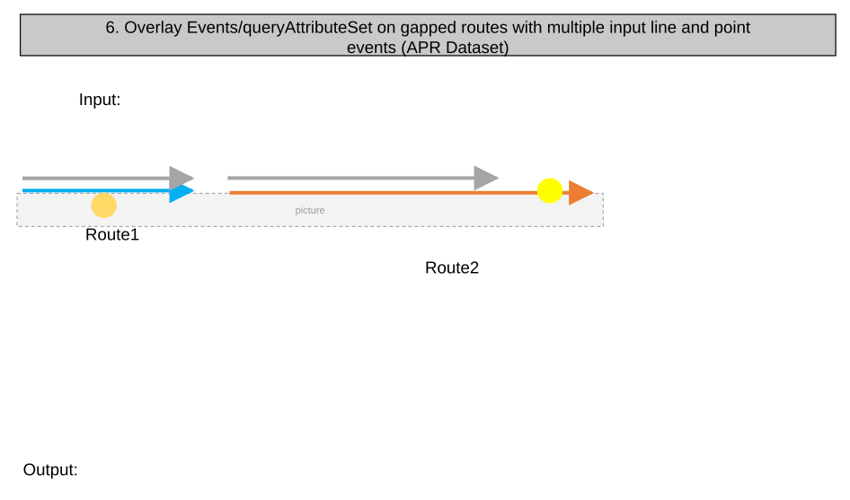

### TC-U28 — Overlay Events / QueryAttributeSet on Simple Routes with No Input TVD and Multiple (case 7) <!-- src: S1 · slide 34 · case 7 -->

- **Case:** Overlay Events/queryAttributeSet on simple routes with no input tVD and multiple input line and point events, with input network as a different LRS Network (APR Dataset)

| Network Name | RouteID | From Date | To Date | Attribute |
| --- | --- | --- | --- | --- |
| Network1 | Route1 | 1/1/2000 | <Null> | Upstream |
| Network1 | Route2 | 1/1/2000 | <Null> | Midstream |
| Network2 | RouteX | 1/1/2000 | <Null> | Public |

| Input Layer | Event ID | From Date | To Date | From Measure | To Measure | From RouteID | To RouteID | Attribute [Color1] | Attribute [Color2] |
| --- | --- | --- | --- | --- | --- | --- | --- | --- | --- |
| Red Event | Red1 | 1/1/2000 | <Null> | 0 mi | 10 mi | Route1 | Route1 | 450 psi | Active |
| Purple Event | Purple1 | 1/1/2000 | <Null> | 2 mi | N/A | Route1 | N/A | Dent | Active |
| Yellow Event | Yellow1 | 1/1/2000 | <Null> | 13 mi | N/A | Route2 | N/A | 1500 | Active |

| Type | RouteID | From Date | To Date | From Measure | To Measure | Network2. Access | RedEvent . Red1 | RedEvent . Red2 | PurpleEvent . Purple1 | PurpleEvent . Purple2 | YellowEvent . Yellow1 | YellowEvent . Yellow2 |
| --- | --- | --- | --- | --- | --- | --- | --- | --- | --- | --- | --- | --- |
| Line | RouteX | 1/1/2000 | <Null> | 0 ft | 10560 ft | Public | 450 psi | Active | <Null> | <Null> | <Null> | <Null> |
| Point | RouteX | 1/1/2000 | <Null> | 10560 ft | 10560 ft | Public | 450 psi | Active | Dent | Active | <Null> | <Null> |
| Line | RouteX | 1/1/2000 | <Null> | 10560 ft | 42240 ft | Public | 450 psi | Proposed | <Null> | <Null> | <Null> | <Null> |
| Point | RouteX | 1/1/2000 | <Null> | 42240 ft | 42240 ft | Public | 450 psi | Proposed | <Null> | <Null> | 1500 | Active |
| Line | RouteX | 1/1/2000 | <Null> | 42240 ft | 52800 ft | Public | 450 psi | Proposed | <Null> | <Null> | <Null> | <Null> |

[figure: Input: · Output: · Route1 · Route2 · RouteX]

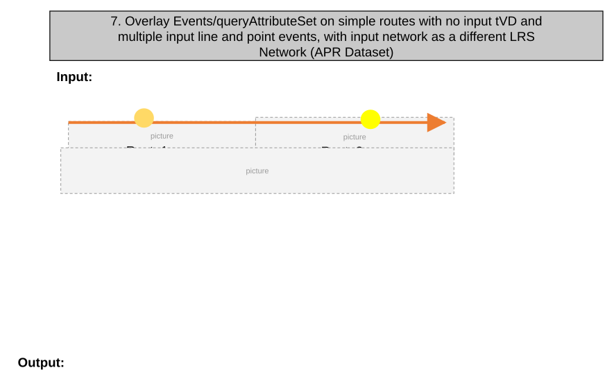

### TC-U29 — Overlay Events / QueryAttributeSet on Routes with Multiple Time Slices of Input <!-- src: S1 · slide 35 · case 8 -->

- **Case:** Overlay Events/queryAttributeSet on routes with multiple time slices of input line and point events (APR Dataset)

| Network Name | Route ID | From Date | To Date | Type |
| --- | --- | --- | --- | --- |
| Network1 | Route1 | 1/1/2000 | <Null> | Upstream |
| Network1 | Route2 | 1/1/2000 | <Null> | Midstream |

| Type | Route ID | From Date | To Date | From Measure | To Measure | Network1. Type | RedEvent . Red1 | RedEvent . Red2 | BlueEvent . Blue1 | BlueEvent . Blue2 | PurpleEvent . Purple1 | PurpleEvent . Purple2 |
| --- | --- | --- | --- | --- | --- | --- | --- | --- | --- | --- | --- | --- |
| Line | Route1 | 1/1/2000 | 1/1/2005 | 0 | 2.5 | Upstream | 450 psi | Retired | Low | Retired | <Null> | <Null> |
| Point | Route1 | 1/1/2000 | 1/1/2005 | 2.5 | 2.5 | Upstream | 450 psi | Retired | Low | Retired | Dent | Retired |
| Line | Route1 | 1/1/2000 | 1/1/2005 | 2.5 | 5 | Upstream | 450 psi | Retired | Low | Retired | <Null> | <Null> |
| Line | Route2 | 1/1/2000 | 1/1/2005 | 10 | 13 | Upstream | 450 psi | Retired | Low | Retired | <Null> | <Null> |
| Line | Route2 | 1/1/2000 | 1/1/2005 | 13 | 15 | Upstream | 450 psi | Retired | <Null> | <Null> | <Null> | <Null> |
| Line | Route1 | 1/1/2005 | 1/1/2010 | 0 | 2.5 | Upstream | 450 psi | Retired | Medium | Active | <Null> | <Null> |
| Point | Route1 | 1/1/2005 | 1/1/2010 | 2.5 | 2.5 | Upstream | 450 psi | Retired | Medium | Active | Corrosion | Active |
| Line | Route1 | 1/1/2005 | 1/1/2010 | 2.5 | 5 | Upstream | 450 psi | Retired | Medium | Active | <Null> | <Null> |
| Line | Route2 | 1/1/2005 | 1/1/2010 | 10 | 15 | Upstream | 500 psi | Retired | Medium | Active | <Null> | <Null> |
| Line | Route1 | 1/1/2010 | <Null> | 0 | 2.5 | Upstream | 450 psi | Active | Medium | Active | <Null> | <Null> |
| Point | Route1 | 1/1/2010 | <Null> | 2.5 | 2.5 | Upstream | 450 psi | Active | Medium | Active | Corrosion | Active |
| Line | Route1 | 1/1/2010 | <Null> | 2.5 | 5 | Upstream | 450 psi | Active | Medium | Active | <Null> | <Null> |
| Line | Route2 | 1/1/2010 | <Null> | 10 | 15 | Upstream | 450 psi | Active | Medium | Active | <Null> | <Null> |

| Input Layer | Event ID | From Date | To Date | From Measure | To Measure | From RouteID | To RouteID | Attribute [Color1] | Attribute [Color2] |
| --- | --- | --- | --- | --- | --- | --- | --- | --- | --- |
| Red Event | Red1 | 1/1/2000 | 1/1/2005 | 0 | 15 | Route1 | Route2 | 450 psi | Retired |
| Red Event | Red1 | 1/1/2005 | 1/1/2010 | 0 | 5 | Route1 | Route1 | 450 psi | Retired |
| Red Event | Red2 | 1/1/2005 | 1/1/2010 | 10 | 15 | Route2 | Route2 | 500 psi | Retired |
| Red Event | Red1 | 1/1/2010 | <Null> | 0 | 15 | Route1 | Route2 | 450 psi | Active |
| Blue Event | Blue1 | 1/1/2000 | 1/1/2005 | 0 | 13 | Route1 | Route2 | Low | Retired |
| Blue Event | Blue2 | 1/1/2005 | <Null> | 0 | 15 | Route1 | Route2 | Medium | Active |
| Purple Event | Purple1 | 1/1/2000 | 1/1/2005 | 2.5 | N/A | Route1 | N/A | Dent | Retired |
| Purple Event | Purple1 | 1/1/2005 | <Null> | 2.5 | N/A | Route1 | N/A | Corrosion | Active |

[figure: Output: · Input: · Route1 · Route2]

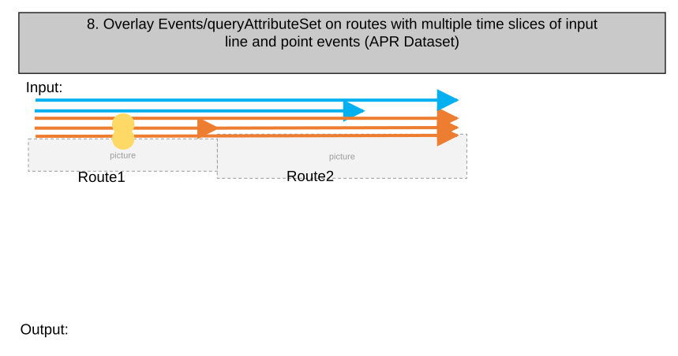

### TC-U30 — Overlay Events / QueryAttributeSet on Simple Routes with No Input TVD and Multiple (case 9) <!-- src: S1 · slide 36 · case 9 -->

- **Case:** Overlay Events/queryAttributeSet on simple routes with no input tVD and multiple input line and point events, with a point event on the cusp of two line events (APR Dataset)

| Network Name | RouteID | From Date | To Date | PipeType |
| --- | --- | --- | --- | --- |
| Network1 | Route1 | 1/1/2000 | <Null> | Upstream |
| Network1 | Route2 | 1/1/2000 | <Null> | Midstream |

Input:

| Input Layer | Event ID | From Date | To Date | From Measure | To Measure | From RouteID | To RouteID | Attribute [Color1] | Attribute [Color2] |
| --- | --- | --- | --- | --- | --- | --- | --- | --- | --- |
| Red Event | Red1 | 1/1/2000 | <Null> | 0 | 2.5 | Route1 | Route1 | 450 psi | Active |
| Red Event | Red2 | 1/1/2000 | <Null> | 2.5 | 15 | Route1 | Route2 | 500 psi | Proposed |
| Purple Event | Purple1 | 1/1/2000 | <Null> | 2 | N/A | Route1 | N/A | Dent | Active |
| Yellow Event | Yellow1 | 1/1/2000 | <Null> | 13 | N/A | Route2 | N/A | 1500 | Active |

Output (higher measure value line event attributes will be used for point):

| Type | RouteID | From Date | To Date | From Measure | To Measure | Network1. PipeType | RedEvent . Red1 | RedEvent . Red2 | PurpleEvent . Purple1 | PurpleEvent . Purple2 | YellowEvent . Yellow1 | YellowEvent . Yellow2 |
| --- | --- | --- | --- | --- | --- | --- | --- | --- | --- | --- | --- | --- |
| Line | Route1 | 1/1/2000 | <Null> | 0 | 2.5 | Upstream | 450 psi | Active | <Null> | <Null> | <Null> | <Null> |
| Point | Route1 | 1/1/2000 | <Null> | 2.5 | 2.5 | Upstream | 500 psi | Proposed | Dent | Active | <Null> | <Null> |
| Line | Route1 | 1/1/2000 | <Null> | 2.5 | 5 | Upstream | 500 psi | Proposed | <Null> | <Null> | <Null> | <Null> |
| Line | Route2 | 1/1/2000 | <Null> | 10 | 13 | Midstream | 500 psi | Proposed | <Null> | <Null> | <Null> | <Null> |
| Point | Route2 | 1/1/2000 | <Null> | 13 | 13 | Midstream | 500 psi | Proposed | <Null> | <Null> | 1500 | Active |
| Line | Route2 | 1/1/2000 | <Null> | 13 | 15 | Midstream | 500 psi | Proposed | <Null> | <Null> | <Null> | <Null> |

Route1
Route2

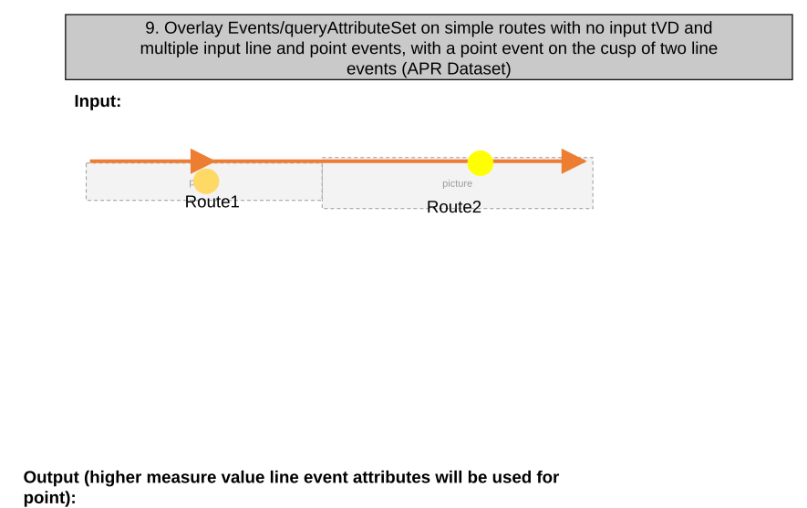

### TC-U31 — Overlay Events / QueryAttributeSet on Simple Routes with No Input TVD and Multiple (case 10) <!-- src: S1 · slide 37 · case 10 -->

- **Case:** Overlay Events/queryAttributeSet on simple routes with no input tVD and multiple input line and point events, with the line events found on a different route (APR Dataset)

| Network Name | RouteID | From Date | To Date | PipeType |
| --- | --- | --- | --- | --- |
| Network1 | Route1 | 1/1/2000 | <Null> | Upstream |
| Network1 | Route2 | 1/1/2000 | <Null> | Midstream |

| Input Layer | Event ID | From Date | To Date | From Measure | To Measure | From RouteID | To RouteID | Attribute [Color1] | Attribute [Color2] |
| --- | --- | --- | --- | --- | --- | --- | --- | --- | --- |
| Red Event | Red1 | 1/1/2000 | <Null> | 0 | 2.5 | RouteX | RouteX | 450 psi | Active |
| Red Event | Red2 | 1/1/2000 | <Null> | 2.5 | 10 | RouteX | RouteY | 500 psi | Proposed |
| Purple Event | Purple1 | 1/1/2000 | <Null> | 2 | N/A | Route1 | N/A | Dent | Active |
| Yellow Event | Yellow1 | 1/1/2000 | <Null> | 13 | N/A | Route2 | N/A | 1500 | Active |

| Type | RouteID | From Date | To Date | From Measure | To Measure | Network1. PipeType | RedEvent . Red1 | RedEvent . Red2 | PurpleEvent . Purple1 | PurpleEvent . Purple2 | YellowEvent . Yellow1 | YellowEvent . Yellow2 |
| --- | --- | --- | --- | --- | --- | --- | --- | --- | --- | --- | --- | --- |
| Line | Route1 | 1/1/2000 | <Null> | 0 | 2 | Upstream | <Null> | <Null> | <Null> | <Null> | <Null> | <Null> |
| Point | Route1 | 1/1/2000 | <Null> | 2 | 2 | Upstream | <Null> | <Null> | Dent | Active | <Null> | <Null> |
| Line | Route1 | 1/1/2000 | <Null> | 2 | 5 | Upstream | <Null> | <Null> | <Null> | <Null> | <Null> | <Null> |
| Line | Route2 | 1/1/2000 | <Null> | 10 | 13 | Midstream | <Null> | <Null> | <Null> | <Null> | <Null> | <Null> |
| Point | Route2 | 1/1/2000 | <Null> | 13 | 13 | Midstream | <Null> | <Null> | <Null> | <Null> | 1500 | Active |
| Line | Route2 | 1/1/2000 | <Null> | 13 | 15 | Midstream | <Null> | <Null> | <Null> | <Null> | <Null> | <Null> |

[figure: Input: · Output: · Route1 · Route2]

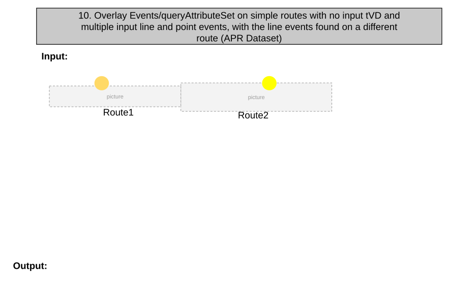

### TC-U32 — Overlay Events / QueryAttributeSet on Simple Routes with No Input TVD and Multiple (case 11) <!-- src: S1 · slide 38 · case 11 -->

- **Case:** Overlay Events/queryAttributeSet on simple routes with no input tVD and multiple input line and point events, with multiple point events at a location (APR Dataset)

| Network Name | RouteID | From Date | To Date | PipeType |
| --- | --- | --- | --- | --- |
| Network1 | Route1 | 1/1/2000 | <Null> | Upstream |
| Network1 | Route2 | 1/1/2000 | <Null> | Midstream |

| Input Layer | Event ID | From Date | To Date | From Measure | To Measure | From RouteID | To RouteID | Attribute [Color1] | Attribute [Color2] |
| --- | --- | --- | --- | --- | --- | --- | --- | --- | --- |
| Red Event | Red1 | 1/1/2000 | <Null> | 0 | 2.5 | Route1 | Route1 | 450 psi | Active |
| Red Event | Red2 | 1/1/2000 | <Null> | 2.5 | 10 | Route1 | Route2 | 500 psi | Proposed |
| Purple Event | Purple1 | 1/1/2000 | <Null> | 2 | N/A | Route1 | N/A | Dent | Active |
| Yellow Event | Yellow1 | 1/1/2000 | <Null> | 8 | N/A | Route2 | N/A | 1500 | Active |
| Yellow Event | Yellow2 | 1/1/2000 | <Null> | 8 | N/A | Route2 | N/A | 1200 | Proposed |

Output (when more than one point event of the same layer exists at a location, an event is randomly chosen):

| Type | RouteID | From Date | To Date | From Measure | To Measure | Network1. PipeType | RedEvent . Red1 | RedEvent . Red2 | PurpleEvent . Purple1 | PurpleEvent . Purple2 | YellowEvent . Yellow1 | YellowEvent . Yellow2 |
| --- | --- | --- | --- | --- | --- | --- | --- | --- | --- | --- | --- | --- |
| Line | Route1 | 1/1/2000 | <Null> | 0 | 2 | Upstream | 450 psi | Active | <Null> | <Null> | <Null> | <Null> |
| Point | Route | 1/1/2000 | <Null> | 2 | 2 | Upstream | 450psi | Active | Dent | Active | <Null> | <Null> |
| Line | Route1 | 1/1/2000 | <Null> | 2 | 2.5 | Upstream | 450psi | Active | <Null> | <Null> | <Null> | <Null> |
| Line | Route1 | 1/1/2000 | <Null> | 2.5 | 5 | Upstream | 500 psi | Proposed | <Null> | <Null> | <Null> | <Null> |
| Line | Route2 | 1/1/2000 | <Null> | 5 | 8 | Midstream | 500 psi | Proposed | <Null> | <Null> | <Null> | <Null> |
| Point | Route2 | 1/1/2000 | <Null> | 8 | 8 | Midstream | 500 psi | Proposed | <Null> | <Null> | 1500 | Active |
| Line | Route2 | 1/1/2000 | <Null> | 8 | 10 | Midstream | 500 psi | Proposed | <Null> | <Null> | <Null> | <Null> |

[figure: 0 · 10 · Input: · 5 · Route1 · Route2]

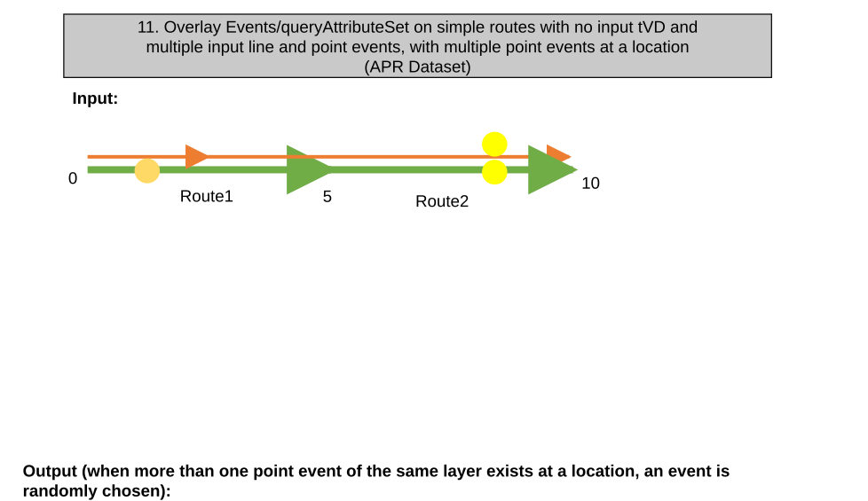

### TC-U33 — Overlay Events / QueryAttributeSet on Simple Routes with No Input TVD and Multiple (case 12) <!-- src: S1 · slide 39 · case 12 -->

- **Case:** Overlay Events/queryAttributeSet on simple routes with no input tVD and multiple input line and point events, with point events on start/end of each route(APR Dataset)

| Network Name | RouteID | From Date | To Date | PipeType |
| --- | --- | --- | --- | --- |
| Network1 | Route1 | 1/1/2000 | <Null> | Upstream |
| Network1 | Route2 | 1/1/2000 | <Null> | Midstream |

| Input Layer | Event ID | From Date | To Date | From Measure | To Measure | From RouteID | To RouteID | Attribute [Color1] | Attribute [Color2] |
| --- | --- | --- | --- | --- | --- | --- | --- | --- | --- |
| Red Event | Red1 | 1/1/2000 | <Null> | 0 | 2.5 | Route1 | Route1 | 450 psi | Active |
| Red Event | Red2 | 1/1/2000 | <Null> | 2.5 | 15 | Route1 | Route2 | 500 psi | Proposed |
| Purple Event | Purple1 | 1/1/2000 | <Null> | 0 | N/A | Route1 | N/A | Dent | Active |
| Purple Event | Purple2 | 1/1/2000 | <Null> | 5 | N/A | Route1 | N/A | Dent | Active |
| Yellow Event | Yellow1 | 1/1/2000 | <Null> | 10 | N/A | Route2 | N/A | 1500 | Active |
| Yellow Event | Yellow2 | 1/1/2000 | <Null> | 15 | N/A | Route2 | N/A | 1500 | Active |

| Type | RouteID | From Date | To Date | From Measure | To Measure | Network1. PipeType | RedEvent . Red1 | RedEvent . Red2 | PurpleEvent . Purple1 | PurpleEvent . Purple2 | YellowEvent . Yellow1 | YellowEvent . Yellow2 |
| --- | --- | --- | --- | --- | --- | --- | --- | --- | --- | --- | --- | --- |
| Point | Route1 | 1/1/2000 | <Null> | 0 | 0 | Upstream | 450 psi | Active | Dent | Active | <Null> | <Null> |
| Line | Route1 | 1/1/2000 | <Null> | 0 | 2.5 | Upstream | 450 psi | Active | <Null> | <Null> | <Null> | <Null> |
| Line | Route1 | 1/1/2000 | <Null> | 2.5 | 5 | Upstream | 450 psi | Active | Dent | Active | <Null> | <Null> |
| Point | Route1 | 1/1/2000 | <Null> | 5 | 5 | Upstream | 450 psi | Active | <Null> | <Null> | <Null> | <Null> |
| Point | Route2 | 1/1/2000 | <Null> | 10 | 10 | Midstream | 450 psi | Active | <Null> | <Null> | 1500 | Active |
| Line | Route2 | 1/1/2000 | <Null> | 10 | 15 | Midstream | 450 psi | Active | <Null> | <Null> | <Null> | <Null> |
| Point | Route2 | 1/1/2000 | <Null> | 15 | 15 | Midstream | 450 psi | Active | <Null> | <Null> | 1500 | Active |

[figure: Input: · Output: · Route1 · Route2]

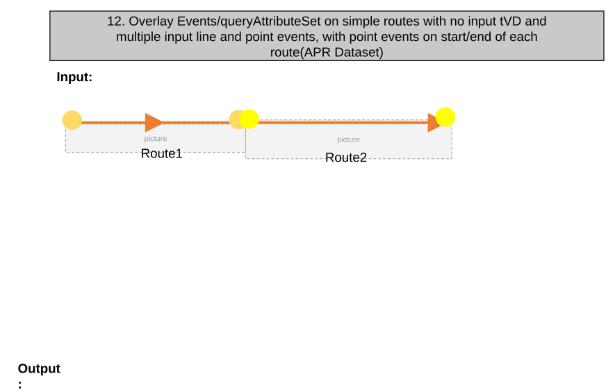

### TC-U34 — Overlay Events / QueryAttributeSet on Simple Routes with No Input TVD and Multiple (case 13) <!-- src: S1 · slide 40 · case 13 -->

- **Case:** Overlay Events/queryAttributeSet on simple routes with no input tVD and multiple input line and point events, with overlapping point events that are part of different layers (APR Dataset)

| Network Name | RouteID | From Date | To Date | PipeType |
| --- | --- | --- | --- | --- |
| Network1 | Route1 | 1/1/2000 | <Null> | Upstream |
| Network1 | Route2 | 1/1/2000 | <Null> | Midstream |

| Input Layer | Event ID | From Date | To Date | From Measure | To Measure | From RouteID | To RouteID | Attribute [Color1] | Attribute [Color2] |
| --- | --- | --- | --- | --- | --- | --- | --- | --- | --- |
| Red Event | Red1 | 1/1/2000 | <Null> | 0 | 15 | Route1 | Route1 | 450 psi | Active |
| Purple Event | Purple1 | 1/1/2000 | <Null> | 2 | N/A | Route1 | N/A | Dent | Active |
| Purple Event | Purple2 | 1/1/2000 | <Null> | 2 | N/A | Route1 | N/A | Dent | Active |
| Yellow Event | Yellow1 | 1/1/2000 | <Null> | 14 | N/A | Route1 | N/A | 1500 | Active |
| Yellow Event | Yellow2 | 1/1/2000 | <Null> | 14 | N/A | Route1 | N/A | 1500 | Active |

| Type | RouteID | From Date | To Date | From Measure | To Measure | Network1. PipeType | RedEvent . Red1 | RedEvent . Red2 | PurpleEvent . Purple1 | PurpleEvent . Purple2 | YellowEvent . Yellow1 | YellowEvent . Yellow2 |
| --- | --- | --- | --- | --- | --- | --- | --- | --- | --- | --- | --- | --- |
| Line | Route1 | 1/1/2000 | <Null> | 0 | 2 | Upstream | 450 psi | Active | <Null> | <Null> | <Null> | <Null> |
| Point | Route | 1/1/2000 | <Null> | 2 | 2 | Upstream | 450 psi | Active | Dent | Active | 1500 | Active |
| Line | Route1 | 1/1/2000 | <Null> | 2 | 5 | Upstream | 450 psi | Proposed | <Null> | <Null> | <Null> | <Null> |
| Line | Route2 | 1/1/2000 | <Null> | 10 | 14 | Midstream | 450 psi | Proposed | <Null> | <Null> | <Null> | <Null> |
| Point | Route2 | 1/1/2000 | <Null> | 14 | 14 | Midstream | 450 psi | Proposed | Dent | Active | 1500 | Active |
| Line | Route2 | 1/1/2000 | <Null> | 14 | 15 | Midstream | 450 psi | Proposed | <Null> | <Null> | <Null> | <Null> |

[figure: Input: · Output: · Route1 · Route2]

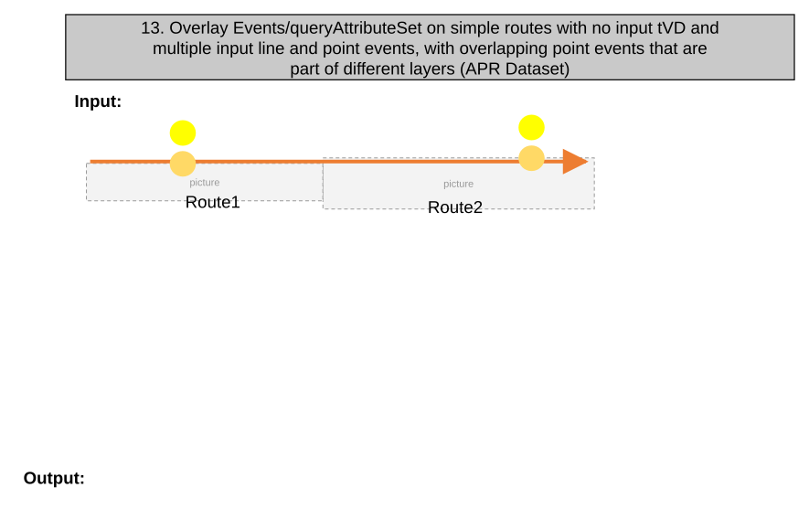

### TC-U35 — Overlay Events / QueryAttributeSet on Simple Routes with No Input TVD and Multiple (case 14) <!-- src: S1 · slide 41 · case 14 -->

- **Case:** Overlay Events/queryAttributeSet on simple routes with no input tVD and multiple input line and point events, with point events on cusp of line events (APR Dataset)

| Network Name | RouteID | From Date | To Date | PipeType |
| --- | --- | --- | --- | --- |
| Network1 | Route1 | 1/1/2000 | <Null> | Upstream |
| Network1 | Route2 | 1/1/2000 | <Null> | Midstream |

| Input Layer | Event ID | From Date | To Date | From Measure | To Measure | From RouteID | To RouteID | Attribute [Color1] | Attribute [Color2] |
| --- | --- | --- | --- | --- | --- | --- | --- | --- | --- |
| Red Event | Red1 | 1/1/2000 | <Null> | 2.5 | 12.5 | Route1 | Route2 | 450 psi | Active |
| Purple Event | Purple1 | 1/1/2000 | <Null> | 2.5 | N/A | Route1 | N/A | Dent | Active |
| Yellow Event | Yellow1 | 1/1/2000 | <Null> | 12.5 | N/A | Route2 | N/A | 1500 | Active |

| Type | RouteID | From Date | To Date | From Measure | To Measure | Network1. PipeType | RedEvent . Red1 | RedEvent . Red2 | PurpleEvent . Purple1 | PurpleEvent . Purple2 | YellowEvent . Yellow1 | YellowEvent . Yellow2 |
| --- | --- | --- | --- | --- | --- | --- | --- | --- | --- | --- | --- | --- |
| Line | Route1 | 1/1/2000 | <Null> | 0 | 2.5 | Upstream | <Null> | <Null> | <Null> | <Null> | <Null> | <Null> |
| Point | Route1 | 1/1/2000 | <Null> | 2.5 | 2.5 | Upstream | 450 psi | Active | Dent | Active | <Null> | <Null> |
| Line | Route1 | 1/1/2000 | <Null> | 2.5 | 5 | Upstream | 450 psi | Active | <Null> | <Null> | <Null> | <Null> |
| Line | Route2 | 1/1/2000 | <Null> | 10 | 12.5 | Midstream | 450 psi | Active | <Null> | <Null> | <Null> | <Null> |
| Point | Route2 | 1/1/2000 | <Null> | 12.5 | 12.5 | Midstream | 450 psi | Active | <Null> | <Null> | 1500 | Active |
| Line | Route2 | 1/1/2000 | <Null> | 12.5 | 15 | Midstream | <Null> | <Null> | <Null> | <Null> | <Null> | <Null> |

[figure: Input: · Output: · Route1 · Route2]

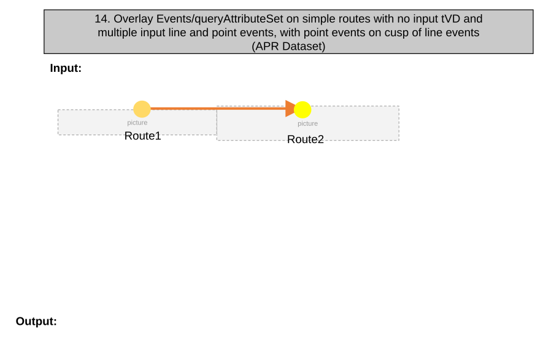

### TC-U36 — Overlay Events / QueryAttributeSet on Simple Routes with No Input TVD and Multiple (case 15) <!-- src: S1 · slide 42 · case 15 -->

- **Case:** Overlay Events/queryAttributeSet on simple routes with no input tVD and multiple input line and point events, with a selection set on the Yellow event layer (APR Dataset)

| Network Name | RouteID | From Date | To Date | PipeType |
| --- | --- | --- | --- | --- |
| Network1 | Route1 | 1/1/2000 | <Null> | Upstream |
| Network1 | Route2 | 1/1/2000 | <Null> | Midstream |

| Input Layer | Event ID | From Date | To Date | From Measure | To Measure | From RouteID | To RouteID | Attribute [Color1] | Attribute [Color2] |
| --- | --- | --- | --- | --- | --- | --- | --- | --- | --- |
| Red Event | Red1 | 1/1/2000 | <Null> | 0 | 2.5 | Route1 | Route1 | 450 psi | Active |
| Red Event | Red2 | 1/1/2000 | <Null> | 2.5 | 15 | Route1 | Route2 | 500 psi | Proposed |
| Purple Event | Purple1 | 1/1/2000 | <Null> | 2 | N/A | Route1 | N/A | Dent | Active |
| Yellow Event | Yellow1 | 1/1/2000 | <Null> | 14 | N/A | Route2 | N/A | 1500 | Active |
| Yellow Event | Yellow2 | 1/1/2000 | <Null> | 0 | N/A | Route1 | N/A | 1600 | Active |
| Yellow Event | Yellow3 | 1/1/2000 | <Null> | 4 | N/A | Route1 | N/A | 1700 | Active |
| Yellow Event | Yellow4 | 1/1/2000 | <Null> | 11 | N/A | Route2 | N/A | 1400 | Active |
| Yellow Event | Yellow5 | 1/1/2000 | <Null> | 15 | N/A | Route2 | N/A | 1300 | Active |

| Type | RouteID | From Date | To Date | From Measure | To Measure | Network1. PipeType | RedEvent . Red1 | RedEvent . Red2 | PurpleEvent . Purple1 | PurpleEvent . Purple2 | YellowEvent . Yellow1 | YellowEvent . Yellow2 |
| --- | --- | --- | --- | --- | --- | --- | --- | --- | --- | --- | --- | --- |
| Line | Route1 | 1/1/2000 | <Null> | 0 | 2 | Upstream | 450 psi | Active | <Null> | <Null> | <Null> | <Null> |
| Point | Route | 1/1/2000 | <Null> | 2 | 2 | Upstream | 450psi | Active | Dent | Active | <Null> | <Null> |
| Line | Route1 | 1/1/2000 | <Null> | 2 | 2.5 | Upstream | 450psi | Active | <Null> | <Null> | <Null> | <Null> |
| Line | Route1 | 1/1/2000 | <Null> | 2.5 | 5 | Upstream | 500 psi | Proposed | <Null> | <Null> | <Null> | <Null> |
| Line | Route2 | 1/1/2000 | <Null> | 10 | 14 | Midstream | 500 psi | Proposed | <Null> | <Null> | <Null> | <Null> |
| Point | Route2 | 1/1/2000 | <Null> | 14 | 14 | Midstream | 500 psi | Proposed | <Null> | <Null> | 1500 | Active |
| Line | Route2 | 1/1/2000 | <Null> | 14 | 15 | Midstream | 500 psi | Proposed | <Null> | <Null> | <Null> | <Null> |

[figure: Input: · Output: · Route1 · Route2]

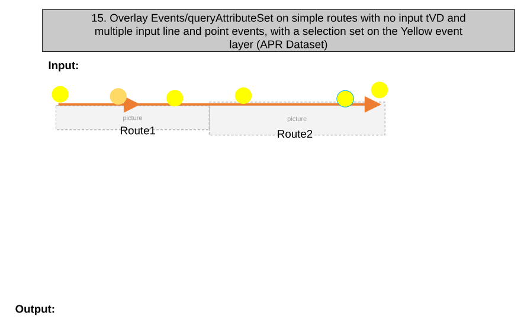

## Other content

### Slide 13 <!-- slide 13 -->

6A. Overlay Events/queryAttributeSet on route with multiple gaps and with input line and point events\
(RH Dataset)

| Network Name | RouteID | From Date | To Date | Type |
| --- | --- | --- | --- | --- |
| Network1 | Route1 | 1/1/2000 | <Null> | Interstate |

| Input Layer | Event ID | From Date | To Date | From Measure | To Measure | Attribute [Color1] | Attribute [Color2] |
| --- | --- | --- | --- | --- | --- | --- | --- |
| Red Event | Red1 | 1/1/2000 | <Null> | 0 | 2 | Adams | Active |
| Red Event | Red2 | 1/1/2000 | <Null> | 3 | 4 | Laporte | Active |
| Red Event | Red3 | 1/1/2000 | <Null> | 5 | 7 | Adams | Active |
| Red Event | Red4 | 1/1/2000 | <Null> | 8 | 10 | Laporte | Active |
| Purple Event | Purple1 | 1/1/2000 | <Null> | 0 | N/A | Yield | Active |
| Purple Event | Purple2 | 1/1/2000 | <Null> | 2 | N/A | Yield | Active |
| Purple Event | Purple3 | 1/1/2000 | <Null> | 3 | N/A | Yield | Active |
| Purple Event | Purple4 | 1/1/2000 | <Null> | 4 | N/A | Yield | Active |
| Purple Event | Purple5 | 1/1/2000 | <Null> | 5 | N/A | Yield | Active |
| Purple Event | Purple6 | 1/1/2000 | <Null> | 7 | N/A | Yield | Active |
| Purple Event | Purple7 | 1/1/2000 | <Null> | 8 | N/A | Yield | Active |
| Purple Event | Purple8 | 1/1/2000 | <Null> | 10 | N/A | Yield | Active |

| Type | RouteID | From Date | To Date | From Measure | To Measure | Network1. Type | RedEvent . Red1 | RedEvent . Red2 | PurpleEvent . Purple1 | PurpleEvent . Purple2 |
| --- | --- | --- | --- | --- | --- | --- | --- | --- | --- | --- |
| Point | Route1 | 1/1/2000 | <Null> | 0 | 0 | Interstate | Adams | Active | Yield | Active |
| Line | Route1 | 1/1/2000 | <Null> | 0 | 2 | Interstate | Adams | Active | <Null> | <Null> |
| Point | Route1 | 1/1/2000 | <Null> | 2 | 2 | Interstate | Adams | Active | Yield | Active |
| Point | Route1 | 1/1/2000 | <Null> | 3 | 3 | Interstate | Adams | Active | Yield | Active |
| Line | Route1 | 1/1/2000 | <Null> | 3 | 4 | Interstate | Adams | Active | <Null> | <Null> |
| Point | Route1 | 1/1/2000 | <Null> | 4 | 4 | Interstate | Adams | Active | Yield | Active |
| Point | Route1 | 1/1/2000 | <Null> | 5 | 5 | Interstate | Adams | Active | Yield | Active |
| Line | Route1 | 1/1/2000 | <Null> | 5 | 7 | Interstate | Adams | Active | <Null> | <Null> |
| Point | Route1 | 1/1/2000 | <Null> | 7 | 7 | Interstate | Adams | Active | Yield | Active |
| Point | Route1 | 1/1/2000 | <Null> | 8 | 8 | Interstate | Adams | Active | Yield | Active |
| Line | Route1 | 1/1/2000 | <Null> | 8 | 10 | Interstate | Adams | Active | <Null> | <Null> |
| Point | Route1 | 1/1/2000 | <Null> | 10 | 10 | Interstate | Adams | Active | Yield | Active |

[figure: Input: · Route1 · Output:]

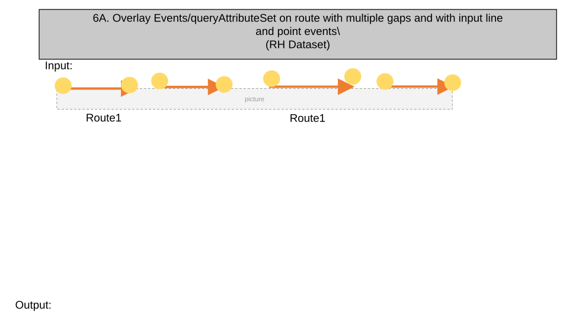

### Slide 15 <!-- slide 15 -->

7A. Overlay Events/queryAttributeSet on gapped route with multiple input line and point events that belong to a different LRS Network, with measure translation occurring between the networks (RH Dataset)

| Network Name | RouteID | From Date | To Date | Attribute |
| --- | --- | --- | --- | --- |
| Network1 | Route1 | 1/1/2000 | <Null> | Interstate |
| Network2 | RouteA | 1/1/2000 | <Null> | County |

| Input Layer | Event ID | From Date | To Date | From Measure | To Measure | Attribute [Color1] | Attribute [Color2] |
| --- | --- | --- | --- | --- | --- | --- | --- |
| Red Event | Red2 | 1/1/2000 | <Null> | 0 mi | 10 mi | Adams | Active |
| Purple Event | Purple1 | 1/1/2000 | <Null> | 2 mi | N/A | Yield | Active |
| Yellow Event | Yellow1 | 1/1/2000 | <Null> | 8 mi | N/A | Private | Proposed |

| Type | RouteID | From Date | To Date | From Measure | To Measure | Network1. Type | RedEvent . Red1 | RedEvent . Red2 | PurpleEvent. Purple1 | PurpleEvent . Purple2 | YellowEvent . Yellow1 | YellowEvent . Yellow2 |
| --- | --- | --- | --- | --- | --- | --- | --- | --- | --- | --- | --- | --- |
| Line | RouteA | 1/1/2000 | <Null> | 0 ft | 10560 ft | County | Adams | Active | <Null> | <Null> | <Null> | <Null> |
| Point | RouteA | 1/1/2000 | <Null> | 10560 ft | 10560 ft | County | Adams | Active | Yield | Active | <Null> | <Null> |
| Line | RouteA | 1/1/2000 | <Null> | 10560 ft | 15840 ft | County | Adams | Active | <Null> | <Null> | <Null> | <Null> |
| Point | RouteA | 1/1/2000 | <Null> | 31680 ft | 42240 ft | County | Adams | Active | <Null> | <Null> | Private | Proposed |
| Line | RouteA | 1/1/2000 | <Null> | 42240 ft | 52800 ft | County | Adams | Active | <Null> | <Null> | <Null> | <Null> |

[figure: Input: · Output: · Route1 · RouteA]

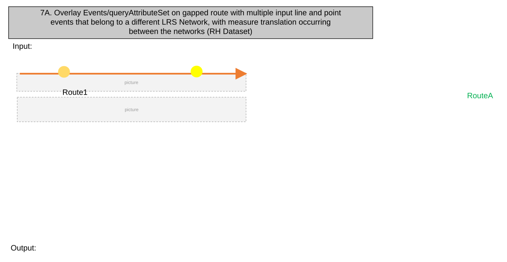

### Slide 16 <!-- slide 16 -->

7B. Overlay Events/queryAttributeSet on gapped routes with input line and point events that belong to a different network. Each network has a different gap calibration (RH Dataset)

| Network Name | RouteID | From Date | To Date | Type |
| --- | --- | --- | --- | --- |
| Network1 | Route1 | 1/1/2000 | <Null> | Interstate |
| Network2 | RouteA | 1/1/2000 | <Null> | County |

| Input Layer | Event ID | From Date | To Date | From Measure | To Measure | Attribute [Color1] | Attribute [Color2] |
| --- | --- | --- | --- | --- | --- | --- | --- |
| Red Event | Red1 | 1/1/2000 | <Null> | 0 | 4 | Adams | Active |
| Red Event | Red2 | 1/1/2000 | <Null> | 6 | 10 | Laporte | Active |
| Purple Event | Purple1 | 1/1/2000 | <Null> | 2 | N/A | Yield | Active |
| Yellow Event | Yellow1 | 1/1/2000 | <Null> | 8 | N/A | Private | Proposed |

| Type | RouteID | From Date | To Date | From Measure | To Measure | Network1. Type | RedEvent . Red1 | RedEvent . Red2 | PurpleEvent . Purple1 | PurpleEvent . Purple2 | YellowEvent . Yellow1 | YellowEvent . Yellow2 |
| --- | --- | --- | --- | --- | --- | --- | --- | --- | --- | --- | --- | --- |
| Line | Route1 | 1/1/2000 | <Null> | 0 | 2 | Interstate | Adams | Active | <Null> | <Null> | <Null> | <Null> |
| Point | Route1 | 1/1/2000 | <Null> | 2 | 2 | Interstate | Adams | Active | Yield | Active | <Null> | <Null> |
| Line | Route1 | 1/1/2000 | <Null> | 2 | 4 | Interstate | Adams | Active | <Null> | <Null> | <Null> | <Null> |
| Line | Route1 | 1/1/2000 | <Null> | 4.1 | 6.1 | Interstate | Laporte | Active | <Null> | <Null> | <Null> | <Null> |
| Point | Route1 | 1/1/2000 | <Null> | 6.1 | 8.1 | Interstate | Laporte | Active | <Null> | <Null> | Private | Proposed |
| Line | Route1 | 1/1/2000 | <Null> | 8.1 | 10.1 | Interstate | Laporte | Active | <Null> | <Null> | <Null> | <Null> |

[figure: Input: · Route1 · Output: · 4.1 · .1]

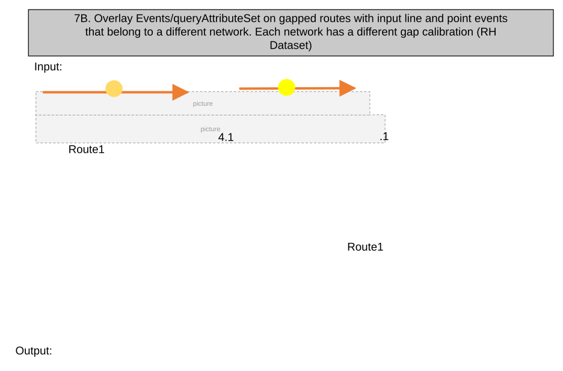

### Slide 17 <!-- slide 17 -->

7C. Overlay Events/queryAttributeSet on routes with multiple input gapped line and point events that belong to a different LRS Network, with measure translation occurring between the networks (RH Dataset)

| Network Name | RouteID | From Date | To Date | Attribute |
| --- | --- | --- | --- | --- |
| Network1 | Route1 | 1/1/2000 | <Null> | Interstate |
| Network2 | RouteA | 1/1/2000 | <Null> | County |

| Input Layer | Event ID | From Date | To Date | From Measure | To Measure | Attribute [Color1] | Attribute [Color2] |
| --- | --- | --- | --- | --- | --- | --- | --- |
| Red Event | Red2 | 1/1/2000 | <Null> | 0 mi | 3 mi | Adams | Active |
| Red Event | Red3 | 1/1/2000 | <Null> | 7 mi | 10 mi | Laporte | Active |
| Purple Event | Purple1 | 1/1/2000 | <Null> | 2 mi | N/A | Yield | Active |
| Yellow Event | Yellow1 | 1/1/2000 | <Null> | 8 mi | N/A | Private | Proposed |

| Type | RouteID | From Date | To Date | From Measure | To Measure | Network1. Type | RedEvent . Red1 | RedEvent . Red2 | PurpleEvent. Purple1 | PurpleEvent . Purple2 | YellowEvent . Yellow1 | YellowEvent . Yellow2 |
| --- | --- | --- | --- | --- | --- | --- | --- | --- | --- | --- | --- | --- |
| Line | RouteA | 1/1/2000 | <Null> | 0 ft | 10560 ft | County | Adams | Active | <Null> | <Null> | <Null> | <Null> |
| Point | RouteA | 1/1/2000 | <Null> | 10560 ft | 10560 ft | County | Adams | Active | Yield | Active | <Null> | <Null> |
| Line | RouteA | 1/1/2000 | <Null> | 10560 ft | 15840 ft | County | Adams | Active | <Null> | <Null> | <Null> | <Null> |
| Line | RouteA | 1/1/2000 | <Null> | 15840 ft | 36960 ft | County | <Null> | <Null> | <Null> | <Null> | <Null> | <Null> |
| Point | RouteA | 1/1/2000 | <Null> | 42240 ft | 42240 ft | County | Adams | Active | <Null> | <Null> | Private | Proposed |
| Line | RouteA | 1/1/2000 | <Null> | 42240 ft | 52800 ft | County | Adams | Active | <Null> | <Null> | <Null> | <Null> |

[figure: Input: · Output: · Route1 · RouteA]

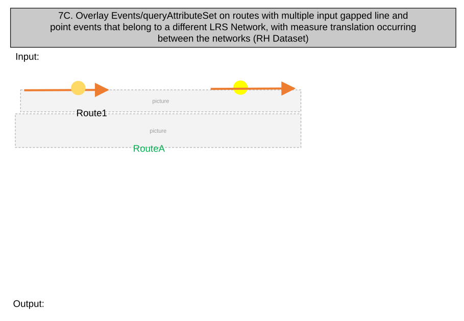

### Slide 19 <!-- slide 19 -->

8A. Overlay Events/queryAttributeSet on routes with multiple line and point events with multiple time slices, with different LRS Network as input
(RH Dataset)

| Network Name | Route ID | From Date | To Date | Attribute |
| --- | --- | --- | --- | --- |
| Network1 | Route1 | 1/1/2000 | <Null> | Interstate |
| Network2 | RouteA | 1/1/2000 | <Null> | County |

| Input Layer | Event ID | From Date | To Date | From Measure | To Measure | Attribute [Color1] | Attribute [Color2] |
| --- | --- | --- | --- | --- | --- | --- | --- |
| Red Event | Red1 | 1/1/2000 | 1/1/2005 | 0 mi | 10 mi | Adams | Retired |
| Red Event | Red1 | 1/1/2005 | 1/1/2010 | 0 mi | 5 mi | Adams | Retired |
| Red Event | Red2 | 1/1/2005 | 1/1/2010 | 5 mi | 10 mi | Laporte | Retired |
| Red Event | Red1 | 1/1/2010 | <Null> | 0 mi | 10 mi | Adams | Active |
| Blue Event | Blue1 | 1/1/2000 | 1/1/2005 | 0 mi | 8 mi | Full Access | Retired |
| Blue Event | Blue2 | 1/1/2005 | <Null> | 0 mi | 10 mi | No Access | Active |
| Purple Event | Purple1 | 1/1/2000 | 1/1/2005 | 2 mi | N/A | Yield | Retired |
| Purple Event | Purple1 | 1/1/2005 | <Null> | 2 mi | N/A | Stop | Active |

| Type | Route ID | FromDate | ToDate | FromMeasure | ToMeasure | Network1.Type | RedEvent.Red1 | RedEvent.Red2 | BlueEvent.Blue1 | BlueEvent.Blue2 | PurpleEvent.Purple1 | PurpleEvent.Purple2 |
| --- | --- | --- | --- | --- | --- | --- | --- | --- | --- | --- | --- | --- |
| Line | RouteA | 1/1/2000 | 1/1/2005 | 0 ft | 10560 ft | County | Adams | Retired | Full Access | Retired | <Null> | <Null> |
| Point | RouteA | 1/1/2000 | 1/1/2005 | 10560 ft | 10560 ft | County | Adams | Retired | Full Access | Retired | Yield | Retired |
| Line | RouteA | 1/1/2000 | 1/1/2005 | 10560 ft | 42240 ft | County | Adams | Retired | Full Access | Retired | <Null> | <Null> |
| Line | RouteA | 1/1/2000 | 1/1/2005 | 42240 ft | 52800 ft | County | Adams | Retired | <Null> | <Null> | <Null> | <Null> |
| Line | RouteA | 1/1/2005 | 1/1/2010 | 0 ft | 10560 ft | County | Adams | Retired | No Access | Active | <Null> | <Null> |
| Point | RouteA | 1/1/2005 | 1/1/2010 | 10560 ft | 10560 ft | County | Adams | Retired | No Access | Active | Stop | Active |
| Line | RouteA | 1/1/2005 | 1/1/2010 | 10560 ft | 26400 ft | County | Adams | Retired | No Access | Active | <Null> | <Null> |
| Line | RouteA | 1/1/2005 | 1/1/2010 | 26400 ft | 52800 ft | County | Laporte | Retired | No Access | Active | <Null> | <Null> |
| Line | RouteA | 1/1/2010 | <Null> | 0 ft | 10560 ft | County | Adams | Active | No Access | Active | <Null> | <Null> |
| Point | RouteA | 1/1/2010 | <Null> | 10560 ft | 10560 ft | County | Adams | Active | No Access | Active | Stop | Active |
| Line | RouteA | 1/1/2010 | <Null> | 10560 ft | 52800 ft | County | Adams | Active | No Access | Active | <Null> | <Null> |

[figure: Input: · Route1 · Output: · RouteA]

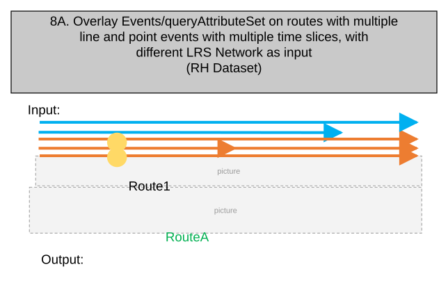
