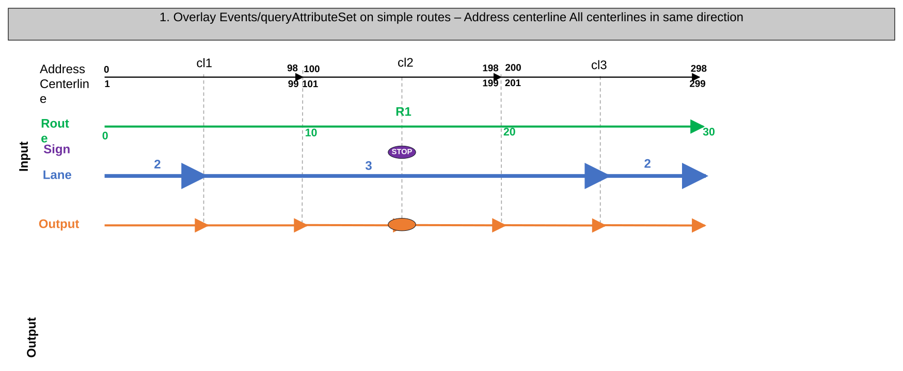
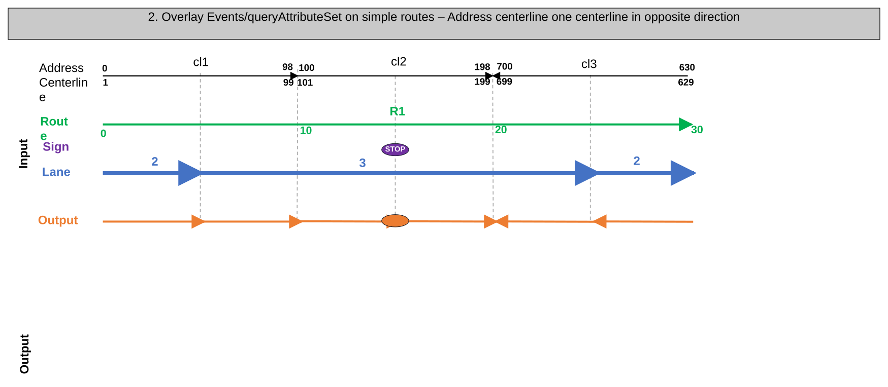
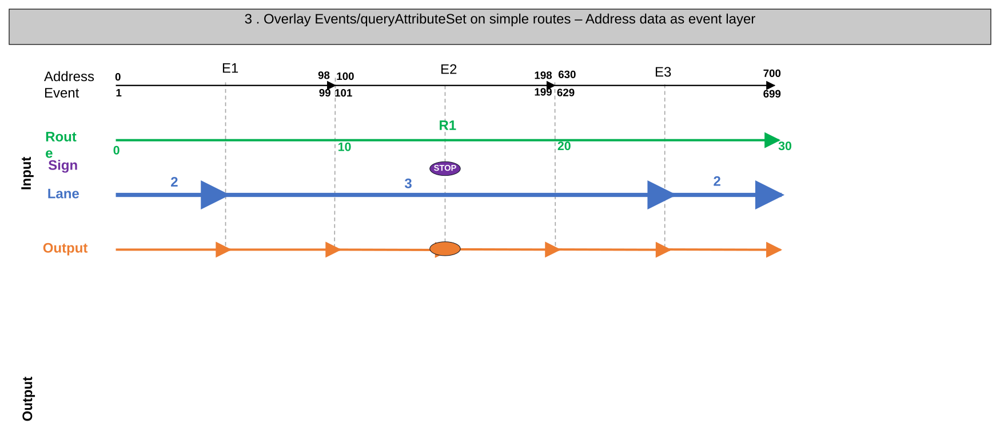
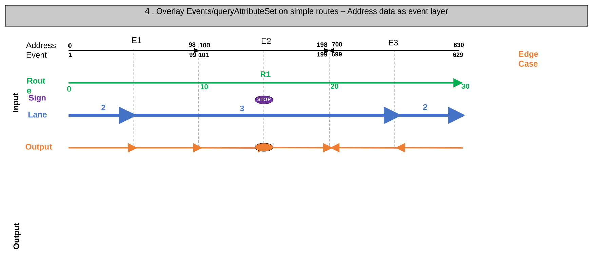
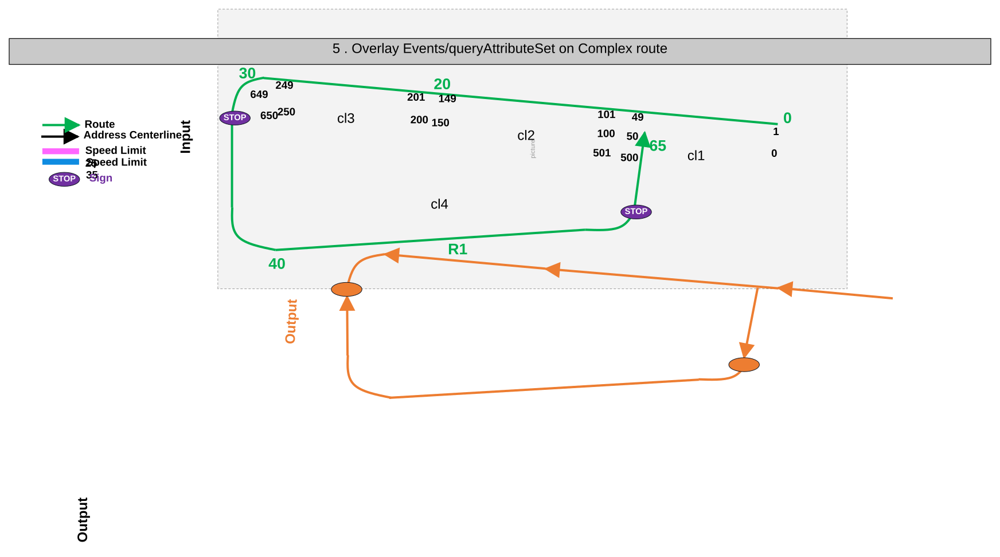
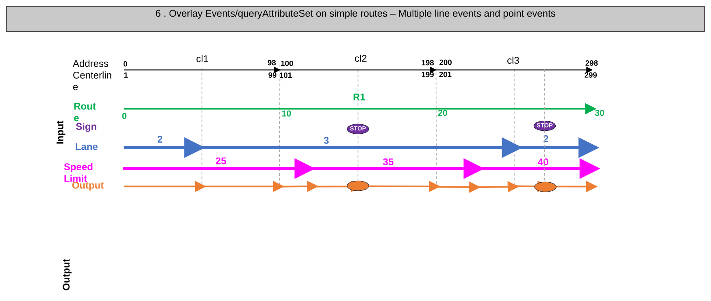
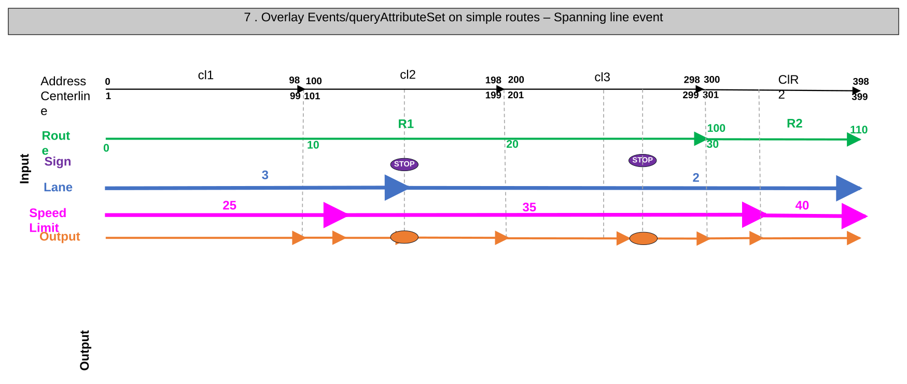
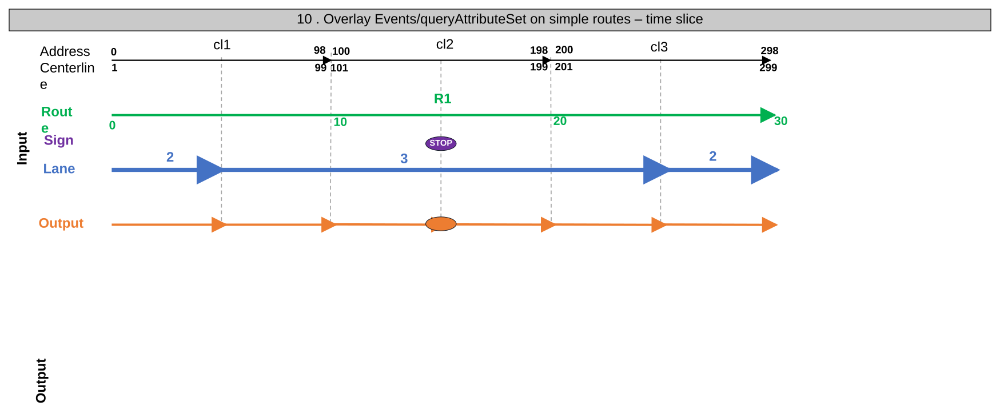

# Update Address Range Information as Part of Segmentation in Overlay Events & Query Attribute Sets – Test Plan

| Field | Value |
| --- | --- |
| **Doc** | 320 · Test Plan · Pro |
| **Product** | — |
| **Release** | — |
| **Issues** | [ArcGISPro/ps-location-referencing#5537](https://devtopia.esri.com/ArcGISPro/ps-location-referencing/issues/5537) |
| **Source** | [AddressingOverlayEvents_Testplan.pptx](<https://esriis.sharepoint.com/sites/LocationReferencing/Shared%20Documents/General/Test%20Plans/AddressingOverlayEvents_Testplan.pptx>) |
| **People** | author Lakshmi Ananthanarayanan · PE Lakshmi · dev Dan |
| **Edited** | 2024-08-29 20:44 by Lakshmi Ananthanarayanan |
| **Extracted** | 2026-09-04 · lane xmlstrip · format 3.0 · prompt v2.0.2 |
| **Keywords** | address range · segmentation · overlay events · query attribute set · line event · point event · address centerline · test plan |
| **Tools** | Overlay Events · Query Attribute Set |

## Summary

Test plan for verifying address range updates during segmentation in overlay events and query attribute sets. Includes tests with file geodatabases, enterprise geodatabases, and direct connect, covering point and line events, simple and complex routes, and time slice scenarios. Validation focuses on address range fields updating correctly in overlay events geoprocessing tool and query attribute set REST endpoint.

## Related documents

<!-- related:begin -->
- [Update Address Range Information in Overlay Events and Query Attribute Sets](<https://esriis.sharepoint.com/sites/lrsworkspace/LRS Doc Index/User Stories/5537-update-address-range-information-in-overlay-events-and-query.md>) — shared issue ArcGISPro/ps-location-referencing#5537 · similar text 0.45 · 6 title words · 2 filename words · same surface <!-- rel:344 s=1007.044 -->
- [Update Address Range via Address Points in Overlay Events and Query Attribute Sets](<https://esriis.sharepoint.com/sites/lrsworkspace/LRS%20Doc%20Index/User%20Stories/update-address-range-via-address-points-in-overlay-events.md>) — similar text 0.41 · 6 title words · 2 filename words · same surface <!-- rel:294 s=5.917 -->
- [Overlay Events/queryAttributeSet: Update Address Range info via Address Points](<https://esriis.sharepoint.com/sites/lrsworkspace/LRS Doc Index/Test Plans/6178-overlay-events-queryattributeset-update-address-range-info.md>) — similar text 0.36 · 4 title words · 1 filename word · same kind/surface/folder <!-- rel:257 s=5.482 -->
- [Consider Point Events in Query Attribute Set and Overlay Events](<https://esriis.sharepoint.com/sites/lrsworkspace/LRS Doc Index/User Stories/consider-point-events-in-query-attribute-set-and-overlay.md>) — similar text 0.20 · 4 title words · 2 filename words · same surface <!-- rel:392 s=4.27 -->
- [REST/GP: Consider Centerline Direction in Query Attribute Set/Overlay Events](<https://esriis.sharepoint.com/sites/lrsworkspace/LRS Doc Index/User Stories/rest-gp-consider-centerline-direction-in-query-attribute-set.md>) — similar text 0.30 · 4 title words · 2 filename words · same surface <!-- rel:436 s=4.261 -->
<!-- related:end -->

<!-- docs:begin -->
## Esri documentation

[Apply dynamic segmentation](https://doc.esri.com/en/arcgis-pro/latest/help/production/location-referencing-pipelines/apply-dynamic-segmentation.html)

_No page matched:_ [Overlay Events](https://www.google.com/search?q=%22Overlay%20Events%22+site%3Adoc.esri.com) · [Query Attribute Set](https://www.google.com/search?q=%22Query%20Attribute%20Set%22+site%3Adoc.esri.com)
<!-- docs:end -->

---

## Overview

### Slide 1 — Update Address Range information as part of segmentation in Overlay Events & Query Attribute Sets – Test Plan <!-- slide 1 -->

https://devtopia.esri.com/ArcGISPro/ps-location-referencing/issues/5537

PE: Lakshmi
Dev: Dan

### Slide 2 <!-- slide 2 -->

- Test with fs, fgdb, and direct connect egdb
- Test with the address layer with block range fields that is configured as the LRS Centerline, as well as an LRS event
- Test with point and line events
- Sanity check if an event layer has block range fields but it’s not configured as part of ADM-LR, the block range fields do not update

Verification
For the line event records , verify the range fields for each segment in the output gets updated(Left From; Left To; Right From; Right To)
For the point event record in the output, populate null for 4 Address range fields
Verify both overlay Events GP tool and Query Attribute Set REST endpoint

## Test Cases

### TC-U01 — Overlay Events / QueryAttributeSet on Simple Routes (case 1) <!-- src: S1 · slide 3 · case 1 -->

- **Case:** Overlay Events/queryAttributeSet on simple routes – Address centerline All centerlines in same direction

| CL ID | From M | To M | Left From | Left To | Parity Left | Right From | Right To | Parity Right | RID | # Lanes | Sign Type |
| --- | --- | --- | --- | --- | --- | --- | --- | --- | --- | --- | --- |
| 1 | 0 | 5 | 0 | 48 | Even | 1 | 49 | Odd | R1 | 2 | null |
| 1 | 5 | 10 | 50 | 98 | Even | 51 | 99 | Odd | R1 | 3 | null |
| 2 | 10 | 15 | 100 | 148 | Even | 101 | 149 | Odd | R1 | 3 | null |
| 2 | 15 | 15 | null | null | Even | null | null | Odd | R1 | 3 | Stop |
| 2 | 15 | 20 | 150 | 198 | Even | 151 | 199 | Odd | R1 | 3 | null |
| 3 | 20 | 25 | 200 | 248 | Even | 201 | 249 | Odd | R1 | 3 | null |
| 3 | 25 | 30 | 250 | 298 | Even | 251 | 299 | Odd | R1 | 2 | null |

[figure: Output · 30 · Address Centerline · cl1 · cl2 · cl3 · Input · 0 · 20 · 10 · Route · STOP · Lane · Sign · 98 · 1 · 99 · 100 · 198 · 101 · 199–201 · 299 · 298 · R1 · …]

### TC-U02 — Overlay Events / QueryAttributeSet on Simple Routes (case 2) <!-- src: S1 · slide 4 · case 2 -->

- **Case:** Overlay Events/queryAttributeSet on simple routes – Address centerline one centerline in opposite direction

| CL ID | From M | To M | Left From | Left To | Parity Left | Right From | Right To | Parity Right | RID | # Lanes | Sign Type |
| --- | --- | --- | --- | --- | --- | --- | --- | --- | --- | --- | --- |
| 1 | 0 | 5 | 0 | 48 | Even | 1 | 49 | Odd | R1 | 2 | null |
| 1 | 5 | 10 | 50 | 98 | Even | 51 | 99 | Odd | R1 | 3 | null |
| 2 | 10 | 15 | 100 | 148 | Even | 101 | 149 | Odd | R1 | 3 | null |
| 2 | 15 | 15 | null | null | Even | null | null | Odd | R1 | 3 | Stop |
| 2 | 15 | 20 | 150 | 198 | Even | 151 | 199 | Odd | R1 | 3 | null |
| 3 | 25 | 20 | 629 | 649 | Odd | 630 | 648 | Even | R1 | 3 | null |
| 3 | 30 | 25 | 651 | 699 | Odd | 650 | 700 | Even | R1 | 2 | null |

[figure: 30 · Address Centerline · cl1 · cl2 · cl3 · Input · 0 · 20 · 10 · Route · STOP · Output · Lane · Sign · 98 · 1 · 99 · 100 · 198 · 101 · 199 · 700 · 699 · 629 · …]

### TC-U03 — Overlay Events / QueryAttributeSet on Simple Routes – Address Data as Event Layer (case 3) <!-- src: S1 · slide 5 · case 3 -->

| Event ID | From M | To M | Left From | Left To | Parity Left | Right From | Right To | Parity Right | RID | # Lanes | Sign Type |
| --- | --- | --- | --- | --- | --- | --- | --- | --- | --- | --- | --- |
| E1 | 0 | 5 | 0 | 48 | Even | 1 | 49 | Odd | R1 | 2 | null |
| E1 | 5 | 10 | 50 | 98 | Even | 51 | 99 | Odd | R1 | 3 | null |
| E2 | 10 | 15 | 100 | 148 | Even | 101 | 149 | Odd | R1 | 3 | null |
| E2 | 15 | 15 | null | null | Even | null | null | Odd | R1 | 3 | Stop |
| E2 | 15 | 20 | 150 | 198 | Even | 151 | 199 | Odd | R1 | 3 | null |
| E3 | 20 | 25 | 630 | 648 | Even | 629 | 649 | Odd | R1 | 3 | null |
| E3 | 25 | 30 | 650 | 700 | Even | 651 | 699 | Odd | R1 | 2 | null |

[figure: 30 · Address Event · E1 · E2 · E3 · Input · 0 · 20 · 10 · Route · STOP · Output · Lane · Sign · 98 · 1 · 99 · 100 · 198 · 101 · 199 · 700 · 699 · 629 · …]

### TC-U04 — Overlay Events / QueryAttributeSet on Simple Routes – Address Data as Event Layer (case 4) <!-- src: S1 · slide 6 · case 4 -->

| Event ID | From M | To M | Left From | Left To | Parity Left | Right From | Right To | Parity Right | RID | # Lanes | Sign Type |
| --- | --- | --- | --- | --- | --- | --- | --- | --- | --- | --- | --- |
| E1 | 0 | 5 | 0 | 48 | Even | 1 | 49 | Odd | R1 | 2 | null |
| E1 | 5 | 10 | 50 | 98 | Even | 51 | 99 | Odd | R1 | 3 | null |
| E2 | 10 | 15 | 100 | 148 | Even | 101 | 149 | Odd | R1 | 3 | null |
| E2 | 15 | 15 | null | null | Even | null | null | Odd | R1 | 3 | Stop |
| E2 | 15 | 20 | 150 | 198 | Even | 151 | 199 | Odd | R1 | 3 | null |
| E3 | 25 | 20 | 629 | 649 | Odd | 630 | 648 | Even | R1 | 3 | null |
| E3 | 30 | 25 | 651 | 699 | Odd | 251 | 299 | Even | R1 | 2 | null |

[figure: 30 · Address Event · E1 · E2 · E3 · Input · 0 · 20 · 10 · Route · STOP · Output · Lane · Sign · 98 · 1 · 99 · 100 · 198 · 101 · 199 · 700 · 699 · 629 · …]

### TC-U05 — Overlay Events/queryAttributeSet on Complex route <!-- src: S2 · slide 7 · case 5 -->

| CL ID | From M | To M | Left From | Left To | Parity Left | Right From | Right To | Parity Right | RID | Speed | Sign Type |
| --- | --- | --- | --- | --- | --- | --- | --- | --- | --- | --- | --- |
| Cl1 | 0 | 10 | 0 | 48 | Even | 1 | 49 | Odd | R1 | 25 | null |
| Cl2 | 10 | 20 | 100 | 150 | Even | 101 | 149 | Odd | R1 | 25 | null |
| Cl3 | 20 | 30 | 200 | 250 | Even | 201 | 249 | Odd | R1 | 25 | null |
| Cl4 | 32 | 30 | 647 | 649 | Odd | 648 | 650 | Even | R1 | 35 | null |
| Cl4 | 32 | 32 | Null | Null | Odd | Null | Null | Even | R1 | 35 | stop |
| Cl4 | 62 | 32 | 511 | 645 | Odd | 510 | 646 | Even | R1 | 35 | null |
| Cl4 | 62 | 62 | Null | Null | Odd | Null | Null | Even | R1 | 35 | Stop |
| Cl4 | 65 | 62 | 501 | 509 | Odd | 500 | 508 | Even | R1 | 35 | null |

[figure: 40 · Input · 0 · 20 · R1 · 50 · STOP · 65 · 1 · 49 · 100 · 150 · 101 · 149 · 200 · 250 · 201 · 249 · 500 · 650 · 649 · 501 · Output · 30 · …]

### TC-U06 — Overlay Events / QueryAttributeSet on Simple Routes (case 6) <!-- src: S1 · slide 8 · case 6 -->

- **Case:** Overlay Events/queryAttributeSet on simple routes – Multiple line events and point events

| CL ID | From M | To M | Left From | Left To | Parity Left | Right From | Right To | Parity Right | RID | # Lanes | Speed | Sign Type |
| --- | --- | --- | --- | --- | --- | --- | --- | --- | --- | --- | --- | --- |
| cl1 | 0 | 5 | 0 | 48 | Even | 1 | 49 | Odd | R1 | 2 | 25 | null |
| cl1 | 5 | 10 | 50 | 98 | Even | 51 | 99 | Odd | R1 | 3 | 25 | null |
| cl2 | 10 | 12 | 100 | 118 | Even | 101 | 119 | Odd | R1 | 3 | 25 | null |
| cl2 | 12 | 15 | 120 | 148 | Even | 121 | 147 | Odd | R1 | 3 | 35 | null |
| cl2 | 15 | 15 | null | null | Even | null | null | Odd | R1 | 3 | 35 | Stop |
| cl2 | 15 | 20 | 150 | 198 | Even | 151 | 199 | Odd | R1 | 3 | 35 | null |
| cl3 | 20 | 22 | 200 | 218 | Even | 201 | 219 | Odd | R1 | 3 | 35 | null |
| cl3 | 22 | 25 | 220 | 248 | Even | 221 | 249 | Odd | R1 | 3 | 40 | null |
| cl3 | 25 | 27 | 250 | 258 | Even | 251 | 259 | Odd | R1 | 2 | 40 | null |
| cl3 | 27 | 27 | Null | Null | Even | Null | Null | Odd | R1 | 2 | 40 | Stop |
| cl3 | 27 | 30 | 260 | 298 | Even | 261 | 299 | Odd | R1 | 2 | 40 | null |

[figure: 30 · Address Centerline · cl1 · cl2 · cl3 · Input · 0 · 20 · 10 · Route · STOP · Output · Lane · Sign · 98 · 1 · 99 · 100 · 198 · 101 · 199–201 · 299 · 298 · R1 · …]

### TC-U07 — Overlay Events/queryAttributeSet on simple routes – Spanning line event <!-- src: S2 · slide 9 · case 7 -->

| CL ID | From M | To M | Left From | Left To | Parity Left | Right From | Right To | Parity Right | RID | # Lanes | Speed | Sign Type |
| --- | --- | --- | --- | --- | --- | --- | --- | --- | --- | --- | --- | --- |
| Cl1 | 0 | 10 | 0 | 98 | Even | 1 | 99 | Odd | R1 | 3 | 25 | Null |
| Cl2 | 10 | 12 | 100 | 118 | Even | 101 | 119 | Odd | R1 | 3 | 25 | Null |
| Cl2 | 12 | 15 | 120 | 148 | Even | 121 | 147 | Odd | R1 | 3 | 35 | Null |
| Cl2 | 15 | 15 | null | null | Even | null | null | Odd | R1 | 3 | 35 | Stop |
| Cl2 | 15 | 20 | 150 | 198 | Even | 151 | 199 | Odd | R1 | 2 | 35 | Null |
| Cl3 | 20 | 27 | 200 | 258 | Even | 201 | 259 | Odd | R1 | 2 | 35 | Null |
| Cl3 | 27 | 27 | Null | Null | Even | Null | Null | Odd | R1 | 2 | 35 | Stop |
| Cl3 | 27 | 30 | 260 | 298 | Even | 261 | 299 | Odd | R1 | 2 | 40 | Null |
| ClR2 | 100 | 102 | 300 | 318 | Even | 301 | 319 | Odd | R1 | 2 | 35 | Null |
| ClR2 | 102 | 110 | 320 | 398 | Even | 321 | 399 | Odd | R1 | 2 | 35 | Null |

[figure: 30 · Address Centerline · cl1 · cl2 · cl3 · Input · 0 · 20 · 10 · Route · STOP · Output · Lane · Sign · 98 · 1 · 99 · 100 · 198 · 101 · 199–201 · 299 · 298 · R1 · …]

### TC-U08 — Overlay Events/queryAttributeSet on simple routes – time slice <!-- src: S2 · slide 10 · case 10 -->

|  | From Date | To Date |
| --- | --- | --- |
| Route | 1/1/2000 | Null |
| Sign | 1/1/2005 | Null |
| Lane | 1/1/2010 | Null |

| From Date | To Date | CL ID | From M | To M | Left From | Left To | Parity Left | Right From | Right To | Parity Right | RID | # Lanes | Sign Type |
| --- | --- | --- | --- | --- | --- | --- | --- | --- | --- | --- | --- | --- | --- |
| 1/1/2000 | 1/1/2005 | cl1 | 0 | 10 | 0 | 98 | Even | 1 | 99 | Odd | R1 | Null | Null |
| 1/1/2000 | 1/1/2005 | cl2 | 10 | 20 | 100 | 198 | Even | 101 | 199 | Odd | R1 | Null | Null |
| 1/1/2000 | 1/1/2005 | cl3 | 20 | 30 | 200 | 298 | Even | 201 | 299 | Odd | R1 | Null | Null |
| 1/1/2005 | 1/1/2010 | cl1 | 0 | 10 | 0 | 98 | Even | 1 | 99 | Odd | R1 | Null | Null |
| 1/1/2005 | 1/1/2010 | cl2 | 10 | 15 | 100 | 148 | Even | 101 | 149 | Odd | R1 | Null | Null |
| 1/1/2005 | 1/1/2010 | cl2 | 15 | 15 | Null | Null | Even | Null | Null | Odd | R1 | Null | Stop |
| 1/1/2005 | 1/1/2010 | cl2 | 15 | 20 | 150 | 198 | Even | 151 | 199 | Odd | R1 | Null | Null |
| 1/1/2005 | 1/1/2010 | cl3 | 20 | 30 | 200 | 298 | Even | 201 | 299 | Odd | R1 | Null | Null |
| 1/1/2010 | Null | cl1 | 0 | 5 | 0 | 48 | Even | 1 | 49 | Odd | R1 | 2 | Null |
| 1/1/2010 | Null | cl1 | 5 | 10 | 50 | 98 | Even | 51 | 99 | Odd | R1 | 3 | Null |
| 1/1/2010 | Null | cl2 | 10 | 15 | 100 | 148 | Even | 101 | 149 | Odd | R1 | 3 | Null |
| 1/1/2010 | Null | cl2 | 15 | 15 | null | null | Even | null | null | Odd | R1 | 3 | Stop |
| 1/1/2010 | Null | cl2 | 15 | 20 | 150 | 198 | Even | 151 | 199 | Odd | R1 | 3 | Null |
| 1/1/2010 | Null | cl3 | 20 | 25 | 200 | 248 | Even | 201 | 249 | Odd | R1 | 3 | Null |
| 1/1/2010 | Null | cl3 | 25 | 30 | 250 | 298 | Even | 251 | 299 | Odd | R1 | 2 | Null |

[figure: 30 · Address Centerline · cl1 · cl2 · cl3 · Input · 0 · 20 · 10 · Route · STOP · Output · Lane · Sign · 98 · 1 · 99 · 100 · 198 · 101 · 199–201 · 299 · 298 · R1 · …]

