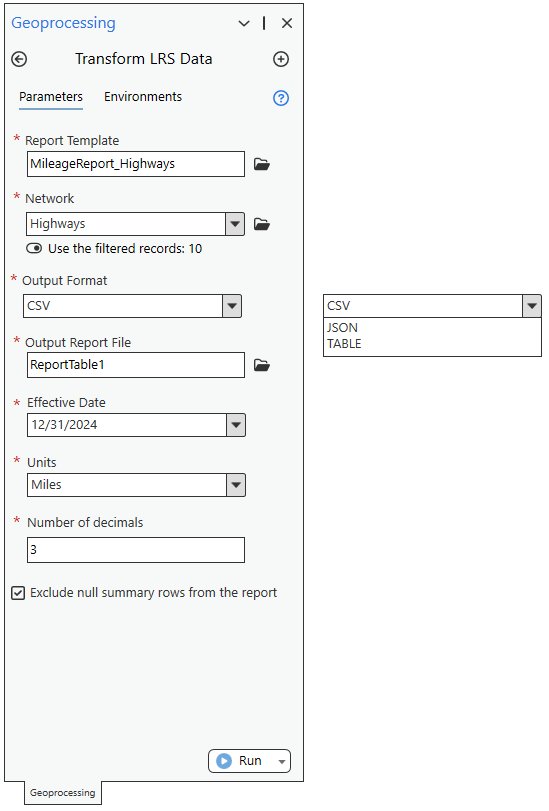

# Transform LRS Data GP tool – Test Plan

| Field | Value |
| --- | --- |
| **Doc** | 372 · Test Plan · Pro |
| **Product** | — |
| **Release** | — |
| **Issues** | [ArcGISPro/ps-location-referencing#5742](https://devtopia.esri.com/ArcGISPro/ps-location-referencing/issues/5742) |
| **Source** | [TransformReportingDataGP_Testplan.pptx](<https://esriis.sharepoint.com/sites/LocationReferencing/Shared%20Documents/General/Test%20Plans/TransformReportingDataGP_Testplan.pptx>) |
| **People** | author Lakshmi Ananthanarayanan · PE Claire · dev Michael |
| **Edited** | 2024-05-16 23:02 by Claire Wang |
| **Extracted** | 2026-09-04 · lane xmlstrip · format 3.0 · prompt v2.0.2 |
| **Keywords** | mileage report · geoprocessing · route selection · calibration · gapped routes · complex shapes · unit conversion · error handling |
| **Tools** | Transform LRS Data |

## Summary

Test plan for the Transform LRS Data geoprocessing tool that accepts configuration and routes as input and returns a mileage report in CSV format. Covers UI verification, functionality verification including support for various route types and units, error handling, and extensive positive and negative test cases. Includes tests for different database types, route complexities, calibration rules, and cancellation behavior.

## Related documents

<!-- related:begin -->
- [Transform LRS Data GP tool: Summarize by polygon boundaries – Test Plan](<https://esriis.sharepoint.com/sites/lrsworkspace/LRS Doc Index/Test Plans/5744-transform-lrs-data-gp-summarize-by-polygon-boundaries.md>) — similar text 0.35 · 2 title words · 3 filename words · same kind/surface/dev/folder <!-- rel:359 s=7.616 -->
- [Generate a route Log including spanning events and centerline – Test Plan](<https://esriis.sharepoint.com/sites/lrsworkspace/LRS Doc Index/Test Plans/6240-generate-a-route-log-including-spanning-events.md>) — similar text 0.09 · 1 filename word · same kind/surface/pe/dev/folder <!-- rel:255 s=5.785 -->
- [Generate a Route Log using the GLRSDP GP Tool – Test Plan](<https://esriis.sharepoint.com/sites/lrsworkspace/LRS Doc Index/Test Plans/6209-generate-a-route-log-using-the-glrsdp-gp.md>) — similar text 0.18 · 1 title word · 1 filename word · same kind/surface/dev/folder <!-- rel:260 s=4.965 -->
- [Support table output with the length product template – Test Plan](<https://esriis.sharepoint.com/sites/lrsworkspace/LRS Doc Index/Test Plans/6458-support-table-output-with-the-length-product-template.md>) — similar text 0.22 · 1 filename word · same kind/surface/pe/dev <!-- rel:232 s=4.234 -->
- [Support multiple summary fields in LRS Data Template wizard – Test Plan](<https://esriis.sharepoint.com/sites/lrsworkspace/LRS Doc Index/Test Plans/5770-support-multiple-summary-fields-in-lrs-data-template-wizard.md>) — similar text 0.23 · 1 filename word · same kind/surface/pe/folder <!-- rel:323 s=3.668 -->
<!-- related:end -->

<!-- docs:begin -->
## Esri documentation

[Complex shapes](https://doc.esri.com/en/arcgis-pro/latest/help/production/location-referencing-pipelines/complex-shapes.html)

_No page matched:_ [Transform LRS Data](https://www.google.com/search?q=%22Transform%20LRS%20Data%22+site%3Adoc.esri.com)
<!-- docs:end -->

---

## Overview

### Slide 1 — Transform LRS Data GP tool – Test Plan *Data prepared with real data <!-- slide 1 -->

https://devtopia.esri.com/ArcGISPro/ps-location-referencing/issues/5742

PE: Claire
Dev: Michael

## Test Cases

### TC-U01 — GP tool <!-- src: S5 · slide 2 · label GP tool -->

**Steps:**
1. Add a GP tool Transform LRS Data that accepts configuration and routes as input and returns a mileage report in table format
2. GP tool should be added in regular Location Referencing toolbox
3. Needs location referencing license to use tool

### TC-N01 — A required field is missing upon clicking Run <!-- src: S3 · slide 5 · table · 1 -->

- **ID:** 1
- **Expected Result:** Error

### TC-N02 — User provides a report template that is incorrect / does not exist <!-- src: S3 · slide 5 · table · 2 -->

- **ID:** 2
- **Case:** User provides a report template that is incorrect / does not exist (one error or 2 different errors)
- **Expected Result:** Error

### TC-N03 — User provides a non- LRSnetwork in network <!-- src: S3 · slide 5 · table · 3 -->

- **ID:** 3
- **Expected Result:** Error

### TC-N04 — User provides an invalid output name if there is any restriction on this in Pro <!-- src: S3 · slide 5 · table · 4 -->

- **ID:** 4
- **Expected Result:** Error

### TC-N05 — User provides an output file name that already exists <!-- src: S3 · slide 5 · table · row 5 -->

- **Expected Result:** Warning. Overwrite existing file

### TC-N06 — User provides a negative number of decimals <!-- src: S3 · slide 5 · table · 5 -->

- **ID:** 5
- **Expected Result:** Error

### TC-N07 — User provides abc for decimals <!-- src: S3 · slide 5 · table · 6 -->

- **ID:** 6
- **Expected Result:** Error

### TC-N08 — User provides more than 7 decimals – put in design <!-- src: S3 · slide 5 · table · 6b -->

- **ID:** 6b
- **Expected Result:** Error

### TC-N09 — Tool is cancelled after hitting run <!-- src: S3 · slide 5 · table · 7 -->

- **ID:** 7
- **Expected Result:** Error and output depends on the stage of cancel

### TC-N10 — User does not have LR license <!-- src: S3 · slide 5 · table · 8 -->

- **ID:** 8
- **Expected Result:** Tool does not open

### TC-N11 — User provides incorrect format for these fields (this can happen in python) <!-- src: S3 · slide 5 · table · 9 -->

- **ID:** 9
- **Expected Result:** Error

### TC-N12 — User provide incorrect file type we don’t support yet in python <!-- src: S3 · slide 5 · table · 10 -->

- **ID:** 10
- **Expected Result:** Error

### TC-N13 — Simple route 0-1.3810116 <!-- src: S3 · slide 6 · table · 1 (Simple1) -->

- **ID:** 1 (Simple1)
- **Expected Result:** 1.3810116 mi

### TC-N14 — Gapped route Euclidean Distance 0.23- 0.5633576; 0.7366332-1.2819481 <!-- src: S3 · slide 6 · table · 2 (SimpleGap1) -->

- **ID:** 2 (SimpleGap1)
- **Expected Result:** 0.8786725 mi

### TC-N15 — Multiple gapped route Stepping Increment of 0 1000-1399.834 1399.834-1985.418 <!-- src: S3 · slide 6 · table · 3 (Stepping2Gap1) on same line as 6 -->

- **ID:** 3 (Stepping2Gap1) on same line as 6
- **Case:** Multiple gapped route Stepping Increment of 0 1000-1399.834 1399.834-1985.418 1985.418-2662.91 (concurrent with 4)
- **Expected Result:** 1662.91 m

### TC-N16 — Multiple gapped route Adding Increment of 0.1 0-; 0.399834; 0.499834 <!-- src: S3 · slide 6 · table · 4 (AddingGap1) -->

- **ID:** 4 (AddingGap1)
- **Case:** Multiple gapped route Adding Increment of 0.1 0-; 0.399834; 0.499834 - 1.085418 1.185418 -1.8291 (concurrent with 3)
- **Expected Result:** 1.662910 km

### TC-N17 — Loop route 5-5.6978757 <!-- src: S3 · slide 6 · table · 5 (Loop1) -->

- **ID:** 5 (Loop1)
- **Expected Result:** 0.6978757 mi

### TC-N18 — Multiple gapped lollipop route Stepping Increment of 0 2862.91-4605.776 <!-- src: S3 · slide 6 · table · 6 (Stepping2Lollipop2) on same line as 3 -->

- **ID:** 6 (Stepping2Lollipop2) on same line as 3
- **Case:** Multiple gapped lollipop route Stepping Increment of 0 2862.91-4605.776 4605.776-4764.922 4764.92-6885.126
- **Expected Result:** 4022.216 m

### TC-N19 — Derived route from 3 and 6. 0-5.685126 <!-- src: S3 · slide 6 · table · 6b (Stepping2) -->

- **ID:** 6b (Stepping2)
- **Expected Result:** 5.685126 km

## Other content

### Slide 2 <!-- slide 2 -->

UI verification

- Verify in the pane the labels of the field are of same font size and aligned properly
- Verify the icons provided in a pane are aligned properly
- Verify all required fields are marked with *
- When the tool is opened, Effective Date is today; Number of decimals is 3
- When a network is provided, the Unit should default to show the network’s unit
- In Output Format dropdown, show only CSV for this release
- Users can change any of the values in the pane
- 508 and i18n

### Slide 3 <!-- slide 3 -->

Functionality Verification

- Report Template should be a JSON file that contains the required column names (Dev provides a template)
- Verify only LRS network layer/FC can be used in Network
- Verify simple route, gapped routes, multi-gapped routes, 3D and complex shapes are supported
- Verify the result mileage is calculated as ToM – FromM (use vertices), not geometric length
- Verify route selection and definition query are supported (if there is none, run with all the routes in the network)
- Verify the output file format can only be CSV in this release
- Verify the output location can be specified. The file type can only be CSV in file explorer
- Verify in Units dropdown, users can select: km, m, mile, ft, us survey ft
- Verify the results reflect the unit
- Verify the results reflect the number of decimals and results are rounded
- Add a checkbox to exclude null summary rows from the report. This includes routes for which mileage cannot be calculated as they are not calibrated or have zero shape length
  - If checked – these routes do not show in result and there is no warning
  - If not checked – these routes do not show in result and there is a warning
- Verify in python inline and stand alone
- Verify in model builder include chaining
- Verify tool supports running against fgdb, egdb, fs default and versions
- Verify there is a progress bar at the bottom of tool pane and it shows the progress
- Clicking cancel will actually cancel the tool – depend on what stage of cancel, output will be different
Automation: PY
Doc: create a GP doc
Seems like CSV can have 1,048,576 rows but in some cases it can have more than that?

### Slide 4 <!-- slide 4 -->

Testing

- Test in fgdb, egdb (oracle + sql), fs - default and child versions
- Test with nonline, Line with derived routes, PoM and Addressing (sanity)
- Test with and without route selection and definition query
- The tool should run when the network layer is checked off (invisible) in map
- Test running against thousands of routes
- Test running against 0 route e.g. an effective date that no route exists – output should not contain any route
- Test simple, gapped routes, multi-gapped routes, complex shapes, and z values
- Test with different gap calibration rules
- Test with overlapping routes (concurrency is not supported)
- Test with routes that have multiple centerlines
- Test with routes with time slices at different locations – only the time slice that exists in Effective Date is returned
- Test with routes that have measures different from geographic length
- Test with uncalibrated routes – they will not be included in the output csv + users get a yellow warning
- Test few other effective dates
- Test with m, km, mi, us ft and ft
- Test with different number of decimals
- Test cancelling tool while it’s running – not generate anything
- Test python inline and stand alone
- Test chained model builder

### Slide 5 — Negative cases <!-- slide 5 -->

|  |  |  |  |

Error message verification – Developer provides error messages

### Slide 6 <!-- slide 6 -->

Positive cases – run all with 5 different units and different # of decimals – test everything with mi

### Slide 7 <!-- slide 7 -->

|  | Test case | Expected | Observed |
| --- | --- | --- | --- |
| 7 (AlphaGap4cl) | Multiple gapped alpha route Adding Increment of 0.1 0- 0.595886 0.695886-2.744417 2.844417- 3.101889 | 2.901889 km |  |
| 8 ( AddingMultiCL ) | Simple adding route with multiple cls 3.544263-4.392524, concurrent with 9 | 0.848261 km |  |
| 9 (Stepping1R1; Stepping1R2) | Simple route (stepping) with multiple cls with multiple time slices due to recalibration 0-848.261 (2000-2020) becomes 0-952.537 (2020-null) . Effective date before and after. The second route on the line is gapped 223.15-753.17 753.17-982.119 | R1: 848.261 m; 952.237 m R2: 982.119 m |  |
| 9b (Stepping1) | Derived route from 9’s 2 routes. 0-1.60723 (2000-2020) 0-1.711206 (2020-null) | 1.60723 km; 1.711206 km |  |
| 10 (Gap3D) | 3D gapped route with Adding Increment of 0.1 0- 0.167125 0.267125-0.704177 0.804177-1.493252 1.593252-1.850618 | 1.550619 km |  |
| 11 (GapBranch1) | 3D gapped branch route with Euclidean distance 0-0.2806815 0.4028214-0.6847367-0.8825088 | 0.8825088 mi |  |
| 12 (Extend1) | Simple route with multiple time slices due to extension 0-1.0392132 becomes 0-1.4109823. Effective date before and after extension | 1.0392132 mi; 1.4109823 mi |  |

### Slide 8 <!-- slide 8 -->

|  | Test case | Expected | Observed |
| --- | --- | --- | --- |
| 13 (LoopExtend1) | Loop route with multiple time slices due to realign. 0.51- 1.6864137 becomes 0.51- 2.0241831 . Effective data before and after realignment | 1.1764137 mi; 1.5141831 mi |  |
| 14 (Lollipop3D1) | Lollipop route 0- 0.8831731 partially concurrent with 3D route 0-1.1211013 | 0.8831731 mi; 1.1211013 mi |  |
| 15 | Run with CODOT that has many vertices/cps/time slices (3 min)/ OneOK /POM/Addressing (sanity). Sample check some results and see how long it takes | Don’t be ridiculous |  |
| 16 | 2 routes with Adding calibration distance of 0.1, but the routes are appended without further steps (no calibration) | Do not include these routes |  |
|  |  |  |  |
|  |  |  |  |
|  |  |  |  |
|  |  |  |  |

### Slide 9 <!-- slide 9 -->
