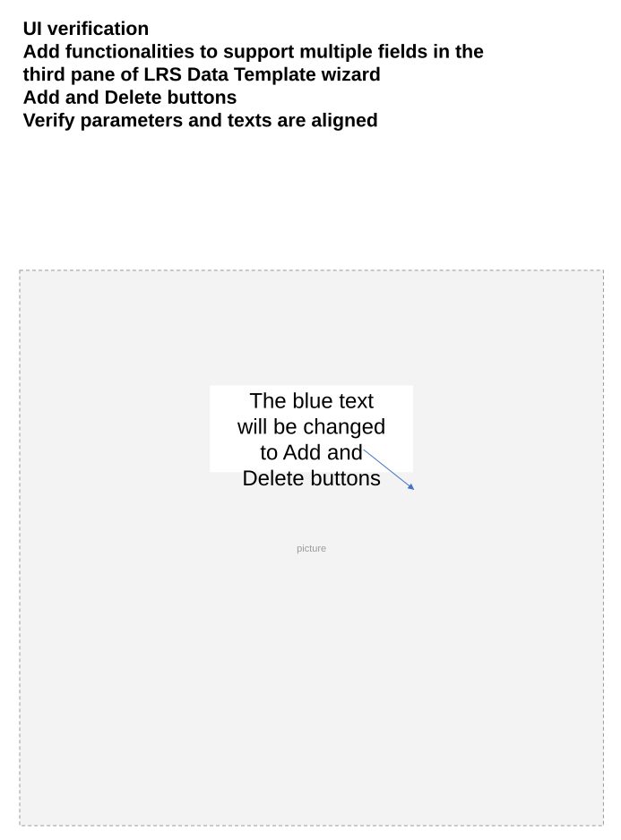

# Support multiple summary fields in LRS Data Template wizard – Test Plan

| Field | Value |
| --- | --- |
| **Doc** | 323 · Test Plan · Pro |
| **Product** | Roads & Highways · Pipeline Referencing |
| **Release** | — |
| **Issues** | [ArcGISPro/ps-location-referencing#5770](https://devtopia.esri.com/ArcGISPro/ps-location-referencing/issues/5770) |
| **Source** | [5770_MultipleSummaryFields_Testplan.pptx](<https://esriis.sharepoint.com/sites/LocationReferencing/Shared%20Documents/General/Test%20Plans/5770_MultipleSummaryFields_Testplan.pptx>) |
| **People** | author Lakshmi Ananthanarayanan · PE Claire · dev Sharon |
| **Edited** | 2024-08-20 18:41 by Claire Wang |
| **Extracted** | 2026-09-04 · lane xmlstrip · format 3.0 · prompt v2.0.2 |
| **Keywords** | summary field · data template · test plan · functionality verification · filter expression · canvas synchronization · error handling |
| **Tools** | LRS Data Template wizard |

## Summary

Test plan for adding and verifying support for multiple summary fields in the third pane of the LRS Data Template wizard. Covers UI verification, functionality verification including adding, deleting, and editing summary levels, handling of existing JSON templates, error handling, filter expression behavior, and canvas synchronization. Includes positive and negative test cases across various geodatabases and data types, as well as accessibility and internationalization compliance.

## Related documents

<!-- related:begin -->
- [Support a single summary field in LRS Data Template wizard – Test Plan](<https://esriis.sharepoint.com/sites/lrsworkspace/LRS Doc Index/Test Plans/5774-support-a-single-summary-field-in-lrs-data-template-wizard.md>) — similar text 0.79 · 3 title words · 2 filename words · same kind/surface/pe/dev/folder <!-- rel:347 s=12.438 -->
- [Support multiple summary fields in Generate LRS Data Product – Test Plan](<https://esriis.sharepoint.com/sites/lrsworkspace/LRS Doc Index/Test Plans/5773-support-multiple-summary-fields-in-generate-lrs-data-product.md>) — similar text 0.33 · 4 title words · 4 filename words · same kind/surface/folder <!-- rel:321 s=6.587 -->
- [Support length fields using unique values in LRS Data Template wizard – Test Plan](<https://esriis.sharepoint.com/sites/lrsworkspace/LRS Doc Index/Test Plans/5768-support-length-fields-using-unique-values-in-lrs-data.md>) — similar text 0.49 · 3 title words · 1 filename word · same kind/surface/dev/folder <!-- rel:322 s=6.026 -->
- [LRS Data Template wizard – Test Plan](<https://esriis.sharepoint.com/sites/lrsworkspace/LRS Doc Index/Test Plans/5882-lrs-data-template-wizard.md>) — similar text 0.42 · 1 title word · 1 filename word · same kind/surface/pe/dev/folder <!-- rel:354 s=5.636 -->
- [Route Log data product template – Test Plan](<https://esriis.sharepoint.com/sites/lrsworkspace/LRS Doc Index/Test Plans/6203-route-log-data-product-template.md>) — similar text 0.42 · 1 filename word · same kind/surface/pe/dev/folder <!-- rel:256 s=5.528 -->
<!-- related:end -->

<!-- docs:begin -->
## Esri documentation

[Create a template for an LRS length data product](https://doc.esri.com/en/arcgis-pro/latest/help/production/roads-highways/create-a-template-for-an-lrs-length-data-product.html)

_No page matched:_ [LRS Data Template wizard](https://www.google.com/search?q=%22LRS%20Data%20Template%20wizard%22+site%3Adoc.esri.com)
<!-- docs:end -->

---

## Overview

### Slide 1 — Support multiple summary fields in LRS Data Template wizard – Test Plan <!-- slide 1 -->

https://devtopia.esri.com/ArcGISPro/ps-location-referencing/issues/5770

PE: Claire
Dev: Sharon

### Slide 2 <!-- slide 2 -->

UI verification

- Add functionalities to support multiple fields in the third pane of LRS Data Template wizard
  - Add and Delete buttons
- Verify parameters and texts are aligned

The blue text will be changed to Add and Delete buttons

### Slide 3 <!-- slide 3 -->

Functionality Verification

- When users first enter the third pane, there is no level (design change)
- Click Add button to add the first level
  - Populate Name, Layer, and Field (they are mandatory) before clicking Finish or Adding another level. These 2 buttons are disabled if the 3 parameters are not filled.
- Clicking on Add again adds a new summary level (n+1) where n was the previous level
- Once a level is added, automatically place the cursor to the summary name cell for user to type in, and clear the contents of the rest of the parameters of the pane
- Select a single level and use Delete button to remove a level.
  - Move the next level up once the level is deleted
- Verify Layer, Field, Filter, and Display Value Map still have the same behavior as adding a single summary field (5774)
- Clicking a level selects and highlights the level, and the following parameters show information of this level
- User can use the same layer in different levels. It will be returned as 0 length in GP though

       Add         Delete
Rahul will think about typing a name in table vs. the 4th pane behavior

### Slide 4 <!-- slide 4 -->

Functionality Verification

- If the user reloads an existing Json file, then all the levels are filled, and the summary info parameters show up for the first level
  - When Layer/Field in the existing json is missing from the map , show an error for the level. After selecting the level, show an error for Layer/Field and provide a dropdown for the user to choose a valid value (use same behavior in page 2 – Network)
  - If Name or Display Value is over 50 characters, only the first 50 characters are brought into wizard
- Click Finish to save/overwrite json. json is saved with Field(s), Layer, Filter, and Display Field Map information.
- The canvas should continue to –
  - If the Canvas is open and a change is made, update the canvas upon losing focus from the updated parameter
  - If the Canvas is not open and a change is made, show the updated the canvas upon clicking the preview button.

### Slide 5 <!-- slide 5 -->

Testing

- Test in fgdb, egdb (oracle + sql), fs - default and child versions
- Test with nonline, Line, Derived network, PoM, and Addressing (sanity)
- Test with multiple different types of summary layers such as single part polygon, multi part polygon, line events and networks.
- Test creating new template and opening and overwriting existing template
- The tool should recognize summary layer when it is checked off (invisible) in map
- Test when Layer does not exist in TOC or Field does not exist for Layer (by removing the Layer from map and importing an existing json that has wrong information)
- Test filter expression – load/save/remove/etc
- Test many summary layers (check examples that Rahul has, maybe 3)
- Test canvas behavior
- Test with dark and light theme
- 508 and i18n compliance
Automation: not yet
Doc: not yet

## Test Cases

### TC-N01 — User selects an existing template json with a missing Layer/Field <!-- src: S3 · slide 6 · table · 1 -->

- **ID:** 1
- **Expected Result:** Red box + Disabled Next and Finish + Hover an error message + provide options in dropdown

### TC-N02 — Mandatory field(s) is missing <!-- src: S3 · slide 6 · table · 2 -->

- **ID:** 2
- **Expected Result:** Disabled Add and Finish buttons. Red boxes

### TC-P01 — RH – summarize by county, city, and paved/unpaved roads <!-- src: S3 · slide 7 · table · 1 -->

- **ID:** 1
- **Expected Result:** Template generated with correct fields. Canvas shows correct information.

### TC-P02 — RH – summarize by county, and functional class with changed display value <!-- src: S3 · slide 7 · table · 2 -->

- **ID:** 2
- **Case:** RH – summarize by county, and functional class with changed display value, filter expression, and removed display value.
- **Expected Result:** Template generated with correct fields. Canvas shows correct information.

### TC-P03 — RH – summarize by city and a network-jurisdiction with changed display value <!-- src: S3 · slide 7 · table · 3 -->

- **ID:** 3
- **Case:** RH – summarize by city and a network-jurisdiction with changed display value, filter expression, and modified display value.
- **Expected Result:** Template generated with correct fields. Canvas shows correct information.

### TC-P04 — APR Engineering – summarize by material and inline inspection <!-- src: S3 · slide 7 · table · 4 -->

- **ID:** 4
- **Expected Result:** Template generated with correct fields. Canvas shows correct information.

### TC-P05 — APR Derived – summarize by county <!-- src: S3 · slide 7 · table · 5 -->

- **ID:** 5
- **Case:** APR Derived – summarize by county, material and diameter with changed display value, filter expression, and removed display value.
- **Expected Result:** Template generated with correct fields. Canvas shows correct information.

### TC-P06 — APR Engineering – summarize by city and Line ID <!-- src: S3 · slide 7 · table · 6 -->

- **ID:** 6
- **Expected Result:** Template generated with correct fields. Canvas shows correct information.

### TC-P07 — APR Engineering – summarize by a installation year <!-- src: S3 · slide 7 · table · 7 -->

- **ID:** 7
- **Case:** APR Engineering – summarize by a installation year, material and inline inspection with filters
- **Expected Result:** Template generated with correct fields. Canvas shows correct information.

### TC-P08 — PoM – summarize by summarize by county and line ID <!-- src: S3 · slide 7 · table · 8 -->

- **ID:** 8
- **Expected Result:** Template generated with correct fields. Canvas shows correct information.

### TC-P09 — PoM – summarize by county and city with changed display value <!-- src: S3 · slide 7 · table · 9 -->

- **ID:** 9
- **Case:** PoM – summarize by county and city with changed display value, filter expression, and modified display value.
- **Expected Result:** Template generated with correct fields. Canvas shows correct information.

### TC-P10 — Open a template for RH and overwrite Name/Layer/Field/Filter/Displayed Values (10) <!-- src: S3 · slide 7 · table · 10 -->

- **ID:** 10
- **Expected Result:** Template is overwritten with changed inputs. Canvas shows correct information.

### TC-P11 — Open a template for RH and overwrite Name/Layer/Field/Filter/Displayed Values (11) <!-- src: S3 · slide 7 · table · 11 -->

- **ID:** 11
- **Expected Result:** Template is overwritten with changed inputs. Canvas shows correct information.

### TC-P12 — Open a template for APR-Derived and overwrite Name/Layer/Field/Filter/Displayed <!-- src: S3 · slide 8 · table · 12 -->

- **ID:** 12
- **Case:** Open a template for APR-Derived and overwrite Name/Layer/Field/Filter/Displayed Values
- **Expected Result:** Template is overwritten with changed inputs. Canvas shows correct information.

### TC-P13 — Open a template for PoM and overwrite Name/Layer/Field/Filter/Displayed Values <!-- src: S3 · slide 8 · table · 13 -->

- **ID:** 13
- **Expected Result:** Template is overwritten with changed inputs. Canvas shows correct information.

### TC-P14 — Bring in existing file, Name exceeds 50 characters <!-- src: S3 · slide 8 · table · 14 -->

- **ID:** 14
- **Expected Result:** No error. Description shows the first 50 characters. Save will overwrite and save only these 50 characters

### TC-P15 — Check what if level 2 resides in 2 different values in level 1 <!-- src: S3 · slide 8 · table · 15 -->

- **ID:** 15

## Other content

### Slide 6 — Negative cases/Error message verification <!-- slide 6 -->

|  |  |  |  |
|  |  |  |  |
|  |  |  |  |

– Developer provides error messages

### Slide 7 — Positive cases (test various dbs /FSs) <!-- slide 7 -->

Send json and canvas screenshot to PE and Michael

### Slide 9 <!-- slide 9 -->

Functionality Verification

- Select summary layer.
  - The dropdown lists the contents in TOC’s order and show the name listed in the TOC + an empty option
  - In Layer dropdown, we only show polygon layers, Line Events that are registered with the network in the 2nd pane, and only one Network that is chosen in the 2nd page. Polygon and events should be in the same gdb and in the same projection as the network in the 2nd pane. Layers that do not meet these criteria are not shown
  - If the bullet above is not doable (cannot filter layers in dropdown), we should validate the layer at some point
- Select Field
  - The dropdown list the fields from the Layer selected above, except system fields + an empty option
- Once Layer and Fields are selected, Display Value Map table is automatically populated with Field Values and Display Values, and the canvas lists Display Values in the box
  - The Display Value Map table shows the unique values from the Field selected above
  - By default, Field Value = Display Value. Field Value is not editable. Display Value is editable. Use Delete button to remove a field.
    - Display value cannot exceed 50 characters (cannot type after 50)
    - Display value cannot be empty. If user manually deletes it, once they lose focus, the Display value shows Field vale
    - If null is one of the unique values, show null in both cells. The null in Displayed value can be changed
    - The canvas reflects changes in Display Value
  - Show a vertical scroll bar after the first 10 rows for display value map.
    - Keep the canvas in-sync with the scrolling experience
- When everything is populated and user changes the Layer or choose the empty option for Field, Field, Filter (if populated), Field map, and Name will reset to empty.

### Slide 10 <!-- slide 10 -->

Functionality Verification

- By default, Filter Expression is collapsed. When expanded –
  - Show the filtering functionalities
  - Once Apply, the filter is sent to Display Value Map and the Canvas
- Updating Display Value Map
  - Without Filter, all unique values are present and user uses Delete button to remove a value
  - With Filter, when users want to add a Field Value, they should add it in Filter and Apply.
  - With Filter, when users want to remove a Field Value, they can either remove it in Filter and Apply (so Filter and Display Field Map sync), or simply remove from Field Map. For the latter, the change does not go back to Filter, so Filter and Display Field Map do not sync, but it's fine since we save both info. But if they Apply again in Filter, it does update the Field Map.

