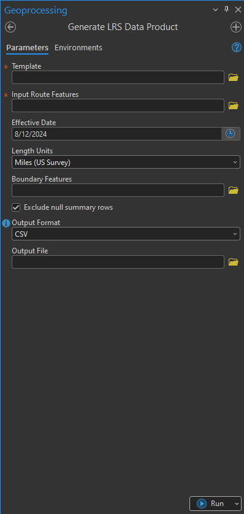
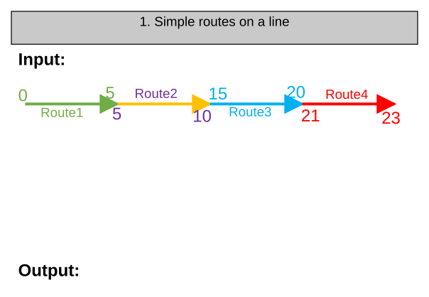
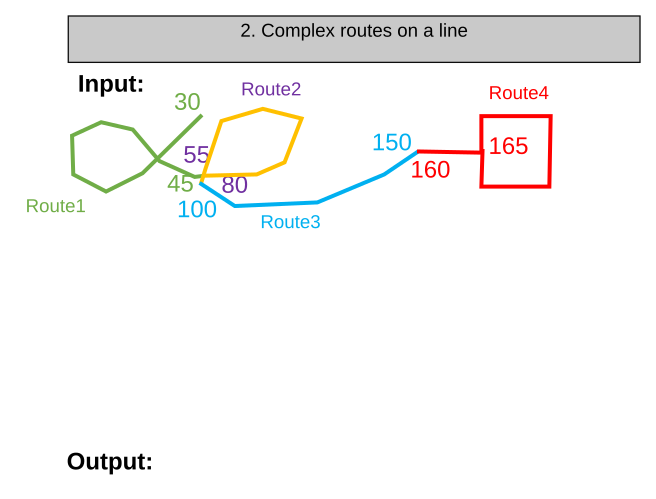
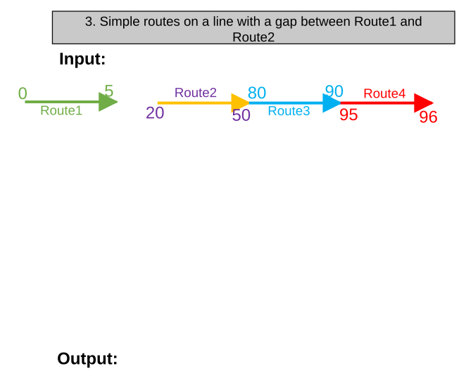
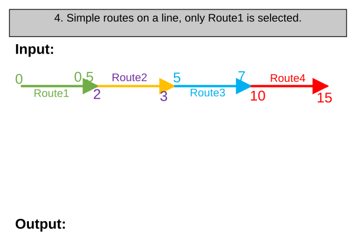
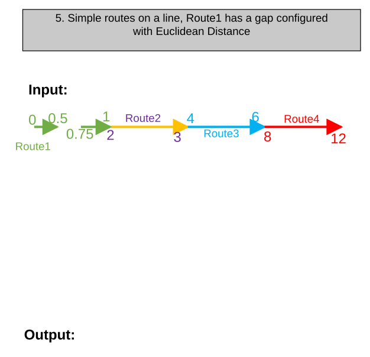
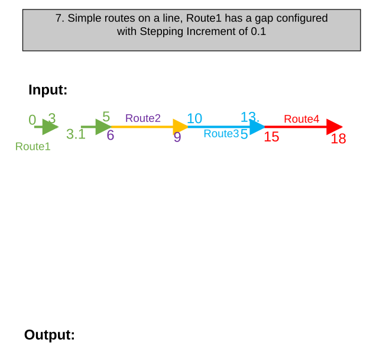
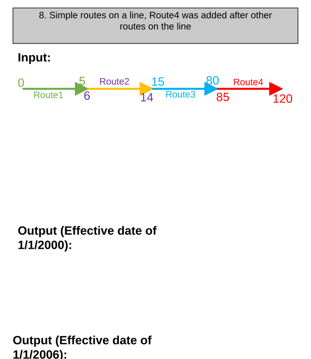
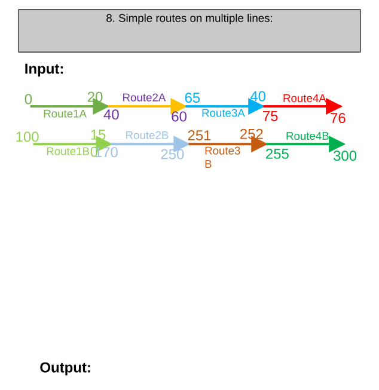

# Generate LRS Data Product: Create Mileage Report for Line Networks

| Field | Value |
| --- | --- |
| **Doc** | 338 · Test Plan · Pro |
| **Product** | Pipeline Referencing · Utility Network |
| **Release** | — |
| **Issues** | [ArcGISPro/ps-location-referencing#5813](https://devtopia.esri.com/ArcGISPro/ps-location-referencing/issues/5813) |
| **Source** | [5813-GenerateLRSDataProductGPCreateLineReport_TestPlanV2.pptx](<https://esriis.sharepoint.com/sites/LocationReferencing/Shared%20Documents/LR%20Product%20Engineers/5813-GenerateLRSDataProductGPCreateLineReport_TestPlanV2.pptx>) · rev V2 |
| **People** | author Mac Christmas · PE — · dev — |
| **Edited** | 2024-08-12 22:56 by Mac Christmas |
| **Extracted** | 2026-09-04 · lane xmlstrip · format 3.0 · prompt v2.0.2 |
| **Keywords** | mileage report · line networks · route mileage · line mileage · gap handling · effective date · length units |
| **Tools** | — |

## Summary

Test plan for calculating mileage against line networks including simple and complex route shapes. Covers testing with APR and UNAPR data, various geodatabases, time slices, and length units. Validates route and line mileage calculations and output fields.

## Related documents

<!-- related:begin -->
- [Reporting Location Referencing Mileage for Line Network](<https://esriis.sharepoint.com/sites/lrsworkspace/LRS Doc Index/User Stories/reporting-lr-mileage-for-line-network.md>) — similar text 0.13 · 2 title words · 1 filename word · same surface <!-- rel:368 s=4.135 -->
- [GenerateLengthSummary – Test Plan](<https://esriis.sharepoint.com/sites/lrsworkspace/LRS Doc Index/Test Plans/6202-generatelengthsummary.md>) — similar text 0.06 · 1 filename word · same kind/surface/folder <!-- rel:172 s=2.839 -->
- [Generate LR Data Product: Support summary and length fields from the template – Test Plan](<https://esriis.sharepoint.com/sites/lrsworkspace/LRS Doc Index/Test Plans/5769-generate-lr-data-product-support-summary-and-length-fields.md>) — similar text 0.07 · 2 title words · same kind/surface <!-- rel:339 s=2.61 -->
- [Extending Complex Routes Test Plan](<https://esriis.sharepoint.com/sites/lrsworkspace/LRS%20Doc%20Index/Test%20Plans/extending-complex-routes.md>) — similar text 0.10 · same kind/surface <!-- rel:852 s=2.524 -->
- [Support line networks and JSON in Export Network](<https://esriis.sharepoint.com/sites/lrsworkspace/LRS%20Doc%20Index/User%20Stories/support-line-networks-and-json-in-export-network.md>) — similar text 0.02 · 2 title words · 1 filename word · same surface <!-- rel:805 s=2.369 -->
<!-- related:end -->

---

## Overview

### Slide 1 — Devtopia Issue <!-- slide 1 -->

Generate LRS Data Product: Create Mileage Report for Line Networks

**Notes**
- Add support for calculating mileage against line networks
- Test with complex and simple route shapes
- Test with APR and UNAPR data
- Test with FGDB, EGDB (Oracle and SQL Server), and FS
- Test with time slices
- Test with different length units
- 508 and i18n testing
- Test in Python, stand-alone, and ModelBuilder
- Input with all test cases, ensure output is correct

## Test Cases

### TC-P01 — Verify resultant mileage is calculated as ToMeasure <!-- src: S4 · slide 2 · Positive Tests: Functionality · 1 -->

- **Group:** Functionality
- **Case:** Verify resultant mileage is calculated as ToMeasure - FromMeasure for route mileage

### TC-P02 — Verify resultant mileage is calculated as sum of all measures of all routes <!-- src: S4 · slide 2 · Positive Tests: Functionality · 2 -->

- **Group:** Functionality
- **Case:** Verify resultant mileage is calculated as sum of all measures of all routes on a line for line mileage

### TC-P03 — Verify output has new fields Line Name and Line Mileage <!-- src: S4 · slide 2 · Positive Tests: Functionality · 3 -->

- **Group:** Functionality

### TC-P04 — Verify original route mileage field is renamed to “Route Mileage” <!-- src: S4 · slide 2 · Positive Tests: Functionality · 4 -->

- **Group:** Functionality

### TC-U01 — Simple routes on a line (case 1) <!-- src: S2 · slide 4 · case 1 -->

| RouteName | LineName | FromDate | ToDate |
| --- | --- | --- | --- |
| Route1 | Line1 | 1/1/2000 | <Null> |
| Route2 | Line1 | 1/1/2000 | <Null> |
| Route3 | Line1 | 1/1/2000 | <Null> |
| Route4 | Line1 | 1/1/2000 | <Null> |

| RouteName | RouteMileage | LineName | LineMileage |
| --- | --- | --- | --- |
| Route1 | 5 mi | Line1 | 17 mi |
| Route2 | 5 mi | Line1 | 17 mi |
| Route3 | 5 mi | Line1 | 17 mi |
| Route4 | 2 mi | Line1 | 17 mi |

[figure: 0 · 5 · 10 · 15 · 20 · 21 · 23 · Route1 · Route2 · Route3 · Route4 · Input: · Output:]

### TC-U02 — Complex routes on a line <!-- src: S2 · slide 5 · case 2 -->

| RouteName | LineName | FromDate | ToDate |
| --- | --- | --- | --- |
| Route1 | Line2 | 1/1/2000 | <Null> |
| Route2 | Line2 | 1/1/2000 | <Null> |
| Route3 | Line2 | 1/1/2000 | <Null> |
| Route4 | Line2 | 1/1/2000 | <Null> |

| RouteName | RouteMileage | LineName | LineMileage |
| --- | --- | --- | --- |
| Route1 | 15 mi | Line2 | 95 mi |
| Route2 | 25 mi | Line2 | 95 mi |
| Route3 | 50 mi | Line2 | 95 mi |
| Route4 | 5 mi | Line2 | 95 mi |

[figure: 30 · 45 · 55 · 80 · 100 · 150 · 160 · 165 · Route1 · Route2 · Route3 · Route4 · Input: · Output:]

### TC-U03 — Simple Routes on a Line with a Gap Between Route1 and Route2 <!-- src: S1 · slide 6 · case 3 -->

| RouteName | LineName | FromDate | ToDate |
| --- | --- | --- | --- |
| Route1 | Line3 | 1/1/2000 | <Null> |
| Route2 | Line3 | 1/1/2000 | <Null> |
| Route3 | Line3 | 1/1/2000 | <Null> |
| Route4 | Line3 | 1/1/2000 | <Null> |

| RouteName | RouteMileage | LineName | LineMileage |
| --- | --- | --- | --- |
| Route1 | 5 mi | Line3 | 46 mi |
| Route2 | 30 mi | Line3 | 46 mi |
| Route3 | 10 mi | Line3 | 46 mi |
| Route4 | 1 mi | Line3 | 46 mi |

[figure: 0 · 5 · 20 · 50 · 80 · 90 · 95 · 96 · Route1 · Route2 · Route3 · Route4 · Input: · Output:]

### TC-U04 — Simple Routes on a Line, Only Route1 Is Selected. <!-- src: S1 · slide 7 · case 4 -->

| RouteName | LineName | FromDate | ToDate |
| --- | --- | --- | --- |
| Route1 | Line4 | 1/1/2000 | <Null> |
| Route2 | Line4 | 1/1/2000 | <Null> |
| Route3 | Line4 | 1/1/2000 | <Null> |
| Route4 | Line4 | 1/1/2000 | <Null> |

| RouteName | RouteMileage | LineName | LineMileage |
| --- | --- | --- | --- |
| Route1 | 0.5 mi | Line4 | 8.5 mi |
| Route2 | 1 mi | Line4 | 8.5 mi |
| Route3 | 2 mi | Line4 | 8.5 mi |
| Route4 | 5 mi | Line4 | 8.5 mi |

[figure: 0 · 0.5 · 2 · 3 · 5 · 7 · 10 · 15 · Route1 · Route2 · Route3 · Route4 · Input: · Output:]

### TC-U05 — Simple Routes on a Line, Route1 Has a Gap Configured with Euclidean Distance <!-- src: S1 · slide 8 · case 5 -->

| RouteName | LineName | FromDate | ToDate |
| --- | --- | --- | --- |
| Route1 | Line5 | 1/1/2000 | <Null> |
| Route2 | Line5 | 1/1/2000 | <Null> |
| Route3 | Line5 | 1/1/2000 | <Null> |
| Route4 | Line5 | 1/1/2000 | <Null> |

| RouteName | RouteMileage | LineName | LineMileage |
| --- | --- | --- | --- |
| Route1 | 0.75 mi | Line5 | 7.75 mi |
| Route2 | 1 mi | Line5 | 7.75 mi |
| Route3 | 2 mi | Line5 | 7.75 mi |
| Route4 | 4 mi | Line5 | 7.75 mi |

[figure: 0.5 · 0 · 2–4 · 6 · 8 · 12 · Route1 · Route2 · Route3 · Route4 · Input: · Output: · 0.75 · 1]

### TC-U06 — Simple Routes on a Line (case 6) <!-- src: S1 · slide 9 · case 6 -->

- **Case:** Simple routes on a line, Route1 has a gap configured with Adding Increment of 0.1

| RouteName | LineName | FromDate | ToDate |
| --- | --- | --- | --- |
| Route1 | Line6 | 1/1/2000 | <Null> |
| Route2 | Line6 | 1/1/2000 | <Null> |
| Route3 | Line6 | 1/1/2000 | <Null> |
| Route4 | Line6 | 1/1/2000 | <Null> |

| RouteName | RouteMileage | LineName | LineMileage |
| --- | --- | --- | --- |
| Route1 | 5 mi | Line6 | 14.4 mi |
| Route2 | 3 mi | Line6 | 14.4 mi |
| Route3 | 3.4 mi | Line6 | 14.4 mi |
| Route4 | 3 mi | Line6 | 14.4 mi |

[figure: 3 · 0 · 6 · 9 · 10 · 13.5 · 15 · 18 · Route1 · Route2 · Route3 · Route4 · Input: · Output: · 3.1 · 5.1]

### TC-U07 — Simple Routes on a Line (case 7) <!-- src: S1 · slide 10 · case 7 -->

- **Case:** Simple routes on a line, Route1 has a gap configured with Stepping Increment of 0.1

| RouteName | LineName | FromDate | ToDate |
| --- | --- | --- | --- |
| Route1 | Line7 | 1/1/2000 | <Null> |
| Route2 | Line7 | 1/1/2000 | <Null> |
| Route3 | Line7 | 1/1/2000 | <Null> |
| Route4 | Line7 | 1/1/2000 | <Null> |

| RouteName | RouteMileage | LineName | LineMileage |
| --- | --- | --- | --- |
| Route1 | 4.9 mi | Line7 | 14.3 mi |
| Route2 | 3 mi | Line7 | 14.3 mi |
| Route3 | 3.4 mi | Line7 | 14.3 mi |
| Route4 | 3 mi | Line7 | 14.3 mi |

[figure: 3 · 0 · 6 · 9 · 10 · 13.5 · 15 · 18 · Route1 · Route2 · Route3 · Route4 · Input: · Output: · 3.1 · 5]

### TC-U08 — Simple Routes on a Line, Route4 Was Added After Other Routes on the Line <!-- src: S1 · slide 11 · case 8 -->

| RouteName | LineName | FromDate | ToDate |
| --- | --- | --- | --- |
| Route1 | Line8 | 1/1/2000 | <Null> |
| Route2 | Line8 | 1/1/2000 | <Null> |
| Route3 | Line8 | 1/1/2000 | <Null> |
| Route4 | Line8 | 1/1/2005 | <Null> |

Output (Effective date of 1/1/2000):

| RouteName | RouteMileage | LineName | LineMileage |
| --- | --- | --- | --- |
| Route1 | 5 mi | Line8 | 78 mi |
| Route2 | 8 mi | Line8 | 78 mi |
| Route3 | 65 mi | Line8 | 78 mi |

Output (Effective date of 1/1/2006):

| RouteName | RouteMileage | LineName | LineMileage |
| --- | --- | --- | --- |
| Route1 | 5 mi | Line8 | 113 mi |
| Route2 | 8 mi | Line8 | 113 mi |
| Route3 | 65 mi | Line8 | 113 mi |
| Route4 | 35 mi | Line8 | 113 mi |

[figure: 0 · 5 · 6 · 14 · 15 · 80 · 85 · 120 · Route1 · Route2 · Route3 · Route4 · Input:]

### TC-U09 — Simple routes on multiple lines <!-- src: S2 · slide 12 · case 8 -->

| RouteName | LineName | FromDate | ToDate |
| --- | --- | --- | --- |
| Route1A | LineA | 1/1/2000 | <Null> |
| Route2A | LineA | 1/1/2000 | <Null> |
| Route3A | LineA | 1/1/2000 | <Null> |
| Route4A | LineA | 1/1/2000 | <Null> |
| Route1B | LineB | 1/1/1995 | <Null> |
| Route2B | LineB | 1/1/1995 | <Null> |
| Route3B | LineB | 1/1/1995 | <Null> |
| Route4B | LineB | 1/1/1995 | <Null> |

| RouteName | RouteMileage | LineName | LineMileage |
| --- | --- | --- | --- |
| Route1A | 20 mi | LineA | 46 mi |
| Route2A | 20 mi | LineA | 46 mi |
| Route3A | 5 mi | LineA | 46 mi |
| Route4A | 1 mi | LineA | 46 mi |
| Route1B | 50 mi | LineB | 176 mi |
| Route2B | 80 mi | LineB | 176 mi |
| Route3B | 1 mi | LineB | 176 mi |
| Route4B | 45 mi | LineB | 176 mi |

[figure: Route4B · Route3B · Route2B · Route1B · 0 · 20 · 40 · 60 · 65 · 75 · 76 · Route1A · Route2A · Route3A · Route4A · Input: · Output: · 100 · 150 · 170 · 250–252 · 255 · 300]

## Other content

### Slide 2 <!-- slide 2 -->

| Test No. | Test Case Description | Expected Route Mileage (Route Identifier is RouteName) | Expected Line Mileage |
| --- | --- | --- | --- |
| 1 | Simple routes on Line1: Route1: 0-5 Route2: 5-10 Route3: 15-20 Route4: 21-23 | Route1: 5 mi Route2: 5 mi Route3: 5 mi Route4: 2 mi | Line1: 17 mi |
| 2 | Complex routes on Line2: Route1 (Alpha): 30-45 Route2 (Loop): 55-80 Route3 (Simple): 100-150 Route4 (Lollipop): 160-165 | Route1: 15 mi Route2: 25 mi Route3: 50 mi Route4: 5 mi | Line2: 95 mi |
| 3 | Simple routes with a gap between Route1 and Route2 on Line3: Route1: 0-5 Gap: 0.5 (not counted) Route2: 20-50 Route3: 80-90 Route4: 95-96 | Route1: 5 mi Route2: 30 mi Route3: 10 mi Route4: 1 mi | Line3: 46 mi |
| 4 | Simple routes on Line4, only Route1 is selected: Route1: 0-0.5 Route2: 2-3 Route3: 5-7 Route4: 10-15 | Route1: 0.5 mi Route2: 1 mi Route3: 2 mi Route4: 5 mi | Line4: 8.5 mi |
| 5 | Simple routes on Line5, Route1 has a 0.25 mi gap configured with Euclidean Distance: Route1: 0-0.5, 0.75-1 Route2: 2-3 Route3: 4-6 Route4: 8-12 | Route1: 0.75 mi Route2: 1 mi Route3: 2 mi Route4: 4 mi | Line5: 7.75 mi |

### Slide 3 <!-- slide 3 -->

| Test No. | Test Case Description | Expected Route Mileage (Route Identifier is RouteName) | Expected Line Mileage |
| --- | --- | --- | --- |
| 6 | Simple routes on Line6, Route1 has gaps configured with an Adding Increment of 0.1: Route1: 0-3, 3.1-5.1 Route2: 6-9 Route3: 10-13.5 Route4: 15-18 | Route1: 5 mi Route2: 3 mi Route3: 3.5 mi Route4: 3 mi | Line6: 14.4 mi |
| 7 | Simple routes on Line7, Route1 has a gap configured with a stepping increment of 0.1: Route1: 0-3, 3.1-5 Route2: 6-9 Route3: 10-13.5 Route4: 15-18 | Route1: 4.9 mi Route2: 3 mi Route3: 3.5 mi Route4: 3 mi | Line7: 14.3 mi |
| 8 | Simple Routes on Line8, Route4 was added after other routes: Route1: 0-5 Route2: 6-14 Route3: 15-80 Route4: 85-120 | Effective Date before Route4 creation: Route1: 5 mi Route2: 8 mi Route3: 65 mi Effective Date after Route4 creation: Route1: 5 mi Route2: 8 mi Route3: 65 mi Route4: 35 mi | Effective Date before Route3 creation: Line8: 78 mi Effective Date after Route3 creation: Line8: 113 mi |
| 9 | Simple routes on multiple lines: Route1A: 0-20 Route2A: 40-60 Route3A: 65-70 Route4A: 75-76 Route1B: 100-150 Route2B: 170-250 Route3B: 251-252 Route4B: 255-300 | Route1A: 20 mi Route2A: 20 mi Route3A: 5 mi Route4A: 1 mi Route1B: 50 mi Route2B: 80 mi Route3B: 1 mi Route4B: 45 mi | LineA: 46 mi LineB: 176 mi |
