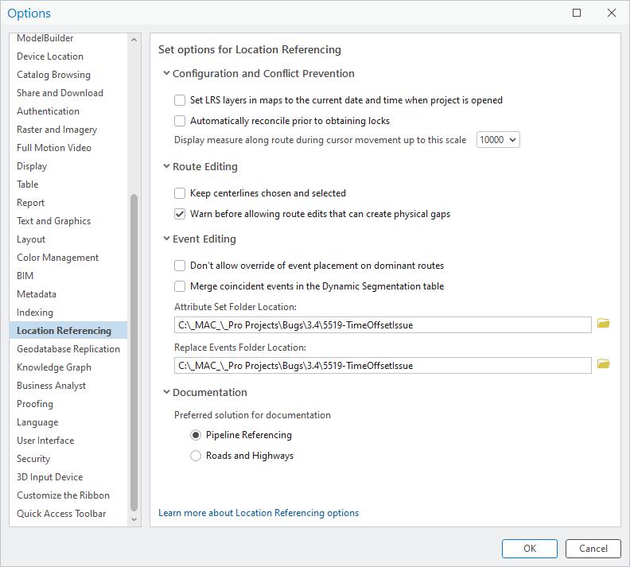

# Reorganize Location Referencing Pro Options Test Plan

| Field | Value |
| --- | --- |
| **Doc** | 341 · Test Plan · Pro |
| **Product** | Roads & Highways · Pipeline Referencing |
| **Release** | — |
| **Issues** | [ArcGISPro/ps-location-referencing#5826](https://devtopia.esri.com/ArcGISPro/ps-location-referencing/issues/5826) |
| **Source** | [5826-ReorganizeLROptions_TestPlanV2.pptx](<https://esriis.sharepoint.com/sites/LocationReferencing/Shared%20Documents/LR%20Product%20Engineers/5826-ReorganizeLROptions_TestPlanV2.pptx>) · rev V2 |
| **People** | author Mac Christmas · PE — · dev — |
| **Edited** | 2024-08-05 16:20 by Mac Christmas |
| **Extracted** | 2026-09-04 · lane xmlstrip · format 3.0 · prompt v2.0.2 |
| **Keywords** | location referencing · pro options · route editing · event editing · configuration · conflict prevention · documentation |
| **Tools** | — |

## Summary

Test plan for reorganizing the Location Referencing tab in ArcGIS Pro options to improve usability. Covers positive UI tests, configuration and conflict prevention, route editing, event editing, and documentation preferences. Ensures options persist across sessions and function correctly in light and dark modes.

## Related documents

<!-- related:begin -->
- [Reorganize Location Referencing Pro Options Test Plan](<https://esriis.sharepoint.com/sites/lrsworkspace/LRS Doc Index/Test Plans/5826-reorganize-lr-pro-options-rh-apr-v2-2024-08.md>) — shared issue ArcGISPro/ps-location-referencing#5826 · similar text 0.98 · 3 title words · 2 filename words · same kind/surface <!-- rel:340 s=1008.96 -->
- [Reorganize Location Referencing Pro options](<https://esriis.sharepoint.com/sites/lrsworkspace/LRS Doc Index/User Stories/reorganize-lr-pro-options.md>) — similar text 0.12 · 3 title words · 1 filename word · same surface <!-- rel:371 s=3.496 -->
- [Set Location Referencing options](<https://esriis.sharepoint.com/sites/lrsworkspace/LRS Doc Index/Other/6463-set-lr-options.md>) — similar text 0.35 · 1 title word · 1 filename word · same surface <!-- rel:199 s=3.487 -->
- [Set Location Referencing options](<https://esriis.sharepoint.com/sites/lrsworkspace/LRS Doc Index/Other/set-lr-options-rh-apr-v2-2024-08.md>) — similar text 0.39 · 1 title word · 1 filename word · same surface <!-- rel:315 s=3.434 -->
- [Set Location Referencing options](<https://esriis.sharepoint.com/sites/lrsworkspace/LRS%20Doc%20Index/Other/set-lr-options-rh-apr-2024-09.md>) — similar text 0.40 · 1 title word · 1 filename word · same surface <!-- rel:308 s=3.387 -->
<!-- related:end -->

<!-- docs:begin -->
## Esri documentation

[Event editing using the attribute table](https://doc.esri.com/en/arcgis-pro/latest/help/production/roads-highways/event-editing-using-the-attribute-table.html) · [Set Location Referencing options](https://doc.esri.com/en/arcgis-pro/latest/help/production/roads-highways/set-location-referencing-options.html) · [Conflict prevention](https://doc.esri.com/en/arcgis-pro/latest/help/production/roads-highways/conflict-prevention.html)
<!-- docs:end -->

---

## Overview

### Slide 1 — Devtopia Issue <!-- slide 1 -->

Reorganize Location Referencing Pro Options

**Notes**
- Reorganize Location Referencing tab of the Pro options for ease of use
- Test in light and dark mode
- Ensure opening and closing a project maintains chosen options
- 508/i18n
- Mix and match option choices

## Test Cases

### TC-P01 — Click on accordion will expand or minimize sections of the options <!-- src: S4 · slide 2 · Positive Tests: UI · 1 -->

- **Group:** UI

### TC-P02 — Checkboxes can be checked or unchecked <!-- src: S4 · slide 2 · Positive Tests: UI · 2 -->

- **Group:** UI

### TC-P03 — Clicking on folder icon opens file explorer <!-- src: S4 · slide 2 · Positive Tests: UI · 3 -->

- **Group:** UI

### TC-P04 — Options are saved and maintained when closing and reopening Pro <!-- src: S4 · slide 2 · Positive Tests: UI · 4 -->

- **Group:** UI

### TC-P05 — Accordions will be expanded by default <!-- src: S4 · slide 2 · Positive Tests: UI · 5 -->

- **Group:** UI

### TC-P06 — Checking “Set layers in maps to the current date and time when project <!-- src: S4 · slide 2 · Positive Tests: Configuration and Conflict Prevention · 1 -->

- **Group:** Configuration and Conflict Prevention
- **Case:** Checking “Set layers in maps to the current date and time when project is opened” refreshes time to be the current date and time when opening maps in a project for the first time

### TC-P07 — Unchecking “Set layers in maps to the current date and time when project <!-- src: S4 · slide 2 · Positive Tests: Configuration and Conflict Prevention · 2 -->

- **Group:** Configuration and Conflict Prevention
- **Case:** Unchecking “Set layers in maps to the current date and time when project is opened” maintains the existing time settings when reopening maps in a project for the first time

### TC-P08 — Checking “Automatically reconcile prior to obtaining locks” automatically <!-- src: S4 · slide 2 · Positive Tests: Configuration and Conflict Prevention · 3 -->

- **Group:** Configuration and Conflict Prevention
- **Case:** Checking “Automatically reconcile prior to obtaining locks” automatically reconciles when obtaining locks

### TC-P09 — Unchecking “Automatically reconcile prior to obtaining locks” does not <!-- src: S4 · slide 2 · Positive Tests: Configuration and Conflict Prevention · 4 -->

- **Group:** Configuration and Conflict Prevention
- **Case:** Unchecking “Automatically reconcile prior to obtaining locks” does not automatically reconcile when obtaining locks

### TC-P10 — Ensure the chosen scale for “Display measure along route during cursor movement <!-- src: S4 · slide 2 · Positive Tests: Configuration and Conflict Prevention · 5 -->

- **Group:** Configuration and Conflict Prevention
- **Case:** Ensure the chosen scale for “Display measure along route during cursor movement up to this scale” is displayed at the different scales

### TC-P11 — Checking “Keep centerlines chosen and selected” keeps chosen centerlines <!-- src: S4 · slide 2 · Positive Tests: Route Editing · 1 -->

- **Group:** Route Editing
- **Case:** Checking “Keep centerlines chosen and selected” keeps chosen centerlines selected after a route edits requires a centerline selection (Create, Extend, or Realign Route)

### TC-P12 — Unchecking “Keep centerlines chosen and selected” unselects chosen centerlines <!-- src: S4 · slide 2 · Positive Tests: Route Editing · 2 -->

- **Group:** Route Editing
- **Case:** Unchecking “Keep centerlines chosen and selected” unselects chosen centerlines after a route edit that requires centerline selection (Create, Extend, or Realign Route)

### TC-P13 — Checking “Warn before allowing route edits that can create physical gaps” warns <!-- src: S4 · slide 2 · Positive Tests: Route Editing · 3 -->

- **Group:** Route Editing
- **Case:** Checking “Warn before allowing route edits that can create physical gaps” warns when a physical gap occurs during route edits that cause physical gaps in a route

### TC-P14 — Unchecking “Warn before allowing route edits that can create physical gaps” does <!-- src: S4 · slide 2 · Positive Tests: Route Editing · 4 -->

- **Group:** Route Editing
- **Case:** Unchecking “Warn before allowing route edits that can create physical gaps” does not warn when a physical gap occurs during route edits that cause physical gaps in a route

### TC-P15 — Checking “Don’t allow override of event placement on dominant routes” doesn’t <!-- src: S4 · slide 2 · Positive Tests: Event Editing · 1 -->

- **Group:** Event Editing
- **Case:** Checking “Don’t allow override of event placement on dominant routes” doesn’t allow for the override of event placement on dominant routes

### TC-P16 — Unchecking “Don’t allow override of event placement on dominant routes” allows <!-- src: S4 · slide 2 · Positive Tests: Event Editing · 2 -->

- **Group:** Event Editing
- **Case:** Unchecking “Don’t allow override of event placement on dominant routes” allows for the override of event placement on dominant routes

### TC-P17 — Checking “Merge coincident events in the Dynamic Segmentation table” merges <!-- src: S4 · slide 2 · Positive Tests: Event Editing · 3 -->

- **Group:** Event Editing
- **Case:** Checking “Merge coincident events in the Dynamic Segmentation table” merges attribute-exact and overlapping measure events

### TC-P18 — Unchecking “Merge coincident events in the Dynamic Segmentation table” doesn’t <!-- src: S4 · slide 2 · Positive Tests: Event Editing · 4 -->

- **Group:** Event Editing
- **Case:** Unchecking “Merge coincident events in the Dynamic Segmentation table” doesn’t merge attribute-exact and overlapping measure events

### TC-P19 — Choosing a different “Attribute Set Folder Location” changes the Attribute Set <!-- src: S4 · slide 2 · Positive Tests: Event Editing · 5 -->

- **Group:** Event Editing
- **Case:** Choosing a different “Attribute Set Folder Location” changes the Attribute Set folder

### TC-P20 — Choosing a different “Replace Events Folder Location” changes the Replace Events <!-- src: S4 · slide 2 · Positive Tests: Event Editing · 6 -->

- **Group:** Event Editing
- **Case:** Choosing a different “Replace Events Folder Location” changes the Replace Events folder

### TC-P21 — Choosing “Pipeline Referencing” as the preferred documentation solution opens <!-- src: S4 · slide 3 · Positive Tests: Documentation · 1 -->

- **Group:** Documentation
- **Case:** Choosing “Pipeline Referencing” as the preferred documentation solution opens APR help pages when opening help documentation from Pro

### TC-P22 — Choosing “Roads and Highways” as the preferred documentation solution opens RH <!-- src: S4 · slide 3 · Positive Tests: Documentation · 2 -->

- **Group:** Documentation
- **Case:** Choosing “Roads and Highways” as the preferred documentation solution opens RH help pages when opening help documentation in Pro
