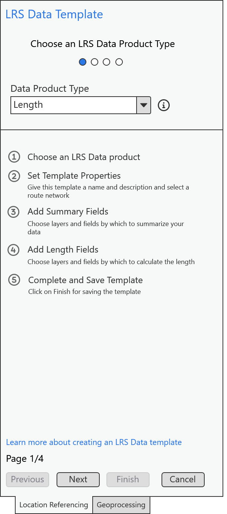

# LRS Data Template wizard – Test Plan

| Field | Value |
| --- | --- |
| **Doc** | 354 · Test Plan · Pro |
| **Product** | Roads & Highways · Pipeline Referencing |
| **Release** | — |
| **Issues** | [ArcGISPro/ps-location-referencing#5882](https://devtopia.esri.com/ArcGISPro/ps-location-referencing/issues/5882) |
| **Source** | [LRSDataTemplate_Testplan.pptx](<https://esriis.sharepoint.com/sites/LocationReferencing/Shared%20Documents/General/Test%20Plans/LRSDataTemplate_Testplan.pptx>) |
| **People** | author Lakshmi Ananthanarayanan · PE Claire · dev Sharon |
| **Edited** | 2024-07-02 19:25 by Claire Wang |
| **Extracted** | 2026-09-04 · lane xmlstrip · format 3.0 · prompt v2.0.2 |
| **Keywords** | data template · template creation · route identifier · mileage · network layer · template validation · error handling |
| **Tools** | LRS Data Template |

## Summary

Test plan for the LRS Data Template tool added to the Location Referencing ribbon in ArcGIS Pro. Covers UI verification, functionality checks, error handling, and positive and negative test cases across different database types and network configurations. Includes tests for template creation, overwriting, and validation of parameters such as network selection, template name, and description length.

## Related documents

<!-- related:begin -->
- [Support a single summary field in LRS Data Template wizard – Test Plan](<https://esriis.sharepoint.com/sites/lrsworkspace/LRS Doc Index/Test Plans/5774-support-a-single-summary-field-in-lrs-data-template-wizard.md>) — similar text 0.50 · 1 title word · 1 filename word · same kind/surface/pe/dev/folder <!-- rel:347 s=6.302 -->
- [LRS Data Template Preview – Test Plan](<https://esriis.sharepoint.com/sites/lrsworkspace/LRS Doc Index/Test Plans/5814-lrs-data-template-preview.md>) — similar text 0.49 · 1 filename word · same kind/surface/pe/dev/folder <!-- rel:355 s=6.113 -->
- [Support multiple summary fields in LRS Data Template wizard – Test Plan](<https://esriis.sharepoint.com/sites/lrsworkspace/LRS Doc Index/Test Plans/5770-support-multiple-summary-fields-in-lrs-data-template-wizard.md>) — similar text 0.42 · 1 title word · 1 filename word · same kind/surface/pe/dev/folder <!-- rel:323 s=5.636 -->
- [Route Log data product template – Test Plan](<https://esriis.sharepoint.com/sites/lrsworkspace/LRS Doc Index/Test Plans/6203-route-log-data-product-template.md>) — similar text 0.33 · 1 filename word · same kind/surface/pe/dev/folder <!-- rel:256 s=5.081 -->
- [Support length fields using unique values in LRS Data Template wizard – Test Plan](<https://esriis.sharepoint.com/sites/lrsworkspace/LRS Doc Index/Test Plans/5768-support-length-fields-using-unique-values-in-lrs-data.md>) — similar text 0.36 · 1 title word · 1 filename word · same kind/surface/dev/folder <!-- rel:322 s=4.729 -->
<!-- related:end -->

<!-- docs:begin -->
## Esri documentation

[Create a template for an LRS length data product](https://doc.esri.com/en/arcgis-pro/latest/help/production/roads-highways/create-a-template-for-an-lrs-length-data-product.html)
<!-- docs:end -->

---

## Overview

### Slide 1 — LRS Data Template wizard – Test Plan <!-- slide 1 -->

https://devtopia.esri.com/ArcGISPro/ps-location-referencing/issues/5882

PE: Claire
Dev: Sharon

## Test Cases

### TC-U01 — LR tool <!-- src: S5 · slide 2 · label LR tool -->

**Steps:**
1. Add a tool “LRS Data Template” in LRS Data Products group in LR ribbon
2. Needs location referencing license to use tool

### TC-N01 — User provides invalid Description that exceeds 300 characters <!-- src: S3 · slide 5 · table · 1 -->

- **ID:** 1
- **Expected Result:** Cannot type after 300

### TC-N02 — If there are duplicate field tags in existing template, go with the first one <!-- src: S3 · slide 5 · table · 2 -->

- **ID:** 2
- **Expected Result:** go with the first one

### TC-N03 — User selects an existing template json and changes parameters <!-- src: S3 · slide 5 · table · 3 -->

- **ID:** 3
- **Expected Result:** Warning of overwriting existing file

### TC-N04 — User selects an existing template json but it’s for a different network <!-- src: S3 · slide 5 · table · 4 -->

- **ID:** 4
- **Case:** User selects an existing template json but it’s for a different network, or it does not have a valid network
- **Expected Result:** Error + red box

### TC-P01 — Create a template for RH. <!-- src: S3 · slide 6 · table · 1 -->

- **ID:** 1
- **Expected Result:** Template generated with correct RID and mileage fields.

### TC-P02 — Create a template for APR – engineering when 2 networks exist in map. <!-- src: S3 · slide 6 · table · 2 -->

- **ID:** 2
- **Expected Result:** Template generated with correct RID and mileage fields.

### TC-P03 — Create a template for APR – continuous when 2 networks exist in map. <!-- src: S3 · slide 6 · table · 3 -->

- **ID:** 3
- **Expected Result:** Template generated with correct RID and mileage fields.

### TC-P04 — Create a template for PoM when multiple networks exist in map. <!-- src: S3 · slide 6 · table · 4 -->

- **ID:** 4
- **Expected Result:** Template generated with correct RID and mileage fields.

### TC-P05 — Create a template for AM. <!-- src: S3 · slide 6 · table · 5 -->

- **ID:** 5
- **Expected Result:** Template generated with correct RID and mileage fields.

### TC-P06 — Open a template for RH and overwrite it. <!-- src: S3 · slide 6 · table · 6 -->

- **ID:** 6
- **Expected Result:** Template shown with correct RID and mileage fields. Template is overwritten with changed inputs.

### TC-P07 — Open a template for APR-engineering and overwrite it. <!-- src: S3 · slide 6 · table · 7 -->

- **ID:** 7
- **Expected Result:** Template shown with correct RID and mileage fields. Template is overwritten with changed inputs.

### TC-P08 — Open a template for PoM and overwrite it. <!-- src: S3 · slide 6 · table · 8 -->

- **ID:** 8
- **Expected Result:** Template shown with correct RID and mileage fields. Template is overwritten with changed inputs.

### TC-P09 — Close map before saving anything <!-- src: S3 · slide 7 · table · 9 -->

- **ID:** 9
- **Expected Result:** Wizard is not closed but emptied. Nothing is saved or overwritten

### TC-P10 — Switch map <!-- src: S3 · slide 7 · table · 10 -->

- **ID:** 10
- **Expected Result:** Wizard verifies if populated contents are still valid for the current map. If not, error out corresponding (only network in this user story) fields

### TC-P11 — Bring in existing file, description exceeds 300 characters <!-- src: S3 · slide 7 · table · 11 -->

- **ID:** 11
- **Expected Result:** No error. Description shows the first 300 characters. Save will overwrite and save only these 300 characters

## Other content

### Slide 2 <!-- slide 2 -->

UI verification

- Clicking on this tool opens LRS Data Template pane in LRS Data Products tab
- Verify parameters and texts are aligned in LRS Data Template pane
  - The first pane has Data Product Type and instructions – also verify contents
  - The second pane has Network, template Name, and Description inputs
- Verify the first 2 pages only
- Verify the paging experience

### Slide 3 — Name, title and description (the steps) will look different <!-- slide 3 -->

Functionality Verification

- Verify only Length is available for type for now
- Verify only LRS network layer in the map can be used in Network
  - Auto-populate the only/first network in TOC
  - List only networks in dropdown
  - If Network is missing from the TOC. Dropdown is disabled and Finish is disabled, and a blue banner shows up at the top “Add a network layer to the map”
  - If the map is closed, the wizard pane do not close, but empty out with the blue banner
- Provide a valid Name as template file name
- Can also browse to location and import an existing template
  - Network, name and description are populated based on the existing template
  - If the Network configured in the existing template is missing from the TOC. An error shows up in the wizard and users cannot save
- Verify description cannot exceed 300 characters
- Verify the 4 pagination buttons work. Finish creates/overwrites the template.json. For now, only 2 fields can be configured: Route Identifier and Mileage.
  - Verify the RID (for network that is not configured with Rname) or RName (when it’s configured for the network) is saved correctly for the specified network
  - Verify mileagefield is length
- Saved to the project directory by default. Can save to another directory.

No bigger box
After entering, character count will update

### Slide 4 <!-- slide 4 -->

Testing

- Test in fgdb, egdb (oracle + sql), fs - default and child versions
- Test with nonline, Line, Derived network, PoM, and Addressing (sanity)
- Test when there are multiple networks in TOC
- Test creating new template and opening and overwriting existing template
- The tool should recognize network layer when it is checked off (invisible) in map
  - Test when Network does not exist in TOC (for creating new and overwriting existing (Step 2 & 4) from previous page)
- Test with different Name and Description
- Test closing map – the wizard pane do not close, but empty out with the blue banner
- Test with dark and light theme
- 508 and i18n compliance
Automation: not yet
Doc: not yet

### Slide 5 — Negative cases/Error message verification <!-- slide 5 -->

– Developer provides error messages

### Slide 7 — Positive cases <!-- slide 7 -->

|  |  |  |  |
|  |  |  |  |
|  |  |  |  |
|  |  |  |  |
