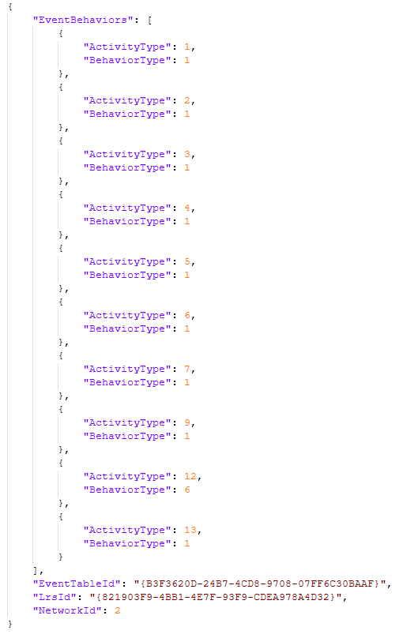
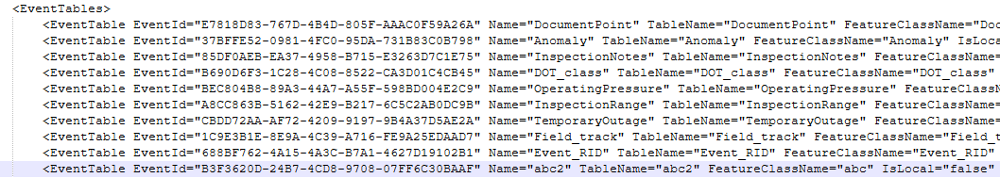
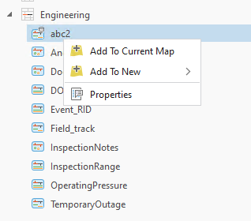

# Support External Event Configuration Without Connection File – Test Plan

| Field | Value |
| --- | --- |
| **Doc** | 275 · Test Plan · Pro |
| **Product** | Roads & Highways · Pipeline Referencing |
| **Release** | — |
| **Issues** | [ArcGISPro/ps-location-referencing#6159](https://devtopia.esri.com/ArcGISPro/ps-location-referencing/issues/6159) |
| **Source** | [ConfigureExternalEventsWOreference_testplan2.pptx](<https://esriis.sharepoint.com/sites/LocationReferencing/Shared%20Documents/General/Test%20Plans/ConfigureExternalEventsWOreference_testplan2.pptx>) |
| **People** | author Lakshmi Ananthanarayanan · PE Claire · dev Eric |
| **Edited** | 2024-12-09 22:08 by Claire Wang |
| **Extracted** | 2026-09-04 · lane xmlstrip · format 3.0 · prompt v2.0.2 |
| **Keywords** | external event · event behavior · point event · line event · event configuration · lrs metadata · python · model builder |
| **Tools** | Configure External Event Behaviors with LRS · Remove LRS Entity |

## Summary

Test plan for the new tool 'Configure External Event Behaviors with LRS' which supports external event configuration without a connection file. Covers UI tests, functionality tests with different data types and event behaviors, automation integration, and documentation updates. Includes positive and negative test cases for configuring and updating point and line events with various behaviors.

## Related documents

<!-- related:begin -->
- [Relocate Events Support for External Event with No Connection File - Test Plan](<https://esriis.sharepoint.com/sites/lrsworkspace/LRS Doc Index/Test Plans/5987-relocate-events-support-for-external-event-with-no.md>) — similar text 0.10 · 4 title words · 3 filename words · same kind/dev/folder <!-- rel:264 s=5.942 -->
- [Create External Event with No Connection File](<https://esriis.sharepoint.com/sites/lrsworkspace/LRS Doc Index/User Stories/create-external-event-with-no-connection-file.md>) — similar text 0.50 · 3 title words · 1 filename word · same surface <!-- rel:288 s=4.722 -->
- [Configure External Events](<https://esriis.sharepoint.com/sites/lrsworkspace/LRS%20Doc%20Index/Design%20Spikes/configure-external-events.md>) — similar text 0.25 · 1 title word · 3 filename words · same surface <!-- rel:811 s=4.165 -->
- [Support updating External Event configuration](<https://esriis.sharepoint.com/sites/lrsworkspace/LRS Doc Index/User Stories/support-updating-external-event-configuration.md>) — similar text 0.20 · 4 title words · 1 filename word · same surface <!-- rel:744 s=3.85 -->
- [Configure External Event Behaviors With LRS](<https://esriis.sharepoint.com/sites/lrsworkspace/LRS Doc Index/Other/configure-external-eb-with-lrs.md>) — similar text 0.13 · 2 title words · 2 filename words · same surface <!-- rel:248 s=3.584 -->
<!-- related:end -->

<!-- docs:begin -->
## Esri documentation

[External event registration](https://doc.esri.com/en/arcgis-pro/latest/help/production/roads-highways/external-event-registration.html) · [Event behavior](https://doc.esri.com/en/arcgis-pro/latest/help/production/roads-highways/what-is-event-behavior.html)

_No page matched:_ [Configure External Event Behaviors with LRS](https://www.google.com/search?q=%22Configure%20External%20Event%20Behaviors%20with%20LRS%22+site%3Adoc.esri.com) · [Remove LRS Entity](https://www.google.com/search?q=%22Remove%20LRS%20Entity%22+site%3Adoc.esri.com)
<!-- docs:end -->

---

## Overview

### Slide 1 — Support external event configuration without connection file – Test Plan <!-- slide 1 -->

https://devtopia.esri.com/ArcGISPro/ps-location-referencing/issues/6159

PE: Claire
Dev: Eric

### Slide 2 <!-- slide 2 -->

UI test

- The new tool is called “Configure External Event Behaviors with LRS”
- Tool is added under LR – Configuration – Events toolbox once tool and doc are checked-in (for testing, it’s under LR)
- Users type an LRS Event Name, choose a Parent LRS network from an egdb or fgdb, and use dropdown for the other options
  - By Default, geometry is point and all event behaviors are stayput
  - Verify the dropdown only contains the options we support (e.g. point does not have Realign Cover)

Configure External Event Behaviors with LRS

### Slide 3 <!-- slide 3 -->

Functionality test

- Test with RH and APR data
- Test egdb (traditional and branch versioned) and fgdb
- Test configuring point and line events
- Test configuring different event behavior rules
- Test updating existing external events configured by this tool
  - Type the name in, the other parameters will update once losing focus
  - External events configured by the old tool cannot be updated by this tool. If the name is typed in, a warning will show and running will fail
  - The old tool can be used to update events configured by this new tool by providing a connection file and required fields. Once this is done, the external events cannot be updated by this new tool (2)
- When executed, create an entry in the LRS metadata for the external event. Check via python
  - lrs=arcpy.Describe("C:\\test\\test.sde\\OWNER.lrs\\OWNER.lrs")
  - lrs.lrsMetadata
  - Verify IsLocal=“false”, and reference fields (e.g. TableName; FeatureClassName; TableNameXML; etc) are empty as the external event is not referring to a fc
  - lrs.eventBehaviorRules
  - Verify the IDs and event behavior codes are correct
- Verify the external event shows up in Hierarchy, but it cannot be added to map as it’s not a fc
- Verify the properties of the external event
- Verify the external events can be removed by Remove LRS Entity tool, and sanity check metadata and hierarchy after it’s removed
- Test in python and model builder

Source and index are shown for feature dataset (LRS)
Title says “External Event” instead of “FC” from the old tool
Add in design change – request a new icon for the new external events types

### Slide 4 <!-- slide 4 -->

Automation
Add new automation into APR python test

Documentation

- Create a new topic for the GP tool
- Make sure the usage notes mention how this type of external event would require additional parameters/data to be shared in Relocate Events.
- Update the External Event registration topic to mention the two patterns of external events now supported.  Provide a paragraph/table/graphics providing context for the differences and the different requirements for each type of external event.
- Make sure to mention the new tool can be used to update external events that do not have connection file
- Update the External System Integration with ArcGIS Roads and Highways topic to discuss these changes.  It would be good to include graphics showing the architectural differences between the two types (connection file vs no connection file).  Nathan has graphics to share in the External System Integrations Diagrams ppt.

## Test Cases

### TC-P01 — Configure a point event with non-line network with all stayput behaviors <!-- src: S4 · slide 5 · Positive cases · 1 -->

- Configure a point event with non-line network with customized behaviors
- Configure a point event with line network with customized behaviors
- Update a point event with non-line network
- Update a point event with line network
- Configure a line event with non-line network with customized behaviors
- Configure a line event with line network with all stayput behaviors
- Configure a line event with line network with customized behaviors
- Update a line event with non-line network
- Update a line event with line network

### TC-N01 — Input Event Name is left empty <!-- src: S4 · slide 6 · Negative cases · 1 -->

- Input Event Name is not supported (e.g. not too long; not special chars)
- Input Event is an external event configured by the old tool  more specific? Can be the same error as below,
- Input Event is an LRS element (event/network/intersection/cp/lrs tables/etc)
- Input Network is left empty
- Input Network is an LRS event
- Input Network is derived network or postmile
- Input Network is not an LRS feature class
- Input Network is from FS
- Additional negative cases for Python –
- Geometry type is empty
- Geometry type is invalid
- Event Behavior(s) are empty if so it’s stayput
- Event Behavior(s) are invalid
