# GenerateLengthSummary – Test Plan

| Field | Value |
| --- | --- |
| **Doc** | 172 · Test Plan · Pro |
| **Product** | Roads & Highways · Pipeline Referencing |
| **Release** | — |
| **Issues** | [ArcGISPro/ps-location-referencing#6202](https://devtopia.esri.com/ArcGISPro/ps-location-referencing/issues/6202) |
| **Source** | [GenerateLengthSummary_Standalonegptool_testplan (1).pptx](<https://esriis.sharepoint.com/sites/LocationReferencing/Shared%20Documents/LR%20Product%20Engineers/GenerateLengthSummary_Standalonegptool_testplan%20(1).pptx>) |
| **People** | author Lakshmi Ananthanarayanan · PE Praveen · dev Michael |
| **Edited** | 2025-05-08 22:13 by Praveen Kumar |
| **Extracted** | 2026-09-04 · lane xmlstrip · format 3.0 · prompt v2.0.2 |
| **Keywords** | length summary · geoprocessing · route · summary field · length field · route dominance · data product |
| **Tools** | Generate Length Summary |

## Summary

Test plan for the Generate Length Summary geoprocessing tool under the Data Products toolset. It covers UI verification, functionality verification including support for various network types, effective date handling, output formats, summary and length fields, exclusion of null rows, route dominance calculations, and cancellation and progress feedback. The document includes detailed test cases with expected outputs for summarizing length by various fields and network configurations, as well as negative test cases.

## Related documents

<!-- related:begin -->
- [Generate LR Data Product: Support summary and length fields from the template – Test Plan](<https://esriis.sharepoint.com/sites/lrsworkspace/LRS Doc Index/Test Plans/5769-generate-lr-data-product-support-summary-and-length-fields.md>) — similar text 0.83 · 1 filename word · same kind/surface/dev <!-- rel:339 s=6.229 -->
- [Standalone GP – Generate Feature Count – Test Plan](<https://esriis.sharepoint.com/sites/lrsworkspace/LRS Doc Index/Test Plans/6205-standalone-gp-generate-feature-count.md>) — similar text 0.31 · 1 filename word · same kind/surface/dev/folder <!-- rel:173 s=4.658 -->
- [Support multiple summary fields in Generate LRS Data Product – Test Plan](<https://esriis.sharepoint.com/sites/lrsworkspace/LRS Doc Index/Test Plans/5773-support-multiple-summary-fields-in-generate-lrs-data-product.md>) — similar text 0.27 · 2 filename words · same kind/surface/dev <!-- rel:321 s=4.633 -->
- [Support table output with the length product template – Test Plan](<https://esriis.sharepoint.com/sites/lrsworkspace/LRS Doc Index/Test Plans/6458-support-table-output-with-the-length-product-template.md>) — similar text 0.17 · 2 filename words · same kind/surface/dev <!-- rel:232 s=4.473 -->
- [Generate Length Summary Geoprocessing Tool](<https://esriis.sharepoint.com/sites/lrsworkspace/LRS Doc Index/Other/generate-length-summary-gp.md>) — similar text 0.29 · 3 filename words · same surface <!-- rel:282 s=4.416 -->
<!-- related:end -->

<!-- docs:begin -->
## Esri documentation

[LRS data products](https://doc.esri.com/en/arcgis-pro/latest/help/production/roads-highways/lrs-data-products.html)

_No page matched:_ [Generate Length Summary](https://www.google.com/search?q=%22Generate%20Length%20Summary%22+site%3Adoc.esri.com)
<!-- docs:end -->

---

## Overview

### Slide 1 — GenerateLengthSummary – Test Plan <!-- slide 1 -->

https://devtopia.esri.com/ArcGISPro/ps-location-referencing/issues/6202

PE: Praveen
Dev: Michael

### Slide 2 <!-- slide 2 -->

UI Verification

- Verify tool name “Generate Length Summary”
- Verify that the tool is present under toolset “Data Products”
- Verify tool parameters on the right
  - The style aligns with other GP tools
  - Required and optional parameters
  - Summary Fields has an accordion and option to add multiple Summary Fields
  - Length Fields has an accordion and option to add multiple Length Fields
Functionality Verification

- Tool outputs a Length Summary data product
- Tool supports fgdb, dc, and fs input
- Input Route Features
  - Dropdown lists all layers, error out when a non-network layer is chosen. The same applies to using the browser button.
  - Support non-line, line, derived, and PoM networks
    - In the output, use Route Name and Line Name for line network; use Route ID for the other 3
  - Support selection sets, time filter and definition queries on the routes
    - Routes selected in a line network: Data product created for the all the routes in the line to which the selected route belongs to. If any routes in the lines are uncalibrated, return 1 row for this route with all entries being null

### Slide 3 <!-- slide 3 -->

Functionality Verification

- Effective date
  - Default to today’s date
  - The routes that are present on this date will be used for calculation, including filters, if any
  - No routes exist on the selected date: Empty output is generated with a warning
  - PY: Incorrect date format. Show error message.
  - Test with a route that does not have a 00:00:00 timestamp and check if there is a difference in the output
- Output format can be table or CSV
- Output file location is project folder by default for csv, and default.fgdb by default for table. Users can browse to and provide a different location.
  - CSV can be overwritten in UI and python
  - PY: Cannot overwrite an existing file. Show error message.
  - PY: Provide an invalid path/name. Show error message.
- By default Units should be the m unit of the Input Route Features

### Slide 4 <!-- slide 4 -->

Functionality Verification

- Summary Fields
  - Layer
  - Dropdown lists all layers, error out when an invalid layer is chosen. The same applies to using the browser button.
  - Eligible layers: only Polygons and line events registered to the network; Must be in the same database/fs as the Network; Must have the same projection system as the Network
  - No limit of # of layers (for testing, add 4 at most)
  - Support selection sets, time filter and definition query
  - Field
  - List non-system fields in dropdown. This field’s value will be used to summarize
  - Output Field Name
  - By default, the same value as Field. Users can change it
  - If users leave it empty, error out
- Users can have none, single, or multiple Summary fields by using the multi selection button. Users can delete a summary field

## Test Cases

### TC-U01 — Length Fields <!-- src: S1 · slide 5 · case 10 -->

Functionality Verification

  - Layer
  - Dropdown lists all layers, error out when an invalid layer is chosen. The same applies to using the browser button.
  - Eligible layers: only Network and line events registered to the network; Must be in the same database/fs as the Network; Must have the same projection system as the Network
  - No limit of # of layers (for testing, add large no of layers)
  - Support selection sets, time filter and definition query
  - Output Field Name
  - By default, the same value as Field. Users can change it (Test with long field names and some special characters)
  - If users leave it empty, error out
- Ensure that the Length fields will be ordered in the output in the order they have been added
- Users can have none, single, or multiple Length fields by using the Add another button. Users can delete a Length field

### TC-U02 — Exclude Null Summary Rows Is Checked by Default. If All the Fields in a Row Have <!-- src: S1 · slide 6 · case 13 -->

- **Case:** Exclude null summary rows is checked by default. If all the fields in a row have a value of 0, then exclude that row from the output

Functionality Verification

- Automatically, provide the totals in the output
- Users can cancel the tool run
- Show a progress bar when the tool is running
- Test with layers that have , in Name in table (for summary and Length layers), and make sure output does not have indentation issues
- Calculate length for dominant routes ??
  - If route dominance is configured, then calculate the length only for the dominant routes
  - If route dominance is not configured, then do the calculations as we do today in 3.4/11.4
  - When this option is chosen, and length layers are events, then calculate the length for the events that associated with the dominant routes in each overlapping section
  - Perform these calculations only when dominance rules are set up for the chosen network
  - The selection set on the route determines which routes are being used for calculating the output
  - Turn ON by default
  - Calculate the length of the route that is not intersecting the summary layers and name the cell as “Unclassified”.

### TC-N01 — Network is invalid (UI and py) <!-- src: S4 · slide 8 · Negative cases · 1 -->

### TC-N02 — Output format is invalid/empty (py only) <!-- src: S4 · slide 8 · Negative cases · 2 -->

### TC-N03 — Output file is invalid/empty (py only) <!-- src: S4 · slide 8 · Negative cases · 3 -->

### TC-N04 — Cannot overwrite output file (py only) <!-- src: S4 · slide 8 · Negative cases · 4 -->

### TC-N05 — Effective date is invalid (py only) if empty in py, default to today’s date <!-- src: S4 · slide 8 · Negative cases · 5 -->

### TC-N06 — Summary layer is invalid (py only) <!-- src: S4 · slide 8 · Negative cases · 6 -->

### TC-N07 — Summary layer (line) is not registered as a line event to the selected network <!-- src: S4 · slide 8 · Negative cases · 7 -->

- **Case:** Summary layer (line) is not registered as a line event to the selected network (UI and py)

### TC-N08 — Summary field is empty (UI) <!-- src: S4 · slide 8 · Negative cases · 8 -->

### TC-N09 — Summary field is invalid (py only) <!-- src: S4 · slide 8 · Negative cases · 9 -->

### TC-N10 — Summary field name in table is empty (UI and py) <!-- src: S4 · slide 8 · Negative cases · 10 -->

### TC-N11 — Summary field name in table is invalid (py only) <!-- src: S4 · slide 8 · Negative cases · 11 -->

### TC-N12 — Length layer is not registered to the network (UI and py) <!-- src: S4 · slide 8 · Negative cases · 12 -->

### TC-N13 — Length layer is invalid (py only) <!-- src: S4 · slide 8 · Negative cases · 13 -->

### TC-N14 — Length layer field name in table is empty (UI and py) <!-- src: S4 · slide 8 · Negative cases · 14 -->

### TC-N15 — Length layer field name in table is invalid (py only) <!-- src: S4 · slide 8 · Negative cases · 15 -->

### TC-N16 — Exclude null Boolean parameter is invalid (py only) <!-- src: S4 · slide 8 · Negative cases · 16 -->

### TC-N17 — Duplicate layers selected as summary layer (UI and py) <!-- src: S4 · slide 8 · Negative cases · 17 -->

### TC-N18 — Duplicate layers selected as Length layer (UI and py) <!-- src: S4 · slide 8 · Negative cases · 18 -->

### TC-U03 — Summarize by Polygon No length field – Nonline network <!-- src: S2 · slide 12 · case 4 -->

| Summarize by / summary field |
| --- |
| County/ Name |

| Name | Length |
| --- | --- |
| Clark | 6.500 |
| Lewis | 3.000 |
| Place | 2.500 |

Output from GP Tool
The heading for the output in the csv will come from the field names.
Name , Length
Clark , 6.500
Lewis , 3.000
Place , 2.500

[figure: Input · 0 · 10 · 1–9 · 11 · 12 · Lewis · Placer · Clark · R1]

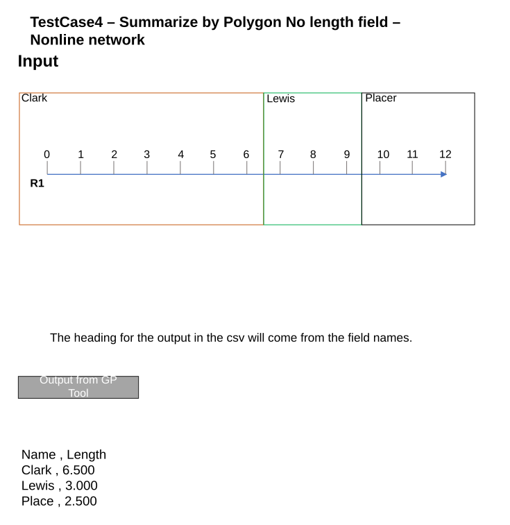

### TC-U04 — Summarize by Polygon No length field, few polygons selected <!-- src: S2 · slide 14 · case 7 -->

| Summarize by/summary field |
| --- |
| County / Name |
| Clark |
| Lewis |

| Name | Length |
| --- | --- |
| Clark | 6.500 |
| Lewis | 3.000 |

Output from GP Tool
Name, Length
Clark ,  6.500
Lewis , 3.000

[figure: Input · 0 · 10 · 1–9 · 11 · 12 · Lewis · Placer · Clark · R1]

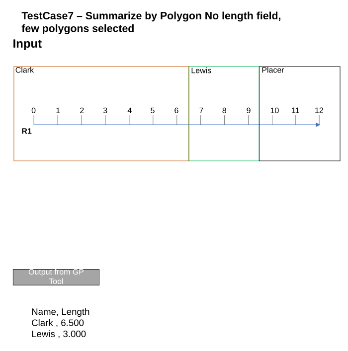

### TC-U05 — Summarize by LRS event(functional class) <!-- src: S2 · slide 16 · case 9 -->

| Summarize by/ summary field |
| --- |
| Functional Class/Class |

| Class | Length |
| --- | --- |
| Interstate | 8.000 |
| Arterial | 4.000 |

Output from GP Tool
Class , Length
Interstate , 8.000
Arterial , 4.000

[figure: Input · 0 · 10 · 1–9 · 11 · 12 · Lewis · Placer · Clark · R1 · Interstate · Arterial]

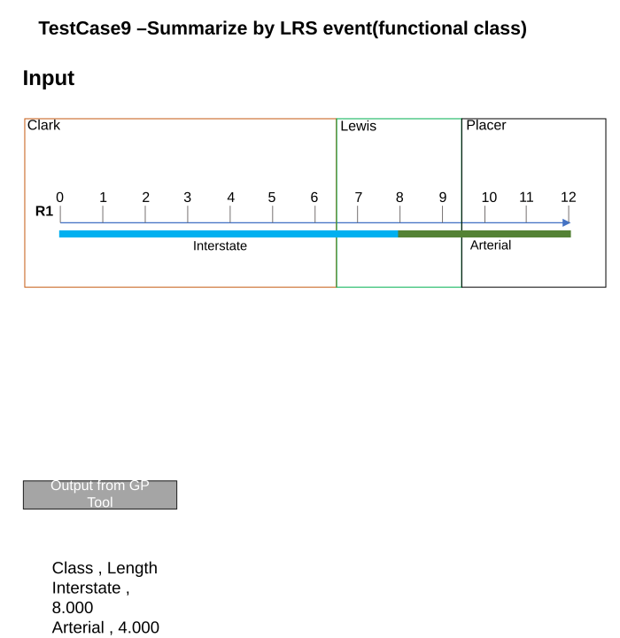

### TC-U06 — Summarize by polygon and length (Toll) <!-- src: S2 · slide 17 · case 10 -->

| Summarize by/ summary field | Length Field (Toll event) |
| --- | --- |
| County/Name | Toll Miles |

| Name | Toll Miles |
| --- | --- |
| Clark | 4.000 |
| Lewis | 1.000 |
| Placer | 0.000 |

Output from GP Tool
The length fields is Toll event layer
Name , Toll Miles
Clark , 4.000
Lewis , 1.000
Placer , 0.000

[figure: Input · 0 · 10 · 1–9 · 11 · 12 · Lewis · Placer · Clark · R1]

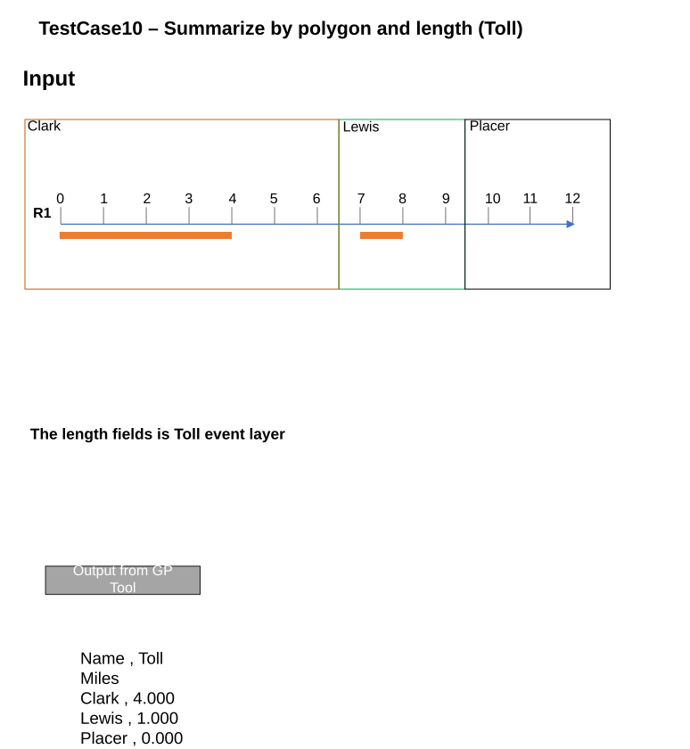

### TC-U07 — Summarize by polygon and length (Functional Class) <!-- src: S2 · slide 18 · case 10a -->

| Summarize by/ summary field | Length Fields (Functional Class) |  |
| --- | --- | --- |
| County/Name | Interstate | Arterial |

| Name | Interstate | Arterial |
| --- | --- | --- |
| Clark | 6.5 |  |
| Lewis | 1.5 | 1.5 |
| Placer | 0.000 | 2.5 |

Output from GP Tool
The length fields is Toll event layer

[figure: Input · 0 · 10 · 1–9 · 11 · 12 · Lewis · Placer · Clark · R1 · Interstate · Arterial]

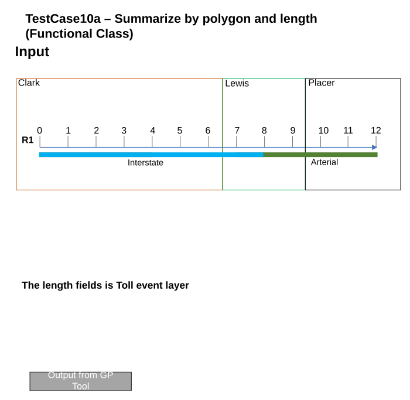

### TC-U08 — Summarize by LRS Event(functional class) and length field (Toll ) <!-- src: S2 · slide 19 · case 11 -->

| Summarize by/ summary field | Length Field (Toll event) |
| --- | --- |
| Functional Class/Class | Toll Miles |

| Class | Toll Miles |
| --- | --- |
| Interstate | 5.000 |
| Principal Arterial - Freeway | 1.000 |
| Principal Arterial – other | 0.000 |
| Minor Arterial | 0.000 |
| Major Collector | 0.000 |
| Minor Collector | 0.000 |
| Local | 0.000 |

Output from GP Tool
The length fields is Toll event layer
Class, Toll Miles
Interstate , 5.000
Principal Arterial-Freeway , 1.000
Principal Arterial - Other , 0.000
Minor Arterial, 0.000
Major Collector, 0.000
Minor Collector, 0.000
Local, 0.000

[figure: Input · 0 · 10 · 1–9 · 11 · 12 · Lewis · Placer · Clark · R1 · Interstate · Arterial- Freeway]

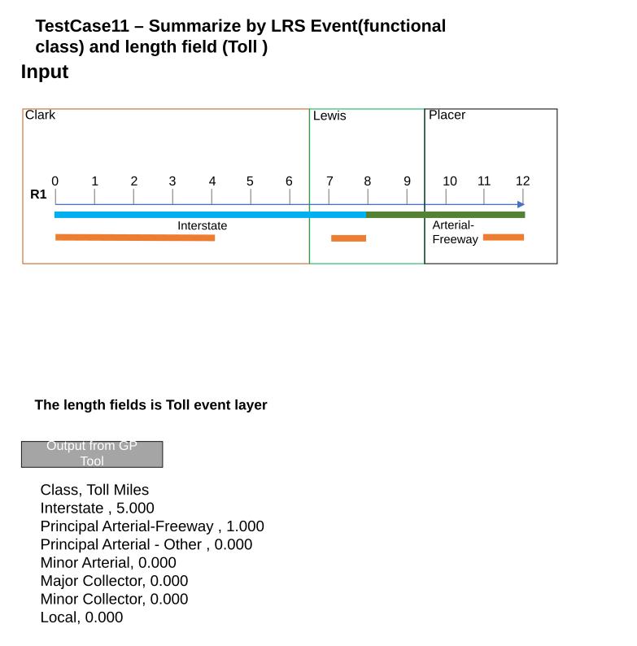

### TC-U09 — – Summarize by LRS Event(functional class) and length field (Toll ) <!-- src: S2 · slide 20 · case 11a -->

| Summarize by/ summary field | Length Field (Toll event) |
| --- | --- |
| Functional Class/Class | Network |

| Class | Length |
| --- | --- |
| Interstate | 8.000 |
| Principal Arterial - Freeway | 4.000 |

Output from GP Tool
The length fields is network  layer
Class, Toll Miles
Interstate , 8.000
Principal Arterial-Freeway , 4.000

[figure: Input · 0 · 10 · 1–9 · 11 · 12 · Lewis · Placer · Clark · R1 · Interstate · Arterial- Freeway]

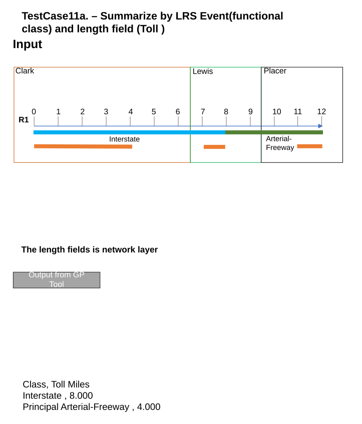

### TC-U10 — Time Sliced Scenario <!-- src: S2 · slide 30 · case 22 -->

| Summarize by/ summary field | Length Field |  |
| --- | --- | --- |
| Functional Class/Class | Toll Miles | Guardrail Miles |

| R1 | 1/1/2000 - Null |
| --- | --- |
| Functional Class | 1/1/2005 – Null |
| Toll | 1/1/2010 – Null |
| Guard Rail | 1/1/2005 -1/1/2020 |

Output from GP Tool

| Class | Toll Miles | Guardrail Miles |
| --- | --- | --- |

1. Effective Date : 1/1/2003 (warning empty csv )
2. Effective Date : 1/1/2006

| Class | Toll Miles | Guardrail Miles |
| --- | --- | --- |
| Interstate | 5.000 | 2.000 |
| Principal Arterial - Freeway | 1.000 | 2.000 |

| Class | Toll Miles | Guardrail Miles |
| --- | --- | --- |
| Interstate | 0.000 | 2.000 |
| Principal Arterial - Freeway | 0.000 | 2.000 |

| Class | Toll Miles | Guardrail Miles |
| --- | --- | --- |
| Interstate | 5.000 | 0.000 |
| Principal Arterial - Freeway | 1.000 | 0.000 |

3. Effective Date : 1/1/2015
4. Effective Date : 1/1/2020

[figure: Input · 0 · 10 · 1–9 · 11 · 12 · Lewis · Placer · Clark · R1 · Interstate · Arterial- Freeway]

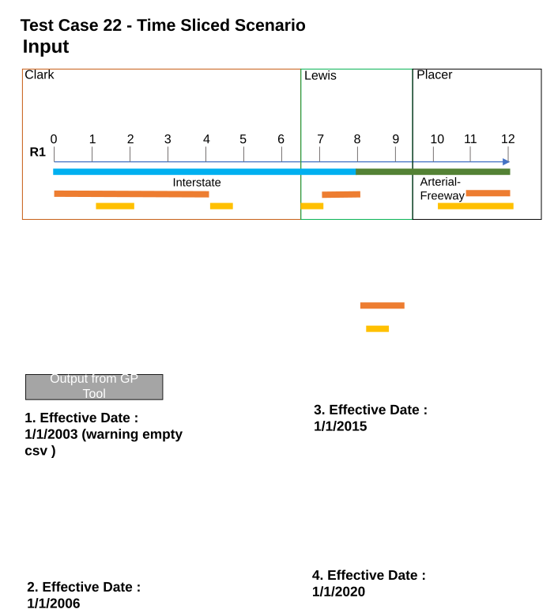

### TC-U11 — Derived Route Network <!-- src: S2 · slide 35 · case 26 -->

Output from GP Tool

| Summarize by/ summary field | Length Field |
| --- | --- |
| County/Name | Mileage |

| County | Mileage |
| --- | --- |
| Clark | 6.500 |
| Lewis | 5.500 |

[figure: Input · Lewis · Clark · 1–3 · 5 · 4 · 0 · 2–4 · 1 · 7–9 · 11 · 10 · R1L1 · R2L1 · R1L2 · Route1(Derived Network) · Route2(Derived Network)]

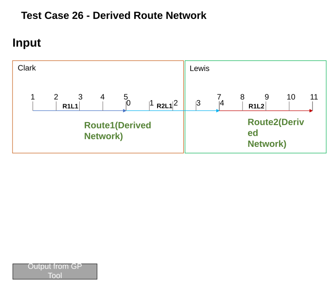

## Other content

### Slide 7 <!-- slide 7 -->

Testing

- Test in fgdb, egdb (oracle + sql), fs - default and versions
- Focus testing with RH, APR, APRUN (GCS) and ADM
- Test with these routes: Types of Routes: Normal, Gapped, Multi-gapped, Self intersecting, Having z values, overlapping
- Test with polygon and line summary layers and combinations*
- Test the case where the route does not intersect any summary layer
- Test without summary fields
- Test with and without route selection, time filter and definition query on the network, summary layer and Length layers
- Test few case with overlapping and gapped summary layers
- Test with python and model builder
- Test without length fields
- Test without summary and length fields
- Test with Multiple layers (functional class filtered multiple times)
- Chaining in MB and batch processing
Documentation
New GP doc
Add link into related topics in stand alone and data product gp tools and template topics
Automation
New GP automation

### Slide 9 <!-- slide 9 -->

TestCase1 – Summarize by  LRS Network (no summary field and no length field). the mileage will be summarized route wise.

| RouteID | Length |
| --- | --- |
| R1 | 12.000 |

Output from GP Tool
If no boundary layer is chosen, then

[figure: Input · 0 · 10 · 1–9 · 11 · 12 · Lewis · Placer · Clark · R1]

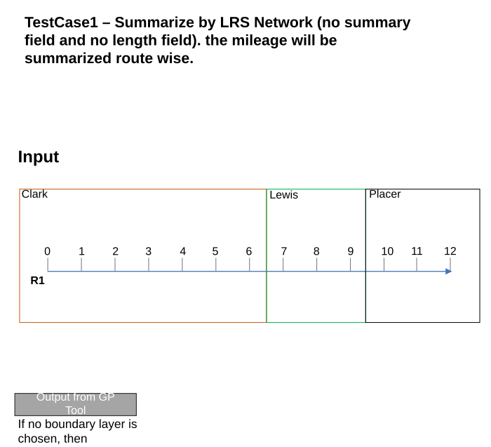

### Slide 10 <!-- slide 10 -->

TestCase2 – Summarize by Line Network –  (no summary field and no length field).  If nothing is provided, then the mileage will be summarized route wise. (Add an output containing countywise summary)
Output from GP Tool

When no summary or length name is provided

[figure: Input · Lewis · Clark · 1–3 · 5 · 4 · 0 · 2–4 · 1 · 7–9 · 11 · 10 · R1L1 · R2L1 · R1L2]

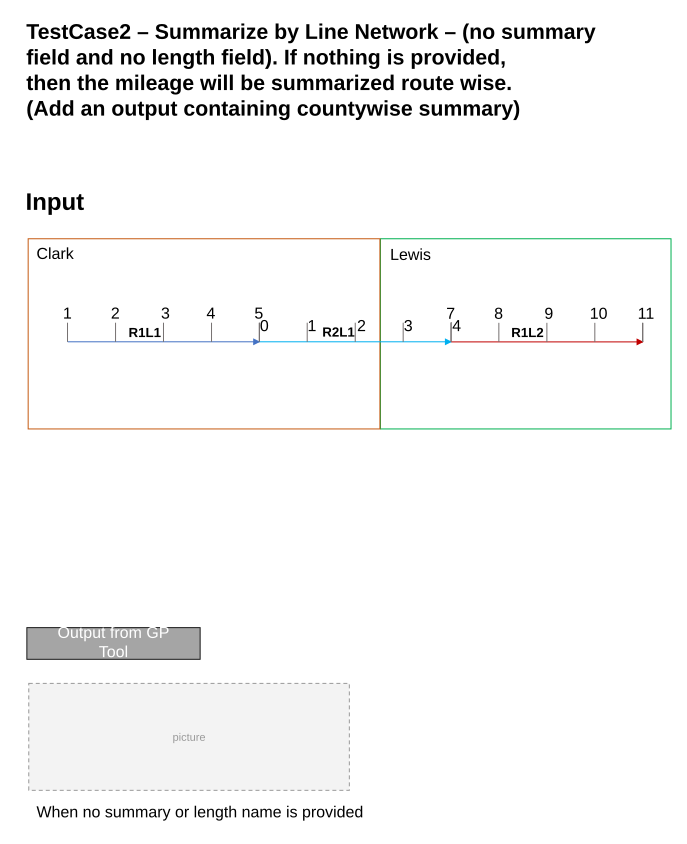

### Slide 11 <!-- slide 11 -->

TestCase3 – Summarize by Line Network –  Summary Field  - Line name , no length field
Output from GP Tool

| Summarize by / summary field |
| --- |
| Network/Line Name |

| Line Name | Length |
| --- | --- |
| L1 | 8.000 |
| L2 | 4.000 |

Line Name , Length
L1 , 8.000
L2 , 4.000

[figure: Input · Lewis · Clark · 1–3 · 5 · 4 · 0 · 2–4 · 1 · 7–9 · 11 · 10 · R1L1 · R2L1 · R1L2]

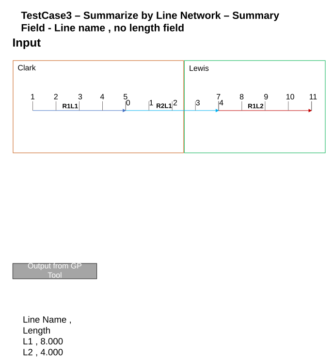

### Slide 13 <!-- slide 13 -->

TestCase5 – Summarize by Line Network –  Summary Field  - County , no length field
Output from GP Tool

| Summarize by / summary field |
| --- |
| County/ County |

County , Length
Clark , 6.500
Lewis , 5.500

[figure: Input · Lewis · Clark · 1–3 · 5 · 4 · 0 · 2–4 · 1 · 7–9 · 11 · 10 · R1L1 · R2L1 · R1L2]

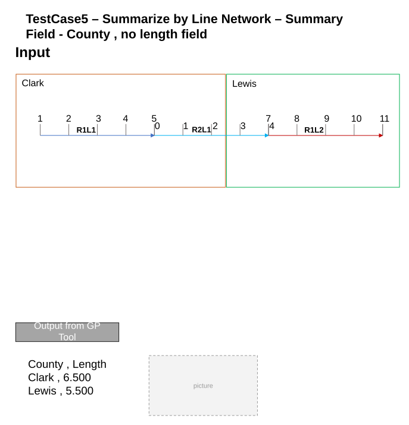

### Slide 15 <!-- slide 15 -->

TestCase8 –No Summary field only length field -  Summary will be route wise

| Summary Field (Network) | Length Fields (No of Lanes) |  |
| --- | --- | --- |
| Mileage | 2 lanes Miles | 4 lanes Miles |

| RouteID | 2 lanes Miles | 4 lanes Miles |
| --- | --- | --- |
| R1 | 8.000 | 4.000 |

Output from GP Tool
RouteID , 2 lanes Miles , 4 lanes Miles
R1  , 8.000 , 4.000

[figure: Input · 0 · 10 · 1–9 · 11 · 12 · R1 · 2 lanes · 4 lanes]

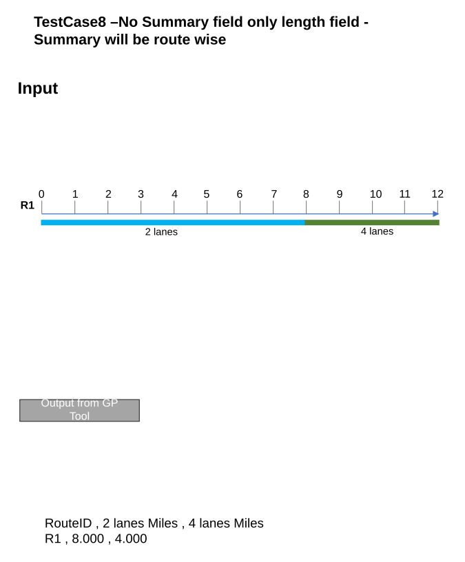

### Slide 21 <!-- slide 21 -->

TestCase12 – Summarize by LRS Event(functional class) and length fields   (Toll , Guardrail)

| Summarize by/ summary field | Length Fields |  |
| --- | --- | --- |
| Functional Class/Class | Toll | Guardrail |

| Class | Toll | Guardrail |
| --- | --- | --- |
| Interstate | 5.000 | 3.000 |
| Principal Arterial - Freeway | 1.000 | 2.000 |
| Principal Arterial – other | 0.000 | 0.000 |
| Minor Arterial | 0.000 | 0.000 |
| Major Collector | 0.000 | 0.000 |
| Minor Collector | 0.000 | 0.000 |
| Local | 0.000 | 0.000 |

Output from GP Tool
The length fields is Toll event layer and Guardrail event layer
Class, Toll, Guardrail
Interstate , 5.000, 3.000
Principal Arterial-Freeway, 1.000, 2.000
Principal Arterial - Other, 0.000, 0.000
Minor Arterial, 0.000, 0.000
Major Collector, 0.000, 0.000
Minor Collector, 0.000, 0.000
Local, 0.000, 0.000

[figure: Input · 0 · 10 · 1–9 · 11 · 12 · Lewis · Placer · Clark · R1 · Interstate · Arterial- Freeway]

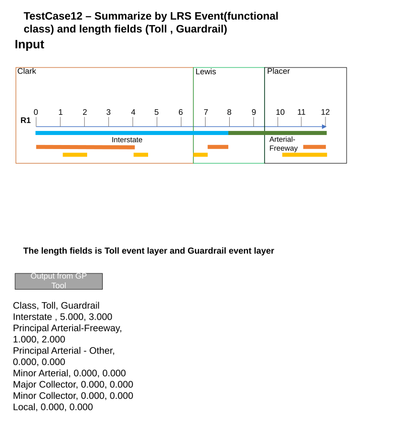

### Slide 22 <!-- slide 22 -->

Test Case 13  – Summarize by LRS Event(functional class) and length fields   (Toll , Guardrail ).  Exclude null values in the GP tool

| Summarize by/ summary field | Length Fields |  |
| --- | --- | --- |
| Functional Class/Class | Toll | Guardrail |

| Class | Toll | Guardrail |
| --- | --- | --- |
| Interstate | 5.000 | 3.000 |
| Principal Arterial - Freeway | 1.000 | 2.000 |

Output from GP Tool
The length fields is Toll event layer and Guardrail event layer
Class, Toll, Guardrail
Interstate , 5.000, 3.000
Principal Arterial-Freeway, 1.000, 2.000
Principal Arterial - Other, 0.000, 0.000

[figure: Input · 0 · 10 · 1–9 · 11 · 12 · Lewis · Placer · Clark · R1 · Interstate · Arterial- Freeway]

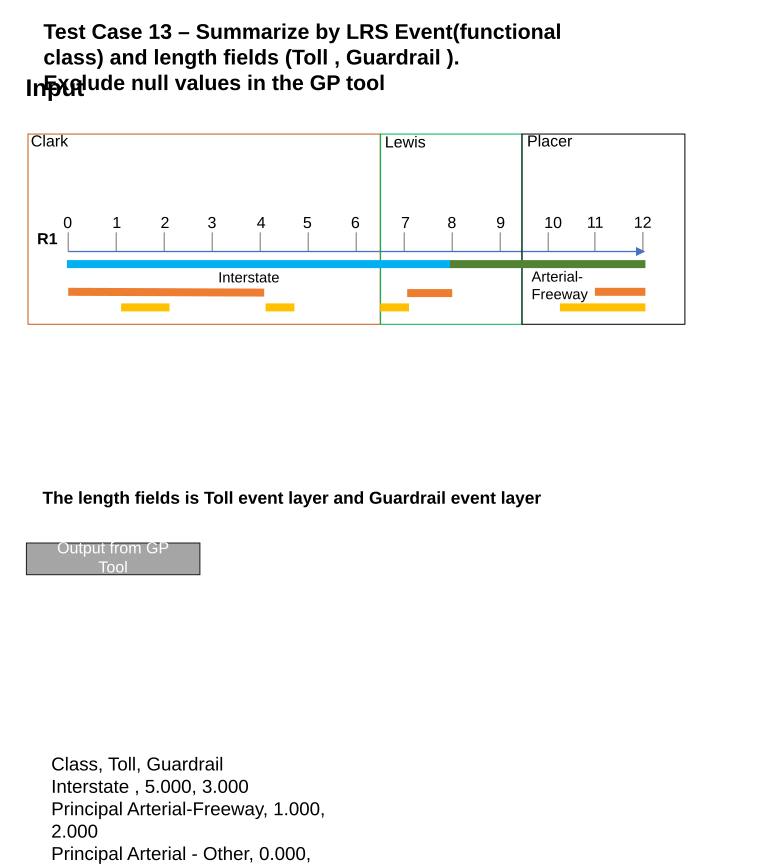

### Slide 23 <!-- slide 23 -->

Test Case 14  – Summarize by LRS Event(Rural urban) and length fields  (mileage(network) , lanes )

| Summarize by/ summary field | Length Fields |  |  |
| --- | --- | --- | --- |
| Rural Urban/Rural urban | Network | Functionclass –Interstate | Functional class - Freeway |

| Rural Urban | Length | Inter State | Freeway |
| --- | --- | --- | --- |
| 0 - outside urban_outside corporation(Rural) | 2.500 | 2.500 | 0.000 |
| 1 - Inside urban_outside_corporation(urban) | 4.000 | 4.000 | 0.000 |
| 2- Inside urban_Outside_Corporation (urban) | 1.500 | 1.500 | 0.000 |
| 2- Inside urban_Outside_Corporation (urban) | 1.500 | 0.000 | 1.500 |
| 3 - outside _ urban_Inside corporation(Rural) | 2.500 | 0.000 | 2.500 |

Output from GP Tool

Rural Urban, Length, Inter State, Freeway
0-outside urban_outside corporation(Rural), 2.500, 2.500, 0.000
1-outside urban_outside corporation(Rural), 4.000, 4.000, 0.000
2-Inside urban_Outside_Corporation(urban), 1.500, 1.500, 0.000
2-Inside urban_Outside_Corporation(urban), 1.500, 0.000, 1.500
3-outside_urban_Inside corporation(Rural), 2.500, 0.000, 2.500

[figure: Input · 0 · 10 · 1–9 · 11 · 12 · 2 · 3 · R1 · Interstate · Arterial-freeway · Output · 1]

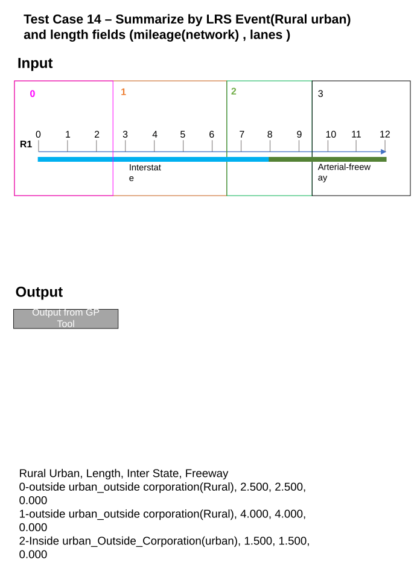

### Slide 24 <!-- slide 24 -->

TestCase15 – Summarize by LRS Event(functional class) and length fields  ( county field from network)

| Summarize by/ summary field | Length Fields (County Name from network) |  |  |
| --- | --- | --- | --- |
| Functional Class/Class | Clark | Lewis | Placer |

| Class | Clark | Lewis | Placer |
| --- | --- | --- | --- |
| Interstate | 6.500 | 2.500 | 0.000 |
| Principal Arterial - Freeway | 0.000 | 2.500 | 2.500 |
| Principal Arterial – other | 0.000 | 0.000 | 0.000 |
| Minor Arterial | 0.000 | 0.000 | 0.000 |
| Major Collector | 0.000 | 0.000 | 0.000 |
| Minor Collector | 0.000 | 0.000 | 0.000 |
| Local | 0.000 | 0.000 | 0.000 |

Output from GP Tool
Class, Clark, Lewis, Placer
Interstate, 6.500, 2.500, 0.000
Principal Arterial -Freeway, 0.000, 2.500, 2.500
Principal Arterial - other, 0.000, 0.000, 0.000
Minor Arterial, 0.000, 0.000, 0.000
Major Collector, 0.000, 0.000, 0.000
Minor Collector, 0.000, 0.000, 0.000
Local, 0.000, 0.000, 0.000

[figure: Input · 0 · 10 · 1–9 · 11 · 12 · R1 · Interstate · Arterial- Freeway]

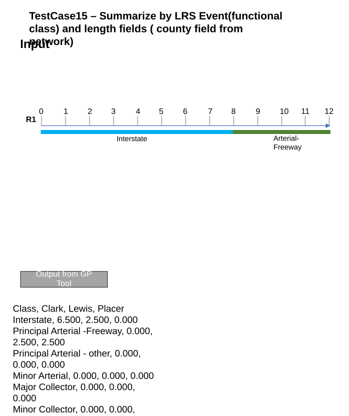

### Slide 25 <!-- slide 25 -->

TestCase16 – Summarize by LRS Event and length fields   ( Pavement condition & Functional class)

| Summarize by/ summary field | Length Field (Pavement condition & Functional Class) |  |  |  |  |  |
| --- | --- | --- | --- | --- | --- | --- |
| Speed Limit /Speed | IRI Rating (>220) miles | IRI Rating (120-170) miles | IRI Rating (60 -119) miles | IRI Rating (<60) miles | FunCls Interstate miles | FunCls – Arterial Freeway miles |

| Speed | IRI Rating (>220) miles | IRI Rating (120-170) miles | IRI Rating (60 -119) miles | IRI Rating (<60) miles | FunCls Interstate miles | FunCls – Arterial Freeway miles |
| --- | --- | --- | --- | --- | --- | --- |
| 65 mph | 3.500 | 3.000 | 0.000 | 0.000 | 6.500 | 0.000 |
| 45 mph | 0.500 | 1.000 | 0.000 | 0.500 | 1.500 | 1.500 |
| 25 mph | 0.000 | 0.000 | 1.500 | 1.000 | 0.000 | 2.500 |

Output from GP Tool
Speed, IRI Rating(>220) miles, IRI Rating(120-170) miles, IRI Rating(60 -119) miles, IRI Rating(<60)miles, FunCls Interstate miles, FunCls – Arterial Freeway miles
65 mph, 3.500, 3.000, 0.000, 0.000, 6.500, 0.000
45 mph, 0.500, 1.000, 0.000, 0.500, 1.500, 1.500
25 mph, 0.000, 0.000, 0.000, 0.000, 0.000, 0.000
<40 mph, 0.000, 0.000, 1.500, 1.000, 0.000, 2.500

[figure: Input · 0 · 10 · 1–9 · 11 · 12 · 45 mph · 25 mph · 65 mph · R1 · Interstate · Arterial- Freeway · <60 · 60 - 119 · 120-170 · >220]

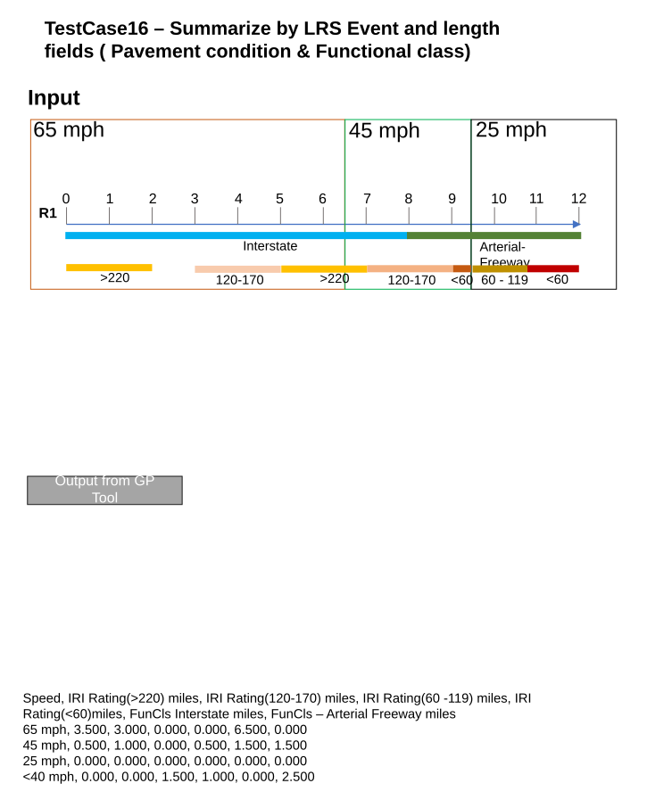

### Slide 26 <!-- slide 26 -->

Test Case 18  - County wise summary on mileage with federal Aid mileage as length

| Summarize by/ summary field | Length Fields |  |  |  |
| --- | --- | --- | --- | --- |
| County /County Name | Fed Aid– Non-Interstate | Fed Aid – Rural on | Fed Aid –Urban on | Fed Aid -Interstate |

| County Name | Fed Aid-Non-Interstate | Fed Aid-Rural On | Fed Aid-Urban On | Fed Aid- Inter State |
| --- | --- | --- | --- | --- |
| Clark | 0.000 | 0.000 | 0.000 | 6.500 |
| Lewis | 1.500 | 0.000 | 0.000 | 1.500 |
| Placer | 2.500 | 0.000 | 0.000 | 0.000 |

Output from GP Tool
County Name, FedAid-InterState, FedAid-Rural on, FedAid- Urban on , FedAid- Interstate
Clark, 0.000, 0.000, 0.000, 6.500
Lewis, 1.500, 0.000, 0.000, 1.500
Placer, 2.500, 0.000, 0.000, 0.000

[figure: Input · 0 · 10 · 1–9 · 11 · 12 · Lewis · Placer · Clark · R1 · Interstate · NonInterstate]

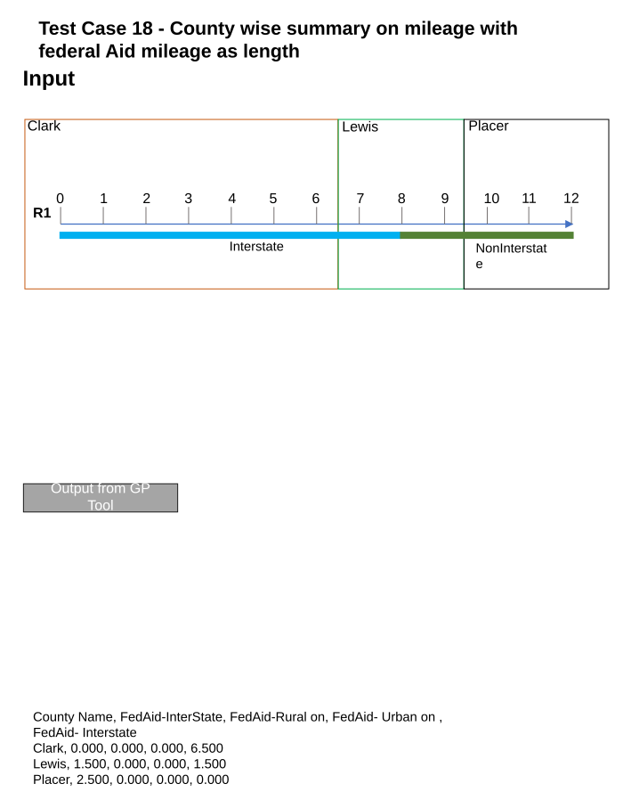

### Slide 27 <!-- slide 27 -->

Test Case 19  - Overlapping Events – Speed Limit – For mileage both the events will be considered.

| Summarize by/ summary field | Length Field (Speed Limit) |  |  |  |
| --- | --- | --- | --- | --- |
| County /Name | >60 | 50 -60 | 40 – 50 | <40 |

| Name | >60 | 50 -60 | 40 -50 | <40 |
| --- | --- | --- | --- | --- |
| Clark | 5.000 | 0.000 | 1.500 | 0.000 |
| Lewis | 0.000 | 0.000 | 3.000 | 1.500 |
| Placer | 0.000 | 0.000 | 2.500 | 2.500 |

Output from GP Tool
Name, >60, 50-60, 40-50, >40
Clark, 5.000, 0.000, 1.500, 0.000
Lewis, 0.000, 0.000, 3.000, 1.500
Placer,0.000, 0.000, 2.500, 2.500
 Save a  filter expression for the length fields.

[figure: Input · 0 · 10 · 1–9 · 11 · 12 · Lewis · Placer · Clark · R1 · 65 · 45 · 40 · 25]

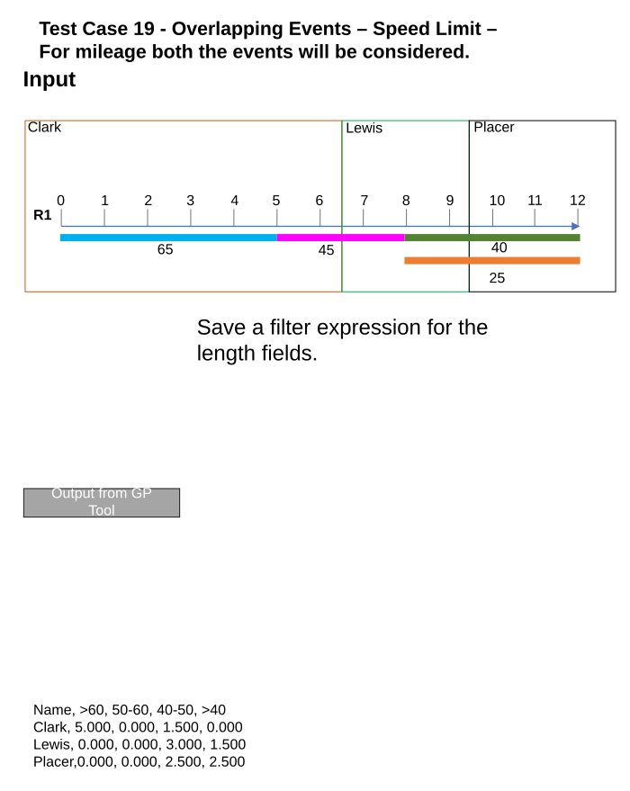

### Slide 28 <!-- slide 28 -->

Test Case 20  - Complex route  Test with variety of complex route  loop , alpha, branch.

| Summarize by/ summary field | Length Field (Network & parking Event) |  |  |  |
| --- | --- | --- | --- | --- |
| County/Name | Network | Peak Parking Allowed on one side | Peak Parking allowed on both sides | Peak Parking not allowed |

Output from GP Tool

| Name | Network | Peak Parking Allowed on one side | Peak Parking allowed on both sides | Peak Parking not allowed |
| --- | --- | --- | --- | --- |
| Clark | 0.600 | 0.350 | 0.250 | 0.050 |
| Lewis | 0.350 | 0.200 | 0.000 | 0.150 |
| Placer | 0.440 | 0.190 | 0.250 | 0.000 |
| Placer1 | 0.260 | 0.110 | 0.000 | 0.150 |

Name, Network, Peak parking allowed on one side, Peak parking allowed on both sides, Peak parking not allowed
Clark, 0.600, 0.350, 0.250, 0.050
Lewis, 0.350, 0.200, 0.000, 0.150
Placer, 0.440, 0.190, 0.250, 0.000
Placer1, 0.260, 0.110, 0.000, 0.150

[figure: Input · R1 · Clark · Lewis · Placer · Placer1 · One side · Both sides · None]

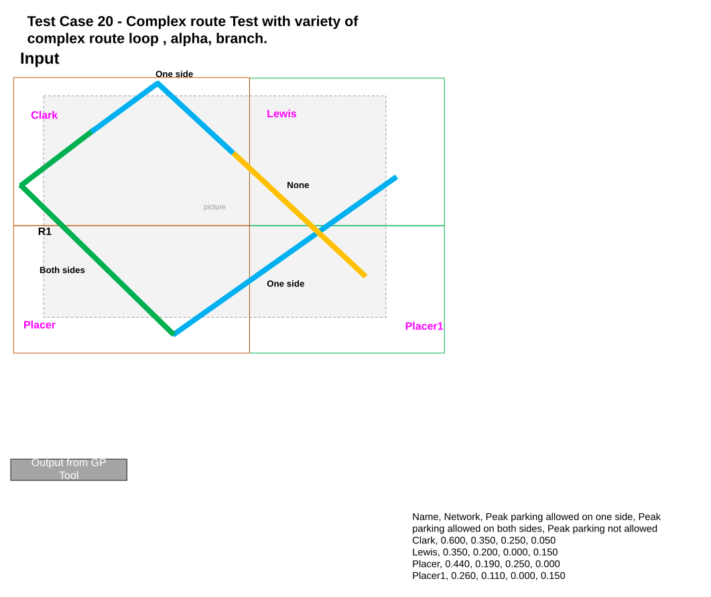

### Slide 29 <!-- slide 29 -->

Test Case 21  - Gapped  route
Test with Multiple gapped routes, test with network with different sets of calibration rules.

| Summarize by | Length Field (Network/Lanes) |  |  |  |  |
| --- | --- | --- | --- | --- | --- |
| Network | Rural Miles | Urban Miles | 6 lanes | 4 lanes | 2 lanes |

 Save a  SQL query for Lane miles (no of lanes *mileage(ToMeasure - FromMeasure) in template.
Output from GP Tool

| RouteID | Rural Miles | Urban Miles | 6 lanes | 4 lanes | 2 lanes |
| --- | --- | --- | --- | --- | --- |
| I-16 | 4.000 | 8.000 | 3.000 | 3.000 | 1.000 |

[figure: Input · 0 · 10 · 1–5 · 7–9 · 11 · 12 · Lewis · Placer · Clark · R1 · Urban · Rural · 2 lanes · 3 lanes · 4 lanes · 6 lanes]

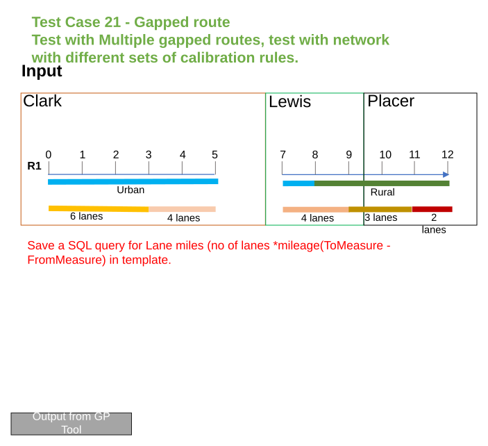

### Slide 31 <!-- slide 31 -->

Test Case 23  -Spanning Events – Line Network – Countywise – Pipe material Mileage  (Pipes – spanning event )

| Summarize by/ summary field | Length Field (Pipes Event – diameter Field) |  |  |  |
| --- | --- | --- | --- | --- |
| Network/Line Name | 2” To 4” | 6” To 10” | 12” To 20” | 24” To 28” |

| Line Name | 2” To 4” | 6” To 10” | 12” To 20” | 24” To 28” |
| --- | --- | --- | --- | --- |
| L1 | 0.000 | 9.000 | 0.000 | 0.000 |
| L2 | 0.000 | 0.000 | 4.000 | 0.000 |

Output from GP Tool

[figure: Input · 1–3 · 5 · 4 · 0 · 2–4 · 1 · 7–9 · 11 · 10 · R1L1 · R2L1 · R1L2 · 6” To 10” · 12” To 20”]

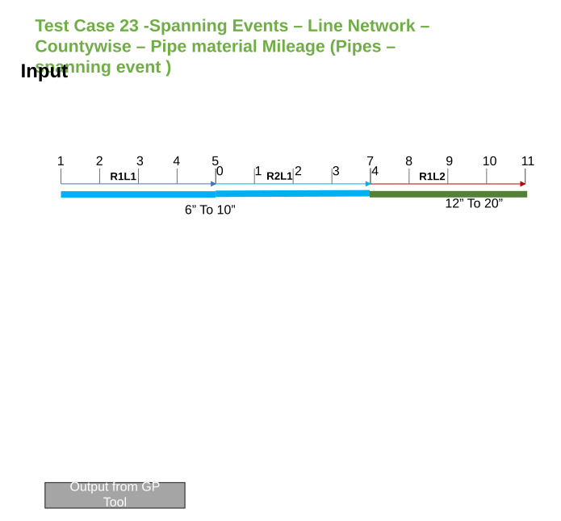

### Slide 32 <!-- slide 32 -->

Test Case 24 -Spanning Events – Line Network – Countywise – Pipe material Mileage  (Pipes – spanning event )

| Summarize by/ summary field | Length Field (Pipes Event – Material Field) |  |  |  |
| --- | --- | --- | --- | --- |
| County /Name | Bare Steel | Coated Steel | Cast Iron or Wrought Iron (Filter expression two unique values) | Copper |

| Name | Bare Steel | Coated Steel | Cast Iron or Wrought Iron | Copper |
| --- | --- | --- | --- | --- |
| Clark | 0.000 | 5.000 | 2.5 | 0.000 |
| Lewis | 0.000 | 0.000 | 5.500 | 0.000 |

Output from GP Tool

Name, Bare Steel, Coated Steel, Cast Iron/Wrought Iron, Copper
Clark, 0.000, 6.500, 0.000, 0.000
Lewis, 0.000, 0.000, 1.500, 4.000

[figure: Input · Lewis · Clark · 1–3 · 5 · 4 · 0 · 2–4 · 1 · 7–9 · 11 · 10 · R1L1 · R2L1 · R1L2 · Coated Steel · Cast Iron · Wrought Iron]

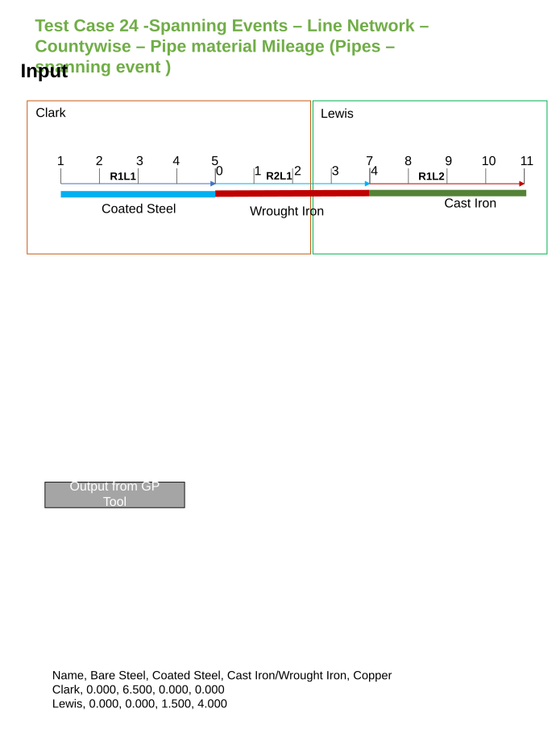

### Slide 33 <!-- slide 33 -->

Test Case 25  -Spanning Events – Line Network – Countywise – Pipe material Mileage  (Pipes – spanning event) – selecting only route R2L1

| Summarize by/ summary field | Length Field (Pipes Event – Material Field) |  |  |  |
| --- | --- | --- | --- | --- |
| County /Name | Bare Steel | Coated Steel | Cast Iron | Copper |

| Name | Bare Steel | Coated Steel | Cast Iron | Copper |
| --- | --- | --- | --- | --- |
| Clark | 0.000 | 4.500 | 0.000 | 2.000 |
| Lewis | 0.000 | 3.500 | 2.000 | 0.000 |

Output from GP Tool

Name, Bare Steel, Coated Steel, Cast Iron/Wrought Iron, Copper
Clark, 0.000, 2.500, 0.000, 0.000
Lewis, 0.000, 0.000, 1.500, 0.000
Only select route R2L1 in the GP tool expand the result to the entire line. For a line network provide for entire line

[figure: Input · Lewis · Clark · 1–3 · 5 · 4 · 0 · 2–4 · 1 · 7–9 · 11 · 10 · R1L1 · R2L1 · R3L1 · Coated Steel · Cast Iron · Copper]

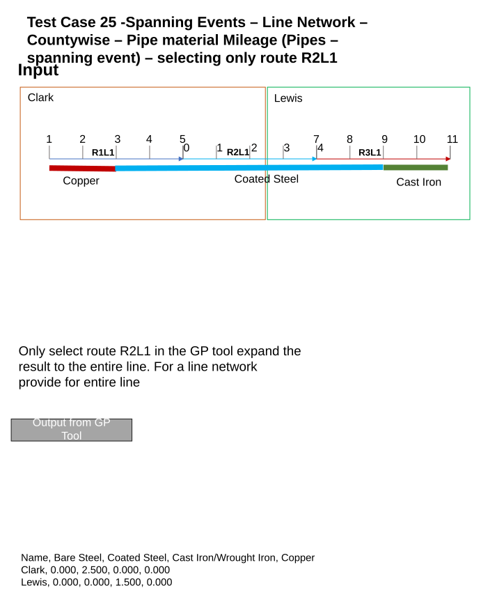

### Slide 34 <!-- slide 34 -->

Test Case 26  -Spanning Events – Line Network – Countywise – Pipe material Mileage  (Pipes – spanning event) –  selecting only one county.

| Summarize by/ summary field | Length Field (Pipes Event – Material Field) |  |  |  |
| --- | --- | --- | --- | --- |
| County /Name | Bare Steel | Coated Steel | Cast Iron | Copper |
| Clark |  |  |  |  |

| Name | Bare Steel | Coated Steel | Cast Iron | Copper |
| --- | --- | --- | --- | --- |
| Clark | 0.000 | 4.500 | 0.000 | 3.000 |

Output from GP Tool

Name, Bare Steel, Coated Steel, Cast Iron/Wrought Iron, Copper
Clark, 0.000, 2.500, 0.000, 0.000

[figure: Input · Lewis · Clark · 1–3 · 5 · 4 · 0 · 2–4 · 1 · 7–9 · 11 · 10 · R1L1 · R2L1 · R3L1 · Coated Steel · Cast Iron · Copper]

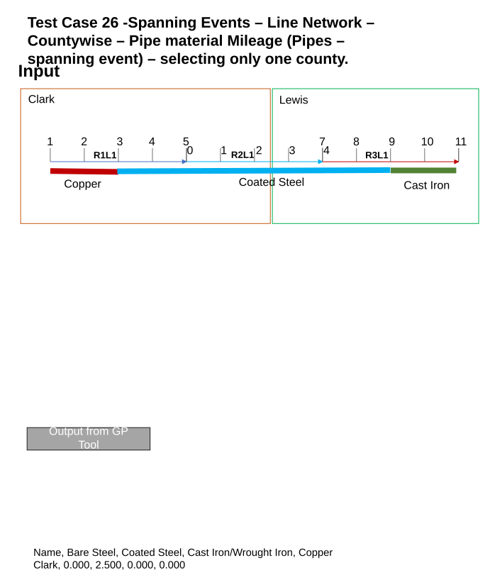

### Slide 36 <!-- slide 36 -->

TestCase6 – Summarize by Line Network –  Two Summary Fields from two layers  - County (county boundary), Line name (LRS network)  and  no length field
Output from GP Tool

County ,Line, Length
Clark , L1, 6.508
Lewis ,L1, 1.403
Lewis, L2, 4.000

[figure: Input · Lewis · Clark · 1–3 · 5 · 4 · 0 · 2–4 · 1 · 7–9 · 11 · 10 · R1L1 · R2L1 · R1L2]

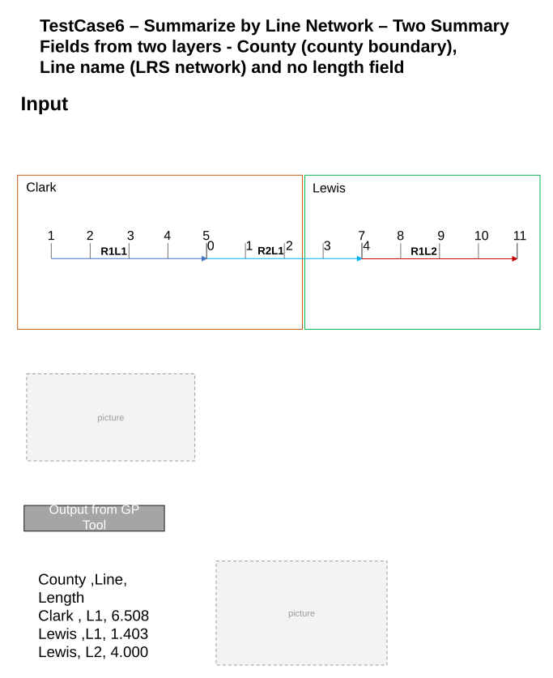
