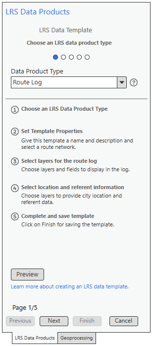
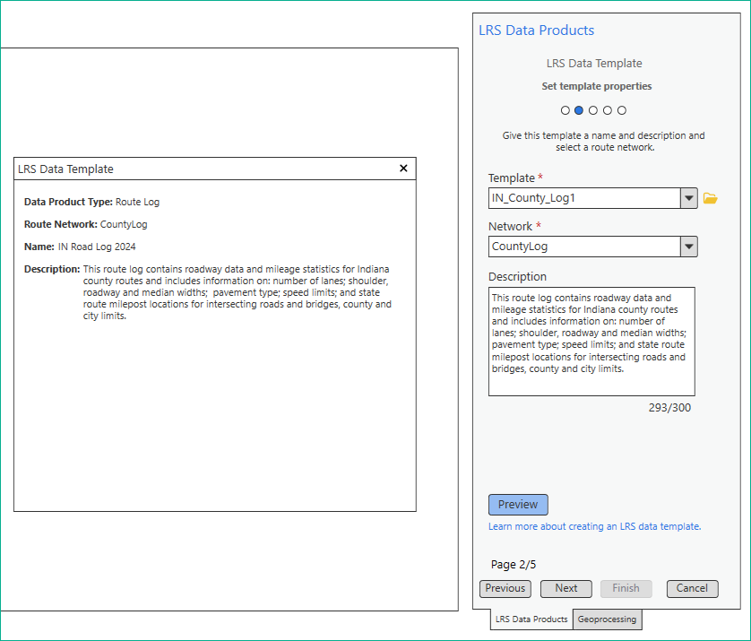
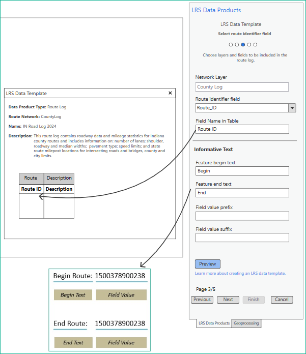
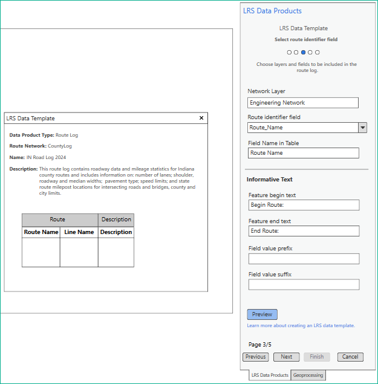
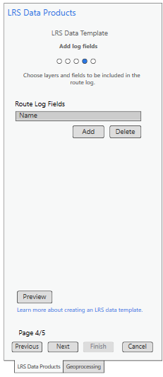
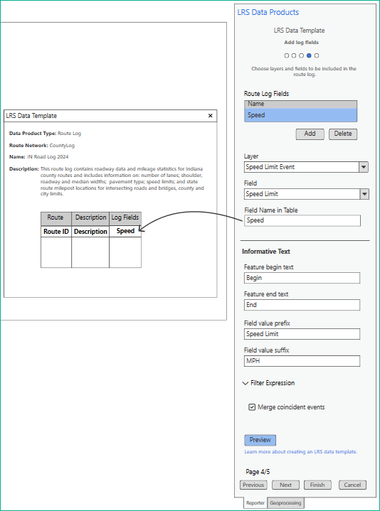
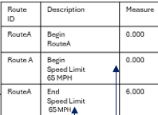
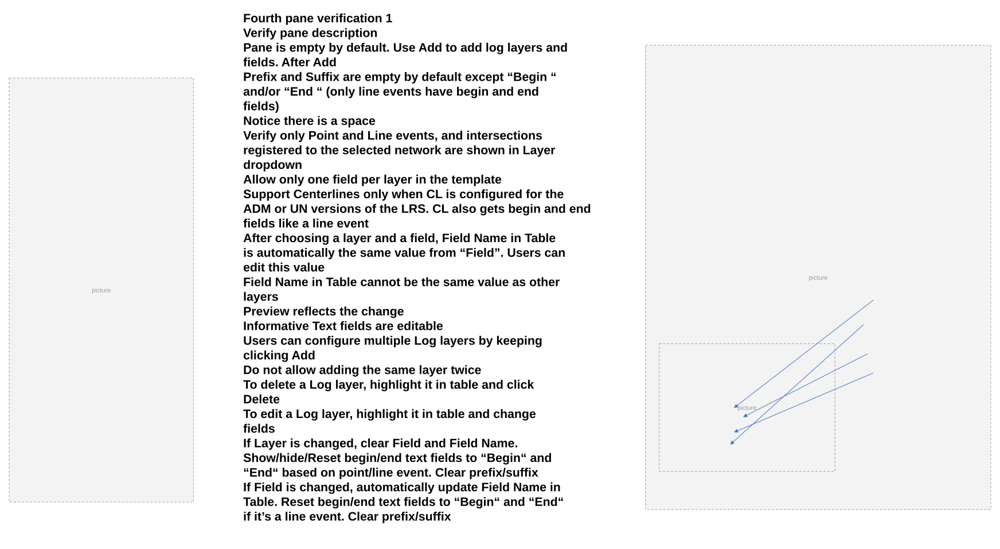
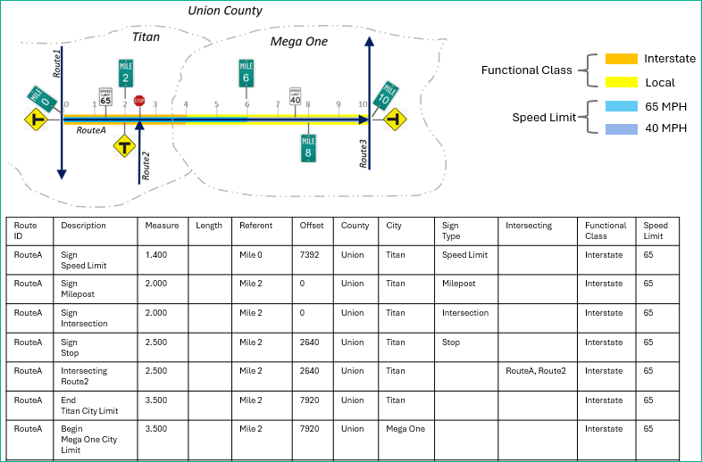
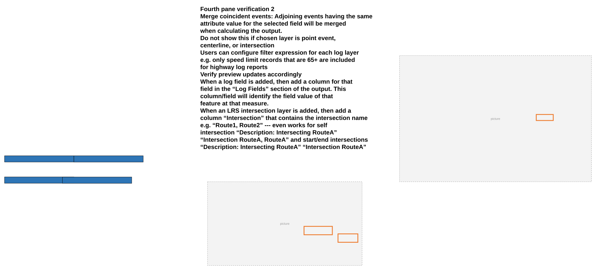

# Route Log data product template – Test Plan

| Field | Value |
| --- | --- |
| **Doc** | 256 · Test Plan · Pro |
| **Product** | Roads & Highways · Pipeline Referencing · Utility Network |
| **Release** | — |
| **Issues** | [ArcGISPro/ps-location-referencing#6203](https://devtopia.esri.com/ArcGISPro/ps-location-referencing/issues/6203) |
| **Source** | [6203_RouteLogTemplate_Testplan.pptx](<https://esriis.sharepoint.com/sites/LocationReferencing/Shared%20Documents/General/Test%20Plans/6203_RouteLogTemplate_Testplan.pptx>) |
| **People** | author Lakshmi Ananthanarayanan · PE Claire · dev Sharon |
| **Edited** | 2025-01-07 20:44 by Claire Wang |
| **Extracted** | 2026-09-04 · lane xmlstrip · format 3.0 · prompt v2.0.2 |
| **Keywords** | route log · template · test plan · log layers · location layers · referent layer · filter expression · merge coincident events · point event · line event · intersection · centerline · derived network · route identifier · prefix suffix · preview · database testing · feature service |
| **Tools** | — |

## Summary

Test plan for the Route Log data product template covering verification of UI panes, configuration options for log, location, and referent layers, and testing across various databases and feature services. Includes positive and negative test cases, error message verification, and behavior validation for different network types and event configurations.

## Related documents

<!-- related:begin -->
- [Generate a route Log including spanning events and centerline – Test Plan](<https://esriis.sharepoint.com/sites/lrsworkspace/LRS Doc Index/Test Plans/6240-generate-a-route-log-including-spanning-events.md>) — similar text 0.23 · 2 title words · 3 filename words · same kind/surface/pe/folder <!-- rel:255 s=8.859 -->
- [Support a single summary field in LRS Data Template wizard – Test Plan](<https://esriis.sharepoint.com/sites/lrsworkspace/LRS Doc Index/Test Plans/5774-support-a-single-summary-field-in-lrs-data-template-wizard.md>) — similar text 0.43 · 1 filename word · same kind/surface/pe/dev/folder <!-- rel:347 s=6.094 -->
- [LRS Data Template Preview – Test Plan](<https://esriis.sharepoint.com/sites/lrsworkspace/LRS Doc Index/Test Plans/5814-lrs-data-template-preview.md>) — similar text 0.31 · 1 filename word · same kind/surface/pe/dev/folder <!-- rel:355 s=6.039 -->
- [Generate a Route Log using the GLRSDP GP Tool – Test Plan](<https://esriis.sharepoint.com/sites/lrsworkspace/LRS Doc Index/Test Plans/6209-generate-a-route-log-using-the-glrsdp-gp.md>) — similar text 0.23 · 2 title words · 3 filename words · same kind/surface/folder <!-- rel:260 s=5.87 -->
- [Support multiple summary fields in LRS Data Template wizard – Test Plan](<https://esriis.sharepoint.com/sites/lrsworkspace/LRS Doc Index/Test Plans/5770-support-multiple-summary-fields-in-lrs-data-template-wizard.md>) — similar text 0.42 · 1 filename word · same kind/surface/pe/dev/folder <!-- rel:323 s=5.528 -->
<!-- related:end -->

<!-- docs:begin -->
## Esri documentation

[Create a template for an LRS route log data product](https://doc.esri.com/en/arcgis-pro/latest/help/production/roads-highways/create-a-template-for-an-lrs-route-log-data-product.html) · [Create a template for an LRS length data product](https://doc.esri.com/en/arcgis-pro/latest/help/production/roads-highways/create-a-template-for-an-lrs-length-data-product.html) · [View LRS intersection properties](https://doc.esri.com/en/arcgis-pro/latest/help/production/roads-highways/view-lrs-intersection-properties.html) · [Edit feature services](https://doc.esri.com/en/arcgis-pro/latest/help/production/roads-highways/edit-feature-services.html)
<!-- docs:end -->

---

## Overview

### Slide 1 — Route Log data product template – Test Plan <!-- slide 1 -->

https://devtopia.esri.com/ArcGISPro/ps-location-referencing/issues/6203

PE: Claire
Dev: Sharon
Legend:
Design change
Just notes

### Slide 2 <!-- slide 2 -->

First pane verification

- Add “Route Log” option under Type dropdown. Default is still Length
- Show correct Route Log steps when this option is selected
- Link to help page – the blue text is linked to the main Template doc; the ? can be anything for now but will be linked to the Route Log Template doc when it’s ready
- When user returns to the first pane and change template type, reset everything in following panes

### Slide 3 <!-- slide 3 -->

Second pane verification

- Verify pane description
- Template, Network, and Description should work the same as Length product
  - Type in a template. When focus is lost, box shows the full path
  - Can also browse to location and import an existing template
    - Network, name and description are populated based on the existing template
    - If the Network configured in the existing template is missing from the TOC. An error shows up in the wizard and users cannot save
  - Only LRS network layer in the map can be used in Network
    - Auto-populate the only/first network in TOC
    - List only networks in dropdown
    - If Network is missing from the TOC. Dropdown is disabled and Finish is disabled, and a blue banner shows up at the top “Add a network layer to the map”
    - If the map is closed, the wizard pane do not close, but empty out with the blue banner
- Preview shows Route Log for Data Product Type
- If network is changed, reset everything in the following pages
- Preview works the same way as Length product

### Slide 4 <!-- slide 4 -->

Third pane verification

- Verify pane description
- Make network a label instead of textbox or combo box
- Route Identifier field has a dropdown showing the fields available in the Network FC
  - Automatically default to Route Name for networks that is configured with Route Name
  - Restrict to RID or Rname
  - If only RID exists, then disable the drop down.
- Populate the Field Name in the table field with the Route Identifier field by default but this value is editable
- Since there are default values, all these columns (Route Name/ID, (LineName if line network), Description) will show in the preview as soon as I enter the first pane (when there is only 1 network) or change in the preview if I change to another network in the second pane.
  - For Line Network, add an additional column named “Line name” and provide the Line name of the Route in the output.
- “Begin” and “End” (no need to manually type a space we should automatically give them this in the GP tool, also applies to when they change the value) are default values for Feature begin/end text
- Field value prefix and suffix are empty by default but editable
- If Identifier field is changed, Field Name in Table will automatically change, Begin/End fields will reset to Begin and End, and prefix/suffix will be cleared
- Verify preview updates accordingly

### Slide 5 <!-- slide 5 -->

Fourth pane verification 1

- Verify pane description
- Pane is empty by default. Use Add to add log layers and fields. After Add
  - Prefix and Suffix are empty by default except “Begin “ and/or “End “ (only line events have begin and end fields)
    - Notice there is a space
- Verify only Point and Line events, and intersections registered to the selected network are shown in Layer dropdown
  - Allow only one field per layer in the template
  - Support Centerlines only when CL is configured for the ADM or UN versions of the LRS. CL also gets begin and end fields like a line event
- After choosing a layer and a field, Field Name in Table is automatically the same value from “Field”. Users can edit this value
  - Field Name in Table cannot be the same value as other layers
  - Preview reflects the change
- Informative Text fields are editable
- Users can configure multiple Log layers by keeping clicking Add
  - Do not allow adding the same layer twice
- To delete a Log layer, highlight it in table and click Delete
- To edit a Log layer, highlight it in table and change fields
  - If Layer is changed, clear Field and Field Name. Show/hide/Reset begin/end text fields to “Begin“ and “End“ based on point/line event. Clear prefix/suffix
  - If Field is changed, automatically update Field Name in Table. Reset begin/end text fields to “Begin“ and “End“ if it’s a line event. Clear prefix/suffix

### Slide 6 <!-- slide 6 -->

Fourth pane verification 2

- Merge coincident events: Adjoining events having the same attribute value for the selected field will be merged when calculating the output.
  - Do not show this if chosen layer is point event, centerline, or intersection
- Users can configure filter expression for each log layer e.g. only speed limit records that are 65+ are included for highway log reports
- Verify preview updates accordingly
  - When a log field is added, then add a column for that field in the “Log Fields” section of the output. This column/field will identify the field value of that feature at that measure.
  - When an LRS intersection layer is added, then add a column “Intersection” that contains the intersection name e.g. “Route1, Route2” --- even works for self intersection “Description: Intersecting RouteA” “Intersection RouteA, RouteA” and start/end intersections “Description: Intersecting RouteA” “Intersection RouteA”

### Slide 7 <!-- slide 7 -->

Fifth pane verification

- Verify pane description
- Pane is empty by default. Use Add to add location layers and fields. After clicking Add, show 5 fields below
- Allow only polygon layers that are present in the same database/fs as the Network with the same projection system
- After choosing a layer and a field, Field Name in Table is automatically the same value from “Field”. Users can edit this value
  - Field Name in Table cannot be the same value as other polygon layers
  - Preview reflects the change
- Under the Location fields, need to add the following
- Users can configure multiple polygon layers by keeping clicking Add. But the same layer cannot be added twice
- To delete a location layer, highlight it in table and click Delete
- Verify preview updates accordingly
- Add filter expression

### Slide 8 <!-- slide 8 -->

Sixth pane verification

- Verify pane description
- Referents located at Three options: Nearest upstream, Nearest, and None (default).
  - If None is chosen, disable everything below
  - If any other value is chosen, all fields below are enabled
    - Default Field name in table to Referent, keep editable
    - Default Offset Units to Feet, keep editable
  - If user changes to None, clear all the fields to default state and disable them
- Allow only point events that are present in the same database/fs as the Network
- Users can only configure 1 referent layer
- Field value prefix: This value is used as a prefix to the layers’ Field’s value. Empty by default.
- Field value suffix: This value is used as a suffix to the layers’ Field’s value. Empty by default.
- Offset Units: Esri supported distance units. Shows the distance between the feature and the referent.
- Verify preview updates accordingly

### Slide 9 <!-- slide 9 -->

Testing

- Test in fgdb, egdb (oracle + sql), fs
- Test with nonline, line, Derived network, PoM, and Addressing (sanity)
  - Test with CL as a log layer when they are configured in the ADM and UN datasets
  - Test RouteID and RouteName being route identifier
- Test with and without log, location, and referent layers as they are optional
  - Test configuring multiple log and location layers
  - Test point, nonspanning + spanning line events, and intersection layers being log layers
  - Test filter expression for log layers
- Test changing/adding informative text fields
- Test creating new template and opening and overwriting existing template
- Test canvas behavior. Verify the fields are ordered as expected in canvas.
- Test with dark and light theme
- 508 and i18n compliance

### Slide 10 <!-- slide 10 -->

Automation: N/A
Doc: Create a new doc topic.

## Test Cases

### TC-N01 — Missing template name in pane 2 <!-- src: S3 · slide 11 · table · 1 -->

- **ID:** 1
- **Expected Result:** Red box + error + cannot save

### TC-N02 — Trying to type 300+ characters in description in pane 2 <!-- src: S3 · slide 11 · table · 2 -->

- **ID:** 2
- **Expected Result:** Cannot type after 300

### TC-N03 — Add empty log layers in pane 4 <!-- src: S3 · slide 11 · table · 3 -->

- **ID:** 3
- **Expected Result:** Red box + error + cannot save

### TC-N04 — Try to add duplicate log layers in pane 4 <!-- src: S3 · slide 11 · table · 4 -->

- **ID:** 4
- **Expected Result:** Red box + error + cannot save

### TC-N05 — Add empty location layers in pane 5 <!-- src: S3 · slide 11 · table · 5 -->

- **ID:** 5
- **Expected Result:** Red box + error + cannot save

### TC-N06 — Try to add duplicate location layers in pane 4 <!-- src: S3 · slide 11 · table · 6 -->

- **ID:** 6
- **Expected Result:** Red box + error + cannot save

### TC-N07 — Add empty referent layer in pane 6 for Nearest/Nearest upstream methods <!-- src: S3 · slide 11 · table · 7 -->

- **ID:** 7
- **Expected Result:** Red box + error + cannot save

### TC-P01 — PoM - configure a Route Log template with intersection and a location field <!-- src: S4 · slide 15 · Positive cases (test various dbs /FSs) · 1 -->

- **Group:** Test Various Dbs / FSs

## Other content

### Slide 11 — Negative cases/Error message verification <!-- slide 11 -->

|  |  |  |  |

– Developer provides error messages

### Slide 12 — Positive cases (test various dbs /FSs) <!-- slide 12 -->

Send json and canvas screenshot to Praveen and Michael

- Test different start/end/prefix/suffix
- Only points + non spanning + int
- Only non spanning
- Cl
- Including all points, int, spanning, non spanning, locations, referent
- Merge or not merge coincident
- Referent diff units
- Referent upstream vs. nearest
- Log fields filter expression
- RH – configure a Route Log template without any log fields (first 2 panes only)
  - Change start text and add a suffix only
- RH – configure a Route Log template with 1 log field and 1 location field
  - A point event with no prefix/suffix
- RH – configure a Route Log template with multiple location fields and 1 referent field
  - Referent: nearest upstream; with prefix/suffix; in feet
- RH – configure a Route Log template with multiple log fields, multiple location fields, and 1 referent field
  - Log: point events, 2 intersections, and line events. Mix prefix/suffix configuration. Use filter expression on a point event and a line event. Do not merge coincident events
  - Referent: nearest; with only suffix, in international miles
- RH – configure a Route Log template with multiple log field and 1 referent field
  - Log: point events, 1 intersection, and line events. Configure prefix/suffix for intersection only. Use filter expression on intersection and a line event. Merge coincident events for 1 line event
  - Referent: nearest; without prefix/suffix, in meters
- RH – overwrite 2 by changing and adding fields
  - Change the point event to have suffix only
  - Add a line event log field with filter expression and merge coincident events
- RH – overwrite 4 by unconfiguring some log fields, location fields, and referent field
  - Unconfigure an intersection and the line event with filter expression. Unconfigure one of the location layer. Unconfigure the referent layer

### Slide 13 — Positive cases (test various dbs /FSs) <!-- slide 13 -->

Send json and canvas screenshot to Praveen and Michael

- APR – configure a Route Log template with derived network without any log fields (first 2 panes only)
- Change end text and add prefix and suffix
  - Use RouteID
- APR – configure a Route Log template with 1 log field and 1 location field
  - A non-spanning line event with prefix and filter expression
  - Use RouteName
- APR – configure a Route Log template with 1 log field and 1 location field
  - A spanning line event with prefix “DOT” and filter expression “is not Class2”
  - Use RouteID
- APR – configure a Route Log template with multiple location fields and 1 referent field
  - Referent: nearest upstream; change start text; with prefix/suffix; in feet
  - Use RouteName
- APR – configure a Route Log template with multiple log fields, multiple location fields, and 1 referent field
  - Log: point events, 2 intersections, and spanning and nonspanning line events. Mix prefix/suffix configuration. Use filter expression on a point event, an intersection and a spanning line event. Merge coincident events for all line events
  - Use RouteName
  - Referent: nearest; without prefix/suffix, in miles
- APR – configure a Route Log template with multiple log field and 1 referent field
  - Log: a point event, an intersection, and spanning line events. Change start/end texts for all. Do not configure any prefix or suffix. No filter expression. Merge coincident for one line event
  - Referent: nearest upstream, customize stand/end/prefix/suffix, in feet
  - Use RouteName
- APR – overwrite 1 by changing and adding fields
  - Change the network and change to RouteID
  - Add a point event and a non-spanning line event log layers. Configure filter expression for line event.
  - Add a location layer
- APR – overwrite 4 by unconfiguring some log fields, location fields, and referent field
  - Unconfigure the point event and the spanning line event with filter expression. Do not merge coincident for one of the line events. Change suffix for an intersection. Add filter expression on another intersection. Unconfigure one of the location layer. Change the referent layer to nearest upstream and international miles
- Test different start/end/prefix/suffix
- Only points + non spanning + int
- Only non spanning
- Cl
- Including all points, int, spanning, non spanning, locations, referent
- Merge or not merge coincident
- Referent diff units
- Referent upstream vs. nearest
- Log fields filter expression

### Slide 14 — Positive cases (test various dbs /FSs) <!-- slide 14 -->

Send json and canvas screenshot to Praveen and Michael

- ADM – configure a Route Log template without any log fields (first 2 panes only)
- ADM – configure a Route Log template with 2 log fields and 1 location field
  - A point event, and centerline with no prefix/suffix
- UN – configure a Route Log template with 2 log fields and 1 location field
  - A spanning line event, and centerline with no prefix/suffix
  - Use RouteID
- ADM – configure a Route Log template with multiple log fields, multiple location fields, and 1 referent field
  - Log: point events, intersection, centerline, and line events. Mix prefix/suffix configuration. Use filter expression on a point event and intersection. Merge coincident events for 1 line event
  - Referent: nearest; with only suffix, in international miles
- UN – configure a Route Log template with multiple log field and 1 referent field
  - Log: 1 intersection, centerline, and 1 line event. Configure prefix/suffix for centerline only. Use filter expression on centerline and line event. Merge coincident events for the line event
  - Referent: nearest upstream; without prefix/suffix, in meters
  - Use RouteName
- UN – overwrite 2 by changing and adding fields
  - Change the centerline to have customized start/end/prefix/suffix
  - Add a point event log field with no filter expression
  - Add a location layer
  - Add a Referent layer with nearest upstream in feet
- UN - configure a Route Log template with derived network without any log fields (first 2 panes only)
  - Change end text and add prefix and suffix
  - Use RouteID
- Test different start/end/prefix/suffix
- Only points + non spanning + int
- Only non spanning
- Cl
- Including all points, int, spanning, non spanning, locations, referent
- Merge or not merge coincident
- Referent diff units
- Referent upstream vs. nearest
- Log fields filter expression
