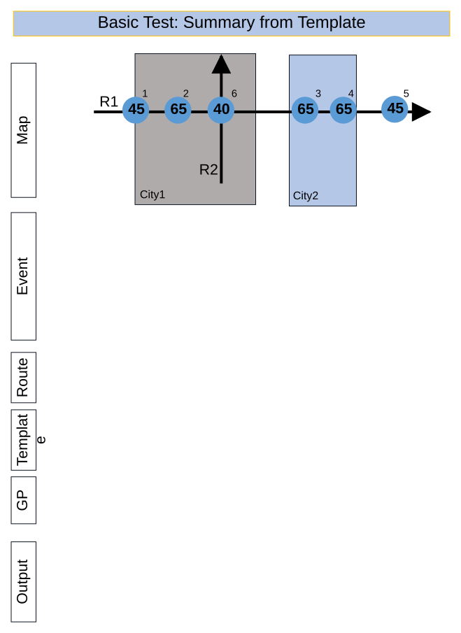
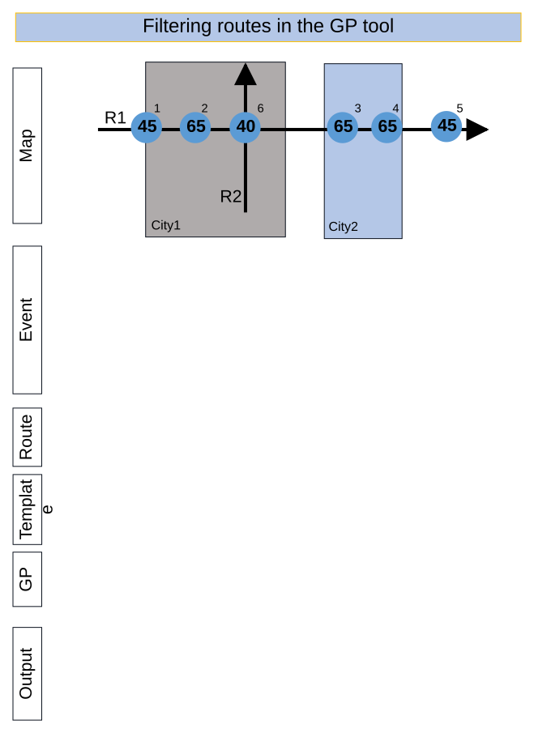
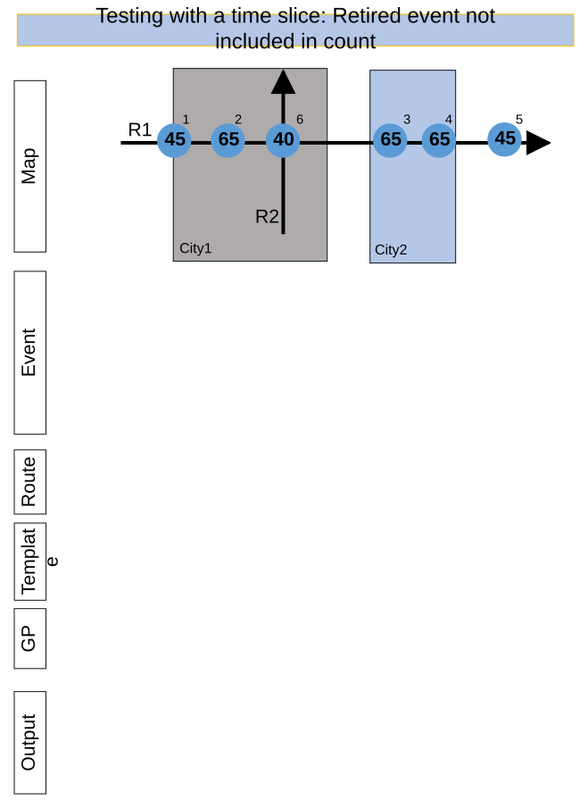
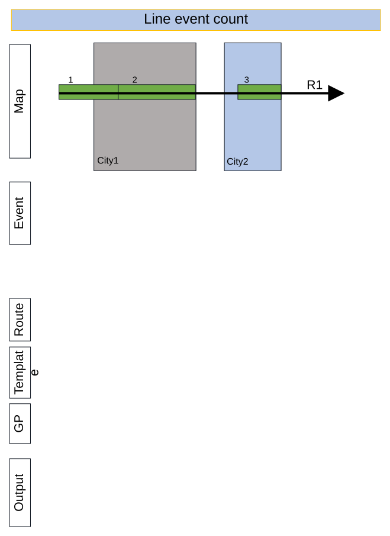
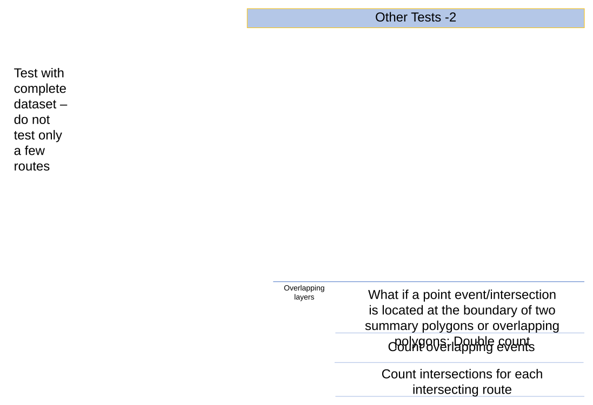

# Standalone GP – Generate Feature Count – Test Plan

| Field | Value |
| --- | --- |
| **Doc** | 173 · Test Plan · Pro |
| **Product** | Roads & Highways · Pipeline Referencing |
| **Release** | — |
| **Issues** | [ArcGISPro/ps-location-referencing#6205](https://devtopia.esri.com/ArcGISPro/ps-location-referencing/issues/6205) |
| **Source** | [6205_StandaloneGP_FeatureCount_Testplan (1).pptx](<https://esriis.sharepoint.com/sites/LocationReferencing/Shared%20Documents/LR%20Product%20Engineers/6205_StandaloneGP_FeatureCount_Testplan%20(1).pptx>) |
| **People** | author Lakshmi Ananthanarayanan · PE Mac · dev Michael |
| **Edited** | 2025-05-07 23:01 by Claire Wang |
| **Extracted** | 2026-09-04 · lane xmlstrip · format 3.0 · prompt v2.0.2 |
| **Keywords** | feature count · geoprocessing · summary fields · feature count layers · route filtering · output format · error handling |
| **Tools** | Generate Feature Count |

## Summary

Test plan for the Generate Feature Count geoprocessing tool covering UI verification, functionality verification, documentation, automation, and extensive testing scenarios including positive and negative cases. It verifies tool parameters, network support, summary and feature count layers, output formats, and error handling. The plan includes tests for various route types, filters, overlapping layers, and output validation in different environments.

## Related documents

<!-- related:begin -->
- [Feature Count Support Generate Data GP Tool Test Plan](<https://esriis.sharepoint.com/sites/lrsworkspace/LRS Doc Index/Test Plans/feature-count-support-generate-data-gp.md>) — similar text 0.55 · 3 title words · 2 filename words · same kind/surface <!-- rel:253 s=6.465 -->
- [Generate a route Log including spanning events and centerline – Test Plan](<https://esriis.sharepoint.com/sites/lrsworkspace/LRS Doc Index/Test Plans/6240-generate-a-route-log-including-spanning-events.md>) — similar text 0.25 · 1 title word · 1 filename word · same kind/surface/dev <!-- rel:255 s=4.718 -->
- [GenerateLengthSummary – Test Plan](<https://esriis.sharepoint.com/sites/lrsworkspace/LRS Doc Index/Test Plans/6202-generatelengthsummary.md>) — similar text 0.31 · 1 filename word · same kind/surface/dev/folder <!-- rel:172 s=4.658 -->
- [Generate Feature Count Geoprocessing Tool](<https://esriis.sharepoint.com/sites/lrsworkspace/LRS Doc Index/Other/generate-feature-count-gp.md>) — similar text 0.20 · 3 title words · 2 filename words · same surface <!-- rel:281 s=4.604 -->
- [Feature Count Template Test Plan](<https://esriis.sharepoint.com/sites/lrsworkspace/LRS Doc Index/Test Plans/feature-count-template.md>) — similar text 0.34 · 2 title words · 2 filename words · same kind/surface <!-- rel:254 s=4.412 -->
<!-- related:end -->

<!-- docs:begin -->
## Esri documentation

[Create a template for an LRS feature count data product](https://doc.esri.com/en/arcgis-pro/latest/help/production/roads-highways/create-a-template-for-an-lrs-feature-count-data-product.html)

_No page matched:_ [Generate Feature Count](https://www.google.com/search?q=%22Generate%20Feature%20Count%22+site%3Adoc.esri.com)
<!-- docs:end -->

---

## Overview

### Slide 1 — Standalone GP – Generate Feature Count – Test Plan <!-- slide 1 -->

https://devtopia.esri.com/ArcGISPro/ps-location-referencing/issues/6205

PE: Mac
Dev: Michael

### Slide 2 <!-- slide 2 -->

UI Verification

- Verify tool name “Generate Feature Count”
- Create a toolset “Data Products” that includes the first GP tool and all standalone GP tools --- will not be ready for testing as it needs to be checked in
- Verify tool parameters on the right
  - The style aligns with other GP tools
  - Required and optional parameters
  - Summary Fields has an accordion to add multiple Summary Fields
  - Feature Count Layers has a multi-selection button. Users have at least 1 feature count layer and can add more
Functionality Verification

- Tool outputs a feature count data product
- Tool supports fgdb, dc, and fs input
- Network
  - Dropdown lists all layers, error out when a non-network layer is chosen. The same applies to using the browser button.
  - Support non-line, line, derived, and PoM networks
    - In the output, use Route Name and Line Name for line network; use Route ID for the other 3
  - Support selection sets, time filter and definition queries on the routes
    - Routes selected in a line network: Data product created for the all the routes in the line to which the selected route belongs to. If any routes in the lines are uncalibrated, return 1 row for this route with all entries being null, just like what we did for route log

### Slide 3 <!-- slide 3 -->

Functionality Verification

- Effective date
  - Default to today’s date
  - The routes that are present on this date will be used for calculation, including filters, if any
  - No routes exist on the selected date: Empty output is generated with a warning
  - PY: Incorrect date format. Show error message.
  - Test with a route that does not have a 00:00:00 timestamp and check if there is a difference in the output
- Output format can be table or CSV
- Output file location is project folder by default for csv, and default.fgdb by default for table. Users can browse to and provide a different location.
  - CSV can be overwritten in UI and python
  - PY: Cannot overwrite an existing file. Show error message.
  - PY: Provide an invalid path/name. Show error message.

### Slide 4 <!-- slide 4 -->

Functionality Verification

- Summary Fields
  - Layer
  - Dropdown lists all layers, error out when an invalid layer is chosen. The same applies to using the browser button.
  - Eligible layers: only Polygons and line events registered to the network; Must be in the same database/fs as the Network; Must have the same projection system as the Network
  - No limit of # of layers (for testing, add 4 at most)
  - Support selection sets, time filter and definition query
  - Field
  - List non-system fields in dropdown. This field’s value will be used to summarize
  - Name in table
  - By default, the same value as Field. Users can change it
  - If users leave it empty, error out
- If no location layer is intersecting the selected routes, then it’s value in the output is “Unclassified”.
- Users can have none, single, or multiple Summary fields by using the multi-selection button. (see 13 on next page for details)
- Double count when feature exists in overlapping polygons

### Slide 5 <!-- slide 5 -->

Functionality Verification

- Feature Count Layers
  - Layer
  - Dropdown lists all layers, error out when an invalid layer is chosen. The same applies to using the browser button.
  - Eligible layers: only intersections, line and point events that are present in the same database/fs as the Network and registered with the network with the same projection
  - No limit of layers added
  - Support selection sets, time filter and definition query
  - Name in table
  - By default, the layer name. Users can change it
  - If users leave it empty, error out
- Users can have none, single, or multiple feature count layers by using the multi-selection Button – It will pop up a pane with all layers. Users can delete a feature count layer. Validate when layers are added.
  - Take Merge gp tool as an example for the multi-selection button. e.g. every time the button opens a pane, all layers are unchecked and selectable, so users are able to add duplicate layers but this results in an error
- Count overlapping events
- Count intersection for each intersecting route
- The feature count fields in the output are placed in the order they were added in the tool

### Slide 6 <!-- slide 6 -->

Functionality Verification

- Exclude null summary rows is checked by default. If all the feature count fields in a row have a value of 0, then exclude that row from the output
- Automatically, provide the column totals in the output
- Users can cancel the tool run
- Show a progress bar when the tool is running
- Test with layers that have , in Name in table (for summary and feature count layers), and make sure output does not have indentation issues

Documentation
New GP doc
Mention in related topics – existing GP & Feature Count Template

Automation
New GP automation

### Slide 7 <!-- slide 7 -->

Testing

- Test in fgdb, egdb (oracle + sql), fs - default and versions
- Focus testing with RH, APR, APRUN (GCS) and ADM
- Test with these routes: Types of Routes: Normal, Gapped, Multi-gapped, Self intersecting, Having z values, overlapping
- Test with everything (spanning and non spanning line events, point events and intersections)
- Test with polygon and line summary layers and combinations
- Test the case where the route does not intersect any summary layer
- Test without summary fields
- Test with and without route selection, time filter and definition query on the network, summary layer and feature count layers
- Test a few cases with overlapping count layers
- Test few case with overlapping and gapped summary layers
- Test with all the line and point events and intersection present in the longest route of the dataset
- Test with python and model builder

## Test Cases

### TC-N01 — Network is invalid (UI and py) <!-- src: S4 · slide 8 · Negative cases · 1 -->

### TC-N02 — Output format is invalid/empty (py only) <!-- src: S4 · slide 8 · Negative cases · 2 -->

### TC-N03 — Output file is invalid/empty (py only) <!-- src: S4 · slide 8 · Negative cases · 3 -->

### TC-N04 — Cannot overwrite output file (py only) <!-- src: S4 · slide 8 · Negative cases · 4 -->

### TC-N05 — Effective date is invalid (py only) if empty in py, default to today’s date <!-- src: S4 · slide 8 · Negative cases · 5 -->

### TC-N06 — Summary layer is invalid (py only) <!-- src: S4 · slide 8 · Negative cases · 6 -->

### TC-N07 — Summary layer (line) is not registered as a line event to the selected network <!-- src: S4 · slide 8 · Negative cases · 7 -->

- **Case:** Summary layer (line) is not registered as a line event to the selected network (UI and py)

### TC-N08 — Summary field is empty (UI) <!-- src: S4 · slide 8 · Negative cases · 8 -->

### TC-N09 — Summary field is invalid (py only) <!-- src: S4 · slide 8 · Negative cases · 9 -->

### TC-N10 — Summary field name in table is empty (UI and py) <!-- src: S4 · slide 8 · Negative cases · 10 -->

### TC-N11 — Summary field name in table is invalid (py only) <!-- src: S4 · slide 8 · Negative cases · 11 -->

### TC-N12 — No Feature Count layer is configured (UI and py) <!-- src: S4 · slide 8 · Negative cases · 12 -->

### TC-N13 — Feature Count layer is not registered to the network (UI and py) <!-- src: S4 · slide 8 · Negative cases · 13 -->

### TC-N14 — Feature Count layer is invalid (py only) <!-- src: S4 · slide 8 · Negative cases · 14 -->

### TC-N15 — Feature Count layer field name in table is empty (UI and py) <!-- src: S4 · slide 8 · Negative cases · 15 -->

### TC-N16 — Feature Count layer field name in table is invalid (py only) <!-- src: S4 · slide 8 · Negative cases · 16 -->

### TC-N17 — Exclude null Boolean parameter is invalid (py only) <!-- src: S4 · slide 8 · Negative cases · 17 -->

### TC-N18 — Duplicate layers selected as summary layer (UI and py) <!-- src: S4 · slide 8 · Negative cases · 18 -->

### TC-N19 — Duplicate layers selected as feature count layer (UI and py) <!-- src: S4 · slide 8 · Negative cases · 19 -->

## Other content

### Slide 9 — Positive test cases <!-- slide 9 -->

Use the same data for testing Feature Count in Generate LRS Data Product GP tools. Make sure you yield the same, correct results.

The basic test cases and additional test scenarios are copied from the first Feature Count user story with minor modifications.

### Slide 10 — Basic Test: Summary from Template <!-- slide 10 -->

| Route ID | Event ID | From Date | To Date | Measure | Speed Sign | Loc Error |
| --- | --- | --- | --- | --- | --- | --- |
| R1 | 1 | 1/1/2000 | Null | 5 | 45 | No error |
| R1 | 2 | 1/1/2000 | Null | 10 | 65 | No error |
| R1 | 3 | 1/1/2000 | Null | 35 | 65 | No error |
| R1 | 4 | 1/1/2000 | Null | 40 | 65 | No error |
| R1 | 5 | 1/1/2020 | Null | 55 | 45 | No error |
| R2 | 6 | 1/1/2010 | Null | 8 | 40 | No error |

| Route ID | From Date | To Date |
| --- | --- | --- |
| R1 | 1/1/2000 | Null |
| R2 | 1/1/2010 | Null |

| Input Route Features |  |
| --- | --- |
| Effective date | 1/3/2025 |
| Summary |  |

| Summary Layers | City |  |
| --- | --- | --- |
| Count Layers | Signs | Filter Sign Type = Speed Limit |

| City | Route ID | Speed Signs |
| --- | --- | --- |
| City1 | R1 | 2 |
| City2 | R1 | 2 |
| Unclassified | R1 | 1 |
| City1 | R2 | 1 |

[figure: 45 · 65 · 40 · R2 · R1 · City1 · City2 · 1 · 2 · 6 · 3–5 · Map · Event · Route · Template · GP · Output]

### Slide 11 — Basic Test: Summary from GP tool <!-- slide 11 -->

| Route ID | Event ID | From Date | To Date | Measure | Speed Sign | Loc Error |
| --- | --- | --- | --- | --- | --- | --- |
| R1 | 1 | 1/1/2000 | Null | 5 | 45 | No error |
| R1 | 2 | 1/1/2000 | Null | 10 | 65 | No error |
| R1 | 3 | 1/1/2000 | Null | 35 | 65 | No error |
| R1 | 4 | 1/1/2000 | Null | 40 | 65 | No error |
| R1 | 5 | 1/1/2020 | Null | 55 | 45 | No error |
| R2 | 6 | 1/1/2010 | Null | 8 | 40 | No error |

| Route ID | From Date | To Date |
| --- | --- | --- |
| R1 | 1/1/2000 | Null |
| R2 | 1/1/2010 | Null |

| Input Route Features |  |
| --- | --- |
| Effective date | 1/3/2025 |
| Summary | City |

| Count Layers | Signs | Filter Sign Type = Speed Limit |
| --- | --- | --- |

| City | Route ID | Speed Signs |
| --- | --- | --- |
| City1 | R1 | 2 |
| City2 | R1 | 2 |
| Unclassified | R1 | 1 |
| City1 | R2 | 1 |

[figure: 45 · 65 · 40 · R2 · R1 · City1 · City2 · 1 · 2 · 6 · 3–5 · Map · Event · Route · Template · GP · Output]

### Slide 12 — No summary layer used in template or GP <!-- slide 12 -->

| Route ID | Event ID | From Date | To Date | Measure | Speed Sign | Loc Error |
| --- | --- | --- | --- | --- | --- | --- |
| R1 | 1 | 1/1/2000 | Null | 5 | 45 | No error |
| R1 | 2 | 1/1/2000 | Null | 10 | 65 | No error |
| R1 | 3 | 1/1/2000 | Null | 35 | 65 | No error |
| R1 | 4 | 1/1/2000 | Null | 40 | 65 | No error |
| R1 | 5 | 1/1/2020 | Null | 55 | 45 | No error |
| R2 | 6 | 1/1/2010 | Null | 8 | 40 | No error |

| Route ID | From Date | To Date |
| --- | --- | --- |
| R1 | 1/1/2000 | Null |
| R2 | 1/1/2010 | Null |

| Input Route Features |  |
| --- | --- |
| Effective date | 1/3/2025 |
| Summary |  |

| Summary Layers |  |  |
| --- | --- | --- |
| Count Layers | Signs | Filter Sign Type = Speed Limit |

| Route ID | Speed Signs |
| --- | --- |
| R1 | 5 |
| R2 | 1 |

[figure: 45 · 65 · 40 · R2 · R1 · City1 · City2 · 1 · 2 · 6 · 3–5 · Map · Event · Route · Template · GP · Output]

### Slide 13 — Multi field filter in the template for the count layer <!-- slide 13 -->

| Route ID | Event ID | From Date | To Date | Measure | Speed Sign | Loc Error |
| --- | --- | --- | --- | --- | --- | --- |
| R1 | 1 | 1/1/2000 | Null | 5 | 45 | No error |
| R1 | 2 | 1/1/2000 | Null | 10 | 65 | No error |
| R1 | 3 | 1/1/2000 | Null | 35 | 65 | No error |
| R1 | 4 | 1/1/2000 | Null | 40 | 65 | No error |
| R1 | 5 | 1/1/2020 | Null | 55 | 45 | No error |
| R2 | 6 | 1/1/2010 | Null | 8 | 40 | No error |

| Route ID | From Date | To Date |
| --- | --- | --- |
| R1 | 1/1/2000 | Null |
| R2 | 1/1/2010 | Null |

| Input Route Features |  |
| --- | --- |
| Effective date | 1/3/2025 |
| Summary |  |

| Summary Layers | City |  |
| --- | --- | --- |
| Count Layers | Signs | Filter Sign Type = Speed Limit AND Sign TEXT = “65” |

| City | Route ID | Speed Signs |
| --- | --- | --- |
| City1 | R1 | 1 |
| City2 | R1 | 2 |

[figure: 45 · 65 · 40 · R2 · R1 · City1 · City2 · 1 · 2 · 6 · 3–5 · Map · Event · Route · Template · GP · Output]

### Slide 14 — Filtering routes in the GP tool <!-- slide 14 -->

| Route ID | Event ID | From Date | To Date | Measure | Speed Sign | Loc Error |
| --- | --- | --- | --- | --- | --- | --- |
| R1 | 1 | 1/1/2000 | Null | 5 | 45 | No error |
| R1 | 2 | 1/1/2000 | Null | 10 | 65 | No error |
| R1 | 3 | 1/1/2000 | Null | 35 | 65 | No error |
| R1 | 4 | 1/1/2000 | Null | 40 | 65 | No error |
| R1 | 5 | 1/1/2020 | Null | 55 | 45 | No error |
| R2 | 6 | 1/1/2010 | Null | 8 | 40 | No error |

| Route ID | From Date | To Date |
| --- | --- | --- |
| R1 | 1/1/2000 | Null |
| R2 | 1/1/2010 | Null |

| Input Route Features | Filter Route ID = R2 |
| --- | --- |
| Effective date | 1/3/2025 |

| Summary Layers | City |  |
| --- | --- | --- |
| Count Layers | Signs | Filter Sign Type = Speed Limit |

| City | Route ID | Speed Signs |
| --- | --- | --- |
| City1 | R2 | 1 |

[figure: 45 · 65 · 40 · R2 · R1 · City1 · City2 · 1 · 2 · 6 · 3–5 · Map · Event · Route · Template · GP · Output]

### Slide 15 — Using a filter for summary layer in template <!-- slide 15 -->

| Route ID | Event ID | From Date | To Date | Measure | Speed Sign | Loc Error |
| --- | --- | --- | --- | --- | --- | --- |
| R1 | 1 | 1/1/2000 | Null | 5 | 45 | No error |
| R1 | 2 | 1/1/2000 | Null | 10 | 65 | No error |
| R1 | 3 | 1/1/2000 | Null | 35 | 65 | No error |
| R1 | 4 | 1/1/2000 | Null | 40 | 65 | No error |
| R1 | 5 | 1/1/2020 | Null | 55 | 45 | No error |
| R2 | 6 | 1/1/2010 | Null | 8 | 40 | No error |

| Route ID | From Date | To Date |
| --- | --- | --- |
| R1 | 1/1/2000 | Null |
| R2 | 1/1/2010 | Null |

| Input Route Features |  |
| --- | --- |
| Effective date | 1/3/2025 |

| Summary Layers | City | Filter City Name= City1 |
| --- | --- | --- |
| Count Layers | Signs | Filter Sign Type = Speed Limit |

| City | Route ID | Speed Signs |
| --- | --- | --- |
| City1 | R1 | 2 |
| City1 | R2 | 1 |

[figure: 45 · 65 · 40 · R2 · R1 · City1 · City2 · 1 · 2 · 6 · 3–5 · Map · Event · Route · Template · GP · Output]

### Slide 16 — Testing with a time slice: Retired event not included in count <!-- slide 16 -->

| Route ID | Event ID | From Date | To Date | Measure | Speed Sign | Loc Error |
| --- | --- | --- | --- | --- | --- | --- |
| R1 | 1 | 1/1/2000 | Null | 5 | 45 | No error |
| R1 | 2 | 1/1/2000 | Null | 10 | 65 | No error |
| R1 | 3 | 1/1/2000 | Null | 35 | 65 | No error |
| R1 | 4 | 1/1/2000 | 12/31/2005 | 40 | 65 | No error |
| R1 | 5 | 1/1/2020 | Null | 55 | 45 | No error |
| R2 | 6 | 1/1/2010 | Null | 8 | 40 | No error |

| Route ID | From Date | To Date |
| --- | --- | --- |
| R1 | 1/1/2000 | Null |
| R2 | 1/1/2010 | Null |

| Input Route Features |  |
| --- | --- |
| Effective date | 1/3/2025 |
| Summary |  |

| Summary Layers | City |  |
| --- | --- | --- |
| Count Layers | Signs | Filter Sign Type = Speed Limit |

| City | Route ID | Speed Signs |
| --- | --- | --- |
| City1 | R1 | 2 |
| City2 | R1 | 1 |
| Unclassified | R1 | 1 |
| City1 | R2 | 1 |

[figure: 45 · 65 · 40 · R2 · R1 · City1 · City2 · 1 · 2 · 6 · 3–5 · Map · Event · Route · Template · GP · Output]

### Slide 17 <!-- slide 17 -->

| Route ID | Event ID | From Date | To Date | From Measure | To Measure | Functional Class | Loc Error |
| --- | --- | --- | --- | --- | --- | --- | --- |
| R1 | 1 | 1/1/2000 | Null | 5 | 15 | Local | No error |
| R1 | 2 | 1/1/2000 | Null | 15 | 34 | Arterial | No error |
| R1 | 3 | 1/1/2000 | Null | 46 | 51 | Local | No error |

| Route ID | From Date | To Date |
| --- | --- | --- |
| R1 | 1/1/2000 | Null |

| Input Route Features |  |
| --- | --- |
| Effective date | 12/31/2022 |
| Summary |  |

| Summary Layers | City |
| --- | --- |
| Count Layers | Functional Class |

| City | Route ID | Speed Signs |
| --- | --- | --- |
| City1 | R1 | 2 |
| City2 | R1 | 1 |
| Unclassified | R1 | 1 |

[figure: R1 · City1 · City2 · Event · Route · Template · GP · Output · Map · 1–3 · Line event count]

### Slide 18 — Other Tests <!-- slide 18 -->

### Slide 19 — Other Tests -2 <!-- slide 19 -->

Overlapping layers
What if a point event/intersection is located at the boundary of two summary polygons or overlapping polygons: Double count
Count overlapping events
Count intersections for each intersecting route
Test with complete dataset – do not test only a few routes

