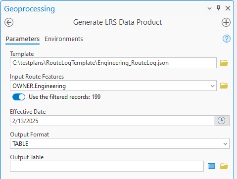

# Support table output with the length product template – Test Plan

| Field | Value |
| --- | --- |
| **Doc** | 232 · Test Plan · Pro |
| **Product** | Roads & Highways · Pipeline Referencing |
| **Release** | — |
| **Issues** | [ArcGISPro/ps-location-referencing#6458](https://devtopia.esri.com/ArcGISPro/ps-location-referencing/issues/6458) |
| **Source** | [6458_TableOutputLength_Testplan.pptx](<https://esriis.sharepoint.com/sites/LocationReferencing/Shared%20Documents/General/6458_TableOutputLength_Testplan.pptx>) |
| **People** | author Lakshmi Ananthanarayanan · PE Claire · dev Michael |
| **Edited** | 2025-02-14 00:13 by Claire Wang |
| **Extracted** | 2026-09-04 · lane xmlstrip · format 3.0 · prompt v2.0.2 |
| **Keywords** | length product template · table output · summary fields · length fields · geodatabase · route summary · line summary · test plan |
| **Tools** | — |

## Summary

Test plan for supporting table output when using the length product template. Covers testing various combinations of summary and length fields, different geodatabase types, and edge cases with special characters. Includes verification of output format and values, error conditions, automation integration, and documentation updates.

## Related documents

<!-- related:begin -->
- [Support multiple summary fields in Generate LRS Data Product – Test Plan](<https://esriis.sharepoint.com/sites/lrsworkspace/LRS Doc Index/Test Plans/5773-support-multiple-summary-fields-in-generate-lrs-data-product.md>) — similar text 0.23 · 2 title words · 1 filename word · same kind/surface/dev <!-- rel:321 s=5.114 -->
- [Generate LR Data Product: Support summary and length fields from the template – Test Plan](<https://esriis.sharepoint.com/sites/lrsworkspace/LRS Doc Index/Test Plans/5769-generate-lr-data-product-support-summary-and-length-fields.md>) — similar text 0.19 · 3 title words · 1 filename word · same kind/surface/dev <!-- rel:339 s=5.052 -->
- [Generate LRS Data Product Support Summary and Length](<https://esriis.sharepoint.com/sites/lrsworkspace/LRS%20Doc%20Index/User%20Stories/generate-lrs-data-product-support-summary-and-length.md>) — similar text 0.20 · 3 title words · 1 filename word · same surface/folder <!-- rel:357 s=4.758 -->
- [GenerateLengthSummary – Test Plan](<https://esriis.sharepoint.com/sites/lrsworkspace/LRS Doc Index/Test Plans/6202-generatelengthsummary.md>) — similar text 0.17 · 2 filename words · same kind/surface/dev <!-- rel:172 s=4.473 -->
- [Standalone GP – Generate Feature Count – Test Plan](<https://esriis.sharepoint.com/sites/lrsworkspace/LRS Doc Index/Test Plans/6205-standalone-gp-generate-feature-count.md>) — similar text 0.40 · 1 filename word · same kind/surface/dev <!-- rel:173 s=4.372 -->
<!-- related:end -->

<!-- docs:begin -->
## Esri documentation

[Event editing using the attribute table](https://doc.esri.com/en/arcgis-pro/latest/help/production/roads-highways/event-editing-using-the-attribute-table.html) · [Create a template for an LRS length data product](https://doc.esri.com/en/arcgis-pro/latest/help/production/roads-highways/create-a-template-for-an-lrs-length-data-product.html)
<!-- docs:end -->

---

## Slide 1 — Support table output with the length product template – Test Plan

https://devtopia.esri.com/ArcGISPro/ps-location-referencing/issues/6458

PE: Claire
Dev: Michael

## Slide 2

Testing

- When input template is a length template, Table is supported as an Output Format
- Test with these combinations
  - Only Summary Fields
  - Only Length Fields
  - Route Summary Field + Route Length Field
  - Line Summary Field + Another event as Length Field
  - Multiple summary fields (line and polygon) + Multiple length fields
- Test in fgdb, egdb (oracle + sql), fs
- Test with RH and APR
- Verify the results have correct format and correct values (same as CSV)
- Test few edge cases where summary/length fields and values contain special characters such as_ . /
- Test writing table to memory, to a folder, and to a gdb
Error Conditions
No new negative case
Automation
Part of the original GP tool automation
Documentation
Update places when output format is mentioned (template topics; GP; LRS vocabulary “LRS data product”)

### Notes

- Test with and without summary layers
  - Test with polygons and/or line events being the summary layers
  - Test with Unclassified summary values
  - Test with overlapping summary layers that result in duplicate calculation in columns (e.g. a route is calculated for both city1 and city2 because it’s right on the shared boundary)
- Test with and without length layers
  - Test with non-overlapping length fields (e.g. unique DOT classes that do not overlap)
  - Test with overlapping length fields that result in duplicate calculation in rows (e.g. length fields are routes, speed limit, access control, functional class, and etc.)
