# Extend Route AI Assistant Test Plan

| Field | Value |
| --- | --- |
| **Doc** | 18 · Test Plan · Pro |
| **Product** | Roads & Highways · Pipeline Referencing · Utility Network |
| **Release** | — |
| **Issues** | [ArcGISPro/ps-location-referencing#7065](https://devtopia.esri.com/ArcGISPro/ps-location-referencing/issues/7065) |
| **Source** | [7065-ExtendAI_TestPlan1.pptx](<https://esriis.sharepoint.com/sites/LocationReferencing/Shared%20Documents/General/Test%20Plans/7065-ExtendAI_TestPlan1.pptx>) |
| **People** | author Rahul Rakshit · PE — · dev — |
| **Edited** | 2026-06-25 18:37 by Mac Christmas |
| **Extracted** | 2026-09-04 · lane xmlstrip · format 3.0 · prompt v2.0.2 |
| **Keywords** | extend route · ai assistant · centerlines · network · effective date · source route · extension location · downstream recalibration · route extension · measure validation · input validation · complex routes |
| **Tools** | — |

## Summary

Test plan for the Extend Route AI Assistant feature in linear referencing. Covers input validation, user prompts, handling of complex route types, recalibration options, and various network and measure scenarios. Includes tests for projected and unprojected data, multiple centerlines, and error handling for invalid inputs.

## Related documents

<!-- related:begin -->
- [Iteration Planning and Issue Tracking for Location Referencing 3.8/12.2](<https://esriis.sharepoint.com/sites/lrsworkspace/LRS%20Doc%20Index/Schedules/3040-iteration-planning-and-issue-tracking-for-lr-3-8-12-2.md>) — shared issue ArcGISPro/ps-location-referencing#7065 · similar text 0.07 · same surface <!-- rel:2 s=1001.862 -->
- [Realign Route AI Assistant Test Plan](<https://esriis.sharepoint.com/sites/lrsworkspace/LRS Doc Index/Test Plans/7067-realign-route-ai-assistant-rh-apr-2026-02.md>) — similar text 0.53 · 2 title words · same kind/surface/folder <!-- rel:51 s=6.928 -->
- [Realign Route AI Assistant Test Plan](<https://esriis.sharepoint.com/sites/lrsworkspace/LRS Doc Index/Test Plans/7067-realign-route-ai-assistant-rh-apr-v1.md>) — similar text 0.59 · 2 title words · same kind/surface/folder <!-- rel:80 s=5.572 -->
- [Create Route AI Assistant Test Plan](<https://esriis.sharepoint.com/sites/lrsworkspace/LRS Doc Index/Test Plans/create-route-ai-assistant.md>) — similar text 0.40 · 2 title words · same kind/surface/folder <!-- rel:98 s=5.081 -->
- [Create Route in Line Network and Multifield Network with Additional Attributes Pro AI Assistant Test Plan](<https://esriis.sharepoint.com/sites/lrsworkspace/LRS Doc Index/Test Plans/create-route-in-line-network-and-multifield-network.md>) — similar text 0.42 · 2 title words · same kind/surface/folder <!-- rel:86 s=4.588 -->
<!-- related:end -->

<!-- docs:begin -->
## Esri documentation

[Extend a route](https://doc.esri.com/en/arcgis-pro/latest/help/production/roads-highways/extend-a-route.html) · [LRS network](https://doc.esri.com/en/arcgis-pro/latest/help/production/location-referencing-pipelines/what-is-an-lrs-network.html) · [Event behavior for route extension](https://doc.esri.com/en/arcgis-pro/latest/help/production/roads-highways/event-behavior-for-route-extension.html) · [Complex scenarios for route calibration](https://doc.esri.com/en/arcgis-pro/latest/help/production/roads-highways/complex-scenarios-for-route-calibration.html)
<!-- docs:end -->

---

## Overview

### Slide 1 — Devtopia Issue <!-- slide 1 -->

Extend Route AI Assistant

**Notes**
- Add AI Skill for Extend Route
- Test only in feature services
- Test with RH, APR, ADMRH, UNAPR, and PoM data
- Projected and unprojected data with 3D
- Use multiple centerlines to extend a route
- Test with spelling mistakes
- Gapped and multiple gapped route extension
- Complex routes such as lollipops, loops, alpha, branch, infinity with all the variations using multiple centerlines and gaps
- Test with centerlines that are not always in the same direction and test in-memory flipped centerlines
- Test within local scene
- Verify that the Extend Route form only opens when no error exists in the input parameters
- Recalibrate route downstream option will be enabled by default (when applicable)
- Effective Date will default to today’s date unless otherwise specified
- I18n/L10n + A11y

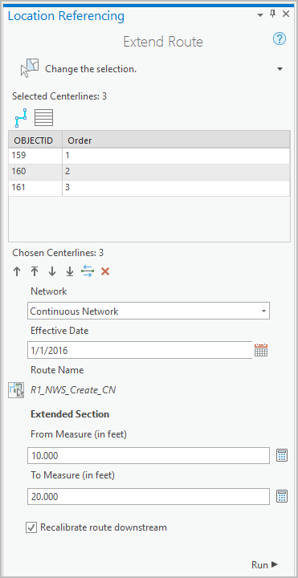

## Test Cases

### TC-U01 — Nonline Network <!-- src: S5 · slide 2 · label Nonline Network -->

**Steps:**
1. Centerlines
2. Network
3. Effective Date
4. Source RouteID/Name
5. Extension Location (if centerline(s) not touching route at start or end)
6. Extended Section From Measure*
7. Extended Section To Measure*

### TC-U02 — Line Network <!-- src: S5 · slide 2 · label Line Network -->

**Steps:**
1. Centerlines
2. Network
3. Effective Date
4. Source RouteID/Name
5. Extension Location (if centerline(s) not touching route at start or end)
6. Extended Section From Measure*
7. Extended Section To Measure*
8. Recalibrate route downstream (enabled by default, if included when not applicable will be ignored per Sharon)

### TC-U03 — 25 random prompt permutations (from Copilot) <!-- src: S5 · slide 14 · label 25 random prompt permutations (from Copilot) -->

**Steps:**
1. Extend LRS Route on RouteName R1 for Date 01/01/2000 using Centerlines with Object ID = 102 From Measure 0 and To Measure 10 to Recalibrate downstream
2. Expand Pipeline with R1 for Jan 1 2000 using CL with OID 102 103 107 spanning measures 0 and 10 to Update downstream
3. Continue LRS Roadway in <Network Name> on RouteName = R1 for January 1st 2000 with Centerlines using <Any Field> Between 101–108 to Refresh downstream segment
4. Project Highway on Rname R1 on 01-01-2000 using CL with Object ID Between 101 to 108 From Measure 0 and To Measure 10 to Update downstream
5. Lengthen LRS Road with R1 for 01/01/2000 using Centerlines with OID = 102 across measures 0 and 10 to Recalibrate downstream
6. Elongate Pipe in <Network Name> on RouteName R1 for January 1st 2000 using CL with <Any Field> Between 101–108 spanning measures 0 and 10 to Update downstream
7. Continue LRS Route with Rname R1 on Jan 1 2000 using Centerlines with OID 102 103 107 From Measure 0 and To Measure 10 to Refresh downstream segment
8. Extend Pipeline with RouteName = R1 for Date 01/01/2000 using CL with Object ID = 102 across measures 0 and 10 to Update downstream
9. Expand LRS Highway in <Network Name> on R1 on 01-01-2000 using Centerlines with OID Between 101 to 108 spanning measures 0 and 10 to Recalibrate downstream
10. Project Roadway with Rname R1 for January 1st 2000 using CL with <Any Field> Between 101–108 From Measure 0 and To Measure 10 to Refresh downstream segment
11. Continue Road in <Network Name> on R1 for 01/01/2000 using Centerlines with Object ID 102 103 107 across measures 0 and 10 to Update downstream
12. Lengthen LRS Pipe on RouteName R1 for Date 01/01/2000 using CL with OID Between 101 to 108 From Measure 0 and To Measure 10 to Recalibrate downstream
13. Elongate Route in <Network Name> with R1 on January 1st 2000 using Centerlines with <Any Field> = 102 spanning measures 0 and 10 to Update downstream
14. Extend LRS Pipeline with Rname R1 for 01-01-2000 using CL with Object ID Between 101–108 From Measure 0 and To Measure 10 to Refresh downstream segment
15. Expand Route on RouteName = R1 with Jan 1 2000 using Centerlines with OID 102 103 107 across measures 0 and 10 to Recalibrate downstream
16. Continue LRS Highway in <Network Name> with RouteName R1 for 01/01/2000 using CL with <Any Field> Between 101 to 108 spanning measures 0 and 10 to Update downstream
17. Project Pipeline on R1 for January 1st 2000 using Centerlines with Object ID = 102 From Measure 0 and To Measure 10 to Recalibrate downstream
18. Lengthen Roadway with RouteName = R1 on 01-01-2000 using CL with OID Between 101–108 across measures 0 and 10 to Update downstream
19. Elongate LRS Pipe in <Network Name> with Rname R1 for Date 01/01/2000 using Centerlines with <Any Field> 102 103 107 spanning measures 0 and 10 to Refresh downstream segment
20. Extend Road with R1 on January 1st 2000 using CL with OID Between 101 to 108 From Measure 0 and To Measure 10 to Update downstream
21. Expand LRS Route in <Network Name> with RouteName R1 for Jan 1 2000 using Centerlines with Object ID = 102 across measures 0 and 10 to Recalibrate downstream
22. Continue Pipeline on Rname R1 on 01/01/2000 using CL with <Any Field> Between 101–108 spanning measures 0 and 10 to Update downstream
23. Project LRS Roadway with R1 for January 1st 2000 using Centerlines with OID 102 103 107 From Measure 0 and To Measure 10 to Refresh downstream segment
24. Lengthen Highway in <Network Name> on RouteName R1 for 01-01-2000 using CL with Object ID Between 101 to 108 across measures 0 and 10 to Update downstream
25. Elongate LRS Route with Rname R1 for Date 01/01/2000 using Centerlines with OID = 102 spanning measures 0 and 10 to Recalibrate downstream

## Other content

### Slide 2 — To Provide in Prompt: <!-- slide 2 -->

*Optional

### Slide 3 <!-- slide 3 -->

Workflow
Downstream recalibration is enabled by default

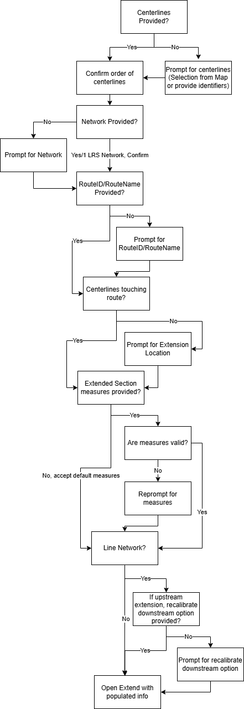

### Slide 4 <!-- slide 4 -->

AI Assistant should ask for:

Centerlines, Network, Effective Date, Source Route

(Input centerlines touch route at start or end)

Test also with line networks

[figure: No input provided · Route · Road · Roadway · Highway · Extend · Expand · Continue · Elongate · Lengthen · Project · a · LRS · Provided in Prompt: · Pipe · Pipeline]

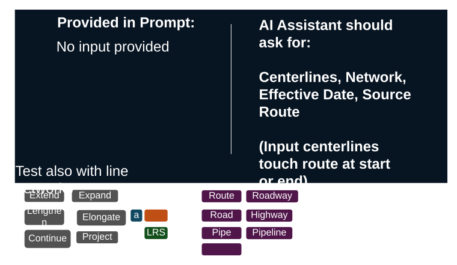

### Slide 5 <!-- slide 5 -->

AI Assistant should ask for:

Centerlines, Network, Effective Date, Source Route, Extension Location

(Input centerlines do not touch route at start or end)

Test also with line networks

[figure: No input provided · Route · Road · Roadway · Highway · Extend · Expand · Continue · Elongate · Lengthen · Project · a · LRS · Provided in Prompt: · Pipe · Pipeline]

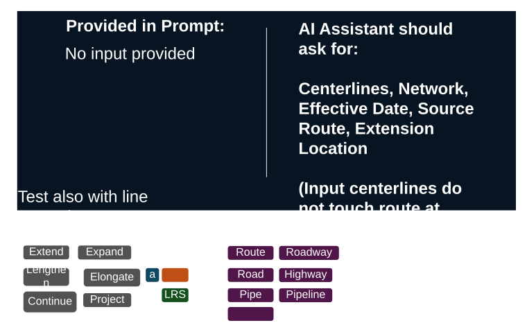

### Slide 6 — Centerlines, Network, Effective Date, Source Route <!-- slide 6 -->

<Network Name> Network
Populate and open the Extend Route form

(input centerlines touch route at start or end)
January 1st, 2000
Between 101 to 108
Between 101 - 108
Test also with line networks

[figure: AI Assistant should: · Route · Road · Roadway · Highway · <Network Name> · in · Provided in Prompt: · on · for · Date 01/01/2000 · 01/01/2000 · 01-01-2000 · with · Jan 1, 2000 · using Centerlines with · using CL with · with Centerlines · Object ID · OID · = 102 · 102, 103, 107 · <Any Field> · Pipe · …]

### Slide 7 — Centerlines, Network, Effective Date, Source Route <!-- slide 7 -->

<Network Name> Network
Prompt for Extension Location

(input centerlines do not touch route at start or end)
January 1st, 2000
Between 101 to 108
Between 101 - 108
Test also with line networks

[figure: AI Assistant should: · Route · Road · Roadway · Highway · <Network Name> · in · Provided in Prompt: · on · for · Date 01/01/2000 · 01/01/2000 · 01-01-2000 · with · Jan 1, 2000 · using Centerlines with · using CL with · with Centerlines · Object ID · OID · = 102 · 102, 103, 107 · <Any Field> · Pipe · …]

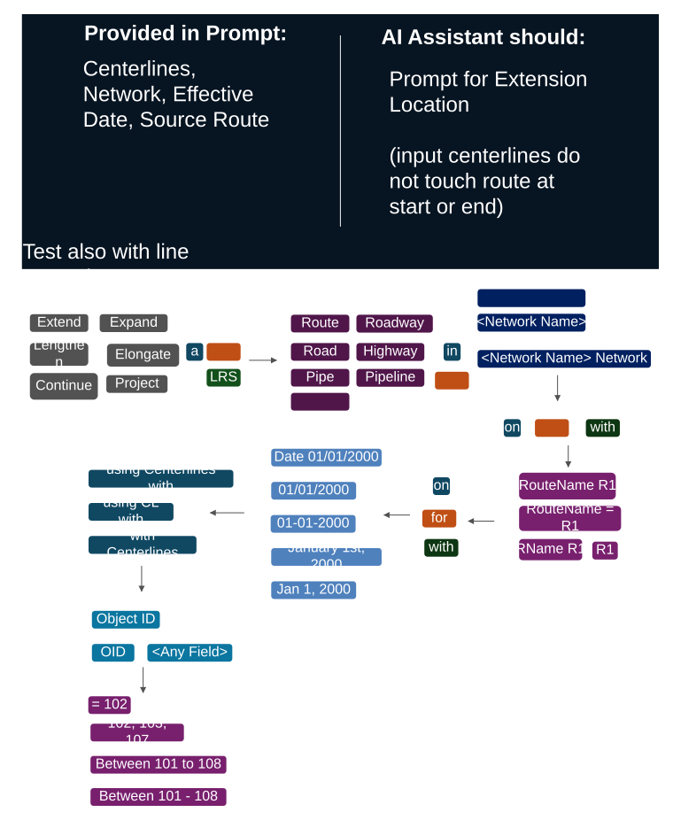

### Slide 8 — Centerlines, Network, Effective Date, Source Route, Extension Location <!-- slide 8 -->

<Network Name> Network
Populate and open the Extend Route form

(input centerlines do not touch route at start or end, but Extension Location is provided)
January 1st, 2000
Between 101 to 108
Between 101 - 108
Test also with line networks

From the beginning of route
From the end of route

[figure: AI Assistant should: · Route · Road · Roadway · Highway · <Network Name> · in · Provided in Prompt: · on · for · Date 01/01/2000 · 01/01/2000 · 01-01-2000 · with · Jan 1, 2000 · using Centerlines with · using CL with · with Centerlines · Object ID · OID · = 102 · 102, 103, 107 · <Any Field> · Pipe · …]

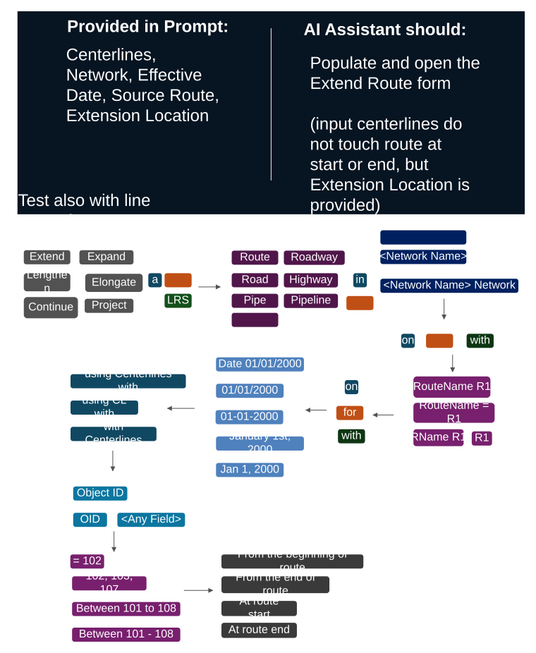

### Slide 9 <!-- slide 9 -->

Centerlines, Network, Effective Date, Source Route, Extended From Measure, Extended To Measure
Populate and open the Extend Route form with user-specified measures

(input centerlines touch route at start or end)
Test also with line networks
January 1st, 2000
Between 101 to 108
Between 101 - 108

From Measure 0 and to Measure 10
Spanning Measures 0  and 10
0 and 10 as measures
0 and 10 as From and To measures

[figure: AI Assistant should: · Provided in Prompt: · Route · Road · Roadway · Highway · <Network Name> · in · on · for · Date 01/01/2000 · 01/01/2000 · 01-01-2000 · with · Jan 1, 2000 · using Centerlines with · using CL with · with Centerlines · Object ID · OID · = 102 · 102, 103, 107 · <Any Field> · Pipe · …]

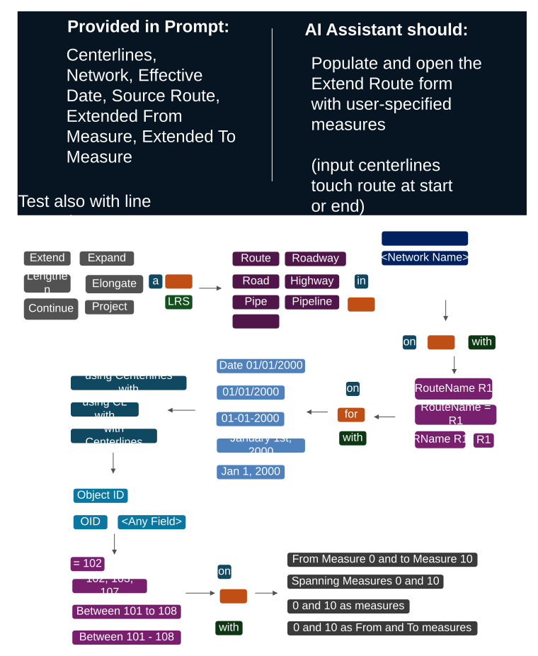

### Slide 10 <!-- slide 10 -->

Centerlines, Network*, Effective Date, Source Route, Extended From Measure, Extended To Measure, Downstream recalibration option
Populate and open the Extend Route form with user-specified measures

(input centerlines touch route at start)
January 1st, 2000
Between 101 to 108
Between 101 - 108

From Measure 0 and to Measure 10
Spanning Measures 0  and 10
0 and 10 as measures
0 and 10 as From and To measures
Refresh downstream segment

[figure: AI Assistant should: · Provided in Prompt: · *Line Network · Route · Road · Roadway · Highway · <Network Name> · in · on · for · Date 01/01/2000 · 01/01/2000 · 01-01-2000 · with · Jan 1, 2000 · using Centerlines with · using CL with · with Centerlines · Object ID · OID · = 102 · 102, 103, 107 · <Any Field> · …]

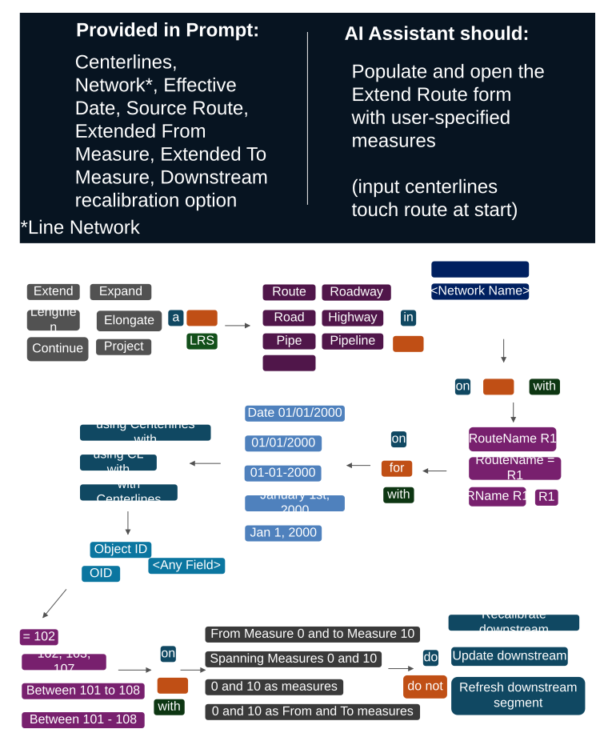

### Slide 11 <!-- slide 11 -->

Centerlines, Network*, Effective Date, Source Route, Extension Location, Extended From Measure, Extended To Measure, Downstream recalibration option
Populate and open the Extend Route form with user-specified measures

(input centerlines do not touch route)
January 1st, 2000
Between 101 to 108
Between 101 - 108

From Measure 0 and to Measure 10
Spanning Measures 0  and 10
0 and 10 as measures
0 and 10 as From and To measures
Refresh downstream segment
From the beginning of route
From the end of route

[figure: AI Assistant should: · Provided in Prompt: · *Line Network · Route · Road · Roadway · Highway · <Network Name> · in · on · for · Date 01/01/2000 · 01/01/2000 · 01-01-2000 · with · Jan 1, 2000 · using Centerlines with · using CL with · with Centerlines · Object ID · OID · = 102 · 102, 103, 107 · <Any Field> · …]

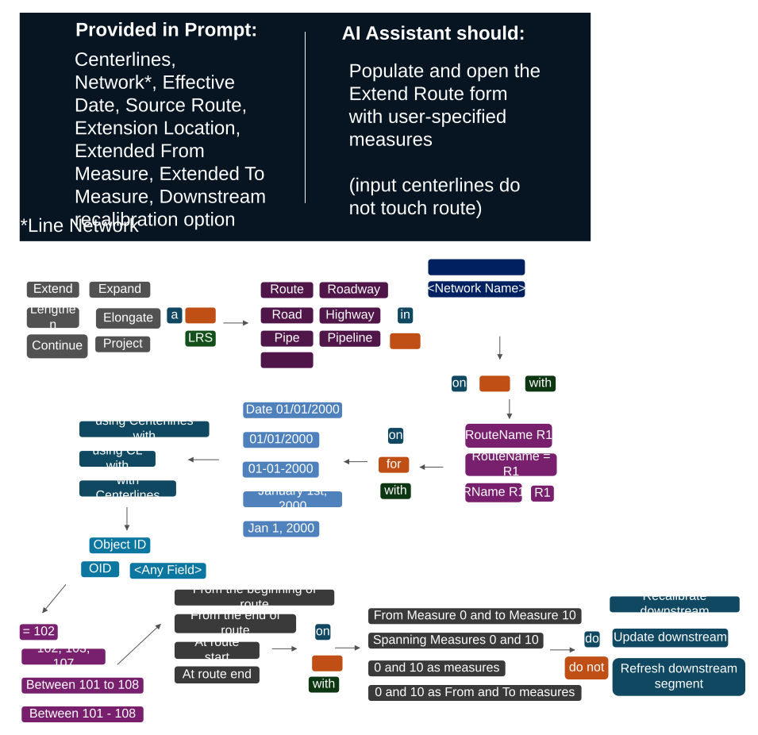

### Slide 12 — Centerlines, Network, Source Route <!-- slide 12 -->

<Network Name> Network
Populate and open the Extend Route form with today’s date as Effective Date

(input centerlines touch route at start or end)
Between 101 to 108
Between 101 - 108
Test also with line networks

[figure: AI Assistant should: · Route · Road · Roadway · Highway · <Network Name> · in · Provided in Prompt: · using Centerlines with · using CL with · with Centerlines · Object ID · OID · = 102 · 102, 103, 107 · <Any Field> · Pipe · Pipeline · Extend · Expand · Continue · Elongate · Lengthen · Project · …]

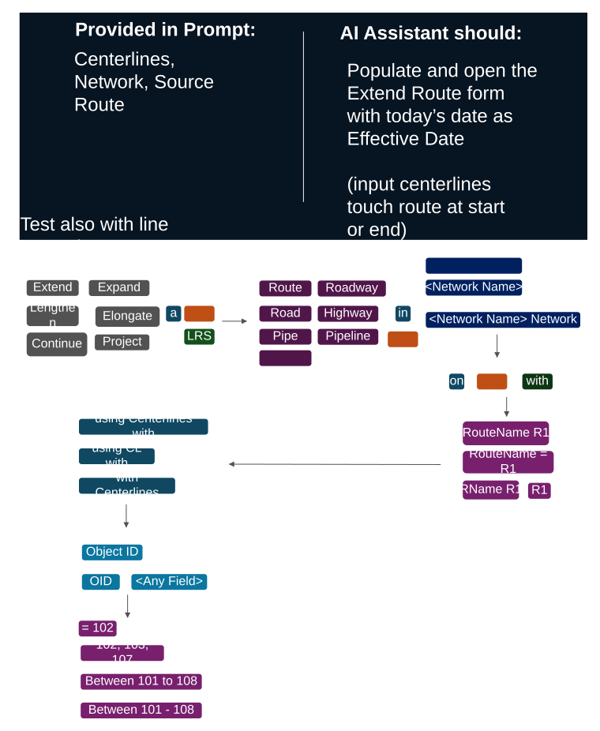

### Slide 13 <!-- slide 13 -->

Centerlines, Network*, Effective Date, Source Route, Extended From Measure, Extended To Measure, Downstream recalibration option (not applicable)
Populate and open the Extend Route form, but ignore the Downstream recalibration option as it is not possible

(input centerlines touch route at end)
January 1st, 2000
Between 101 to 108
Between 101 - 108

From Measure 0 and to Measure 10
Spanning Measures 0  and 10
0 and 10 as measures
0 and 10 as From and To measures
Refresh downstream segment

[figure: AI Assistant should: · Provided in Prompt: · *Line Network · Route · Road · Roadway · Highway · <Network Name> · in · on · for · Date 01/01/2000 · 01/01/2000 · 01-01-2000 · with · Jan 1, 2000 · using Centerlines with · using CL with · with Centerlines · Object ID · OID · = 102 · 102, 103, 107 · <Any Field> · …]

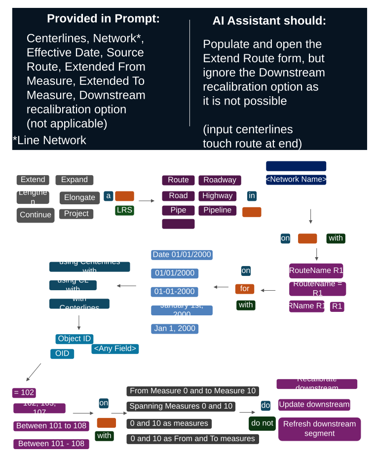

### Slide 14 <!-- slide 14 -->

Centerlines, Network*, Effective Date, Source Route, Extended From Measure, Extended To Measure, Downstream recalibration option (not applicable)
Populate and open the Extend Route form, but ignore the Downstream recalibration option as it is not possible

January 1st, 2000
Between 101 to 108
Between 101 - 108

From Measure 0 and to Measure 10
Spanning Measures 0  and 10
0 and 10 as measures
0 and 10 as From and To measures
Refresh downstream segment

[figure: AI Assistant should: · Provided in Prompt: · *Nonline Network · Route · Road · Roadway · Highway · <Network Name> · in · on · for · Date 01/01/2000 · 01/01/2000 · 01-01-2000 · with · Jan 1, 2000 · using Centerlines with · using CL with · with Centerlines · Object ID · OID · = 102 · 102, 103, 107 · <Any Field> · …]

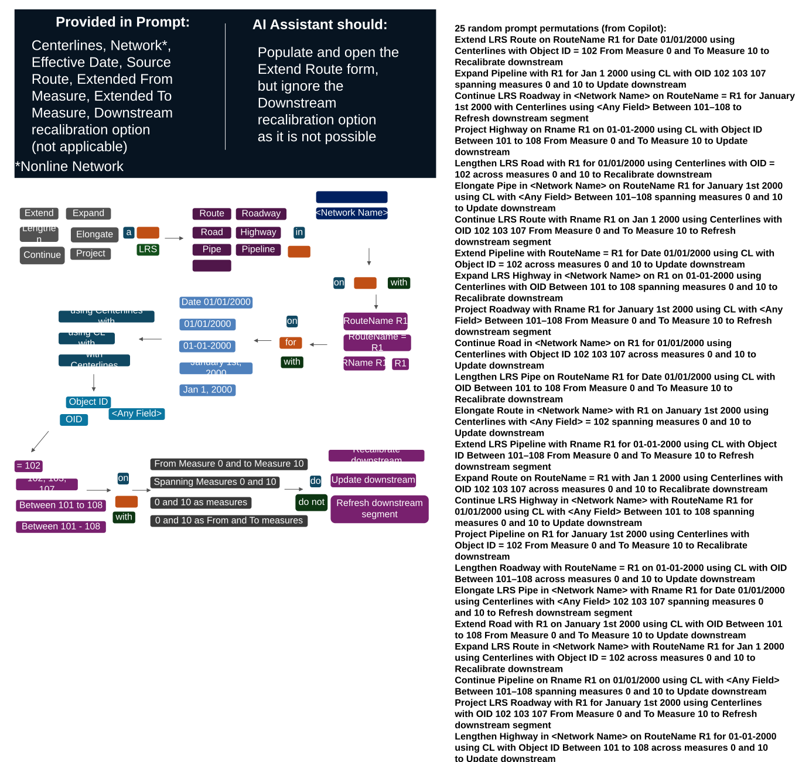

### Slide 15 — AI Assistant should <!-- slide 15 -->

Populate and open the Extend Route form
Centerlines, Network, Effective Date, Source Route, Extension Location (if not touching route), Extended From Measure, Extended To Measure, Recalibrate downstream option (where applicable)

### Slide 16 — No input provided, Linear Referencing is not licensed <!-- slide 16 -->

AI Assistant should:

Not show any info

Test also with line networks

[figure: Route · Road · Roadway · Highway · Extend · Expand · Continue · Elongate · Lengthen · Project · a · LRS · Provided in Prompt: · Pipe · Pipeline]

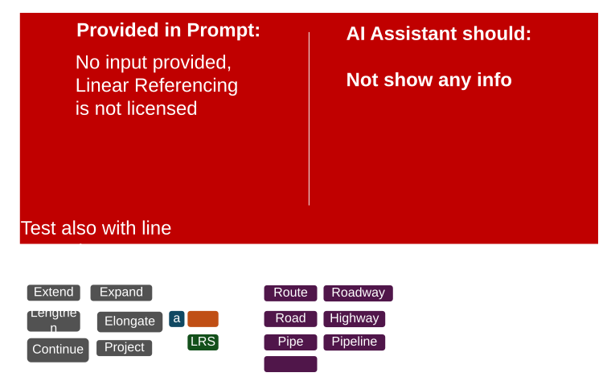

### Slide 17 — Inform user input centerlines are invalid and prompt for new centerlines <!-- slide 17 -->

Centerlines*, Network, Effective Date, Source Route, but centerlines are invalid/duplicates/do not exist/cause non-monotonic route
<Network Name> Network
January 1st, 2000
Between 101 to 108
Between 101 - 108
Test also with line networks

[figure: AI Assistant should: · Route · Road · Roadway · Highway · <Network Name> · in · Provided in Prompt: · on · for · Date 01/01/2000 · 01/01/2000 · 01-01-2000 · with · Jan 1, 2000 · using Centerlines with · using CL with · with Centerlines · Object ID · OID · = 102 · 102, 103, 107 · <Any Field> · Pipe · …]

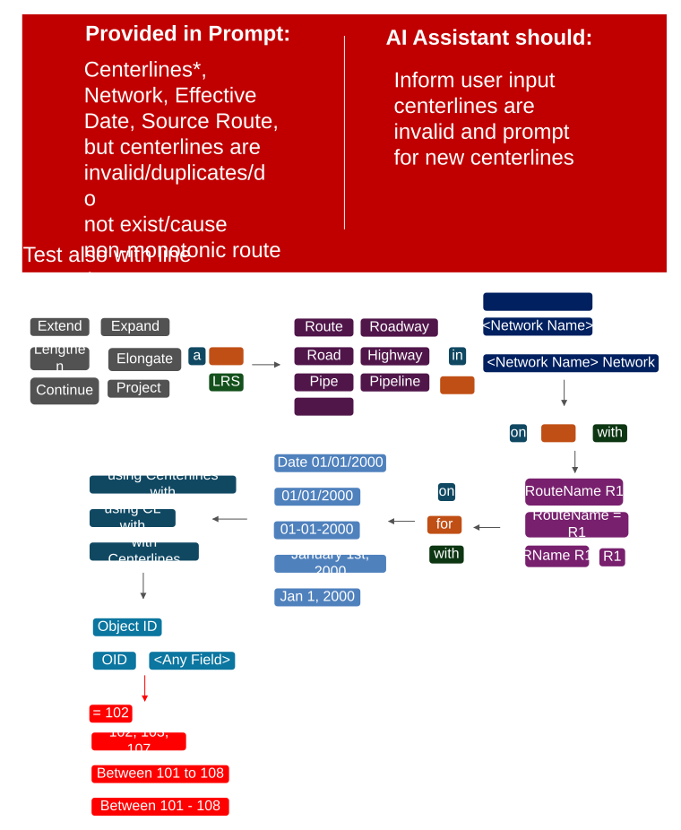

### Slide 18 <!-- slide 18 -->

Centerlines, Network, Effective Date, Source Route, Extended From Measure, Extended To Measure, but extended section measures are invalid
Inform user that measures are invalid and prompt for new measures (or ask to use default measures)
January 1st, 2000
Between 101 to 108
Between 101 - 108

From Measure 10 and to Measure 0
Spanning Measures 10 and 0
10 and 0 as measures
10 and 0 as From and To measures

[figure: AI Assistant should: · Provided in Prompt: · Route · Road · Roadway · Highway · <Network Name> · in · on · for · Date 01/01/2000 · 01/01/2000 · 01-01-2000 · with · Jan 1, 2000 · using Centerlines with · using CL with · with Centerlines · Object ID · OID · = 102 · 102, 103, 107 · <Any Field> · Pipe · …]

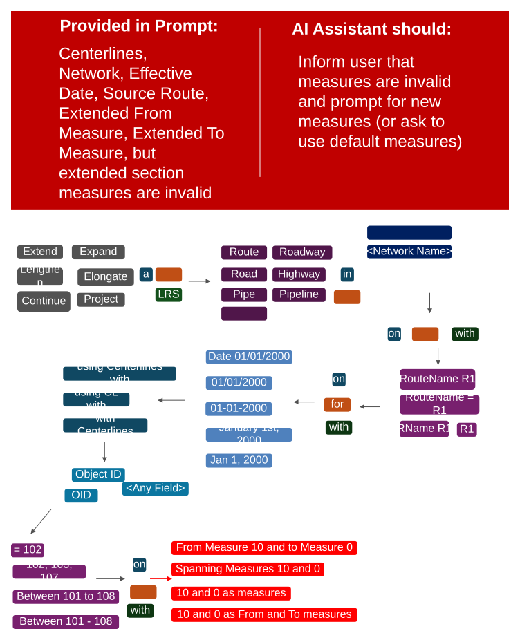

### Slide 19 <!-- slide 19 -->

Centerlines, Network, Effective Date, Source Route, but Source Route does not exist for given effective date/does not exist
<Network Name> Network
Inform user source route is invalid and ask them to provide a different route
January 1st, 2000
Between 101 to 108
Between 101 - 108
Test also with line networks

[figure: AI Assistant should: · Route · Road · Roadway · Highway · <Network Name> · in · Provided in Prompt: · on · for · Date 01/01/2000 · 01/01/2000 · 01-01-2000 · with · Jan 1, 2000 · using Centerlines with · using CL with · with Centerlines · Object ID · OID · = 102 · 102, 103, 107 · <Any Field> · Pipe · …]

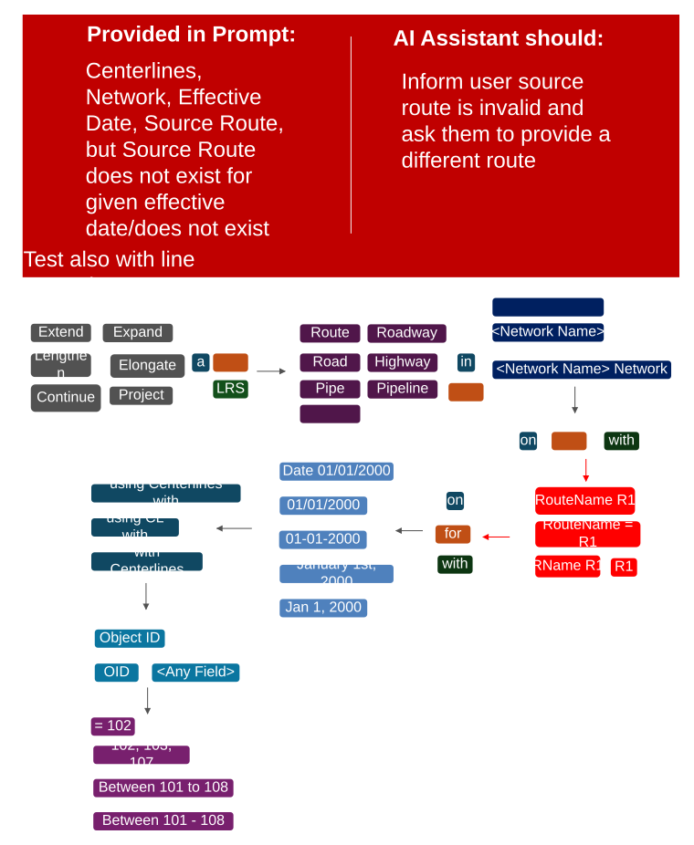

### Slide 20 <!-- slide 20 -->

Centerlines, Network, Effective Date, Source Route, but input Network does not exist/is not in map/is invalid
<Network Name> Network
Inform user input Network has issues and prompt for new input network (or ask user to add network to map)
January 1st, 2000
Between 101 to 108
Between 101 - 108
Test also with line networks

[figure: AI Assistant should: · Route · Road · Roadway · Highway · <Network Name> · in · Provided in Prompt: · on · for · Date 01/01/2000 · 01/01/2000 · 01-01-2000 · with · Jan 1, 2000 · using Centerlines with · using CL with · with Centerlines · Object ID · OID · = 102 · 102, 103, 107 · <Any Field> · Pipe · …]

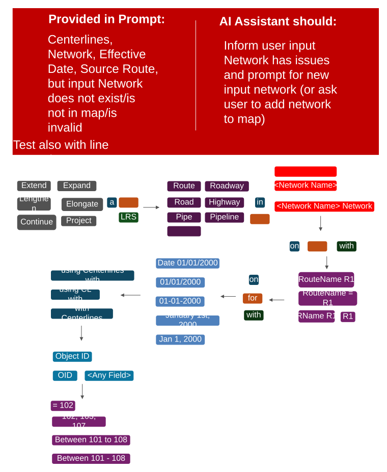

### Slide 21 <!-- slide 21 -->

Centerlines, Network, Effective Date, Source Route, but centerline layer is not in map
<Network Name> Network
Inform user Centerline layer is not present in map and needs to be added to proceed
January 1st, 2000
Between 101 to 108
Between 101 - 108
Test also with line networks

[figure: AI Assistant should: · Route · Road · Roadway · Highway · <Network Name> · in · Provided in Prompt: · on · for · Date 01/01/2000 · 01/01/2000 · 01-01-2000 · with · Jan 1, 2000 · using Centerlines with · using CL with · with Centerlines · Object ID · OID · = 102 · 102, 103, 107 · <Any Field> · Pipe · …]

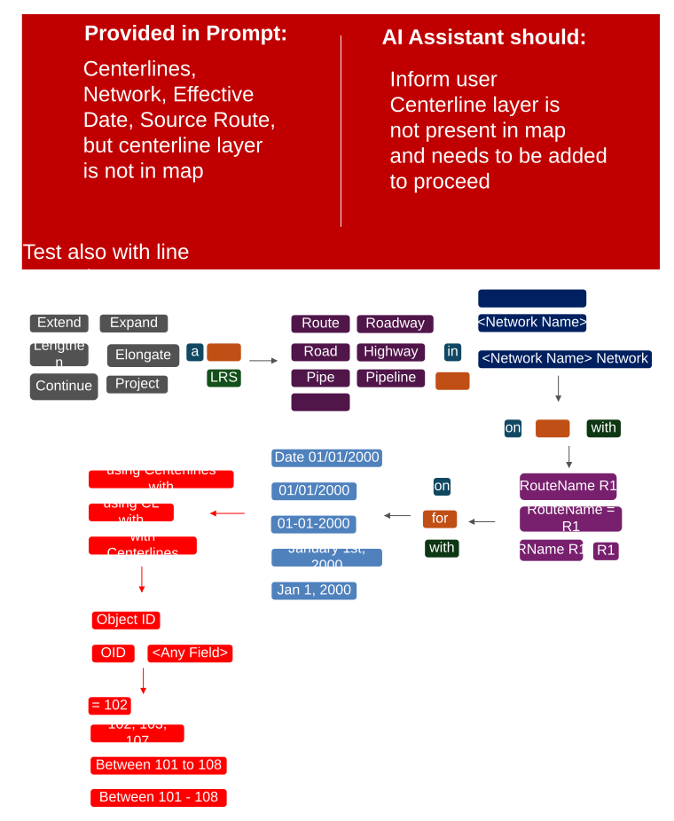

### Slide 22 — Inform user Effective Date is invalid and prompt for new date <!-- slide 22 -->

Centerlines, Network, Effective Date, Source Route, but Effective Date is invalid
<Network Name> Network
January 1st, XXXX
Between 101 to 108
Between 101 - 108
Test also with line networks

[figure: AI Assistant should: · Route · Road · Roadway · Highway · <Network Name> · in · Provided in Prompt: · on · for · Date XX/XX/XXXX · 30/30/2000 · 0A-05-2000 · with · Jan 45, 2000 · using Centerlines with · using CL with · with Centerlines · Object ID · OID · = 102 · 102, 103, 107 · <Any Field> · Pipe · …]

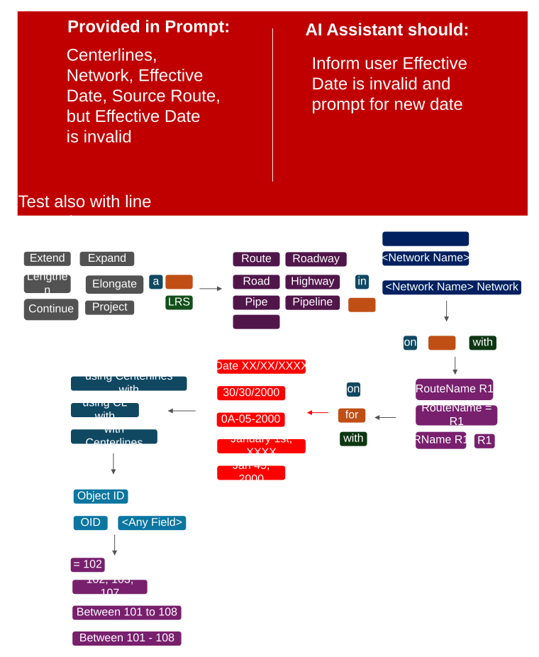

### Slide 23 <!-- slide 23 -->

Centerlines, Network*, Effective Date, Source Route, Extended From Measure, Extended To Measure, Downstream recalibration option, but prompt has multiple issues
Inform user of issues in prompt and work through the issues until a valid extension operation is given
January 1st, 2000
Between 101 to 108
Between 101 - 108

From Measure 0 and to Measure 10
Spanning Measures 0  and 10
0 and 10 as measures
0 and 10 as From and To measures
Refresh downstream segment

[figure: AI Assistant should: · Provided in Prompt: · Route · Road · Roadway · Highway · <Network Name> · in · on · for · Date 01/01/2000 · 01/01/2000 · 01-01-2000 · with · Jan 1, 2000 · using Centerlines with · using CL with · with Centerlines · Object ID · OID · = 102 · 102, 103, 107 · <Any Field> · Pipe · …]

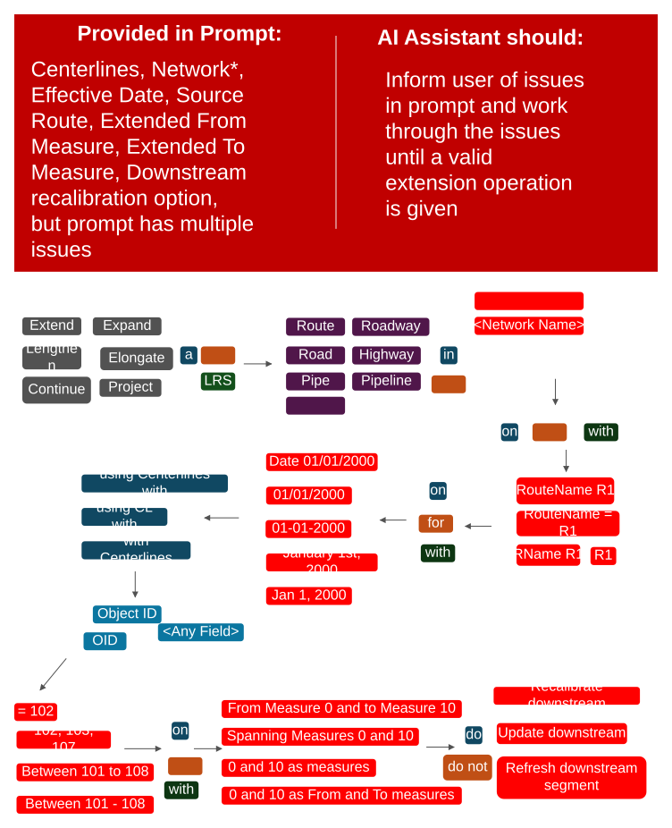

### Slide 24 — Inform user that Create Route should be used instead of Extend <!-- slide 24 -->

Centerlines, Network*, Effective Date, Source Route, Extended From Measure, Extended To Measure, Downstream recalibration option, but downstream calibration is disabled so Create Route should be used instead
January 1st, 2000
Between 101 to 108
Between 101 - 108

From Measure 0 and to Measure 10
Spanning Measures 0  and 10
0 and 10 as measures
0 and 10 as From and To measures
Refresh downstream segment

[figure: AI Assistant should: · Provided in Prompt: · *Line Network · Route · Road · Roadway · Highway · <Network Name> · in · on · for · Date 01/01/2000 · 01/01/2000 · 01-01-2000 · with · Jan 1, 2000 · using Centerlines with · using CL with · with Centerlines · Object ID · OID · = 102 · 102, 103, 107 · <Any Field> · …]

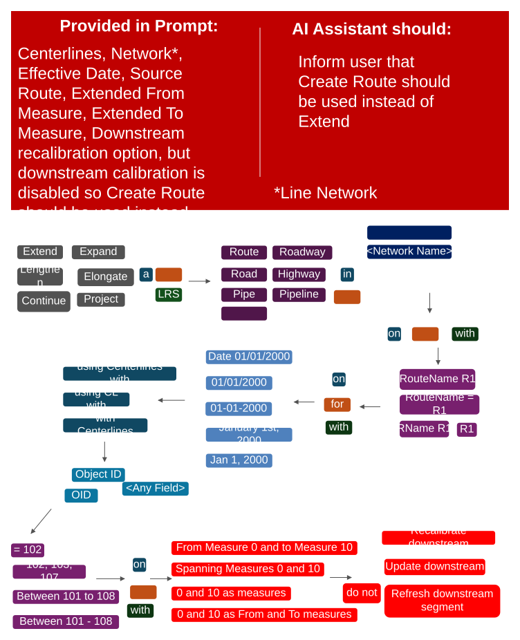
