# Realign Route AI Assistant Test Plan

| Field | Value |
| --- | --- |
| **Doc** | 51 · Test Plan · Pro |
| **Product** | Roads & Highways · Pipeline Referencing |
| **Release** | — |
| **Issues** | [ArcGISPro/ps-location-referencing#7067](https://devtopia.esri.com/ArcGISPro/ps-location-referencing/issues/7067) |
| **Source** | [7067-RealignRouteAIAssistant_TestPlanV1.5.pptx](<https://esriis.sharepoint.com/sites/LocationReferencing/Shared%20Documents/General/Test%20Plans/7067-RealignRouteAIAssistant_TestPlanV1.5.pptx>) |
| **People** | author Rahul Rakshit · PE — · dev — |
| **Edited** | 2026-02-23 15:16 by Praveen Kumar |
| **Extracted** | 2026-09-04 · lane xmlstrip · format 3.0 · prompt v2.0.2 |
| **Keywords** | route realignment · centerlines · network · effective date · recalibrate downstream · route abandonment · line network · multifield network · input validation · auto-populate parameters · complex routes · measure calculation · realign route form |
| **Tools** | Realign Route |

## Summary

Test plan for the Realign Route AI Assistant feature focusing on route realignment workflows using centerlines and networks in line and multifield LRS networks. Covers input validation, auto-population of parameters, recalibration options, route abandonment, and error handling scenarios across various network configurations and data types including projected, unprojected, and 3D data. Includes tests for complex route shapes, measure calculations, and user prompts for invalid inputs.

## Related documents

<!-- related:begin -->
- [Realign Route AI Assistant Test Plan](<https://esriis.sharepoint.com/sites/lrsworkspace/LRS Doc Index/Test Plans/7067-realign-route-ai-assistant-rh-apr-v1.md>) — shared issue ArcGISPro/ps-location-referencing#7067 · similar text 0.81 · 3 title words · 3 filename words · same kind/surface/folder <!-- rel:80 s=1010.602 -->
- [Iteration Planning and Issue Tracking for Esri LRS Development](<https://esriis.sharepoint.com/sites/lrsworkspace/LRS Doc Index/Schedules/363-iteration-planning-and-issue-tracking-for-esri-lrs.md>) — shared issue ArcGISPro/ps-location-referencing#7067 · similar text 0.07 · same surface <!-- rel:59 s=1001.607 -->
- [Extend Route AI Assistant Test Plan](<https://esriis.sharepoint.com/sites/lrsworkspace/LRS Doc Index/Test Plans/7065-extend-route-ai-assistant.md>) — similar text 0.53 · 2 title words · same kind/surface/folder <!-- rel:18 s=6.928 -->
- [ArcGIS Pro AI Assistant: Realign Route Subsequent Panes Test Plan](<https://esriis.sharepoint.com/sites/lrsworkspace/LRS Doc Index/Test Plans/pro-ai-assistant-realign-route-subsequent-panes.md>) — similar text 0.31 · 3 title words · 2 filename words · same kind/surface/folder <!-- rel:50 s=6.643 -->
- [Create Route in Line Network and Multifield Network with Additional Attributes Pro AI Assistant Test Plan](<https://esriis.sharepoint.com/sites/lrsworkspace/LRS Doc Index/Test Plans/create-route-in-line-network-and-multifield-network.md>) — similar text 0.46 · 2 title words · 1 filename word · same kind/surface/folder <!-- rel:86 s=5.738 -->
<!-- related:end -->

<!-- docs:begin -->
## Esri documentation

[Realign routes](https://doc.esri.com/en/arcgis-pro/latest/help/production/roads-highways/realign-routes.html) · [LRS network](https://doc.esri.com/en/arcgis-pro/latest/help/production/location-referencing-pipelines/what-is-an-lrs-network.html) · [Complex scenarios for route calibration](https://doc.esri.com/en/arcgis-pro/latest/help/production/roads-highways/complex-scenarios-for-route-calibration.html)
<!-- docs:end -->

---

## Overview

### Slide 1 — Devtopia Issue <!-- slide 1 -->

Realign Route AI Assistant
(Excluding Subsequent Panes)

**Notes**
- Subsequent realignment panes will be covered in separate user story
- Test only in feature services
- Test with RH, APR, and PoM data
- Projected and unprojected data with 3D
- Use multiple centerlines to realign a route
- Test with spelling mistakes
- Gapped and multiple gapped route realignment
- Complex routes such as lollipops, loops, alpha, branch, infinity with all the variations using multiple centerlines and gaps
- Centerlines that are not always in the same direction
- Test within local scene
- Verify that the Realign Route form only opens when no error exists in the input parameters
- Verify relevant info auto-populates when centerlines are touching/partially touching input route(s)
- Recalibrate downstream and Reassign to abandoned route(s) options are enabled by default. These options will only be disabled when the user specifies
- I18n/L10n + A11y

## Test Cases

### TC-U01 — Nonline Network <!-- src: S5 · slide 2 · label Nonline Network -->

**Steps:**
1. Centerlines
2. Network
3. Effective Date
4. Source RouteID*
5. Source From Measure*
6. Source To Measure*
7. Target From Measure*
8. Target To Measure*
9. Recalibrate Downstream option
10. Values will be auto-populated based on input centerlines only if the centerlines can get suggested info (must be touching the route)

### TC-U02 — Line Network <!-- src: S5 · slide 2 · label Line Network -->

**Steps:**
1. Centerlines
2. Network
3. Effective Date
4. Source From RouteName*
5. Source From Measure*
6. Source To RouteName*
7. Source To Measure*
8. Route abandonment option
9. Target From Measure*
10. Target To Measure*
11. Recalibrate Downstream option

## Other content

### Slide 3 <!-- slide 3 -->

Workflow

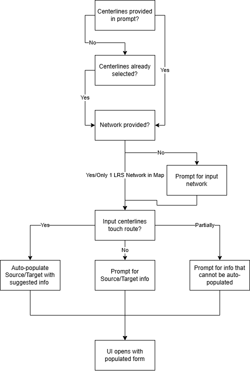

### Slide 4 — AI Assistant should ask for: <!-- slide 4 -->

Centerlines, Network, Source Route(s), Source Measures

(input centerlines do not touch route)

[figure: No input provided · Route · Road · Roadway · Highway · Realign · Reshape · Reposition · Reconstruct · Reroute · Reorient · a · LRS · Provided in Prompt: · Pipe · Pipeline · RH APR PoM]

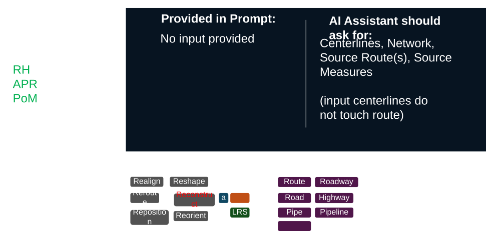

### Slide 5 — AI Assistant should ask for: <!-- slide 5 -->

Centerlines, Network

(input centerlines touch route)

[figure: No input provided · Route · Road · Roadway · Highway · Realign · Reshape · Reposition · Reconstruct · Reroute · Reorient · a · LRS · Provided in Prompt: · Pipe · Pipeline · RH APR PoM]

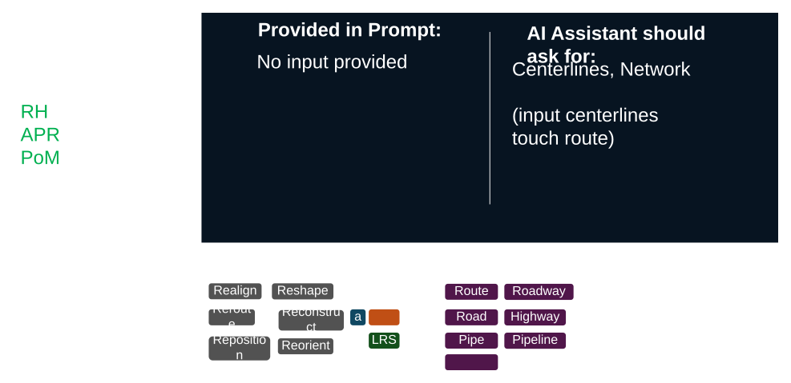

### Slide 6 — Centerlines, Network, Effective Date <!-- slide 6 -->

<Network Name> Network
Populate and open the Realign Route form

(input centerlines touch route and will auto-populate source/target parameters)

Can we ask AI to use suggested info without having to be prompted?

From Sharon:
Yes, will only prompt if chosen centerlines cannot give suggested info
January 1st, 2000
Between 101 to 108
Between 101 - 108

Refresh downstream segment
Test also with line networks

RH
APR – doesn’t always pick up suggested info, bug logged
PoM – same as APR

[figure: AI Assistant should: · Route · Road · Roadway · Highway · Realign · Reshape · Reposition · Reconstruct · Reroute · Reorient · <Network Name> · in · a · LRS · Provided in Prompt: · on · for · Date 01/01/2000 · 01/01/2000 · 01-01-2000 · with · Jan 1, 2000 · using Centerlines with · …]

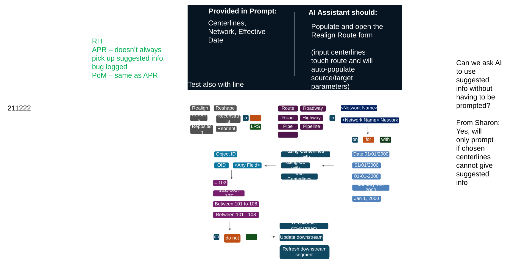

### Slide 7 — AI Assistant should ask for: <!-- slide 7 -->

Centerlines, Network, Effective Date
<Network Name> Network
Source Route, Source From/To Measures

(input centerlines do not touch route or overlapping routes occur at touch points)

January 1st, 2000
Between 101 to 108
Between 101 - 108

Refresh downstream segment
Test also with line networks

[figure: Route · Road · Roadway · Highway · Realign · Reshape · Reposition · Reconstruct · Reroute · Reorient · <Network Name> · in · a · LRS · Provided in Prompt: · on · for · Date 01/01/2000 · 01/01/2000 · 01-01-2000 · with · Jan 1, 2000 · using Centerlines with · using CL with · …]

### Slide 8 — AI Assistant should ask for: <!-- slide 8 -->

Centerlines, Network, Effective Date
<Network Name> Network
Source To Route, Source To Measure

(input centerlines touch only at from location)

January 1st, 2000
Between 101 to 108
Between 101 - 108

Refresh downstream segment
Test also with line networks

[figure: Route · Road · Roadway · Highway · Realign · Reshape · Reposition · Reconstruct · Reroute · Reorient · <Network Name> · in · a · LRS · Provided in Prompt: · on · for · Date 01/01/2000 · 01/01/2000 · 01-01-2000 · with · Jan 1, 2000 · using Centerlines with · using CL with · …]

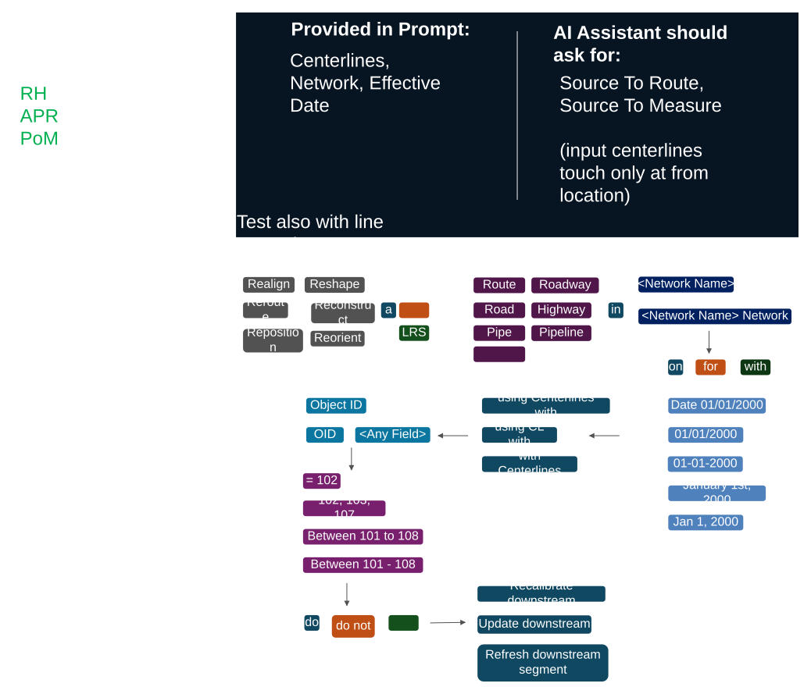

### Slide 9 — AI Assistant should ask for: <!-- slide 9 -->

Centerlines, Network, Effective Date
<Network Name> Network
Source From Route, Source From Measure

(input centerlines touch only at to location)

January 1st, 2000
Between 101 to 108
Between 101 - 108

Refresh downstream segment
Test also with line networks

[figure: Route · Road · Roadway · Highway · Realign · Reshape · Reposition · Reconstruct · Reroute · Reorient · <Network Name> · in · a · LRS · Provided in Prompt: · on · for · Date 01/01/2000 · 01/01/2000 · 01-01-2000 · with · Jan 1, 2000 · using Centerlines with · using CL with · …]

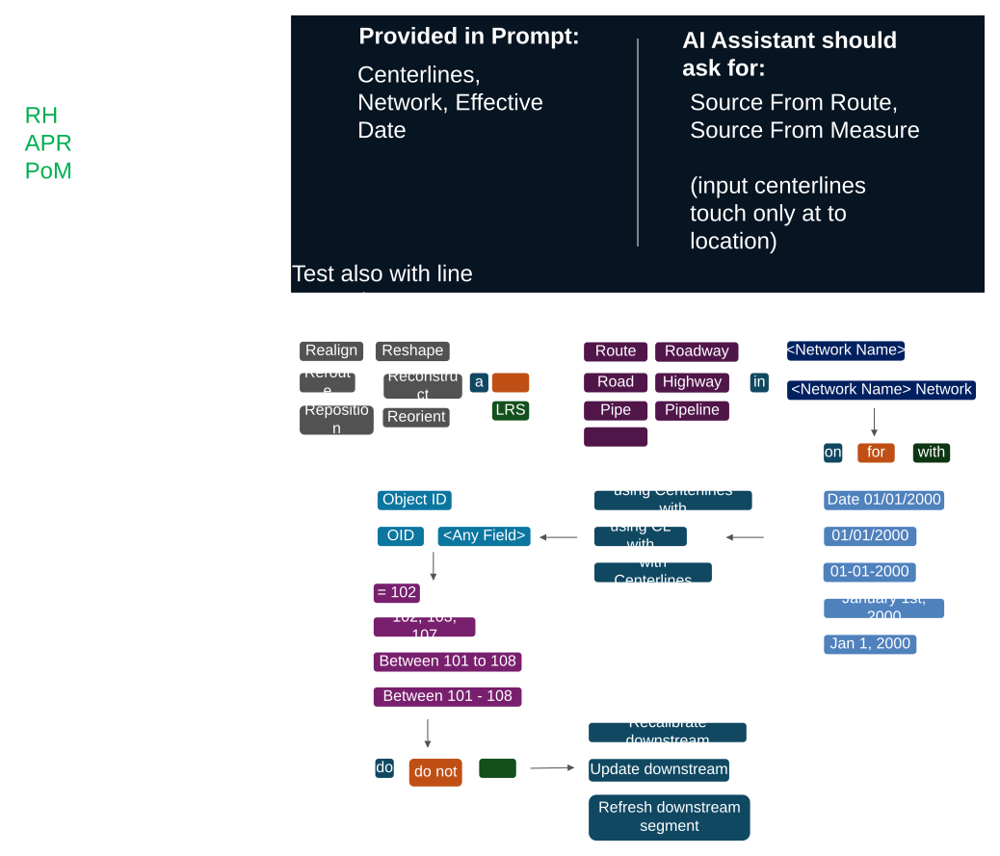

### Slide 10 — Centerlines, Effective Date <!-- slide 10 -->

Prompt for Network*
(input centerlines touch route and will auto-populate source/target parameters)

- Test with only one network in map also, network will auto-populate

January 1st, 2000
Between 101 to 108
Between 101 - 108

Refresh downstream segment

[figure: AI Assistant should: · Route · Road · Roadway · Highway · Realign · Reshape · Reposition · Reconstruct · Reroute · Reorient · a · LRS · Provided in Prompt: · on · for · Date 01/01/2000 · 01/01/2000 · 01-01-2000 · with · Jan 1, 2000 · using Centerlines with · using CL with · with Centerlines · …]

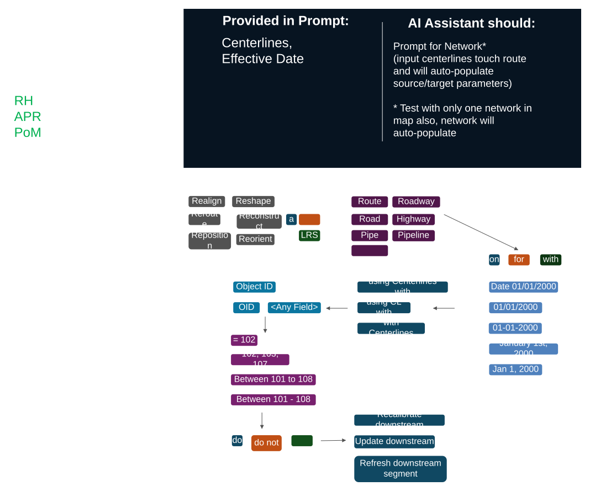

### Slide 11 <!-- slide 11 -->

<Network Name> Network
Open Realign Route with today’s date as the effective date

(input centerlines touch route and will auto-populate source/target parameters)

Between 101 to 108
Between 101 - 108

Refresh downstream segment
Test also with line networks

[figure: Centerlines, Network · AI Assistant should: · Route · Road · Roadway · Highway · Realign · Reshape · Reposition · Reconstruct · Reroute · Reorient · <Network Name> · in · a · LRS · Provided in Prompt: · using Centerlines with · using CL with · with Centerlines · Object ID · OID · = 102 · 102, 103, 107 · …]

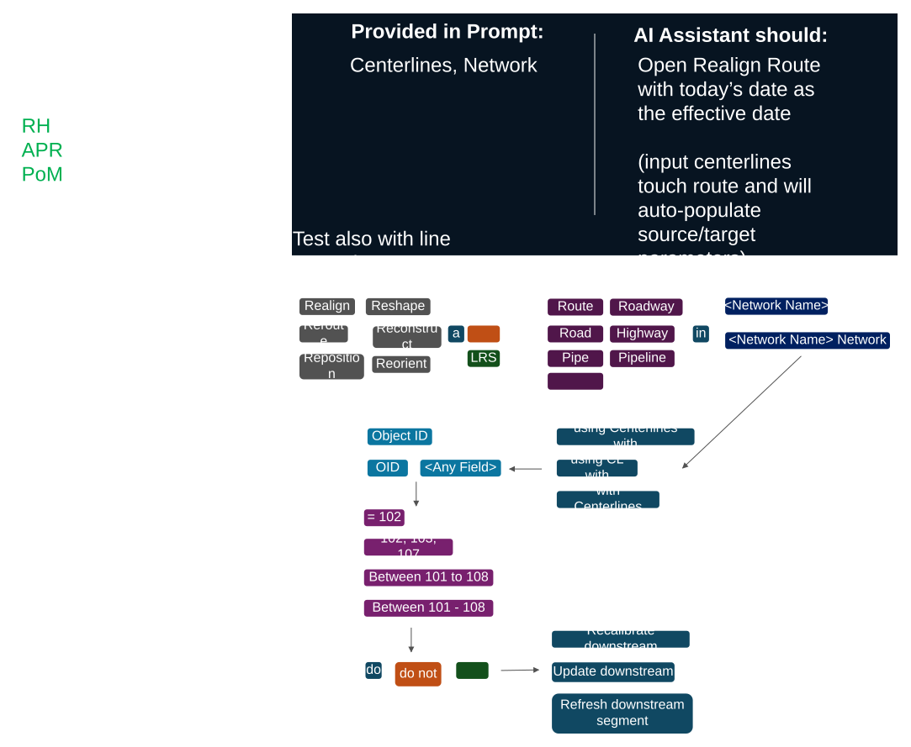

### Slide 12 <!-- slide 12 -->

Centerlines, Network*, Effective Date, Source From RouteName, Source From Measure, Source To RouteName, Source To Measure, Route abandonment, Target From Measure, Target To Measure, Recalibrate downstream option
Populate and open the Realign Route form

(input centerlines touch the route, but user has provided specific source/target measure values)

Test also with non-touching centerlines

January 1st, 2000
Between 101 to 108
Between 101 - 108
Refresh downstream segment
<Network Name> Network

Reassign to abandoned route

From Measure 0 and to Measure 10
Spanning Measures 0  and 10
0 and 10 as measures
0 and 10 as From and To measures

Reroute a pipe in Engineering Network on IMT_R1 from measure 100 to 1000 on 1/1/2025 using centerline with OID 14829 with realigned route measures 250 to 500. Do not recalibrate downstream or reassign to abandoned routes
reroute a pipe in the Engineering Network from L12_R1 to L12_R3 from measures 400 to 25 as of 1/1/2025 using centerline with objectID 16424. Realigned route measures are 450 to 600 and do not recalibrate downstream but reassign to abandoned routes
reroute a pipeline in the Engineering network as of 1/1/2025. Source From route is MLV-137 R1 at measure 62400 and Source To Route is MLV-138 R1 at measure 255. Use centerline with ObjectID 17224 and realigned route measures will be 62420 to 63320. Do not reassign to abandoned routes but recalibrate downstream
reroute a pipeline in the Engineering network as of 1/1/2025. Source From route is L001_R1 at measure 3050 and Source To Route is L001_R2 at measure 11000. Use centerline with ObjectID 45532 and realigned route measures will be 3850 to 31050. Do not reassign to abandoned routes but recalibrate downstream
reroute a pipeline in the Engineering network as of 1/1/2025. Source From route is L11_ R1 at measure 34.894 and Source To Route is L11_ R2 at measure 593.486. Use centerline with ObjectID 17227 and realigned route measures will be 34.894 to 825. Do not reassign to abandoned routes but recalibrate downstream
reroute a pipeline in the Engineering network as of 1/1/2025. Source From route is Route15C at measure 9647.531 and Source To Route is Route15A at measure 41341.765. Use centerline with ObjectID 259,260 and realigned route measures will be 9647.531  to 75915.447. Do not reassign to abandoned routes but recalibrate downstream

[figure: AI Assistant should: · Route · Road · Roadway · Highway · Realign · Reshape · Reposition · Reconstruct · Reroute · Reorient · a · LRS · Provided in Prompt: · on · Date 01/01/2000 · 01/01/2000 · 01-01-2000 · with · Jan 1, 2000 · using Centerlines with · using CL with · with Centerlines · Object ID · …]

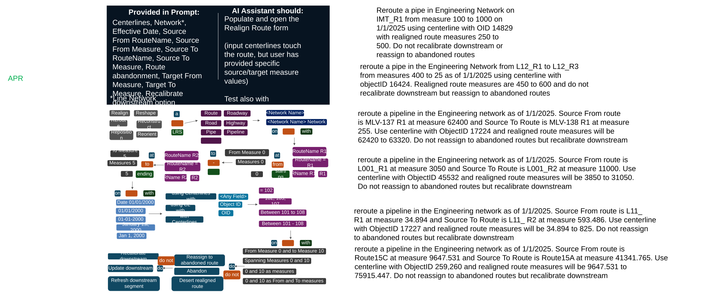

### Slide 13 — Centerlines, Network*, Effective Date <!-- slide 13 -->

<Network Name> Network
Prompt for realigned route’s multi-field RouteID

(input centerlines touch route and will auto-populate source/target parameters)

January 1st, 2000
Between 101 to 108
Between 101 - 108

Refresh downstream segment

[figure: AI Assistant should: · Route · Road · Roadway · Highway · Realign · Reshape · Reposition · Reconstruct · Reroute · Reorient · <Network Name> · in · a · LRS · Provided in Prompt: · on · for · Date 01/01/2000 · 01/01/2000 · 01-01-2000 · with · Jan 1, 2000 · using Centerlines with · …]

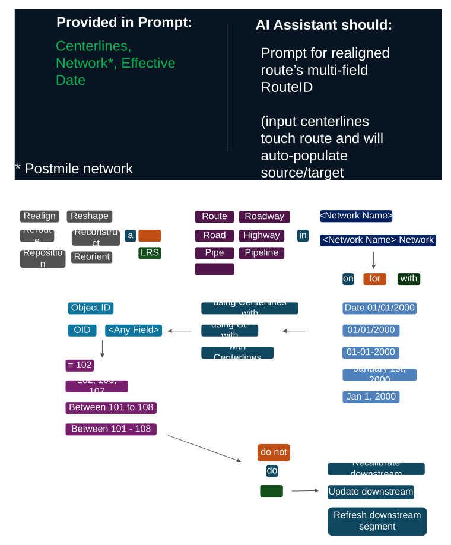

### Slide 14 — Centerlines, Network*, Effective Date, Realigned Route Multi-field RouteID <!-- slide 14 -->

<Network Name> Network
Populate and open Realign Route form

(input centerlines touch route and will auto-populate source/target parameters)

January 1st, 2000
Between 101 to 108
Between 101 - 108

Refresh downstream segment

PMPrefix = No Prefix

PMSuffix = No Suffix

[figure: AI Assistant should: · Route · Road · Roadway · Highway · Realign · Reshape · Reposition · Reconstruct · Reroute · Reorient · <Network Name> · in · a · LRS · Provided in Prompt: · on · for · Date 01/01/2000 · 01/01/2000 · 01-01-2000 · with · Jan 1, 2000 · using Centerlines with · …]

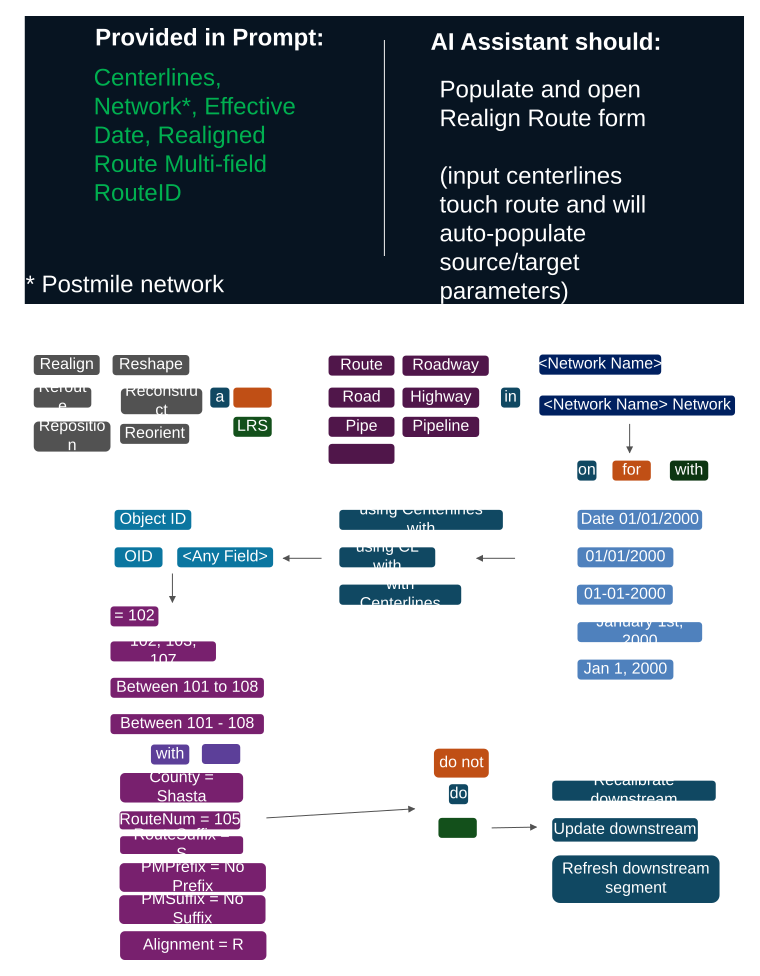

### Slide 15 — Centerlines, Network*, Effective Date, Partial Realigned Route RouteID <!-- slide 15 -->

<Network Name> Network
Prompt for missing Realigned Route RouteID attributes
(input centerlines touch route and will auto-populate source/target parameters)

January 1st, 2000
Between 101 to 108
Between 101 - 108

Refresh downstream segment

PMSuffix = No Suffix
County = Shasta, RouteNum = 105, RouteSuffix = S, PMPrefix = Spur, PMSuffix = No Suffix, Alignment = Right

[figure: AI Assistant should: · Route · Road · Roadway · Highway · Realign · Reshape · Reposition · Reconstruct · Reroute · Reorient · <Network Name> · in · a · LRS · Provided in Prompt: · on · for · Date 01/01/2000 · 01/01/2000 · 01-01-2000 · with · Jan 1, 2000 · using Centerlines with · …]

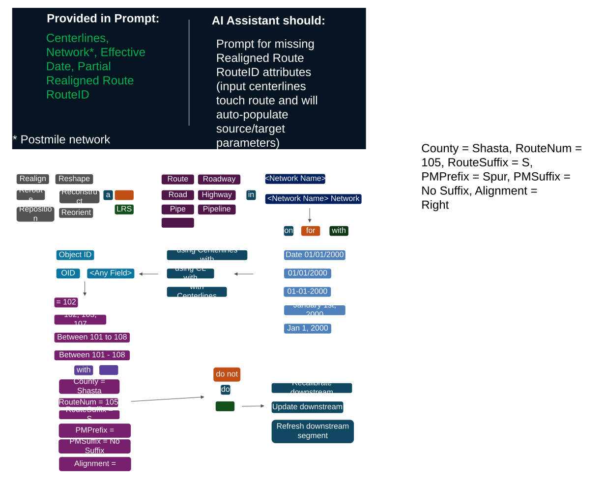

### Slide 16 — AI Assistant should <!-- slide 16 -->

Populate and open the Realign Route form
Centerlines, Network, Effective Date, Source RouteID*, Source From Measure*, Source To Measure*, Target From Measure*, Target To Measure*, Route abandonment option, Recalibrate downstream option

- Will be auto-populated unless otherwise specified or centerlines do not touch route

### Slide 17 — Not show any info <!-- slide 17 -->

Centerlines, Network, Effective Date, Recalibrate downstream option, but LR license is not available

<Network Name> Network

January 1st, 2000
Between 101 to 108
Between 101 - 108

Refresh downstream segment

[figure: AI Assistant should: · Route · Road · Roadway · Highway · Realign · Reshape · Reposition · Reconstruct · Reroute · Reorient · <Network Name> · in · a · LRS · Provided in Prompt: · on · for · Date 01/01/2000 · 01/01/2000 · 01-01-2000 · with · Jan 1, 2000 · using Centerlines with · …]

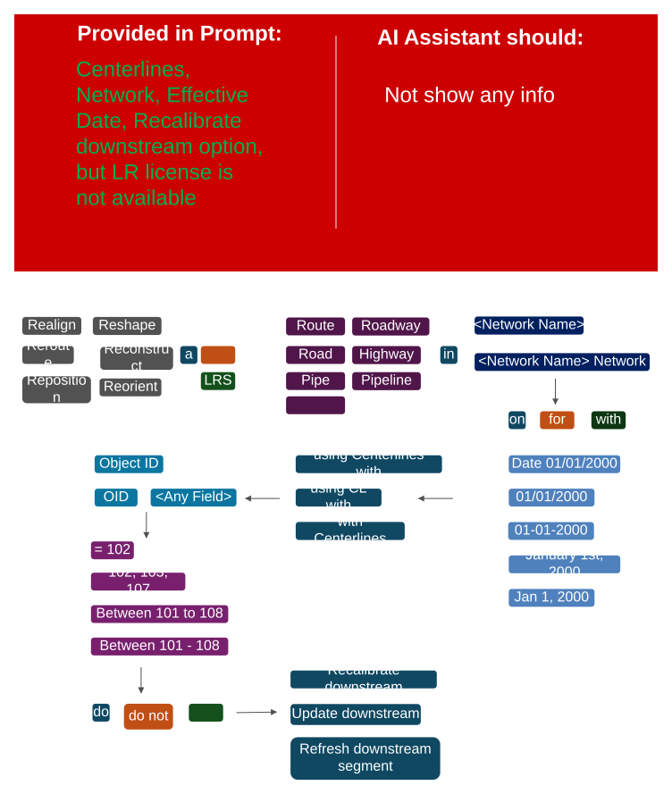

### Slide 18 <!-- slide 18 -->

Centerlines, Network, Effective Date, Recalibrate downstream option, but provided Source/Target From Measure => Source/Target To Measure

<Network Name> Network
Inform user about the issue with the measures and ask them to provide valid measures

January 1st, 2000
Between 101 to 108
Between 101 - 108

Refresh downstream segment
From Measure 0 and to Measure 0
Spanning Measures 0.9 to 0.892
0.9 and 0.892 as source measures
0.9 and 0.892 as source From and To measures
From Measure 0 and to Measure 0
Spanning Measures 0.9 to 0.892
0.9 and 0.892 as target measures
0.9 and 0.892 as realigned From and To measures

Start measure 0.9, end measure 0.892
Start measure 0.9, end measure 0.892

[figure: AI Assistant should: · Route · Road · Roadway · Highway · Realign · Reshape · Reposition · Reconstruct · Reroute · Reorient · <Network Name> · in · a · LRS · Provided in Prompt: · on · for · Date 01/01/2000 · 01/01/2000 · 01-01-2000 · with · Jan 1, 2000 · using Centerlines with · …]

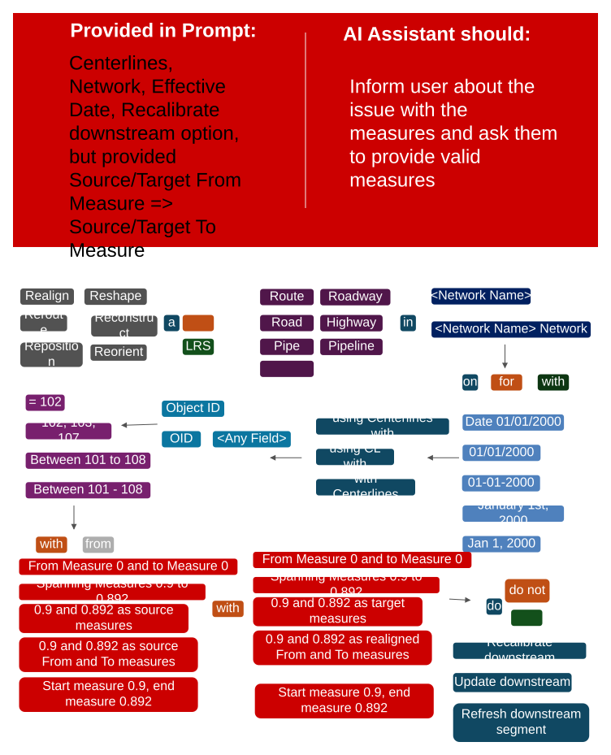

### Slide 19 <!-- slide 19 -->

Centerlines, Network, Effective Date, Recalibrate downstream option, but provided centerlines are invalid/duplicates/do not exist/cause non-monotonic route

<Network Name> Network
Inform the user about the issue with the input centerlines and ask them to provide valid centerlines

January 1st, 2000
Between 12A to 108
Between 101 – 108X

Refresh downstream segment

[figure: AI Assistant should: · Route · Road · Roadway · Highway · Realign · Reshape · Reposition · Reconstruct · Reroute · Reorient · <Network Name> · in · a · LRS · Provided in Prompt: · on · for · Date 01/01/2000 · 01/01/2000 · 01-01-2000 · with · Jan 1, 2000 · using Centerlines with · …]

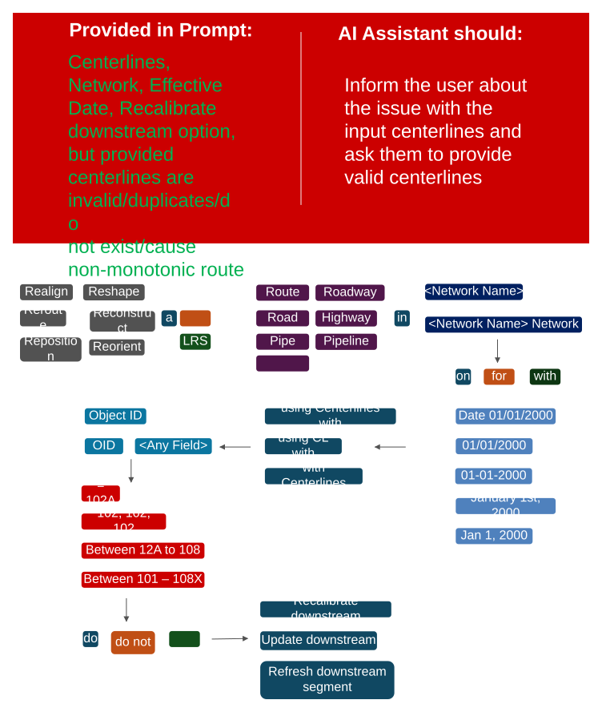

### Slide 20 <!-- slide 20 -->

Centerlines, Network, Effective Date, Recalibrate downstream option, but input route does not exist for given effective date/does not exist

<Network Name> Network
Inform the user that the chosen route is not valid and ask them to provide a different route

January 1st, 2000
Between 101 to 108
Between 101 - 108

Refresh downstream segment
Route ID = R1

[figure: AI Assistant should: · Route · Road · Roadway · Highway · Realign · Reshape · Reposition · Reconstruct · Reroute · Reorient · <Network Name> · in · a · LRS · Provided in Prompt: · on · for · Date 01/01/2000 · 01/01/2000 · 01-01-2000 · with · Jan 1, 2000 · using Centerlines with · …]

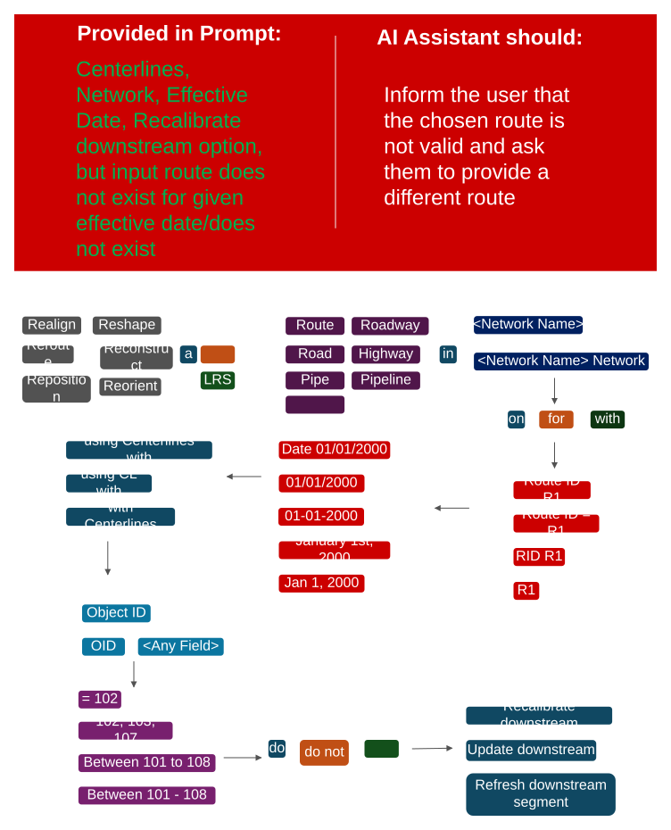

### Slide 21 <!-- slide 21 -->

Centerlines, Network*, Effective Date, Recalibrate downstream option, but routes do not belong to the same line/time slice/network

<Network Name> Network
Inform the user that the chosen routes are not valid and ask them to provide  different routes

January 1st, 2000
Between 101 to 108
Between 101 - 108

Refresh downstream segment
Route ID = R1
Route ID = R2
Reassign to abandoned route

[figure: AI Assistant should: · Route · Road · Roadway · Highway · Realign · Reshape · Reposition · Reconstruct · Reroute · Reorient · <Network Name> · in · a · LRS · Provided in Prompt: · on · for · Date 01/01/2000 · 01/01/2000 · 01-01-2000 · with · Jan 1, 2000 · using Centerlines with · …]

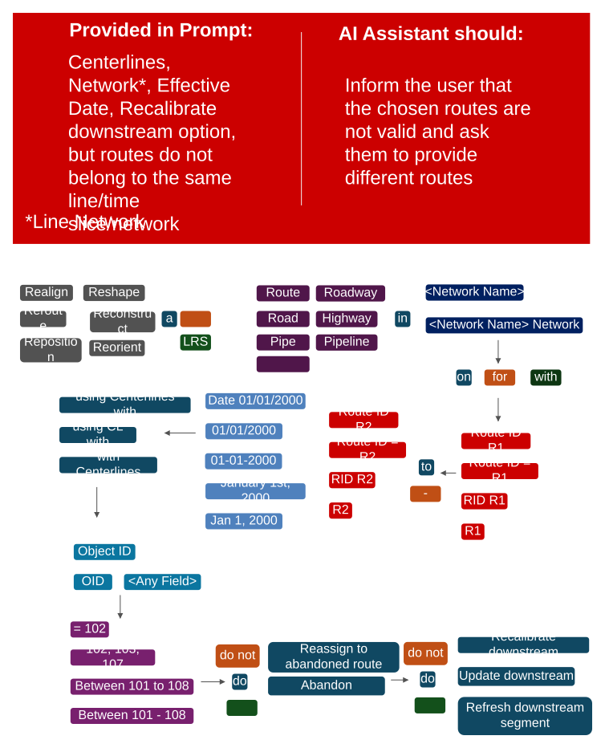

### Slide 22 — List the issues that are causing errors one at a time <!-- slide 22 -->

Centerlines, Network, Effective Date, Recalibrate downstream option, but inputs have multiple issues

<Network Name> Network

January 1st, 2000
Between 101 to 108
Between 101 - 108

Refresh downstream segment
Route ID = R1

[figure: AI Assistant should: · Route · Road · Roadway · Highway · Realign · Reshape · Reposition · Reconstruct · Reroute · Reorient · <Network Name> · in · a · LRS · Provided in Prompt: · on · for · Date 01/01/2000 · 01/01/2000 · 01-01-2000 · with · Jan 1, 2000 · using Centerlines with · …]

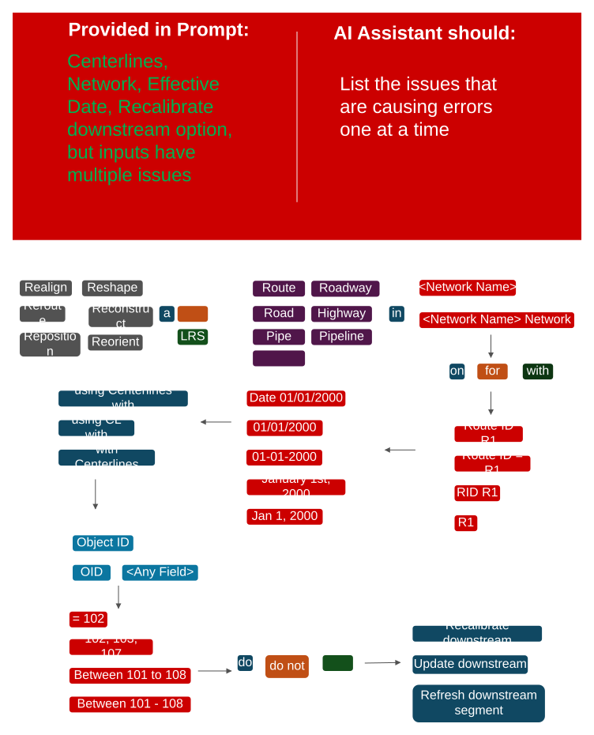

### Slide 23 <!-- slide 23 -->

Centerlines, Network, Effective Date, Recalibrate downstream option, but LRS Network and centerline layers are not in the map

<Network Name> Network
Ask the user to add the Network and Centerline feature classes to map

January 1st, 2000
Between 101 to 108
Between 101 - 108

Refresh downstream segment

Realign a road in the CountyLog LRS Network. RouteID is  and use centerline with ObjectID 211222. Source From Measure is 0.2 and Source To Measure is 0.3. Realigned route measures are 0.25 to 1. Do not recalibrate downstream.

[figure: AI Assistant should: · Route · Road · Roadway · Highway · Realign · Reshape · Reposition · Reconstruct · Reroute · Reorient · <Network Name> · in · a · LRS · Provided in Prompt: · on · for · Date 01/01/2000 · 01/01/2000 · 01-01-2000 · with · Jan 1, 2000 · using Centerlines with · …]

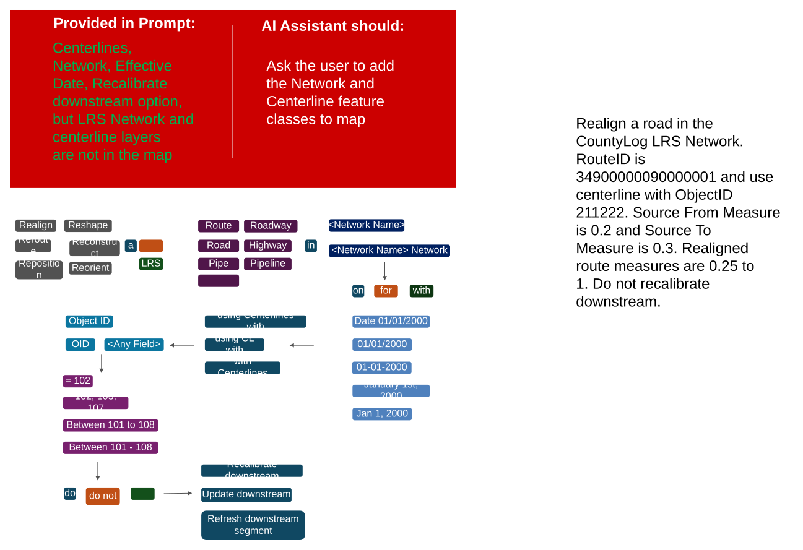

### Slide 24 <!-- slide 24 -->

Centerlines, Network*, Effective Date, Recalibrate downstream option, but centerlines touch more than one route

<Network Name> Network
Inform the user that the chosen routes are not valid and ask them to provide  different routes

January 1st, 2000
Between 101 to 108
Between 101 - 108

Refresh downstream segment
Route ID = R1
Reassign to abandoned route

[figure: AI Assistant should: · Route · Road · Roadway · Highway · Realign · Reshape · Reposition · Reconstruct · Reroute · Reorient · <Network Name> · in · a · LRS · Provided in Prompt: · on · for · Date 01/01/2000 · 01/01/2000 · 01-01-2000 · with · Jan 1, 2000 · using Centerlines with · …]

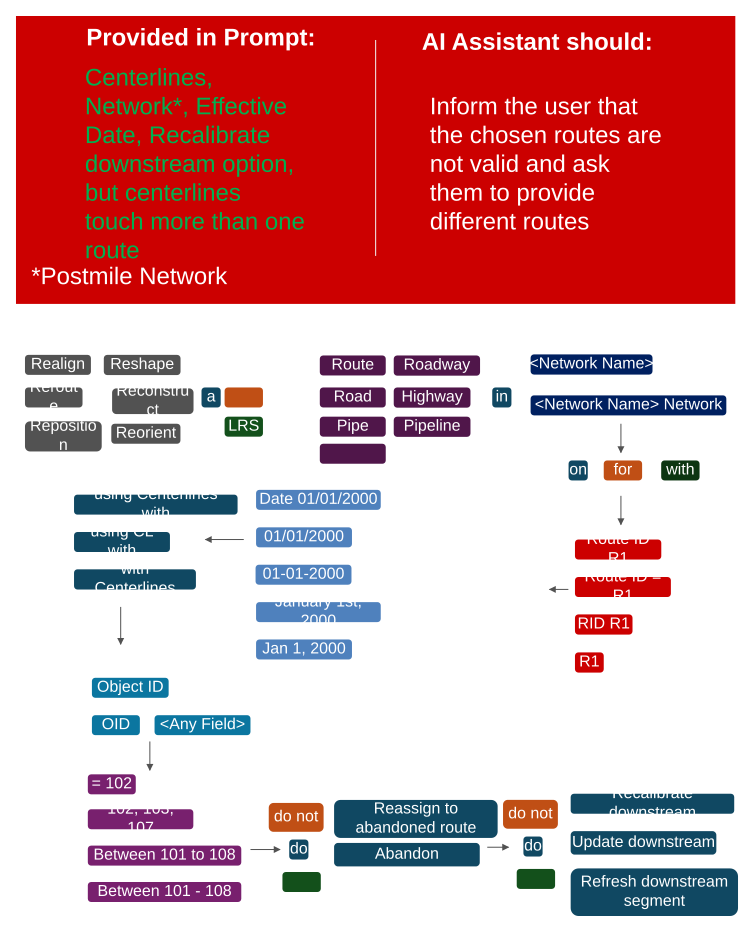

### Slide 25 — Inform of invalid RouteID values and ask for valid values <!-- slide 25 -->

Centerlines, Network, Effective Date, invalid Realigned Route Multi-field RouteID
<Network Name> Network

January 1st, 2000
Between 101 to 108
Between 101 - 108

Refresh downstream segment

County is Jackson, RouteNum is 105XXX, RouteSuffix is E, PMPrefix is Other, PMSuffix is Other, Alignment is M

[figure: AI Assistant should: · Route · Road · Roadway · Highway · Realign · Reshape · Reposition · Reconstruct · Reroute · Reorient · <Network Name> · in · a · LRS · Provided in Prompt: · on · for · Date 01/01/2000 · 01/01/2000 · 01-01-2000 · with · Jan 1, 2000 · using Centerlines with · …]

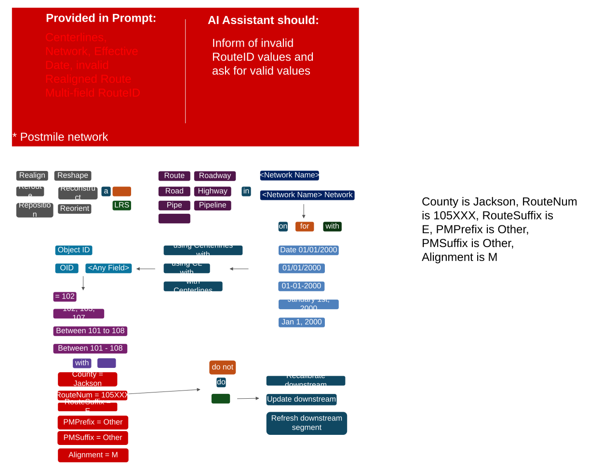

### Slide 26 — Help Prompts <!-- slide 26 -->

- How do I access and activate Realign Route in the line network of pipeline Referencing?
- What are the prerequisite steps before realigning a route in a line network?
- What are the prerequisite steps before realigning a route in a multifield network ?
- What is a line network?
- What is a multi field network?
- Walk me through the full workflow of realigning a route using the LRS Realign Route tool for a line network.
- How are the start and end measures calculated for a route in the create route tool in line network?
- Guide me on the realign route workflow in line network in a versioned environment?
- What does the Recalibrate downstream option do when performing a route realignment?
- What does the Reassign to abandoned routes option doe when realigning a route in a line LRS network?
- What is a realignment in Roads and Highways/Pipeline Referencing/Location Referencing/Linear Referencing?
- How do I reroute my existing LRS routes?
