# Add Line Event to Dominant Route in ArcGIS Pro – Test Plan

|   |   |
| --- | --- |
| **Kind** | Test Plan · Pro |
| **Release** | — |
| **Product** | Roads & Highways |
| **Source** | [AddLinetoDominantRte_Testplan2.pptx](<https://esriis.sharepoint.com/sites/LocationReferencing/Shared%20Documents/General/Test%20Plans/AddLinetoDominantRte_Testplan2.pptx>) |
| **Edited** | 2024-06-27 19:18 by Praveen Kumar |
| **Extracted** | 2026-09-04 · lane `xmlstrip` |

<!-- metadata
```yaml
title: "Add Line Event to Dominant Route in ArcGIS Pro – Test Plan"
source_file: "AddLinetoDominantRte_Testplan2.pptx"
source_url: "https://esriis.sharepoint.com/sites/LocationReferencing/Shared%20Documents/General/Test%20Plans/AddLinetoDominantRte_Testplan2.pptx"
doc_id: 358
doc_kind: "Test Plan"
surface: "Pro"
doc_revision: ""
target_release: ""
pe: "Praveen Kumar"
dev: "Dan"
author: "Praveen Kumar"
last_edited_by: "Praveen Kumar"
last_edited: "2024-06-27T19:18:29Z"
extracted: 2026-09-04
extraction_lane: xmlstrip
prompt_version: "v2.0.2"
keywords: ["dominant route", "event placement", "concurrency", "temporal concurrency", "spatial concurrency", "route dominance", "line event", "conflict prevention"]
tools: ["Add Line Events"]
products: ["Roads & Highways"]
issues: []
related: [{"doc":360,"file":"add-point-event-to-dominant-route-in-arcgis-pro-test-plan__doc360.md","s":7.252},{"doc":169,"file":"add-point-and-non-spanning-line-event-to-dominant-route-in-experience-builder__doc169.md","s":6.912},{"doc":370,"file":"add-line-event-to-dominant-route-in-arcgis-pro__doc370.md","s":6.426},{"doc":279,"file":"consider-route-dominance-in-append-events-add-method-test-plan__doc279.md","s":4.626},{"doc":278,"file":"consider-route-dominance-in-append-events-test-plan__doc278.md","s":4.185}]
```
-->

## Summary

Test plan for adding line events to dominant routes in ArcGIS Pro. It covers verification of event placement behavior with concurrency panes, temporal and spatial concurrencies, route dominance rules, and conflict prevention. Multiple test cases illustrate adding events on routes with different concurrency and date scenarios.

## Related documents

<!-- related:begin -->
- [Add Point Event to Dominant Route in ArcGIS Pro – Test Plan](<https://esriis.sharepoint.com/sites/lrsworkspace/LRS Doc Index/Test Plans/add-point-event-to-dominant-route-in-arcgis-pro-test-plan__doc360.md>) — similar text 0.28 · 5 title words · 3 filename words · same kind/surface/folder <!-- rel:360 -->
- [Add Point and non-Spanning Line Event to Dominant Route in Experience Builder – Test Plan](<https://esriis.sharepoint.com/sites/lrsworkspace/LRS Doc Index/Test Plans/add-point-and-non-spanning-line-event-to-dominant-route-in-experience-builder__doc169.md>) — similar text 0.19 · 5 title words · 3 filename words · same kind/folder <!-- rel:169 -->
- [Add Line Event to Dominant Route in ArcGIS Pro](<https://esriis.sharepoint.com/sites/lrsworkspace/LRS Doc Index/User Stories/add-line-event-to-dominant-route-in-arcgis-pro__doc370.md>) — similar text 0.23 · 6 title words · 3 filename words · same surface <!-- rel:370 -->
- [Consider Route Dominance in Append Events (add method) – Test Plan](<https://esriis.sharepoint.com/sites/lrsworkspace/LRS Doc Index/Test Plans/consider-route-dominance-in-append-events-add-method-test-plan__doc279.md>) — similar text 0.11 · 2 title words · 2 filename words · same kind/surface/folder <!-- rel:279 -->
- [Consider Route Dominance in Append Events Test Plan](<https://esriis.sharepoint.com/sites/lrsworkspace/LRS Doc Index/Test Plans/consider-route-dominance-in-append-events-test-plan__doc278.md>) — similar text 0.12 · 1 title word · 2 filename words · same kind/folder <!-- rel:278 -->
<!-- related:end -->

<!-- docs:begin -->
## Esri documentation

[Conflict prevention](https://doc.esri.com/en/arcgis-pro/latest/help/production/roads-highways/conflict-prevention.html)

_No page matched:_ [Add Line Events](https://www.google.com/search?q=%22Add%20Line%20Events%22+site%3Adoc.esri.com)
<!-- docs:end -->

---

## Slide 1 — Add Line Event to Dominant Route in ArcGIS Pro – Test Plan

PE: Praveen Kumar
Dev: Dan

## Slide 2

Test – Don’t allow override of event placement on dominant routes

- By default, “Don’t allow override of event placement on dominant routes” box is unchecked
- If “Don’t allow override of event placement on dominant routes” is checked, and “Add event to dominant route” box is also checked, the concurrency pane does not show – we automatically add events on dominant route
- If “Don’t allow override of event placement on dominant routes” is checked but “Add event to dominant route” box is unchecked, do what it does today (add events onto selected route)
- If “Don’t allow override of event placement on dominant routes” is unchecked – do whatever “Add event to dominant route” box says (show concurrency pane when it’s checked; add events onto selected route when it’s unchecked)

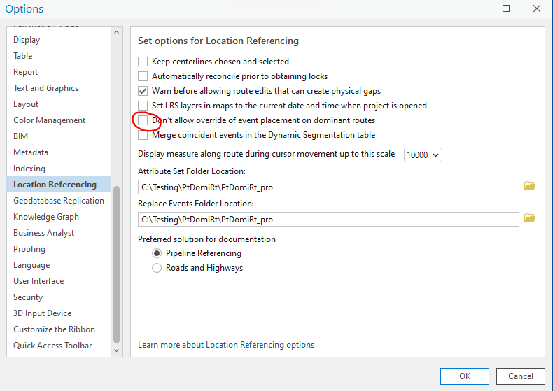 

## Slide 3

New pane has

- A paragraph about what this pane does shows up under tool title
- Then, a time dropdown for the temporal concurrencies
  - By default, show the earliest time slice
  - If there is only 1 temporal concurrency, disable (grey) the dropdown
  - If there is no concurrency in one of the time slices, we still show the time slice but only a non-editable black label for selected Route
- A Reset button to the right of time dropdown to reset the options in the drop downs to what was returned by the concurrency logic
- Under time dropdown, the route ID/Name label from the first pane
- A grid of spatial concurrencies
  - From Measure, To Measure and Route selection
  - From Measure, To Measure on the route in the first pane for the chosen time slice. It does not change.
  - Route selection has 3 elements: RouteID/Name and From Measure, To Measure Show the RouteID/Name with a drop down. The default should be the dominant/primary route.
    - The primary/dominant route is in blue. The non primary/dominant route is in black.
    - The measure goes with the selected Route. It is always in black
- A label of unit of measure under the grid. This unit comes from the second pane.
- When the user clicks next, transition to the 4th pane with the attributes

## Slide 4

Verification

- Verify the checkbox is added to Add Line Events tool
- Verify the checkbox is unchecked by default
- Verify the existing functionalities do not change in the first, second, and the attribute pane
- Verify the tool does not show a concurrency pane when the checkbox is unchecked or no concurrency exists
- Verify the tool shows the new concurrency pane with all elements in page 3 when spatial and/or temporal concurrencies exist
- Verify the tool identifies the correct concurrent route
- Verify the tool shows the correct measures for the route from the first pane as well as the selected route in the grid
- Verify the Back/Next buttons do what they do today
  - If values have not changed in pane switching, keep values intact
  - If values have changed (e.g. a different route/measure selected in the second pane), change associated panes accordingly
- Verify events are added correctly at selected routes’ measures
- Test with RH, APRGCS, and a few cases in Address Data
- Test in FS
- Test normal and complex shapes
  - Test with self-intersections where multiple measures exist
- Test with spatial (routes fully/partially/not overlap) and temporal (time slices) concurrencies
  - Sanity test a few where there is no concurrency
  - Test scenarios where there are concurrencies across multiple time slices and the primary/dominant route changes over time
- Test conflict prevention
  - For Add Line, acquire the locks when next is clicked on this pane
  - For Add Multiple line events, continue to acquire on the attributes pane
- i18n and 508 testing
- Test with Retire overlaps with existing events (on both dominant and non dominant routes)
- Test with merge coincident events
- If the route is changed in the dominant section, ensure that the event is added to the selected route. (merge the event if two adjacent sections have same route)

## Slide 5

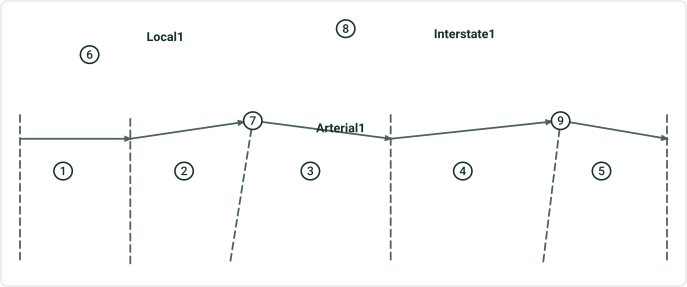

| Route Name | Route Type | From Date | To Date |
| --- | --- | --- | --- |
| Arterial1 | Arterial | 1/1/2000 | Null |
| Local1 | Local | 1/1/2000 | Null |
| Interstate1 | Interstate | 1/1/2000 | Null |

| Section ID | Dominant Route | Reason | From M | To M | From Date | To Date | Code |
| --- | --- | --- | --- | --- | --- | --- | --- |
| 1,2,3* | Arterial1 | No Concurrency, Rule 1 | 0 | 3 | 2000 | Null | Evnt1 |
| 4 | Interstate1 | Rule 1 | 125.45 | 135.46 | 2000 | Null | Evnt1 |
| 5 | Arterial1 | No Concurrency | 4 | 5 | 2000 | Null | Evnt1 |

| Section ID | Dominant Route | Reason | From M | To M | From Date | To Date | Code |
| --- | --- | --- | --- | --- | --- | --- | --- |
| 6 | Local1 | No Concurrency | 10 | 20 | 2000 | Null | Evnt2 |
| 2 | Arterial1 | Rule 1 | 1 | 2 | 2000 | Null | Evnt2 |
| 7 | Local1 | No Concurrency | 30 | 40 | 2000 | Null | Evnt2 |

Add Event from start to end on Arterial1
Add Event from start to end on Local1

| Section ID | Dominant Route | Reason | From M | To M | From Date | To Date | Code |
| --- | --- | --- | --- | --- | --- | --- | --- |
| 8,4,9 | Interstate1 | Rule 1 | 120.235 | 140.256 | 2000 | Null | Evnt3 |

Add Event from start to end on Interstate1
Testcase1 : Add events from start to end all the routes have same dates
Rule X : Exceptions (Interstate 10)
Rule1 : Greater Route Type where Interstate>Arterial>Collector>Local
Rule2 : Smaller Alphanumeric Route Name
- A Single Event will be generated due to the same dominant route for these adjoining sections


## Slide 6

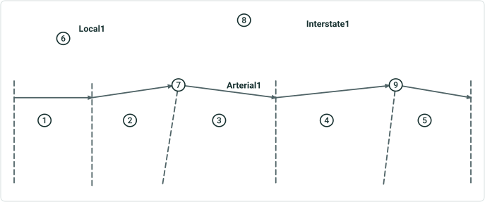

| Route Name | Route Type | From Date | To Date |
| --- | --- | --- | --- |
| Arterial1 | Arterial | 1/1/2000 | Null |
| Local1 | Local | 1/1/2010 | Null |
| Interstate1 | Interstate | 1/1/2010 | Null |

| Section ID | Dominant Route | Reason | From M | To M | From Date | To Date | Code |
| --- | --- | --- | --- | --- | --- | --- | --- |
| 1,2 | Arterial1 | No Concurrency, Rule1 | 0 | 1.5 | 2010 | Null | Evnt4 |

| Section ID | Dominant Route | Reason | From M | To M | From Date | To Date | Code |
| --- | --- | --- | --- | --- | --- | --- | --- |
| 6 | Local1 | No Concurrency | 10 | 20 | 2015 | Null | Evnt5 |
| 2 | Arterial1 | Rule 1 | 1 | 1.8 | 2015 | Null | Evnt5 |

Add Event from start to 1.5 of Arterial1 (2010 to Null)
Add Event from start to 28 of on Local1 (2015 to Null)

| Section ID | Dominant Route | Reason | From M | To M | From Date | To Date | Code |
| --- | --- | --- | --- | --- | --- | --- | --- |
| 8,4 | Interstate1 | Rule 1 | 120.235 | 130 | 2012 | Null | Evnt6 |

Add Event from start to 130 on Interstate1 (2012 to Null)
Testcase2 : Add events from start to mid and concurrent routes have different dates
Rule X : Exceptions (Interstate 10)
Rule1 : Greater Route Type where Interstate>Arterial>Collector>Local
Rule2 : Smaller Alphanumeric Route Name


## Slide 7

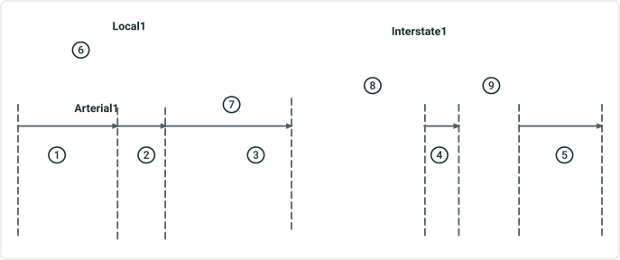

| Route Name | Route Type | From Date | To Date |
| --- | --- | --- | --- |
| Arterial1 | Arterial | 1/1/2000 | Null |
| Local1 | Local | 1/1/2000 | Null |
| Interstate1 | Interstate | 1/1/2000 | Null |

| Section ID | Dominant Route | Reason | From M | To M | From Date | To Date | Code |
| --- | --- | --- | --- | --- | --- | --- | --- |
| 1,2,3 | Arterial1 | No Concurrency , Rule1 | 0 | 2.5 | 2000 | Null | Evnt7 |
| 4 | Interstate1 | Rule 1 | 130.24 | 132.93 | 2000 | Null | Evnt7 |
| 5 | Arterial1 | No Concurrency | 4.25 | 5 | 2000 | Null | Evnt7 |

| Section ID | Dominant Route | Reason | From M | To M | From Date | To Date | Code |
| --- | --- | --- | --- | --- | --- | --- | --- |
| 6 | Local1 | No Concurrency | 10 | 20 | 2000 | Null | Evnt8 |
| 2 | Arterial1 | Rule 1 | 1 | 1.5 | 2000 | Null | Evnt8 |
| 7 | Local1 | No Concurrency | 30 | 40 | 2000 | Null | Evnt8 |

Add Event from start to end on Arterial1
Add Event from start to end on Local1

| Section ID | Dominant Route | Reason | From M | To M | From Date | To Date | Code |
| --- | --- | --- | --- | --- | --- | --- | --- |
| 8,4,9 | Interstate1 | Rule 1 | 120.235 | 140.256 | 2000 | Null | Evnt9 |

Add Event from start to end on Interstate1
Testcase3 : Add events from start to end on gapped route and all the routes have same dates
Rule X : Exceptions (Interstate 10)
Rule1 : Greater Route Type where Interstate>Arterial>Collector>Local
Rule2 : Smaller Alphanumeric Route Name

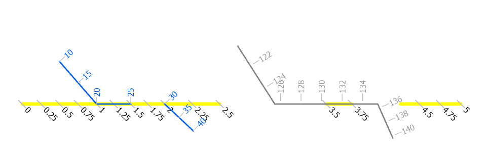

## Slide 8

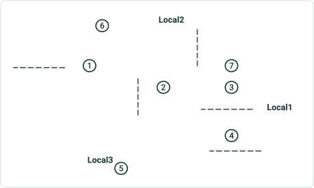

| Route Name | Route Type | From Date | To Date |
| --- | --- | --- | --- |
| Local3 | Arterial | 1/1/2000 | Null |
| Local1 | Local | 1/1/2010 | Null |
| Local2 | Local | 1/1/2010 | Null |

| Section ID | Dominant Route | Reason | From M | To M | From Date | To Date | Code |
| --- | --- | --- | --- | --- | --- | --- | --- |
| 0 | Local3 | No Concurrency | 0 | 5 | 2000 | 2010 | Evnt90 |
| 1 | Local3 | No Concurrency | 0 | 1 | 2010 | Null | Evnt10 |
| 2 | Local2 | Rule 2 | 125.45 | 135.46 | 2010 | Null | Evnt10 |
| 3,4 | Local1 | Rule 2 | 2 | 3 | 2010 | Null | Evnt10 |
| 5 | Local3 | No Concurrency | 3 | 5 | 2010 | Null | Evnt10 |

Add Event from start to end on Local 3

| Section ID | Dominant Route | Reason | From M | To M | From Date | To Date | Code |
| --- | --- | --- | --- | --- | --- | --- | --- |
| 6,2 | Local2 | Rule 2 | 120.235 | 135.46 | 2010 | Null | Evnt11 |
| 3 | Local1 | Rule 2 | 20 | 30 | 2010 | Null | Evnt11 |

Add Event from start to end on Local 2
Testcase4 : Add events from start to end on loop route and concurrent routes have different dates
Rule X : Exceptions (Interstate 10)
Rule1 : Greater Route Type where Interstate>Arterial>Collector>Local
Rule2 : Smaller Alphanumeric Route Name

| Section ID | Dominant Route | Reason | From M | To M | From Date | To Date | Code |
| --- | --- | --- | --- | --- | --- | --- | --- |
| 7,3,4 | Local1 | Rule 2 | 10 | 40 | 2010 | Null | Evnt11 |

Add Event from start to end on Local 1

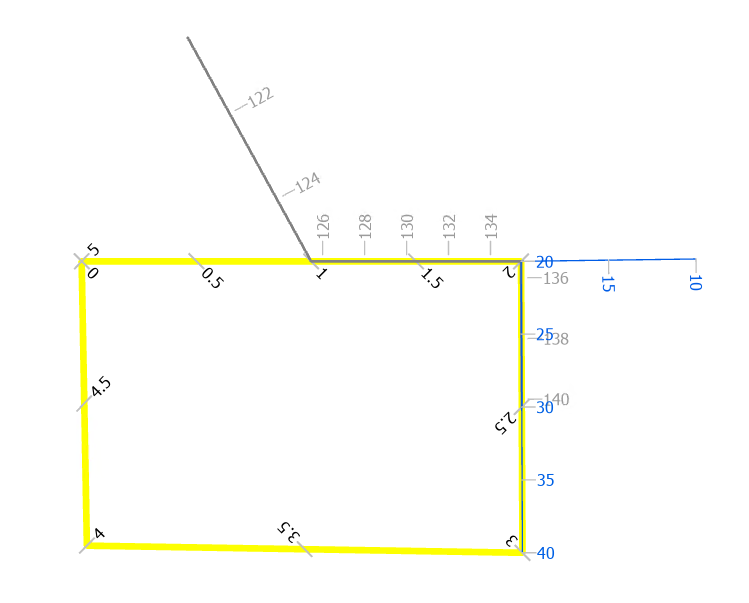

## Slide 9

| Section ID | Dominant Route | Reason | From M | To M | From Date | To Date | Code |
| --- | --- | --- | --- | --- | --- | --- | --- |
| 1,2,3 | Arterial1 | Rule 1 | 0 | 3 | 1/1/2010 | 12/31/2025 | Evnt12 |
| 4 | Interstate1 | Rule 1 | 125.45 | 135.46 | 1/1/2010 | 12/31/2025 | Evnt12 |
| 5 | Arterial1 | No Concurrency | 4 | 5 | 1/1/2010 | 12/31/2025 | Evnt12 |

Add Event from start to end on Arterial1 from  1/1/2010 to 12/31/2025
Testcase5 : Add events from start to end on timesliced route and concurrent routes have different dates
Rule X : Exceptions (Interstate 10)
Rule1 : Greater Route Type where Interstate>Arterial>Collector>Local
Rule2 : Smaller Alphanumeric Route Name

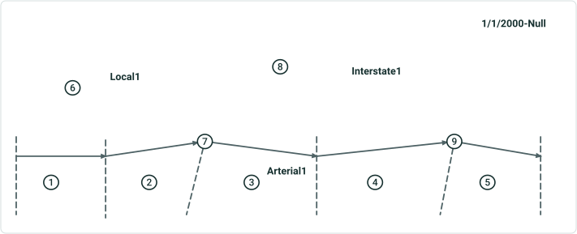

| Route Name | Route Type | From Date | To Date |
| --- | --- | --- | --- |
| Arterial1 | Arterial | 1/1/1990 | 12/31/1999 |
| Arterial1 | Arterial | 1/1/2000 | Null |
| Local1 | Local | 1/1/2010 | 12/31/2012 |
| Interstate1 | Interstate | 1/1/2015 | Null |

| Section ID | Dominant Route | Reason | From M | To M | From Date | To Date | Code |
| --- | --- | --- | --- | --- | --- | --- | --- |
| 1 | Arterial1 | No Concurrency | 0 | 3 | 1/1/2015 | Null | Evnt12 |
| 2 | Interstate1 | Rule 1 | 125.45 | 135.46 | 1/1/2015 | Null | Evnt12 |
| 3 | Arterial1 | No Concurrency | 4 | 5 | 1/1/2015 | Null | Evnt12 |

Add Event from start to end on Arterial1 from  1/1/2015 to Null

 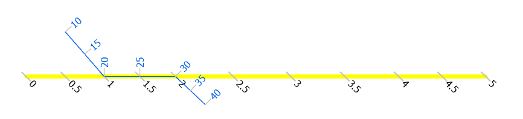 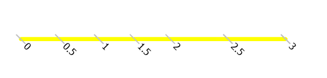 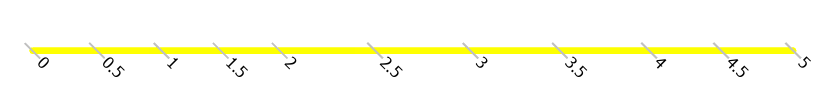 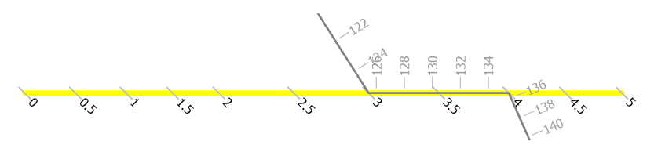

## Slide 10

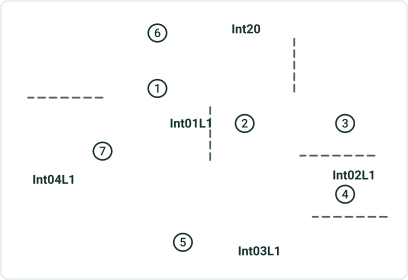

| Route Name | Route Type | From Date | To Date |
| --- | --- | --- | --- |
| Int20 | Interstate | 1/1/2000 | Null |
| Int01L1 | Interstate | 1/1/2010 | Null |
| Int02L1 | Interstate | 1/1/2010 | Null |
| Int03L1 | Interstate | 1/1/2010 | Null |
| Int04L1 | Interstate | 1/1/2010 | Null |

| Section ID | Dominant Route | Reason | From Route | To Route | From M | To M | From Date | To Date | Code |
| --- | --- | --- | --- | --- | --- | --- | --- | --- | --- |
| 1 | Int01L1 | No Concurrency | Int01L1 | Int01L1 | 0 | 1 | 1/1/2010 | Null | Evnt15 |
| 2,3 | Int20 | Rule X | Int20 | Int20 | 125.45 | 140.256 | 1/1/2010 | Null | Evnt15 |
| 4,5,7 | Routes in L1 | No Concurrency | Int02L1 | Int04L1 | 6.5 | 5 | 1/1/2010 | Null | Evnt15 |

Add Event from start to end on L1
Add Event from start to end on Int20
Testcase6 : Add events from start to end on line and concurrent route have different date
Rule X : Exceptions (Interstate 20)
Rule1 : Greater Route Type where Interstate>Arterial>Collector>Local
Rule2 : Smaller Alphanumeric Route Name

| Section ID | Dominant Route | Reason | From Route | To Route | From M | To M | From Date | To Date | Code |
| --- | --- | --- | --- | --- | --- | --- | --- | --- | --- |
| 6,2,3 | Int20 | Rule X | Int20 | Int20 | 120.235 | 140.256 | 1/1/2010 | Null | Evnt15 |

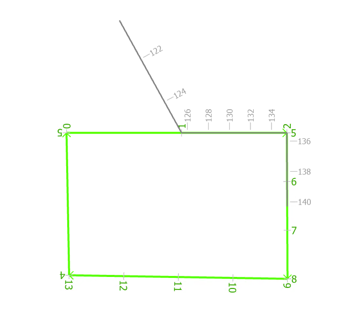

## Slide 11

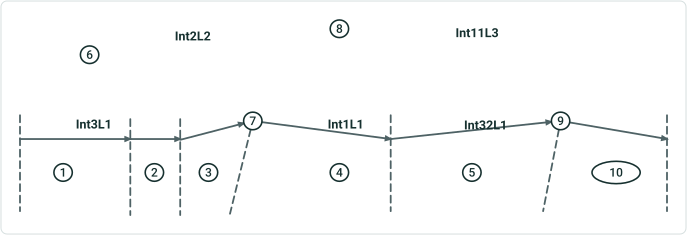

| Route Name | Route Type | From Date | To Date |
| --- | --- | --- | --- |
| Int3 | Interstate | 1/1/2000 | Null |
| Int1 | Interstate | 1/1/2000 | Null |
| Int32 | Interstate | 1/1/2000 | Null |
| Int11 | Interstate | 1/1/2010 | Null |
| Int2 | Interstate | 1/1/2010 | Null |

Add Event from start to end on Line L1 from 2010 to null
Testcase7 :  Add events from start to end on line route and concurrent route have different dates
Rule X : Exceptions (Interstate 10)
Rule1 : Greater Route Type where Interstate>Arterial>Collector>Local
Rule2 : Smaller Alphanumeric Route Name

| Section ID | Dominant Route | Reason | From Route | To Route | From M | To M | From Date | To Date | Code |
| --- | --- | --- | --- | --- | --- | --- | --- | --- | --- |
| 1 | Int3 | No Concurrency | Int01L1 | Int01L1 | 0 | 1 | 1/1/2010 | Null | Evnt16 |
| 2 | Int2 | Rule 2 | Int2 | Int2 | 20 | 25 | 1/1/2010 | Null | Evnt16 |
| 3,4 | Int1 | Rule2, No Concurrency | Int1 | Int1 | 5 | 9 | 1/1/2010 | Null | Evnt16 |
| 5 | Int11 | Rule 2 | Int11 | Int11 | 125.45 | 135.46 | 1/1/2010 | Null | Evnt16 |
| 10 | Int32 | No Concurrency | Int32 | Int32 | 5 | 6 | 1/1/2010 | Null | Evnt16 |

Add Event from start to end on Int2

| Section ID | Dominant Route | Reason | From Route | To Route | From M | To M | From Date | To Date | Code |
| --- | --- | --- | --- | --- | --- | --- | --- | --- | --- |
| 6,2 | Int2 | No Concurrency, Rule 2 | Int2 | Int2 | 10 | 25 | 1/1/2010 | Null | Evnt17 |
| 3 | Int1 | Rule 2 | Int1 | Int1 | 5 | 7 | 1/1/2010 | Null | Evnt17 |
| 7 | Int2 | No Concurrency | Int2 | Int2 | 30 | 40 | 1/1/2010 | Null | Evnt17 |

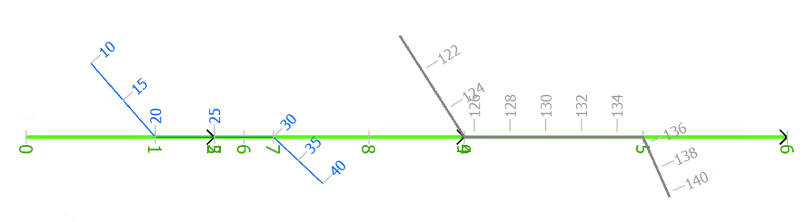

## Slide 12

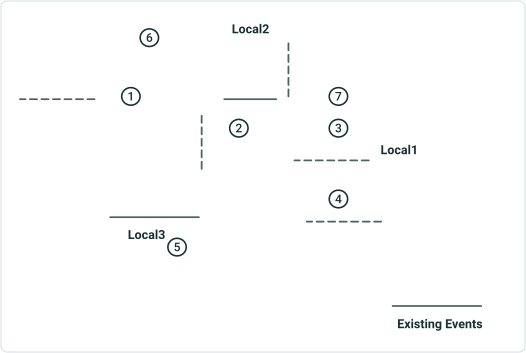

| Route Name | Route Type | From Date | To Date |
| --- | --- | --- | --- |
| Local3 | Arterial | 1/1/2000 | Null |
| Local1 | Local | 1/1/2010 | Null |
| Local2 | Local | 1/1/2010 | Null |

| Section ID | Dominant Route | Reason | From M | To M | From Date | To Date | Code |
| --- | --- | --- | --- | --- | --- | --- | --- |
| 0 | Local3 | No Concurrency | 0 | 5 | 2000 | 2010 | Evnt90 |
| 1 | Local3 | No Concurrency | 0 | 1 | 2010 | Null | Evnt10 |
| 2 | Local2 | Rule 2 | 128 | 134 | 2010 | 2012 | Evnt10Exist |
| 2 | Local2 | Rule 2 | 125.45 | 135.46 | 2010 | Null | Evnt10 |
| 3,4 | Local1 | Rule 2 | 2 | 3 | 2010 | Null | Evnt10 |
| 5 | Local3 | No Concurrency | 3.5 | 4 | 2010 | 2012 | Evnt10Exist |
| 5 | Local3 | No Concurrency | 3 | 5 | 2010 | Null | Evnt10 |

Add Event from start to end on Local 3 from 2012 to Null

| Section ID | Dominant Route | Reason | From M | To M | From Date | To Date | Code |
| --- | --- | --- | --- | --- | --- | --- | --- |
|  | Local2 | Rule 2 | 128 | 134 | 2010 | 2012 | Evnt11Exist |
| 6,2 | Local2 | Rule 2 | 120.235 | 135.46 | 2010 | Null | Evnt11 |
| 3 | Local1 | Rule 2 | 20 | 30 | 2010 | Null | Evnt11 |

Add Event from start to end on Local 2 2012 to Null
Testcase8 : Add events from start to end on loop route and concurrent routes have different dates and existing events on the routes
Rule X : Exceptions (Interstate 10)
Rule1 : Greater Route Type where Interstate>Arterial>Collector>Local
Rule2 : Smaller Alphanumeric Route Name


