# Add Line Event Tool Coordinate Offset Method Test Plan

|   |   |
| --- | --- |
| **Kind** | Test Plan · Pro |
| **Release** | — |
| **Issue** | [ArcGISPro/ps-location-referencing#3911](https://devtopia.esri.com/ArcGISPro/ps-location-referencing/issues/3911) |
| **Source** | [3911-AddLE_coordinate_offset_v2.pptx](<https://esriis.sharepoint.com/sites/LocationReferencing/Shared%20Documents/General/Test%20Plans/3911-AddLE_coordinate_offset_v2.pptx>) |
| **Edited** | 2022-08-25 21:56 by Claire Wang |
| **Extracted** | 2026-09-04 · lane `xmlstrip` |

<!-- metadata
```yaml
title: "Add Line Event Tool Coordinate Offset Method Test Plan"
source_file: "3911-AddLE_coordinate_offset_v2.pptx"
source_url: "https://esriis.sharepoint.com/sites/LocationReferencing/Shared%20Documents/General/Test%20Plans/3911-AddLE_coordinate_offset_v2.pptx"
doc_id: 636
doc_kind: "Test Plan"
surface: "Pro"
doc_revision: "V2"
target_release: ""
pe: "Claire Wang"
dev: "Sharon Lai"
author: "Lakshmi Ananthanarayanan"
last_edited_by: "Claire Wang"
last_edited: "2022-08-25T21:56:21Z"
extracted: 2026-09-04
extraction_lane: xmlstrip
prompt_version: "v2.0.2"
keywords: ["coordinate offset", "line event", "multiple line event", "route", "referent", "spatial reference", "event dates"]
tools: ["Add Line Event", "Add Multiple Lines"]
products: []
issues: ["ArcGISPro/ps-location-referencing#3911"]
related: [{"doc":619,"file":"event-replacement-referent-population-for-line-events__doc619.md","s":1003.595},{"doc":638,"file":"add-point-event-tool-add-multipoint-events-tool-coordinate-offset-method-test__doc638.md","s":6.61},{"doc":648,"file":"add-line-event-tools-coordinate-offset-method__doc648.md","s":6.593},{"doc":49,"file":"coordinates-method-in-add-point-and-add-line-widgets-test-plan__doc49.md","s":5.835},{"doc":658,"file":"add-point-event-tools-coordinate-offset-method__doc658.md","s":5.741}]
```
-->

## Summary

Test plan for the Add Line Event and Add Multiple Lines tools focusing on coordinate offset methods. Covers testing on various network types, route complexities, spatial references, UI verification, error message validation, and event addition scenarios including time slices and vertical routes. Includes automation cases for REST with referents and documentation updates.

## Related documents

<!-- related:begin -->
- [Event Replacement Referent Population for Line Events](<https://esriis.sharepoint.com/sites/lrsworkspace/LRS Doc Index/Test Plans/event-replacement-referent-population-for-line-events__doc619.md>) — shared issue ArcGISPro/ps-location-referencing#3911 · similar text 0.21 · 2 title words · same kind/surface/folder <!-- rel:619 -->
- [Add Point Event tool/ Add Multipoint Events tool Coordinate offset method – Test Plan](<https://esriis.sharepoint.com/sites/lrsworkspace/LRS Doc Index/Test Plans/add-point-event-tool-add-multipoint-events-tool-coordinate-offset-method-test__doc638.md>) — similar text 0.42 · 6 title words · 1 filename word · same kind/surface/folder <!-- rel:638 -->
- [Add Line Event Tools: Coordinate Offset Method](<https://esriis.sharepoint.com/sites/lrsworkspace/LRS Doc Index/User Stories/add-line-event-tools-coordinate-offset-method__doc648.md>) — similar text 0.33 · 6 title words · 3 filename words · same surface <!-- rel:648 -->
- [Coordinates Method in Add Point and Add Line Widgets Test Plan](<https://esriis.sharepoint.com/sites/lrsworkspace/LRS Doc Index/Test Plans/coordinates-method-in-add-point-and-add-line-widgets-test-plan__doc49.md>) — similar text 0.65 · 3 title words · 1 filename word · same kind/folder <!-- rel:49 -->
- [Add Point Event Tools: Coordinate Offset Method](<https://esriis.sharepoint.com/sites/lrsworkspace/LRS Doc Index/User Stories/add-point-event-tools-coordinate-offset-method__doc658.md>) — similar text 0.32 · 5 title words · 3 filename words · same surface <!-- rel:658 -->
<!-- related:end -->

<!-- docs:begin -->
## Esri documentation

[Storing referent and offset information for event location](https://doc.esri.com/en/arcgis-pro/latest/help/production/location-referencing-pipelines/storing-referent-and-offset-information-for-event-location.html)

_No page matched:_ [Add Line Event](https://www.google.com/search?q=%22Add%20Line%20Event%22+site%3Adoc.esri.com) · [Add Multiple Lines](https://www.google.com/search?q=%22Add%20Multiple%20Lines%22+site%3Adoc.esri.com)
<!-- docs:end -->

---

## Slide 1 — Add Line Event tool/ Add Multiple Lines tool Coordinate offset method – Test Plan

https://devtopia.esri.com/ArcGISPro/ps-location-referencing/issues/3911

PE: Claire Wang
Dev: Sharon Lai

## Slide 2

Data:

- Test in Feature Service only.
- Test for tools -  Add line event and multiple line event
- Test on a variety of network types (Line, NonLine with multifield RouteID, NonLine with singlefield RouteID, NonLine with autogenerated RouteID)
- Test simple route and complex shapes
- Test in both projected and unprojected data
- Test few cases for conflict prevention with this method
- line events should have with and without referents configured.
Documentation

- Add sections in existing doc topic (point, line, line spanning)
- Update the respective doc title
- Follow the format of the existing Event Editor topic/s (https://enterprise.arcgis.com/de/roads-highways/latest/event-editor/adding-linear-events-by-coordinate-location.htm  )

Automation

- Create only the cases for REST automation with referents
- Create few cases for test complete (only positive cases)


## Slide 3


Verification
General UI verification

- Verify in the panes the labels of the field are of same font size and aligned left
- Verify all the editable fields are of white background and of same size and are aligned properly
- Verify the icons provided in a pane are of same size and aligned properly
- i18n and 508 testing. Verify testing in Arabic and German especially (X,Y coordinates value in referent table)

First pane

- In Add line event and Multiline event, the From and To Method should both support “Using coordinates” method
- Default should be “Route and Measure” method

## Slide 4


Second Pane
Event Layer

- Verify the default event layer is the first line event layer of the map (verify other methods also do this or not)
Network

- Verify that the network selected is automatically set to the registered network for the selected event layer
  - 8a. For line network display the corresponding network.
- Verify that the label “Using Coordinates” is shown
  - 9a. Verify From and To Methods can be different
RouteID /Route Name

- Verify the ‘Route Name” is displayed instead of route id for the events configured with route name
- Verify that the RouteID should be empty until the user fills
- Verify that the RouteID can be typed or picked.

GC Factor

- Verify by using a nonzero GC factor and check whether the coordinates are adjusted accordingly
- Verify the tool runs successfully without providing a GC factor
- Use different GC factors to see what difference it will make on the map: The located coordinates are entered coordinates/GC
- Check other tools in Arcgis that use GC factor- how they use it – GC only used by Location Referencing
- Verify that the route selector UI is
        shown when the user types in a
        routeID/Name which has more than one time slice


## Slide 5


- All points mentioned in the previous slide are applicable here as well

Mix of methods

 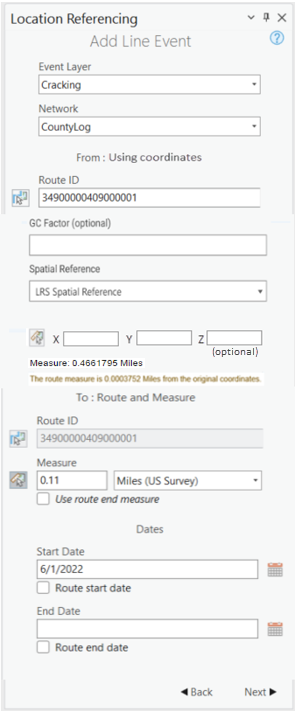

## Slide 6


Second Pane - continued
Spatial Reference

- Verify there are 3 spatial options for Spatial reference dropdown : LRS Spatial Reference, Web Map Spatial Reference, GCS WGS 1984.
- Verify the spatial references are honored by providing a different spatial reference to the map than the LRS one.
- If a location is already selected on the map, verify the coordinate value changes by changing the spatial reference
XYZ coordinates

- X, Y and Z should be shown for coordinates
- Verify X & Y are required; Z value is optional - default is 0. Remove the optional text in previous design.
- Verify the coordinates can be typed and picked from the map
- Verify the pickers work with snapping
- Verify the measure is displayed once the coordinates are located in the map with the network units and no of decimals matching the M tolerance of the network
- If LRS Spatial Reference, Web map spatial reference has geographic coordinates, or if user selects GCS_WGS_1984 as spatial reference, the XYZ UI changes to a vertical arrangement of lat, lon, and height.
- If user uses picker to select coordinates on the map/scene, make sure z/height value gets auto populated (in addition to x, y/lat, lon) in their respective text boxes


## Slide 7


On the map

- Verify the chosen route remain selected
- The location of the coordinates is marked in small yellow square
- The route measure closest to the coordinates is shown with red mark

In the pane

- Verify that the route measure closest to the original coordinates is selected and the distance between the location and the chosen measure is shown as route measure distance in the pane

Dates

- Verify the start date defaults to todays date
- Verify the end date by default is empty
- Verify by checking the route start date and route end date the date fields are filled
- Verify the referent method configured event has X/Y as ref method, ref location and reference offset updated

  

## Slide 8

Error message verification

| No | Test | Expected Result | Error Message |
| --- | --- | --- | --- |
| 1 | Provided XYZ coordinates cannot be located on the map | Error |  |
| 2 | Typed invalid values for XYZ | Error |  |
| 3 | Provide zero for the GC factor | Error | Value of GC factor is invalid |
| 4 | Provide invalid value for GC factor | Error | Value of GC factor is invalid |
| 5 | Typed in RouteID/ Route Name does not exist in the network | Error |  |
| 6 | In the map, event layer and the network layer are in different versions | Error | The event layer and network layer are in different versions |
| 7 | RouteID is null | Error |  |
| 8 | User provides only end date. | Error | Enter a start date. |
| 9 | User do not provide any dates. | Error | Enter a start date |
| 10 | User clicks on without providing any values. | Error | Enter the Route Name. |
| 11 | Route is not available for the provide date | Error | Route not available in the provided date range. |

Other verifications

- If 2nd pane is filled out and user goes back to 1st  pane:
  - If user selects a different method, reset 2nd    (3rd pane if applicable) and clear markers on map
  - If user selects same method again, keep the markers on map and any thing filled out in 3rd pane
- Few cases of conflict prevention will be tested through Pro as well as from REST.

## Slide 9


4 networks:
Cont_autoID: 2 LEs w/ referent
Cont_multif: 2 LEs w/o referent
Cont_singlef: 2 LEs w/o referent
Line: 2 LEs; 1 spanning w/referent; 1 non-spanning w/o referent

Legend
Route with measures

Coordinate input location

Coordinate located on route

Line Event
x

## Slide 10 — 1. Coordinate location falling on route (XYZ coordinates is provided by typing the value) for X marked location) 1a.


| Event Layer | EventId | FromRouteID | FromMeasure | ToMeasure | From Date | To Date | FromRef Method | FromRefLoc | FromRefOffset | ToRefMethod | ToRef Loc | ToRef offset | Sign |
| --- | --- | --- | --- | --- | --- | --- | --- | --- | --- | --- | --- | --- | --- |
| LEA | LEA1 | R1 | 2 | 6 | 1/1/2000 |  | X/Y | -300,-300 | 0 | X/Y | -400,-400 | 0 | 111 |

1b.  Adding multiple line events on a simple route with multi field ID


| Event Layer | EventId | FromRouteID | FromMeasure | ToMeasure | From Date | To Date | sign |
| --- | --- | --- | --- | --- | --- | --- | --- |
| MLA | MLA1 | RM1 | 2 | 6 | 1/1/2000 |  | 222 |
| MLB | MLB1 | RM1 | 2 | 6 | 1/1/2000 |  | 223 |

## Slide 11 — 2. Coordinate location not falling on the route(XYZ location is provided for location and event is placed on nearest

2b.Adding multiple line events in a gapped route with single field route ID

| Event Layer | EventId | FromRouteID | FromMeasure | ToMeasure | From Date | To Date | sign |
| --- | --- | --- | --- | --- | --- | --- | --- |
| SLA | SLA1 | RS2 | 2 | 7 | 1/1/2000 |  | 331 |
| SLB | SLB1 | RS2 | 2 | 7 | 1/1/2000 |  | 332 |


| Event Layer | EventId | FromRouteID | FromMeasure | ToMeasure | From Date | To Date | FromRef Method | FromRefLoc | FromRefOffset | ToRefMethod | ToRef Loc | ToRef offset | sign |
| --- | --- | --- | --- | --- | --- | --- | --- | --- | --- | --- | --- | --- | --- |
| LEA | LEA2 | R7b | 4 | 6 | 1/1/2000 |  | X/Y | -300,-300 | 0 | X/Y | -400,-400 | 0 | 112 |
| LEA | LEA3 | R7b | 8 | 8.7 | 1/1/2000 |  | X/Y | -400,-400 | 0 | X/Y | -500,-500 | 0 | 107 |


## Slide 12 — 3. Coordinate location falling on the route where there is more than one measure (XYZ location is provided for X marked

3b.Adding multiple line events in a branched route with multi field route ID

Enhancement in Pro: support M selection
‘
EE currently does not support measure selection in complex shapes.

| Event Layer | EventId | FromRouteID | FromMeasure | ToMeasure | From Date | To Date | FromRef Method | FromRefLoc | FromRefOffset | ToRefMethod | ToRef Loc | ToRef offset | sign |
| --- | --- | --- | --- | --- | --- | --- | --- | --- | --- | --- | --- | --- | --- |
| LEA | LEA4 | R16 | 2 | 14 | 1/1/2000 |  | X/Y | -300,-300 | 0 | X/Y | -300,-300 | 0 | 113 |

| Event Layer | EventId | FromRouteID | FromMeasure | ToMeasure | From Date | To Date | sign |
| --- | --- | --- | --- | --- | --- | --- | --- |
| MLA | MLA2 | RM5 | 2 | 5 | 1/1/2000 |  | 224 |
| MLB | MLB2 | RM5 | 2 | 5 | 1/1/2000 |  | 225 |

Enhancement in Pro: support M selection
‘
EE currently does not support measure selection in complex shapes.

[figure: R16 · LEA4 · 2, 14 · x · RM5 · 2, 4 · MLA2 MLB2]

 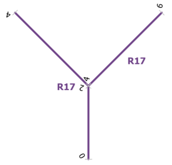

## Slide 13 — 4. Coordinate location falling out of the route and the nearest location on the route has more than one measure. (XYZ

4b.Adding multiple line events in a lollipop route

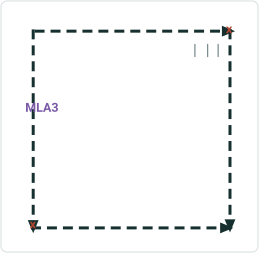

| Event Layer | EventId | FromRouteID | FromMeasure | ToMeasure | From Date | To Date | sign |
| --- | --- | --- | --- | --- | --- | --- | --- |
| MLA | MLA3 | RM3 | 1 | 5 | 1/1/2000 |  | 226 |

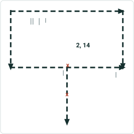

| Event Layer | EventId | FromRouteID | FromMeasure | ToMeasure | From Date | To Date | FromRef Method | FromRefLoc | FromRefOffset | ToRefMethod | ToRef Loc | ToRef offset | sign |
| --- | --- | --- | --- | --- | --- | --- | --- | --- | --- | --- | --- | --- | --- |
| LEA | LEA5 | R12 | 1 | 14 | 1/1/2000 |  | X/Y | -300,-300 | 0 | X/Y | -400,-400 | 0 | 115 |
| LEB | LEB1 | R12 | 1 | 14 | 1/1/2000 |  | X/Y | -400,-400 | 0 | X/Y | -500,-500 | 0 | 116 |

Enhancement in Pro: support M selection
‘
EE currently does not support measure selection in complex shapes.
Enhancement in Pro: support M selection
‘
EE currently does not support measure selection in complex shapes.

 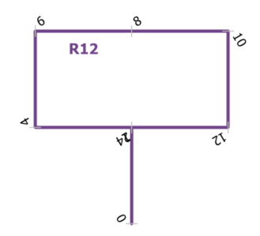

## Slide 14 — 5. Vertical Route 5a.Adding a line event in a vertical route with auto generated route ID; same xy and diff z.

5b. Adding multiple line events in a vertical route with single field route ID; diff xy and diff z.

| Event Layer | EventId | FromRouteID | FromMeasure | ToMeasure | From Date | To Date | FromRef Method | FromRefLoc | FromRefOffset | ToRefMethod | ToRef Loc | ToRef offset | sign |
| --- | --- | --- | --- | --- | --- | --- | --- | --- | --- | --- | --- | --- | --- |
| LEA | LEA5 | V23 | 2 | 4 | 1/1/2000 |  | X/Y | 100,100,200 | 0 | X/Y | 100,100,400 | 0 | 114 |

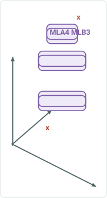

| Event Layer | EventId | FromRouteID | FromMeasure | ToMeasure | From Date | To Date | sign |
| --- | --- | --- | --- | --- | --- | --- | --- |
| MLA | MLA4 | V23 | 2 | 10 | 1/1/2000 |  | 227 |
| MLB | MLB3 | V23 | 2 | 10 | 1/1/2000 |  | 228 |

Info always saved as the event’s coor system

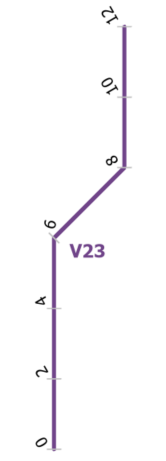

## Slide 15 — 6. Line Network 6a.Adding a spanning line event in a line network .

6b. Adding multiple line events in a line network

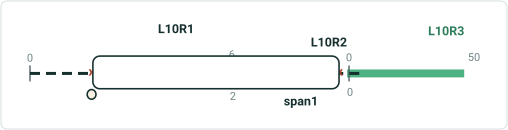

| Event Layer | EventId | FromRouteID | FromMeasure | ToRouteID | ToMeasure | From Date | To Date | FromRef Method | FromRefLoc | FromRefOffset | ToRefMethod | ToRef Loc | ToRef offset | sign |
| --- | --- | --- | --- | --- | --- | --- | --- | --- | --- | --- | --- | --- | --- | --- |
| span | span1 | L10R1 | 2 | L10R2 | 0.5 | 1/1/2000 |  | X/Y | -300,-300 | 0 | X/Y | -200,-200 | 0 | 441 |

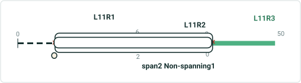

| Event Layer | EventId | FromRouteID | FromMeasure | ToRouteID | ToMeasure | From Date | To Date | FromRef Method | FromRefLoc | FromRefOffset | ToRefMethod | ToRef Loc | ToRef offset | sign |
| --- | --- | --- | --- | --- | --- | --- | --- | --- | --- | --- | --- | --- | --- | --- |
| span | span2 | L11R1 | 2 | L11R3 | 0 | 1/1/2000 |  | X/Y | -300,-300 | 0 | X/Y | -200,-200 | 0 | 442 |

| Event Layer | EventId | FromRouteID | FromMeasure | ToMeasure | From Date | To Date | sign |
| --- | --- | --- | --- | --- | --- | --- | --- |
| stayput | Stayput1 | L11R1 | 2 | 6 | 1/1/2000 |  | 551 |
| stayput | stayput2 | L11R2 | 0 | 2 | 1/1/2000 |  | 552 |

Create another line- line event that is non-spanning, with referent to check F/T refloc for the separated parts

## Slide 16 — 7a. Adding line event with time slices Event dates are from null to null coordinates fall exactly on the route.

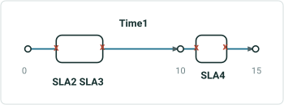

| RouteID | From Date | To Date | F M | To M |
| --- | --- | --- | --- | --- |
| Time1 | 1/1/2000 | 1/1/2010 | 0 | 10 |
| TIme1 | 1/1/2010 | 1/1/2020 | 0 | 15 |

| Event Layer | EventId | FromRouteID | FromMeasure | ToMeasure | From Date | To Date | sign | LocError |
| --- | --- | --- | --- | --- | --- | --- | --- | --- |
| SLA | SLA2 | Time1 | 2 | 5 | 1/1/2000 | 1/1/2010 | 334 | No Error |
| SLA | SLA3 | Time1 | 2 | 5 | 1/1/2010 | 1/1/2020 | 335 | No Error |
| SLA | SLA4 | Time1 | 11 | 13 | 1/1/2010 | 1/1/2020 | 337 | No Error |

## Slide 17 — 7a. Adding line event with time slices Event dates are from null to null. Location Errors record should not show up for

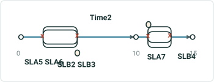

| RouteID | From Date | To Date | F M | To M |
| --- | --- | --- | --- | --- |
| Time2 | 1/1/2000 | 1/1/2010 | 0 | 10 |
| Time2 | 1/1/2010 | 1/1/2020 | 0 | 15 |

| Event Layer | EventId | FromRouteID | FromMeasure | ToMeasure | From Date | To Date | sign | LocError |
| --- | --- | --- | --- | --- | --- | --- | --- | --- |
| SLA | SLA5 | Time2 | 2 | 5 | 1/1/2000 | 1/1/2010 | 306 | No Error |
| SLB | SLB2 | Time2 | 2 | 5 | 1/1/2000 | 1/1/2010 | 307 | No Error |
| SLA | SLA6 | Time2 | 2 | 5 | 1/1/2010 | 1/1/2020 | 308 | No Error |
| SLB | SLB3 | Time2 | 2 | 5 | 1/1/2010 | 1/1/2020 | 309 | No Error |
| SLA | SLA7 | Time2 | 11 | 13 | 1/1/2010 | 1/1/2020 | 314 | No Error |
| SLB | SLB4 | Time2 | 11 | 13 | 1/1/2010 | 1/1/2020 | 315 | No Error |
