# Add Line Event Tools – Intersection Location Offset Method Test Plan

|   |   |
| --- | --- |
| **Kind** | Test Plan · Experience Builder |
| **Release** | — |
| **Issue** | [ArcGISPro/ps-location-referencing#3910](https://devtopia.esri.com/ArcGISPro/ps-location-referencing/issues/3910) |
| **Source** | [3910-AddLineEventIntersectionOffsetMethod_TestPlan_V4.pptx](<https://esriis.sharepoint.com/sites/LocationReferencing/Shared%20Documents/General/Test%20Plans/3910-AddLineEventIntersectionOffsetMethod_TestPlan_V4.pptx>) |
| **Edited** | 2022-11-17 19:29 by Mac Christmas |
| **Extracted** | 2026-09-04 · lane `xmlstrip` |

<!-- metadata
```yaml
title: "Add Line Event Tools – Intersection Location Offset Method Test Plan"
source_file: "3910-AddLineEventIntersectionOffsetMethod_TestPlan_V4.pptx"
source_url: "https://esriis.sharepoint.com/sites/LocationReferencing/Shared%20Documents/General/Test%20Plans/3910-AddLineEventIntersectionOffsetMethod_TestPlan_V4.pptx"
doc_id: 618
doc_kind: "Test Plan"
surface: "Experience Builder"
doc_revision: "V4"
target_release: ""
pe: ""
dev: ""
author: "Mac Christmas"
last_edited_by: "Mac Christmas"
last_edited: "2022-11-17T19:29:22Z"
extracted: 2026-09-04
extraction_lane: xmlstrip
prompt_version: "v2.0.2"
keywords: ["line event", "intersection offset", "location offset", "offset method", "route types", "referents", "positive tests", "negative tests"]
tools: ["Add single line event", "Add multiple line events"]
products: []
issues: ["ArcGISPro/ps-location-referencing#3910"]
related: [{"doc":619,"file":"event-replacement-referent-population-for-line-events__doc619.md","s":1003.36},{"doc":679,"file":"add-event-intersection-offset-method__doc679.md","s":6.959},{"doc":48,"file":"location-offset-method-in-add-point-and-add-line-widgets-test-plan__doc48.md","s":6.464},{"doc":612,"file":"event-replacement-location-offset-method-test-plan__doc612.md","s":6.418},{"doc":268,"file":"add-line-events-point-offset-method__doc268.md","s":5.76}]
```
-->

## Summary

Test plan for the Add Line Event tools focusing on the Intersection Location Offset Method. It includes positive and negative test cases across various route types and configurations, verifying UI behavior, attribute table results, and error handling. Tests cover line and non-line networks, projected and unprojected data, and scenarios with and without referents and cardinal directions.

## Related documents

<!-- related:begin -->
- [Event Replacement Referent Population for Line Events](<https://esriis.sharepoint.com/sites/lrsworkspace/LRS%20Doc%20Index/Test%20Plans/event-replacement-referent-population-for-line-events__doc619.md>) — shared issue ArcGISPro/ps-location-referencing#3910 · similar text 0.16 · 2 title words · 1 filename word · same kind/folder <!-- rel:619 -->
- [Add Event Intersection Offset Method](<https://esriis.sharepoint.com/sites/lrsworkspace/LRS Doc Index/User Stories/add-event-intersection-offset-method__doc679.md>) — similar text 0.18 · 5 title words · 5 filename words <!-- rel:679 -->
- [Location Offset Method in Add Point and Add Line Widgets Test Plan](<https://esriis.sharepoint.com/sites/lrsworkspace/LRS%20Doc%20Index/Test%20Plans/location-offset-method-in-add-point-and-add-line-widgets-test-plan__doc48.md>) — similar text 0.20 · 4 title words · 3 filename words · same kind/surface/folder <!-- rel:48 -->
- [Event Replacement: Location Offset Method Test Plan](<https://esriis.sharepoint.com/sites/lrsworkspace/LRS Doc Index/Test Plans/event-replacement-location-offset-method-test-plan__doc612.md>) — similar text 0.15 · 3 title words · 3 filename words · same kind/folder <!-- rel:612 -->
- [Add Line Events Point Offset Method](<https://esriis.sharepoint.com/sites/lrsworkspace/LRS Doc Index/User Stories/add-line-events-point-offset-method__doc268.md>) — similar text 0.17 · 4 title words · 5 filename words <!-- rel:268 -->
<!-- related:end -->

<!-- docs:begin -->
## Esri documentation

[Add multiple line events](https://doc.esri.com/en/arcgis-pro/latest/help/production/location-referencing-pipelines/add-multiple-line-events.html) · [Storing referent and offset information for event location](https://doc.esri.com/en/arcgis-pro/latest/help/production/location-referencing-pipelines/storing-referent-and-offset-information-for-event-location.html)

_No page matched:_ [Add single line event](https://www.google.com/search?q=%22Add%20single%20line%20event%22+site%3Adoc.esri.com)
<!-- docs:end -->

---

## Slide 1


Add Line Event Tools – Intersection Location Offset Method

| Notes |
| --- |
| Test with both line event tools (Add single line event and add multiple line events) Test on Line and Non-line networks (Auto, Single, and Multiple field Route ID) FS only, no EGDB or FGDB Test with projected and unprojected data Method is only available when LRS intersections and at least one line event feature class are within the map Test with normal, gapped, and complex (loops, lollipops, alphas, branches, and vertical) route types Test with and without cardinal direction Test with and without referents configured 508 and i18n testing From/ToRefMethod will be “Intersections” for all cases For this test plan, most case's expected attribute table with referents configured for the event will have From/ToRefLocation of the labeled intersection within the graphic. Cases where the From/ToRefLocation are different will be noted in the expected attribute table. Intersection Offset has been renamed to Location Offset. |

Devtopia Issue

 

## Slide 2

| Positive Tests: UI |
| --- |
| Intersection is selected either through typing the Intersection Name or using the picker Once the intersection is selected, blink it 3 times on the map If more than one intersection exists at the same location on the same route, show modal window with possible intersections to select If no direction is selected, the measure is a positive offset If no direction is selected, a negative measure will be a negative offset If a route goes exactly in two cardinal directions (exactly N-S for example) and a user tries to use one of the other cardinal directions (E-W), then the cardinal direction will be ignored If unit of measure is changed after a measure is populated, update the location marker on the map If an event is configured with referent info fields, then populate the referent fields with RefMethod : Intersections, RefLocation : IntersectionID , and RefOffset : measure values populated in tool Selecting offset from map will reset direction drop-down. Reset second pane if user selects a different From or To Method User moves to 3rd pane, fill out the attributes and hits back , markers on map + any information on (2nd, 3rd ) panes should remain intact Add a drop-down above the location name to include intersection offset layers and label it "Location" If there exists only one intersection offset layer in the map, select that layer automatically. Show only the intersection offset layers that are present in the TOC. If the form is filled up and the intersection offset layer is removed from the TOC, then reset the layer name, ID and offset value. Show intersection layers for the selected network. The intersection name displayed in the UI should be based on the selected route and its From date |

| Positive Tests |
| --- |
| Simple route, single line event with positive offset Simple route, multiple line events with negative offsets Simple route, single line event with positive offset to West Simple singlefield ID route not pointing in an exact cardinal direction, single line event with positive offset to East Simple route, single line event with positive offset to North Simple bending multifield ID route, single line event with positive offset to North Gapped route with continuous measures, single line event with positive offset to East Gapped singlefield ID route with continuous measures, single line event with positive offset located on gap ends. Looped multifield ID route, multiple line events with positive offsets Looped route, single line event with positive offset to East Lollipop route, multiple line events with positive offsets |

## Slide 3

| Positive Tests |
| --- |
| Lollipop route, single line event with positive offset to North Lollipop singlefield ID route, single line event with positive offset to North Alpha line route, multiple LE’s with negative offsets Alpha route, single line event with positive offset to North Alpha route, multiple line events with positive offsets 17A. Branch route with different end measures, single line event with positive offset 17B. Branch route with different end measures, single line event with positive offset on lesser measure branch Branch multifield ID route with different end measures, multiple line events with positive offset to North Vertical route with no cardinal direction, single line event with positive offset Vertical route with no cardinal direction, single line event with positive offset to North Vertical route with 90º bends, multiple line events with negative offsets Simple route, different intersections used for Form/To Location, single line event with positive offset Simple route, From Measure is Route and Measure Method, To Measure is positive Intersection Offset Method. Simple line route, single spanning line event with different intersections |

| Negative Tests |
| --- |
| Simple route, single line event with positive offset that exceeds the route’s end measure Simple route, single line event with negative offset to West Loop route, multiple line events with positive offset that exceeds the route’s end measure Lollipop route, single line event with negative offset that exceeds the route’s start measure Alpha route, multiple line events with negative offset that exceeds the route’s start measure Vertical route, single line event with a positive offset to East that exceeds the route’s end measure Gapped route, multiple line events with negative offset that fall within the gap Gapped route, non-numeric offset measure value provided Simple line route, single spanning event with invalid measures If a route goes exactly in two cardinal directions (exactly N-S for example) and a user tries to use one of the other cardinal directions (E-W), display an error message "Direction not located on route" |

## Slide 4 — 1. Simple Route single line event with positive offset


| Input Expected Result Expected Attribute Table with referent |
| --- |

| RouteID | From Location | To Location | From Offset | To Offset |
| --- | --- | --- | --- | --- |
| R1 | Int1 | Int1 | 3 | 6 |

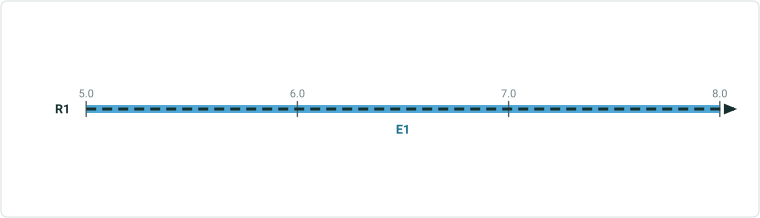

| LEID | RouteID | From Measure | To Measure | FromRefOffset | ToRefOffset | From Date | To Date | ExtraAttribute |
| --- | --- | --- | --- | --- | --- | --- | --- | --- |
| LE1 | R1 | 5 | 8 | 3 | 6 | 1/1/2000 |  | Paved |

Int1

 

## Slide 5 — 2. Simple Route - multifield multiple LEs with negative offset

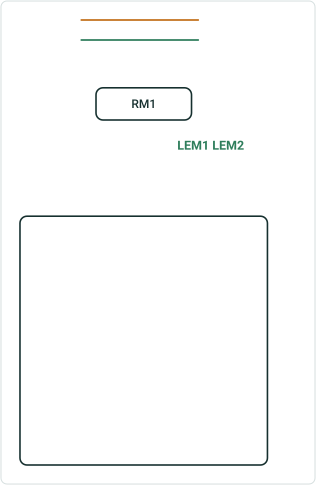

| Input Expected Result Expected Attribute Table without referent |
| --- |

| RouteID | From Location | To Location | From Offset | To Offset |
| --- | --- | --- | --- | --- |
| RM1 | Int2 | Int2 | -5 | -3 |

| LEID | RouteID | FromMeasure | ToMeasure | FromDate | ToDate | ExtraAttribute |
| --- | --- | --- | --- | --- | --- | --- |
| LEM1 | RM1 | 3 | 5 | 1/1/2000 |  | Paved |
| LEM2 | RM1 | 3 | 5 | 1/1/2000 |  | Gravel |

Int2
LEM1
LEM2

RM1

 

## Slide 6 — 3. Simple Route - line single LE with positive offset to W


| Input Expected Result Expected Attribute Table with referent |
| --- |

| LineID | From Location | To Location | From Offset | To Offset |
| --- | --- | --- | --- | --- |
| L1 | Int2 | Int2 | W 3 | W 1 |


| LEID | RouteID | From Measure | To Measure | FromRefOffset | ToRef Offset | From Date | ToDate | ExtraAttribute |
| --- | --- | --- | --- | --- | --- | --- | --- | --- |
| LEM1 | R1L1 | 1 | 3 | 3 | 1 | 1/1/2000 |  | Sign3 |

Int3
LEM1

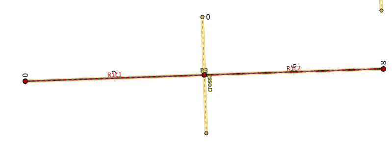 

## Slide 7 — 4. Simple Route - singlefield route not exactly in cardinal direction, single LE with positive offset to E

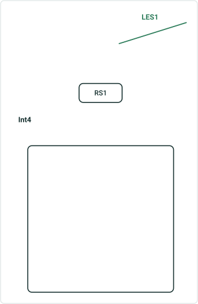

| Input Expected Result Expected Attribute Table without referent |
| --- |

| RouteID | From Location | To Location | From Offset | To Offset |
| --- | --- | --- | --- | --- |
| RS1 | Int4 | Int4 | E 3 | E 5 |

| LEID | RouteID | From Measure | To Measure | FromDate | ToDate | ExtraAttribute |
| --- | --- | --- | --- | --- | --- | --- |
| LES1 | RS1 | 7 | 9 | 1/1/2000 |  | Paved |

Int4
LES1
RS1

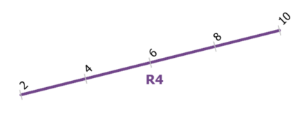 

## Slide 8 — 5. Simple Route single LE with positive offset to N

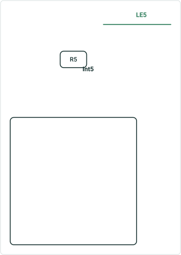

| Input Expected Result Expected Attribute Table with referent |
| --- |

| RouteID | From Location | To Location | From Offset | To Offset |
| --- | --- | --- | --- | --- |
| R5 | Int5 | Int5 | N 1 | N 3 |

| LEID | RouteID | From Measure | To Measure | FromRefOffset | ToRefOffset | From Date | ToDate | ExtraAttribute |
| --- | --- | --- | --- | --- | --- | --- | --- | --- |
| LE5 | R5 | 5 | 7 | 1 | 3 | 1/1/2000 |  | Gravel |

Int5
R5
LE5

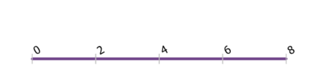 

## Slide 9 — 6. Simple Route - multif route bending, single LE with positive offset to N


| Input Expected Result Expected Attribute Table without referent |
| --- |

| RouteID | From Location | To Location | From Offset | To Offset |
| --- | --- | --- | --- | --- |
| RM2 | Int6 | Int6 | N 4 | N 1 |

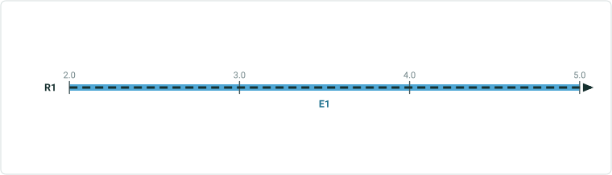

| LEID | RouteID | From Measure | To Measure | FromDate | ToDate | ExtraAttribute |
| --- | --- | --- | --- | --- | --- | --- |
| LEM2 | RM2 | 2 | 5 | 1/1/2000 |  | Dirt |

RM2
Int6
LEM2


## Slide 10 — 7. Gapped Route continuous measures, single LE with positive offset to E

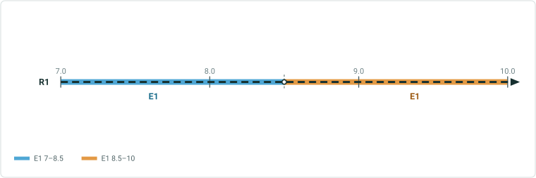

| Input Expected Result Expected Attribute Table with referent |
| --- |

| RouteID | From Location | To Location | From Offset | To Offset |
| --- | --- | --- | --- | --- |
| R7L3 | Int7 | Int7 | E 3 | E 6 |

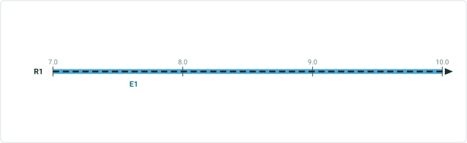

| LEID | RouteID | From Measure | To Measure | FromRefOffset | ToRefOffset | From Date | To Date | ExtraAttribute |
| --- | --- | --- | --- | --- | --- | --- | --- | --- |
| LE2 | R7L3 | 7 | 10 | 3 | 6 | 1/1/2000 |  | Paved |

Int7
LE2

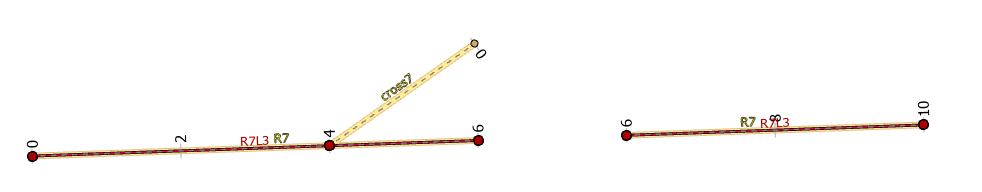 

## Slide 11 — 8. Gapped Route - singlef continuous measures, single LE with positive offset located on gap ends

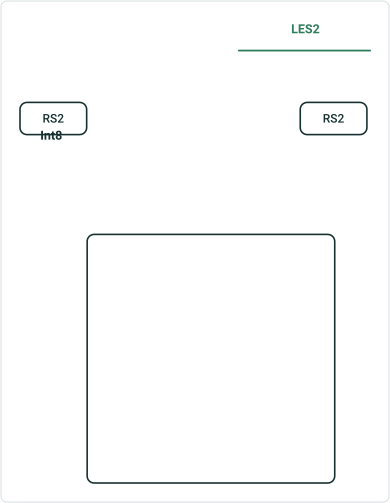

| Input Expected Result Expected Attribute Table without referent |
| --- |

| RouteID | From Location | To Location | From Offset | To Offset |
| --- | --- | --- | --- | --- |
| RS2 | Int8 | Int8 | 3 | 6 |

| LEID | RouteID | From Measure | To Measure | FromDate | ToDate | ExtraAttribute |
| --- | --- | --- | --- | --- | --- | --- |
| LES2 | RS2 | 6 | 9 | 1/1/2000 |  | Paved |


## Slide 12 — 9. Loop - multif multiple LEs with positive offset

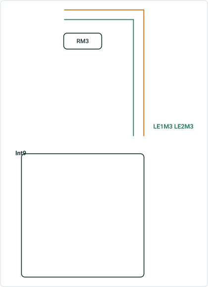

| Input Expected Result Expected Attribute Table without referent |
| --- |

| RouteID | From Location | To Location | From Offset | To Offset |
| --- | --- | --- | --- | --- |
| RM3 | Int9 | Int9 | 3 | 6 |

| LEID | RouteID | From Measure | To Measure | FromDate | ToDate | ExtraAttribute |
| --- | --- | --- | --- | --- | --- | --- |
| LE1M3 | RM3 | 3 | 6 | 1/1/2000 |  | Paved |
| LE2M3 | RM3 | 3 | 6 | 1/1/2000 |  | Gravel |


## Slide 13 — 10. Loop single LE with positive offset to E

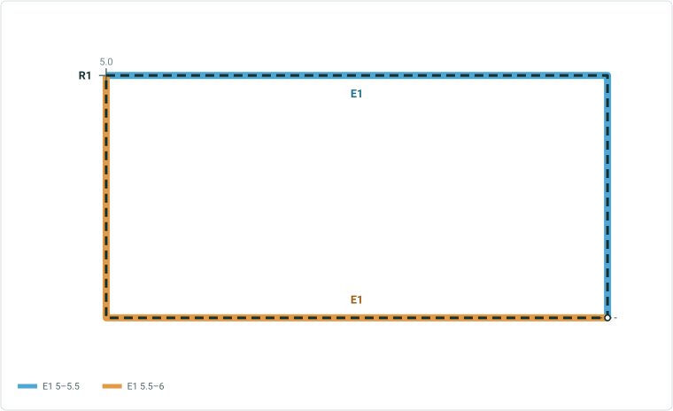

| Input Expected Result Expected Attribute Table with referent |
| --- |

| RouteID | From Location | To Location | From Offset | To Offset |
| --- | --- | --- | --- | --- |
| R10 | Int10 | Int10 | E 3 | E 4 |

Int10

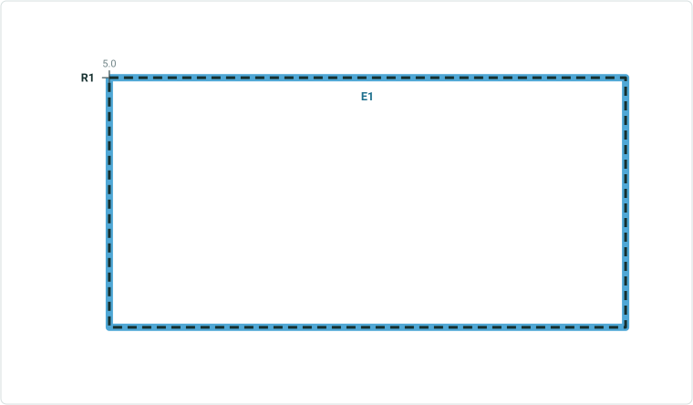

| LEID | RouteID | From Measure | To Measure | FromRefOffset | ToRefOffset | From Date | ToDate | ExtraAttribute |
| --- | --- | --- | --- | --- | --- | --- | --- | --- |
| LE10 | R10 | 5 | 6 | 3 | 4 | 1/1/2000 |  | Paved |

LE10

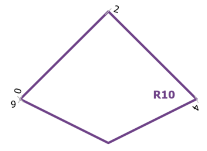 

## Slide 14 — 11. Lollipop - line multiple LEs with positive offset

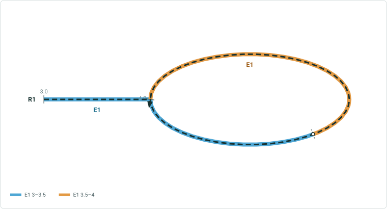

| Input Expected Result Expected Attribute Table with referent without referent |
| --- |

| RouteID | From Location | To Location | From Offset | To Offset |
| --- | --- | --- | --- | --- |
| R11L5 | Int11 | Int11 | 1 | 2 |

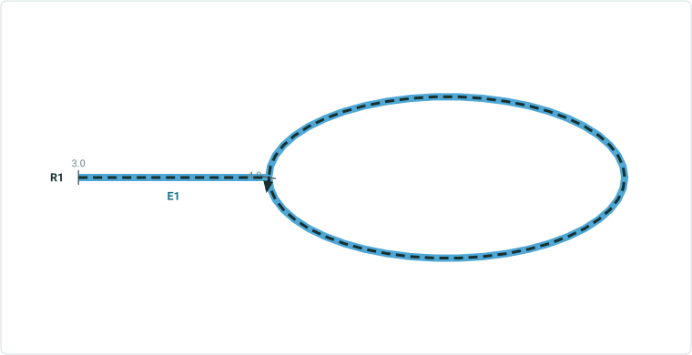

| LEID | RouteID | From Measure | To Measure | FromRefOffset | ToRefOffset | From Date | To Date | ExtraAttribute |
| --- | --- | --- | --- | --- | --- | --- | --- | --- |
| LLE3 | R11L5 | 3 | 4 | 1 | 2 | 1/1/2000 |  | Gravel |

| LEID | From RouteID | From Measure | To Measure | FromDate | ToDate | ExtraAttribute |
| --- | --- | --- | --- | --- | --- | --- |
| SLE3 | R11L5 | 3 | 4 | 1/1/2000 |  | Paved |


## Slide 15 — 12. Lollipop single LE with positive offset to N

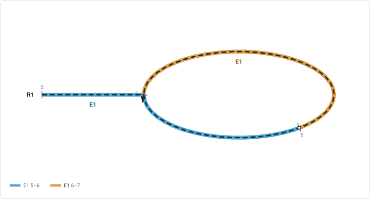

| Input Expected Result Expected Attribute Table with referent |
| --- |

| RouteID | From Location | To Location | From Offset | To Offset |
| --- | --- | --- | --- | --- |
| R12 | Int12 | Int12 | N 3 | N 5 |

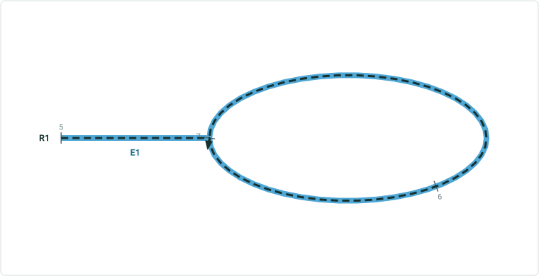

| LEID | RouteID | From Measure | To Measure | FromRefOffset | ToRefOffset | From Date | To Date | ExtraAttribute |
| --- | --- | --- | --- | --- | --- | --- | --- | --- |
| LE12 | R12 | 5 | 7 | 3 | 5 | 1/1/2000 |  | Dirt |

2
14

Int12
Int12 M=2

EE doesn’t provide M=14 option to put offset = E3
LE12

 

## Slide 16 — 13. Lollipop - singlef single LE with positive offset to N

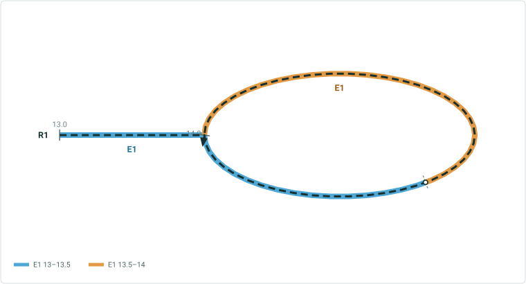

| Input Expected Result Expected Attribute Table without referent |
| --- |

| RouteID | From Location | To Location | From Offset | To Offset |
| --- | --- | --- | --- | --- |
| RS3 | Int13 | Int13 | N 1 | N 2 |

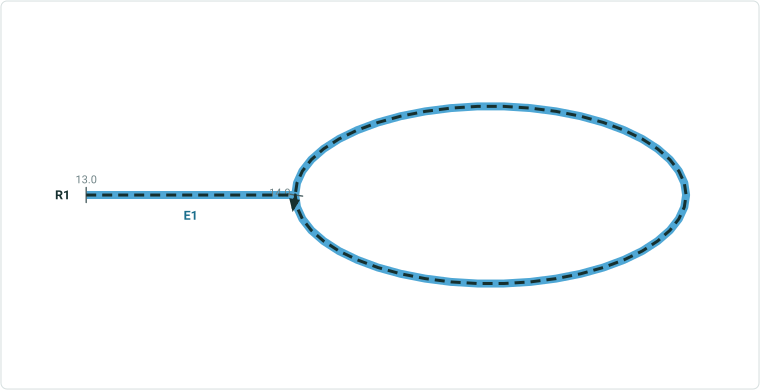

| LEID | RouteID | From Measure | To Measure | FromDate | ToDate | ExtraAttribute |
| --- | --- | --- | --- | --- | --- | --- |
| LES3 | RS3 | 13 | 14 | 1/1/2000 |  | Concrete |

 

## Slide 17 — 14. Alpha - line multiple LEs with negative offset

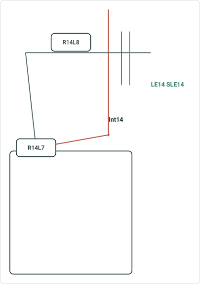

| Input Expected Result Expected Attribute Table with referent without referent |
| --- |

| RouteID | From Location | To Location | From Offset | To Offset |
| --- | --- | --- | --- | --- |
| R14 | Int14 | Int14 | -3 | -1 |

| LEID | RouteID | From Measure | To Measure | FromRefOffset | ToRefOffset | From Date | ToDate | ExtraAttribute |
| --- | --- | --- | --- | --- | --- | --- | --- | --- |
| LE14 | R14L7 | 1 | 3 | -3 | -1 | 1/1/2000 |  | Paved |

| LEID | RouteID | From Measure | To Measure | FromDate | ToDate | ExtraAttribute |
| --- | --- | --- | --- | --- | --- | --- |
| SLE14 | R14L7 | 1 | 3 | 1/1/2000 |  | Gravel |

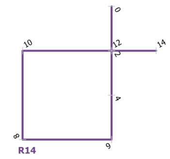 

## Slide 18 — 15. Alpha single LE with positive offset to N

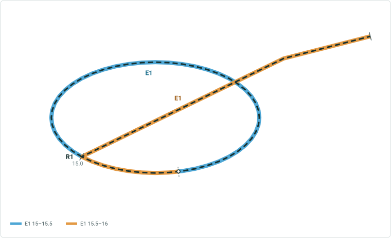

| Input Expected Result Expected Attribute Table with referent |
| --- |

| RouteID | From Location | To Location | From Offset | To Offset |
| --- | --- | --- | --- | --- |
| R15 | Int15 | Int15 | N 1 | N 2 |

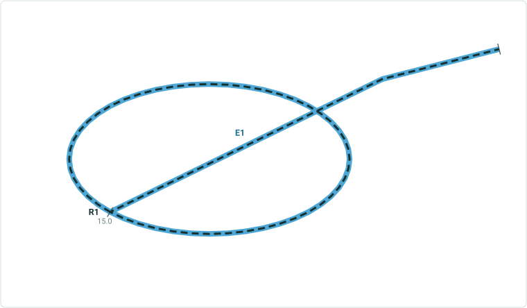

| LEID | RouteID | From Measure | To Measure | FromRefOffset | ToRefOffset | From Date | ToDate | ExtraAttribute |
| --- | --- | --- | --- | --- | --- | --- | --- | --- |
| LE15 | R15 | 15 | 16 | 1 | 2 | 1/1/2000 |  | Dirt |

EE doesn’t provide M options
EE doesn’t identify N to be the M-increasing direction when there is no cardinal direction


## Slide 19 — 16. Alpha multiple LE with positive offset


| Input Expected Result Expected Attribute Table with referent |
| --- |

| RouteID | From Location | To Location | From Offset | To Offset |
| --- | --- | --- | --- | --- |
| R16 | Int16 | Int16 | 13 | 14 |


| LEID | RouteID | From Measure | To Measure | FromRefOffset | ToRefOffset | From Date | ToDate | ExtraAttribute |
| --- | --- | --- | --- | --- | --- | --- | --- | --- |
| LE16 | R15 | 15 | 16 | 13 | 14 | 1/1/2000 |  | Dirt |
| SLE16 | R15 | 15 | 16 | 13 | 14 | 1/1/2000 |  | Paved |


## Slide 20 — 17A. Branch branches end in diff measures, single LE with positive offset

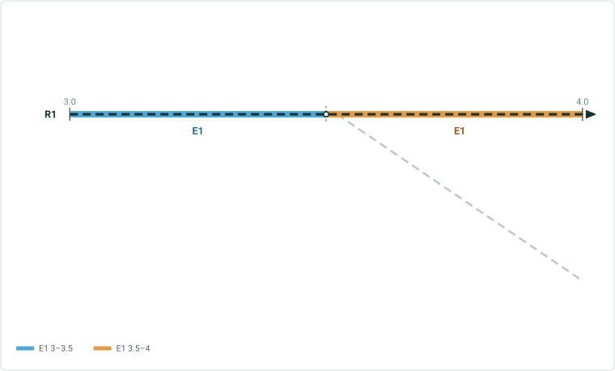

| Input Expected Result Expected Attribute Table with referent |
| --- |

| RouteID | From Location | To Location | From Offset | To Offset |
| --- | --- | --- | --- | --- |
| R17 | Int17 | Int17 | 2 | 3 |

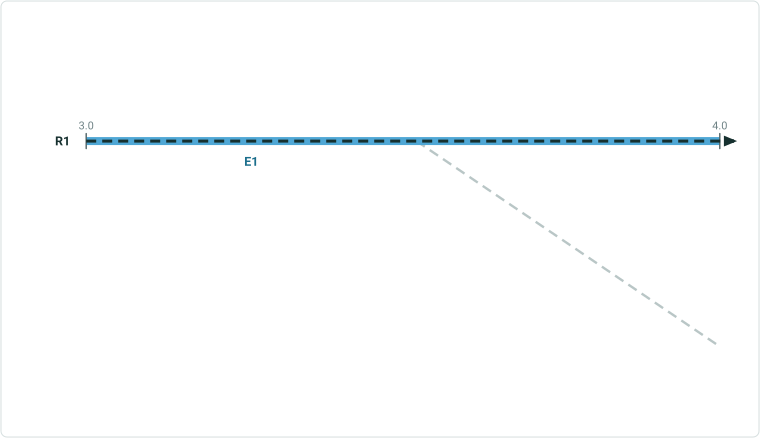

| LEID | RouteID | From Measure | To Measure | FromRefOffset | ToRefOffset | From Date | ToDate | ExtraAttribute |
| --- | --- | --- | --- | --- | --- | --- | --- | --- |
| LE17 | R17 | 3 | 4 | 2 | 3 | 1/1/2000 |  | Paved |

Int17
LE17


## Slide 21 — 17B. Branch branches end in diff measures, single LE with positive offset on lesser measure branch

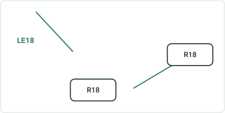

| Input Expected Result Expected Attribute Table with referent |
| --- |

| RouteID | From Location | To Location | From Offset | To Offset |
| --- | --- | --- | --- | --- |
| R18 | Int18 | Int18 | 2 | 4 |

| LEID | RouteID | From Measure | To Measure | FromRefOffset | ToRefOffset | From Date | ToDate | ExtraAttribute |
| --- | --- | --- | --- | --- | --- | --- | --- | --- |
| LE18 | R18 | 3 | 5 | 2 | 4 | 1/1/2000 |  | Paved |


## Slide 22 — 18. Branch - multif branches end in diff measures, multiple LEs with positive offset to N

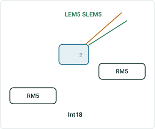

| Input Expected Result Expected Attribute Table without referent |
| --- |

| RouteID | From Location | To Location | From Offset | To Offset |
| --- | --- | --- | --- | --- |
| RM5 | Int18 | Int18 | N 3 | N 4 |

| PEID | RouteID | From Measure | To Measure | FromDate | ToDate | ExtraAttribute |
| --- | --- | --- | --- | --- | --- | --- |
| LEM5 | RM5 | 5 | 6 | 1/1/2000 |  | Paved |
| SLEM5 | RM5 | 5 | 6 | 1/1/2000 |  | Gravel |


## Slide 23 — 19. Vertical no cardinal direction, single LE with positive offset

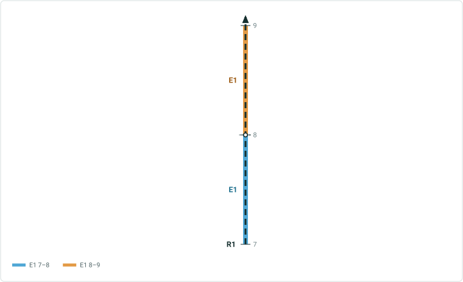

| Input Expected Result Expected Attribute Table with referent |
| --- |

| RouteID | From Location | To Location | From Offset | To Offset |
| --- | --- | --- | --- | --- |
| V19 | Int19 | Int19 | 2 | 4 |

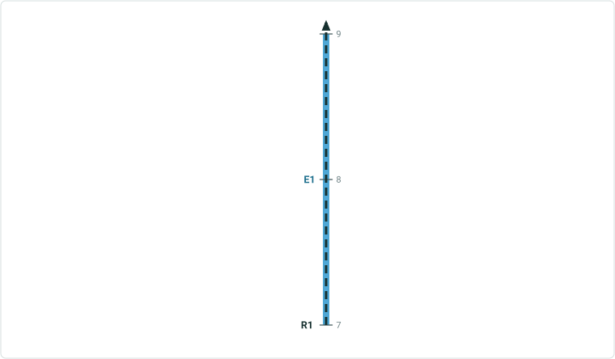

| LEID | RouteID | From Measure | To Measure | FromRefOffset | ToRefOffset | From Date | ToDate | ExtraAttribute |
| --- | --- | --- | --- | --- | --- | --- | --- | --- |
| LE19 | V19 | 7 | 9 | 2 | 4 | 1/1/2000 |  | Paved |


## Slide 24 — 20. Vertical no cardinal direction, single LE with positive offset to N


| Input Expected Result Expected Attribute Table with referent |
| --- |

| RouteID | From Location | To Location | From Offset | To Offset |
| --- | --- | --- | --- | --- |
| V20 | Int20 | Int20 | N 2 | N 4 |


| LEID | RouteID | From Measure | To Measure | FromRefOffset | ToRefOffset | From Date | ToDate | ExtraAttribute |
| --- | --- | --- | --- | --- | --- | --- | --- | --- |
| LE20 | V20 | 7 | 9 | 2 | 4 | 1/1/2000 |  | Paved |


## Slide 25 — 21. Vertical route bending, multiple LE with negative offset

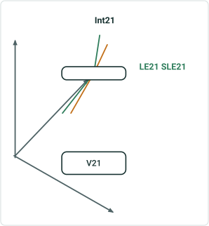

| Input Expected Result Expected Attribute Table with referent |
| --- |

| RouteID | From Location | To Location | From Offset | To Offset |
| --- | --- | --- | --- | --- |
| V21 | Int21 | Int21 | -7 | -2 |

Int21

V21

| LEID | RouteID | From Measure | To Measure | FromRefOffset | ToRefOffset | From Date | ToDate | ExtraAttribute |
| --- | --- | --- | --- | --- | --- | --- | --- | --- |
| LE21 | V21 | 3 | 8 | -7 | -2 | 1/1/2000 |  | Paved |
| SLE21 | V21 | 3 | 8 | -7 | -2 | 1/1/2000 |  | Gravel |

LE21
SLE21


## Slide 26 — 22. Simple Route single line event with positive offset, different intersections


| Input Expected Result Expected Attribute Table with referent |
| --- |

| RouteID | From Location | To Location | From Offset | To Offset |
| --- | --- | --- | --- | --- |
| R1 | Int22A | Int22B | 1 | 1 |

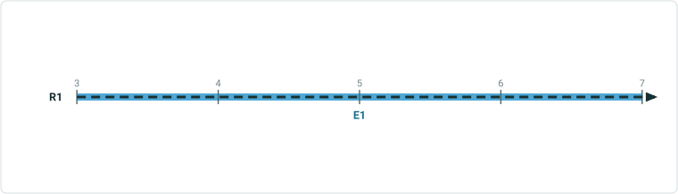

| LEID | RouteID | From Measure | To Measure | FromRefOffset | ToRefOffset | From Date | ToDate | Extra Attribute |
| --- | --- | --- | --- | --- | --- | --- | --- | --- |
| LE1 | R1 | 3 | 7 | 1 | 1 | 1/1/2000 |  | Paved |

Int22A
Int22B

| FromRefLocation | ToRefLocation |
| --- | --- |
| Int22A | Int22B |

 

## Slide 27 — 23. Simple Route single line event with positive offset, different methods


| Input: From Measure is Route and Measure, To Measure is Int Offset Expected Result Expected Attribute Table without referent |
| --- |

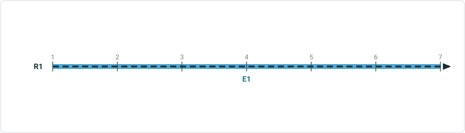

| RouteID | From Measure | To Location | To Offset |
| --- | --- | --- | --- |
| R1 | 1 | Int23 | 5 |

| LEID | RouteID | From Measure | To Measure | From Date | ToDate | Extra Attribute |
| --- | --- | --- | --- | --- | --- | --- |
| LE1 | R1 | 1 | 7 | 1/1/2000 |  | Paved |

Int23

 

## Slide 28 — 24. Simple Route, Line Network single spanning line event, different intersections

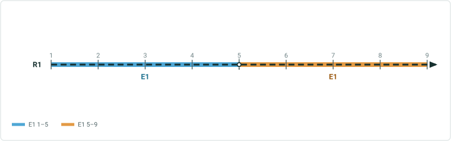

| Input Expected Result Expected Attribute Table with referent |
| --- |

| From RouteID | From Location | To RouteID | To Location | From Offset | To Offset |
| --- | --- | --- | --- | --- | --- |
| R1 | Int24A | R2 | Int24B | -2 | 2 |

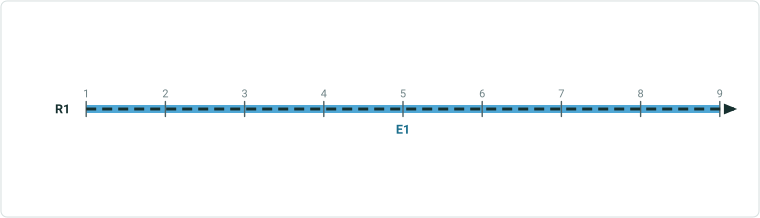

| LEID | From RouteID | To RouteID | From Measure | To Measure | FromRefOffset | ToRefOffset | From Date | To Date | ExtraAttribute |
| --- | --- | --- | --- | --- | --- | --- | --- | --- | --- |
| LE1 | R1 | R2 | 1 | 9 | -2 | 2 | 1/1/2000 |  | Dirt |

| FromRefLocation | ToRefLocation |
| --- | --- |
| Int24A | Int24B |


## Slide 29 — 1. Simple Route single LE with positive offset, exceeding the end measure

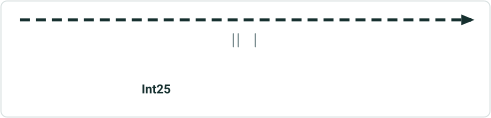

| Input Error message: (provided by Dev) |
| --- |

| RouteID | From/To Location | From Offset | To Offset |
| --- | --- | --- | --- |
| R24 | Int24 | 1 | 100 |

2. Simple Route
single LE with a negative offset to a specified direction W

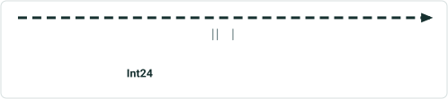

| Input Error message: (provided by Dev) |
| --- |

| RouteID | From/ ToLocation | From Offset | To Offset |
| --- | --- | --- | --- |
| R25 | Int25 | W -1 | E 4 |

 

## Slide 30 — 3. Loop multiple LEs with positive offset, exceeding the end measure

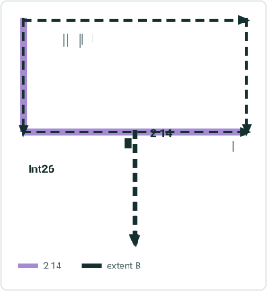

| Input |
| --- |

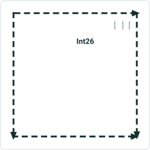

| Input |
| --- |

| RouteID | From/To Location | From Offset | To Offset |
| --- | --- | --- | --- |
| R26 | Int26 | 1 | 100 |

Error message: (provided by Dev)

4. Lollipop
single LE with a negative offset, exceeding the start measure

| RouteID | From/To Location | From Offset | To Offset |
| --- | --- | --- | --- |
| R27 | Int27 | -100 | 1 |

Error message: (provided by Dev)

 

## Slide 31 — 5. Alpha multiple LEs with negative offset, exceeding the start measure

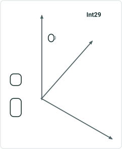

| Input |
| --- |

| Input |
| --- |

| RouteID | From/To Location | From Offset | To Offset |
| --- | --- | --- | --- |
| R28 | Int28 | -100 | 1 |

Error message: (provided by Dev)

6. Vertical
single LE with a positive offset to E, exceeding the end measure

| RouteID | From/To Location | From Offset | To Offset |
| --- | --- | --- | --- |
| V29 | Int29 | 1 | E 100 |

Error message: (provided by Dev)


## Slide 32 — 7. Gapped Route gapped measures, multiple LEs with negative offset, falling in gap

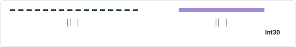

| Input Error message: (provided by Dev) |
| --- |

| RouteID | From/To Location | From Offset | To Offset |
| --- | --- | --- | --- |
| R30 | Int30 | -3 | -1 |

8. Gapped Route
provide non-numeric value in offset

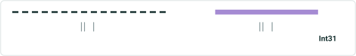

| Input Error message: (provided by Dev) |
| --- |

| RouteID | From/To Location | From Offset | To Offset |
| --- | --- | --- | --- |
| R31 | Int31 | B | C |


## Slide 33 — 9. Simple Route, Line Network single spanning line event, intersection offset spans onto another route

| Input Expected Result |
| --- |

| From RouteID | From Location | To RouteID | To Location | From Offset | To Offset |
| --- | --- | --- | --- | --- | --- |
| R1 | Int24A | R2 | Int24B | 3 | -3 |

Error message: (provided by Dev)

[figure: R1 · R2 · 0 · 5 · Int24B · 10 · Int24A]


