# Add Multiple Point Events

| Field | Value |
| --- | --- |
| **Doc** | 434 · Test Plan · Experience Builder |
| **Product** | — |
| **Release** | — |
| **Issues** | — |
| **Source** | [AddMulitiplePoint_Events_ExB.pptx](<https://esriis.sharepoint.com/sites/LocationReferencing/Shared%20Documents/General/Test%20Plans/AddMulitiplePoint_Events_ExB.pptx>) |
| **People** | author Rahul Rakshit · PE — · dev — |
| **Edited** | 2024-01-22 20:40 by Praveen Kumar |
| **Extracted** | 2026-09-04 · lane xmlstrip · format 3.0 · prompt v2.0.2 |
| **Keywords** | point event · event editing · attribute set · route picker · measure picker · error handling · timeslice |
| **Tools** | Add Multiple Point Events |

## Summary

Test plan for adding multiple point events in the Experience Builder widget. Covers configuration, layer and attribute set selection, route and measure validation, attribute editing, error handling, and various route types including simple, gap, loop, branch, infinity, vertical gap, and timeslice events.

## Related documents

<!-- related:begin -->
- [Add Multiple Point Events](<https://esriis.sharepoint.com/sites/lrsworkspace/LRS%20Doc%20Index/Test%20Plans/add-multiple-point-events-2022-04.md>) — similar text 0.82 · 4 title words · 4 filename words · same kind/folder <!-- rel:672 s=8.354 -->
- [Experience Builder: Add Single Point Event Widget](<https://esriis.sharepoint.com/sites/lrsworkspace/LRS Doc Index/Test Plans/exb-add-single-point-event-widget.md>) — similar text 0.45 · 2 title words · 2 filename words · same kind/surface/folder <!-- rel:463 s=5.696 -->
- [Add Point Events in Experience Builder](<https://esriis.sharepoint.com/sites/lrsworkspace/LRS Doc Index/User Stories/add-point-events-in-exb-2023-09-2.md>) — similar text 0.37 · 3 title words · 3 filename words · same surface <!-- rel:496 s=5.498 -->
- [Add Point Events in Experience Builder](<https://esriis.sharepoint.com/sites/lrsworkspace/LRS Doc Index/User Stories/add-point-events-in-exb-2023-09.md>) — similar text 0.38 · 3 title words · 3 filename words · same surface <!-- rel:495 s=5.341 -->
- [Add Point Event tool/ Add Multipoint Events tool Coordinate offset method – Test Plan](<https://esriis.sharepoint.com/sites/lrsworkspace/LRS Doc Index/Test Plans/3905-add-point-event-tool-add-multipoint-events-tool-coordinate.md>) — similar text 0.25 · 3 title words · 3 filename words · same kind/folder <!-- rel:638 s=5.066 -->
<!-- related:end -->

<!-- docs:begin -->
## Esri documentation

[Add multiple point events](https://doc.esri.com/en/arcgis-pro/latest/help/production/roads-highways/add-multiple-point-events.html) · [Event editing using the attribute table](https://doc.esri.com/en/arcgis-pro/latest/help/production/location-referencing-pipelines/event-editing-using-the-attribute-table.html) · [Set a time filter](https://doc.esri.com/en/arcgis-pro/latest/help/production/location-referencing-pipelines/set-a-time-filter.html)
<!-- docs:end -->

---

## Test Cases

### TC-U01 — Content page <!-- src: S5 · slide 1 · label Content page -->

**Steps:**
1. Verify the map dropdown lists all the maps from all the pages.
2. Verify any map can be selected from the list.
3. Click Load layers and verify all the Network and Point event layers from the selected map are imported.
4. Verify the reordering of the imported layers.
5. Verify the layer is removable using ‘x’ of the respective layer.
6. Changing map and importing again should clear present list of layers and import the Network layers from the new map.
7. Verify the Attribute Set dropdown lists all the attribute sets available in the service.
8. Verify any Attribute Set can be selected from the list to set as default attribute set.
9. Verify only ‘Single Point’ and ‘Multiple Points’ are available for Type dropdown.
10. Verify that “Multiple Points” can be set as default for Type.
11. Verify any method can be selected to set the default method for adding events.

### TC-U02 — Layer Configuration <!-- src: S5 · slide 2 · label Layer Configuration -->

**Steps:**
1. Verify that the layer configuration is displayed when a layer is selected.
2. Verify that the individual layer configuration does not affect the attribute set

### TC-N01 — Click on Import all button without selecting a map and verify an error message <!-- src: S4 · slide 2 · Negative · 1 -->

- **Case:** Click on Import all button without selecting a map and verify an error message is displayed.

### TC-N02 — Choose a map which does not have any layers and verify an error message <!-- src: S4 · slide 2 · Negative · 2 -->

- **Case:** Choose a map which does not have any layers and verify an error message is displayed.

### TC-N03 — Choose a map which does not have any LRS Network layers and verify an error <!-- src: S4 · slide 2 · Negative · 3 -->

- **Case:** Choose a map which does not have any LRS Network layers and verify an error message is displayed.

### TC-N04 — Choose a map which does not have any Point Event layers and verify an error <!-- src: S4 · slide 2 · Negative · 4 -->

- **Case:** Choose a map which does not have any Point Event layers and verify an error message is displayed.

### TC-N05 — Verify the error message if the map has layers from more than one service. <!-- src: S4 · slide 2 · Negative · 5 -->

### TC-N06 — User clicks Next without filling measure – verify error message (1) <!-- src: S4 · slide 2 · Negative · 6 -->

### TC-N07 — Verify error message when the routeid / route name / measures are invalid (1) <!-- src: S4 · slide 2 · Negative · 7 -->

### TC-N08 — Verify error message when from date is less than or equal to the to date (1) <!-- src: S4 · slide 2 · Negative · 8 -->

### TC-N09 — User clicks Next without filling measure – verify error message (2) <!-- src: S4 · slide 6 · Negative Tests · 1 -->

### TC-N10 — Verify error message when the routeid / route name / measures are invalid (2) <!-- src: S4 · slide 6 · Negative Tests · 2 -->

### TC-N11 — Verify error message when from date is less than or equal to the to date (2) <!-- src: S4 · slide 6 · Negative Tests · 3 -->

## Other content

### Slide 1 — Add Multiple Point Events <!-- slide 1 -->

Configuration

### Slide 2 — Add Multiple Point Events <!-- slide 2 -->

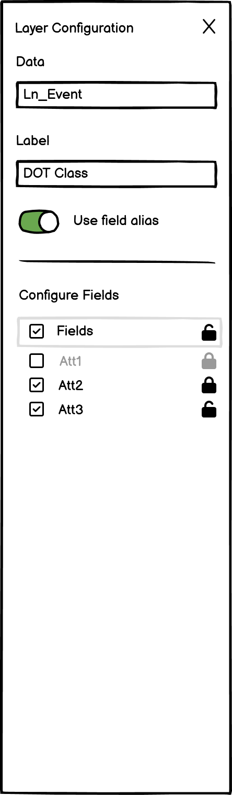

### Slide 3 — Add Multiple Point Events <!-- slide 3 -->

- Test with both Line, Non-line (single + multi field) Network.
- Type should be as per the settings from the configuration.
- Verify that the default method option is as per the settings from the configuration.
- Verify that the Attribute set is as per the settings from the configuration.
- Verify all other attribute sets are displayed in the dropdown when user clicks on the edit button (pencil) allow user to choose any desired one from the list.
- Verify that the Network is automatically set to the registered network of the selected attribute set.
- RouteID and Measure should be empty until the user types or select using the picker tools.
- Verify the route and measure values are correct when pickers interact with the route on map.
- Verify when a route is selected using picker, the measure value from that location is populated and vice versa.
- Verify that the measure units are set to the network units.
- Provide some measures in stationing format.
- Verify the ‘Route Name” is displayed instead of route id for the  network with route name configuration.
- Verify the route flashes 3 times, once it is chosen on the map using the route picker.
- Verify the green dot at that location, when a measure on a route is selected on the map using the measure picker.

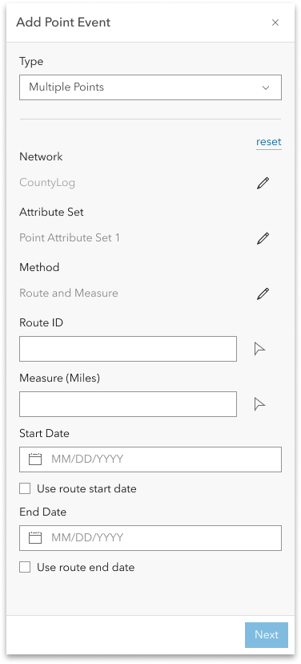

### Slide 4 — Add Multiple Point Events <!-- slide 4 -->

- Verify the intellisense experience for RouteID/Name
- Verify that the route selector UI is shown when the user clicks a location with the route picker that has more than one route at that location.
- Verify that the measures can be typed in.
- Provide a measure with 7 decimal places where only 3 decimal places are allowed and verify that the measure is truncated properly.
- Verify the snapping with route and measure picker.
- Verify that the Start Date text box is populated with the current date by default & empty End Date
- Verify the Start date is set  with the route start date, When use route start date is checked
- Verify the End date is set  with the route end date, When use route End date is checked
- Test with different Attribute sets (default and custom).
- Make sure coded value domains, range domains, subtypes, non-nullable fields, and default values for any fields where applicable are honored.
- Verify, routes listed in the selector should be filtered based on the timeline settings of the map.
- Verify, user should not be able to change the network until the measure translation is supported.
- Verify the routeid \ routename\ measure exists in the provided date and are validated.
- Verify after providing all the information and clicking on Next button takes to 2nd pane.
- Verify the cross will clear the value in the routename/ routid.

### Slide 5 — Add Multiple Point Events <!-- slide 5 -->

- Make sure the attribute fields as per the configuration settings of the attribute set.
- Verify user can enter\edit values for the editable fields.
- Verify, coded value domains, range domains, subtypes, non-nullable fields, attribute rules, contingent values and default values for any fields work as expected.
- Verify that if the checkbox for any layer is not checked, then the event is not added in it.
- If the user clicks Save, make sure a confirmation message appears and edit goes through!.
- Verify once the operation is complete, the 2nd pane transitions back to the initial pane.
- If the user clicks Back, go back to the previous step make sure entered values are preserved.
- If any fields are not populated correctly, make sure appropriate error for the field(s) is displayed, that need to be updated.
- Verify when hovered on the field, description is displayed.
- Copy the attributes from existing feature and verify the values.
- Ensure that the attributes are not copied for unchecked layer.
- Verify the Toggle all layers on \ off with ctrl and click on any layer checkbox.

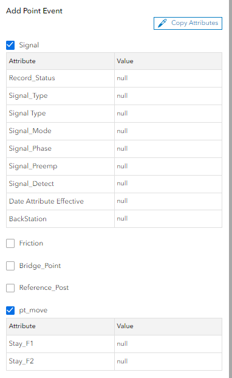

### Slide 6 <!-- slide 6 -->

Other Tests

- Add a test scenario where an attribute rule is violated and make sure an appropriate error message is returned.
- Test on projected and unprojected data.
- Test on different themes.
- Test adding a point event on a variety of route types (Normal, Gapped, Complex and Vertical
- 508 testing .
- i18n testing.

### Slide 7 — Simple Route Point Events <!-- slide 7 -->

| Event Layer | RouteId | EventId | FromDate | To Date | Measure | Loc Error |
| --- | --- | --- | --- | --- | --- | --- |
| Layer1 | PR1 | E1 | 1/1/2000 |  | 8 | No Error |
| Layer2 | PR1 | E2 | 1/1/2000 |  | 8 | No Error |
| Layer3 | PR1 | E3 | 1/1/2000 |  | 8 | No Error |

[figure: 0 · 10 · E1 · E2 · E3 · PR1]

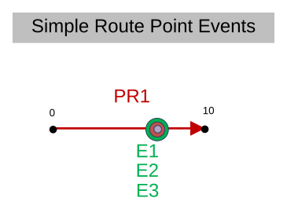

### Slide 8 — Gap Route Point Events <!-- slide 8 -->

| Event Layer | RouteId | EventId | FromDate | To Date | Measure | Loc Error |
| --- | --- | --- | --- | --- | --- | --- |
| Layer1 | PR11 | E11 | 1/1/2000 |  | 4 | No Error |
| Layer2 | PR11 | E12 | 1/1/2000 |  | 4 | No Error |
| Layer3 | PR11 | E13 | 1/1/2000 |  | 4 | No Error |
| Layer1 | PR11 | E14 | 1/1/2000 |  | 4.1 | No Error |
| Layer2 | PR11 | E15 | 1/1/2000 |  | 4.1 | No Error |
| Layer3 | PR11 | E16 | 1/1/2000 |  | 4.1 | No Error |
| Layer1 | PR11 | E17 | 1/1/2000 |  | 6 | No Error |
| Layer2 | PR11 | E18 | 1/1/2000 |  | 6 | No Error |
| Layer3 | PR11 | E19 | 1/1/2000 |  | 6 | No Error |

[figure: 8.1 · 0 · 4.1 · 4 · E11 · PR11 · E12 · E13 · E14 · E15 · E18 · E19 · E16]

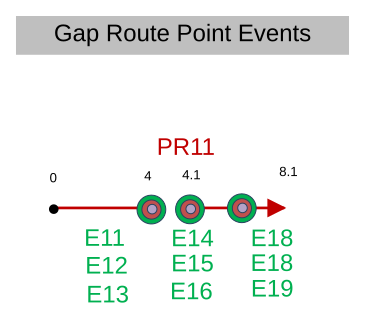

### Slide 9 — Loop Route Point Events <!-- slide 9 -->

| Event Layer | RouteId | EventId | FromDate | To Date | Measure | Loc Error |
| --- | --- | --- | --- | --- | --- | --- |
| Layer1 | PR21 | E21 | 1/1/2000 |  | 4 | No Error |
| Layer2 | PR21 | E22 | 1/1/2000 |  | 4 | No Error |
| Layer3 | PR21 | E23 | 1/1/2000 |  | 4 | No Error |
| Layer1 | PR21 | E24 | 1/1/2000 |  | 2.5 | No Error |
| Layer2 | PR21 | E25 | 1/1/2000 |  | 2.5 | No Error |
| Layer3 | PR21 | E26 | 1/1/2000 |  | 2.5 | No Error |

[figure: 0 · 4 · 1.33 · 2.67 · E21 · PR21 · E22 · E23]

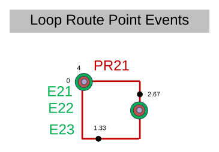

### Slide 10 <!-- slide 10 -->

| Event Layer | RouteId | EventId | FromDate | To Date | Measure | Loc Error |
| --- | --- | --- | --- | --- | --- | --- |
| Layer1 | PR31 | E31 | 1/1/2000 |  | 6 | No Error |
| Layer2 | PR31 | E32 | 1/1/2000 |  | 6 | No Error |
| Layer3 | PR31 | E33 | 1/1/2000 |  | 6 | No Error |

[figure: Branch Point Events · 6 · 4 · 0 · PR31 · E33 · E31 · E32]

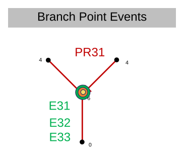

### Slide 11 <!-- slide 11 -->

| Event Layer | RouteId | EventId | FromDate | To Date | Measure | Loc Error |
| --- | --- | --- | --- | --- | --- | --- |
| Layer1 | PR41 | E41 | 1/1/2000 |  | 6 | No Error |
| Layer2 | PR41 | E42 | 1/1/2000 |  | 6 | No Error |
| Layer3 | PR41 | E43 | 1/1/2000 |  | 6 | No Error |

[figure: 0 · 8 · 4.33 · 5.67 · 1.5 · 7.5 · Infinity Point Events · PR41 · E42 · E41 · E43]

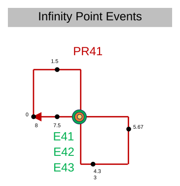

### Slide 12 — Vertical Gap Route Point Events <!-- slide 12 -->

| Event Layer | RouteId | EventId | FromDate | To Date | Measure | Loc Error |
| --- | --- | --- | --- | --- | --- | --- |
| Layer1 | PR51 | E51 | 1/1/2000 |  | 2 | No Error |
| Layer2 | PR51 | E52 | 1/1/2000 |  | 2 | No Error |
| Layer3 | PR51 | E53 | 1/1/2000 |  | 2 | No Error |
| Layer1 | PR51 | E54 | 1/1/2000 |  | 9 | No Error |
| Layer2 | PR51 | E55 | 1/1/2000 |  | 9 | No Error |
| Layer3 | PR51 | E56 | 1/1/2000 |  | 9 | No Error |

[figure: PR51 · E51 · E52 · E53 · E54 · E55 · E56]

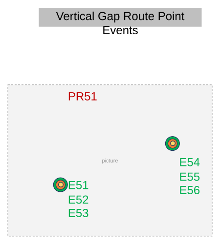

### Slide 13 — Line Network Point Events <!-- slide 13 -->

| Event Layer | RouteId | EventId | FromDate | To Date | Measure | Loc Error |
| --- | --- | --- | --- | --- | --- | --- |
| Layer1 | R24L2 | E91 | 1/1/2000 |  | 15 | No Error |
| Layer2 | R24L2 | E92 | 1/1/2000 |  | 15 | No Error |
| Layer3 | R24L2 | E93 | 1/1/2000 |  | 15 | No Error |
| Layer1 | R25L2 | E94 | 1/1/2000 |  | 2 | No Error |
| Layer2 | R25L2 | E95 | 1/1/2000 |  | 2 | No Error |
| Layer3 | R25L2 | E96 | 1/1/2000 |  | 2 | No Error |

[figure: R23L2 · 1 · 2 · 15 · 20 · R24L2 · R25L2 · 0 · E91 · E94 · E92 · E93 · E95 · E96]

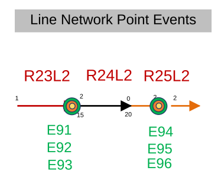

### Slide 14 — Point Events – Timeslice <!-- slide 14 -->

| Event Layer | RouteId | EventId | FromDate | To Date | Measure | Loc Error |
| --- | --- | --- | --- | --- | --- | --- |
| Layer1 | PR101 | E101 | 1/1/2000 | 1/1/2010 | 16 | No Error |
| Layer2 | PR101 | E102 | 1/1/2000 | 1/1/2010 | 16 | No Error |
| Layer3 | PR101 | E103 | 1/1/2000 | 1/1/2010 | 16 | No Error |
| Layer1 | PR101 | E101 | 1/1/2010 | 1/1/2015 | 16 | No Error |
| Layer2 | PR101 | E102 | 1/1/2010 | 1/1/2015 | 16 | No Error |
| Layer3 | PR101 | E103 | 1/1/2010 | 1/1/2015 | 16 | No Error |

Event dates from 1/1/2000 to 1/1/2015

[figure: 18 · 10 · 14.1 · 14 · E101 · PR101 · 18.1 · 22 · 1/1/2000 · 1/1/2020 · 1/1/2010 · E102 · E103]

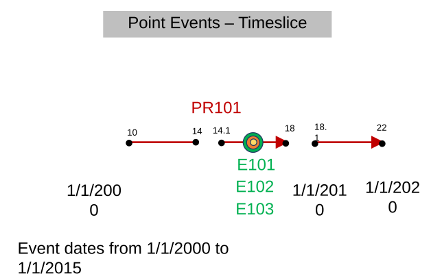
