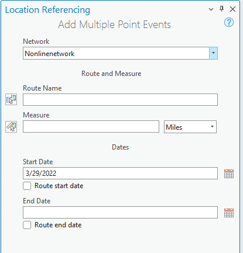
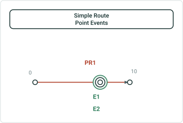
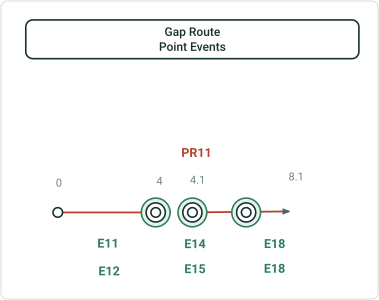
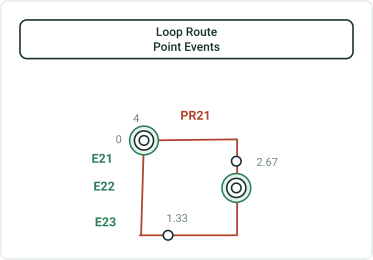
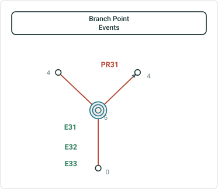
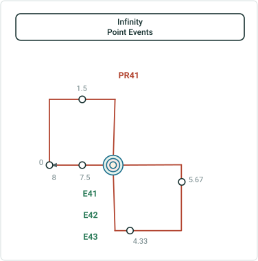
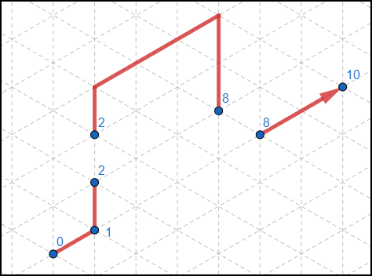
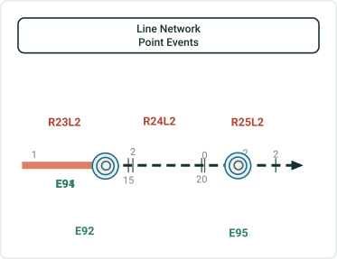
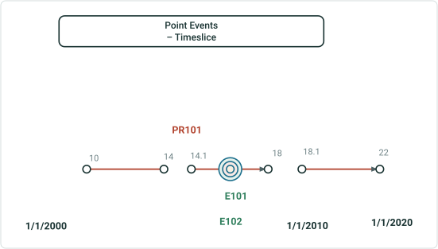

# Add Multiple Point Events

|   |   |
| --- | --- |
| **Kind** | Test Plan · Pro |
| **Release** | — |
| **Source** | [AddMulitiplePoint_Events_Pro.pptx](<https://esriis.sharepoint.com/sites/LocationReferencing/Shared%20Documents/General/Test%20Plans/AddMulitiplePoint_Events_Pro.pptx>) |
| **Edited** | 2022-04-06 18:32 by Praveen Kumar |
| **Extracted** | 2026-09-04 · lane `xmlstrip` |

<!-- metadata
```yaml
title: "Add Multiple Point Events"
source_file: "AddMulitiplePoint_Events_Pro.pptx"
source_url: "https://esriis.sharepoint.com/sites/LocationReferencing/Shared%20Documents/General/Test%20Plans/AddMulitiplePoint_Events_Pro.pptx"
doc_id: 672
doc_kind: "Test Plan"
surface: "Pro"
doc_revision: ""
target_release: ""
pe: ""
dev: ""
author: "Rahul Rakshit"
last_edited_by: "Praveen Kumar"
last_edited: "2022-04-06T18:32:14Z"
extracted: 2026-09-04
extraction_lane: xmlstrip
prompt_version: "v2.0.2"
keywords: ["point event", "route", "measure", "attribute set", "feature service", "error handling", "event dates"]
tools: []
products: []
issues: []
related: [{"doc":434,"file":"add-multiple-point-events__doc434.md","s":8.352},{"doc":638,"file":"add-point-event-tool-add-multipoint-events-tool-coordinate-offset-method-test__doc638.md","s":5.793},{"doc":669,"file":"create-multiple-line-events-test-plan__doc669.md","s":5.351},{"doc":463,"file":"experience-builder-add-single-point-event-widget__doc463.md","s":4.595},{"doc":685,"file":"add-multiple-point-events-tool-in-arcgis-pro__doc685.md","s":4.147}]
```
-->

## Summary

Test plan for adding multiple point events in ArcGIS Pro feature services. It includes tests for route and measure selection, attribute sets, error handling, unit validation, and event date management across different network configurations and event types.

## Related documents

<!-- related:begin -->
- [Add Multiple Point Events](<https://esriis.sharepoint.com/sites/lrsworkspace/LRS Doc Index/Test Plans/add-multiple-point-events__doc434.md>) — similar text 0.82 · 4 title words · 4 filename words · same kind/folder <!-- rel:434 -->
- [Add Point Event tool/ Add Multipoint Events tool Coordinate offset method – Test Plan](<https://esriis.sharepoint.com/sites/lrsworkspace/LRS Doc Index/Test Plans/add-point-event-tool-add-multipoint-events-tool-coordinate-offset-method-test__doc638.md>) — similar text 0.22 · 3 title words · 3 filename words · same kind/surface/folder <!-- rel:638 -->
- [Create multiple line events: Test Plan](<https://esriis.sharepoint.com/sites/lrsworkspace/LRS Doc Index/Test Plans/create-multiple-line-events-test-plan__doc669.md>) — similar text 0.30 · 2 title words · 2 filename words · same kind/surface/folder <!-- rel:669 -->
- [Experience Builder: Add Single Point Event Widget](<https://esriis.sharepoint.com/sites/lrsworkspace/LRS Doc Index/Test Plans/experience-builder-add-single-point-event-widget__doc463.md>) — similar text 0.31 · 2 title words · 2 filename words · same kind/folder <!-- rel:463 -->
- [Add Multiple Point Events tool in ArcGIS Pro](<https://esriis.sharepoint.com/sites/lrsworkspace/LRS Doc Index/User Stories/add-multiple-point-events-tool-in-arcgis-pro__doc685.md>) — similar text 0.15 · 4 title words · 2 filename words · same surface <!-- rel:685 -->
<!-- related:end -->

<!-- docs:begin -->
## Esri documentation

[Split a centerline by measure](https://doc.esri.com/en/arcgis-pro/latest/help/production/location-referencing-pipelines/split-a-centerline-by-measure.html) · [Edit feature services](https://doc.esri.com/en/arcgis-pro/latest/help/production/location-referencing-pipelines/edit-feature-services.html)
<!-- docs:end -->

---

## Slide 1 — Add Multiple Point Events


- Test in Feature Service only.
- Test in Line and Non-line Network.
- Test with different Attribute sets (default and custom).
- Verify that the Network dropdown contains only the networks available in the map.
- Verify that the No Network is selected initially.
- Verify the route flashes 3 times, Once it is chosen on the map using the route picker
- Verify the ‘Route Name” is displayed instead of route id for the events configured with route name
- RouteID / Route Name and Measure should be empty until the user types or select using the picker tools.
- Verify that the route selector UI is shown when the user clicks a location with the route picker that has more than one route at that location
- Verify that the route selector UI is shown when the user types in a RouteId/Name which has more than one timeslices.
- Click at a location where no route exists using the picker tools and verify that route name is not populated.
- Verify the route and measure are displayed on hover when the user selects either the Route or Measure pickers to interact with the map.
- Verify that the measure picker is shown when the user picks a location where we have multiple measures.
- Verify that the measures can be typed in.
- Provide a measure with 20 decimal places where only 7 decimal places are allowed and verify that the measure is truncated properly.
- Verify the snapping with route and measure picker.
- Using measure picker click on a route which is not provided and ensure that the measure is not populated.
- Verify that the measure units are set to the network units.
- Provide some measures in stationing format.
- Before selecting the route name or measure, change the units to meters and pick the route and measure values and ensure that the measures units are not changed.
- Wrt the test above change the units to miles, do not change the measure value and validate the value on the units of miles.
- Verify the green/red dot at the location, when a measure on a route is selected on the map using the measure picker.
- Verify that the Effective Date text box is populated with the current date.
- By default, End Date should be empty.
- Test with and without additional attributes for the event fields
- 508 / i18n testing.
- Make sure coded value domains, range domains, subtypes, non nullable fields, and default values for any fields where applicable are honored.
- Test with Contingent values.
- Test with different Attribute rules.

 

## Slide 2

| No | Test | Expected Result | Error Message |
| --- | --- | --- | --- |
| 1 | Type a route which is not available in the network and verify the error message. | Provide an error | The Route ID could not be validated. |
| 2 | Provide invalid measures and verify the error message. | Provide an error | Invalid measure. |
| 3 | Verify proper error message is displayed if the user provides only end date. | Provide an error | Please enter a start date. |
| 4 | Verify proper error message is displayed if the user do not provide any dates. | Provide an error | Please enter a start date. |
| 5 | Verify proper error message is displayed if the user clicks on without providing any values. | Provide an error | Please enter the Route Name. |
| 6 |  |  |  |

| Attribute set Type | Contains Events from | Network in second pane | Result |
| --- | --- | --- | --- |
| Point | Single Network (N1) | Same Network (N1) | Add Events |
| Point | Single Network (N1) | Different Network (N2) | No Events to add - error message |
| Point | Multiple Networks (N1,N2) | Network (N1) | Add Events for layers registered with N1 only |
| Point | Multiple Networks (N1,N2) | Network (N2) | Add Events for layers registered with N2 only |
| Point | Single Network (N1) – Only one Event layer in the attribute set | Same Network (N1) | Add Events |
|  |  |  |  |
|  |  |  |  |

Error message verification
Network and attribute set combination tests

## Slide 3

Simple Route Point Events



| Event Layer | RouteId | EventId | FromDate | To Date | Measure | Loc Error |
| --- | --- | --- | --- | --- | --- | --- |
| Layer1 | PR1 | E1 | 1/1/2000 |  | 8 | No Error |
| Layer2 | PR1 | E2 | 1/1/2000 |  | 8 | No Error |
| Layer3 | PR1 | E3 | 1/1/2000 |  | 8 | No Error |

## Slide 4

Gap Route Point Events



| Event Layer | RouteId | EventId | FromDate | To Date | Measure | Loc Error |
| --- | --- | --- | --- | --- | --- | --- |
| Layer1 | PR11 | E11 | 1/1/2000 |  | 4 | No Error |
| Layer2 | PR11 | E12 | 1/1/2000 |  | 4 | No Error |
| Layer3 | PR11 | E13 | 1/1/2000 |  | 4 | No Error |
| Layer1 | PR11 | E14 | 1/1/2000 |  | 4.1 | No Error |
| Layer2 | PR11 | E15 | 1/1/2000 |  | 4.1 | No Error |
| Layer3 | PR11 | E16 | 1/1/2000 |  | 4.1 | No Error |
| Layer1 | PR11 | E17 | 1/1/2000 |  | 6 | No Error |
| Layer2 | PR11 | E18 | 1/1/2000 |  | 6 | No Error |
| Layer3 | PR11 | E19 | 1/1/2000 |  | 6 | No Error |

## Slide 5

Loop Route Point Events



| Event Layer | RouteId | EventId | FromDate | To Date | Measure | Loc Error |
| --- | --- | --- | --- | --- | --- | --- |
| Layer1 | PR21 | E21 | 1/1/2000 |  | 4 | No Error |
| Layer2 | PR21 | E22 | 1/1/2000 |  | 4 | No Error |
| Layer3 | PR21 | E23 | 1/1/2000 |  | 4 | No Error |
| Layer1 | PR21 | E24 | 1/1/2000 |  | 2.5 | No Error |
| Layer2 | PR21 | E25 | 1/1/2000 |  | 2.5 | No Error |
| Layer3 | PR21 | E26 | 1/1/2000 |  | 2.5 | No Error |

## Slide 6



| Event Layer | RouteId | EventId | FromDate | To Date | Measure | Loc Error |
| --- | --- | --- | --- | --- | --- | --- |
| Layer1 | PR31 | E31 | 1/1/2000 |  | 6 | No Error |
| Layer2 | PR31 | E32 | 1/1/2000 |  | 6 | No Error |
| Layer3 | PR31 | E33 | 1/1/2000 |  | 6 | No Error |

## Slide 7



| Event Layer | RouteId | EventId | FromDate | To Date | Measure | Loc Error |
| --- | --- | --- | --- | --- | --- | --- |
| Layer1 | PR41 | E41 | 1/1/2000 |  | 6 | No Error |
| Layer2 | PR41 | E42 | 1/1/2000 |  | 6 | No Error |
| Layer3 | PR41 | E43 | 1/1/2000 |  | 6 | No Error |

## Slide 8

| Event Layer | RouteId | EventId | FromDate | To Date | Measure | Loc Error |
| --- | --- | --- | --- | --- | --- | --- |
| Layer1 | PR51 | E51 | 1/1/2000 |  | 2 | No Error |
| Layer2 | PR51 | E52 | 1/1/2000 |  | 2 | No Error |
| Layer3 | PR51 | E53 | 1/1/2000 |  | 2 | No Error |
| Layer1 | PR51 | E54 | 1/1/2000 |  | 9 | No Error |
| Layer2 | PR51 | E55 | 1/1/2000 |  | 9 | No Error |
| Layer3 | PR51 | E56 | 1/1/2000 |  | 9 | No Error |

Vertical Gap Route Point Events

[figure: PR51 · E51 · E52 · E53 · E54 · E55 · E56]



## Slide 9



| Event Layer | RouteId | EventId | FromDate | To Date | Measure | Loc Error |
| --- | --- | --- | --- | --- | --- | --- |
| Layer1 | R24L2 | E91 | 1/1/2000 |  | 15 | No Error |
| Layer2 | R24L2 | E92 | 1/1/2000 |  | 15 | No Error |
| Layer3 | R24L2 | E93 | 1/1/2000 |  | 15 | No Error |
| Layer1 | R25L2 | E94 | 1/1/2000 |  | 2 | No Error |
| Layer2 | R25L2 | E95 | 1/1/2000 |  | 2 | No Error |
| Layer3 | R25L2 | E96 | 1/1/2000 |  | 2 | No Error |

Line Network Point Events

## Slide 10

Point Events – Timeslice



| Event Layer | RouteId | EventId | FromDate | To Date | Measure | Loc Error |
| --- | --- | --- | --- | --- | --- | --- |
| Layer1 | PR101 | E101 | 1/1/2000 | 1/1/2010 | 16 | No Error |
| Layer2 | PR101 | E102 | 1/1/2000 | 1/1/2010 | 16 | No Error |
| Layer3 | PR101 | E103 | 1/1/2010 | 1/1/2010 | 16 | No Error |
| Layer1 | PR101 | E101 | 1/1/2000 | 1/1/2015 | 16 | No Error |
| Layer2 | PR101 | E102 | 1/1/2000 | 1/1/2015 | 16 | No Error |
| Layer3 | PR101 | E103 | 1/1/2010 | 1/1/2015 | 16 | No Error |

Event dates from 1/1/2000 to 1/1/2015
