# Add Point Event to Dominant Route in ArcGIS Pro – Test Plan

|   |   |
| --- | --- |
| **Kind** | Test Plan · Pro |
| **Release** | — |
| **Product** | Roads & Highways |
| **Issue** | [ArcGISPro/ps-location-referencing#3916](https://devtopia.esri.com/ArcGISPro/ps-location-referencing/issues/3916) |
| **Source** | [AddPointDominantRt_testplan2.pptx](<https://esriis.sharepoint.com/sites/LocationReferencing/Shared%20Documents/General/Test%20Plans/AddPointDominantRt_testplan2.pptx>) |
| **Edited** | 2024-06-20 21:51 by Claire Wang |
| **Extracted** | 2026-09-04 · lane `xmlstrip` |

<!-- metadata
```yaml
title: "Add Point Event to Dominant Route in ArcGIS Pro – Test Plan"
source_file: "AddPointDominantRt_testplan2.pptx"
source_url: "https://esriis.sharepoint.com/sites/LocationReferencing/Shared%20Documents/General/Test%20Plans/AddPointDominantRt_testplan2.pptx"
doc_id: 360
doc_kind: "Test Plan"
surface: "Pro"
doc_revision: ""
target_release: ""
pe: "Claire Wang"
dev: "Eric"
author: "Lakshmi Ananthanarayanan"
last_edited_by: "Claire Wang"
last_edited: "2024-06-20T21:51:52Z"
extracted: 2026-09-04
extraction_lane: xmlstrip
prompt_version: "v2.0.2"
keywords: ["dominant route", "point event", "concurrency", "route dominancy", "temporal concurrency", "spatial concurrency", "conflict prevention"]
tools: ["Add Point Event", "Add Multiple Point Event"]
products: ["Roads & Highways"]
issues: ["ArcGISPro/ps-location-referencing#3916"]
related: [{"doc":358,"file":"add-line-event-to-dominant-route-in-arcgis-pro-test-plan__doc358.md","s":7.252},{"doc":169,"file":"add-point-and-non-spanning-line-event-to-dominant-route-in-experience-builder__doc169.md","s":6.894},{"doc":278,"file":"consider-route-dominance-in-append-events-test-plan__doc278.md","s":5.403},{"doc":279,"file":"consider-route-dominance-in-append-events-add-method-test-plan__doc279.md","s":5.249},{"doc":370,"file":"add-line-event-to-dominant-route-in-arcgis-pro__doc370.md","s":5.054}]
```
-->

## Summary

Test plan for enhancing the Add Point and Multiple Point Event tools in ArcGIS Pro to support adding events on the dominant route using concurrency logic. It includes verification of UI elements, concurrency pane behavior, conflict prevention, and testing across various route shapes and concurrency scenarios including spatial and temporal slices. Positive test cases cover multiple route types and concurrency conditions.

## Related documents

<!-- related:begin -->
- [Add Line Event to Dominant Route in ArcGIS Pro – Test Plan](<https://esriis.sharepoint.com/sites/lrsworkspace/LRS Doc Index/Test Plans/add-line-event-to-dominant-route-in-arcgis-pro-test-plan__doc358.md>) — similar text 0.28 · 5 title words · 3 filename words · same kind/surface/folder <!-- rel:358 -->
- [Add Point and non-Spanning Line Event to Dominant Route in Experience Builder – Test Plan](<https://esriis.sharepoint.com/sites/lrsworkspace/LRS Doc Index/Test Plans/add-point-and-non-spanning-line-event-to-dominant-route-in-experience-builder__doc169.md>) — similar text 0.35 · 5 title words · 3 filename words · same kind/folder <!-- rel:169 -->
- [Consider Route Dominance in Append Events Test Plan](<https://esriis.sharepoint.com/sites/lrsworkspace/LRS Doc Index/Test Plans/consider-route-dominance-in-append-events-test-plan__doc278.md>) — similar text 0.24 · 1 title word · 2 filename words · same kind/folder <!-- rel:278 -->
- [Consider Route Dominance in Append Events (add method) – Test Plan](<https://esriis.sharepoint.com/sites/lrsworkspace/LRS Doc Index/Test Plans/consider-route-dominance-in-append-events-add-method-test-plan__doc279.md>) — similar text 0.32 · 2 title words · 2 filename words · same kind/surface/folder <!-- rel:279 -->
- [Add Line Event to Dominant Route in ArcGIS Pro](<https://esriis.sharepoint.com/sites/lrsworkspace/LRS Doc Index/User Stories/add-line-event-to-dominant-route-in-arcgis-pro__doc370.md>) — similar text 0.34 · 5 title words · 2 filename words · same surface <!-- rel:370 -->
<!-- related:end -->

<!-- docs:begin -->
## Esri documentation

[Conflict prevention](https://doc.esri.com/en/arcgis-pro/latest/help/production/roads-highways/conflict-prevention.html)

_No page matched:_ [Add Point Event](https://www.google.com/search?q=%22Add%20Point%20Event%22+site%3Adoc.esri.com) · [Add Multiple Point Event](https://www.google.com/search?q=%22Add%20Multiple%20Point%20Event%22+site%3Adoc.esri.com)
<!-- docs:end -->

---

## Slide 1 — Add Point Event to Dominant Route in ArcGIS Pro – Test Plan

https://devtopia.esri.com/ArcGISPro/ps-location-referencing/issues/3916

PE: Claire Wang
Dev: Eric

## Slide 2

These columns are removed so the other 2 columns should be wider to take up the space

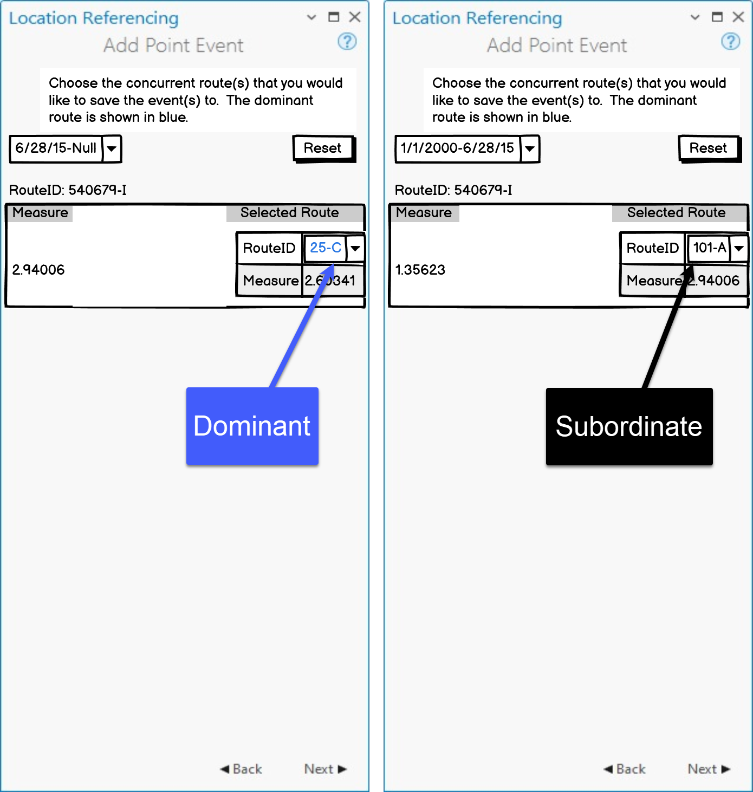

## Slide 3

Test

- Enhance Add Point and Multiple Point Event tools to be able to add events on dominant route
- Add a checkbox “Add event(s) to dominant route” Add Point Event(s) UI
  - Default is unchecked
  - When checked, use the concurrency logic (spatial and temporal) to identify the dominant route at the event location
    - If there is no concurrency, tool continues to the attribute pane
    - If there is concurrency, show the new pane
    - Perform any validations like we do today
- Test with RH (multifield RID), APRGCS, and a few cases in Address Data
- Test in FS
- Test normal and complex shapes
  - Test with self-intersections where multiple measures exist
- Test with spatial (routes fully/partially/not overlap) and temporal (time slices) concurrencies
  - Sanity test a few where there is no concurrency
  - Test scenarios where there are concurrencies across multiple time slices and the primary/dominant route changes over time
- Test conflict prevention
  - For Add Point, acquire the locks when next is clicked on this pane
  - For Add Multiple Points, continue to acquire on the attributes pane
- Test dark mode especially for the colors in the new pane

## Slide 4

Test – Don’t allow override of event placement on dominant routes

- By default, “Don’t allow override of event placement on dominant routes” box is unchecked
- If “Don’t allow override of event placement on dominant routes” is checked, and “Add event to dominant route” box is also checked, the concurrency pane does not show – we automatically add events on dominant route
- If “Don’t allow override of event placement on dominant routes” is checked but “Add event to dominant route” box is unchecked, do what it does today (add events onto selected route)
- If “Don’t allow override of event placement on dominant routes” is unchecked – do whatever “Add event to dominant route” box says (show concurrency pane when it’s checked; add events onto selected route when it’s unchecked)


## Slide 5

New pane requires

- A paragraph about what this pane does shows up under tool title
- Then, a time dropdown for the temporal concurrencies
  - By default, show the earliest time slice
  - If there is only 1 temporal concurrency, disable (grey) the dropdown
  - If there is no concurrency in one of the time slices, we still show the time slice but only a non-editable black label for selected Route
- A Reset button to the right of time dropdown to reset the options in the drop downs to what was returned by the concurrency logic
- Under time dropdown, the route ID/Name label from the first pane
- A grid of spatial concurrencies
  - 2 columns: Measure and Route selection
  - Measure is the measure on the route in the first pane for the chosen time slice. It does not change.
  - Route selection has 2 elements: RouteID/Name and Measure
    - Show the RouteID/Name with a drop down. The default should be the dominant/primary route.
    - The primary/dominant route is in blue. The non primary/dominant route is in black.
    - The measure goes with the selected Route. It is always in black
- A label of unit of measure under the grid. This unit comes from the second pane.
- When the user clicks next, transition to the 4th pane with the attributes

| Measure | Selected Route |  |
| --- | --- | --- |
| 2 | RouteID | {Route1-… |
|  | Measure | 2 |

Grey as only 1 route exists

| Measure | Selected Route |  |
| --- | --- | --- |
| 4 | RouteID | {Route1-… |
|  | Measure | 4 |

Grey as only 1 time slice exists
Black as multiple routes exists
Black as multiple time slices exists

[figure: 1/1/2010 - null · RouteID : {Route1-… · 1/1/2000 - null]

## Slide 6

Verification

- Verify the checkbox is added to Add Point Events tool
- Verify the checkbox is unchecked by default
- Verify the existing functionalities do not change in the first, second, and the attribute pane
- Verify the tool does not show a concurrency pane when the checkbox is unchecked or no concurrency exists
- Verify the tool shows the new concurrency pane with all elements in page 3 when spatial and/or temporal concurrencies exist
- Verify the tool identifies the correct concurrent route
- Verify the tool shows the correct measure for the route from the first pane as well as the selected route in the grid
- Verify the Back/Next buttons do what they do today
  - If values have not changed in pane switching, keep values intact
  - If values have changed (e.g. a different route/measure selected in the second pane), change associated panes accordingly
- Verify events are added correctly at selected routes’ measures
- Verify tool looks fine in light and dark mode
- i18n and 508 testing
  - Verify the date functionality works as expected in Arabic

## Slide 7 — Positive cases

  - Single point
  - Simple route in the second pane has no concurrency
  - Simple route in the second pane is the dominant route over the only one time slice. Add the point event on this route
  - Simple route in the second pane is the dominant route over the only one time slice. Add the point event on the subordinate route
  - Simple route in the second pane is the subordinate route over the only one time slice. Add the point event on the dominant route
  - Gapped route in the second pane is the dominant route over all time slices. Add the point event on this route
  - Gapped route in the second pane has its dominancy changed over different time slices. Add the point event to the dominant route in each time slice
  - Looped in the second pane has its dominancy changed over different time slices. Add the point event to this route in each time slice
  - Lollipop route in the second pane has its dominancy changed over different time slices. Add the point event to the subordinate route in each time slice
  - Alpha route in the second pane has its dominancy changed over different time slices. Add the point event to the dominant route in each time slice
  - Branched route in the second pane is always the subordinate route over different time slices. Add the point event on a mix of dominant/subordinate route in different time slices
  - 3D route in the second pane has its dominancy changed over different time slices. Add the point event to the dominant route in each time slice
MultiField:
1 2 3 5 7 9 10
SingleField:
1 2 4 6 8 11
Line:
1 2 4 6 11

## Slide 8 — Positive cases

  - Multiple points
  - Simple route in the second pane has no concurrency
  - Simple route in the second pane is the dominant route over the only one time slice. Add the point event on the subordinate route
  - Simple route in the second pane is the subordinate route over the only one time slice. Add the point event on the dominant route
  - Gapped route in the second pane has its dominancy changed over different time slices. Add the point event to the dominant route in each time slice
  - Looped in the second pane has its dominancy changed over different time slices. Add the point event to this route in each time slice
  - Branched route in the second pane is always the subordinate route over different time slices. Add the point event on a mix of dominant/subordinate route in different time slices
  - 3D route in the second pane has its dominancy changed over different time slices. Add the point event to the subordinate route in each time slice
Any negative case?
MultiField:
1 2 4 5
SingleField:
1 3 6 7
Line:
1 3 4 7

## Slide 9 — Positive 1: Simple route in the second pane has no concurrency

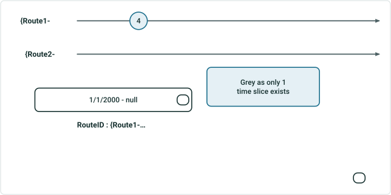

| Measure | Selected Route |  |
| --- | --- | --- |
| 4 | RouteID | {Route1-… |
|  | Measure | 4 |

Concurrency pane does not show. Event is added on Route1 (4)
Positive 2: Simple route in the second pane is the dominant route over the only one time slice. Add the point event on this route

Grey as only 1 time slice exists

## Slide 10

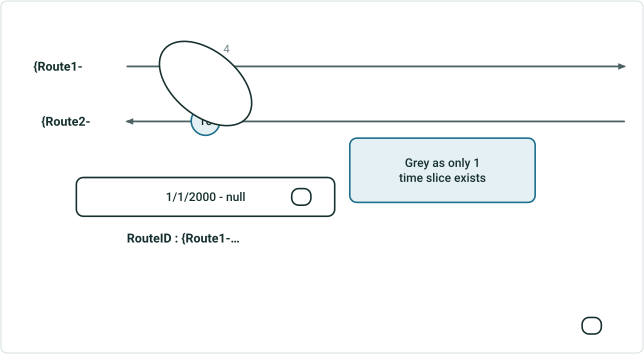

| Measure | Selected Route |  |
| --- | --- | --- |
| 4 | RouteID | {Route2-… |
|  | Measure | 10 |

Positive 3: Simple route in the second pane is the dominant route over the only one time slice. Add the point event on the subordinate route

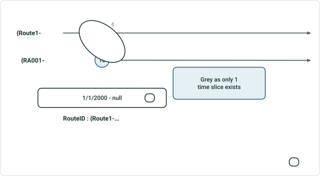

| Measure | Selected Route |  |
| --- | --- | --- |
| 4 | RouteID | {RA001-… |
|  | Measure | 10 |

Positive 4: Simple route in the second pane is the subordinate route over the only one time slice. Add the point event on the dominant route

Grey as only 1 time slice exists
Grey as only 1 time slice exists

## Slide 11

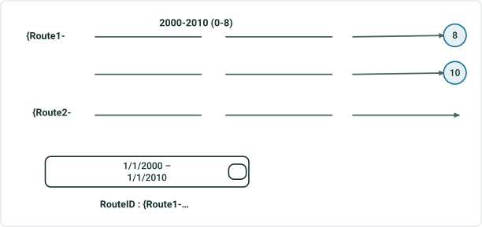

| Measure | Selected Route |  |
| --- | --- | --- |
| 8 | RouteID | {Route1-… |
|  | Measure | 8 |

Positive 5: Gapped route in the second pane is the dominant route over all time slices. Add the point event on this route

| Measure | Selected Route |  |
| --- | --- | --- |
| 10 | RouteID | {Route1-… |
|  | Measure | 10 |

2010-null (recalibrated to 2-10)

## Slide 12

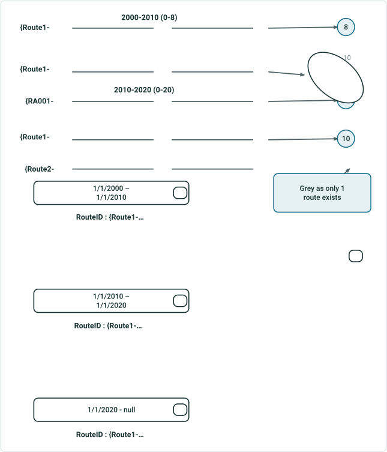

| Measure | Selected Route |  |
| --- | --- | --- |
| 8 | RouteID | {Route1-… |
|  | Measure | 8 |

Positive 6: Gapped route in the second pane has its dominancy changed over different time slices. Add the point event to the dominant route in each time slice

| Measure | Selected Route |  |
| --- | --- | --- |
| 10 | RouteID | {RA000-… |
|  | Measure | 18 |

2010-2020 (recalibrated to 2-10)
2020-null (recalibrated to 2-10)
2020-null (Reassign – form a new route ID 0-20)

| Measure | Selected Route |  |
| --- | --- | --- |
| 10 | RouteID | {Route1-… |
|  | Measure | 10 |

Grey as only 1 route exists

## Slide 13

Positive 7: Looped in the second pane has its dominancy changed over different time slices. Add the point event to this route in each time slice

| Measure | Selected Route |  |
| --- | --- | --- |
| 0 | RouteID | {Route1-… |
|  | Measure | 0 |

| Measure | Selected Route |  |
| --- | --- | --- |
| 0 | RouteID | {Route1-… |
|  | Measure | 0 |

| Measure | Selected Route |  |
| --- | --- | --- |
| 0 | RouteID | {Route1-… |
|  | Measure | 0 |

Verify the event only has 1 time slice, not 3

[figure: {Route1- · 2000-2010 · {Route2- · 2010-2020 · {RA000- · 2020-null · {Route2- has retired · 1/1/2000 – 1/1/2010 · RouteID : {Route1-… · 1/1/2010 – 1/1/2020 · 1/1/2020 - null · 0 · 0-8 · 5-20]

 

## Slide 14

Positive 8: Lollipop route in the second pane has its dominancy changed over different time slices. Add the point event to the subordinate route in each time slice

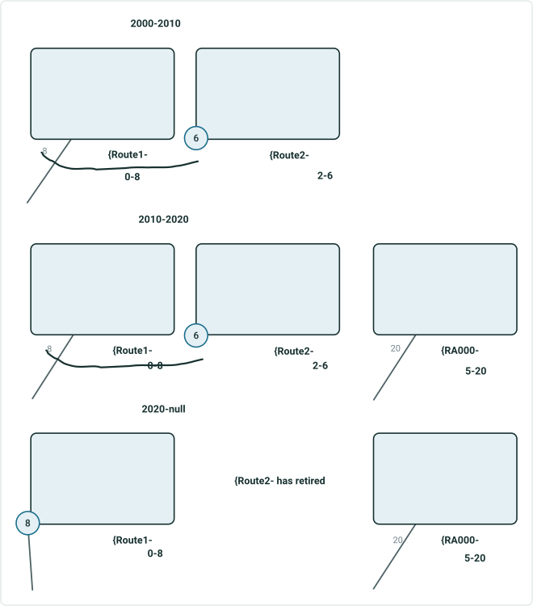

| Measure | Selected Route |  |
| --- | --- | --- |
| 8 | RouteID | {Route2-… |
|  | Measure | 6 |

| Measure | Selected Route |  |
| --- | --- | --- |
| 8 | RouteID | {Route2-… |
|  | Measure | 6 |

| Measure | Selected Route |  |
| --- | --- | --- |
| 8 | RouteID | {Route1-… |
|  | Measure | 8 |

 

## Slide 15

Positive 9: Alpha route in the second pane has its dominancy changed over different time slices. Add the point event to the dominant route in each time slice

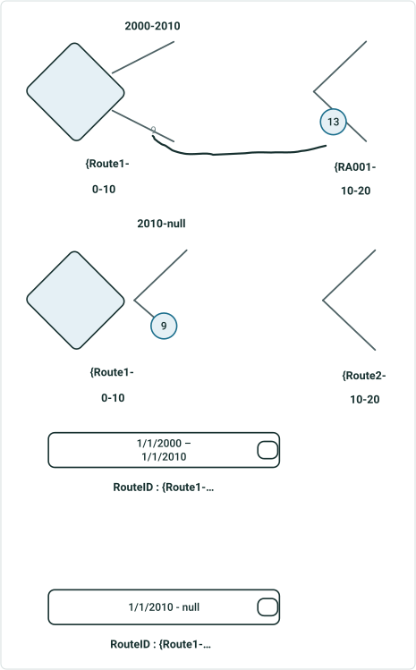

| Measure | Selected Route |  |
| --- | --- | --- |
| 9 | RouteID | {RA000- |
|  | Measure | 13 |


| Measure | Selected Route |  |
| --- | --- | --- |
| 9 | RouteID | {Route1-… |
|  | Measure | 9 |

Reassign – form a new route

  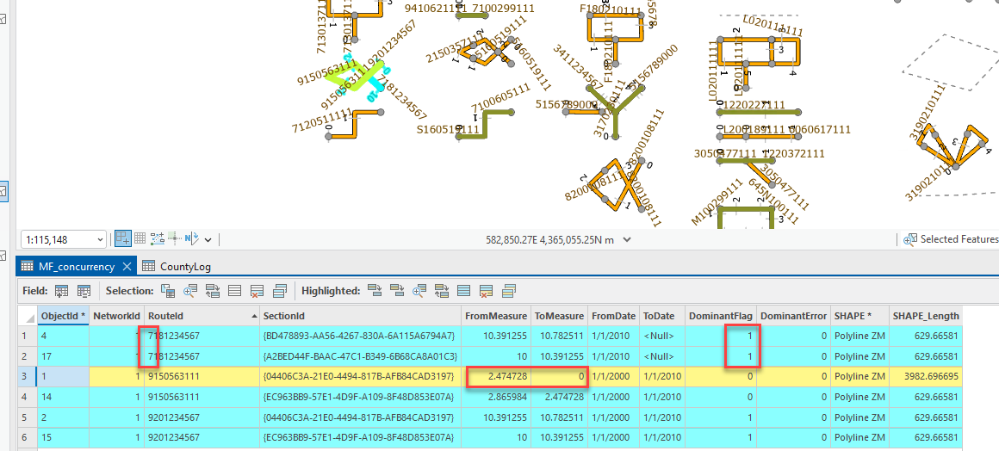

## Slide 16

Positive 10: Branched route in the second pane is always the subordinate route over different time slices. Add the point event on a mix of dominant/subordinate route in different time slices

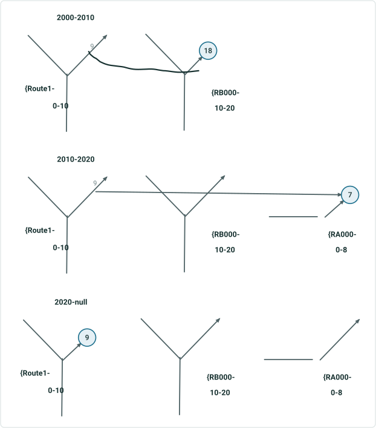

| Measure | Selected Route |  |
| --- | --- | --- |
| 9 | RouteID | {RB000- |
|  | Measure | 18 |

| Measure | Selected Route |  |
| --- | --- | --- |
| 9 | RouteID | {RA000- |
|  | Measure | 7 |

| Measure | Selected Route |  |
| --- | --- | --- |
| 9 | RouteID | {Route1-… |
|  | Measure | 9 |

## Slide 17

Positive 11: 3D route in the second pane has its dominancy changed over different time slices. Add the point event to the dominant route in each time slice

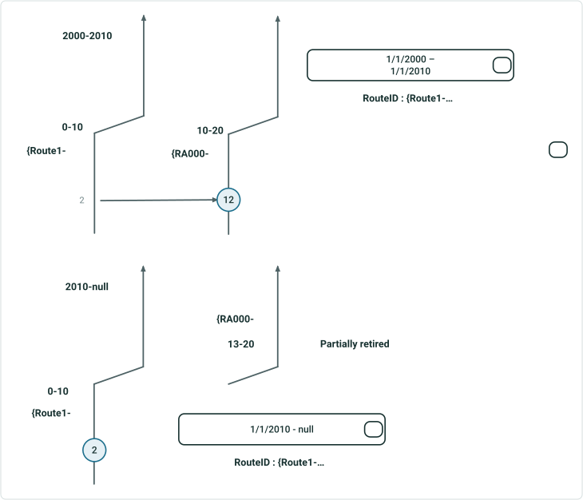

| Measure | Selected Route |  |
| --- | --- | --- |
| 2 | RouteID | {RA000- |
|  | Measure | 12 |

| Measure | Selected Route |  |
| --- | --- | --- |
| 2 | RouteID | {Route1-… |
|  | Measure | 2 |

## Slide 18 — Positive 12: Simple route in the second pane has no concurrency

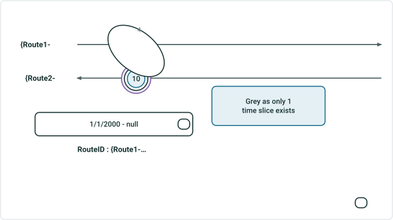

Concurrency pane does not show. Event is added on Route1 (4)
Positive 13: Simple route in the second pane is the dominant route over the only one time slice. Add the point events on the subordinate route


| Measure | Selected Route |  |
| --- | --- | --- |
| 4 | RouteID | {Route2-… |
|  | Measure | 10 |

Grey as only 1 time slice exists

## Slide 19

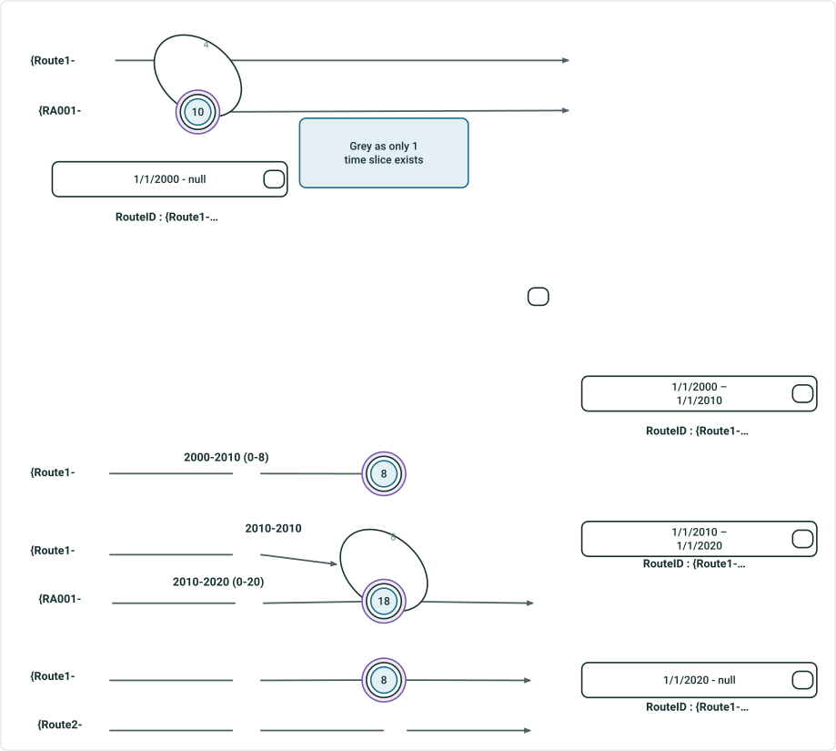

| Measure | Selected Route |  |
| --- | --- | --- |
| 4 | RouteID | {RA001-… |
|  | Measure | 10 |

Positive 14: Simple route in the second pane is the subordinate route over the only one time slice. Add the point events on the dominant route

Positive 15: Gapped route in the second pane has its dominancy changed over different time slices. Add the point event to the dominant route in each time slice
2020-null (extended to 0-10)
2020-null (Reassign – form a new route ID 0-20)

| Measure | Selected Route |  |
| --- | --- | --- |
| 8 | RouteID | {Route1-… |
|  | Measure | 8 |

| Measure | Selected Route |  |
| --- | --- | --- |
| 8 | RouteID | {RA000-… |
|  | Measure | 18 |

| Measure | Selected Route |  |
| --- | --- | --- |
| 8 | RouteID | {Route1-… |
|  | Measure | 10 |

Grey as only 1 route exists
Grey as only 1 time slice exists

## Slide 20

Positive 16: Looped in the second pane has its dominancy changed over different time slices. Add the point events to this route in each time slice

| Measure | Selected Route |  |
| --- | --- | --- |
| 0 | RouteID | {Route1-… |
|  | Measure | 0 |

| Measure | Selected Route |  |
| --- | --- | --- |
| 0 | RouteID | {Route1-… |
|  | Measure | 0 |

| Measure | Selected Route |  |
| --- | --- | --- |
| 0 | RouteID | {Route1-… |
|  | Measure | 0 |

[figure: {Route1- · 2000-2010 · {Route2- · 2010-2020 · {RA000- · 2020-null · {Route2- has retired · 1/1/2000 – 1/1/2010 · RouteID : {Route1-… · 1/1/2010 – 1/1/2020 · 1/1/2020 - null · 5 · 0-8 · 5-20 · 0]

 

## Slide 21

Positive 16: Branched route in the second pane is always the subordinate route over different time slices. Add the point events on a mix of dominant/subordinate route in different time slices

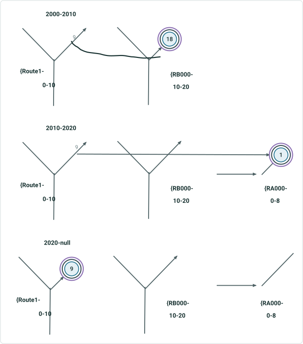

| Measure | Selected Route |  |
| --- | --- | --- |
| 9 | RouteID | {RB000- |
|  | Measure | 18 |

| Measure | Selected Route |  |
| --- | --- | --- |
| 9 | RouteID | {RA000- |
|  | Measure | 1 |

| Measure | Selected Route |  |
| --- | --- | --- |
| 9 | RouteID | {Route1-… |
|  | Measure | 9 |

## Slide 22

Positive 17: 3D route in the second pane has its dominancy changed over different time slices. Add the point events to the subordinate route in each time slice

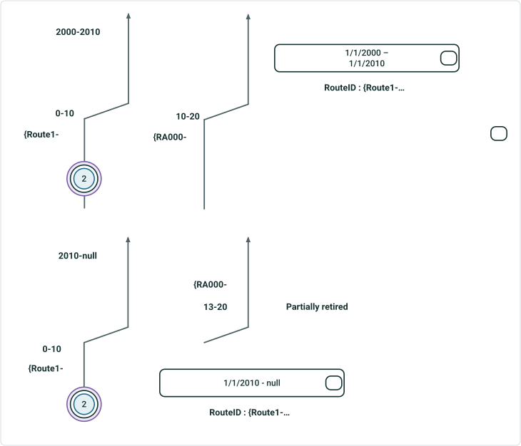

| Measure | Selected Route |  |
| --- | --- | --- |
| 2 | RouteID | {Route1-… |
|  | Measure | 2 |

| Measure | Selected Route |  |
| --- | --- | --- |
| 2 | RouteID | {Route1-… |
|  | Measure | 2 |
