# Add Point Event tool/ Add Multipoint Events tool Coordinate offset method – Test Plan

|   |   |
| --- | --- |
| **Kind** | Test Plan · Pro |
| **Release** | — |
| **Issue** | [ArcGISPro/ps-location-referencing#3905](https://devtopia.esri.com/ArcGISPro/ps-location-referencing/issues/3905) |
| **Source** | [CoordinateoffsetMethod -Add point_Multi point events tool.pptx](<https://esriis.sharepoint.com/sites/LocationReferencing/Shared%20Documents/General/Test%20Plans/CoordinateoffsetMethod%20-Add%20point_Multi%20point%20events%20tool.pptx>) |
| **Edited** | 2022-08-22 22:47 by Lakshmi Ananthanarayanan |
| **Extracted** | 2026-09-04 · lane `xmlstrip` |

<!-- metadata
```yaml
title: "Add Point Event tool/ Add Multipoint Events tool Coordinate offset method – Test Plan"
source_file: "CoordinateoffsetMethod -Add point_Multi point events tool.pptx"
source_url: "https://esriis.sharepoint.com/sites/LocationReferencing/Shared%20Documents/General/Test%20Plans/CoordinateoffsetMethod%20-Add%20point_Multi%20point%20events%20tool.pptx"
doc_id: 638
doc_kind: "Test Plan"
surface: "Pro"
doc_revision: ""
target_release: ""
pe: ""
dev: ""
author: "Lakshmi Ananthanarayanan"
last_edited_by: "Lakshmi Ananthanarayanan"
last_edited: "2022-08-22T22:47:37Z"
extracted: 2026-09-04
extraction_lane: xmlstrip
prompt_version: "v2.0.2"
keywords: ["coordinate offset", "point event", "multipoint event", "route", "measure", "spatial reference", "error message"]
tools: ["Add Point Event", "Multipoint Events"]
products: []
issues: ["ArcGISPro/ps-location-referencing#3905"]
related: [{"doc":658,"file":"add-point-event-tools-coordinate-offset-method__doc658.md","s":6.918},{"doc":636,"file":"add-line-event-tool-coordinate-offset-method-test-plan__doc636.md","s":6.607},{"doc":648,"file":"add-line-event-tools-coordinate-offset-method__doc648.md","s":5.857},{"doc":672,"file":"add-multiple-point-events__doc672.md","s":5.796},{"doc":434,"file":"add-multiple-point-events__doc434.md","s":5.066}]
```
-->

## Summary

Test plan for the Add Point Event and Multipoint Events tools using the coordinate offset method. Covers testing on feature services, nonline and line networks, projected and unprojected data, and events with and without referents. Includes UI verification, spatial reference handling, error message validation, and multiple scenarios of event placement on routes including branched, lollipop, vertical, and line networks.

## Related documents

<!-- related:begin -->
- [Add Point Event Tools: Coordinate Offset Method](<https://esriis.sharepoint.com/sites/lrsworkspace/LRS Doc Index/User Stories/add-point-event-tools-coordinate-offset-method__doc658.md>) — similar text 0.31 · 6 title words · 4 filename words · same surface <!-- rel:658 -->
- [Add Line Event Tool Coordinate Offset Method Test Plan](<https://esriis.sharepoint.com/sites/lrsworkspace/LRS%20Doc%20Index/Test%20Plans/add-line-event-tool-coordinate-offset-method-test-plan__doc636.md>) — similar text 0.42 · 6 title words · 1 filename word · same kind/surface/folder <!-- rel:636 -->
- [Add Line Event Tools: Coordinate Offset Method](<https://esriis.sharepoint.com/sites/lrsworkspace/LRS Doc Index/User Stories/add-line-event-tools-coordinate-offset-method__doc648.md>) — similar text 0.32 · 5 title words · 3 filename words · same surface <!-- rel:648 -->
- [Add Multiple Point Events](<https://esriis.sharepoint.com/sites/lrsworkspace/LRS%20Doc%20Index/Test%20Plans/add-multiple-point-events__doc672.md>) — similar text 0.22 · 3 title words · 3 filename words · same kind/surface/folder <!-- rel:672 -->
- [Add Multiple Point Events](<https://esriis.sharepoint.com/sites/lrsworkspace/LRS Doc Index/Test Plans/add-multiple-point-events__doc434.md>) — similar text 0.25 · 3 title words · 3 filename words · same kind/folder <!-- rel:434 -->
<!-- related:end -->

<!-- docs:begin -->
## Esri documentation

[Split a centerline by measure](https://doc.esri.com/en/arcgis-pro/latest/help/production/location-referencing-pipelines/split-a-centerline-by-measure.html)

_No page matched:_ [Add Point Event](https://www.google.com/search?q=%22Add%20Point%20Event%22+site%3Adoc.esri.com) · [Multipoint Events](https://www.google.com/search?q=%22Multipoint%20Events%22+site%3Adoc.esri.com)
<!-- docs:end -->

---

## Slide 1 — Add Point Event tool/ Add Multipoint Events tool Coordinate offset method – Test Plan

https://devtopia.esri.com/ArcGISPro/ps-location-referencing/issues/3905

## Slide 2

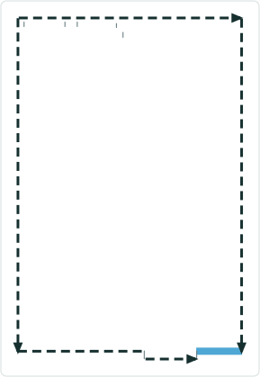

Data:

- Test in Feature Service only.
- Test for tools -  Add point event and Multipoint event
- Test on Nonline Network & Line Network
- Test in both projected and unprojected data
- Point events should have with and without referents configured.
Verification
General UI verification

- Verify in the panes the labels of the field are of same font size and aligned left
- Verify all the editable fields are of white background and of same size and are aligned properly
- Verify the icons provided in a pane are of same size and aligned properly
- i18n and 508 testing. Verify testing in Arabic and german especially (X,Y coordinates value in referent table)

First pane

- In Add point event and Multipoint event a drop down option should be shown with “Using coordinates” method
- Default should be “Route and Measure” method


## Slide 3


Second Pane
Event Layer

- Verify the default event layer is the first point event layer of the map
Network

- Verify that the network selected is automatically set to the registered network for the selected event layer
- Verify that the label “Using Coordinates” is shown
9a. For line network display the corresponding network.
RouteID /Route Name

- Verify the ‘Route Name” is displayed instead of route id for the events configured with route name
- Verify that the RouteID should be empty until the user fills
- Verify that the RouteID can be typed or picked.

GC Factor

- Verify by using a  nonzero GC factor and check whether the coordinates are adjusted accordingly
- Verify the tool runs successfully without providing a GC factor
- Verify that the route selector UI is
        shown when the user types in a
        routeID/Name  which  has more than one time slice

 

## Slide 4


Second Pane
Spatial Reference

- Verify there are 3 spatial options for Spatial reference dropdown : LRS Spatial reference, Web map Spatial reference, GCS_WGS_1984.
- Verify the spatial references are honored by providing a different spatial reference to the map than the LRS one.
- If a location is already selected on the map, verify the coordinate value changes by changing the spatial reference
XYZ coordinates

- X, Y and Z should be shown for coordinates
- Verify Z value is optional& default is 0
- Verify the coordinates can be typed and picked from the map
- Verify the pickers work with snapping
- Verify the measure is displayed once the coordinates are located in the map with the network units and no of decimals matching the M tolerance of the network

 

## Slide 5


On the map

- Verify the chosen route remain selected
- The location of the coordinates is marked in small yellow square
- The route measure closest to the coordinates is shown with red mark

In the pane

- Verify that the route measure closest to the original coordinates is selected and the distance between the location and the chosen measure is shown as route measure distance in the pane

Dates

- Verify the start date defaults to todays date
- Verify the end date by default is empty
- Verify by checking the route start date and route end date the date fields are filled
- Verify the referent method configured event has X/Y as ref method , ref location and reference offset updated

(optional)

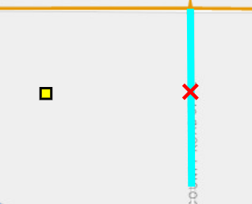  

## Slide 6

Error message verification

| No | Test | Expected Result | Error Message |
| --- | --- | --- | --- |
| 1 | Provided XYZ coordinates cannot be located on the map | Error |  |
| 2 | Typed invalid values for XYZ | Error |  |
| 3 | Provide zero for the GC factor | Error | Value of GC factor is invalid |
| 4 | Provide invalid value for GC factor | Error | Value of GC factor is invalid |
| 5 | Typed in RouteID/ Route Name does not exist in the network | Error |  |
| 6 | In the map, event layer and the network layer are in different versions | Error | The event layer and network layer are in different versions |
| 7 | RouteID is null | Error |  |
| 8 | User provides only end date. | Error | Enter a start date. |
| 9 | User do not provide any dates. | Error | Enter a start date |
| 10 | User clicks on without providing any values. | Error | Enter the Route Name. |
| 11 | Route is not available for the provide date | Error | Route not available in the provided date range. |

Other verifications

- If the second pane is filled and users moves to the first pane the markers on the map and the details filled in the pane should remain
- If the user selects a different method, information in the second pane and markers in the map are cleared.
- For multipoint events tool if the 3rd pane where the event attributes are filled and if the users moves back to previous panes the information in the pane and map should remain intact.
- Few cases of conflict prevention will be tested through Pro as well as from REST.

## Slide 7 — 1. Coordinate location falling on route (XYZ coordinates is provided by typing the value) for X marked location) 1a.

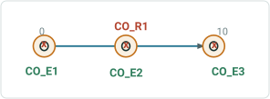

| RouteID | Event Layer | EventId | From Date | To Date | Measure | Ref Method | Ref location | Ref offset |
| --- | --- | --- | --- | --- | --- | --- | --- | --- |
| CO_R1 | Event1 | CO_E1 | 1/1/2000 |  | 0 | X/Y | X,Y | 0 |
| CO_R1 | Event1 | CO_E2 | 1/1/2000 |  | 5 | X/Y | X,Y | 0 |
| CO_R1 | Event1 | CO_E3 | 1/1/2000 |  | 10 | X/Y | X,Y | 0 |

1b.  Adding multiple point events in a normal route

| RouteId | Event Layer | EventId | FromDate | To Date | Measure |
| --- | --- | --- | --- | --- | --- |
| CO_R1 | Event1 | CO_E4 | 1/1/2000 |  | 8 |
| CO_R1 | Event2 | CO_E1 | 1/1/2000 |  | 8 |
| CO_R1 | Event3 | CO_E1 | 1/1/2000 |  | 8 |

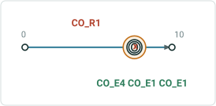

| Ref Method | Ref location | Ref offset |
| --- | --- | --- |
| X/Y | X,Y | 0 |
| X/Y | X,Y | 0 |
| X/Y | X,Y | 0 |

## Slide 8 — 2. Coordinate location not falling on the route(XYZ location is provided for location and event is placed on nearest

| RouteID | Event Layer | EventId | From Date | To Date | Measure |
| --- | --- | --- | --- | --- | --- |
| CO_R2 | Event1 | CO_E5 | 1/1/2000 |  | 0 |
| CO_R2 | Event1 | CO_E6 | 1/1/2000 |  | 5 |
| CO_R2 | Event1 | CO_E7 | 1/1/2000 |  | 10 |

2b.Adding multiple point events in a gapped route

| RouteID | Event Layer | EventId | From Date | To Date | Measure |
| --- | --- | --- | --- | --- | --- |
| CO_R1 | Event1 | CO_E6 | 1/1/2000 |  | 5.1 |
| CO_R1 | Event2 | CO_E2 | 1/1/2000 |  | 5.1 |
| CO_R1 | Event3 | CO_E2 | 1/1/2000 |  | 5.1 |

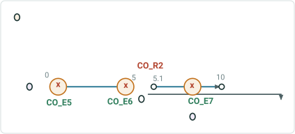

| Measure |
| --- |
| 5 |
| 5.1 |

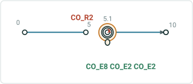

| Ref Method | Ref location | Ref offset |
| --- | --- | --- |
| X/Y | X,Y | 0.01 |
| X/Y | X,Y | 0.01 |
| X/Y | X,Y | 0.02 |

| Ref Method | Ref location | Ref offset |
| --- | --- | --- |
| X/Y | X,Y | 0.01 |
| X/Y | X,Y | 0.01 |
| X/Y | X,Y | 0.01 |

## Slide 9 — 3. Coordinate location falling on the route where there is more than one measure (XYZ location is provided for X marked

| RouteID | Event Layer | EventId | From Date | To Date | Measure |
| --- | --- | --- | --- | --- | --- |
| CO_R3 | Event1 | CO_E9 | 1/1/2000 |  | 14 |
| CO_R3 | Event1 | CO_E10 | 1/1/2000 |  | 47.5 |

3b.Adding multiple point events in a branched route

| RouteID | Event Layer | EventId | From Date | To Date | Measure |
| --- | --- | --- | --- | --- | --- |
| CO_R4 | Event1 | CO_E11 | 1/1/2000 |  | 10.59 |
| CO_R4 | Event2 | CO_E3 | 1/1/2000 |  | 10.59 |
| CO_R4 | Event3 | CO_E3 | 1/1/2000 |  | 10.59 |
| CO_R4 | Event1 | CO_E12 | 1/1/2000 |  | 25.3 |
| CO_R4 | Event2 | CO_E4 | 1/1/2000 |  | 25.3 |
| CO_R4 | Event3 | CO_E4 | 1/1/2000 |  | 25.3 |

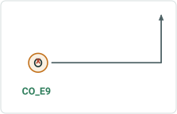

| Measure |
| --- |
| 14 |
| 71 |

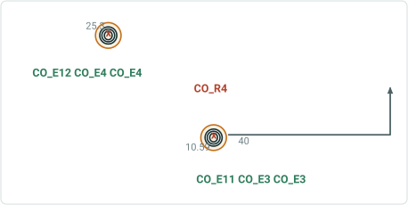

| Measure |
| --- |
| 10.59 |
| 40 |

| Ref Method | Ref location | Ref offset |
| --- | --- | --- |
| X/Y | X,Y | 0 |
| X/Y | X,Y | 0 |

| Ref Method | Ref location | Ref offset |
| --- | --- | --- |
| X/Y | X,Y | 0 |
| X/Y | X,Y | 0 |
| X/Y | X,Y | 0 |
| X/Y | X,Y | 0 |
| X/Y | X,Y | 0 |
| X/Y | X,Y | 0 |

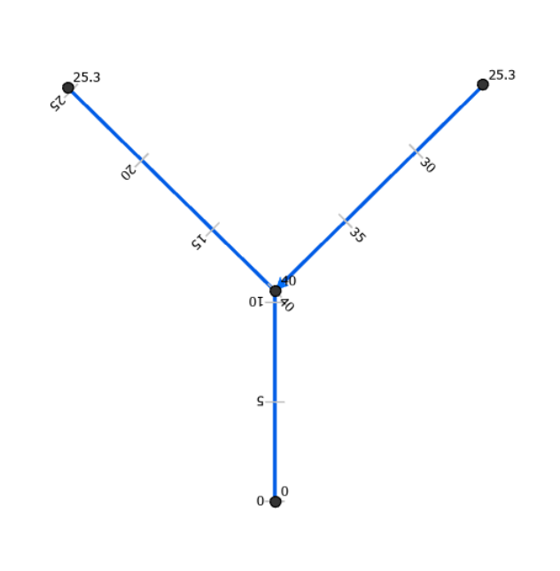 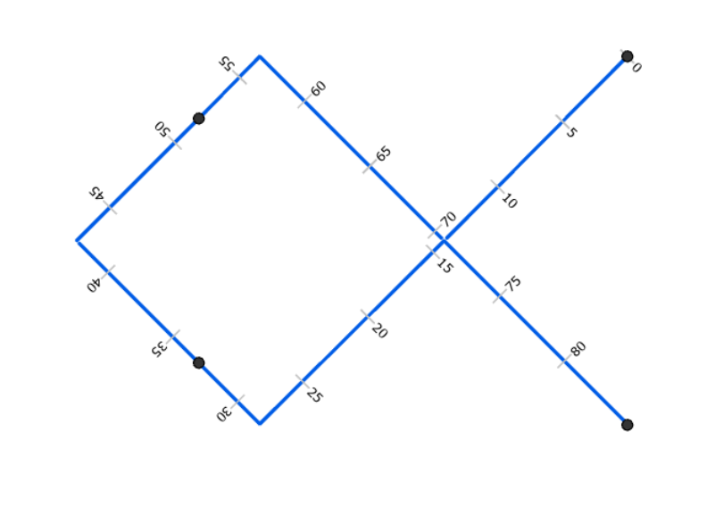

## Slide 10 — 4. Coordinate location falling out of the route and the nearest location on the route has more than one measure. (XYZ

| RouteId | Event Layer | EventId | From Date | To Date | Measure |
| --- | --- | --- | --- | --- | --- |
| CO_R5 | Event1 | CO_E13 | 1/1/2000 |  | 40 |
| CO_R5 | Event1 | CO_E14 | 1/1/2000 |  | 15 |

4b.Adding multiple point events in a lollipop route

| RouteId | Event Layer | EventId | FromDate | To Date | Measure |
| --- | --- | --- | --- | --- | --- |
| CO_R6 | Event1 | CO_E15 | 1/1/2000 |  | 70 |
| CO_R6 | Event2 | CO_E4 | 1/1/2000 |  | 70 |
| CO_R6 | Event3 | CO_E4 | 1/1/2000 |  | 70 |

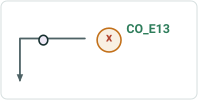

| Measure |
| --- |
| 0 |
| 40 |

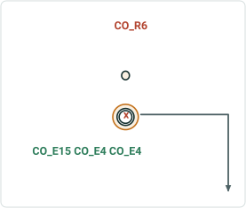

| Measure |
| --- |
| 30 |
| 70 |

| Ref Method | Ref location | Ref offset |
| --- | --- | --- |
| X/Y | X,Y | 0.02 |
| X/Y | X,Y | 0.02 |

| Ref Method | Ref location | Ref offset |
| --- | --- | --- |
| X/Y | X,Y | 0.02 |
| X/Y | X,Y | 0.02 |
| X/Y | X,Y | 0.02 |

 

## Slide 11 — 5. Vertical Route 5a.Adding a point event in a vertical route having same xy and diff z.

| RouteId | Event Layer | EventId | FromDate | To Date | Measure |
| --- | --- | --- | --- | --- | --- |
| CO_R7 | Event1 | CO_E16 | 1/1/2000 |  | 1 |
| CO_R7 | Event1 | CO_E17 | 1/1/2000 |  | 2 |
| CO_R7 | Event1 | CO_E18 | 1/1/2000 |  | 8 |

5b. Adding multiple point events in a vertical route having same xy and diff z.

| RouteId | Event Layer | EventId | FromDate | To Date | Measure |
| --- | --- | --- | --- | --- | --- |
| CO_R8 | Event1 | CO_E19 | 1/1/2000 |  | 2 |
| CO_R8 | Event2 | CO_E5 | 1/1/2000 |  | 2 |
| CO_R8 | Event3 | CO_E5 | 1/1/2000 |  | 2 |

| Ref Method | Ref location | Ref offset |
| --- | --- | --- |
| X/Y | X,Y,Z | 0 |
| X/Y | X,Y,Z | 0.01 |
| X/Y | X,Y,Z | 0 |

| Ref Method | Ref location | Ref offset |
| --- | --- | --- |
| X/Y | X,Y,Z | 0 |
| X/Y | X,Y,Z | 0 |
| X/Y | X,Y,Z | 0 |

[figure: CO_E19 CO_E5 CO_E5 · CO_R8 · CO_E17 · x · CO_R7 · CO_E16 · CO_E18 · 2]

 

## Slide 12 — 6. Line Network 6a.Adding a point event in a line network .

| LineID | RouteID | Event Layer | EventId | From Date | To Date | Measure |
| --- | --- | --- | --- | --- | --- | --- |
| L2 | R2L2 | EventL1 | CO_E10 | 1/1/2000 |  | 200 |
| L2 | R4L2 | EventL1 | CO_E2 | 1/1/2000 |  | 110 |
| L2 | R5L2 | EventL1 | CO_E3 | 1/1/2000 |  | 10 |

6b. Adding multiple  point events in a line network

| LineID | RouteID | Event Layer | EventId | From Date | To Date | Measure |
| --- | --- | --- | --- | --- | --- | --- |
| L2 | R1L2 | EventL1 | CO_E4 | 1/1/2000 |  | 2 |
| L2 | R1L2 | EventL2 | CO_E1 | 1/1/2000 |  | 2 |
| L2 | R1L2 | EventL3 | CO_E1 | 1/1/2000 |  | 2 |
| L2 | R3L2 | EventL1 | CO_E5 | 1/1/2000 |  | 2 |
| L2 | R3L2 | EventL2 | CO_E2 | 1/1/2000 |  | 2 |
| L2 | R3L2 | EventL3 | CO_E2 | 1/1/2000 |  | 2 |

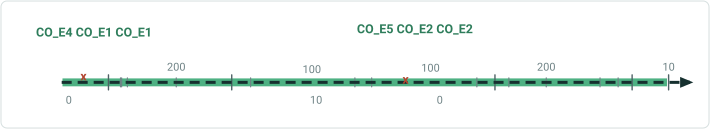

| Ref Method | Ref location | Ref offset |
| --- | --- | --- |
| X/Y | X,Y | 0 |
| X/Y | X,Y | 0.01 |
| X/Y | X,Y | 0 |

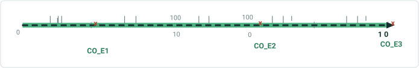

| Ref Method | Ref location | Ref offset |
| --- | --- | --- |
| X/Y | X,Y | 0.01 |
| X/Y | X,Y | 0.01 |
| X/Y | X,Y | 0.01 |
| X/Y | X,Y | 0 |
| X/Y | X,Y | 0 |
| X/Y | X,Y | 0 |


## Slide 13 — 7a. Adding point event with time slices Event dates are from null to null For event CO_E20 - coordinates fall exactly

| RouteID | Event Layer | EventId | From Date | To Date | Measure | Loc Error |
| --- | --- | --- | --- | --- | --- | --- |
| CO_R9 | Event1 | CO_E20 | Null | 1/1/2000 | 9 | Route not found |
| CO_R9 | Event1 | CO_E20 | 1/1/2000 | 1/1/2010 | 9 | No Error |
| CO_R9 | Event1 | CO_E20 | 1/1/2010 | 1/1/2020 | 9 | No Error |
| CO_R9 | Event1 | CO_E20 | 1/1/2020 | Null | 9 | Route not found |
| CO_R9 | Event1 | CO_E21 | Null | 1/1/2000 | 14 | Route not found |
| CO_R9 | Event1 | CO_E21 | 1/1/2000 | 1/1/2020 | 14 | No Error |
| CO_R9 | Event1 | CO_E21 | 1/1/2020 | Null | 14 | Route not found |

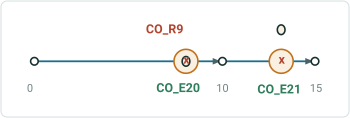

| RouteID | From Date | To Date | F M | To M |
| --- | --- | --- | --- | --- |
| CO_R9 | 1/1/2000 | 1/1/2010 | 0 | 10 |
| CO_R9 | 1/1/2010 | 1/1/2020 | 0 | 15 |

## Slide 14 — 7a. Adding point event with time slices Event dates are from null to null. Location Errors record should not show up

| RouteID | Event Layer | EventId | From Date | To Date | Measure | Loc Error |
| --- | --- | --- | --- | --- | --- | --- |
| CO_R10 | Event1 | CO_E22 | Null | 1/1/2000 | 5 | Route not found |
| CO_R10 | Event1 | CO_E22 | 1/1/2000 | 1/1/2010 | 5 | No Error |
| CO_R10 | Event1 | CO_E22 | 1/1/2010 | 1/1/2020 | 5 | No Error |
| CO_R10 | Event1 | CO_E22 | 1/1/2020 | Null | 5 | Route not found |
| CO_R10 | Event2 | CO_E6 | Null | 1/1/2000 | 5 | Route not found |
| CO_R10 | Event2 | CO_E6 | 1/1/2000 | 1/1/2010 | 5 | No Error |
| CO_R10 | Event2 | CO_E6 | 1/1/2010 | 1/1/2020 | 5 | No Error |
| CO_R10 | Event2 | CO_E6 | 1/1/2020 | Null | 5 | Route not found |
| CO_R10 | Event3 | CO_E6 | Null | 1/1/2000 | 5 | Route not found |
| CO_R10 | Event3 | CO_E6 | 1/1/2000 | 1/1/2010 | 5 | No Error |
| CO_R10 | Event3 | CO_E6 | 1/1/2010 | 1/1/2020 | 5 | No Error |
| CO_R10 | Event3 | CO_E6 | 1/1/2020 | Null | 5 | Route not found |
| CO_R10 | Event1 | CO_E23 | Null | 1/1/2000 | 14 | Route not found |
| CO_R10 | Event1 | CO_E21 | 1/1/2000 | 1/1/2020 | 14 | No Error |
| CO_R10 | Event1 | CO_E21 | 1/1/2020 | Null | 14 | Route not found |

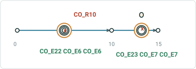

| RouteID | From Date | To Date | F M | To M |
| --- | --- | --- | --- | --- |
| CO_R10 | 1/1/2000 | 1/1/2010 | 0 | 10 |
| CO_R10 | 1/1/2010 | 1/1/2020 | 0 | 15 |
