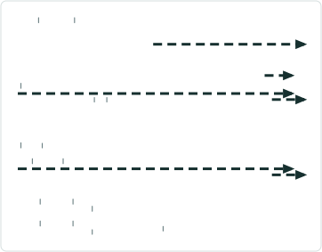
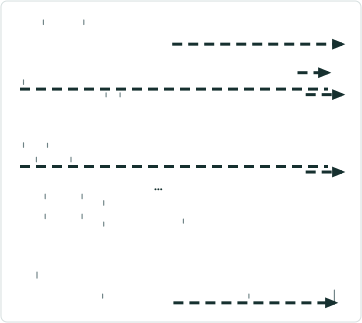
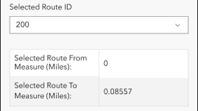

# Add Spanning Line Events to Dominant Routes in Experience Builder – Test Plan

|   |   |
| --- | --- |
| **Kind** | Test Plan · Experience Builder |
| **Release** | — |
| **Issue** | [Beijing-R-D-Center/ExperienceBuilder-Web-Extensions#24793](https://devtopia.esri.com/Beijing-R-D-Center/ExperienceBuilder-Web-Extensions/issues/24793) |
| **Source** | [AddSpanningLinesDominant_ExB_testplan.pptx](<https://esriis.sharepoint.com/sites/LocationReferencing/Shared%20Documents/General/Test%20Plans/AddSpanningLinesDominant_ExB_testplan.pptx>) |
| **Edited** | 2025-05-22 21:25 by Claire Wang |
| **Extracted** | 2026-09-04 · lane `xmlstrip` |

<!-- metadata
```yaml
title: "Add Spanning Line Events to Dominant Routes in Experience Builder – Test Plan"
source_file: "AddSpanningLinesDominant_ExB_testplan.pptx"
source_url: "https://esriis.sharepoint.com/sites/LocationReferencing/Shared%20Documents/General/Test%20Plans/AddSpanningLinesDominant_ExB_testplan.pptx"
doc_id: 170
doc_kind: "Test Plan"
surface: "Experience Builder"
doc_revision: ""
target_release: ""
pe: ""
dev: "1"
author: "Lakshmi Ananthanarayanan"
last_edited_by: "Claire Wang"
last_edited: "2025-05-22T21:25:22Z"
extracted: 2026-09-04
extraction_lane: xmlstrip
prompt_version: "v2.0.2"
keywords: ["spanning line event", "dominant route", "concurrency", "route direction", "event merging", "automation", "configuration"]
tools: ["Add Point", "Add Line"]
products: []
issues: ["Beijing-R-D-Center/ExperienceBuilder-Web-Extensions#24793"]
related: [{"doc":169,"file":"add-point-and-non-spanning-line-event-to-dominant-route-in-experience-builder__doc169.md","s":9.696},{"doc":457,"file":"experience-builder-add-multiple-line-events-widget-test-plan__doc457.md","s":5.122},{"doc":360,"file":"add-point-event-to-dominant-route-in-arcgis-pro-test-plan__doc360.md","s":4.713},{"doc":161,"file":"view-only-non-editable-dynseg-sld-in-experience-builder-test-plan__doc161.md","s":4.649},{"doc":455,"file":"experience-builder-add-single-line-event-widget__doc455.md","s":4.462}]
```
-->

## Summary

Test plan for adding spanning line events to dominant routes in Experience Builder. Covers configuration options for concurrency toggles, various test scenarios including spatial and temporal concurrencies, route directions, and conflict prevention. Includes automation updates and documentation revisions related to these features.

## Related documents

<!-- related:begin -->
- [Add Point and non-Spanning Line Event to Dominant Route in Experience Builder – Test Plan](<https://esriis.sharepoint.com/sites/lrsworkspace/LRS Doc Index/Test Plans/add-point-and-non-spanning-line-event-to-dominant-route-in-experience-builder__doc169.md>) — similar text 0.59 · 6 title words · 4 filename words · same kind/surface/dev/folder <!-- rel:169 -->
- [Experience Builder: Add Multiple Line Events Widget Test Plan](<https://esriis.sharepoint.com/sites/lrsworkspace/LRS Doc Index/Test Plans/experience-builder-add-multiple-line-events-widget-test-plan__doc457.md>) — similar text 0.13 · 5 title words · 1 filename word · same kind/surface/folder <!-- rel:457 -->
- [Add Point Event to Dominant Route in ArcGIS Pro – Test Plan](<https://esriis.sharepoint.com/sites/lrsworkspace/LRS Doc Index/Test Plans/add-point-event-to-dominant-route-in-arcgis-pro-test-plan__doc360.md>) — similar text 0.26 · 2 title words · 3 filename words · same kind/folder <!-- rel:360 -->
- [View-only (non editable) DynSeg / SLD in Experience Builder – test plan](<https://esriis.sharepoint.com/sites/lrsworkspace/LRS Doc Index/Test Plans/view-only-non-editable-dynseg-sld-in-experience-builder-test-plan__doc161.md>) — similar text 0.21 · 2 title words · 1 filename word · same kind/surface/dev/folder <!-- rel:161 -->
- [Experience Builder: Add Single Line Event Widget](<https://esriis.sharepoint.com/sites/lrsworkspace/LRS Doc Index/User Stories/experience-builder-add-single-line-event-widget__doc455.md>) — similar text 0.16 · 4 title words · 1 filename word · same surface/folder <!-- rel:455 -->
<!-- related:end -->

<!-- docs:begin -->
## Esri documentation

[Add calibration points](https://doc.esri.com/en/arcgis-pro/latest/help/production/location-referencing-pipelines/add-calibration-points.html)

_No page matched:_ [Add Line](https://www.google.com/search?q=%22Add%20Line%22+site%3Adoc.esri.com)
<!-- docs:end -->

---

## Slide 1 — Add Spanning Line Events to Dominant Routes in ExB – test plan

https://devtopia.esri.com/Beijing-R-D-Center/ExperienceBuilder-Web-Extensions/issues/24793

PE:
Dev:

## Slide 2

Notes – Configuration – as no new development is needed
The new section for concurrencies in Add Point and Add Line’s configuration with the 3 toggles should already be implemented from the previous user story.

When concurrency exists:

- Disabled & visible & Don’t override off: checkbox shows up as unchecked in UI, and users have control. If users choose to check the option, they see dominancy pane.
- Disabled & visible & Don’t override on: checkbox shows up as unchecked in UI, and users have control. If users choose to check the option, they don’t see dominancy pane.
- Enabled & visible & Don’t override off: checkbox shows up as checked in UI, and users have control. If users choose to keep the option checked, they see dominancy pane.
- Enabled & visible & Don’t override on: checkbox shows up as checked in UI, and users have control. If users choose to keep the option checked, they don’t see dominancy pane.
- If Hide Add to Dominant Route Option is on (checkbox does not show in UI) – Only add to selected route(s) in the first pane no matter what the other two toggles say.

## Slide 3





New conditions for spanning events
Order the sections by measure and route. The first record should be the From Route, From Measure going across that From Route to the next Route on the line and ending with the To Route, To Measure as the last record

(0 to 0.138) RouteA
Toboso Transit Line 1400
(0.138 to 0.3) RouteA
(0 to 1) RouteB

(0 to 0.138) RouteA
	RouteA
	0 – 0.138
(0.138 to 0.3) RouteA
	Dominant1
	8 – 10
(0 to 1) RouteB
	Dominant1
	10 – 14
(2 to 2.2) RouteC
	Dominant1
	14 – 15
(2.2 to 2.5) RouteC
	Dominant2
	100 – 100.3
(2.5 to 3) RouteC
	RouteC
	2.5 - 3

 

## - Consider utilizing the data and test cases <!-- slide 4 -->

Test

- Test Add Line widgets with different combinations of the 3 toggles in express and non-express modes
- Test with adding single and multiple spanning line events in a line network. Test few cases for adding spanning and non-spanning line events together
- Test normal and gapped routes
- Test a few cases where selected route and concurrent route are in opposite directions
- Test a few cases where routes in lines have different directions
- Test with spatial (routes fully/partially/not overlap) and temporal (time slices) concurrencies
  - Sanity test a few where there is no concurrency
  - Test scenarios where there are concurrencies across multiple time slices and the primary/dominant route changes over time
- Test with and without conflict prevention (“cannot acquire locks” is the only error case for this user story)
- Consider utilizing the data and test cases from the Pro version of Add Line, and Append Events to Dominant Route user stories (attached in devtopia issue)
  - Required: Add Line – 6 7; Append Events –spanning line: 3 4 5
  - Optional: other test cases
- Test expanding, selecting, and highlighting the segment
- Verify spatially coincident events should merge if Merge coincident events is checked. Verify temporally coincident events should merge automatically (see 5890 for point; 6279 for append; 6779 for line – still in progress – should be fixed when this user story is worked on)
- Verify the tool aligns with any other Experience Builder specifications/requirements
- 508/i18n (check with Mac and Chandan. 508 should be automatically done by Chandan’s team.)
- Test with various themes for the text color showing in the pane
- Test in different browsers (chrome and firefox) and layouts

## Slide 5

Automation
Add new automation cases for this scenario in Add Point and Add Line widgets
Note the existing automation may break and need to be updated

Documentation
Update existing documentation to mention:

    - These new configuration options and what they do
    - The updates the workflow and UX when this option is selected in the widget
