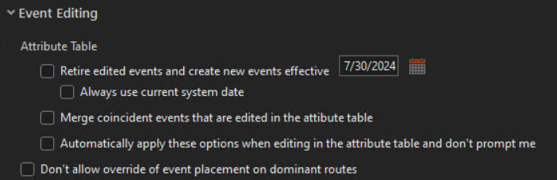
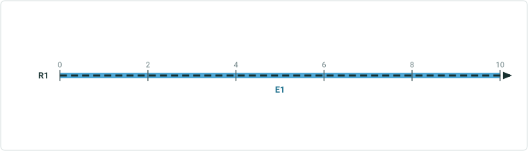
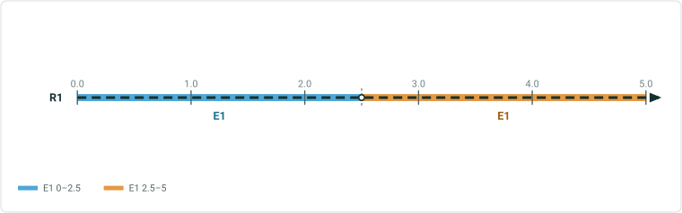
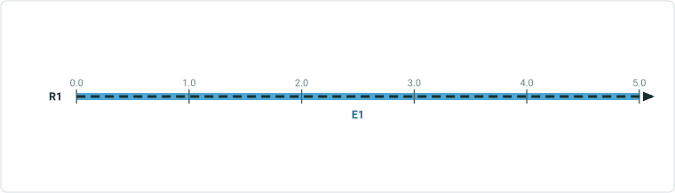
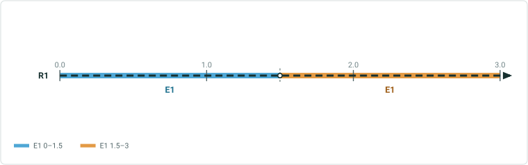
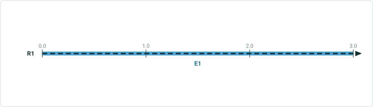
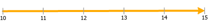
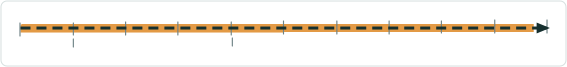
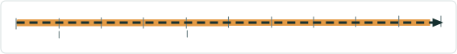
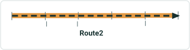

# Advanced Editing Options Test Plan

|   |   |
| --- | --- |
| **Kind** | Test Plan · Pro |
| **Release** | — |
| **Product** | Roads & Highways · Pipeline Referencing · Utility Network |
| **Issue** | [ArcGISPro/ps-location-referencing#5765](https://devtopia.esri.com/ArcGISPro/ps-location-referencing/issues/5765) |
| **Source** | [5765-AdvancedTableEditingOptions_TestPlanV2.pptx](<https://esriis.sharepoint.com/sites/LocationReferencing/Shared%20Documents/General/Test%20Plans/5765-AdvancedTableEditingOptions_TestPlanV2.pptx>) |
| **Edited** | 2024-08-16 15:21 by Mac Christmas |
| **Extracted** | 2026-09-04 · lane `xmlstrip` |

<!-- metadata
```yaml
title: "Advanced Editing Options Test Plan"
source_file: "5765-AdvancedTableEditingOptions_TestPlanV2.pptx"
source_url: "https://esriis.sharepoint.com/sites/LocationReferencing/Shared%20Documents/General/Test%20Plans/5765-AdvancedTableEditingOptions_TestPlanV2.pptx"
doc_id: 336
doc_kind: "Test Plan"
surface: "Pro"
doc_revision: "V2"
target_release: ""
pe: ""
dev: ""
author: "Mac Christmas"
last_edited_by: "Mac Christmas"
last_edited: "2024-08-16T15:21:44Z"
extracted: 2026-09-04
extraction_lane: xmlstrip
prompt_version: "v2.0.2"
keywords: ["attribute table editing", "event editing", "retire events", "merge events", "modify vertices", "event attributes", "non lrs attributes", "lrs attributes", "point event", "line event", "spanning line event", "advanced editing options"]
tools: []
products: ["Roads & Highways", "Pipeline Referencing", "Utility Network"]
issues: ["ArcGISPro/ps-location-referencing#5765"]
related: [{"doc":369,"file":"advanced-table-editing-options-in-arcgis-pro__doc369.md","s":4.909},{"doc":492,"file":"spike-advanced-table-editing-options-in-pro__doc492.md","s":4.804},{"doc":481,"file":"64-bit-oid-lrs-event-editing-tools-test-plan__doc481.md","s":3.738},{"doc":670,"file":"conflict-prevention-for-event-editing-in-pro-core-tools__doc670.md","s":3.555},{"doc":365,"file":"point-events-dynamic-segmentation-test-plan__doc365.md","s":3.044}]
```
-->

## Summary

Test plan for advanced editing options in attribute table editing for linear referencing system events, including retiring events as of a specific date and merging coincident events. Covers positive and negative UI tests, editing of LRS and nonLRS attributes, vertex modifications, and various scenarios of event retirement and merging across point, line, and spanning line events. Includes tests for different network configurations and modes such as dark and light modes, with accessibility and internationalization considerations.

## Related documents

<!-- related:begin -->
- [Advanced Table Editing Options in ArcGIS Pro](<https://esriis.sharepoint.com/sites/lrsworkspace/LRS Doc Index/User Stories/advanced-table-editing-options-in-arcgis-pro__doc369.md>) — similar text 0.17 · 3 title words · 4 filename words · same surface <!-- rel:369 -->
- [Spike: Advanced Table Editing options in Pro](<https://esriis.sharepoint.com/sites/lrsworkspace/LRS Doc Index/Design Spikes/spike-advanced-table-editing-options-in-pro__doc492.md>) — similar text 0.08 · 3 title words · 3 filename words · same surface <!-- rel:492 -->
- [64 bit OID LRS Event Editing Tools – Test Plan](<https://esriis.sharepoint.com/sites/lrsworkspace/LRS Doc Index/Test Plans/64-bit-oid-lrs-event-editing-tools-test-plan__doc481.md>) — similar text 0.08 · 1 title word · 1 filename word · same kind/surface/folder <!-- rel:481 -->
- [Conflict Prevention for Event Editing in Pro – Core Tools](<https://esriis.sharepoint.com/sites/lrsworkspace/LRS Doc Index/Test Plans/conflict-prevention-for-event-editing-in-pro-core-tools__doc670.md>) — similar text 0.06 · 1 title word · 1 filename word · same kind/surface/folder <!-- rel:670 -->
- [Point Events Dynamic Segmentation Test Plan](<https://esriis.sharepoint.com/sites/lrsworkspace/LRS Doc Index/Test Plans/point-events-dynamic-segmentation-test-plan__doc365.md>) — similar text 0.32 · same kind/surface/folder <!-- rel:365 -->
<!-- related:end -->

<!-- docs:begin -->
## Esri documentation

[Event editing using the attribute table](https://doc.esri.com/en/arcgis-pro/latest/help/production/roads-highways/event-editing-using-the-attribute-table.html) · [Event behavior for route retirement](https://doc.esri.com/en/arcgis-pro/latest/help/production/roads-highways/event-behavior-for-route-retirement.html)

_No page matched:_ [update vertices](https://www.google.com/search?q=%22update%20vertices%22+site%3Adoc.esri.com)
<!-- docs:end -->

---

## Slide 1

Advanced Editing Options

| Notes |
| --- |
| Add advanced options to attribute table editing, similar to the Event Editor experience, but also include these options for editing event attributes in the Attributes pane or with the Modify Vertices tool Add option for retiring edited events as of a specific date and another option for merging coincident events after an edit in the attribute table Add options related to this new functionality in the LR Pro options Test in FS only Test with nonline and line networks, including UNAPR and ADMRH configurations Test with point, line, and spanning line events Test in dark and light modes 508 and i18n Editing LRS or nonLRS attributes in an event Attribute Table or the Attributes Pane will prompt the advanced options pop-up when edits are applied (per table record) Modify Vertices will also prompt the advanced options pop-up, but only for event measure changes |

Devtopia Issue

 

## Slide 2

| Positive Tests: Pop-up UI |
| --- |
| Checkboxes can be checked/unchecked Clicking cancel performs the edit without the advanced LR options executing Clicking Ok will perform the chosen options Date text box can enter dates by typing or by choosing a date from the calendar date picker Clicking the red X to close the pop-up performs the edit without the advanced LR options executing Tab key can be used to move between elements of the UI When the “Always use current system date” option is enabled, the effective date will auto-populate to the current date, but can be changed Enable the above option and close/reopen the project the next day, ensuring that the effective date updates to the current system date |

| Positive Tests: Advanced LR Pro Options |
| --- |
| Checking the “Retire edited events and create new events effective” option sets the advanced editing options pop-up to the chosen date Unchecking the above option will disable the advanced editing options pop-up Checking the “Always use current system date” option will populate the pop-up effective date with the current system date Unchecking the above option will populate the effective date to the user-specified date Checking the “Merge coincident events that are edited in the attribute table” option will merge coincident events following an edit Unchecking the above option will not merge coincident events that have been edited in an attribute table Checking the “Automatically apply these options when editing in the attribute table and don’t prompt me” option will automatically apply the above settings without prompting the user Unchecking the above option will not automatically apply the user’s chosen settings |

| Negative Tests: UI |
| --- |
| Clicking Ok without a populated effective date Invalid characters entered in date text box |

## Case 1 <!-- slide 3 -->

### Edit Event NonLRS Attributes and Retire as of a Chosen Date




| Event Layer | EventID | RouteID | From Date | To Date | From Measure | To Measure | Attribute1 | Attribute2 |
| --- | --- | --- | --- | --- | --- | --- | --- | --- |
| Line | Line1 | Route1 | 1/1/2000 | <Null> | 0 | 10 | Active | Good |

Before Edit:
Edit in Attribute Table (yellow highlight indicates edited attributes):

| Event Layer | EventID | RouteID | From Date | To Date | From Measure | To Measure | Attribute1 | Attribute2 |
| --- | --- | --- | --- | --- | --- | --- | --- | --- |
| Line | Line1 | Route1 | 1/1/2000 | <Null> | 0 | 10 | Active | Poor |

Edits applied, original events retired as of 1/1/2010 and new record created:

| Event Layer | EventID | RouteID | From Date | To Date | From Measure | To Measure | Attribute1 | Attribute2 |
| --- | --- | --- | --- | --- | --- | --- | --- | --- |
| Line | Line1 | Route1 | 1/1/2000 | 1/1/2010 | 0 | 10 | Active | Good |
| Line | Line1 | Route1 | 1/1/2010 | <Null> | 0 | 10 | Active | Poor |


## Case 2 <!-- slide 4 -->

### Edit Event NonLRS Attributes and Retire and Merge as of a



**Edit Event nonLRS Attributes and Retire and Merge as of a chosen date**



| Event Layer | EventID | RouteID | From Date | To Date | From Measure | To Measure | Attribute1 | Attribute2 |
| --- | --- | --- | --- | --- | --- | --- | --- | --- |
| Line | Line1 | Route1 | 1/1/2000 | <Null> | 0 | 5 | Active | Good |
| Line | Line1 | Route1 | 1/1/2000 | <Null> | 5 | 10 | Active | Poor |

Before Edit:
Edit in Attribute Table (yellow highlight indicates edited attributes):
Edits applied, original events retired and merged as of 1/1/2010 and new record created:

| Event Layer | EventID | RouteID | From Date | To Date | From Measure | To Measure | Attribute1 | Attribute2 |
| --- | --- | --- | --- | --- | --- | --- | --- | --- |
| Line | Line1 | Route1 | 1/1/2000 | 1/1/2010 | 0 | 5 | Active | Good |
| Line | Line1 | Route1 | 1/1/2000 | 1/1/2010 | 5 | 10 | Active | Poor |
| Line | Line1 | Route1 | 1/1/2010 | <Null> | 0 | 10 | Active | Good |

| Event Layer | EventID | RouteID | From Date | To Date | From Measure | To Measure | Attribute1 | Attribute2 |
| --- | --- | --- | --- | --- | --- | --- | --- | --- |
| Line | Line1 | Route1 | 1/1/2000 | <Null> | 0 | 5 | Active | Good |
| Line | Line1 | Route1 | 1/1/2000 | <Null> | 5 | 10 | Active | Good |


## Case 3 <!-- slide 5 -->

### Edit Event LRS Attributes and Retire and Merge as of a


**Edit Event LRS Attributes and Retire and Merge as of a chosen date**
Before Edit:
Edit in Attribute Table (yellow highlight indicates edited attributes):
Edits applied, original events retired and merged as of 1/1/2010 and new record created: :


| Event Layer | EventID | RouteID | From Date | To Date | From Measure | To Measure | Attribute1 | Attribute2 |
| --- | --- | --- | --- | --- | --- | --- | --- | --- |
| Line | Line1 | Route1 | 1/1/2000 | 1/1/2010 | 0 | 5 | Active | Good |
| Line | Line1 | Route1 | 1/1/2000 | 1/1/2010 | 6 | 10 | Active | Good |
| Line | Line1 | Route1 | 1/1/2010 | <Null> | 0 | 10 | Active | Good |

| Event Layer | EventID | RouteID | From Date | To Date | From Measure | To Measure | Attribute1 | Attribute2 |
| --- | --- | --- | --- | --- | --- | --- | --- | --- |
| Line | Line1 | Route1 | 1/1/2000 | <Null> | 0 | 5 | Active | Good |
| Line | Line1 | Route1 | 1/1/2000 | <Null> | 5 | 10 | Active | Good |

| Event Layer | EventID | RouteID | From Date | To Date | From Measure | To Measure | Attribute1 | Attribute2 |
| --- | --- | --- | --- | --- | --- | --- | --- | --- |
| Line | Line1 | Route1 | 1/1/2000 | <Null> | 0 | 5 | Active | Good |
| Line | Line1 | Route1 | 1/1/2000 | <Null> | 6 | 10 | Active | Good |


## Case 4 <!-- slide 6 -->

### Edit Event LRS and NonLRS Attributes and Retire and Merge as


**Edit Event LRS and nonLRS Attributes and Retire and Merge as of a chosen date, option to choose date is overridden**


| Event Layer | EventID | RouteID | From Date | To Date | From Measure | To Measure | Attribute1 | Attribute2 |
| --- | --- | --- | --- | --- | --- | --- | --- | --- |
| Line | Line1 | Route1 | 1/1/2000 | <Null> | 0 | 5 | Active | Good |
| Line | Line1 | Route1 | 1/1/2000 | <Null> | 6 | 10 | Active | Poor |

Before Edit:
Edit in Attribute Table (yellow highlight indicates edited attributes):
Edits applied, original events retired and merged as of 1/1/2010 and new record created:

| Event Layer | EventID | RouteID | From Date | To Date | From Measure | To Measure | Attribute1 | Attribute2 |
| --- | --- | --- | --- | --- | --- | --- | --- | --- |
| Line | Line1 | Route1 | 1/1/2000 | 1/1/2010 | 0 | 5 | Active | Good |
| Line | Line1 | Route1 | 1/1/2000 | 1/1/2010 | 6 | 10 | Active | Good |
| Line | Line1 | Route1 | 1/1/2010 | <Null> | 0 | 10 | Active | Good |

| Event Layer | EventID | RouteID | From Date | To Date | From Measure | To Measure | Attribute1 | Attribute2 |
| --- | --- | --- | --- | --- | --- | --- | --- | --- |
| Line | Line1 | Route1 | 1/1/2000 | <Null> | 0 | 5 | Active | Good |
| Line | Line1 | Route1 | 1/1/2000 | <Null> | 5 | 10 | Active | Good |


## Case 5 <!-- slide 7 -->

### Edit Event LRS and NonLRS Attributes and Retire and Merge as



**Edit Event LRS and nonLRS Attributes and Retire and Merge as of a chosen date, edit middle event that will merge 3 total events**



| Event Layer | From RouteID | To RouteID | EventID | From Date | To Date | From Measure | To Measure | Attribute1 | Attribute2 |
| --- | --- | --- | --- | --- | --- | --- | --- | --- | --- |
| Line | Route1 | Route1 | Line1 | 1/1/2000 | <Null> | 0 | 3 | Active | 450 |
| Line | Route1 | Route2 | LineA | 1/1/2000 | <Null> | 3 | 12 | Active | 400 |
| Line | Route2 | Route2 | Line2 | 1/1/2000 | <Null> | 12 | 15 | Active | 450 |

Edit in Attribute Table (yellow highlight indicates edited/new attributes):

| Event Layer | From RouteID | To RouteID | EventID | From Date | To Date | From Measure | To Measure | Attribute1 | Attribute2 |
| --- | --- | --- | --- | --- | --- | --- | --- | --- | --- |
| Line | Route1 | Route1 | Line1 | 1/1/2000 | <Null> | 0 | 3 | Active | 450 |
| Line | Route1 | Route2 | LineA | 1/1/2000 | <Null> | 3 | 12 | Active | 450 |
| Line | Route2 | Route2 | Line2 | 1/1/2000 | <Null> | 12 | 15 | Active | 450 |

Edits applied, original events retired and merged as of 1/1/2010 and new record created: :

| Event Layer | From RouteID | To RouteID | EventID | From Date | To Date | From Measure | To Measure | Attribute1 | Attribute2 |
| --- | --- | --- | --- | --- | --- | --- | --- | --- | --- |
| Line | Route1 | Route1 | Line1 | 1/1/2000 | 1/1/2010 | 0 | 3 | Active | 450 |
| Line | Route1 | Route2 | LineA | 1/1/2000 | 1/1/2010 | 3 | 12 | Active | 400 |
| Line | Route2 | Route2 | Line2 | 1/1/2000 | 1/1/2010 | 12 | 15 | Active | 450 |
| Line | Route1 | Route2 | Line1 | 1/1/2010 | <Null> | 0 | 15 | Active | 450 |

 

## Case 6 <!-- slide 8 -->

### Edit Event LRS and NonLRS Attributes and Merge Coincident


**Edit Event LRS and nonLRS Attributes and Merge coincident only as of a chosen date, edit middle event that will merge 3 total events**


| Event Layer | From RouteID | To RouteID | EventID | From Date | To Date | From Measure | To Measure | Attribute1 | Attribute2 |
| --- | --- | --- | --- | --- | --- | --- | --- | --- | --- |
| Line | Route1 | Route1 | Line1 | 1/1/2000 | <Null> | 0 | 3 | Active | 450 |
| Line | Route1 | Route2 | LineA | 1/1/2000 | <Null> | 3 | 12 | Active | 400 |
| Line | Route2 | Route2 | Line2 | 1/1/2000 | <Null> | 12 | 15 | Active | 450 |

Edit in Attribute Table (yellow highlight indicates edited/new attributes):

| Event Layer | From RouteID | To RouteID | EventID | From Date | To Date | From Measure | To Measure | Attribute1 | Attribute2 |
| --- | --- | --- | --- | --- | --- | --- | --- | --- | --- |
| Line | Route1 | Route1 | Line1 | 1/1/2000 | <Null> | 0 | 3 | Active | 450 |
| Line | Route1 | Route2 | LineA | 1/1/2000 | <Null> | 3 | 12 | Active | 450 |
| Line | Route2 | Route2 | Line2 | 1/1/2000 | <Null> | 12 | 15 | Active | 450 |

Edits applied, events merged:

| Event Layer | From RouteID | To RouteID | EventID | From Date | To Date | From Measure | To Measure | Attribute1 | Attribute2 |
| --- | --- | --- | --- | --- | --- | --- | --- | --- | --- |
| Line | Route1 | Route1 | Line1 | 1/1/2000 | <Null> | 0 | 15 | Active | 450 |

 

## Case 7 <!-- slide 9 -->

### Edit Event LRS and NonLRS Attributes and Retire Only as of a


**Edit Event LRS and nonLRS Attributes and Retire only as of a chosen date, edit middle event that will not merge 3 total events**


| Event Layer | From RouteID | To RouteID | EventID | From Date | To Date | From Measure | To Measure | Attribute1 | Attribute2 |
| --- | --- | --- | --- | --- | --- | --- | --- | --- | --- |
| Line | Route1 | Route1 | Line1 | 1/1/2000 | <Null> | 0 | 3 | Active | 450 |
| Line | Route1 | Route2 | LineA | 1/1/2000 | <Null> | 3 | 12 | Active | 400 |
| Line | Route2 | Route2 | Line2 | 1/1/2000 | <Null> | 12 | 15 | Active | 450 |

Edit in Attribute Table (yellow highlight indicates edited/new attributes):

| Event Layer | From RouteID | To RouteID | EventID | From Date | To Date | From Measure | To Measure | Attribute1 | Attribute2 |
| --- | --- | --- | --- | --- | --- | --- | --- | --- | --- |
| Line | Route1 | Route1 | Line1 | 1/1/2000 | <Null> | 0 | 3 | Active | 450 |
| Line | Route1 | Route2 | LineA | 1/1/2000 | <Null> | 3 | 12 | Active | 450 |
| Line | Route2 | Route2 | Line2 | 1/1/2000 | <Null> | 12 | 15 | Active | 450 |

Edits applied, original events retired as of 1/1/2010 and new record created: :

| Event Layer | From RouteID | To RouteID | EventID | From Date | To Date | From Measure | To Measure | Attribute1 | Attribute2 |
| --- | --- | --- | --- | --- | --- | --- | --- | --- | --- |
| Line | Route1 | Route1 | Line1 | 1/1/2000 | <Null> | 0 | 3 | Active | 450 |
| Line | Route1 | Route2 | LineA | 1/1/2000 | 1/1/2010 | 3 | 12 | Active | 400 |
| Line | Route2 | Route2 | Line2 | 1/1/2000 | <Null> | 12 | 15 | Active | 450 |
| Line | Route1 | Route2 | LineA | 1/1/2010 | <Null> | 3 | 12 | Active | 450 |

 

## Case 8 <!-- slide 10 -->

### Edit Event LRS and NonLRS Attributes and Retire as of


**Edit Event LRS and nonLRS Attributes and Retire as of event’s from date**


| Event Layer | EventID | RouteID | From Date | To Date | From Measure | To Measure | Attribute1 | Attribute2 |
| --- | --- | --- | --- | --- | --- | --- | --- | --- |
| Line | Line1 | Route1 | 1/1/2000 | <Null> | 0 | 10 | Active | Good |

Before Edit:
Edit in Attribute Table (yellow highlight indicates edited attributes):

| Event Layer | EventID | RouteID | From Date | To Date | From Measure | To Measure | Attribute1 | Attribute2 |
| --- | --- | --- | --- | --- | --- | --- | --- | --- |
| Line | Line1 | Route1 | 1/1/2000 | <Null> | 0 | 5 | Active | Poor |

Edits applied, original events retired as of 1/1/2000, new record replaces original:

| Event Layer | EventID | RouteID | From Date | To Date | From Measure | To Measure | Attribute1 | Attribute2 |
| --- | --- | --- | --- | --- | --- | --- | --- | --- |
| Line | Line1 | Route1 | 1/1/2000 | <Null> | 0 | 5 | Active | Poor |


## Case 9 <!-- slide 11 -->

### Edit Event LRS and NonLRS Attributes and Retire as of a Date


**Edit Event LRS and nonLRS Attributes and Retire as of a date before the event’s from date**


| Event Layer | EventID | RouteID | From Date | To Date | From Measure | To Measure | Attribute1 | Attribute2 |
| --- | --- | --- | --- | --- | --- | --- | --- | --- |
| Line | Line1 | Route1 | 1/1/2000 | <Null> | 0 | 10 | Active | Good |

Before Edit:
Edit in Attribute Table (yellow highlight indicates edited attributes):

| Event Layer | EventID | RouteID | From Date | To Date | From Measure | To Measure | Attribute1 | Attribute2 |
| --- | --- | --- | --- | --- | --- | --- | --- | --- |
| Line | Line1 | Route1 | 1/1/2000 | <Null> | 0 | 5 | Active | Poor |

Edits applied, original events “retired” as of 1/1/1990, new record replaces original:

| Event Layer | EventID | RouteID | From Date | To Date | From Measure | To Measure | Attribute1 | Attribute2 |
| --- | --- | --- | --- | --- | --- | --- | --- | --- |
| Line | Line1 | Route1 | 1/1/1990 | <Null> | 0 | 5 | Active | Poor |


## Case 10 <!-- slide 12 -->

### Edit Event LRS and NonLRS Attributes and Retire as of a Date


**Edit Event LRS and nonLRS Attributes and Retire as of a date before the route’s from date**


| Event Layer | EventID | RouteID | From Date | To Date | From Measure | To Measure | Attribute1 | Attribute2 |
| --- | --- | --- | --- | --- | --- | --- | --- | --- |
| Line | Line1 | Route1 | 1/1/2000 | 1/1/2015 | 0 | 10 | Active | Good |

Before Edit:
Edit in Attribute Table (yellow highlight indicates edited attributes):

| Event Layer | EventID | RouteID | From Date | To Date | From Measure | To Measure | Attribute1 | Attribute2 |
| --- | --- | --- | --- | --- | --- | --- | --- | --- |
| Line | Line1 | Route1 | 1/1/2000 | 1/1/2015 | 0 | 5 | Active | Poor |

Edits applied, original events retired as of 1/1/1990 but cannot be found on route:

| Event Layer | EventID | RouteID | From Date | To Date | From Measure | To Measure | Loc Error | Attribute1 | Attribute2 |
| --- | --- | --- | --- | --- | --- | --- | --- | --- | --- |
| Line | Line1 | Route1 | 1/1/1990 | <Null> | 0 | 5 | Route Not Found | Active | Poor |

Route1 (1/1/2000-1/1/2015)
Route1 (1/1/2000-1/1/2015)


## Case 11 <!-- slide 13 -->

### Edit Event LRS and NonLRS Attributes and Retire as of a Date


**Edit Event LRS and nonLRS Attributes and Retire as of a date after the route’s to date**


| Event Layer | EventID | RouteID | From Date | To Date | From Measure | To Measure | Attribute1 | Attribute2 |
| --- | --- | --- | --- | --- | --- | --- | --- | --- |
| Line | Line1 | Route1 | 1/1/2000 | 1/1/2015 | 0 | 10 | Active | Good |

Before Edit:
Edit in Attribute Table (yellow highlight indicates edited attributes):

| Event Layer | EventID | RouteID | From Date | To Date | From Measure | To Measure | Attribute1 | Attribute2 |
| --- | --- | --- | --- | --- | --- | --- | --- | --- |
| Line | Line1 | Route1 | 1/1/2000 | 1/1/2015 | 0 | 5 | Active | Poor |

Edits applied, original events retired as of 1/1/2020 but cannot be found on route:

| Event Layer | EventID | RouteID | From Date | To Date | From Measure | To Measure | Loc Error | Attribute1 | Attribute2 |
| --- | --- | --- | --- | --- | --- | --- | --- | --- | --- |
| Line | Line1 | Route1 | 1/1/2000 | 1/1/2020 | 0 | 10 | No Error | Active | Good |
| Line | Line1 | Route1 | 1/1/2020 | <Null> | 0 | 5 | Route Not Found | Active | Poor |

Route1 (1/1/2000-1/1/2015)
Route1 (1/1/2000-1/1/2015)


## Case 12 <!-- slide 14 -->

### Edit Event LRS and NonLRS Attributes and Merge Coincident


**Edit Event LRS and nonLRS Attributes and Merge coincident only as of a chosen date, edit middle event that will merge 3 total events**


| Event Layer | From RouteID | To RouteID | EventID | From Date | To Date | From Measure | To Measure | Attribute1 | Attribute2 |
| --- | --- | --- | --- | --- | --- | --- | --- | --- | --- |
| Line | Route1 | Route1 | Line1 | 1/1/2000 | <Null> | 0 | 3 | Active | 450 |
| Line | Route1 | Route1 | LineA | 1/1/2000 | <Null> | 2 | 5 | Active | 400 |
| Line | Route2 | Route2 | Line2 | 1/1/2000 | <Null> | 12 | 15 | Active | 450 |

Edit in Attribute Table (yellow highlight indicates edited attributes):

| Event Layer | From RouteID | To RouteID | EventID | From Date | To Date | From Measure | To Measure | Attribute1 | Attribute2 |
| --- | --- | --- | --- | --- | --- | --- | --- | --- | --- |
| Line | Route1 | Route1 | Line1 | 1/1/2000 | <Null> | 0 | 3 | Active | 450 |
| Line | Route1 | Route2 | LineA | 1/1/2000 | <Null> | 3 | 12 | Active | 450 |
| Line | Route2 | Route2 | Line2 | 1/1/2000 | <Null> | 12 | 15 | Active | 450 |

Edits applied, events merged:

| Event Layer | From RouteID | To RouteID | EventID | From Date | To Date | From Measure | To Measure | Attribute1 | Attribute2 |
| --- | --- | --- | --- | --- | --- | --- | --- | --- | --- |
| Line | Route1 | Route1 | Line1 | 1/1/2000 | <Null> | 0 | 15 | Active | 450 |

 

## Case 13 <!-- slide 15 -->

### Edit Event LRS and NonLRS Attributes and Merge Coincident


**Edit Event LRS and nonLRS Attributes and Merge coincident only as of a chosen date**


| Event Layer | RouteID | EventID | From Date | To Date | From Measure | To Measure | Attribute1 | Attribute2 |
| --- | --- | --- | --- | --- | --- | --- | --- | --- |
| Line | Route1 | Line1 | 1/1/2000 | 1/1/2005 | 0 | 3 | Retired | 300 |
| Line | Route2 | Line2 | 1/1/2000 | <Null> | 12 | 15 | Active | 450 |

Edit in Attribute Table (yellow highlight indicates edited attributes):

| Event Layer | RouteID | EventID | From Date | To Date | From Measure | To Measure | Attribute1 | Attribute2 |
| --- | --- | --- | --- | --- | --- | --- | --- | --- |
| Line | Route2 | Line1 | 1/1/2000 | <Null> | 10 | 14 | Active | 450 |
| Line | Route2 | Line2 | 1/1/2000 | <Null> | 12 | 15 | Active | 450 |

Edits applied, events merged:

| Event Layer | RouteID | EventID | From Date | To Date | From Measure | To Measure | Attribute1 | Attribute2 |
| --- | --- | --- | --- | --- | --- | --- | --- | --- |
| Line | Route2 | Line1 | 1/1/2000 | <Null> | 0 | 15 | Active | 450 |

 

## Case 14 <!-- slide 16 -->

### Edit Event LRS Attributes and Retire and Merge as of a


**Edit Event LRS Attributes and Retire and Merge as of a chosen date**
Before Edit:
Edit in Attribute Table (yellow highlight indicates edited attributes):
Edits applied, original events retired and merged as of 1/1/2010 and new record created: :


| Event Layer | EventID | RouteID | From Date | To Date | From Measure | To Measure | Attribute1 | Attribute2 |
| --- | --- | --- | --- | --- | --- | --- | --- | --- |
| Line | Line1 | Route1 | 1/1/2000 | 1/1/2010 | 0 | 5 | Active | Good |
| Line | Line1 | Route1 | 1/1/1990 | 1/1/2010 | 6 | 10 | Active | Good |
| Line | Line1 | Route1 | 1/1/2010 | <Null> | 0 | 10 | Active | Good |

| Event Layer | EventID | RouteID | From Date | To Date | From Measure | To Measure | Attribute1 | Attribute2 |
| --- | --- | --- | --- | --- | --- | --- | --- | --- |
| Line | Line1 | Route1 | 1/1/2000 | <Null> | 0 | 5 | Active | Good |
| Line | Line1 | Route1 | 1/1/2000 | <Null> | 5 | 10 | Active | Good |

| Event Layer | EventID | RouteID | From Date | To Date | From Measure | To Measure | Attribute1 | Attribute2 |
| --- | --- | --- | --- | --- | --- | --- | --- | --- |
| Line | Line1 | Route1 | 1/1/2000 | <Null> | 0 | 5 | Active | Good |
| Line | Line1 | Route1 | 1/1/1990 | 1/1/1995 | 6 | 10 | Active | Good |


## Case 15 <!-- slide 17 -->

### Edit Event NonLRS Attributes and Retire and Merge as of a


**Edit Event nonLRS Attributes and Retire and Merge as of a chosen date**


| Event Layer | EventID | RouteID | From Date | To Date | From Measure | To Measure | Attribute1 | Attribute2 |
| --- | --- | --- | --- | --- | --- | --- | --- | --- |
| Line | Line1 | Route1 | 1/1/2000 | <Null> | 0 | 5 | Active | Good |
| Line | Line1 | Route1 | 1/1/2000 | <Null> | 5 | 10 | Active | Good |

Before Edit:
Edit in Attribute Table (yellow highlight indicates edited attributes):
Edits applied, original events retired as of 1/1/2010 and new record created:

| Event Layer | EventID | RouteID | From Date | To Date | From Measure | To Measure | Attribute1 | Attribute2 |
| --- | --- | --- | --- | --- | --- | --- | --- | --- |
| Line | Line1 | Route1 | 1/1/2000 | <Null> | 0 | 5 | Active | Good |
| Line | Line1 | Route1 | 1/1/2000 | 1/1/2010 | 5 | 10 | Active | Good |
| Line | Line1 | Route1 | 1/1/2010 | <Null> | 0 | 10 | Active | Poor |

| Event Layer | EventID | RouteID | From Date | To Date | From Measure | To Measure | Attribute1 | Attribute2 |
| --- | --- | --- | --- | --- | --- | --- | --- | --- |
| Line | Line1 | Route1 | 1/1/2000 | <Null> | 0 | 5 | Active | Good |
| Line | Line1 | Route1 | 1/1/2000 | <Null> | 5 | 10 | Active | Poor |


## Case 1 <!-- slide 18 -->

### Edit Event NonLRS Attributes and Retire as of a Chosen Date



| Event Layer | EventID | RouteID | From Date | To Date | Measure | Attribute1 | Attribute2 |
| --- | --- | --- | --- | --- | --- | --- | --- |
| Point | Point1 | Route1 | 1/1/2000 | <Null> | 2 | Active | Stop |

Before Edit:
Edit in Attribute Table (yellow highlight indicates edited attributes):



| Event Layer | EventID | RouteID | From Date | To Date | Measure | Attribute1 | Attribute2 |
| --- | --- | --- | --- | --- | --- | --- | --- |
| Point | Point1 | Route1 | 1/1/2000 | <Null> | 2 | Active | Flasher |

Edits applied, original events retired as of 1/1/2010 and new record created:

| Event Layer | EventID | RouteID | From Date | To Date | Measure | Attribute1 | Attribute2 |
| --- | --- | --- | --- | --- | --- | --- | --- |
| Point | Point1 | Route1 | 1/1/2000 | 1/1/2010 | 2 | Active | Stop |
| Point | Point1 | Route1 | 1/1/2010 | <Null> | 2 | Active | Flasher |


## Case 2 <!-- slide 19 -->

### Edit Event LRS Attributes and Retire as of a Chosen Date


| Event Layer | EventID | RouteID | From Date | To Date | Measure | Attribute1 | Attribute2 |
| --- | --- | --- | --- | --- | --- | --- | --- |
| Point | Point1 | Route1 | 1/1/2000 | <Null> | 2 | Active | Stop |

Before Edit:
Edit in Attribute Table (yellow highlight indicates edited attributes):


| Event Layer | EventID | RouteID | From Date | To Date | Measure | Attribute1 | Attribute2 |
| --- | --- | --- | --- | --- | --- | --- | --- |
| Point | Point1 | Route1 | 1/1/2000 | <Null> | 8 | Active | Stop |

Edits applied, original events retired as of 1/1/2010 and new record created:

| Event Layer | EventID | RouteID | From Date | To Date | Measure | Attribute1 | Attribute2 |
| --- | --- | --- | --- | --- | --- | --- | --- |
| Point | Point1 | Route1 | 1/1/2000 | 1/1/2010 | 2 | Active | Stop |
| Point | Point1 | Route1 | 1/1/2010 | <Null> | 8 | Active | Stop |


## Case 3 <!-- slide 20 -->

### Edit Event LRS and NonLRS Attributes and Retire as of a

**Edit Event LRS and nonLRS Attributes and Retire as of a chosen date**


| Event Layer | EventID | RouteID | From Date | To Date | Measure | Attribute1 | Attribute2 |
| --- | --- | --- | --- | --- | --- | --- | --- |
| Point | Point1 | Route1 | 1/1/2000 | <Null> | 2 | Active | Stop |

Before Edit:
Edit in Attribute Table (yellow highlight indicates edited attributes):


| Event Layer | EventID | RouteID | From Date | To Date | Measure | Attribute1 | Attribute2 |
| --- | --- | --- | --- | --- | --- | --- | --- |
| Point | Point1 | Route1 | 1/1/2000 | <Null> | 8 | Active | Flasher |

Edits applied, original events retired as of 1/1/2010 and new record created:

| Event Layer | EventID | RouteID | From Date | To Date | Measure | Attribute1 | Attribute2 |
| --- | --- | --- | --- | --- | --- | --- | --- |
| Point | Point1 | Route1 | 1/1/2000 | 1/1/2010 | 2 | Active | Stop |
| Point | Point1 | Route1 | 1/1/2010 | <Null> | 8 | Active | Flasher |


## Case 4 <!-- slide 21 -->

### Edit Event LRS and NonLRS Attributes and Retire as of a

**Edit Event LRS and nonLRS Attributes and Retire as of a chosen date**


| Event Layer | EventID | RouteID | From Date | To Date | Measure | Attribute1 | Attribute2 |
| --- | --- | --- | --- | --- | --- | --- | --- |
| Point | Point1 | Route1 | 1/1/2000 | <Null> | 2 | Active | Stop |

Edit in Attribute Table (yellow highlight indicates edited attributes):


| Event Layer | EventID | RouteID | From Date | To Date | Measure | Attribute1 | Attribute2 |
| --- | --- | --- | --- | --- | --- | --- | --- |
| Point | Point1 | Route2 | 1/1/2000 | <Null> | 14 | Active | Flasher |

Edits applied, original events retired as of 1/1/2010 and new record created:

| Event Layer | EventID | RouteID | From Date | To Date | Measure | Attribute1 | Attribute2 |
| --- | --- | --- | --- | --- | --- | --- | --- |
| Point | Point1 | Route1 | 1/1/2000 | 1/1/2010 | 2 | Active | Stop |
| Point | Point1 | Route2 | 1/1/2010 | <Null> | 14 | Active | Flasher |

 

## Case 5 <!-- slide 22 -->

### Edit Event NonLRS Attributes and Retire as of a Chosen Date

**Edit Event nonLRS Attributes and Retire as of a chosen date, attempt to merge**


| Event Layer | EventID | RouteID | From Date | To Date | Measure | Attribute1 | Attribute2 |
| --- | --- | --- | --- | --- | --- | --- | --- |
| Point | Point1 | Route1 | 1/1/2000 | <Null> | 2 | Active | Stop |
| Point | Point2 | Route1 | 1/1/2000 | <Null> | 8 | Active | Flasher |

Before Edit:
Edit in Attribute Table (yellow highlight indicates edited attributes):


| Event Layer | EventID | RouteID | From Date | To Date | Measure | Attribute1 | Attribute2 |
| --- | --- | --- | --- | --- | --- | --- | --- |
| Point | Point1 | Route1 | 1/1/2000 | <Null> | 2 | Active | Stop |
| Point | Point2 | Route1 | 1/1/2000 | <Null> | 2 | Active | Stop |

Edits applied, original events retired as of 1/1/2010 and :

| Event Layer | EventID | RouteID | From Date | To Date | Measure | Attribute1 | Attribute2 |
| --- | --- | --- | --- | --- | --- | --- | --- |
| Point | Point1 | Route1 | 1/1/2000 | <Null> | 2 | Active | Stop |
| Point | Point1 | Route1 | 1/1/2000 | 1/1/2010 | 8 | Active | Stop |
| Point | Point1 | Route1 | 1/1/2010 | <Null> | 2 | Active | Flasher |


## Case 1 <!-- slide 23 -->

### Edit Event Vertices and Retire as of a Chosen Date


| Event Layer | EventID | RouteID | From Date | To Date | From Measure | To Measure | Attribute1 | Attribute2 |
| --- | --- | --- | --- | --- | --- | --- | --- | --- |
| Line | Line1 | Route1 | 1/1/2000 | <Null> | 0 | 10 | Active | Good |

Before Edit:
Edit using Modify Vertices (yellow highlight indicates edited attribute(s) based on new vertex location):

| Event Layer | EventID | RouteID | From Date | To Date | From Measure | To Measure | Attribute1 | Attribute2 |
| --- | --- | --- | --- | --- | --- | --- | --- | --- |
| Line | Line1 | Route1 | 1/1/2000 | <Null> | 5 | 10 | Active | Good |

Edits applied, original events retired as of 1/1/2010 and new record created:

| Event Layer | EventID | RouteID | From Date | To Date | From Measure | To Measure | Attribute1 | Attribute2 |
| --- | --- | --- | --- | --- | --- | --- | --- | --- |
| Line | Line1 | Route1 | 1/1/2000 | 1/1/2010 | 0 | 10 | Active | Good |
| Line | Line1 | Route1 | 1/1/2010 | <Null> | 5 | 10 | Active | Good |


## Case 2 <!-- slide 24 -->

### Edit Event Vertices and Retire and Merge as of a Chosen Date


| Event Layer | EventID | RouteID | From Date | To Date | From Measure | To Measure | Attribute1 | Attribute2 |
| --- | --- | --- | --- | --- | --- | --- | --- | --- |
| Line | Line1 | Route1 | 1/1/2000 | <Null> | 0 | 3 | Active | Good |
| Line | Line2 | Route1 | 1/1/2000 | <Null> | 5 | 10 | Active | Good |

Before Edit:
Edit using Modify Vertices (yellow highlight indicates edited attributes based on new vertex location):
Edits applied, original events retired as of 1/1/2010 and new record created:

| Event Layer | EventID | RouteID | From Date | To Date | From Measure | To Measure | Attribute1 | Attribute2 |
| --- | --- | --- | --- | --- | --- | --- | --- | --- |
| Line | Line1 | Route1 | 1/1/2000 | 1/1/2010 | 0 | 3 | Active | Good |
| Line | Line2 | Route1 | 1/1/2000 | 1/1/2010 | 5 | 10 | Active | Good |
| Line | Line1 | Route1 | 1/1/2010 | <Null> | 0 | 10 | Active | Good |

| Event Layer | EventID | RouteID | From Date | To Date | From Measure | To Measure | Attribute1 | Attribute2 |
| --- | --- | --- | --- | --- | --- | --- | --- | --- |
| Line | Line1 | Route1 | 1/1/2000 | <Null> | 0 | 3 | Active | Good |
| Line | Line2 | Route1 | 1/1/2000 | <Null> | 3 | 10 | Active | Good |


## Case 3 <!-- slide 25 -->

### Edit Multiple Event Vertices and Retire as of a Chosen Date


| Event Layer | EventID | RouteID | From Date | To Date | From Measure | To Measure | Attribute1 | Attribute2 |
| --- | --- | --- | --- | --- | --- | --- | --- | --- |
| Line | Line1 | Route1 | 1/1/2000 | <Null> | 0 | 10 | Active | Good |

Before Edit:
Edit using Modify Vertices (yellow highlight indicates edited attributes based on new vertex location):

| Event Layer | EventID | RouteID | From Date | To Date | From Measure | To Measure | Attribute1 | Attribute2 |
| --- | --- | --- | --- | --- | --- | --- | --- | --- |
| Line | Line1 | Route1 | 1/1/2000 | <Null> | 1 | 6 | Active | Good |

Edits applied, original events retired as of 1/1/2010 and new record created:

| Event Layer | EventID | RouteID | From Date | To Date | From Measure | To Measure | Attribute1 | Attribute2 |
| --- | --- | --- | --- | --- | --- | --- | --- | --- |
| Line | Line1 | Route1 | 1/1/2000 | 1/1/2010 | 0 | 10 | Active | Good |
| Line | Line1 | Route1 | 1/1/2010 | <Null> | 1 | 6 | Active | Good |


## Case 4 <!-- slide 26 -->

### Edit Multiple Event Vertices, Merge Only of 3 Records


| Event Layer | From RouteID | To RouteID | EventID | From Date | To Date | From Measure | To Measure | Attribute1 | Attribute2 |
| --- | --- | --- | --- | --- | --- | --- | --- | --- | --- |
| Line | Route1 | Route1 | Line1 | 1/1/2000 | <Null> | 0 | 3 | Active | 450 |
| Line | Route2 | Route2 | LineA | 1/1/2000 | <Null> | 10 | 14 | Active | 450 |
| Line | Route2 | Route2 | Line2 | 1/1/2000 | <Null> | 12 | 15 | Active | 450 |

Edit using Modify Vertices (yellow highlight indicates edited attributes based on new vertex location):

| Event Layer | From RouteID | To RouteID | EventID | From Date | To Date | From Measure | To Measure | Attribute1 | Attribute2 |
| --- | --- | --- | --- | --- | --- | --- | --- | --- | --- |
| Line | Route1 | Route1 | Line1 | 1/1/2000 | <Null> | 0 | 3 | Active | 450 |
| Line | Route1 | Route2 | LineA | 1/1/2000 | <Null> | 2 | 14 | Active | 450 |
| Line | Route2 | Route2 | Line2 | 1/1/2000 | <Null> | 12 | 15 | Active | 450 |

Edits applied, events merged:

| Event Layer | From RouteID | To RouteID | EventID | From Date | To Date | From Measure | To Measure | Attribute1 | Attribute2 |
| --- | --- | --- | --- | --- | --- | --- | --- | --- | --- |
| Line | Route1 | Route2 | Line1 | 1/1/2000 | <Null> | 0 | 15 | Active | 450 |

 

## Case 5 <!-- slide 27 -->

### Edit Multiple Event Vertices, Retire and Merge


**Edit multiple event vertices, Retire and Merge, with new time slice on a new line/routes**


| Event Layer | From RouteID | To RouteID | EventID | From Date | To Date | From Measure | To Measure | Attribute1 | Attribute2 |
| --- | --- | --- | --- | --- | --- | --- | --- | --- | --- |
| Line | Route1 | Route1 | Line1 | 1/1/2000 | <Null> | 0 | 3 | Active | 450 |
| Line | Route1A | Route1A | Line1A | 1/1/2000 | <Null> | 12 | 15 | Active | 450 |

Edit using Modify Vertices (yellow highlight indicates edited attributes based on new vertex location):

| Event Layer | From RouteID | To RouteID | EventID | From Date | To Date | From Measure | To Measure | Attribute1 | Attribute2 |
| --- | --- | --- | --- | --- | --- | --- | --- | --- | --- |
| Line | Route1 | Route1 | Line1 | 1/1/2000 | <Null> | 0 | 3 | Active | 450 |
| Line | Route1 | Route1 | Line1A | 1/1/2000 | <Null> | 0.5 | 5 | Active | 450 |

Edits applied as of 1/1/2010, events merged:

| Event Layer | From RouteID | To RouteID | EventID | From Date | To Date | From Measure | To Measure | Attribute1 | Attribute2 |
| --- | --- | --- | --- | --- | --- | --- | --- | --- | --- |
| Line | Route1 | Route1 | Line1 | 1/1/2000 | 1/1/2010 | 0 | 3 | Active | 450 |
| Line | Route1A | Route1A | Line1A | 1/1/2000 | 1/1/2010 | 12 | 15 | Active | 450 |
| Line | Route1 | Route1 | Line1 | 1/1/2010 | <Null> | 0 | 5 | Active | 450 |

 

## Case 6 <!-- slide 28 -->

### Edit Event Vertices and Retire as of Event’s From Date


| Event Layer | EventID | RouteID | From Date | To Date | From Measure | To Measure | Attribute1 | Attribute2 |
| --- | --- | --- | --- | --- | --- | --- | --- | --- |
| Line | Line1 | Route1 | 1/1/2000 | <Null> | 0 | 10 | Active | Good |

Before Edit:
Edit in Attribute Table (yellow highlight indicates edited attributes):

| Event Layer | EventID | RouteID | From Date | To Date | From Measure | To Measure | Attribute1 | Attribute2 |
| --- | --- | --- | --- | --- | --- | --- | --- | --- |
| Line | Line1 | Route1 | 1/1/2000 | <Null> | 0 | 5 | Active | Good |

Edits applied, original events retired as of 1/1/2000, new record replaces original:

| Event Layer | EventID | RouteID | From Date | To Date | From Measure | To Measure | Attribute1 | Attribute2 |
| --- | --- | --- | --- | --- | --- | --- | --- | --- |
| Line | Line1 | Route1 | 1/1/2000 | <Null> | 0 | 5 | Active | Good |


## Case 7 <!-- slide 29 -->

### Edit Event Vertices and Retire as of a Date Before the


**Edit Event Vertices and Retire as of a date before the event’s from date**


| Event Layer | EventID | RouteID | From Date | To Date | From Measure | To Measure | Attribute1 | Attribute2 |
| --- | --- | --- | --- | --- | --- | --- | --- | --- |
| Line | Line1 | Route1 | 1/1/2000 | <Null> | 0 | 10 | Active | Good |

Before Edit:
Edit in Attribute Table (yellow highlight indicates edited attributes):

| Event Layer | EventID | RouteID | From Date | To Date | From Measure | To Measure | Attribute1 | Attribute2 |
| --- | --- | --- | --- | --- | --- | --- | --- | --- |
| Line | Line1 | Route1 | 1/1/2000 | <Null> | 0 | 5 | Active | Good |

Edits applied, original events “retired” as of 1/1/1999, new record replaces original:

| Event Layer | EventID | RouteID | From Date | To Date | From Measure | To Measure | Attribute1 | Attribute2 |
| --- | --- | --- | --- | --- | --- | --- | --- | --- |
| Line | Line1 | Route1 | 1/1/1999 | <Null> | 0 | 5 | Active | Good |


## Case 8 <!-- slide 30 -->

### Edit Event Vertices and Retire as of a Date Before the


**Edit Event Vertices and Retire as of a date before the route’s from date**


| Event Layer | EventID | RouteID | From Date | To Date | From Measure | To Measure | Attribute1 | Attribute2 |
| --- | --- | --- | --- | --- | --- | --- | --- | --- |
| Line | Line1 | Route1 | 1/1/2000 | 1/1/2015 | 0 | 10 | Active | Good |

Before Edit:
Edit in Attribute Table (yellow highlight indicates edited attributes):

| Event Layer | EventID | RouteID | From Date | To Date | From Measure | To Measure | Attribute1 | Attribute2 |
| --- | --- | --- | --- | --- | --- | --- | --- | --- |
| Line | Line1 | Route1 | 1/1/2000 | 1/1/2015 | 0 | 5 | Active | Good |

Edits applied, original events retired as of 1/1/1999, new record replaces original:

| Event Layer | EventID | RouteID | From Date | To Date | From Measure | To Measure | Loc Error | Attribute1 | Attribute2 |
| --- | --- | --- | --- | --- | --- | --- | --- | --- | --- |
| Line | Line1 | Route1 | 1/1/1999 | <Null> | 0 | 5 | Route not Found | Active | Good |

Route1 (1/1/2000-1/1/2015)
Route1 (1/1/2000-1/1/2015)
Route1 (1/1/2000-1/1/2015)


## Case 9 <!-- slide 31 -->

### Edit Event Vertices and Retire as of a Date After the


**Edit Event Vertices and Retire as of a date after the route’s to date**


| Event Layer | EventID | RouteID | From Date | To Date | From Measure | To Measure | Attribute1 | Attribute2 |
| --- | --- | --- | --- | --- | --- | --- | --- | --- |
| Line | Line1 | Route1 | 1/1/2000 | 1/1/2015 | 0 | 10 | Active | Good |

Before Edit:
Edit in Attribute Table (yellow highlight indicates edited attributes):

| Event Layer | EventID | RouteID | From Date | To Date | From Measure | To Measure | Attribute1 | Attribute2 |
| --- | --- | --- | --- | --- | --- | --- | --- | --- |
| Line | Line1 | Route1 | 1/1/2000 | 1/1/2015 | 0 | 5 | Active | Good |

Edits applied, original event retired as of 1/1/2020, new record replaces original:

| Event Layer | EventID | RouteID | From Date | To Date | From Measure | To Measure | Loc Error | Attribute1 | Attribute2 |
| --- | --- | --- | --- | --- | --- | --- | --- | --- | --- |
| Line | Line1 | Route1 | 1/1/2000 | 1/1/2020 | 0 | 10 | No Error | Active | Good |
| Line | Line1 | Route1 | 1/1/2020 | <Null> | 0 | 5 | Route not Found | Active | Good |

Route1 (1/1/2000-1/1/2015)
Route1 (1/1/2000-1/1/2015)
Route1 (1/1/2000-1/1/2015)


## Case 1 <!-- slide 32 -->

### Edit Event Vertices and Retire as of a Chosen Date


| Event Layer | EventID | RouteID | From Date | To Date | Measure | Attribute1 | Attribute2 |
| --- | --- | --- | --- | --- | --- | --- | --- |
| Point | Point1 | Route1 | 1/1/2000 | <Null> | 2 | Active | Stop |

Before Edit:
Edit in Attribute Table (yellow highlight indicates edited attributes):


| Event Layer | EventID | RouteID | From Date | To Date | Measure | Attribute1 | Attribute2 |
| --- | --- | --- | --- | --- | --- | --- | --- |
| Point | Point1 | Route1 | 1/1/2000 | <Null> | 6 | Active | Stop |

Edits applied, original events retired as of 1/1/2010 and new record created:

| Event Layer | EventID | RouteID | From Date | To Date | Measure | Attribute1 | Attribute2 |
| --- | --- | --- | --- | --- | --- | --- | --- |
| Point | Point1 | Route1 | 1/1/2000 | 1/1/2010 | 2 | Active | Stop |
| Point | Point1 | Route1 | 1/1/2010 | <Null> | 6 | Active | Stop |


## Case 2 <!-- slide 33 -->

### Edit Event Vertices and Retire as of a Chosen Date



| Event Layer | EventID | RouteID | From Date | To Date | Measure | Attribute1 | Attribute2 |
| --- | --- | --- | --- | --- | --- | --- | --- |
| Point | Point1 | Route1 | 1/1/2000 | <Null> | 2 | Active | Stop |

Edit in Attribute Table (yellow highlight indicates edited attributes):


| Event Layer | EventID | RouteID | From Date | To Date | Measure | Attribute1 | Attribute2 |
| --- | --- | --- | --- | --- | --- | --- | --- |
| Point | Point1 | Route2 | 1/1/2000 | <Null> | 14 | Active | Stop |

Edits applied, original events retired as of 1/1/2010 and new record created:

| Event Layer | EventID | RouteID | From Date | To Date | Measure | Attribute1 | Attribute2 |
| --- | --- | --- | --- | --- | --- | --- | --- |
| Point | Point1 | Route1 | 1/1/2000 | 1/1/2010 | 2 | Active | Stop |
| Point | Point1 | Route2 | 1/1/2010 | <Null> | 14 | Active | Stop |

 

## Case 3 <!-- slide 34 -->

### Edit Event NonLRS Attributes and Retire as of a Chosen Date

**Edit Event nonLRS Attributes and Retire as of a chosen date, attempt to merge**


| Event Layer | EventID | RouteID | From Date | To Date | Measure | Attribute1 | Attribute2 |
| --- | --- | --- | --- | --- | --- | --- | --- |
| Point | Point1 | Route1 | 1/1/2000 | <Null> | 2 | Active | Stop |
| Point | Point2 | Route1 | 1/1/2000 | <Null> | 8 | Active | Stop |

Before Edit:
Edit in Attribute Table (yellow highlight indicates edited attributes):


| Event Layer | EventID | RouteID | From Date | To Date | Measure | Attribute1 | Attribute2 |
| --- | --- | --- | --- | --- | --- | --- | --- |
| Point | Point1 | Route1 | 1/1/2000 | <Null> | 2 | Active | Stop |
| Point | Point2 | Route1 | 1/1/2000 | <Null> | 2 | Active | Stop |

Edits applied, original events retired as of 1/1/2010 and :

| Event Layer | EventID | RouteID | From Date | To Date | Measure | Attribute1 | Attribute2 |
| --- | --- | --- | --- | --- | --- | --- | --- |
| Point | Point1 | Route1 | 1/1/2000 | <Null> | 2 | Active | Stop |
| Point | Point1 | Route1 | 1/1/2000 | 1/1/2010 | 8 | Active | Stop |
| Point | Point1 | Route1 | 1/1/2010 | <Null> | 2 | Active | Stop |


