# Append Calibration Points To LRS Tool 7203 Test Plan

| Field | Value |
| --- | --- |
| **Doc** | 22 · Test Plan · Pro |
| **Product** | Roads & Highways · Pipeline Referencing |
| **Release** | 3.8 |
| **Issues** | — |
| **Source** | [Append Calibration Points To LRS Tool #7203 Test Plan.pptx](<https://esriis.sharepoint.com/sites/LocationReferencing/Shared%20Documents/General/Test%20Plans/Append%20Calibration%20Points%20To%20LRS%20Tool%20%237203%20Test%20Plan.pptx>) |
| **People** | author Karlie Murray · PE — · dev — |
| **Edited** | 2026-06-16 19:43 by Karlie Murray |
| **Extracted** | 2026-09-04 · lane xmlstrip · format 3.0 · prompt v2.0.2 |
| **Keywords** | calibration points · append · route recalibration · time slice · partial success · event behavior · performance testing · gp tool |
| **Tools** | Append Calibration Points To LRS Tool |

## Summary

Test plan for the Append Calibration Points to LRS tool in ArcGIS Pro 3.8. Covers validation criteria for source calibration points, UI error handling, successful and partial success scenarios, event behavior application, and performance testing across various data sources and network types. Includes tests for calibration point appending, route recalibration, time slicing, and error reporting.

## Related documents

<!-- related:begin -->
- [Append Calibration Points to LRS tool](<https://esriis.sharepoint.com/sites/lrsworkspace/LRS Doc Index/User Stories/append-cp-to-lrs-tool.md>) — similar text 0.31 · 4 title words · 4 filename words · same surface <!-- rel:40 s=6.723 -->
- [Append Routes: Allow Partial Loading Test Plan](<https://esriis.sharepoint.com/sites/lrsworkspace/LRS Doc Index/Test Plans/6380-append-routes-allow-partial-loading.md>) — similar text 0.10 · 1 title word · 1 filename word · same kind/surface/folder <!-- rel:137 s=3.716 -->
- [Append Events: Load Events by RouteName Test Plan](<https://esriis.sharepoint.com/sites/lrsworkspace/LRS Doc Index/Test Plans/5117-append-events-load-events-by-routename.md>) — similar text 0.16 · 1 title word · 1 filename word · same kind/surface/folder <!-- rel:549 s=2.891 -->
- [Feature Count Support Generate Data GP Tool Test Plan](<https://esriis.sharepoint.com/sites/lrsworkspace/LRS Doc Index/Test Plans/feature-count-support-generate-data-gp.md>) — similar text 0.08 · 1 title word · same kind/surface/folder <!-- rel:253 s=2.856 -->
- [Reassign UI Existing Line Test Plan](<https://esriis.sharepoint.com/sites/lrsworkspace/LRS Doc Index/Test Plans/reassign-ui-existing-line.md>) — similar text 0.14 · same kind/surface/folder <!-- rel:535 s=2.612 -->
<!-- related:end -->

<!-- docs:begin -->
## Esri documentation

[Event behavior](https://doc.esri.com/en/arcgis-pro/latest/help/production/roads-highways/what-is-event-behavior.html)

_No page matched:_ [Append Calibration Points To LRS Tool](https://www.google.com/search?q=%22Append%20Calibration%20Points%20To%20LRS%20Tool%22+site%3Adoc.esri.com)
<!-- docs:end -->

---

## Slide 1 — Append Calibration Points To LRS Tool 7203 PRO 3.8

## Slide 2 — Valid source calibration points criteria:

- Feature class has Measure, From Date, To Date, and Route ID fields
- Route ID is not null and Route ID is present in Network
- Route is not locked
- Located on Route or within tolerance
- Measure is valid and does not create non-monotonic scenario
- From/To Dates are inside temporal range of route
- CP is not a duplicate or overlaps another CP (unless existing CP does not exist in the same time frame as the source CP)
Environments/Data to Test with:

- GP Tool
- Model Builder
- Python
- Feature service, FGDB, Direct Connect data sources + mixing data sources for source & target
- Large dataset for performance testing
- Non-line and Line Networks
  - Transmountain data for APR
  - CDOT or ODOT data for RH
Note: Tool will never give a red failure message – it will always be partial fail (yellow)

## Slide 3 — UI TESTs:

- Run is disabled until all 3 fields + field mapping is populated
- When Source is not a valid feature class/layer
  - Error: Invalid feature layer or feature class
- When Target Calibration Point layer is missing required fields or invalid
    - Error: The target calibration point is not a valid LRS calibration point
- When LRS Network field does not contain a Network layer
  - Error: Input network parameter is not a recognized LRS Network
- When Source & Target Calibration Point layers are the same
	Error: The source dataset cannot be the same as the target one

- Error on field when Source & Target layers have different coordinate methods or Z-value units
- Field mapping error when Source & Target fields do not have matching data types/lengths (length of source field longer than target field only)
  - Error: Field Mapping parameter cannot be convert to IGPFieldMapping type
Required Fields

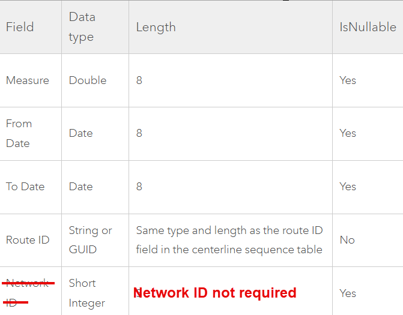

## Slide 4 — UI TESTs: Field Mapping

## Slide 5 — Run with a Line & Non-line Network in GP Tool when:

Result: user receives message that the tool ran successfully

- Calibration Points are appended successfully
- Routes with newly appended calibration points are recalibrated
- Success message is given with no error counts
Source Calibration Points: Feature Service
Target Network: Feature Service
Input Calibration Points:

| RouteID | From Date | To Date | Measure |
| --- | --- | --- | --- |
| R1 | 01/01/2025 | Null | 3 |
| R1 | 01/01/2025 | Null | 9 |

| RouteID | From Date | To Date |
| --- | --- | --- |
| R1 | 01/01/2025 | Null |

Black: Pre-existing CPs
Green: New CP

[figure: 1–10 · Route R1 · Output Route: · Route:]

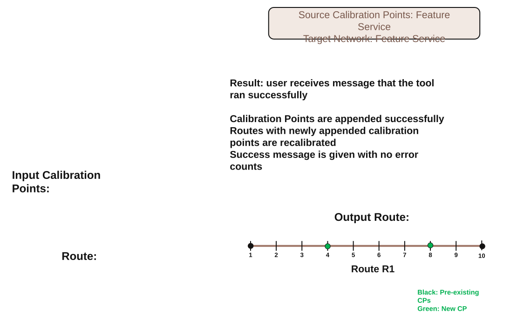

## Slide 6 — Run with a Line & Non-line Network in GP Tool when:

Result: user receives message that the tool ran successfully

- Calibration Points are appended successfully
- Off the route (but within tolerance) Calibration Points are moved onto route
- Routes with newly appended calibration points are recalibrated
- Success message is given with no error counts

Source Calibration Points: EGDB
Target Network: EGDB
Input Calibration Points:

| RouteID | From Date | To Date | Measure |
| --- | --- | --- | --- |
| R1 | 01/01/2025 | Null | 3 |
| R1 | 01/01/2025 | Null | 9 |

| RouteID | From Date | To Date |
| --- | --- | --- |
| R1 | 01/01/2025 | Null |

Black: Pre-existing CPs
Green: New CP

[figure: 1–10 · Output Route: · Route R1 · Route:]

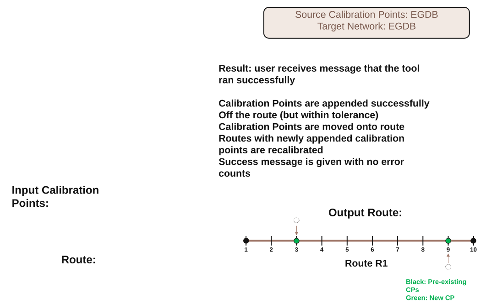

### Notes

Add test for CP off route but within network tolerance

## Slide 7 — Run with a Line & Non-line Network in GP Tool when:

Result: user receives message that the tool ran successfully

- Calibration Points are appended successfully to route
- New time slice is created
- Original R1 route and calibration points are not retired
- Routes with newly appended calibration points are recalibrated
- Success message is given with no error counts

Source Calibration Points: EGDB
Target Network: EGDB
Input Calibration Points:

| RouteID | From Date | To Date | Measure |
| --- | --- | --- | --- |
| R1 | 07/01/2025 | Null | 4 |

Route R1 (01/01/2025 – 07/01/2025)

| RouteID | From Date | To Date |
| --- | --- | --- |
| R1 | 01/01/2025 | Null |

Route R1 (07/01/2025 – Null)
Black: Pre-existing CPs
Green: New CP

[figure: 1–10 · Output Routes:]

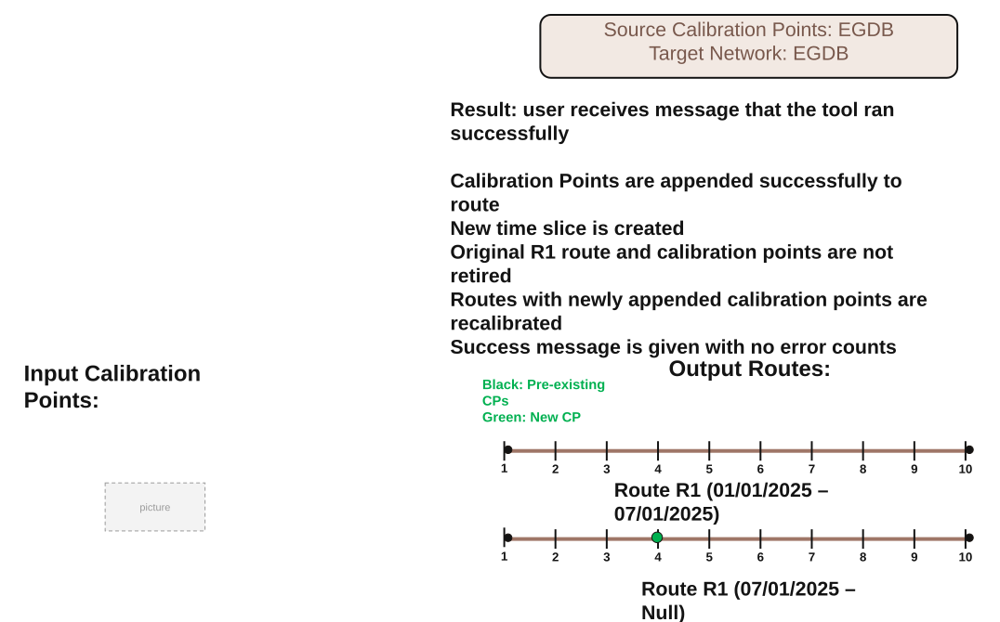

### Notes

Calibration pts did not retire?

## Slide 8 — Time Slice Tests on Active Route

| Case # | From Date | To Date |
| --- | --- | --- |
| 1 | 01/01/2000 | 12/31/2025 |
| 2 | 01/01/2005 | 12/31/2025 |
| 3 | 01/01/2025 | 12/31/2020 |
| 4 | 01/01/2000 | Null |
| 5 | 01/01/2005 | Null |
| 6 | 01/01/2030 | 01/01/2012 |
| 7 | Null | 12/31/2010 |
| 8 | Null | Null |

When route R1 has the following From/To Dates:
And then a Calibration Point with the following From/To Dates are appended to route R1:
Append successful + new time slice
Append successful + new time slice
Append successful + 3 new time slices
When a new time slice is created the original Route R1 is retired

Append successful + new time slice

[figure: 01/01/2000 · Null · Route R1 · Append successful · Append fails · duplicate]

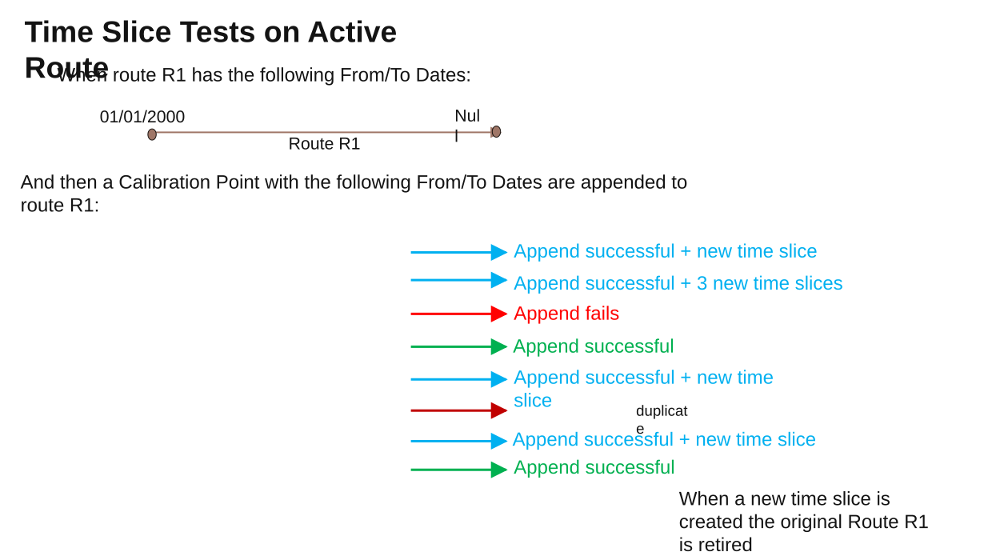

## Slide 9 — Time Slice Tests on Retired Route

| Case # | From Date | To Date |
| --- | --- | --- |
| 1 | 01/01/2000 | 12/31/2025 |
| 2 | 01/01/2005 | 12/31/2025 |
| 3 | 01/01/2025 | 12/31/2020 |
| 4 | 01/01/2000 | Null |
| 5 | 01/01/2005 | Null |
| 6 | 01/01/2030 | 01/01/2012 |
| 7 | Null | 12/31/2010 |
| 8 | Null | Null |

When route R1 has the following From/To Dates:
And then a Calibration Point with the following From/To Dates are appended to route R1:
Append successful + new time slice
Append successful + new time slice
Append successful + new time slice

[figure: 01/01/2000 · 12/31/2025 · Route R1 · Append successful · duplicate · Append Fails]

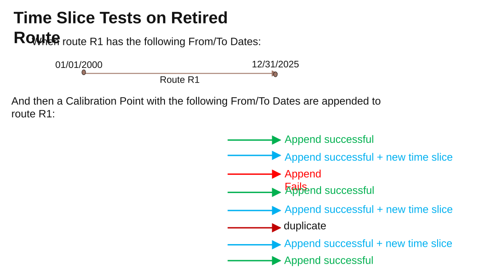

## Slide 10 — Run with a Line & Non-line Network in GP Tool when:

Result: user receives message that the tool ran successfully

- Z-value Calibration Points are appended successfully
- Routes with newly appended calibration points are recalibrated
- Success message is given with no error counts

Source Calibration Points: Feature Service
Target Network: FGDB
Input Calibration Points:

| RouteID | From Date | To Date | Measure | Z-value |
| --- | --- | --- | --- | --- |
| R1 | 01/01/2025 | Null | 8 | 10 |

| RouteID | From Date | To Date |
| --- | --- | --- |
| R1 | 01/01/2025 | Null |

Black: Pre-existing CPs
Green: New CP

[figure: 1–10 · Output Route: · Route R1 · 11 · 12 · Z-value: 10]

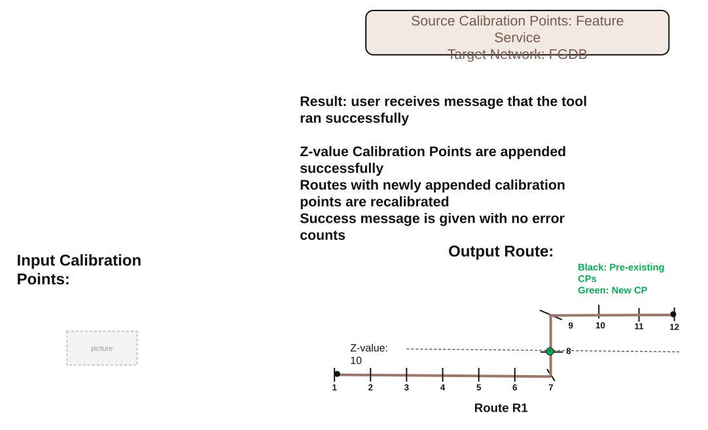

## Slide 11 — Run with a Line & Non-line Network in GP Tool when:

Result: user receives message that the tool ran with partial success

- Any valid Calibration Points are appended successfully
- Calibration Points off the route & not within tolerance are skipped
- Routes with newly appended calibration points are recalibrated
- Partial Success message is given with success and error counts
- Feature layer of failed Calibration Points is created with failure reason in status field + text file with error messages
- Message: Point geometry does not fall on route

Source Calibration Points: Feature Service
Target Network: EGDB
Input Calibration Points:

| RouteID | From Date | To Date | Measure | Z-value |
| --- | --- | --- | --- | --- |
| R1 | 01/01/2025 | Null | 8 | 25 |

Output Route: No new CPs

| RouteID | From Date | To Date |
| --- | --- | --- |
| R1 | 01/01/2025 | Null |

[figure: 1–10 · Route R1 · 11 · 12 · Z-value: 10 · Z-value: 25]

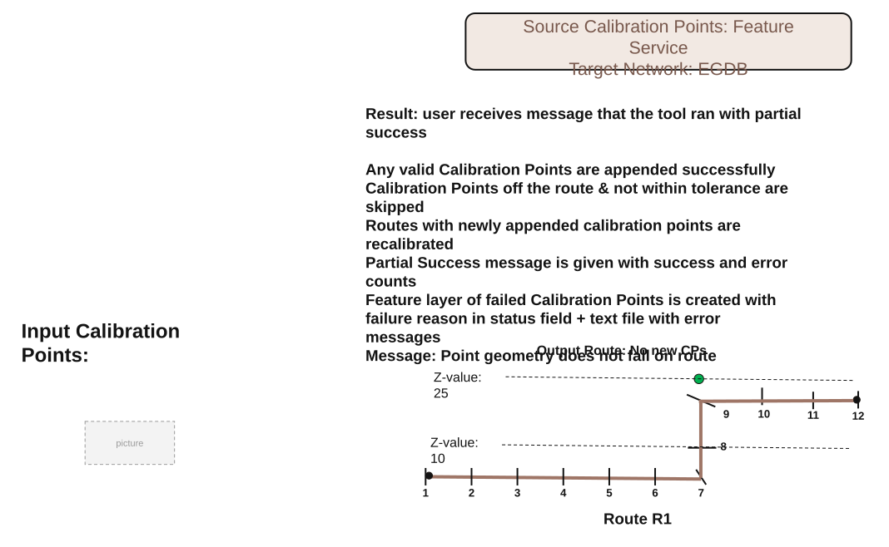

## Slide 12 — Run with a Line & Non-line Network in GP Tool when:

Result: user receives message that the tool ran successfully

- Calibration Points are appended successfully to route
- Routes with newly appended calibration points are recalibrated to reflect unequal measures
- Success message is given with no error counts

Input Calibration Points:

| RouteID | From Date | To Date | Measure |
| --- | --- | --- | --- |
| R1 | 01/01/2025 | Null | 8 |
| R1 | 01/01/2025 | Null | 4 |

| RouteID | From Date | To Date |
| --- | --- | --- |
| R1 | 01/01/2025 | Null |

Black: Pre-existing CPs
Green: New CP

Source Calibration Points: FGDB
Target Network: EGDB

[figure: 1–10 · Input Route: · Route R1 · Route: · 2 · 3 · 5 · 4 · 6–9 · 1 · 10 · Output Route:]

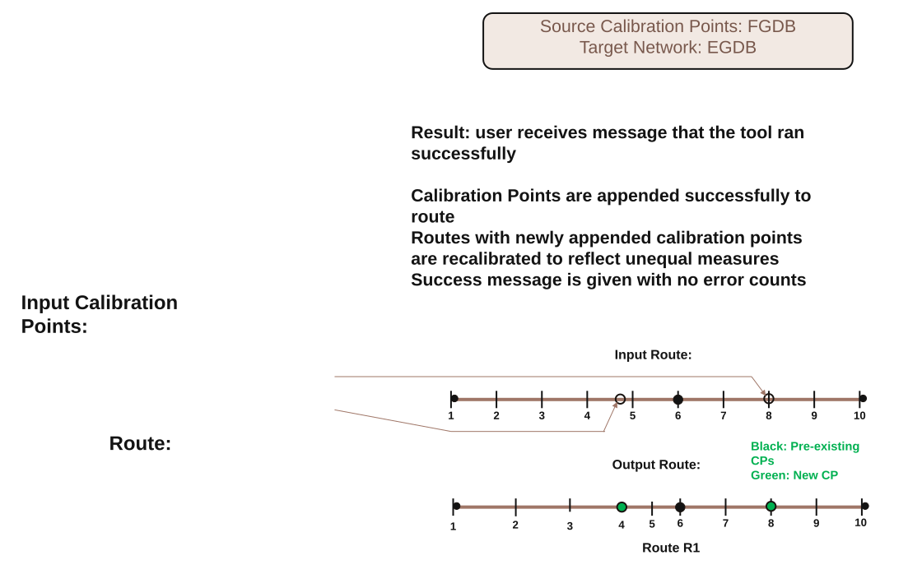

## Slide 13 — Run with a Line & Non-line Network in GP Tool when:

Result: user receives message that the tool ran successfully

- Calibration Points are appended successfully to branch route because the minimum requirement of four calibration points was met
- Routes with newly appended calibration points are recalibrated
- Success message is given with no error counts

Input Calibration Points:

| RouteID | From Date | To Date | Measure |
| --- | --- | --- | --- |
| R1 | 01/01/2025 | Null | 1 |
| R1 | 01/01/2025 | Null | 10 |
| R1 | 01/01/2025 | Null | 10 |
| R1 | 01/01/2025 | Null | 13 |

| RouteID | From Date | To Date |
| --- | --- | --- |
| R1 | 01/01/2025 | Null |

Black: Pre-existing CPs
Green: New CP

Source Calibration Points: FGDB
Target Network: Feature Service

[figure: Route R1 · Route: · 2 · 3 · 5 · 4 · 6–9 · 1 · 10 · Output Route: · 11–13]

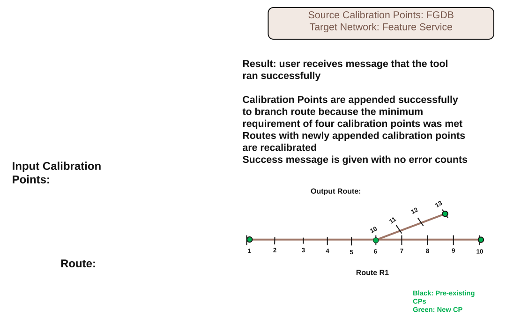

## Slide 14 — Run with a Line & Non-line Network in GP Tool when:

Result: user receives message that the tool ran with partial success

- Any valid Calibration Points are appended successfully
- Calibration Points on branch route are skipped
- Routes with newly appended calibration points are recalibrated
- Partial Success message is given with success and error counts
- Feature layer of failed Calibration Points is created with failure reason in status field + text file with error messages
- Message: Calibration points would introduce non-monotonic measures on route '%s'.

Input Calibration Points:

| RouteID | From Date | To Date | Measure |
| --- | --- | --- | --- |
| R1 | 01/01/2025 | Null | 1 |
| R1 | 01/01/2025 | Null | 22 |
| R1 | 01/01/2025 | Null | 10 |
| R1 | 01/01/2025 | Null | 13 |

| RouteID | From Date | To Date |
| --- | --- | --- |
| R1 | 01/01/2025 | Null |

Output Route: No new CPs

Source Calibration Points: EGDB
Target Network: Feature Service

[figure: Route R1 · Route: · 2 · 3 · 5 · 4 · 6–9 · 1 · 10–13 · 10]

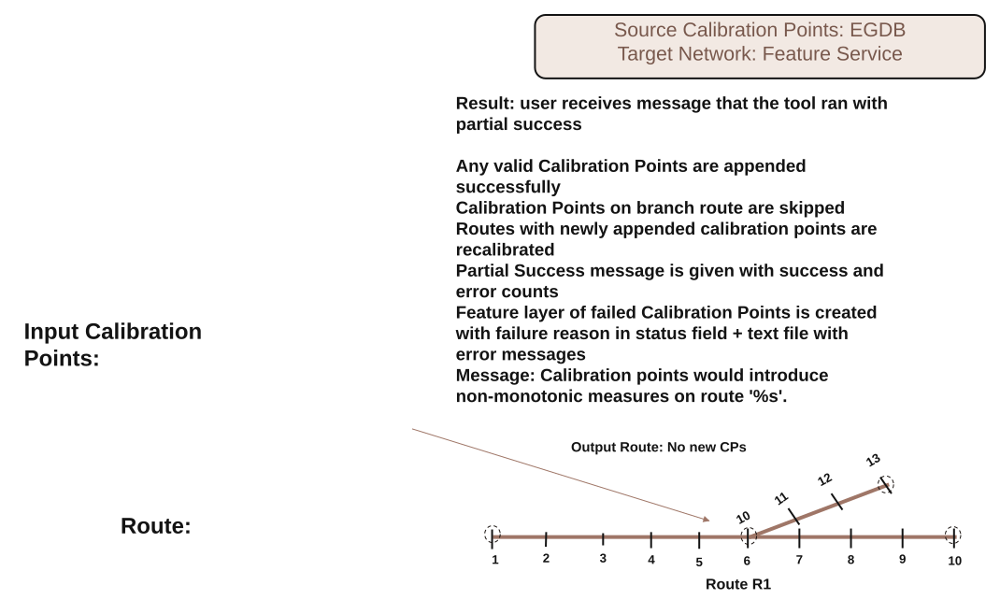

## Slide 15 — Run with a Line & Non-line Network in GP Tool when:

Result: user receives message that the tool ran with partial success

- Any valid Calibration Points are appended successfully
- Calibration Points that overlap existing calibration points are skipped
- Routes with newly appended calibration points are recalibrated
- Partial Success message is given with success and error counts
- Feature layer of failed Calibration Points is created with failure reason in status field + text file with error messages
- Message: There is already a calibration point for this route at this location.  Either add the calibration point at a different location or edit the existing calibration point using the Edit Calibration Point tool.

Input Calibration Points:

| RouteID | From Date | To Date | Measure |
| --- | --- | --- | --- |
| R1 | 01/01/2025 | Null | 1 |

| RouteID | From Date | To Date |
| --- | --- | --- |
| R1 | 01/01/2025 | Null |

Output Route: No new CPs
Source Calibration Points: EGDB
Target Network: FGDB

[figure: Route R1 · Route: · 2 · 3 · 5 · 4 · 6–9 · 1 · 10–13 · 10]

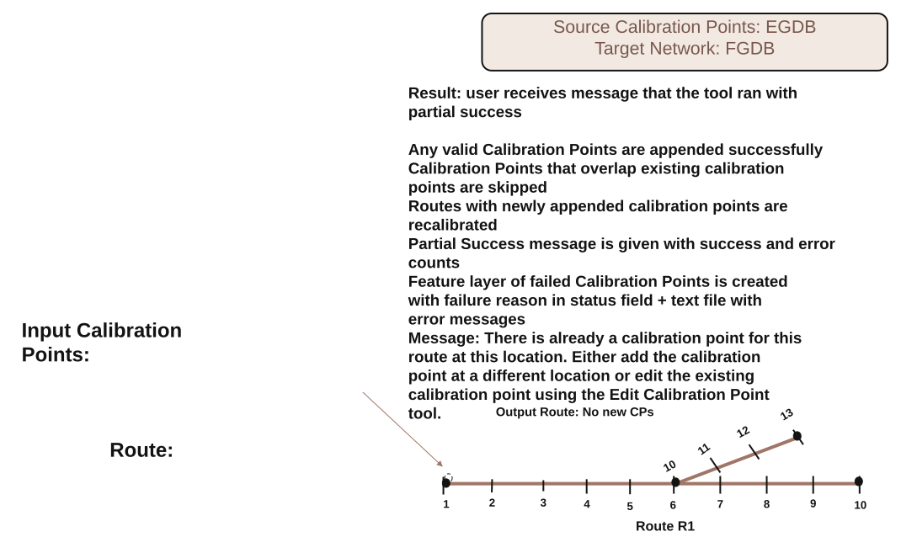

## Slide 16 — Run with a Line & Non-line Network in GP Tool when:

Result: user receives message that the tool ran with partial success

- Any valid Calibration Points are appended successfully
- Calibration Points off the route & not within tolerance are skipped
- Routes with newly appended calibration points are recalibrated
- Partial Success message is given with success and error counts
- Feature layer of failed Calibration Points is created with failure reason in status field + text file with error messages
- Message: Point geometry does not fall on route

Input Calibration Points:

| RouteID | From Date | To Date | Measure |
| --- | --- | --- | --- |
| R1 | 01/01/2025 | Null | 3 |
| R1 | 01/01/2025 | Null | 9 |

Output Route: no new CPs

| RouteID | From Date | To Date |
| --- | --- | --- |
| R1 | 01/01/2025 | Null |

[figure: 1–10 · Route R1]

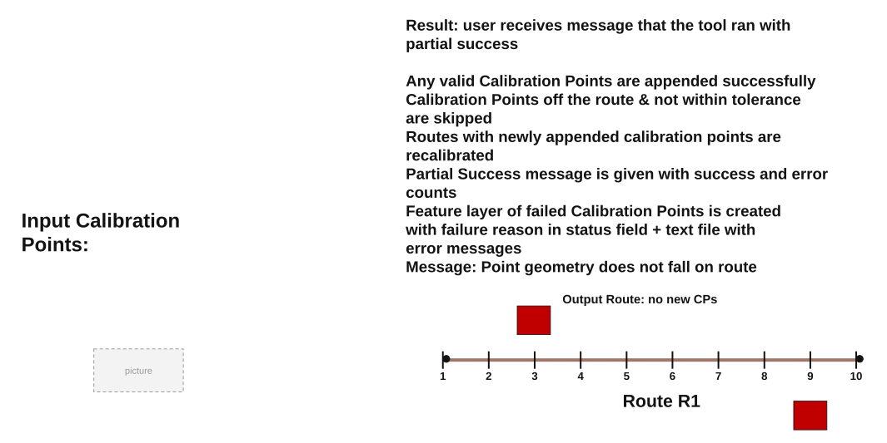

## Slide 17 — Run with a Line & Non-line Network in GP Tool when:

Result: user receives message that the tool ran with partial success

- Any valid Calibration Points are appended successfully
- Calibration Points on locked route are skipped
- Routes with newly appended calibration points are recalibrated
- Partial Success message is given with success and error counts
- Feature layer of failed Calibration Points is created with failure reason in status field + text file with error messages
- Message: Could not acquire conflict-prevention lock for route
Input Calibration Points:

| RouteID | From Date | To Date | Measure |
| --- | --- | --- | --- |
| R1 | 01/01/2025 | Null | 3 |
| R1 | 01/01/2025 | Null | 9 |

Output Route: no new CPs

| RouteID | From Date | To Date |
| --- | --- | --- |
| R1 (locked by other user/version) | 01/01/2025 | Null |

For Line Network, LineID is locked

[figure: 1–10 · Route R1]

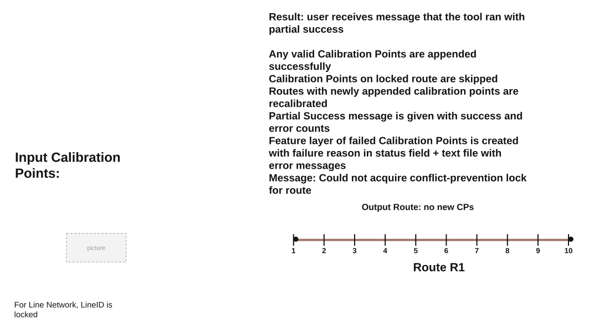

### Notes

Line network line id is locked

## Slide 18 — Run with a Line & Non-line Network in GP Tool when:

Result: user receives message that the tool ran with partial success

- Any valid Calibration Points are appended successfully
- Duplicate Calibration Points are skipped
- Routes with newly appended calibration points are recalibrated
- Partial Success message is given with success and error counts
- Feature layer of failed Calibration Points is created with failure reason in status field + text file with error messages
- Message: Calibration points would introduce non-monotonic measures on route

Input Calibration Points:

| RouteID | From Date | To Date | Measure |
| --- | --- | --- | --- |
| R1 | 01/01/2025 | Null | 3 |
| R1 | 01/01/2025 | Null | 9 |

| RouteID | From Date | To Date |
| --- | --- | --- |
| R1 | 01/01/2025 | Null |

Black: Pre-existing CPs
Green: New CP
There is a pre-existing CP at measure 3, so source CP at measure 3 is skipped

[figure: 1–10 · Output Route: · Route R1 · Route:]

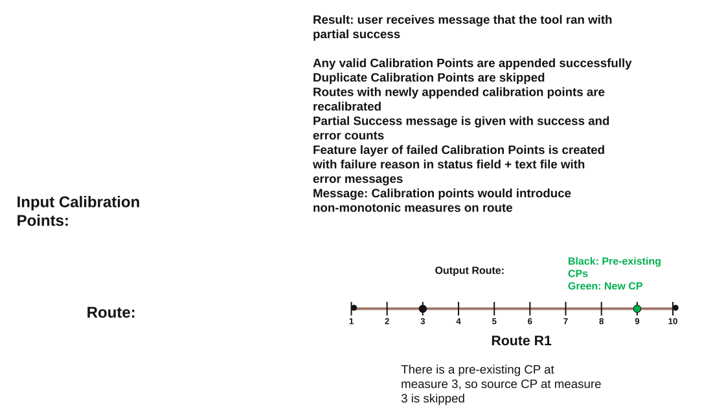

## Slide 19 — Run with a Line & Non-line Network in GP Tool when:

Input Calibration Points:

| RouteID | From Date | To Date | Measure |
| --- | --- | --- | --- |
| R1 | 07/01/2025 | Null | 3 |

Output Routes: no new CPs

| RouteID | From Date | To Date |
| --- | --- | --- |
| R1 | 01/01/2025 | Null |

Result: user receives message that the tool ran with partial success

- Any valid Calibration Points are appended successfully
- Calibration Points with duplicate measure skipped and all other calibration points on same route skipped
- Routes with newly appended calibration points are recalibrated
- Partial Success message is given with success and error counts
- Feature layer of failed Calibration Points is created with failure reason in status field + text file with error messages
- Message: Calibration points would introduce non-monotonic measures on route

[figure: 1–10 · Route:]

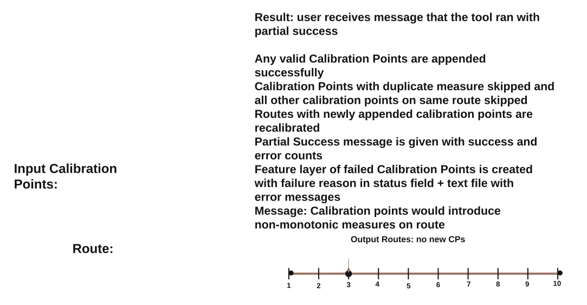

## Slide 20 — Run with a Line & Non-line Network in GP Tool when:

Result: user receives message that the tool ran with partial success

- Any valid Calibration Points are appended successfully
- Overlapping Calibration Points are skipped
- Routes with newly appended calibration points are recalibrated
- Partial Success message is given with success and error counts
- Feature layer of failed Calibration Points is created with failure reason in status field + text file with error messages
- Message: There is already a calibration point for this route at this location.  Either add the calibration point at a different location or edit the existing calibration point using the Edit Calibration Point tool.

Input Calibration Points:

| RouteID | From Date | To Date | Measure |
| --- | --- | --- | --- |
| R1 | 01/01/2025 | Null | 3.01 |
| R1 | 01/01/2025 | Null | 9 |

| RouteID | From Date | To Date |
| --- | --- | --- |
| R1 | 01/01/2025 | Null |

Black: Pre-existing CPs
Green: New CP
There is a pre-existing CP that the source CP with measure 3 overlaps, so the source CP is skipped

[figure: 1–10 · Output Route: · Route R1 · Route:]

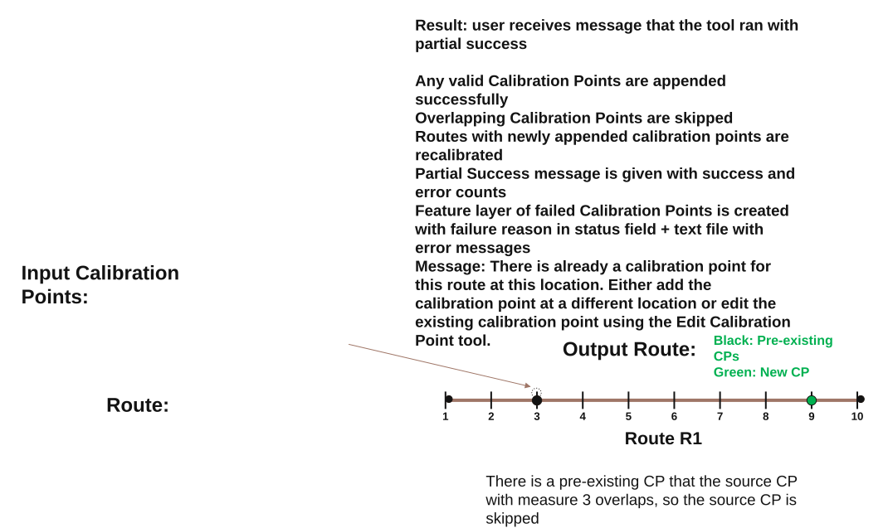

### Notes

If the dates are different it will create a time slice

## Slide 21 — Run with a Line & Non-line Network in GP Tool when:

Result: user receives message that the tool ran with partial success

- Any valid Calibration Points are appended successfully
- Route with duplicate Calibration Points is skipped
- Routes with newly appended calibration points are recalibrated
- Partial Success message is given with success and error counts
- Feature layer of failed Calibration Points is created with failure reason in status field + text file with error messages
- Message: Calibration points would create non-monotonic measures on route

Input Calibration Points:

| RouteID | From Date | To Date | Measure |
| --- | --- | --- | --- |
| R1 | 01/01/2025 | Null | 3 |
| R1 | 01/01/2025 | Null | 3 |
| R1 | 01/01/2025 | Null | 9 |

Output Route: No new CPs

| RouteID | From Date | To Date |
| --- | --- | --- |
| R1 | 01/01/2025 | Null |

[figure: 1–10 · Route R1 · Route:]

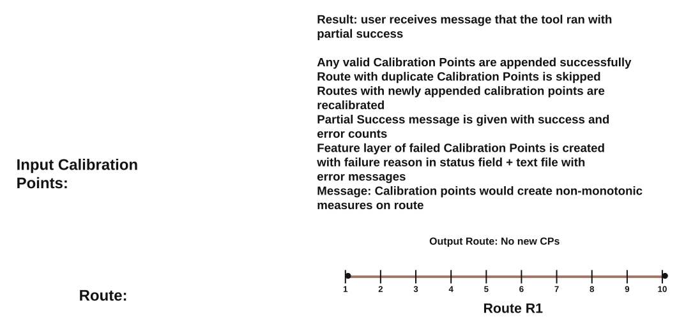

## Slide 22 — Run with a Line & Non-line Network in GP Tool when:

Result: user receives message that the tool ran with partial success

- Any valid Calibration Points are appended successfully
- Route with overlapping Calibration Points is skipped
- Routes with newly appended calibration points are recalibrated
- Partial Success message is given with success and error counts
- Feature layer of failed Calibration Points is created with failure reason in status field + text file with error messages
- Message: Calibration points would create non-monotonic measures on route

Input Calibration Points:

| RouteID | From Date | To Date | Measure |
| --- | --- | --- | --- |
| R1 | 01/01/2025 | Null | 3 |
| R1 | 01/01/2025 | Null | 3.01 |
| R1 | 01/01/2025 | Null | 9 |

Output Route: No new CPs

| RouteID | From Date | To Date |
| --- | --- | --- |
| R1 | 01/01/2025 | Null |

[figure: 1–10 · Route R1 · Route: · overlap]

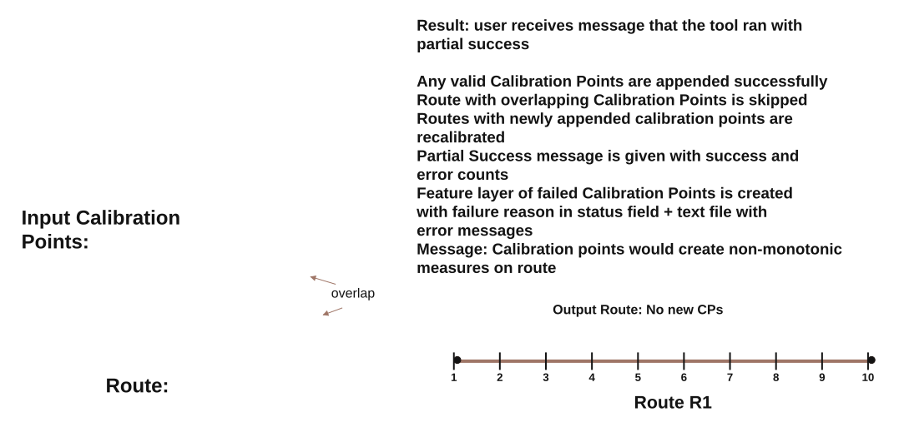

### Notes

Test overlapping cps when the existing cp is retired/not in same time range as source cp – should append successfully

## Slide 23 — Run with a Line & Non-line Network in GP Tool when:

Result: user receives message that the tool ran successfully

- Calibration Point is appended successfully to time-slice with matching dates
- Routes with newly appended calibration points are recalibrated
- Success message is given with no error counts

Input Calibration Points:

| RouteID | From Date | To Date | Measure |
| --- | --- | --- | --- |
| R1 | 01/01/2020 | 01/01/2025 | 3 |

| RouteID | From Date | To Date |
| --- | --- | --- |
| R1 | 01/01/2020 | 01/01/2025 |
| R1 | 01/01/2025 | Null |

Black: Pre-existing CPs
Green: New CP

[figure: 1–10 · Input Route · Route R1 · Route: · Overlaps existing CP · Output Route]

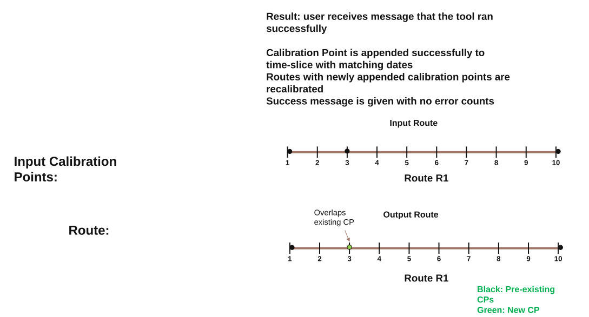

### Notes

Test overlapping cps when the existing cp is retired/not in same time range as source cp – should append successfully

## Slide 24 — Run with a Line & Non-line Network in GP Tool when:

Result: user receives message that the tool ran with partial success

- Any valid Calibration Points are appended successfully
- Invalid Calibration Points are skipped
- Routes with newly appended calibration points are recalibrated
- Partial Success message is given with success and error counts
- Feature layer of failed Calibration Points is created with failure reason in status field + text file with error messages
- Message: Route Id or measure fields are missing or empty

Input Calibration Points:

| RouteID | From Date | To Date | Measure |
| --- | --- | --- | --- |
| R1 | 01/01/2025 | Null | Null |
| R1 | 01/01/2025 | Null | H |
| R1 | 01/01/2025 | Null | 2* |

Output Route: No new CPs

| RouteID | From Date | To Date |
| --- | --- | --- |
| R1 | 01/01/2025 | Null |

[figure: 1–10 · Route R1 · Route:]

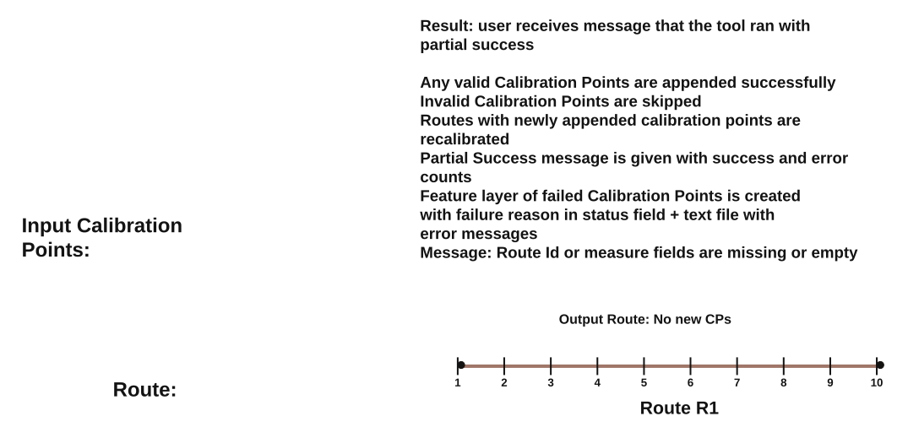

## Slide 25 — Run with a Line & Non-line Network in GP Tool when:

Result: user receives message that the tool ran with partial success

- Any valid Calibration Points are appended successfully
- Calibration Points with null Route ID or measure are skipped
- Routes with newly appended calibration points are recalibrated
- Partial Success message is given with success and error counts
- Feature layer of failed Calibration Points is created with failure reason in status field + text file with error messages
- Message: Route Id or measure fields are missing or empty.

Input Calibration Points:

| RouteID | From Date | To Date | Measure |
| --- | --- | --- | --- |
| Null | 01/01/2025 | Null | 3 |
| R1 | 01/01/2025 | Null | Null |

Output Route: No new CPs

| RouteID | From Date | To Date |
| --- | --- | --- |
| R1 | 01/01/2025 | Null |

[figure: 1–10 · Route R1 · Route:]

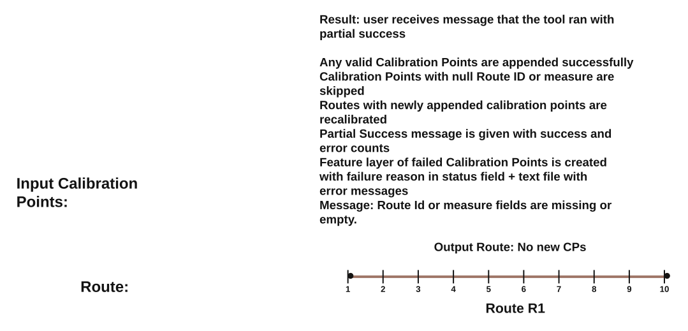

## Slide 26 — Run with a Line & Non-line Network in GP Tool when:

Result: user receives message that the tool ran with partial success

- Any valid Calibration Points are appended successfully
- Calibration Points with Route ID not in Network are skipped
- Routes with newly appended calibration points are recalibrated
- Partial Success message is given with success and error counts
- Feature layer of failed Calibration Points is created with failure reason in status field + text file with error messages
- Message: Point geometry does not fall on route

Input Calibration Points:

| RouteID | From Date | To Date | Measure |
| --- | --- | --- | --- |
| R99 | 01/01/2025 | Null | 3 |
| R1 | 01/01/2025 | Null | 9 |

| RouteID | From Date | To Date |
| --- | --- | --- |
| R1 | 01/01/2025 | Null |
| R99 – does not exist |  |  |

Black: Pre-existing CPs
Green: New CP

[figure: 1–10 · Output Route: · Route R1 · Route:]

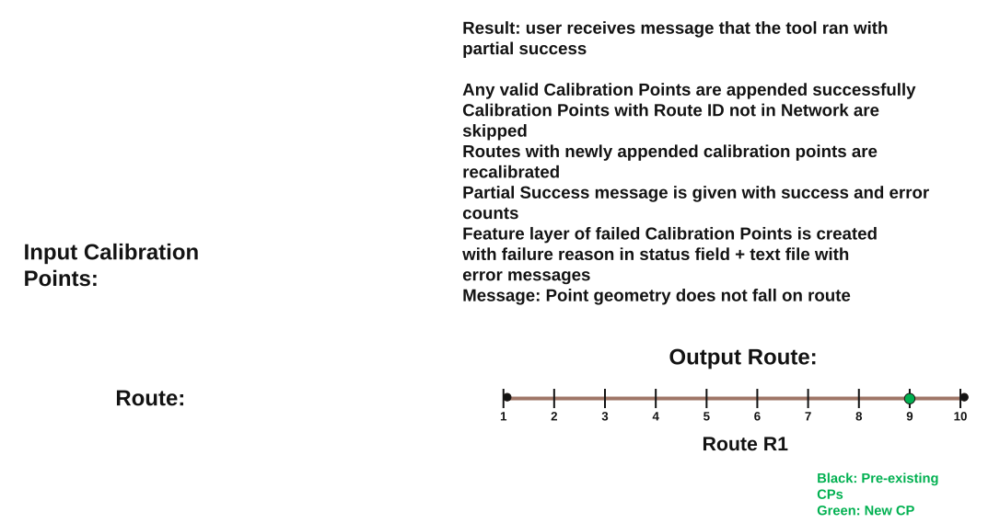

## Slide 27 — Run with a Line & Non-line Network in GP Tool when:

Result: user receives message that the tool ran with partial success

- Any valid Calibration Points are appended successfully
- All Calibration Points on route will be skipped for non-monotonic scenario
- Routes with newly appended calibration points are recalibrated
- Partial Success message is given with success and error counts
- Feature layer of failed Calibration Points is created with failure reason in status field + text file with error messages
- Message: Calibration points would introduce non-monotonic measures on route '%s'.

Input Calibration Points:

| RouteID | From Date | To Date | Measure |
| --- | --- | --- | --- |
| R1 | 01/01/2025 | Null | 4 |
| R1 | 01/01/2025 | Null | 8 |

Output Route: No new CPs

| RouteID | From Date | To Date |
| --- | --- | --- |
| R1 | 01/01/2025 | Null |

[figure: 1–10 · Route R1 · Route:]

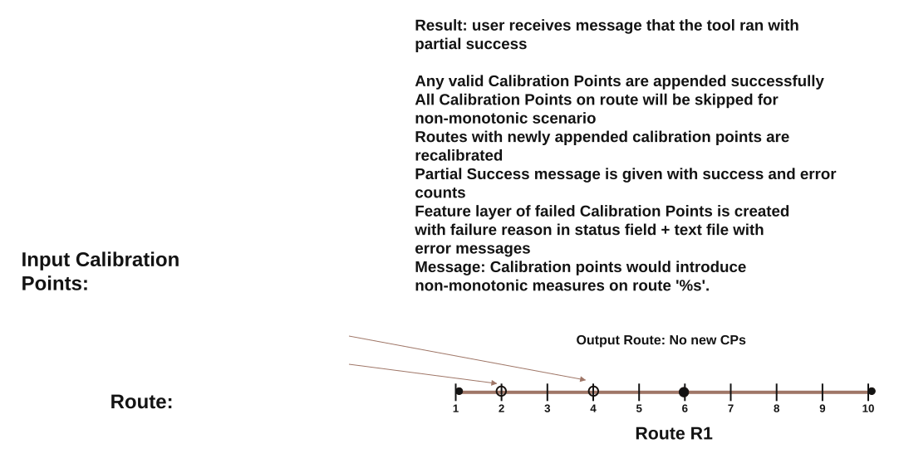

## Slide 28 — Run with a Line & Non-line Network in GP Tool when:

Result: user receives message that the tool ran with partial success

- Calibration Points on lollipop route fail to append because the minimum requirement of four calibration points was not met (missing another CP in loop)
- Routes with newly appended calibration points are recalibrated
- Partial Success message is given with success and error counts
- Feature layer of failed Calibration Points is created with failure reason in status field + text file with error messages
- Message: Calibration points would introduce non-monotonic measures on route

Input Calibration Points:

| RouteID | From Date | To Date | Measure |
| --- | --- | --- | --- |
| R1 | 01/01/2025 | Null | 1 |
| R1 | 01/01/2025 | Null | 9 |
| R1 | 01/01/2025 | Null | 17 |

Output Route: No new CPs

| RouteID | From Date | To Date |
| --- | --- | --- |
| R1 | 01/01/2025 | Null |

[figure: 1–10 · Route R1 · Route: · 11–17]

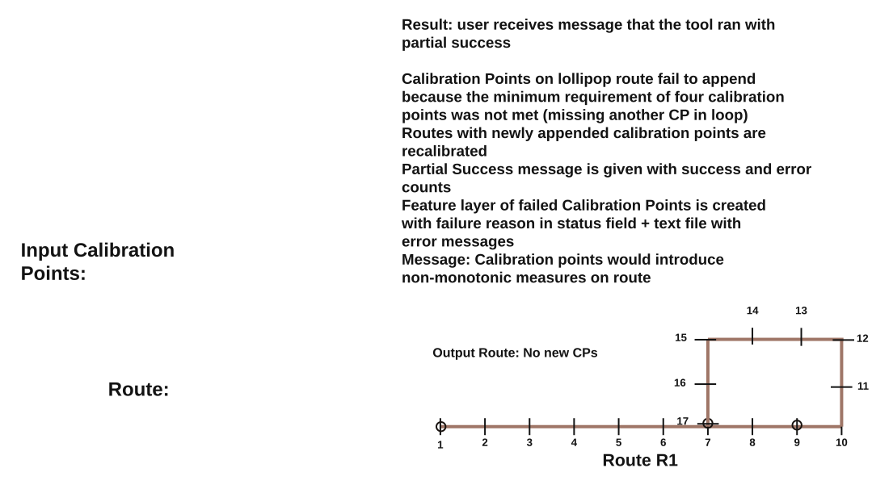

## Slide 29 — Run with a Line & Non-line Network in GP Tool when:

Result: user receives message that the tool ran with partial success

- Calibration Points on alpha route fail to append because the minimum requirement of four calibration points was not met (missing another CP in loop)
- Routes with newly appended calibration points are recalibrated
- Partial Success message is given with success and error counts
- Feature layer of failed Calibration Points is created with failure reason in status field + text file with error messages
- Message: Calibration points would introduce non-monotonic measures on route

Input Calibration Points:

| RouteID | From Date | To Date | Measure |
| --- | --- | --- | --- |
| R1 | 01/01/2025 | Null | 0 |
| R1 | 01/01/2025 | Null | 6.33 |
| R1 | 01/01/2025 | Null | 15 |

Output Route: No new CPs

| RouteID | From Date | To Date |
| --- | --- | --- |
| R1 | 01/01/2025 | Null |

[figure: 0 · 2 · 15 · 14 · 4–7 · Route R1 · Route: · 8–12 · 17]

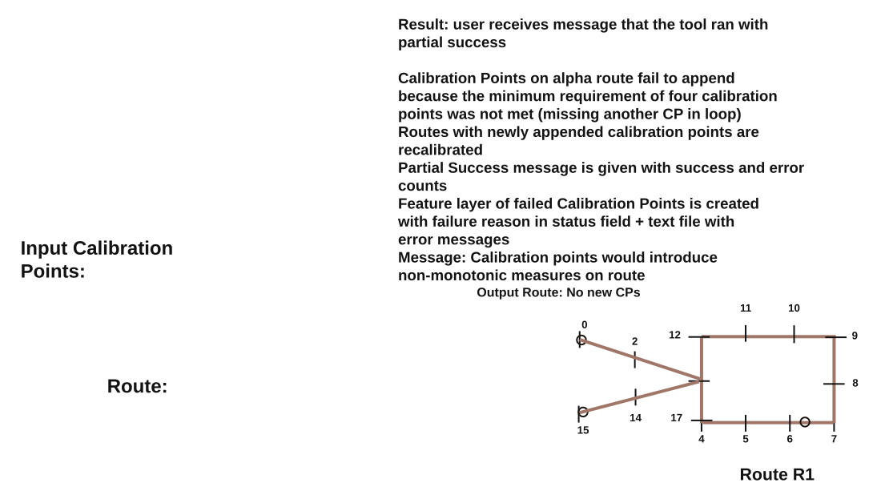

## Slide 30 — Run with a Line & Non-line Network in GP Tool when:

Result: user receives message that the tool ran with partial success

- Calibration Points on loop route fail to append because the minimum requirement of four calibration points was not met (missing CP at start of route)
- Routes with newly appended calibration points are recalibrated
- Partial Success message is given with success and error counts
- Feature layer of failed Calibration Points is created with failure reason in status field + text file with error messages
- Message: Calibration points would introduce non-monotonic measures on route

Input Calibration Points:

| RouteID | From Date | To Date | Measure |
| --- | --- | --- | --- |
| R1 | 01/01/2025 | Null | 4 |
| R1 | 01/01/2025 | Null | 7 |
| R1 | 01/01/2025 | Null | 10 |

Output Route: No new CPs

| RouteID | From Date | To Date |
| --- | --- | --- |
| R1 | 01/01/2025 | Null |

[figure: 1–9 · 0 · Route R1 · Route: · 10]

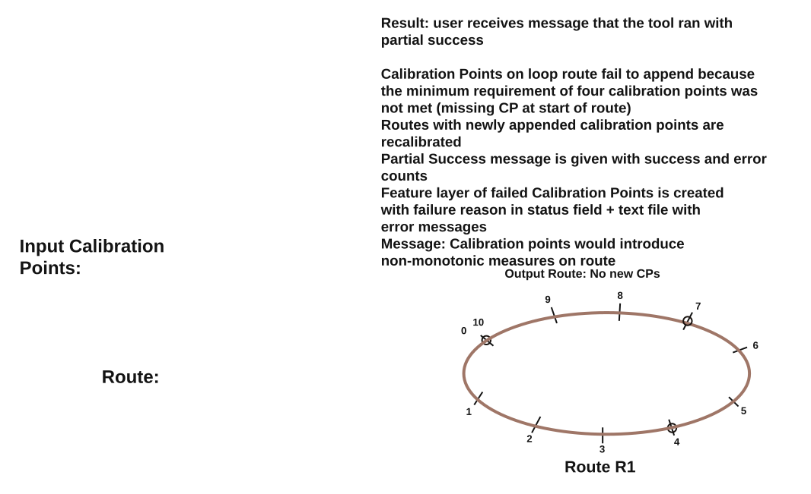

## Slide 31 — Run with a Line & Non-line Network in GP Tool when:

Result: user receives message that the tool ran with partial success

- Any valid Calibration Points are appended successfully
- Calibration Points on infinity route are skipped
- Routes with newly appended calibration points are recalibrated
- Partial Success message is given with success and error counts
- Feature layer of failed Calibration Points is created with failure reason in status field + text file with error messages
- Message: Calibration points would introduce non-monotonic measures on route '%s'.

Input Calibration Points:

| RouteID | From Date | To Date | Measure |
| --- | --- | --- | --- |
| R1 | 01/01/2025 | Null | 0 |
| R1 | 01/01/2025 | Null | 3.33 |
| R1 | 01/01/2025 | Null | 19 |
| R1 | 01/01/2025 | Null | 13.33 |
| R1 | 01/01/2025 | Null | 16.67 |
| R1 | 01/01/2025 | Null | 20 |

Output Route: No new CPs

| RouteID | From Date | To Date |
| --- | --- | --- |
| R1 | 01/01/2025 | Null |

[figure: 19 · 3.33 · 16.67 · 20 · 13.33 · 0 · Route R1 · Route: · 10]

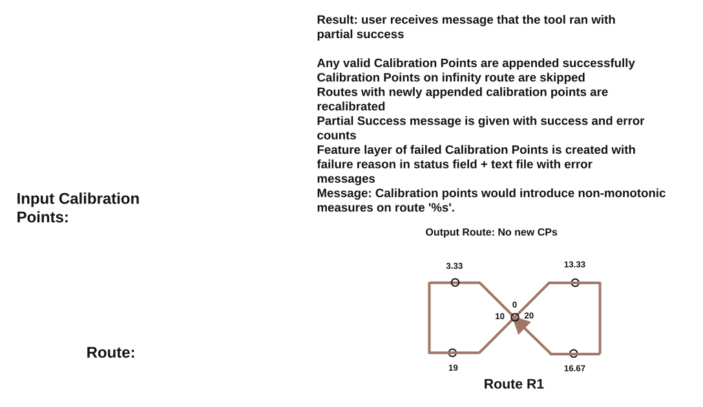

## Slide 32

Apply Event Behavior Tests:
Run Apply Event Behaviors on routes with Move events when:

| Event | RouteID | From Measure | To Measure |
| --- | --- | --- | --- |
| EventA | R1 | 0 | 3 |
| EventB | R1 | 3 | 7 |
| EventC | R1 | 7 | 10 |

New CP from Append Calibration Points

Result: measures are not changed, but events are moved

| Event | RouteID | From Measure | To Measure |
| --- | --- | --- | --- |
| EventA | R1 | 0 | 3 |
| EventB | R1 | 3 | 7 |
| EventC | R1 | 7 | 10 |

[figure: 0 · 2 · 5 · 10 · 7 · Route R1 · Recalibrated section]

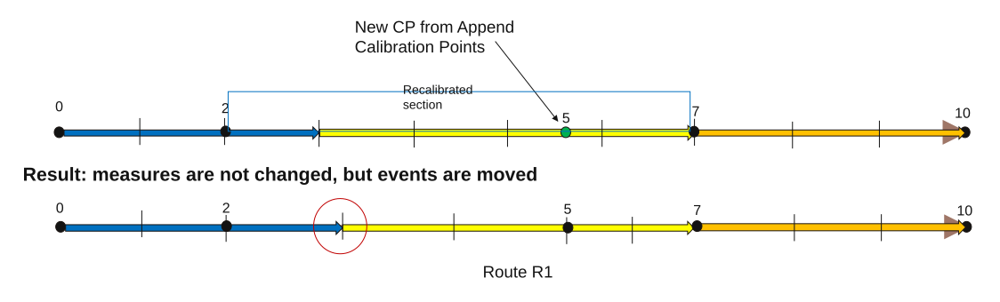

## Slide 33

Apply Event Behavior Tests:
Run Apply Event Behaviors on routes with Stay Put events when:

| Event | RouteID | From Measure | To Measure |
| --- | --- | --- | --- |
| EventA | R1 | 0 | 2.75 |
| EventB | R1 | 2.75 | 7 |
| EventC | R1 | 7 | 10 |

New CP from Append Calibration Points

Result: measures are changed, but events do not move

| Event | RouteID | From Measure | To Measure |
| --- | --- | --- | --- |
| EventA | R1 | 0 | 3 |
| EventB | R1 | 3 | 7 |
| EventC | R1 | 7 | 10 |

Events moved, measures did not (scenic byway)

[figure: 0 · 2 · 5 · 10 · 7 · Route R1 · Recalibrated section]

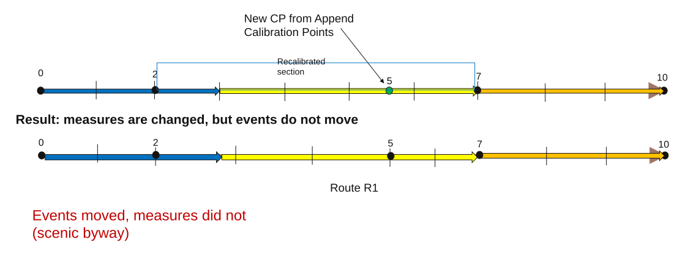

## Slide 34

Apply Event Behavior Tests:
Run Apply Event Behaviors on routes with Retire events when:

| Event | RouteID | From Measure | To Measure |
| --- | --- | --- | --- |
| EventA | R1 | 0 | 3 |
| EventB | R1 | 3 | 7 |
| EventC | R1 | 7 | 10 |

New CP from Append Calibration Points

Result: measures and events are not changed, but events within the recalibrated section are retired

| Event | RouteID | From Measure | To Measure |
| --- | --- | --- | --- |
| EventA | R1 | 0 | 3 |
| EventB | R1 | 3 | 7 |
| EventC | R1 | 7 | 10 |

[figure: 0 · 2 · 5 · 10 · 7 · Route R1 · Recalibrated section · Retired]

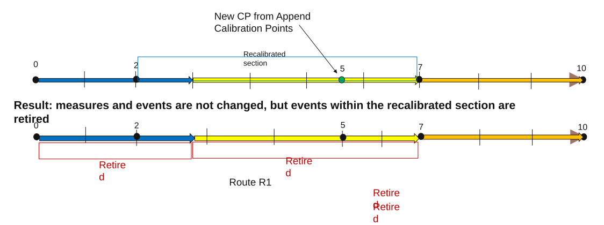

## Slide 35

Result: user receives message that the tool ran with partial success

- Valid Calibration Points are appended successfully
- Invalid Calibration Points are skipped
- Routes with newly appended calibration points are recalibrated
- Partial Success message is given with success and error counts
- Feature layer of failed Calibration Points is created + text file with error messages
- No timeout or failure occurs on large dataset
Performance Tests:
Run with full Transmountain & CDOT or ODOT datasets – benchmark w/ append routes
-Test appending thousands of calibration points onto one route

## Slide 36 — Run with a Line & Non-line Network in Model Builder when:

Result: user receives message that the tool ran successfully

- Calibration Points are appended successfully
- Routes with newly appended calibration points are recalibrated
- Success message is given with success and error counts
GP tools to chain: append routes + append CPs + generate routes

## Slide 37 — Run with a Line & Non-line Network in Python when:

- Source or Target Calibration Point layers are missing required fields
- LRS Network field does not contain a Network layer
- Source Calibration Point is empty
- Source & Target Calibration Point layers are the same
- Source & Target layers have different coordinate methods
- Source & Target fields do not have matching data types/lengths
Result: Fails in python with error message

## Slide 38 — Run with a Line & Non-line Network in Python when:

Result: user receives message that the tool ran successfully

- Calibration Points are appended successfully
- Routes with newly appended calibration points are recalibrated
- Success message is given

## Slide 39 — Run with a Line & Non-line Network in Python when:

Result: user receives message that the tool ran with partial success

- Valid Calibration Points are appended successfully
- Invalid Calibration Points are skipped
- Routes with newly appended calibration points are recalibrated
- Partial Success message is given with success and error counts
- Feature layer of failed Calibration Points is created + text file with error messages
