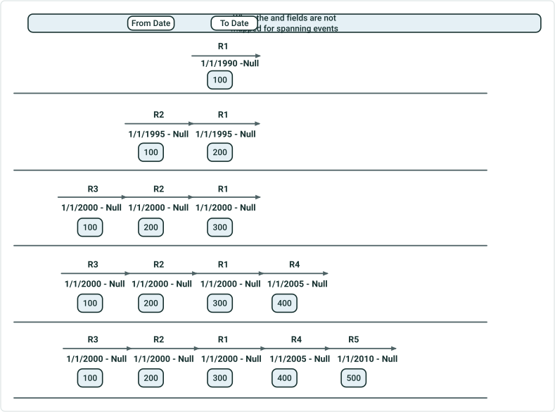
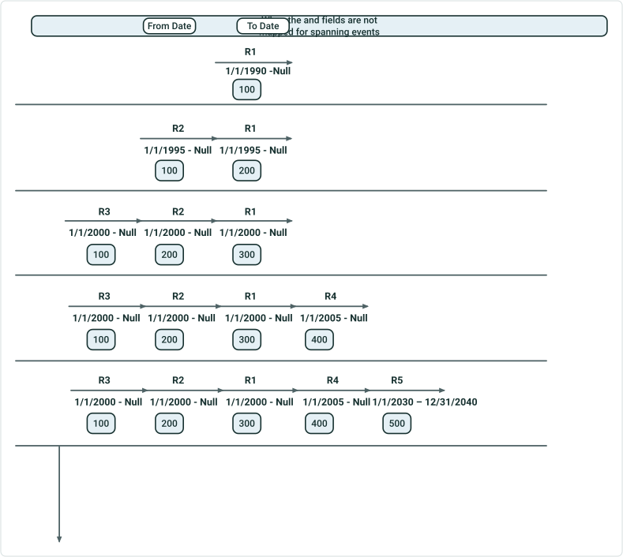
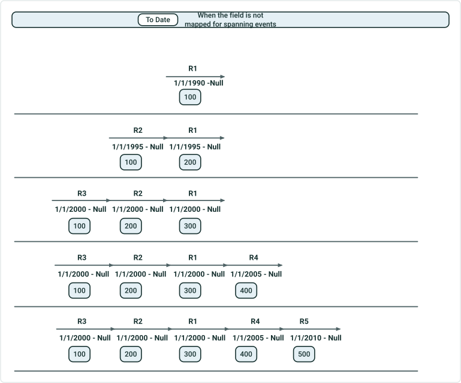

# Append Events Date Optional Test Plan

|   |   |
| --- | --- |
| **Kind** | Test Plan · Pro |
| **Release** | — |
| **Source** | [AppendEvents_DateOptional_TestPlan.pptx](<https://esriis.sharepoint.com/sites/LocationReferencing/Shared%20Documents/General/Test%20Plans/AppendEvents_DateOptional_TestPlan.pptx>) |
| **Edited** | 2025-09-05 18:19 by Rahul Rakshit |
| **Extracted** | 2026-09-04 · lane `xmlstrip` |

<!-- metadata
```yaml
title: "Append Events Date Optional Test Plan"
source_file: "AppendEvents_DateOptional_TestPlan.pptx"
source_url: "https://esriis.sharepoint.com/sites/LocationReferencing/Shared%20Documents/General/Test%20Plans/AppendEvents_DateOptional_TestPlan.pptx"
doc_id: 126
doc_kind: "Test Plan"
surface: "Pro"
doc_revision: ""
target_release: ""
pe: ""
dev: ""
author: "Rahul Rakshit"
last_edited_by: "Rahul Rakshit"
last_edited: "2025-09-05T18:19:33Z"
extracted: 2026-09-04
extraction_lane: xmlstrip
prompt_version: "v2.0.2"
keywords: ["append events", "date fields", "event appending", "spanning events", "route", "conflict prevention", "test plan"]
tools: []
products: []
issues: []
related: [{"doc":143,"file":"support-optional-date-field-mapping-in-append-events-tool__doc143.md","s":6.224},{"doc":279,"file":"consider-route-dominance-in-append-events-add-method-test-plan__doc279.md","s":4.687},{"doc":549,"file":"append-events-load-events-by-routename-test-plan__doc549.md","s":4.311},{"doc":278,"file":"consider-route-dominance-in-append-events-test-plan__doc278.md","s":4.233},{"doc":124,"file":"append-events-location-referencing__doc124.md","s":4.189}]
```
-->

## Summary

Test plan for handling scenarios where From Date and To Date fields are optionally mapped or not mapped in event data appending processes. Includes validation of date field mapping cases, conflict prevention settings, and behavior for spanning events with various route and date configurations.

## Related documents

<!-- related:begin -->
- [Support Optional Date Field Mapping in Append Events Tool](<https://esriis.sharepoint.com/sites/lrsworkspace/LRS Doc Index/User Stories/support-optional-date-field-mapping-in-append-events-tool__doc143.md>) — similar text 0.26 · 4 title words · 4 filename words · same surface <!-- rel:143 -->
- [Consider Route Dominance in Append Events (add method) – Test Plan](<https://esriis.sharepoint.com/sites/lrsworkspace/LRS Doc Index/Test Plans/consider-route-dominance-in-append-events-add-method-test-plan__doc279.md>) — similar text 0.14 · 2 title words · 2 filename words · same kind/surface/folder <!-- rel:279 -->
- [Append Events: Load Events by RouteName Test Plan](<https://esriis.sharepoint.com/sites/lrsworkspace/LRS Doc Index/Test Plans/append-events-load-events-by-routename-test-plan__doc549.md>) — similar text 0.18 · 2 title words · 2 filename words · same kind/surface/folder <!-- rel:549 -->
- [Consider Route Dominance in Append Events Test Plan](<https://esriis.sharepoint.com/sites/lrsworkspace/LRS Doc Index/Test Plans/consider-route-dominance-in-append-events-test-plan__doc278.md>) — similar text 0.13 · 2 title words · 2 filename words · same kind/folder <!-- rel:278 -->
- [Append Events (Location Referencing)](<https://esriis.sharepoint.com/sites/lrsworkspace/LRS Doc Index/Other/append-events-location-referencing__doc124.md>) — similar text 0.11 · 2 title words · 2 filename words · same surface <!-- rel:124 -->
<!-- related:end -->

<!-- docs:begin -->
## Esri documentation

[Event editing using the attribute table](https://doc.esri.com/en/arcgis-pro/latest/help/production/location-referencing-pipelines/event-editing-using-the-attribute-table.html) · [Conflict prevention](https://doc.esri.com/en/arcgis-pro/latest/help/production/location-referencing-pipelines/conflict-prevention.html)

_No page matched:_ [append events gp](https://www.google.com/search?q=%22append%20events%20gp%22+site%3Adoc.esri.com)
<!-- docs:end -->

---

## Slide 1


## Slide 2

When  the           field is not mapped

| Case# | From Date | To Date | Result |
| --- | --- | --- | --- |
| 1 | Mapped |  | Allow |
| 2 |  | Mapped | Error |
| 3 |  |  | Allow |
| 4 | Mapped | Mapped | Allow |

- Verify that all these field mapping scenarios work for the From and To Date fields

|  | Route |  | Loading Event |  | Output Event |  | Loc Error |
| --- | --- | --- | --- | --- | --- | --- | --- |
|  | From Date | To Date | From Date | To Date | From Date | To Date |  |
| 1 | 1/1/2000 | Null | 1/1/2000 | Null | 1/1/2000 | Null |  |
| 2 | 1/1/2000 | Null | 1/1/2000 |  | 1/1/2000 | Null |  |
| 3 | 1/1/2000 | 12/31/2020 | 1/1/2000 |  | 1/1/2000 | 12/31/2020 |  |
|  | Warning: there was no active time slice of the route to associate the event with |  |  |  | 12/31/2020 | Null | Route not found |
| 4 | 1/1/2000 | 12/31/2030 | <Null> |  | Null | 1/1/2000 | Route not found |
|  | Warning: there was no active time slice of the route to associate the event with |  |  |  | 1/1/2000 | 12/31/2030 |  |
|  |  |  |  |  | 12/31/2030 | Null | Route not found |

To Date
Tests

- LRS Data in FGDB, DC and FS
- Append data in FGDB and DC
- Append data in feature class and in table
- Conflict prevention ON
- Conflict prevention ON but ignored
- Conflict prevention OFF
- Test with inline and external PY
- Test in Model Builder
If date fields are present in the loading event data, and they are not mapped, then do not consider them in the GP tool.

## Slide 3

When  the                       and                     fields are not mapped

|  | Route |  | Loading Event |  | Output Event |  | Loc Error |
| --- | --- | --- | --- | --- | --- | --- | --- |
| 1 | 1/1/2000 | Null |  |  | 1/1/2000 | Null |  |
| 2 | 1/1/2000 | 12/31/2020 |  |  | Null | 1/1/2000 | Route not found |
|  | Warning: there was no active time slice of the route to associate the event with |  |  |  | 1/1/2000 | 12/31/2020 |  |
|  |  |  |  |  | 12/31/2020 | Null | Route not found |
| 3 | 1/1/2000 | 12/31/2030 |  |  | 1/1/2000 | 12/31/2030 |  |
|  |  |  |  |  | 12/31/2020 | Null | Route not found |

To Date
From  Date

## Slide 4



|  | Loading Event |  |  |  | Output Event |  |  |  |  |
| --- | --- | --- | --- | --- | --- | --- | --- | --- | --- |
| Test | From Route | To Route | From Date | To Date | From Route | To Route | From Date | To Date | Loc Error |
| 1 | R3 | R5 |  |  | R3 | R5 | 1/1/2010 | Null |  |
| 2 | R3 | R4 |  |  | R3 | R4 | 1/1/2010 | Null |  |
| 3 | R1 | R5 |  |  | R1 | R5 | 1/1/2010 | Null |  |
| 4 | R3 | R2 |  |  | R3 | R2 | 1/1/2010 | Null |  |
| 5 | R2 | R2 |  |  | R2 | R2 | 1/1/2010 | Null |  |

When  the                       and                     fields are not mapped for spanning events

## Slide 5



|  | Loading Event |  |  |  | Output Event |  |  |  |  |
| --- | --- | --- | --- | --- | --- | --- | --- | --- | --- |
| Test | From Route | To Route | From Date | To Date | From Route | To Route | From Date | To Date | Loc Error |
| 1 | R3 | R5 |  |  | R3 | R5 | 1/1/2005 | 1/1/2030 | Route not found |
|  |  |  |  |  | R3 | R5 | 1/1/2030 | 12/31/2040 | Route not found |
|  |  |  |  |  | R3 | R5 | 12/31/2040 | Null | Route not found |
| 2 | R3 | R4 |  |  | R3 | R4 | 1/1/2005 | Null |  |
| 3 | R1 | R5 |  |  | R1 | R5 | 1/1/2005 | Null |  |
| 4 | R3 | R2 |  |  | R3 | R2 | 1/1/2005 | Null |  |
| 5 | R2 | R2 |  |  | R2 | R2 | 1/1/2005 | Null |  |

When  the                       and                     fields are not mapped for spanning events
Take 2005-Null as the base, since it’s the latest time slice that is active

## Slide 6



|  | Loading Event |  |  |  | Output Event |  |  |  |  |
| --- | --- | --- | --- | --- | --- | --- | --- | --- | --- |
| Test | From Route | To Route | From Date | To Date | From Route | To Route | From Date | To Date | Loc Error |
| 1 | R3 | R5 | Null |  | R3 | R5 | Null | 1/1/2000 | Route not found |
|  |  |  |  |  | R3 | R5 | Null | 1/1/2005 | Route not found |
|  |  |  |  |  | R3 | R5 | 1/1/2005 | 1/1/2010 | Route not found |
|  |  |  |  |  | R3 | R5 | 1/1/2010 | Null |  |
| 2 | R3 | R4 | 1/1/2000 |  | R3 | R4 | 1/1/2000 | 1/1/2005 | Route not found |
|  |  |  |  |  | R3 | R4 | 1/1/2005 | Null |  |
| 3 | R3 | R4 | 1/1/2020 |  | R3 | R4 | 1/1/2020 | Null |  |
| 4 | R2 | R5 | 1/1/2003 |  | R2 | R5 | 1/1/2003 | 1/1/2010 | Route not found |
|  |  |  |  |  | R2 | R5 | 1/1/2010 | Null |  |
| 5 | R1 | R2 | 1/1/1995 |  | R1 | R2 | 1/1/1995 | 1/1/2000 |  |
|  |  |  |  |  | R1 | R2 | 1/1/2000 | Null |  |

When  the                       field is not mapped for spanning events
