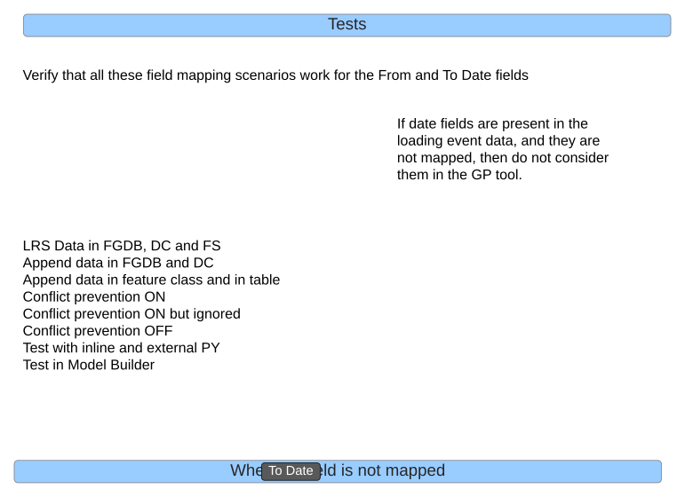
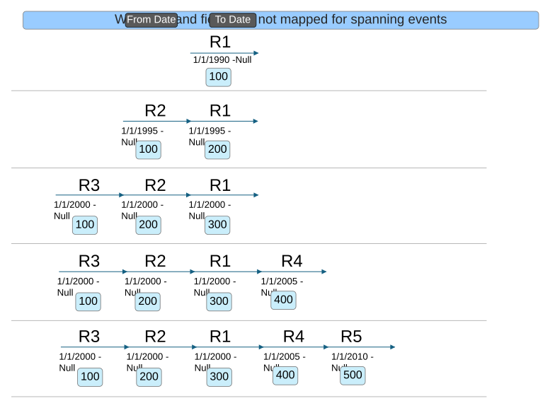
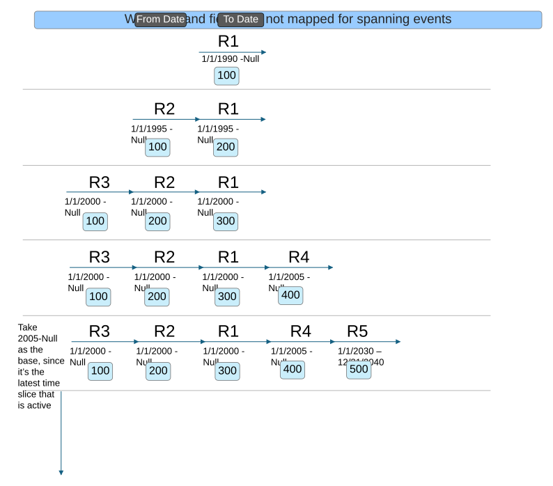
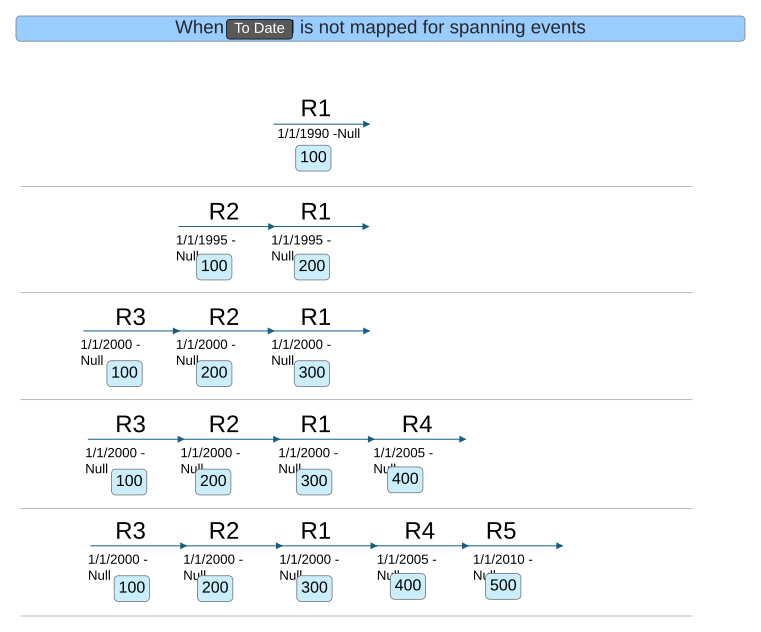

# Append Events Date Optional Test Plan

| Field | Value |
| --- | --- |
| **Doc** | 126 · Test Plan · Pro |
| **Product** | — |
| **Release** | — |
| **Issues** | — |
| **Source** | [AppendEvents_DateOptional_TestPlan.pptx](<https://esriis.sharepoint.com/sites/LocationReferencing/Shared%20Documents/General/Test%20Plans/AppendEvents_DateOptional_TestPlan.pptx>) |
| **People** | author Rahul Rakshit · PE — · dev — |
| **Edited** | 2025-09-05 18:19 by Rahul Rakshit |
| **Extracted** | 2026-09-04 · lane xmlstrip · format 3.0 · prompt v2.0.2 |
| **Keywords** | append events · date fields · event appending · spanning events · route · conflict prevention · test plan |
| **Tools** | — |

## Summary

Test plan for handling scenarios where From Date and To Date fields are optionally mapped or not mapped in event data appending processes. Includes validation of date field mapping cases, conflict prevention settings, and behavior for spanning events with various route and date configurations.

## Related documents

<!-- related:begin -->
- [Support Optional Date Field Mapping in Append Events Tool](<https://esriis.sharepoint.com/sites/lrsworkspace/LRS Doc Index/User Stories/support-optional-date-field-mapping-in-append-events-tool.md>) — similar text 0.26 · 4 title words · 4 filename words · same surface <!-- rel:143 s=6.224 -->
- [Consider Route Dominance in Append Events (add method) – Test Plan](<https://esriis.sharepoint.com/sites/lrsworkspace/LRS Doc Index/Test Plans/1488-consider-route-dominance-in-append-events-add-method.md>) — similar text 0.14 · 2 title words · 2 filename words · same kind/surface/folder <!-- rel:279 s=4.687 -->
- [Append Events: Load Events by RouteName Test Plan](<https://esriis.sharepoint.com/sites/lrsworkspace/LRS Doc Index/Test Plans/5117-append-events-load-events-by-routename.md>) — similar text 0.18 · 2 title words · 2 filename words · same kind/surface/folder <!-- rel:549 s=4.311 -->
- [Consider Route Dominance in Append Events Test Plan](<https://esriis.sharepoint.com/sites/lrsworkspace/LRS Doc Index/Test Plans/3537-consider-route-dominance-in-append-events.md>) — similar text 0.13 · 2 title words · 2 filename words · same kind/folder <!-- rel:278 s=4.233 -->
- [Append Events (Location Referencing)](<https://esriis.sharepoint.com/sites/lrsworkspace/LRS Doc Index/Other/6640-append-events-lr.md>) — similar text 0.11 · 2 title words · 2 filename words · same surface <!-- rel:124 s=4.189 -->
<!-- related:end -->

<!-- docs:begin -->
## Esri documentation

[Event editing using the attribute table](https://doc.esri.com/en/arcgis-pro/latest/help/production/location-referencing-pipelines/event-editing-using-the-attribute-table.html) · [Conflict prevention](https://doc.esri.com/en/arcgis-pro/latest/help/production/location-referencing-pipelines/conflict-prevention.html)

_No page matched:_ [append events gp](https://www.google.com/search?q=%22append%20events%20gp%22+site%3Adoc.esri.com)
<!-- docs:end -->

---

## Overview

### Slide 1 <!-- slide 1 -->

### Slide 2 <!-- slide 2 -->

When  the           field is not mapped

## Test Cases

### TC-U01 — Case 1: From Date mapped, To Date not mapped <!-- src: LLM · slide 2 · field mapping table, Case# 1 -->
- **Group:** When the field is not mapped
- **Expected Result:** Allow

| Case# | From Date | To Date | Result |
| --- | --- | --- | --- |
| 1 | Mapped |  | Allow |

### TC-U02 — Case 2: From Date not mapped, To Date mapped <!-- src: LLM · slide 2 · field mapping table, Case# 2 -->
- **Group:** When the field is not mapped
- **Expected Result:** Error

| Case# | From Date | To Date | Result |
| --- | --- | --- | --- |
| 2 |  | Mapped | Error |

### TC-U03 — Case 3: neither From Date nor To Date mapped <!-- src: LLM · slide 2 · field mapping table, Case# 3 -->
- **Group:** When the field is not mapped
- **Expected Result:** Allow

| Case# | From Date | To Date | Result |
| --- | --- | --- | --- |
| 3 |  |  | Allow |

### TC-U04 — Case 4: both From Date and To Date mapped <!-- src: LLM · slide 2 · field mapping table, Case# 4 -->
- **Group:** When the field is not mapped
- **Expected Result:** Allow

| Case# | From Date | To Date | Result |
| --- | --- | --- | --- |
| 4 | Mapped | Mapped | Allow |

### TC-U05 — Verify all field mapping scenarios for From and To Date <!-- src: LLM · slide 2 · bullet after field mapping table -->
- **Group:** When the field is not mapped
- **Case:** Verify that all these field mapping scenarios work for the From and To Date fields

### TC-U06 — Row 1: Route 1/1/2000–Null, loading event To Date Null <!-- src: LLM · slide 2 · route/loading event table, row 1 -->
- **Group:** When the field is not mapped

|  | Route |  | Loading Event |  | Output Event |  | Loc Error |
| --- | --- | --- | --- | --- | --- | --- | --- |
|  | From Date | To Date | From Date | To Date | From Date | To Date |  |
| 1 | 1/1/2000 | Null | 1/1/2000 | Null | 1/1/2000 | Null |  |

### TC-U07 — Row 2: Route 1/1/2000–Null, loading event To Date blank <!-- src: LLM · slide 2 · route/loading event table, row 2 -->
- **Group:** When the field is not mapped

|  | Route |  | Loading Event |  | Output Event |  | Loc Error |
| --- | --- | --- | --- | --- | --- | --- | --- |
|  | From Date | To Date | From Date | To Date | From Date | To Date |  |
| 2 | 1/1/2000 | Null | 1/1/2000 |  | 1/1/2000 | Null |  |

### TC-U08 — Row 3: Route 1/1/2000–12/31/2020, loading event To Date blank <!-- src: LLM · slide 2 · route/loading event table, row 3 -->
- **Group:** When the field is not mapped

|  | Route |  | Loading Event |  | Output Event |  | Loc Error |
| --- | --- | --- | --- | --- | --- | --- | --- |
|  | From Date | To Date | From Date | To Date | From Date | To Date |  |
| 3 | 1/1/2000 | 12/31/2020 | 1/1/2000 |  | 1/1/2000 | 12/31/2020 |  |
|  | Warning: there was no active time slice of the route to associate the event with |  |  |  | 12/31/2020 | Null | Route not found |

### TC-U09 — Row 4: Route 1/1/2000–12/31/2030, loading event From Date <Null> <!-- src: LLM · slide 2 · route/loading event table, row 4 -->
- **Group:** When the field is not mapped

|  | Route |  | Loading Event |  | Output Event |  | Loc Error |
| --- | --- | --- | --- | --- | --- | --- | --- |
|  | From Date | To Date | From Date | To Date | From Date | To Date |  |
| 4 | 1/1/2000 | 12/31/2030 | <Null> |  | Null | 1/1/2000 | Route not found |
|  | Warning: there was no active time slice of the route to associate the event with |  |  |  | 1/1/2000 | 12/31/2030 |  |
|  |  |  |  |  | 12/31/2030 | Null | Route not found |

### TC-U10 — To Date Tests <!-- src: LLM · slide 2 · "To Date Tests" checklist -->
- **Group:** To Date Tests
- **Steps:**
  1. LRS Data in FGDB, DC and FS
  2. Append data in FGDB and DC
  3. Append data in feature class and in table
  4. Conflict prevention ON
  5. Conflict prevention ON but ignored
  6. Conflict prevention OFF
  7. Test with inline and external PY
  8. Test in Model Builder

### TC-U11 — Row 1: Route 1/1/2000–Null, no dates mapped <!-- src: LLM · slide 3 · table row 1 -->
- **Group:** When the and fields are not mapped

|  | Route |  | Loading Event |  | Output Event |  | Loc Error |
| --- | --- | --- | --- | --- | --- | --- | --- |
| 1 | 1/1/2000 | Null |  |  | 1/1/2000 | Null |  |

### TC-U12 — Row 2: Route 1/1/2000–12/31/2020, no dates mapped <!-- src: LLM · slide 3 · table row 2 -->
- **Group:** When the and fields are not mapped

|  | Route |  | Loading Event |  | Output Event |  | Loc Error |
| --- | --- | --- | --- | --- | --- | --- | --- |
| 2 | 1/1/2000 | 12/31/2020 |  |  | Null | 1/1/2000 | Route not found |
|  | Warning: there was no active time slice of the route to associate the event with |  |  |  | 1/1/2000 | 12/31/2020 |  |
|  |  |  |  |  | 12/31/2020 | Null | Route not found |

### TC-U13 — Row 3: Route 1/1/2000–12/31/2030, no dates mapped <!-- src: LLM · slide 3 · table row 3 -->
- **Group:** When the and fields are not mapped

|  | Route |  | Loading Event |  | Output Event |  | Loc Error |
| --- | --- | --- | --- | --- | --- | --- | --- |
| 3 | 1/1/2000 | 12/31/2030 |  |  | 1/1/2000 | 12/31/2030 |  |
|  |  |  |  |  | 12/31/2020 | Null | Route not found |

### TC-U14 — Test 1: spanning event R3 to R5, dates not mapped <!-- src: LLM · slide 4 · table test 1 -->
- **Group:** When the and fields are not mapped for spanning events

|  | Loading Event |  |  |  | Output Event |  |  |  |  |
| --- | --- | --- | --- | --- | --- | --- | --- | --- | --- |
| Test | From Route | To Route | From Date | To Date | From Route | To Route | From Date | To Date | Loc Error |
| 1 | R3 | R5 |  |  | R3 | R5 | 1/1/2010 | Null |  |

### TC-U15 — Test 2: spanning event R3 to R4, dates not mapped <!-- src: LLM · slide 4 · table test 2 -->
- **Group:** When the and fields are not mapped for spanning events

|  | Loading Event |  |  |  | Output Event |  |  |  |  |
| --- | --- | --- | --- | --- | --- | --- | --- | --- | --- |
| Test | From Route | To Route | From Date | To Date | From Route | To Route | From Date | To Date | Loc Error |
| 2 | R3 | R4 |  |  | R3 | R4 | 1/1/2010 | Null |  |

### TC-U16 — Test 3: spanning event R1 to R5, dates not mapped <!-- src: LLM · slide 4 · table test 3 -->
- **Group:** When the and fields are not mapped for spanning events

|  | Loading Event |  |  |  | Output Event |  |  |  |  |
| --- | --- | --- | --- | --- | --- | --- | --- | --- | --- |
| Test | From Route | To Route | From Date | To Date | From Route | To Route | From Date | To Date | Loc Error |
| 3 | R1 | R5 |  |  | R1 | R5 | 1/1/2010 | Null |  |

### TC-U17 — Test 4: spanning event R3 to R2, dates not mapped <!-- src: LLM · slide 4 · table test 4 -->
- **Group:** When the and fields are not mapped for spanning events

|  | Loading Event |  |  |  | Output Event |  |  |  |  |
| --- | --- | --- | --- | --- | --- | --- | --- | --- | --- |
| Test | From Route | To Route | From Date | To Date | From Route | To Route | From Date | To Date | Loc Error |
| 4 | R3 | R2 |  |  | R3 | R2 | 1/1/2010 | Null |  |

### TC-U18 — Test 5: spanning event R2 to R2, dates not mapped <!-- src: LLM · slide 4 · table test 5 -->
- **Group:** When the and fields are not mapped for spanning events

|  | Loading Event |  |  |  | Output Event |  |  |  |  |
| --- | --- | --- | --- | --- | --- | --- | --- | --- | --- |
| Test | From Route | To Route | From Date | To Date | From Route | To Route | From Date | To Date | Loc Error |
| 5 | R2 | R2 |  |  | R2 | R2 | 1/1/2010 | Null |  |

### TC-U19 — Test 1: spanning event R3 to R5 with 2030–2040 time slice <!-- src: LLM · slide 5 · table test 1 -->
- **Group:** When the and fields are not mapped for spanning events

|  | Loading Event |  |  |  | Output Event |  |  |  |  |
| --- | --- | --- | --- | --- | --- | --- | --- | --- | --- |
| Test | From Route | To Route | From Date | To Date | From Route | To Route | From Date | To Date | Loc Error |
| 1 | R3 | R5 |  |  | R3 | R5 | 1/1/2005 | 1/1/2030 | Route not found |
|  |  |  |  |  | R3 | R5 | 1/1/2030 | 12/31/2040 | Route not found |
|  |  |  |  |  | R3 | R5 | 12/31/2040 | Null | Route not found |

### TC-U20 — Test 2: spanning event R3 to R4, base 1/1/2005 <!-- src: LLM · slide 5 · table test 2 -->
- **Group:** When the and fields are not mapped for spanning events

|  | Loading Event |  |  |  | Output Event |  |  |  |  |
| --- | --- | --- | --- | --- | --- | --- | --- | --- | --- |
| Test | From Route | To Route | From Date | To Date | From Route | To Route | From Date | To Date | Loc Error |
| 2 | R3 | R4 |  |  | R3 | R4 | 1/1/2005 | Null |  |

### TC-U21 — Test 3: spanning event R1 to R5, base 1/1/2005 <!-- src: LLM · slide 5 · table test 3 -->
- **Group:** When the and fields are not mapped for spanning events

|  | Loading Event |  |  |  | Output Event |  |  |  |  |
| --- | --- | --- | --- | --- | --- | --- | --- | --- | --- |
| Test | From Route | To Route | From Date | To Date | From Route | To Route | From Date | To Date | Loc Error |
| 3 | R1 | R5 |  |  | R1 | R5 | 1/1/2005 | Null |  |

### TC-U22 — Test 4: spanning event R3 to R2, base 1/1/2005 <!-- src: LLM · slide 5 · table test 4 -->
- **Group:** When the and fields are not mapped for spanning events

|  | Loading Event |  |  |  | Output Event |  |  |  |  |
| --- | --- | --- | --- | --- | --- | --- | --- | --- | --- |
| Test | From Route | To Route | From Date | To Date | From Route | To Route | From Date | To Date | Loc Error |
| 4 | R3 | R2 |  |  | R3 | R2 | 1/1/2005 | Null |  |

### TC-U23 — Test 5: spanning event R2 to R2, base 1/1/2005 <!-- src: LLM · slide 5 · table test 5 -->
- **Group:** When the and fields are not mapped for spanning events

|  | Loading Event |  |  |  | Output Event |  |  |  |  |
| --- | --- | --- | --- | --- | --- | --- | --- | --- | --- |
| Test | From Route | To Route | From Date | To Date | From Route | To Route | From Date | To Date | Loc Error |
| 5 | R2 | R2 |  |  | R2 | R2 | 1/1/2005 | Null |  |

### TC-U24 — Test 1: spanning event R3 to R5, From Date Null <!-- src: LLM · slide 6 · table test 1 -->
- **Group:** When the field is not mapped for spanning events

|  | Loading Event |  |  |  | Output Event |  |  |  |  |
| --- | --- | --- | --- | --- | --- | --- | --- | --- | --- |
| Test | From Route | To Route | From Date | To Date | From Route | To Route | From Date | To Date | Loc Error |
| 1 | R3 | R5 | Null |  | R3 | R5 | Null | 1/1/2000 | Route not found |
|  |  |  |  |  | R3 | R5 | Null | 1/1/2005 | Route not found |
|  |  |  |  |  | R3 | R5 | 1/1/2005 | 1/1/2010 | Route not found |
|  |  |  |  |  | R3 | R5 | 1/1/2010 | Null |  |

### TC-U25 — Test 2: spanning event R3 to R4, From Date 1/1/2000 <!-- src: LLM · slide 6 · table test 2 -->
- **Group:** When the field is not mapped for spanning events

|  | Loading Event |  |  |  | Output Event |  |  |  |  |
| --- | --- | --- | --- | --- | --- | --- | --- | --- | --- |
| Test | From Route | To Route | From Date | To Date | From Route | To Route | From Date | To Date | Loc Error |
| 2 | R3 | R4 | 1/1/2000 |  | R3 | R4 | 1/1/2000 | 1/1/2005 | Route not found |
|  |  |  |  |  | R3 | R4 | 1/1/2005 | Null |  |

### TC-U26 — Test 3: spanning event R3 to R4, From Date 1/1/2020 <!-- src: LLM · slide 6 · table test 3 -->
- **Group:** When the field is not mapped for spanning events

|  | Loading Event |  |  |  | Output Event |  |  |  |  |
| --- | --- | --- | --- | --- | --- | --- | --- | --- | --- |
| Test | From Route | To Route | From Date | To Date | From Route | To Route | From Date | To Date | Loc Error |
| 3 | R3 | R4 | 1/1/2020 |  | R3 | R4 | 1/1/2020 | Null |  |

### TC-U27 — Test 4: spanning event R2 to R5, From Date 1/1/2003 <!-- src: LLM · slide 6 · table test 4 -->
- **Group:** When the field is not mapped for spanning events

|  | Loading Event |  |  |  | Output Event |  |  |  |  |
| --- | --- | --- | --- | --- | --- | --- | --- | --- | --- |
| Test | From Route | To Route | From Date | To Date | From Route | To Route | From Date | To Date | Loc Error |
| 4 | R2 | R5 | 1/1/2003 |  | R2 | R5 | 1/1/2003 | 1/1/2010 | Route not found |
|  |  |  |  |  | R2 | R5 | 1/1/2010 | Null |  |

### TC-U28 — Test 5: spanning event R1 to R2, From Date 1/1/1995 <!-- src: LLM · slide 6 · table test 5 -->
- **Group:** When the field is not mapped for spanning events

|  | Loading Event |  |  |  | Output Event |  |  |  |  |
| --- | --- | --- | --- | --- | --- | --- | --- | --- | --- |
| Test | From Route | To Route | From Date | To Date | From Route | To Route | From Date | To Date | Loc Error |
| 5 | R1 | R2 | 1/1/1995 |  | R1 | R2 | 1/1/1995 | 1/1/2000 |  |
|  |  |  |  |  | R1 | R2 | 1/1/2000 | Null |  |

## Other content

### Slide 2 <!-- slide 2 -->

If date fields are present in the loading event data, and they are not mapped, then do not consider them in the GP tool.

### Slide 3 — When the and fields are not mapped <!-- slide 3 -->

To Date
From  Date

### Slide 4 — When the and fields are not mapped for spanning events <!-- slide 4 -->

[figure: 1/1/1990 -Null · 100 · 1/1/1995 - Null · 200 · 1/1/2000 - Null · 300 · R1 · R2 · R3 · 1/1/2005 - Null · 400 · R4 · 1/1/2010 - Null · 500 · R5 · To Date · From Date]

### Slide 5 — When the and fields are not mapped for spanning events <!-- slide 5 -->

Take 2005-Null as the base, since it’s the latest time slice that is active

[figure: 1/1/1990 -Null · 100 · 1/1/1995 - Null · 200 · 1/1/2000 - Null · 300 · R1 · R2 · R3 · 1/1/2005 - Null · 400 · R4 · 1/1/2030 – 12/31/2040 · 500 · R5 · To Date · From Date]

### Slide 6 — When the field is not mapped for spanning events <!-- slide 6 -->

[figure: 1/1/1990 -Null · 100 · 1/1/1995 - Null · 200 · 1/1/2000 - Null · 300 · R1 · R2 · R3 · 1/1/2005 - Null · 400 · R4 · 1/1/2010 - Null · 500 · R5 · To Date]

