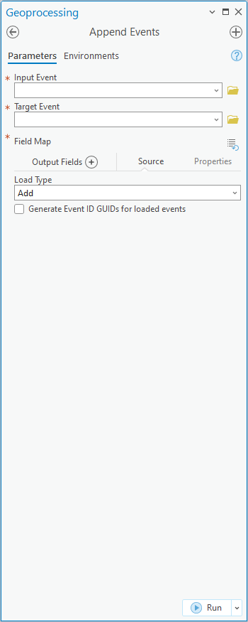
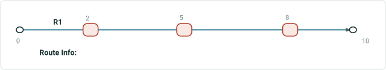
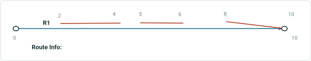
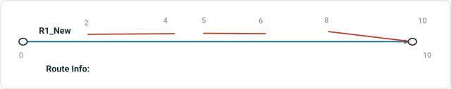
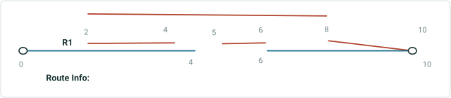
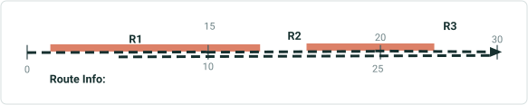
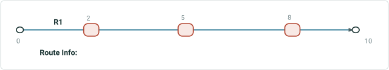

# Append Events: Load Events by RouteName Test Plan

|   |   |
| --- | --- |
| **Kind** | Test Plan · Pro |
| **Release** | — |
| **Product** | Roads & Highways · Pipeline Referencing |
| **Issue** | [ArcGISPro/ps-location-referencing#5117](https://devtopia.esri.com/ArcGISPro/ps-location-referencing/issues/5117) |
| **Source** | [5117-AppendEventsLoadbyRouteName_TestPlan_V2.pptx](<https://esriis.sharepoint.com/sites/LocationReferencing/Shared%20Documents/General/Test%20Plans/5117-AppendEventsLoadbyRouteName_TestPlan_V2.pptx>) |
| **Edited** | 2023-06-14 21:36 by Mac Christmas |
| **Extracted** | 2026-09-04 · lane `xmlstrip` |

<!-- metadata
```yaml
title: "Append Events: Load Events by RouteName Test Plan"
source_file: "5117-AppendEventsLoadbyRouteName_TestPlan_V2.pptx"
source_url: "https://esriis.sharepoint.com/sites/LocationReferencing/Shared%20Documents/General/Test%20Plans/5117-AppendEventsLoadbyRouteName_TestPlan_V2.pptx"
doc_id: 549
doc_kind: "Test Plan"
surface: "Pro"
doc_revision: "V2"
target_release: ""
pe: ""
dev: ""
author: "Mac Christmas"
last_edited_by: "Mac Christmas"
last_edited: "2023-06-14T21:36:19Z"
extracted: 2026-09-04
extraction_lane: xmlstrip
prompt_version: "v2.0.2"
keywords: ["append events", "route name", "route id", "point event", "line event", "spanning line event", "conflict prevention", "load events", "error handling"]
tools: ["Append Events"]
products: ["Roads & Highways", "Pipeline Referencing"]
issues: ["ArcGISPro/ps-location-referencing#5117"]
related: [{"doc":579,"file":"append-routes-events-load-routes-events-by-route-name__doc579.md","s":6.217},{"doc":279,"file":"consider-route-dominance-in-append-events-add-method-test-plan__doc279.md","s":4.674},{"doc":156,"file":"allow-append-events-to-run-when-locks-are-present-test-plan__doc156.md","s":4.464},{"doc":126,"file":"append-events-date-optional-test-plan__doc126.md","s":4.311},{"doc":567,"file":"append-routes-load-routes-by-route-name-test-plan__doc567.md","s":3.862}]
```
-->

## Summary

Test plan for loading events by RouteName in the Append Events tool. Covers positive and negative test cases for point, line, and spanning line events with various combinations of RouteName and RouteID populated or missing. Validates conflict prevention, route identifier generation, and error handling.

## Related documents

<!-- related:begin -->
- [Append Routes/Events: Load Routes/Events by Route Name](<https://esriis.sharepoint.com/sites/lrsworkspace/LRS%20Doc%20Index/User%20Stories/append-routes-events-load-routes-events-by-route-name__doc579.md>) — similar text 0.18 · 3 title words · 5 filename words · same surface <!-- rel:579 -->
- [Consider Route Dominance in Append Events (add method) – Test Plan](<https://esriis.sharepoint.com/sites/lrsworkspace/LRS Doc Index/Test Plans/consider-route-dominance-in-append-events-add-method-test-plan__doc279.md>) — similar text 0.21 · 2 title words · 2 filename words · same kind/surface/folder <!-- rel:279 -->
- [Allow Append Events to Run When Locks Are Present - Test Plan](<https://esriis.sharepoint.com/sites/lrsworkspace/LRS%20Doc%20Index/Test%20Plans/allow-append-events-to-run-when-locks-are-present-test-plan__doc156.md>) — similar text 0.14 · 2 title words · 2 filename words · same kind/surface/folder <!-- rel:156 -->
- [Append Events Date Optional Test Plan](<https://esriis.sharepoint.com/sites/lrsworkspace/LRS Doc Index/Test Plans/append-events-date-optional-test-plan__doc126.md>) — similar text 0.18 · 2 title words · 2 filename words · same kind/surface/folder <!-- rel:126 -->
- [Append Routes: Load Routes by Route Name Test Plan](<https://esriis.sharepoint.com/sites/lrsworkspace/LRS Doc Index/Test Plans/append-routes-load-routes-by-route-name-test-plan__doc567.md>) — similar text 0.18 · 2 title words · 1 filename word · same kind/surface/folder <!-- rel:567 -->
<!-- related:end -->

<!-- docs:begin -->
## Esri documentation

[Conflict prevention](https://doc.esri.com/en/arcgis-pro/latest/help/production/roads-highways/conflict-prevention.html)

_No page matched:_ [Append Events](https://www.google.com/search?q=%22Append%20Events%22+site%3Adoc.esri.com)
<!-- docs:end -->

---

## Slide 1

Append Events: Load Events by RouteName

| Notes |
| --- |
| Test with RH and APR data, but focus more on APR RouteName must be stored in the target event. If no RouteName is stored, events will be loaded by RouteID Test with FGDB, EDGB, and FS Only test with ADD Load Type Test with point, line, and spanning line events Test Conflict Prevention continues to work as expected Ensure existing RouteID validation perform when events are loaded by RouteName Test a couple cases in Python and ModelBuilder Sanity test other load types to make sure they still execute as expected Verify LocErrors are correct |

Devtopia Issue

| Positive Tests: Point Events |
| --- |
| RouteName not stored, default to load by RouteID RouteID populated, Null populated RouteName, default to load by RouteID. Ensure that the loaded events have correct RouteName generated once loaded RouteName populated, Null populated RouteID, load by RouteName. Ensure that the loaded event have correct RouteID generated once loaded Some events with RouteName populated and Null populated RouteID with other events with RouteID populated and Null populated RouteName. Load events by populated route identifier field and generate the Null route identifier field once loaded RouteID and RouteName populated, default to load by RouteID Load events with conflicting RouteName and RouteID values. Load events by RouteID and regenerate RouteName values once loaded |



## Slide 2

| Negative Tests: Error |
| --- |
| RouteName and RouteID are populated, but do not point to valid routes. Events will not be loaded and the OIDs of these events will be noted in the output .txt file RouteName fields(s) populated but RouteID field(s) missing from input events to load. Fail tool with message stating that the RouteID field(s) are missing |

| Positive Tests: Spanning Line Events |
| --- |
| RouteName fields not stored, default to load by RouteID fields FromRouteID and ToRouteID populated, Null populated FromRouteName and ToRouteName , default to load by RouteID fields. Ensure that the loaded events have correct FromRouteName and ToRouteName generated once loaded FromRouteName and ToRouteName populated, Null populated FromRouteID and ToRouteId , load by RouteName fields. Ensure that the loaded event have correct FromRouteID and ToRouteID generated once loaded Some events with FromRouteName and ToRouteName populated and Null populated FromRouteID and ToRouteID with other events with FromRouteID and ToRouteID populated and Null populated FromRouteName and ToRouteName . Load events by populated route identifier field and generate the Null route identifier fields once loaded RouteID and RouteName fields populated, default to load by RouteID fields Load events with conflicting RouteName and RouteID values. Load events by RouteID fields and regenerate RouteName values once loaded Load events with populated FromRouteID and ToRouteName bu t Null FromRouteName and ToRouteID and vice versa |

| Positive Tests: Line Events |
| --- |
| RouteName not stored, default to load by RouteID RouteID populated with Null populated RouteName, default to load by RouteID. Ensure that the loaded events have correct RouteName generated once loaded RouteName populated with Null populated RouteID, load by RouteName. Ensure that the loaded event have correct RouteID generated once loaded Some events with RouteName populated and Null populated RouteID with other events with RouteID populated and Null populated RouteName. Load events by populated route identifier field and generate the Null route identifier field once loaded RouteID and RouteName populated, default to load by RouteID Load events with conflicting RouteName and RouteID values. Load events by RouteID and regenerate RouteName values once loaded RouteName populated only, but events are not in same time slice as route RouteName populated only, events appended after route is retired RouteName populated only, events appended after route is reassigned to another route RouteName populated only, source events span a gap |

## Case 1 <!-- slide 3 -->

### RouteName Not Stored, Default To Load by RouteID



| From Date | To Date | RouteName | RouteID | Measures |
| --- | --- | --- | --- | --- |
| 1/1/2000 | Null | N/A | R1 | 0-10 |

Pt Event to Append:

| From Date | To Date | RouteName | RouteID | EventID | Measures |
| --- | --- | --- | --- | --- | --- |
| 1/1/2000 | Null | Route1 | R1 | 001 | 2 |
| 1/1/2000 | Null | Route1 | R1 | 002 | 5 |
| 1/1/2000 | Null | Route1 | R1 | 003 | 8 |

| From Date | To Date | RouteID | EventID | Measures |
| --- | --- | --- | --- | --- |
| 1/1/2000 | Null | R1 | 001 | 2 |
| 1/1/2000 | Null | R1 | 002 | 5 |
| 1/1/2000 | Null | R1 | 003 | 8 |

## Case 2 <!-- slide 4 -->

### RouteID Populated, Null Populated RouteName

**RouteID populated, Null populated RouteName, default to load by RouteID**


| From Date | To Date | RouteName | RouteID | Measures |
| --- | --- | --- | --- | --- |
| 1/1/2000 | Null | Route1 | R1 | 0-10 |

Pt Event to Append:

| From Date | To Date | RouteName | RouteID | EventID | Measures |
| --- | --- | --- | --- | --- | --- |
| 1/1/2000 | Null | Null | R1 | 001 | 2 |
| 1/1/2000 | Null | Null | R1 | 002 | 5 |
| 1/1/2000 | Null | Null | R1 | 003 | 8 |

Post-Append (RouteName Generated):

| From Date | To Date | Route Name | RouteID | EventID | Measures |
| --- | --- | --- | --- | --- | --- |
| 1/1/2000 | Null | Route1 | R1 | 001 | 2 |
| 1/1/2000 | Null | Route1 | R1 | 002 | 5 |
| 1/1/2000 | Null | Route1 | R1 | 003 | 8 |

## Case 3 <!-- slide 5 -->

### RouteName Populated, Null Populated RouteID

**RouteName populated, Null populated RouteID, load by RouteName**


| From Date | To Date | RouteName | RouteID | Measures |
| --- | --- | --- | --- | --- |
| 1/1/2000 | Null | Route1 | R1 | 0-10 |

Pt Event to Append:

| From Date | To Date | RouteName | RouteID | EventID | Measures |
| --- | --- | --- | --- | --- | --- |
| 1/1/2000 | Null | Route1 | Null | 001 | 2 |
| 1/1/2000 | Null | Route1 | Null | 002 | 5 |
| 1/1/2000 | Null | Route1 | Null | 003 | 8 |

Post-Append (RouteID Generated):

| From Date | To Date | Route Name | RouteID | EventID | Measures |
| --- | --- | --- | --- | --- | --- |
| 1/1/2000 | Null | Route1 | R1 | 001 | 2 |
| 1/1/2000 | Null | Route1 | R1 | 002 | 5 |
| 1/1/2000 | Null | Route1 | R1 | 003 | 8 |

## Case 4 <!-- slide 6 -->

### Some Events with RouteName Populated and Null Populated

**Some events with RouteName populated and Null populated RouteID with other events with RouteID populated and Null populated RouteName**


| From Date | To Date | RouteName | RouteID | Measures |
| --- | --- | --- | --- | --- |
| 1/1/2000 | Null | Route1 | R1 | 0-10 |

Pt Event to Append:

| From Date | To Date | RouteName | RouteID | EventID | Measures |
| --- | --- | --- | --- | --- | --- |
| 1/1/2000 | Null | Route1 | Null | 001 | 2 |
| 1/1/2000 | Null | Null | R1 | 002 | 5 |
| 1/1/2000 | Null | Route1 | Null | 003 | 8 |

Post-Append (Route Identifier Generated):

| From Date | To Date | Route Name | RouteID | EventID | Measures |
| --- | --- | --- | --- | --- | --- |
| 1/1/2000 | Null | Route1 | R1 | 001 | 2 |
| 1/1/2000 | Null | Route1 | R1 | 002 | 5 |
| 1/1/2000 | Null | Route1 | R1 | 003 | 8 |

## Case 5 <!-- slide 7 -->

### RouteID and RouteName Populated, Default To Load by RouteID


| From Date | To Date | RouteName | RouteID | Measures |
| --- | --- | --- | --- | --- |
| 1/1/2000 | Null | Route1 | R1 | 0-10 |

Pt Event to Append:

| From Date | To Date | RouteName | RouteID | EventID | Measures |
| --- | --- | --- | --- | --- | --- |
| 1/1/2000 | Null | Route1 | R1 | 001 | 2 |
| 1/1/2000 | Null | Route1 | R1 | 002 | 5 |
| 1/1/2000 | Null | Route1 | R1 | 003 | 8 |

Post-Append (RouteName Generated):

| From Date | To Date | Route Name | RouteID | EventID | Measures |
| --- | --- | --- | --- | --- | --- |
| 1/1/2000 | Null | Route1 | R1 | 001 | 2 |
| 1/1/2000 | Null | Route1 | R1 | 002 | 5 |
| 1/1/2000 | Null | Route1 | R1 | 003 | 8 |

## Case 6 <!-- slide 8 -->

### Load Events with Conflicting RouteName and RouteID Values


| From Date | To Date | RouteName | RouteID | Measures |
| --- | --- | --- | --- | --- |
| 1/1/2000 | Null | Route1 | R1 | 0-10 |

Ln Event to Append:

| From Date | To Date | RouteName | RouteID | EventID | Measures |
| --- | --- | --- | --- | --- | --- |
| 1/1/2000 | Null | RouteX | R1 | 001 | 2 |
| 1/1/2000 | Null | RouteX | R1 | 002 | 5 |
| 1/1/2000 | Null | RouteX | R1 | 003 | 8 |

Post-Append (RouteName Generated):

| From Date | To Date | Route Name | RouteID | EventID | Measures |
| --- | --- | --- | --- | --- | --- |
| 1/1/2000 | Null | Route1 | R1 | 001 | 2 |
| 1/1/2000 | Null | Route1 | R1 | 002 | 5 |
| 1/1/2000 | Null | Route1 | R1 | 003 | 8 |

## Case 7 <!-- slide 9 -->

### RouteName Not Stored, Default To Load by RouteID



| From Date | To Date | RouteName | RouteID | Measures |
| --- | --- | --- | --- | --- |
| 1/1/2000 | Null | Route1 | R1 | 0-10 |

Ln Event to Append:

| From Date | To Date | RouteName | RouteID | EventID | From Measure | To Measure |
| --- | --- | --- | --- | --- | --- | --- |
| 1/1/2000 | Null | Route1 | R1 | 001 | 2 | 4 |
| 1/1/2000 | Null | Route1 | R1 | 002 | 5 | 6 |
| 1/1/2000 | Null | Route1 | R1 | 003 | 8 | 10 |

| From Date | To Date | RouteID | EventID | From Measure | To Measure |
| --- | --- | --- | --- | --- | --- |
| 1/1/2000 | Null | R1 | 001 | 2 | 4 |
| 1/1/2000 | Null | R1 | 002 | 5 | 6 |
| 1/1/2000 | Null | R1 | 003 | 8 | 10 |

## Case 8 <!-- slide 10 -->

### RouteID Populated, Null Populated RouteName

**RouteID populated, Null populated RouteName, default to load by RouteID**


| From Date | To Date | RouteName | RouteID | Measures |
| --- | --- | --- | --- | --- |
| 1/1/2000 | Null | Route1 | R1 | 0-10 |

Ln Event to Append:

| From Date | To Date | RouteName | RouteID | EventID | From Measure | To Measure |
| --- | --- | --- | --- | --- | --- | --- |
| 1/1/2000 | Null | Null | R1 | 001 | 2 | 4 |
| 1/1/2000 | Null | Null | R1 | 002 | 5 | 6 |
| 1/1/2000 | Null | Null | R1 | 003 | 8 | 10 |

Post-Append (RouteName Generated):

| From Date | To Date | Route Name | RouteID | EventID | From Measure | To Measure |
| --- | --- | --- | --- | --- | --- | --- |
| 1/1/2000 | Null | Route1 | R1 | 001 | 2 | 4 |
| 1/1/2000 | Null | Route1 | R1 | 002 | 5 | 6 |
| 1/1/2000 | Null | Route1 | R1 | 003 | 8 | 10 |

## Case 9 <!-- slide 11 -->

### RouteName Populated, Null Populated RouteID

**RouteName populated, Null populated RouteID, load by RouteName**


| From Date | To Date | RouteName | RouteID | Measures |
| --- | --- | --- | --- | --- |
| 1/1/2000 | Null | Route1 | R1 | 0-10 |

Ln Event to Append:

| From Date | To Date | RouteName | RouteID | EventID | From Measure | To Measure |
| --- | --- | --- | --- | --- | --- | --- |
| 1/1/2000 | Null | Route1 | Null | 001 | 2 | 4 |
| 1/1/2000 | Null | Route1 | Null | 002 | 5 | 6 |
| 1/1/2000 | Null | Route1 | Null | 003 | 8 | 10 |

Post-Append (RouteID Generated):

| From Date | To Date | Route Name | RouteID | EventID | From Measure | To Measure |
| --- | --- | --- | --- | --- | --- | --- |
| 1/1/2000 | Null | Route1 | R1 | 001 | 2 | 4 |
| 1/1/2000 | Null | Route1 | R1 | 002 | 5 | 6 |
| 1/1/2000 | Null | Route1 | R1 | 003 | 8 | 10 |

## Case 10 <!-- slide 12 -->

### Some Events with RouteName Populated and Null Populated

**Some events with RouteName populated and Null populated RouteID with other events with RouteID populated and Null populated RouteName**


| From Date | To Date | RouteName | RouteID | Measures |
| --- | --- | --- | --- | --- |
| 1/1/2000 | Null | Route1 | R1 | 0-10 |

Ln Event to Append:

| From Date | To Date | RouteName | RouteID | EventID | From Measure | To Measure |
| --- | --- | --- | --- | --- | --- | --- |
| 1/1/2000 | Null | Route1 | Null | 001 | 2 | 4 |
| 1/1/2000 | Null | Null | R1 | 002 | 5 | 6 |
| 1/1/2000 | Null | Route1 | Null | 003 | 8 | 10 |

Post-Append (Route Identifier Generated):

| From Date | To Date | Route Name | RouteID | EventID | From Measure | To Measure |
| --- | --- | --- | --- | --- | --- | --- |
| 1/1/2000 | Null | Route1 | R1 | 001 | 2 | 4 |
| 1/1/2000 | Null | Route1 | R1 | 002 | 5 | 6 |
| 1/1/2000 | Null | Route1 | R1 | 003 | 8 | 10 |

## Case 11 <!-- slide 13 -->

### RouteID and RouteName Populated, Default To Load by RouteID


| From Date | To Date | RouteName | RouteID | Measures |
| --- | --- | --- | --- | --- |
| 1/1/2000 | Null | Route1 | R1 | 0-10 |

Ln Event to Append:

| From Date | To Date | RouteName | RouteID | EventID | From Measure | To Measure |
| --- | --- | --- | --- | --- | --- | --- |
| 1/1/2000 | Null | Route1 | R1 | 001 | 2 | 4 |
| 1/1/2000 | Null | Route1 | R1 | 002 | 5 | 6 |
| 1/1/2000 | Null | Route1 | R1 | 003 | 8 | 10 |

| From Date | To Date | Route Name | RouteID | EventID | From Measure | To Measure |
| --- | --- | --- | --- | --- | --- | --- |
| 1/1/2000 | Null | Route1 | R1 | 001 | 2 | 4 |
| 1/1/2000 | Null | Route1 | R1 | 002 | 5 | 6 |
| 1/1/2000 | Null | Route1 | R1 | 003 | 8 | 10 |

## Case 12 <!-- slide 14 -->

### Load Events with Conflicting RouteName and RouteID Value

**Load events with conflicting RouteName and RouteID value, default to RouteID**


| From Date | To Date | RouteName | RouteID | Measures |
| --- | --- | --- | --- | --- |
| 1/1/2000 | Null | Route1 | R1 | 0-10 |

Ln Event to Append:

| From Date | To Date | RouteName | RouteID | EventID | From Measure | To Measure |
| --- | --- | --- | --- | --- | --- | --- |
| 1/1/2000 | Null | RouteX | R1 | 001 | 2 | 4 |
| 1/1/2000 | Null | RouteX | R1 | 002 | 5 | 6 |
| 1/1/2000 | Null | RouteX | R1 | 003 | 8 | 10 |

Post-Append (RouteName Generated):

| From Date | To Date | Route Name | RouteID | EventID | From Measure | To Measure |
| --- | --- | --- | --- | --- | --- | --- |
| 1/1/2000 | Null | Route1 | R1 | 001 | 2 | 4 |
| 1/1/2000 | Null | Route1 | R1 | 002 | 5 | 6 |
| 1/1/2000 | Null | Route1 | R1 | 003 | 8 | 10 |

## Case 13 <!-- slide 15 -->

### RouteName Populated Only

**RouteName populated only, events to append are not in same time slice as route**


| From Date | To Date | RouteName | RouteID | Measures |
| --- | --- | --- | --- | --- |
| 1/1/2000 | Null | Route 1 | R1 | 0-10 |

Ln Event to Append:

| From Date | To Date | RouteName | RouteID | EventID | From Measure | To Measure |
| --- | --- | --- | --- | --- | --- | --- |
| 1/1/1995 | Null | Route 1 | Null | 001 | 2 | 4 |
| 1/1/1995 | Null | Route 1 | Null | 002 | 5 | 6 |
| 1/1/1995 | Null | Route 1 | Null | 003 | 8 | 10 |

Post-Append (Generate RouteID):

| From Date | To Date | RouteName | RouteID | EventID | From Measure | To Measure | LocError |
| --- | --- | --- | --- | --- | --- | --- | --- |
| 1/1/1995 | 1/1/2000 | Route 1 | R1 | 001 | 2 | 4 | Route not found |
| 1/1/1995 | 1/1/2000 | Route 1 | R1 | 002 | 5 | 6 | Route not found |
| 1/1/1995 | 1/1/2000 | Route 1 | R1 | 003 | 8 | 10 | Route not found |
| 1/1/2000 | Null | Route 1 | R1 | 001 | 2 | 4 | No error |
| 1/1/2000 | Null | Route 1 | R1 | 002 | 5 | 6 | No error |
| 1/1/2000 | Null | Route 1 | R1 | 003 | 8 | 10 | No error |

## Case 14 <!-- slide 16 -->

### RouteName Populated Only

**RouteName populated only, events appended after route is retired**


| From Date | To Date | RouteName | RouteID | Measures |
| --- | --- | --- | --- | --- |
| 1/1/2000 | 1/1/2005 | Route1 | R1 | 0-10 |

Ln Event to Append:

| From Date | To Date | RouteName | RouteID | EventID | From Measure | To Measure |
| --- | --- | --- | --- | --- | --- | --- |
| 1/1/2006 | Null | Null | R1 | 001 | 2 | 4 |
| 1/1/2006 | Null | Null | R1 | 002 | 5 | 6 |
| 1/1/2006 | Null | Null | R1 | 003 | 8 | 10 |

| From Date | To Date | Route Name | RouteID | EventID | From Measure | To Measure | LocError |
| --- | --- | --- | --- | --- | --- | --- | --- |
| 1/1/2006 | Null | Route1 | R1 | 001 | 2 | 4 | Route Not Found |
| 1/1/2006 | Null | Route1 | R1 | 002 | 5 | 6 | Route Not Found |
| 1/1/2006 | Null | Route1 | R1 | 003 | 8 | 10 | Route Not Found |

## Case 15 <!-- slide 17 -->

### RouteName Populated Only

**RouteName populated only, events appended after route is reassigned to another route**



| From Date | To Date | RouteName | RouteID | Measures |
| --- | --- | --- | --- | --- |
| 1/1/2000 | 1/1/2005 | Route1 | R1 | 0-10 |
| 1/1/2006 | Null | Route1_New | R1_New |  |

Ln Event to Append:

| From Date | To Date | RouteName | RouteID | EventID | From Measure | To Measure |
| --- | --- | --- | --- | --- | --- | --- |
| 1/1/2006 | Null | Null | R1 | 001 | 2 | 4 |
| 1/1/2006 | Null | Null | R1 | 002 | 5 | 6 |
| 1/1/2006 | Null | Null | R1 | 003 | 8 | 10 |

| From Date | To Date | Route Name | RouteID | EventID | From Measure | To Measure | LocError |
| --- | --- | --- | --- | --- | --- | --- | --- |
| 1/1/2006 | Null | Route1 | R1 | 001 | 2 | 4 | Route Not Found |
| 1/1/2006 | Null | Route1 | R1 | 002 | 5 | 6 | Route Not Found |
| 1/1/2006 | Null | Route1 | R1 | 003 | 8 | 10 | Route Not Found |

## Case 16 <!-- slide 18 -->

### RouteName Populated Only, Source Events Span a Gap



| From Date | To Date | RouteName | RouteID | Measures |
| --- | --- | --- | --- | --- |
| 1/1/2000 | Null | Route1 | R1 | 0-10 |

Ln Event to Append:

| From Date | To Date | RouteName | RouteID | EventID | From Measure | To Measure |
| --- | --- | --- | --- | --- | --- | --- |
| 1/1/2000 | Null | Null | R1 | 001 | 2 | 4 |
| 1/1/2000 | Null | Null | R1 | 002 | 5 | 6 |
| 1/1/2000 | Null | Null | R1 | 003 | 8 | 10 |
| 1/1/2000 | Null | Null | R1 | 004 | 2 | 8 |

| From Date | To Date | Route Name | RouteID | EventID | From Measure | To Measure | Loc Error |
| --- | --- | --- | --- | --- | --- | --- | --- |
| 1/1/2000 | Null | Route1 | R1 | 001 | 2 | 4 | No Error |
| 1/1/2000 | Null | Route1 | R1 | 002 | 5 | 6 | Partial Match for To Measure |
| 1/1/2000 | Null | Route1 | R1 | 003 | 8 | 10 | No Error |
| 1/1/2000 | Null | Route1 | R1 | 004 | 2 | 4 | No Error |
| 1/1/2000 | Null | Route1 | R1 | 004 | 6 | 8 | No Error |

## Case 17 <!-- slide 19 -->

### RouteName Not Stored, Default To Load by RouteID



| From Date | To Date | RouteName | RouteID | LineName | LineID | Measures |
| --- | --- | --- | --- | --- | --- | --- |
| 1/1/2000 | Null | Route1 | R1 | N/A | L1 | 0-10 |
| 1/1/2000 | Null | Route2 | R2 | N/A | L1 | 15-20 |
| 1/1/2000 | Null | Route3 | R3 | N/A | L1 | 25-30 |

Ln Event to Append:

| From Date | To Date | From Route Name | From RouteID | To Route Name | To Route ID | EventID | From Measure | To Measure |
| --- | --- | --- | --- | --- | --- | --- | --- | --- |
| 1/1/2000 | Null | Route1 | R1 | Route2 | R2 | 001 | 2 | 16 |
| 1/1/2000 | Null | Route1 | R1 | Route3 | R3 | 002 | 5 | 30 |
| 1/1/2000 | Null | Route2 | R2 | Route3 | R3 | 003 | 17 | 25 |

| From Date | To Date | From RouteID | To Route ID | EventID | From Measure | To Measure |
| --- | --- | --- | --- | --- | --- | --- |
| 1/1/2000 | Null | R1 | R2 | 001 | 2 | 16 |
| 1/1/2000 | Null | R1 | R3 | 002 | 5 | 30 |
| 1/1/2000 | Null | R2 | R3 | 003 | 17 | 25 |

## Case 18 <!-- slide 20 -->

### FromRouteID and ToRouteID Populated

**FromRouteID and ToRouteID populated, Null populated FromRouteName and ToRouteName, default to load by RouteID fields**


| From Date | To Date | RouteName | RouteID | LineName | LineID | Measures |
| --- | --- | --- | --- | --- | --- | --- |
| 1/1/2000 | Null | N/A | R1 | N/A | L1 | 0-10 |
| 1/1/2000 | Null | N/A | R2 | N/A | L1 | 15-20 |
| 1/1/2000 | Null | N/A | R3 | N/A | L1 | 25-30 |

Ln Event to Append:

| From Date | To Date | From Route Name | From RouteID | To Route Name | To Route ID | EventID | From Measure | To Measure |
| --- | --- | --- | --- | --- | --- | --- | --- | --- |
| 1/1/2000 | Null | Null | R1 | Null | R2 | 001 | 2 | 16 |
| 1/1/2000 | Null | Null | R1 | Null | R3 | 002 | 5 | 30 |
| 1/1/2000 | Null | Null | R2 | Null | R3 | 003 | 17 | 25 |

Post-Append (Generated RouteName):

| From Date | To Date | From Route Name | From RouteID | To Route Name | To Route ID | EventID | From Measure | To Measure |
| --- | --- | --- | --- | --- | --- | --- | --- | --- |
| 1/1/2000 | Null | Route1 | R1 | Route2 | R2 | 001 | 2 | 16 |
| 1/1/2000 | Null | Route1 | R1 | Route3 | R3 | 002 | 5 | 30 |
| 1/1/2000 | Null | Route2 | R2 | Route3 | R3 | 003 | 17 | 25 |

## Case 19 <!-- slide 21 -->

### FromRouteName and ToRouteName Populated

**FromRouteName and ToRouteName populated, Null populated FromRouteID and ToRouteId, load by RouteName fields**


| From Date | To Date | RouteName | RouteID | LineName | LineID | Measures |
| --- | --- | --- | --- | --- | --- | --- |
| 1/1/2000 | Null | N/A | R1 | N/A | L1 | 0-10 |
| 1/1/2000 | Null | N/A | R2 | N/A | L1 | 15-20 |
| 1/1/2000 | Null | N/A | R3 | N/A | L1 | 25-30 |

Ln Event to Append:

| From Date | To Date | From Route Name | From RouteID | To Route Name | To Route ID | EventID | From Measure | To Measure |
| --- | --- | --- | --- | --- | --- | --- | --- | --- |
| 1/1/2000 | Null | Route1 | Null | Route2 | Null | 001 | 2 | 16 |
| 1/1/2000 | Null | Route1 | Null | Route3 | Null | 002 | 5 | 30 |
| 1/1/2000 | Null | Route2 | Null | Route3 | Null | 003 | 17 | 25 |

Post-Append (Generated RouteID):

| From Date | To Date | From Route Name | From RouteID | To Route Name | To Route ID | EventID | From Measure | To Measure |
| --- | --- | --- | --- | --- | --- | --- | --- | --- |
| 1/1/2000 | Null | Route1 | R1 | Route2 | R2 | 001 | 2 | 16 |
| 1/1/2000 | Null | Route1 | R1 | Route3 | R3 | 002 | 5 | 30 |
| 1/1/2000 | Null | Route2 | R2 | Route3 | R3 | 003 | 17 | 25 |

## Case 20 <!-- slide 22 -->

### Some Events with FromRouteName and ToRouteName Populated and

**Some events with FromRouteName and ToRouteName populated and Null populated FromRouteID and ToRouteID with other events with FromRouteID and ToRouteID populated and Null populated FromRouteName and ToRouteName**


| From Date | To Date | RouteName | RouteID | LineName | LineID | Measures |
| --- | --- | --- | --- | --- | --- | --- |
| 1/1/2000 | Null | N/A | R1 | N/A | L1 | 0-10 |
| 1/1/2000 | Null | N/A | R2 | N/A | L1 | 15-20 |
| 1/1/2000 | Null | N/A | R3 | N/A | L1 | 25-30 |

Ln Event to Append:

| From Date | To Date | From Route Name | From RouteID | To Route Name | To Route ID | EventID | From Measure | To Measure |
| --- | --- | --- | --- | --- | --- | --- | --- | --- |
| 1/1/2000 | Null | Route1 | Null | Route2 | Null | 001 | 2 | 16 |
| 1/1/2000 | Null | Null | R2 | Null | R3 | 002 | 5 | 30 |
| 1/1/2000 | Null | Route2 | Null | Route3 | Null | 003 | 17 | 25 |

Post-Append (Generated Corresponding Route Identifier Fields):

| From Date | To Date | From Route Name | From RouteID | To Route Name | To Route ID | EventID | From Measure | To Measure |
| --- | --- | --- | --- | --- | --- | --- | --- | --- |
| 1/1/2000 | Null | Route1 | R1 | Route2 | R2 | 001 | 2 | 16 |
| 1/1/2000 | Null | Route1 | R1 | Route3 | R3 | 002 | 5 | 30 |
| 1/1/2000 | Null | Route2 | R2 | Route3 | R3 | 003 | 17 | 25 |

## Case 21 <!-- slide 23 -->

### RouteID and RouteName Fields Populated

**RouteID and RouteName fields populated, default to load by RouteID fields**


| From Date | To Date | RouteName | RouteID | LineName | LineID | Measures |
| --- | --- | --- | --- | --- | --- | --- |
| 1/1/2000 | Null | N/A | R1 | N/A | L1 | 0-10 |
| 1/1/2000 | Null | N/A | R2 | N/A | L1 | 15-20 |
| 1/1/2000 | Null | N/A | R3 | N/A | L1 | 25-30 |

Ln Event to Append:

| From Date | To Date | From Route Name | From RouteID | To Route Name | To Route ID | EventID | From Measure | To Measure |
| --- | --- | --- | --- | --- | --- | --- | --- | --- |
| 1/1/2000 | Null | Route1 | R1 | Route2 | R2 | 001 | 2 | 16 |
| 1/1/2000 | Null | Route1 | R1 | Route3 | R3 | 002 | 5 | 30 |
| 1/1/2000 | Null | Route2 | R2 | Route3 | R3 | 003 | 17 | 25 |

| From Date | To Date | From Route Name | From RouteID | To Route Name | To Route ID | EventID | From Measure | To Measure |
| --- | --- | --- | --- | --- | --- | --- | --- | --- |
| 1/1/2000 | Null | Route1 | R1 | Route2 | R2 | 001 | 2 | 16 |
| 1/1/2000 | Null | Route1 | R1 | Route3 | R3 | 002 | 5 | 30 |
| 1/1/2000 | Null | Route2 | R2 | Route3 | R3 | 003 | 17 | 25 |

## Case 22 <!-- slide 24 -->

### Load Events with Conflicting RouteName and RouteID Values.

**Load events with conflicting RouteName and RouteID values. Load events by RouteID fields and regenerate RouteName values once loaded**


| From Date | To Date | RouteName | RouteID | LineName | LineID | Measures |
| --- | --- | --- | --- | --- | --- | --- |
| 1/1/2000 | Null | N/A | R1 | N/A | L1 | 0-10 |
| 1/1/2000 | Null | N/A | R2 | N/A | L1 | 15-20 |
| 1/1/2000 | Null | N/A | R3 | N/A | L1 | 25-30 |

Ln Event to Append:

| From Date | To Date | From Route Name | From RouteID | To Route Name | To Route ID | EventID | From Measure | To Measure |
| --- | --- | --- | --- | --- | --- | --- | --- | --- |
| 1/1/2000 | Null | Route2 | R1 | Route1 | R2 | 001 | 2 | 16 |
| 1/1/2000 | Null | Route3 | R1 | Route1 | R3 | 002 | 5 | 30 |
| 1/1/2000 | Null | Route2 | R2 | Route1 | R3 | 003 | 17 | 25 |

Post-Append (Generated RouteName):

| From Date | To Date | From Route Name | From RouteID | To Route Name | To Route ID | EventID | From Measure | To Measure |
| --- | --- | --- | --- | --- | --- | --- | --- | --- |
| 1/1/2000 | Null | Route1 | R1 | Route2 | R2 | 001 | 2 | 16 |
| 1/1/2000 | Null | Route1 | R1 | Route3 | R3 | 002 | 5 | 30 |
| 1/1/2000 | Null | Route2 | R2 | Route3 | R3 | 003 | 17 | 25 |

## Case 23 <!-- slide 25 -->

### Load Events with Populated FromRouteID and ToRouteName but

**Load events with populated FromRouteID and ToRouteName but Null FromRouteName and ToRouteID and vice versa**


| From Date | To Date | RouteName | RouteID | LineName | LineID | Measures |
| --- | --- | --- | --- | --- | --- | --- |
| 1/1/2000 | Null | N/A | R1 | N/A | L1 | 0-10 |
| 1/1/2000 | Null | N/A | R2 | N/A | L1 | 15-20 |
| 1/1/2000 | Null | N/A | R3 | N/A | L1 | 25-30 |

Ln Event to Append:

| From Date | To Date | From Route Name | From RouteID | To Route Name | To Route ID | EventID | From Measure | To Measure |
| --- | --- | --- | --- | --- | --- | --- | --- | --- |
| 1/1/2000 | Null | Null | R1 | Route2 | Null | 001 | 2 | 16 |
| 1/1/2000 | Null | Route1 | Null | Null | R3 | 002 | 5 | 30 |
| 1/1/2000 | Null | Null | R2 | Route3 | Null | 003 | 17 | 25 |

Post-Append (Generated Corresponding Field):

| From Date | To Date | From Route Name | From RouteID | To Route Name | To Route ID | EventID | From Measure | To Measure |
| --- | --- | --- | --- | --- | --- | --- | --- | --- |
| 1/1/2000 | Null | Route1 | R1 | Route2 | R2 | 001 | 2 | 16 |
| 1/1/2000 | Null | Route1 | R1 | Route3 | R3 | 002 | 5 | 30 |
| 1/1/2000 | Null | Route2 | R2 | Route3 | R3 | 003 | 17 | 25 |

## Case 1 <!-- slide 26 -->

### RouteName and RouteID Are Populated

**RouteName and RouteID are populated, but do not point to valid routes**


| From Date | To Date | RouteName | RouteID | Measures |
| --- | --- | --- | --- | --- |
| 1/1/2000 | Null | Route1 | R1 | 0-10 |

Pt Event to Append:

| From Date | To Date | RouteName | RouteID | EventID | Measures |
| --- | --- | --- | --- | --- | --- |
| 1/1/2000 | Null | RouteX | RX | 001 | 2 |
| 1/1/2000 | Null | RouteX | RX | 002 | 5 |
| 1/1/2000 | Null | RouteX | RX | 003 | 8 |

Unable to append events, see output .txt file

## Case 2 <!-- slide 27 -->

### RouteName Fields(s) Populated but RouteID Field(s) Missing

**RouteName fields(s) populated but RouteID field(s) missing from input events to load. Fail tool with message stating that the RouteID field(s) are missing**



| From Date | To Date | RouteName | RouteID | Measures |
| --- | --- | --- | --- | --- |
| 1/1/2000 | Null | Route1 | R1 | 0-10 |

Pt Event to Append:

| From Date | To Date | RouteName | EventID | Measures |
| --- | --- | --- | --- | --- |
| 1/1/2000 | Null | Route1 | 001 | 2 |
| 1/1/2000 | Null | Route1 | 002 | 5 |
| 1/1/2000 | Null | Route1 | 003 | 8 |

Unable to append events, RouteID field not found
