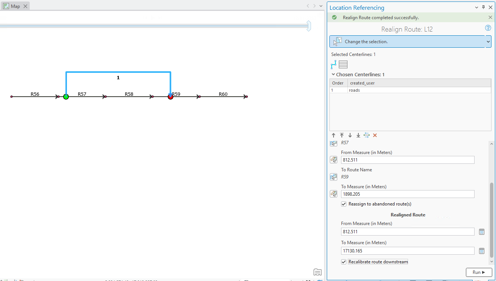
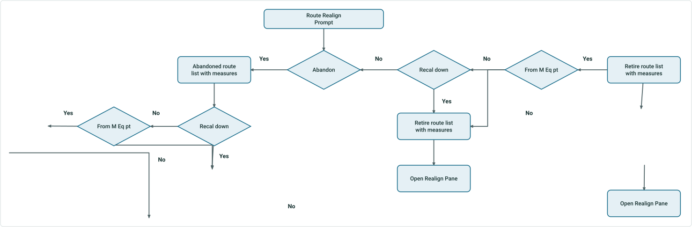
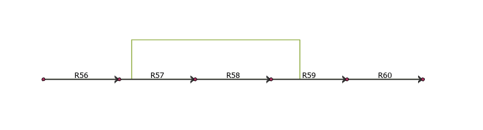
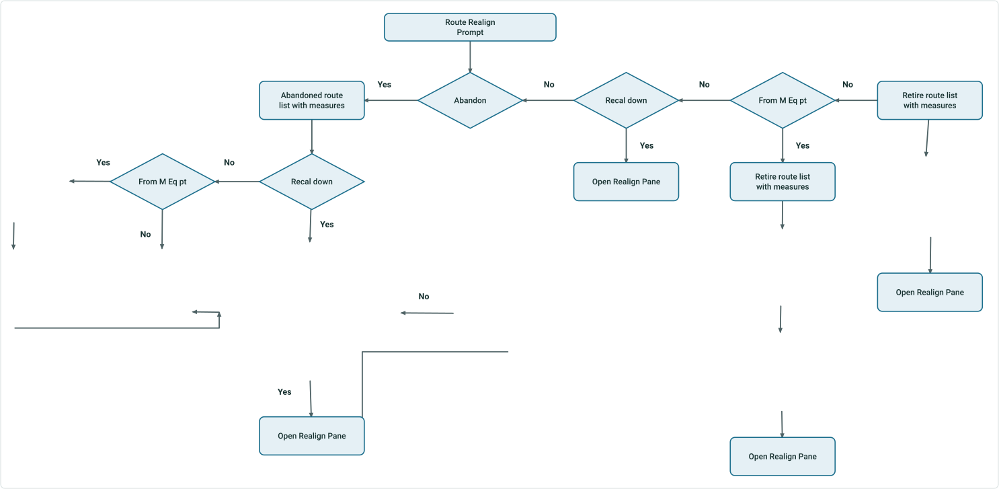
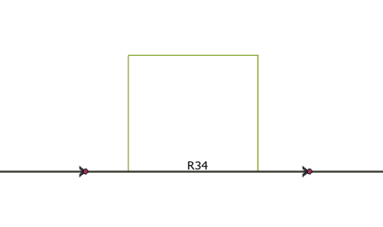
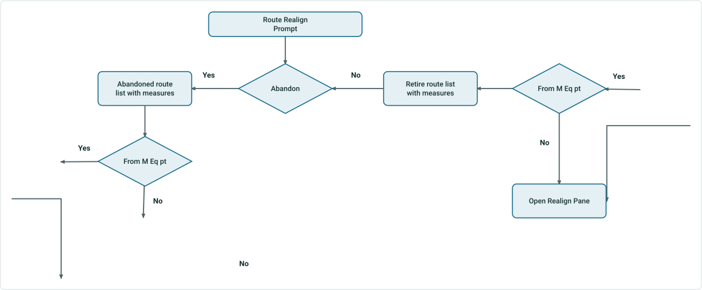
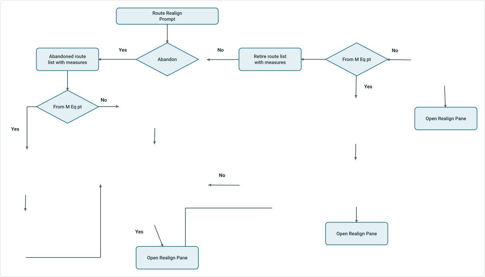

# ArcGIS Pro AI Assistant: Realign Route Subsequent Panes Test Plan

|   |   |
| --- | --- |
| **Kind** | Test Plan · Pro |
| **Release** | — |
| **Product** | Pipeline Referencing · Utility Network |
| **Source** | [RealignRoute_subsequentpanes_Testplan.pptx](<https://esriis.sharepoint.com/sites/LocationReferencing/Shared%20Documents/General/Test%20Plans/RealignRoute_subsequentpanes_Testplan.pptx>) |
| **Edited** | 2026-03-03 22:42 by Praveen Kumar |
| **Extracted** | 2026-09-04 · lane `xmlstrip` |

<!-- metadata
```yaml
title: "ArcGIS Pro AI Assistant: Realign Route Subsequent Panes Test Plan"
source_file: "RealignRoute_subsequentpanes_Testplan.pptx"
source_url: "https://esriis.sharepoint.com/sites/LocationReferencing/Shared%20Documents/General/Test%20Plans/RealignRoute_subsequentpanes_Testplan.pptx"
doc_id: 50
doc_kind: "Test Plan"
surface: "Pro"
doc_revision: ""
target_release: ""
pe: ""
dev: ""
author: "Praveen Kumar"
last_edited_by: "Praveen Kumar"
last_edited: "2026-03-03T22:42:32Z"
extracted: 2026-09-04
extraction_lane: xmlstrip
prompt_version: "v2.0.2"
keywords: ["realign route", "route abandonment", "route retirement", "line network", "engineering network", "centerlines", "route attributes", "measure recalibration"]
tools: ["Realign Route"]
products: ["Pipeline Referencing", "Utility Network"]
issues: []
related: [{"doc":51,"file":"realign-route-ai-assistant-test-plan__doc51.md","s":6.643},{"doc":80,"file":"realign-route-ai-assistant-test-plan__doc80.md","s":6.355},{"doc":102,"file":"pro-ai-assistant-realign-route__doc102.md","s":5.997},{"doc":91,"file":"pro-ai-assistant-realign-route-user-story__doc91.md","s":5.81},{"doc":11,"file":"reassign-route-subsequent-pane-ai-assistant-test-plan__doc11.md","s":4.9}]
```
-->

## Summary

Test plan for the Realign Route feature in ArcGIS Pro AI Assistant focusing on line networks. It covers scenarios with APR and UNAPR data, including cases with and without abandonment and equation points. The plan verifies correct population of details in subsequent panes and tests various prompts and expected results for route realignment operations.

## Related documents

<!-- related:begin -->
- [Realign Route AI Assistant Test Plan](<https://esriis.sharepoint.com/sites/lrsworkspace/LRS Doc Index/Test Plans/realign-route-ai-assistant-test-plan__doc51.md>) — similar text 0.31 · 3 title words · 2 filename words · same kind/surface/folder <!-- rel:51 -->
- [Realign Route AI Assistant Test Plan](<https://esriis.sharepoint.com/sites/lrsworkspace/LRS Doc Index/Test Plans/realign-route-ai-assistant-test-plan__doc80.md>) — similar text 0.31 · 3 title words · 2 filename words · same kind/surface/folder <!-- rel:80 -->
- [Pro AI Assistant Realign Route](<https://esriis.sharepoint.com/sites/lrsworkspace/LRS%20Doc%20Index/User%20Stories/pro-ai-assistant-realign-route__doc102.md>) — similar text 0.21 · 4 title words · 2 filename words · same surface <!-- rel:102 -->
- [Pro AI Assistant Realign Route User Story](<https://esriis.sharepoint.com/sites/lrsworkspace/LRS%20Doc%20Index/User%20Stories/pro-ai-assistant-realign-route-user-story__doc91.md>) — similar text 0.27 · 4 title words · 2 filename words · same surface <!-- rel:91 -->
- [Reassign Route Subsequent Pane AI Assistant Test Plan](<https://esriis.sharepoint.com/sites/lrsworkspace/LRS%20Doc%20Index/Test%20Plans/reassign-route-subsequent-pane-ai-assistant-test-plan__doc11.md>) — similar text 0.12 · 3 title words · 1 filename word · same kind/surface/folder <!-- rel:11 -->
<!-- related:end -->

<!-- docs:begin -->
## Esri documentation

[Realign routes](https://doc.esri.com/en/arcgis-pro/latest/help/production/location-referencing-pipelines/realign-routes.html) · [Retire routes](https://doc.esri.com/en/arcgis-pro/latest/help/production/location-referencing-pipelines/retire-routes.html) · [Configure continuous measure networks and events to update with an engineering network](https://doc.esri.com/en/arcgis-pro/latest/help/production/location-referencing-pipelines/configure-continuous-measure-networks-and-events-to-update-with-an-engineering-network.html) · [Split a centerline by point](https://doc.esri.com/en/arcgis-pro/latest/help/production/location-referencing-pipelines/split-a-centerline.html)
<!-- docs:end -->

---

## Slide 1

ArcGIS Pro AI Assistant : Realign Route Subsequent panes – Test plan
Notes:

- Applicable only to line network
- Test APR, UNAPR data
- Test with line networks with\without abandonment and with\without equation points
- Test with prompts that include all, some, and none of the information needed for the realignment to be completed
- Verify that the details provided in the AI assistant is correctly populated in the subsequent panes of realign route
- Ignore Recalibrate downstream for UN data if its provided in the prompt and always do not recalibrate by default

## Slide 2


 

## Case 1 <!-- slide 3 -->

### Realign Spanning Multiple Routes



Retire route list with measures
From M Eq pt
Retire route list with measures
ASK for New Realigned Route name and its attributes (if configured)
Abandoned route list with measures
ASK to accept default Abandon
Line Name and Route Names with attributes (if configured)
From M Eq pt
ASK for New Realigned Route name and its attributes (if configured)
ASK to provide new  Abandon
Line Name and Route Names with attributes (if configured)



## Case 2 <!-- slide 4 -->

### Realign on Same Route



Retire route list with measures
From M Eq pt
Retire route list with measures
ASK for New Realigned Route name and its attributes (if configured)
Abandoned route list with measures
ASK to accept default Abandon
Line Name and Route Names with attributes (if configured)
From M Eq pt
ASK to provide new  Abandon
Line Name and Route Names with attributes (if configured)
ASK for New Realigned Route name and its attributes (if configured)
ASK for New Downstream Route name and its attributes (if configured)
ASK for New Realigned Route name and its attributes (if configured)
ASK for New Realigned Route name and its attributes (if configured)
ASK for New Downstream Route name and its attributes (if configured)



## Case 3 <!-- slide 5 -->

### Realign Spanning Multiple Routes In UN Data



From M Eq pt
Retire route list with measures
ASK for New Realigned Route name and its attributes (if configured)
Abandoned route list with measures
ASK to accept default Abandon
Line Name and Route Names with attributes (if configured)
From M Eq pt
ASK for New Realigned Route name and its attributes (if configured)
ASK to provide new  Abandon
Line Name and Route Names with attributes (if configured)


## Case 4 <!-- slide 6 -->

### Realign on Same Route in UN Data



From M Eq pt
Retire route list with measures
ASK for New Realigned Route name and its attributes (if configured)
Abandoned route list with measures
ASK to accept default Abandon
Line Name and Route Names with attributes (if configured)
From M Eq pt
ASK to provide new  Abandon
Line Name and Route Names with attributes (if configured)
ASK for New Realigned Route name and its attributes (if configured)
ASK for New Downstream Route name and its attributes (if configured)
ASK for New Realigned Route name and its attributes (if configured)
ASK for New Realigned Route name and its attributes (if configured)
ASK for New Downstream Route name and its attributes (if configured)


## Slide 7

| No | Prompt | Expected Result |
| --- | --- | --- |
| 1 | Realign Route (CL selected) | List Abandoned routes, ASK to accept default Abandon Line Name and Route Names with attributes (if configured) |
| 2 | Realign Route in Engineering Network and do not recalibrate downstream (CL selected) | List Abandoned routes, ASK for New Realigned Route name and its attributes (if configured) ASK to accept default Abandon Line Name and Route Names with attributes (if configured) |
| 3 | Realign Route in Engineering Network . The from source measure should be 812.511 and the source to measure 1898.205 with target from measure of 812.511 and target to measure of 17130.165. Utilize centerlines 2929 valid on 01-01-2010. Do not abandon routes or recalibrate downstream | Open Realign Route pane Display Success message with details of realignment, retire routes with measures |
| 4 | Realign Route in Engineering Network . The from source measure should be 812.511 and the source to measure 1898.205 with target from measure of 851 and target to measure of 17130.165. Utilize centerlines 2929 valid on 01-01-2010. Do not abandon routes or recalibrate downstream | List Retire routes, ASK for New Realigned Route name and its attributes (if configured) |
| 5 | Realign Route in Engineering Network with default line and route names for abandonment | Open Realign Route pane Display Success message with details of realignment, abandon routes with measures and attributes if any |
| 6 | Realign Route in Engineering Network . The from source measure should be 812.511 and the source to measure 1898.205 with target from measure of 812.511 and target to measure of 17130.165. Utilize centerlines 2929 valid on 01-01-2010. use ‘L12_Abandon’ as abandoned line name and use ‘R57_Abandon’ , ‘R58_Abandon’, ‘R59_Abandon’ for abandoned route names. | Open Realign Route pane Display Success message with details of realignment, abandon routes with measures and attributes if any |
| 7 | Realign Route in Engineering Network . The from source measure should be 812.511 and the source to measure 1898.205 with target from measure of 851 and target to measure of 17130.165. Utilize centerlines 2929 valid on 01-01-2010. Do not abandon routes or recalibrate downstream, use ‘NewRouteR100’ for New Realigned Route name | Open Realign Route pane Display Success message with details of realignment, retire routes with measures, New realigned route name and measures |
| 8 | Using the Engineering Network, reorient a route (R56 to R59) starting at measure 812.511 and the source to measure 1898.205 with target from measure of 851 and target to measure of 17130.165. Utilize centerlines 2929 valid on 01-01-2010. Reassign source routes to abandoned routes and do not recalibrate downstream. | List Abandoned routes, ASK to accept default Abandon Line Name and Route Names with attributes (if configured) |
| 9 | Process a route realignment request: Route R56 to R59, source measure interval [812.511, 1898.205]. Source centerline features: OID 2929. Target measure interval [812.511, 17130.165]. Network: Engineering Network. Effective date: 2010-01-01. Reassign to abandoned route: Yes. Recalibrate downstream: Yes | List Abandoned routes, ASK to accept default Abandon Line Name and Route Names with attributes (if configured) |
| 10 | Process a route realignment request: Route R56 to R59, source measure interval [812.511, 1898.205]. Source centerline features: OID 2929. Target measure interval [800, 17130.165]. Network: Engineering Network. Effective date: 2010-01-01. Reassign to abandoned route: Yes. Recalibrate downstream: No | List Abandoned routes, ASK for New Realigned Route name and its attributes (if configured) ASK to accept default Abandon Line Name and Route Names with attributes (if configured) |
| 11 | Realign Route in Engineering Network using centerline with object id 2929, do not recalibrate downstream | List Abandoned routes, ASK to accept default Abandon Line Name and Route Names with attributes (if configured) |

Spanning routes

## Slide 8

| No | Prompt | Expected Result |
| --- | --- | --- |
| 1 | Realign Route (CL selected) | List Abandoned routes, ASK to accept default Abandon Line Name and Route Names with attributes (if configured) |
| 2 | Realign Route in Engineering Network and do not recalibrate downstream (CL selected) | List Abandoned routes, ASK for New Realigned Route name and its attributes (if configured) ASK to accept default Abandon Line Name and Route Names with attributes (if configured) |
| 3 | Realign Route in Engineering Network and do not abandon (CL selected) | Open Realign Route pane Display Success message with details of realignment |
| 4 | Realign Route in Engineering Network . The from source measure should be 949.46 and the source to measure 3847.665 with target from measure of 949.46 and target to measure of 9079.625. Utilize centerlines 2902 valid on 01-01-2010. Do not abandon routes or recalibrate downstream | List Retire routes, ASK for New Realigned Route name and its attributes (if configured) |
| 5 | Realign Route in Engineering Network . The from source measure should be 949.46 and the source to measure 3847.665 with target from measure of 950 and target to measure of 9079.625. Utilize centerlines 2902 valid on 01-01-2010. Do not abandon routes or recalibrate downstream | List Retire routes, ASK for New Realigned Route name and its attributes (if configured) ASK for New Downstream Route name and its attributes (if configured) |
| 6 | Realign Route in Engineering Network with default line and route names for abandonment (CL selected) | Open Realign Route pane Display Success message with details of realignment, abandon routes with measures and attributes if any |
| 7 | Realign Route in Engineering Network . The from source measure should be 949.46 and the source to measure 3847.665 with target from measure of 949.46 and target to measure of 9079.625. Utilize centerlines 2902 valid on 01-01-2010. use ‘L7_Abandon’ as abandoned line name and use ‘R34_Abandon for abandoned route name. | Open Realign Route pane Display Success message with details of realignment, abandon routes with measures and attributes if any |
| 8 | Realign Route in Engineering Network . The from source measure should be 949.46 and the source to measure 3847.665 with target from measure of 949.46 and target to measure of 9079.625. Utilize centerlines 2902 valid on 01-01-2010. use ‘L7_Abandon’ as abandoned line name and use ‘R34_Abandon for abandoned route name, do not recalibrate and use ‘NewRouteR1000’ for New Realigned Route name | Open Realign Route pane Display Success message with details of realignment, abandon routes with measures and attributes if any |
| 9 | Process a route realignment request: Route R34, source measure interval [949.46, 3847.665]. Source centerline features: OID 2902. Target measure interval [951, 9079.625]. Network: Engineering Network. Effective date: 2010-01-01. Reassign to abandoned route: Yes. Recalibrate downstream: No | List Abandoned routes, ASK for New Realigned Route name and its attributes (if configured) ASK for New Downstream Route name and its attributes (if configured) ASK to accept default Abandon Line Name and Route Names with attributes (if configured) |
| 10 | Realign Route in Engineering Network using centerline with object id 2902, do not recalibrate downstream | List Abandoned routes, ASK for New Realigned Route name and its attributes (if configured) ASK to accept default Abandon Line Name and Route Names with attributes (if configured) |
| 11 | Realign Route in Engineering Network . The from source measure should be 949.46 and the source to measure 3847.665 with target from measure of 999 and target to measure of 9079.625. Utilize centerlines 2902 valid on 01-01-2010. use ‘L7_Abandon’ as abandoned line name and use ‘R34_Abandon for abandoned route name, do not recalibrate and use ‘NewRouteR1000’ for New Realigned Route name, use ‘NewdownstreamR1000’ for new downstream route name | Open Realign Route pane Display Success message with details of realignment, abandon routes with measures and attributes and details of new realign and downstream routes |

Non Spanning routes
