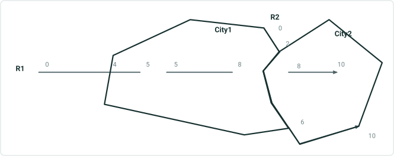
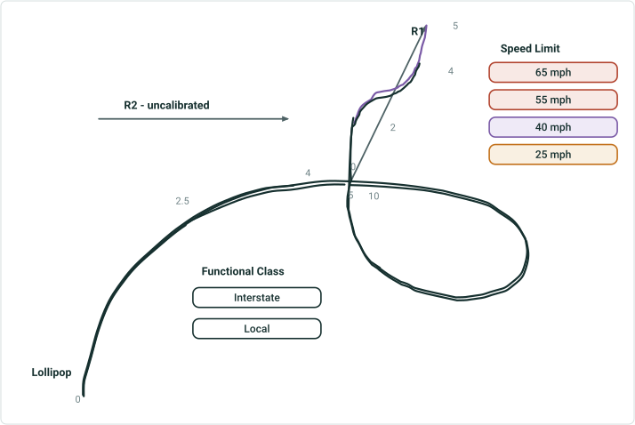
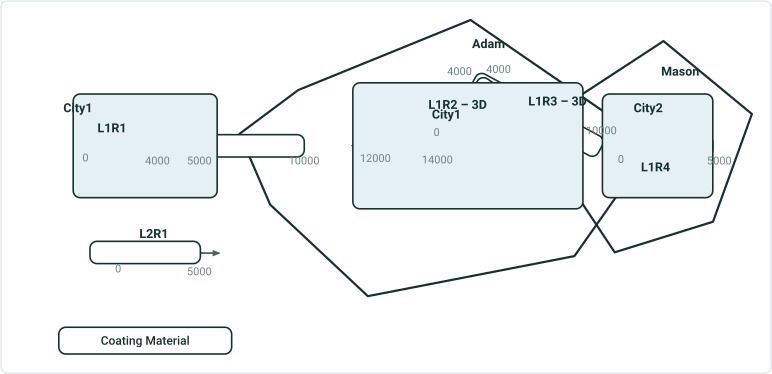
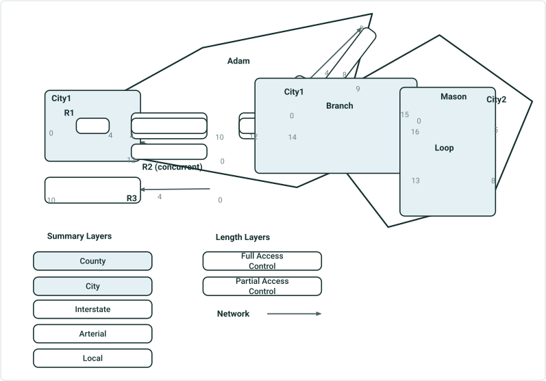

# Calculate length for unclassified summary values – Test Plan

|   |   |
| --- | --- |
| **Kind** | Test Plan · Pro |
| **Release** | — |
| **Product** | Roads & Highways · Pipeline Referencing |
| **Issue** | [ArcGISPro/ps-location-referencing#6201](https://devtopia.esri.com/ArcGISPro/ps-location-referencing/issues/6201) |
| **Source** | [6201_LengthForUnclassified_Testplan.pptx](<https://esriis.sharepoint.com/sites/LocationReferencing/Shared%20Documents/General/Test%20Plans/6201_LengthForUnclassified_Testplan.pptx>) |
| **Edited** | 2025-01-14 22:28 by Claire Wang |
| **Extracted** | 2026-09-04 · lane `xmlstrip` |

<!-- metadata
```yaml
title: "Calculate length for unclassified summary values – Test Plan"
source_file: "6201_LengthForUnclassified_Testplan.pptx"
source_url: "https://esriis.sharepoint.com/sites/LocationReferencing/Shared%20Documents/General/Test%20Plans/6201_LengthForUnclassified_Testplan.pptx"
doc_id: 252
doc_kind: "Test Plan"
surface: "Pro"
doc_revision: ""
target_release: ""
pe: ""
dev: "Eric"
author: "Lakshmi Ananthanarayanan"
last_edited_by: "Claire Wang"
last_edited: "2025-01-14T22:28:30Z"
extracted: 2026-09-04
extraction_lane: xmlstrip
prompt_version: "v2.0.2"
keywords: ["length calculation", "unclassified", "summary layers", "route length", "geoprocessing", "polygon summary layer", "line event summary layer"]
tools: ["Generate LRS Data Product"]
products: ["Roads & Highways", "Pipeline Referencing"]
issues: ["ArcGISPro/ps-location-referencing#6201"]
related: [{"doc":321,"file":"support-multiple-summary-fields-in-generate-lrs-data-product-test-plan__doc321.md","s":4.349},{"doc":255,"file":"generate-a-route-log-including-spanning-events-and-centerline-test-plan__doc255.md","s":4.17},{"doc":339,"file":"generate-lr-data-product-support-summary-and-length-fields-from-the-template__doc339.md","s":4.167},{"doc":232,"file":"support-table-output-with-the-length-product-template-test-plan__doc232.md","s":3.799},{"doc":172,"file":"generatelengthsummary-test-plan__doc172.md","s":3.614}]
```
-->

## Summary

Test plan for calculating route lengths including segments not intersecting summary layers, labeled as Unclassified. Covers positive and negative test cases using the Generate LRS Data Product geoprocessing tool with various route shapes, summary layers, and data sources. Includes automation considerations and documentation notes.

## Related documents

<!-- related:begin -->
- [Support multiple summary fields in Generate LRS Data Product – Test Plan](<https://esriis.sharepoint.com/sites/lrsworkspace/LRS Doc Index/Test Plans/support-multiple-summary-fields-in-generate-lrs-data-product-test-plan__doc321.md>) — similar text 0.32 · 1 title word · 1 filename word · same kind/surface/folder <!-- rel:321 -->
- [Generate a route Log including spanning events and centerline – Test Plan](<https://esriis.sharepoint.com/sites/lrsworkspace/LRS Doc Index/Test Plans/generate-a-route-log-including-spanning-events-and-centerline-test-plan__doc255.md>) — similar text 0.25 · 1 filename word · same kind/surface/folder <!-- rel:255 -->
- [Generate LR Data Product: Support summary and length fields from the template – Test Plan](<https://esriis.sharepoint.com/sites/lrsworkspace/LRS Doc Index/Test Plans/generate-lr-data-product-support-summary-and-length-fields-from-the-template__doc339.md>) — similar text 0.19 · 2 title words · 1 filename word · same kind/surface/folder <!-- rel:339 -->
- [Support table output with the length product template – Test Plan](<https://esriis.sharepoint.com/sites/lrsworkspace/LRS Doc Index/Test Plans/support-table-output-with-the-length-product-template-test-plan__doc232.md>) — similar text 0.33 · 1 title word · 2 filename words · same kind/surface <!-- rel:232 -->
- [GenerateLengthSummary – Test Plan](<https://esriis.sharepoint.com/sites/lrsworkspace/LRS Doc Index/Test Plans/generatelengthsummary-test-plan__doc172.md>) — similar text 0.21 · 2 filename words · same kind/surface <!-- rel:172 -->
<!-- related:end -->

<!-- docs:begin -->
## Esri documentation

_No page matched:_ [Generate LRS Data Product](https://www.google.com/search?q=%22Generate%20LRS%20Data%20Product%22+site%3Adoc.esri.com)
<!-- docs:end -->

---

## Slide 1 — Calculate length for unclassified summary values – Test Plan

https://devtopia.esri.com/ArcGISPro/ps-location-referencing/issues/6201

PE: ?
Dev: Eric

## Slide 2

As of now, length of a route is calculated only at the locations where the route is intersecting all the summary layers. But we also need to calculate the length of the route that is not intersecting the summary layers and name the cell as Unclassified.


| County | City | Length |
| --- | --- | --- |
| County X | City1 | 12 |
|  | City4 | 10 |
| County X | Unclassified | 17 |
| Unclassified | Unclassified | 3 |

| Summary Level | Layer |
| --- | --- |
| 1 | County Boundary |
| 2 | City Boundary |

Testing

- Use existing Generate LRS Data Product GP tool
- Input template is a Length template
  - Test when template does not include summary layer and user chooses the summary layer in GP tool
- Test in fgdb, egdb (oracle + sql), fs - default and versions
- Test with RH, APR, and ADM (few cases)
- Test with simple, gapped, 3D, and complex route shapes
- Test with polygons and/or line events being the summary layers
- Test with and without length layers
- Test 1 case with uncalibrated route
  - Excluded or not does not impact result
- Test 1 case with overlapping and gapped summary layers
- Test 1 case where the route does not intersect any summary layer
- Test 1 case when all length layers are within summary layers, and no Unclassified will show up
- Test with different gap calibration rules
- Test with and without route selection and definition query


## Positive Cases <!-- slide 3 -->

### 1 Polygon Summary Layer with 0 Length Layer

- 1 line event summary layer with multiple length layers
- Multiple polygon summary layer with 1 length layer
- Combination of polygon and line event summary layers with multiple length layers
Negative cases
No new negative case
Automation
Part of the original GP tool automation.
Existing automation might break. If so, fix it plus add more cases if necessary.
Documentation
Place a note in the GP tool doc – usage note.

## Slide 4

Test1: 1 polygon summary layer with 0 length layer

  - Simple and gapped routes
  - Route on polygon boundaries



| City | Length |
| --- | --- |
| City1 | 10 |
| City2 | 10 |
| Unclassified | 4 |

Length is calculated for all polygon features when it exists in overlapping polygons or shared polygon boundaries.

## Slide 5

Test2: 1 line event summary layer with multiple length layers

  - Complex shapes



| Functional Class | 65 mph | 55 mph | 40 mph | 25 mph |
| --- | --- | --- | --- | --- |
| Interstate | 2.5 | 1.5 | 0 | 0 |
| Local | 0 | 0 | 2 | 2 |
| Unclassified | 0 | 1 | 1 | 5 |

R2 does not affect result at all

## Slide 6

Test3: Multiple polygon summary layer with 1 length layer

  - Gapped and 3D routes
  - Overlapping and gapped polygon
  - 1 route does not intersect any summary layer



| County | City | Coated |
| --- | --- | --- |
| Adam | City1 | 12000 |
| Adam | City2 | 2500 |
| Adam | Unclassified | 2500 |
| Mason | City1 | 2000 |
| Mason | City2 | 5000 |
| Unclassified | City1 | 2000 |
| Unclassified | Unclassified | 7500 |

## Slide 7

Test4: Combination of polygon and line event summary layers with multiple length layers

  - Gapped and complex shapes
  - Concurrent route with different calibration
  - Gapped polygon
  - 1 route does not intersect any summary layer



| County | City | Functional Class | Route length | Full access control | Partial access control |
| --- | --- | --- | --- | --- | --- |
| Adam | City1 | Interstate | 2 | 2 | 0 |
| Adam | City1 | Arterial | 1 | 0 | 0 |
| Adam | City1 | Local | 4 | 0 | 0 |
| Adam | Unclassified | Interstate | 6 | 6 | 0 |
| Adam | Unclassified | Arterial | 12 | 0 | 0 |
| Adam | Unclassified | Local | 4 | 0 | 0 |
| Mason | City1 | Arterial | 6 | 0 | 0 |
| Mason | City1 | Unclassified | 3 | 0 | 3 |
| Mason | City2 | Arterial | 13 | 0 | 13 |
| Mason | City2 | Unclassified | 3 | 0 | 3 |
| Unclassified | City1 | Interstate | 2 | 0 | 0 |
| Unclassified | City1 | Unclassified | 2 | 0 | 0 |
| Unclassified | Unclassified | Unclassified | 10 | 6 | 0 |
