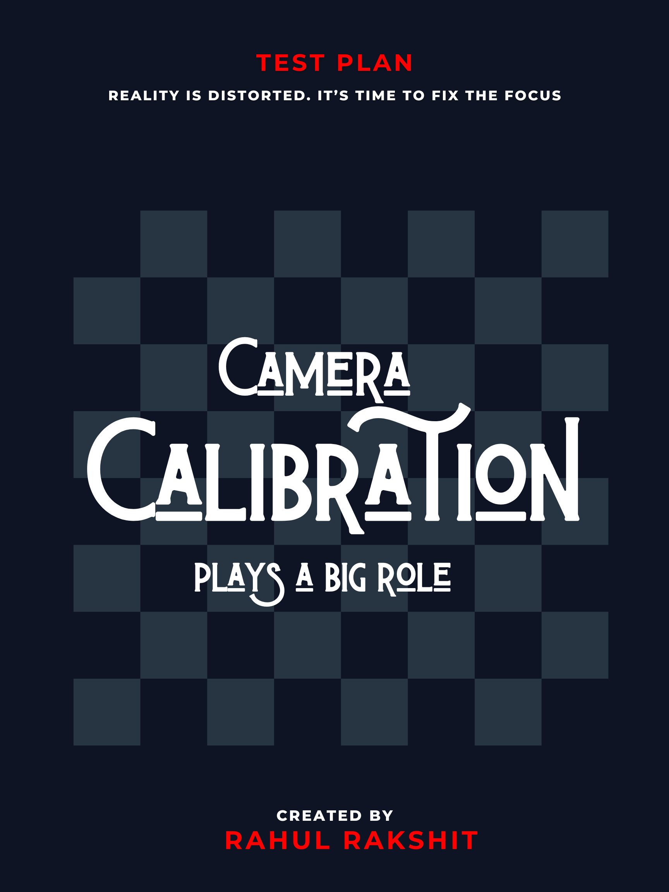
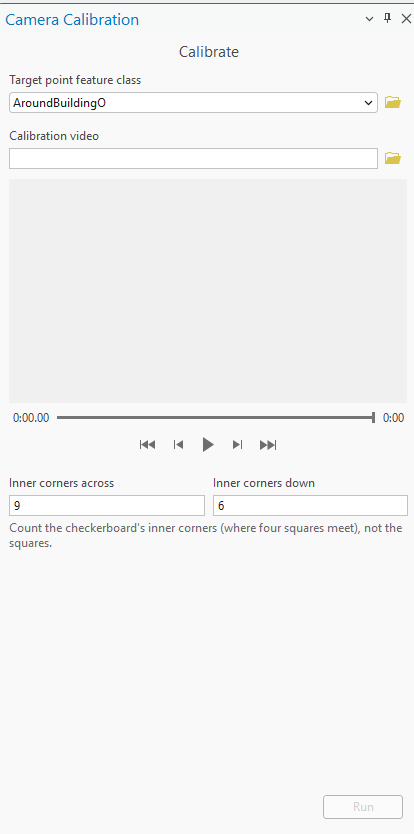

# Camera Calibration Test Plan

|   |   |
| --- | --- |
| **Kind** | Test Plan · Enterprise |
| **Release** | — |
| **Source** | [Camera_Calibration_TestPlan.pptx](<https://esriis.sharepoint.com/sites/LocationReferencing/Shared%20Documents/General/Test%20Plans/Camera_Calibration_TestPlan.pptx>) |
| **Edited** | 2026-07-22 23:34 by Rahul Rakshit |
| **Extracted** | 2026-09-04 · lane `xmlstrip` |

<!-- metadata
```yaml
title: "Camera Calibration Test Plan"
source_file: "Camera_Calibration_TestPlan.pptx"
source_url: "https://esriis.sharepoint.com/sites/LocationReferencing/Shared%20Documents/General/Test%20Plans/Camera_Calibration_TestPlan.pptx"
doc_id: 8
doc_kind: "Test Plan"
surface: "Enterprise"
doc_revision: ""
target_release: ""
pe: ""
dev: ""
author: "Rahul Rakshit"
last_edited_by: "Rahul Rakshit"
last_edited: "2026-07-22T23:34:21Z"
extracted: 2026-09-04
extraction_lane: xmlstrip
prompt_version: "v2.0.2"
keywords: ["camera calibration", "calibration video", "checkerboard", "field updates", "error handling", "asset detection", "video profile", "hardware testing"]
tools: ["Detect Assets", "Load Video", "Calibrate Tool"]
products: []
issues: []
related: [{"doc":19,"file":"load-video-test-plan__doc19.md","s":4.183},{"doc":10,"file":"detect-objects-test-plan__doc10.md","s":3.176},{"doc":98,"file":"create-route-ai-assistant-test-plan__doc98.md","s":2.081},{"doc":80,"file":"realign-route-ai-assistant-test-plan__doc80.md","s":1.9},{"doc":159,"file":"show-adm-and-un-in-lrs-hierarchy-and-properties-test-plan__doc159.md","s":1.621}]
```
-->

## Summary

Test plan for camera calibration tool covering input validation, calibration video requirements, field updates, and integration with asset detection. Includes hardware test methodology and expected error handling for various input scenarios. Ensures calibration parameters are correctly computed and persisted.

## Related documents

<!-- related:begin -->
- [Load Video Test Plan](<https://esriis.sharepoint.com/sites/lrsworkspace/LRS Doc Index/Test Plans/load-video-test-plan__doc19.md>) — similar text 0.31 · same kind/folder <!-- rel:19 -->
- [Detect Objects Test Plan](<https://esriis.sharepoint.com/sites/lrsworkspace/LRS Doc Index/Test Plans/detect-objects-test-plan__doc10.md>) — similar text 0.25 · same kind/folder <!-- rel:10 -->
- [Create Route AI Assistant Test Plan](<https://esriis.sharepoint.com/sites/lrsworkspace/LRS Doc Index/Test Plans/create-route-ai-assistant-test-plan__doc98.md>) — similar text 0.08 · same kind/folder <!-- rel:98 -->
- [Realign Route AI Assistant Test Plan](<https://esriis.sharepoint.com/sites/lrsworkspace/LRS Doc Index/Test Plans/realign-route-ai-assistant-test-plan__doc80.md>) — similar text 0.06 · same kind/folder <!-- rel:80 -->
- [Show ADM and UN in LRS hierarchy and properties – Test Plan](<https://esriis.sharepoint.com/sites/lrsworkspace/LRS Doc Index/Test Plans/show-adm-and-un-in-lrs-hierarchy-and-properties-test-plan__doc159.md>) — similar text 0.04 · same kind/folder <!-- rel:159 -->
<!-- related:end -->

<!-- docs:begin -->
## Esri documentation

_No page matched:_ [Detect Assets](https://www.google.com/search?q=%22Detect%20Assets%22+site%3Adoc.esri.com) · [Load Video](https://www.google.com/search?q=%22Load%20Video%22+site%3Adoc.esri.com) · [Calibrate Tool](https://www.google.com/search?q=%22Calibrate%20Tool%22+site%3Adoc.esri.com)
<!-- docs:end -->

---

## Slide 1



## Slide 2

| Enterprise License with LR | Result |
| --- | --- |
| Professional Plus | Works |
| Professional | Works |
| Creator | Works |

| Enterprise License without LR or Indoors | Result |
| --- | --- |
| Professional Plus | Fails |
| Professional | Fails |
| Creator | Fails |


| Test | Result |
| --- | --- |
| Re-run identical inputs: Output identical |  |
| Cancel mid-run: Tool stops cleanly |  |
| Configure parameters, close the project session, and reopen it: The last-used configuration for the tool is fully persisted and loaded automatically. |  |

| Input | Output |
| --- | --- |
| All user facing strings | Internationalized |
| Error Messages | Internationalized |
| Logging info | Internationalized |

Requirements prior to testing

| List |
| --- |
| All Error Messages |
| All Warning Messages |
| Logging info and format |



## Slide 3

Test Methodology

| Hardware |
| --- |
| Test with single grid on same camera with different profiles |
| Test with multiple grids on same camera with same profile |
| Test on cameras and phones |

Fields in the point FC to be updated

- Print a 9x7 or 8x6 or another ratio checkerboard grid.
- Create a calibration video for each type of Camera + Video Profile
- Use the calibrated output in the Detect Assets tool.
- Compare the results using uncalibrated data in the Detect Assets tool.
- The calibrated output should produce better results in terms of matching the asset’s location on the ground.

| Load video tool's FC fields | Tool Updates the field | Check availability of this field |
| --- | --- | --- |
| OBJECTID | No | No |
| Name | No | YES |
| ImagePath | No | YES |
| AcquisitionDate | No | YES |
| CameraHeading | No | YES |
| CameraPitch | No | YES |
| CameraRoll | No | YES |
| HorizontalFieldOfView | Yes | YES |
| VerticalFieldOfView | Yes | YES |
| NearDistance | Yes | YES |
| FarDistance | Yes | YES |
| OrientedImageryType | No | Yes - Video Only |
| OffsetFromStart | No | No |
| GeorefQuality | No | No |
| FrameWidth | No | Yes |
| FrameHeight | No | Yes |
| CameraHeight | No | No |
| FocalLength | Yes | YES or Create |
| PrincipalX | Yes | YES or Create |
| PrincipalY | Yes | YES or Create |
| Radial | Yes | YES or Create |
| Tangential | Yes | YES or Create |

- Verify that the Calibrate Tool successfully writes values to the fields marked "Yes" in the provided table.
- Use the field verification tests from the Detect Assets using  SAM3 test plan.
- Verify that the Computed calibration parameters are formatted correctly for integration with the Depth Anything model.
- Ensure derived parameters remain consistent across all frames
- Test with screen/monitor based checkerboard

## Slide 4

| Input | Output |
| --- | --- |
| Non-Feature Class | Error message |
| Nonpoint FC | Error message |
| Non existing file | Error message |
| No value | Error message |
| Multiple FC files selected | Error message |
| Valid FC | File Accepted |
| Value provided > Next Page > Provide inputs in that Page > Back | The inputs provided for FC should remain same |
| Network location | Works |
| FGDB | Works |
| eGDB | Works |
| FS | Error message |
| No Data exists in the FC | Tool doesn’t start |
| Unknown spatial reference | Error message |
| File locked by another user | Error |
| Selection Set in the FC | No effect |
| Definition Query in the FC | No effect |
| Use OI dataset as input | Works |

Target Point FC

## Slide 5

Calibration Video

| Input | Output |
| --- | --- |
| Non-video file | Error message |
| Non existing file | Error message |
| No value | Show error |
| Multiple MP4 files selected | Error: Select a single MP4 file |
| Input a `.mov`, `.avi`, or `. mkv ` file (unsupported) | Error: Unsupported file type. Only MP4 is supported |
| 360-degree MP4 | Error: 360 video is not supported |
| Valid Framed MP4 | File Accepted |
| Network location | Works |
| Videos does not contain checkerboard | Error upon running |
| Videos too short and does not contain all angles | Error upon running or insufficient samples warning |
| Videos with multiple formats are present in the location | File picker filters supported formats |
| Checkerboard not flat in the video | Warning |
| Color Checkerboard | Works |
| Video contains many other visuals + checkerboard: Use the time sliders to position the correct time range | Works |
| Video in poor lighting | Works |
| Varied lighting | Worls |
| Video not in the same video profile as the one used for the frames | Error upon running |
| Blurry video | Works |
| Too long video (10 Mins) | Works |
| Multiple checkerboards with different patterns | Error |

Inner corners across/down

| Input | Output |
| --- | --- |
| Nonnumeric value | Error message |
| Value does not match the checkerboard | Error message upon running the tool |
| No value | Show error |
| Negative number | Show error |
