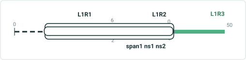
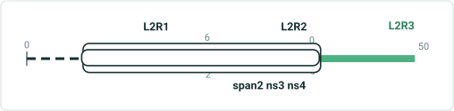
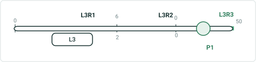
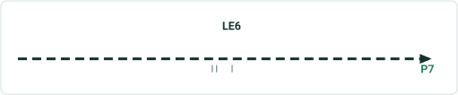
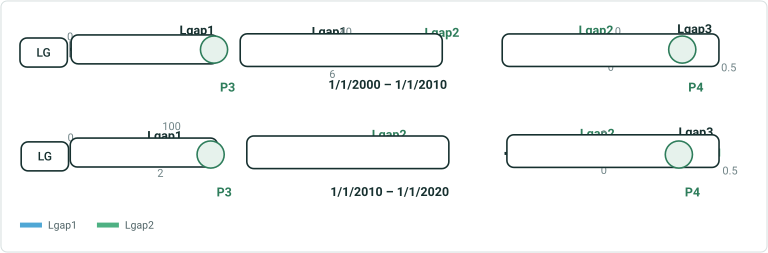

# Change Route/Line Name Test Plan

|   |   |
| --- | --- |
| **Kind** | Test Plan · Pro |
| **Release** | — |
| **Issue** | [ArcGISPro/ps-location-referencing#837](https://devtopia.esri.com/ArcGISPro/ps-location-referencing/issues/837) |
| **Source** | [837-change_Route_Line_name_v4.pptx](<https://esriis.sharepoint.com/sites/LocationReferencing/Shared%20Documents/General/Test%20Plans/837-change_Route_Line_name_v4.pptx>) |
| **Edited** | 2022-08-30 01:25 by Claire Wang |
| **Extracted** | 2026-09-04 · lane `xmlstrip` |

<!-- metadata
```yaml
title: "Change Route/Line Name Test Plan"
source_file: "837-change_Route_Line_name_v4.pptx"
source_url: "https://esriis.sharepoint.com/sites/LocationReferencing/Shared%20Documents/General/Test%20Plans/837-change_Route_Line_name_v4.pptx"
doc_id: 637
doc_kind: "Test Plan"
surface: "Pro"
doc_revision: "V4"
target_release: ""
pe: "Claire Wang"
dev: ""
author: "Lakshmi Ananthanarayanan"
last_edited_by: "Claire Wang"
last_edited: "2022-08-30T01:25:25Z"
extracted: 2026-09-04
extraction_lane: xmlstrip
prompt_version: "v2.0.2"
keywords: ["route name", "line name", "route renaming", "time slicing", "derived route", "event layers", "conflict prevention", "ui verification"]
tools: ["Rename Route/Line Tool"]
products: []
issues: ["ArcGISPro/ps-location-referencing#837"]
related: [{"doc":636,"file":"add-line-event-tool-coordinate-offset-method-test-plan__doc636.md","s":3.745},{"doc":620,"file":"support-translation-between-routeid-and-routename-and-between-lrs-networks-test__doc620.md","s":3.564},{"doc":549,"file":"append-events-load-events-by-routename-test-plan__doc549.md","s":3.559},{"doc":640,"file":"support-translation-between-routeid-and-routename-and-between-lrs-networks-test__doc640.md","s":3.055},{"doc":231,"file":"add-line-events-by-offsetting-from-other-points-test-plan__doc231.md","s":2.914}]
```
-->

## Summary

Test plan for a new tool in ArcGIS Pro to change route or line names across time slices in LRS networks. Covers testing in direct connection and feature service modes, with simple and gapped routes, including derived routes and events. Includes positive and negative test cases for validation, conflict prevention, UI verification, and accessibility.

## Related documents

<!-- related:begin -->
- [Add Line Event Tool Coordinate Offset Method Test Plan](<https://esriis.sharepoint.com/sites/lrsworkspace/LRS%20Doc%20Index/Test%20Plans/add-line-event-tool-coordinate-offset-method-test-plan__doc636.md>) — similar text 0.19 · 1 title word · same kind/surface/pe/folder <!-- rel:636 -->
- [Support Translation Between RouteID and RouteName (and Between LRS Networks) Test Plan](<https://esriis.sharepoint.com/sites/lrsworkspace/LRS Doc Index/Test Plans/support-translation-between-routeid-and-routename-and-between-lrs-networks-test__doc620.md>) — similar text 0.16 · 2 filename words · same kind/surface/folder <!-- rel:620 -->
- [Append Events: Load Events by RouteName Test Plan](<https://esriis.sharepoint.com/sites/lrsworkspace/LRS Doc Index/Test Plans/append-events-load-events-by-routename-test-plan__doc549.md>) — similar text 0.17 · 2 filename words · same kind/surface/folder <!-- rel:549 -->
- [Support Translation Between RouteID and RouteName (and Between LRS Networks) Test Plan](<https://esriis.sharepoint.com/sites/lrsworkspace/LRS%20Doc%20Index/Test%20Plans/support-translation-between-routeid-and-routename-and-between-lrs-networks-test__doc640.md>) — similar text 0.16 · 2 filename words · same kind/surface <!-- rel:640 -->
- [Add Line Events by offsetting from other points – Test Plan](<https://esriis.sharepoint.com/sites/lrsworkspace/LRS Doc Index/Test Plans/add-line-events-by-offsetting-from-other-points-test-plan__doc231.md>) — similar text 0.17 · 1 title word · 1 filename word · same kind/surface/folder <!-- rel:231 -->
<!-- related:end -->

<!-- docs:begin -->
## Esri documentation

[Conflict prevention](https://doc.esri.com/en/arcgis-pro/latest/help/production/location-referencing-pipelines/conflict-prevention.html)

_No page matched:_ [Rename Route/Line Tool](https://www.google.com/search?q=%22Rename%20Route%2FLine%20Tool%22+site%3Adoc.esri.com)
<!-- docs:end -->

---

## Slide 1 — Change Route/ Line name – Test Plan

https://devtopia.esri.com/ArcGISPro/ps-location-referencing/issues/837

PE: Claire Wang
Dev:

## Slide 2

Data:

- Create a new tool in the Tools section of the LR ribbon to provide the ability to change a route/line name in ArcGIS Pro.
- Test in Direct connection and Feature Service (default and other versions).
- LRS networks must support Route Name/Line Name.
- Test with nonline and line networks
- Test a few simple routes and gapped routes, no need to specifically test complex shapes
- Renaming a route should change the Route Name across time slices – Update the Route Name and Line Name for all the routes in the line across all time slices
- Test when route has events registered with Route Name – Update the Route Name in event layers
- Test when the Derived routes have events with Derived Route Name – Update the Route Name in the Derived Network and update the Derived Route Name in any event layers that have the Derived Event measures enabled
- Test few cases for conflict prevention with this method
- Dark and Light Mode
- 508 and i18n
Documentation

- Create a new document for Renaming Routes outlining the use cases

Automation

- Create 2-3 UI automation cases

## Slide 3


Verification
General UI verification

- Verify a new tool with its new icon is present in the Tools section of the LR ribbon
- Verify a tab in the pane is opened on the right-side of the Pro window upon clicking the tool
- Verify in the panes the labels of the field are of same font size and aligned left
- Verify all the editable fields are of white background and of same size and are aligned properly
- Verify the icons provided in a pane are of same size and aligned properly
- Verify the options, auto-hide/pin, and close buttons work as expected
  - Closing and reopening the Rename pane will lose all information entered previously


## Slide 4


Verification - Pane parameters
Network

- The Network dropdown contains all networks that support Route Name and Line name
  - List the Networks available in the TOC in the order that are present
  - If there is only one supported Network available in the map, then select it by default
Rename Field

- If a network with Route Name only is selected, the Rename Field is default to Route Name. If a network with both Route Name and Line Name is selected, the Rename Field dropdown provides 2 options: Route Name and Line Name. Route Name will still be the default.
- Verify the “Existing … Name” and “New … Name” display the corresponding network type (route or line) upon specifying the previous parameters.
Existing Name

- The Existing Route/Line Name can be typed or selected from the map
- Verify the validity of the Route/Line name (from the selected Network) when the focus moves away from the text input box
- Verify the pickers work with snapping
- When using the picker, if there exists multiple routes/lines at a location, then show the selection modal window with a table that shows: Route/Line Name, Route/Line ID, From Date and To Date
  - Only show multiple routes, but not the same route with multiple time slices (This is different from the user story where time slices should show up)
- Flash the Route/Line 3 times using arcpro default flashing color
New Name

- The New Route/Line Name can be only typed
- Verify the validity of the Route/Line name when the focus moves away from the text input box, or the Run button is clicked
- The new Route/Line Name should be unique across time. The new Route/Line name should not exist in the Network.


## Slide 5

Verification - Changing Parameters

- If the Network is changed, then clear the form
- If the Existing Route/Line Name is changed, validate it
- If the New Route/Line Name is changed, validate it
Error message verification


| No | Test | Expected Result | Error Message (provided by dev) |
| --- | --- | --- | --- |
| 1 | No LRS Network with Route Name configured available in the TOC | Error |  |
| 2 | Lock not available | Error |  |
| 3 | Typed in Existing Route/Line Name does not exist in the network | Error |  |
| 4 | Provide a non-unique route/line name in New Route Name | Error |  |
| 5 | Test what if - Provide identical Existing Route/Line name and New Route/Line Name | Error |  |


## Slide 6


3 networks:
Continous: 1 LE, 1 PE
Line: 3 events; 1 LE spanning and 1 LE non-spanning, and 1 PE with derived referent
Derived
Legend
Route with measures

Line Event

Point Event


## Slide 7 — Positive cases

## Slide 8 — 1. Simple route with 2 events


|  |
| --- |

| Input |  |  |  |
| --- | --- | --- | --- |
| Network | Rename Field | Existing Route Name | New Route Name |
| Continuous | Route Name | R1 | R1new |

LE1

| Network |  |  |  |
| --- | --- | --- | --- |
| F date | T date | RouteID | Route Name |
| 1/1/2000 |  | {A92373-} | R1 |

| Event - line |  |  |  |  |  |  |  |  |
| --- | --- | --- | --- | --- | --- | --- | --- | --- |
| Event Layer | EventId | RouteID | RouteName | FromMeasure | ToMeasure | From Date | To Date | sign |
| LE | LE1 | {A92373-} | R1 | 2 | 6 | 1/1/2000 |  | 1 |

| Network |  |  |  |
| --- | --- | --- | --- |
| F date | T date | RouteID | Route Name |
| 1/1/2000 |  | {A92373-} | R1new |

| Event |  |  |  |  |  |  |  |  |
| --- | --- | --- | --- | --- | --- | --- | --- | --- |
| Event Layer | EventId | RouteID | RouteName | FromMeasure | ToMeasure | From Date | To Date | sign |
| LE | LE1 | {A92373-} | R1new | 2 | 6 | 1/1/2000 |  | 1 |

Expected
Update referent to be route and M and show changed Route/line name

P5

| Event - point |  |  |  |  |  |  |  |
| --- | --- | --- | --- | --- | --- | --- | --- |
| Event Layer | EventId | RouteID | RouteName | Measure | From Date | To Date | sign |
| Pcont | P5 | {A92373-} | R1 | 4 | 1/1/2000 |  | 11 |

| Event - point |  |  |  |  |  |  |  |
| --- | --- | --- | --- | --- | --- | --- | --- |
| Event Layer | EventId | RouteID | RouteName | Measure | From Date | To Date | sign |
| Pcont | P5 | {A92373-} | R1new | 4 | 1/1/2000 |  | 11 |


## Slide 9 — 2. Gapped route with 2 events

|  |
| --- |

| Input |  |  |  |
| --- | --- | --- | --- |
| Network | Rename Field | Existing Route Name | New Route Name |
| Continuous | Route Name | R2 | R2new |

| Network |  |  |  |
| --- | --- | --- | --- |
| F date | T date | RouteID | Route Name |
| 1/1/2000 |  | {A92373-} | R2 |

| Event - line |  |  |  |  |  |  |  |  |
| --- | --- | --- | --- | --- | --- | --- | --- | --- |
| Event Layer | EventId | RouteID | RouteName | FromMeasure | ToMeasure | From Date | To Date | sign |
| LE | LE2 | {A92373-} | R2 | 2 | 8 | 1/1/2000 |  | 2 |

| Network |  |  |  |
| --- | --- | --- | --- |
| F date | T date | RouteID | Route Name |
| 1/1/2000 |  | {A92373-} | R2new |

| Event - line |  |  |  |  |  |  |  |  |
| --- | --- | --- | --- | --- | --- | --- | --- | --- |
| Event Layer | EventId | RouteID | RouteName | FromMeasure | ToMeasure | From Date | To Date | sign |
| LE | LE2 | {A92373-} | R2new | 2 | 8 | 1/1/2000 |  | 2 |

| Event - point |  |  |  |  |  |  |  |
| --- | --- | --- | --- | --- | --- | --- | --- |
| Event Layer | EventId | RouteID | RouteName | Measure | From Date | To Date | sign |
| Pcont | P6 | {A92373-} | R2 | 4 | 1/1/2000 |  | 12 |

| Event - point |  |  |  |  |  |  |  |
| --- | --- | --- | --- | --- | --- | --- | --- |
| Event Layer | EventId | RouteID | RouteName | Measure | From Date | To Date | sign |
| Pcont | P6 | {A92373-} | R2new | 4 | 1/1/2000 |  | 12 |

[figure: Expected · LE2 · R2 · P6]


## Slide 10 — 3. Simple line with multiple routes with 2 events change 1 route name



|  |
| --- |

| Input |  |  |  |
| --- | --- | --- | --- |
| Network | Rename Field | Existing Route Name | New Route Name |
| Line | Route Name | L1R1 | L1R1new |

| Network |  |  |  |  |  |
| --- | --- | --- | --- | --- | --- |
| Fdate | Tdate | RouteID | RouteName | LineID | LineName |
| 1/1/2000 |  | {A92373-} | L1R1 | {C01610-} | L1 |
| 1/1/2000 |  | {A92373-} | L1R2 | {C01610-} | L1 |
| 1/1/2000 |  | {A92373-} | L1R3 | {C01610-} | L1 |

| Event |  |  |  |  |  |  |  |  |  |
| --- | --- | --- | --- | --- | --- | --- | --- | --- | --- |
| Event Layer | EventId | RouteID | FromRouteName | FromMeasure | ToRouteName | ToMeasure | From Date | To Date | sign |
| span | Span1 | {A92373-} | L1R1 | 2 | L1R3 | 0 | 1/1/2000 |  | 3 |
| ns | ns1 | {A92373-} | L1R1 | 2 | L1R1 | 6 | 1/1/2000 |  | 4 |
| ns | ns2 | {A92373-} | L1R2 | 0 | L1R2 | 2 | 1/1/2000 |  | 5 |

| Network |  |  |  |  |  |
| --- | --- | --- | --- | --- | --- |
| Fdate | Tdate | RouteID | RouteName | LineID | LineName |
| 1/1/2000 |  | {A92373-} | L1R1new | {C01610-} | L1 |
| 1/1/2000 |  | {A92373-} | L1R2 | {C01610-} | L1 |
| 1/1/2000 |  | {A92373-} | L1R3 | {C01610-} | L1 |

| Event |  |  |  |  |  |  |  |  |  |
| --- | --- | --- | --- | --- | --- | --- | --- | --- | --- |
| Event Layer | EventId | RouteID | FromRouteName | FromMeasure | ToRouteName | ToMeasure | From Date | To Date | sign |
| span | Span1 | {A92373-} | L1R1new | 2 | L1R3 | 0 | 1/1/2000 |  | 3 |
| ns | ns1 | {A92373-} | L1R1new | 2 | L1R1 | 6 | 1/1/2000 |  | 4 |
| ns | ns2 | {A92373-} | L1R2 | 0 | L1R2 | 2 | 1/1/2000 |  | 5 |

## Slide 11 — 4. Simple line with multiple routes with 2 events change line name



|  |
| --- |

| Input |  |  |  |
| --- | --- | --- | --- |
| Network | Rename Field | Existing LIne Name | New Line Name |
| Line | Line Name | L2 | L2new |

| Network |  |  |  |  |  |
| --- | --- | --- | --- | --- | --- |
| Fdate | Tdate | RouteID | RouteName | LineID | LineName |
| 1/1/2000 |  | {A92373-} | L2R1 | {C01610-} | L2 |
| 1/1/2000 |  | {A92373-} | L2R2 | {C01610-} | L2 |
| 1/1/2000 |  | {A92373-} | L2R3 | {C01610-} | L2 |

| Event |  |  |  |  |  |  |  |  |  |
| --- | --- | --- | --- | --- | --- | --- | --- | --- | --- |
| Event Layer | EventId | RouteID | FromRouteName | FromMeasure | ToRouteName | ToMeasure | From Date | To Date | sign |
| span | Span1 | {A92373-} | L2R1 | 2 | L2R3 | 0 | 1/1/2000 |  | 3 |
| ns | Ns3 | {A92373-} | L2R1 | 2 | L2R1 | 6 | 1/1/2000 |  | 4 |
| ns | ns4 | {A92373-} | L2R2 | 0 | L2R2 | 2 | 1/1/2000 |  | 5 |

| Network |  |  |  |  |  |
| --- | --- | --- | --- | --- | --- |
| Fdate | Tdate | RouteID | RouteName | LineID | LineName |
| 1/1/2000 |  | {A92373-} | L2R1 | {C01610-} | L2new |
| 1/1/2000 |  | {A92373-} | L2R2 | {C01610-} | L2new |
| 1/1/2000 |  | {A92373-} | L2R3 | {C01610-} | L2new |

| Event |  |  |  |  |  |  |  |  |  |
| --- | --- | --- | --- | --- | --- | --- | --- | --- | --- |
| Event Layer | EventId | RouteID | FromRouteName | FromMeasure | ToRouteName | ToMeasure | From Date | To Date | sign |
| span | Span2 | {A92373-} | L2R1 | 2 | L2R3 | 0 | 1/1/2000 |  | 3 |
| ns | Ns3 | {A92373-} | L2R1 | 2 | L2R1 | 6 | 1/1/2000 |  | 4 |
| ns | ns4 | {A92373-} | L2R2 | 0 | L2R2 | 2 | 1/1/2000 |  | 5 |

## Slide 12 — 5. Simple line with derived route & event with Derived Route name change line name



|  |
| --- |

| Input |  |  |  |
| --- | --- | --- | --- |
| Network | Rename Field | Existing LIne Name | New Line Name |
| Line | Line Name | L3 | L3new |

| Network - line |  |  |  |  |  |
| --- | --- | --- | --- | --- | --- |
| Fdate | Tdate | RouteID | RouteName | LineID | LineName |
| 1/1/2000 |  | {A92373-} | L3R1 | {C01610-} | L3 |
| 1/1/2000 |  | {A92373-} | L3R2 | {C01610-} | L3 |
| 1/1/2000 |  | {A92373-} | L3R3 | {C01610-} | L3 |

| Network - derived |  |  |  |
| --- | --- | --- | --- |
| Fdate | Tdate | RouteID | RouteName |
| 1/1/2000 |  | {Y61874-} | L3 |

| Event – point event |  |  |  |  |  |  |  |  |
| --- | --- | --- | --- | --- | --- | --- | --- | --- |
| Event Layer | EventId | RouteID | RouteName | Measure | DerivdRouteID | DerivdRouteName | DeriveMeasure | sign |
| P | P1 | {A92373-} | L3R3 | 25 | {Y61874-} | L3 | 1/1/2000 | 3 |

| Network - line |  |  |  |  |  |
| --- | --- | --- | --- | --- | --- |
| Fdate | Tdate | RouteID | RouteName | LineID | LineName |
| 1/1/2000 |  | {A92373-} | L3R1 | {C01610-} | L3new |
| 1/1/2000 |  | {A92373-} | L3R2 | {C01610-} | L3new |
| 1/1/2000 |  | {A92373-} | L3R3 | {C01610-} | L3new |

| Network - derived |  |  |  |
| --- | --- | --- | --- |
| Fdate | Tdate | RouteID | RouteName |
| 1/1/2000 |  | {Y61874-} | L3new |

| Event – point event |  |  |  |  |  |  |  |  |
| --- | --- | --- | --- | --- | --- | --- | --- | --- |
| Event Layer | EventId | RouteID | RouteName | Measure | DerivdRouteID | DerivdRouteName | DeriveMeasure | sign |
| P | P1 | {A92373-} | L3R3 | 25 | {Y61874-} | L3new | 47 | 3 |

## Slide 13 — 6. Simple route with 1 event, change route name time slicing



|  |
| --- |

| Input |  |  |  |
| --- | --- | --- | --- |
| Network | Rename Field | Existing Route Name | New Route Name |
| Continuous | Route Name | R6 | R6new |

| Network |  |  |  |  |  |
| --- | --- | --- | --- | --- | --- |
| F date | T date | RouteID | Route Name | F Measure | T Measure |
| 1/1/2000 | 1/1/2010 | {A92373-} | R6 | 0 | 6 |
| 1/1/2010 | 1/1/2020 | {A92373-} | R6 | 0 | 8 |

| Event - line |  |  |  |  |  |  |  |  |
| --- | --- | --- | --- | --- | --- | --- | --- | --- |
| Event Layer | EventId | RouteID | FromRouteName | FromMeasure | ToMeasure | From Date | To Date | sign |
| LE | LE6 | {A92373-} | R1 | 2 | 6 | 1/1/2000 | 1/1/2010 | 6 |
| LE | LE6 | {A92373-} | R1 | 2 | 8 | 1/1/2010 | 1/1/2020 | 7 |

| Network |  |  |  |  |  |
| --- | --- | --- | --- | --- | --- |
| F date | T date | RouteID | Route Name | F Measure | T Measure |
| 1/1/2000 | 1/1/2010 | {A92373-} | R6new | 0 | 6 |
| 1/1/2010 | 1/1/2020 | {A92373-} | R6new | 0 | 8 |

| Event - line |  |  |  |  |  |  |  |  |
| --- | --- | --- | --- | --- | --- | --- | --- | --- |
| Event Layer | EventId | RouteID | FromRouteName | FromMeasure | ToMeasure | From Date | To Date | sign |
| LE | LE6 | {A92373-} | R6new | 2 | 6 | 1/1/2000 | 1/1/2010 | 6 |
| LE | LE6 | {A92373-} | R6new | 2 | 8 | 1/1/2010 | 1/1/2020 | 7 |

| Event - point |  |  |  |  |  |  |  |
| --- | --- | --- | --- | --- | --- | --- | --- |
| Event Layer | EventId | RouteID | RouteName | Measure | From Date | To Date | sign |
| Pcont | P7 | {A92373-} | R6 | 7 | 1/1/2010 | 1/1/2020 | 12 |

| Event - point |  |  |  |  |  |  |  |
| --- | --- | --- | --- | --- | --- | --- | --- |
| Event Layer | EventId | RouteID | RouteName | Measure | From Date | To Date | sign |
| Pcont | P7 | {A92373-} | R6new | 7 | 1/1/2010 | 1/1/2020 | 12 |


## Slide 14 — 7. Gapped line with derived route & event with Derived Route name change line name, time slicing



|  |
| --- |

| Input |  |  |  |
| --- | --- | --- | --- |
| Network | Rename Field | Existing LIne Name | New Line Name |
| Line | Line Name | LG | LGnew |

| Network - line |  |  |  |  |  |  |  |
| --- | --- | --- | --- | --- | --- | --- | --- |
| Fdate | Tdate | RouteID | RouteName | F Measure | T Measure | LineID | LineName |
| 1/1/2000 | 1/1/2010 | {A92373-} | Lgap1 | 0 | 6 | {C01610-} | LG |
| 1/1/2010 | 1/1/2020 | {A92373-} | Lgap1 | 0 | 2 | {C01610-} | LG |
| 1/1/2000 | 1/1/2010 | {A92373-} | Lgap2 | 0 | 40 | {C01610-} | LG |
| 1/1/2010 | 1/1/2020 | {A92373-} | Lgap2 | 0 | 100 | {C01610-} | LG |
| 1/1/2000 | 1/1/2010 | {A92373-} | Lgap3 | 0 | 0.5 | {C01610-} | LG |
| 1/1/2010 | 1/1/2020 | {A92373-} | Lgap3 | 0 | 0.5 | {C01610-} | LG |

| Network - derived |  |  |  |
| --- | --- | --- | --- |
| Fdate | Tdate | RouteID | RouteName |
| 1/1/2000 | 1/1/2010 | {Y61874-} | LG |
| 1/1/2010 | 1/1/2020 | {Y61874-} | LG |

| Event – point event |  |  |  |  |  |  |  |  |  |  |
| --- | --- | --- | --- | --- | --- | --- | --- | --- | --- | --- |
| Event Layer | EventId | F date | T date | RouteID | RouteName | Measure | DerivdRouteID | DerivdRouteName | DeriveMeasure | sign |
| P | P3 | 1/1/2000 | 1/1/2010 | {A92373-} | Lgap1 | 23 | {Y61874-} | LG | 3.5 | 3 |
| P | P4 | 1/1/2000 | 1/1/2010 | {A92373-} | Lgap3 | 0.4 | {Y61874-} | LG | 46.4 | 3 |
| P | P3 | 1/1/2010 | 1/1/2020 | {A92373-} | Lgap2 | 90 | {Y61874-} | LG | 12 | 3 |
| P | P4 | 1/1/2010 | 1/1/2020 | {A92373-} | Lgap3 | 0.4 | {Y61874-} | LG | 102.4 | 3 |

## Slide 15 — 7. Gapped line with derived route & event with Derived Route name change line name, time slicing - continued


|  |
| --- |

| Input |  |  |  |
| --- | --- | --- | --- |
| Network | Rename Field | Existing LIne Name | New Line Name |
| Line | Line Name | LG | LGnew |

| Network - line |  |  |  |  |  |  |  |
| --- | --- | --- | --- | --- | --- | --- | --- |
| Fdate | Tdate | RouteID | RouteName | F Measure | T Measure | LineID | LineName |
| 1/1/2000 | 1/1/2010 | {A92373-} | Lgap1 | 0 | 6 | {C01610-} | LGnew |
| 1/1/2010 | 1/1/2020 | {A92373-} | Lgap1 | 0 | 2 | {C01610-} | LGnew |
| 1/1/2000 | 1/1/2010 | {A92373-} | Lgap2 | 0 | 40 | {C01610-} | LGnew |
| 1/1/2010 | 1/1/2020 | {A92373-} | Lgap2 | 0 | 100 | {C01610-} | LGnew |
| 1/1/2000 | 1/1/2010 | {A92373-} | Lgap3 | 0 | 0.5 | {C01610-} | LGnew |
| 1/1/2010 | 1/1/2020 | {A92373-} | Lgap3 | 0 | 0.5 | {C01610-} | LGnew |

| Network - derived |  |  |  |
| --- | --- | --- | --- |
| Fdate | Tdate | RouteID | RouteName |
| 1/1/2000 | 1/1/2010 | {Y61874-} | LGnew |
| 1/1/2010 | 1/1/2020 | {Y61874-} | LGnew |

| Event – point event |  |  |  |  |  |  |  |  |  |  |
| --- | --- | --- | --- | --- | --- | --- | --- | --- | --- | --- |
| Event Layer | EventId | F date | T date | RouteID | RouteName | Measure | DerivdRouteID | DerivdRouteName | DeriveMeasure | sign |
| P | P3 | 1/1/2000 | 1/1/2010 | {A92373-} | Lgap1 | 23 | {Y61874-} | LGnew | 3.5 | 3 |
| P | P4 | 1/1/2000 | 1/1/2010 | {A92373-} | Lgap3 | 0.4 | {Y61874-} | LGnew | 46.4 | 3 |
| P | P3 | 1/1/2010 | 1/1/2020 | {A92373-} | Lgap2 | 90 | {Y61874-} | LGnew | 12 | 3 |
| P | P4 | 1/1/2010 | 1/1/2020 | {A92373-} | Lgap3 | 0.4 | {Y61874-} | LGnew | 102.4 | 3 |

## Slide 16 — Negative cases

## Slide 17 — 1. Provide a network that does not have Route Name configured


| Error message: (provided by Dev) |
| --- |

| Input |  |  |  |
| --- | --- | --- | --- |
| Network | Rename Field | Existing Route Name | New Route Name |
| NoName | Route Name | NoRoute | NoRouteNew |

LE1
2. No lock available


| Error message: (provided by Dev) |
| --- |

| Input |  |  |  |
| --- | --- | --- | --- |
| Network | Rename Field | Existing Route Name | New Route Name |
| continuous | Route Name | R1 | R1nolock |

LE1


## Slide 18 — 3. Typed in Existing Route/Line Name does not exist in the network


| Error message: (provided by Dev) |
| --- |

| Input |  |  |  |
| --- | --- | --- | --- |
| Network | Rename Field | Existing Route Name | New Route Name |
| continuous | Route Name | NoRoute | NoRouteNew |

LE1
4. Provide a non-unique route/line name in New Route Name


| Error message: (provided by Dev) |
| --- |

| Input |  |  |  |
| --- | --- | --- | --- |
| Network | Rename Field | Existing Route Name | New Route Name |
| continuous | Route Name | R1 | R2 |

LE1
5. Provide identical Existing Name and New Name

| Error message: (provided by Dev) |
| --- |

| Input |  |  |  |
| --- | --- | --- | --- |
| Network | Rename Field | Existing Route Name | New Route Name |
| continuous | Route Name | R1 | R1 |

LE1


## Positive Cases <!-- slide 19 -->

### Simple Route with 1 Event

- Gapped route with 1 events
- Simple line with multiple routes with multiple events – change 1 route name
- Simple line with multiple routes with multiple events – change line name
- Simple line with derived route & events with Derived Route Name present – change line name
- Simple route with 1 event – time slicing
- Gapped line with derived route & events with Derived Route Name present – change line name, time slicing

Negative cases:

- Provide a network that does not have Route Name configured
- Lock not available
- Typed in Existing Route/Line Name does not exist in the network
- Provide a non-unique route/line name in New Route/Line Name
- Test – what if existing Route name and New Route are identical?
